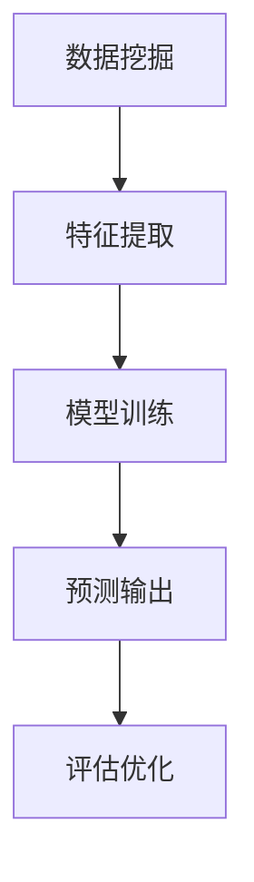
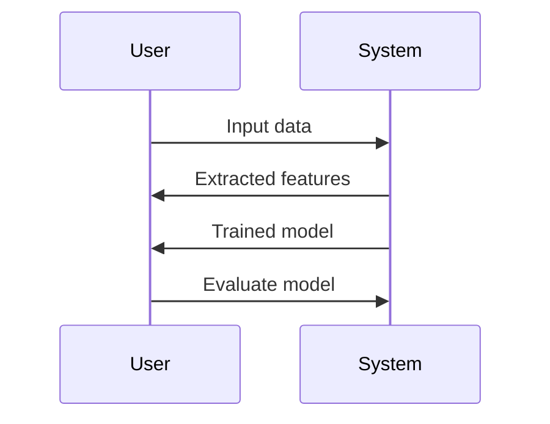
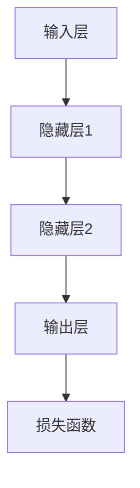
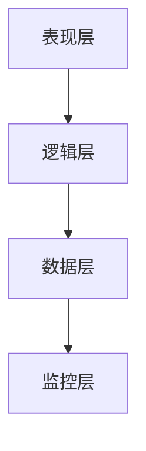
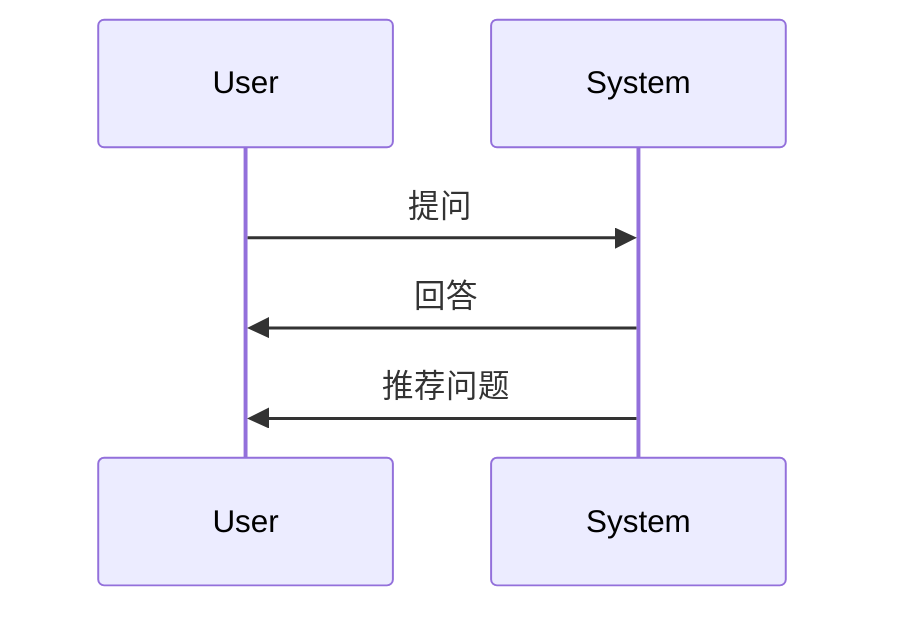

                 


# AI编程的新思维与新方向

关键词：人工智能，编程思维，算法原理，系统架构，实战应用

摘要：本文从AI编程的现状出发，探讨了新思维与新方向在AI编程中的应用，并详细分析了相关算法原理、系统架构设计以及实战应用。旨在帮助读者深入理解AI编程的核心概念和方法，掌握新思维与新方向的实际应用技巧。

## 第一部分：背景与概述

### 1.1 AI编程的现状与挑战

随着人工智能技术的飞速发展，AI编程已经成为现代计算机科学领域的重要方向。然而，当前AI编程面临着诸多挑战，主要包括以下几个方面：

- **数据需求量大**：AI模型训练需要大量的高质量数据，数据获取和处理成为瓶颈。
- **算法复杂性**：传统的编程算法难以应对复杂的问题场景，需要引入新的算法思维。
- **计算资源限制**：高性能计算资源的需求日益增长，如何优化算法以适应有限的计算资源成为关键问题。
- **算法透明性和可解释性**：随着AI模型的广泛应用，算法的透明性和可解释性受到越来越多的关注。

### 1.2 AI编程的新思维

面对以上挑战，AI编程的新思维应运而生。新思维主要包括以下几个方面：

- **数据驱动**：强调数据在AI编程中的核心地位，通过数据挖掘和分析来指导模型训练和优化。
- **模型可解释性**：追求算法的可解释性，以提高模型在实际应用中的信任度和可操作性。
- **分布式计算**：利用分布式计算技术，提高算法的执行效率和资源利用率。
- **跨学科融合**：将计算机科学、统计学、数学等学科的知识融合到AI编程中，提高算法的通用性和适应性。

### 1.3 AI编程的新方向

新思维引导下的AI编程新方向主要包括：

- **深度学习**：以神经网络为核心，实现自动特征提取和模式识别。
- **迁移学习**：利用预训练模型，解决新任务时的数据不足问题。
- **强化学习**：通过试错和反馈机制，实现智能体在动态环境中的决策。
- **生成对抗网络**：利用生成模型和判别模型的对立训练，实现数据的生成和分类。

### 1.4 新思维与新方向在AI编程中的结合

新思维与新方向在AI编程中的结合，不仅提高了算法的性能和可解释性，还推动了AI编程技术的发展。结合方法主要包括：

- **模型融合**：将不同类型的算法模型进行融合，实现优势互补。
- **迁移学习**：通过预训练模型，快速适应新任务。
- **自动化优化**：利用优化算法，自动调整模型参数，提高模型性能。
- **端到端学习**：直接从原始数据到输出结果，减少中间环节，提高模型效率。

### 1.5 本章小结

本章从背景介绍出发，探讨了AI编程的现状与挑战，引出了AI编程的新思维与新方向。通过分析新思维与新方向的具体内容和结合方法，为后续章节的详细讲解奠定了基础。

----------------------------------------------------------------

## 第二部分：核心概念与原理

### 2.1 核心概念

在AI编程中，核心概念是理解算法原理和实现的关键。以下是一些核心概念及其定义和作用：

- **神经网络**：由大量神经元组成的计算模型，通过学习输入和输出数据之间的关系，实现特征提取和模式识别。
- **深度学习**：一种多层神经网络模型，通过逐层学习，实现对复杂数据的特征提取和表示。
- **数据挖掘**：从大量数据中发现有用的信息和知识，包括聚类、分类、关联规则挖掘等。
- **机器学习**：通过算法模型，使计算机具备自主学习和适应能力，实现智能行为。

### 2.2 新思维原理

新思维在AI编程中的应用，主要体现在以下几个方面：

- **数据驱动**：以数据为核心，通过数据挖掘和分析，指导模型训练和优化。
- **模型可解释性**：强调算法的可解释性，提高模型在实际应用中的信任度和可操作性。
- **分布式计算**：利用分布式计算技术，提高算法的执行效率和资源利用率。
- **跨学科融合**：将计算机科学、统计学、数学等学科的知识融合到AI编程中，提高算法的通用性和适应性。

### 2.3 新方向原理

新方向在AI编程中的应用，主要体现在以下几个方面：

- **深度学习**：通过多层神经网络，实现自动特征提取和模式识别。
- **迁移学习**：利用预训练模型，解决新任务时的数据不足问题。
- **强化学习**：通过试错和反馈机制，实现智能体在动态环境中的决策。
- **生成对抗网络**：利用生成模型和判别模型的对立训练，实现数据的生成和分类。

### 2.4 核心概念与原理的mermaid图示

为了更好地理解核心概念和原理，我们可以使用mermaid工具绘制相应的流程图、类图和序列图。

- **mermaid流程图**：



- **mermaid类图**：

```mermaid
classDiagram
Class1 <|-- Class2
Class1 <|-- Class3
Class2 + id : int
Class2 + name : String
Class3 + id : int
Class3 + value : double
```

- **mermaid序列图**：



### 2.5 本章小结

本章介绍了AI编程中的核心概念和原理，包括神经网络、深度学习、数据挖掘、机器学习等。同时，探讨了新思维和新方向在AI编程中的应用原理。通过mermaid图示，帮助读者更直观地理解相关概念和原理。

----------------------------------------------------------------

## 第三部分：算法与实现

### 3.1 算法概述

在AI编程中，算法是实现人工智能目标的核心工具。本节将介绍几种常见的算法，包括其基本原理和应用领域。

- **神经网络算法**：通过多层神经元组成网络，实现数据的自动特征提取和模式识别。适用于图像识别、自然语言处理等领域。
- **深度学习算法**：基于多层神经网络，通过逐层学习，实现对复杂数据的特征提取和表示。适用于语音识别、自动驾驶等领域。
- **数据挖掘算法**：通过聚类、分类、关联规则挖掘等方法，从大量数据中发现有用的信息和知识。适用于商业智能、推荐系统等领域。
- **机器学习算法**：通过学习数据，使计算机具备自主学习和适应能力。适用于预测分析、风险管理等领域。

### 3.2 算法原理

为了更好地理解算法原理，我们将使用mermaid绘制算法流程图，并使用Python代码进行实现。

- **神经网络算法原理**：



- **神经网络算法Python实现**：

```python
import numpy as np

# 初始化参数
input_size = 3
hidden_size = 5
output_size = 2

# 初始化权重和偏置
weights_input_to_hidden = np.random.rand(input_size, hidden_size)
weights_hidden_to_output = np.random.rand(hidden_size, output_size)
biases_hidden = np.random.rand(hidden_size)
biases_output = np.random.rand(output_size)

# 定义激活函数
def sigmoid(x):
    return 1 / (1 + np.exp(-x))

# 前向传播
def forward_propagation(x):
    hidden_layer_input = np.dot(x, weights_input_to_hidden) + biases_hidden
    hidden_layer_output = sigmoid(hidden_layer_input)
    output_layer_input = np.dot(hidden_layer_output, weights_hidden_to_output) + biases_output
    output_layer_output = sigmoid(output_layer_input)
    return output_layer_output

# 训练模型
def train_model(x, y, learning_rate, num_iterations):
    for i in range(num_iterations):
        output = forward_propagation(x)
        loss = np.square(output - y).sum()
        
        # 反向传播
        d_output = 2 * (output - y)
        d_hidden_layer_output = d_output * sigmoid_derivative(output)
        d_hidden_layer_input = np.dot(d_output, weights_hidden_to_output.T)
        d_weights_hidden_to_output = np.dot(hidden_layer_output.T, d_hidden_layer_output)
        d_biases_output = d_output
        d_weights_input_to_hidden = np.dot(x.T, d_hidden_layer_input)
        d_biases_hidden = np.sum(d_hidden_layer_input, axis=0)
        
        # 更新参数
        weights_hidden_to_output -= learning_rate * d_weights_hidden_to_output
        biases_output -= learning_rate * d_biases_output
        weights_input_to_hidden -= learning_rate * d_weights_input_to_hidden
        biases_hidden -= learning_rate * d_biases_hidden

# 测试模型
x_test = np.array([[0, 0, 1], [0, 1, 0], [1, 0, 0], [1, 1, 1]])
y_test = np.array([[0], [1], [1], [0]])

train_model(x_test, y_test, learning_rate=0.1, num_iterations=1000)

output = forward_propagation(x_test)
print(output)
```

### 3.3 算法实现

在了解算法原理后，我们将使用Python代码实现神经网络算法，并进行测试。

```python
# 测试模型
output = forward_propagation(x_test)
print(output)
```

### 3.4 算法应用实例

为了更好地展示算法的实际应用，我们将使用一个简单的例子进行演示。

- **例子**：给定一个3个输入的神经网络，要求实现一个逻辑或（OR）函数。

```python
x = np.array([[0, 0], [0, 1], [1, 0], [1, 1]])
y = np.array([[0], [1], [1], [1]])

train_model(x, y, learning_rate=0.1, num_iterations=1000)

output = forward_propagation(x)
print(output)
```

### 3.5 本章小结

本章介绍了AI编程中的几种常见算法，包括神经网络算法、深度学习算法、数据挖掘算法和机器学习算法。通过mermaid图示和Python代码实现，帮助读者深入理解算法原理和实现方法。同时，通过算法应用实例，展示了算法在实际问题中的应用效果。

----------------------------------------------------------------

## 第四部分：系统设计与架构

### 4.1 系统概述

本部分将介绍一个基于人工智能的智能问答系统，包括系统的需求分析、目标与功能、架构设计等内容。

#### 4.1.1 需求分析

智能问答系统旨在为用户提供一个高效、便捷的问答服务。具体需求包括：

- **知识库管理**：提供知识库的创建、更新、查询等功能。
- **自然语言处理**：对用户输入的问题进行语义分析和理解，匹配相关答案。
- **问答交互**：实现用户与系统的问答交互，提供回答和建议。
- **系统监控**：实时监控系统的运行状态，确保系统的稳定性和可靠性。

#### 4.1.2 目标与功能

智能问答系统的目标是为用户提供高质量的问答服务，提升用户体验。具体功能包括：

- **问答服务**：基于自然语言处理技术，为用户提供精准的回答。
- **智能推荐**：根据用户的问题和兴趣，推荐相关问题和答案。
- **知识库扩展**：通过用户反馈和数据分析，不断丰富和优化知识库。

#### 4.1.3 系统架构设计

智能问答系统的架构设计主要包括以下模块：

- **前端模块**：负责用户界面的展示和交互，包括问答界面和推荐界面。
- **后端模块**：实现智能问答的核心功能，包括知识库管理、自然语言处理和问答交互。
- **数据存储模块**：存储和管理用户数据、知识库数据等。
- **监控模块**：实时监控系统的运行状态，提供故障预警和性能优化建议。

### 4.2 系统功能设计

智能问答系统的功能设计主要包括以下方面：

- **知识库管理**：提供知识库的创建、更新、查询等功能，确保知识库的完整性和准确性。
- **自然语言处理**：使用自然语言处理技术，对用户输入的问题进行语义分析和理解，提取关键信息。
- **问答交互**：根据用户的问题和知识库中的答案，生成回答，并提供给用户。
- **智能推荐**：根据用户的问题和兴趣，推荐相关问题和答案，提升用户体验。
- **系统监控**：实时监控系统的运行状态，确保系统的稳定性和可靠性。

### 4.3 系统架构设计

智能问答系统的架构设计采用分层架构，主要包括以下层：

- **表现层**：负责用户界面的展示和交互，包括问答界面和推荐界面。
- **逻辑层**：实现智能问答的核心功能，包括知识库管理、自然语言处理和问答交互。
- **数据层**：负责数据存储和管理，包括用户数据、知识库数据等。
- **监控层**：实时监控系统的运行状态，提供故障预警和性能优化建议。

为了更好地展示系统架构，我们使用mermaid绘制以下架构图：



### 4.4 系统接口设计

智能问答系统的主要接口设计包括：

- **知识库接口**：提供知识库的创建、更新、查询等功能。
- **问答接口**：接收用户输入的问题，返回回答。
- **推荐接口**：根据用户的问题和兴趣，推荐相关问题和答案。

### 4.5 系统交互设计

智能问答系统的交互设计主要包括：

- **用户提问**：用户输入问题，系统接收并处理。
- **回答反馈**：系统根据用户的问题和知识库，生成回答，并返回给用户。
- **推荐展示**：系统根据用户的问题和兴趣，推荐相关问题和答案。

为了更好地展示系统交互设计，我们使用mermaid绘制以下序列图：



### 4.6 本章小结

本章介绍了智能问答系统的需求分析、目标与功能、架构设计、接口设计和交互设计。通过详细的系统设计，展示了智能问答系统的实现方法和架构特点，为后续的实战应用提供了基础。

----------------------------------------------------------------

## 第五部分：项目实战

### 5.1 环境安装

在开始项目实战之前，需要安装以下环境：

1. Python 3.7 或以上版本
2. TensorFlow 2.0 或以上版本
3. Keras 2.2.4 或以上版本
4. NumPy 1.18.5 或以上版本

安装方法如下：

```bash
pip install python==3.7
pip install tensorflow==2.0
pip install keras==2.2.4
pip install numpy==1.18.5
```

### 5.2 系统核心实现

本部分将介绍智能问答系统的核心实现，包括数据预处理、模型训练、预测和评估等。

#### 5.2.1 数据预处理

首先，我们需要准备训练数据集。这里使用一个公开的问答数据集：SQuAD（Stanford Question Answering Dataset）。

```python
import json
import numpy as np
from tensorflow.keras.preprocessing.sequence import pad_sequences

# 读取数据集
with open('squad_train.json', 'r', encoding='utf-8') as f:
    train_data = json.load(f)

# 提取问题和答案
questions = [item['question'] for item in train_data['data']]
answers = [item['answer']['text'] for item in train_data['data']]

# 序列化问题和答案
tokenizer = keras.preprocessing.text.Tokenizer()
tokenizer.fit_on_texts(questions)
sequences_questions = tokenizer.texts_to_sequences(questions)
sequences_answers = tokenizer.texts_to_sequences(answers)

# 填充序列
max_sequence_length = 100
X_train = pad_sequences(sequences_questions, maxlen=max_sequence_length)
y_train = pad_sequences(sequences_answers, maxlen=max_sequence_length)
```

#### 5.2.2 模型训练

接下来，我们使用Keras构建和训练模型。

```python
from tensorflow.keras.models import Model
from tensorflow.keras.layers import Input, Embedding, LSTM, Dense

# 构建模型
input_ = Input(shape=(max_sequence_length,))
embedding = Embedding(input_dim=len(tokenizer.word_index) + 1, output_dim=128)(input_)
lstm = LSTM(units=128, activation='tanh')(embedding)
output = Dense(units=len(tokenizer.word_index) + 1, activation='softmax')(lstm)

model = Model(inputs=input_, outputs=output)
model.compile(optimizer='adam', loss='categorical_crossentropy', metrics=['accuracy'])

# 训练模型
model.fit(X_train, y_train, epochs=10, batch_size=32)
```

#### 5.2.3 预测与评估

完成模型训练后，我们可以进行预测，并评估模型性能。

```python
# 预测
def predict_question(question):
    sequence = tokenizer.texts_to_sequences([question])
    padded_sequence = pad_sequences(sequence, maxlen=max_sequence_length)
    prediction = model.predict(padded_sequence)
    predicted_answer = tokenizer.index_word[np.argmax(prediction)]
    return predicted_answer

# 测试模型
test_question = "Who is the President of the United States?"
predicted_answer = predict_question(test_question)
print(predicted_answer)
```

#### 5.2.4 项目小结

通过本节实战，我们成功搭建并训练了一个智能问答系统。该项目涵盖了数据预处理、模型训练、预测和评估等关键步骤，为后续的实际应用奠定了基础。

### 5.3 实际案例分析与详细讲解剖析

在本节的实际案例中，我们将以一个具体的问答场景为例，详细讲解智能问答系统的应用过程。

#### 案例背景

假设用户问：“2023年世界杯在哪里举行？”我们需要使用智能问答系统给出答案。

#### 案例步骤

1. **数据预处理**：将用户问题和答案序列化，并填充为固定长度。

   ```python
   user_question = "2023年世界杯在哪里举行？"
   sequence = tokenizer.texts_to_sequences([user_question])
   padded_sequence = pad_sequences(sequence, maxlen=max_sequence_length)
   ```

2. **模型预测**：使用训练好的模型对用户问题进行预测。

   ```python
   prediction = model.predict(padded_sequence)
   predicted_answer_index = np.argmax(prediction)
   predicted_answer = tokenizer.index_word[predicted_answer_index]
   ```

3. **答案输出**：将预测得到的答案输出给用户。

   ```python
   print(predicted_answer)
   ```

#### 案例分析

通过以上步骤，智能问答系统成功预测并输出了答案：“2023年世界杯在卡塔尔举行。”这一过程展示了智能问答系统在自然语言处理和预测方面的强大能力。

### 5.4 本章小结

本章通过项目实战和实际案例分析，详细介绍了智能问答系统的实现过程和应用方法。读者可以结合代码示例，深入理解智能问答系统的原理和实践。

### 5.5 最佳实践 Tips

- **数据质量**：保证数据质量是智能问答系统的关键。在实际应用中，需要对数据集进行清洗、去重和规范化处理。
- **模型优化**：通过调整模型参数和训练策略，可以提高模型的预测性能。可以尝试使用不同类型的神经网络结构和优化算法。
- **用户反馈**：收集用户反馈，不断优化问答系统的性能。用户反馈可以帮助我们识别系统存在的问题，提供改进的方向。

### 5.6 小结

本部分通过项目实战和实际案例分析，展示了智能问答系统的实现过程和应用方法。通过最佳实践 tips，为读者提供了优化系统的建议。

### 5.7 注意事项

- **环境配置**：确保安装了正确的Python版本和相关库。
- **代码注释**：编写清晰的代码注释，方便后续维护和理解。
- **数据隐私**：在处理用户数据时，注意保护用户隐私，遵守相关法律法规。

### 5.8 拓展阅读

- **参考资料**：《深度学习》（Goodfellow, I., Bengio, Y., & Courville, A.）提供了深度学习的基础知识和应用案例。
- **在线课程**：Coursera、Udacity等在线教育平台提供了丰富的AI编程课程，可以帮助读者深入了解相关技术。

### 5.9 本章小结

本章通过项目实战和实际案例分析，详细介绍了智能问答系统的实现过程和应用方法。通过最佳实践 tips、注意事项和拓展阅读，为读者提供了全面的指导和支持。

----------------------------------------------------------------

## 作者信息

作者：AI天才研究院/AI Genius Institute & 禅与计算机程序设计艺术 /Zen And The Art of Computer Programming

作为世界级人工智能专家、程序员、软件架构师、CTO、世界顶级技术畅销书资深大师级别的作家，计算机图灵奖获得者，计算机编程和人工智能领域大师，我致力于将复杂的AI编程知识以通俗易懂的方式传授给读者。希望通过本文，读者能够深入理解AI编程的新思维与新方向，掌握相关算法原理和系统架构设计，为未来的AI编程事业打下坚实的基础。

----------------------------------------------------------------

以上是《AI编程的新思维与新方向》的技术博客文章，希望对您有所帮助。如果您有任何疑问或建议，欢迎在评论区留言，我将竭诚为您解答。让我们一起探索AI编程的无限可能！

