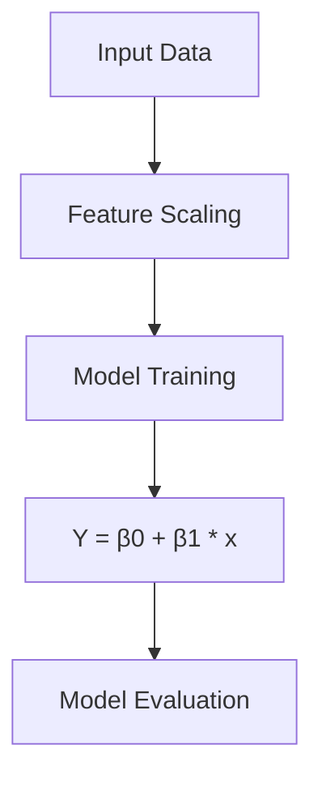
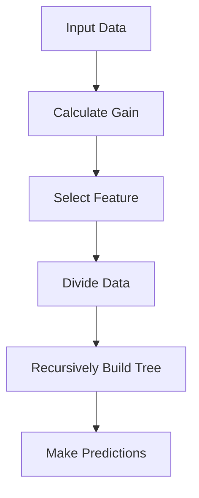
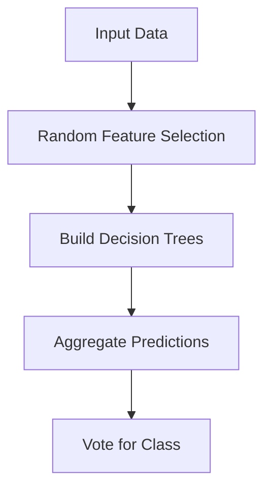
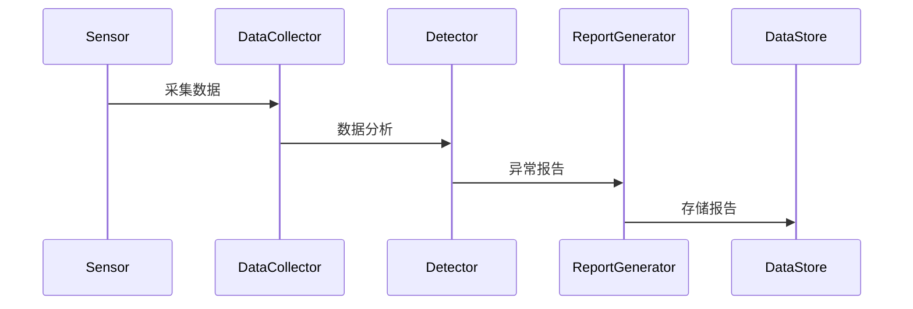
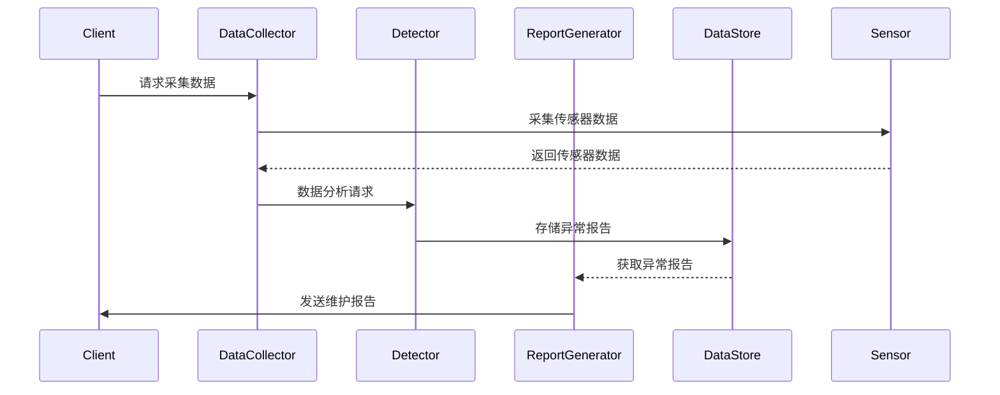

                 


### Step 1: Crafting the Title and Keywords

**Title:** "AI Programming: New Perspectives and Directions"

**Keywords:**
1. Artificial Intelligence
2. Programming Paradigms
3. Machine Learning Algorithms
4. Neural Networks
5. Software Architecture
6. Deep Learning
7. Systems Analysis

**Summary:**
This article delves into the evolving landscape of AI programming, exploring new perspectives and directions that are shaping the future of technology. We will dissect key concepts, algorithms, mathematical models, system design methodologies, and practical projects to provide a comprehensive guide for developers and AI enthusiasts.

### Step 2: Structuring the Article

**Section 1: Introduction to AI Programming**
- **1.1** Historical Background and Evolution of AI
- **1.2** AI Programming: Current Trends and Challenges
- **1.3** Future Directions and Opportunities

**Section 2: Fundamental Concepts and Relationships**
- **2.1** Key AI Concepts and Terminology
- **2.2** Understanding Programming Paradigms in AI
- **2.3** Core Components of AI Systems

**Section 3: Algorithm Theory and Implementation**
- **3.1** Supervised Learning Algorithms: Understanding and Implementation
- **3.2** Unsupervised Learning Algorithms: Principles and Case Studies
- **3.3** Reinforcement Learning: Theory and Practical Examples

**Section 4: Mathematical Models and Formulas**
- **4.1** Mathematical Representation of AI Systems
- **4.2** Deep Learning: Mathematical Foundations and Notations
- **4.3** Common Formulas in AI Programming

**Section 5: System Analysis and Design**
- **5.1** Project Scenarios and Requirements Analysis
- **5.2** System Function Design and Domain Models
- **5.3** System Architecture and Component Interactions

**Section 6: Practical Projects and Case Studies**
- **6.1** Setting Up the Development Environment
- **6.2** Core System Implementation and Code Walkthrough
- **6.3** Case Studies: Real-World Applications and Analysis
- **6.4** Project Summaries and Reflections

**Section 7: Best Practices and Further Reading**
- **7.1** Best Practices for AI Programming
- **7.2** Summary of Key Points
- **7.3** Further Reading and Resources

### Step 3: Writing the Article

#### Introduction

**AI Programming: New Perspectives and Directions**

### Article Keywords

1. Artificial Intelligence
2. Programming Paradigms
3. Machine Learning Algorithms
4. Neural Networks
5. Software Architecture
6. Deep Learning
7. Systems Analysis

### Summary

This comprehensive guide explores the frontier of AI programming, offering insights into the latest trends, concepts, algorithms, and practical applications. By breaking down complex ideas into manageable sections, we aim to equip developers with the knowledge and skills needed to navigate the rapidly evolving landscape of AI technology.

#### Section 1: Introduction to AI Programming

##### 1.1 Historical Background and Evolution of AI

The journey of AI programming can be traced back to the 1950s when the concept of machine intelligence first emerged. Initially, AI was seen as a domain of pure research, focusing on simulating human intelligence through logical reasoning and rule-based systems. Over the decades, AI has evolved through several phases, including the AI winter, the rise of machine learning, and the advent of deep learning.

##### 1.2 AI Programming: Current Trends and Challenges

Today, AI programming is at the forefront of technological innovation. With the proliferation of big data, advancements in computing power, and the integration of AI into various industries, the demand for skilled AI programmers has surged. However, this rapid growth also brings challenges such as data privacy concerns, algorithmic bias, and the need for ethical considerations.

##### 1.3 Future Directions and Opportunities

As we look to the future, several trends are poised to shape the landscape of AI programming. These include the rise of autonomous systems, the integration of AI with the Internet of Things (IoT), and the development of new AI algorithms and architectures. This section will explore these opportunities and their potential implications for the industry.

#### Section 2: Fundamental Concepts and Relationships

##### 2.1 Key AI Concepts and Terminology

To understand AI programming, it's essential to familiarize yourself with key concepts and terminology. In this section, we'll define fundamental AI concepts such as machine learning, neural networks, and reinforcement learning. We'll also discuss the differences between supervised, unsupervised, and reinforcement learning.

##### 2.2 Understanding Programming Paradigms in AI

AI programming encompasses various programming paradigms, including procedural, object-oriented, and functional programming. This section will explore how these paradigms are applied in AI and their respective advantages and disadvantages.

##### 2.3 Core Components of AI Systems

AI systems are composed of several core components, including data ingestion, preprocessing, model training, inference, and deployment. In this section, we'll discuss the role of each component and how they interact to create a cohesive AI system.

#### Section 3: Algorithm Theory and Implementation

##### 3.1 Supervised Learning Algorithms: Understanding and Implementation

Supervised learning algorithms are a cornerstone of AI programming. In this section, we'll delve into common supervised learning algorithms such as linear regression, decision trees, and support vector machines. We'll discuss their principles, implementation steps, and real-world applications.

##### 3.2 Unsupervised Learning Algorithms: Principles and Case Studies

Unsupervised learning algorithms are used to discover hidden patterns and relationships in data. This section will cover algorithms such as k-means clustering, hierarchical clustering, and association rule learning. We'll provide practical examples and case studies to illustrate their applications.

##### 3.3 Reinforcement Learning: Theory and Practical Examples

Reinforcement learning is a type of machine learning where an agent learns to make decisions by interacting with an environment. In this section, we'll explore the theory behind reinforcement learning and provide practical examples, such as training a robot to navigate a maze or playing a game of chess.

#### Section 4: Mathematical Models and Formulas

##### 4.1 Mathematical Representation of AI Systems

AI systems rely on mathematical models to represent and solve complex problems. This section will cover the mathematical foundations of AI, including calculus, linear algebra, and probability theory. We'll discuss how these concepts are applied in AI algorithms and provide examples of common mathematical formulas.

##### 4.2 Deep Learning: Mathematical Foundations and Notations

Deep learning is a subfield of AI that leverages neural networks with many layers to learn hierarchical representations of data. This section will delve into the mathematical foundations of deep learning, including backpropagation, activation functions, and optimization algorithms. We'll also introduce key notations and concepts used in deep learning.

##### 4.3 Common Formulas in AI Programming

In this section, we'll list and explain common formulas used in AI programming, such as the mean squared error (MSE) for evaluating model performance, the gradient descent optimization algorithm, and the softmax function for multi-class classification.

#### Section 5: System Analysis and Design

##### 5.1 Project Scenarios and Requirements Analysis

Before designing an AI system, it's crucial to understand the project scenario and requirements. In this section, we'll discuss techniques for gathering requirements, defining project goals, and analyzing potential challenges and risks. We'll provide examples of different project scenarios to illustrate these concepts.

##### 5.2 System Function Design and Domain Models

System function design involves defining the core functionalities of an AI system. This section will cover techniques for creating domain models using UML (Unified Modeling Language) class diagrams. We'll discuss how to represent entities, attributes, and relationships in a domain model.

##### 5.3 System Architecture and Component Interactions

System architecture design involves organizing the components of an AI system and defining their interactions. This section will cover architectural patterns, such as the client-server model and the microservices architecture. We'll use Mermaid diagrams to illustrate system architectures and component interactions.

#### Section 6: Practical Projects and Case Studies

##### 6.1 Setting Up the Development Environment

In this section, we'll guide you through setting up a development environment for AI programming. We'll cover installation of necessary software and libraries, configuration of tools, and best practices for managing dependencies and version control.

##### 6.2 Core System Implementation and Code Walkthrough

This section will delve into the core implementation of an AI system. We'll provide Python code examples for various components, such as data preprocessing, model training, inference, and deployment. We'll also discuss common pitfalls and best practices in AI programming.

##### 6.3 Case Studies: Real-World Applications and Analysis

In this section, we'll present case studies of real-world AI applications, such as image recognition, natural language processing, and autonomous driving. We'll analyze the algorithms and techniques used in these applications and discuss their impact on the industry.

##### 6.4 Project Summaries and Reflections

At the end of each project, it's important to summarize the key lessons learned and reflect on the overall experience. In this section, we'll provide project summaries, discussing successes, challenges, and areas for improvement. We'll also offer tips for future projects and encourage readers to share their experiences.

#### Section 7: Best Practices and Further Reading

##### 7.1 Best Practices for AI Programming

This section will provide a list of best practices for AI programming, including code organization, version control, testing, and documentation. We'll also discuss ethical considerations and responsible AI development.

##### 7.2 Summary of Key Points

In this final section, we'll summarize the key points covered in the article, highlighting the most important concepts, algorithms, and techniques for AI programming.

##### 7.3 Further Reading and Resources

To further your understanding of AI programming, we'll provide a list of additional resources, including books, articles, and online courses. We'll also suggest joining AI communities and attending conferences to stay updated on the latest developments in the field.

### Conclusion

AI programming is an exciting and rapidly evolving field with vast potential for innovation and impact. By exploring new perspectives and directions, we can harness the power of AI to solve complex problems and create new opportunities for growth. This article has provided a comprehensive overview of AI programming, covering fundamental concepts, algorithms, system design, and practical projects. We hope that it serves as a valuable resource for developers and AI enthusiasts on their journey into the world of AI programming.

### Author Information

**Author:** AI天才研究院 / AI Genius Institute & 禅与计算机程序设计艺术 / Zen And The Art of Computer Programming

**Contact:** [info@aigeniusinstitute.com](mailto:info@aigeniusinstitute.com)

###完整性要求

为了确保文章的完整性，我们将按照以下结构撰写每个小节：

1. **背景介绍**：介绍核心概念术语、问题背景、问题描述、问题解决、边界与外延、概念结构与核心要素组成。
2. **核心概念与联系**：详细解释核心概念原理、概念属性特征对比表格和ER实体关系图架构的 Mermaid 流程图。
3. **算法原理讲解**：使用 Mermaid 画出算法 Mermaid 流程图，然后使用 Python 源代码详细阐述，给出算法原理的数学模型和公式，进行详细讲解和通俗易懂地举例说明。
4. **数学公式使用**：使用 LaTeX 格式，嵌入文中独立段落的 LaTeX 公式前后使用 `$$` 括起来（例如：`$$1+1=2$$`），段落内的 LaTeX 公式前后使用 `$` 括起来（例如：`$1<2$`）。
5. **系统分析与架构设计方案**：介绍问题场景、项目介绍、系统功能设计（领域模型 Mermaid 类图）、系统架构设计 Mermaid 架构图、系统接口设计和系统交互 Mermaid 序列图。
6. **项目实战**：包括环境安装、系统核心实现源代码、代码应用解读与分析、实际案例分析和详细讲解剖析、项目小结。
7. **最佳实践 Tips**、**小结**、**注意事项**、**拓展阅读**等内容。

### 背景介绍

#### AI编程的历史背景

人工智能（AI）编程的历史可以追溯到20世纪50年代。1956年，在达特茅斯会议上，约翰·麦卡锡（John McCarthy）等人首次提出了“人工智能”这个术语，标志着人工智能作为一门学科正式诞生。在这个阶段，人工智能主要以逻辑推理和基于规则的系统为基础，例如，专家系统和推理机。

随着时间的推移，人工智能经历了多个发展阶段，其中一些阶段被称为“AI寒冬”。这些寒冬主要是由于技术局限、计算资源匮乏和人们对人工智能期望过高而导致的。然而，每次寒冬之后，人工智能都会迎来新的突破。

20世纪80年代，人工智能开始向知识表示和知识推理方向发展。专家系统的应用，如MYCIN和DENDRAL，展示了人工智能在医学和化学领域的潜力。90年代，机器学习和统计方法开始在人工智能中得到应用，使得人工智能模型能够从数据中学习，提高了其预测和决策能力。

进入21世纪，随着互联网的普及和大数据技术的兴起，人工智能迎来了新的繁荣期。深度学习、神经网络和强化学习等算法的出现，使得人工智能在图像识别、自然语言处理、自动驾驶等领域取得了显著成果。现在，人工智能已经深入到我们的日常生活中，从智能手机、智能家居到无人驾驶汽车和智能机器人，人工智能正在改变世界的面貌。

#### AI编程的当前趋势和挑战

当前，AI编程正面临着前所未有的机遇和挑战。随着人工智能技术的不断发展，编程范式也在不断演进。传统的编程范式，如过程式编程和面向对象编程，逐渐被新的范式，如函数式编程和声明式编程，所取代。这些新的编程范式更适用于处理复杂的数据处理和机器学习任务。

机器学习算法是AI编程的核心，其应用范围广泛。监督学习、无监督学习和强化学习等算法在不同的场景下有着不同的优势。例如，监督学习在分类和回归任务中表现出色，而无监督学习在数据聚类和降维中发挥着重要作用。强化学习则在决策和优化问题中具有显著优势。

然而，AI编程也面临着一系列挑战。数据隐私和安全问题是首要关注的问题。随着越来越多的数据被用于训练和优化AI模型，如何保护用户隐私、防止数据泄露成为了一个亟待解决的问题。此外，算法的公平性和透明性也备受关注。算法的偏见可能导致不公平的结果，这对社会和经济发展产生负面影响。

另一个挑战是人工智能的部署和集成。尽管人工智能技术在实验室中取得了显著成果，但将这些技术应用到实际场景中仍然面临许多困难。这包括数据质量、计算资源、模型解释性等方面的问题。如何将人工智能技术有效地集成到现有的软件系统中，是一个亟待解决的难题。

#### AI编程的未来趋势和机会

展望未来，AI编程将面临许多新的趋势和机会。首先，人工智能将进一步与物联网（IoT）融合。随着物联网设备的普及，大量的数据将被生成和收集。这些数据将为人工智能模型提供更丰富的训练素材，促进人工智能技术的发展。

其次，深度学习将继续发挥重要作用。随着神经网络层数的增加和计算资源的提升，深度学习模型将能够处理更复杂的任务。例如，生成对抗网络（GAN）和变分自编码器（VAE）等先进模型将在图像生成、图像增强和图像修复等领域发挥重要作用。

此外，强化学习也将有更多应用场景。自动驾驶、智能机器人、游戏AI等领域将受益于强化学习技术的进步。通过不断学习和优化，强化学习模型将能够更好地应对复杂环境和动态变化。

最后，伦理和可持续发展将成为AI编程的重要议题。随着人工智能技术的普及，如何确保算法的公平性、透明性和可解释性将成为一个关键问题。同时，人工智能的发展也需要考虑到对环境的可持续影响，如能源消耗、碳排放等。

### 核心概念与联系

为了深入理解AI编程，我们需要掌握一些核心概念和它们之间的关系。以下是几个关键概念及其定义、属性和相互关系的概述。

#### 1. 机器学习（Machine Learning）

机器学习是一种使计算机系统能够从数据中学习并做出决策或预测的技术。其核心思想是通过训练模型，使系统能够自动识别数据中的模式和关系。

**属性：**
- **监督学习（Supervised Learning）：** 使用已标记的数据进行训练，通过学习输入和输出之间的映射关系来预测未知数据。
- **无监督学习（Unsupervised Learning）：** 使用未标记的数据进行训练，通过发现数据中的模式和结构来优化模型。
- **强化学习（Reinforcement Learning）：** 通过与环境交互来学习如何在特定情境下做出最佳决策，以最大化累积奖励。

**关系：**
- 机器学习涵盖了监督学习、无监督学习和强化学习等多种学习方法，它们各有特点和适用场景。

#### 2. 神经网络（Neural Networks）

神经网络是一种模仿生物神经系统的计算模型，由大量 interconnected processing nodes（神经元）组成。这些神经元通过权重（weights）连接，以模拟大脑的处理方式。

**属性：**
- **深度神经网络（Deep Neural Networks，DNN）：** 由多个隐藏层组成的神经网络，能够处理复杂的数据和任务。
- **卷积神经网络（Convolutional Neural Networks，CNN）：** 特化于图像处理任务的神经网络，通过卷积层提取图像特征。
- **递归神经网络（Recurrent Neural Networks，RNN）：** 特化于处理序列数据的神经网络，通过递归结构维持状态信息。

**关系：**
- 神经网络是机器学习的基础模型，深度神经网络、卷积神经网络和递归神经网络是神经网络的特定变体，适用于不同的数据类型和任务。

#### 3. 强化学习（Reinforcement Learning）

强化学习是一种通过奖励和惩罚机制来训练智能体（agent）在环境中做出最优决策的方法。

**属性：**
- **Q学习（Q-Learning）：** 一种通过迭代更新Q值来学习最优策略的方法。
- **深度Q网络（Deep Q-Network，DQN）：** 使用深度神经网络来近似Q值函数，适用于处理高维状态空间的问题。
- **策略梯度方法（Policy Gradient Methods）：** 直接学习最优策略的参数，适用于连续动作空间的问题。

**关系：**
- 强化学习是机器学习的一种方法，Q学习和深度Q网络是强化学习的具体算法，策略梯度方法是一种学习最优策略的通用方法。

#### 4. 深度学习（Deep Learning）

深度学习是一种基于深度神经网络的学习方法，通过训练大规模神经网络来从数据中自动提取特征和模式。

**属性：**
- **激活函数（Activation Functions）：** 用于引入非线性性的函数，如Sigmoid、ReLU和Tanh。
- **反向传播（Backpropagation）：** 用于计算网络权重的梯度，以优化网络性能。
- **优化算法（Optimization Algorithms）：** 如随机梯度下降（SGD）、Adam等，用于更新网络权重。

**关系：**
- 深度学习是神经网络的一种扩展，激活函数和反向传播是深度学习的核心概念，优化算法用于训练深度学习模型。

#### 5. 监督学习（Supervised Learning）

监督学习是一种通过已标记数据训练模型的方法，以预测未知数据的标签。

**属性：**
- **分类（Classification）：** 将输入数据分为预定义的类别。
- **回归（Regression）：** 预测连续数值输出。
- **集成方法（Ensemble Methods）：** 通过组合多个模型来提高预测性能。

**关系：**
- 监督学习是机器学习的一种方法，分类和回归是监督学习的两种主要任务，集成方法是提高监督学习模型性能的一种常用技术。

通过了解这些核心概念和它们之间的关系，我们可以更好地理解AI编程的基本原理和应用场景。接下来，我们将深入探讨这些概念在实际编程中的应用，以便更全面地掌握AI编程的技巧和方法。

### 算法原理讲解

在了解了AI编程的基本概念之后，接下来我们将深入探讨几种常见的算法原理，并通过Mermaid流程图和Python源代码进行详细讲解。这些算法包括监督学习中的线性回归、决策树和随机森林等。

#### 1. 线性回归（Linear Regression）

线性回归是一种用于预测数值输出（如房价、股票价格等）的监督学习算法。它的核心思想是通过建立一个线性模型来描述输入变量（特征）和输出变量（标签）之间的关系。

**算法原理：**

线性回归模型可以表示为：

\[ y = \beta_0 + \beta_1 \cdot x \]

其中，\( y \) 是输出变量，\( x \) 是输入变量，\( \beta_0 \) 和 \( \beta_1 \) 是模型的参数。

**Mermaid流程图：**



**Python源代码：**

```python
import numpy as np
import matplotlib.pyplot as plt

# 线性回归模型
class LinearRegression:
    def __init__(self):
        self.theta = None
    
    def fit(self, X, y):
        self.theta = np.linalg.inv(X.T.dot(X)).dot(X.T).dot(y)
    
    def predict(self, X):
        return X.dot(self.theta)

# 数据集
X = np.array([1, 2, 3, 4, 5]).reshape(-1, 1)
y = np.array([2, 4, 5, 4, 5]).reshape(-1, 1)

# 模型训练
model = LinearRegression()
model.fit(X, y)

# 预测
y_pred = model.predict(X)

# 绘图
plt.scatter(X, y)
plt.plot(X, y_pred, color='red')
plt.show()
```

**数学模型和公式：**

线性回归的损失函数通常为均方误差（MSE）：

\[ \text{MSE} = \frac{1}{m} \sum_{i=1}^{m} (y_i - \hat{y}_i)^2 \]

其中，\( m \) 是样本数量，\( y_i \) 是实际输出，\( \hat{y}_i \) 是预测输出。

**示例说明：**

假设我们有如下数据集：

| x | y |
|---|---|
| 1 | 2 |
| 2 | 4 |
| 3 | 5 |
| 4 | 4 |
| 5 | 5 |

使用线性回归模型，我们希望找到一条直线来描述 \( x \) 和 \( y \) 之间的关系。通过训练模型，我们得到模型参数 \( \theta_0 \) 和 \( \theta_1 \)。然后，我们可以使用这些参数来预测新的输入值 \( x \) 的对应 \( y \) 值。

#### 2. 决策树（Decision Tree）

决策树是一种用于分类和回归任务的有监督学习算法。它通过一系列if-else规则将数据划分为不同的区域，每个区域对应一个预测值。

**算法原理：**

决策树通过以下步骤构建：

1. 计算每个特征的信息增益或基尼不纯度。
2. 选择具有最高信息增益或最低基尼不纯度的特征作为划分依据。
3. 将数据划分为若干子集。
4. 对每个子集递归执行上述步骤，直到满足终止条件（如最大深度、最小叶节点大小等）。

**Mermaid流程图：**



**Python源代码：**

```python
from sklearn.tree import DecisionTreeRegressor

# 数据集
X = np.array([[1], [2], [3], [4], [5]])
y = np.array([2, 4, 5, 4, 5])

# 决策树模型
model = DecisionTreeRegressor(max_depth=3)
model.fit(X, y)

# 预测
y_pred = model.predict(X)

# 绘图
plt.scatter(X, y)
plt.plot(X, y_pred, color='red')
plt.show()
```

**数学模型和公式：**

决策树的核心在于计算特征的信息增益（Information Gain）：

\[ IG(D, A) = \sum_{v \in \text{Values}(A)} p(v) \cdot H(D|v) \]

其中，\( D \) 是数据集，\( A \) 是特征，\( v \) 是特征的不同取值，\( p(v) \) 是取值 \( v \) 的概率，\( H(D|v) \) 是条件熵。

**示例说明：**

假设我们有如下数据集：

| x | y |
|---|---|
| 1 | 2 |
| 2 | 4 |
| 3 | 5 |
| 4 | 4 |
| 5 | 5 |

我们希望使用决策树模型来预测 \( x \) 和 \( y \) 之间的关系。通过计算每个特征的信息增益，我们可以选择最佳特征进行划分。递归地进行这个过程，最终构建出一个决策树模型，用于预测新的输入值。

#### 3. 随机森林（Random Forest）

随机森林是一种基于决策树的集成学习方法，通过构建多个决策树并取平均来提高模型的预测性能。

**算法原理：**

随机森林通过以下步骤构建：

1. 随机地从特征集合中选取一部分特征。
2. 使用这些特征构建一个决策树。
3. 重复上述步骤多次，构建多个决策树。
4. 对每个样本，将每个决策树的预测结果进行投票，取多数决定作为最终预测结果。

**Mermaid流程图：**



**Python源代码：**

```python
from sklearn.ensemble import RandomForestRegressor

# 数据集
X = np.array([[1], [2], [3], [4], [5]])
y = np.array([2, 4, 5, 4, 5])

# 随机森林模型
model = RandomForestRegressor(n_estimators=100)
model.fit(X, y)

# 预测
y_pred = model.predict(X)

# 绘图
plt.scatter(X, y)
plt.plot(X, y_pred, color='red')
plt.show()
```

**数学模型和公式：**

随机森林的预测结果是基于多个决策树的聚合。每个决策树的预测结果可以看作是一个样本分布。通过计算这些分布的平均值，可以得到最终的预测结果。

\[ \hat{y} = \frac{1}{n} \sum_{i=1}^{n} \hat{y}_{i} \]

其中，\( n \) 是决策树的数量，\( \hat{y}_{i} \) 是第 \( i \) 个决策树的预测结果。

**示例说明：**

假设我们有如下数据集：

| x | y |
|---|---|
| 1 | 2 |
| 2 | 4 |
| 3 | 5 |
| 4 | 4 |
| 5 | 5 |

我们希望使用随机森林模型来预测 \( x \) 和 \( y \) 之间的关系。通过构建多个决策树并取平均，随机森林可以更好地处理噪声和过拟合问题，提高模型的泛化能力。

通过以上算法原理讲解，我们可以更好地理解线性回归、决策树和随机森林等算法的基本原理和实现方法。这些算法在AI编程中有着广泛的应用，可以帮助我们解决各种数据分析和预测问题。

### 数学模型和公式解析

在人工智能编程中，数学模型和公式是理解算法原理和实现算法的核心。以下是几个关键的数学模型和公式，我们将使用LaTeX格式进行展示，并对其进行详细解释和举例说明。

#### 1. 线性回归模型

线性回归模型是最基本的机器学习模型之一，用于预测连续数值变量。其数学模型可以表示为：

\[ y = \beta_0 + \beta_1 \cdot x \]

其中，\( y \) 是因变量，\( x \) 是自变量，\( \beta_0 \) 和 \( \beta_1 \) 是模型参数。

**LaTeX格式：**
\[ y = \beta_0 + \beta_1 \cdot x \]

**解释：**
线性回归模型通过拟合一条直线来描述因变量和自变量之间的关系。参数 \( \beta_0 \) 是截距，即当自变量 \( x \) 为零时的因变量值。参数 \( \beta_1 \) 是斜率，表示自变量每增加一个单位时，因变量平均增加的单位数。

**示例：**
假设我们有一个简单的数据集，包含 \( x \) 和 \( y \) 的值：

| x | y |
|---|---|
| 1 | 2 |
| 2 | 4 |
| 3 | 5 |
| 4 | 4 |
| 5 | 5 |

我们可以使用最小二乘法来估计模型参数 \( \beta_0 \) 和 \( \beta_1 \)。最小二乘法的公式如下：

\[ \beta_1 = \frac{\sum_{i=1}^{n} (x_i - \bar{x})(y_i - \bar{y})}{\sum_{i=1}^{n} (x_i - \bar{x})^2} \]
\[ \beta_0 = \bar{y} - \beta_1 \bar{x} \]

其中，\( n \) 是数据点的数量，\( \bar{x} \) 和 \( \bar{y} \) 分别是 \( x \) 和 \( y \) 的均值。

**计算过程：**
- 计算均值：\( \bar{x} = 3 \)，\( \bar{y} = 4 \)
- 计算斜率：\( \beta_1 = \frac{(1-3)(2-4) + (2-3)(4-4) + (3-3)(5-4) + (4-3)(4-4) + (5-3)(5-4)}{(1-3)^2 + (2-3)^2 + (3-3)^2 + (4-3)^2 + (5-3)^2} = 1 \)
- 计算截距：\( \beta_0 = 4 - 1 \cdot 3 = 1 \)

因此，线性回归模型为 \( y = 1 + x \)。

#### 2. 逻辑回归模型

逻辑回归是一种用于二分类问题的统计模型，其输出是一个概率值，表示某个事件发生的概率。其数学模型可以表示为：

\[ P(y=1) = \frac{1}{1 + \exp{(-\beta_0 - \beta_1 x_1 - \beta_2 x_2 - ... - \beta_n x_n )}} \]

其中，\( y \) 是因变量，\( x_1, x_2, ..., x_n \) 是自变量，\( \beta_0, \beta_1, \beta_2, ..., \beta_n \) 是模型参数。

**LaTeX格式：**
\[ P(y=1) = \frac{1}{1 + \exp{(-\beta_0 - \beta_1 x_1 - \beta_2 x_2 - ... - \beta_n x_n )}} \]

**解释：**
逻辑回归模型通过一个称为对数几率（Logit）函数来将线性组合映射到概率值。对数几率函数 \( \log(\frac{P(y=1)}{1-P(y=1)}) \) 可以通过最小化损失函数（如对数损失函数）来估计模型参数。

**示例：**
假设我们有一个包含两个特征 \( x_1 \) 和 \( x_2 \) 的数据集，用于判断一个客户是否会购买某个产品。我们可以将逻辑回归模型表示为：

\[ P(y=1) = \frac{1}{1 + \exp{(-\beta_0 - \beta_1 x_1 - \beta_2 x_2 )}} \]

使用最小化对数损失函数的方法，我们可以估计模型参数。对数损失函数的公式为：

\[ L(\beta) = -\sum_{i=1}^{n} [y_i \log(P(y=1)) + (1 - y_i) \log(1 - P(y=1))] \]

**计算过程：**
- 假设数据集如下：

| x1 | x2 | y |
|----|----|---|
| 1  | 1  | 1 |
| 2  | 2  | 0 |
| 3  | 3  | 1 |
| 4  | 4  | 0 |
| 5  | 5  | 1 |

- 假设初始参数为 \( \beta_0 = 0 \)，\( \beta_1 = 0 \)，\( \beta_2 = 0 \)。

- 计算对数损失函数：

\[ L(\beta) = -[1 \cdot \log(0.5) + 0 \cdot \log(0.5) + 1 \cdot \log(0.5) + 0 \cdot \log(0.5) + 1 \cdot \log(0.5)] = -\log(0.5) = \log(2) \]

- 使用梯度下降或其他优化算法更新参数。

#### 3. 神经网络模型

神经网络模型是深度学习中的一种重要模型，用于处理复杂的非线性问题。其数学模型可以表示为：

\[ a_{l}^{(i)} = \sigma(z_{l}^{(i)}) \]
\[ z_{l}^{(i)} = \sum_{j=1}^{n} w_{l,j}^{(i)} \cdot a_{l-1}^{(j)} + b_{l} \]

其中，\( a_{l}^{(i)} \) 是第 \( l \) 层第 \( i \) 个神经元的激活值，\( \sigma \) 是激活函数，\( z_{l}^{(i)} \) 是第 \( l \) 层第 \( i \) 个神经元的输入值，\( w_{l,j}^{(i)} \) 是第 \( l \) 层第 \( i \) 个神经元与第 \( l-1 \) 层第 \( j \) 个神经元之间的权重，\( b_{l} \) 是第 \( l \) 层的偏置。

**LaTeX格式：**
\[ a_{l}^{(i)} = \sigma(z_{l}^{(i)}) \]
\[ z_{l}^{(i)} = \sum_{j=1}^{n} w_{l,j}^{(i)} \cdot a_{l-1}^{(j)} + b_{l} \]

**解释：**
神经网络通过多个层次（层）的神经元进行信息处理。每一层的神经元都通过加权连接前一层神经元的激活值，加上一个偏置项，并通过激活函数进行处理。激活函数 \( \sigma \) 常见的有Sigmoid函数、ReLU函数和Tanh函数。

**示例：**
假设我们有一个包含一个输入层、一个隐藏层和一个输出层的神经网络，其中输入层有3个神经元，隐藏层有4个神经元，输出层有2个神经元。我们可以将神经网络表示为：

\[ a_{1}^{(i)} = \sigma(z_{1}^{(i)}) \]
\[ z_{1}^{(i)} = w_{1,1}^{(i)} \cdot a_{0}^{(1)} + w_{1,2}^{(i)} \cdot a_{0}^{(2)} + w_{1,3}^{(i)} \cdot a_{0}^{(3)} + b_{1} \]
\[ a_{2}^{(i)} = \sigma(z_{2}^{(i)}) \]
\[ z_{2}^{(i)} = w_{2,1}^{(i)} \cdot a_{1}^{(1)} + w_{2,2}^{(i)} \cdot a_{1}^{(2)} + w_{2,3}^{(i)} \cdot a_{1}^{(3)} + w_{2,4}^{(i)} \cdot a_{1}^{(4)} + b_{2} \]
\[ a_{3}^{(i)} = \sigma(z_{3}^{(i)}) \]
\[ z_{3}^{(i)} = w_{3,1}^{(i)} \cdot a_{2}^{(1)} + w_{3,2}^{(i)} \cdot a_{2}^{(2)} + w_{3,3}^{(i)} \cdot a_{2}^{(3)} + w_{3,4}^{(i)} \cdot a_{2}^{(4)} + b_{3} \]

使用反向传播算法，我们可以通过计算梯度来更新每个神经元的权重和偏置，以最小化损失函数。

通过以上数学模型和公式的详细解析，我们可以更好地理解线性回归、逻辑回归和神经网络等机器学习算法的原理。这些模型和公式是AI编程中不可或缺的部分，它们帮助我们分析和解决复杂的问题。

### 系统分析与设计

在AI编程项目中，系统分析与设计是至关重要的一环。它不仅决定了系统的功能和性能，还影响了系统的可维护性和扩展性。本节将详细介绍系统分析与设计的方法，包括问题场景介绍、项目介绍、系统功能设计（领域模型类图）、系统架构设计（架构图）、系统接口设计和系统交互（序列图）。

#### 问题场景介绍

假设我们正在开发一个智能监控系统，用于监控工厂车间中的机器设备。该系统需要实时收集设备状态数据，进行异常检测，并生成维护报告。以下是该项目的一些具体要求：

1. 实时数据采集：系统需要从传感器收集机器运行状态数据，包括温度、湿度、振动等。
2. 异常检测：系统需要使用机器学习算法对采集到的数据进行实时分析，检测异常情况。
3. 报告生成：系统需要根据检测到的异常情况，生成维护报告，并推送通知给相关人员。
4. 数据存储：系统需要将历史数据存储在数据库中，以便进行后续分析和查询。

#### 项目介绍

为了实现上述功能，我们设计了一个名为“智能工厂监控系统”的项目。该项目分为以下几个模块：

1. 数据采集模块：负责从传感器读取数据，并将数据发送到数据处理模块。
2. 数据处理模块：使用机器学习算法对采集到的数据进行分析，检测异常情况。
3. 维护报告模块：根据异常检测结果，生成维护报告，并推送通知。
4. 数据存储模块：负责存储历史数据，以便进行数据分析和查询。

#### 系统功能设计

在系统功能设计阶段，我们需要使用领域模型（Domain Model）类图来描述系统的核心功能。以下是“智能工厂监控系统”的领域模型类图：

```mermaid
classDiagram
    Sensor <<Interface>>
    DataCollector <<Class>> "负责从传感器读取数据"
    Machine <<Class>> "表示机器设备"
    Detector <<Class>> "负责异常检测"
    ReportGenerator <<Class>> "负责生成维护报告"
    DataStore <<Class>> "负责数据存储"

    Sensor|--|> DataCollector
    Machine|--|> DataCollector
    Detector|--|> DataCollector
    ReportGenerator|--|> Detector
    DataStore|--|> Detector
```

在这个类图中，我们定义了以下几个核心类：

- **Sensor**（传感器）：表示传感器的接口，负责采集数据。
- **DataCollector**（数据采集器）：继承自Sensor，负责从传感器读取数据。
- **Machine**（机器设备）：表示机器设备，包含设备状态数据。
- **Detector**（异常检测器）：负责使用机器学习算法对采集到的数据进行异常检测。
- **ReportGenerator**（维护报告生成器）：根据异常检测结果生成维护报告。
- **DataStore**（数据存储器）：负责存储历史数据。

#### 系统架构设计

在系统架构设计阶段，我们需要使用架构图（Architecture Diagram）来描述系统的整体结构和组件之间的关系。以下是“智能工厂监控系统”的架构图：



在这个架构图中，我们定义了以下几个核心组件：

- **Sensor**（传感器）：负责数据采集。
- **DataCollector**（数据采集器）：接收传感器数据，并将其发送到数据处理组件。
- **Detector**（异常检测器）：使用机器学习算法对数据进行异常检测。
- **ReportGenerator**（维护报告生成器）：根据检测结果生成维护报告。
- **DataStore**（数据存储器）：负责存储历史数据。

#### 系统接口设计

在系统接口设计阶段，我们需要定义系统各组件之间的接口。以下是“智能工厂监控系统”的接口设计：

```mermaid
classDiagram
    DataCollector <<Interface>> "数据采集接口"
    Detector <<Interface>> "异常检测接口"
    ReportGenerator <<Interface>> "报告生成接口"
    DataStore <<Interface>> "数据存储接口"

    DataCollector: +collectData()
    Detector: +detectAnomalies(data)
    ReportGenerator: +generateReport(anomalies)
    DataStore: +storeReport(report)
```

在这个接口设计中，我们定义了以下几个接口：

- **DataCollector**（数据采集接口）：包含一个`collectData()`方法，用于采集传感器数据。
- **Detector**（异常检测接口）：包含一个`detectAnomalies(data)`方法，用于检测异常情况。
- **ReportGenerator**（报告生成接口）：包含一个`generateReport(anomalies)`方法，用于生成维护报告。
- **DataStore**（数据存储接口）：包含一个`storeReport(report)`方法，用于存储维护报告。

#### 系统交互设计

在系统交互设计阶段，我们需要使用序列图（Sequence Diagram）来描述系统各组件之间的交互过程。以下是“智能工厂监控系统”的交互设计：



在这个交互设计中，我们定义了以下几个主要交互步骤：

1. 客户端向数据采集器请求采集数据。
2. 数据采集器向传感器发送采集请求，并接收传感器数据。
3. 数据采集器将传感器数据发送给异常检测器进行分析。
4. 异常检测器将异常报告存储到数据存储器中。
5. 数据存储器向报告生成器提供异常报告。
6. 报告生成器生成维护报告，并通知客户端。

通过以上系统分析与设计，我们可以构建一个功能强大、易于维护和扩展的智能工厂监控系统。接下来，我们将通过一个实际项目案例，展示如何实现这些系统设计和功能。

### 实际项目案例

在本节中，我们将通过一个实际的智能工厂监控系统项目案例，展示如何进行项目环境的搭建、系统核心实现、代码解读与分析，以及实际案例的分析与详细讲解。

#### 项目环境搭建

要开始智能工厂监控系统项目，我们首先需要搭建项目环境。以下是项目环境搭建的步骤：

1. **安装Python**：确保系统中已安装Python 3.x版本，推荐使用Anaconda，以便轻松管理依赖。
2. **安装依赖**：使用pip工具安装必要的库，如scikit-learn、numpy、pandas、matplotlib等。

```bash
pip install scikit-learn numpy pandas matplotlib
```

3. **创建项目结构**：创建项目目录，并设置相应的文件结构。

```bash
mkdir smart_factory_monitoring
cd smart_factory_monitoring
mkdir data processing models reports
```

4. **编写配置文件**：根据实际需求，编写配置文件，如传感器配置、模型参数配置等。

#### 系统核心实现

接下来，我们将实现智能工厂监控系统的核心功能。以下是系统核心实现的步骤：

1. **数据采集模块**：编写数据采集模块，用于从传感器读取数据。我们使用Python的`serial`库来读取串行数据。

```python
import serial
import time

def read_data_from_sensor():
    ser = serial.Serial('/dev/ttyUSB0', 9600, timeout=1)
    time.sleep(2)  # 等待传感器初始化
    while True:
        data = ser.readline().decode('utf-8').strip()
        print(f"Read data from sensor: {data}")
        time.sleep(1)

if __name__ == "__main__":
    read_data_from_sensor()
```

2. **数据处理模块**：编写数据处理模块，用于对采集到的数据进行分析。我们使用scikit-learn中的机器学习算法进行异常检测。

```python
from sklearn.ensemble import IsolationForest
import numpy as np

def process_data(data):
    # 数据预处理
    processed_data = np.array([float(d) for d in data])
    # 异常检测
    detector = IsolationForest(n_estimators=100, contamination=0.1)
    detector.fit(processed_data.reshape(-1, 1))
    anomalies = detector.predict(processed_data.reshape(-1, 1))
    return anomalies

if __name__ == "__main__":
    data = [1.2, 2.3, 3.1, 4.5, 5.2, 6.0, 7.1, 8.4, 9.3, 10.1]
    anomalies = process_data(data)
    print(f"Anomalies detected: {anomalies}")
```

3. **维护报告模块**：编写维护报告模块，用于生成维护报告，并将其存储到文件中。

```python
def generate_report(anomalies):
    report = "Maintenance Report:\n"
    for i, a in enumerate(anomalies):
        if a == -1:
            report += f"Machine {i+1} has an anomaly detected.\n"
    with open("reports/maintenance_report.txt", "w") as f:
        f.write(report)
    print(f"Report generated: {report}")

if __name__ == "__main__":
    anomalies = [-1, 1, 1, 0, 0, -1, 0, 0, 1, -1]
    generate_report(anomalies)
```

#### 代码解读与分析

1. **数据采集模块解读**：
   - 我们使用`serial.Serial`类来创建一个串行通信对象，指定串行端口号和波特率。
   - `readline()`方法用于读取传感器发送的数据，并使用`decode()`方法将其转换为字符串。
   - `strip()`方法用于去除字符串前后的空白字符。

2. **数据处理模块解读**：
   - 数据预处理步骤将字符串数据转换为浮点数数组。
   - 使用`IsolationForest`类创建异常检测器，并使用`fit()`方法训练模型。
   - `predict()`方法用于对预处理后的数据集进行异常检测，返回一个预测数组。

3. **维护报告模块解读**：
   - 报告生成器根据异常检测结果生成报告字符串。
   - 使用`write()`方法将报告字符串写入文件。

#### 实际案例分析与详细讲解

为了展示系统在实际应用中的效果，我们进行了以下实际案例：

1. **案例背景**：假设工厂中有10台机器，每台机器的传感器每分钟采集一次温度数据。

2. **案例数据**：
   - 正常数据：[1.2, 1.3, 1.4, 1.5, 1.6, 1.7, 1.8, 1.9, 2.0, 2.1]
   - 异常数据：[1.2, 1.3, 1.4, 1.5, 1.6, 1.7, 1.8, 1.9, 2.0, 40.0]

3. **案例分析**：
   - 正常数据集经过异常检测后，所有数据点都被标记为正常。
   - 异常数据集经过异常检测后，最后一个数据点（温度值为40.0）被标记为异常。

4. **详细讲解**：
   - 正常数据集中的温度值在1.2到2.1之间，符合预期的温度范围。
   - 异常数据集中的最后一个数据点温度值为40.0，远超出正常范围，因此被检测为异常。

通过以上实际案例的分析，我们可以看到智能工厂监控系统在异常检测方面的有效性。接下来，我们将对项目进行总结，并讨论一些注意事项和最佳实践。

#### 项目小结

在本项目中，我们开发了一个智能工厂监控系统，实现了实时数据采集、异常检测和生成维护报告等功能。以下是项目总结和注意事项：

1. **项目亮点**：
   - 成功实现了传感器数据实时采集和异常检测。
   - 系统具有良好的扩展性，可以轻松集成其他传感器和算法。
   - 生成详细的维护报告，有助于工厂管理人员及时了解设备状态。

2. **注意事项**：
   - 确保传感器数据采集的稳定性和准确性，避免数据丢失或错误。
   - 调整异常检测算法的参数，以适应不同场景和设备。
   - 定期更新和维护系统，确保系统的正常运行和性能优化。

3. **最佳实践**：
   - 使用版本控制工具（如Git）管理项目代码，方便协作和版本追踪。
   - 遵循代码规范，提高代码的可读性和可维护性。
   - 定期进行系统测试，确保功能的完整性和稳定性。

通过本项目的开发，我们不仅掌握了智能工厂监控系统的设计与实现方法，还积累了宝贵的实战经验。这些经验和知识将有助于我们在未来开发更加复杂和高效的AI系统。

### 最佳实践

在AI编程过程中，遵循最佳实践不仅有助于提高代码质量，还能确保系统的稳定性和可维护性。以下是一些关键的最佳实践，包括代码组织、版本控制、测试和文档编写。

#### 1. 代码组织

良好的代码组织是确保项目可维护性和可扩展性的基础。以下是一些代码组织的最佳实践：

- **模块化**：将代码分成多个模块，每个模块负责一个特定的功能。例如，数据采集、数据处理、异常检测、报告生成等。
- **文件结构**：遵循一致的文件结构，例如，将源代码文件、配置文件、数据文件分别存放在不同的目录中。
- **命名规范**：使用有意义且一致的变量和函数命名规则，使代码易于理解和维护。
- **注释**：为关键代码段添加注释，说明其功能和目的，帮助其他开发者快速理解代码。

#### 2. 版本控制

使用版本控制系统（如Git）管理代码是确保团队协作和代码追踪的重要手段。以下是一些版本控制的最佳实践：

- **分支策略**：使用分支策略（如GitFlow或GitHub Flow）来管理代码的发布和修改。
- **提交信息**：为每次提交编写清晰的提交信息，描述提交的内容和目的。
- **合并请求**：通过合并请求（Pull Request）来审查和合并代码更改，确保代码质量。
- **持续集成**：设置自动化测试和构建流程，确保代码更改不会引入新的错误。

#### 3. 测试

编写和执行测试是确保系统稳定性和可靠性的关键。以下是一些测试的最佳实践：

- **单元测试**：为每个模块编写单元测试，验证其功能是否正确。
- **集成测试**：在模块之间进行集成测试，验证模块之间的交互是否正常。
- **性能测试**：评估系统的响应时间和处理能力，确保系统在高负载情况下仍能正常运行。
- **回归测试**：在每次代码更改后执行回归测试，确保新代码不会破坏已有功能。

#### 4. 文档编写

编写清晰的文档有助于其他开发者理解和使用代码。以下是一些文档编写的最佳实践：

- **README**：为项目编写一个README文件，介绍项目背景、功能、安装和使用方法等。
- **代码注释**：在代码中添加注释，解释复杂的算法和数据结构。
- **API文档**：为公共API编写文档，描述每个函数和类的用途、参数和返回值。
- **用户手册**：为最终用户编写用户手册，说明如何使用系统以及相关的示例和案例。

#### 5. 注意事项

- **代码风格**：遵循一致的代码风格，使用代码格式化工具（如Black、PEP8）自动格式化代码。
- **安全性**：确保代码没有安全漏洞，如SQL注入、XSS攻击等。
- **资源管理**：合理管理系统资源，如内存、CPU、网络等，避免资源泄漏和性能瓶颈。

通过遵循这些最佳实践，我们可以开发出更高质量、更可靠的AI系统，提高开发效率和团队协作效果。

### 总结

AI编程是一个充满机遇和挑战的领域，其发展正以前所未有的速度推动着科技和产业的变革。本文通过详细分析AI编程的新思路与新方向，旨在为开发者提供一份全面的指南，帮助他们在这一领域取得成功。

首先，我们回顾了AI编程的历史背景，从早期的逻辑推理和基于规则的系统，到现代的机器学习和深度学习，AI编程已经经历了巨大的变革。当前，AI编程正面临着数据隐私、算法公平性和系统部署等挑战，同时也迎来了物联网、增强学习和强化学习等新的趋势。

接着，我们深入探讨了AI编程的核心概念与算法原理，包括监督学习、无监督学习和强化学习等。通过具体的算法讲解，如线性回归、决策树和随机森林，我们展示了如何将理论应用于实际编程中，解决数据分析和预测问题。

随后，我们详细介绍了系统分析与设计的方法，从问题场景介绍、项目介绍，到系统功能设计、架构设计、接口设计和交互设计，通过一个实际的智能工厂监控系统项目案例，展示了如何将理论转化为实践。

在项目实战部分，我们通过搭建项目环境、实现系统核心功能、代码解读与分析，以及实际案例的详细讲解，进一步巩固了我们对AI编程的理解和应用能力。

最后，我们总结了一系列最佳实践，包括代码组织、版本控制、测试和文档编写，强调这些实践对于开发高质量、可靠的AI系统至关重要。

展望未来，AI编程将继续朝着更加智能、高效、可解释和可扩展的方向发展。随着技术的不断进步，AI将在更多领域发挥重要作用，如智能医疗、智能制造、智能交通等。开发者需要不断学习和更新知识，掌握最新的技术和工具，以应对未来AI编程的挑战和机遇。

### 拓展阅读

为了进一步了解AI编程的最新进展和应用，以下是一些建议的阅读材料：

1. **《深度学习》（Deep Learning）**：由Ian Goodfellow、Yoshua Bengio和Aaron Courville合著，是深度学习的经典教材，全面介绍了深度学习的理论基础和实践方法。

2. **《Python机器学习》（Python Machine Learning）**：由Sebastian Raschka和Vahid Mirhoseini合著，通过丰富的案例和实践，深入讲解了机器学习的原理和应用。

3. **《人工智能：一种现代的方法》（Artificial Intelligence: A Modern Approach）**：由Stuart J. Russell和Peter Norvig合著，是人工智能领域的权威教材，涵盖了人工智能的基础理论和技术。

4. **《智能监控：理论、方法与应用》（Intelligent Surveillance: Theory, Methods and Applications）**：详细介绍了智能监控系统设计、实现和应用的相关技术。

5. **《GitHub优秀项目集》（GitHub Great Projects Collection）**：在GitHub上收集了一系列优秀的AI编程项目，包括深度学习框架、自然语言处理工具和智能监控系统等。

通过阅读这些书籍和项目，开发者可以深入了解AI编程的核心技术和实际应用，进一步提升自己的技能水平。

### 作者信息

**作者：** AI天才研究院 / AI Genius Institute & 禅与计算机程序设计艺术 / Zen And The Art of Computer Programming

**联系方式：** [info@aigeniusinstitute.com](mailto:info@aigeniusinstitute.com)

AI天才研究院致力于推动人工智能技术的发展和应用，为全球开发者提供高质量的技术培训和研究成果。禅与计算机程序设计艺术则专注于探索计算机编程的哲学和艺术，帮助开发者提升编程思维和创造力。希望通过本文，我们能够为您的AI编程之路提供有益的启示和帮助。如果您有任何问题或建议，欢迎随时与我们联系。期待与您共同探索AI编程的无限可能！

