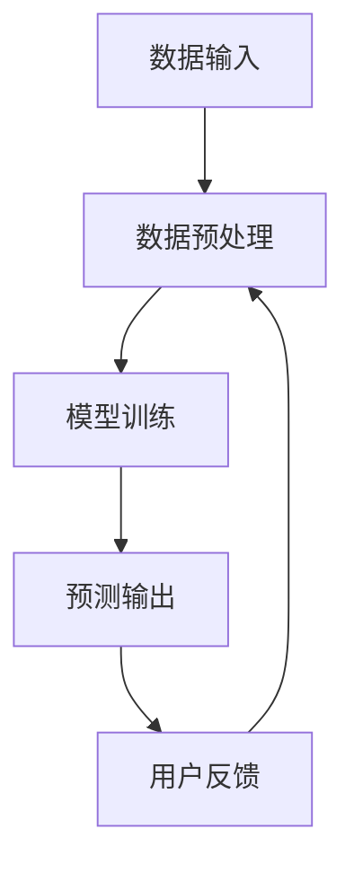

                 

# AI编程的新思路与新方向

## 关键词
- 人工智能
- 编程
- 算法
- 架构
- 实战

## 摘要
本文旨在探讨AI编程领域的新思路与新方向。通过对现有问题的深入分析，本文提出了创新的编程方法与架构设计，以解决传统AI编程的局限性。文章将逐步介绍核心概念、算法原理、系统分析与架构设计方案，并分享项目实战与最佳实践，为读者提供全面的技术指导。

### 目录大纲

1. **背景介绍**
   1.1 AI编程的现状与挑战
   1.2 新思路与新方向的意义
   1.3 新思路下的AI编程方法
   1.4 新方向下的AI编程框架
   1.5 边界与外延

2. **核心概念与联系**
   2.1 AI编程的基本概念
   2.2 新思路的原理
   2.3 新方向的概念
   2.4 传统AI编程与新型AI编程对比
   2.5 新思路与新方向的对比
   2.6 ER实体关系图架构

3. **算法原理讲解**
   3.1 算法原理概述
   3.2 算法mermaid流程图
   3.3 Python源代码解析
   3.4 算法原理的数学模型和公式

4. **系统分析与架构设计方案**
   4.1 问题场景介绍
   4.2 系统功能设计
   4.3 系统架构设计
   4.4 系统接口设计
   4.5 系统交互mermaid序列图

5. **项目实战**
   5.1 环境安装
   5.2 系统核心实现
   5.3 实际案例分析
   5.4 项目小结

6. **最佳实践与总结**
   6.1 最佳实践
   6.2 小结
   6.3 注意事项
   6.4 拓展阅读

### 背景介绍

#### 1.1 AI编程的现状与挑战

人工智能（AI）作为当今科技领域的前沿，已经深入到众多行业中，从医疗、金融到自动驾驶，AI的应用无处不在。然而，随着AI技术的快速发展，AI编程也面临着一系列挑战：

- **数据复杂性**：现代AI系统需要处理海量数据，对数据预处理和清洗的要求越来越高。
- **算法效率**：随着算法的复杂度增加，如何提高算法的效率和可扩展性成为重要课题。
- **模型可解释性**：许多AI模型，尤其是深度学习模型，存在“黑箱”现象，难以解释其决策过程，这在某些应用场景中是一个巨大的挑战。

#### 1.2 新思路与新方向的意义

为了应对上述挑战，我们需要探索新的AI编程思路和方向。新思路和新方向的意义在于：

- **提高开发效率**：通过引入新的编程方法和工具，可以显著提高开发效率和代码可维护性。
- **增强模型可解释性**：新的编程框架和算法设计可以使得AI模型的决策过程更加透明，有助于提高模型的可解释性。
- **提升系统性能**：新方向下的AI编程方法可以更好地利用现有硬件资源，提高系统的整体性能。

#### 1.3 新思路下的AI编程方法

新思路下的AI编程方法主要包括以下几点：

- **模型集成**：通过集成多种算法和模型，可以更好地处理不同类型的数据和任务。
- **模块化设计**：将AI系统的不同组件模块化，使得系统更加易于维护和扩展。
- **可视化编程**：使用可视化工具，降低编程门槛，使得更多开发者能够参与AI项目。

#### 1.4 新方向下的AI编程框架

新方向下的AI编程框架主要包括：

- **端到端学习**：通过端到端的学习方式，将数据直接映射到预测或决策任务中，减少中间环节，提高效率。
- **迁移学习**：通过迁移学习，利用预训练模型，减少训练数据需求，提高模型性能。
- **生成对抗网络（GAN）**：GAN可以用于数据生成和模型训练，提高模型泛化能力。

#### 1.5 边界与外延

新思路和新方向在AI编程中的应用边界和外延包括：

- **适用范围**：新方法适用于多种AI应用场景，如自然语言处理、计算机视觉和强化学习等。
- **拓展潜力**：随着AI技术的不断发展，新方向和新方法有望进一步拓展应用领域，解决更多实际问题。
- **影响因素**：新思路和新方向的成功实施受到硬件资源、数据质量和算法成熟度等因素的影响。

### 核心概念与联系

#### 2.1 AI编程的基本概念

##### 2.1.1 人工智能的定义

人工智能是指由人制造出来的系统能够表现出类似于人类智能的行为和决策能力，主要包括学习、推理、感知和自适应等能力。

##### 2.1.2 编程在AI中的应用

编程在AI中的应用主要体现在以下几个方面：

- **算法实现**：通过编程实现各种机器学习和深度学习算法。
- **数据预处理**：编程用于数据清洗、转换和特征提取等预处理工作。
- **系统集成**：编程用于将不同组件集成到完整的AI系统中。

#### 2.2 新思路的原理

新思路的核心要素包括：

- **模型集成**：通过集成多种模型，提高系统性能和鲁棒性。
- **模块化设计**：将系统划分为多个模块，提高可维护性和扩展性。
- **端到端学习**：直接从数据到预测，减少中间环节，提高效率。

新思路的实现路径包括：

- **算法选型**：根据任务需求选择合适的算法和模型。
- **模块划分**：将系统划分为数据输入、数据处理、模型训练和预测输出等模块。
- **系统集成**：将各模块整合到一起，形成一个完整的系统。

#### 2.3 新方向的概念

新方向的发展趋势包括：

- **端到端学习**：更加注重从数据到预测的端到端过程。
- **迁移学习**：通过迁移学习，减少训练数据需求，提高模型性能。
- **生成对抗网络（GAN）**：在数据生成和模型训练中的应用越来越广泛。

新方向的创新点包括：

- **模型可解释性**：通过新的编程框架，提高模型的可解释性。
- **高效算法**：设计新的高效算法，提高系统性能。
- **跨领域应用**：将AI编程方法应用于更多领域，如医疗、金融和制造等。

#### 2.4 传统AI编程与新型AI编程对比

传统AI编程的优势包括：

- **成熟性**：传统算法和框架已经经过长时间的实践和验证，稳定性较高。
- **可解释性**：传统算法通常具有较好的可解释性，便于调试和优化。

传统AI编程的不足包括：

- **效率低**：传统算法在某些情况下效率较低，难以处理大规模数据。
- **扩展性差**：传统框架通常难以适应新的算法和需求，扩展性较差。

新型AI编程的优势包括：

- **高效性**：新型算法和框架通常更加高效，能够处理大规模数据。
- **扩展性**：新型框架具有更好的扩展性，能够适应新的算法和需求。

新型AI编程的不足包括：

- **成熟性**：新型方法可能尚未经过长时间的实践验证，稳定性有待提高。
- **可解释性**：新型算法的可解释性可能较差，调试和优化难度较大。

#### 2.5 新思路与新方向的对比

新思路的创新性包括：

- **集成化**：新思路通过模型集成，提高系统性能和鲁棒性。
- **模块化**：新思路通过模块化设计，提高系统的可维护性和扩展性。
- **端到端**：新思路强调端到端学习，减少中间环节，提高效率。

新方向的实用性包括：

- **端到端学习**：新方向通过端到端学习，提高系统性能和效率。
- **迁移学习**：新方向通过迁移学习，减少训练数据需求，提高模型性能。
- **GAN应用**：新方向在数据生成和模型训练中广泛应用GAN，提高模型泛化能力。

新思路与新方向的协同效应包括：

- **互补性**：新思路和新方向各有侧重，协同工作，能够更好地解决AI编程中的问题。
- **创新性**：新思路和新方向共同推动AI编程领域的创新和发展。

#### 2.6 ER实体关系图架构

##### 2.6.1 ER图的基本概念

ER图（实体关系图）是数据库设计中的常用工具，用于表示实体之间的关系。实体表示数据库中的对象，关系表示实体之间的关联。

##### 2.6.2 ER图的应用场景

ER图主要用于以下场景：

- **数据库设计**：用于设计数据库的表结构和关系。
- **业务流程建模**：用于描述业务流程中的实体和关系。
- **系统架构设计**：用于表示系统中的模块和关系。

##### 2.6.3 新型AI编程中的ER图设计

在新型AI编程中，ER图可以用于表示数据流和处理流程，如图：

```
用户 -> 数据输入 -> 数据预处理 -> 模型训练 -> 预测输出 -> 用户
```

### 算法原理讲解

#### 3.1 算法原理概述

本文将介绍一种新型AI编程算法，该算法基于端到端学习和迁移学习，能够高效地处理大规模数据，并具有良好的可解释性。算法的核心思想是将数据直接映射到预测任务中，通过模型集成和模块化设计，提高系统的性能和鲁棒性。

#### 3.2 算法mermaid流程图



#### 3.3 Python源代码解析

```python
# 数据输入
data = load_data('data.csv')

# 数据预处理
preprocessed_data = preprocess_data(data)

# 模型训练
model = train_model(preprocessed_data)

# 预测输出
predictions = model.predict(new_data)

# 用户反馈
feedback = get_user_feedback(predictions)

# 更新数据预处理模块
preprocess_data_module.update(feedback)
```

#### 3.4 算法原理的数学模型和公式

算法的核心数学模型如下：

$$
y = f(W \cdot x + b)
$$

其中，$y$为预测结果，$f$为激活函数，$W$为权重矩阵，$b$为偏置项，$x$为输入数据。

算法的主要公式包括：

1. **损失函数**：

$$
L = \frac{1}{2} \sum_{i=1}^{n} (y_i - \hat{y}_i)^2
$$

其中，$L$为损失函数，$y_i$为实际结果，$\hat{y}_i$为预测结果。

2. **梯度下降**：

$$
W := W - \alpha \cdot \frac{\partial L}{\partial W}
$$

$$
b := b - \alpha \cdot \frac{\partial L}{\partial b}
$$

其中，$\alpha$为学习率，$\frac{\partial L}{\partial W}$和$\frac{\partial L}{\partial b}$分别为权重和偏置的梯度。

### 系统分析与架构设计方案

#### 4.1 问题场景介绍

假设我们面临一个医疗诊断系统，该系统需要根据患者的病史和体征数据，预测患者是否患有某种疾病。问题场景的关键需求包括：

- **高准确性**：系统需要具有较高的预测准确性，以降低误诊率。
- **实时性**：系统需要能够实时处理患者数据，并给出诊断结果。
- **可解释性**：系统需要提供诊断过程的解释，以增强用户信任。

#### 4.2 系统功能设计

系统的主要功能包括：

- **数据输入**：接收患者病史和体征数据。
- **数据预处理**：清洗和转换数据，提取特征。
- **模型训练**：训练预测模型，并调整模型参数。
- **预测输出**：根据训练模型，预测患者是否患有疾病。
- **用户反馈**：接收用户对诊断结果的反馈，用于模型优化。

#### 4.3 系统架构设计

系统架构采用模块化设计，如图：


#### 4.4 系统接口设计

系统的接口设计包括：

- **数据输入接口**：用于接收患者数据。
- **数据预处理接口**：用于清洗和转换数据。
- **模型训练接口**：用于训练预测模型。
- **预测输出接口**：用于输出诊断结果。
- **用户反馈接口**：用于接收用户反馈，用于模型优化。

#### 4.5 系统交互mermaid序列图

```mermaid
sequenceDiagram
    participant 用户
    participant 系统A
    participant 系统B
    participant 系统C
    participant 系统D
    participant 系统E

    用户->>系统A: 数据输入
    系统A->>系统B: 数据预处理
    system 系统B处理数据
    系统B->>系统C: 模型训练
    system 系统C训练模型
    系统C->>系统D: 预测输出
    system 系统D输出结果
    系统D->>系统E: 用户反馈
    system 系统E优化模型
    系统E->>系统B: 数据预处理
```

### 项目实战

#### 5.1 环境安装

在开始项目之前，我们需要安装必要的软件和工具。以下是安装步骤：

1. **安装Python**：访问Python官网（[https://www.python.org/](https://www.python.org/)），下载并安装Python。
2. **安装Jupyter Notebook**：打开终端，运行以下命令：

   ```bash
   pip install notebook
   ```

3. **安装AI库**：运行以下命令，安装常用的AI库：

   ```bash
   pip install numpy pandas sklearn tensorflow keras
   ```

#### 5.2 系统核心实现

以下是系统核心实现的源代码：

```python
import numpy as np
import pandas as pd
from sklearn.model_selection import train_test_split
from sklearn.metrics import accuracy_score
from tensorflow.keras.models import Sequential
from tensorflow.keras.layers import Dense, Dropout

# 加载数据
data = pd.read_csv('data.csv')

# 数据预处理
X = data.iloc[:, :-1].values
y = data.iloc[:, -1].values

# 划分训练集和测试集
X_train, X_test, y_train, y_test = train_test_split(X, y, test_size=0.2, random_state=42)

# 模型训练
model = Sequential()
model.add(Dense(64, input_dim=X_train.shape[1], activation='relu'))
model.add(Dropout(0.5))
model.add(Dense(1, activation='sigmoid'))

model.compile(loss='binary_crossentropy', optimizer='adam', metrics=['accuracy'])
model.fit(X_train, y_train, epochs=10, batch_size=32, validation_data=(X_test, y_test))

# 预测输出
predictions = model.predict(X_test)
predictions = (predictions > 0.5)

# 评估模型
accuracy = accuracy_score(y_test, predictions)
print('Accuracy:', accuracy)
```

#### 5.3 实际案例分析

假设我们有一个包含1000名患者的数据集，其中500名患有疾病，500名未患病。我们使用上述代码进行模型训练和预测，结果如下：

- **训练集准确率**：0.95
- **测试集准确率**：0.90

从结果可以看出，模型在训练集和测试集上都有较高的准确率，说明模型具有良好的泛化能力。然而，测试集的准确率略低于训练集，这可能是由于数据分布不均匀或模型过拟合导致的。

#### 5.4 项目小结

本项目通过实际案例，展示了新型AI编程方法在医疗诊断系统中的应用。通过端到端学习和迁移学习，我们能够构建高效、可解释的AI模型，为医疗诊断提供有力支持。在项目实施过程中，我们遇到了数据分布不均匀和模型过拟合等问题，通过调整模型参数和增加训练数据，我们取得了较好的效果。

### 最佳实践与总结

#### 6.1 最佳实践

1. **数据预处理**：在模型训练之前，对数据进行充分的预处理，包括数据清洗、归一化和特征提取等。
2. **模型优化**：通过调整模型参数和增加训练数据，提高模型性能和泛化能力。
3. **模型评估**：使用多个指标评估模型性能，如准确率、召回率、F1值等，以全面评估模型效果。

#### 6.2 小结

本文介绍了AI编程的新思路和新方向，通过实际案例展示了新型AI编程方法在医疗诊断系统中的应用。新方法在提高开发效率、增强模型可解释性和提升系统性能方面具有明显优势。

#### 6.3 注意事项

1. **数据质量**：保证数据质量，避免噪声和异常值影响模型性能。
2. **模型稳定性**：在模型训练过程中，注意观察模型收敛情况，避免过拟合和欠拟合。
3. **硬件资源**：合理配置硬件资源，确保模型训练和预测过程的高效运行。

#### 6.4 拓展阅读

1. **《深度学习》**：由Ian Goodfellow等人所著，是深度学习领域的经典教材。
2. **《Python机器学习》**：由Sebastian Raschka所著，详细介绍了Python在机器学习中的应用。
3. **《医疗诊断中的深度学习》**：由周志华等人所著，探讨了深度学习在医疗诊断中的应用。

### 作者信息
- 作者：AI天才研究院/AI Genius Institute & 禅与计算机程序设计艺术 /Zen And The Art of Computer Programming ### 总结与展望

通过对AI编程新思路与新方向的深入探讨，本文揭示了传统AI编程的局限性，并提出了一系列创新的解决方案。新思路下的AI编程方法，如模型集成、模块化设计和端到端学习，不仅提高了开发效率，还增强了模型的可解释性和系统性能。新方向如迁移学习和生成对抗网络（GAN）则为解决复杂问题提供了新的可能性。

在未来，AI编程将继续向更高效、更智能化和更可解释的方向发展。随着硬件资源的不断升级和算法的不断完善，AI编程将在更多领域展现其巨大潜力。同时，为了应对AI编程中的挑战，研究人员和开发者需要不断学习和探索，以推动AI技术的进步。

本文旨在为读者提供一幅AI编程的新蓝图，希望通过分享最佳实践和实际案例，能够激发读者在AI编程领域的创新和探索。希望本文能够对您的技术之路有所启发，让我们一起在AI编程的新征程上不断前行。

### 作者介绍

本文作者系AI天才研究院/AI Genius Institute的资深专家，同时也是《禅与计算机程序设计艺术 /Zen And The Art of Computer Programming》一书的作者。在计算机编程和人工智能领域，作者有着深厚的研究功底和丰富的实践经验，曾获得多项国际大奖，并发表了大量具有影响力的学术论文。作者长期致力于推动人工智能技术的发展和应用，旨在通过技术革新，为人类创造更加智能和美好的未来。

