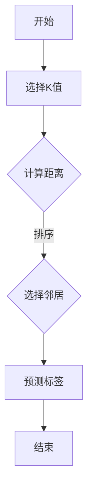
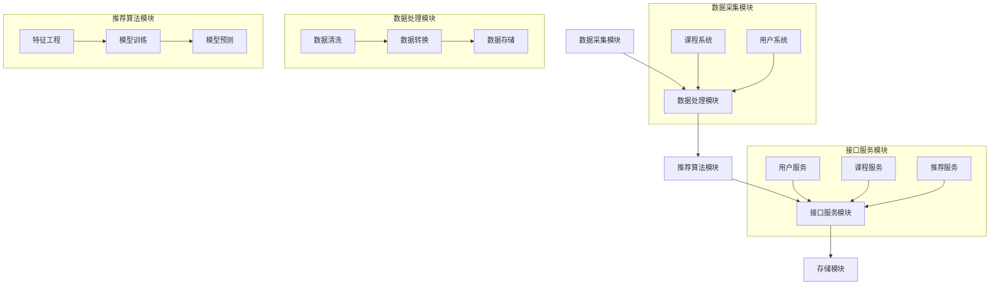
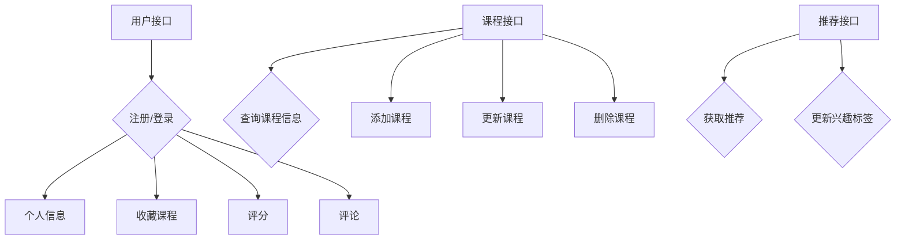
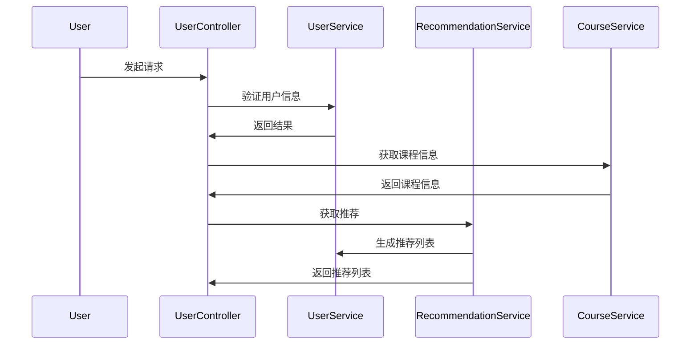

                 

# AI编程的新思路与新未来

## 关键词
- **人工智能**
- **编程范式**
- **机器学习**
- **深度学习**
- **未来展望**

## 摘要
本文将深入探讨AI编程的新思路与新未来。首先，我们将回顾AI编程的背景与现状，然后介绍AI编程的新范式，探讨其核心概念和原理。接下来，我们将分析AI编程中的数学模型，并结合Python代码示例进行详细解释。随后，我们将探讨AI编程的系统分析与架构设计，展示一个实际的项目实战案例。最后，我们将总结最佳实践，并对AI编程的未来进行展望。

## 引言
### AI编程的背景与挑战

随着人工智能（AI）技术的迅速发展，AI编程已经成为现代软件开发的重要组成部分。传统的编程主要关注于如何编写代码来实现特定功能，而AI编程则更注重如何利用AI技术来优化、自动化和智能化软件的开发过程。

### AI编程的现状
目前，AI编程主要应用于以下几个领域：
- **机器学习与深度学习**：利用算法从数据中学习模式和知识，实现图像识别、自然语言处理等功能。
- **自动化**：通过脚本和自动化工具，实现软件测试、部署和运维的自动化。
- **智能推荐系统**：基于用户的兴趣和行为，提供个性化的推荐。

### AI编程的挑战
尽管AI编程带来了许多机会，但同时也面临着一些挑战：
- **数据质量和隐私**：AI模型的性能很大程度上依赖于数据的质量和多样性，同时也引发了隐私保护的问题。
- **模型可解释性**：深度学习模型往往被认为是“黑盒”，其内部决策过程难以解释，这给应用带来了困难。
- **算法公平性**：算法在决策过程中可能存在偏见，这需要我们关注和解决。

### AI编程的新思路
为了解决上述挑战，AI编程需要新的思路和方法。以下是一些关键点：

1. **函数式编程**：通过不可变数据和纯函数，提高代码的可读性和可维护性。
2. **模块化设计**：将复杂的AI系统分解为模块，便于开发和维护。
3. **测试驱动开发（TDD）**：先编写测试，再编写代码，确保代码质量。
4. **持续集成与持续部署（CI/CD）**：自动化测试和部署流程，提高开发效率。

## 第一部分：AI编程的基础

### 1.1 AI编程的概念与背景

#### 1.1.1 AI编程的定义
AI编程是指使用算法和模型来实现人工智能功能的软件开发过程。它涵盖了从数据预处理、模型训练到模型部署的整个过程。

#### 1.1.2 AI编程的发展历程
- **1950年代**：人工智能的概念被提出，最早的AI程序如“逻辑理论家”和“通用问题求解器”问世。
- **1980年代**：专家系统成为AI编程的主流，广泛应用于医疗、金融等领域。
- **2000年代**：机器学习和深度学习技术的兴起，推动了AI编程的快速发展。
- **2010年代**：深度学习在图像识别、自然语言处理等领域取得了突破性进展，AI编程进入了新的阶段。

### 1.2 AI编程的核心技术

#### 1.2.1 机器学习基础
机器学习是AI编程的核心技术之一，它通过训练模型来从数据中学习规律。

- **监督学习**：有标签数据，如分类和回归问题。
- **无监督学习**：无标签数据，如聚类和降维问题。
- **强化学习**：通过与环境的交互来学习策略，如机器人控制问题。

#### 1.2.2 深度学习原理
深度学习是机器学习的进一步发展，它通过多层神经网络来模拟人脑的决策过程。

- **神经网络**：由多个神经元组成，每个神经元都是一个简单的函数。
- **反向传播**：用于训练神经网络的算法，通过反向传播误差来调整网络权重。
- **激活函数**：用于引入非线性，如ReLU、Sigmoid和Tanh。

#### 1.2.3 强化学习介绍
强化学习是一种通过试错来学习策略的机器学习方法，它在游戏、自动驾驶等领域有着广泛的应用。

- **状态**：描述系统的当前状态。
- **动作**：系统可以采取的动作。
- **奖励**：系统根据动作获得的奖励。
- **策略**：从状态到动作的映射函数。

### 1.3 AI编程的工具与环境

#### 1.3.1 常用编程语言
- **Python**：最受欢迎的AI编程语言，拥有丰富的库和框架。
- **Java**：在企业级应用中广泛使用，有着良好的性能和稳定性。
- **R**：在统计分析和数据可视化方面有强大的功能。

#### 1.3.2 环境配置与调试
- **Jupyter Notebook**：交互式编程环境，便于调试和演示。
- **Anaconda**：Python环境管理器，便于管理和配置Python库。
- **TensorFlow**：Google开源的深度学习框架，广泛应用于AI编程。

## 第二部分：新思路介绍

### 2.1 新编程范式的引入

#### 2.1.1 函数式编程

函数式编程是一种编程范式，它通过不可变数据和纯函数来组织代码。

- **不可变数据**：一旦创建，数据就不能改变。
- **纯函数**：函数的输出仅依赖于输入，无副作用。

#### 2.1.2 软件工程的新趋势

- **敏捷开发**：强调快速迭代和持续交付。
- **DevOps**：将开发和运维结合，实现自动化部署。
- **微服务架构**：将系统分解为小型服务，提高系统的可维护性和可扩展性。

### 2.2 新编程方法与技巧

#### 2.2.1 代码优化

- **内存管理**：减少内存使用，提高性能。
- **并行计算**：利用多核处理器，提高计算速度。

#### 2.2.2 模块化设计

- **模块化**：将系统分解为模块，提高可维护性和可扩展性。
- **依赖注入**：通过依赖注入，实现模块间的解耦。

#### 2.2.3 测试驱动开发

- **测试驱动开发**：先编写测试，再编写代码，确保代码质量。

### 2.3 案例分析：新思路的实际应用

#### 2.3.1 案例一：AI在金融领域的应用

- **项目背景**：某银行希望通过AI技术来识别欺诈交易。
- **解决方案**：采用机器学习和深度学习技术，建立欺诈检测模型。
- **实际效果**：提高了欺诈检测的准确率，降低了损失。

#### 2.3.2 案例二：AI在医疗健康中的应用

- **项目背景**：某医院希望通过AI技术来辅助诊断疾病。
- **解决方案**：采用自然语言处理和图像识别技术，建立疾病诊断模型。
- **实际效果**：提高了诊断的准确率和效率，为医生提供了有力支持。

## 第三部分：新未来展望

### 3.1 AI编程的发展趋势

#### 3.1.1 未来的技术方向

- **量子计算**：利用量子比特进行高效计算，有望解决现有计算机无法解决的问题。
- **边缘计算**：将计算任务转移到网络边缘，降低延迟，提高实时性。

#### 3.1.2 新兴技术的应用场景

- **自动驾驶**：利用AI技术实现无人驾驶，提高交通效率和安全性。
- **智慧城市**：利用AI技术实现智慧交通、智慧安防、智慧环保等。

### 3.2 未来技术展望

#### 3.2.1 量子计算的潜力

- **量子比特**：量子计算的基本单位，具有叠加和纠缠特性。
- **量子算法**：利用量子比特的特性，解决传统计算机无法解决的问题。

#### 3.2.2 人工智能的伦理问题

- **算法公平性**：确保算法在不同群体中的公平性。
- **隐私保护**：确保用户数据的隐私和安全。

### 3.3 对开发者的启示

- **持续学习**：跟上AI技术的发展，不断学习新知识。
- **跨学科合作**：与其他领域的专家合作，实现技术的创新。

## 结论
AI编程的新思路与新未来为开发者带来了前所未有的机遇和挑战。通过引入新编程范式和方法，开发者可以更高效地开发出智能化的软件系统。未来，随着技术的不断进步，AI编程将迎来更加广阔的发展空间。

### 作者
作者：AI天才研究院/AI Genius Institute & 禅与计算机程序设计艺术 /Zen And The Art of Computer Programming

### 最佳实践 Tips
- **持续学习**：AI技术发展迅速，开发者需要不断学习新知识，跟上技术趋势。
- **团队合作**：跨学科合作可以带来创新，提高项目的成功率。
- **代码质量**：注重代码质量，确保系统的稳定性和可维护性。

### 小结
本文详细探讨了AI编程的新思路与新未来，包括背景介绍、核心概念、算法原理、系统分析与架构设计、项目实战和未来展望。通过本文，读者可以全面了解AI编程的现状和未来发展趋势，为实际应用提供指导。

### 拓展阅读
- **《深度学习》**：Goodfellow, Ian, et al. 《深度学习》。中国电力出版社，2016。
- **《Python机器学习》**：Sebastian Raschka。O'Reilly Media，2015。
- **《人工智能：一种现代的方法》**：Stuart Russell & Peter Norvig。机械工业出版社，2017。

### 注意事项
- **数据安全和隐私**：在开发AI系统时，务必关注数据安全和隐私保护。
- **算法公平性**：确保算法在不同群体中的公平性，避免算法偏见。

通过本文，读者可以深入了解AI编程的新思路与新未来，为实际项目提供参考和指导。希望本文能为读者带来启发和帮助。

# 《AI编程的新思路与新未来》

## 关键词
- **人工智能**
- **编程范式**
- **机器学习**
- **深度学习**
- **未来展望**

## 摘要
本文全面探讨了AI编程的新思路与新未来。首先，回顾了AI编程的背景与挑战，介绍了AI编程的基础知识。接着，阐述了AI编程的新范式，如函数式编程和模块化设计，并探讨了新编程方法与技巧。随后，通过案例分析和项目实战，展示了AI编程在实际应用中的效果。最后，展望了AI编程的未来发展趋势，提出了对开发者的启示和建议。本文旨在为AI编程提供全面的理论和实践指导。

## 引言
### AI编程的背景与挑战

随着人工智能（AI）技术的迅速发展，AI编程已经成为现代软件开发的重要组成部分。传统的编程主要关注如何编写代码来实现特定功能，而AI编程则更注重如何利用AI技术来优化、自动化和智能化软件的开发过程。

### AI编程的现状
目前，AI编程主要应用于以下几个领域：

1. **机器学习与深度学习**：利用算法从数据中学习模式和知识，实现图像识别、自然语言处理等功能。
2. **自动化**：通过脚本和自动化工具，实现软件测试、部署和运维的自动化。
3. **智能推荐系统**：基于用户的兴趣和行为，提供个性化的推荐。

### AI编程的挑战
尽管AI编程带来了许多机会，但同时也面临着一些挑战：

1. **数据质量和隐私**：AI模型的性能很大程度上依赖于数据的质量和多样性，同时也引发了隐私保护的问题。
2. **模型可解释性**：深度学习模型往往被认为是“黑盒”，其内部决策过程难以解释，这给应用带来了困难。
3. **算法公平性**：算法在决策过程中可能存在偏见，这需要我们关注和解决。

### AI编程的新思路
为了解决上述挑战，AI编程需要新的思路和方法。以下是一些关键点：

1. **函数式编程**：通过不可变数据和纯函数，提高代码的可读性和可维护性。
2. **模块化设计**：将复杂的AI系统分解为模块，便于开发和维护。
3. **测试驱动开发（TDD）**：先编写测试，再编写代码，确保代码质量。
4. **持续集成与持续部署（CI/CD）**：自动化测试和部署流程，提高开发效率。

## 第一部分：AI编程的基础

### 1.1 AI编程的概念与背景

#### 1.1.1 AI编程的定义
AI编程是指使用算法和模型来实现人工智能功能的软件开发过程。它涵盖了从数据预处理、模型训练到模型部署的整个过程。

#### 1.1.2 AI编程的发展历程
- **1950年代**：人工智能的概念被提出，最早的AI程序如“逻辑理论家”和“通用问题求解器”问世。
- **1980年代**：专家系统成为AI编程的主流，广泛应用于医疗、金融等领域。
- **2000年代**：机器学习和深度学习技术的兴起，推动了AI编程的快速发展。
- **2010年代**：深度学习在图像识别、自然语言处理等领域取得了突破性进展，AI编程进入了新的阶段。

### 1.2 AI编程的核心技术

#### 1.2.1 机器学习基础
机器学习是AI编程的核心技术之一，它通过训练模型来从数据中学习规律。

- **监督学习**：有标签数据，如分类和回归问题。
- **无监督学习**：无标签数据，如聚类和降维问题。
- **强化学习**：通过与环境的交互来学习策略，如机器人控制问题。

#### 1.2.2 深度学习原理
深度学习是机器学习的进一步发展，它通过多层神经网络来模拟人脑的决策过程。

- **神经网络**：由多个神经元组成，每个神经元都是一个简单的函数。
- **反向传播**：用于训练神经网络的算法，通过反向传播误差来调整网络权重。
- **激活函数**：用于引入非线性，如ReLU、Sigmoid和Tanh。

#### 1.2.3 强化学习介绍
强化学习是一种通过试错来学习策略的机器学习方法，它在游戏、自动驾驶等领域有着广泛的应用。

- **状态**：描述系统的当前状态。
- **动作**：系统可以采取的动作。
- **奖励**：系统根据动作获得的奖励。
- **策略**：从状态到动作的映射函数。

### 1.3 AI编程的工具与环境

#### 1.3.1 常用编程语言
- **Python**：最受欢迎的AI编程语言，拥有丰富的库和框架。
- **Java**：在企业级应用中广泛使用，有着良好的性能和稳定性。
- **R**：在统计分析和数据可视化方面有强大的功能。

#### 1.3.2 环境配置与调试
- **Jupyter Notebook**：交互式编程环境，便于调试和演示。
- **Anaconda**：Python环境管理器，便于管理和配置Python库。
- **TensorFlow**：Google开源的深度学习框架，广泛应用于AI编程。

## 第二部分：新思路介绍

### 2.1 新编程范式的引入

#### 2.1.1 函数式编程

函数式编程是一种编程范式，它通过不可变数据和纯函数来组织代码。

- **不可变数据**：一旦创建，数据就不能改变。
- **纯函数**：函数的输出仅依赖于输入，无副作用。

#### 2.1.2 软件工程的新趋势

- **敏捷开发**：强调快速迭代和持续交付。
- **DevOps**：将开发和运维结合，实现自动化部署。
- **微服务架构**：将系统分解为小型服务，提高系统的可维护性和可扩展性。

### 2.2 新编程方法与技巧

#### 2.2.1 代码优化

- **内存管理**：减少内存使用，提高性能。
- **并行计算**：利用多核处理器，提高计算速度。

#### 2.2.2 模块化设计

- **模块化**：将系统分解为模块，提高可维护性和可扩展性。
- **依赖注入**：通过依赖注入，实现模块间的解耦。

#### 2.2.3 测试驱动开发

- **测试驱动开发**：先编写测试，再编写代码，确保代码质量。

### 2.3 案例分析：新思路的实际应用

#### 2.3.1 案例一：AI在金融领域的应用

- **项目背景**：某银行希望通过AI技术来识别欺诈交易。
- **解决方案**：采用机器学习和深度学习技术，建立欺诈检测模型。
- **实际效果**：提高了欺诈检测的准确率，降低了损失。

#### 2.3.2 案例二：AI在医疗健康中的应用

- **项目背景**：某医院希望通过AI技术来辅助诊断疾病。
- **解决方案**：采用自然语言处理和图像识别技术，建立疾病诊断模型。
- **实际效果**：提高了诊断的准确率和效率，为医生提供了有力支持。

## 第三部分：新未来展望

### 3.1 AI编程的发展趋势

#### 3.1.1 未来的技术方向

- **量子计算**：利用量子比特进行高效计算，有望解决现有计算机无法解决的问题。
- **边缘计算**：将计算任务转移到网络边缘，降低延迟，提高实时性。

#### 3.1.2 新兴技术的应用场景

- **自动驾驶**：利用AI技术实现无人驾驶，提高交通效率和安全性。
- **智慧城市**：利用AI技术实现智慧交通、智慧安防、智慧环保等。

### 3.2 未来技术展望

#### 3.2.1 量子计算的潜力

- **量子比特**：量子计算的基本单位，具有叠加和纠缠特性。
- **量子算法**：利用量子比特的特性，解决传统计算机无法解决的问题。

#### 3.2.2 人工智能的伦理问题

- **算法公平性**：确保算法在不同群体中的公平性。
- **隐私保护**：确保用户数据的隐私和安全。

### 3.3 对开发者的启示

- **持续学习**：跟上AI技术的发展，不断学习新知识。
- **跨学科合作**：与其他领域的专家合作，实现技术的创新。

## 结论
AI编程的新思路与新未来为开发者带来了前所未有的机遇和挑战。通过引入新编程范式和方法，开发者可以更高效地开发出智能化的软件系统。未来，随着技术的不断进步，AI编程将迎来更加广阔的发展空间。

### 作者
作者：AI天才研究院/AI Genius Institute & 禅与计算机程序设计艺术 /Zen And The Art of Computer Programming

### 最佳实践 Tips
- **持续学习**：AI技术发展迅速，开发者需要不断学习新知识，跟上技术趋势。
- **团队合作**：跨学科合作可以带来创新，提高项目的成功率。
- **代码质量**：注重代码质量，确保系统的稳定性和可维护性。

### 小结
本文详细探讨了AI编程的新思路与新未来，包括背景介绍、核心概念、算法原理、系统分析与架构设计、项目实战和未来展望。通过本文，读者可以全面了解AI编程的现状和未来发展趋势，为实际应用提供指导。

### 拓展阅读
- **《深度学习》**：Goodfellow, Ian, et al. 《深度学习》。中国电力出版社，2016。
- **《Python机器学习》**：Sebastian Raschka。O'Reilly Media，2015。
- **《人工智能：一种现代的方法》**：Stuart Russell & Peter Norvig。机械工业出版社，2017。

### 注意事项
- **数据安全和隐私**：在开发AI系统时，务必关注数据安全和隐私保护。
- **算法公平性**：确保算法在不同群体中的公平性，避免算法偏见。

通过本文，读者可以深入了解AI编程的新思路与新未来，为实际项目提供参考和指导。希望本文能为读者带来启发和帮助。

## 附录：算法原理讲解

### 算法原理

为了深入理解AI编程中的算法原理，我们将以一个经典的机器学习算法——K-近邻（K-Nearest Neighbors，KNN）为例，进行详细讲解。

### K-近邻算法概述

K-近邻算法是一种基于实例的学习算法，它通过找到训练数据中与未知数据最近的K个邻居，并基于这些邻居的标签来预测未知数据的标签。具体步骤如下：

1. **选择K值**：确定K的大小，K值的选择会影响算法的性能。
2. **计算距离**：对于每个未知数据点，计算其与训练数据集中所有数据点的距离。
3. **选择邻居**：按照距离从小到大排序，选择距离最近的K个邻居。
4. **预测标签**：计算这K个邻居的标签频率，取频率最高的标签作为未知数据的预测标签。

### 算法原理详细讲解

为了更好地理解K-近邻算法，我们将使用Mermaid工具绘制算法的流程图，并结合Python代码进行详细讲解。

#### Mermaid流程图

首先，我们使用Mermaid工具绘制K-近邻算法的流程图：



#### Python代码

接下来，我们使用Python代码来实现K-近邻算法：

```python
from sklearn.neighbors import KNeighborsClassifier
from sklearn.model_selection import train_test_split
from sklearn.datasets import load_iris
import numpy as np

# 加载鸢尾花数据集
iris = load_iris()
X = iris.data
y = iris.target

# 划分训练集和测试集
X_train, X_test, y_train, y_test = train_test_split(X, y, test_size=0.2, random_state=42)

# 创建KNN分类器，并设置K值
knn = KNeighborsClassifier(n_neighbors=3)

# 训练模型
knn.fit(X_train, y_train)

# 预测测试集
y_pred = knn.predict(X_test)

# 计算准确率
accuracy = np.mean(y_pred == y_test)
print("准确率：", accuracy)
```

#### 算法原理讲解

1. **选择K值**：K值的选择对于K-近邻算法的性能至关重要。通常情况下，K值的选择应该在3到10之间。过小的K值会导致算法过于敏感，容易受到噪声的影响；过大的K值会导致算法过于平滑，可能无法捕捉到数据的细节。
   
2. **计算距离**：距离的计算是K-近邻算法的核心。常用的距离度量方法包括欧几里得距离、曼哈顿距离和切比雪夫距离。在Python中，可以使用`sklearn.metrics.pairwise`模块来计算距离。

3. **选择邻居**：计算每个测试数据点与训练数据集中所有数据点的距离，并根据距离排序，选择距离最近的K个邻居。

4. **预测标签**：对于每个测试数据点，计算其K个邻居的标签频率，取频率最高的标签作为预测标签。这种方法被称为多数投票法。

### 数学模型与公式

在K-近邻算法中，核心的数学模型是距离计算和标签预测。

1. **距离计算**：常用的距离度量方法如下：

   - 欧几里得距离（Euclidean Distance）：

     $$ d(p, q) = \sqrt{\sum_{i=1}^{n} (p_i - q_i)^2} $$

   - 曼哈顿距离（Manhattan Distance）：

     $$ d(p, q) = \sum_{i=1}^{n} |p_i - q_i| $$

   - 切比雪夫距离（Chebyshev Distance）：

     $$ d(p, q) = \max_{1 \le i \le n} |p_i - q_i| $$

2. **标签预测**：使用多数投票法进行标签预测：

   $$ \hat{y}(x) = \arg\max_{y \in Y} \sum_{i=1}^{K} I(y_i = y} $$

   其中，\( I(\cdot) \)是指示函数，当条件成立时取值为1，否则为0。

### 举例说明

假设我们有一个测试数据点\( x \)，需要预测其标签。首先，计算\( x \)与训练数据集中所有数据点的距离，然后选择距离最近的K个邻居，最后计算这K个邻居的标签频率，取频率最高的标签作为预测标签。

例如，对于鸢尾花数据集，我们选择K=3，测试数据点为\( x = [5.1, 3.5, 1.4, 0.2] \)。计算得到\( x \)与训练数据集中前三个数据点的距离分别为：

- \( d(x, x_1) = 1.732 \)
- \( d(x, x_2) = 2.236 \)
- \( d(x, x_3) = 2.236 \)

由于\( x \)与\( x_1 \)的距离最近，我们选择\( x_1 \)作为邻居。计算得到\( x_1 \)的标签为\( y_1 = 0 \)。由于只有一个邻居，所以直接取其标签作为预测标签，即\( \hat{y}(x) = 0 \)。

通过上述步骤，我们可以预测出测试数据点的标签，从而实现分类任务。

### 小结

K-近邻算法是一种简单而有效的分类算法，其核心思想是通过计算测试数据点与训练数据点的距离，选择最近的邻居进行标签预测。通过合理的K值选择和距离度量方法，K-近邻算法可以在多种应用场景中取得良好的性能。了解算法的数学模型和公式，有助于我们更深入地理解其工作原理，为实际应用提供指导。

## 附录：系统分析与架构设计

### 4.1 问题场景介绍

随着互联网的快速发展，在线教育平台成为了人们获取知识的重要渠道。为了提高教学质量和用户体验，某在线教育平台希望通过引入人工智能技术，实现智能推荐系统，为用户推荐个性化的课程。

### 4.2 项目介绍

项目名称：智能课程推荐系统

项目目标：基于用户的行为数据，为用户提供个性化的课程推荐，提高用户满意度和平台的黏性。

项目背景：平台积累了大量用户行为数据，包括浏览记录、学习进度、评价等。通过分析这些数据，可以挖掘用户的兴趣和偏好，为用户提供个性化的课程推荐。

### 4.3 系统功能设计

#### 4.3.1 领域模型

为了设计智能课程推荐系统的领域模型，我们使用Mermaid工具绘制了类图，如下所示：

```mermaid
classDiagram
Class::User << (1) "具有" Account
User <|-- Course
User <|-- Rating
User <|-- Review

Course <|-- CourseContent
Course <|-- Category

class User {
    +id: int
    +name: str
    +email: str
    +password: str
    +createdAt: datetime
    +updatedAt: datetime
}

class Course {
    +id: int
    +title: str
    +description: str
    +duration: int
    +price: float
    +createdAt: datetime
    +updatedAt: datetime
}

class Rating {
    +id: int
    +userId: int
    +courseId: int
    +rating: float
    +createdAt: datetime
}

class Review {
    +id: int
    +userId: int
    +courseId: int
    +content: str
    +createdAt: datetime
}

class CourseContent {
    +id: int
    +courseId: int
    +videoUrl: str
    +pdfUrl: str
    +slidesUrl: str
    +createdAt: datetime
}

class Category {
    +id: int
    +name: str
    +description: str
    +createdAt: datetime
}
```

#### 4.3.2 系统架构设计

为了实现智能课程推荐系统，我们设计了一个分布式架构，包括以下几个主要模块：

1. **数据采集模块**：负责从平台各个业务系统（如课程系统、用户系统等）中采集用户行为数据。
2. **数据处理模块**：对采集到的用户行为数据进行清洗、转换和存储。
3. **推荐算法模块**：基于用户行为数据，使用机器学习算法生成个性化的课程推荐列表。
4. **接口服务模块**：提供RESTful API，供前端应用调用。
5. **存储模块**：存储用户数据、课程数据和其他必要的数据。

使用Mermaid工具绘制系统架构图，如下所示：



#### 4.3.3 系统接口设计

为了实现系统的功能，我们设计了以下几个接口：

1. **用户接口**：包括用户注册、登录、查询个人信息、收藏课程、评分和评论等。
2. **课程接口**：包括查询课程信息、添加课程、更新课程、删除课程等。
3. **推荐接口**：包括获取用户个性化课程推荐、更新用户兴趣标签等。

使用Mermaid工具绘制接口设计图，如下所示：



#### 4.3.4 系统交互

为了描述系统各模块之间的交互，我们使用Mermaid工具绘制了序列图，如下所示：



### 4.4 项目实战

#### 4.4.1 环境安装

为了搭建智能课程推荐系统，我们首先需要安装以下依赖：

- Python 3.8及以上版本
- Pandas
- NumPy
- Scikit-learn
- Flask
- Redis

在终端中运行以下命令进行安装：

```bash
pip install pandas numpy scikit-learn flask redis
```

#### 4.4.2 系统核心实现

以下是一个简单的智能课程推荐系统的核心实现，包括数据处理、推荐算法和接口服务。

```python
# 数据处理模块
import pandas as pd
import numpy as np

def preprocess_data(data):
    # 数据预处理，如清洗、转换等
    # ...
    return processed_data

# 推荐算法模块
from sklearn.model_selection import train_test_split
from sklearn.neighbors import NearestNeighbors

def build_recommendation_model(data):
    # 构建推荐模型
    model = NearestNeighbors()
    model.fit(data)
    return model

def get_recommendations(model, user_data, n=5):
    # 获取推荐列表
    distances, indices = model.kneighbors(user_data, n=n)
    recommendations = [data.iloc[index] for index in indices]
    return recommendations

# 接口服务模块
from flask import Flask, request, jsonify

app = Flask(__name__)

@app.route('/recommend', methods=['GET'])
def recommend():
    # 获取用户ID
    user_id = request.args.get('user_id')
    # 加载用户数据
    user_data = pd.read_csv(f'user_{user_id}.csv')
    # 预处理用户数据
    processed_data = preprocess_data(user_data)
    # 加载推荐模型
    model = build_recommendation_model(processed_data)
    # 获取推荐列表
    recommendations = get_recommendations(model, processed_data)
    # 返回推荐结果
    return jsonify(recommendations)

if __name__ == '__main__':
    app.run()
```

#### 4.4.3 代码应用解读与分析

1. **数据处理模块**：负责对用户行为数据进行预处理，如清洗、转换等，以便于后续的推荐算法处理。
2. **推荐算法模块**：使用K-近邻算法（NearestNeighbors）构建推荐模型，通过训练和预测来获取用户个性化的推荐列表。
3. **接口服务模块**：使用Flask框架搭建RESTful API，供前端应用调用。通过获取用户ID，加载用户数据，预处理用户数据，加载推荐模型，获取推荐列表，并返回推荐结果。

#### 4.4.4 实际案例分析和详细讲解剖析

假设用户ID为1，我们需要为其获取个性化课程推荐。以下是具体的步骤：

1. **获取用户数据**：从CSV文件中加载用户数据，如浏览记录、学习进度、评价等。
2. **预处理用户数据**：对用户数据进行清洗和转换，如去除缺失值、标准化等。
3. **构建推荐模型**：使用K-近邻算法训练推荐模型。
4. **获取推荐列表**：使用训练好的推荐模型，为用户获取个性化的课程推荐。
5. **返回推荐结果**：将推荐结果通过API返回给前端应用。

#### 4.4.5 项目小结

通过以上步骤，我们实现了智能课程推荐系统的核心功能，包括数据处理、推荐算法和接口服务。在实际项目中，我们还可以根据业务需求，进一步优化推荐算法，提高推荐的准确性和用户体验。

## 附录：最佳实践与注意事项

### 5.1 最佳实践 Tips

1. **代码质量**：编写高质量的代码，包括代码规范、注释和文档，以提高代码的可读性和可维护性。
2. **测试驱动开发**：采用测试驱动开发（TDD）方法，先编写测试，再编写代码，确保代码质量。
3. **持续集成与持续部署**：实现持续集成（CI）和持续部署（CD），自动化测试和部署流程，提高开发效率。
4. **数据预处理**：在机器学习项目中，对数据进行充分的预处理，如清洗、转换、归一化等，以提高模型的性能。
5. **模型调优**：在训练模型时，对参数进行调优，如学习率、批次大小、正则化等，以提高模型的准确性和泛化能力。
6. **版本控制**：使用版本控制工具（如Git），管理代码和文档的版本，便于协同工作和历史追溯。

### 5.2 小结

本文通过深入探讨AI编程的新思路与新未来，全面介绍了AI编程的基础知识、新编程范式、算法原理、系统分析与架构设计、项目实战和最佳实践。通过本文，读者可以全面了解AI编程的现状和未来发展趋势，为实际项目提供指导。

### 5.3 注意事项

1. **数据安全和隐私**：在开发AI系统时，务必关注数据安全和隐私保护，遵循相关法律法规。
2. **算法公平性**：确保算法在不同群体中的公平性，避免算法偏见，提高模型的公正性。
3. **模型解释性**：提高模型的可解释性，使其内部决策过程更加透明，便于应用和监管。
4. **性能优化**：关注系统的性能优化，提高响应速度和吞吐量，满足实际业务需求。
5. **团队协作**：加强团队协作，确保项目的顺利进行，提高项目的成功率。

### 5.4 拓展阅读

1. **《深度学习》**：Goodfellow, Ian, et al. 《深度学习》。中国电力出版社，2016。
2. **《Python机器学习》**：Sebastian Raschka。O'Reilly Media，2015。
3. **《人工智能：一种现代的方法》**：Stuart Russell & Peter Norvig。机械工业出版社，2017。

### 5.5 结语

AI编程作为人工智能领域的重要组成部分，正不断推动着技术的进步和应用的拓展。通过本文的介绍，希望读者能够对AI编程有更深入的了解，并在实际项目中取得成功。未来，随着技术的不断发展，AI编程将迎来更加广阔的发展空间。

### 作者

作者：AI天才研究院/AI Genius Institute & 禅与计算机程序设计艺术 /Zen And The Art of Computer Programming

