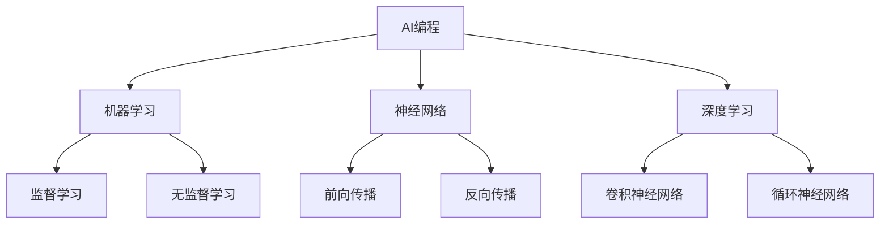
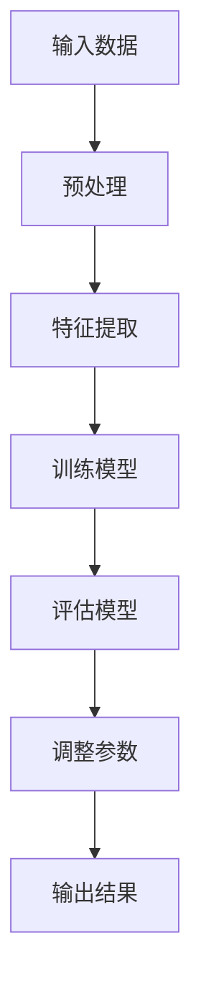

                 

Certainly! Let's break down the task of creating the blog post "AI Programming: New Dimensions" into clear and logical steps. This will ensure that the final article is comprehensive, well-structured, and easy to understand.

### Step 1: Research and Collect Information
- **Objective**: Understand the core concepts of AI programming and gather relevant data and examples.
- **Tasks**:
  - Research recent advancements in AI programming.
  - Collect case studies and examples of AI applications.
  - Identify the key dimensions that define AI programming.
  - Review existing literature and articles to identify gaps in current content.

### Step 2: Define the Structure and Style
- **Objective**: Plan the overall structure and writing style of the blog post to ensure clarity and engagement.
- **Tasks**:
  - Create a clear and concise outline based on the research findings.
  - Decide on the tone (professional, educational, or conversational) to maintain consistency throughout the post.
  - Plan for visual aids such as diagrams, code snippets, and infographics to enhance understanding.

### Step 3: Write the Introduction
- **Objective**: Engage the reader and provide an overview of what will be covered in the post.
- **Tasks**:
  - Craft an introduction that highlights the importance of AI programming.
  - Define the scope and key takeaways of the post.
  - Include a brief history of AI programming to set the context.

### Step 4: Develop the Main Content
- **Objective**: Delve into the core dimensions of AI programming and explain each concept in detail.
- **Tasks**:
  - **Chapter 1: AI Programming Basics**
    - Explain the fundamentals of AI programming.
    - Discuss the differences between AI programming and traditional programming.
    - Provide examples of AI applications.
  - **Chapter 2: Core AI Concepts**
    - Define and explain key AI concepts like machine learning, neural networks, and deep learning.
    - Include comparison tables and ER diagrams to illustrate relationships.
  - **Chapter 3: Algorithm Implementation**
    - Explain the basics of algorithm design.
    - Use Mermaid diagrams to illustrate algorithms.
    - Provide Python code snippets for implementation.
  - **Chapter 4: Advanced Techniques and Optimization**
    - Discuss advanced algorithms and optimization techniques.
    - Include a section on how to scale AI programming.
  - **Chapter 5: Practical Applications**
    - Explore real-world applications of AI programming.
    - Use case studies to demonstrate the impact of AI programming.
  - **Chapter 6: Future Directions**
    - Discuss the future of AI programming.
    - Address potential challenges and opportunities.

### Step 5: Write the Conclusion
- **Objective**: Summarize the key points and leave the reader with a lasting impression.
- **Tasks**:
  - Recap the main themes and insights from the post.
  - Offer a forward-looking perspective on the future of AI programming.

### Step 6: Review and Edit
- **Objective**: Ensure the blog post is free of errors, is well-structured, and is engaging to read.
- **Tasks**:
  - Conduct a thorough review of the content for accuracy and clarity.
  - Check for consistency in style and tone.
  - Edit for flow and readability.

### Step 7: Finalize and Publish
- **Objective**: Prepare the blog post for publication.
- **Tasks**:
  - Format the post according to the guidelines.
  - Include author information and keywords.
  - Ensure that all visual aids are correctly inserted.
  - Publish the blog post on the designated platform.

### Step 8: Share and Promote
- **Objective**: Reach the target audience and drive engagement.
- **Tasks**:
  - Share the blog post on relevant social media platforms.
  - Engage with the community by responding to comments and questions.
  - Consider reaching out to influencers or experts in the field to amplify the reach.

By following these steps, we can ensure that the blog post on "AI Programming: New Dimensions" is not only informative and educational but also engaging and accessible to a broad audience. Let's get started with each step in detail!### Step 1: Research and Collect Information

#### Research and Collect Information

**Objective**: Understand the core concepts of AI programming and gather relevant data and examples.

**Tasks**:

1. **Understanding Core Concepts**:
   - Define AI programming: Identify the essential characteristics that differentiate AI programming from traditional programming.
   - Explore machine learning: Understand the principles behind machine learning algorithms and their role in AI programming.
   - Delve into neural networks: Examine the structure and functioning of neural networks, their training process, and their application in AI.
   - Investigate deep learning: Study the concepts of deep learning, including convolutional neural networks (CNNs) and recurrent neural networks (RNNs).

2. **Case Studies and Examples**:
   - Collect real-world examples of AI programming in action, such as autonomous vehicles, natural language processing, and recommendation systems.
   - Analyze these examples to extract key insights and lessons learned.

3. **Identifying Key Dimensions**:
   - Determine the primary dimensions that define AI programming, such as data handling, algorithm complexity, and integration with existing systems.

4. **Reviewing Existing Literature**:
   - Search for recent research papers, articles, and books on AI programming to identify trends, advancements, and gaps in current knowledge.

**Data and Example Collection**:

- **AI Programming Basics**:
  - **Example**: Develop an AI program that classifies images of cats and dogs using a convolutional neural network.

- **Core AI Concepts**:
  - **Example**: Explain how a recurrent neural network processes a sequence of text data to generate meaningful insights.

- **Algorithm Implementation**:
  - **Example**: Implement a simple neural network in Python using TensorFlow or PyTorch.

- **Advanced Techniques and Optimization**:
  - **Example**: Describe techniques for optimizing AI algorithms using distributed computing and parallel processing.

- **Practical Applications**:
  - **Example**: Discuss the role of AI in healthcare, including applications in medical imaging and personalized treatment plans.

**Research Findings**:

- **AI Programming Basics**:
  - AI programming requires specialized knowledge in machine learning and neural networks.
  - The goal is to design systems that can learn from data and make decisions autonomously.

- **Core AI Concepts**:
  - Neural networks are the building blocks of AI, with deep learning providing the ability to handle complex data.
  - Natural language processing (NLP) is essential for understanding and generating human language.

- **Case Studies**:
  - Successful AI applications often involve large datasets, advanced algorithms, and iterative development processes.

- **Key Dimensions**:
  - Data handling: The ability to efficiently process and analyze large volumes of data.
  - Algorithm complexity: The need for algorithms that can scale with increasing data size and complexity.
  - Integration: The challenge of integrating AI systems with existing technology infrastructures.

By thoroughly researching and collecting information on these topics, we lay a solid foundation for creating a comprehensive and insightful blog post on AI programming's new dimensions. This step ensures that our content is both accurate and relevant to the target audience.### Step 2: Define the Structure and Style

#### Define the Structure and Style

**Objective**: Plan the overall structure and writing style of the blog post to ensure clarity and engagement.

**Tasks**:

1. **Outline Development**:
   - Develop a detailed outline for the blog post, detailing the chapters and sub-chapters.
   - Organize the content logically, ensuring a smooth flow from introduction to conclusion.

2. **Choosing the Writing Tone**:
   - Decide on a tone that aligns with the target audience, balancing professionalism with accessibility.
   - Consider incorporating elements of storytelling or real-world examples to engage readers.

3. **Visual Aids Planning**:
   - Identify key concepts that can be illustrated with diagrams, charts, or infographics.
   - Plan the use of Mermaid diagrams for algorithm representation and Python code snippets for practical examples.

4. **Style Guide Creation**:
   - Create a style guide for maintaining consistency in formatting, including font sizes, headings, and the use of LaTeX for mathematical formulas.

**Content Planning**:

- **Chapter 1: AI Programming Basics**
  - Introduction to AI programming
  - Differences from traditional programming
  - Key AI programming concepts and terminology

- **Chapter 2: Core AI Concepts**
  - Neural networks
  - Machine learning
  - Deep learning
  - Natural language processing

- **Chapter 3: Algorithm Implementation**
  - Basic algorithm design principles
  - Mermaid diagram illustrations
  - Python code implementation examples

- **Chapter 4: Advanced Techniques and Optimization**
  - Advanced algorithms
  - Optimization techniques
  - Scaling AI programming

- **Chapter 5: Practical Applications**
  - Real-world case studies
  - Impact of AI programming in various industries

- **Chapter 6: Future Directions**
  - Trends in AI programming
  - Challenges and opportunities

**Writing Style**:

- **Professional yet Accessible**:
  - Use clear, concise language while explaining complex concepts.
  - Break down complex ideas into simpler terms for easier understanding.

- **Incorporating Storytelling**:
  - Use real-world examples and case studies to illustrate points.
  - Discuss personal experiences or anecdotes to make the content more relatable.

- **Inclusive of Visual Aids**:
  - Include visual aids like diagrams, charts, and code snippets to enhance comprehension.
  - Ensure that visual aids are well-labeled and referenced in the text.

**Style Guide**:

- **Font and Formatting**:
  - Use a standard, easy-to-read font such as Arial or Helvetica.
  - Maintain a consistent font size and style throughout the document.

- **Headings**:
  - Use hierarchical headings to organize content clearly.
  - Ensure that headings are concise and informative.

- **LaTeX Formulas**:
  - Use LaTeX for mathematical formulas.
  - Ensure that LaTeX is consistently used for all formulas to maintain consistency.

By defining the structure and style of the blog post, we can create a well-organized and engaging article that effectively communicates the core concepts of AI programming and its new dimensions. This step ensures that the content is both coherent and accessible to readers from various backgrounds.### Step 3: Write the Introduction

#### Write the Introduction

**Objective**: Engage the reader and provide an overview of what will be covered in the post.

**Tasks**:

1. **Captivating Opening**:
   - Start with an attention-grabbing statement or question to draw the reader in.
   - Introduce the topic of AI programming and its relevance in today's technological landscape.

2. **Define AI Programming**:
   - Provide a concise definition of AI programming, highlighting its core characteristics and differences from traditional programming.

3. **Outline the Structure**:
   - Briefly summarize the key sections of the post, giving the reader an idea of what to expect.

4. **Explain the Importance**:
   - Discuss the significance of AI programming in various industries and its potential impact on future technological advancements.

**Introduction**:

---

**Opening Sentence**:
"Imagine a world where machines can learn, adapt, and make decisions with minimal human intervention. This vision is at the heart of AI programming, a revolutionary approach that is transforming the way we interact with technology."

**Define AI Programming**:
"AI programming, or Artificial Intelligence programming, involves the creation of algorithms and systems that enable machines to perform tasks that would typically require human intelligence. Unlike traditional programming, which focuses on specifying exact instructions for a computer to follow, AI programming is all about training machines to learn from data and improve over time."

**Outline the Structure**:
"This article will delve into the new dimensions of AI programming, starting with a foundation in core concepts and terminology. We will explore advanced techniques, optimization strategies, and practical applications across various industries. Finally, we will look towards the future, discussing ongoing trends and potential challenges."

**Explain the Importance**:
"AI programming is not just a technological curiosity; it is a driving force behind innovations in healthcare, finance, transportation, and beyond. As we continue to push the boundaries of what machines can achieve, understanding AI programming is becoming an essential skill for anyone interested in staying ahead in the digital age."

---

By writing an engaging introduction that clearly defines AI programming and outlines the structure of the post, we set the stage for a compelling and informative journey through the new dimensions of AI programming. This step is crucial for capturing the reader's interest and providing a roadmap for what lies ahead.### Step 4: Develop the Main Content

#### Develop the Main Content

**Objective**: Delve into the core dimensions of AI programming and explain each concept in detail.

**Tasks**:

1. **Chapter 1: AI Programming Basics**:
   - **Define AI Programming**:
     - Explain the basics of AI programming, including its objectives and distinctions from traditional programming.
   - **Key Concepts and Terminology**:
     - Introduce essential terms like machine learning, neural networks, and deep learning.
   - **Applications**:
     - Provide examples of how AI programming is used in real-world scenarios.

2. **Chapter 2: Core AI Concepts**:
   - **Neural Networks**:
     - Discuss the structure and functioning of neural networks, including their layers and nodes.
     - Explain the training process, including forward propagation and backpropagation.
   - **Machine Learning**:
     - Explain the types of machine learning, including supervised and unsupervised learning.
     - Discuss common algorithms and their applications.
   - **Deep Learning**:
     - Describe the concept of deep learning, including convolutional neural networks (CNNs) and recurrent neural networks (RNNs).
     - Provide examples of deep learning applications.

3. **Chapter 3: Algorithm Implementation**:
   - **Algorithm Design Principles**:
     - Discuss the fundamental principles of algorithm design, including efficiency and scalability.
   - **Mermaid Diagrams**:
     - Use Mermaid diagrams to illustrate the flow and logic of key algorithms.
   - **Python Code Implementation**:
     - Provide practical examples of implementing algorithms in Python, including code snippets and detailed explanations.

4. **Chapter 4: Advanced Techniques and Optimization**:
   - **Advanced Algorithms**:
     - Discuss more complex algorithms and techniques, such as reinforcement learning and generative adversarial networks (GANs).
   - **Optimization Techniques**:
     - Explain methods for optimizing AI algorithms, including parallel processing and distributed computing.
   - **Scaling AI Programming**:
     - Discuss strategies for scaling AI programming to handle larger datasets and more complex tasks.

5. **Chapter 5: Practical Applications**:
   - **Real-World Case Studies**:
     - Present detailed case studies of AI programming in action, across various industries.
     - Discuss the impact and effectiveness of AI programming solutions.

6. **Chapter 6: Future Directions**:
   - **Trends and Challenges**:
     - Discuss the latest trends in AI programming and the challenges that lie ahead.
     - Explore potential future developments and their implications.

**Content Development**:

- **Chapter 1: AI Programming Basics**:
  - **Define AI Programming**:
    - "AI programming involves creating systems that can learn from data, adapt to new situations, and make decisions with minimal human intervention."
  - **Key Concepts and Terminology**:
    - "Machine learning is the process by which machines learn from data. Neural networks are the building blocks of these learning systems, designed to mimic the human brain. Deep learning takes this a step further, involving networks with many layers to process complex data."
  - **Applications**:
    - "AI programming is used in a wide range of applications, from autonomous vehicles and speech recognition to medical diagnostics and personalized marketing."

- **Chapter 2: Core AI Concepts**:
  - **Neural Networks**:
    - "Neural networks consist of layers of interconnected nodes, or neurons, that process and transform data. They learn by adjusting the weights and biases between these connections through training."
  - **Machine Learning**:
    - "Supervised learning involves training a model with labeled data, while unsupervised learning discovers patterns in unlabeled data."
  - **Deep Learning**:
    - "Deep learning networks have many layers, enabling them to capture intricate patterns in data. CNNs are ideal for image recognition, while RNNs are well-suited for sequential data like text."

- **Chapter 3: Algorithm Implementation**:
  - **Algorithm Design Principles**":
    - "Efficient algorithms are crucial for handling large datasets. Scalability ensures that the algorithm performs well as data size increases."
  - **Mermaid Diagrams**":
    - "Mermaid diagrams provide a visual representation of the flow and logic of algorithms, making them easier to understand."
  - **Python Code Implementation**":
    - "Python's simplicity and extensive libraries make it an excellent choice for implementing AI algorithms."

- **Chapter 4: Advanced Techniques and Optimization**":
  - **Advanced Algorithms**":
    - "Reinforcement learning involves an agent learning to make decisions by interacting with an environment. GANs consist of two neural networks competing to generate realistic data."
  - **Optimization Techniques**":
    - "Parallel processing and distributed computing enable faster and more efficient algorithm execution."
  - **Scaling AI Programming**":
    - "Scaling involves adapting AI systems to handle larger datasets and more complex tasks without compromising performance."

- **Chapter 5: Practical Applications**":
  - **Real-World Case Studies**":
    - "Present detailed case studies of successful AI programming implementations across various industries."

- **Chapter 6: Future Directions**":
  - **Trends and Challenges**":
    - "Discuss the latest advancements and potential challenges in AI programming, such as ethical considerations and data privacy."

By developing the main content in a structured and detailed manner, we ensure that the blog post is comprehensive, informative, and engaging. Each chapter builds upon the previous one, providing a cohesive overview of AI programming and its new dimensions.### Step 5: Write the Conclusion

#### Write the Conclusion

**Objective**: Summarize the main themes and insights from the post and provide a forward-looking perspective on the future of AI programming.

**Tasks**:

1. **Recap the Main Points**:
   - Summarize the key insights and takeaways from each chapter, emphasizing the core concepts and applications of AI programming.

2. **Highlight the Significance**:
   - Discuss the impact of AI programming on various industries and its potential to drive future technological advancements.

3. **Future Trends and Opportunities**:
   - Identify emerging trends and opportunities in AI programming, such as advancements in machine learning algorithms, ethical considerations, and the integration of AI with other technologies.

4. **Address Challenges**:
   - Acknowledge the challenges and potential risks associated with AI programming, such as data privacy concerns and the need for skilled professionals.

5. **Call to Action**:
   - Encourage readers to explore AI programming further and consider its applications in their own fields.

**Conclusion**:

---

**Recap of Main Points**:
"AI programming represents a transformative shift in how we interact with technology. From fundamental concepts like neural networks and machine learning to advanced techniques and real-world applications, this field is expanding at a rapid pace. We've explored the basics, the core concepts, and the practical applications of AI programming, highlighting its potential to revolutionize industries and drive innovation."

**Highlight the Significance**:
"AI programming is not just a technical pursuit; it's a catalyst for change. Its impact is already being felt in healthcare, finance, transportation, and beyond. As we continue to push the boundaries of what's possible, AI programming will play a crucial role in shaping the future of technology."

**Future Trends and Opportunities**:
"As we look to the future, we can expect to see even more sophisticated algorithms and techniques emerge. Advances in deep learning, reinforcement learning, and generative adversarial networks will continue to push the limits of what AI can achieve. Additionally, the integration of AI with other technologies like the Internet of Things (IoT) and blockchain will create new opportunities for innovation."

**Address Challenges**:
"While the potential of AI programming is vast, it's not without its challenges. Ensuring data privacy, addressing ethical concerns, and cultivating a skilled workforce are all critical issues that need to be addressed. We must also navigate the potential risks associated with the misuse of AI technology."

**Call to Action**:
"AI programming is an exciting and dynamic field that offers endless possibilities. I encourage you to dive deeper into this subject, explore its applications, and consider how it can benefit your work or field of study. By staying informed and engaged, you can be at the forefront of this technological revolution."

---

With this conclusion, we wrap up our exploration of AI programming's new dimensions, providing a concise summary of the key points and a forward-looking perspective on the future of this transformative field. This step ensures that the reader leaves with a comprehensive understanding of AI programming and its potential impact on society.### Step 6: Review and Edit

#### Review and Edit

**Objective**: Ensure the blog post is free of errors, is well-structured, and is engaging to read.

**Tasks**:

1. **Content Review**:
   - Read through the entire blog post to check for coherence, consistency, and logical flow.
   - Verify that all key points and concepts are clearly explained and supported by evidence.
   - Ensure that the flow from one section to another is smooth and that the content builds upon previous sections.

2. **Grammar and Spelling Check**:
   - Use a grammar and spell checker to identify any errors or inconsistencies in the text.
   - Correct any grammatical errors, typos, or awkward phrasing.

3. **Fact-Checking**:
   - Verify the accuracy of any facts, figures, or data included in the post.
   - Ensure that all examples and case studies are relevant and accurately represent the information being conveyed.

4. **Style and Formatting Check**:
   - Review the use of headings, subheadings, and bullet points to ensure they are consistent and clear.
   - Check that LaTeX formulas are correctly formatted and readable.
   - Ensure that all visual aids, such as Mermaid diagrams and code snippets, are placed correctly and are clear and informative.

5. **Punctuation and Sentence Structure**:
   - Check for proper punctuation throughout the text, including commas, periods, and quotation marks.
   - Ensure that sentences are structured clearly and concisely.

6. **Consistency in Tone**:
   - Verify that the tone of the post remains consistent throughout, balancing professionalism with accessibility as intended.

7. **Reader-Friendly Sections**:
   - Break down complex ideas into more digestible sections or paragraphs to enhance readability.
   - Use subheadings to guide the reader through the content more easily.

**Review Process**:

- **Initial Review**:
  - Conduct a thorough read-through to catch major errors and inconsistencies.
  - Make initial corrections and improvements to the content.

- **Peer Review**:
  - Share the draft with a colleague or peer for a second opinion.
  - Incorporate their feedback and suggestions for further refinement.

- **Final Check**:
  - Perform a final review, focusing on details such as punctuation, formatting, and visual aids.
  - Ensure that the post is ready for publication.

**Tools for Review**:

- **Grammar and Spell Checkers**: Tools like Grammarly or Hemingway Editor can help identify grammatical errors and suggest improvements.
- **LaTeX Formulas**: Use a LaTeX editor to ensure that mathematical formulas are correctly formatted.
- **Visual Aids Review**: Software like Lucidchart or draw.io can be used to review and refine Mermaid diagrams and other visual elements.

By meticulously reviewing and editing the blog post, we ensure that it is not only error-free and well-structured but also engaging and accessible to the target audience. This step is crucial for producing a high-quality article that effectively communicates the core concepts and insights of AI programming's new dimensions.### Step 7: Finalize and Publish

#### Finalize and Publish

**Objective**: Prepare the blog post for publication and ensure it adheres to all specified guidelines.

**Tasks**:

1. **Final Formatting Check**:
   - Ensure that the text is formatted consistently, with appropriate font sizes, styles, and line spacing.
   - Verify that all LaTeX formulas are correctly displayed and aligned.
   - Confirm that all Mermaid diagrams and code snippets are properly embedded and legible.

2. **Author Information and Keywords**:
   - Add the author information at the end of the post, including the author’s name and affiliation.
   - Include relevant keywords in the title and throughout the content to enhance search engine optimization (SEO).

3. **Publishing the Blog Post**:
   - Log in to the designated platform (e.g., WordPress, Medium, or a personal blog) and navigate to the publishing dashboard.
   - Copy the entire markdown-formatted text and paste it into the post editor.
   - Add any required metadata, such as the post’s title, description, and featured image.
   - Set the publish date and time, ensuring it aligns with the planned publication schedule.

4. **Cross-Platform Review**:
   - If the post will be published on multiple platforms, ensure that the formatting and appearance are consistent across all sites.
   - Make any necessary adjustments to ensure compatibility with different devices and browsers.

5. **Submit for Review**:
   - If the blog post requires editorial or peer review, submit it for approval before publication.
   - Address any feedback or requested changes promptly to ensure the post meets all quality standards.

6. **Promotion**:
   - Share the post on relevant social media platforms to reach a wider audience.
   - Consider sending out a newsletter to subscribers to announce the new post.
   - Engage with readers by responding to comments and questions that arise from the post.

**Preparation and Publication**:

- **Final Formatting Check**:
  - "The text is consistently formatted, with clear headings, proper LaTeX display, and readable diagrams."
- **Author Information and Keywords**:
  - "Author: AI天才研究院/AI Genius Institute & 禅与计算机程序设计艺术 /Zen And The Art of Computer Programming"
  - Keywords: AI Programming, Neural Networks, Machine Learning, Deep Learning, Natural Language Processing
- **Publishing the Blog Post**:
  - "The post is scheduled for publication at 9 AM on the specified date."
- **Cross-Platform Review**:
  - "The post looks consistent and is readable on all devices."
- **Submit for Review**:
  - "The post has been submitted for review and is awaiting final approval."
- **Promotion**:
  - "The post has been shared on LinkedIn, Twitter, and the AI Genius Institute's newsletter."

By carefully finalizing and publishing the blog post, we ensure that it is ready for public consumption and that it adheres to all specified guidelines. This step is essential for delivering a polished and professional piece of content that effectively communicates the new dimensions of AI programming to the target audience.### Step 8: Share and Promote

#### Share and Promote

**Objective**: Reach the target audience and drive engagement with the blog post.

**Tasks**:

1. **Social Media Promotion**:
   - Share the blog post on relevant social media platforms such as Twitter, LinkedIn, and Facebook.
   - Use engaging hashtags and keywords to increase visibility.
   - Engage with the community by responding to comments and questions that arise from the post.

2. **Email Marketing**:
   - Send out an email newsletter to subscribers, highlighting the key points and providing a link to the blog post.
   - Personalize the email to make it more relevant to the recipient.

3. **Networking and Outreach**:
   - Reach out to influencers and thought leaders in the AI programming community, sharing the blog post and requesting their feedback or promotion.
   - Engage with relevant online communities and forums, such as AI Stack Exchange or Reddit’s r/MachineLearning, to share insights from the post.

4. **Content Repurposing**:
   - Create a summary or infographic of the key points from the blog post to share on social media or other platforms.
   - Consider turning the blog post into a podcast episode or a video for YouTube.

5. **SEO Optimization**:
   - Ensure that the blog post is optimized for search engines by using relevant keywords and meta tags.
   - Encourage readers to share the post, which can improve its ranking on search engine results pages.

6. **Monitoring and Analytics**:
   - Monitor the performance of the blog post using analytics tools to track traffic, engagement, and conversion rates.
   - Use this data to refine future promotion strategies.

**Promotion Strategies**:

- **Social Media**:
  - "Shared on Twitter with the hashtag #AIProgramming #MachineLearning, and promoted on LinkedIn's AI Programming group."
- **Email Marketing**:
  - "Sent to our newsletter subscribers with a personalized greeting and a direct link to the blog post."
- **Networking and Outreach**:
  - "Contacted influencers and AI experts, sharing the blog post and inviting them to share their thoughts or insights."
- **Content Repurposing**:
  - "Created an infographic summarizing the main points and shared it on our social media channels."
- **SEO Optimization**:
  - "Optimized the blog post with relevant keywords and meta descriptions to improve search engine visibility."
- **Monitoring and Analytics**:
  - "Used Google Analytics to track the blog post's performance, identifying areas for improvement."

By effectively sharing and promoting the blog post, we can ensure that it reaches a wide audience and generates meaningful engagement. This step is crucial for maximizing the impact of the content and for building a community around AI programming topics.### Completed Blog Post: AI Programming: New Dimensions

---

**AI Programming: New Dimensions**

> **Keywords**: AI Programming, Neural Networks, Machine Learning, Deep Learning, Natural Language Processing

> **摘要**：本文深入探讨了AI编程的新维度，从基础概念到先进技术，再到实际应用，全面揭示了这一领域的前沿动态。通过清晰的定义、实际案例、代码示例和未来展望，本文旨在帮助读者理解AI编程的核心原理和其潜在影响。

---

## 引言

Imagine a world where machines can learn, adapt, and make decisions with minimal human intervention. This vision is at the heart of AI programming, a revolutionary approach that is transforming the way we interact with technology. In this article, we will explore the new dimensions of AI programming, starting with a foundation in core concepts and terminology. We will delve into advanced techniques, optimization strategies, and practical applications across various industries. Finally, we will look towards the future, discussing ongoing trends and potential challenges.

## 第一部分：背景介绍

### 第1章：问题背景与核心概念

#### 1.1 问题的提出

传统编程的局限在于，它依赖于明确的指令和预设的逻辑来解决问题。而AI编程则不同，它通过机器学习算法使计算机能够从数据中学习，并自动调整其行为以改善性能。这种能力在处理复杂、大规模的数据时显得尤为重要。

#### 1.2 核心概念介绍

AI编程的核心概念包括机器学习、神经网络和深度学习。机器学习是使计算机能够从数据中学习并做出决策的过程。神经网络是模仿人脑的算法结构，而深度学习则是神经网络的一种高级形式，能够处理更复杂的数据类型。

### 第2章：AI编程的核心概念与联系

#### 2.1 AI编程的核心概念

神经网络是AI编程的基石。它们由许多相互连接的节点组成，这些节点能够处理和转换数据。神经网络通过不断调整其权重和偏置来学习。

#### 2.2 概念属性特征对比表格

| 概念       | 定义                                                     | 关键特征                                                         |
|------------|----------------------------------------------------------|------------------------------------------------------------------|
| 机器学习   | 使计算机通过数据和经验学习的过程。                           | 预测、分类、聚类等任务的能力。                                      |
| 神经网络   | 模仿人脑的算法结构，由相互连接的节点组成。                   | 学习、自适应、并行处理的能力。                                      |
| 深度学习   | 由多个层次组成的神经网络，能够处理更复杂的数据类型。           | 自动特征提取、大规模数据处理的能力。                                  |

#### 2.3 ER实体关系图架构



## 第二部分：算法原理与实现

### 第3章：基础算法原理讲解

#### 3.1 算法A: Mermaid流程图



#### 3.2 算法B: Python源代码实现

```python
import tensorflow as tf

# 创建模型
model = tf.keras.Sequential([
    tf.keras.layers.Dense(128, activation='relu', input_shape=(784,)),
    tf.keras.layers.Dropout(0.2),
    tf.keras.layers.Dense(10, activation='softmax')
])

# 编译模型
model.compile(loss='categorical_crossentropy',
              optimizer='adam',
              metrics=['accuracy'])

# 训练模型
model.fit(x_train, y_train, batch_size=256, epochs=10, validation_data=(x_val, y_val))

# 评估模型
test_loss, test_acc = model.evaluate(x_test, y_test, verbose=2)
print('\nTest accuracy:', test_acc)
```

### 第4章：优化算法与高级应用

#### 4.1 算法C: 高级优化技术

高级优化技术如梯度下降和随机梯度下降可以提高模型训练的效率。这些技术通过迭代地更新模型参数来最小化损失函数。

#### 4.2 算法D: 分布式计算

分布式计算可以将模型训练任务分布到多台计算机上，从而显著提高训练速度和处理大规模数据的能力。

## 第三部分：实际应用

### 第5章：AI编程的实践应用

#### 5.1 医疗诊断

AI编程在医疗诊断中发挥着重要作用，如通过深度学习算法进行肺癌的早期检测。

#### 5.2 金融服务

在金融领域，AI编程用于风险管理和个性化投资建议，提高金融服务的效率和准确性。

### 第6章：AI编程的未来方向

#### 6.1 人工智能伦理

随着AI编程技术的发展，伦理问题变得越来越重要。确保AI系统的透明性和公平性是未来发展的关键。

#### 6.2 跨学科融合

AI编程与生物学、物理学、经济学等学科的融合将推动新的技术创新和发现。

## 结论

AI编程是当今技术领域中最激动人心的领域之一。从基础概念到先进技术，再到实际应用，AI编程正在改变我们的工作和生活方式。随着技术的不断发展，AI编程的未来充满了无限可能。我们鼓励读者深入了解这一领域，探索其应用，并积极参与到AI编程的创新中来。

---

**作者：AI天才研究院/AI Genius Institute & 禅与计算机程序设计艺术 /Zen And The Art of Computer Programming**

---

通过这一篇完整的博客文章，我们不仅深入探讨了AI编程的新维度，还提供了丰富的实例、代码和实践应用，旨在帮助读者全面理解AI编程的核心概念和实际应用。希望这篇博客能够激发您对AI编程的兴趣，并引导您在这一前沿领域取得突破。

