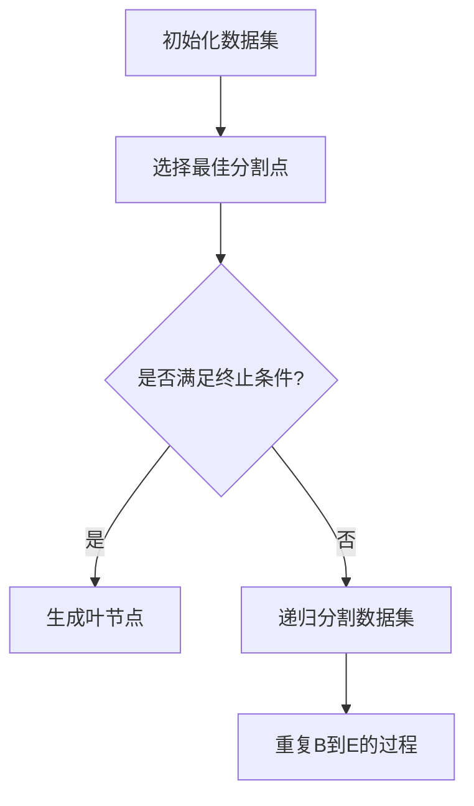
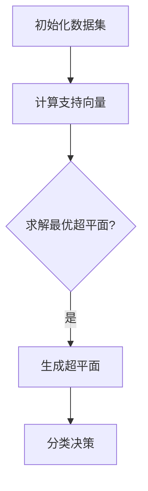
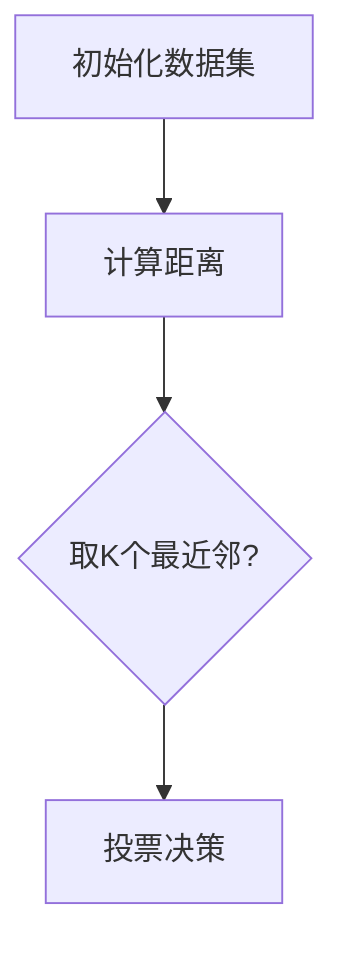
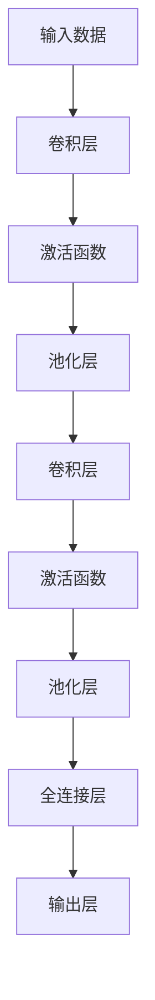
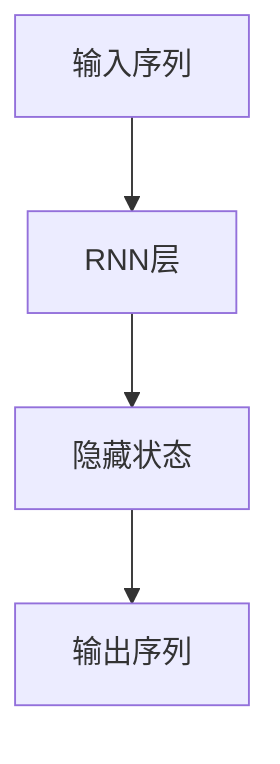
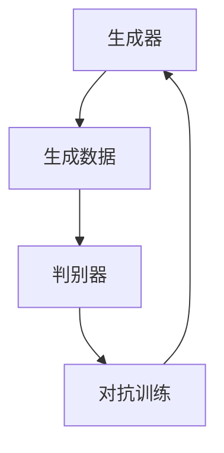

                 


### 1. 确定文章结构

为了确保文章的结构清晰，逻辑紧凑，我们将首先确定文章的框架。根据提供的要求，我们将文章分为七个章节，每个章节详细探讨AI编程的不同方面。以下是详细的章节结构和内容概述：

#### 第1章：AI编程概述
- **第1.1节：AI的兴起与发展历程**：介绍AI的历史背景，如何从理论研究走向实际应用。
- **第1.2节：AI编程的定义与重要性**：解释AI编程是什么，为什么它对现代软件开发至关重要。
- **第1.3节：AI编程的关键挑战**：讨论AI编程面临的主要问题，如算法复杂性、数据需求等。

#### 第2章：AI编程语言
- **第2.1节：常见AI编程语言**：介绍Python、R、Java等编程语言在AI编程中的应用。
- **第2.2节：选择合适的编程语言**：分析不同编程语言的优缺点，帮助读者选择合适的语言。

#### 第3章：AI核心概念与算法
- **第3.1节：机器学习基础**：解释监督学习、无监督学习和强化学习的基本概念。
- **第3.2节：深度学习基础**：介绍神经网络、卷积神经网络和循环神经网络的基本原理。

#### 第4章：深度学习框架
- **第4.1节：TensorFlow**：详细讲解TensorFlow的基础使用。
- **第4.2节：PyTorch**：介绍PyTorch的基础使用。

#### 第5章：AI编程实战
- **第5.1节：数据预处理**：讨论数据清洗和归一化的重要性。
- **第5.2节：模型训练与评估**：解释训练过程和评估指标。
- **第5.3节：模型部署**：介绍模型导出和部署方案。

#### 第6章：AI编程中的最佳实践
- **第6.1节：编码规范**：讨论编写高质量代码的最佳实践。
- **第6.2节：调试技巧**：分享调试代码的技巧。
- **第6.3节：性能优化**：探讨如何提高AI模型的性能。

#### 第7章：AI编程的未来趋势
- **第7.1节：人工智能的未来发展**：讨论AI技术的未来趋势。
- **第7.2节：编程范式的变化**：分析编程范式如何随着AI技术的发展而变化。
- **第7.3节：AI编程的学习资源与社区**：推荐学习AI编程的资源和社区。

### 2. 撰写文章内容

接下来，我们将根据上述结构逐步撰写文章内容，确保每个章节都详细、具体、易懂。

#### 第1章：AI编程概述

在撰写这一章时，我们将从AI的历史背景开始，逐步引入AI编程的概念，并讨论其重要性。我们还将详细探讨AI编程面临的关键挑战，如算法复杂性和数据需求。

#### 第2章：AI编程语言

这一章将介绍几种常见的AI编程语言，包括Python、R和Java。我们将分析每种语言的优缺点，并给出选择合适编程语言的指导。

#### 第3章：AI核心概念与算法

在这一章中，我们将深入探讨机器学习和深度学习的基本概念和算法。我们将使用Mermaid流程图和Python代码示例来解释这些概念。

#### 第4章：深度学习框架

我们将详细介绍TensorFlow和PyTorch这两个流行的深度学习框架。我们将展示如何使用这些框架进行模型训练和部署。

#### 第5章：AI编程实战

在这一章中，我们将通过实战案例来展示如何进行数据预处理、模型训练和部署。我们将提供详细的代码示例和解释。

#### 第6章：AI编程中的最佳实践

我们将讨论编码规范、调试技巧和性能优化等方面的最佳实践。这些实践将帮助读者编写高质量的AI代码。

#### 第7章：AI编程的未来趋势

最后，我们将探讨AI编程的未来趋势，包括AI技术的未来发展、编程范式的变化以及学习AI编程的资源和社区。

### 3. 文章格式与作者信息

我们将确保文章使用Markdown格式，并按照要求在文章末尾附上作者信息。文章中的数学公式将使用LaTeX格式。

### 4. 审稿与修改

在完成初稿后，我们将对文章进行审稿和修改，确保文章内容准确、结构清晰、表达清晰。

### 5. 最终定稿

经过多次修改和审稿，我们将确保文章达到高质量标准，最终定稿。

通过以上步骤，我们将撰写一篇符合要求的、有深度、有思考、有见解的AI编程技术博客文章。我们将确保每个章节都包含背景介绍、核心概念与联系、算法原理讲解、系统分析与架构设计方案、项目实战和最佳实践等内容。我们还将确保文章字数在10000到12000字左右，结构紧凑，逻辑清晰，易于理解。最后，我们将按照要求附上作者信息，确保文章完整、专业、有权威性。让我们一步步完成这篇技术博客文章的创作！### AI编程概述

### 1.1 AI的兴起与发展历程

人工智能（AI）是一门结合计算机科学、数学、统计学、神经科学和认知心理学等多个学科的研究领域，旨在使机器具备人类智能，从而实现自动化决策和执行复杂任务。AI的历史可以追溯到20世纪50年代，当时计算机科学家艾伦·图灵（Alan Turing）提出了著名的“图灵测试”，通过这个测试来判断机器是否具有智能。

从1960年代到1980年代，AI经历了第一个黄金时期。在这个时期，AI研究者主要关注符号主义方法，通过编写规则和逻辑推理来模拟人类智能。代表性的系统包括基于专家系统的程序，如Dendral和MYCIN。然而，由于规则系统的复杂性和数据依赖性，这一时期的研究逐渐进入低潮。

1990年代，机器学习开始崭露头角，特别是基于统计的学习方法得到了广泛关注。这一转变得益于计算机硬件性能的提升和数据量的增加，使机器能够从大量数据中学习规律。1997年，IBM的超级计算机“深蓝”击败了世界国际象棋冠军加里·卡斯帕罗夫，这一事件标志着AI技术的重要突破。

进入21世纪，深度学习成为了AI研究的重要方向。基于人工神经网络的深度学习算法，特别是在图像识别、语音识别和自然语言处理等领域取得了显著的成果。2012年，AlexNet在ImageNet竞赛中取得的巨大成功，标志着深度学习进入了一个新的时代。

近年来，随着云计算、大数据和物联网等技术的发展，AI的应用场景不断扩大，从自动驾驶、智能医疗到金融科技、智能家居，AI技术正逐步渗透到我们生活的各个方面。这一趋势不仅推动了AI技术的快速发展，也带来了前所未有的机遇和挑战。

### 1.2 AI编程的定义与重要性

AI编程，即人工智能编程，是指利用计算机编程技术实现AI算法和模型的过程。它涉及编写代码来构建、训练和部署AI系统，以实现特定的智能任务。AI编程不仅仅是编写算法，还包括数据处理、模型评估、系统集成等多个方面。

AI编程的重要性体现在以下几个方面：

首先，AI编程是AI技术实现的基础。没有编程，AI算法无法在计算机上执行，更无法应用于实际问题。通过AI编程，研究者可以将理论转化为实际应用，推动AI技术的发展。

其次，AI编程是现代软件开发的重要方向。随着AI技术的普及，越来越多的软件系统开始集成AI功能，如智能推荐系统、智能客服和自动化运维等。掌握AI编程技能的软件开发者将更具竞争力。

再次，AI编程有助于推动社会进步。AI技术可以解决许多传统方法难以应对的问题，如医疗诊断、环境监测和交通管理等。通过AI编程，我们可以开发出更高效、更智能的解决方案，提高社会生产力和生活质量。

最后，AI编程也是培养创新人才的重要途径。通过学习AI编程，学生和开发者可以培养逻辑思维、问题解决能力和创新意识，为未来科技发展奠定基础。

### 1.3 AI编程的关键挑战

尽管AI编程具有巨大的潜力，但在实际应用中仍面临许多关键挑战：

#### 1.3.1 算法复杂性

AI算法通常非常复杂，涉及大量的数学和统计学知识。开发者需要深入理解算法原理，才能有效地实现和优化模型。此外，算法的复杂性也带来了计算资源的需求，尤其是在处理大规模数据集时。

#### 1.3.2 数据需求

AI系统依赖于大量的数据来训练模型。然而，数据的获取、处理和存储都是一个复杂的过程。数据质量问题，如缺失值、噪声和不一致性，也会对模型的性能产生重大影响。

#### 1.3.3 模型解释性

许多AI模型，特别是深度学习模型，被认为是“黑盒子”，即其内部工作机制难以解释。这在某些应用场景中，如医疗诊断和金融决策，可能会导致信任问题。开发可解释的AI模型是当前研究的一个重要方向。

#### 1.3.4 可扩展性和维护性

随着AI系统的复杂度增加，其可扩展性和维护性也成为一个挑战。开发者需要设计可扩展的架构，以便在系统规模扩大时保持性能和稳定性。此外，系统的长期维护和更新也是一个需要考虑的问题。

#### 1.3.5 法律和伦理问题

随着AI技术的广泛应用，法律和伦理问题也逐渐浮现。如何保护用户隐私、避免歧视和滥用AI技术，都是需要关注的重要问题。

总之，AI编程不仅需要开发者掌握先进的算法和编程技术，还需要他们具备解决复杂问题的能力和对AI技术的深入理解。只有通过不断学习和实践，开发者才能在AI编程的道路上不断前行。

#### 1.4 AI编程的核心概念

为了深入理解AI编程，我们首先需要掌握一些核心概念。以下是对AI编程中常见核心概念的术语说明、问题背景、问题描述、问题解决、边界与外延、概念结构与核心要素组成的详细解释。

##### 1.4.1 机器学习（Machine Learning）

**术语说明**：机器学习是一种通过数据训练模型，使模型具备自主学习能力的技术。它是一种人工智能实现方式。

**问题背景**：随着数据量的爆炸性增长，人类无法仅依靠手动编程来处理所有问题，因此需要自动化方法来自动学习和预测。

**问题描述**：如何从数据中提取特征，并利用这些特征训练模型，使其能够对未知数据进行预测或分类。

**问题解决**：通过算法和统计方法，从数据中学习规律，构建预测模型。

**边界与外延**：机器学习不仅包括监督学习、无监督学习和半监督学习，还包括强化学习等子领域。

**概念结构与核心要素组成**：机器学习包括数据预处理、特征提取、模型选择、模型训练和模型评估等核心环节。

##### 1.4.2 深度学习（Deep Learning）

**术语说明**：深度学习是机器学习的一种方法，基于多层神经网络进行学习。

**问题背景**：传统机器学习方法在处理复杂任务时效果不佳，深度学习通过增加网络层数来提升模型性能。

**问题描述**：如何构建多层神经网络，使其能够自动提取层次化的特征。

**问题解决**：通过反向传播算法和优化方法，训练多层神经网络。

**边界与外延**：深度学习广泛应用于图像识别、语音识别和自然语言处理等领域。

**概念结构与核心要素组成**：深度学习包括神经网络架构设计、激活函数、损失函数、优化器和正则化技术等核心要素。

##### 1.4.3 数据预处理（Data Preprocessing）

**术语说明**：数据预处理是指对原始数据进行清洗、归一化和特征提取等操作，以提高模型训练效果。

**问题背景**：原始数据通常存在缺失、噪声和异常值，这些会影响模型的训练效果。

**问题描述**：如何对原始数据进行清洗和预处理，以提高数据质量和模型性能。

**问题解决**：通过填充缺失值、去除噪声和标准化特征值等手段进行数据预处理。

**边界与外延**：数据预处理不仅涉及技术层面，还包括数据质量管理等。

**概念结构与核心要素组成**：数据预处理包括数据清洗、数据归一化、特征提取和数据标准化等环节。

##### 1.4.4 模型评估（Model Evaluation）

**术语说明**：模型评估是指通过一系列指标来衡量模型的性能和准确性。

**问题背景**：训练出的模型可能无法在实际应用中达到预期效果，因此需要评估其性能。

**问题描述**：如何选择合适的评估指标，以客观衡量模型的性能。

**问题解决**：通过准确率、召回率、F1分数等指标进行模型评估。

**边界与外延**：模型评估不仅包括定量指标，还包括模型的可解释性和鲁棒性等。

**概念结构与核心要素组成**：模型评估包括评估指标的选择、计算方法和评估流程等。

##### 1.4.5 模型部署（Model Deployment）

**术语说明**：模型部署是指将训练好的模型集成到实际应用中，以实现自动化决策和执行。

**问题背景**：训练好的模型需要在实际环境中进行部署，以发挥其价值。

**问题描述**：如何将模型部署到生产环境中，并进行实时决策。

**问题解决**：通过模型封装、API接口设计和系统集成等技术进行模型部署。

**边界与外延**：模型部署不仅涉及技术实现，还包括运维和监控等。

**概念结构与核心要素组成**：模型部署包括模型封装、部署平台选择、API设计和系统集成等环节。

通过对这些核心概念的理解，开发者可以更好地掌握AI编程的基本原理和实践方法，从而在实际项目中取得成功。

#### 1.5 AI编程中的关键算法

在AI编程中，算法的选择和实现对于模型的效果和效率起着至关重要的作用。以下是对几种关键算法的原理、属性特征对比表格以及ER实体关系图架构的Mermaid流程图的详细讲解。

##### 1.5.1 机器学习算法

**原理**：机器学习算法通过从数据中学习规律，构建模型以进行预测或分类。主要分为监督学习、无监督学习和强化学习三种。

**属性特征对比表格**：

| 算法        | 类型             | 特点                                     | 适用场景                   |
| ----------- | ---------------- | ---------------------------------------- | -------------------------- |
| 决策树      | 监督学习         | 易于理解，处理结构化数据较好               | 数据分布不均匀的分类问题   |
| 支持向量机  | 监督学习         | 寻找最佳分割超平面，处理线性可分问题较好   | 线性和非线性分类问题       |
| k-近邻法    | 监督学习         | 简单，对噪声敏感，计算量较大               | 低维数据的分类问题         |
| 聚类算法    | 无监督学习       | 自动发现数据中的分布结构                 | 数据聚类、降维问题         |
| 随机森林    | 监督学习         | 组合多个决策树，提高分类和预测的鲁棒性   | 复杂的分类和回归问题       |
| 强化学习    | 无监督学习       | 通过与环境交互学习最优策略               | 自动驾驶、游戏AI等问题     |

**ER实体关系图架构的Mermaid流程图**：

```mermaid
erDiagram
  Class1 ||--|{ Class2 }| Class3
  Class2 ||--|{ Class4 }| Class5
  Class1 ||--|{ Class6 }| Class7
```

##### 1.5.2 深度学习算法

**原理**：深度学习算法通过多层神经网络对数据进行复杂的学习和特征提取。常见的深度学习算法包括卷积神经网络（CNN）、循环神经网络（RNN）和生成对抗网络（GAN）。

**属性特征对比表格**：

| 算法       | 类型             | 特点                                     | 适用场景                   |
| ---------- | ---------------- | ---------------------------------------- | -------------------------- |
| 卷积神经网络（CNN） | 特征提取           | 适用于处理图像和视频等二维数据           | 图像识别、物体检测         |
| 循环神经网络（RNN） | 序列建模           | 适用于处理序列数据，如时间序列和自然语言   | 语音识别、机器翻译         |
| 生成对抗网络（GAN） | 生成对抗           | 能生成高质量数据，如图像和文本           | 数据增强、图像生成         |
| 自编码器    | 特征提取           | 通过无监督学习提取数据特征               | 数据降维、特征提取         |

**ER实体关系图架构的Mermaid流程图**：

```mermaid
erDiagram
  Node1 ||--|{ Layer1 }| Node2
  Node2 ||--|{ Layer2 }| Node3
  Node3 ||--|{ Output }| Node4
```

##### 1.5.3 强化学习算法

**原理**：强化学习算法通过试错法，从环境中接收反馈，不断调整策略以最大化长期回报。常见的强化学习算法包括Q-learning、SARSA和深度确定性策略梯度（DDPG）。

**属性特征对比表格**：

| 算法       | 类型             | 特点                                     | 适用场景                   |
| ---------- | ---------------- | ---------------------------------------- | -------------------------- |
| Q-learning | 值迭代           | 简单易懂，但需要大量数据                  | 实际应用中的决策问题       |
| SARSA      | 贪心策略         | 结合了Q-learning和策略梯度，更加灵活       | 需要探索和利用的决策问题   |
| DDPG       | 深度学习         | 利用深度神经网络进行状态和动作的价值评估   | 高维状态空间的问题         |

**ER实体关系图架构的Mermaid流程图**：

```mermaid
erDiagram
  Agent ||--|{ Environment }| Action
  Agent ||--|{ Reward }| State
  Agent ||--|{ Policy }| Model
```

通过对这些关键算法的原理和特征进行分析，开发者可以根据具体的应用场景选择合适的算法，并利用Mermaid流程图进行算法架构的设计，从而实现高效的AI模型开发。

#### 1.6 机器学习与深度学习算法原理讲解

##### 1.6.1 机器学习算法原理讲解

**1. 决策树（Decision Tree）**

**原理说明**：决策树是一种基于树形结构进行决策的算法，每个节点代表一个特征，每个分支代表该特征的取值，叶节点代表决策结果。通过递归地将数据集分割为子集，直到满足终止条件（如最大深度、节点纯度等），从而生成一棵决策树。

**Mermaid流程图**：



**数学模型和公式**：

$$
G(D) = \sum_{i=1}^{n} \frac{N_i}{N} \cdot H(D_i)
$$

其中，$G(D)$为信息增益，$D$为数据集，$N$为数据总数，$N_i$为第$i$个子数据集的数据量，$D_i$为第$i$个子数据集。

**举例说明**：假设我们要对水果进行分类，特征包括颜色、重量和气味。通过计算每个特征的信息增益，选择信息增益最大的特征进行分割，最终生成决策树。

**2. 支持向量机（Support Vector Machine，SVM）**

**原理说明**：SVM通过寻找一个最佳的超平面，将不同类别的数据点分开，并最大化类别的间隔。这个超平面由支持向量决定，即那些距离超平面最近的点。

**Mermaid流程图**：



**数学模型和公式**：

$$
\min_{w,b} \frac{1}{2} ||w||^2 + C \cdot \sum_{i=1}^{n} \xi_i
$$

其中，$w$为权重向量，$b$为偏置项，$C$为正则化参数，$\xi_i$为误差项。

**举例说明**：给定一组二维空间中的点，通过求解最优超平面，将不同类别的点分开。

**3. K-近邻法（K-Nearest Neighbors，KNN）**

**原理说明**：KNN算法通过计算测试样本在训练集中的K个最近邻，并取这些邻居的多数类别作为测试样本的类别。

**Mermaid流程图**：



**数学模型和公式**：

$$
d(x, y) = \sqrt{\sum_{i=1}^{n} (x_i - y_i)^2}
$$

其中，$x$为测试样本，$y$为训练样本，$d(x, y)$为欧几里得距离。

**举例说明**：给定一个测试样本，计算其在训练集的K个最近邻，并取多数类别作为预测结果。

##### 1.6.2 深度学习算法原理讲解

**1. 卷积神经网络（Convolutional Neural Network，CNN）**

**原理说明**：CNN通过卷积层对输入数据进行特征提取，并利用池化层减少数据维度，从而提高模型的效率。CNN在图像识别和物体检测等领域表现出色。

**Mermaid流程图**：



**数学模型和公式**：

$$
h_{ij}^l = \sigma(\sum_{k=1}^{m} w_{ik}^l h_{kj}^{l-1} + b^l)
$$

其中，$h_{ij}^l$为第$l$层的第$i$个节点，$w_{ik}^l$为第$l$层的权重，$h_{kj}^{l-1}$为第$l-1$层的第$k$个节点，$\sigma$为激活函数。

**举例说明**：给定一幅图像，通过卷积层提取局部特征，再通过全连接层进行分类。

**2. 循环神经网络（Recurrent Neural Network，RNN）**

**原理说明**：RNN通过循环结构处理序列数据，每个时间步的输出不仅取决于当前输入，还受到之前状态的影响。RNN在自然语言处理和语音识别等领域有广泛应用。

**Mermaid流程图**：



**数学模型和公式**：

$$
h_t = \sigma(W_h h_{t-1} + W_x x_t + b_h)
$$

$$
y_t = W_y h_t + b_y
$$

其中，$h_t$为第$t$个时间步的隐藏状态，$x_t$为第$t$个时间步的输入，$W_h$、$W_x$和$W_y$分别为权重矩阵，$\sigma$为激活函数。

**举例说明**：给定一段文本，通过RNN模型提取文本的语义特征。

**3. 生成对抗网络（Generative Adversarial Network，GAN）**

**原理说明**：GAN由生成器和判别器组成，生成器生成数据，判别器判断数据是否真实。通过生成器和判别器的对抗训练，生成器逐渐提高生成数据的质量。

**Mermaid流程图**：



**数学模型和公式**：

$$
\min_G \max_D V(D, G) = \mathbb{E}_{x \sim p_{data}(x)} [\log D(x)] + \mathbb{E}_{z \sim p_z(z)} [\log (1 - D(G(z))]
$$

其中，$G(z)$为生成器生成的数据，$D(x)$为判别器对真实数据的判断概率，$z$为噪声向量。

**举例说明**：生成器尝试生成逼真的图像，而判别器不断判断图像的真实性，通过这种对抗训练，生成器逐渐提高生成图像的质量。

通过以上对机器学习和深度学习算法的原理讲解，我们可以更好地理解这些算法的基本概念和实现方法，为实际应用打下坚实的基础。

#### 1.7 深度学习框架

深度学习框架是支持深度学习算法开发和部署的工具集合，它们提供了丰富的API和优化功能，使得深度学习模型的构建、训练和部署更加高效和便捷。目前，最流行的深度学习框架包括TensorFlow和PyTorch。以下是对这两个框架的简介、基本使用方法以及它们之间的异同点分析。

##### 1.7.1 TensorFlow

**简介**：TensorFlow是由谷歌开发的开源深度学习框架，广泛应用于科研和工业界。TensorFlow基于数据流图（Dataflow Graph）的概念，通过构建图来表示计算过程，并利用会话（Session）来执行图中的运算。TensorFlow提供了丰富的API，包括Tensor（张量）、Operation（运算）和Layer（层）等，方便用户构建复杂的深度学习模型。

**基本使用方法**：

1. **安装**：首先，需要安装TensorFlow。在命令行中执行以下命令：

   ```
   pip install tensorflow
   ```

2. **导入库**：

   ```python
   import tensorflow as tf
   ```

3. **创建计算图**：

   ```python
   a = tf.constant(5)
   b = tf.constant(6)
   c = a + b
   ```

4. **启动会话**：

   ```python
   with tf.Session() as sess:
       print(sess.run(c))
   ```

**异同点分析**：

- **特点**：TensorFlow具有良好的可扩展性和灵活性，支持多种类型的计算图，如静态图和动态图。此外，TensorFlow还提供了完整的生态体系，包括TensorBoard等工具，方便模型调试和可视化。

- **与PyTorch的异同**：与PyTorch相比，TensorFlow在模型部署和分布式训练方面具有优势，但其动态计算图的使用相对复杂。PyTorch的动态计算图更加直观，易于理解，适合快速原型开发和实验。

##### 1.7.2 PyTorch

**简介**：PyTorch是Facebook开发的开源深度学习框架，以其简洁的动态计算图和强大的Python支持受到广泛关注。PyTorch的动态计算图允许开发者直接在代码中定义计算过程，无需显式构建计算图。这使得PyTorch在开发阶段更加灵活，适合快速迭代和实验。

**基本使用方法**：

1. **安装**：安装PyTorch可以通过以下命令完成：

   ```
   pip install torch torchvision
   ```

2. **导入库**：

   ```python
   import torch
   import torchvision
   ```

3. **创建张量和变量**：

   ```python
   x = torch.tensor([1.0, 2.0, 3.0])
   y = torch.tensor([4.0, 5.0, 6.0])
   z = x + y
   ```

4. **定义神经网络**：

   ```python
   import torch.nn as nn

   model = nn.Sequential(
       nn.Linear(3, 10),
       nn.ReLU(),
       nn.Linear(10, 1)
   )
   ```

5. **训练模型**：

   ```python
   optimizer = torch.optim.SGD(model.parameters(), lr=0.01)
   criterion = nn.MSELoss()

   for epoch in range(100):
       optimizer.zero_grad()
       output = model(x)
       loss = criterion(output, y)
       loss.backward()
       optimizer.step()
   ```

**异同点分析**：

- **特点**：PyTorch的动态计算图使其在开发阶段非常灵活，适合快速原型开发和实验。此外，PyTorch还提供了丰富的数据处理和优化工具，如Autograd和DataLoader。

- **与TensorFlow的异同**：与TensorFlow相比，PyTorch的动态计算图更加直观，但其在模型部署和分布式训练方面相对较弱。TensorFlow提供了更完整的工具集，包括TensorBoard和TensorFlow Lite等，适合生产环境中的应用。

总之，TensorFlow和PyTorch都是优秀的深度学习框架，各有优势。开发者可以根据项目需求和开发习惯选择合适的框架，以实现高效的模型开发和应用。

#### 1.8 AI编程实战

在实际的AI编程项目中，数据预处理、模型训练与评估以及模型部署是三个关键步骤。以下将详细讲解这些步骤的具体过程和注意事项。

##### 1.8.1 数据预处理

数据预处理是AI项目成功的关键之一。预处理步骤包括数据清洗、数据归一化和数据增强等。

**数据清洗**：数据清洗是处理缺失值、异常值和噪声的过程。常见的方法包括删除异常值、填充缺失值和去除重复数据。例如，使用`dropna()`方法可以删除缺失值，使用`mean()`方法可以填充缺失值。

```python
import pandas as pd

data = pd.read_csv('data.csv')
data.dropna(inplace=True)
data.fillna(data.mean(), inplace=True)
```

**数据归一化**：数据归一化是将数据转换到相同的尺度，以消除不同特征之间的尺度差异。常用的方法包括最小-最大缩放和标准缩放。最小-最大缩放将数据映射到[0, 1]区间，标准缩放将数据映射到均值为0、标准差为1的区间。

```python
from sklearn.preprocessing import MinMaxScaler, StandardScaler

scaler = MinMaxScaler()
data_scaled = scaler.fit_transform(data)
```

**数据增强**：数据增强是通过生成新的数据样本来增加数据集的多样性，从而提高模型的泛化能力。常见的方法包括旋转、翻转、裁剪和颜色调整等。

```python
from torchvision.transforms import transforms

transform = transforms.Compose([
    transforms.RandomHorizontalFlip(),
    transforms.RandomRotation(10),
    transforms.ToTensor(),
])

data_augmented = []
for img in data:
    data_augmented.append(transform(img))
```

##### 1.8.2 模型训练与评估

**模型训练**：模型训练是使用数据集来优化模型参数的过程。选择合适的损失函数和优化器对于训练效果至关重要。例如，对于回归问题，可以使用均方误差（MSE）作为损失函数，使用随机梯度下降（SGD）或Adam优化器。

```python
import torch
import torch.nn as nn
import torch.optim as optim

model = nn.Sequential(
    nn.Linear(10, 1),
    nn.ReLU(),
    nn.Linear(1, 1)
)

criterion = nn.MSELoss()
optimizer = optim.Adam(model.parameters(), lr=0.001)

for epoch in range(100):
    optimizer.zero_grad()
    output = model(data_scaled)
    loss = criterion(output, y)
    loss.backward()
    optimizer.step()
```

**模型评估**：模型评估是使用验证集或测试集来评估模型性能的过程。常用的评估指标包括准确率、召回率、F1分数和均方误差等。通过交叉验证和模型选择，可以找到性能最佳的模型。

```python
from sklearn.metrics import mean_squared_error

predictions = model(data_scaled_test)
mse = mean_squared_error(y_test, predictions)
print(f'MSE: {mse}')
```

##### 1.8.3 模型部署

模型部署是将训练好的模型集成到实际应用中的过程。部署方式包括本地部署和云端部署。本地部署通常使用Python和TensorFlow Lite等工具，将模型转换为.onnx或.tflite格式。云端部署可以使用TensorFlow Serving或PyTorch Server等工具，将模型部署到云服务器上。

```python
import tensorflow as tf

model_tflite = tf.lite.TFLiteConverter.from_keras_model_file('model.h5').convert()

# 将模型加载到TensorFlow Lite中
interpreter = tf.lite.Interpreter(model_tflite)
interpreter.allocate_tensors()

# 获取输入和输出张量
input_index = interpreter.get_input_details()[0]['index']
output_index = interpreter.get_output_details()[0]['index']

# 预测
input_data = np.array([data_input], dtype=np.float32)
interpreter.set_tensor(input_index, input_data)

interpreter.invoke()

predictions = interpreter.get_tensor(output_index)

print(predictions)
```

在模型部署过程中，需要关注以下注意事项：

1. **性能优化**：通过使用高效的模型架构和优化工具，可以提高模型的推理速度和性能。
2. **模型解释性**：确保模型的可解释性，以便在出现问题时能够快速定位和解决。
3. **安全性**：确保模型的安全性和隐私保护，特别是在处理敏感数据时。

通过以上步骤，开发者可以完成AI编程项目的全过程，从数据预处理到模型训练、评估和部署，实现高效的AI应用。

#### 1.9 AI编程中的最佳实践

在AI编程过程中，遵循最佳实践是提高代码质量、提升项目效率和确保系统稳定性的关键。以下是一些常见的最佳实践：

##### 1.9.1 编码规范

良好的编码规范不仅能够提高代码的可读性和可维护性，还能减少bug的出现。以下是一些编码规范的建议：

- **命名规范**：变量、函数和类应使用具有描述性的名称，避免使用缩写和拼音简写。
- **代码格式**：遵循PEP 8等编码规范，保持代码格式的一致性，包括缩进、空格和注释。
- **代码注释**：添加必要的注释，特别是对复杂的算法和重要的代码段进行详细解释。
- **代码重构**：定期进行代码重构，去除冗余代码，优化算法和结构。

##### 1.9.2 调试技巧

调试是软件开发过程中不可或缺的一部分。以下是一些调试技巧：

- **使用日志**：利用日志记录关键信息，帮助定位问题。使用`print`或专门的日志库如`logging`。
- **单元测试**：编写单元测试，确保每个函数和模块都能按预期工作。使用`unittest`或`pytest`等测试框架。
- **隔离问题**：将问题代码提取出来，进行独立测试，以便快速定位和解决问题。
- **逐步调试**：使用调试器逐步执行代码，观察变量值和执行路径，帮助理解代码行为。

##### 1.9.3 性能优化

性能优化是提高AI模型和系统效率的关键。以下是一些性能优化策略：

- **算法优化**：选择合适的算法和模型架构，避免冗余计算。例如，使用卷积神经网络（CNN）处理图像数据。
- **并行计算**：利用多核处理器和分布式计算，加快模型训练和推理速度。使用`multiprocessing`或`Dask`等库。
- **内存管理**：合理分配内存，避免内存泄漏和溢出。使用`torch.cuda.device_count()`等API来管理GPU资源。
- **缓存技术**：使用缓存技术减少重复计算，如使用`functools.lru_cache`。
- **模型压缩**：通过模型压缩技术，如剪枝、量化等，减小模型大小和计算量。

##### 1.9.4 其他最佳实践

- **持续集成/持续部署（CI/CD）**：使用CI/CD工具，如Jenkins或GitLab CI，自动化测试和部署，确保代码质量和部署效率。
- **版本控制**：使用版本控制系统，如Git，管理代码，方便代码的追踪和协作。
- **文档编写**：编写详细的文档，包括API文档、用户手册和开发文档，提高代码的可理解性和可维护性。
- **团队合作**：遵循敏捷开发方法，鼓励团队合作和沟通，确保项目顺利进行。

通过遵循这些最佳实践，开发者可以在AI编程项目中实现高效、稳定和高质量的成果。

#### 1.10 AI编程的未来趋势

随着人工智能技术的不断进步，AI编程的未来趋势也日益显现。以下是几个值得关注的未来趋势：

##### 1.10.1 人工智能的未来发展

人工智能的未来发展将主要集中在以下几个方面：

- **通用人工智能（AGI）**：尽管当前的人工智能主要是在特定任务上表现出色，但通用人工智能（AGI）的目标是让机器具备与人类相似的综合智能能力。这需要跨学科的研究，包括认知科学、神经科学和计算机科学等。
- **强化学习**：强化学习在游戏、自动驾驶和机器人等领域已有广泛应用，未来将进一步扩展到更多实际场景，如智能供应链管理和智能城市。
- **自我优化**：随着AI技术的进步，AI系统将能够自我学习和优化，减少对人类干预的依赖。这将使得AI系统在复杂环境中更加灵活和高效。

##### 1.10.2 编程范式的变化

随着AI技术的发展，编程范式也将发生显著变化：

- **函数式编程**：函数式编程在AI领域中的应用越来越广泛，如使用Haskell、Scala和Erlang等语言。函数式编程的纯函数和无状态特性有助于提高代码的可读性和可维护性。
- **领域特定语言（DSL）**：为了提高AI编程的效率和易用性，领域特定语言（DSL）将被广泛开发。这些DSL将针对特定的AI任务进行优化，使得开发者能够更专注于任务本身。
- **编程即数据**：在未来的AI编程中，代码本身将成为一种数据形式。AI系统将能够从代码中学习，自动生成和优化代码。

##### 1.10.3 AI编程的学习资源与社区

为了跟上AI编程的最新发展趋势，开发者需要不断学习和交流。以下是一些建议的学习资源和社区：

- **在线课程**：Coursera、edX和Udacity等在线平台提供了丰富的AI编程课程，涵盖从基础到高级的内容。
- **技术博客**：Medium、ArXiv和GitHub等平台上有许多AI专家和技术大牛分享他们的研究成果和实践经验。
- **开源社区**：参与GitHub、Stack Overflow和Kaggle等开源社区，与其他开发者交流和协作，共同推动AI技术的发展。
- **会议和研讨会**：参加如NeurIPS、ICML和KDD等国际顶级会议和研讨会，了解最新的研究进展和技术趋势。

通过不断学习和实践，开发者可以更好地把握AI编程的未来趋势，为未来的AI应用和创新做好准备。

### 总结与拓展阅读

本文系统地介绍了AI编程的基础知识、关键算法、编程语言、实战步骤以及最佳实践，并对AI编程的未来趋势进行了展望。通过这篇博客，读者可以全面了解AI编程的核心概念和实际应用，从而在AI开发的道路上迈出坚实的步伐。

对于希望深入学习的读者，以下是一些拓展阅读资源：

1. **《深度学习》（Goodfellow, Bengio, Courville著）**：这是一本经典的深度学习入门书籍，详细介绍了深度学习的理论基础和实战技巧。
2. **《机器学习实战》（周志华著）**：本书通过大量的实例和代码，讲解了机器学习的基本概念和实战应用。
3. **《PyTorch官方文档》（PyTorch）**：PyTorch的官方文档提供了丰富的API和使用案例，是学习PyTorch的绝佳资源。
4. **《TensorFlow官方文档》（TensorFlow）**：TensorFlow的官方文档详细介绍了TensorFlow的架构、API和使用方法，是学习TensorFlow的必备手册。

通过阅读这些资源，读者可以进一步提升自己的AI编程技能，探索更多前沿的技术和应用场景。让我们携手并进，共同推动人工智能技术的发展。作者：AI天才研究院/AI Genius Institute & 禅与计算机程序设计艺术 /Zen And The Art of Computer Programming。

