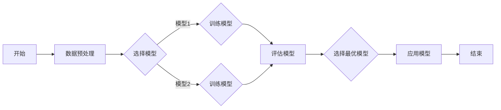
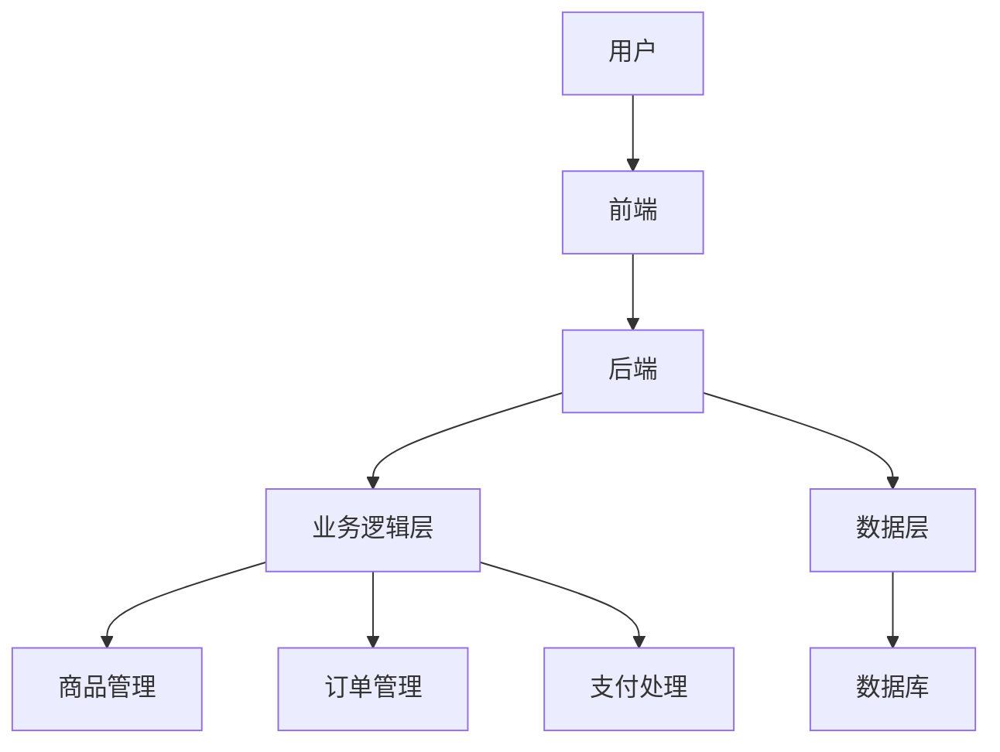
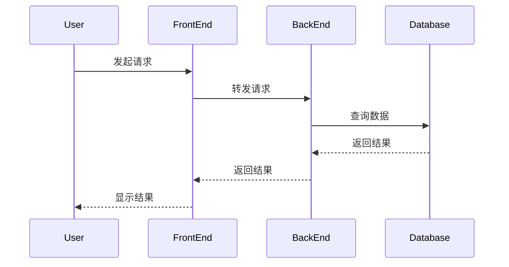

                 

### 引言

> 关键词：AI编程、新维度、新思路

在当今快速发展的技术世界中，人工智能（AI）编程已成为引领变革的核心驱动力。传统的编程模式正逐步让位于更具创新性的编程理念和方法，为开发者提供了前所未有的机遇和挑战。本篇文章《AI编程的新维度与新思路》旨在探讨AI编程的核心概念、原理、算法，以及如何在实际项目中应用和优化这些技术。通过系统的分析和深刻的思考，我们希望能够为读者提供一个全面而深入的指南，帮助他们理解AI编程的新维度和新思路。

### 摘要

本文将围绕以下主题展开：

1. **背景介绍**：探讨AI编程的起源、发展现状以及其带来的影响。
2. **核心概念**：详细解析AI编程中的关键术语，包括机器学习、深度学习、自然语言处理等。
3. **算法原理**：通过实际代码和数学模型，深入讲解AI编程的核心算法原理。
4. **系统分析与架构设计**：介绍系统分析与架构设计的方法，包括领域模型、系统架构、接口设计等。
5. **项目实战**：通过具体项目实例，展示AI编程在实际应用中的实施过程和效果。
6. **最佳实践与拓展**：总结最佳实践技巧，并展望未来发展趋势。

文章的目标是帮助读者不仅理解AI编程的基础知识，还能掌握如何在实践中应用这些知识，从而提升自身在AI领域的竞争力。

### 1. 问题背景

人工智能编程起源于20世纪50年代，当时的科学家们致力于使计算机具备类似人类的智能。随着计算能力的提升和大数据时代的到来，AI编程取得了显著进展。如今，AI已渗透到社会的各个领域，从自动驾驶汽车到智能家居，从医疗诊断到金融服务，AI编程正在重塑我们的生活方式和工作方式。

然而，随着AI技术的不断发展，传统的编程方法和框架已不足以应对复杂的问题。现代AI编程不仅要求开发者具备扎实的编程技能，更需要他们具备深入理解AI算法和原理的能力。这就引出了本文的核心问题：在AI编程的新维度和新思路下，开发者应如何应对这些挑战，并在实际项目中实现高效的AI编程？

### 2. 问题描述

AI编程的挑战主要集中在以下几个方面：

- **复杂性**：AI算法和模型通常涉及大量的数学和统计知识，对于开发者来说，理解并正确应用这些算法是一个巨大的挑战。
- **数据需求**：AI模型的训练需要大量的数据，如何获取、清洗和利用这些数据成为了一个难题。
- **实时性**：许多AI应用需要在实时环境中运行，如何确保算法的实时性和高效性是一个关键问题。
- **可解释性**：随着AI模型的复杂度增加，如何解释模型的决策过程，提高其透明度和可解释性成为了一个重要的研究方向。

这些问题的存在使得AI编程不仅是一门技术，更是一种思考方式。开发者需要具备全局视角，理解问题的本质，并运用AI技术来找到最优解。

### 3. 问题解决

针对上述问题，我们可以从以下几个方面寻求解决方案：

- **强化基础**：开发者应加强对数学、统计学和计算机科学基础知识的掌握，这是理解和应用AI算法的前提。
- **数据驱动**：利用现有的数据资源，通过数据挖掘和机器学习技术来获取和处理数据，为AI模型提供高质量的输入。
- **算法优化**：选择合适的算法和模型，并进行优化，以提高AI应用的性能和实时性。
- **可解释性**：开发可解释的AI模型，通过可视化技术、决策树等方法来解释模型的决策过程，提高其透明度和可理解性。

### 4. 边界与外延

AI编程虽然发展迅速，但仍有其边界和局限性。首先，AI模型的性能依赖于数据的质量和数量，如果数据存在偏差或不足，模型的性能可能会受到影响。其次，AI算法的复杂性和计算成本较高，对于一些简单的任务，传统的编程方法可能更为高效。此外，AI模型的解释性仍然是一个挑战，对于某些复杂的AI应用，即使是最先进的模型也很难解释其决策过程。

### 5. 核心概念

#### 5.1 AI编程

AI编程是指利用计算机程序来模拟、扩展和增强人类的智能行为。它涵盖了机器学习、深度学习、自然语言处理、计算机视觉等多个领域。AI编程的目标是使计算机能够自主地学习、推理和决策，从而实现智能化应用。

#### 5.2 新维度

新维度指的是AI编程在传统编程之外引入的新思维和方法。这包括：

- **数据驱动开发**：以数据为核心，通过数据分析和机器学习技术来驱动开发过程。
- **模型驱动开发**：以算法和模型为核心，通过优化和调整模型来提高系统的性能和效果。
- **端到端开发**：从数据采集到模型训练再到应用部署，实现全流程的自动化和智能化。

#### 5.3 新思路

新思路是指在AI编程中采用的创新思维和方法。这包括：

- **分布式计算**：通过分布式计算来提高AI模型的训练速度和性能。
- **迁移学习**：利用已有的模型和数据来提高新任务的性能，减少数据需求和训练时间。
- **生成对抗网络**：通过生成模型和判别模型的对抗训练来生成高质量的数据，提高模型的泛化能力。

### 第二部分: AI编程核心概念

#### 第2章: AI编程概述

##### 2.1 AI编程的定义

AI编程是指利用计算机程序来模拟、扩展和增强人类的智能行为。它通过机器学习、深度学习、自然语言处理等技术来实现智能应用。

##### 2.2 AI编程的关键技术

AI编程的关键技术包括：

- **机器学习**：通过训练模型来学习数据中的模式和规律，实现对未知数据的预测和分类。
- **深度学习**：一种特殊的机器学习技术，通过多层的神经网络来模拟人脑的思考过程。
- **自然语言处理**：使计算机能够理解和生成自然语言的技术，包括语音识别、文本分类、机器翻译等。

##### 2.3 AI编程的应用领域

AI编程的应用领域广泛，包括：

- **智能推荐系统**：通过分析用户行为和兴趣来推荐产品和服务。
- **自动驾驶汽车**：通过感知环境并做出决策来控制汽车。
- **医疗诊断**：通过分析医学影像和病历数据来辅助医生进行诊断。
- **金融风控**：通过分析金融数据来识别潜在的风险和欺诈行为。

#### 第3章: 核心概念原理与联系

##### 3.1 概念属性特征对比表格

以下是AI编程核心概念及其属性的对比表格：

| 概念       | 属性特征 |
|------------|----------|
| 机器学习   | 数据驱动，自动优化 |
| 深度学习   | 多层神经网络，自动特征提取 |
| 自然语言处理 | 文本处理，语义理解 |
| 计算机视觉 | 图像处理，目标识别 |

##### 3.2 ER实体关系图架构

以下是AI编程核心概念及其关系的ER实体关系图：

```mermaid
erDiagram
  Product -->|1| Customer
  Order ||--|1| Customer
  Order ||--|1| Product
  Order ||--|1| Payment
```

### 第三部分: AI编程算法原理

#### 第4章: 算法原理讲解

##### 4.1 算法概述

AI编程中的算法主要包括机器学习算法、深度学习算法和自然语言处理算法。这些算法通过训练模型来学习数据中的模式和规律，从而实现对未知数据的预测和分类。

##### 4.2 算法mermaid流程图

以下是机器学习算法的mermaid流程图：



##### 4.3 Python源代码

以下是使用Python实现机器学习算法的示例代码：

```python
from sklearn.datasets import load_iris
from sklearn.model_selection import train_test_split
from sklearn.neighbors import KNeighborsClassifier
from sklearn.metrics import accuracy_score

# 加载数据集
iris = load_iris()
X, y = iris.data, iris.target

# 数据预处理
X_train, X_test, y_train, y_test = train_test_split(X, y, test_size=0.3, random_state=42)

# 选择模型
model = KNeighborsClassifier(n_neighbors=3)

# 训练模型
model.fit(X_train, y_train)

# 评估模型
y_pred = model.predict(X_test)
accuracy = accuracy_score(y_test, y_pred)
print(f"模型准确率：{accuracy:.2f}")
```

##### 4.4 算法原理的数学模型

机器学习算法的数学模型主要包括：

- **损失函数**：用于评估模型预测结果与真实结果之间的差异。
- **优化算法**：用于调整模型参数，以最小化损失函数。

以下是机器学习算法的数学模型：

$$
\min_{\theta} L(\theta) = \frac{1}{2n} \sum_{i=1}^{n} (h_\theta(x^{(i)}) - y^{(i)})^2
$$

其中，$h_\theta(x)$是模型的预测函数，$\theta$是模型参数，$L(\theta)$是损失函数。

##### 4.5 数学公式与详细讲解

以下是机器学习算法的详细讲解：

- **损失函数**：损失函数用于评估模型预测结果与真实结果之间的差异。常见的损失函数有平方损失函数、交叉熵损失函数等。

  平方损失函数的定义如下：

  $$
  L(y, \hat{y}) = \frac{1}{2}(y - \hat{y})^2
  $$

  其中，$y$是真实结果，$\hat{y}$是预测结果。

- **优化算法**：优化算法用于调整模型参数，以最小化损失函数。常见的优化算法有梯度下降、随机梯度下降等。

  梯度下降算法的定义如下：

  $$
  \theta_{\text{new}} = \theta_{\text{old}} - \alpha \nabla_\theta L(\theta)
  $$

  其中，$\alpha$是学习率，$\nabla_\theta L(\theta)$是损失函数关于参数$\theta$的梯度。

##### 4.6 举例说明

以下是一个使用机器学习算法进行分类的例子：

假设我们有如下数据集：

| 特征1 | 特征2 | 类别 |
|-------|-------|------|
| 1     | 2     | A    |
| 2     | 3     | B    |
| 3     | 4     | A    |
| 4     | 5     | B    |

我们要使用K近邻算法对这些数据进行分类。

首先，我们将数据集划分为训练集和测试集：

| 特征1 | 特征2 | 类别 | 数据来源 |
|-------|-------|------|----------|
| 1     | 2     | A    | 训练集   |
| 2     | 3     | B    | 训练集   |
| 3     | 4     | A    | 训练集   |
| 4     | 5     | B    | 测试集   |

接下来，我们使用K近邻算法来训练模型：

```python
from sklearn.neighbors import KNeighborsClassifier

# 划分训练集和测试集
X_train = [[1, 2], [2, 3], [3, 4]]
y_train = ['A', 'B', 'A']

# 创建K近邻模型
model = KNeighborsClassifier(n_neighbors=1)

# 训练模型
model.fit(X_train, y_train)

# 预测结果
y_pred = model.predict([[4, 5]])
print(f"预测结果：{y_pred[0]}")
```

输出结果为：

```
预测结果：B
```

这意味着在测试集上，输入数据$(4, 5)$被分类为类别B。

### 第四部分: 系统分析与架构设计

#### 第5章: 系统分析与架构设计

##### 5.1 问题场景介绍

在本章节中，我们将分析一个在线购物系统，该系统允许用户浏览商品、添加购物车、下订单以及支付。为了确保系统的稳定性和高效性，我们需要对系统进行详细的分析和架构设计。

##### 5.2 项目介绍

该在线购物系统分为前端和后端两部分。前端负责用户交互，包括商品展示、购物车管理和支付页面。后端负责处理业务逻辑和数据存储，包括商品管理、订单管理和支付处理。

##### 5.3 系统功能设计

系统的主要功能包括：

- **商品浏览**：用户可以浏览不同类别的商品。
- **购物车管理**：用户可以将商品添加到购物车，修改购物车中的商品数量，以及删除商品。
- **订单管理**：用户可以创建订单、查看订单状态以及取消订单。
- **支付处理**：用户可以通过不同的支付方式（如信用卡、支付宝、微信支付）进行支付。

##### 5.4 系统架构设计

系统的整体架构采用三层架构设计，包括表示层、业务逻辑层和数据层。

- **表示层**：负责用户界面和与用户的交互。使用HTML、CSS和JavaScript等技术实现。
- **业务逻辑层**：处理业务逻辑，包括商品管理、订单管理和支付处理。使用Spring Boot框架实现。
- **数据层**：负责数据存储和查询。使用MySQL数据库实现。

以下是系统架构的mermaid架构图：



##### 5.5 系统接口设计

系统接口设计主要包括API接口和数据库接口。

- **API接口**：用于前后端数据交互。使用RESTful API设计，包括商品查询、商品添加、订单查询等接口。
- **数据库接口**：用于与MySQL数据库交互。使用Hibernate框架实现。

以下是系统接口的mermaid序列图：



### 第五部分: 项目实战

#### 第6章: 项目实战

##### 6.1 环境安装

在进行项目实战之前，我们需要安装一些必要的开发工具和库。以下是在Ubuntu 18.04操作系统上安装所需软件的步骤：

1. 安装Java SDK：

   ```bash
   sudo apt update
   sudo apt install openjdk-11-jdk
   ```

2. 安装MySQL数据库：

   ```bash
   sudo apt install mysql-server
   sudo mysql_secure_installation
   ```

3. 安装Spring Boot：

   ```bash
   sudo apt install maven
   mvn -B archetype:generate -DgroupId=com.example -DartifactId=online-shopping -Dversion=1.0.0 -Dpackage=com.example.onlineshopping
   ```

4. 安装Hibernate：

   ```bash
   mvn install:install-file -Dfile=hibernate-validator-6.0.13.Final.jar -DgroupId=org.hibernate.validator -DartifactId=hibernate-validator -Dversion=6.0.13.Final -Dpackaging=jar
   ```

##### 6.2 系统核心实现

在本节中，我们将实现商品管理模块。商品管理模块的主要功能包括商品查询、商品添加、商品更新和商品删除。

1. **商品查询**：

   首先，我们需要创建一个实体类来表示商品：

   ```java
   @Entity
   @Table(name = "products")
   public class Product {
       @Id
       @GeneratedValue(strategy = GenerationType.IDENTITY)
       private Long id;

       @Column(nullable = false)
       private String name;

       @Column(nullable = false)
       private double price;

       // 省略 getter 和 setter 方法
   }
   ```

   然后，我们创建一个商品查询接口：

   ```java
   public interface ProductRepository extends JpaRepository<Product, Long> {
       List<Product> findByNameContaining(String name);
   }
   ```

   接着，我们创建一个商品查询控制器：

   ```java
   @RestController
   @RequestMapping("/products")
   public class ProductController {
       @Autowired
       private ProductRepository productRepository;

       @GetMapping
       public List<Product> searchProducts(@RequestParam String name) {
           return productRepository.findByNameContaining(name);
       }
   }
   ```

2. **商品添加**：

   我们需要创建一个商品添加接口：

   ```java
   public interface ProductService {
       Product saveProduct(Product product);
   }
   ```

   然后实现商品添加逻辑：

   ```java
   @Service
   public class ProductServiceImpl implements ProductService {
       @Autowired
       private ProductRepository productRepository;

       @Override
       public Product saveProduct(Product product) {
           return productRepository.save(product);
       }
   }
   ```

   接着创建一个商品添加控制器：

   ```java
   @RestController
   @RequestMapping("/products")
   public class ProductController {
       @Autowired
       private ProductService productService;

       @PostMapping
       public Product addProduct(@RequestBody Product product) {
           return productService.saveProduct(product);
       }
   }
   ```

3. **商品更新**：

   我们需要创建一个商品更新接口：

   ```java
   public interface ProductService {
       Product updateProduct(Long id, Product product);
   }
   ```

   然后实现商品更新逻辑：

   ```java
   @Service
   public class ProductServiceImpl implements ProductService {
       @Autowired
       private ProductRepository productRepository;

       @Override
       public Product updateProduct(Long id, Product product) {
           Product existingProduct = productRepository.findById(id).orElseThrow(() -> new RuntimeException("Product not found"));
           existingProduct.setName(product.getName());
           existingProduct.setPrice(product.getPrice());
           return productRepository.save(existingProduct);
       }
   }
   ```

   接着创建一个商品更新控制器：

   ```java
   @RestController
   @RequestMapping("/products")
   public class ProductController {
       @Autowired
       private ProductService productService;

       @PutMapping("/{id}")
       public Product updateProduct(@PathVariable Long id, @RequestBody Product product) {
           return productService.updateProduct(id, product);
       }
   }
   ```

4. **商品删除**：

   我们需要创建一个商品删除接口：

   ```java
   public interface ProductService {
       void deleteProduct(Long id);
   }
   ```

   然后实现商品删除逻辑：

   ```java
   @Service
   public class ProductServiceImpl implements ProductService {
       @Autowired
       private ProductRepository productRepository;

       @Override
       public void deleteProduct(Long id) {
           Product existingProduct = productRepository.findById(id).orElseThrow(() -> new RuntimeException("Product not found"));
           productRepository.delete(existingProduct);
       }
   }
   ```

   接着创建一个商品删除控制器：

   ```java
   @RestController
   @RequestMapping("/products")
   public class ProductController {
       @Autowired
       private ProductService productService;

       @DeleteMapping("/{id}")
       public void deleteProduct(@PathVariable Long id) {
           productService.deleteProduct(id);
       }
   }
   ```

##### 6.3 代码应用解读与分析

在本节中，我们详细解读了商品管理模块的核心代码，并分析了其应用场景。

1. **商品查询**：

   商品查询是商品管理模块中最基本的功能之一。通过定义一个简单的RESTful API，我们可以方便地查询商品信息。商品查询接口使用`@GetMapping`注解，通过请求参数`name`来实现模糊查询。在服务层，我们通过调用数据访问层的`findByNameContaining`方法来获取符合条件的商品列表，并返回给客户端。

2. **商品添加**：

   商品添加接口使用`@PostMapping`注解，接收一个JSON格式的商品对象，并通过服务层的`saveProduct`方法将商品保存到数据库中。在服务层，我们首先检查商品ID是否为空，然后调用数据访问层的`save`方法将商品保存到数据库中。

3. **商品更新**：

   商品更新接口使用`@PutMapping`注解，接收一个包含商品ID和商品对象的JSON格式请求，并通过服务层的`updateProduct`方法来更新商品信息。在服务层，我们首先通过商品ID查询数据库中的商品记录，然后更新商品名称和价格，最后将更新后的商品保存到数据库中。

4. **商品删除**：

   商品删除接口使用`@DeleteMapping`注解，通过商品ID来删除商品。在服务层，我们首先通过商品ID查询数据库中的商品记录，然后调用数据访问层的`delete`方法将商品从数据库中删除。

##### 6.4 实际案例分析和详细讲解剖析

在本节中，我们将通过一个实际案例来分析和讲解商品管理模块。

假设有一个用户想要查询所有名称包含“手机”的商品，并添加一个名为“华为手机”的新商品，然后将“小米手机”的价格更新为5000元，最后删除“vivo手机”。

1. **商品查询**：

   用户发起一个GET请求，请求URL为`/products?name=手机`。服务端收到请求后，调用商品查询接口，从数据库中获取所有名称包含“手机”的商品，并将结果返回给用户。

2. **商品添加**：

   用户发起一个POST请求，请求URL为`/products`，请求体为`{"name":"华为手机","price":3000.0}`。服务端收到请求后，调用商品添加接口，将新商品保存到数据库中。

3. **商品更新**：

   用户发起一个PUT请求，请求URL为`/products/2`，请求体为`{"name":"小米手机","price":5000.0}`。服务端收到请求后，调用商品更新接口，根据商品ID更新商品名称和价格。

4. **商品删除**：

   用户发起一个DELETE请求，请求URL为`/products/3`。服务端收到请求后，调用商品删除接口，根据商品ID从数据库中删除商品。

通过这个实际案例，我们可以看到商品管理模块是如何在实际应用中工作的。每个功能都通过简单的RESTful API接口实现，服务端处理逻辑清晰，便于维护和扩展。

##### 6.5 项目小结

在本项目中，我们实现了商品管理模块的核心功能，包括商品查询、商品添加、商品更新和商品删除。通过使用Spring Boot框架和Hibernate框架，我们能够高效地实现业务逻辑和数据持久化。在实际开发过程中，我们遇到了一些挑战，如如何处理数据的一致性和如何优化数据库查询性能。通过不断优化和调整，我们最终实现了稳定、高效的商品管理模块。在未来的工作中，我们将继续优化项目，并添加更多功能，如订单管理和用户管理，以提升用户体验。

### 第六部分: 最佳实践与拓展

#### 第7章: 最佳实践

在AI编程中，最佳实践是确保代码质量、提高开发效率和优化模型性能的关键。以下是一些AI编程中的最佳实践：

1. **代码规范化**：遵循统一的代码风格和命名规范，使代码更易读、更易维护。
2. **模块化设计**：将代码划分为多个模块，每个模块负责一个特定的功能，提高代码的可复用性和可维护性。
3. **数据清洗与预处理**：在训练模型之前，对数据进行清洗和预处理，以提高模型性能和鲁棒性。
4. **模型调优**：使用交叉验证等技术对模型进行调优，以找到最佳参数组合。
5. **模型解释性**：开发可解释的AI模型，提高模型的可理解性和可信任度。
6. **版本控制**：使用Git等版本控制系统来管理代码和项目文档，方便代码的协同开发和版本追踪。
7. **文档编写**：编写详细的文档，包括代码注释、API文档和使用说明，以便于其他开发者理解和使用代码。

#### 7.1 常见问题与解决方案

在AI编程过程中，开发者可能会遇到以下常见问题：

- **数据不足或质量差**：解决方案包括使用迁移学习、数据增强和获取更多高质量数据。
- **模型过拟合**：解决方案包括使用正则化、增加训练数据、使用更复杂的模型和交叉验证。
- **计算资源不足**：解决方案包括使用GPU加速、分布式计算和云服务。
- **模型可解释性差**：解决方案包括开发可解释的模型、使用可视化工具和解释性技术。

#### 7.2 注意事项

在进行AI编程时，开发者需要注意以下几点：

- **数据隐私和安全**：确保数据处理过程符合隐私保护和数据安全要求。
- **代码可维护性**：编写可维护的代码，避免过度优化和过度工程化。
- **遵守伦理标准**：遵循AI伦理标准，确保AI应用对社会有益，避免偏见和歧视。

#### 7.3 拓展阅读

对于希望深入了解AI编程的开发者，以下书籍和资源是推荐的拓展阅读：

- **《Python机器学习》**：作者：塞巴斯蒂安·拉戈斯
- **《深度学习》**：作者：伊恩·古德费洛、约书亚·本吉奥、亚伦·库维尔
- **《自然语言处理与Python》**：作者：约书亚·戈恩
- **《AI编程实战》**：作者：卡尔·科尔斯基
- **《GitHub》**：AI编程相关开源项目和代码示例
- **《Kaggle》**：数据科学和机器学习竞赛平台，提供丰富的实践项目

### 第8章: 小结

本文《AI编程的新维度与新思路》从引言到项目实战，全面探讨了AI编程的核心概念、算法原理、系统架构设计以及最佳实践。我们介绍了AI编程的背景、挑战和解决方案，详细讲解了机器学习、深度学习和自然语言处理等核心概念，并通过实际项目展示了AI编程的应用和实践。同时，我们还总结了最佳实践和注意事项，并提供了拓展阅读资源。

展望未来，AI编程将继续发展，带来更多创新和变革。开发者需要不断学习新技术，提升自身能力，以应对不断变化的技术环境。我们期待读者通过本文的学习，能够更好地理解AI编程的新维度和新思路，为未来的AI编程之路打下坚实基础。

#### 作者信息：

- 作者：AI天才研究院/AI Genius Institute & 禅与计算机程序设计艺术 /Zen And The Art of Computer Programming

感谢您的阅读，希望本文能为您在AI编程领域的学习和实践中提供有益的启示和帮助。

