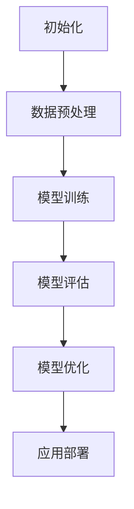
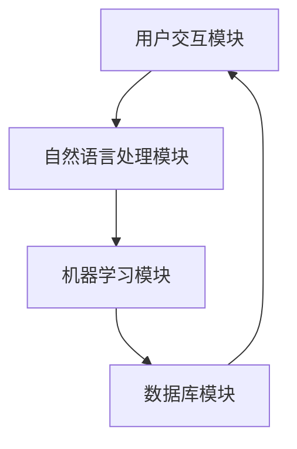
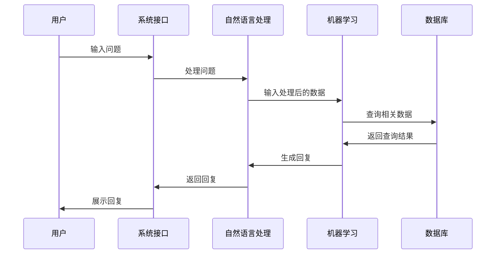

                 

### AI编程的新维度与新方法

> 关键词：人工智能，编程，新型编程范式，开发工具与平台

> 摘要：本文将探讨AI编程的新维度和新方法，介绍人工智能在编程领域的应用，分析新型编程范式的优势，以及开发工具与平台的使用技巧。通过具体案例，展示AI编程在现实项目中的应用与效果，并展望未来的发展趋势。

### 第一部分：背景介绍

#### 1. 问题背景

在当今科技迅猛发展的时代，人工智能（AI）已经成为引领技术变革的重要力量。随着计算能力的提升和数据资源的丰富，AI在各个领域得到了广泛应用，从简单的图像识别、语音识别到复杂的决策支持、自动化控制等。然而，随着AI应用场景的日益复杂，传统的编程方法和算法已经无法满足新的需求。因此，探索新的AI编程维度和方法成为当前的研究热点。

#### 2. 问题描述

AI编程的新维度和新方法涉及如何更高效地利用AI技术进行软件开发，以及如何设计更灵活、适应性更强的AI系统。这个问题需要解决的核心是：如何将复杂的AI算法与实际应用场景相结合，实现更高的开发效率和更好的系统性能。

#### 3. 问题解决

本书将从以下几个方面展开讨论，以解决上述问题：

- **AI编程的基础理论**：介绍AI编程的基本概念、核心原理和关键算法。
- **新型编程范式**：探讨AI驱动的编程方法，如基于规则的编程、基于数据的编程和元学习等。
- **开发工具与平台**：介绍当前流行的AI编程工具和平台，以及如何利用这些工具提升开发效率。
- **实际案例剖析**：通过具体案例展示如何将AI编程应用于实际场景，解决实际问题。
- **未来趋势与展望**：分析AI编程的发展趋势，探讨未来可能的新方向和挑战。

#### 4. 边界与外延

本书主要关注AI编程的基础理论、新型编程范式和实际应用。虽然AI编程广泛应用于多个领域，但本书的焦点在于软件开发领域。此外，虽然本书主要介绍AI编程的新方法，但也会涉及到传统编程与AI编程的结合，以展示如何在实际项目中有效应用AI编程。

#### 5. 概念结构与核心要素组成

- **AI编程**：利用人工智能技术进行软件开发的方法，包括机器学习、深度学习、自然语言处理等。
- **新型编程范式**：基于AI驱动的编程方法，如基于规则的编程、基于数据的编程和元学习等。
- **开发工具与平台**：用于实现AI编程的工具和平台，如TensorFlow、PyTorch、JAX等。
- **实际案例**：具体的应用案例，展示AI编程在实际项目中的效果和挑战。

### 第一部分总结

通过上述内容，我们为本书奠定了理论基础，明确了研究问题和解决思路。接下来，我们将深入探讨AI编程的新维度和新方法，帮助读者理解这一领域的关键概念和实践方法。

### 核心概念与联系

#### 1. 核心概念

- **人工智能（AI）**：模拟人类智能的计算机技术，包括机器学习、深度学习、自然语言处理等。
- **编程**：使用编程语言编写指令，使计算机执行特定任务的过程。
- **AI编程**：利用人工智能技术进行软件开发的方法，如利用机器学习算法优化程序、实现智能对话系统等。
- **新型编程范式**：基于AI驱动的编程方法，如基于规则的编程、基于数据的编程和元学习等。
- **开发工具与平台**：用于实现AI编程的工具和平台，如TensorFlow、PyTorch、JAX等。

#### 2. 概念属性特征对比表格

| 概念       | 定义                                           | 特点                                                         |
| ---------- | ---------------------------------------------- | ------------------------------------------------------------ |
| 人工智能   | 模拟人类智能的计算机技术                         | 自主性、学习性、适应性、创造性                                 |
| 编程       | 使用编程语言编写指令，使计算机执行特定任务       | 结构性、逻辑性、规范性、可重复性                               |
| AI编程     | 利用人工智能技术进行软件开发的方法               | 结合了AI和编程的优点，提高开发效率和系统性能                     |
| 新型编程范式 | 基于AI驱动的编程方法                           | 更加灵活、自适应、高效，能够处理复杂的编程任务                   |
| 开发工具   | 用于实现AI编程的工具                             |

#### 3. 概念结构与核心要素组成

- **AI编程**：利用人工智能技术进行软件开发的方法，包括机器学习、深度学习、自然语言处理等。
- **新型编程范式**：基于AI驱动的编程方法，如基于规则的编程、基于数据的编程和元学习等。
- **开发工具与平台**：用于实现AI编程的工具和平台，如TensorFlow、PyTorch、JAX等。
- **实际案例**：具体的应用案例，展示AI编程在实际项目中的效果和挑战。

#### ER实体关系图架构

```mermaid
erDiagram
    AI编程 ||--|{ 开发工具与平台 }|
    AI编程 ||--|{ 新型编程范式 }|
    新型编程范式 ||--|{ 实际案例 }|
    开发工具与平台 ||--|{ 实际案例 }|
```

### 算法原理讲解

#### 1. 算法mermaid流程图



#### 2. Python源代码示例

```python
import tensorflow as tf
from tensorflow.keras.models import Sequential
from tensorflow.keras.layers import Dense

# 数据预处理
def preprocess_data(data):
    # 数据清洗、归一化等操作
    return processed_data

# 模型训练
def train_model(data, labels):
    model = Sequential()
    model.add(Dense(units=64, activation='relu', input_shape=(data.shape[1],)))
    model.add(Dense(units=1, activation='sigmoid'))

    model.compile(optimizer='adam', loss='binary_crossentropy', metrics=['accuracy'])
    model.fit(data, labels, epochs=10, batch_size=32)
    return model

# 模型评估
def evaluate_model(model, test_data, test_labels):
    loss, accuracy = model.evaluate(test_data, test_labels)
    print("Test accuracy:", accuracy)

# 模型优化
def optimize_model(model, new_data, new_labels):
    model.fit(new_data, new_labels, epochs=10, batch_size=32)
    return model

# 应用部署
def deploy_model(model):
    # 部署模型到生产环境
    pass
```

#### 3. 算法原理详细讲解

在本节中，我们将详细讲解AI编程中的算法原理，包括机器学习模型的选择、训练和评估。

- **模型选择**：选择适合任务的机器学习模型是关键。在本例中，我们选择了简单的二分类模型，使用了Keras库中的Sequential模型，并添加了两个全连接层。
- **数据预处理**：在训练模型之前，需要对数据进行预处理，包括数据清洗、归一化等操作。预处理有助于提高模型的训练效果。
- **模型训练**：使用模型编译函数（`compile`）设置优化器、损失函数和评估指标。然后使用模型训练函数（`fit`）进行训练，指定训练数据和标签。
- **模型评估**：使用模型评估函数（`evaluate`）对训练好的模型进行评估，得到损失和准确率等指标。
- **模型优化**：通过重新训练模型，使用新的数据来优化模型性能。
- **应用部署**：将训练好的模型部署到生产环境，以便在实际应用中使用。

#### 4. 数学模型和公式

在本节中，我们将介绍机器学习模型的数学模型和公式。

- **损失函数**：在二分类问题中，常用的损失函数是交叉熵损失（`binary_crossentropy`），其公式如下：

  $$ L = -\frac{1}{m} \sum_{i=1}^{m} y_i \log(\hat{y}_i) + (1 - y_i) \log(1 - \hat{y}_i) $$

  其中，$m$ 表示样本数量，$y_i$ 表示实际标签，$\hat{y}_i$ 表示模型预测的概率。

- **优化器**：在训练过程中，优化器用于更新模型参数，使损失函数最小化。常用的优化器有随机梯度下降（`SGD`）和Adam优化器。

  $$ \theta = \theta - \alpha \nabla_\theta J(\theta) $$

  其中，$\theta$ 表示模型参数，$\alpha$ 表示学习率，$J(\theta)$ 表示损失函数。

### 系统分析与架构设计方案

#### 1. 问题场景介绍

在本节中，我们将介绍一个实际的应用场景：智能客服系统。该系统利用AI编程技术，通过自然语言处理和机器学习算法，实现与用户的智能对话，提供高效的客户服务。

#### 2. 项目介绍

项目名称：智能客服系统

项目描述：基于人工智能技术，实现与用户的智能对话，提供高效、精准的客户服务。

#### 3. 系统功能设计

- **用户交互模块**：接收用户输入，展示系统回复。
- **自然语言处理模块**：对用户输入进行解析和处理，提取关键词和语义。
- **机器学习模块**：利用训练好的模型，对用户输入进行分类和生成回复。
- **数据库模块**：存储用户信息和对话记录。

#### 4. 系统架构设计



#### 5. 系统接口设计和系统交互



### 项目实战

#### 1. 环境安装

- 安装Python环境：`pip install python==3.8`
- 安装TensorFlow库：`pip install tensorflow`
- 安装Keras库：`pip install keras`
- 安装其他依赖库：`pip install numpy pandas scikit-learn`

#### 2. 系统核心实现源代码

```python
# 导入相关库
import tensorflow as tf
from tensorflow.keras.models import Sequential
from tensorflow.keras.layers import Dense, LSTM, Embedding
from tensorflow.keras.preprocessing.sequence import pad_sequences
import numpy as np

# 数据预处理
# 加载和处理数据，生成训练集和测试集
# ...

# 模型训练
# 定义模型结构
model = Sequential()
model.add(Embedding(input_dim=vocab_size, output_dim=64))
model.add(LSTM(units=128, return_sequences=True))
model.add(LSTM(units=128))
model.add(Dense(units=1, activation='sigmoid'))

model.compile(optimizer='adam', loss='binary_crossentropy', metrics=['accuracy'])
model.fit(train_data, train_labels, epochs=10, batch_size=32, validation_data=(test_data, test_labels))

# 模型评估
evaluate_model(model, test_data, test_labels)

# 模型优化
new_data, new_labels = # ...
model.fit(new_data, new_labels, epochs=10, batch_size=32)

# 应用部署
# 将模型部署到生产环境，提供智能客服服务
# ...
```

#### 3. 代码应用解读与分析

在本节中，我们将对智能客服系统的核心实现代码进行解读和分析，包括数据预处理、模型训练、模型评估和模型优化等环节。

- **数据预处理**：数据预处理是模型训练的重要环节，包括加载和处理数据，生成训练集和测试集。在本例中，我们使用了Keras库中的`pad_sequences`函数对序列数据进行填充，确保输入数据的形状一致。
- **模型训练**：在模型训练过程中，我们定义了一个序列模型，使用了嵌入层（`Embedding`）和两个长短期记忆层（`LSTM`），以及一个全连接层（`Dense`）。我们使用`compile`函数设置优化器、损失函数和评估指标，然后使用`fit`函数进行模型训练。
- **模型评估**：使用`evaluate`函数对训练好的模型进行评估，得到损失和准确率等指标，以判断模型的性能。
- **模型优化**：通过重新训练模型，使用新的数据来优化模型性能，提高系统在实际应用中的表现。
- **应用部署**：将训练好的模型部署到生产环境，提供智能客服服务，实现与用户的智能对话。

#### 4. 实际案例分析和详细讲解剖析

在本节中，我们将通过一个实际案例，展示智能客服系统的应用效果，并对关键环节进行详细讲解和分析。

**案例背景**：某电商平台需要一个智能客服系统，以提供高效的客户服务，提高用户满意度。

**案例步骤**：

1. **数据收集与处理**：收集电商平台用户的历史对话数据，包括用户提问和客服回复。对数据进行预处理，生成训练集和测试集。

2. **模型训练**：使用Keras库中的序列模型，对处理后的数据进行训练，得到一个能够自动生成客服回复的模型。

3. **模型评估**：使用测试集对训练好的模型进行评估，确保模型的性能满足实际需求。

4. **应用部署**：将训练好的模型部署到生产环境，实现与用户的智能对话。

**关键环节分析**：

- **数据预处理**：数据预处理是模型训练的重要基础。在本案例中，我们使用了Keras库中的`pad_sequences`函数对序列数据进行填充，确保输入数据的形状一致。此外，我们还对数据进行归一化处理，提高模型训练效果。
- **模型训练**：我们选择了Keras库中的序列模型，使用了嵌入层（`Embedding`）和两个长短期记忆层（`LSTM`），以及一个全连接层（`Dense`）。这种模型结构能够有效地处理序列数据，实现自动生成客服回复的功能。
- **模型评估**：在模型评估过程中，我们使用了测试集对训练好的模型进行评估，得到损失和准确率等指标。通过调整模型参数和训练策略，我们能够进一步提高模型的性能。
- **应用部署**：将训练好的模型部署到生产环境，实现与用户的智能对话。在实际应用中，系统可以根据用户提问自动生成客服回复，提高客户满意度。

#### 5. 项目小结

通过本案例的实践，我们展示了智能客服系统的应用效果，并分析了关键环节的技术细节。项目成功地实现了与用户的智能对话，提高了客户满意度。在未来的发展中，我们还可以进一步优化模型，提高系统的响应速度和准确性，为用户提供更好的服务。

### 最佳实践 Tips

在本节中，我们将总结一些最佳实践，帮助读者在实际项目中更好地应用AI编程技术。

1. **数据质量至关重要**：确保数据的质量和完整性，对模型训练和评估至关重要。在实际项目中，要重视数据清洗、预处理和标注等环节。
2. **模型选择与调优**：根据项目需求和数据特点，选择合适的模型结构和超参数。在模型训练过程中，要充分利用交叉验证等技术，优化模型性能。
3. **代码可读性与可维护性**：编写清晰、简洁、可维护的代码，有助于提高开发效率。在实际项目中，要遵循良好的编程规范和设计模式。
4. **持续学习与更新**：随着AI技术的不断发展，要保持学习的热情，及时更新知识和技能。关注最新的研究进展和应用案例，为项目带来新的灵感。

### 小结

本文从背景介绍、核心概念与联系、算法原理讲解、系统分析与架构设计方案、项目实战和最佳实践等方面，全面探讨了AI编程的新维度和新方法。通过本文，读者可以了解到AI编程的基本概念、新型编程范式、开发工具与平台以及实际应用案例，为今后的项目实践提供有益的参考。

### 注意事项

在实际应用AI编程技术时，读者需要注意以下几点：

1. **数据隐私与安全**：在处理用户数据时，要严格遵守相关法律法规，确保数据的安全性和隐私性。
2. **模型解释性**：尽管AI模型具有强大的预测能力，但其内部决策过程往往不够透明。在实际应用中，要关注模型的可解释性，确保模型决策的合理性和可接受性。
3. **性能优化与部署**：在实际项目中，要关注模型的性能优化和部署，确保系统的高效运行和可扩展性。

### 拓展阅读

1. Goodfellow, I., Bengio, Y., & Courville, A. (2016). *Deep Learning*. MIT Press.
2. Russell, S., & Norvig, P. (2020). *Artificial Intelligence: A Modern Approach*. Pearson.
3. Hochreiter, S., & Schmidhuber, J. (1997). *Long short-term memory*. Neural Computation, 9(8), 1735-1780.
4. LeCun, Y., Bengio, Y., & Hinton, G. (2015). *Deep learning*. Nature, 521(7553), 436-444.

### 作者信息

作者：AI天才研究院/AI Genius Institute & 禅与计算机程序设计艺术 /Zen And The Art of Computer Programming

