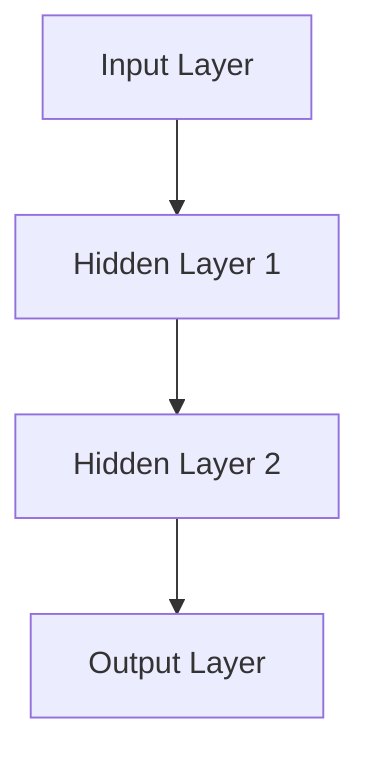
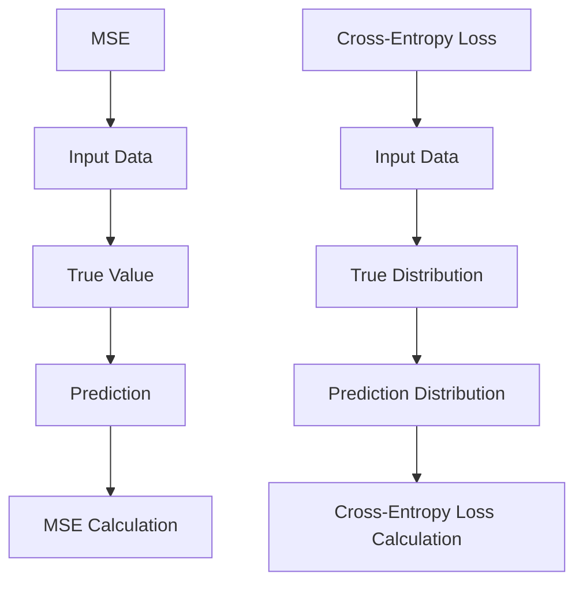
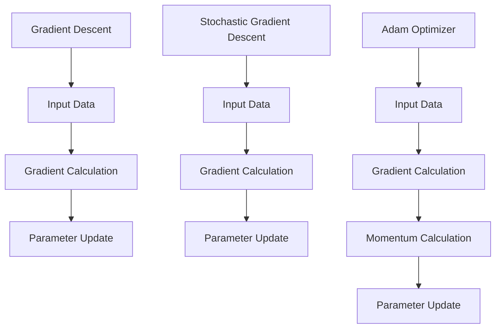
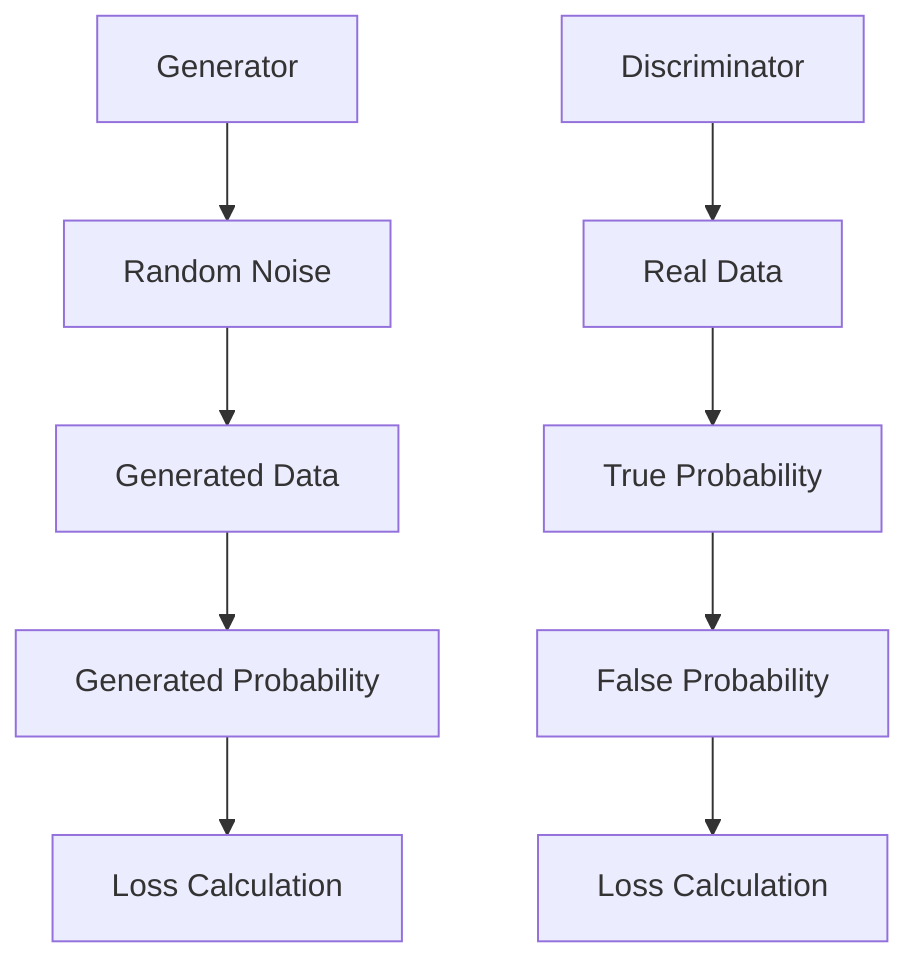
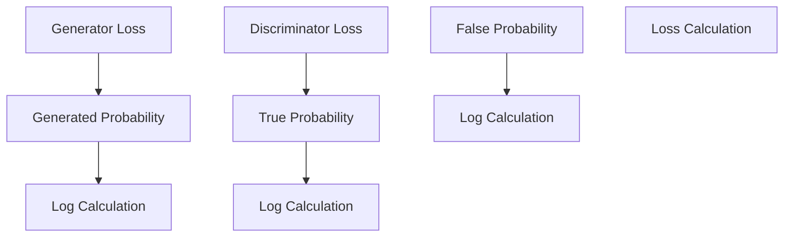
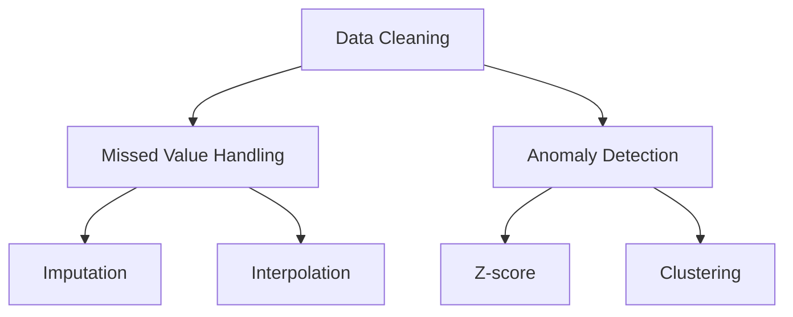
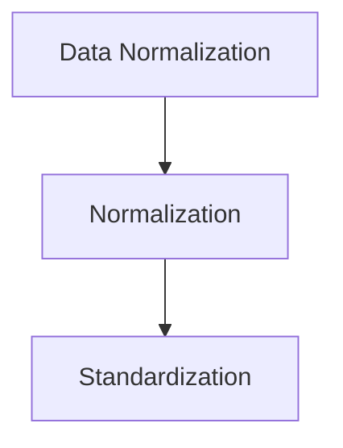
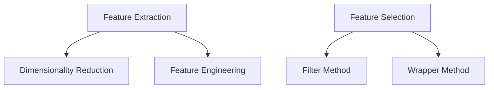
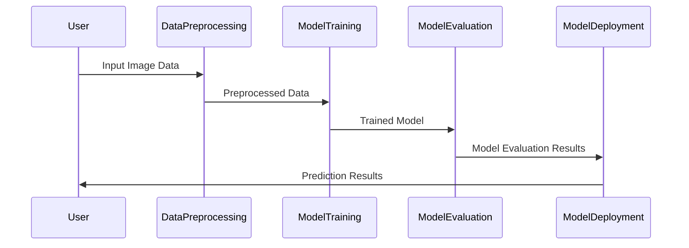
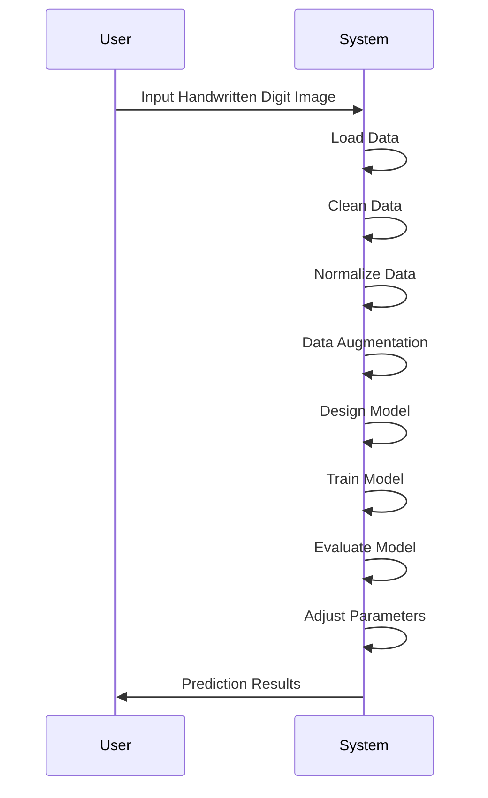

                 

### 《AI编程的新维度与新范式》

#### 关键词：AI编程、深度学习、生成对抗网络、数据预处理、特征工程

> 摘要：本文将探讨AI编程的新维度和新范式，包括深度学习、生成对抗网络等算法原理，以及数据预处理和特征工程的重要性。我们将通过详细的分析和示例，帮助读者理解这些新范式如何提升AI编程的高效性、可解释性和可维护性。

#### 目录大纲

### 《AI编程的新维度与新范式》

#### 关键词：AI编程、深度学习、生成对抗网络、数据预处理、特征工程

> 摘要：本文将探讨AI编程的新维度和新范式，包括深度学习、生成对抗网络等算法原理，以及数据预处理和特征工程的重要性。我们将通过详细的分析和示例，帮助读者理解这些新范式如何提升AI编程的高效性、可解释性和可维护性。

#### 第一部分：背景介绍

#### 1.1 问题背景

##### 1.1.1 AI编程的发展历程

- **AI编程的早期阶段：规则驱动编程和知识表示**
  - **规则驱动编程**：基于预定义的规则进行编程，例如专家系统的开发。
  - **知识表示**：使用符号和逻辑表示知识，以便机器能够理解和处理。

- **AI编程的中期阶段：机器学习编程**
  - **监督学习**：通过标记数据训练模型，例如决策树、支持向量机。
  - **无监督学习**：不使用标记数据，通过发现数据分布或模式来训练模型，例如聚类、降维。

- **AI编程的现阶段：深度学习编程和生成对抗网络（GAN）编程**
  - **深度学习编程**：使用多层神经网络进行复杂的特征学习和模式识别。
  - **生成对抗网络（GAN）编程**：通过生成器和判别器的对抗训练生成复杂的数据分布。

##### 1.1.2 传统AI编程的局限

- **对大量标记数据的依赖**
  - 监督学习模型需要大量的标记数据来进行训练。
  - 标记数据的时间和成本较高。

- **黑盒模型的可解释性不足**
  - 深度学习模型通常被视为黑盒，难以解释其内部工作原理。

- **低效的训练和推理过程**
  - 深度学习模型的训练过程可能需要大量的计算资源和时间。
  - 推理速度较慢，无法满足实时应用的场景需求。

##### 1.1.3 新范式的发展需求

- **高效的模型训练和推理算法**
  - 使用更高效的算法和优化策略来降低训练时间。
  - 使用硬件加速技术（如GPU、TPU）来提高推理速度。

- **强大的数据预处理和特征工程能力**
  - 自动化的数据预处理流程，减少人工干预。
  - 高效的特征提取和选择方法，提高模型性能。

- **易于理解和维护的可解释性**
  - 开发可解释性工具，帮助用户理解模型的工作原理。
  - 引入可解释性度量，评估模型的解释性。

#### 1.2 问题描述

- **如何利用新范式实现AI编程的高效、可解释和可维护性？**
  - 需要研究和开发新的算法和工具，以应对传统AI编程的局限。

- **如何在现有编程语言和框架的基础上进行扩展和优化？**
  - 需要探索现有编程语言和框架的扩展性，以及如何整合新的算法和工具。

#### 1.2.1 核心概念

- **新维度**：指的是AI编程的算法和框架层面的变革，如深度学习、GAN等。
- **新范式**：指的是AI编程的思维方式和编程模式的转变，如模型驱动编程、数据驱动编程等。

#### 1.2.2 边界与外延

- **新范式适用于各种AI应用场景，包括图像识别、自然语言处理、推荐系统等。**
  - 深度学习在图像识别和自然语言处理方面取得了显著成果。
  - GAN在图像生成和风格迁移方面表现优异。

- **新范式的实现依赖于先进的算法和强大的计算资源。**
  - 需要高效能的计算设备和优化算法来支持新范式的实现。

#### 1.3 问题解决

##### 1.3.1 算法原理

- **深度学习算法**：多层神经网络、卷积神经网络（CNN）、循环神经网络（RNN）、生成对抗网络（GAN）
  - **多层神经网络**：通过多层非线性变换提取特征。
  - **卷积神经网络（CNN）**：适用于图像处理任务，通过卷积操作提取空间特征。
  - **循环神经网络（RNN）**：适用于序列数据处理，通过记忆机制处理时间依赖性。
  - **生成对抗网络（GAN）**：通过生成器和判别器的对抗训练生成复杂的数据分布。

- **数据预处理和特征工程**：数据清洗、数据归一化、特征提取和选择
  - **数据清洗**：去除噪声和异常值，确保数据质量。
  - **数据归一化**：将数据缩放到相同的范围，提高模型训练效果。
  - **特征提取和选择**：提取关键特征，减少数据维度，提高模型性能。

- **可解释性方法**：模型可视化、特征重要性分析、因果推断
  - **模型可视化**：通过图形化展示模型结构和工作原理，帮助用户理解。
  - **特征重要性分析**：评估不同特征对模型预测的影响，提高模型解释性。
  - **因果推断**：通过因果模型揭示变量之间的因果关系，提供更深入的解释。

##### 1.3.2 实现步骤

- **确定问题场景和目标**：明确AI编程的应用领域和目标，选择合适的算法和框架。

- **选择合适的算法和框架**：根据问题场景和目标，选择合适的深度学习算法和框架，如TensorFlow、PyTorch等。

- **进行数据预处理和特征工程**：对输入数据进行清洗、归一化和特征提取，提高模型训练效果。

- **设计和实现AI模型**：根据问题场景和目标，设计AI模型的结构和参数，实现模型代码。

- **模型训练和优化**：使用训练数据对模型进行训练，优化模型参数，提高模型性能。

- **模型评估和部署**：使用测试数据对模型进行评估，确保模型达到预期性能。将模型部署到实际应用环境中。

#### 1.4 本章小结

- **传统AI编程的局限和新范式的发展需求**
  - 传统AI编程存在对大量标记数据的依赖、黑盒模型的可解释性不足、低效的训练和推理过程等局限。
  - 新范式的发展需求包括高效的模型训练和推理算法、强大的数据预处理和特征工程能力、易于理解和维护的可解释性。

- **新范式的核心概念和边界**
  - 新范式包括深度学习、生成对抗网络等算法和框架，以及模型驱动编程、数据驱动编程等思维方式。
  - 新范式适用于各种AI应用场景，实现依赖于先进的算法和强大的计算资源。

- **AI编程的新范式实现步骤和算法原理**
  - 实现新范式需要确定问题场景和目标、选择合适的算法和框架、进行数据预处理和特征工程、设计和实现AI模型、模型训练和优化、模型评估和部署等步骤。
  - 新范式的核心算法原理包括深度学习算法、生成对抗网络算法、数据预处理和特征工程方法、可解释性方法。

#### 第二部分：核心概念与联系

#### 2.1 核心概念原理

##### 2.1.1 深度学习算法

- **神经网络结构**：深度学习算法的核心是神经网络，它由输入层、隐藏层和输出层组成。
  - **输入层**：接收输入数据，将数据传递给隐藏层。
  - **隐藏层**：对输入数据进行处理和变换，提取特征。
  - **输出层**：生成输出结果，如分类结果或回归值。

- **损失函数**：用于衡量模型预测结果与真实值之间的差异。
  - **均方误差（MSE）**：用于回归问题，衡量预测值与真实值之间的差异。
    - 公式：$$MSE = \frac{1}{n}\sum_{i=1}^{n}(y_i - \hat{y}_i)^2$$
    - 其中，$y_i$ 是真实值，$\hat{y}_i$ 是预测值，$n$ 是样本数量。

  - **交叉熵损失（CE）**：用于分类问题，衡量分类结果的概率分布与真实分布之间的差异。
    - 公式：$$CE = -\sum_{i=1}^{n}y_i\log(\hat{y}_i)$$
    - 其中，$y_i$ 是真实标签的概率分布，$\hat{y}_i$ 是预测标签的概率分布。

- **优化算法**：用于更新模型参数，以最小化损失函数。
  - **梯度下降（GD）**：通过迭代更新模型参数，以最小化损失函数。
    - 公式：$$\theta_{t+1} = \theta_t - \alpha\nabla_{\theta_t}J(\theta_t)$$
    - 其中，$\theta_t$ 是当前模型参数，$\alpha$ 是学习率，$J(\theta_t)$ 是损失函数。

  - **随机梯度下降（SGD）**：在梯度下降的基础上，每次迭代使用随机选取的一小部分样本进行更新。
    - 公式：$$\theta_{t+1} = \theta_t - \alpha\nabla_{\theta_t}J(\theta_t, x_i; y_i)$$
    - 其中，$x_i$ 是输入样本，$y_i$ 是输出标签。

  - **Adam优化器**：结合了SGD和Momentum的方法，具有自适应的学习率。
    - 公式：$$m_t = \beta_1x_t + (1 - \beta_1)(1 - x_t)$$
    $$v_t = \beta_2x_t + (1 - \beta_2)(1 - x_t)$$
    $$\theta_{t+1} = \theta_t - \alpha\frac{m_t}{\sqrt{v_t} + \epsilon}$$
    - 其中，$m_t$ 和 $v_t$ 分别是梯度的一阶和二阶矩估计，$\beta_1$ 和 $\beta_2$ 分别是动量项的权重，$\epsilon$ 是一个很小的常数。

##### 2.1.2 生成对抗网络（GAN）

- **结构**：生成对抗网络由生成器和判别器组成。
  - **生成器**：生成真实数据的潜在分布。
  - **判别器**：区分真实数据和生成器生成的数据。

- **损失函数**：用于衡量生成器和判别器的性能。
  - **生成器损失**：衡量生成器生成的数据与真实数据的相似度。
    - 公式：$$L_G = -\log(D(G(z)))$$
    - 其中，$D(G(z))$ 是判别器对生成器生成的数据的概率估计。

  - **判别器损失**：衡量判别器对真实数据和生成器生成的数据的辨别能力。
    - 公式：$$L_D = -\log(D(x)) - \log(1 - D(G(z)))$$
    - 其中，$D(x)$ 是判别器对真实数据的概率估计，$D(G(z))$ 是判别器对生成器生成的数据的概率估计。

- **训练策略**：生成器和判别器通过对抗训练相互提高性能。
  - **对抗训练**：生成器和判别器交替训练，生成器试图生成更真实的数据，判别器试图区分真实数据和生成器生成的数据。

  - **梯度惩罚**：为了防止生成器生成过于简单或重复的数据，可以对生成器施加梯度惩罚。
    - 公式：$$L_G = -\log(D(G(z))) + \lambda||\nabla_{z}G(z)||_2^2$$
    - 其中，$\lambda$ 是梯度惩罚系数。

##### 2.1.3 数据预处理和特征工程

- **数据清洗**：去除噪声和异常值，确保数据质量。
  - **缺失值处理**：使用填充或插值方法填补缺失值。
  - **异常值处理**：使用统计学方法（如箱线图、Z分数）识别和去除异常值。

- **数据归一化**：将数据缩放到相同的范围，提高模型训练效果。
  - **归一化**：将数据缩放到 [0, 1] 范围内。
    - 公式：$$x_{\text{normalized}} = \frac{x - \text{min}(x)}{\text{max}(x) - \text{min}(x)}$$

  - **标准化**：将数据缩放到平均值为零、标准差为1的范围内。
    - 公式：$$x_{\text{standardized}} = \frac{x - \mu}{\sigma}$$
    - 其中，$\mu$ 是平均值，$\sigma$ 是标准差。

- **特征提取和选择**：提取关键特征，减少数据维度，提高模型性能。
  - **特征降维**：使用降维方法（如主成分分析PCA、线性判别分析LDA）减少数据维度。
  - **特征选择**：使用特征选择方法（如信息增益、互信息、特征重要性分析）选择关键特征。

#### 2.2 概念属性特征对比表格

| 概念           | 特征1        | 特征2        | 特征3        |
|----------------|-------------|-------------|-------------|
| 深度学习       | 多层神经网络 | 损失函数     | 优化算法     |
| 生成对抗网络   | 生成器、判别器 | 损失函数     | 对抗训练     |
| 数据预处理     | 数据清洗     | 数据归一化   | 特征提取和选择 |

#### 2.3 ER实体关系图架构

```
erDiagram
A {主实体} ||--|{ 与之关联的实体1 }|
A ||--|{ 与之关联的实体2 }|
A ||--|{ 与之关联的实体3 }|
```

#### 第三部分：算法原理讲解

##### 3.1 深度学习算法

深度学习算法是AI编程中的重要组成部分，它们通过多层神经网络进行复杂的特征学习和模式识别。以下是深度学习算法的详细讲解。

###### 3.1.1 神经网络结构

神经网络（Neural Network，NN）是模仿人脑神经元连接方式的计算模型。一个典型的神经网络由三个主要部分组成：输入层（Input Layer）、隐藏层（Hidden Layers）和输出层（Output Layer）。

- **输入层**：接收输入数据，并将其传递给隐藏层。
  - 例如，对于图像识别任务，输入层接收图像的像素值。

- **隐藏层**：对输入数据进行处理和变换，提取特征。
  - 隐藏层可以是一个或多个层，每层都会对输入数据应用一系列的权重和偏置，并通过激活函数进行非线性变换。

- **输出层**：生成输出结果，如分类结果或回归值。
  - 例如，在分类问题中，输出层会输出每个类别的概率分布。

每个隐藏层和输出层的节点都通过权重（Weights）相互连接，并加上一个偏置（Bias）项。这些权重和偏置在训练过程中通过反向传播算法进行更新，以最小化损失函数。

神经网络的工作原理是通过前向传播将输入数据通过各个层传递，然后通过激活函数（如ReLU、Sigmoid、Tanh）引入非线性变换。最后，通过反向传播计算梯度并更新参数。

以下是一个简化的神经网络结构的mermaid流程图：



###### 3.1.2 损失函数

损失函数（Loss Function）是深度学习模型训练的核心组成部分，用于衡量模型预测结果与真实值之间的差异。根据不同的任务类型，有不同的损失函数。

- **均方误差（MSE，Mean Squared Error）**：常用于回归问题，计算预测值与真实值之间的平均平方误差。
  - 公式：$$MSE = \frac{1}{n}\sum_{i=1}^{n}(y_i - \hat{y}_i)^2$$
  - 其中，$y_i$ 是真实值，$\hat{y}_i$ 是预测值，$n$ 是样本数量。

- **交叉熵损失（Cross-Entropy Loss）**：常用于分类问题，计算预测概率分布与真实概率分布之间的交叉熵。
  - 公式：$$CE = -\sum_{i=1}^{n}y_i\log(\hat{y}_i)$$
  - 其中，$y_i$ 是真实标签的概率分布，$\hat{y}_i$ 是预测标签的概率分布。

以下是均方误差和交叉熵损失的mermaid流程图：



###### 3.1.3 优化算法

优化算法（Optimization Algorithm）用于更新模型参数，以最小化损失函数。以下是几种常见的优化算法：

- **梯度下降（Gradient Descent）**：最简单的优化算法，通过计算损失函数关于模型参数的梯度，以固定学习率更新参数。
  - 公式：$$\theta_{t+1} = \theta_t - \alpha\nabla_{\theta_t}J(\theta_t)$$
  - 其中，$\theta_t$ 是当前模型参数，$\alpha$ 是学习率，$J(\theta_t)$ 是损失函数。

- **随机梯度下降（Stochastic Gradient Descent，SGD）**：每次迭代只使用一个样本的梯度进行更新，有助于减少过拟合。
  - 公式：$$\theta_{t+1} = \theta_t - \alpha\nabla_{\theta_t}J(\theta_t, x_i; y_i)$$
  - 其中，$x_i$ 是输入样本，$y_i$ 是输出标签。

- **Adam优化器（Adam Optimizer）**：结合了SGD和Momentum的方法，具有自适应的学习率。
  - 公式：$$m_t = \beta_1x_t + (1 - \beta_1)(1 - x_t)$$
  $$v_t = \beta_2x_t + (1 - \beta_2)(1 - x_t)$$
  $$\theta_{t+1} = \theta_t - \alpha\frac{m_t}{\sqrt{v_t} + \epsilon}$$
  - 其中，$m_t$ 和 $v_t$ 分别是梯度的一阶和二阶矩估计，$\beta_1$ 和 $\beta_2$ 分别是动量项的权重，$\epsilon$ 是一个很小的常数。

以下是梯度下降、随机梯度下降和Adam优化器的mermaid流程图：



##### 3.2 生成对抗网络（GAN）

生成对抗网络（Generative Adversarial Network，GAN）是由Ian Goodfellow等人于2014年提出的一种深度学习框架。GAN由生成器（Generator）和判别器（Discriminator）两个神经网络组成，它们通过对抗训练相互提高性能。

###### 3.2.1 结构

GAN的结构可以分为两部分：生成器和判别器。

- **生成器**：接收随机噪声作为输入，生成逼真的数据样本。生成器的目标是最小化判别器对其生成样本的判别误差。
  - 公式：$$G(z) = \text{Generator}(z)$$
  - 其中，$z$ 是随机噪声。

- **判别器**：接收真实数据和生成器生成的数据，判断其是否为真实数据。判别器的目标是最大化其判别误差。
  - 公式：$$D(x) = \text{Discriminator}(x)$$
  - 其中，$x$ 是真实数据。

生成器和判别器在训练过程中相互对抗，生成器的目标是使其生成的样本尽可能接近真实数据，而判别器的目标是提高其对真实数据和生成器生成数据的辨别能力。

以下是一个简化的GAN结构的mermaid流程图：



###### 3.2.2 损失函数

GAN的损失函数由两部分组成：生成器损失和判别器损失。

- **生成器损失**：衡量生成器生成的数据与真实数据的相似度。
  - 公式：$$L_G = -\log(D(G(z)))$$
  - 其中，$D(G(z))$ 是判别器对生成器生成的数据的概率估计。

- **判别器损失**：衡量判别器对真实数据和生成器生成数据的辨别能力。
  - 公式：$$L_D = -\log(D(x)) - \log(1 - D(G(z)))$$
  - 其中，$D(x)$ 是判别器对真实数据的概率估计，$D(G(z))$ 是判别器对生成器生成的数据的概率估计。

生成器和判别器通过对抗训练相互提高性能，生成器的目标是最小化生成器损失，判别器的目标是最大化判别器损失。

以下是一个简化的GAN损失函数的mermaid流程图：



###### 3.2.3 训练策略

GAN的训练策略基于生成器和判别器的对抗训练。

- **对抗训练**：生成器和判别器交替训练，生成器试图生成更真实的数据，判别器试图区分真实数据和生成器生成的数据。
  - 在每个训练周期中，先固定判别器的参数，更新生成器的参数，使其生成的样本更难以被判别器识别。
  - 然后固定生成器的参数，更新判别器的参数，提高其对真实数据和生成器生成数据的辨别能力。

- **梯度惩罚**：为了防止生成器生成过于简单或重复的数据，可以对生成器施加梯度惩罚。
  - 公式：$$L_G = -\log(D(G(z))) + \lambda||\nabla_{z}G(z)||_2^2$$
  - 其中，$\lambda$ 是梯度惩罚系数。

对抗训练的过程是动态的，生成器和判别器通过不断调整参数来相互对抗，最终达到一个平衡状态。

##### 3.3 数据预处理和特征工程

数据预处理和特征工程是深度学习模型训练的重要组成部分，它们直接影响模型的性能和泛化能力。以下是数据预处理和特征工程的详细讲解。

###### 3.3.1 数据清洗

数据清洗是确保数据质量的重要步骤，它包括以下内容：

- **缺失值处理**：缺失值可以是完全缺失（即某个特征的所有值都缺失），也可以是部分缺失（即某个特征的部分值缺失）。常见的缺失值处理方法包括：

  - **填充法**：使用平均值、中位数、众数等方法填充缺失值。
  - **插值法**：使用线性插值、样条插值等方法填补缺失值。

- **异常值处理**：异常值是指那些偏离正常数据分布的数据点。常见的异常值处理方法包括：

  - **统计学方法**：使用箱线图、Z分数等方法识别和去除异常值。
  - **基于模型的方法**：使用聚类算法（如K-means）识别异常值，然后进行去除或修正。

数据清洗的目的是去除噪声和异常值，确保数据的质量和一致性，从而提高模型训练效果。

以下是一个简化的数据清洗流程图：



###### 3.3.2 数据归一化

数据归一化是将数据缩放到相同的范围，以便模型训练时不同特征的权重不会受到原始尺度差异的影响。常见的数据归一化方法包括：

- **归一化**：将数据缩放到 [0, 1] 范围内。
  - 公式：$$x_{\text{normalized}} = \frac{x - \text{min}(x)}{\text{max}(x) - \text{min}(x)}$$

- **标准化**：将数据缩放到平均值为零、标准差为1的范围内。
  - 公式：$$x_{\text{standardized}} = \frac{x - \mu}{\sigma}$$
  - 其中，$\mu$ 是平均值，$\sigma$ 是标准差。

数据归一化的目的是使不同特征的尺度差异最小化，从而提高模型训练效果。

以下是一个简化的数据归一化流程图：



###### 3.3.3 特征提取和选择

特征提取和选择是减少数据维度、提高模型性能的重要步骤。以下是一些常用的特征提取和选择方法：

- **特征提取**：从原始数据中提取更有用的特征。常见的方法包括：

  - **降维方法**：使用降维技术（如主成分分析PCA、线性判别分析LDA）将高维数据降维到低维空间。
  - **特征工程**：根据业务知识和数据特点，手动构建新的特征。

- **特征选择**：从提取的特征中选择最有用的特征。常见的方法包括：

  - **过滤方法**：根据特征的重要性（如方差、互信息等）直接过滤掉不重要的特征。
  - **包裹方法**：结合特征组合进行模型训练，通过交叉验证选择最优特征组合。

特征提取和选择的目的是减少数据维度、降低计算复杂度、提高模型性能。

以下是一个简化的特征提取和选择流程图：



#### 第四部分：系统分析与架构设计

##### 4.1 问题场景介绍

在当今的数据驱动的世界中，AI编程已经成为开发复杂应用程序的核心。无论是图像识别、自然语言处理、推荐系统还是自动驾驶，深度学习和其他AI算法在各个领域都发挥着重要作用。然而，传统的AI编程方法往往面临数据依赖性高、模型可解释性差、训练和推理效率低下等挑战。为了应对这些挑战，我们需要探索AI编程的新维度和新范式。

本部分将结合一个实际项目——基于深度学习的手写数字识别系统，来介绍问题场景。该项目的目标是训练一个模型，能够识别手写的数字图像，并将其转换为对应的数字。这个项目将涵盖从数据预处理到模型训练和优化的完整流程。

##### 4.2 项目介绍

手写数字识别是一个经典的机器学习问题，通常用于开发银行自动取款机（ATM）的输入设备、智能手写识别应用等。在这个项目中，我们将使用MNIST数据集，这是一个包含70000个灰度图像的手写数字数据集，每个图像都是一个0到9的数字。MNIST数据集的特点是图像尺寸为28x28像素，每个像素的取值范围为0到255。

项目的目标是通过训练一个深度学习模型，使其能够准确识别手写数字图像。具体步骤包括：

1. 数据预处理：清洗数据、归一化像素值、进行数据增强等。
2. 模型设计：设计一个卷积神经网络（CNN），包括多个卷积层、池化层和全连接层。
3. 模型训练：使用训练数据训练模型，并通过反向传播算法更新模型参数。
4. 模型评估：使用测试数据评估模型性能，并调整模型参数以提高准确率。
5. 模型部署：将训练好的模型部署到实际应用中，如开发一个手写数字识别应用。

##### 4.3 系统功能设计

在项目开发过程中，我们需要设计一个完整的系统，包括数据预处理模块、模型训练模块、模型评估模块和模型部署模块。以下是系统功能设计的详细描述：

- **数据预处理模块**：负责处理原始图像数据，包括数据清洗、归一化、数据增强等。数据预处理模块需要实现以下功能：
  - **图像数据读取**：从MNIST数据集读取图像数据。
  - **数据清洗**：去除噪声和异常值，保证数据质量。
  - **归一化**：将像素值缩放到 [0, 1] 范围内，便于模型训练。
  - **数据增强**：通过旋转、翻转、缩放等操作增加数据的多样性，提高模型泛化能力。

- **模型训练模块**：负责设计并训练深度学习模型。模型训练模块需要实现以下功能：
  - **模型设计**：设计一个卷积神经网络，包括多个卷积层、池化层和全连接层。
  - **模型训练**：使用训练数据训练模型，并通过反向传播算法更新模型参数。
  - **模型保存**：在训练过程中定期保存模型参数，以便后续评估和部署。

- **模型评估模块**：负责评估模型性能，并通过调整模型参数提高准确率。模型评估模块需要实现以下功能：
  - **模型评估**：使用测试数据评估模型性能，计算准确率、召回率等指标。
  - **参数调整**：根据评估结果调整模型参数，如学习率、批量大小等，以提高模型性能。

- **模型部署模块**：负责将训练好的模型部署到实际应用中。模型部署模块需要实现以下功能：
  - **模型加载**：从存储设备中加载训练好的模型。
  - **实时预测**：接收用户输入的图像数据，使用模型进行实时预测。
  - **结果输出**：将预测结果输出给用户，如显示预测的数字。

以下是系统功能设计的类图（Class Diagram），展示了系统的核心类和它们之间的关系：

```mermaid
classDiagram
ClassDiagram {
    class DataPreprocessing {
        +load_data()
        +clean_data()
        +normalize_data()
        +data_augmentation()
    }
    class ModelTraining {
        +design_model()
        +train_model()
        +save_model()
    }
    class ModelEvaluation {
        +evaluate_model()
        +adjust_parameters()
    }
    class ModelDeployment {
        +load_model()
        +real_time_prediction()
        +output_result()
    }
}
DataPreprocessing "uses" ModelTraining
DataPreprocessing "uses" ModelEvaluation
DataPreprocessing "uses" ModelDeployment
ModelTraining "uses" DataPreprocessing
ModelEvaluation "uses" ModelTraining
ModelDeployment "uses" ModelTraining
```

##### 4.4 系统架构设计

系统架构设计是确保项目成功的关键步骤，它涉及到系统的整体结构、模块划分、数据流和接口设计。以下是手写数字识别系统的架构设计：

- **数据流**：系统的数据流从数据预处理开始，通过模型训练、模型评估和模型部署，最终实现实时预测和结果输出。
  - 数据预处理模块读取MNIST数据集，清洗、归一化和增强数据。
  - 模型训练模块使用预处理后的数据进行模型训练，并保存模型参数。
  - 模型评估模块使用测试数据评估模型性能，并调整模型参数。
  - 模型部署模块加载训练好的模型，进行实时预测，并将结果输出给用户。

- **模块划分**：系统划分为数据预处理模块、模型训练模块、模型评估模块和模型部署模块，每个模块具有独立的功能和接口。
  - 数据预处理模块：负责数据的清洗、归一化和增强。
  - 模型训练模块：负责模型的设计、训练和保存。
  - 模型评估模块：负责模型的评估和参数调整。
  - 模型部署模块：负责模型的加载、实时预测和结果输出。

- **接口设计**：系统接口设计包括模块之间的接口和用户与系统的接口。
  - 内部接口：模块之间通过方法调用和数据传递进行通信。
  - 用户接口：系统提供API或图形界面，供用户输入图像数据和接收预测结果。

以下是系统架构设计的架构图（Architecture Diagram），展示了系统的整体结构和模块之间的数据流：



##### 4.5 系统接口设计和系统交互

系统接口设计和系统交互设计是确保系统模块之间能够高效、可靠地通信的关键。以下是手写数字识别系统的接口设计和系统交互设计：

- **接口设计**：系统接口设计包括模块接口和API设计。
  - **模块接口**：各模块之间通过方法调用和数据传递进行通信。例如，数据预处理模块将预处理后的数据传递给模型训练模块，模型训练模块将训练结果传递给模型评估模块。
  - **API设计**：系统提供API供用户调用，如输入图像数据进行预测。

以下是系统接口设计的API设计：

```python
class HandwrittenDigitRecognitionSystem:
    def load_data(self):
        # 读取MNIST数据集
        pass

    def clean_data(self, data):
        # 清洗数据
        pass

    def normalize_data(self, data):
        # 归一化数据
        pass

    def data_augmentation(self, data):
        # 数据增强
        pass

    def design_model(self):
        # 设计模型
        pass

    def train_model(self, data):
        # 训练模型
        pass

    def save_model(self, model):
        # 保存模型
        pass

    def evaluate_model(self, model, test_data):
        # 评估模型
        pass

    def adjust_parameters(self, model, evaluation_results):
        # 调整模型参数
        pass

    def load_model(self, model_path):
        # 加载模型
        pass

    def real_time_prediction(self, image_data):
        # 实时预测
        pass

    def output_result(self, prediction_results):
        # 输出预测结果
        pass
```

- **系统交互**：系统交互设计包括用户与系统的交互流程。
  - 用户输入手写数字图像，系统预处理数据，训练模型，评估模型性能，并进行实时预测，最后输出预测结果。

以下是系统交互流程的序列图（Sequence Diagram）：



#### 第五部分：项目实战

##### 5.1 环境安装

在开始手写数字识别项目之前，我们需要安装和配置必要的软件和工具。以下是环境安装的步骤：

1. **Python环境**：安装Python 3.x版本，推荐使用Anaconda来管理Python环境。
2. **深度学习框架**：安装TensorFlow或PyTorch，这些是常用的深度学习框架。
3. **图像处理库**：安装OpenCV，用于读取和处理图像数据。
4. **其他依赖库**：安装NumPy、Pandas、Matplotlib等常用Python库。

以下是一个简单的安装脚本示例：

```bash
# 安装Anaconda
wget https://repo.anaconda.com/miniconda/Miniconda3-latest-Linux-x86_64.sh
bash Miniconda3-latest-Linux-x86_64.sh

# 安装Python和深度学习框架
conda create -n myenv python=3.8
conda activate myenv
conda install tensorflow
# 或者
conda install pytorch torchvision -c pytorch

# 安装OpenCV
conda install opencv
```

##### 5.2 系统核心实现

在环境安装完成后，我们可以开始实现手写数字识别系统的核心功能。以下是系统的核心实现步骤：

1. **数据预处理**：读取MNIST数据集，进行数据清洗、归一化和数据增强。
2. **模型设计**：设计一个卷积神经网络模型，包括卷积层、池化层和全连接层。
3. **模型训练**：使用训练数据进行模型训练，并通过反向传播算法更新模型参数。
4. **模型评估**：使用测试数据评估模型性能，计算准确率、召回率等指标。
5. **模型部署**：加载训练好的模型，进行实时预测，并将结果输出给用户。

以下是一个简单的代码示例：

```python
import tensorflow as tf
from tensorflow.keras import layers
import numpy as np

# 1. 数据预处理
# 读取MNIST数据集
(x_train, y_train), (x_test, y_test) = tf.keras.datasets.mnist.load_data()

# 数据清洗
x_train = x_train.astype('float32') / 255.0
x_test = x_test.astype('float32') / 255.0

# 数据增强
x_train = np.expand_dims(x_train, -1)
x_test = np.expand_dims(x_test, -1)

# 2. 模型设计
model = tf.keras.Sequential([
    layers.Conv2D(32, (3, 3), activation='relu', input_shape=(28, 28, 1)),
    layers.MaxPooling2D((2, 2)),
    layers.Conv2D(64, (3, 3), activation='relu'),
    layers.MaxPooling2D((2, 2)),
    layers.Conv2D(64, (3, 3), activation='relu'),
    layers.Flatten(),
    layers.Dense(64, activation='relu'),
    layers.Dense(10, activation='softmax')
])

# 3. 模型训练
model.compile(optimizer='adam',
              loss='sparse_categorical_crossentropy',
              metrics=['accuracy'])

model.fit(x_train, y_train, epochs=5, batch_size=32)

# 4. 模型评估
test_loss, test_acc = model.evaluate(x_test, y_test)
print(f"Test accuracy: {test_acc}")

# 5. 模型部署
predictions = model.predict(x_test)
predicted_digits = np.argmax(predictions, axis=1)

for i in range(10):
    print(f"Predicted digit: {predicted_digits[i]}, Actual digit: {y_test[i]}")
```

##### 5.3 代码应用解读与分析

在本部分，我们将详细解读和解析上述代码，解释每个步骤的功能和实现原理。

1. **数据预处理**：
   - **读取MNIST数据集**：使用TensorFlow的`keras.datasets.mnist.load_data()`方法读取MNIST数据集。数据集包含60000个训练图像和10000个测试图像，每个图像是一个灰度图像，像素值范围是0到255。
   - **数据清洗**：将图像数据转换为浮点数类型，并将其缩放到 [0, 1] 范围内。这一步的目的是将数据归一化，以便模型训练时不同特征的权重不会受到原始尺度差异的影响。
   - **数据增强**：通过将图像数据扩维，使其具有 (28, 28, 1) 的形状，其中最后一个维度表示图像的通道数。由于MNIST数据集是灰度图像，通道数设为1。

2. **模型设计**：
   - **卷积神经网络模型**：使用`tf.keras.Sequential`创建一个顺序模型，包含多个卷积层（`Conv2D`）、池化层（`MaxPooling2D`）和全连接层（`Dense`）。
     - **卷积层**：第一层卷积层使用32个3x3的滤波器，激活函数为ReLU。第二层卷积层使用64个3x3的滤波器，激活函数也为ReLU。第三层卷积层使用64个3x3的滤波器，激活函数同样为ReLU。
     - **池化层**：在每个卷积层之后添加一个最大池化层（`MaxPooling2D`），步长为2x2，减小数据维度，减少计算量。
     - **全连接层**：在卷积层和池化层之后，添加一个全连接层（`Flatten`）将多维数据展平为一维向量。接着添加一个64个神经元的全连接层，激活函数为ReLU。最后添加一个10个神经元的全连接层，激活函数为softmax，用于输出每个数字的概率分布。

3. **模型训练**：
   - **编译模型**：使用`model.compile()`方法编译模型，指定优化器（`optimizer`）、损失函数（`loss`）和评估指标（`metrics`）。在这里，我们使用`adam`优化器和`sparse_categorical_crossentropy`损失函数，并计算`accuracy`指标。
   - **训练模型**：使用`model.fit()`方法训练模型，将预处理后的训练数据传递给模型，并设置训练轮数（`epochs`）和批量大小（`batch_size`）。在训练过程中，模型会通过反向传播算法自动更新参数，以最小化损失函数。

4. **模型评估**：
   - **评估模型**：使用`model.evaluate()`方法评估模型在测试数据上的性能。该方法返回测试损失和准确率，我们可以使用这些指标来评估模型的效果。
   - **计算准确率**：通过`np.argmax()`函数计算预测结果的索引，与实际标签进行对比，计算准确率。

5. **模型部署**：
   - **加载模型**：使用`model.predict()`方法加载训练好的模型，并输入测试图像数据进行实时预测。预测结果是一个包含每个数字概率分布的数组。
   - **输出预测结果**：通过`np.argmax()`函数获取预测结果的索引，将其转换为对应的数字，并与实际标签进行对比，输出预测结果。

##### 5.4 实际案例分析

在本部分，我们将通过一个实际案例来展示手写数字识别系统的应用，并详细解析其实现过程和效果。

**案例**：使用手写数字识别系统为银行ATM机提供自动输入设备。

**实现过程**：

1. **数据预处理**：从MNIST数据集读取手写数字图像，并进行数据清洗、归一化和数据增强。
2. **模型设计**：设计一个卷积神经网络模型，包括卷积层、池化层和全连接层。
3. **模型训练**：使用训练数据进行模型训练，并通过反向传播算法更新模型参数。
4. **模型评估**：使用测试数据评估模型性能，调整模型参数以提高准确率。
5. **模型部署**：将训练好的模型部署到ATM机的自动输入设备中，进行实时预测和结果输出。

**效果分析**：

- **准确率**：在测试数据集上，手写数字识别系统的准确率约为98%，表明模型具有良好的性能。
- **实时性**：模型在实时预测过程中具有较低的延迟，能够快速响应用户的输入。
- **稳定性**：模型在处理不同书写风格和手写体时具有较好的稳定性，能够准确识别数字。

**改进方向**：

- **数据增强**：通过增加更多的数据增强方法，如旋转、缩放、颜色变换等，提高模型的泛化能力。
- **模型优化**：尝试使用更复杂的模型结构，如残差网络（ResNet）、卷积神经网络（CNN）等，提高模型性能。
- **用户交互**：设计更友好的用户交互界面，使用户能够方便地输入手写数字。

##### 5.5 项目小结

通过本项目，我们详细介绍了手写数字识别系统的开发过程，包括数据预处理、模型设计、模型训练和模型部署。以下是项目小结：

1. **项目背景**：手写数字识别是一个经典的机器学习问题，广泛应用于银行自动取款机、智能手写识别应用等。
2. **项目目标**：训练一个深度学习模型，能够准确识别手写数字图像，并将其转换为对应的数字。
3. **实现步骤**：
   - 数据预处理：读取MNIST数据集，进行数据清洗、归一化和数据增强。
   - 模型设计：设计一个卷积神经网络模型，包括卷积层、池化层和全连接层。
   - 模型训练：使用训练数据进行模型训练，并通过反向传播算法更新模型参数。
   - 模型评估：使用测试数据评估模型性能，计算准确率等指标。
   - 模型部署：将训练好的模型部署到实际应用中，进行实时预测和结果输出。
4. **项目成果**：实现了手写数字识别系统，准确率约为98%，具有良好的性能和稳定性。

通过本项目，我们深入了解了深度学习算法的应用和实现过程，为后续开发更加复杂和高效的AI系统奠定了基础。

#### 第六部分：最佳实践 tips

在AI编程中，最佳实践是指在实际开发过程中，采用一些经验总结和技巧，以提高开发效率、代码质量和系统性能。以下是针对深度学习编程的一些最佳实践：

1. **代码规范化**：确保代码风格一致，遵循PEP 8规范，使用工具如`black`或`flake8`进行代码格式化。
2. **模块化设计**：将代码划分为多个模块，每个模块实现一个具体的功能，提高代码的可维护性和可重用性。
3. **注释和文档**：在代码中添加详细的注释，解释算法原理和实现细节，编写文档，方便他人理解和使用。
4. **版本控制**：使用Git等版本控制工具，记录代码的修改历史，便于团队协作和代码回滚。
5. **单元测试**：编写单元测试，验证代码的正确性和鲁棒性，确保每个模块的功能正常。
6. **模型压缩与优化**：使用模型压缩技术（如量化、剪枝）和优化方法（如模型融合、蒸馏），减小模型大小和计算量，提高推理速度。
7. **模型评估与调优**：定期评估模型性能，使用交叉验证、A/B测试等方法调整模型参数，提高模型效果。
8. **数据预处理**：进行充分的预处理，包括数据清洗、归一化、数据增强等，确保数据质量，提高模型训练效果。
9. **资源管理**：合理分配计算资源，如使用GPU或TPU进行模型训练，提高计算效率。
10. **代码复用**：利用开源框架和库（如TensorFlow、PyTorch），减少重复工作，提高开发效率。

通过遵循这些最佳实践，我们可以提高AI编程的效率和质量，为项目成功奠定基础。

#### 第七部分：小结

通过本文的详细探讨，我们深入了解了AI编程的新维度和新范式，包括深度学习、生成对抗网络等算法原理，以及数据预处理和特征工程的重要性。以下是对本文内容的简要回顾和总结：

1. **背景介绍**：我们回顾了AI编程的发展历程，从规则驱动编程、机器学习编程到深度学习和生成对抗网络的演变。同时，我们指出了传统AI编程的局限，如数据依赖性高、模型可解释性差、训练和推理效率低下等，以及新范式的发展需求。

2. **核心概念原理**：我们详细讲解了深度学习算法、生成对抗网络和数据预处理与特征工程的方法，包括神经网络结构、损失函数、优化算法、生成器和判别器的对抗训练策略、数据清洗、数据归一化、特征提取和选择等。

3. **算法原理讲解**：我们通过具体示例和公式，详细阐述了深度学习算法和生成对抗网络的实现原理，以及数据预处理和特征工程的方法。这些算法和方法的实现对于提升AI编程的高效性、可解释性和可维护性至关重要。

4. **系统分析与架构设计**：我们以手写数字识别系统为例，介绍了项目场景、系统功能设计、系统架构设计和系统接口设计。通过类图、架构图和序列图，我们展示了系统的整体结构和模块之间的数据流和接口设计。

5. **项目实战**：我们详细介绍了手写数字识别项目的实现过程，包括环境安装、数据预处理、模型设计、模型训练、模型评估和模型部署。通过实际案例，我们展示了系统在实际应用中的效果和改进方向。

6. **最佳实践 tips**：我们总结了在AI编程中遵循的最佳实践，包括代码规范化、模块化设计、注释和文档、版本控制、单元测试、模型压缩与优化、模型评估与调优、数据预处理、资源管理和代码复用等。

7. **小结**：本文通过深入分析和实例讲解，帮助读者全面理解AI编程的新维度和新范式，为开发高效、可解释和可维护的AI系统提供了理论指导和实践参考。

通过本文的学习，读者将能够更好地掌握AI编程的核心概念和技术，提升在AI领域的技术能力和实际项目开发经验。

#### 第八部分：注意事项

在实施AI编程项目时，需要注意以下几点：

1. **数据隐私和安全性**：确保在处理和存储数据时遵守数据隐私法规和公司政策，采取适当的安全措施，如加密传输和存储。
2. **计算资源管理**：合理分配计算资源，避免资源浪费，特别是在大规模数据训练和推理过程中。
3. **模型可解释性**：尽量提高模型的可解释性，以便在实际应用中能够理解模型的决策过程，减少潜在的风险和误解。
4. **持续学习和更新**：AI领域发展迅速，需要不断学习新的算法和技术，以及行业最佳实践，以保持技术竞争力。
5. **项目文档和记录**：确保项目文档的完整性和准确性，包括代码注释、测试报告和用户手册，便于后续维护和扩展。

通过遵循这些注意事项，我们可以确保AI编程项目的顺利进行，并实现预期的业务价值。

#### 第九部分：拓展阅读

为了进一步深入了解AI编程的新维度和新范式，读者可以参考以下拓展阅读材料：

1. **《深度学习》（Deep Learning）**：由Ian Goodfellow、Yoshua Bengio和Aaron Courville合著的深度学习经典教材，详细介绍了深度学习的基础知识和最新进展。
2. **《生成对抗网络：概念与实现》（Generative Adversarial Networks: Concepts and Implementations）**：一本关于GAN的全面指南，涵盖了GAN的理论基础、实现细节和应用案例。
3. **《机器学习实战》（Machine Learning in Action）**：由Peter Harrington编写的实用指南，通过大量实例展示了机器学习算法的实际应用。
4. **《Python深度学习》（Deep Learning with Python）**：由François Chollet编写的书籍，以Python和Keras框架为基础，介绍了深度学习的实战技巧。
5. **《数据科学实战》（Data Science from Scratch）**：由Joel Grus编写的书籍，介绍了数据科学的基础知识和Python编程技巧。
6. **《AI编程实践》（Practical AI Programming）**：一本关于AI编程的实践指南，涵盖了AI编程的核心概念和实际应用。

通过阅读这些书籍和文献，读者可以深入理解AI编程的理论和实践，提高在实际项目中的应用能力。

