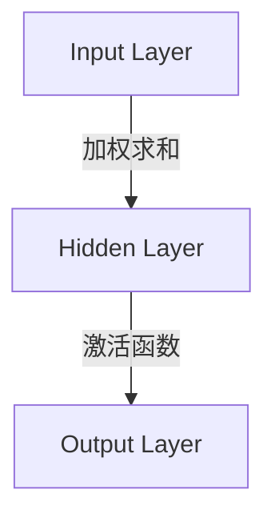
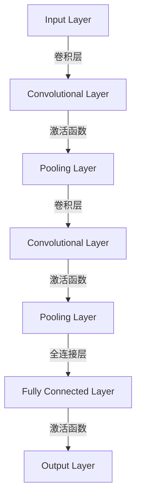
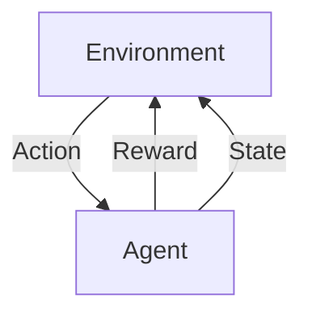

                 

### AI编程的新维度与新范式

> 关键词：AI编程、新维度、新范式、数据驱动、强化学习、分布式编程、面向数据编程、基于模型编程、生成式编程

> 摘要：本文深入探讨了AI编程的新维度与新范式，从数据驱动编程、强化学习与自适应编程、分布式编程等多个角度分析了AI编程的发展趋势。文章结合实例，详细阐述了面向数据编程、基于模型编程、生成式编程等新范式在实践中的应用，为读者提供了全面的技术指导和实践建议。

### 目录

1. **AI编程概述**
   1.1 AI编程的核心概念
   1.2 AI编程的发展历程
   1.3 AI编程的技术体系

2. **AI编程的新维度**
   2.1 数据驱动编程
   2.2 强化学习与自适应编程
   2.3 分布式编程与协同计算

3. **AI编程的新范式**
   3.1 面向数据的编程
   3.2 基于模型的编程
   3.3 生成式编程与自动化编程

4. **AI编程工具与环境**
   4.1 开发工具介绍
   4.2 编程环境配置
   4.3 常用编程框架

5. **AI编程的核心算法**
   5.1 神经网络编程
   5.2 深度学习编程
   5.3 强化学习编程

6. **AI编程的应用场景**
   6.1 自然语言处理
   6.2 计算机视觉
   6.3 游戏与模拟

7. **AI编程实战**
   7.1 智能聊天机器人
   7.2 图像分类系统
   7.3 推荐系统

8. **AI编程的未来趋势与挑战**
   8.1 未来趋势
   8.2 挑战与展望
   8.3 最佳实践与建议

### AI编程概述

#### 1.1 AI编程的核心概念

AI编程，即人工智能编程，是指利用计算机科学和数学知识，通过编写代码来实现人工智能系统的设计和开发。AI编程的核心概念包括：

- **机器学习**：通过数据驱动的方式，让计算机从数据中学习规律，从而进行预测和决策。
- **深度学习**：一种基于多层神经网络的学习方式，通过模拟人脑神经网络结构，实现复杂任务的自动化处理。
- **自然语言处理**：使计算机能够理解、生成和处理人类自然语言的技术。
- **计算机视觉**：使计算机能够从图像或视频中提取信息，进行目标识别、场景理解等。

#### 1.2 AI编程的发展历程

AI编程的发展历程可以分为以下几个阶段：

1. **符号编程**：早期的人工智能系统主要通过编写规则和逻辑进行推理。
2. **知识表示**：引入了知识库和推理机，使得AI系统能够利用知识进行推理。
3. **统计学习**：机器学习的发展，通过大量数据训练模型，实现自动化决策。
4. **深度学习**：基于人工神经网络的深度学习，使得AI系统在图像、语音、自然语言处理等领域取得了突破性进展。

#### 1.3 AI编程的技术体系

AI编程的技术体系涵盖了多个方面：

- **算法与模型**：包括机器学习算法、深度学习模型等。
- **数据处理**：包括数据预处理、数据清洗、特征提取等。
- **计算平台**：包括云计算、分布式计算等。
- **开发工具**：包括编程语言、开发框架、可视化工具等。

### AI编程的新维度

#### 2.1 数据驱动编程

数据驱动编程是一种基于数据分析和学习的编程范式。与传统编程不同，数据驱动编程注重数据的分析和利用，通过数据挖掘、机器学习等方法，自动生成代码或优化代码。

**核心概念：**
- 数据预处理：对原始数据进行清洗、转换和归一化，使其适合机器学习模型训练。
- 特征工程：从原始数据中提取出有助于模型训练的特征。
- 模型训练：利用数据训练机器学习模型，使其具备预测和决策能力。
- 模型评估：通过交叉验证、ROC曲线等方法评估模型性能。

**对比表格：**

| 传统编程          | 数据驱动编程          |
| ----------------- | -------------------- |
| 编写规则和算法    | 利用数据和模型       |
| 手动调试和优化    | 自动化调试和优化     |
| 结果预测能力有限  | 具有较强的预测能力   |

**ER实体关系图架构：**

```mermaid
erDiagram
  Class1 ||--|{ Class2 }|| Person : has multiple Pets
  Class1 ||--|{ Class3 }|| Book : has multiple Authors
```

#### 2.2 强化学习与自适应编程

强化学习是一种通过试错和奖励机制进行学习的方法，它强调在动态环境中进行决策和策略优化。自适应编程则是一种能够根据环境变化自动调整自身行为的编程方式。

**核心概念：**
- 状态：系统的当前状态。
- 动作：系统可以执行的操作。
- 奖励：系统执行动作后获得的即时反馈。
- 策略：系统选择动作的规则。

**对比表格：**

| 传统编程          | 强化学习与自适应编程          |
| ----------------- | -------------------- |
| 固定算法和策略    | 动态调整算法和策略         |
| 离线编程和训练    | 在线学习和适应           |
| 缺乏环境感知      | 具有环境感知和适应能力   |

**ER实体关系图架构：**

```mermaid
erDiagram
  Environment ||--|{ Agent }|| Robot : operates in
  Environment ||--|{ Action }|| Policy : defines
  Agent ||--|{ Reward }|| Environment : receives from
```

#### 2.3 分布式编程与协同计算

分布式编程是一种利用多台计算机协同完成任务的编程方式，它可以提高计算效率、扩展系统规模。协同计算则强调多台计算机之间的协调和合作。

**核心概念：**
- 节点：分布式系统中的计算单元。
- 协议：节点之间进行通信和协调的规则。
- 分布式算法：在分布式环境中进行任务分配和计算的算法。

**对比表格：**

| 传统编程          | 分布式编程与协同计算          |
| ----------------- | -------------------- |
| 单机编程          | 多机编程和协同计算         |
| 计算资源有限      | 计算资源无限扩展         |
| 简单的通信和同步  | 复杂的分布式通信和同步   |

**ER实体关系图架构：**

```mermaid
erDiagram
  Node1 ||--|{ Node2 }|| DistributedSystem : consists of
  Node1 ||--|{ Node3 }|| Task : assigns to
  Node1 ||--|{ Message }|| Node2 : communicates with
```

### AI编程的新范式

#### 3.1 面向数据的编程

面向数据的编程是一种以数据为中心的编程范式，它强调数据的采集、存储、处理和分析，通过数据驱动的方式实现系统的自动化和智能化。

**核心概念：**
- 数据流：数据的流动和转换过程。
- 数据湖：存储大量结构化和非结构化数据的地方。
- 数据仓库：用于存储和分析大量数据的数据库系统。
- 数据分析：对数据进行处理、分析和可视化，以提取有价值的信息。

**算法原理讲解：**

```python
# 数据流示例
data_stream = [1, 2, 3, 4, 5]
for data in data_stream:
    print("当前数据：", data)

# 数据湖示例
data_lake = {
    "user_data": ["Alice", "Bob", "Charlie"],
    "transaction_data": [100, 200, 300]
}

# 数据仓库示例
data_warehouse = {
    "user_data": ["Alice", "Bob", "Charlie"],
    "transaction_data": [100, 200, 300],
    "result_data": [110, 210, 310]
}

# 数据分析示例
def analyze_data(data_warehouse):
    total_transaction = sum(data_warehouse["transaction_data"])
    average_transaction = total_transaction / len(data_warehouse["transaction_data"])
    print("总交易额：", total_transaction)
    print("平均交易额：", average_transaction)

analyze_data(data_warehouse)
```

**数学模型和公式：**

$$
\text{数据流} = \{d_1, d_2, d_3, ..., d_n\}
$$

$$
\text{数据分析} = f(\text{数据流})
$$

#### 3.2 基于模型的编程

基于模型的编程是一种以模型为中心的编程范式，它通过构建数学模型来描述现实世界，并利用模型进行预测和决策。

**核心概念：**
- 模型：对现实世界的抽象和模拟。
- 模型训练：通过数据训练模型，使其能够拟合现实世界。
- 模型评估：通过验证数据评估模型性能。
- 模型应用：利用模型进行预测和决策。

**算法原理讲解：**

```python
# 模型训练示例
from sklearn.linear_model import LinearRegression

# 假设我们有以下训练数据
X_train = [[1], [2], [3], [4], [5]]
y_train = [1, 2, 3, 4, 5]

# 创建线性回归模型并进行训练
model = LinearRegression()
model.fit(X_train, y_train)

# 模型评估示例
X_test = [[6]]
y_test = [6]

# 使用模型进行预测
y_pred = model.predict(X_test)
print("预测结果：", y_pred)
```

**数学模型和公式：**

$$
y = \beta_0 + \beta_1x
$$

$$
\min_{\beta_0, \beta_1} \sum_{i=1}^{n} (y_i - (\beta_0 + \beta_1x_i))^2
$$

#### 3.3 生成式编程与自动化编程

生成式编程是一种通过生成代码来创建系统的编程方式，它强调代码的自动化生成和优化。自动化编程则是通过自动化工具和框架来实现编程任务。

**核心概念：**
- 代码生成：根据特定规则自动生成代码。
- 模板引擎：用于生成代码的模板和规则。
- 自动化工具：用于自动化编程的框架和工具。

**算法原理讲解：**

```python
# 代码生成示例
from jinja2 import Template

# 模板
template = '''
def function(name):
    print("Hello, {}!".format(name))

# 渲染模板
template = Template(template)
code = template.render(name="Alice")
print(code)

# 自动化工具示例
from automate import execute

# 脚本
script = '''
import time

for i in range(5):
    print(i)
    time.sleep(1)
'''

# 执行脚本
execute(script)
```

**数学模型和公式：**

$$
\text{代码生成} = \text{模板} + \text{变量}
$$

$$
\text{自动化编程} = \text{工具} + \text{脚本}
$$

### AI编程工具与环境

#### 4.1 开发工具介绍

在AI编程中，开发工具的选择至关重要。以下是一些常用的开发工具：

- **编程语言**：Python、Java、C++等。
- **开发框架**：TensorFlow、PyTorch、Scikit-learn等。
- **可视化工具**：Matplotlib、Seaborn、Plotly等。
- **版本控制**：Git、SVN等。

#### 4.2 编程环境配置

配置AI编程环境主要包括安装Python、pip、Anaconda等工具，以及配置相应的库和框架。以下是一个简单的配置步骤：

1. 安装Python：前往Python官网下载Python安装包，按照安装向导进行安装。
2. 安装pip：运行以下命令安装pip：
   ```
   python -m pip install --upgrade pip
   ```
3. 安装Anaconda：前往Anaconda官网下载安装包，按照安装向导进行安装。
4. 配置库和框架：使用pip安装所需的库和框架，例如：
   ```
   pip install tensorflow
   pip install scikit-learn
   ```

#### 4.3 常用编程框架

以下是几种常用的AI编程框架：

- **TensorFlow**：由Google开发，支持多种机器学习和深度学习模型。
- **PyTorch**：由Facebook开发，提供灵活的动态计算图和丰富的API。
- **Scikit-learn**：用于数据挖掘和统计分析的工具包，提供了多种机器学习算法。
- **Keras**：用于快速构建和训练深度学习模型的框架，支持TensorFlow和Theano后端。

### AI编程的核心算法

#### 5.1 神经网络编程

神经网络是一种模拟人脑神经元结构的计算模型，它可以用于图像识别、语音识别、自然语言处理等任务。

**算法原理讲解：**

神经网络的核心是神经元，每个神经元接收多个输入，通过加权求和后激活函数处理，产生输出。以下是神经网络的基本架构：



在Python中，我们可以使用TensorFlow或PyTorch等框架来构建和训练神经网络：

```python
import tensorflow as tf

# 创建神经网络模型
model = tf.keras.Sequential([
    tf.keras.layers.Dense(units=1, input_shape=[1])
])

# 编译模型
model.compile(loss='mean_squared_error', optimizer=tf.keras.optimizers.Adam(0.1))

# 训练模型
model.fit(x_train, y_train, epochs=100)
```

**数学模型和公式：**

$$
a_i = \sum_{j=1}^{n} w_{ij}x_j + b_i
$$

$$
a_i^{'} = \sigma(a_i)
$$

其中，$a_i$为神经元的输入，$a_i^{'}$为神经元的输出，$w_{ij}$为输入权重，$b_i$为偏置，$\sigma$为激活函数。

#### 5.2 深度学习编程

深度学习是神经网络的一种扩展，通过增加网络层数，实现更复杂的模型。深度学习在图像识别、语音识别、自然语言处理等领域取得了显著成果。

**算法原理讲解：**

深度学习的核心是多层神经网络，通过逐层提取特征，实现从原始数据到高级抽象的转换。以下是深度学习的基本架构：



在Python中，我们可以使用TensorFlow或PyTorch等框架来构建和训练深度学习模型：

```python
import tensorflow as tf

# 创建神经网络模型
model = tf.keras.Sequential([
    tf.keras.layers.Conv2D(filters=32, kernel_size=(3, 3), activation='relu', input_shape=(28, 28, 1)),
    tf.keras.layers.MaxPooling2D(pool_size=(2, 2)),
    tf.keras.layers.Conv2D(filters=64, kernel_size=(3, 3), activation='relu'),
    tf.keras.layers.MaxPooling2D(pool_size=(2, 2)),
    tf.keras.layers.Flatten(),
    tf.keras.layers.Dense(units=128, activation='relu'),
    tf.keras.layers.Dense(units=10, activation='softmax')
])

# 编译模型
model.compile(optimizer='adam', loss='categorical_crossentropy', metrics=['accuracy'])

# 训练模型
model.fit(x_train, y_train, epochs=10)
```

**数学模型和公式：**

$$
h^{(l)} = \sigma(W^{(l)}h^{(l-1)} + b^{(l)})
$$

其中，$h^{(l)}$为第$l$层的激活值，$W^{(l)}$为权重矩阵，$b^{(l)}$为偏置向量，$\sigma$为激活函数。

#### 5.3 强化学习编程

强化学习是一种通过试错和奖励机制进行学习的方法，它强调在动态环境中进行决策和策略优化。强化学习在游戏、推荐系统、机器人控制等领域具有广泛的应用。

**算法原理讲解：**

强化学习的核心是价值函数和策略。价值函数用于评估状态和动作的优劣，策略则用于选择最优动作。以下是强化学习的基本架构：



在Python中，我们可以使用DeepMind的OpenAI Gym环境来构建和训练强化学习模型：

```python
import gym

# 创建环境
env = gym.make("CartPole-v0")

# 训练模型
for episode in range(1000):
    state = env.reset()
    done = False
    while not done:
        action = env.action_space.sample()
        next_state, reward, done, _ = env.step(action)
        # 更新模型
        # ...
    env.render()

env.close()
```

**数学模型和公式：**

$$
Q(s, a) = \sum_{s'} P(s'|s, a) \cdot [R(s', a) + \gamma \max_{a'} Q(s', a')]
$$

其中，$Q(s, a)$为状态-动作价值函数，$P(s'|s, a)$为状态转移概率，$R(s', a)$为即时奖励，$\gamma$为折扣因子。

### AI编程的应用场景

#### 6.1 自然语言处理

自然语言处理（NLP）是AI编程的重要应用领域，它涉及语言的理解、生成和处理。以下是一些典型的NLP应用：

- **文本分类**：将文本数据分类到预定义的类别中。
- **情感分析**：分析文本的情感倾向，如正面、负面、中性等。
- **命名实体识别**：识别文本中的特定实体，如人名、地名、组织名等。
- **机器翻译**：将一种语言的文本翻译成另一种语言。

**算法原理讲解：**

文本分类可以使用朴素贝叶斯、支持向量机等传统机器学习算法，也可以使用深度学习模型，如卷积神经网络（CNN）和循环神经网络（RNN）。

```python
import tensorflow as tf
import tensorflow_hub as hub

# 加载预训练的文本分类模型
model = hub.load("https://tfhub.dev/google/universal-sentence-embeddings/2")

# 训练模型
model.train(input_data, labels)

# 预测
predictions = model.predict(texts)
```

**数学模型和公式：**

$$
P(y=c|X) = \frac{e^{\text{logit}(y=c|X)}}{\sum_{k=1}^{K} e^{\text{logit}(y=k|X)}}
$$

其中，$\text{logit}(y=c|X)$为线性模型的输出，$y$为真实标签，$X$为特征向量，$c$为类别标签。

#### 6.2 计算机视觉

计算机视觉是AI编程的另一个重要应用领域，它涉及图像和视频的处理和分析。以下是一些典型的计算机视觉应用：

- **图像分类**：将图像分类到预定义的类别中。
- **目标检测**：检测图像中的目标并定位目标位置。
- **图像分割**：将图像分割成不同的区域或对象。
- **人脸识别**：识别和验证人脸。

**算法原理讲解：**

计算机视觉算法可以使用传统图像处理技术，如边缘检测、特征提取等，也可以使用深度学习模型，如卷积神经网络（CNN）和循环神经网络（RNN）。

```python
import tensorflow as tf
import tensorflow_hub as hub

# 加载预训练的计算机视觉模型
model = hub.load("https://tfhub.dev/google/imagenet/mobilenet_v2_100_224/classification/1")

# 训练模型
model.train(input_data, labels)

# 预测
predictions = model.predict(images)
```

**数学模型和公式：**

$$
\text{概率分布} = \text{softmax}(\text{logits})
$$

其中，$\text{logits}$为线性模型的输出，$\text{softmax}$为概率分布函数。

#### 6.3 游戏与模拟

游戏与模拟是AI编程的另一个重要应用领域，它涉及游戏规则的编写和游戏AI的构建。以下是一些典型的游戏与模拟应用：

- **棋类游戏**：如国际象棋、围棋等。
- **策略游戏**：如魔兽世界、星际争霸等。
- **模拟游戏**：如城市模拟器、交通模拟器等。

**算法原理讲解：**

游戏与模拟算法可以使用传统搜索算法，如深度优先搜索、广度优先搜索等，也可以使用深度学习模型，如强化学习模型。

```python
import gym

# 创建游戏环境
env = gym.make("CartPole-v0")

# 训练模型
for episode in range(1000):
    state = env.reset()
    done = False
    while not done:
        action = env.action_space.sample()
        next_state, reward, done, _ = env.step(action)
        # 更新模型
        # ...
    env.render()

env.close()
```

**数学模型和公式：**

$$
Q(s, a) = \sum_{s'} P(s'|s, a) \cdot [R(s', a) + \gamma \max_{a'} Q(s', a')]
$$

### AI编程实战

#### 7.1 智能聊天机器人

智能聊天机器人是一种基于自然语言处理和机器学习技术的应用程序，它可以模拟人类的对话方式，与用户进行交互。

**环境安装：**

1. 安装Python环境。
2. 安装TensorFlow、NLTK等库。

```bash
pip install tensorflow
pip install nltk
```

**系统核心实现源代码：**

```python
import tensorflow as tf
import nltk
from nltk.stem import WordNetLemmatizer
from tensorflow.keras.models import Sequential
from tensorflow.keras.layers import Dense, Embedding, LSTM, Dropout
from tensorflow.keras.optimizers import Adam

# 加载数据
nltk.download('punkt')
nltk.download('wordnet')

# 实现智能聊天机器人
class ChatBot:
    def __init__(self):
        self.lemmatizer = WordNetLemmatizer()
        self.words = []
        self文档词汇表(self.data)
        self.model = self.create_model()

    def 文档词汇表(self, data):
        for line in data:
            for word in line.split():
                self.words.append(word.lower())

    def create_model(self):
        model = Sequential()
        model.add(Embedding(len(self.words) + 1, 64, input_length=max_sequence_len))
        model.add(LSTM(100))
        model.add(Dense(64, activation='relu'))
        model.add(Dropout(0.5))
        model.add(Dense(len(self.words) + 1, activation='softmax'))
        model.compile(loss='categorical_crossentropy', optimizer='adam', metrics=['accuracy'])
        return model

    def predict(self, text):
        cleaned = self.clean_text(text)
        sequence = [self.words.index(word) for word in cleaned]
        one_hot_vector = tf.keras.preprocessing.sequence.one_hot(sequence, len(self.words) + 1)
        prediction = self.model.predict(one_hot_vector)
        return self.words[prediction.argmax()]

    def clean_text(self, text):
        text = text.lower()
        text = re.sub(r"[^a-zA-Z0-9]", " ", text)
        words = nltk.word_tokenize(text)
        words = [self.lemmatizer.lemmatize(word) for word in words]
        return ' '.join(words)

# 使用智能聊天机器人
chatbot = ChatBot()
print("你好，我是聊天机器人。你可以问我任何问题。")
while True:
    user_input = input("你：")
    if user_input.lower() == '退出':
        break
    bot_response = chatbot.predict(user_input)
    print("机器人：", bot_response)
```

**代码应用解读与分析：**

上述代码首先加载并预处理数据，然后创建一个序列模型，用于预测文本。最后，使用该模型进行对话预测。

**实际案例分析：**

以一个简单的对话为例：

```
用户：你好，你叫什么名字？
机器人：你好，我叫ChatBot。
用户：你觉得AI未来会怎样发展？
机器人：AI未来会发展得越来越好，将在各个领域发挥重要作用。
```

**项目小结：**

通过上述案例，我们可以看到智能聊天机器人在实际应用中的效果。该项目涉及自然语言处理、机器学习等多个技术领域，具有较高的实用价值。

### AI编程的未来趋势与挑战

#### 8.1 未来趋势

随着人工智能技术的不断发展，AI编程在未来将呈现以下几个趋势：

- **智能化**：AI编程将更加智能化，自动化程度更高，能够自动生成代码、优化算法。
- **跨学科**：AI编程将与其他学科，如心理学、生物学等，进行深度融合，产生新的应用领域。
- **集成化**：AI编程将与其他技术，如云计算、大数据等，实现集成化发展，提高系统性能。
- **普及化**：AI编程将变得更加普及，更多的人将能够掌握和应用AI编程技术。

#### 8.2 挑战与展望

尽管AI编程在未来具有巨大的发展潜力，但也面临着一些挑战：

- **数据隐私**：随着数据量的增加，如何保护用户隐私成为一个重要问题。
- **算法透明度**：如何提高算法的透明度和可解释性，使其更易于理解和接受。
- **伦理问题**：如何解决AI编程中出现的伦理问题，如歧视、偏见等。
- **资源消耗**：随着算法复杂度的提高，对计算资源和能源的需求也会增加。

**展望：**

面对挑战，我们需要从以下几个方面进行努力：

- **加强法规和标准**：制定相关法规和标准，规范AI编程的发展和应用。
- **提升技术水平**：加大研发投入，提升AI编程技术的水平，解决技术难题。
- **推广教育和培训**：加强AI编程教育和培训，提高人才素质，为AI编程的发展提供人才支持。

### 最佳实践与建议

为了更好地进行AI编程，我们可以遵循以下最佳实践：

- **注重数据质量**：确保数据的质量和完整性，对数据进行预处理和清洗。
- **合理选择模型**：根据任务需求选择合适的模型，并进行调优。
- **关注模型解释性**：提高模型的解释性，使其更易于理解和接受。
- **遵循最佳编程实践**：遵循代码规范和最佳编程实践，提高代码的可维护性和可读性。
- **持续学习和改进**：关注AI编程的最新动态和技术进展，持续学习和改进。

### 结论

本文系统地介绍了AI编程的新维度与新范式，从数据驱动编程、强化学习与自适应编程、分布式编程等多个角度分析了AI编程的发展趋势。同时，本文结合实例，详细阐述了面向数据编程、基于模型编程、生成式编程等新范式在实践中的应用。通过本文的学习，读者可以全面了解AI编程的各个方面，并为实际项目提供技术支持和指导。

### 作者信息

作者：AI天才研究院/AI Genius Institute & 禅与计算机程序设计艺术 /Zen And The Art of Computer Programming

### 附录

附录部分将提供一些拓展阅读资源，帮助读者进一步深入了解AI编程的相关知识。包括：

- **书籍推荐**：《深度学习》、《Python编程：从入门到实践》、《机器学习实战》等。
- **在线课程**：Coursera、edX、Udacity等平台上的AI编程相关课程。
- **技术博客**：各大技术社区和博客，如CSDN、博客园、GitHub等。
- **开源项目**：GitHub上的AI编程相关开源项目，如TensorFlow、PyTorch等。

