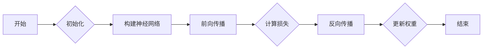
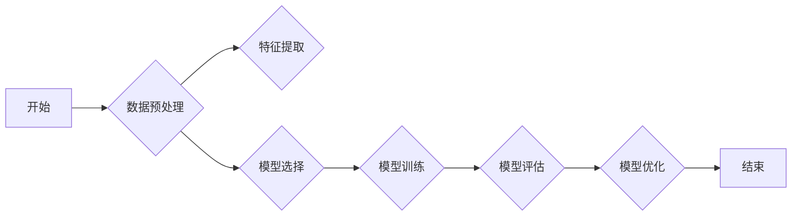
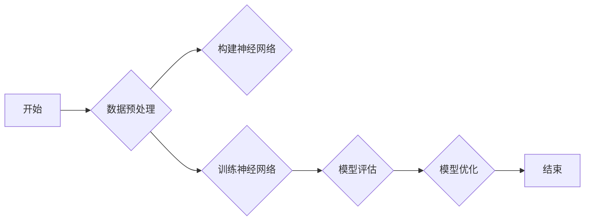

                 

# 《AI编程的新维度与新视野》

## 关键词：人工智能、编程语言、神经网络、机器学习、深度学习

## 摘要：
随着人工智能技术的迅猛发展，AI编程成为了一个热点领域。本文旨在探讨AI编程的新维度与新视野，通过深入分析核心概念、算法原理、系统架构以及实战应用，为读者提供一份全面而深入的指导。让我们一步一步思考，共同探索AI编程的未来。

---

## 第一部分：背景介绍与核心概念

### 第1章：人工智能与编程概述

#### 1.1 问题背景与问题描述

人工智能（AI）是计算机科学的一个分支，旨在使机器具备类似人类智能的能力，如感知、学习、推理、决策等。编程则是实现这些智能功能的手段，通过编写指令让计算机执行特定任务。

- 人工智能的发展历程：
  - 从1950年代的图灵测试到今天的深度学习；
  - 自然语言处理、计算机视觉、自动驾驶等应用的兴起。

- 编程语言的发展与演变：
  - 从早期的机器语言到高级语言，如C、Java、Python等；
  - 功能性编程、声明式编程、面向对象编程等编程范式的发展。

- 人工智能在当今社会的应用：
  - 金融、医疗、教育、交通、娱乐等领域的广泛应用；
  - 智能助手、智能机器人、智能家居等创新产品。

#### 1.2 问题解决与边界与外延

- 人工智能的边界问题：
  - 当前AI技术的局限性与未来发展方向；
  - 伦理道德问题、隐私保护问题等。

- 编程语言的适用场景：
  - 面向不同应用的编程语言选择；
  - 性能需求、开发效率、生态系统等考虑因素。

- 人工智能与编程的结合点：
  - 人工智能算法的编程实现；
  - 编程语言在人工智能中的应用，如Python在深度学习中的广泛应用。

#### 1.3 核心概念结构

- 人工智能的核心概念：
  - 机器学习、深度学习、强化学习等；
  - 计算机视觉、自然语言处理、机器人技术等应用领域。

- 编程语言的核心概念：
  - 变量、数据类型、控制结构、函数、类等；
  - 面向对象编程、模块化编程、函数式编程等编程范式。

- 人工智能编程的基本要素：
  - 数据处理、模型训练、模型评估、模型部署等；
  - 编程语言、框架、工具等支持。

---

### 第2章：AI编程中的核心概念与联系

#### 2.1 核心概念原理

- 神经网络：
  - 神经元、层次结构、激活函数等；
  - 反向传播算法、梯度下降优化等。

- 机器学习：
  - 监督学习、无监督学习、强化学习等；
  - 特征提取、模型训练、模型评估等。

- 深度学习：
  - 神经网络深度化、卷积神经网络、循环神经网络等；
  - 深度学习框架、深度学习模型等。

#### 2.2 概念属性特征对比表格

| 概念         | 特征                                       |
|--------------|------------------------------------------|
| 神经网络     | 多层结构、神经元、激活函数、反向传播等     |
| 机器学习     | 监督学习、无监督学习、强化学习等           |
| 深度学习     | 深层神经网络、卷积神经网络、循环神经网络等 |

#### 2.3 ER实体关系图架构

```mermaid
erDiagram
    Class1 ||--|||> Class2 :关联关系
    Class1 ||--|| Class3 :继承关系
    Class1 ||--|| Class4 :聚合关系
```

---

## 第二部分：算法原理讲解

### 第3章：神经网络算法原理

#### 3.1 算法mermaid流程图



#### 3.2 Python源代码与算法原理

```python
# 导入相关库
import numpy as np

# 初始化神经网络
def initialize_network(input_size, hidden_size, output_size):
    # 初始化权重和偏置
    # ...
    return neural_network

# 构建神经网络
def build_network(input_size, hidden_size, output_size):
    # 构建神经网络结构
    # ...
    return neural_network

# 前向传播
def forward_pass(inputs, neural_network):
    # 计算输出
    # ...
    return outputs

# 反向传播
def backward_pass(inputs, outputs, expected_outputs, neural_network):
    # 计算损失
    # 更新权重和偏置
    # ...
    return updated_network

# 主函数
def main():
    # 设置参数
    input_size = ...
    hidden_size = ...
    output_size = ...

    # 初始化网络
    neural_network = initialize_network(input_size, hidden_size, output_size)

    # 加载数据
    # ...

    # 训练网络
    for epoch in range(num_epochs):
        for inputs, expected_outputs in data_loader:
            # 前向传播
            outputs = forward_pass(inputs, neural_network)

            # 计算损失
            loss = compute_loss(expected_outputs, outputs)

            # 反向传播
            updated_network = backward_pass(inputs, outputs, expected_outputs, neural_network)

    # 评估网络
    # ...

if __name__ == "__main__":
    main()
```

#### 3.3 数学模型与公式

$$
\begin{aligned}
\text{激活函数：} f(x) &= \frac{1}{1 + e^{-x}} \\
\text{损失函数：} J(\theta) &= -\frac{1}{m} \sum_{i=1}^{m} y_{i} \log(a_{i}) + (1 - y_{i}) \log(1 - a_{i}) \\
\text{反向传播：} \frac{\partial J}{\partial \theta} &= \frac{\partial}{\partial \theta} \left[ \frac{1}{m} \sum_{i=1}^{m} (a_{i} - y_{i}) \right] \\
\text{权重更新：} \theta &= \theta - \alpha \frac{\partial J}{\partial \theta}
\end{aligned}
$$`

#### 3.4 举例说明

假设我们有一个简单的神经网络，用于分类任务。输入层有3个神经元，隐藏层有2个神经元，输出层有1个神经元。训练数据集包含100个样本，每个样本有3个特征。

- 初始化神经网络：
  - 输入层权重：\( W^{(1)} \)
  - 隐藏层权重：\( W^{(2)} \)
  - 输出层权重：\( W^{(3)} \)
- 前向传播：
  - 输入特征：\( x \)
  - 隐藏层输出：\( a^{(2)} = g(W^{(1)}x + b^{(1)}) \)
  - 输出层输出：\( a^{(3)} = g(W^{(2)}a^{(2)} + b^{(2)}) \)
- 计算损失：
  - 实际输出：\( y \)
  - 预测输出：\( \hat{y} = a^{(3)} \)
  - 损失函数：\( J = -\frac{1}{m} \sum_{i=1}^{m} y \log(\hat{y}) + (1 - y) \log(1 - \hat{y}) \)
- 反向传播：
  - 计算输出层梯度：
    $$ \frac{\partial J}{\partial W^{(3)}} = (a^{(3)} - y) \odot a^{(2)} $$
    $$ \frac{\partial J}{\partial b^{(3)}} = (a^{(3)} - y) \odot 1 $$
  - 计算隐藏层梯度：
    $$ \frac{\partial J}{\partial W^{(2)}} = (a^{(2)} - z^{(2)}) \odot a^{(1)} $$
    $$ \frac{\partial J}{\partial b^{(2)}} = (a^{(2)} - z^{(2)}) \odot 1 $$
  - 更新权重和偏置：
    $$ W^{(3)} = W^{(3)} - \alpha \frac{\partial J}{\partial W^{(3)}} $$
    $$ b^{(3)} = b^{(3)} - \alpha \frac{\partial J}{\partial b^{(3)}} $$
    $$ W^{(2)} = W^{(2)} - \alpha \frac{\partial J}{\partial W^{(2)}} $$
    $$ b^{(2)} = b^{(2)} - \alpha \frac{\partial J}{\partial b^{(2)}} $$

---

### 第4章：机器学习算法原理

#### 4.1 算法mermaid流程图



#### 4.2 Python源代码与算法原理

```python
# 导入相关库
import numpy as np
from sklearn.datasets import load_iris
from sklearn.model_selection import train_test_split
from sklearn.metrics import accuracy_score

# 加载数据
data = load_iris()
X, y = data.data, data.target

# 数据预处理
X_train, X_test, y_train, y_test = train_test_split(X, y, test_size=0.2, random_state=42)

# 特征提取
# ...

# 模型选择
# ...

# 模型训练
model.fit(X_train, y_train)

# 模型评估
y_pred = model.predict(X_test)
accuracy = accuracy_score(y_test, y_pred)
print("Accuracy:", accuracy)

# 模型优化
# ...

if __name__ == "__main__":
    main()
```

#### 4.3 数学模型与公式

$$
\begin{aligned}
\text{线性回归模型：} y &= \beta_0 + \beta_1x \\
\text{损失函数：} J(\theta) &= \frac{1}{2m} \sum_{i=1}^{m} (h_\theta(x^{(i)}) - y^{(i)})^2 \\
\text{梯度下降：} \theta &= \theta - \alpha \frac{\partial J}{\partial \theta}
\end{aligned}
$$`

#### 4.4 举例说明

假设我们使用线性回归模型进行数据拟合，训练数据集包含100个样本，每个样本有2个特征。

- 数据预处理：
  - 数据标准化：\( x^{(i)} = \frac{x^{(i)} - \mu}{\sigma} \)
  - 划分训练集和测试集
- 特征提取：
  - 特征选择：选择有意义的特征
  - 特征工程：创建新的特征、转换特征
- 模型选择：
  - 选择线性回归模型
  - 确定参数：\( \beta_0 \)和\( \beta_1 \)
- 模型训练：
  - 计算损失函数：
    $$ J(\theta) = \frac{1}{2m} \sum_{i=1}^{m} (h_\theta(x^{(i)}) - y^{(i)})^2 $$
  - 计算梯度：
    $$ \frac{\partial J}{\partial \theta_0} = \frac{1}{m} \sum_{i=1}^{m} (h_\theta(x^{(i)}) - y^{(i)}) $$
    $$ \frac{\partial J}{\partial \theta_1} = \frac{1}{m} \sum_{i=1}^{m} (h_\theta(x^{(i)}) - y^{(i)}) x^{(i)} $$
  - 更新参数：
    $$ \theta_0 = \theta_0 - \alpha \frac{\partial J}{\partial \theta_0} $$
    $$ \theta_1 = \theta_1 - \alpha \frac{\partial J}{\partial \theta_1} $$
- 模型评估：
  - 计算测试集的损失函数：
    $$ J(\theta) = \frac{1}{2m} \sum_{i=1}^{m} (h_\theta(x^{(i)}) - y^{(i)})^2 $$
  - 计算准确率：
    $$ \text{Accuracy} = \frac{1}{m} \sum_{i=1}^{m} \mathbb{1}_{h_\theta(x^{(i)}) = y^{(i)}} $$

---

### 第5章：深度学习算法原理

#### 5.1 算法mermaid流程图



#### 5.2 Python源代码与算法原理

```python
# 导入相关库
import numpy as np
from tensorflow import keras
from tensorflow.keras import layers

# 加载数据
data = ... # 加载数据集

# 数据预处理
# ...

# 构建神经网络
model = keras.Sequential([
    layers.Dense(units=64, activation='relu', input_shape=(input_shape,)),
    layers.Dense(units=64, activation='relu'),
    layers.Dense(units=output_shape, activation='softmax')
])

# 编译模型
model.compile(optimizer='adam',
              loss='categorical_crossentropy',
              metrics=['accuracy'])

# 训练模型
model.fit(X_train, y_train, epochs=num_epochs, batch_size=batch_size)

# 模型评估
loss, accuracy = model.evaluate(X_test, y_test)
print("Test accuracy:", accuracy)

# 模型优化
# ...

if __name__ == "__main__":
    main()
```

#### 5.3 数学模型与公式

$$
\begin{aligned}
\text{前向传播：} a^{(l)} &= \sigma(z^{(l)}) \\
z^{(l)} &= \sum_{k=1}^{n} w^{(l)}_k a^{(l-1)}_k + b^{(l)} \\
\text{反向传播：} \delta^{(l)} &= (a^{(l)

