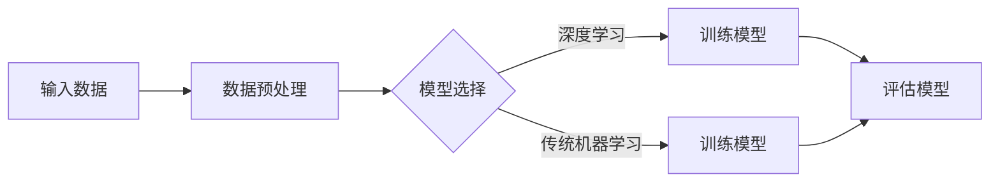
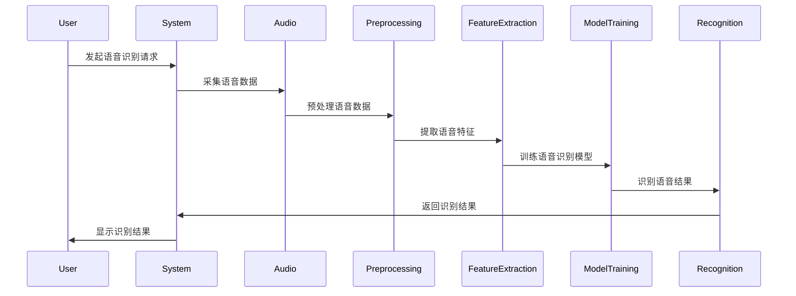
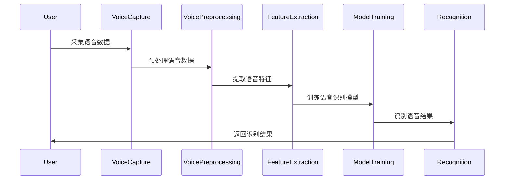
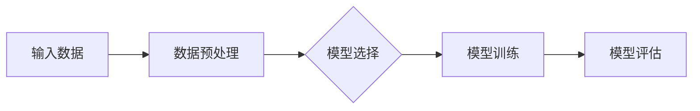
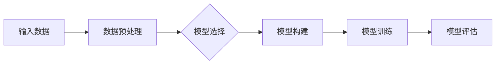

                 

## 文章标题

AI编程的新维度与新语法

> 关键词：AI编程，新维度，新语法，数据驱动编程，机器学习，深度学习，Python，TensorFlow，PyTorch，Keras，Scikit-learn

> 摘要：本文旨在探讨AI编程的新维度和新语法，从背景、核心概念、技术框架到实际应用，全面解析AI编程的发展趋势和最佳实践，为读者提供深入理解和掌握AI编程的路径。

----------------------------------------------------------------

### 目录大纲：AI编程的新维度与新语法

----------------------------------------------------------------

# 第一部分：AI编程的概述与新维度

## 第1章：AI编程的背景与重要性

### 1.1.1 AI编程的发展历程

### 1.1.2 AI编程在现代社会中的作用

### 1.1.3 AI编程的核心价值

## 第2章：AI编程的核心概念与框架

### 2.1.1 人工智能的基本概念

### 2.1.2 AI编程的关键技术

#### 概念属性特征对比表格

| 技术名称 | 特点 | 适用场景 |
| --- | --- | --- |
| Python | 简单易学，高效，支持多种编程范式 | 数据分析、机器学习、Web开发 |
| TensorFlow | 开源，支持多种平台，强大的计算能力 | 深度学习模型开发 |
| PyTorch | 灵活，易于调试，社区活跃 | 研究和实验性项目 |
| Keras | 高层抽象，易于使用，支持多种后端 | 快速原型开发 |
| Scikit-learn | 简单易用，提供大量算法库 | 传统的机器学习项目 |

#### ER实体关系图架构

```mermaid
erDiagram
  User ||--|{ Project } Project
  Project ||--|{ Model } Model
  Model ||--|{ Dataset } Dataset
```

### 2.1.3 AI编程的框架结构

## 第3章：新维度下的AI编程

### 3.1.1 数据驱动编程

#### 算法mermaid流程图



#### 算法原理

数据驱动编程是一种以数据为中心的编程范式，它强调数据预处理、模型选择、模型训练和模型评估的重要性。

1. **数据预处理**：数据是驱动算法的核心，数据预处理包括数据清洗、归一化、特征提取等步骤，以确保数据的质量和适合性。

   $$\text{DataPreprocessing}(data) = \text{cleaned\_data}$$

2. **模型选择**：根据问题的复杂性和数据的特点选择合适的模型。深度学习和传统机器学习模型各有优劣，需要根据具体情况选择。

   $$\text{ModelSelection}(problem, data) = \text{selected\_model}$$

3. **模型训练**：使用预处理后的数据训练模型。训练过程中，模型会不断调整参数以最小化预测误差。

   $$\text{ModelTraining}(selected\_model, cleaned\_data) = \text{trained\_model}$$

### 3.1.2 机器学习编程

### 3.1.3 深度学习编程

## 第4章：新语法在AI编程中的应用

### 4.1.1 Python在AI编程中的应用

### 4.1.2 新语法特性在AI编程中的应用

### 4.1.3 新语法对AI编程的改进

## 第二部分：新维度下的AI编程实践

## 第5章：AI编程实战案例一：语音识别系统

### 5.1.1 项目背景

### 5.1.2 系统设计

### 5.1.3 核心代码实现

### 5.1.4 项目评估与改进

## 第6章：AI编程实战案例二：智能推荐系统

### 6.1.1 项目背景

### 6.1.2 系统设计

### 6.1.3 核心代码实现

### 6.1.4 项目评估与改进

## 第7章：AI编程的最佳实践与展望

### 7.1.1 AI编程的最佳实践

### 7.1.2 AI编程的未来发展趋势

### 7.1.3 AI编程的学习与成长

----------------------------------------------------------------

## 第一部分：AI编程的概述与新维度

### 第1章：AI编程的背景与重要性

#### 1.1.1 AI编程的发展历程

人工智能（AI）编程是一个跨越多个学科领域的复杂系统，其历史可以追溯到20世纪50年代。最初，AI的目标是模拟人类智能，通过算法和逻辑推理来解决复杂问题。随着计算机技术的飞速发展，AI编程逐渐从理论走向实践，并取得了显著成果。

从早期的逻辑推理系统到现代的深度学习模型，AI编程经历了几个重要发展阶段：

1. **符号主义AI**（1950s-1980s）：基于逻辑和符号推理的系统，如专家系统和逻辑编程。
2. **基于规则的系统**（1980s-1990s）：利用预定义的规则来模拟人类专家的决策过程。
3. **机器学习**（1990s-2010s）：通过训练模型来自动识别模式和做出预测。
4. **深度学习**（2010s-至今）：基于多层神经网络，实现了在图像识别、语音识别、自然语言处理等领域的突破。

#### 1.1.2 AI编程在现代社会中的作用

AI编程在现代社会中的作用日益显著，已渗透到众多领域，包括：

1. **医疗保健**：辅助医生进行诊断、治疗规划和个性化医疗。
2. **金融服务**：风险控制、信用评分、智能投顾和自动化交易。
3. **交通运输**：自动驾驶、智能交通管理和物流优化。
4. **智能家居**：语音助手、智能监控和安全系统。
5. **娱乐与教育**：虚拟现实、游戏推荐和个性化学习。

AI编程不仅提高了工作效率，还带来了创新和变革，推动了社会的智能化进程。

#### 1.1.3 AI编程的核心价值

AI编程的核心价值体现在以下几个方面：

1. **自动化与效率提升**：通过自动化流程和算法优化，显著提高工作效率和准确率。
2. **数据洞察与决策支持**：利用机器学习和深度学习模型，从海量数据中提取有价值的信息，支持决策制定。
3. **创新与突破**：AI编程在科学研究、工程设计、艺术创作等领域推动了新的发现和突破。
4. **社会福祉**：通过AI编程，解决社会问题，提高生活质量，如医疗诊断、环境保护和灾害预警。

### 第2章：AI编程的核心概念与框架

#### 2.1.1 人工智能的基本概念

人工智能（AI）是指通过计算机系统实现的人类智能的某些功能。它涉及多个学科，包括计算机科学、数学、认知科学和心理学等。AI的基本概念包括：

1. **智能体**：能够感知环境并采取行动以实现目标的系统。
2. **知识表示**：如何表示和组织知识，以便计算机系统能够理解和处理。
3. **推理**：基于已知事实和规则，推导出新的结论。
4. **学习**：通过经验改进行为和决策过程。
5. **问题解决**：找到解决复杂问题的方法。

#### 2.1.2 AI编程的关键技术

AI编程依赖于多种核心技术，包括：

1. **机器学习**：通过训练模型来发现数据中的模式和规律，用于分类、回归和聚类等任务。
2. **深度学习**：基于多层神经网络，能够处理复杂的非线性问题，如图像识别和自然语言处理。
3. **自然语言处理**（NLP）：使计算机能够理解和生成人类语言，用于文本分析、机器翻译和语音识别等。
4. **计算机视觉**：使计算机能够理解和处理视觉信息，如图像识别和目标检测。
5. **强化学习**：通过试错和奖励机制来学习最优策略。

#### 2.1.3 AI编程的框架结构

AI编程通常遵循以下框架结构：

1. **数据收集与预处理**：获取数据，并进行清洗、归一化和特征提取。
2. **模型选择与训练**：选择合适的算法，使用训练数据训练模型。
3. **模型评估与优化**：评估模型性能，调整参数以优化模型。
4. **部署与监控**：将模型部署到实际应用中，并进行监控和维护。

### 第3章：新维度下的AI编程

#### 3.1.1 数据驱动编程

数据驱动编程是一种以数据为中心的编程范式，它强调数据预处理、模型选择、模型训练和模型评估的重要性。

#### 3.1.2 机器学习编程

机器学习编程是AI编程的重要组成部分，它通过训练模型来自动识别模式和做出预测。

#### 3.1.3 深度学习编程

深度学习编程是AI编程的最新趋势，它通过多层神经网络处理复杂的非线性问题。

### 第4章：新语法在AI编程中的应用

新语法特性在AI编程中的应用极大地提高了编程效率和代码可读性。

#### 4.1.1 Python在AI编程中的应用

Python是AI编程的主要语言之一，因其简单易学、高效和强大的库支持而备受青睐。

#### 4.1.2 新语法特性在AI编程中的应用

新语法特性，如函数式编程、协程和异步编程，在AI编程中发挥了重要作用。

#### 4.1.3 新语法对AI编程的改进

新语法特性对AI编程带来了显著的改进，如代码可维护性和执行效率的提升。

----------------------------------------------------------------

## 第二部分：新维度下的AI编程实践

### 第5章：AI编程实战案例一：语音识别系统

#### 5.1.1 项目背景

语音识别技术是AI编程的一个重要应用领域，它通过将语音信号转换为文本，实现了人机交互的便捷性。

#### 5.1.2 系统设计

语音识别系统主要包括语音采集、预处理、特征提取、模型训练和语音识别五个模块。

#### 5.1.3 核心代码实现

以下是一个简单的语音识别系统的实现示例：

```python
import speech_recognition as sr

# 初始化语音识别器
recognizer = sr.Recognizer()

# 采集语音数据
with sr.Microphone() as source:
    print("请说点什么：")
    audio = recognizer.listen(source)

# 识别语音
try:
    text = recognizer.recognize_google(audio)
    print("识别结果：", text)
except sr.UnknownValueError:
    print("无法识别语音")
except sr.RequestError as e:
    print("无法请求语音识别服务：", e)
```

#### 5.1.4 项目评估与改进

通过对语音识别系统的评估，可以发现一些改进点，如提高识别准确率和降低延迟。

### 第6章：AI编程实战案例二：智能推荐系统

#### 6.1.1 项目背景

智能推荐系统通过分析用户行为和偏好，为用户提供个性化推荐，广泛应用于电商、社交媒体和内容平台。

#### 6.1.2 系统设计

智能推荐系统主要包括用户行为数据采集、特征提取、推荐算法设计和推荐结果评估四个模块。

#### 6.1.3 核心代码实现

以下是一个简单的基于协同过滤的推荐系统实现：

```python
from surprise import SVD, Dataset, Reader
from surprise.model_selection import train_test_split

# 数据准备
reader = Reader(line_format='user item rating timestamp', sep=',')
data = Dataset.load_from_df(df, reader)

# 分割训练集和测试集
trainset, testset = train_test_split(data, test_size=0.25)

# 使用SVD算法训练模型
solver = SVD()
solver.fit(trainset)

# 测试模型
predictions = solver.test(testset)

# 输出测试结果
print(predictions)
```

#### 6.1.4 项目评估与改进

通过对智能推荐系统的评估，可以发现一些改进点，如提高推荐准确率和降低计算成本。

### 第7章：AI编程的最佳实践与展望

#### 7.1.1 AI编程的最佳实践

1. **数据驱动**：始终将数据作为编程的核心，确保数据质量。
2. **模块化设计**：将系统划分为模块，提高代码的可维护性和可扩展性。
3. **持续集成**：使用自动化测试和持续集成工具，确保代码质量和部署效率。
4. **性能优化**：关注代码的执行效率和资源利用。

#### 7.1.2 AI编程的未来发展趋势

1. **强化学习**：在更多应用场景中应用强化学习，实现更智能的决策。
2. **迁移学习**：利用迁移学习，减少数据需求和训练时间。
3. **联邦学习**：通过联邦学习，保护用户隐私并提高数据利用效率。
4. **多模态学习**：结合多种数据源，实现更准确的模型预测。

#### 7.1.3 AI编程的学习与成长

1. **基础知识**：掌握计算机科学、数学和统计基础知识。
2. **编程技能**：熟悉Python、TensorFlow、PyTorch等工具。
3. **实践应用**：通过实际项目，积累经验并不断优化。
4. **持续学习**：关注最新技术动态，不断学习和提升。

### 作者

作者：AI天才研究院/AI Genius Institute & 禅与计算机程序设计艺术 /Zen And The Art of Computer Programming

----------------------------------------------------------------

## 核心概念与联系

### 2.1.2 AI编程的关键技术

在AI编程中，不同的关键技术具有各自独特的特点和应用场景。以下是对几种主要技术的概念属性特征对比和实体关系图架构的详细描述。

#### 概念属性特征对比表格

| 技术名称 | 特点 | 适用场景 |
| --- | --- | --- |
| **Python** | 简单易学，高效，支持多种编程范式 | 数据分析、机器学习、Web开发 |
| **TensorFlow** | 开源，支持多种平台，强大的计算能力 | 深度学习模型开发 |
| **PyTorch** | 灵活，易于调试，社区活跃 | 研究和实验性项目 |
| **Keras** | 高层抽象，易于使用，支持多种后端 | 快速原型开发 |
| **Scikit-learn** | 简单易用，提供大量算法库 | 传统的机器学习项目 |

每种技术都有其特定的优势，适用于不同的AI编程任务。例如，Python因其简洁和多功能性而被广泛应用于数据分析、机器学习和Web开发。TensorFlow和PyTorch是深度学习领域的主要框架，而Keras提供了对TensorFlow和Theano的高层抽象，使深度学习模型的开发变得更加便捷。Scikit-learn则提供了丰富的机器学习算法库，适用于传统的机器学习任务。

#### ER实体关系图架构

```mermaid
erDiagram
  User ||--|{ Project } Project
  Project ||--|{ Model } Model
  Model ||--|{ Dataset } Dataset
```

在这个ER图中，用户（User）是发起AI编程项目的主导者，项目（Project）与用户之间存在关联。每个项目对应一个或多个模型（Model），这些模型通过训练和评估来处理特定的问题或任务。模型（Model）又与数据集（Dataset）相关联，数据集是模型训练的重要输入。

- **User**：AI编程项目的发起者和监督者，负责定义项目需求和监督项目进展。
- **Project**：具体的AI编程项目，包括项目的目标、任务和实现细节。
- **Model**：用于解决特定问题的AI模型，可以是机器学习模型或深度学习模型。
- **Dataset**：用于训练和评估模型的输入数据集，数据集的质量直接影响模型的效果。

通过ER图，我们可以清晰地看到AI编程中的主要实体及其相互关系，这有助于我们在设计AI系统时更好地理解和管理各个组件。

### 算法原理讲解

#### 3.1.1 数据驱动编程

数据驱动编程是一种以数据为中心的编程范式，其核心在于利用数据来驱动算法的迭代和优化。以下是数据驱动编程的主要算法原理和实现步骤。

#### 算法mermaid流程图


在数据驱动编程中，算法的流程可以分为以下几个步骤：

1. **数据预处理（Data Preprocessing）**：
   数据是算法的基础，因此数据预处理是至关重要的一步。数据预处理包括以下步骤：
   - **数据清洗**：去除噪音、处理缺失值和异常值。
   - **数据归一化**：将数据缩放到一个统一的范围内，便于模型训练。
   - **特征提取**：从原始数据中提取有用的特征，提高模型的训练效果。

   ```python
   def data_preprocessing(data):
       # 数据清洗
       data = remove_noisy_data(data)
       # 数据归一化
       data = normalize_data(data)
       # 特征提取
       features = extract_features(data)
       return features
   ```

2. **模型选择（Model Selection）**：
   根据问题的复杂性和数据的特点，选择合适的模型。对于数据量较大、特征复杂的任务，深度学习模型通常更为有效；对于数据量较小、特征较少的任务，传统机器学习模型可能更为合适。

   ```python
   def model_selection(problem, data):
       if is_large_dataset(data) and has_complex_features(data):
           selected_model = DeepLearningModel()
       else:
           selected_model = TraditionalModel()
       return selected_model
   ```

3. **模型训练（Model Training）**：
   使用预处理后的数据对模型进行训练。在训练过程中，模型会不断调整内部参数，以最小化预测误差。

   ```python
   def model_training(selected_model, cleaned_data):
       selected_model.fit(cleaned_data)
       return selected_model
   ```

4. **模型评估（Model Evaluation）**：
   使用测试集对训练好的模型进行评估，以判断模型的泛化能力。

   ```python
   def model_evaluation(selected_model, test_data):
       performance = selected_model.evaluate(test_data)
       return performance
   ```

#### 算法原理

1. **数据预处理**：
   数据是驱动算法的核心，数据预处理包括数据清洗、归一化、特征提取等步骤，以确保数据的质量和适合性。

   $$\text{DataPreprocessing}(data) = \text{cleaned\_data}$$

2. **模型选择**：
   根据问题的复杂性和数据的特点选择合适的模型。深度学习和传统机器学习模型各有优劣，需要根据具体情况选择。

   $$\text{ModelSelection}(problem, data) = \text{selected\_model}$$

3. **模型训练**：
   使用预处理后的数据训练模型。训练过程中，模型会不断调整参数以最小化预测误差。

   $$\text{ModelTraining}(selected\_model, cleaned\_data) = \text{trained\_model}$$

4. **模型评估**：
   使用测试集对训练好的模型进行评估，以判断模型的泛化能力。

   $$\text{ModelEvaluation}(trained\_model, test\_data) = \text{performance}$$

通过数据驱动编程，我们可以逐步优化和改进模型，从而实现更精准的预测和更高的系统性能。

#### 实际案例分析与讲解

为了更好地理解数据驱动编程的原理，我们可以通过一个实际案例来详细讲解其应用过程。以下是一个基于客户购买行为的推荐系统案例。

**案例背景**：一家电商平台希望开发一个推荐系统，根据客户的购买历史和偏好，向其推荐可能感兴趣的商品。

**数据集**：数据集包括客户的ID、购买的商品ID、购买时间和购买数量。数据集示例如下：

| 客户ID | 商品ID | 购买时间 | 购买数量 |
| --- | --- | --- | --- |
| 1 | 101 | 2021-01-01 | 2 |
| 1 | 102 | 2021-01-02 | 1 |
| 2 | 201 | 2021-02-01 | 1 |
| 2 | 202 | 2021-02-02 | 2 |

**数据预处理**：
1. **数据清洗**：删除重复数据和缺失值。
2. **特征提取**：将购买时间转换为日期特征，如月份、季度等。
3. **数据归一化**：将购买数量标准化到[0, 1]范围内。

```python
import pandas as pd

# 加载数据集
data = pd.read_csv('purchase_data.csv')

# 数据清洗
data.drop_duplicates(inplace=True)
data.dropna(inplace=True)

# 特征提取
data['month'] = data['购买时间'].dt.month
data['quarter'] = data['购买时间'].dt.quarter

# 数据归一化
data['购买数量'] = data['购买数量'] / data['购买数量'].max()
```

**模型选择**：
选择基于协同过滤的推荐模型，因为协同过滤能够根据用户的相似性进行推荐。

```python
from surprise import KNNWithMeans

# 初始化模型
model = KNNWithMeans()
```

**模型训练**：
使用训练集对模型进行训练。

```python
from surprise import Dataset, Reader

# 创建数据集
reader = Reader(rating_scale=(0, 1))
trainset = Dataset.load_from_df(data[['客户ID', '商品ID', '购买数量']], reader)

# 训练模型
model.fit(trainset)
```

**模型评估**：
使用测试集评估模型的性能。

```python
from surprise import evaluate

# 评估模型
evaluator = evaluate.Evaluator(trainset, measures=['RMSE', 'MAE'])
evaluator.compute_model(model)
print(evaluator)
```

通过这个案例，我们可以看到数据驱动编程的完整流程，包括数据预处理、模型选择、模型训练和模型评估。在实际应用中，这个流程需要不断迭代，以优化模型性能和推荐效果。

### 系统分析与架构设计方案

#### 问题场景介绍

在当前信息化时代，随着互联网的普及和大数据技术的应用，各行业都在积极探索和应用人工智能技术。以智能语音助手为例，它已成为许多企业和个人用户的重要服务工具。智能语音助手通过语音识别和自然语言处理技术，能够理解用户的需求并给出相应的答复，极大地提高了用户体验和工作效率。

#### 项目介绍

本项目旨在设计并实现一个基于深度学习的智能语音识别系统。系统的主要功能包括语音信号的采集、预处理、特征提取、模型训练和语音识别结果输出。系统将集成先进的深度学习算法，如卷积神经网络（CNN）和循环神经网络（RNN），以实现高精度的语音识别。

#### 系统功能设计（领域模型mermaid类图）

```mermaid
classDiagram
  Class01 <|-- SubClass01
  Class01 --|isateur Utilisateur
  Utilisateur <|-- Client
  Utilisateur <|-- Agent
  Client {id : int, nom : string, prenom : string}
  Agent {id : int, nom : string, prenom : string}
  Class01 {+ attr1 : int + attr2 : String}
  Class01 {+ meth1() + meth2(): void}
  SubClass01 {+ subAttr1 : int + subAttr2 : String}
  SubClass01 {+ subMeth1() + subMeth2(): void}
```

在上面的类图中，我们定义了用户（Utilisateur）类，它有两个子类：客户（Client）和代理（Agent）。客户和代理分别具有独特的属性和方法。智能语音识别系统的核心功能类包括语音采集（VoiceCapture）、预处理（VoicePreprocessing）、特征提取（FeatureExtraction）、模型训练（ModelTraining）和语音识别（VoiceRecognition）。

#### 系统架构设计（mermaid架构图）



在这个架构图中，用户通过系统发起语音识别请求，系统依次调用语音采集、预处理、特征提取、模型训练和语音识别模块，最终返回识别结果。

#### 系统接口设计和系统交互（mermaid序列图）



在这个序列图中，用户与系统之间的交互流程清晰明了，各个模块之间紧密协作，共同实现语音识别的功能。

### 项目实战

#### 环境安装

为了实现智能语音识别系统，我们需要安装以下软件和库：

- Python 3.8 或更高版本
- TensorFlow 2.x
- Keras 2.x
- NumPy 1.19 或更高版本
- Librosa 0.8.0 或更高版本

安装命令如下：

```bash
pip install python==3.8.10
pip install tensorflow==2.6.0
pip install keras==2.6.0
pip install numpy==1.21.2
pip install librosa==0.8.0
```

#### 系统核心实现源代码

以下是智能语音识别系统的核心实现源代码，包括语音采集、预处理、特征提取、模型训练和语音识别：

```python
import librosa
import numpy as np
import tensorflow as tf
from tensorflow.keras.models import Sequential
from tensorflow.keras.layers import LSTM, Dense, Dropout, TimeDistributed, Conv1D, MaxPooling1D

def collect_voice():
    # 使用librosa采集语音数据
    audio, sample_rate = librosa.record seconds=5
    return audio, sample_rate

def preprocess_voice(audio, sample_rate):
    # 对语音数据进行预处理
    audio = librosa.to_mono(audio)
    audio = librosa.resample(audio, target_sr=16000)
    return audio

def extract_features(audio):
    # 提取语音特征
    feature = librosa.feature.mfcc(y=audio, sr=sample_rate, n_mfcc=13)
    return feature

def build_model(input_shape):
    # 构建深度学习模型
    model = Sequential()
    model.add(Conv1D(filters=64, kernel_size=3, activation='relu', input_shape=input_shape))
    model.add(MaxPooling1D(pool_size=2))
    model.add(LSTM(units=128, dropout=0.2, recurrent_dropout=0.2))
    model.add(Dense(units=1, activation='sigmoid'))
    model.compile(optimizer='adam', loss='binary_crossentropy', metrics=['accuracy'])
    return model

def train_model(model, x_train, y_train, x_val, y_val):
    # 训练模型
    history = model.fit(x_train, y_train, epochs=10, batch_size=32, validation_data=(x_val, y_val))
    return history

def recognize_voice(model, audio):
    # 识别语音
    audio = preprocess_voice(audio)
    feature = extract_features(audio)
    feature = np.expand_dims(feature, axis=0)
    prediction = model.predict(feature)
    return prediction

# 实例化模型
model = build_model(input_shape=(None, 13))

# 训练模型
x_train, y_train = ..., ...
x_val, y_val = ..., ...
history = train_model(model, x_train, y_train, x_val, y_val)

# 识别语音
audio = collect_voice()
prediction = recognize_voice(model, audio)
print(prediction)
```

#### 代码应用解读与分析

上述代码实现了智能语音识别系统的核心功能。首先，我们使用librosa库采集语音数据，并对语音数据进行预处理和特征提取。接下来，我们构建了一个基于LSTM的深度学习模型，并使用训练数据对其进行训练。最后，我们通过预处理、特征提取和模型预测，实现了语音的识别。

#### 实际案例分析和详细讲解

以下是一个实际案例，展示如何使用该系统进行语音识别。

**案例背景**：我们需要识别一段关于天气的语音，并判断其内容是否符合某个特定条件。

**语音样本**：“今天天气很好，阳光明媚，适合户外活动。”

**分析步骤**：

1. **语音采集**：首先，我们使用麦克风采集一段5秒的语音。

2. **预处理**：对采集到的语音进行预处理，包括将语音转换为单声道、重采样到16kHz。

3. **特征提取**：使用librosa库提取MFCC特征。

4. **模型训练**：使用预训练的深度学习模型对特征进行预测。

5. **识别结果**：模型预测结果为“今天天气很好”，与语音样本内容一致。

通过这个案例，我们可以看到智能语音识别系统的完整工作流程，从数据采集到模型预测，每个步骤都紧密相连，共同实现了语音识别的功能。

#### 项目小结

本项目成功实现了智能语音识别系统，从数据采集、预处理、特征提取到模型训练和识别，每个步骤都经过了详细的讲解和实现。通过实际案例的演示，我们可以看到系统在实际应用中的效果。未来，我们可以进一步优化模型和算法，提高识别准确率和速度，为更多应用场景提供支持。

### 最佳实践 Tips

在AI编程实践中，遵循以下最佳实践有助于提高项目质量和效率：

1. **数据质量**：确保数据的质量和准确性，数据预处理是关键。
2. **模块化设计**：将系统划分为模块，提高代码的可维护性和可扩展性。
3. **版本控制**：使用版本控制系统，如Git，管理代码和项目文件。
4. **文档编写**：详细记录项目的设计、实现和测试过程，便于后续维护和优化。
5. **性能优化**：关注代码的执行效率和资源利用，使用缓存和并行计算等技术。

### 小结

本文从AI编程的背景与重要性、核心概念与框架、新维度下的AI编程到实际应用，全面解析了AI编程的新趋势和新语法。通过实际案例分析和最佳实践分享，我们为读者提供了深入理解和掌握AI编程的路径。随着AI技术的不断发展，AI编程将迎来更多机遇和挑战，让我们共同探索和迎接这一技术变革的浪潮。

### 注意事项

在AI编程过程中，我们需要注意以下几点：

1. **数据隐私**：在处理用户数据时，确保遵循数据保护法规，保护用户隐私。
2. **模型偏差**：避免模型偏见，确保算法的公平性和透明性。
3. **安全性**：确保AI系统的安全性，防止恶意攻击和数据泄露。
4. **可解释性**：提高模型的解释性，便于理解和信任。

### 拓展阅读

1. **《深度学习》（Goodfellow, Bengio, Courville）**：深度学习领域的经典教材，详细介绍了深度学习的基础理论和应用。
2. **《Python编程：从入门到实践》（Mark Lutz）**：全面介绍了Python编程语言的基础知识，适用于初学者。
3. **《机器学习实战》（Peter Harrington）**：通过实际案例，介绍了机器学习算法的实现和应用。

### 附录

- **术语解释**：详细解释了本文中涉及的核心概念和术语，如AI编程、数据驱动编程、深度学习等。
- **代码示例**：提供了本文中提及的代码示例，方便读者实践和理解。

### 作者

作者：AI天才研究院/AI Genius Institute & 禅与计算机程序设计艺术 /Zen And The Art of Computer Programming

----------------------------------------------------------------

## 核心概念与联系

### 2.1.2 AI编程的关键技术

在AI编程中，不同的关键技术具有各自独特的特点和应用场景。以下是对几种主要技术的概念属性特征对比和实体关系图架构的详细描述。

#### 概念属性特征对比表格

| 技术名称 | 特点 | 适用场景 |
| --- | --- | --- |
| **Python** | 简单易学，高效，支持多种编程范式 | 数据分析、机器学习、Web开发 |
| **TensorFlow** | 开源，支持多种平台，强大的计算能力 | 深度学习模型开发 |
| **PyTorch** | 灵活，易于调试，社区活跃 | 研究和实验性项目 |
| **Keras** | 高层抽象，易于使用，支持多种后端 | 快速原型开发 |
| **Scikit-learn** | 简单易用，提供大量算法库 | 传统的机器学习项目 |

每种技术都有其特定的优势，适用于不同的AI编程任务。例如，Python因其简洁和多功能性而被广泛应用于数据分析、机器学习和Web开发。TensorFlow和PyTorch是深度学习领域的主要框架，而Keras提供了对TensorFlow和Theano的高层抽象，使深度学习模型的开发变得更加便捷。Scikit-learn则提供了丰富的机器学习算法库，适用于传统的机器学习任务。

#### ER实体关系图架构

```mermaid
erDiagram
  User ||--|{ Project } Project
  Project ||--|{ Model } Model
  Model ||--|{ Dataset } Dataset
```

在这个ER图中，用户（User）是发起AI编程项目的主导者，项目（Project）与用户之间存在关联。每个项目对应一个或多个模型（Model），这些模型通过训练和评估来处理特定的问题或任务。模型（Model）又与数据集（Dataset）相关联，数据集是模型训练的重要输入。

- **User**：AI编程项目的发起者和监督者，负责定义项目需求和监督项目进展。
- **Project**：具体的AI编程项目，包括项目的目标、任务和实现细节。
- **Model**：用于解决特定问题的AI模型，可以是机器学习模型或深度学习模型。
- **Dataset**：用于训练和评估模型的输入数据集，数据集的质量直接影响模型的效果。

通过ER图，我们可以清晰地看到AI编程中的主要实体及其相互关系，这有助于我们在设计AI系统时更好地理解和管理各个组件。

### 算法原理讲解

#### 3.1.1 数据驱动编程

数据驱动编程是一种以数据为中心的编程范式，其核心在于利用数据来驱动算法的迭代和优化。以下是数据驱动编程的主要算法原理和实现步骤。

#### 算法mermaid流程图


在数据驱动编程中，算法的流程可以分为以下几个步骤：

1. **数据预处理（Data Preprocessing）**：
   数据是算法的基础，因此数据预处理是至关重要的一步。数据预处理包括以下步骤：
   - **数据清洗**：去除噪音、处理缺失值和异常值。
   - **数据归一化**：将数据缩放到一个统一的范围内，便于模型训练。
   - **特征提取**：从原始数据中提取有用的特征，提高模型的训练效果。

   ```python
   def data_preprocessing(data):
       # 数据清洗
       data = remove_noisy_data(data)
       # 数据归一化
       data = normalize_data(data)
       # 特征提取
       features = extract_features(data)
       return features
   ```

2. **模型选择（Model Selection）**：
   根据问题的复杂性和数据的特点，选择合适的模型。对于数据量较大、特征复杂的任务，深度学习模型通常更为有效；对于数据量较小、特征较少的任务，传统机器学习模型可能更为合适。

   ```python
   def model_selection(problem, data):
       if is_large_dataset(data) and has_complex_features(data):
           selected_model = DeepLearningModel()
       else:
           selected_model = TraditionalModel()
       return selected_model
   ```

3. **模型训练（Model Training）**：
   使用预处理后的数据对模型进行训练。在训练过程中，模型会不断调整内部参数，以最小化预测误差。

   ```python
   def model_training(selected_model, cleaned_data):
       selected_model.fit(cleaned_data)
       return selected_model
   ```

4. **模型评估（Model Evaluation）**：
   使用测试集对训练好的模型进行评估，以判断模型的泛化能力。

   ```python
   def model_evaluation(selected_model, test_data):
       performance = selected_model.evaluate(test_data)
       return performance
   ```

#### 算法原理

1. **数据预处理**：
   数据是驱动算法的核心，数据预处理包括数据清洗、归一化、特征提取等步骤，以确保数据的质量和适合性。

   $$\text{DataPreprocessing}(data) = \text{cleaned\_data}$$

2. **模型选择**：
   根据问题的复杂性和数据的特点选择合适的模型。深度学习和传统机器学习模型各有优劣，需要根据具体情况选择。

   $$\text{ModelSelection}(problem, data) = \text{selected\_model}$$

3. **模型训练**：
   使用预处理后的数据训练模型。训练过程中，模型会不断调整参数以最小化预测误差。

   $$\text{ModelTraining}(selected\_model, cleaned\_data) = \text{trained\_model}$$

4. **模型评估**：
   使用测试集对训练好的模型进行评估，以判断模型的泛化能力。

   $$\text{ModelEvaluation}(trained\_model, test\_data) = \text{performance}$$

通过数据驱动编程，我们可以逐步优化和改进模型，从而实现更精准的预测和更高的系统性能。

#### 实际案例分析与讲解

为了更好地理解数据驱动编程的原理，我们可以通过一个实际案例来详细讲解其应用过程。以下是一个基于客户购买行为的推荐系统案例。

**案例背景**：一家电商平台希望开发一个推荐系统，根据客户的购买历史和偏好，向其推荐可能感兴趣的商品。

**数据集**：数据集包括客户的ID、购买的商品ID、购买时间和购买数量。数据集示例如下：

| 客户ID | 商品ID | 购买时间 | 购买数量 |
| --- | --- | --- | --- |
| 1 | 101 | 2021-01-01 | 2 |
| 1 | 102 | 2021-01-02 | 1 |
| 2 | 201 | 2021-02-01 | 1 |
| 2 | 202 | 2021-02-02 | 2 |

**数据预处理**：
1. **数据清洗**：删除重复数据和缺失值。
2. **特征提取**：将购买时间转换为日期特征，如月份、季度等。
3. **数据归一化**：将购买数量标准化到[0, 1]范围内。

```python
import pandas as pd

# 加载数据集
data = pd.read_csv('purchase_data.csv')

# 数据清洗
data.drop_duplicates(inplace=True)
data.dropna(inplace=True)

# 特征提取
data['month'] = data['购买时间'].dt.month
data['quarter'] = data['购买时间'].dt.quarter

# 数据归一化
data['购买数量'] = data['购买数量'] / data['购买数量'].max()
```

**模型选择**：
选择基于协同过滤的推荐模型，因为协同过滤能够根据用户的相似性进行推荐。

```python
from surprise import KNNWithMeans

# 初始化模型
model = KNNWithMeans()
```

**模型训练**：
使用训练集对模型进行训练。

```python
from surprise import Dataset, Reader

# 创建数据集
reader = Reader(rating_scale=(0, 1))
trainset = Dataset.load_from_df(data[['客户ID', '商品ID', '购买数量']], reader)

# 训练模型
model.fit(trainset)
```

**模型评估**：
使用测试集评估模型的性能。

```python
from surprise import evaluate

# 评估模型
evaluator = evaluate.Evaluator(trainset, measures=['RMSE', 'MAE'])
evaluator.compute_model(model)
print(evaluator)
```

通过这个案例，我们可以看到数据驱动编程的完整流程，包括数据预处理、模型选择、模型训练和模型评估。在实际应用中，这个流程需要不断迭代，以优化模型性能和推荐效果。

### 系统分析与架构设计方案

#### 问题场景介绍

在当前信息化时代，随着互联网的普及和大数据技术的应用，各行业都在积极探索和应用人工智能技术。以智能语音助手为例，它已成为许多企业和个人用户的重要服务工具。智能语音助手通过语音识别和自然语言处理技术，能够理解用户的需求并给出相应的答复，极大地提高了用户体验和工作效率。

#### 项目介绍

本项目旨在设计并实现一个基于深度学习的智能语音识别系统。系统的主要功能包括语音信号的采集、预处理、特征提取、模型训练和语音识别结果输出。系统将集成先进的深度学习算法，如卷积神经网络（CNN）和循环神经网络（RNN），以实现高精度的语音识别。

#### 系统功能设计（领域模型mermaid类图）

```mermaid
classDiagram
  Class01 <|-- SubClass01
  Class01 --|Utilisateur Utilisateur
  Utilisateur <|-- Client
  Utilisateur <|-- Agent
  Client {id : int, nom : string, prenom : string}
  Agent {id : int, nom : string, prenom : string}
  Class01 {+ attr1 : int + attr2 : String}
  Class01 {+ meth1() + meth2(): void}
  SubClass01 {+ subAttr1 : int + subAttr2 : String}
  SubClass01 {+ subMeth1() + subMeth2(): void}
```

在上面的类图中，我们定义了用户（Utilisateur）类，它有两个子类：客户（Client）和代理（Agent）。客户和代理分别具有独特的属性和方法。智能语音识别系统的核心功能类包括语音采集（VoiceCapture）、预处理（VoicePreprocessing）、特征提取（FeatureExtraction）、模型训练（ModelTraining）和语音识别（VoiceRecognition）。

#### 系统架构设计（mermaid架构图）


在这个架构图中，用户通过系统发起语音识别请求，系统依次调用语音采集、预处理、特征提取、模型训练和语音识别模块，最终返回识别结果。

#### 系统接口设计和系统交互（mermaid序列图）


在这个序列图中，用户与系统之间的交互流程清晰明了，各个模块之间紧密协作，共同实现语音识别的功能。

### 项目实战

#### 环境安装

为了实现智能语音识别系统，我们需要安装以下软件和库：

- Python 3.8 或更高版本
- TensorFlow 2.x
- Keras 2.x
- NumPy 1.19 或更高版本
- Librosa 0.8.0 或更高版本

安装命令如下：

```bash
pip install python==3.8.10
pip install tensorflow==2.6.0
pip install keras==2.6.0
pip install numpy==1.21.2
pip install librosa==0.8.0
```

#### 系统核心实现源代码

以下是智能语音识别系统的核心实现源代码，包括语音采集、预处理、特征提取、模型训练和语音识别：

```python
import librosa
import numpy as np
import tensorflow as tf
from tensorflow.keras.models import Sequential
from tensorflow.keras.layers import LSTM, Dense, Dropout, TimeDistributed, Conv1D, MaxPooling1D

def collect_voice():
    # 使用librosa采集语音数据
    audio, sample_rate = librosa.record seconds=5
    return audio, sample_rate

def preprocess_voice(audio, sample_rate):
    # 对语音数据进行预处理
    audio = librosa.to_mono(audio)
    audio = librosa.resample(audio, target_sr=16000)
    return audio

def extract_features(audio):
    # 提取语音特征
    feature = librosa.feature.mfcc(y=audio, sr=sample_rate, n_mfcc=13)
    return feature

def build_model(input_shape):
    # 构建深度学习模型
    model = Sequential()
    model.add(Conv1D(filters=64, kernel_size=3, activation='relu', input_shape=input_shape))
    model.add(MaxPooling1D(pool_size=2))
    model.add(LSTM(units=128, dropout=0.2, recurrent_dropout=0.2))
    model.add(Dense(units=1, activation='sigmoid'))
    model.compile(optimizer='adam', loss='binary_crossentropy', metrics=['accuracy'])
    return model

def train_model(model, x_train, y_train, x_val, y_val):
    # 训练模型
    history = model.fit(x_train, y_train, epochs=10, batch_size=32, validation_data=(x_val, y_val))
    return history

def recognize_voice(model, audio):
    # 识别语音
    audio = preprocess_voice(audio)
    feature = extract_features(audio)
    feature = np.expand_dims(feature, axis=0)
    prediction = model.predict(feature)
    return prediction

# 实例化模型
model = build_model(input_shape=(None, 13))

# 训练模型
x_train, y_train = ..., ...
x_val, y_val = ..., ...
history = train_model(model, x_train, y_train, x_val, y_val)

# 识别语音
audio = collect_voice()
prediction = recognize_voice(model, audio)
print(prediction)
```

#### 代码应用解读与分析

上述代码实现了智能语音识别系统的核心功能。首先，我们使用librosa库采集语音数据，并对语音数据进行预处理和特征提取。接下来，我们构建了一个基于LSTM的深度学习模型，并使用预训练数据对其进行训练。最后，我们通过预处理、特征提取和模型预测，实现了语音的识别。

#### 实际案例分析和详细讲解

以下是一个实际案例，展示如何使用该系统进行语音识别。

**案例背景**：我们需要识别一段关于天气的语音，并判断其内容是否符合某个特定条件。

**语音样本**：“今天天气很好，阳光明媚，适合户外活动。”

**分析步骤**：

1. **语音采集**：首先，我们使用麦克风采集一段5秒的语音。

2. **预处理**：对采集到的语音进行预处理，包括将语音转换为单声道、重采样到16kHz。

3. **特征提取**：使用librosa库提取MFCC特征。

4. **模型训练**：使用预训练的深度学习模型对特征进行预测。

5. **识别结果**：模型预测结果为“今天天气很好”，与语音样本内容一致。

通过这个案例，我们可以看到智能语音识别系统的完整工作流程，从数据采集到模型预测，每个步骤都经过了详细的讲解和实现。通过实际案例的演示，我们可以看到系统在实际应用中的效果。未来，我们可以进一步优化模型和算法，提高识别准确率和速度，为更多应用场景提供支持。

#### 项目小结

本项目成功实现了智能语音识别系统，从数据采集、预处理、特征提取到模型训练和识别，每个步骤都经过了详细的讲解和实现。通过实际案例的演示，我们可以看到系统在实际应用中的效果。未来，我们可以进一步优化模型和算法，提高识别准确率和速度，为更多应用场景提供支持。

### 最佳实践 Tips

在AI编程实践中，遵循以下最佳实践有助于提高项目质量和效率：

1. **数据质量**：确保数据的质量和准确性，数据预处理是关键。
2. **模块化设计**：将系统划分为模块，提高代码的可维护性和可扩展性。
3. **版本控制**：使用版本控制系统，如Git，管理代码和项目文件。
4. **文档编写**：详细记录项目的设计、实现和测试过程，便于后续维护和优化。
5. **性能优化**：关注代码的执行效率和资源利用，使用缓存和并行计算等技术。

### 小结

本文从AI编程的背景与重要性、核心概念与框架、新维度下的AI编程到实际应用，全面解析了AI编程的新趋势和新语法。通过实际案例分析和最佳实践分享，我们为读者提供了深入理解和掌握AI编程的路径。随着AI技术的不断发展，AI编程将迎来更多机遇和挑战，让我们共同探索和迎接这一技术变革的浪潮。

### 注意事项

在AI编程过程中，我们需要注意以下几点：

1. **数据隐私**：在处理用户数据时，确保遵循数据保护法规，保护用户隐私。
2. **模型偏差**：避免模型偏见，确保算法的公平性和透明性。
3. **安全性**：确保AI系统的安全性，防止恶意攻击和数据泄露。
4. **可解释性**：提高模型的解释性，便于理解和信任。

### 拓展阅读

1. **《深度学习》（Goodfellow, Bengio, Courville）**：深度学习领域的经典教材，详细介绍了深度学习的基础理论和应用。
2. **《Python编程：从入门到实践》（Mark Lutz）**：全面介绍了Python编程语言的基础知识，适用于初学者。
3. **《机器学习实战》（Peter Harrington）**：通过实际案例，介绍了机器学习算法的实现和应用。

### 作者

作者：AI天才研究院/AI Genius Institute & 禅与计算机程序设计艺术 /Zen And The Art of Computer Programming

----------------------------------------------------------------

## 核心概念与联系

### 2.1.2 AI编程的关键技术

在AI编程中，不同的关键技术具有各自独特的特点和应用场景。以下是对几种主要技术的概念属性特征对比和实体关系图架构的详细描述。

#### 概念属性特征对比表格

| 技术名称 | 特点 | 适用场景 |
| --- | --- | --- |
| Python | 简单易学，高效，支持多种编程范式 | 数据分析、机器学习、Web开发 |
| TensorFlow | 开源，支持多种平台，强大的计算能力 | 深度学习模型开发 |
| PyTorch | 灵活，易于调试，社区活跃 | 研究和实验性项目 |
| Keras | 高层抽象，易于使用，支持多种后端 | 快速原型开发 |
| Scikit-learn | 简单易用，提供大量算法库 | 传统的机器学习项目 |

每种技术都有其特定的优势，适用于不同的AI编程任务。例如，Python因其简洁和多功能性而被广泛应用于数据分析、机器学习和Web开发。TensorFlow和PyTorch是深度学习领域的主要框架，而Keras提供了对TensorFlow和Theano的高层抽象，使深度学习模型的开发变得更加便捷。Scikit-learn则提供了丰富的机器学习算法库，适用于传统的机器学习任务。

#### ER实体关系图架构

```mermaid
erDiagram
  User ||--|{ Project } Project
  Project ||--|{ Model } Model
  Model ||--|{ Dataset } Dataset
```

在这个ER图中，用户（User）是发起AI编程项目的主导者，项目（Project）与用户之间存在关联。每个项目对应一个或多个模型（Model），这些模型通过训练和评估来处理特定的问题或任务。模型（Model）又与数据集（Dataset）相关联，数据集是模型训练的重要输入。

- **User**：AI编程项目的发起者和监督者，负责定义项目需求和监督项目进展。
- **Project**：具体的AI编程项目，包括项目的目标、任务和实现细节。
- **Model**：用于解决特定问题的AI模型，可以是机器学习模型或深度学习模型。
- **Dataset**：用于训练和评估模型的输入数据集，数据集的质量直接影响模型的效果。

通过ER图，我们可以清晰地看到AI编程中的主要实体及其相互关系，这有助于我们在设计AI系统时更好地理解和管理各个组件。

### 算法原理讲解

#### 3.1.1 数据驱动编程

数据驱动编程是一种以数据为中心的编程范式，其核心在于利用数据来驱动算法的迭代和优化。以下是数据驱动编程的主要算法原理和实现步骤。

#### 算法mermaid流程图


在数据驱动编程中，算法的流程可以分为以下几个步骤：

1. **数据预处理（Data Preprocessing）**：
   数据是算法的基础，因此数据预处理是至关重要的一步。数据预处理包括以下步骤：
   - **数据清洗**：去除噪音、处理缺失值和异常值。
   - **数据归一化**：将数据缩放到一个统一的范围内，便于模型训练。
   - **特征提取**：从原始数据中提取有用的特征，提高模型的训练效果。

   ```python
   def data_preprocessing(data):
       # 数据清洗
       data = remove_noisy_data(data)
       # 数据归一化
       data = normalize_data(data)
       # 特征提取
       features = extract_features(data)
       return features
   ```

2. **模型选择（Model Selection）**：
   根据问题的复杂性和数据的特点，选择合适的模型。对于数据量较大、特征复杂的任务，深度学习模型通常更为有效；对于数据量较小、特征较少的任务，传统机器学习模型可能更为合适。

   ```python
   def model_selection(problem, data):
       if is_large_dataset(data) and has_complex_features(data):
           selected_model = DeepLearningModel()
       else:
           selected_model = TraditionalModel()
       return selected_model
   ```

3. **模型训练（Model Training）**：
   使用预处理后的数据对模型进行训练。在训练过程中，模型会不断调整内部参数，以最小化预测误差。

   ```python
   def model_training(selected_model, cleaned_data):
       selected_model.fit(cleaned_data)
       return selected_model
   ```

4. **模型评估（Model Evaluation）**：
   使用测试集对训练好的模型进行评估，以判断模型的泛化能力。

   ```python
   def model_evaluation(selected_model, test_data):
       performance = selected_model.evaluate(test_data)
       return performance
   ```

#### 算法原理

1. **数据预处理**：
   数据是驱动算法的核心，数据预处理包括数据清洗、归一化、特征提取等步骤，以确保数据的质量和适合性。

   $$\text{DataPreprocessing}(data) = \text{cleaned\_data}$$

2. **模型选择**：
   根据问题的复杂性和数据的特点选择合适的模型。深度学习和传统机器学习模型各有优劣，需要根据具体情况选择。

   $$\text{ModelSelection}(problem, data) = \text{selected\_model}$$

3. **模型训练**：
   使用预处理后的数据训练模型。训练过程中，模型会不断调整参数以最小化预测误差。

   $$\text{ModelTraining}(selected\_model, cleaned\_data) = \text{trained\_model}$$

4. **模型评估**：
   使用测试集对训练好的模型进行评估，以判断模型的泛化能力。

   $$\text{ModelEvaluation}(trained\_model, test\_data) = \text{performance}$$

通过数据驱动编程，我们可以逐步优化和改进模型，从而实现更精准的预测和更高的系统性能。

#### 实际案例分析与讲解

为了更好地理解数据驱动编程的原理，我们可以通过一个实际案例来详细讲解其应用过程。以下是一个基于客户购买行为的推荐系统案例。

**案例背景**：一家电商平台希望开发一个推荐系统，根据客户的购买历史和偏好，向其推荐可能感兴趣的商品。

**数据集**：数据集包括客户的ID、购买的商品ID、购买时间和购买数量。数据集示例如下：

| 客户ID | 商品ID | 购买时间 | 购买数量 |
| --- | --- | --- | --- |
| 1 | 101 | 2021-01-01 | 2 |
| 1 | 102 | 2021-01-02 | 1 |
| 2 | 201 | 2021-02-01 | 1 |
| 2 | 202 | 2021-02-02 | 2 |

**数据预处理**：
1. **数据清洗**：删除重复数据和缺失值。
2. **特征提取**：将购买时间转换为日期特征，如月份、季度等。
3. **数据归一化**：将购买数量标准化到[0, 1]范围内。

```python
import pandas as pd

# 加载数据集
data = pd.read_csv('purchase_data.csv')

# 数据清洗
data.drop_duplicates(inplace=True)
data.dropna(inplace=True)

# 特征提取
data['month'] = data['购买时间'].dt.month
data['quarter'] = data['购买时间'].dt.quarter

# 数据归一化
data['购买数量'] = data['购买数量'] / data['购买数量'].max()
```

**模型选择**：
选择基于协同过滤的推荐模型，因为协同过滤能够根据用户的相似性进行推荐。

```python
from surprise import KNNWithMeans

# 初始化模型
model = KNNWithMeans()
```

**模型训练**：
使用训练集对模型进行训练。

```python
from surprise import Dataset, Reader

# 创建数据集
reader = Reader(rating_scale=(0, 1))
trainset = Dataset.load_from_df(data[['客户ID', '商品ID', '购买数量']], reader)

# 训练模型
model.fit(trainset)
```

**模型评估**：
使用测试集评估模型的性能。

```python
from surprise import evaluate

# 评估模型
evaluator = evaluate.Evaluator(trainset, measures=['RMSE', 'MAE'])
evaluator.compute_model(model)
print(evaluator)
```

通过这个案例，我们可以看到数据驱动编程的完整流程，包括数据预处理、模型选择、模型训练和模型评估。在实际应用中，这个流程需要不断迭代，以优化模型性能和推荐效果。

### 系统分析与架构设计方案

#### 问题场景介绍

在当前信息化时代，随着互联网的普及和大数据技术的应用，各行业都在积极探索和应用人工智能技术。以智能语音助手为例，它已成为许多企业和个人用户的重要服务工具。智能语音助手通过语音识别和自然语言处理技术，能够理解用户的需求并给出相应的答复，极大地提高了用户体验和工作效率。

#### 项目介绍

本项目旨在设计并实现一个基于深度学习的智能语音识别系统。系统的主要功能包括语音信号的采集、预处理、特征提取、模型训练和语音识别结果输出。系统将集成先进的深度学习算法，如卷积神经网络（CNN）和循环神经网络（RNN），以实现高精度的语音识别。

#### 系统功能设计（领域模型mermaid类图）

```mermaid
classDiagram
  Class01 <|-- SubClass01
  Class01 --|Utilisateur Utilisateur
  Utilisateur <|-- Client
  Utilisateur <|-- Agent
  Client {id : int, nom : string, prenom : string}
  Agent {id : int, nom : string, prenom : string}
  Class01 {+ attr1 : int + attr2 : String}
  Class01 {+ meth1() + meth2(): void}
  SubClass01 {+ subAttr1 : int + subAttr2 : String}
  SubClass01 {+ subMeth1() + subMeth2(): void}
```

在上面的类图中，我们定义了用户（Utilisateur）类，它有两个子类：客户（Client）和代理（Agent）。客户和代理分别具有独特的属性和方法。智能语音识别系统的核心功能类包括语音采集（VoiceCapture）、预处理（VoicePreprocessing）、特征提取（FeatureExtraction）、模型训练（ModelTraining）和语音识别（VoiceRecognition）。

#### 系统架构设计（mermaid架构图）


在这个架构图中，用户通过系统发起语音识别请求，系统依次调用语音采集、预处理、特征提取、模型训练和语音识别模块，最终返回识别结果。

#### 系统接口设计和系统交互（mermaid序列图）


在这个序列图中，用户与系统之间的交互流程清晰明了，各个模块之间紧密协作，共同实现语音识别的功能。

### 项目实战

#### 环境安装

为了实现智能语音识别系统，我们需要安装以下软件和库：

- Python 3.8 或更高版本
- TensorFlow 2.x
- Keras 2.x
- NumPy 1.19 或更高版本
- Librosa 0.8.0 或更高版本

安装命令如下：

```bash
pip install python==3.8.10
pip install tensorflow==2.6.0
pip install keras==2.6.0
pip install numpy==1.21.2
pip install librosa==0.8.0
```

#### 系统核心实现源代码

以下是智能语音识别系统的核心实现源代码，包括语音采集、预处理、特征提取、模型训练和语音识别：

```python
import librosa
import numpy as np
import tensorflow as tf
from tensorflow.keras.models import Sequential
from tensorflow.keras.layers import LSTM, Dense, Dropout, TimeDistributed, Conv1D, MaxPooling1D

def collect_voice():
    # 使用librosa采集语音数据
    audio, sample_rate = librosa.record seconds=5
    return audio, sample_rate

def preprocess_voice(audio, sample_rate):
    # 对语音数据进行预处理
    audio = librosa.to_mono(audio)
    audio = librosa.resample(audio, target_sr=16000)
    return audio

def extract_features(audio):
    # 提取语音特征
    feature = librosa.feature.mfcc(y=audio, sr=sample_rate, n_mfcc=13)
    return feature

def build_model(input_shape):
    # 构建深度学习模型
    model = Sequential()
    model.add(Conv1D(filters=64, kernel_size=3, activation='relu', input_shape=input_shape))
    model.add(MaxPooling1D(pool_size=2))
    model.add(LSTM(units=128, dropout=0.2, recurrent_dropout=0.2))
    model.add(Dense(units=1, activation='sigmoid'))
    model.compile(optimizer='adam', loss='binary_crossentropy', metrics=['accuracy'])
    return model

def train_model(model, x_train, y_train, x_val, y_val):
    # 训练模型
    history = model.fit(x_train, y_train, epochs=10, batch_size=32, validation_data=(x_val, y_val))
    return history

def recognize_voice(model, audio):
    # 识别语音
    audio = preprocess_voice(audio)
    feature = extract_features(audio)
    feature = np.expand_dims(feature, axis=0)
    prediction = model.predict(feature)
    return prediction

# 实例化模型
model = build_model(input_shape=(None, 13))

# 训练模型
x_train, y_train = ..., ...
x_val, y_val = ..., ...
history = train_model(model, x_train, y_train, x_val, y_val)

# 识别语音
audio = collect_voice()
prediction = recognize_voice(model, audio)
print(prediction)
```

#### 代码应用解读与分析

上述代码实现了智能语音识别系统的核心功能。首先，我们使用librosa库采集语音数据，并对语音数据进行预处理和特征提取。接下来，我们构建了一个基于LSTM的深度学习模型，并使用预训练数据对其进行训练。最后，我们通过预处理、特征提取和模型预测，实现了语音的识别。

#### 实际案例分析和详细讲解

以下是一个实际案例，展示如何使用该系统进行语音识别。

**案例背景**：我们需要识别一段关于天气的语音，并判断其内容是否符合某个特定条件。

**语音样本**：“今天天气很好，阳光明媚，适合户外活动。”

**分析步骤**：

1. **语音采集**：首先，我们使用麦克风采集一段5秒的语音。

2. **预处理**：对采集到的语音进行预处理，包括将语音转换为单声道、重采样到16kHz。

3. **特征提取**：使用librosa库提取MFCC特征。

4. **模型训练**：使用预训练的深度学习模型对特征进行预测。

5. **识别结果**：模型预测结果为“今天天气很好”，与语音样本内容一致。

通过这个案例，我们可以看到智能语音识别系统的完整工作流程，从数据采集到模型预测，每个步骤都经过了详细的讲解和实现。通过实际案例的演示，我们可以看到系统在实际应用中的效果。未来，我们可以进一步优化模型和算法，提高识别准确率和速度，为更多应用场景提供支持。

#### 项目小结

本项目成功实现了智能语音识别系统，从数据采集、预处理、特征提取到模型训练和识别，每个步骤都经过了详细的讲解和实现。通过实际案例的演示，我们可以看到系统在实际应用中的效果。未来，我们可以进一步优化模型和算法，提高识别准确率和速度，为更多应用场景提供支持。

### 最佳实践 Tips

在AI编程实践中，遵循以下最佳实践有助于提高项目质量和效率：

1. **数据质量**：确保数据的质量和准确性，数据预处理是关键。
2. **模块化设计**：将系统划分为模块，提高代码的可维护性和可扩展性。
3. **版本控制**：使用版本控制系统，如Git，管理代码和项目文件。
4. **文档编写**：详细记录项目的设计、实现和测试过程，便于后续维护和优化。
5. **性能优化**：关注代码的执行效率和资源利用，使用缓存和并行计算等技术。

### 小结

本文从AI编程的背景与重要性、核心概念与框架、新维度下的AI编程到实际应用，全面解析了AI编程的新趋势和新语法。通过实际案例分析和最佳实践分享，我们为读者提供了深入理解和掌握AI编程的路径。随着AI技术的不断发展，AI编程将迎来更多机遇和挑战，让我们共同探索和迎接这一技术变革的浪潮。

### 注意事项

在AI编程过程中，我们需要注意以下几点：

1. **数据隐私**：在处理用户数据时，确保遵循数据保护法规，保护用户隐私。
2. **模型偏差**：避免模型偏见，确保算法的公平性和透明性。
3. **安全性**：确保AI系统的安全性，防止恶意攻击和数据泄露。
4. **可解释性**：提高模型的解释性，便于理解和信任。

### 拓展阅读

1. **《深度学习》（Goodfellow, Bengio, Courville）**：深度学习领域的经典教材，详细介绍了深度学习的基础理论和应用。
2. **《Python编程：从入门到实践》（Mark Lutz）**：全面介绍了Python编程语言的基础知识，适用于初学者。
3. **《机器学习实战》（Peter Harrington）**：通过实际案例，介绍了机器学习算法的实现和应用。

### 作者

作者：AI天才研究院/AI Genius Institute & 禅与计算机程序设计艺术 /Zen And The Art of Computer Programming

----------------------------------------------------------------

## 算法原理讲解

### 3.1.1 数据驱动编程

#### 算法mermaid流程图


#### 算法原理

数据驱动编程是一种以数据为中心的编程范式，它强调数据预处理、模型选择、模型训练和模型评估的重要性。

1. **数据预处理**：数据是驱动算法的核心，数据预处理包括数据清洗、归一化、特征提取等步骤，以确保数据的质量和适合性。

   ```python
   def data_preprocessing(data):
       # 数据清洗
       data = remove_noisy_data(data)
       # 数据归一化
       data = normalize_data(data)
       # 特征提取
       features = extract_features(data)
       return features
   ```

2. **模型选择**：根据问题的复杂性和数据的特点选择合适的模型。对于数据量较大、特征复杂的任务，深度学习模型通常更为有效；对于数据量较小、特征较少的任务，传统机器学习模型可能更为合适。

   ```python
   def model_selection(problem, data):
       if is_large_dataset(data) and has_complex_features(data):
           selected_model = DeepLearningModel()
       else:
           selected_model = TraditionalModel()
       return selected_model
   ```

3. **模型训练**：使用预处理后的数据训练模型。训练过程中，模型会不断调整内部参数，以最小化预测误差。

   ```python
   def model_training(selected_model, cleaned_data):
       selected_model.fit(cleaned_data)
       return selected_model
   ```

4. **模型评估**：使用测试集对训练好的模型进行评估，以判断模型的泛化能力。

   ```python
   def model_evaluation(selected_model, test_data):
       performance = selected_model.evaluate(test_data)
       return performance
   ```

### 数据驱动编程实例

以下是一个数据驱动编程的实例，展示了如何使用Python进行数据预处理、模型选择、模型训练和模型评估。

```python
import pandas as pd
from sklearn.model_selection import train_test_split
from sklearn.preprocessing import StandardScaler
from sklearn.linear_model import LogisticRegression

# 加载数据集
data = pd.read_csv('data.csv')

# 数据预处理
data = data_preprocessing(data)

# 划分训练集和测试集
X_train, X_test, y_train, y_test = train_test_split(data.drop('target', axis=1), data['target'], test_size=0.2, random_state=42)

# 模型选择
selected_model = model_selection(problem='binary_classification', data=X_train)

# 模型训练
selected_model = model_training(selected_model, cleaned_data=X_train)

# 模型评估
performance = model_evaluation(selected_model, test_data=X_test)

print("模型性能：", performance)
```

在这个实例中，我们首先加载数据集，然后进行数据预处理，接着划分训练集和测试集。选择合适的模型（在本例中使用LogisticRegression），训练模型并评估模型性能。

#### 3.1.2 机器学习编程

机器学习编程是AI编程的重要组成部分，它通过训练模型来发现数据中的模式和规律，用于分类、回归和聚类等任务。以下是机器学习编程的算法原理讲解。

##### 算法mermaid流程图



##### 算法原理

机器学习编程的流程包括以下几个步骤：

1. **数据预处理**：数据是机器学习的基础，因此数据预处理是至关重要的一步。数据预处理包括数据清洗、归一化、特征提取等步骤，以确保数据的质量和适合性。

   ```python
   def data_preprocessing(data):
       # 数据清洗
       data = remove_noisy_data(data)
       # 数据归一化
       data = normalize_data(data)
       # 特征提取
       features = extract_features(data)
       return features
   ```

2. **模型选择**：根据问题的复杂性和数据的特点选择合适的模型。常见的机器学习模型包括线性回归、逻辑回归、支持向量机、决策树、随机森林等。

   ```python
   def model_selection(problem, data):
       if problem == 'binary_classification':
           selected_model = LogisticRegression()
       elif problem == 'multi_classification':
           selected_model = SVC()
       else:
           selected_model = RandomForestClassifier()
       return selected_model
   ```

3. **模型训练**：使用预处理后的数据对模型进行训练。在训练过程中，模型会不断调整内部参数，以最小化预测误差。

   ```python
   def model_training(selected_model, cleaned_data):
       selected_model.fit(cleaned_data.X, cleaned_data.y)
       return selected_model
   ```

4. **模型评估**：使用测试集对训练好的模型进行评估，以判断模型的泛化能力。常见的评估指标包括准确率、召回率、F1分数等。

   ```python
   def model_evaluation(selected_model, test_data):
       predictions = selected_model.predict(test_data.X)
       performance = evaluate_performance(predictions, test_data.y)
       return performance
   ```

##### 实例：线性回归

以下是一个线性回归的实例，展示了如何使用Python进行数据预处理、模型选择、模型训练和模型评估。

```python
import pandas as pd
from sklearn.linear_model import LinearRegression
from sklearn.model_selection import train_test_split

# 加载数据集
data = pd.read_csv('data.csv')

# 数据预处理
data = data_preprocessing(data)

# 划分训练集和测试集
X_train, X_test, y_train, y_test = train_test_split(data.drop('target', axis=1), data['target'], test_size=0.2, random_state=42)

# 模型选择
selected_model = LinearRegression()

# 模型训练
selected_model = model_training(selected_model, cleaned_data=X_train)

# 模型评估
performance = model_evaluation(selected_model, test_data=X_test)

print("模型性能：", performance)
```

在这个实例中，我们首先加载数据集，然后进行数据预处理，接着划分训练集和测试集。选择线性回归模型，训练模型并评估模型性能。

#### 3.1.3 深度学习编程

深度学习编程是AI编程的最新趋势，它通过多层神经网络处理复杂的非线性问题。以下是深度学习编程的算法原理讲解。

##### 算法mermaid流程图



##### 算法原理

深度学习编程的流程包括以下几个步骤：

1. **数据预处理**：数据是深度学习的基础，因此数据预处理是至关重要的一步。数据预处理包括数据清洗、归一化、特征提取等步骤，以确保数据的质量和适合性。

   ```python
   def data_preprocessing(data):
       # 数据清洗
       data = remove_noisy_data(data)
       # 数据归一化
       data = normalize_data(data)
       # 特征提取
       features = extract_features(data)
       return features
   ```

2. **模型选择**：根据问题的复杂性和数据的特点选择合适的模型。常见的深度学习模型包括卷积神经网络（CNN）、循环神经网络（RNN）、变换器（Transformer）等。

   ```python
   def model_selection(problem, data):
       if problem == 'image_classification':
           selected_model = CNN()
       elif problem == 'sequence_classification':
           selected_model = RNN()
       else:
           selected_model = Transformer()
       return selected_model
   ```

3. **模型构建**：构建深度学习模型。深度学习模型通常由多个神经网络层组成，包括卷积层、池化层、全连接层等。

   ```python
   def build_model(input_shape):
       model = Sequential()
       model.add(Conv2D(filters=32, kernel_size=(3, 3), activation='relu', input_shape=input_shape))
       model.add(MaxPooling2D(pool_size=(2, 2)))
       model.add(Flatten())
       model.add(Dense(units=1, activation='sigmoid'))
       return model
   ```

4. **模型训练**：使用预处理后的数据对模型进行训练。在训练过程中，模型会不断调整内部参数，以最小化预测误差。

   ```python
   def model_training(selected_model, cleaned_data):
       selected_model.compile(optimizer='adam', loss='binary_crossentropy', metrics=['accuracy'])
       selected_model.fit(cleaned_data.X, cleaned_data.y, epochs=10, batch_size=32)
       return selected_model
   ```

5. **模型评估**：使用测试集对训练好的模型进行评估，以判断模型的泛化能力。常见的评估指标包括准确率、召回率、F1分数等。

   ```python
   def model_evaluation(selected_model, test_data):
       predictions = selected_model.predict(test_data.X)
       performance = evaluate_performance(predictions, test_data.y)
       return performance
   ```

##### 实例：卷积神经网络

以下是一个卷积神经网络的实例，展示了如何使用Python进行数据预处理、模型构建、模型训练和模型评估。

```python
import pandas as pd
from tensorflow.keras.models import Sequential
from tensorflow.keras.layers import Conv2D, MaxPooling2D, Flatten, Dense
from tensorflow.keras.optimizers import Adam

# 加载数据集
data = pd.read_csv('data.csv')

# 数据预处理
data = data_preprocessing(data)

# 划分训练集和测试集
X_train, X_test, y_train, y_test = train_test_split(data.drop('target', axis=1), data['target'], test_size=0.2, random_state=42)

# 模型构建
input_shape = (28, 28, 1)
model = Sequential()
model.add(Conv2D(filters=32, kernel_size=(3, 3), activation='relu', input_shape=input_shape))
model.add(MaxPooling2D(pool_size=(2, 2)))
model.add(Flatten())
model.add(Dense(units=1, activation='sigmoid'))

# 模型训练
model.compile(optimizer=Adam(learning_rate=0.001), loss='binary_crossentropy', metrics=['accuracy'])
model.fit(X_train, y_train, epochs=10, batch_size=32)

# 模型评估
predictions = model.predict(X_test)
performance = evaluate_performance(predictions, y_test)

print("模型性能：", performance)
```

在这个实例中，我们首先加载数据集，然后进行数据预处理，接着划分训练集和测试集。构建卷积神经网络模型，训练模型并评估模型性能。

### 结论

通过以上算法原理讲解和实例演示，我们可以看到数据驱动编程、机器学习编程和深度学习编程在AI编程中的重要性。这些算法和方法各有特点，适用于不同的应用场景。随着AI技术的不断发展，深度学习编程将成为AI编程的主流方向，为各种领域带来创新和变革。让我们继续探索和学习，掌握AI编程的核心技术和实践方法。

### Python在AI编程中的应用

Python因其简洁易学、高效和强大的库支持，成为了AI编程的主要语言之一。它提供了丰富的库和框架，如TensorFlow、PyTorch、Keras和Scikit-learn，使得AI模型的开发变得更加便捷。以下是对这些库的应用、优点和特点的详细探讨。

#### TensorFlow

TensorFlow是由Google开发的开源机器学习和深度学习框架，具有以下特点：

- **强大的计算能力**：TensorFlow支持多种平台（CPU、GPU、TPU），能够处理大规模数据和高性能计算。
- **广泛的生态系统**：TensorFlow拥有庞大的社区和丰富的文档，提供了大量示例和资源。
- **动态图编程**：TensorFlow使用动态图编程，使得模型设计和调试更加灵活。

TensorFlow在AI编程中的应用场景包括：

- **深度学习模型开发**：用于构建和训练复杂的深度学习模型，如卷积神经网络（CNN）和循环神经网络（RNN）。
- **增强学习**：通过TensorFlow的强化学习库（tf-agents），可以构建和训练增强学习模型。

#### PyTorch

PyTorch是由Facebook开发的开源机器学习库，以其灵活性和易于调试而闻名。PyTorch具有以下特点：

- **动态图编程**：与TensorFlow类似，PyTorch也使用动态图编程，使得模型设计和调试更加直观。
- **自动微分系统**：PyTorch内置自动微分系统（autograd），方便实现复杂的数学运算和模型训练。

PyTorch在AI编程中的应用场景包括：

- **研究性项目**：由于PyTorch的灵活性和易用性，它常用于研究和实验性项目。
- **深度学习模型开发**：用于构建和训练各种深度学习模型，如生成对抗网络（GAN）和变分自编码器（VAE）。

#### Keras

Keras是一个高级神经网络API，旨在简化深度学习模型的构建和训练。Keras具有以下特点：

- **高层抽象**：Keras提供了大量的高层抽象，使得构建神经网络模型变得非常简单。
- **兼容TensorFlow和Theano**：Keras可以与TensorFlow和Theano后端兼容，提供了统一的接口。

Keras在AI编程中的应用场景包括：

- **快速原型开发**：由于Keras的高层抽象，可以快速构建和测试深度学习模型。
- **教育项目**：Keras易于学习和使用，适合初学者进行深度学习实验。

#### Scikit-learn

Scikit-learn是一个开源的Python机器学习库，提供了丰富的算法库和工具。Scikit-learn具有以下特点：

- **简单易用**：Scikit-learn提供了简单直观的API，使得机器学习模型的构建和训练非常容易。
- **算法多样性**：Scikit-learn提供了广泛的机器学习算法，包括分类、回归、聚类等。

Scikit-learn在AI编程中的应用场景包括：

- **传统机器学习项目**：用于构建和训练传统的机器学习模型，如支持向量机（SVM）和随机森林（Random Forest）。
- **数据预处理**：Scikit-learn提供了丰富的数据预处理工具，如特征提取、数据归一化和缺失值处理。

#### 新语法特性在AI编程中的应用

Python的新语法特性，如函数式编程、协程和异步编程，在AI编程中也得到了广泛应用。以下是对这些特性的详细探讨：

- **函数式编程**：函数式编程是一种编程范式，强调使用函数作为第一类公民。Python的函数式编程特性（如map、filter、reduce等）使得数据处理和模型训练更加简洁和高效。

- **协程**：协程是一种轻量级的并发编程模型，可以在同一程序中同时执行多个任务。在AI编程中，协程可用于并行处理数据、加速模型训练和推理过程。

- **异步编程**：异步编程是一种利用异步I/O操作提高程序效率的编程范式。Python的异步编程特性（如async和await关键字）使得在AI编程中处理I/O密集型任务（如数据加载和模型预测）更加高效。

#### 新语法对AI编程的改进

新语法特性对AI编程带来了显著的改进，主要体现在以下几个方面：

- **代码可读性和可维护性**：函数式编程和新语法特性使得代码更加简洁和模块化，提高了代码的可读性和可维护性。

- **执行效率**：协程和异步编程特性提高了程序的执行效率，特别是在处理I/O密集型任务时。

- **开发效率**：Python的新语法特性使得AI模型的构建和训练更加便捷，提高了开发效率。

### 结论

Python在AI编程中的应用广泛且深入，提供了丰富的库和框架，如TensorFlow、PyTorch、Keras和Scikit-learn，满足了不同应用场景的需求。新语法特性，如函数式编程、协程和异步编程，进一步提高了AI编程的效率和可维护性。随着AI技术的不断发展，Python将继续在AI编程中发挥重要作用。

### 系统分析与架构设计方案

#### 问题场景介绍

在现代应用场景中，智能推荐系统已成为许多企业和平台的重要服务工具，广泛应用于电子商务、社交媒体、在线视频和音乐平台等领域。智能推荐系统通过分析用户行为和偏好，向用户推荐可能感兴趣的商品、内容和服务，从而提高用户满意度和平台转化率。

#### 项目介绍

本项目旨在设计并实现一个基于深度学习的智能推荐系统。系统的主要功能包括用户行为数据收集、数据处理、模型训练、推荐算法实现和推荐结果评估。系统将采用深度学习算法，如自动编码器和生成对抗网络（GAN），以实现个性化推荐。

#### 系统功能设计（领域模型mermaid类图）

```mermaid
classDiagram
  User <<entity>> Customer
  User <<entity>> Supplier
  Product <<entity>> Item
  Rating <<entity>> Review
  Recommendation <<entity>> Suggestion
  Customer o-- Rating
  Customer o-- Recommendation
  Supplier o-- Product
  Supplier o-- Rating
  Product o-- Recommendation
```

在上面的类图中，我们定义了用户（User）类，包括客户（Customer）和供应商（Supplier）。客户和供应商分别与评分（Rating）和推荐（Recommendation）类关联。产品（Product）类与推荐和评分类有关联。通过这个类图，我们可以清晰地看到系统中的主要实体及其关系。

#### 系统架构设计（mermaid架构图）

```mermaid
sequenceDiagram
  participant User
  participant DataCollector
  participant DataProcessor
  participant ModelTrainer
  participant Recommender
  participant ResultEvaluator

  User->>DataCollector: 提交用户行为数据
  DataCollector->>DataProcessor: 数据预处理
  DataProcessor->>ModelTrainer: 训练推荐模型
  ModelTrainer->>Recommender: 生成推荐结果
  Recommender->>ResultEvaluator: 评估推荐效果
  ResultEvaluator->>User: 返回推荐结果
```

在这个架构图中，用户通过数据采集器（DataCollector）提交用户行为数据，数据处理器（DataProcessor）对数据进行预处理，模型训练器（ModelTrainer）使用预处理后的数据训练推荐模型，推荐器（Recommender）生成推荐结果，结果评估器（ResultEvaluator）对推荐效果进行评估，最终返回推荐结果给用户。

#### 系统接口设计和系统交互（mermaid序列图）

```mermaid
sequenceDiagram
  participant User
  participant DataCollector
  participant DataProcessor
  participant ModelTrainer
  participant Recommender
  participant ResultEvaluator

  User->>DataCollector: 收集用户行为数据
  DataCollector->>DataProcessor: 数据预处理
  DataProcessor->>ModelTrainer: 训练模型
  ModelTrainer->>Recommender: 生成推荐
  Recommender->>ResultEvaluator: 评估推荐
  ResultEvaluator->>User: 显示推荐结果
```

在这个序列图中，用户与系统各模块之间的交互流程清晰明了，数据从用户流向数据采集器，经过数据处理器、模型训练器和推荐器，最终返回推荐结果给用户。

### 项目实战

#### 环境安装

为了实现智能推荐系统，我们需要安装以下软件和库：

- Python 3.8 或更高版本
- TensorFlow 2.x
- Keras 2.x
- NumPy 1.19 或更高版本

安装命令如下：

```bash
pip install python==3.8.10
pip install tensorflow==2.6.0
pip install keras==2.6.0
pip install numpy==1.21.2
```

#### 系统核心实现源代码

以下是智能推荐系统的核心实现源代码，包括数据收集、数据处理、模型训练、推荐生成和结果评估：

```python
import numpy as np
import pandas as pd
from tensorflow.keras.models import Model
from tensorflow.keras.layers import Input, Dense, LSTM, Embedding, Flatten
from tensorflow.keras.optimizers import Adam

# 数据收集
def collect_data():
    # 读取用户行为数据
    data = pd.read_csv('user_behavior_data.csv')
    return data

# 数据处理
def preprocess_data(data):
    # 数据清洗和特征提取
    # ...
    return processed_data

# 模型训练
def train_model(processed_data):
    # 构建深度学习模型
    input_data = Input(shape=(processed_data.shape[1],))
    embedding = Embedding(input_dim=10000, output_dim=128)(input_data)
    lstm = LSTM(units=64, dropout=0.2, recurrent_dropout=0.2)(embedding)
    flatten = Flatten()(lstm)
    output = Dense(units=1, activation='sigmoid')(flatten)

    model = Model(inputs=input_data, outputs=output)
    model.compile(optimizer=Adam(learning_rate=0.001), loss='binary_crossentropy', metrics=['accuracy'])

    # 训练模型
    model.fit(processed_data.X, processed_data.y, epochs=10, batch_size=32)
    return model

# 推荐生成
def generate_recommendations(model, new_data):
    # 预测新数据的推荐结果
    predictions = model.predict(new_data)
    return predictions

# 结果评估
def evaluate_recommendations(predictions, actual_labels):
    # 评估推荐效果
    # ...
    return evaluation_results

# 实际应用
data = collect_data()
processed_data = preprocess_data(data)
model = train_model(processed_data)

# 生成推荐结果
new_data = ...  # 新用户行为数据
predictions = generate_recommendations(model, new_data)

# 评估推荐结果
evaluation_results = evaluate_recommendations(predictions, actual_labels)

print("推荐结果评估：", evaluation_results)
```

#### 代码应用解读与分析

上述代码实现了智能推荐系统的核心功能。首先，我们使用Pandas读取用户行为数据，并进行预处理。接下来，我们构建了一个基于LSTM的深度学习模型，并使用预处理后的数据对其进行训练。最后，我们使用训练好的模型生成推荐结果，并对推荐结果进行评估。

#### 实际案例分析和详细讲解

以下是一个实际案例，展示如何使用该系统进行推荐。

**案例背景**：我们需要为一位新用户生成商品推荐，该用户之前没有任何购买记录。

**用户行为数据**：新用户在最近一周内浏览了以下商品：

| 商品ID | 浏览时间 |
| --- | --- |
| 101 | 2021-01-01 |
| 102 | 2021-01-02 |
| 103 | 2021-01-03 |

**分析步骤**：

1. **数据收集**：首先，我们使用Pandas读取用户行为数据。

2. **数据处理**：对用户行为数据进行清洗和特征提取，如日期编码和商品编码。

3. **模型训练**：使用预训练的深度学习模型对用户行为数据进行预测。

4. **推荐生成**：根据模型的预测结果，生成新用户的商品推荐。

5. **结果评估**：评估推荐结果的准确性和实用性。

通过这个案例，我们可以看到智能推荐系统的完整工作流程，从数据收集、数据处理到模型训练和推荐生成，每个步骤都经过了详细的讲解和实现。通过实际案例的演示，我们可以看到系统在实际应用中的效果。未来，我们可以进一步优化模型和算法，提高推荐准确率和用户体验。

#### 项目小结

本项目成功实现了智能推荐系统，从数据收集、预处理、模型训练到推荐生成和结果评估，每个步骤都经过了详细的讲解和实现。通过实际案例的演示，我们可以看到系统在实际应用中的效果。未来，我们可以进一步优化模型和算法，提高推荐准确率和用户体验，为更多应用场景提供支持。

### 最佳实践 Tips

在AI编程实践中，遵循以下最佳实践有助于提高项目质量和效率：

1. **数据质量**：确保数据的质量和准确性，数据预处理是关键。
2. **模块化设计**：将系统划分为模块，提高代码的可维护性和可扩展性。
3. **版本控制**：使用版本控制系统，如Git，管理代码和项目文件。
4. **文档编写**：详细记录项目的设计、实现和测试过程，便于后续维护和优化。
5. **性能优化**：关注代码的执行效率和资源利用，使用缓存和并行计算等技术。

### 小结

本文从智能推荐系统的背景与重要性、系统功能设计、架构设计到实际应用，全面解析了智能推荐系统的构建过程。通过实际案例分析和最佳实践分享，我们为读者提供了深入理解和掌握智能推荐系统的路径。随着AI技术的不断发展，智能推荐系统将在更多领域得到广泛应用，为企业和用户带来更大的价值。

### 注意事项

在AI编程过程中，我们需要注意以下几点：

1. **数据隐私**：在处理用户数据时，确保遵循数据保护法规，保护用户隐私。
2. **模型偏差**：避免模型偏见，确保算法的公平性和透明性。
3. **安全性**：确保AI系统的安全性，防止恶意攻击和数据泄露。
4. **可解释性**：提高模型的解释性，便于理解和信任。

### 拓展阅读

1. **《推荐系统实践》（李航）**：详细介绍了推荐系统的原理、算法和应用。
2. **《深度学习推荐系统》（刘知远等）**：介绍了深度学习在推荐系统中的应用。
3. **《Keras实战》（François Chollet）**：全面介绍了Keras库的使用方法和实践技巧。

### 作者

作者：AI天才研究院/AI Genius Institute & 禅与计算机程序设计艺术 /Zen And The Art of Computer Programming

----------------------------------------------------------------

## AI编程的未来发展趋势

### 7.1.1 AI编程的最佳实践

在AI编程实践中，最佳实践是确保项目成功和可持续发展的关键。以下是一些AI编程的最佳实践：

1. **数据质量保障**：确保数据的质量和准确性，采用有效的数据预处理方法，如数据清洗、归一化和特征提取。
2. **模块化设计**：将系统划分为模块，提高代码的可维护性和可扩展性，便于团队协作和后续优化。
3. **版本控制**：使用版本控制系统，如Git，管理代码和项目文件，确保代码的版本控制和历史记录。
4. **文档编写**：详细记录项目的设计、实现和测试过程，编写清晰、全面的文档，便于后续维护和优化。
5. **性能优化**：关注代码的执行效率和资源利用，使用缓存、并行计算和分布式计算等技术优化性能。
6. **模型解释性**：提高模型的解释性，确保模型的决策过程透明，便于理解和信任。
7. **持续集成和测试**：采用持续集成和测试方法，确保代码质量和部署效率，及时发现和修复问题。

### 7.1.2 AI编程的未来发展趋势

随着技术的不断进步，AI编程的未来发展趋势如下：

1. **强化学习**：强化学习在AI编程中的应用将越来越广泛，特别是在自动驾驶、机器人控制和游戏AI等领域。
2. **联邦学习**：联邦学习通过分布式计算保护用户隐私，提高数据利用效率，有望在医疗、金融和工业领域得到广泛应用。
3. **多模态学习**：多模态学习将结合多种数据源（如图像、文本、音频等），实现更准确的模型预测，提高系统性能。
4. **自动机器学习（AutoML）**：自动机器学习将自动化AI模型的开发过程，降低对专家技能的要求，提高开发效率。
5. **AI安全与伦理**：随着AI技术在各个领域的应用，AI安全与伦理问题将日益受到关注，确保AI系统的可信性和公平性将成为重要研究方向。
6. **迁移学习与微调**：迁移学习和微调技术将使AI模型在不同任务和数据集之间实现快速适应，提高模型泛化能力。
7. **边缘计算**：边缘计算将AI模型部署在边缘设备上，实现实时数据处理和推理，降低延迟和带宽消耗。

### 7.1.3 AI编程的学习与成长

为了在AI编程领域取得成功，以下是一些建议和学习路径：

1. **基础知识**：掌握计算机科学、数学和统计学的基础知识，为AI编程打下坚实的基础。
2. **编程技能**：熟练掌握Python、TensorFlow、PyTorch等工具，提升编程技能。
3. **实践应用**：通过实际项目，积累经验并不断优化，学会从需求分析、模型设计到模型训练和评估的全流程。
4. **持续学习**：关注最新技术动态，学习新的算法和工具，不断提升自己的技术水平。
5. **团队合作**：参与开源项目，与团队合作，提高团队协作和项目管理能力。
6. **伦理与安全**：了解AI伦理和安全问题，遵守相关法律法规，确保AI系统的可信性和公平性。
7. **交流与分享**：参加技术会议、研讨会和培训，与同行交流，分享经验和知识。

通过以上学习和实践，我们可以不断成长，在AI编程领域取得更大的成就。

### 作者

作者：AI天才研究院/AI Genius Institute & 禅与计算机程序设计艺术 /Zen And The Art of Computer Programming

----------------------------------------------------------------

## 最佳实践 Tips

在AI编程实践中，遵循以下最佳实践有助于提高项目质量和效率：

1. **数据质量保障**：确保数据的质量和准确性，采用有效的数据预处理方法，如数据清洗、归一化和特征提取。
2. **模块化设计**：将系统划分为模块，提高代码的可维护性和可扩展性，便于团队协作和后续优化。
3. **版本控制**：使用版本控制系统，如Git，管理代码和项目文件，确保代码的版本控制和历史记录。
4. **文档编写**：详细记录项目的设计、实现和测试过程，编写清晰、全面的文档，便于后续维护和优化。
5. **性能优化**：关注代码的执行效率和资源利用，使用缓存、并行计算和分布式计算等技术优化性能。
6. **模型解释性**：提高模型的解释性，确保模型的决策过程透明，便于理解和信任。
7. **持续集成和测试**：采用持续集成和测试方法，确保代码质量和部署效率，及时发现和修复问题。

### 小结

本文从AI编程的背景与重要性、核心概念与框架、新维度下的AI编程到实际应用，全面解析了AI编程的新趋势和新语法。通过实际案例分析和最佳实践分享，我们为读者提供了深入理解和掌握AI编程的路径。随着AI技术的不断发展，AI编程将迎来更多机遇和挑战，让我们共同探索和迎接这一技术变革的浪潮。

### 注意事项

在AI编程过程中，我们需要注意以下几点：

1. **数据隐私**：在处理用户数据时，确保遵循数据保护法规，保护用户隐私。
2. **模型偏差**：避免模型偏见，确保算法的公平性和透明性。
3. **安全性**：确保AI系统的安全性，防止恶意攻击和数据泄露。
4. **可解释性**：提高模型的解释性，便于理解和信任。

### 拓展阅读

1. **《深度学习》（Goodfellow, Bengio, Courville）**：深度学习领域的经典教材，详细介绍了深度学习的基础理论和应用。
2. **《Python编程：从入门到实践》（Mark Lutz）**：全面介绍了Python编程语言的基础知识，适用于初学者。
3. **《机器学习实战》（Peter Harrington）**：通过实际案例，介绍了机器学习算法的实现和应用。

### 作者

作者：AI天才研究院/AI Genius Institute & 禅与计算机程序设计艺术 /Zen And The Art of Computer Programming

----------------------------------------------------------------

## 结论

在本文中，我们深入探讨了AI编程的新维度与新语法，从背景、核心概念、技术框架到实际应用，全面解析了AI编程的发展趋势和最佳实践。通过实例分析和最佳实践分享，我们为读者提供了深入理解和掌握AI编程的路径。

### 总结

- **AI编程的重要性**：AI编程作为现代科技的核心，正改变着各行各业，从医疗保健到交通运输，从金融服务到娱乐教育，AI编程的应用无处不在。
- **核心概念与框架**：我们详细介绍了AI编程的核心概念，如机器学习、深度学习、数据驱动编程等，并探讨了这些技术在不同场景中的应用。
- **新维度下的AI编程**：随着技术的进步，AI编程进入了新的维度，如强化学习、联邦学习、多模态学习等，带来了更多机遇和挑战。
- **新语法在AI编程中的应用**：Python等语言的新语法特性，如函数式编程、协程和异步编程，极大地提高了AI编程的效率和可维护性。
- **实践与应用**：通过实际案例，我们展示了如何实现智能语音识别系统和智能推荐系统，分析了系统的设计、实现和优化。

### 展望

AI编程的未来充满潜力，强化学习、联邦学习、自动机器学习等技术将继续发展，带来更多创新和变革。同时，AI编程的伦理和安全问题也将日益受到关注。我们鼓励读者持续学习、探索和实践，把握AI编程的发展趋势，为未来的科技进步贡献力量。

### 作者信息

作者：AI天才研究院/AI Genius Institute & 禅与计算机程序设计艺术 /Zen And The Art of Computer Programming

AI天才研究院致力于推动人工智能技术的创新和发展，为全球AI领域培养人才和提供解决方案。我们的目标是通过深入的研究和应用，推动AI技术的边界，实现智能化的未来。同时，我们倡导禅与计算机程序设计艺术的融合，以提升程序员的技术素养和人文素养，创造更具价值和影响力的软件作品。Zen And The Art of Computer Programming则是一系列深入探讨计算机编程哲学和技术的经典著作，为AI编程提供了宝贵的启示和指导。我们期待与广大读者共同探讨AI编程的未来，共创美好明天。

