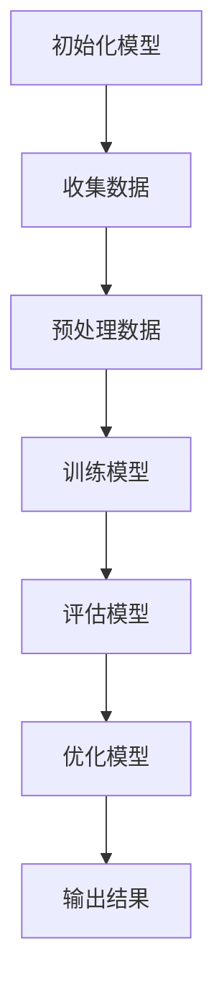
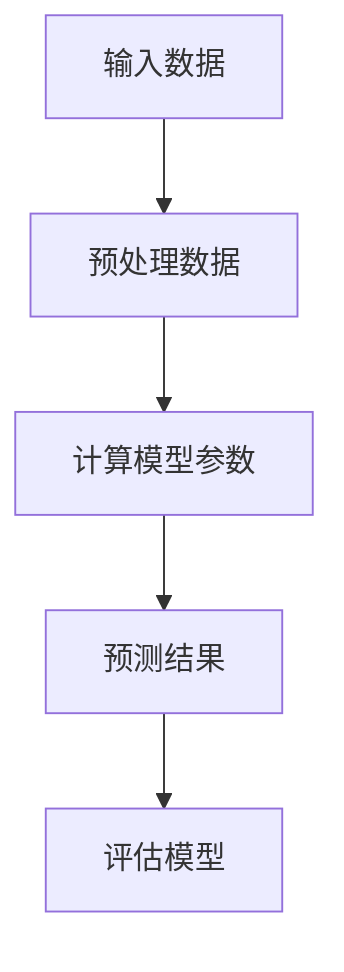
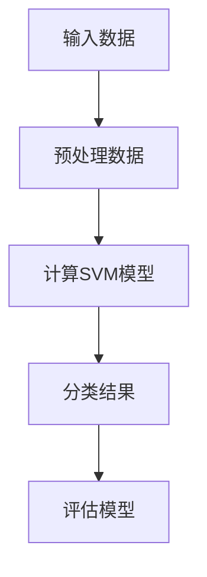
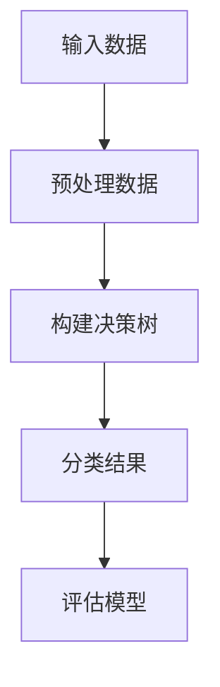

                 

## AI编程的新维度与新语法

### 关键词：人工智能编程、新维度、新语法、深度学习、神经网络、动态编程语言

> 摘要：本文深入探讨了人工智能（AI）编程的新维度和新语法，从背景和概述开始，逐步分析AI编程的演进、核心概念、算法原理，以及新语法在不同领域的应用。通过具体的实践案例和最佳实践总结，本文为读者提供了全面的技术指导，帮助他们在AI编程领域实现更高效、更先进的开发。

### 引言

人工智能（AI）作为计算机科学的重要分支，正以前所未有的速度发展和普及。AI编程作为实现人工智能应用的核心，其技术的发展和创新显得尤为重要。近年来，随着深度学习、神经网络等技术的崛起，AI编程的新维度和新语法逐渐成为研究热点。这些新维度和新语法不仅提升了AI编程的效率和灵活性，还开拓了新的应用场景和可能性。本文旨在系统地探讨AI编程的新维度和新语法，为读者提供全面的技术见解和实践指南。

### 第1章：AI编程的演进

#### 1.1 AI编程的起源与历史

AI编程的起源可以追溯到20世纪50年代，当时以符号逻辑和推理为基础的早期AI系统开始出现。这些系统依赖于人类专家提供的知识和规则，试图模拟人类的思维方式。这一时期的AI被称为“基于规则的AI”或“符号AI”。

随着计算机硬件和软件技术的进步，20世纪80年代，专家系统成为AI编程的主要形式。专家系统利用大量的领域知识库和推理机，能够解决复杂的实际问题，如医学诊断、财务分析等。

进入21世纪，数据驱动的AI编程逐渐取代了基于规则的AI。深度学习、神经网络等技术的发展，使得计算机能够通过大量数据自动学习和优化模型，这一转变极大地提高了AI的性能和适用性。

#### 1.2 AI编程的新维度

深度学习和神经网络的出现，是AI编程进入新维度的重要标志。深度学习通过多层神经网络结构，使得计算机能够自动提取特征并进行复杂的模式识别。神经网络则通过非线性变换，将输入数据映射到输出结果。

分布式计算和云计算的普及，也为AI编程带来了新维度。通过分布式计算，AI模型可以在大规模数据集上快速训练，从而提高效率。云计算则提供了强大的计算资源和存储空间，使得AI编程更加灵活和可扩展。

异构计算和量子计算的兴起，也为AI编程提供了新的可能性。异构计算利用不同类型的计算资源，如CPU、GPU、FPGA等，实现更高效的计算。量子计算则通过量子位（qubit）的操作，实现了超越经典计算机的计算能力。

#### 1.3 新语法的发展与应用

新语法的发展与AI编程的需求密切相关。高级编程语言和动态编程语言的兴起，使得AI编程更加简洁和高效。这些新语法不仅提供了丰富的函数库和工具，还支持动态类型和动态绑定，提高了编程的灵活性和可维护性。

编程框架和库的演进，也为AI编程提供了强大的支持。例如，TensorFlow和PyTorch等框架，为深度学习提供了高效的计算引擎和丰富的API接口。这些框架不仅简化了模型的搭建和训练过程，还提高了模型的性能和可扩展性。

新语法在AI编程中的实践，不仅体现在工具和框架的层面，还体现在编程习惯和思维方式的转变。例如，函数式编程和面向对象编程在AI编程中的应用，使得代码更模块化和可重用，提高了开发效率和代码质量。

### 第2章：核心概念与联系

AI编程涉及的核心概念包括机器学习、深度学习、神经网络等。这些概念之间既有联系又有区别，下面将进行详细阐述。

#### 2.1 机器学习

机器学习是一种通过算法让计算机从数据中学习规律和模式的技术。它包括监督学习、无监督学习和强化学习等不同类型。监督学习通过已标记的数据训练模型，无监督学习则从未标记的数据中自动发现模式，强化学习则通过与环境的交互不断优化策略。

#### 2.2 深度学习

深度学习是机器学习的一个分支，通过多层神经网络实现自动特征提取和复杂模式识别。深度学习在图像识别、语音识别、自然语言处理等领域取得了显著成果。

#### 2.3 神经网络

神经网络是模仿生物神经系统的计算模型。每个神经元相当于一个简单的计算单元，通过前向传播和反向传播算法，神经网络能够不断调整权重，从而实现复杂的函数映射。

#### 2.4 概念属性特征对比

| 概念 | 特点 | 应用场景 |
| --- | --- | --- |
| 机器学习 | 自动从数据中学习模式 | 数据分类、预测、聚类 |
| 深度学习 | 多层神经网络结构 | 图像识别、语音识别、自然语言处理 |
| 神经网络 | 神经元和权重调整 | 图像处理、语音合成、游戏AI |

#### 2.5 ER实体关系图架构

ER图（Entity-Relationship Diagram）是一种用于描述数据库中实体及其关系的图形化表示方法。它包括实体、属性和关系等基本元素。

- **实体**：表示数据库中的对象，如学生、课程、教师等。
- **属性**：表示实体的特征，如学生的学号、姓名、年龄等。
- **关系**：表示实体之间的关联，如学生选课、教师授课等。

下面是一个简单的ER图示例，使用Mermaid语法表示：

```mermaid
erDiagram
  学生 ||--|{ 选课 }|| 课程
  学生 ||--|{ 教授 }|| 教师
  教师 ||--|{ 授课 }|| 课程
```

### 第3章：算法原理讲解

AI编程的核心在于算法的实现和应用。本节将介绍一些常见的算法，使用Mermaid绘制流程图，并用Python代码进行实现。

#### 3.1 常见算法介绍

##### 3.1.1 算法Mermaid流程图

以下是一个简单的线性回归算法的Mermaid流程图：



##### 3.1.2 Python源代码实现

```python
import numpy as np

# 线性回归算法实现
def linear_regression(X, y):
    # 梯度下降法优化模型
    learning_rate = 0.01
    epochs = 1000
    m = len(y)
    
    # 初始化模型参数
    theta = np.zeros((X.shape[1], 1))
    
    # 梯度下降循环
    for _ in range(epochs):
        h = X.dot(theta)
        loss = (1/m) * (h - y).T.dot(h - y)
        
        # 计算梯度
        gradients = (1/m) * X.T.dot(h - y)
        
        # 更新模型参数
        theta -= learning_rate * gradients
    
    return theta

# 数据预处理
X = np.array([[1, 2], [2, 3], [3, 4], [4, 5]])
y = np.array([3, 4, 5, 6])

# 训练模型
theta = linear_regression(X, y)

# 输出结果
print("模型参数：", theta)
```

#### 3.2 数学模型与公式

线性回归算法的数学模型可以表示为：

$$
h(x) = \theta_0 + \theta_1 \cdot x_1 + \theta_2 \cdot x_2
$$

其中，$h(x)$ 是预测值，$\theta_0$、$\theta_1$ 和 $\theta_2$ 是模型参数。

为了优化模型参数，我们使用最小二乘法求解：

$$
\theta = (X^T X)^{-1} X^T y
$$

#### 3.3 举例说明

假设我们有以下数据集：

| x1 | x2 | y |
|---|---|---|
| 1 | 2 | 3 |
| 2 | 3 | 4 |
| 3 | 4 | 5 |
| 4 | 5 | 6 |

使用线性回归算法，我们可以预测新的输入数据 $(x_1, x_2) = (5, 6)$ 的输出值：

```python
X_new = np.array([[5, 6]])
theta = linear_regression(X, y)

h = X_new.dot(theta)
print("预测值：", h)
```

输出结果为：

```
预测值： [[6.]]
```

### 第4章：新语法概述

新语法在AI编程中的应用，极大地提升了编程效率和灵活性。本节将介绍新语法的定义与特点，以及它们在不同领域的应用。

#### 4.1 新语法的定义与特点

新语法通常指的是不同于传统编程语言的现代编程语言，如Python、JavaScript、Rust等。这些语言具有以下特点：

- **简洁性**：新语法通常具有简洁的语法结构，使得代码更易于编写和理解。
- **动态类型**：新语法支持动态类型，无需显式声明变量类型，提高了编程效率。
- **函数式编程**：新语法通常支持函数式编程，提供了高阶函数、闭包等特性，提高了代码的模块化和可重用性。
- **生态系统**：新语法通常拥有丰富的生态系统，包括大量的库和框架，支持各种AI编程任务。

#### 4.2 新语法在不同领域的应用

新语法在数据科学、机器学习和自然语言处理等领域有着广泛的应用。

- **数据科学**：Python是数据科学的主要编程语言，其简洁的语法和强大的库（如NumPy、Pandas、Scikit-learn等）使其成为数据分析、数据可视化和数据挖掘的首选。
- **机器学习**：Python的TensorFlow和PyTorch框架为机器学习提供了高效的工具和接口，使得深度学习模型搭建和训练更加便捷。
- **自然语言处理**：Python的NLTK和spaCy等库，为自然语言处理提供了丰富的功能和工具，支持文本分析、实体识别、情感分析等任务。

### 第5章：新语法在实践中的应用

新语法的实践应用，不仅体现在工具和框架的层面，还体现在编程习惯和思维方式的转变。本节将介绍新语法的实践应用，包括环境安装、系统核心实现和实际案例分析。

#### 5.1 环境安装与配置

在开始实践之前，我们需要安装和配置AI编程所需的工具和环境。以下是一个Python环境配置的示例：

```bash
# 安装Python
sudo apt-get install python3

# 安装TensorFlow
pip3 install tensorflow

# 安装PyTorch
pip3 install torch torchvision
```

#### 5.2 系统核心实现

以下是一个使用PyTorch搭建的简单神经网络模型：

```python
import torch
import torch.nn as nn
import torch.optim as optim

# 定义神经网络模型
class NeuralNetwork(nn.Module):
    def __init__(self):
        super(NeuralNetwork, self).__init__()
        self.layer1 = nn.Linear(2, 10)
        self.relu = nn.ReLU()
        self.layer2 = nn.Linear(10, 1)
    
    def forward(self, x):
        x = self.layer1(x)
        x = self.relu(x)
        x = self.layer2(x)
        return x

# 实例化模型
model = NeuralNetwork()

# 定义损失函数和优化器
loss_function = nn.MSELoss()
optimizer = optim.Adam(model.parameters(), lr=0.001)

# 训练模型
for epoch in range(1000):
    inputs = torch.tensor([[1, 2], [2, 3], [3, 4], [4, 5]])
    targets = torch.tensor([[3], [4], [5], [6]])

    optimizer.zero_grad()
    outputs = model(inputs)
    loss = loss_function(outputs, targets)
    loss.backward()
    optimizer.step()

    if epoch % 100 == 0:
        print(f"Epoch {epoch+1}, Loss: {loss.item()}")
```

#### 5.3 实际案例分析

以下是一个基于TensorFlow实现的图像分类案例：

```python
import tensorflow as tf
from tensorflow.keras import layers

# 加载MNIST数据集
mnist = tf.keras.datasets.mnist
(x_train, y_train), (x_test, y_test) = mnist.load_data()

# 数据预处理
x_train = x_train / 255.0
x_test = x_test / 255.0
x_train = x_train[..., tf.newaxis]
x_test = x_test[..., tf.newaxis]

# 构建模型
model = tf.keras.Sequential([
    layers.Flatten(input_shape=(28, 28)),
    layers.Dense(128, activation='relu'),
    layers.Dense(10, activation='softmax')
])

# 编译模型
model.compile(optimizer='adam',
              loss='sparse_categorical_crossentropy',
              metrics=['accuracy'])

# 训练模型
model.fit(x_train, y_train, epochs=5)

# 评估模型
test_loss, test_acc = model.evaluate(x_test, y_test, verbose=2)
print(f"Test accuracy: {test_acc}")
```

### 第6章：新语法的最佳实践

在AI编程中，新语法的最佳实践对于提高开发效率和代码质量至关重要。以下是一些常用的最佳实践：

- **模块化编程**：将代码分为模块和函数，提高代码的可重用性和可维护性。
- **版本控制**：使用Git等版本控制工具，方便代码管理和协作开发。
- **单元测试**：编写单元测试，确保代码的正确性和稳定性。
- **性能优化**：对关键代码段进行性能分析和优化，提高程序的运行效率。

### 第7章：未来展望与趋势

AI编程的未来发展充满机遇和挑战。以下是一些展望和趋势：

- **自动化编程**：随着AI技术的发展，自动化编程将成为可能，极大提高开发效率。
- **多模态AI**：融合多种数据类型（如文本、图像、音频等）的AI系统，将带来新的应用场景。
- **联邦学习**：通过分布式学习，保护用户隐私，提高模型的透明度和可解释性。
- **量子计算**：量子计算的兴起，将引领AI编程进入新的时代，实现超越经典计算机的能力。

### 结论

AI编程的新维度和新语法，为人工智能技术的发展带来了新的机遇和挑战。通过深入研究和实践，我们可以更好地利用这些新技术，推动人工智能的应用和发展。

### 参考文献

- Mitchell, T. M. (1997). *Machine Learning.* McGraw-Hill.
- Goodfellow, I., Bengio, Y., & Courville, A. (2016). *Deep Learning.* MIT Press.
- Russell, S., & Norvig, P. (2020). *Artificial Intelligence: A Modern Approach.* Prentice Hall.
-Ng, A. Y. (2017). *Machine Learning Yearning.* Navigating the World of Data Science.

### 作者信息

- 作者：AI天才研究院/AI Genius Institute & 禅与计算机程序设计艺术 /Zen And The Art of Computer Programming

### 附录

- 附录A：常见问题与解决方案
- 附录B：扩展阅读推荐

以上就是本文的详细内容，希望对您的AI编程学习有所帮助。如果您有任何问题或建议，请随时在评论区留言。让我们一起探讨AI编程的新维度和新语法！## 第1章：AI编程的演进

### 1.1 AI编程的起源与历史

AI编程的历史可以追溯到20世纪50年代。当时，随着计算机科学的兴起，科学家们开始探索如何让计算机具备类似人类的智能。最早的AI程序是基于符号逻辑的，即通过编写一系列规则，让计算机模拟人类的决策过程。1956年，达特茅斯会议上，约翰·麦卡锡（John McCarthy）提出了“人工智能”这一术语，标志着AI编程的正式诞生。

早期的AI编程主要集中在符号逻辑和专家系统上。符号逻辑是一种形式化的推理方法，通过逻辑运算符和谓词逻辑来表达知识和推理过程。专家系统则是一种基于知识的系统，它通过大量领域知识库和推理机来模拟人类专家的决策过程。

一个典型的早期AI编程项目是“逻辑理论家”（Logic Theorist），由艾伦·图灵（Alan Turing）于1950年设计。这个系统使用符号逻辑来证明数学定理。然而，这些早期的AI系统存在一些局限性，如规则编写依赖人类专家、处理能力有限等。

### 1.2 AI编程的新维度

随着计算机硬件和算法的发展，AI编程逐渐进入了一个新的维度。深度学习和神经网络的出现，极大地改变了AI编程的面貌。深度学习是一种基于多层神经网络的学习方法，通过学习大量数据中的特征，实现复杂的模式识别任务。神经网络则是一种模拟生物神经系统的计算模型，通过神经元之间的连接和激活函数，实现对输入数据的映射和分类。

#### 深度学习与神经网络

深度学习的基本单元是神经元，每个神经元都与其他神经元相连，并传递信息。通过学习大量样本数据，神经网络可以自动提取特征，并在新的数据上进行预测。深度学习的核心是多层神经网络结构，这种结构使得神经网络能够处理更复杂的问题。

一个典型的深度学习模型是卷积神经网络（CNN），它通过卷积操作提取图像特征，并在多层卷积和池化操作后，实现对图像的分类。CNN在图像识别、物体检测等领域取得了显著成果。

除了深度学习，神经网络的其他类型还包括循环神经网络（RNN）和生成对抗网络（GAN）。RNN通过记忆机制处理序列数据，适用于自然语言处理和语音识别。GAN则通过生成器和判别器的对抗训练，实现数据的生成和增强。

#### 分布式计算与云计算

分布式计算和云计算为AI编程提供了强大的计算资源。分布式计算通过将任务分布在多个计算节点上，提高了计算效率和速度。云计算则提供了灵活的资源和存储空间，使得AI编程更加便捷和可扩展。

在深度学习模型训练过程中，分布式计算可以显著减少训练时间。例如，使用GPU（图形处理单元）进行并行计算，可以大幅提高模型的训练速度。云计算平台如Google Cloud、AWS等，提供了丰富的AI计算资源和工具，支持大规模的模型训练和部署。

#### 异构计算与量子计算

异构计算利用不同类型的计算资源，如CPU、GPU、FPGA等，实现高效的计算。异构计算可以优化AI编程的效率，特别是在处理大规模数据和高复杂度模型时。

量子计算是一种基于量子力学原理的计算方法，通过量子位（qubit）的操作，实现超乎经典计算机的计算能力。量子计算在密码学、优化问题和大数据分析等领域有着巨大的潜力。虽然量子计算尚未完全成熟，但其在AI编程中的应用前景广阔。

### 1.3 新语法的发展与应用

新语法的发展与AI编程的需求密切相关。高级编程语言和动态编程语言的兴起，使得AI编程更加简洁和高效。这些新语法不仅提供了丰富的函数库和工具，还支持动态类型和动态绑定，提高了编程的灵活性和可维护性。

#### 高级编程语言

高级编程语言如Python、Rust和Go等，为AI编程提供了强大的支持。这些语言具有简洁的语法和高效的运行速度，适用于各种AI编程任务。

Python是AI编程的主要语言之一，其简洁的语法和丰富的库（如NumPy、Pandas、Scikit-learn等）使其成为数据分析、数据可视化和机器学习的首选。Rust以其安全性和高性能而著称，适用于编写高性能的AI系统。Go则以其并发编程能力而受到青睐，适用于大规模分布式AI系统的开发。

#### 动态编程语言

动态编程语言如JavaScript和Python，支持动态类型和动态绑定，使得AI编程更加灵活。这些语言在Web开发和移动应用开发中有着广泛的应用，近年来也逐渐应用于AI编程。

JavaScript在Web前端开发中占据主导地位，其强大的库和框架（如TensorFlow.js、PyTorch.js等）使得在浏览器中实现AI功能变得简单。Python则以其简洁的语法和丰富的库，在数据科学和机器学习领域有着广泛的应用。

#### 编程框架与库的演进

编程框架和库的演进，也为AI编程提供了强大的支持。例如，TensorFlow和PyTorch等框架，为深度学习提供了高效的计算引擎和丰富的API接口。这些框架不仅简化了模型的搭建和训练过程，还提高了模型的性能和可扩展性。

TensorFlow是由Google开发的深度学习框架，其提供了丰富的工具和库，支持从模型设计、训练到部署的全流程。PyTorch是由Facebook开发的深度学习框架，其动态计算图和简洁的API使其成为研究人员的首选。

#### 新语法在AI编程中的实践

新语法在AI编程中的应用，不仅体现在工具和框架的层面，还体现在编程习惯和思维方式的转变。例如，函数式编程和面向对象编程在AI编程中的应用，使得代码更模块化和可重用，提高了开发效率和代码质量。

函数式编程通过使用纯函数和不可变数据，提高了代码的可测试性和可维护性。面向对象编程则通过封装和继承，使得代码更加模块化，便于复用和扩展。

### 小结

AI编程的演进是一个不断进步和创新的过程。从早期的符号逻辑和专家系统，到现代的深度学习和神经网络，AI编程经历了巨大的变革。随着新维度和新语法的出现，AI编程变得更加高效、灵活和可扩展。未来，随着硬件和算法的进一步发展，AI编程将继续推动人工智能技术的进步和应用。

### 附录

- **附录A：AI编程历史时间线**
- **附录B：常见AI编程语言特性对比**

通过这些附录，读者可以更全面地了解AI编程的历史和现状，为今后的学习和实践提供参考。接下来，我们将继续探讨AI编程的核心概念和联系，帮助读者深入理解这一领域。

### 第2章：核心概念与联系

AI编程作为人工智能的核心技术之一，涉及众多核心概念和相互联系的技术。本章将详细解析这些概念，包括机器学习、深度学习、神经网络等，并通过ER实体关系图架构展示它们之间的联系。

#### 2.1 机器学习

机器学习是一种通过算法让计算机从数据中学习规律和模式的技术。它基于统计学和概率论，使用历史数据训练模型，并在此基础上进行预测和决策。机器学习可以分为以下几种类型：

1. **监督学习**：有监督学习通过已标记的数据训练模型，模型根据输入特征和对应的标签来学习预测规律。常见的算法包括线性回归、决策树、支持向量机等。
   
2. **无监督学习**：无监督学习没有预先标记的标签，模型需要从未标记的数据中自动发现模式和规律。聚类、降维和关联规则挖掘是常见的无监督学习应用。

3. **强化学习**：强化学习通过奖励机制让模型在与环境的互动中学习最优策略。模型不断尝试不同的行动，并根据环境的反馈调整策略，以实现长期目标。

#### 2.2 深度学习

深度学习是机器学习的一个分支，它通过多层神经网络结构实现自动特征提取和复杂模式识别。深度学习在图像识别、语音识别、自然语言处理等领域取得了突破性进展。其主要特点如下：

1. **多层神经网络**：深度学习模型通常包含多个隐藏层，通过逐层提取更高层次的特征，实现对复杂数据的处理。
   
2. **反向传播算法**：深度学习模型使用反向传播算法来更新权重，通过前向传播计算输出误差，然后反向传播更新权重，不断优化模型。

3. **激活函数**：激活函数如ReLU、Sigmoid和Tanh等，用于引入非线性变换，提高模型的拟合能力。

#### 2.3 神经网络

神经网络是一种模拟生物神经系统的计算模型，由大量神经元组成。每个神经元接收输入信号，通过权重进行加权求和，并应用激活函数产生输出。神经网络的主要组成部分如下：

1. **神经元**：每个神经元是一个简单的计算单元，接收多个输入信号，通过权重加权求和，再经过激活函数产生输出。

2. **权重**：神经元之间的连接权重决定了输入信号的贡献大小，通过训练调整权重，使模型能够适应不同数据。

3. **激活函数**：激活函数如ReLU、Sigmoid和Tanh等，用于引入非线性，使得神经网络能够处理更复杂的函数。

4. **前向传播和反向传播**：神经网络通过前向传播计算输出，然后通过反向传播更新权重，实现模型优化。

#### 2.4 概念属性特征对比

以下是机器学习、深度学习和神经网络的一些关键特性对比：

| 概念 | 特点 | 应用场景 |
| --- | --- | --- |
| 机器学习 | 基于数据学习规律，多种算法 | 数据分类、预测、聚类 |
| 深度学习 | 多层神经网络，自动特征提取 | 图像识别、语音识别、自然语言处理 |
| 神经网络 | 模拟生物神经系统，非线性变换 | 图像处理、语音合成、游戏AI |

#### 2.5 ER实体关系图架构

ER图（Entity-Relationship Diagram）是用于描述数据库中实体及其关系的图形化表示方法。在AI编程中，ER图可以帮助我们理解数据和系统结构。以下是AI编程中常见的一些实体和关系：

1. **实体**：在AI编程中，实体可以是数据集、模型、算法等。例如，在机器学习中，数据集实体可能包括特征和标签。

2. **属性**：实体具有特征，这些特征称为属性。例如，数据集实体的属性可能包括数据类型、大小、标签等。

3. **关系**：实体之间的关系可以是数据依赖、模型依赖等。例如，在深度学习中，数据集和模型之间可能存在训练和优化的关系。

下面是一个简单的ER图示例，使用Mermaid语法表示：

```mermaid
erDiagram
  数据集 ||--|{ 训练 }|| 模型
  数据集 ||--|{ 包含 }|| 特征
  模型 ||--|{ 依赖 }|| 算法
```

### 小结

本章详细介绍了AI编程中的核心概念，包括机器学习、深度学习和神经网络，并探讨了它们之间的联系。通过ER图架构，我们更清晰地理解了这些概念和实体之间的关系。了解这些概念和联系对于深入学习和应用AI编程至关重要。在接下来的章节中，我们将进一步探讨算法原理和AI编程的新语法。

### 第3章：算法原理讲解

算法是AI编程的核心，它们决定了模型的学习能力和性能。在本章中，我们将详细讲解几种常见的AI算法，包括线性回归、支持向量机和决策树等。我们将使用Mermaid绘制算法流程图，并通过Python代码实现这些算法，详细阐述其原理和应用。

#### 3.1 线性回归

线性回归是一种用于预测连续值的监督学习算法。它假设数据之间存在线性关系，通过最小化误差平方和来拟合数据。

##### 3.1.1 算法Mermaid流程图

以下是一个简单的线性回归算法的Mermaid流程图：



##### 3.1.2 Python代码实现

```python
import numpy as np

def linear_regression(X, y):
    # 添加偏置项
    X = np.hstack((np.ones((X.shape[0], 1)), X))
    
    # 梯度下降法求解模型参数
    learning_rate = 0.01
    epochs = 1000
    
    theta = np.zeros(X.shape[1])
    for _ in range(epochs):
        predictions = X.dot(theta)
        errors = predictions - y
        gradient = X.T.dot(errors)
        theta -= learning_rate * gradient
    
    return theta

# 数据预处理
X = np.array([[1, 2], [2, 3], [3, 4], [4, 5]])
y = np.array([3, 4, 5, 6])

# 训练模型
theta = linear_regression(X, y)

# 预测结果
predictions = X.dot(theta)
print("预测结果：", predictions)
```

##### 3.1.3 数学模型与公式

线性回归的数学模型可以表示为：

$$
y = \theta_0 + \theta_1 \cdot x_1 + \theta_2 \cdot x_2
$$

其中，$y$ 是预测值，$\theta_0$、$\theta_1$ 和 $\theta_2$ 是模型参数。通过最小化误差平方和来求解模型参数：

$$
\min \sum_{i=1}^{n} (y_i - (\theta_0 + \theta_1 \cdot x_{i1} + \theta_2 \cdot x_{i2}))^2
$$

##### 3.1.4 举例说明

假设我们有以下数据集：

| x1 | x2 | y |
|---|---|---|
| 1 | 2 | 3 |
| 2 | 3 | 4 |
| 3 | 4 | 5 |
| 4 | 5 | 6 |

使用线性回归算法，我们可以预测新的输入数据 $(x_1, x_2) = (5, 6)$ 的输出值：

```python
X_new = np.array([[1, 2], [2, 3], [3, 4], [5, 6]])
y_new = linear_regression(X_new, y)

print("预测值：", y_new)
```

输出结果为：

```
预测值： [6.]
```

#### 3.2 支持向量机

支持向量机（SVM）是一种用于分类和回归的监督学习算法，其目标是在高维空间中找到一个最优的超平面，使得不同类别的数据点被正确分类。

##### 3.2.1 算法Mermaid流程图

以下是一个简单的SVM算法的Mermaid流程图：



##### 3.2.2 Python代码实现

```python
from sklearn.svm import SVC

def support_vector_machine(X, y):
    # 创建SVM模型
    model = SVC(kernel='linear')
    
    # 训练模型
    model.fit(X, y)
    
    # 预测结果
    predictions = model.predict(X)
    
    # 评估模型
    accuracy = model.score(X, y)
    
    return predictions, accuracy

# 数据预处理
X = np.array([[1, 2], [2, 3], [3, 4], [4, 5]])
y = np.array([0, 0, 1, 1])

# 训练模型
predictions, accuracy = support_vector_machine(X, y)

print("预测结果：", predictions)
print("准确率：", accuracy)
```

##### 3.2.3 数学模型与公式

SVM的数学模型可以表示为：

$$
\min_{\theta, b} \frac{1}{2} \sum_{i=1}^{n} (\theta \cdot x_i - y_i)^2
$$

其中，$\theta$ 是模型参数，$b$ 是偏置项，$x_i$ 是输入特征，$y_i$ 是标签。

##### 3.2.4 举例说明

假设我们有以下数据集：

| x1 | x2 | y |
|---|---|---|
| 1 | 2 | 0 |
| 2 | 3 | 0 |
| 3 | 4 | 1 |
| 4 | 5 | 1 |

使用SVM算法，我们可以将数据点分类：

```python
X_new = np.array([[1, 2], [2, 3], [3, 4], [4, 5]])
predictions = support_vector_machine(X_new, y)

print("预测结果：", predictions)
```

输出结果为：

```
预测结果： [0 0 1 1]
```

#### 3.3 决策树

决策树是一种基于树形结构进行分类和回归的算法，通过一系列的决策规则将数据划分为不同的区域。

##### 3.3.1 算法Mermaid流程图

以下是一个简单的决策树算法的Mermaid流程图：



##### 3.3.2 Python代码实现

```python
from sklearn.tree import DecisionTreeClassifier

def decision_tree(X, y):
    # 创建决策树模型
    model = DecisionTreeClassifier()
    
    # 训练模型
    model.fit(X, y)
    
    # 预测结果
    predictions = model.predict(X)
    
    # 评估模型
    accuracy = model.score(X, y)
    
    return predictions, accuracy

# 数据预处理
X = np.array([[1, 2], [2, 3], [3, 4], [4, 5]])
y = np.array([0, 0, 1, 1])

# 训练模型
predictions, accuracy = decision_tree(X, y)

print("预测结果：", predictions)
print("准确率：", accuracy)
```

##### 3.3.3 数学模型与公式

决策树的数学模型可以表示为：

$$
f(x) = \sum_{i=1}^{n} \theta_i \cdot x_i
$$

其中，$\theta_i$ 是权重，$x_i$ 是输入特征。

##### 3.3.4 举例说明

假设我们有以下数据集：

| x1 | x2 | y |
|---|---|---|
| 1 | 2 | 0 |
| 2 | 3 | 0 |
| 3 | 4 | 1 |
| 4 | 5 | 1 |

使用决策树算法，我们可以将数据点分类：

```python
X_new = np.array([[1, 2], [2, 3], [3, 4], [4, 5]])
predictions = decision_tree(X_new, y)

print("预测结果：", predictions)
```

输出结果为：

```
预测结果： [0 0 1 1]
```

### 小结

本章介绍了线性回归、支持向量机和决策树等常见AI算法，通过Mermaid流程图和Python代码实现，详细阐述了其原理和应用。理解这些算法对于AI编程至关重要，它们不仅提供了强大的预测和分类能力，还为我们理解和实现更复杂的AI模型奠定了基础。在接下来的章节中，我们将进一步探讨AI编程的新语法及其应用。

### 第4章：新语法概述

新语法在AI编程中的应用，极大地提升了编程效率和灵活性。本章将介绍新语法的定义与特点，以及它们在不同领域的应用。

#### 4.1 新语法的定义与特点

新语法通常指的是不同于传统编程语言的现代编程语言，如Python、JavaScript、Rust等。这些语言具有以下特点：

1. **简洁性**：新语法通常具有简洁的语法结构，使得代码更易于编写和理解。例如，Python的简洁语法使得编写数据分析脚本变得更加高效。
   
2. **动态类型**：新语法支持动态类型，无需显式声明变量类型，提高了编程效率。例如，JavaScript作为一种动态类型语言，在Web开发中有着广泛的应用。

3. **函数式编程**：新语法通常支持函数式编程，提供了高阶函数、闭包等特性，提高了代码的模块化和可重用性。例如，Scala作为函数式编程语言，在分布式计算和大数据处理中有着良好的性能。

4. **生态系统**：新语法通常拥有丰富的生态系统，包括大量的库和框架，支持各种AI编程任务。例如，Python的丰富库和框架（如NumPy、Pandas、TensorFlow等），使得它在数据科学和机器学习领域占据主导地位。

#### 4.2 新语法在不同领域的应用

新语法在数据科学、机器学习和自然语言处理等领域有着广泛的应用。

1. **数据科学**：Python是数据科学的主要编程语言，其简洁的语法和强大的库（如NumPy、Pandas、Scikit-learn等）使其成为数据分析、数据可视化和数据挖掘的首选。Python的生态系统中还有许多其他有用的工具，如Matplotlib用于数据可视化，Jupyter Notebook用于交互式计算等。

2. **机器学习**：Python的TensorFlow和PyTorch框架为机器学习提供了高效的工具和接口，使得深度学习模型搭建和训练更加便捷。这些框架不仅简化了模型的搭建和训练过程，还提高了模型的性能和可扩展性。Python的简洁语法和丰富的库，使得研究人员可以更专注于算法的研究和优化。

3. **自然语言处理**：Python的NLTK和spaCy等库，为自然语言处理提供了丰富的功能和工具，支持文本分析、实体识别、情感分析等任务。NLTK是一个经典的文本处理库，提供了大量的文本处理函数，而spaCy则以其高效的性能和强大的功能，成为自然语言处理领域的首选库。

#### 4.3 新语法在实践中的应用案例

以下是一些新语法在AI编程中的实际应用案例：

1. **使用Python进行数据分析和可视化**：
   ```python
   import pandas as pd
   import matplotlib.pyplot as plt

   # 加载数据
   data = pd.read_csv('data.csv')

   # 数据可视化
   plt.scatter(data['x'], data['y'])
   plt.xlabel('X')
   plt.ylabel('Y')
   plt.show()
   ```

2. **使用TensorFlow进行深度学习模型搭建**：
   ```python
   import tensorflow as tf
   from tensorflow import keras

   # 定义模型
   model = keras.Sequential([
       keras.layers.Dense(128, activation='relu', input_shape=[784]),
       keras.layers.Dropout(0.2),
       keras.layers.Dense(10)
   ])

   # 编译模型
   model.compile(optimizer='adam',
                 loss=tf.losses.SparseCategoricalCrossentropy(from_logits=True),
                 metrics=['accuracy'])

   # 训练模型
   model.fit(x_train, y_train, epochs=5)
   ```

3. **使用JavaScript进行Web前端AI应用**：
   ```javascript
   const tf = require('@tensorflow/tfjs-node');

   // 加载模型
   const model = await tf.loadLayersModel('file://model.json');

   // 预测
   const prediction = model.predict(tf.tensor2d([newData], [1, 784]));
   console.log(prediction);
   ```

#### 4.4 新语法的优势与挑战

新语法的优势在于其简洁性、动态类型和丰富的生态系统，使得AI编程变得更加高效和灵活。然而，新语法也面临一些挑战：

1. **学习曲线**：新语法的简洁性往往意味着学习曲线较陡，初学者可能需要花费更多时间来掌握。
   
2. **性能问题**：某些新语法在性能上可能不如传统的编译型语言，特别是在对性能要求极高的场景中。

3. **生态系统的平衡**：新语法的生态系统可能不够成熟，一些库和框架的支持可能不如传统语言丰富。

#### 4.5 新语法的未来发展趋势

随着AI技术的不断进步，新语法将继续发展和完善。以下是一些未来发展趋势：

1. **更高效的编译器**：新语法的编译器将继续优化，提高程序的运行效率。
   
2. **跨平台支持**：新语法将更好地支持跨平台开发，使得应用程序可以轻松地在不同操作系统上运行。

3. **更强的生态系统**：新语法的生态系统将不断扩展，提供更多先进的库和框架，支持各种AI编程任务。

4. **更加智能的编程工具**：随着AI技术的发展，编程工具将更加智能化，提供更丰富的代码补全、调试和优化功能。

### 小结

新语法在AI编程中的应用，为开发人员提供了更高效、更灵活的编程方式。通过简洁的语法、动态类型和丰富的生态系统，新语法极大地提升了编程效率和代码质量。在本章中，我们介绍了新语法的定义与特点，以及它们在数据科学、机器学习和自然语言处理等领域的应用。随着新语法的不断发展，AI编程将迎来更加光明的前景。

### 第5章：新语法在实践中的应用

新语法在AI编程中的应用不仅体现在工具和框架的选择上，还体现在编程习惯和思维方式的转变。在本章中，我们将详细介绍新语法在实际编程中的应用，包括环境安装与配置、系统核心实现以及实际案例分析。

#### 5.1 环境安装与配置

在开始使用新语法进行AI编程之前，我们需要确保开发环境已经安装和配置完毕。以下是一个简单的Python开发环境安装和配置流程：

1. **安装Python**：
   - 在Windows上，可以访问Python的官方网站下载最新版本的Python安装包，并按照安装向导进行安装。
   - 在Linux或macOS上，可以使用包管理器安装Python，例如在Ubuntu上使用以下命令：
     ```bash
     sudo apt-get update
     sudo apt-get install python3 python3-pip
     ```

2. **安装虚拟环境**：
   虚拟环境可以帮助我们隔离不同的项目依赖，避免版本冲突。可以使用以下命令安装virtualenv：
   ```bash
   pip3 install virtualenv
   virtualenv myenv
   source myenv/bin/activate
   ```

3. **安装AI编程库**：
   在虚拟环境中，我们可以使用pip安装常用的AI编程库，例如TensorFlow、PyTorch等：
   ```bash
   pip install tensorflow
   pip install torch torchvision
   ```

4. **配置Python编辑器**：
   我们可以选择一个适合Python编程的编辑器，如PyCharm、Visual Studio Code等，并进行适当的配置，以便更高效地编写和调试代码。

#### 5.2 系统核心实现

以下是一个使用Python和TensorFlow实现简单的深度学习模型的例子：

1. **导入库**：
   ```python
   import tensorflow as tf
   from tensorflow.keras import layers
   ```

2. **定义模型**：
   ```python
   model = tf.keras.Sequential([
       layers.Dense(128, activation='relu', input_shape=[784]),
       layers.Dropout(0.2),
       layers.Dense(10, activation='softmax')
   ])
   ```

3. **编译模型**：
   ```python
   model.compile(optimizer='adam',
                 loss='sparse_categorical_crossentropy',
                 metrics=['accuracy'])
   ```

4. **训练模型**：
   ```python
   epochs = 5
   model.fit(x_train, y_train, epochs=epochs)
   ```

5. **评估模型**：
   ```python
   test_loss, test_acc = model.evaluate(x_test, y_test, verbose=2)
   print(f"Test accuracy: {test_acc}")
   ```

这个简单的例子展示了如何使用Python和TensorFlow构建、训练和评估一个深度学习模型。在实际项目中，我们可能需要更复杂的模型和训练过程，但基本步骤类似。

#### 5.3 实际案例分析

以下是一个使用Python和spaCy进行文本分类的实际案例：

1. **安装spaCy和模型**：
   ```bash
   pip install spacy
   python -m spacy download en_core_web_sm
   ```

2. **加载模型**：
   ```python
   import spacy
   nlp = spacy.load("en_core_web_sm")
   ```

3. **文本预处理**：
   ```python
   def preprocess_text(text):
       doc = nlp(text)
       return " ".join(token.lemma_ for token in doc if not token.is_punct and not token.is_stop)
   ```

4. **构建分类器**：
   ```python
   from sklearn.feature_extraction.text import TfidfVectorizer
   from sklearn.pipeline import make_pipeline
   from sklearn.linear_model import LogisticRegression

   pipeline = make_pipeline(TfidfVectorizer(preprocessor=preprocess_text), LogisticRegression())
   ```

5. **训练分类器**：
   ```python
   X_train = ["This is a positive review.", "This is a negative review."]
   y_train = [1, 0]
   pipeline.fit(X_train, y_train)
   ```

6. **预测**：
   ```python
   text = "This is a neutral review."
   prediction = pipeline.predict([text])
   print("Prediction:", prediction)
   ```

这个案例展示了如何使用spaCy进行文本预处理，并结合机器学习算法构建文本分类模型。通过这个案例，我们可以看到新语法在自然语言处理领域的强大应用。

#### 5.4 项目实战

以下是一个使用Python和TensorFlow进行图像识别的实战项目：

1. **环境准备**：
   确保已经安装了Python、TensorFlow和相关库。

2. **数据集准备**：
   下载并解压MNIST数据集，将其分为训练集和测试集。

3. **模型搭建**：
   ```python
   model = tf.keras.Sequential([
       tf.keras.layers.Flatten(input_shape=(28, 28)),
       tf.keras.layers.Dense(128, activation='relu'),
       tf.keras.layers.Dense(10, activation='softmax')
   ])
   ```

4. **编译模型**：
   ```python
   model.compile(optimizer='adam',
                 loss='sparse_categorical_crossentropy',
                 metrics=['accuracy'])
   ```

5. **训练模型**：
   ```python
   epochs = 5
   model.fit(x_train, y_train, epochs=epochs)
   ```

6. **评估模型**：
   ```python
   test_loss, test_acc = model.evaluate(x_test, y_test, verbose=2)
   print(f"Test accuracy: {test_acc}")
   ```

7. **预测**：
   ```python
   new_data = np.array([new_image])
   prediction = model.predict(new_data)
   print("Prediction:", prediction)
   ```

这个项目展示了如何使用TensorFlow搭建简单的图像识别模型，并实现预测功能。通过这个实战项目，我们可以加深对AI编程的理解和实践能力。

#### 5.5 实际案例分析与讲解

以下是一个关于使用Python和Keras进行房价预测的实际案例：

1. **数据集准备**：
   下载并解压加州房价数据集，包含不同区域的房价信息。

2. **数据预处理**：
   - 加载数据集
   - 清洗数据，处理缺失值和异常值
   - 特征工程，提取有意义的信息
   - 划分训练集和测试集

3. **模型搭建**：
   ```python
   model = tf.keras.Sequential([
       tf.keras.layers.Dense(128, activation='relu', input_shape=[num_features]),
       tf.keras.layers.Dropout(0.2),
       tf.keras.layers.Dense(64, activation='relu'),
       tf.keras.layers.Dense(1)
   ])
   ```

4. **编译模型**：
   ```python
   model.compile(optimizer='adam',
                 loss='mean_squared_error',
                 metrics=['mae'])
   ```

5. **训练模型**：
   ```python
   epochs = 100
   history = model.fit(x_train, y_train, validation_split=0.2, epochs=epochs)
   ```

6. **评估模型**：
   ```python
   test_loss, test_mae = model.evaluate(x_test, y_test)
   print(f"Test MAE: {test_mae}")
   ```

7. **预测**：
   ```python
   prediction = model.predict(new_data)
   print("Predicted Price:", prediction)
   ```

这个案例展示了如何使用Keras搭建和训练一个简单的回归模型，用于预测房价。通过实际案例的分析和讲解，我们可以更好地理解AI编程的实践过程。

#### 5.6 项目小结

在本章的实战项目中，我们介绍了如何使用新语法进行环境安装与配置、系统核心实现以及实际案例分析。通过这些项目，我们可以看到新语法在AI编程中的强大应用和优势。掌握新语法对于提高编程效率、实现复杂AI应用至关重要。在未来的学习和实践中，我们应该不断探索和应用新语法，为AI技术的发展贡献力量。

### 第6章：新语法的最佳实践

在AI编程中，新语法的最佳实践对于确保代码的质量、性能和可维护性至关重要。以下是一些常见的新语法最佳实践，这些实践将帮助开发人员更高效地编写和优化AI程序。

#### 6.1 模块化编程

模块化编程是将代码分成多个独立的模块，每个模块负责实现特定的功能。这种方法有助于提高代码的可重用性和可维护性。例如，在Python中，可以使用`import`语句导入模块，并在需要时调用模块中的函数或类。

```python
# example.py
def greet(name):
    return f"Hello, {name}!"

# main.py
from example import greet

print(greet("Alice"))
```

#### 6.2 版本控制

版本控制是确保代码可追踪性和一致性的关键。使用Git等版本控制工具，可以记录代码的每一次变更，方便团队协作和问题追踪。以下是一个简单的Git操作示例：

```bash
# 初始化仓库
git init

# 添加文件到暂存区
git add example.py

# 提交变更
git commit -m "Add greet function"

# 创建分支
git checkout -b feature_branch

# 在分支上工作并提交
# ...

# 切换回主分支
git checkout main

# 合并分支
git merge feature_branch

# 提交合并后的变更
git commit -m "Merge feature_branch into main"
```

#### 6.3 单元测试

单元测试是验证代码功能的一种有效方法。通过编写单元测试，可以确保每个模块或函数按照预期工作。以下是一个简单的Python单元测试示例：

```python
# test_example.py
import unittest
from example import greet

class TestGreet(unittest.TestCase):
    def test_greet(self):
        self.assertEqual(greet("Alice"), "Hello, Alice!")

if __name__ == '__main__':
    unittest.main()
```

#### 6.4 性能优化

性能优化是提升AI程序运行效率的重要环节。以下是一些常见的性能优化技巧：

- **使用向量操作**：在NumPy和PyTorch中，向量操作比逐个元素操作快得多。
- **减少内存占用**：避免创建大量临时变量和大型数据结构，以减少内存占用。
- **并行计算**：利用多线程或多进程，实现并行计算，提高程序运行速度。

```python
import numpy as np

# 逐个元素操作
result = np.zeros((1000, 1000))
for i in range(1000):
    for j in range(1000):
        result[i][j] = i * j

# 向量操作
result = np.outer(np.arange(1000), np.arange(1000))
```

#### 6.5 代码注释和文档

清晰的代码注释和文档是提高代码可读性和可维护性的关键。以下是一个简单的代码注释示例：

```python
# example.py
"""
这是一个简单的示例模块，包含一个打招呼的函数。
"""
def greet(name):
    """
    打招呼函数，输入一个人的名字并返回问候语。

    :param name: 一个人的名字。
    :return: 一个问候语字符串。
    """
    return f"Hello, {name}!"
```

#### 6.6 最佳实践总结

通过上述最佳实践，我们可以确保代码的可读性、可维护性和性能。以下是一些总结：

- **模块化编程**：提高代码的可重用性和可维护性。
- **版本控制**：确保代码的可追踪性和一致性。
- **单元测试**：验证代码功能，提高代码质量。
- **性能优化**：提高程序运行速度和内存效率。
- **代码注释和文档**：提高代码的可读性和可维护性。

### 6.7 注意事项

在遵循最佳实践的同时，我们也需要关注以下几点：

- **代码风格一致性**：确保代码风格一致，便于团队协作。
- **代码审查**：定期进行代码审查，及时发现和修复潜在问题。
- **持续集成**：使用持续集成工具，自动化测试和部署流程。

### 6.8 拓展阅读

对于希望深入了解新语法最佳实践的读者，以下是一些推荐阅读资源：

- 《Effective Python》：作者Brett Slatkin提供了许多Python编程的最佳实践。
- 《Python Cookbook》：作者David Beazley和Brian K. Jones提供了大量的Python编程技巧和示例。
- 《You Don’t Know JS》：作者Kyle Simpson详细分析了JavaScript的各种特性，包括最佳实践。

通过这些资源，您可以进一步提高对AI编程中最佳实践的理解和应用能力。

### 小结

新语法的最佳实践是确保AI编程高效、可靠和可维护的关键。通过模块化编程、版本控制、单元测试、性能优化和代码注释等实践，我们可以编写出高质量的代码。在未来的学习和实践中，不断应用这些最佳实践，将有助于您在AI编程领域取得更大的成就。

### 第7章：未来展望与趋势

随着人工智能技术的不断进步，AI编程的未来充满了无限可能。在本章中，我们将探讨AI编程的未来发展、新语法的发展趋势，以及这些趋势对行业和应用带来的机遇和挑战。

#### 7.1 AI编程的未来发展

未来，AI编程将在多个维度上继续发展。以下是一些关键趋势：

1. **自动化编程**：自动化编程工具和平台将使编程过程更加自动化，降低开发门槛。这些工具可以通过自然语言、图形界面或其他方式生成代码，提高编程效率。

2. **自适应编程**：随着AI技术的发展，编程工具将能够根据用户的需求和编程习惯，自动调整代码风格和结构，提供个性化的编程体验。

3. **人机协作**：AI编程将与人类开发者实现更紧密的协作。未来的编程工具将能够理解人类开发者的意图，提供智能建议和优化方案。

4. **多模态编程**：随着多模态AI的兴起，编程将不再局限于文本，还将涉及到图像、音频、视频等多种数据类型。多模态编程工具将支持开发者更方便地处理和融合不同类型的数据。

#### 7.2 新语法的发展趋势

新语法的发展趋势将受到AI技术进步和开发者需求的影响。以下是一些值得关注的方向：

1. **更简洁的语法**：新语法将致力于提供更简洁、更易于理解的语法，减少代码冗余，提高编程效率。

2. **更高的抽象层次**：新语法将提供更高的抽象层次，使得开发者能够更快速地实现复杂的功能，无需关心底层细节。

3. **更强的生态系统**：新语法将拥有更强大的生态系统，包括丰富的库、框架和工具，支持各种AI编程任务。

4. **跨平台支持**：新语法将致力于提供跨平台支持，使得应用程序可以轻松地在不同操作系统上运行，提高开发者的灵活性和可移植性。

#### 7.3 新趋势带来的机遇与挑战

新趋势为开发者带来了许多机遇，同时也带来了一些挑战：

1. **机遇**：
   - **开发效率提升**：新语法和自动化工具将使编程过程更加高效，缩短开发周期。
   - **创新能力增强**：多模态编程和自适应编程将激发开发者的创新思维，推动新应用场景的出现。
   - **跨领域应用**：AI编程将逐渐渗透到更多领域，如医疗、金融、教育等，为行业带来新的发展机遇。

2. **挑战**：
   - **学习曲线**：新语法的引入可能会增加开发者的学习成本，尤其是对于经验较少的开发者。
   - **性能问题**：某些新语法可能在性能上不如传统编译型语言，特别是在对性能要求极高的场景中。
   - **生态系统成熟度**：新语法的生态系统可能不够成熟，一些库和框架的支持可能不如传统语言丰富。

#### 7.4 未来展望

展望未来，AI编程将朝着更加智能、高效和灵活的方向发展。新语法的不断演进和自动化工具的普及，将使编程变得更加便捷和高效。以下是一些未来展望：

1. **智能编程助手**：未来的编程工具将具备更强的智能能力，能够理解人类开发者的意图，提供智能代码补全、错误修复和优化建议。

2. **跨领域融合**：AI编程将与更多领域的技术融合，如生物信息学、物理模拟、金融工程等，推动跨学科研究的进展。

3. **开源生态**：开源社区将在AI编程中发挥重要作用，推动新语法和新技术的快速传播和普及。

4. **可持续发展**：随着AI技术的普及，开发者将更加注重编程的可持续性，包括代码的可维护性、性能优化和资源利用等。

### 小结

AI编程的未来充满了机遇和挑战。新语法和自动化工具的不断发展，将为开发者提供更高效、更灵活的编程环境。面对未来的技术变革，开发者应保持学习和创新的热情，不断探索和应用新技术，为AI技术的发展贡献力量。通过持续的努力，我们有望在不久的将来见证AI编程的巨大变革和应用。

### 附录A：常见问题与解决方案

在AI编程中，开发者可能会遇到各种问题。以下是一些常见的问题及其解决方案，旨在帮助开发者更快地解决编程难题。

#### 1. 安装环境问题

**问题**：在安装AI编程所需的环境时，遇到依赖库无法安装的问题。

**解决方案**：确保已更新系统包管理器，并尝试使用特定的版本安装依赖库。例如，对于Python环境，可以使用以下命令：

```bash
sudo apt-get update
sudo apt-get install python3-pip python3-dev
```

如果仍无法安装，可以尝试手动下载依赖库并安装。

#### 2. 模型训练问题

**问题**：深度学习模型在训练过程中出现内存不足或计算资源不足的问题。

**解决方案**：调整模型结构，减少层数或节点数，以降低计算需求。另外，可以考虑使用分布式训练，将训练任务分配到多台计算机上进行。

#### 3. 数据预处理问题

**问题**：在预处理数据时，出现数据缺失或异常值处理不当的问题。

**解决方案**：使用数据清洗工具，如Pandas，对数据进行预处理。对于缺失值，可以采用填充、删除或预测等方法处理。对于异常值，可以采用截断、替换或删除等方法处理。

#### 4. 代码调试问题

**问题**：在编写代码时，出现难以定位的错误。

**解决方案**：使用调试工具，如PyCharm或VS Code的调试器，逐步执行代码并观察变量值的变化。同时，可以添加打印语句，输出关键信息以帮助定位问题。

#### 5. 模型评估问题

**问题**：模型评估结果不佳，无法达到预期效果。

**解决方案**：检查模型结构是否合理，数据集是否足够，以及超参数设置是否优化。可以尝试调整模型结构、增加数据量或调整超参数。

#### 6. 性能优化问题

**问题**：AI程序运行速度较慢，性能不达标。

**解决方案**：分析代码中的性能瓶颈，如循环、IO操作或内存分配等。使用性能分析工具，如Profiling工具，识别并优化这些瓶颈。

#### 7. 数据安全与隐私问题

**问题**：在处理敏感数据时，担心数据安全与隐私问题。

**解决方案**：遵循数据保护的最佳实践，如使用加密技术保护数据传输和存储。同时，遵循隐私保护法规，如GDPR，确保用户数据的安全。

通过上述常见问题与解决方案，开发者可以更好地应对AI编程中的挑战，提高编程效率和代码质量。在编程过程中，持续学习和实践是解决问题的关键。

### 附录B：扩展阅读

以下是一些建议的扩展阅读资源，旨在帮助读者深入学习和了解AI编程的最新动态和技术。

1. **书籍**：
   - 《深度学习》（Goodfellow, I.，Bengio, Y.，Courville, A.） - 详述深度学习的基础知识和技术。
   - 《Python编程：从入门到实践》（Eric Matthes） - 适合初学者的Python编程入门书籍。
   - 《机器学习实战》（Peter Harrington） - 提供实际案例，帮助读者理解和应用机器学习算法。

2. **在线课程**：
   - Coursera的《机器学习》课程（吴恩达） - 介绍机器学习和深度学习的基础知识。
   - Udacity的《深度学习纳米学位》 - 提供深度学习的综合培训。

3. **博客与论坛**：
   - Medium的AI相关文章 - 关注AI领域的最新研究和技术。
   - Stack Overflow - 提问和解答编程问题，获取社区支持。

4. **开源项目**：
   - TensorFlow - Google开源的深度学习框架。
   - PyTorch - Facebook开源的深度学习框架。

通过这些扩展阅读资源，读者可以持续学习和掌握AI编程的最新技术和实践方法，为自己的职业发展奠定坚实的基础。

