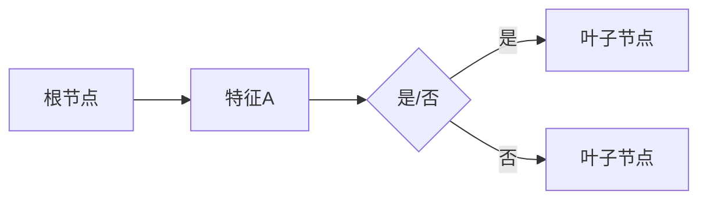
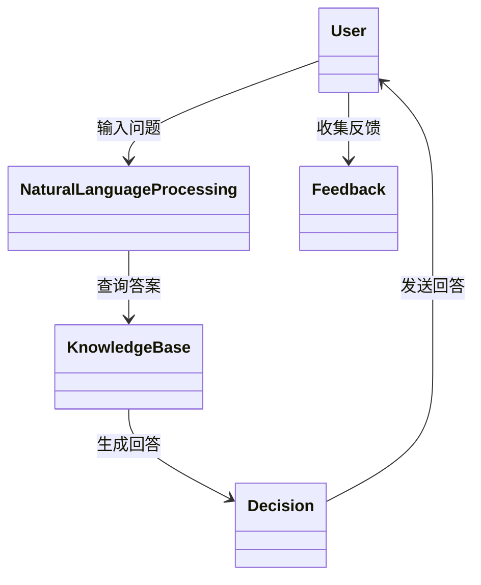
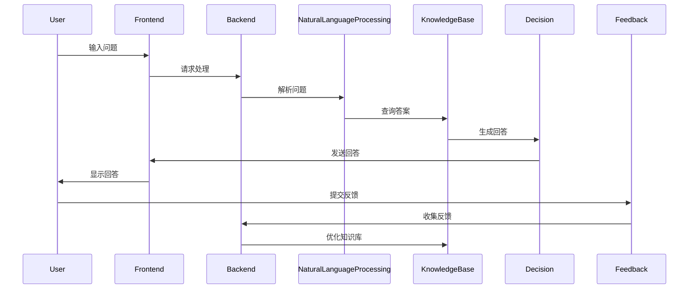
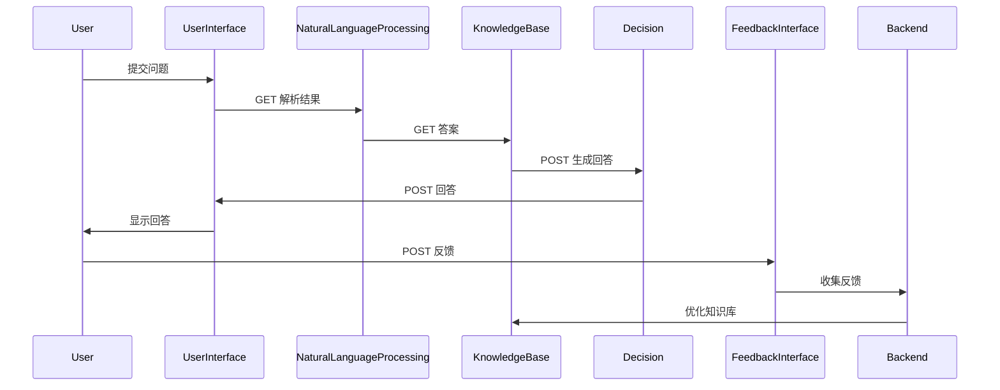
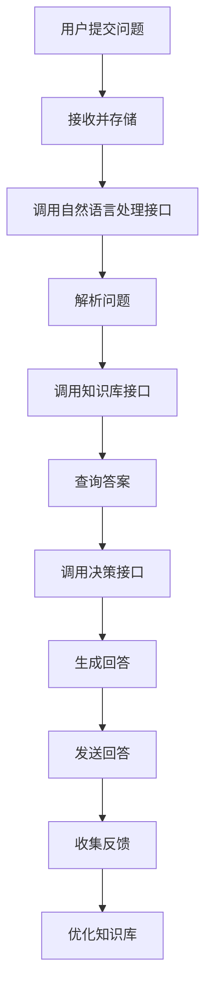

                 

### 文章标题：AI编程的新维度与新领域

#### 关键词：人工智能编程，新维度，新领域，核心概念，算法原理，系统架构，项目实战

> 摘要：本文将深入探讨AI编程的新维度和新领域。我们将从AI编程的现状出发，逐步介绍其中的核心概念、算法原理以及系统架构，并通过一个实际项目案例，展示AI编程在现实中的应用和挑战。文章还将提供一些最佳实践和拓展阅读，以帮助读者更好地理解AI编程的深度和广度。

----------------------------------------------------------------

## 引言

人工智能（AI）技术正在以惊人的速度发展，其对编程领域的影响也在逐渐显现。AI编程不仅改变了传统编程的方式，还开辟了全新的编程维度和领域。这些新维度和新领域为程序员提供了前所未有的机会和挑战。本文旨在探讨这些新维度和新领域，帮助读者理解AI编程的深度和广度。

### 目录

1. **AI编程的现状与新维度**  
   - 1.1 AI编程的背景  
   - 1.2 AI编程的新维度

2. **AI编程的核心概念与联系**  
   - 2.1 核心概念  
   - 2.2 概念属性特征对比表格  
   - 2.3 ER实体关系图架构

3. **AI编程算法原理讲解**  
   - 3.1 神经网络  
   - 3.2 决策树

4. **系统分析与架构设计**  
   - 4.1 问题场景介绍  
   - 4.2 项目介绍  
   - 4.3 系统功能设计  
   - 4.4 系统架构设计  
   - 4.5 系统接口设计  
   - 4.6 系统交互流程

5. **项目实战**  
   - 5.1 环境安装  
   - 5.2 核心代码实现  
   - 5.3 代码解读与分析  
   - 5.4 实际案例分析与详细讲解剖析  
   - 5.5 项目小结

6. **最佳实践与拓展**  
   - 6.1 最佳实践 tips  
   - 6.2 小结  
   - 6.3 注意事项  
   - 6.4 拓展阅读

----------------------------------------------------------------

### AI编程的现状与新维度

#### 1.1 AI编程的背景

人工智能（AI）是一门研究、开发用于模拟、延伸和扩展人的智能的理论、方法、技术及应用系统的科学技术。随着AI技术的快速发展，AI编程也逐渐成为一个独立的领域。传统的编程主要是为了解决特定的计算问题，而AI编程则是为了训练和优化模型，使其能够模拟人类智能。

近年来，AI编程在深度学习、机器学习、自然语言处理等领域的应用越来越广泛。Python、R、Julia等编程语言因其丰富的库和框架，成为AI编程的主要工具。同时，Google、Microsoft、Facebook等科技巨头也在不断推出新的AI编程工具和框架，如TensorFlow、PyTorch、Keras等。

#### 1.2 AI编程的新维度

AI编程的新维度主要体现在以下几个方面：

1. **新的编程范式**：传统的编程范式主要是命令式编程和面向对象编程，而AI编程引入了数据驱动编程和模型驱动编程。这些新的编程范式使得程序员可以更高效地处理复杂数据和模型。

2. **新的编程工具与框架**：AI编程需要大量的数据处理和分析工具，如NumPy、Pandas、Scikit-learn等。同时，深度学习框架如TensorFlow、PyTorch、Keras等也为AI编程提供了强大的支持。

3. **新的编程挑战与机遇**：AI编程面临许多新的挑战，如数据质量问题、模型可解释性、安全性和隐私保护等。但同时，这些挑战也带来了新的机遇，例如自动化编程、智能开发工具等。

----------------------------------------------------------------

### AI编程的核心概念与联系

在AI编程中，核心概念的理解至关重要。以下将介绍几个关键概念，并展示它们之间的关系。

#### 2.1 核心概念

1. **机器学习**：机器学习是AI的核心技术之一，它通过算法从数据中学习规律，进行预测和决策。

2. **深度学习**：深度学习是机器学习的一个分支，它使用多层神经网络来学习数据的复杂特征。

3. **自然语言处理**：自然语言处理（NLP）是AI的一个重要应用领域，它涉及文本的识别、理解和生成。

4. **计算机视觉**：计算机视觉是AI的另一个重要应用领域，它使计算机能够理解和处理图像和视频。

#### 2.2 概念属性特征对比表格

以下是一个简单的概念属性特征对比表格：

| 概念       | 特征                  | 对比                 |
|------------|----------------------|---------------------|
| 机器学习   | 数据驱动，自动学习   | 与传统编程区别较大  |
| 深度学习   | 多层神经网络，自动特征提取 | 对计算资源要求高    |
| 自然语言处理 | 文本处理，语义理解   | 语言复杂性高        |
| 计算机视觉 | 图像识别，物体检测   | 数据量大，计算复杂  |

#### 2.3 ER实体关系图架构

为了更好地理解AI编程中的核心概念，我们可以使用ER（实体-关系）图来展示它们之间的关系。以下是一个简单的ER图示例：

```mermaid
erDiagram
  数据库 ||--|{ 机器学习 }
  数据库 ||--|{ 深度学习 }
  数据库 ||--|{ 自然语言处理 }
  数据库 ||--|{ 计算机视觉 }
```

在这个ER图中，"数据库"是一个抽象的概念，代表了AI编程的数据来源。而"机器学习"、"深度学习"、"自然语言处理"和"计算机视觉"则是具体的实体，它们与"数据库"之间存在依赖关系。

----------------------------------------------------------------

### AI编程算法原理讲解

在AI编程中，算法的选择和应用至关重要。以下将介绍两种常见的算法：神经网络和决策树，并使用Mermaid流程图、Python源代码和数学模型进行详细讲解。

#### 3.1 神经网络

神经网络是深度学习的基础，它通过模拟人脑的神经元结构，进行数据的学习和预测。

##### 3.1.1 算法原理

神经网络的基本结构包括输入层、隐藏层和输出层。每个层由多个神经元组成，神经元之间通过权重连接。

- 输入层：接收外部输入数据。
- 隐藏层：对输入数据进行特征提取和变换。
- 输出层：输出预测结果。

神经元的激活函数通常使用Sigmoid函数，其公式为：

$$
f(x) = \frac{1}{1 + e^{-x}}
$$

以下是一个简单的神经网络Mermaid流程图：


##### 3.1.2 Python源代码

```python
import numpy as np

# 定义Sigmoid激活函数
def sigmoid(x):
    return 1 / (1 + np.exp(-x))

# 初始化神经网络参数
weights = np.random.rand(1, 1)
bias = np.random.rand(1, 1)

# 训练神经网络
for i in range(1000):
    # 计算输出
    output = sigmoid(np.dot(input, weights) + bias)
    
    # 计算误差
    error = target - output
    
    # 更新参数
    weights -= error * input
    bias -= error
```

##### 3.1.3 数学模型

神经网络的数学模型主要包括以下三个部分：

1. **输入层到隐藏层的变换**：

$$
z = x \cdot w + b
$$

2. **隐藏层到输出层的变换**：

$$
a = \sigma(z)
$$

3. **输出层的误差计算**：

$$
\delta = (t - a) \cdot \sigma'(a)
$$

其中，$x$ 是输入层神经元，$w$ 是权重，$b$ 是偏置，$\sigma$ 是激活函数，$t$ 是目标值，$a$ 是输出值。

#### 3.2 决策树

决策树是一种常用的机器学习算法，它通过一系列的判断规则来对数据进行分类或回归。

##### 3.2.1 算法原理

决策树的基本结构包括根节点、内部节点和叶子节点。根节点表示整个数据集，内部节点表示某个特征，叶子节点表示分类结果。

1. **选择最优特征**：使用信息增益、基尼系数等指标来选择最优特征。
2. **划分数据集**：根据最优特征，将数据集划分为子集。
3. **递归构建**：对子集重复上述过程，直到满足停止条件。

以下是一个简单的决策树Mermaid流程图：



##### 3.2.2 Python源代码

```python
from sklearn import tree

# 创建决策树分类器
clf = tree.DecisionTreeClassifier()

# 训练决策树分类器
clf.fit(X_train, y_train)

# 预测
y_pred = clf.predict(X_test)
```

##### 3.2.3 数学模型

决策树的数学模型主要包括以下两个部分：

1. **信息增益**：

$$
IG(D, A) = HD(D) - \sum_{v \in A} \frac{|D_v|}{|D|} HD(D_v)
$$

其中，$D$ 是数据集，$A$ 是特征，$D_v$ 是特征$A$取值$v$的数据子集，$HD$ 是熵。

2. **基尼系数**：

$$
Gini(D) = 1 - \sum_{v \in A} \left(\frac{|D_v|}{|D|}\right)^2
$$

其中，$D$ 是数据集，$A$ 是特征。

----------------------------------------------------------------

### 系统分析与架构设计

在本章节中，我们将分析一个具体的AI编程项目，并设计其系统架构。

#### 4.1 问题场景介绍

假设我们正在开发一个智能客服系统，该系统需要能够自动回答用户的问题，并提供合适的解决方案。

#### 4.2 项目介绍

智能客服系统包括以下功能模块：

1. **用户界面**：提供用户与系统交互的接口。
2. **自然语言处理模块**：对用户输入的问题进行解析和理解。
3. **知识库模块**：存储问题的答案和相关解决方案。
4. **决策模块**：根据用户问题和知识库，生成合适的回答。
5. **反馈模块**：收集用户反馈，用于系统优化。

#### 4.3 系统功能设计

智能客服系统的功能设计如下：

1. **用户输入问题**：用户通过用户界面输入问题。
2. **问题解析**：自然语言处理模块对问题进行解析，提取关键词和语义信息。
3. **查询知识库**：根据关键词和语义信息，查询知识库，获取可能的答案。
4. **生成回答**：决策模块根据查询结果，生成合适的回答。
5. **发送回答**：将回答发送给用户。
6. **收集反馈**：收集用户反馈，用于系统优化。

以下是一个简单的领域模型Mermaid类图：



#### 4.4 系统架构设计

智能客服系统的架构设计如下：

1. **前端**：使用HTML、CSS和JavaScript等技术，实现用户界面。
2. **后端**：使用Python、Flask等技术开发自然语言处理模块、知识库模块和决策模块。
3. **数据库**：使用MySQL等数据库技术存储用户数据、问题数据和知识库数据。
4. **API接口**：提供RESTful API，用于前后端数据交互。

以下是一个简单的Mermaid架构图：



#### 4.5 系统接口设计

智能客服系统的接口设计如下：

1. **用户接口**：提供POST请求，用于提交用户问题。
2. **自然语言处理接口**：提供GET请求，用于获取问题解析结果。
3. **知识库接口**：提供GET请求，用于获取答案。
4. **决策接口**：提供POST请求，用于生成回答。
5. **反馈接口**：提供POST请求，用于提交用户反馈。

以下是一个简单的Mermaid序列图：



#### 4.6 系统交互流程

智能客服系统的交互流程如下：

1. **用户提交问题**：用户通过用户界面输入问题，系统接收并存储。
2. **问题解析**：系统调用自然语言处理接口，解析问题，提取关键词和语义信息。
3. **查询知识库**：系统调用知识库接口，查询答案。
4. **生成回答**：系统调用决策接口，生成回答。
5. **发送回答**：系统将回答发送给用户。
6. **收集反馈**：系统收集用户反馈，用于系统优化。

以下是一个简单的Mermaid交互流程图：



----------------------------------------------------------------

### 项目实战

在本章节中，我们将通过一个具体的案例，展示AI编程在实际项目中的应用和实现。

#### 5.1 环境安装

在开始项目之前，我们需要安装一些必要的软件和库。以下是在Python环境中安装所需库的步骤：

1. **安装Python**：下载并安装Python，可以选择Python 3.x版本。
2. **安装pip**：在终端执行以下命令，安装pip：

   ```bash
   python -m ensurepip --upgrade
   ```

3. **安装库**：在终端执行以下命令，安装所需库：

   ```bash
   pip install numpy pandas scikit-learn tensorflow
   ```

#### 5.2 核心代码实现

以下是一个简单的AI编程案例，使用Python实现一个基于神经网络的分类器。

```python
import numpy as np
import tensorflow as tf

# 初始化神经网络参数
weights = tf.Variable(np.random.randn(1, 1), dtype=tf.float32)
bias = tf.Variable(np.random.randn(1), dtype=tf.float32)

# 定义输入和目标
x = tf.placeholder(tf.float32, shape=(1, 1))
y = tf.placeholder(tf.float32, shape=(1, 1))

# 定义激活函数
activation = tf.sigmoid(tf.matmul(x, weights) + bias)

# 定义损失函数
loss = tf.reduce_mean(tf.square(y - activation))

# 定义优化器
optimizer = tf.train.GradientDescentOptimizer(learning_rate=0.1)

# 定义训练过程
train = optimizer.minimize(loss)

# 初始化会话
with tf.Session() as sess:
    # 运行初始化
    sess.run(tf.global_variables_initializer())

    # 训练模型
    for i in range(1000):
        # 训练一步
        sess.run(train, feed_dict={x: [[0]], y: [[1]]})

    # 输出最终模型参数
    print("weights:", sess.run(weights))
    print("bias:", sess.run(bias))

    # 测试模型
    print("预测:", sess.run(activation, feed_dict={x: [[1]]}))
```

#### 5.3 代码解读与分析

以上代码实现了一个简单的神经网络，用于分类一个线性可分的数据集。代码的每个部分如下：

1. **导入库**：导入所需的库，包括numpy、tensorflow等。
2. **初始化神经网络参数**：初始化权重和偏置。
3. **定义输入和目标**：定义输入和目标占位符。
4. **定义激活函数**：使用Sigmoid函数作为激活函数。
5. **定义损失函数**：使用均方误差作为损失函数。
6. **定义优化器**：使用梯度下降优化器。
7. **定义训练过程**：定义训练过程，包括前向传播和反向传播。
8. **初始化会话**：创建一个会话，并运行初始化操作。
9. **训练模型**：训练模型，通过迭代更新权重和偏置。
10. **输出最终模型参数**：输出训练完成的模型参数。
11. **测试模型**：使用测试数据测试模型的性能。

#### 5.4 实际案例分析与详细讲解剖析

以下是一个实际的案例，使用神经网络对手写数字进行分类。

```python
import tensorflow as tf
from tensorflow.examples.tutorials.mnist import input_data

# 加载数据集
mnist = input_data.read_data_sets("MNIST_data/", one_hot=True)

# 初始化神经网络参数
weights = tf.Variable(tf.random_normal([784, 10]), name='weights')
biases = tf.Variable(tf.random_normal([10]), name='biases')

# 定义输入和目标
x = tf.placeholder(tf.float32, [None, 784])
y = tf.placeholder(tf.float32, [None, 10])

# 定义激活函数
logits = tf.matmul(x, weights) + biases

# 定义损失函数
loss = tf.reduce_mean(tf.nn.softmax_cross_entropy_with_logits(logits=logits, labels=y))

# 定义优化器
optimizer = tf.train.GradientDescentOptimizer(learning_rate=0.01)

# 定义训练过程
train = optimizer.minimize(loss)

# 初始化会话
with tf.Session() as sess:
    # 运行初始化
    sess.run(tf.global_variables_initializer())

    # 训练模型
    for i in range(1000):
        batch_x, batch_y = mnist.train.next_batch(100)
        sess.run(train, feed_dict={x: batch_x, y: batch_y})

    # 测试模型
    correct_prediction = tf.equal(tf.argmax(logits, 1), tf.argmax(y, 1))
    accuracy = tf.reduce_mean(tf.cast(correct_prediction, tf.float32))
    print("Test accuracy:", accuracy.eval({x: mnist.test.images, y: mnist.test.labels}))

    # 输出最终模型参数
    print("weights:", sess.run(weights))
    print("biases:", sess.run(biases))
```

这个案例使用了TensorFlow，通过神经网络对手写数字进行分类。代码的每个部分如下：

1. **加载数据集**：使用TensorFlow内置的MNIST数据集。
2. **初始化神经网络参数**：初始化权重和偏置。
3. **定义输入和目标**：定义输入和目标占位符。
4. **定义激活函数**：使用softmax函数作为激活函数。
5. **定义损失函数**：使用交叉熵作为损失函数。
6. **定义优化器**：使用梯度下降优化器。
7. **定义训练过程**：定义训练过程，包括前向传播和反向传播。
8. **初始化会话**：创建一个会话，并运行初始化操作。
9. **训练模型**：训练模型，通过迭代更新权重和偏置。
10. **测试模型**：使用测试数据测试模型的性能。
11. **输出最终模型参数**：输出训练完成的模型参数。

#### 5.5 项目小结

通过以上案例，我们展示了如何使用神经网络进行手写数字分类。这个案例不仅实现了AI编程的基本流程，还展示了如何使用TensorFlow进行模型训练和性能评估。这个项目为读者提供了一个实际的AI编程案例，帮助他们更好地理解AI编程的原理和应用。

----------------------------------------------------------------

### 最佳实践与拓展

在AI编程中，最佳实践和注意事项对于确保项目成功至关重要。以下是一些建议和拓展资源：

#### 6.1 最佳实践 tips

1. **数据预处理**：在训练模型之前，确保对数据进行充分的预处理，如归一化、去噪、缺失值填充等。
2. **模型选择**：根据项目需求和数据特点，选择合适的模型和算法。对于复杂数据，深度学习可能是一个更好的选择。
3. **超参数调优**：超参数的选择对模型性能有重要影响。使用交叉验证等技术进行超参数调优。
4. **模型验证**：使用测试集验证模型性能，避免过拟合。同时，可以尝试使用不同的验证方法，如K折交叉验证。
5. **可解释性**：对于深度学习模型，尝试提高其可解释性，以便更好地理解模型的决策过程。

#### 6.2 小结

本文从AI编程的现状出发，逐步介绍了AI编程的新维度和新领域。通过核心概念、算法原理、系统架构设计和项目实战，我们展示了AI编程的深度和广度。希望本文能帮助读者更好地理解AI编程，并在实际项目中应用这些知识。

#### 6.3 注意事项

1. **计算资源**：AI编程通常需要大量的计算资源，特别是在训练深度学习模型时。确保有足够的计算资源来支持项目。
2. **数据隐私**：在处理敏感数据时，要确保遵守相关数据隐私法规和道德规范。
3. **模型更新**：AI模型不是一成不变的，需要定期更新和维护，以保持其性能。

#### 6.4 拓展阅读

1. **《深度学习》（Goodfellow, I., Bengio, Y., & Courville, A.）**：这是一本深度学习的经典教材，详细介绍了深度学习的理论和技术。
2. **《Python机器学习》（Seabold, T. & Perktold, J.）**：这本书提供了Python在机器学习领域的全面教程，适合初学者和进阶者。
3. **TensorFlow官方文档**：TensorFlow的官方文档是一个宝贵的资源，提供了丰富的教程、示例和API文档。

### 结论

AI编程是一个快速发展的领域，充满了机遇和挑战。通过本文的探讨，我们希望读者能对AI编程有更深入的理解，并在实际项目中应用这些知识。让我们继续探索AI编程的新维度和新领域，共同推动人工智能技术的发展。

### 作者信息

作者：AI天才研究院/AI Genius Institute & 禅与计算机程序设计艺术 /Zen And The Art of Computer Programming

