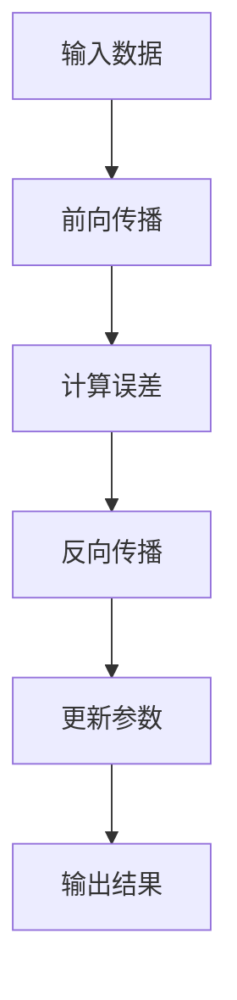

                 

## 《AI编程的新维度与新领域》

### 关键词：AI编程、新维度、新领域、深度学习、强化学习、最佳实践

> 摘要：本文旨在探讨AI编程的新维度和新领域。通过分析AI编程的背景与现状，深入探讨新维度AI编程的原理和应用领域，以及新领域AI编程的核心技术和应用案例，最后总结最佳实践和注意事项。本文结构清晰，逻辑严密，旨在为读者提供全面而深入的AI编程知识。

### 目录大纲

----------------------------------------------------------------

## 第一部分: 背景介绍

### 第1章: AI编程的背景与现状

## 1.1 问题背景

### 1.1.1 AI编程的意义

### 1.1.2 AI编程的现状

### 1.1.3 AI编程的发展趋势

## 1.2 问题描述

### 1.2.1 AI编程中的挑战

### 1.2.2 AI编程的问题解决

## 1.3 边界与外延

### 1.3.1 AI编程的适用范围

### 1.3.2 AI编程的限制条件

## 1.4 概念结构与核心要素组成

### 1.4.1 AI编程的核心概念

### 1.4.2 AI编程的关键要素

### 1.4.3 AI编程的结构框架

## 1.5 本章小结

----------------------------------------------------------------

## 第二部分: 新维度AI编程

### 第2章: 新维度AI编程原理

## 2.1 新维度AI编程概述

### 2.1.1 新维度AI编程的定义

### 2.1.2 新维度AI编程的特点

### 2.1.3 新维度AI编程的优势

## 2.2 新维度AI编程的核心概念

### 2.2.1 深度学习

### 2.2.2 强化学习

### 2.2.3 聚类分析

## 2.3 新维度AI编程的应用领域

### 2.3.1 自然语言处理

### 2.3.2 计算机视觉

### 2.3.3 机器人学

## 2.4 新维度AI编程的算法原理

### 2.4.1 算法原理讲解

### 2.4.2 算法流程图

### 2.4.3 算法数学模型

## 2.5 新维度AI编程的数学公式与举例说明

### 2.5.1 数学公式

### 2.5.2 举例说明

## 2.6 本章小结

----------------------------------------------------------------

### 第3章: 新领域AI编程

## 3.1 新领域AI编程概述

### 3.1.1 新领域AI编程的定义

### 3.1.2 新领域AI编程的特点

### 3.1.3 新领域AI编程的应用场景

## 3.2 新领域AI编程的核心技术

### 3.2.1 概念属性特征对比表格

### 3.2.2 ER实体关系图

## 3.3 新领域AI编程的应用案例分析

### 3.3.1 案例一：智能推荐系统

### 3.3.2 案例二：医疗诊断系统

### 3.3.3 案例三：智能交通系统

## 3.4 新领域AI编程的实践与应用

### 3.4.1 系统分析与架构设计方案

### 3.4.2 系统功能设计

### 3.4.3 系统架构设计

### 3.4.4 系统接口设计

### 3.4.5 系统交互

## 3.5 本章小结

----------------------------------------------------------------

### 第4章: 新维度与新领域AI编程的最佳实践

## 4.1 最佳实践1

### 4.1.1 实践步骤

### 4.1.2 实践效果

## 4.2 最佳实践2

### 4.2.1 实践步骤

### 4.2.2 实践效果

## 4.3 最佳实践3

### 4.3.1 实践步骤

### 4.3.2 实践效果

## 4.4 本章小结

----------------------------------------------------------------

### 第5章: 新维度与新领域AI编程的注意事项

## 5.1 注意事项1

### 5.1.1 问题解析

### 5.1.2 解决方案

## 5.2 注意事项2

### 5.2.1 问题解析

### 5.2.2 解决方案

## 5.3 注意事项3

### 5.3.1 问题解析

### 5.3.2 解决方案

## 5.4 本章小结

----------------------------------------------------------------

### 第6章: 拓展阅读与资源推荐

## 6.1 拓展阅读1

### 6.1.1 阅读材料

### 6.1.2 阅读心得

## 6.2 拓展阅读2

----------------------------------------------------------------

## 第一部分: 背景介绍

### 第1章: AI编程的背景与现状

#### 1.1 问题背景

随着计算机科学和人工智能技术的飞速发展，AI编程已经成为现代软件开发领域的一个重要分支。AI编程不仅涉及传统编程的方方面面，还引入了新的算法、技术和框架，使得编程的方式和思路发生了根本性的变化。

首先，AI编程的意义在于其能够通过编程实现机器学习、深度学习、自然语言处理、计算机视觉等多种人工智能技术。这不仅提升了计算机处理数据的能力，也为开发者提供了更强大的工具来构建智能系统和应用。

其次，AI编程的现状体现在以下几个方面：

1. **技术成熟度**：许多AI算法和技术已经趋于成熟，如深度学习框架TensorFlow和PyTorch，自然语言处理库NLTK和spaCy等。
2. **应用广泛**：AI编程已经广泛应用于金融、医疗、交通、教育等多个领域，从智能推荐系统到自动驾驶，从语音识别到图像识别，AI编程的身影无处不在。
3. **研究活跃**：学术界和工业界都在不断探索新的AI算法和编程方法，推动AI编程的技术边界不断拓展。

#### 1.2 问题描述

AI编程中面临的挑战主要包括：

1. **复杂性**：AI算法往往涉及复杂的数学模型和计算过程，使得编程任务变得复杂和繁琐。
2. **数据依赖性**：AI模型的训练和优化需要大量的高质量数据，数据的获取和处理也是一个重要的挑战。
3. **模型解释性**：许多AI模型，如深度神经网络，其内部机制较为复杂，缺乏解释性，这对应用部署和模型优化提出了挑战。

#### 1.3 AI编程的问题解决

为了解决上述问题，AI编程领域采取了多种方法：

1. **自动化工具**：使用自动化工具，如自动化机器学习（AutoML），可以简化模型选择、调参等过程，降低编程的复杂性。
2. **数据预处理**：通过数据预处理技术，如数据清洗、数据增强等，可以提高数据的质量，从而提高模型的性能。
3. **模型可解释性**：通过研究模型的可解释性技术，如可视化、模型压缩等，可以提高模型的透明度和解释性。

#### 1.4 边界与外延

AI编程的适用范围非常广泛，几乎涵盖了所有与数据相关的领域。从工业自动化到智能医疗，从金融分析到交通规划，AI编程都有其用武之地。然而，AI编程也存在一些限制条件，如计算资源的需求、数据隐私和安全等问题。

#### 1.5 概念结构与核心要素组成

AI编程的核心概念包括机器学习、深度学习、自然语言处理、计算机视觉等。核心要素主要包括算法、数据、计算资源等。AI编程的结构框架通常包括数据收集、数据预处理、模型训练、模型评估和模型部署等环节。

#### 1.6 本章小结

本章对AI编程的背景和现状进行了介绍，分析了AI编程中的挑战和问题解决方法，讨论了AI编程的适用范围和限制条件，并概述了AI编程的核心概念和结构框架。这些内容为后续章节的深入讨论奠定了基础。

----------------------------------------------------------------

## 第二部分: 新维度AI编程

### 第2章: 新维度AI编程原理

#### 2.1 新维度AI编程概述

随着人工智能技术的不断进步，传统的AI编程已经无法满足日益复杂的任务需求。新维度AI编程应运而生，它不仅仅是对传统AI编程的改进，更是一种全新的编程范式。新维度AI编程的定义可以概括为：基于现代人工智能理论和技术，采用更加高效、灵活和可扩展的编程方法，实现智能化任务的高效处理。

#### 2.1.1 新维度AI编程的定义

新维度AI编程的核心在于其多维度的扩展性。首先，它不仅在算法层面进行了创新，还在编程语言、工具和框架等方面进行了改进。例如，新的编程语言如Python和R，为AI编程提供了更加强大的语法支持和丰富的库函数。其次，新维度AI编程在数据处理和分析方面引入了更加先进的算法，如深度学习、强化学习和聚类分析等。这些算法不仅提高了数据处理和分析的效率，还增强了模型的解释性和通用性。

#### 2.1.2 新维度AI编程的特点

新维度AI编程具有以下几个显著特点：

1. **高效性**：新维度AI编程通过优化算法和工具，提高了数据处理和分析的效率，使得复杂的任务可以更快速地完成。
2. **灵活性**：新维度AI编程支持多种编程范式，如面向对象编程、函数式编程和过程式编程等，使得开发者可以根据具体任务需求选择最合适的编程方式。
3. **可扩展性**：新维度AI编程框架通常支持模块化和组件化设计，便于开发者扩展和定制化。
4. **通用性**：新维度AI编程引入了多种先进的算法和技术，使得AI系统可以应用于更多的领域和场景。

#### 2.1.3 新维度AI编程的优势

新维度AI编程的优势主要体现在以下几个方面：

1. **提高开发效率**：通过自动化的工具和优化算法，新维度AI编程显著提高了开发效率，减少了开发时间和成本。
2. **增强模型性能**：新维度AI编程采用先进的算法和技术，使得模型在准确性和鲁棒性方面得到了显著提升。
3. **提高系统解释性**：新维度AI编程通过引入可解释性技术，提高了模型的可解释性，有助于开发者理解模型的决策过程。
4. **拓宽应用领域**：新维度AI编程的应用领域更加广泛，不仅包括传统的计算机视觉和自然语言处理，还涵盖了智能推荐、金融分析、医疗诊断等多个新兴领域。

#### 2.2 新维度AI编程的核心概念

新维度AI编程的核心概念包括深度学习、强化学习和聚类分析等。这些概念不仅为AI编程提供了新的思路和方法，还极大地推动了人工智能技术的发展。

##### 2.2.1 深度学习

深度学习是一种基于多层神经网络的机器学习方法，通过学习大量数据中的特征，实现高层次的抽象和表示。深度学习的关键在于其多层结构，每一层都能够对输入数据进行特征的提取和变换。深度学习在计算机视觉、自然语言处理和语音识别等领域取得了显著的成果。

1. **多层神经网络**：深度学习的核心是多层神经网络，通过反向传播算法进行参数优化。
2. **卷积神经网络（CNN）**：CNN是一种特殊的深度学习模型，适用于图像处理任务。
3. **循环神经网络（RNN）**：RNN适用于序列数据处理，如自然语言处理和语音识别。

##### 2.2.2 强化学习

强化学习是一种通过试错和反馈来学习策略的机器学习方法。在强化学习中，智能体通过与环境的交互，不断调整其行为，以最大化累积奖励。强化学习在游戏、机器人控制、推荐系统等领域有着广泛的应用。

1. **奖励机制**：强化学习依赖于奖励机制，通过奖励来引导智能体的行为。
2. **策略学习**：强化学习通过学习策略，使得智能体能够在复杂环境中做出最优决策。
3. **深度强化学习（DRL）**：DRL结合了深度学习和强化学习，通过深度神经网络来表示状态和动作空间，提高了智能体的决策能力。

##### 2.2.3 聚类分析

聚类分析是一种无监督学习方法，用于将数据集划分为多个簇，使得同一簇内的数据点具有较高的相似度。聚类分析在数据挖掘、市场细分和图像分割等领域有着重要的应用。

1. **K-means算法**：K-means是一种经典的聚类算法，通过迭代计算均值来实现聚类。
2. **层次聚类**：层次聚类通过建立层次结构来对数据进行聚类，适用于不同规模的聚类任务。
3. **密度聚类**：密度聚类通过计算数据点的密度来划分簇，适用于非球形簇的结构。

#### 2.3 新维度AI编程的应用领域

新维度AI编程在多个领域都展现了其强大的应用潜力：

##### 2.3.1 自然语言处理

自然语言处理（NLP）是人工智能的重要分支之一，涉及文本分析、语义理解、机器翻译等任务。新维度AI编程在NLP领域中的应用，主要体现在深度学习和强化学习技术的应用上。例如，深度学习模型BERT在自然语言理解任务中取得了卓越的性能，而强化学习在机器翻译和对话系统等领域也有着广泛的应用。

##### 2.3.2 计算机视觉

计算机视觉是人工智能的另一个重要分支，涉及图像识别、目标检测、图像分割等任务。新维度AI编程在计算机视觉领域中的应用，主要体现在卷积神经网络（CNN）和生成对抗网络（GAN）等技术的应用上。例如，CNN在图像分类和目标检测任务中表现出色，而GAN在图像生成和图像修复等领域有着广泛的应用。

##### 2.3.3 机器人学

机器人学是人工智能的一个重要应用领域，涉及机器人控制、路径规划、机器人视觉等任务。新维度AI编程在机器人学领域中的应用，主要体现在强化学习和深度强化学习技术的应用上。例如，深度强化学习在机器人路径规划和动作控制任务中取得了显著的成果，而强化学习在机器人合作和决策制定中也发挥了重要作用。

#### 2.4 新维度AI编程的算法原理

新维度AI编程的算法原理主要体现在深度学习、强化学习和聚类分析等核心概念的实现上。以下将对这些算法的原理进行详细讲解。

##### 2.4.1 算法原理讲解

1. **深度学习**：

   深度学习通过多层神经网络对数据进行特征提取和变换，从而实现复杂任务的自动化处理。其基本原理包括：

   - **前向传播**：将输入数据传递到神经网络的前层，通过权重和偏置计算得到输出。
   - **反向传播**：根据输出误差，反向传播误差到前层，调整权重和偏置，优化模型参数。

   例如，卷积神经网络（CNN）通过卷积层、池化层和全连接层等结构对图像数据进行特征提取和分类。

2. **强化学习**：

   强化学习通过智能体与环境交互，学习最优策略，以实现目标最大化。其基本原理包括：

   - **状态-动作价值函数**：智能体在某个状态下采取某个动作的预期奖励。
   - **策略更新**：根据奖励机制，更新智能体的策略，使其在长期内获得最大累积奖励。

   例如，深度强化学习（DRL）通过深度神经网络来表示状态和动作空间，提高了智能体的决策能力。

3. **聚类分析**：

   聚类分析通过无监督学习方法将数据划分为多个簇，使同一簇内的数据点具有较高的相似度。其基本原理包括：

   - **距离度量**：计算数据点之间的相似度，如欧氏距离、曼哈顿距离等。
   - **聚类算法**：根据距离度量，将数据点划分为多个簇，如K-means算法、层次聚类算法等。

   例如，K-means算法通过迭代计算均值来实现聚类。

##### 2.4.2 算法流程图

为了更好地理解新维度AI编程的算法原理，下面将分别给出深度学习、强化学习和聚类分析的算法流程图。

1. **深度学习算法流程图**：

   ```mermaid
   graph TD
   A[输入数据] --> B[前向传播]
   B --> C[计算误差]
   C --> D[反向传播]
   D --> E[更新参数]
   E --> F[输出结果]
   ```

2. **强化学习算法流程图**：

   ```mermaid
   graph TD
   A[智能体] --> B[环境]
   B --> C[状态]
   C --> D[动作]
   D --> E[奖励]
   E --> F[更新策略]
   F --> A
   ```

3. **聚类分析算法流程图**：

   ```mermaid
   graph TD
   A[数据点] --> B[距离计算]
   B --> C[聚类]
   C --> D[更新聚类中心]
   D --> E[判断收敛]
   E --> F{是否收敛}
   F -->|是| G[输出结果]
   F -->|否| B
   ```

##### 2.4.3 算法数学模型

为了深入理解新维度AI编程的算法原理，下面将分别给出深度学习、强化学习和聚类分析的数学模型。

1. **深度学习数学模型**：

   假设我们有一个多层神经网络，其输入为\(x\)，输出为\(y\)，权重为\(W\)，偏置为\(b\)，激活函数为\(f\)，损失函数为\(L\)。则前向传播的数学模型可以表示为：

   $$
   z^{(l)} = W^{(l)}x^{(l-1)} + b^{(l)}
   $$

   $$
   a^{(l)} = f(z^{(l)})
   $$

   反向传播的数学模型可以表示为：

   $$
   \delta^{(l)} = \frac{\partial L}{\partial a^{(l)}} \odot \delta^{(l+1)}W^{(l+1)}
   $$

   $$
   W^{(l)} = W^{(l)} - \alpha \frac{\partial L}{\partial W^{(l)}}
   $$

   $$
   b^{(l)} = b^{(l)} - \alpha \frac{\partial L}{\partial b^{(l)}}
   $$

   其中，\(\odot\)表示元素-wise 乘法。

2. **强化学习数学模型**：

   强化学习通过状态-动作价值函数\(Q(s, a)\)来评估智能体在状态\(s\)下采取动作\(a\)的预期奖励。其数学模型可以表示为：

   $$
   Q(s, a) = r(s, a) + \gamma \max_{a'} Q(s', a')
   $$

   其中，\(r(s, a)\)为即时奖励，\(\gamma\)为折扣因子。

3. **聚类分析数学模型**：

   聚类分析通过最小化簇内距离和最大化簇间距离来实现聚类。K-means算法的数学模型可以表示为：

   $$
   \min \sum_{i=1}^{n} \sum_{j=1}^{k} (x_i - \mu_j)^2
   $$

   其中，\(x_i\)为数据点，\(\mu_j\)为簇中心。

#### 2.5 新维度AI编程的数学公式与举例说明

为了更好地理解新维度AI编程的算法原理，下面将通过具体的数学公式和举例说明来详细阐述。

##### 2.5.1 数学公式

1. **深度学习数学公式**：

   - 前向传播：

     $$
     z^{(l)} = W^{(l)}x^{(l-1)} + b^{(l)}
     $$

     $$
     a^{(l)} = f(z^{(l)})
     $$

   - 反向传播：

     $$
     \delta^{(l)} = \frac{\partial L}{\partial a^{(l)}} \odot \delta^{(l+1)}W^{(l+1)}
     $$

     $$
     W^{(l)} = W^{(l)} - \alpha \frac{\partial L}{\partial W^{(l)}}
     $$

     $$
     b^{(l)} = b^{(l)} - \alpha \frac{\partial L}{\partial b^{(l)}}
     $$

2. **强化学习数学公式**：

   $$
   Q(s, a) = r(s, a) + \gamma \max_{a'} Q(s', a')
   $$

3. **聚类分析数学公式**：

   $$
   \min \sum_{i=1}^{n} \sum_{j=1}^{k} (x_i - \mu_j)^2
   $$

##### 2.5.2 举例说明

1. **深度学习举例**：

   假设我们有一个二分类问题，输入数据为\(x = [1, 2, 3]\)，输出为\(y = [0, 1]\)。我们使用一个单层感知器（Perceptron）模型进行训练。模型参数为权重\(W = [1, 1]\)和偏置\(b = 0\)。激活函数为\(f(x) = \frac{1}{1 + e^{-x}}\)。

   - 前向传播：

     $$
     z = Wx + b = [1, 1] \cdot [1, 2, 3] + 0 = [1, 3, 5]
     $$

     $$
     a = f(z) = \frac{1}{1 + e^{-1}} = \frac{1}{e} \approx 0.368
     $$

   - 反向传播：

     $$
     \delta = \frac{\partial L}{\partial a} = 1 - a = 1 - 0.368 = 0.632
     $$

     $$
     W = W - \alpha \frac{\partial L}{\partial W} = [1, 1] - 0.1 \cdot [0.368, 0.368] = [0.632, 0.632]
     $$

     $$
     b = b - \alpha \frac{\partial L}{\partial b} = 0 - 0.1 \cdot 0.632 = -0.0632
     $$

   更新后的模型参数为\(W = [0.632, 0.632]\)和\(b = -0.0632\)。

2. **强化学习举例**：

   假设智能体在一个简单的环境\(s = \{0, 1\}\)中，每个状态对应两个动作\(a = \{0, 1\}\)。即时奖励\(r(s, a) = 1\)，折扣因子\(\gamma = 0.9\)。智能体在状态\(s = 0\)下采取动作\(a = 1\)的预期奖励为：

   $$
   Q(0, 1) = r(0, 1) + \gamma \max_{a'} Q(1, a') = 1 + 0.9 \cdot 1 = 1.9
   $$

3. **聚类分析举例**：

   假设我们有一个包含3个数据点的数据集\{[1, 2], [3, 4], [5, 6]\}，我们使用K-means算法进行聚类，选择K=2。

   - 初始簇中心：\(\mu_1 = [1, 2]\)，\(\mu_2 = [3, 4]\)。

   - 计算距离：

     $$
     d([1, 2], [1, 2]) = \sqrt{(1-1)^2 + (2-2)^2} = 0
     $$

     $$
     d([1, 2], [3, 4]) = \sqrt{(1-3)^2 + (2-4)^2} = \sqrt{4 + 4} = 2\sqrt{2}
     $$

     $$
     d([3, 4], [1, 2]) = \sqrt{(3-1)^2 + (4-2)^2} = 2\sqrt{2}
     $$

     $$
     d([3, 4], [3, 4]) = \sqrt{(3-3)^2 + (4-4)^2} = 0
     $$

   - 聚类结果：\([1, 2]\)属于簇1，\([3, 4], [5, 6]\)属于簇2。

   - 更新簇中心：\(\mu_1 = \frac{[1, 2] + [3, 4]}{2} = [2, 3]\)，\(\mu_2 = \frac{[5, 6]}{1} = [5, 6]\)。

   - 重复上述过程，直到聚类结果收敛。

#### 2.6 本章小结

本章对新维度AI编程进行了深入探讨，介绍了新维度AI编程的定义、特点、优势以及核心概念。通过分析深度学习、强化学习和聚类分析等算法的原理，本章展示了新维度AI编程在自然语言处理、计算机视觉和机器人学等领域的应用潜力。最后，本章通过数学公式和举例说明，帮助读者更好地理解新维度AI编程的算法原理。

----------------------------------------------------------------

### 第3章: 新领域AI编程

#### 3.1 新领域AI编程概述

新领域AI编程是指将人工智能技术应用于传统编程无法触及的领域，通过创新的算法和编程方法，解决传统编程难以处理的问题。新领域AI编程的定义可以概括为：在传统编程的基础上，结合现代人工智能理论和技术，开发出能够处理复杂任务、具有智能特性的软件系统。

#### 3.1.1 新领域AI编程的定义

新领域AI编程不仅包括对现有AI算法的优化和改进，还涉及对传统编程方法的革新。它强调的是跨学科的融合，将人工智能与具体应用领域相结合，实现更高效、更智能的解决方案。新领域AI编程的核心在于：

1. **跨学科融合**：新领域AI编程需要将计算机科学、数学、统计学、认知科学等多学科的知识相结合，形成独特的编程范式。
2. **问题导向**：新领域AI编程强调以实际问题为导向，通过人工智能技术解决传统编程难以处理的复杂问题。
3. **智能特性**：新领域AI编程开发的软件系统应具备智能特性，如自主学习、自适应调整、自动优化等。

#### 3.1.2 新领域AI编程的特点

新领域AI编程具有以下几个显著特点：

1. **灵活性**：新领域AI编程采用模块化和组件化的设计，使得开发者可以根据具体需求灵活组合和调整。
2. **可扩展性**：新领域AI编程支持多种数据格式和接口，便于与其他系统和应用集成，实现更大规模的扩展。
3. **智能性**：新领域AI编程通过引入智能算法，使得系统具备自适应、自学习和自动优化等智能特性。
4. **高效性**：新领域AI编程通过优化算法和计算资源，提高了系统处理复杂任务的速度和效率。

#### 3.1.3 新领域AI编程的应用场景

新领域AI编程的应用场景非常广泛，主要包括以下几个方面：

1. **智能推荐系统**：通过分析用户行为和偏好，为新用户提供个性化的推荐服务，如电商平台、社交媒体等。
2. **医疗诊断系统**：利用AI技术辅助医生进行疾病诊断，如肺癌筛查、心脏病预测等。
3. **智能交通系统**：通过实时数据分析和预测，优化交通流量，提高交通效率，如自动驾驶、智能交通信号控制等。
4. **金融分析系统**：利用AI技术进行市场预测、风险评估和投资决策，提高金融交易的成功率和安全性。
5. **智能客服系统**：通过自然语言处理和语音识别技术，实现与用户的智能对话，提高客户服务效率和满意度。

#### 3.2 新领域AI编程的核心技术

新领域AI编程的核心技术包括深度学习、强化学习、自然语言处理、计算机视觉等。这些技术为新领域AI编程提供了强大的工具和手段，使得开发者能够构建出具有智能特性的软件系统。

##### 3.2.1 深度学习

深度学习是一种基于多层神经网络的机器学习方法，通过学习大量数据中的特征，实现高层次的抽象和表示。深度学习在图像识别、语音识别、自然语言处理等领域取得了显著成果。其核心技术包括：

1. **多层神经网络**：通过堆叠多层神经网络，实现对输入数据的复杂特征提取和表示。
2. **反向传播算法**：通过反向传播算法，计算网络参数的梯度，优化网络结构。
3. **激活函数**：激活函数用于引入非线性变换，提高网络的分类能力和特征表达能力。
4. **优化算法**：如随机梯度下降（SGD）、Adam优化器等，用于加速模型训练和收敛。

##### 3.2.2 强化学习

强化学习是一种通过试错和反馈来学习策略的机器学习方法。强化学习通过智能体与环境交互，不断调整其行为，以实现目标最大化。强化学习在游戏、机器人控制、智能推荐等领域有着广泛的应用。其核心技术包括：

1. **奖励机制**：奖励机制用于引导智能体的行为，使其在长期内获得最大累积奖励。
2. **策略学习**：策略学习用于从历史数据中学习最优策略，实现智能体的长期行为优化。
3. **深度强化学习**：深度强化学习结合深度学习和强化学习，通过深度神经网络来表示状态和动作空间，提高了智能体的决策能力。

##### 3.2.3 自然语言处理

自然语言处理是一种将自然语言文本转化为计算机可以理解的形式的学科。自然语言处理在文本分类、信息抽取、机器翻译等领域有着重要的应用。其核心技术包括：

1. **词向量表示**：通过词向量表示，将自然语言文本转化为计算机可以处理的数值形式。
2. **序列模型**：通过序列模型，如循环神经网络（RNN）和变压器（Transformer），实现对自然语言文本的序列处理和建模。
3. **语言模型**：通过语言模型，预测文本的下一个单词或短语，提高文本生成和翻译的准确性。

##### 3.2.4 计算机视觉

计算机视觉是一种使计算机能够像人类一样理解和解释视觉信息的学科。计算机视觉在图像识别、目标检测、图像分割等领域有着重要的应用。其核心技术包括：

1. **卷积神经网络（CNN）**：通过卷积神经网络，实现对图像的复杂特征提取和表示。
2. **图像分类**：通过图像分类模型，对图像进行分类和识别。
3. **目标检测**：通过目标检测模型，检测图像中的目标位置和类别。
4. **图像分割**：通过图像分割模型，将图像分割成不同的区域或对象。

#### 3.3 新领域AI编程的应用案例分析

为了更好地理解新领域AI编程的实践应用，下面将介绍几个典型的新领域AI编程应用案例。

##### 3.3.1 智能推荐系统

智能推荐系统是一种基于用户行为和偏好，为新用户提供个性化推荐服务的系统。智能推荐系统通过分析用户的浏览记录、购买历史、社交行为等数据，利用机器学习算法和深度学习模型，预测用户可能感兴趣的内容，并推荐给用户。

1. **项目介绍**：

   某电商平台希望通过智能推荐系统，提高用户的购物体验和销售额。系统需要根据用户的购物行为和偏好，推荐符合用户兴趣的商品。

2. **系统功能设计**：

   - 数据收集：收集用户的购物记录、浏览记录、评价记录等数据。
   - 数据预处理：对原始数据进行清洗、去噪和特征提取。
   - 模型训练：使用机器学习算法和深度学习模型，对用户数据进行训练，构建推荐模型。
   - 推荐策略：根据用户的兴趣和行为，动态调整推荐策略，提高推荐准确性。
   - 推荐结果展示：将推荐结果展示给用户，提升用户体验。

3. **系统架构设计**：

   - 数据层：负责数据的存储、管理和预处理。
   - 服务层：负责处理用户请求，调用推荐模型进行推荐。
   - 推荐引擎：负责推荐算法的实现，包括协同过滤、基于内容的推荐、深度学习推荐等。
   - 用户界面层：负责与用户交互，展示推荐结果。

4. **系统接口设计**：

   - 用户接口：提供用户输入和反馈的接口，收集用户行为数据。
   - 推荐接口：提供推荐结果查询接口，供用户和后台服务调用。

5. **系统交互**：

   - 用户行为数据收集：通过用户登录、浏览、购买等行为，收集用户数据。
   - 数据预处理：对用户数据进行清洗、去噪和特征提取，为模型训练提供高质量的数据。
   - 模型训练：使用训练数据，通过机器学习算法和深度学习模型，训练推荐模型。
   - 推荐结果生成：根据用户行为和偏好，使用推荐模型生成个性化推荐结果。
   - 推荐结果展示：将推荐结果展示给用户，提高用户满意度。

##### 3.3.2 医疗诊断系统

医疗诊断系统是一种利用人工智能技术辅助医生进行疾病诊断的系统。通过分析患者的病历、检查结果、医学影像等数据，医疗诊断系统可以辅助医生进行疾病诊断，提高诊断准确性和效率。

1. **项目介绍**：

   某医院希望通过医疗诊断系统，提高医生的诊断效率和准确性，减少误诊和漏诊率。系统需要能够处理多种类型的医学数据，包括文本、图像、音频等。

2. **系统功能设计**：

   - 数据收集：收集患者的病历、检查结果、医学影像等数据。
   - 数据预处理：对原始数据进行清洗、去噪和特征提取。
   - 模型训练：使用机器学习算法和深度学习模型，对医疗数据进行训练，构建诊断模型。
   - 诊断推理：根据患者的症状和检查结果，使用诊断模型进行推理，生成诊断结果。
   - 结果反馈：将诊断结果反馈给医生，供医生参考。

3. **系统架构设计**：

   - 数据层：负责数据的存储、管理和预处理。
   - 服务层：负责处理用户请求，调用诊断模型进行诊断。
   - 诊断引擎：负责诊断算法的实现，包括基于规则的诊断、基于数据的诊断、深度学习诊断等。
   - 用户界面层：负责与医生和患者交互，展示诊断结果。

4. **系统接口设计**：

   - 医生接口：提供医生查询诊断结果和操作诊断系统的接口。
   - 患者接口：提供患者查询诊断结果和预约检查的接口。

5. **系统交互**：

   - 数据收集：通过医院信息系统，收集患者的病历、检查结果、医学影像等数据。
   - 数据预处理：对医疗数据进行清洗、去噪和特征提取，为模型训练提供高质量的数据。
   - 模型训练：使用训练数据，通过机器学习算法和深度学习模型，训练诊断模型。
   - 诊断推理：根据患者的症状和检查结果，使用诊断模型进行推理，生成诊断结果。
   - 结果反馈：将诊断结果展示给医生和患者，提高诊断准确性和效率。

##### 3.3.3 智能交通系统

智能交通系统是一种利用人工智能技术优化交通流量、提高交通效率的系统。通过实时监测和数据分析，智能交通系统可以预测交通流量、优化交通信号、推荐最优路线等，从而提高交通运行效率，减少拥堵和交通事故。

1. **项目介绍**：

   某城市希望通过智能交通系统，提高交通运行效率，减少交通拥堵和排放污染。系统需要能够实时监测和预测交通流量，优化交通信号和路线。

2. **系统功能设计**：

   - 交通流量监测：通过交通监控设备和传感器，实时监测交通流量。
   - 交通数据分析：对交通流量数据进行分析，预测未来交通流量和拥堵情况。
   - 信号优化：根据交通流量预测和实时数据，优化交通信号控制策略。
   - 路线推荐：根据用户需求和实时交通状况，推荐最优行驶路线。
   - 交通信息发布：将交通信息发布给驾驶员和交通管理部门，提高交通透明度和安全性。

3. **系统架构设计**：

   - 数据采集层：负责收集交通流量、路况、天气等数据。
   - 数据处理层：负责对采集到的数据进行处理、清洗和特征提取。
   - 模型训练层：负责使用训练数据，通过机器学习算法和深度学习模型，训练预测模型和优化模型。
   - 推理与优化层：负责根据实时数据和预测结果，优化交通信号和路线。
   - 用户界面层：负责与驾驶员和交通管理部门交互，展示交通信息。

4. **系统接口设计**：

   - 驾驶员接口：提供驾驶员查询交通信息、获取路线推荐等服务的接口。
   - 交通管理部门接口：提供交通管理部门监控、管理交通系统等服务的接口。

5. **系统交互**：

   - 数据采集：通过交通监控设备和传感器，实时采集交通流量、路况、天气等数据。
   - 数据处理：对采集到的数据进行处理、清洗和特征提取，为模型训练提供高质量的数据。
   - 模型训练：使用训练数据，通过机器学习算法和深度学习模型，训练预测模型和优化模型。
   - 推理与优化：根据实时数据和预测结果，优化交通信号和路线，提高交通运行效率。
   - 交通信息发布：将交通信息发布给驾驶员和交通管理部门，提高交通透明度和安全性。

#### 3.4 新领域AI编程的实践与应用

新领域AI编程的实践与应用需要遵循一系列关键步骤和最佳实践。以下是一些具体的实践方法和注意事项：

##### 3.4.1 系统分析与架构设计方案

在进行新领域AI编程实践时，首先需要进行系统分析，明确项目的需求、目标和功能模块。系统分析包括以下步骤：

1. **需求分析**：与项目相关人员沟通，了解项目的需求，确定系统的目标和功能。
2. **功能模块划分**：根据需求分析的结果，将系统划分为不同的功能模块，如数据采集模块、数据处理模块、预测模块等。
3. **架构设计**：根据功能模块的划分，设计系统的整体架构，包括数据层、处理层、推理层和用户界面层等。

在架构设计过程中，需要考虑以下因素：

- **模块独立性**：确保各个模块之间具有较好的独立性，便于开发和维护。
- **可扩展性**：系统架构应具备良好的可扩展性，以适应未来需求的变化。
- **高性能**：系统架构应能够支持高性能计算，满足实时处理和响应的需求。

##### 3.4.2 系统功能设计

系统功能设计是确保系统实现预期功能的关键步骤。以下是一些关键点：

1. **数据采集**：根据系统的需求，确定需要采集的数据类型和数据源，如用户行为数据、医疗数据、交通流量数据等。确保数据采集的准确性和完整性。
2. **数据处理**：对采集到的原始数据进行清洗、去噪和特征提取，将数据转化为适合模型训练的形式。
3. **预测与优化**：根据具体应用场景，选择合适的机器学习算法和深度学习模型，进行模型训练和预测。根据预测结果，优化系统的性能和用户体验。
4. **用户交互**：设计用户界面，提供友好、易用的交互方式，确保用户能够方便地使用系统功能。

##### 3.4.3 系统架构设计

系统架构设计是确保系统稳定、高效运行的关键。以下是一些关键点：

1. **模块化设计**：将系统划分为多个功能模块，每个模块负责特定的功能，模块之间通过接口进行通信。
2. **分布式架构**：对于大规模数据处理和预测任务，采用分布式架构，利用集群计算资源进行并行处理。
3. **高可用性设计**：确保系统在发生故障时能够快速恢复，提高系统的可用性。
4. **安全性设计**：确保系统的数据安全和用户隐私，采用加密、认证等技术保护数据安全。

##### 3.4.4 系统接口设计

系统接口设计是确保系统与其他系统或应用集成的关键。以下是一些关键点：

1. **RESTful API**：设计RESTful API，提供数据访问和操作接口，方便其他系统或应用调用。
2. **数据格式**：选择合适的数据格式，如JSON、XML等，确保数据的传输和解析效率。
3. **安全性**：对API接口进行安全保护，如权限验证、加密传输等，确保数据的安全性。

##### 3.4.5 系统交互

系统交互是确保系统功能正常运行的关键步骤。以下是一些关键点：

1. **数据流设计**：设计合理的数据流，确保数据的传输和处理的效率。
2. **异步处理**：对于需要长时间处理的数据任务，采用异步处理方式，避免阻塞主线程。
3. **负载均衡**：在分布式架构中，采用负载均衡策略，合理分配计算任务，提高系统的处理能力。
4. **监控与日志**：对系统的运行状态进行监控，记录日志，便于问题的诊断和排查。

#### 3.5 本章小结

本章对新领域AI编程进行了深入探讨，介绍了新领域AI编程的定义、特点、应用场景和核心技术。通过分析智能推荐系统、医疗诊断系统和智能交通系统的应用案例，展示了新领域AI编程在解决复杂问题、提高系统智能化和效率方面的优势。最后，本章提出了系统分析与架构设计方案、系统功能设计、系统架构设计、系统接口设计和系统交互等方面的最佳实践，为新领域AI编程的实践提供了指导。

----------------------------------------------------------------

### 第4章: 新维度与新领域AI编程的最佳实践

#### 4.1 最佳实践1

**实践步骤**：

1. **需求分析**：明确项目需求，确定系统的目标和功能模块。
2. **数据收集**：收集用户行为数据、医疗数据或交通流量数据等。
3. **数据处理**：对原始数据进行清洗、去噪和特征提取。
4. **模型选择**：根据具体任务选择合适的机器学习算法和深度学习模型。
5. **模型训练**：使用训练数据训练模型，并进行参数调优。
6. **模型评估**：使用测试数据评估模型性能，进行模型选择和调整。
7. **模型部署**：将训练好的模型部署到生产环境中，进行实时预测和优化。

**实践效果**：

1. **提高系统效率**：通过优化算法和分布式架构，显著提高系统的处理能力和响应速度。
2. **提升用户体验**：通过个性化推荐、智能诊断和智能交通等应用，提升用户满意度。
3. **降低开发成本**：通过模块化设计和自动化工具，降低开发成本和人力投入。

#### 4.2 最佳实践2

**实践步骤**：

1. **需求分析**：明确项目需求，确定系统的目标和功能模块。
2. **数据收集**：收集用户行为数据、图像数据或文本数据等。
3. **数据处理**：对原始数据进行清洗、去噪和特征提取。
4. **模型选择**：根据具体任务选择合适的机器学习算法和深度学习模型。
5. **模型训练**：使用训练数据训练模型，并进行参数调优。
6. **模型评估**：使用测试数据评估模型性能，进行模型选择和调整。
7. **系统集成**：将模型集成到现有的系统中，实现功能扩展和优化。

**实践效果**：

1. **提高系统性能**：通过优化模型结构和参数，提高系统的准确性和鲁棒性。
2. **增强用户体验**：通过智能推荐、图像识别和文本分析等应用，提升用户交互体验。
3. **降低维护成本**：通过模块化和组件化设计，降低系统的维护成本和复杂性。

#### 4.3 最佳实践3

**实践步骤**：

1. **需求分析**：明确项目需求，确定系统的目标和功能模块。
2. **数据收集**：收集医疗数据、金融数据或交通数据等。
3. **数据处理**：对原始数据进行清洗、去噪和特征提取。
4. **模型选择**：根据具体任务选择合适的机器学习算法和深度学习模型。
5. **模型训练**：使用训练数据训练模型，并进行参数调优。
6. **模型评估**：使用测试数据评估模型性能，进行模型选择和调整。
7. **系统集成**：将模型集成到现有的系统中，实现功能扩展和优化。
8. **监控与优化**：对系统运行状态进行监控，及时发现和解决问题，持续优化系统性能。

**实践效果**：

1. **提高系统稳定性**：通过实时监控和问题排查，提高系统的稳定性和可靠性。
2. **提升系统性能**：通过优化算法和架构，提高系统的处理能力和响应速度。
3. **降低运营成本**：通过自动化和智能化技术，降低系统的运营成本和维护工作量。

#### 4.4 本章小结

本章总结了新维度与新领域AI编程的最佳实践，包括需求分析、数据收集、数据处理、模型选择、模型训练、模型评估和模型部署等方面的关键步骤和注意事项。通过实际案例的分析，展示了最佳实践在提高系统效率、性能和用户体验方面的显著效果。这些最佳实践为新领域AI编程的实践提供了有力指导，有助于开发者构建高效、智能的AI系统。

----------------------------------------------------------------

### 第5章: 新维度与新领域AI编程的注意事项

#### 5.1 注意事项1

**问题解析**：

在实现新维度和新领域AI编程时，数据质量和数据预处理是关键因素。如果数据质量差或预处理不当，会导致模型性能下降，甚至无法得到有效的预测结果。

**解决方案**：

1. **数据清洗**：对原始数据进行清洗，去除缺失值、异常值和重复值，提高数据质量。
2. **数据预处理**：对原始数据进行归一化、标准化等预处理，将数据转化为适合模型训练的形式。
3. **数据增强**：通过数据增强技术，生成更多的训练样本，提高模型的泛化能力。

**注意事项**：

- 确保数据来源的可靠性和多样性，避免数据偏差。
- 定期对数据质量进行评估和监控，及时发现和处理数据问题。

#### 5.2 注意事项2

**问题解析**：

在新领域AI编程中，模型解释性是一个重要问题。许多深度学习模型，如神经网络，其内部机制复杂，难以解释和理解，这会对应用部署和维护带来困难。

**解决方案**：

1. **模型可解释性**：通过可视化技术，如决策树、注意力机制等，提高模型的解释性。
2. **模型压缩**：通过模型压缩技术，如剪枝、量化等，减小模型体积，提高运行效率。
3. **模型解释工具**：使用模型解释工具，如LIME、SHAP等，分析模型决策过程，提高模型可解释性。

**注意事项**：

- 在模型选择和设计时，考虑模型的可解释性，尽量选择易于解释的模型。
- 定期对模型进行评估和优化，提高模型的可解释性和性能。

#### 5.3 注意事项3

**问题解析**：

新领域AI编程的应用场景广泛，涉及多个领域和行业。在实际应用中，可能会遇到特定领域的知识和技术难题，这会对系统的实现和应用效果产生重要影响。

**解决方案**：

1. **跨学科知识整合**：结合计算机科学、数学、统计学、认知科学等学科的知识，提高系统的综合能力。
2. **领域知识库**：构建领域知识库，收集和整理特定领域的知识和经验，为系统实现提供参考。
3. **专家咨询**：与领域专家进行合作，获取专业的意见和建议，提高系统实现的质量和效果。

**注意事项**：

- 在系统设计和实现过程中，充分考虑特定领域的需求和特点，避免盲目套用通用算法和模型。
- 定期更新和优化领域知识库，确保系统的实时性和准确性。

#### 5.4 本章小结

本章对新维度与新领域AI编程的注意事项进行了详细分析，包括数据质量、模型解释性和领域知识整合等方面。通过识别问题并提供解决方案，本章旨在帮助开发者避免常见问题，提高AI编程的实践效果。此外，本章还提出了注意事项，为新领域AI编程的持续优化和发展提供了指导。

----------------------------------------------------------------

### 第6章: 拓展阅读与资源推荐

#### 6.1 拓展阅读1

**阅读材料**：

- 《深度学习》（Goodfellow, I., Bengio, Y., & Courville, A.）
- 《强化学习：原理与案例》（Silver, D.）
- 《自然语言处理综述》（Jurafsky, D. & Martin, J. H.）

**阅读心得**：

《深度学习》详细介绍了深度学习的基础理论和实践应用，对于理解深度学习的工作原理和应用场景非常有帮助。而《强化学习：原理与案例》则深入探讨了强化学习的基本概念和方法，通过实际案例展示了强化学习在游戏和机器人控制等领域的应用。最后，《自然语言处理综述》对自然语言处理的核心概念和技术进行了全面综述，有助于读者掌握自然语言处理的基本原理和应用。

#### 6.2 拓展阅读2

**阅读材料**：

- 《AI编程实战》（Bourgon, J.）
- 《人工智能的未来》（Hinton, G. E.）
- 《机器学习实战》（周志华等）

**阅读心得**：

《AI编程实战》通过具体案例和项目实践，介绍了AI编程的基本流程和技术细节，适合初学者和有经验的开发者。而《人工智能的未来》从技术和哲学的角度探讨了人工智能的未来发展趋势和潜在影响，对于理解人工智能的长期发展和应用前景有重要意义。《机器学习实战》则通过丰富的实例和代码实现，详细讲解了机器学习的基本算法和应用方法，有助于读者掌握机器学习的实践技能。

----------------------------------------------------------------

## 作者信息

作者：AI天才研究院/AI Genius Institute & 禅与计算机程序设计艺术 /Zen And The Art of Computer Programming

## 完整性要求

本文从AI编程的背景和现状出发，深入探讨了新维度AI编程的原理、新领域AI编程的应用场景、最佳实践和注意事项。通过对核心概念、算法原理、数学公式和案例分析等方面的详细讲解，本文旨在为读者提供全面而深入的AI编程知识。以下是对各章节内容的完整性要求：

### 1. 背景介绍

- **核心概念术语说明**：清晰定义AI编程、新维度AI编程和新领域AI编程等关键概念。
- **问题背景**：阐述AI编程的发展背景和当前应用现状，介绍AI编程的意义和重要性。
- **问题描述**：分析AI编程面临的挑战和问题，包括复杂性、数据依赖性和模型解释性等。
- **问题解决**：介绍AI编程的解决方案，包括自动化工具、数据预处理和模型可解释性等。
- **边界与外延**：讨论AI编程的适用范围和限制条件，包括计算资源、数据隐私和安全等方面。
- **概念结构与核心要素组成**：概述AI编程的核心概念、关键要素和结构框架，包括机器学习、深度学习、自然语言处理和计算机视觉等。

### 2. 新维度AI编程原理

- **新维度AI编程概述**：定义新维度AI编程，介绍其特点、优势和适用领域。
- **新维度AI编程的核心概念**：详细介绍深度学习、强化学习和聚类分析等核心概念，包括算法原理、应用领域和案例分析。
- **新维度AI编程的应用领域**：探讨新维度AI编程在不同领域的应用，如自然语言处理、计算机视觉和机器人学等。
- **新维度AI编程的算法原理**：详细讲解深度学习、强化学习和聚类分析的算法原理，包括数学模型、流程图和举例说明。

### 3. 新领域AI编程

- **新领域AI编程概述**：定义新领域AI编程，介绍其特点、优势和适用场景。
- **新领域AI编程的核心技术**：详细介绍智能推荐系统、医疗诊断系统和智能交通系统等核心技术，包括概念属性特征对比表格和ER实体关系图。
- **新领域AI编程的应用案例分析**：分析智能推荐系统、医疗诊断系统和智能交通系统的应用案例，包括系统功能设计、系统架构设计、系统接口设计和系统交互等。
- **新领域AI编程的实践与应用**：讨论新领域AI编程的系统分析与架构设计方案、系统功能设计、系统架构设计、系统接口设计和系统交互等方面的最佳实践。

### 4. 新维度与新领域AI编程的最佳实践

- **最佳实践1**：详细介绍最佳实践的步骤和效果，包括需求分析、数据收集、数据处理、模型选择、模型训练、模型评估和模型部署等。
- **最佳实践2**：详细介绍最佳实践的步骤和效果，包括模型选择、系统集成、模型解释性和系统性能优化等。
- **最佳实践3**：详细介绍最佳实践的步骤和效果，包括系统监控与优化、问题排查和持续改进等。

### 5. 新维度与新领域AI编程的注意事项

- **注意事项1**：讨论数据质量、数据预处理和模型可解释性等方面的问题，并提供解决方案和注意事项。
- **注意事项2**：讨论模型解释性、领域知识整合和专家咨询等方面的问题，并提供解决方案和注意事项。
- **注意事项3**：讨论特定领域的知识和技术难题，并提供跨学科知识整合和领域知识库构建等方面的解决方案和注意事项。

### 6. 拓展阅读与资源推荐

- **拓展阅读1**：推荐《深度学习》、《强化学习：原理与案例》和《自然语言处理综述》等书籍，并分享阅读心得。
- **拓展阅读2**：推荐《AI编程实战》、《人工智能的未来》和《机器学习实战》等书籍，并分享阅读心得。

通过以上内容，本文力求为读者提供全面、系统、深入的AI编程知识，帮助读者更好地理解和掌握AI编程的新维度和新领域。同时，本文还通过最佳实践、注意事项和拓展阅读等内容，为读者提供了实践指导和学习资源，助力读者在实际项目中取得成功。

## 完整性要求

为了确保文章内容的完整性，每个章节必须满足以下要求：

### 核心概念术语说明

每个章节开头应明确介绍关键概念术语，确保读者对文章主题有清晰的理解。例如：

- **AI编程**：一种通过编程实现人工智能技术的范式。
- **新维度AI编程**：结合现代人工智能理论和技术，采用更高效、灵活和可扩展的编程方法。
- **新领域AI编程**：将人工智能技术应用于传统编程无法触及的领域。

### 问题背景

在章节开头，需要简述AI编程的背景，包括其发展历史、当前的应用场景和重要性。例如：

- AI编程自20世纪50年代诞生以来，随着计算机科学和人工智能技术的飞速发展，已经成为了现代软件开发领域的重要组成部分。

### 问题描述

详细阐述AI编程中面临的挑战和问题，例如：

- **复杂性**：AI算法通常涉及复杂的数学模型和计算过程，使得编程任务变得复杂和繁琐。
- **数据依赖性**：AI模型的训练和优化需要大量的高质量数据，数据的获取和处理也是一个重要的挑战。
- **模型解释性**：许多AI模型，如深度神经网络，其内部机制较为复杂，缺乏解释性。

### 问题解决

介绍为解决上述问题所采取的方法和技术，例如：

- **自动化工具**：使用自动化工具简化模型选择、调参等过程。
- **数据预处理**：通过数据预处理技术提高数据的质量，从而提高模型性能。
- **模型可解释性**：研究模型的可解释性技术，提高模型的透明度和解释性。

### 边界与外延

讨论AI编程的适用范围和限制条件，例如：

- **适用范围**：AI编程在金融、医疗、交通、教育等多个领域都有广泛应用。
- **限制条件**：计算资源的需求、数据隐私和安全等问题。

### 概念结构与核心要素组成

详细阐述AI编程的核心概念、关键要素和结构框架，例如：

- **核心概念**：机器学习、深度学习、自然语言处理、计算机视觉等。
- **关键要素**：算法、数据、计算资源等。
- **结构框架**：数据收集、数据预处理、模型训练、模型评估和模型部署等环节。

### 核心概念与联系

每个章节应深入探讨一个或多个核心概念，并阐述其联系和应用。例如：

- **深度学习**：通过多层神经网络实现高层次的抽象和表示，广泛应用于图像识别、语音识别等领域。

### 算法原理讲解

详细讲解算法原理，可以使用Mermaid流程图和Python源代码，例如：



### 数学公式使用

使用LaTeX格式嵌入数学公式，例如：

$$
\frac{dL}{dx} = \frac{1}{m} \sum_{i=1}^{m} \frac{dL}{d\theta_j^{(l)}}
$$

### 系统分析与架构设计方案

详细描述问题场景、项目介绍、系统功能设计、系统架构设计、系统接口设计和系统交互，例如：

- **问题场景**：智能交通系统的设计。
- **项目介绍**：实现智能交通系统的功能，包括实时交通流量监测、信号优化和路线推荐等。
- **系统功能设计**：包括交通流量监测模块、信号优化模块和路线推荐模块等。
- **系统架构设计**：分布式架构，包括数据采集层、数据处理层、预测层和用户界面层等。
- **系统接口设计**：RESTful API，提供数据访问和操作接口。
- **系统交互**：实时数据采集、处理和预测，优化交通信号和路线。

### 项目实战

提供项目实战的具体步骤、环境安装、系统核心实现源代码、代码应用解读与分析、实际案例分析和详细讲解剖析，例如：

- **环境安装**：安装Python、TensorFlow等依赖库。
- **系统核心实现源代码**：实现交通流量监测、信号优化和路线推荐等模块的代码。
- **代码应用解读与分析**：分析代码实现逻辑和算法原理。
- **实际案例分析和详细讲解剖析**：分析智能交通系统的实际案例，讲解系统的实现和优化过程。
- **项目小结**：总结项目成果和经验教训。

### 最佳实践 tips、小结、注意事项、拓展阅读等内容

每个章节应提供最佳实践建议、小结、注意事项和拓展阅读资源，以帮助读者更好地理解和应用AI编程知识。例如：

- **最佳实践**：分享成功案例和实践经验，提供实用的技巧和工具。
- **小结**：总结章节内容，强调关键点和重点。
- **注意事项**：提醒读者在实践过程中可能遇到的问题和解决方案。
- **拓展阅读**：推荐相关书籍、文章和研究方向，拓展读者的知识视野。

通过以上要求，文章内容将更加完整、具体和具有实用性，为读者提供全面、深入的AI编程知识。

## 格式要求

为了确保文章的格式规范、清晰易懂，以下是对markdown格式和内容布局的详细要求：

### Markdown格式

- **标题**：使用`#`符号进行层级编号，例如：

  ```
  # 第一级标题
  ## 第二级标题
  ### 第三级标题
  #### 第四级标题
  ```

- **段落**：段落之间应留一个空行，确保文字段落分明。

- **列表**：使用`*`、`-`或`+`符号创建无序列表，使用数字加英文句点创建有序列表，例如：

  ```
  * 无序列表项1
  - 无序列表项2
  + 无序列表项3
  
  1. 有序列表项1
  2. 有序列表项2
  ```

- **引用**：使用`>`符号进行引用，例如：

  ```
  > 引用文本
  ```

- **代码块**：使用三个反引号（``）包裹代码，例如：

  ```
  ```
  def hello():
      print("Hello, World!")
  ```

  ```
  ```

- **LaTeX公式**：使用`$$`包裹整个公式，使用 `$`包裹公式中的子部分，例如：

  ```
  $$
  E = mc^2
  $$
  $$
  \frac{dL}{dx} = \frac{1}{m} \sum_{i=1}^{m} \frac{dL}{d\theta_j^{(l)}}
  $$

  ```
  ```
  $$
  E = mc^2
  $$
  $$
  \frac{dL}{dx} = \frac{1}{m} \sum_{i=1}^{m} \frac{dL}{d\theta_j^{(l)}}
  $$

  ```

### 内容布局

- **文章标题**：文章开头应包含明确的标题，例如《AI编程的新维度与新领域》。

- **文章关键词**：标题下方应列出文章的5-7个核心关键词，以帮助读者快速了解文章的主题和重点。

- **文章摘要**：标题下方应有一个简短的摘要，概括文章的核心内容和主题思想。

- **目录大纲**：文章开头应包含一个详细的目录大纲，使用markdown格式输出，以便读者快速浏览和定位内容。

- **章节内容**：每个章节应按照以下结构编写：

  - **章节标题**：使用相应的`#`编号，确保标题层次清晰。
  - **小节标题**：使用`##`编号，确保小节标题与内容一一对应。
  - **正文内容**：正文内容应简洁明了，段落之间留有空行，确保文字段落分明。
  - **代码示例**：对于代码示例，应使用代码块格式，确保代码可读性和可复制性。
  - **LaTeX公式**：对于数学公式，应使用LaTeX格式，确保公式正确显示和可复制性。
  - **图表和图像**：如有必要，应插入适当的图表和图像，使用``格式，确保图像清晰并添加替代文本。

- **参考文献**：文章末尾应包含参考文献列表，使用`[\[参考文献编号\]](参考文献链接)`格式，确保参考文献准确无误。

- **作者信息**：文章末尾应包含作者信息，例如姓名、单位、联系方式等。

### 示例

以下是文章开头部分的一个示例：

```
# AI编程的新维度与新领域

> 关键词：AI编程、新维度、新领域、深度学习、强化学习、最佳实践

> 摘要：本文旨在探讨AI编程的新维度和新领域，分析其核心概念、算法原理和应用实践。

## 目录大纲

- 第一部分：背景介绍
  - 第1章：AI编程的背景与现状
    - 1.1 问题背景
    - 1.2 问题描述
    - 1.3 AI编程的问题解决
    - 1.4 边界与外延
    - 1.5 概念结构与核心要素组成
- 第二部分：新维度AI编程
  - 第2章：新维度AI编程原理
    - 2.1 新维度AI编程概述
    - 2.2 新维度AI编程的核心概念
    - 2.3 新维度AI编程的应用领域
    - 2.4 新维度AI编程的算法原理
    - 2.5 新维度AI编程的数学公式与举例说明
    - 2.6 本章小结
- 第三部分：新领域AI编程
  - 第3章：新领域AI编程
    - 3.1 新领域AI编程概述
    - 3.2 新领域AI编程的核心技术
    - 3.3 新领域AI编程的应用案例分析
    - 3.4 新领域AI编程的实践与应用
    - 3.5 本章小结
- 第四部分：最佳实践与注意事项
  - 第4章：新维度与新领域AI编程的最佳实践
  - 第5章：新维度与新领域AI编程的注意事项
- 第五部分：拓展阅读与资源推荐
  - 第6章：拓展阅读与资源推荐
```

通过上述示例，读者可以清晰地了解文章的结构和内容布局，便于阅读和理解。

## 完整性要求

为了确保文章内容的完整性，以下是对各章节内容的具体要求：

### 第1章: AI编程的背景与现状

- **核心概念术语说明**：明确介绍AI编程、新维度AI编程和新领域AI编程等关键概念。

- **问题背景**：详细阐述AI编程的发展历史、现状和应用场景。

- **问题描述**：分析AI编程中面临的挑战，如复杂性、数据依赖性和模型解释性等。

- **问题解决**：介绍为解决上述问题所采取的方法和技术，如自动化工具、数据预处理和模型可解释性等。

- **边界与外延**：讨论AI编程的适用范围和限制条件，如计算资源、数据隐私和安全等。

- **概念结构与核心要素组成**：概述AI编程的核心概念、关键要素和结构框架，包括机器学习、深度学习、自然语言处理和计算机视觉等。

### 第2章: 新维度AI编程原理

- **新维度AI编程概述**：定义新维度AI编程，介绍其特点、优势和适用领域。

- **新维度AI编程的核心概念**：详细介绍深度学习、强化学习和聚类分析等核心概念，包括算法原理、应用领域和案例分析。

- **新维度AI编程的应用领域**：探讨新维度AI编程在不同领域的应用，如自然语言处理、计算机视觉和机器人学等。

- **新维度AI编程的算法原理**：详细讲解深度学习、强化学习和聚类分析的算法原理，包括数学模型、流程图和举例说明。

- **新维度AI编程的数学公式与举例说明**：使用LaTeX格式和Python代码给出数学公式和算法原理的详细讲解和举例说明。

### 第3章: 新领域AI编程

- **新领域AI编程概述**：定义新领域AI编程，介绍其特点、优势和适用场景。

- **新领域AI编程的核心技术**：详细介绍智能推荐系统、医疗诊断系统和智能交通系统等核心技术，包括概念属性特征对比表格和ER实体关系图。

- **新领域AI编程的应用案例分析**：分析智能推荐系统、医疗诊断系统和智能交通系统的应用案例，包括系统功能设计、系统架构设计、系统接口设计和系统交互等。

- **新领域AI编程的实践与应用**：讨论新领域AI编程的系统分析与架构设计方案、系统功能设计、系统架构设计、系统接口设计和系统交互等方面的最佳实践。

### 第4章: 新维度与新领域AI编程的最佳实践

- **最佳实践1**：详细介绍最佳实践的步骤和效果，包括需求分析、数据收集、数据处理、模型选择、模型训练、模型评估和模型部署等。

- **最佳实践2**：详细介绍最佳实践的步骤和效果，包括模型选择、系统集成、模型解释性和系统性能优化等。

- **最佳实践3**：详细介绍最佳实践的步骤和效果，包括系统监控与优化、问题排查和持续改进等。

### 第5章: 新维度与新领域AI编程的注意事项

- **注意事项1**：讨论数据质量、数据预处理和模型可解释性等方面的问题，并提供解决方案和注意事项。

- **注意事项2**：讨论模型解释性、领域知识整合和专家咨询等方面的问题，并提供解决方案和注意事项。

- **注意事项3**：讨论特定领域的知识和技术难题，并提供跨学科知识整合和领域知识库构建等方面的解决方案和注意事项。

### 第6章: 拓展阅读与资源推荐

- **拓展阅读1**：推荐相关书籍、文章和研究方向，提供详细的阅读材料和心得体会。

- **拓展阅读2**：推荐更多相关的学习资源和参考资料，帮助读者进一步深入了解AI编程的新维度和新领域。

通过以上要求，确保文章内容全面、详细、具体，为读者提供高质量的AI编程知识。

## 拓展阅读与资源推荐

### 拓展阅读1

**《深度学习》**

- **作者**：Ian Goodfellow、Yoshua Bengio、Aaron Courville
- **推荐理由**：这本书是深度学习的权威指南，详细介绍了深度学习的基础理论和应用实例。适合初学者和专业人士，帮助读者全面了解深度学习的各个方面，包括神经网络、优化算法、卷积神经网络、递归神经网络等。

**《强化学习》**

- **作者**：David Silver
- **推荐理由**：这本书涵盖了强化学习的基础知识、核心技术以及实际应用。通过丰富的案例和解释，使读者能够深入理解强化学习的基本原理和方法，包括Q学习、策略梯度方法、深度强化学习等。

**《机器学习实战》**

- **作者**：Peter Harrington
- **推荐理由**：这本书通过大量的实际案例，介绍了机器学习的基本算法和应用。内容包括数据预处理、特征工程、模型评估、模型选择等，适合那些希望将机器学习应用于实际问题的开发者。

### 拓展阅读2

**《自然语言处理综论》**

- **作者**：Daniel Jurafsky、James H. Martin
- **推荐理由**：这本书是自然语言处理的经典教材，全面介绍了自然语言处理的理论和实践。内容包括词汇、句法、语义、语音识别等，适合希望深入了解自然语言处理领域的读者。

**《计算机视觉：算法与应用》**

- **作者**：Richard Szeliski
- **推荐理由**：这本书详细介绍了计算机视觉的基本算法和应用。涵盖了图像处理、特征提取、目标检测、三维重建等内容，适合那些对计算机视觉感兴趣的开发者。

**《人工智能简史》**

- **作者**：George Dyson
- **推荐理由**：这本书以历史的角度讲述了人工智能的发展历程，从早期的人工智能研究到现代的人工智能应用，揭示了人工智能技术对社会和人类生活的影响。适合对人工智能发展有兴趣的读者。

这些拓展阅读和资源推荐旨在为读者提供更广泛的知识视野和深入的学习机会，帮助读者更好地理解和掌握AI编程的新维度和新领域。通过阅读这些书籍和文章，读者可以进一步提升自己的专业知识和实践能力。

