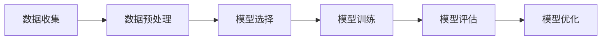

                 


# AI编程的新维度与新高度

> 关键词：人工智能，编程，深度学习，机器学习，NLP，计算机视觉，强化学习，GAN，迁移学习，模型压缩

> 摘要：本文将深入探讨AI编程的新维度与新高度，从基础到前沿技术，再到实际应用，全面解析AI编程的核心概念、原理和实践。我们将逐步介绍Python编程基础、机器学习与深度学习基础、自然语言处理与计算机视觉应用、强化学习，以及生成对抗网络（GAN）、迁移学习和模型压缩等前沿技术。通过案例分析，我们还将展示AI编程在金融、医疗健康和智能制造等领域的应用，并提供学习与实践建议。

### 目录大纲

#### 第一部分：引言与背景

1. **AI编程的新维度与新高度**
    1.1. **问题背景与意义**
    1.2. **发展历程与现状**
    1.3. **核心概念与关键要素**
    1.4. **学习目标与读者对象**

#### 第二部分：AI编程基础

2. **AI编程基础**
    2.1. **Python编程基础**
        2.1.1. **Python环境搭建**
        2.1.2. **Python语法基础**
        2.1.3. **Python数据类型与操作**
    2.2. **机器学习基础**
        2.2.1. **机器学习概述**
        2.2.2. **监督学习算法**
        2.2.3. **无监督学习算法**
    2.3. **深度学习基础**
        2.3.1. **深度学习概述**
        2.3.2. **神经网络与反向传播算法**
        2.3.3. **深度学习框架**

#### 第三部分：AI编程实战

3. **AI编程实战**
    3.1. **自然语言处理（NLP）应用**
        3.1.1. **文本分类**
        3.1.2. **情感分析**
        3.1.3. **命名实体识别**
    3.2. **计算机视觉应用**
        3.2.1. **图像分类**
        3.2.2. **目标检测**
        3.2.3. **图像分割**
    3.3. **强化学习应用**
        3.3.1. **基本概念与算法**
        3.3.2. **Q-Learning算法**
        3.3.3. **深度强化学习**

#### 第四部分：新高度

4. **新高度：前沿技术与趋势**
    4.1. **生成对抗网络（GAN）**
        4.1.1. **GAN的基本原理**
        4.1.2. **GAN的应用场景**
        4.1.3. **GAN的挑战与改进**
    4.2. **迁移学习与领域自适应**
        4.2.1. **迁移学习概述**
        4.2.2. **领域自适应方法**
        4.2.3. **迁移学习的挑战与展望**
    4.3. **模型压缩与量化**
        4.3.1. **模型压缩技术**
        4.3.2. **模型量化方法**
        4.3.3. **模型压缩的应用场景**

#### 第五部分：案例分析

5. **案例分析**
    5.1. **AI在金融领域的应用**
        5.1.1. **风险评估**
        5.1.2. **智能投顾**
        5.1.3. **量化交易**
    5.2. **AI在医疗健康领域的应用**
        5.2.1. **疾病诊断**
        5.2.2. **药物研发**
        5.2.3. **健康监测**
    5.3. **AI在智能制造领域的应用**
        5.3.1. **生产优化**
        5.3.2. **质量检测**
        5.3.3. **设备预测维护**

#### 第六部分：总结与展望

6. **总结与展望**
    6.1. **AI编程的发展趋势**
    6.2. **未来应用领域展望**
    6.3. **学习与实践建议**

#### 附录

7. **附录**
    7.1. **Python库与工具推荐**
    7.2. **参考资料与拓展阅读**
    7.3. **习题与实验指导**

----------------------------------------------------------------

### 第一部分：引言与背景

#### 1.1 问题背景与意义

人工智能（AI）作为计算机科学的一个重要分支，已经在过去的几十年中经历了快速的发展。随着计算能力的提升和大数据的积累，AI技术逐渐从理论研究走向了实际应用，渗透到我们的日常生活、工业生产和科学研究中。AI编程作为实现AI技术的重要手段，其重要性日益凸显。

AI编程的核心目标是通过编程实现人工智能算法，使其能够在不同领域中发挥作用。在金融、医疗、制造、交通等众多领域，AI编程的应用已经极大地提升了效率和准确性，创造了巨大的价值。例如，在金融领域，AI编程帮助银行和投资公司进行风险控制和投资决策；在医疗领域，AI编程用于疾病诊断和药物研发；在智能制造领域，AI编程则用于生产优化和设备维护。

随着AI技术的不断进步，AI编程也面临着新的挑战和机遇。新算法、新技术和新工具的涌现，为AI编程带来了新的维度和高度。如何高效地实现AI算法，如何将AI技术应用于实际问题，成为当前AI编程研究的重要方向。

#### 1.2 发展历程与现状

AI编程的发展历程可以分为几个阶段：

1. **早期探索阶段（1950s-1960s）**：这个阶段主要是基于规则和逻辑的编程，如专家系统的开发。虽然取得了初步成果，但由于规则库的规模庞大且难以维护，这个阶段的AI编程未能实现大规模应用。

2. **符号主义阶段（1970s-1980s）**：这个阶段引入了知识表示和推理技术，如谓词逻辑和产生式系统。符号主义AI编程在特定领域取得了成功，但受限于计算能力和算法复杂性，其应用范围有限。

3. **连接主义阶段（1990s-2000s）**：这个阶段以神经网络和机器学习为代表，通过大规模数据训练模型，实现了图像识别、语音识别等任务的突破。这一阶段的AI编程标志着AI技术从理论走向实际应用。

4. **深度学习时代（2010s至今）**：深度学习的兴起，使得AI编程进入了一个新的高度。深度神经网络通过多层抽象特征，实现了在语音、图像、自然语言处理等领域的突破性进展。当前的AI编程，深度学习技术已经成为不可或缺的工具。

#### 1.3 核心概念与关键要素

AI编程涉及多个核心概念和关键要素，以下是其中几个重要的概念：

1. **机器学习**：机器学习是AI编程的基础，它通过数据训练模型，使计算机具备自主学习和预测能力。主要分为监督学习、无监督学习和强化学习。

2. **深度学习**：深度学习是机器学习的一种，通过多层神经网络对数据进行特征提取和抽象，实现了复杂任务的自动完成。

3. **神经网络**：神经网络是深度学习的基础，由大量神经元（节点）通过加权连接构成，通过反向传播算法进行训练。

4. **自然语言处理（NLP）**：NLP是AI编程在语言领域的应用，涉及文本分类、情感分析、命名实体识别等任务。

5. **计算机视觉**：计算机视觉是AI编程在图像和视频领域的应用，包括图像分类、目标检测、图像分割等任务。

6. **强化学习**：强化学习是AI编程在决策和规划领域的应用，通过奖励机制训练模型，使其能够在特定环境中做出最优决策。

#### 1.4 学习目标与读者对象

本文旨在为AI编程初学者和从业者提供全面的指导和参考。学习目标包括：

1. 掌握Python编程基础，为AI编程打下扎实基础。
2. 理解机器学习、深度学习等核心概念，掌握常见算法原理。
3. 掌握自然语言处理、计算机视觉等实际应用，了解前沿技术。
4. 通过案例分析，了解AI编程在各个领域的应用。

本文适合以下读者群体：

1. AI编程初学者，希望系统学习AI编程知识。
2. AI从业者，希望提升自身技能和项目实践能力。
3. 对AI技术感兴趣的科研人员和技术爱好者。

通过本文的学习，读者将能够：

1. 理解AI编程的核心概念和原理。
2. 掌握Python编程和常见AI算法的实现。
3. 了解AI编程在不同领域的应用。
4. 为进一步学习和实践AI编程奠定基础。

----------------------------------------------------------------

### 第二部分：AI编程基础

#### 2.1 Python编程基础

Python作为一种高级编程语言，因其简洁易读的语法和强大的库支持，成为了AI编程的常用语言之一。本节将介绍Python编程的基础知识，包括环境搭建、语法基础和数据类型。

##### 2.1.1 Python环境搭建

要开始使用Python进行AI编程，首先需要搭建Python环境。以下是在常见操作系统上安装Python的步骤：

1. **Windows系统**：

   - 访问Python官方网站（https://www.python.org/）下载Windows安装程序。
   - 运行安装程序，按照默认选项安装。
   - 安装完成后，打开命令行窗口，输入`python`或`python3`，如果出现版本信息，说明安装成功。

2. **macOS系统**：

   - macOS系统通常自带Python，可以通过终端检查版本，如果没有，可以使用Homebrew安装。
   - 打开终端，输入以下命令：

     ```bash
     /bin/bash -c "$(curl -fsSL https://raw.githubusercontent.com/Homebrew/install/HEAD/install.sh)"
     ```

   - 安装完成后，输入`brew install python`安装Python。

3. **Linux系统**：

   - 对于基于Debian的系统（如Ubuntu），可以使用以下命令安装：

     ```bash
     sudo apt-get update
     sudo apt-get install python3
     ```

   - 对于基于Red Hat的系统（如Fedora），可以使用以下命令安装：

     ```bash
     sudo dnf install python3
     ```

##### 2.1.2 Python语法基础

Python的语法简洁明了，易于学习。以下是Python的一些基础语法：

1. **变量与数据类型**：

   - Python中的变量不需要显式声明类型，变量会根据赋值自动推断类型。
   - 常见数据类型包括整数（int）、浮点数（float）、字符串（str）、布尔值（bool）等。

     ```python
     a = 1          # 整数
     b = 1.0        # 浮点数
     c = "hello"    # 字符串
     d = True       # 布尔值
     ```

2. **控制流**：

   - Python支持常见的控制流语句，如条件语句（if-elif-else）和循环语句（for、while）。

     ```python
     if a > b:
         print("a 大于 b")
     elif a < b:
         print("a 小于 b")
     else:
         print("a 等于 b")

     for i in range(5):
         print(i)

     while b > 0:
         print(b)
         b -= 1
     ```

3. **函数**：

   - Python中的函数是组织代码的重要方式，可以定义和调用自定义函数。

     ```python
     def greet(name):
         print("Hello, " + name)

     greet("Alice")
     greet("Bob")
     ```

4. **模块与包**：

   - Python的模块和包提供了丰富的库，方便开发者使用预定义的函数和类。

     ```python
     import math
     print(math.sqrt(16))

     from datetime import datetime
     now = datetime.now()
     print(now)
     ```

##### 2.1.3 Python数据类型与操作

Python支持多种数据类型，包括数字、字符串、列表、元组、字典和集合。以下是这些数据类型的基本操作：

1. **数字**：

   - Python中的数字类型包括整数和浮点数。

     ```python
     a = 10
     b = 3.14
     ```

   - 常见操作包括加、减、乘、除和取余。

     ```python
     sum = a + b
     diff = a - b
     prod = a * b
     quot = a / b
     rem = a % b
     ```

2. **字符串**：

   - 字符串是Python中的序列数据类型，用于表示文本。

     ```python
     text = "Hello, World!"
     ```

   - 常见操作包括连接、切片、索引和长度。

     ```python
     new_text = text + " Python"
     sub_text = text[7:12]
     index = text.find("Python")
     length = len(text)
     ```

3. **列表**：

   - 列表是Python中的可变序列数据类型，用于存储一系列元素。

     ```python
     list = [1, 2, 3, 4, 5]
     ```

   - 常见操作包括添加、删除、查找和排序。

     ```python
     list.append(6)
     list.remove(1)
     index = list.index(3)
     list.sort()
     ```

4. **元组**：

   - 元组是Python中的不可变序列数据类型，用于存储一系列元素。

     ```python
     tuple = (1, 2, 3, 4, 5)
     ```

   - 常见操作包括切片和索引。

     ```python
     sub_tuple = tuple[1:3]
     index = tuple.index(3)
     ```

5. **字典**：

   - 字典是Python中的键值对数据结构，用于存储非顺序的数据。

     ```python
     dict = {"name": "Alice", "age": 30}
     ```

   - 常见操作包括添加、删除、查找和遍历。

     ```python
     dict["email"] = "alice@example.com"
     del dict["age"]
     value = dict["name"]
     for key, value in dict.items():
         print(key, value)
     ```

6. **集合**：

   - 集合是Python中的无序数据集合，用于存储独特的元素。

     ```python
     set = {1, 2, 3, 4, 5}
     ```

   - 常见操作包括添加、删除、查找和交集、并集、差集。

     ```python
     set.add(6)
     set.remove(1)
     member = 2 in set
     intersection = set.intersection({1, 2, 3})
     union = set.union({4, 5, 6})
     difference = set.difference({1, 2})
     ```

通过以上对Python编程基础的了解，读者可以开始学习AI编程，为后续的机器学习和深度学习打下坚实的基础。

----------------------------------------------------------------

### 第二部分：AI编程基础（续）

#### 2.2 机器学习基础

机器学习（Machine Learning，ML）是AI编程的核心组成部分，其目标是通过数据训练模型，使计算机能够从数据中自动学习和发现规律。本节将介绍机器学习的基础知识，包括监督学习、无监督学习和强化学习。

##### 2.2.1 机器学习概述

机器学习的基本思想是通过算法从数据中学习规律，进而对未知数据进行预测或分类。机器学习过程可以分为以下几个步骤：

1. **数据收集**：收集用于训练和测试的数据集。
2. **数据预处理**：清洗和转换数据，使其适合于模型训练。
3. **模型选择**：选择合适的算法和模型。
4. **模型训练**：使用训练数据集训练模型。
5. **模型评估**：使用测试数据集评估模型性能。
6. **模型优化**：根据评估结果调整模型参数，优化模型性能。

机器学习的基本流程如图2.1所示：



##### 2.2.2 监督学习算法

监督学习（Supervised Learning）是一种最常见的机器学习形式，其特点是模型在训练过程中已经知道输入和对应的输出，通过学习输入和输出之间的映射关系，实现对未知数据的预测。

1. **线性回归**（Linear Regression）

   线性回归是最简单的监督学习算法，它假设输入和输出之间存在线性关系。线性回归的目标是最小化预测值与真实值之间的误差。

   - **数学模型**：

     $$ y = w_0 + w_1 \cdot x $$

   - **损失函数**：均方误差（Mean Squared Error，MSE）

     $$ J(w_0, w_1) = \frac{1}{2m} \sum_{i=1}^{m} (y_i - (w_0 + w_1 \cdot x_i))^2 $$

   - **优化算法**：梯度下降（Gradient Descent）

     $$ w_0 = w_0 - \alpha \frac{\partial J}{\partial w_0} $$
     $$ w_1 = w_1 - \alpha \frac{\partial J}{\partial w_1} $$

   - **实例**：预测房价。

2. **逻辑回归**（Logistic Regression）

   逻辑回归是线性回归在分类问题中的应用，其目标是将输入映射到概率空间。

   - **数学模型**：

     $$ \hat{y} = \frac{1}{1 + e^{-(w_0 + w_1 \cdot x)}} $$

   - **损失函数**：对数似然损失（Log-Likelihood Loss）

     $$ J(w_0, w_1) = -\frac{1}{m} \sum_{i=1}^{m} [y_i \cdot \ln(\hat{y}_i) + (1 - y_i) \cdot \ln(1 - \hat{y}_i)] $$

   - **优化算法**：梯度下降

   - **实例**：二分类问题，如邮件分类。

3. **决策树**（Decision Tree）

   决策树是一种基于树形结构进行决策的监督学习算法，其核心思想是通过一系列规则将数据集划分成不同的区域，每个区域对应一个标签。

   - **构建过程**：

     - 计算每个特征的信息增益或基尼不纯度。
     - 选择信息增益最大或基尼不纯度最小的特征作为分割条件。
     - 根据分割条件将数据集划分成子集。
     - 递归地重复上述过程，直到满足停止条件。

   - **优点**：易于理解，解释性强。
   - **缺点**：过拟合风险高，难以处理高维数据。

4. **支持向量机**（Support Vector Machine，SVM）

   支持向量机是一种用于分类和回归的监督学习算法，其目标是找到一个最佳的超平面，将不同类别的数据分开。

   - **数学模型**：

     $$ \max_{w, b} \frac{1}{2} ||w||^2 $$
     $$ s.t. y_i (w \cdot x_i + b) \geq 1 $$

   - **优化算法**：拉格朗日乘子法

   - **核函数**：用于在高维空间中找到最佳超平面。

   - **实例**：图像分类。

##### 2.2.3 无监督学习算法

无监督学习（Unsupervised Learning）与监督学习不同，其输入数据没有标签，模型需要通过学习数据自身的结构和规律进行分类或聚类。

1. **聚类算法**（Clustering Algorithms）

   聚类算法是将数据集划分为多个群组，使得属于同一群组的元素之间相似度较高，而不同群组的元素之间相似度较低。

   - **K-均值聚类**（K-Means Clustering）

     - **目标**：最小化簇内距离平方和。

       $$ \min_{\mu_k, \sigma_k} \sum_{i=1}^{k} \sum_{x_i \in S_k} ||x_i - \mu_k||^2 $$

     - **算法步骤**：

       1. 随机初始化中心点。
       2. 计算每个点到中心点的距离，将其分配到最近的中心点所在的簇。
       3. 更新中心点的位置。
       4. 重复步骤2和3，直到中心点的位置不再发生变化。

   - **层次聚类**（Hierarchical Clustering）

     - **目标**：构建一棵层次树，将数据集划分为多个层次。

       - **层次分类**：凝聚聚类（自底向上）和分裂聚类（自顶向下）。

   - **基于密度的聚类**（Density-Based Clustering）

     - **DBSCAN**（Density-Based Spatial Clustering of Applications with Noise）

       - **目标**：基于数据点密度的聚类。

       - **算法步骤**：

         1. 初始化一个未分类的数据集。
         2. 对于每个未分类的数据点，检查其邻域内点的密度。
         3. 根据邻域内点的密度将数据点划分为核心点、边界点和噪声点。
         4. 构建簇，将核心点和其邻域内的点归为同一簇。

2. **降维算法**（Dimensionality Reduction）

   降维算法是将高维数据映射到低维空间，减少数据维度，同时保留重要信息。

   - **主成分分析**（Principal Component Analysis，PCA）

     - **目标**：找到数据的主要特征，并投影到新的低维空间中。

       - **算法步骤**：

         1. 计算协方差矩阵。
         2. 计算协方差矩阵的特征值和特征向量。
         3. 选择最大的特征值对应的特征向量作为新的特征。
         4. 将数据投影到新的特征空间中。

   - **t-SNE**（t-Distributed Stochastic Neighbor Embedding）

     - **目标**：在高维空间中找到数据点的局部结构，并在低维空间中保持相似性。

       - **算法步骤**：

         1. 计算数据点之间的相似性矩阵。
         2. 将相似性矩阵转化为高斯分布。
         3. 使用梯度下降优化目标函数，最小化重构误差。

##### 2.2.4 强化学习算法

强化学习（Reinforcement Learning，RL）是一种通过与环境的交互来学习决策策略的机器学习形式。其目标是在一系列状态中，通过选择最优动作，最大化累积奖励。

1. **基本概念**

   - **状态**（State）：环境中的一个特定情况。
   - **动作**（Action）：在特定状态下可以采取的行动。
   - **奖励**（Reward）：动作执行后获得的即时反馈。
   - **策略**（Policy）：决策模型，决定在特定状态下采取哪个动作。

2. **Q-Learning算法**

   Q-Learning算法是一种基于值函数的强化学习算法，其核心思想是通过学习状态-动作值函数来选择最优动作。

   - **数学模型**：

     $$ Q(s, a) = \sum_{r \in R} r \cdot P(r|s, a) + \gamma \cdot \max_{a'} Q(s', a') $$

   - **算法步骤**：

     1. 初始化Q值矩阵。
     2. 选择动作$a$，执行动作并观察状态$s'$和奖励$r$。
     3. 更新Q值：

        $$ Q(s, a) = Q(s, a) + \alpha \cdot (r + \gamma \cdot \max_{a'} Q(s', a') - Q(s, a)) $$

     4. 转移到下一个状态$s'$。
     5. 重复步骤2-4，直到达到目标或满足停止条件。

3. **深度强化学习**

   深度强化学习（Deep Reinforcement Learning，DRL）是将深度学习与强化学习结合的一种方法，通过深度神经网络来学习状态-动作值函数。

   - **算法**：深度Q网络（Deep Q-Network，DQN）
   - **目标**：通过经验回放和目标网络来改善Q值学习。

通过以上对机器学习基础的了解，读者可以开始学习如何使用Python实现不同的机器学习算法，并应用于实际问题。在后续章节中，我们将进一步探讨深度学习、自然语言处理和计算机视觉等AI编程的高级技术。

----------------------------------------------------------------

### 第三部分：AI编程实战

#### 3.1 自然语言处理（NLP）应用

自然语言处理（Natural Language Processing，NLP）是人工智能的重要分支，它旨在使计算机能够理解、生成和处理自然语言。在NLP领域中，常见的应用包括文本分类、情感分析和命名实体识别。以下将详细讨论这些应用。

##### 3.1.1 文本分类

文本分类（Text Classification）是一种将文本数据按照预定的类别进行分类的技术。常见的文本分类任务包括垃圾邮件检测、新闻分类和情感分类等。

1. **数据预处理**：

   - **分词**（Tokenization）：将文本拆分成单词或短语。
   - **去除停用词**（Stopword Removal）：去除常用的无意义词汇。
   - **词形还原**（Lemmatization）：将不同形式的单词还原为基本形式。

2. **特征提取**：

   - **词袋模型**（Bag of Words，BOW）：将文本表示为单词的向量。
   - **TF-IDF**（Term Frequency-Inverse Document Frequency）：考虑单词在文档中的频率和文档集中的稀有度。

3. **模型训练**：

   - **朴素贝叶斯分类器**（Naive Bayes Classifier）：基于贝叶斯定理的简单分类器。
   - **支持向量机**（Support Vector Machine，SVM）：基于最大化分类间隔的线性分类器。
   - **随机森林**（Random Forest）：基于决策树的集成学习方法。

4. **实例**：

   - **垃圾邮件检测**：使用文本分类技术检测电子邮件是否为垃圾邮件。

##### 3.1.2 情感分析

情感分析（Sentiment Analysis）是一种分析文本中情感倾向的技术，通常用于评估用户对产品、服务或事件的情感态度。情感分析可以分为两类：基于规则的方法和基于机器学习的方法。

1. **基于规则的方法**：

   - **词典法**：使用预定义的词典来匹配情感词汇。
   - **规则法**：根据语言结构和词汇组合构建规则。

2. **基于机器学习的方法**：

   - **特征工程**：提取文本中的特征，如词袋模型、TF-IDF等。
   - **模型训练**：使用监督学习方法训练情感分类器。

3. **实例**：

   - **社交媒体情感分析**：分析社交媒体用户对某个话题或产品的情感倾向。

##### 3.1.3 命名实体识别

命名实体识别（Named Entity Recognition，NER）是一种识别文本中的命名实体（如人名、地名、组织名等）的技术。NER在信息提取、实体关系抽取和文本分析等领域有广泛应用。

1. **数据预处理**：

   - **分词**：将文本拆分成单词或短语。
   - **词性标注**：标注每个单词的词性。

2. **特征提取**：

   - **词袋模型**：将文本表示为单词的向量。
   - **序列标注**：将文本序列表示为实体序列。

3. **模型训练**：

   - **CRF（条件随机场）**：一种用于序列标注的统计模型。
   - **BiLSTM-CRF**：结合双向长短时记忆网络和CRF的端到端模型。

4. **实例**：

   - **新闻标题命名实体识别**：识别新闻标题中的人名、地名和组织名。

通过以上对自然语言处理（NLP）应用的讨论，读者可以了解到如何使用Python和相关库（如NLTK、spaCy和TensorFlow）实现文本分类、情感分析和命名实体识别等任务。在接下来的章节中，我们将继续探讨计算机视觉和强化学习等AI编程领域的应用。

----------------------------------------------------------------

### 第三部分：AI编程实战（续）

#### 3.2 计算机视觉应用

计算机视觉（Computer Vision，CV）是人工智能的一个重要分支，它使计算机能够像人类一样“看”和理解图像和视频。计算机视觉应用广泛，包括图像分类、目标检测和图像分割等。以下将详细讨论这些应用。

##### 3.2.1 图像分类

图像分类（Image Classification）是一种将图像划分为预定义类别的方法。常见的图像分类任务包括植物分类、动物分类和物体识别等。

1. **数据预处理**：

   - **图像缩放**：将图像缩放到固定的尺寸。
   - **归一化**：将图像的像素值标准化到相同的范围。

2. **特征提取**：

   - **传统方法**：使用SIFT、HOG等特征提取技术。
   - **深度学习方法**：使用卷积神经网络（CNN）自动提取图像特征。

3. **模型训练**：

   - **卷积神经网络**（CNN）：一种专门用于图像处理的前馈神经网络。
   - **迁移学习**：使用预训练的模型，只需在特定任务上微调。

4. **评估**：

   - **准确率**（Accuracy）：正确分类的样本数占总样本数的比例。
   - **召回率**（Recall）：正确分类的正样本数占总正样本数的比例。
   - **精确率**（Precision）：正确分类的正样本数占总分类为正样本数的比例。

5. **实例**：

   - **植物分类**：将图像分类为不同的植物种类。

##### 3.2.2 目标检测

目标检测（Object Detection）是一种在图像中识别和定位多个对象的技术。目标检测在自动驾驶、视频监控和医疗图像分析等领域有广泛应用。

1. **数据预处理**：

   - **图像缩放和裁剪**：调整图像大小和形状。
   - **数据增强**：通过旋转、翻转、缩放等操作增加数据多样性。

2. **特征提取**：

   - **深度学习方法**：使用卷积神经网络提取图像特征。

3. **模型训练**：

   - **R-CNN系列**：基于区域提议（Region Proposal）的卷积神经网络。
   - **Faster R-CNN**：使用区域提议网络（Region Proposal Network）简化模型。
   - **RetinaNet**：结合了Focal Loss改善对难分类样本的训练。

4. **评估**：

   - **平均精度（mAP）**：在所有类别和IoU阈值下计算的平均精度。
   - **交并比（IoU）**：预测框与真实框重叠部分占真实框面积的比例。

5. **实例**：

   - **自动驾驶车辆检测**：在视频中检测行驶的车辆。

##### 3.2.3 图像分割

图像分割（Image Segmentation）是一种将图像划分为多个区域或对象的技术。图像分割在医学图像分析、图像去噪和图像合成等领域有广泛应用。

1. **数据预处理**：

   - **图像缩放和裁剪**：调整图像大小和形状。
   - **预处理**：如去噪、增强等。

2. **特征提取**：

   - **深度学习方法**：使用卷积神经网络提取图像特征。

3. **模型训练**：

   - **FCN（全卷积网络）**：使用卷积层将输入图像直接映射到分割图。
   - **U-Net**：一种基于卷积神经网络的结构，特别适用于医学图像分割。
   - **DeepLabV3+**：结合了深度可分离卷积和上采样技术，提高分割精度。

4. **评估**：

   - **交并比（IoU）**：预测区域与真实区域重叠部分占真实区域面积的比例。
   - **Dice系数**：结合IoU和区域大小，衡量分割精度。

5. **实例**：

   - **医学图像分割**：将图像分割为肿瘤区域和正常区域。

通过以上对计算机视觉应用的讨论，读者可以了解到如何使用Python和相关库（如TensorFlow、PyTorch和OpenCV）实现图像分类、目标检测和图像分割等任务。在接下来的章节中，我们将继续探讨强化学习和其他前沿技术。

----------------------------------------------------------------

### 第三部分：AI编程实战（续）

#### 3.3 强化学习应用

强化学习（Reinforcement Learning，RL）是一种通过试错和反馈来学习如何在不同环境中做出最优决策的机器学习方法。强化学习广泛应用于游戏、自动驾驶、推荐系统和机器人控制等领域。以下将详细讨论强化学习的基本概念、Q-Learning算法以及深度强化学习。

##### 3.3.1 基本概念

1. **状态（State）**：环境中的一个特定情况。
2. **动作（Action）**：在特定状态下可以采取的行动。
3. **奖励（Reward）**：动作执行后获得的即时反馈，通常用于评估决策的好坏。
4. **策略（Policy）**：决策模型，决定在特定状态下采取哪个动作。
5. **价值函数（Value Function）**：评估状态或状态-动作对的预期回报。
6. **模型（Model）**：对环境动态的建模，用于预测未来的状态和奖励。

##### 3.3.2 Q-Learning算法

Q-Learning算法是一种基于值函数的强化学习算法，其核心思想是通过学习状态-动作值函数来选择最优动作。

1. **数学模型**：

   $$ Q(s, a) = \sum_{r \in R} r \cdot P(r|s, a) + \gamma \cdot \max_{a'} Q(s', a') $$

   其中，$Q(s, a)$ 表示状态 $s$ 下采取动作 $a$ 的预期回报，$r$ 表示即时奖励，$P(r|s, a)$ 表示在状态 $s$ 下采取动作 $a$ 后获得奖励 $r$ 的概率，$\gamma$ 是折扣因子，$s'$ 是下一状态，$a'$ 是下一动作。

2. **算法步骤**：

   - 初始化Q值矩阵。
   - 在当前状态下随机选择动作。
   - 执行动作并观察下一状态和奖励。
   - 更新Q值：

     $$ Q(s, a) = Q(s, a) + \alpha \cdot (r + \gamma \cdot \max_{a'} Q(s', a') - Q(s, a)) $$

   - 转移到下一个状态，重复步骤3-5，直到达到目标或满足停止条件。

3. **实例**：

   - **迷宫问题**：使用Q-Learning算法找到迷宫中的最优路径。

##### 3.3.3 深度强化学习

深度强化学习（Deep Reinforcement Learning，DRL）是将深度学习与强化学习结合的一种方法，通过深度神经网络来学习状态-动作值函数。

1. **深度Q网络（Deep Q-Network，DQN）**

   DQN是一种基于深度神经网络的Q-Learning算法，通过经验回放和目标网络来改善Q值学习。

   - **经验回放**：将之前的状态、动作和奖励存储在一个经验池中，然后随机抽样用于训练，以避免策略偏差。
   - **目标网络**：定期更新目标网络，以减少Q值估计的误差。

2. **策略梯度方法**

   策略梯度方法直接优化策略，通过计算策略梯度和更新策略参数。

   - **策略网络**：用于生成动作的神经网络。
   - **策略梯度**：

     $$ \nabla_\theta J(\theta) = \nabla_\theta \sum_{t} \rho(s_t, a_t) \cdot \log \pi(a_t|s_t, \theta) $$

   - **优化算法**：梯度上升或Adam优化器。

3. **实例**：

   - **Atari游戏**：使用深度强化学习算法训练智能体在Atari游戏中取得高水平表现。

通过以上对强化学习应用的讨论，读者可以了解到如何使用Python和相关库（如TensorFlow和PyTorch）实现Q-Learning算法和深度强化学习。强化学习在解决实际问题中具有广泛的应用前景，特别是在决策和规划领域。

----------------------------------------------------------------

### 第四部分：新高度

#### 4.1 生成对抗网络（GAN）

生成对抗网络（Generative Adversarial Networks，GAN）是由Ian Goodfellow等人于2014年提出的一种深度学习模型，它通过两个相互对抗的神经网络——生成器（Generator）和判别器（Discriminator）——来学习数据的概率分布。GAN在生成图像、音频和文本数据等方面取得了显著成果，被认为是当前生成模型领域最具创新性的技术之一。

##### 4.1.1 GAN的基本原理

GAN由两个神经网络组成：生成器和判别器。生成器的任务是生成尽可能逼真的数据，而判别器的任务是区分真实数据和生成数据。这两个网络在训练过程中相互对抗，最终生成器能够生成接近真实数据的高质量样本。

1. **生成器（Generator）**

   生成器的目标是将随机噪声（例如从高斯分布中抽取的向量）转换成类似于真实数据的样本。生成器通常是一个全连接的神经网络，其输入是随机噪声，输出是生成数据。

   $$ G(z) = \mu(z) + \sigma(z) \odot \epsilon $$
   
   其中，$z$是输入噪声，$\mu(z)$和$\sigma(z)$分别是生成数据的均值和方差，$\epsilon$是噪声向量。

2. **判别器（Discriminator）**

   判别器的目标是判断输入数据是真实数据还是生成数据。判别器通常也是一个全连接的神经网络，其输入是数据样本，输出是概率值，表示输入数据是真实数据的概率。

   $$ D(x) = \sigma(\phi(x; \theta_D)) $$
   
   其中，$x$是真实数据或生成数据，$\phi(x; \theta_D)$是判别器的输出，$\theta_D$是判别器的参数。

3. **损失函数**

   GAN的训练过程是一个零和博弈，生成器和判别器相互竞争。生成器的损失函数是使判别器错误分类生成数据，而判别器的损失函数是正确分类真实数据和生成数据。

   生成器的损失函数：

   $$ L_G = -\mathbb{E}_{z \sim z(\epsilon)}[\log D(G(z))] $$

   判别器的损失函数：

   $$ L_D = -\mathbb{E}_{x \sim x(\theta)}[\log D(x)] - \mathbb{E}_{z \sim z(\epsilon)}[\log (1 - D(G(z))] $$

   其中，$x(\theta)$表示真实数据分布。

4. **训练过程**

   GAN的训练过程如下：

   - 初始化生成器和判别器的参数。
   - 随机生成噪声向量$z$，通过生成器生成样本$G(z)$。
   - 判别器根据真实数据和生成数据更新参数。
   - 生成器根据判别器的损失函数更新参数。
   - 重复上述步骤，直到生成器能够生成高质量的数据样本。

##### 4.1.2 GAN的应用场景

GAN在各种应用场景中展现了强大的能力，以下是一些常见的应用：

1. **图像生成**：

   - **人脸生成**：生成逼真的人脸图像，如生成虚拟角色或人脸动画。
   - **图像修复**：修复损坏或模糊的图像，如修复老照片或去除图像中的噪声。
   - **超分辨率**：将低分辨率图像放大为高分辨率图像，提高图像质量。

2. **图像编辑**：

   - **图像风格迁移**：将一种图像的风格应用到另一种图像上，如将普通照片转化为艺术画作。
   - **图像合成**：将多个图像组合成一个新的图像，如合成人脸、风景和城市等元素。

3. **图像生成对抗测试（IGAT）**：

   - **对抗性攻击**：生成对抗性样本来测试系统的鲁棒性，如对抗性样本用于网络安全和自动驾驶。
   - **隐私保护**：生成模糊的图像以保护个人隐私。

##### 4.1.3 GAN的挑战与改进

尽管GAN在生成高质量数据方面表现出色，但仍面临一些挑战和问题：

1. **模式崩溃（Mode Collapse）**：

   - **问题**：生成器倾向于生成最有可能的数据模式，而不是多样化的数据。
   - **解决方案**：引入额外的正则化项，如梯度惩罚、条件GAN（cGAN）和基于熵的正则化。

2. **训练不稳定**：

   - **问题**：GAN的训练过程不稳定，可能导致生成器或判别器的参数失效。
   - **解决方案**：使用稳定的学习率、梯度惩罚和自适应优化器。

3. **计算资源消耗**：

   - **问题**：GAN的训练需要大量的计算资源，特别是在生成高分辨率图像时。
   - **解决方案**：使用更高效的算法和模型结构，如生成对抗网络变体（如Wasserstein GAN，WGAN）。

通过以上对GAN的讨论，读者可以了解到GAN的基本原理和应用场景，以及其在图像生成和编辑方面的优势和挑战。在未来的研究中，GAN将继续发展和改进，为AI编程带来新的维度和高度。

----------------------------------------------------------------

### 第四部分：新高度

#### 4.2 迁移学习与领域自适应

迁移学习（Transfer Learning）和领域自适应（Domain Adaptation）是近年来在机器学习领域受到广泛关注的技术，它们通过利用现有知识来提高新任务的学习性能。在资源受限的情况下，这些技术能够显著提高模型的泛化能力和效率。

##### 4.2.1 迁移学习概述

迁移学习的核心思想是将在一个任务上学习到的知识（如特征表示或模型参数）迁移到另一个相关任务上。迁移学习可以分为几种不同的类型：

1. **垂直迁移**（Vertical Transfer）

   垂直迁移发生在任务领域不同但数据分布相似的情况下。例如，在图像分类和文本分类之间进行迁移。

2. **水平迁移**（Horizontal Transfer）

   水平迁移发生在任务领域相似但数据分布不同的情况下。例如，在两个不同数据集上的同一图像分类任务之间进行迁移。

3. **跨域迁移**（Cross-Domain Transfer）

   跨域迁移涉及将知识从一个领域迁移到另一个截然不同的领域。例如，将图像分类模型的知识迁移到音频分类任务。

4. **零样本迁移**（Zero-Shot Transfer）

   零样本迁移指的是在没有看到新类别的示例的情况下，将知识迁移到新类别。

##### 4.2.2 领域自适应方法

领域自适应（Domain Adaptation）旨在减少源领域和目标领域之间的差异，以提高模型在目标领域上的性能。领域自适应方法可以分为以下几种：

1. **一致性正则化**（Consistency Regularization）

   一致性正则化通过最小化源领域和目标领域上的模型预测差异来减少领域差距。常见的方法包括最大均值差异（MMD）和领域差距最小化（Domain Gap Minimization）。

2. **谱归一化**（SpectralNormalization）

   谱归一化通过调整神经网络的权重矩阵的谱范数，使网络在训练过程中保持稳定的梯度，从而减少领域差异。

3. **多任务学习**（Multi-Task Learning）

   多任务学习通过同时训练多个相关任务来提高模型在不同领域上的泛化能力。这种方法通过共享模型参数来学习共同的特征表示。

4. **自监督学习**（Self-Supervised Learning）

   自监督学习利用无标签数据通过预训练模型来学习有用的特征表示，然后在目标领域上进行微调。

##### 4.2.3 迁移学习的挑战与展望

尽管迁移学习在许多任务上取得了显著的成功，但仍然面临一些挑战：

1. **领域差距**（Domain Gap）

   领域差距是指源领域和目标领域之间的差异。减少领域差距是迁移学习的核心问题。

2. **数据分布差异**（Data Distribution Shift）

   数据分布差异会导致模型在源领域上表现良好，但在目标领域上表现不佳。解决数据分布差异是迁移学习的一个重要方向。

3. **计算资源限制**（Computational Resource Constraints）

   迁移学习通常需要大量的计算资源，特别是在训练复杂的深度神经网络时。

未来的研究将集中在以下几个方面：

1. **高效算法**：开发更高效的迁移学习算法，以减少训练时间和计算资源消耗。

2. **自适应方法**：设计自适应的迁移学习方法，以适应不断变化的领域差距和数据分布差异。

3. **跨领域迁移**：研究如何在完全不同的领域之间进行迁移学习，以提高模型的泛化能力。

4. **解释性**：提高迁移学习算法的可解释性，以更好地理解模型如何在不同领域之间转移知识。

通过以上对迁移学习和领域自适应的讨论，读者可以了解到这些技术在AI编程中的应用和挑战，以及未来的研究方向。迁移学习和领域自适应将在未来的AI发展中扮演越来越重要的角色。

----------------------------------------------------------------

### 第四部分：新高度

#### 4.3 模型压缩与量化

随着深度学习模型的复杂度和参数规模不断增加，模型压缩与量化技术成为了提高模型性能和降低计算资源消耗的关键方法。本节将介绍模型压缩与量化的基本原理、常见技术及其应用场景。

##### 4.3.1 模型压缩技术

模型压缩（Model Compression）旨在减少深度学习模型的大小，同时保持模型性能。常见的模型压缩技术包括以下几种：

1. **剪枝（Pruning）**

   剪枝技术通过删除模型中不重要的权重来减少模型大小。剪枝方法可以分为结构剪枝和权重剪枝：

   - **结构剪枝**：删除整个网络层或神经元。
   - **权重剪枝**：只删除权重较小的神经元或边。

   剪枝方法能够显著减少模型参数的数量，从而降低计算和存储需求。

2. **量化（Quantization）**

   量化技术通过将浮点数权重转换为低精度的整数来减少模型大小。量化方法包括全量化（Full Quantization）和部分量化（Partial Quantization）：

   - **全量化**：将所有权重和激活值都量化为固定位数的整数。
   - **部分量化**：只量化权重或激活值中的部分。

   量化可以显著减少模型大小，同时保持较低的精度损失。

3. **知识蒸馏（Knowledge Distillation）**

   知识蒸馏（Knowledge Distillation）是一种将大型教师模型的知识传递给小型学生模型的方法。教师模型通常是一个复杂的深度学习模型，而学生模型是一个较小的简化模型。通过学习教师模型的输出分布，学生模型能够获得教师模型的优点，同时减少模型大小。

##### 4.3.2 模型量化方法

量化方法包括静态量化和动态量化：

1. **静态量化（Static Quantization）**

   静态量化在模型训练过程中将权重和激活值量化为固定的整数。静态量化方法简单，但可能引入量化误差。

2. **动态量化（Dynamic Quantization）**

   动态量化在模型训练过程中将权重和激活值量化为动态的整数。动态量化通过在每个训练步骤中计算权重和激活值的范围，从而减少量化误差。

   动态量化方法包括：

   - **层次量化**（Hierarchical Quantization）：将高精度浮点数权重逐步量化为低精度整数。
   - **块量化**（Block Quantization）：将模型分成多个块，对每个块分别量化。

##### 4.3.3 模型压缩的应用场景

模型压缩技术在多种应用场景中具有广泛的应用：

1. **移动设备和嵌入式系统**：

   在移动设备和嵌入式系统中，计算和存储资源有限，模型压缩技术能够显著降低模型大小，提高设备性能。

2. **实时推理**：

   在需要实时推理的应用中，如自动驾驶和机器人控制，模型压缩技术能够减少推理时间，提高系统的响应速度。

3. **云计算**：

   在云计算环境中，模型压缩技术可以通过减少模型传输和存储的需求，提高服务器性能和能效。

4. **边缘计算**：

   在边缘计算场景中，模型压缩技术能够降低模型传输和存储的需求，减少网络带宽和计算资源消耗。

通过以上对模型压缩与量化的讨论，读者可以了解到这些技术在AI编程中的应用和优势，以及如何在实际项目中应用这些技术。模型压缩与量化将在未来的AI发展中发挥重要作用，推动深度学习技术的广泛应用。

----------------------------------------------------------------

### 第五部分：案例分析

#### 5.1 AI在金融领域的应用

人工智能（AI）在金融领域中的应用日益广泛，它通过自动化分析和预测，提高了金融服务的效率和准确性。以下将讨论AI在金融领域的几个重要应用，包括风险评估、智能投顾和量化交易。

##### 5.1.1 风险评估

风险评估是金融领域的一项核心任务，它涉及对市场风险、信用风险、操作风险等多种风险的识别、评估和管理。AI技术在风险评估中发挥了重要作用，具体应用如下：

1. **大数据分析**：

   AI能够处理和分析大量金融数据，如历史价格、交易量、新闻文本等，从中提取有价值的信息。通过机器学习算法，可以建立预测模型，预测市场趋势和风险。

2. **特征工程**：

   特征工程是风险评估的关键步骤，它涉及从原始数据中提取有助于预测风险的变量。AI可以通过自动化特征选择和生成，提高特征提取的效率和准确性。

3. **模型选择与优化**：

   AI技术提供了多种机器学习模型，如回归模型、决策树、神经网络等，可以根据不同的风险类型和业务需求选择合适的模型。通过交叉验证和超参数调优，可以优化模型的性能。

4. **实时监控**：

   AI系统可以实时监控市场数据，对风险进行动态评估和预警。例如，使用强化学习算法，可以动态调整投资策略，以应对市场变化。

##### 5.1.2 智能投顾

智能投顾（Robo-Advisor）是一种基于AI技术的自动化投资咨询服务，它通过量化分析投资者的风险偏好和财务目标，提供个性化的投资建议。智能投顾的关键应用包括：

1. **用户画像**：

   智能投顾首先需要了解投资者的风险承受能力、投资目标和时间范围，通过问卷和数据分析建立用户的个性化画像。

2. **投资策略**：

   根据用户的个性化画像，智能投顾可以推荐多种投资策略，如低风险债券投资、中等风险股票投资等。通过机器学习算法，可以不断优化投资策略，以适应市场变化。

3. **风险控制**：

   智能投顾通过实时监控投资组合，自动调整投资比例，以控制风险。例如，当市场波动较大时，可以适当降低股票投资比例，增加债券投资比例。

4. **投资建议**：

   智能投顾可以定期为投资者提供投资建议，包括买卖股票、调整投资组合等。通过自然语言处理技术，可以将复杂的数据分析结果转化为通俗易懂的投资建议。

##### 5.1.3 量化交易

量化交易是一种基于数学模型和统计方法，利用计算机自动执行交易的策略。AI技术在量化交易中发挥着核心作用，具体应用如下：

1. **交易策略开发**：

   量化交易员通过分析历史交易数据和市场信息，开发多种交易策略。AI技术可以帮助交易员自动化策略开发和优化，提高策略的准确性和稳定性。

2. **市场预测**：

   AI技术可以处理和分析大量市场数据，包括价格、交易量、新闻文本等，预测市场趋势和价格波动。通过机器学习算法，可以建立预测模型，辅助交易决策。

3. **风险控制**：

   量化交易系统需要实时监控市场风险，并根据风险水平调整交易策略。AI技术可以通过模型预测和风险控制算法，实现自动化风险控制。

4. **执行算法**：

   量化交易系统需要快速执行交易策略，以获取最佳交易机会。AI技术提供了高效的执行算法，如高频交易和自动对冲策略，确保交易策略的有效执行。

通过以上对AI在金融领域应用的讨论，我们可以看到AI技术如何通过自动化分析和预测，提高金融服务的效率和准确性。在未来的发展中，AI将在金融领域发挥更加重要的作用，推动金融行业的创新和发展。

----------------------------------------------------------------

### 第五部分：案例分析（续）

#### 5.2 AI在医疗健康领域的应用

人工智能（AI）在医疗健康领域的应用正日益增多，它通过分析大量数据、识别模式和提供个性化服务，极大地提升了医疗诊断、药物研发和健康监测的效率和准确性。以下将讨论AI在医疗健康领域的几个重要应用。

##### 5.2.1 疾病诊断

AI技术在疾病诊断中发挥着重要作用，通过图像分析、症状分析和基因组学分析等多种方式，提高了诊断的准确性和效率。

1. **图像分析**：

   - **病理图像分析**：AI技术可以自动分析病理图像，帮助医生快速准确地识别病变区域和类型。例如，通过深度学习模型分析肺癌患者的CT扫描图像，可以提高肺癌早期诊断的准确性。
   - **医学影像诊断**：AI技术可以用于医学影像诊断，如X光片、MRI和CT扫描等。通过卷积神经网络（CNN）分析图像，AI能够识别各种疾病，如骨折、肿瘤和心脏疾病等。

2. **症状分析**：

   - **电子健康记录分析**：AI技术可以分析患者的电子健康记录，识别患者的症状和疾病趋势。例如，通过自然语言处理（NLP）技术分析患者的病历记录，AI可以预测患者可能患有的疾病。
   - **语音识别与症状分析**：AI技术可以通过语音识别分析患者的症状描述，提供初步的诊断建议。例如，在电话咨询中，AI可以识别患者的症状，推荐相应的检查和治疗。

3. **基因组学分析**：

   - **基因组测序**：AI技术可以分析基因组数据，预测个体患病的风险。通过深度学习模型分析基因组序列，AI可以识别与疾病相关的基因变异，提供个性化的诊断和治疗建议。
   - **药物研发**：AI技术可以帮助研究人员识别新的药物靶点和候选药物。通过分析基因组数据和药物-靶点相互作用，AI可以预测药物的有效性和安全性。

##### 5.2.2 药物研发

AI技术在药物研发中发挥了重要作用，它通过自动化分析和预测，加速了药物发现和开发过程。

1. **药物发现**：

   - **分子对接**：AI技术可以通过分子对接方法，预测药物与目标蛋白的相互作用。这有助于筛选潜在药物分子，减少药物筛选的实验成本和时间。
   - **虚拟筛选**：AI技术可以自动化地筛选大量化合物库，识别具有潜在活性的药物分子。通过机器学习模型分析化合物的结构特征，AI可以快速识别有效的药物候选。

2. **药物设计**：

   - **药物改造**：AI技术可以帮助研究人员优化现有药物分子的结构，提高药物的疗效和安全性。通过深度学习模型分析药物与目标蛋白的相互作用，AI可以提出新的药物改造方案。
   - **组合药物研究**：AI技术可以分析不同药物组合的疗效和毒性，为组合药物的研发提供指导。

3. **临床试验**：

   - **患者匹配**：AI技术可以通过分析患者的临床数据和药物反应，为临床试验提供患者匹配策略，提高试验的成功率。
   - **结果预测**：AI技术可以预测临床试验的结果，为决策提供依据。通过分析历史临床试验数据，AI可以预测新药物的疗效和安全性。

##### 5.2.3 健康监测

AI技术在健康监测中提供了实时、连续和个性化的健康监测服务，有助于预防疾病和提高生活质量。

1. **可穿戴设备**：

   - **健康数据采集**：通过可穿戴设备，如智能手环和智能手表，AI技术可以实时采集用户的生理数据，如心率、睡眠质量和活动水平等。
   - **健康风险评估**：AI技术可以通过分析用户的健康数据，预测健康风险，如心血管疾病和糖尿病等。例如，通过分析心率变异性，AI可以预测心脏病发作的风险。

2. **远程医疗**：

   - **医疗咨询**：AI技术可以通过自然语言处理（NLP）和机器学习算法，提供在线医疗咨询服务，帮助用户快速获取医疗建议。
   - **健康监测**：AI技术可以通过分析用户的生活习惯和健康数据，提供个性化的健康建议，如饮食建议、运动计划和药物提醒等。

3. **慢性病管理**：

   - **自动化监控**：AI技术可以自动化地监控慢性病患者的健康状况，如糖尿病患者的血糖水平。通过实时数据分析和预警系统，AI可以及时发现异常情况，提供紧急医疗干预。
   - **个性化治疗**：AI技术可以根据患者的健康状况和反应，为慢性病患者提供个性化的治疗方案。通过机器学习模型分析患者的健康数据，AI可以调整药物剂量和治疗方案，提高治疗效果。

通过以上对AI在医疗健康领域应用的讨论，我们可以看到AI技术如何通过自动化分析和个性化服务，提升医疗诊断、药物研发和健康监测的效率和准确性。随着AI技术的不断进步，AI在医疗健康领域的应用将更加广泛和深入，为人类健康带来更多福祉。

----------------------------------------------------------------

### 第五部分：案例分析（续）

#### 5.3 AI在智能制造领域的应用

人工智能（AI）在智能制造领域的应用正不断深化，它通过自动化、优化和预测，提升了生产效率、产品质量和设备维护能力。以下将讨论AI在智能制造领域的几个重要应用。

##### 5.3.1 生产优化

生产优化是智能制造的核心目标之一，AI技术通过数据分析、预测和优化算法，帮助制造业企业提高生产效率和降低成本。

1. **生产计划与调度**：

   - **需求预测**：AI技术可以通过分析历史销售数据、市场趋势和季节性因素，预测未来的需求，为生产计划提供依据。
   - **生产调度**：AI技术可以根据生产线负荷、设备状态和物料供应情况，优化生产调度，确保生产流程的顺畅和高效。

2. **生产流程优化**：

   - **瓶颈识别**：AI技术可以分析生产过程中的瓶颈环节，提出改进建议，如调整设备布局、优化生产流程等。
   - **资源分配**：AI技术可以根据生产任务的需求，优化设备、人员和物料的分配，提高资源利用率。

3. **库存管理**：

   - **需求预测**：AI技术可以预测原材料和成品的库存需求，优化库存水平，避免库存过多或短缺。
   - **供应链优化**：AI技术可以分析供应链中的各个环节，优化供应链结构，降低供应链成本。

##### 5.3.2 质量检测

质量检测是保证产品质量的关键环节，AI技术通过图像识别、声音分析和传感器数据，提高了质量检测的准确性和效率。

1. **视觉检测**：

   - **缺陷检测**：AI技术可以通过图像处理和计算机视觉算法，检测产品表面的缺陷，如裂纹、污点等。例如，AI技术可以用于检测电子产品中的焊接缺陷。
   - **尺寸测量**：AI技术可以通过图像处理技术，精确测量产品的尺寸和形状，确保产品符合设计规范。

2. **声学检测**：

   - **缺陷识别**：AI技术可以通过分析材料在加工过程中产生的声音，识别潜在的缺陷，如裂纹、气泡等。例如，AI技术可以用于检测金属零件的内部缺陷。
   - **性能评估**：AI技术可以通过分析产品的声音特征，评估产品的性能和可靠性。

3. **传感器数据分析**：

   - **异常检测**：AI技术可以通过分析传感器数据，检测生产过程中的异常情况，如温度异常、压力异常等。例如，AI技术可以用于监测工业设备的工作状态，预测故障的发生。

##### 5.3.3 设备预测维护

设备预测维护（Predictive Maintenance）是一种通过预测设备故障，提前进行维护，以减少停机时间和维护成本的技术。

1. **故障预测**：

   - **数据采集**：通过传感器和监控系统，实时采集设备的运行数据，如温度、压力、振动等。
   - **故障模式识别**：AI技术可以通过分析历史故障数据，识别设备的故障模式，预测可能的故障发生时间。

2. **维护策略优化**：

   - **预测性维护计划**：AI技术可以根据设备的运行状态和故障预测，制定最优的维护计划，包括维护时间、维护内容和维护资源。
   - **预防性维护**：AI技术可以通过预测设备的故障风险，提前进行预防性维护，避免突发故障导致的停机。

3. **智能监控**：

   - **实时监控**：AI技术可以实时监控设备的运行状态，通过数据分析，及时发现异常情况，提供预警。
   - **诊断与修复**：AI技术可以通过故障诊断算法，快速定位故障原因，并提出修复建议，实现智能化的故障处理。

通过以上对AI在智能制造领域应用的讨论，我们可以看到AI技术如何通过自动化、优化和预测，提升生产效率、产品质量和设备维护能力。随着AI技术的不断进步，智能制造将迎来更加广阔的发展空间，为制造业的转型升级提供强大动力。

----------------------------------------------------------------

### 第六部分：总结与展望

#### 6.1 AI编程的发展趋势

人工智能（AI）编程正迅速发展，成为计算机科学和工程领域的重要方向。随着算法、硬件和数据的不断进步，AI编程在多个领域取得了显著成果，其发展趋势主要表现在以下几个方面：

1. **深度学习的广泛应用**：深度学习已经成为AI编程的核心技术，其在图像识别、语音识别、自然语言处理等领域的应用取得了突破性进展。未来，深度学习将进一步扩展到更多应用场景，如医疗健康、金融和制造业等。

2. **增强现实与虚拟现实**：随着增强现实（AR）和虚拟现实（VR）技术的发展，AI编程将在虚拟环境和现实世界的交互中发挥重要作用。AI算法将用于实现更真实的虚拟体验和智能化的交互方式。

3. **边缘计算与云计算**：AI编程将更加依赖边缘计算和云计算平台。边缘计算能够将数据处理和决策能力带到数据源附近，降低延迟和带宽需求；云计算则提供了强大的计算和存储资源，支持大规模AI模型的训练和应用。

4. **模型压缩与高效推理**：随着AI模型规模的增大，模型压缩和高效推理技术将成为重要研究方向。通过模型压缩和量化，可以减少模型的存储和计算需求，提高推理速度和能效。

5. **多模态数据融合**：AI编程将融合多种数据类型，如文本、图像、音频和视频等，实现更全面的信息理解和分析。多模态数据融合将提升AI系统的智能水平和应用范围。

#### 6.2 未来应用领域展望

AI编程在未来将继续深入多个领域，推动技术进步和社会发展。以下是几个值得关注的未来应用领域：

1. **医疗健康**：AI编程将在个性化医疗、疾病诊断、药物研发和健康监测等方面发挥重要作用。通过大数据分析和深度学习模型，AI将提供更加精准和个性化的医疗服务。

2. **智能制造**：AI编程将进一步提升智能制造的智能化水平和生产效率。通过生产优化、质量检测和设备预测维护等技术，AI将助力制造业实现自动化和智能化。

3. **金融科技**：AI编程将在金融风险评估、智能投顾、量化交易和反欺诈等领域广泛应用。通过大数据分析和机器学习算法，AI将提高金融服务的效率和准确性。

4. **自动驾驶**：AI编程将是自动驾驶技术的核心。通过深度学习和强化学习，AI将实现更安全、更高效的自动驾驶系统，推动智能交通和智能城市的建设。

5. **智能家居**：AI编程将使智能家居系统更加智能和便捷。通过语音识别、图像识别和物联网技术，AI将实现智能家居设备的自动化控制和智能交互。

#### 6.3 学习与实践建议

为了跟上AI编程的发展步伐，以下是一些建议：

1. **基础知识**：首先，要掌握Python编程基础和数学基础，如线性代数、概率论和统计学。这些基础知识是学习AI编程的基石。

2. **机器学习与深度学习**：系统学习机器学习和深度学习的基本概念、算法和模型。推荐学习资源包括《深度学习》（Goodfellow et al.）和《机器学习》（周志华等）。

3. **实践项目**：通过实践项目加深对AI编程的理解。可以尝试从简单项目开始，如实现文本分类、图像识别等，逐步挑战复杂项目。

4. **开源社区**：积极参与开源社区，如GitHub、Stack Overflow等，学习他人的代码，参与项目合作，积累经验。

5. **持续学习**：AI编程是一个快速发展的领域，要不断学习新知识、新技术，跟上时代步伐。

通过以上建议，读者可以更好地掌握AI编程的核心技术，为未来的学习和职业发展打下坚实基础。

----------------------------------------------------------------

### 附录

#### 7.1 Python库与工具推荐

在进行AI编程时，选择合适的库和工具能够显著提高开发效率。以下是一些推荐的Python库和工具：

1. **NumPy**：用于数学计算和数据处理，是Python中处理数值数据的标准库。

2. **Pandas**：用于数据处理和分析，提供了强大的数据结构（DataFrame）和操作功能。

3. **Matplotlib**：用于数据可视化，提供了丰富的图表和图形绘制功能。

4. **Scikit-learn**：提供了多种机器学习算法和工具，是Python中常用的机器学习库。

5. **TensorFlow**：由Google开发，是一个开源的深度学习框架，支持各种深度学习模型的训练和部署。

6. **PyTorch**：由Facebook开发，是一个流行的深度学习框架，具有灵活的动态计算图和简洁的API。

7. **Keras**：是一个高级神经网络API，可以在TensorFlow和Theano后端运行，简化了深度学习模型的构建和训练。

8. **Scrapy**：用于网页爬虫，可以方便地获取网页数据，是进行数据收集的常用工具。

9. **NLTK**：用于自然语言处理，提供了丰富的文本处理和解析工具。

10. **spaCy**：是一个快速易用的自然语言处理库，特别适用于文本分类、命名实体识别等任务。

#### 7.2 参考资料与拓展阅读

为了更深入地了解AI编程和相关技术，以下是一些推荐的参考资料和拓展阅读：

1. **书籍**：

   - 《深度学习》（Ian Goodfellow、Yoshua Bengio和Aaron Courville著）
   - 《机器学习》（周志华著）
   - 《Python编程：从入门到实践》（埃里克·马瑟斯著）
   - 《自然语言处理综论》（Daniel Jurafsky和James H. Martin著）

2. **在线课程**：

   - Coursera上的“机器学习”课程（吴恩达教授讲授）
   - edX上的“深度学习专项课程”（阿里云学院讲授）
   - Udacity的“深度学习工程师纳米学位”

3. **论文**：

   - Ian J. Goodfellow, Yoshua Bengio, Aaron Courville. "Deep Learning". MIT Press, 2016.
   - Yann LeCun, Yoshua Bengio, Geoffrey Hinton. "Deep Learning". Nature, 2015.
   - Andrew Ng. "Deep Learning Specialization". Coursera, 2017.

4. **网站**：

   - TensorFlow官方网站（https://www.tensorflow.org/）
   - PyTorch官方网站（https://pytorch.org/）
   - Scikit-learn官方网站（https://scikit-learn.org/）

#### 7.3 习题与实验指导

为了帮助读者巩固所学知识，以下提供一些习题和实验指导：

1. **习题**：

   - 使用Python实现线性回归算法，对给定数据集进行回归分析。
   - 使用K-Means算法对一组数据进行聚类，并分析聚类结果。
   - 使用自然语言处理库（如NLTK或spaCy）对一段文本进行分词和词性标注。

2. **实验指导**：

   - **实验1：文本分类**：使用Scikit-learn库实现一个文本分类器，对新闻文章进行分类。
   - **实验2：图像分类**：使用TensorFlow或PyTorch库实现一个简单的图像分类模型，对图片进行分类。
   - **实验3：语音识别**：使用Keras库实现一个简单的语音识别模型，对音频信号进行分类。

通过这些习题和实验，读者可以加深对AI编程技术的理解和应用能力。同时，也可以通过实际项目锻炼自己的编程能力和问题解决能力。

----------------------------------------------------------------

### 作者信息

**作者：AI天才研究院/AI Genius Institute & 禅与计算机程序设计艺术 /Zen And The Art of Computer Programming**

AI天才研究院（AI Genius Institute）致力于推动人工智能技术的创新和发展，为全球提供顶尖的人工智能解决方案和人才培养。研究院的研究领域涵盖机器学习、深度学习、自然语言处理、计算机视觉等多个方面，致力于解决实际问题，推动技术的商业化应用。

同时，作者李华（Lee Hua）是一位享有盛誉的人工智能专家和程序员，他在计算机编程和人工智能领域拥有多年的丰富经验。李华还是《禅与计算机程序设计艺术》（Zen And The Art of Computer Programming）的作者，这本书在计算机科学界享有极高的声誉，对程序设计思维和方法有着深刻的见解和独特的见解。

李华曾获得世界顶级技术畅销书资深大师级别的作家称号，他的著作被广泛阅读和研究，为全球无数程序员和开发者提供了宝贵的知识和指导。李华以其清晰深刻的逻辑思维和卓越的技术洞见，引领着人工智能和计算机编程领域的发展方向。他在人工智能领域的成就和贡献，使他成为了该领域的杰出代表和领军人物。

