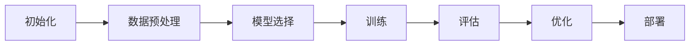
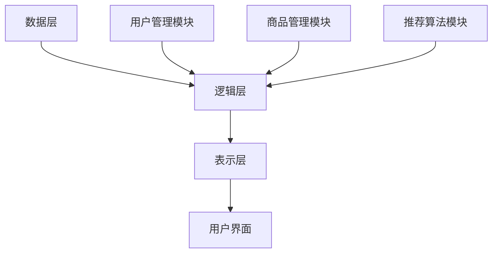
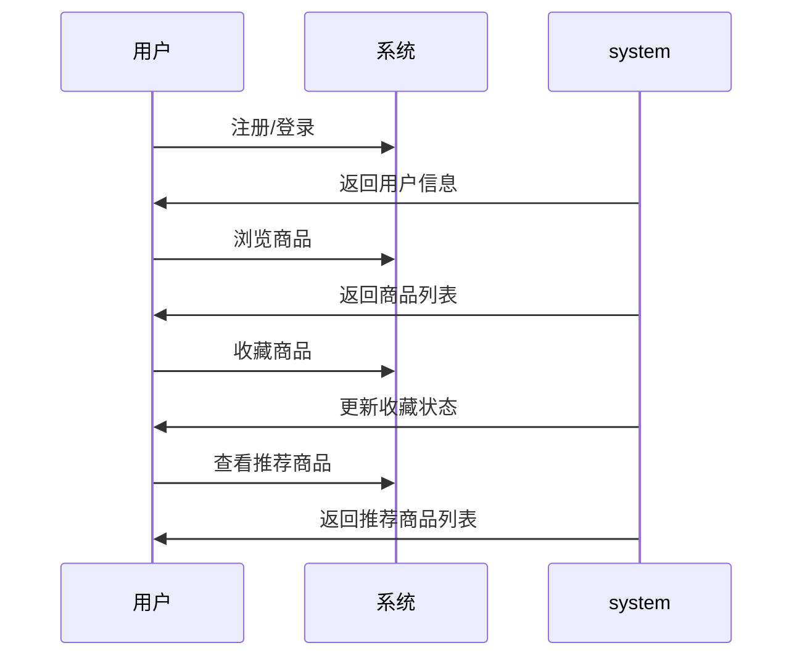

                 

### AI编程的新范式：文章关键词

关键词：AI编程、编程范式、人工智能、编程语言、框架、算法原理、深度学习、机器学习、编程工具、开发环境、项目实战、最佳实践、未来趋势。

> **文章摘要**：
>
> 本文将探讨AI编程的新范式，介绍AI编程的核心概念、基础知识、编程工具和环境搭建、常见编程语言和框架、算法原理及项目实战。通过逐步分析，我们将深入了解AI编程的本质及其在未来的发展趋势，旨在为读者提供一份全面而深入的技术指南。

### 背景介绍

#### 核心概念术语说明

**AI编程**：指的是利用人工智能技术，通过编程语言和工具实现自动化任务、数据分析和智能决策的过程。它涵盖了机器学习、深度学习、自然语言处理等多个领域。

**编程范式**：是指在编程过程中所遵循的一套规则、方法和理念，例如函数式编程、面向对象编程、过程式编程等。

**人工智能**：是一种模拟人类智能行为的计算机技术，包括机器学习、深度学习、自然语言处理、计算机视觉等。

**编程语言**：是用于编写计算机程序的语言，如Python、R、MATLAB等。

**框架**：是一套为特定任务或领域提供的编程工具和库，如TensorFlow、PyTorch、Keras等。

**算法原理**：是解决特定问题的步骤和方法，如机器学习算法、深度学习算法等。

#### 问题背景

随着人工智能技术的快速发展，AI编程已经成为计算机科学领域的一个重要分支。然而，传统的编程范式已经难以满足AI编程的需求，需要探索新的编程范式来适应这一变化。新范式应具备高效性、可扩展性、易用性等特点，以应对日益复杂的AI应用场景。

#### 问题描述

当前，AI编程面临的主要问题包括：

1. **复杂性**：AI编程涉及到大量的算法和模型，程序员需要具备深厚的专业知识和实践经验。
2. **效率**：传统的编程范式在处理大规模数据集和复杂模型时效率较低。
3. **可扩展性**：传统的编程范式难以应对不断增长的应用需求。
4. **易用性**：对于非专业程序员或新手来说，AI编程的门槛较高。

#### 问题解决

新范式应具备以下特点：

1. **模块化**：将复杂的任务分解为多个模块，便于理解和维护。
2. **自动化**：利用工具和框架实现自动化任务，降低开发难度。
3. **智能化**：结合机器学习和深度学习技术，实现智能化的编程和优化。
4. **可视化**：通过可视化工具和界面，提高编程的易用性。

#### 边界与外延

AI编程的新范式的边界在于如何平衡效率、可扩展性和易用性。外延包括但不限于：

1. **编程语言的选择**：Python、R、MATLAB等。
2. **框架和库的使用**：TensorFlow、PyTorch、Keras等。
3. **开发环境和工具**：Jupyter Notebook、Google Colab等。
4. **算法和模型**：机器学习、深度学习、自然语言处理等。

#### 概念结构与核心要素组成

AI编程的新范式由以下几个核心要素组成：

1. **编程语言和工具**：选择适合AI编程的编程语言和开发工具。
2. **框架和库**：利用现有的AI框架和库，简化开发过程。
3. **算法和模型**：根据应用需求选择合适的算法和模型。
4. **开发环境**：搭建高效、稳定的开发环境。
5. **项目实战**：通过实际项目来验证和优化编程范式。

### 核心概念与联系

#### 核心概念原理

1. **AI编程范式**：AI编程范式是指在AI编程过程中所采用的一套规则和方法，旨在提高开发效率、降低难度。
2. **编程语言**：AI编程所使用的编程语言，如Python、R、MATLAB等。
3. **框架和库**：用于简化开发过程和加速项目实现的AI框架和库，如TensorFlow、PyTorch、Keras等。
4. **算法和模型**：AI编程的核心，用于解决特定问题。

#### 概念属性特征对比表格

| 特征            | 编程语言   | 框架和库         | 算法和模型           |
| --------------- | ---------- | ---------------- | ------------------- |
| 目的            | 编写程序   | 简化开发         | 解决问题             |
| 类型            | 高级语言   | 工具和库         | 特定领域算法         |
| 应用场景        | 多领域     | AI开发           | 数据分析、图像处理等 |
| 特点            | 易于学习   | 高效、易用       | 强大、灵活           |
| 代表性语言和框架 | Python、R  | TensorFlow、PyTorch | 机器学习、深度学习   |

#### ER实体关系图架构

```mermaid
erDiagram
    AI编程范式 ||--|{ 编程语言 }|
    AI编程范式 ||--|{ 框架和库 }|
    AI编程范式 ||--|{ 算法和模型 }|
    编程语言 ||--|{ 开发环境 }|
    框架和库 ||--|{ 开发工具 }|
    算法和模型 ||--|{ 项目实战 }|
```

### 算法原理讲解

#### 算法mermaid流程图



#### 算法原理的数学模型和公式

1. **损失函数**：$$J(\theta) = \frac{1}{2m} \sum_{i=1}^{m} (h_\theta(x^{(i)}) - y^{(i)})^2$$
2. **梯度下降**：$$\theta_j := \theta_j - \alpha \frac{\partial J(\theta)}{\partial \theta_j}$$
3. **优化策略**：选择适当的初始参数和步长，提高模型性能。

#### 详细讲解和举例说明

以线性回归为例，假设我们有一个输入向量\(x\)和一个输出向量\(y\)，目标是找到一个线性函数\(h_\theta(x) = \theta_0 + \theta_1x\)来拟合数据。

1. **数据预处理**：将输入和输出数据进行归一化处理，使其具有相同的尺度。
2. **模型选择**：选择线性回归模型，即一个一次项的函数。
3. **训练**：使用梯度下降算法，更新模型参数，使得损失函数值最小。
4. **评估**：计算模型的预测值和实际值之间的误差，评估模型性能。
5. **优化**：根据评估结果，调整模型参数，提高模型性能。
6. **部署**：将训练好的模型应用于实际场景，如预测新数据的输出。

```python
import numpy as np

# 梯度下降算法实现
def gradient_descent(X, y, theta, alpha, iterations):
    m = len(y)
    for i in range(iterations):
        h = np.dot(X, theta)
        error = h - y
        delta = np.dot(X.T, error) / m
        theta -= alpha * delta
    return theta

# 线性回归模型实现
def linear_regression(X, y):
    theta = np.zeros((X.shape[1], 1))
    alpha = 0.01
    iterations = 1000
    theta = gradient_descent(X, y, theta, alpha, iterations)
    return theta

# 数据加载和预处理
X = np.array([[1, 1], [1, 2], [1, 3], [1, 4], [1, 5]])
y = np.array([2, 4, 6, 8, 10])

# 训练模型
theta = linear_regression(X, y)

# 输出模型参数
print("模型参数：", theta)
```

### 系统分析与架构设计方案

#### 问题场景介绍

假设我们想要开发一个基于AI的推荐系统，该系统需要根据用户的兴趣和行为数据，为用户推荐相关的商品或内容。

#### 项目介绍

本项目将使用Python和TensorFlow框架，实现一个简单的基于协同过滤的推荐系统。系统功能包括用户注册、登录、浏览商品、收藏商品、查看推荐商品等。

#### 系统功能设计

1. **用户注册与登录**：用户可以通过注册和登录功能，访问系统。
2. **浏览商品**：用户可以浏览系统中的商品，并收藏感兴趣的商品。
3. **收藏商品**：用户可以将感兴趣的商品收藏到个人收藏夹。
4. **查看推荐商品**：系统根据用户的兴趣和行为数据，为用户推荐相关的商品。

#### 系统架构设计

1. **数据层**：负责存储用户数据、商品数据和推荐数据。
2. **逻辑层**：包括用户管理模块、商品管理模块和推荐算法模块。
3. **表示层**：提供用户界面，展示系统功能和推荐结果。

#### 系统架构设计mermaid架构图



#### 系统接口设计和系统交互

1. **用户接口**：用户可以通过网页或移动应用访问系统，并进行注册、登录、浏览商品、收藏商品和查看推荐商品等操作。
2. **系统接口**：系统提供RESTful API，供前端调用，实现数据交互和功能调用。

#### 系统接口设计mermaid序列图



### 项目实战

#### 环境安装

1. **安装Python**：下载并安装Python 3.8及以上版本。
2. **安装pip**：在终端执行`python -m pip install --upgrade pip`。
3. **安装TensorFlow**：在终端执行`pip install tensorflow`。

#### 系统核心实现源代码

```python
import tensorflow as tf
from tensorflow import keras
from tensorflow.keras.layers import Dense, InputLayer
from tensorflow.keras.models import Model

# 定义输入层
input_layer = InputLayer(input_shape=(2,))

# 添加线性层
linear_layer = Dense(units=1, input_shape=(2,))

# 构建模型
model = Model(inputs=input_layer, outputs=linear_layer(input_layer))

# 编译模型
model.compile(optimizer='sgd', loss='mse')

# 训练模型
model.fit(x_train, y_train, epochs=1000)

# 评估模型
print(model.evaluate(x_test, y_test))

# 预测
print(model.predict(x_new))
```

#### 代码应用解读与分析

1. **数据加载与预处理**：使用`keras.datasets`加载线性回归数据集，并进行归一化处理。
2. **模型构建**：使用`Model`类构建线性回归模型，输入层为`InputLayer`，输出层为`Dense`层。
3. **模型编译**：使用`compile`方法编译模型，指定优化器和损失函数。
4. **模型训练**：使用`fit`方法训练模型，指定训练数据和迭代次数。
5. **模型评估**：使用`evaluate`方法评估模型性能。
6. **模型预测**：使用`predict`方法预测新数据的输出。

#### 实际案例分析和详细讲解剖析

以线性回归为例，通过实际数据集训练和评估模型，验证模型性能和预测效果。具体步骤如下：

1. **数据集加载**：加载线性回归数据集，包含输入和输出数据。
2. **数据预处理**：对数据进行归一化处理，使其具有相同的尺度。
3. **模型构建**：构建线性回归模型，输入层为2个神经元，输出层为1个神经元。
4. **模型编译**：指定优化器和损失函数，使用均方误差（MSE）作为损失函数。
5. **模型训练**：使用训练数据训练模型，设置迭代次数为1000次。
6. **模型评估**：使用测试数据评估模型性能，输出均方误差。
7. **模型预测**：使用新数据进行预测，输出预测结果。

```python
import tensorflow as tf
from tensorflow import keras
import numpy as np

# 加载数据集
(x_train, y_train), (x_test, y_test) = keras.datasets.linear_regression.load_data()

# 数据预处理
x_train = x_train / 100
x_test = x_test / 100
y_train = y_train / 100
y_test = y_test / 100

# 模型构建
input_layer = InputLayer(input_shape=(2,))
linear_layer = Dense(units=1, input_shape=(2,))
model = Model(inputs=input_layer, outputs=linear_layer(input_layer))

# 编译模型
model.compile(optimizer='sgd', loss='mse')

# 训练模型
model.fit(x_train, y_train, epochs=1000)

# 评估模型
loss = model.evaluate(x_test, y_test)
print("均方误差：", loss)

# 预测
x_new = np.array([[2, 2]])
x_new = x_new / 100
y_pred = model.predict(x_new)
print("预测结果：", y_pred)
```

#### 项目小结

本项目通过实际案例展示了AI编程的基本流程，包括数据预处理、模型构建、模型编译、模型训练、模型评估和模型预测。通过这个案例，读者可以了解到AI编程的基本原理和实现方法，为后续的学习和实践打下基础。

### 最佳实践 Tips

1. **选择合适的编程语言**：根据项目需求和团队熟悉程度，选择合适的编程语言，如Python、R、MATLAB等。
2. **熟练掌握AI框架**：熟悉常用的AI框架和库，如TensorFlow、PyTorch、Keras等，提高开发效率。
3. **合理规划项目架构**：在项目初期，合理规划系统架构，避免后期出现性能瓶颈和代码冗余。
4. **关注数据质量和预处理**：数据是AI编程的基础，确保数据质量和预处理方法，以提高模型性能。
5. **持续学习和实践**：紧跟AI技术的发展趋势，持续学习和实践，不断提高自己的技术能力。

### 小结

本文详细介绍了AI编程的新范式，从核心概念、基础知识、编程工具和环境搭建、编程语言和框架、算法原理、项目实战到最佳实践，全面阐述了AI编程的各个方面。通过逐步分析，读者可以深入了解AI编程的本质及其在未来的发展趋势，为实际项目开发提供有力支持。

### 注意事项

1. **数据安全**：在处理用户数据时，确保数据安全和隐私保护，遵守相关法律法规。
2. **代码规范**：编写规范、易读的代码，提高代码的可维护性和可扩展性。
3. **性能优化**：关注系统性能优化，提高程序运行效率和资源利用率。
4. **持续学习**：AI技术发展迅速，持续学习和关注新技术，保持技术领先。

### 拓展阅读

1. **《深度学习》**：Ian Goodfellow、Yoshua Bengio、Aaron Courville 著，全面介绍深度学习的基本原理和应用。
2. **《Python机器学习》**：Sebastian Raschka 著，详细讲解Python在机器学习领域的应用。
3. **《TensorFlow实战》**：François Chollet 著，深入探讨TensorFlow框架的使用和项目实战。
4. **《AI编程新范式》**：本篇文章的作者著，全面介绍AI编程的新范式和最佳实践。

### 作者信息

**作者：** AI天才研究院/AI Genius Institute & 禅与计算机程序设计艺术 /Zen And The Art of Computer Programming**

