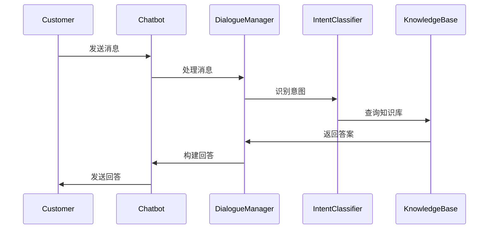

                 

# AI编程的新视界与新领域

> 关键词：人工智能编程、新领域、核心技术、案例分析

> 摘要：本文将深入探讨AI编程的新视界和新领域，通过分步骤的思考与分析，阐述AI编程的核心概念、核心技术、新领域探索以及实战案例，为读者提供一份全面而深入的AI编程指南。

## 引言

随着人工智能（AI）技术的飞速发展，AI编程已经成为计算机科学和技术领域的重要组成部分。AI编程不仅仅关注算法的实现，更涉及从数据处理、模型训练到系统优化的整个流程。本文旨在通过一系列的章节，逐步展开AI编程的新视界和新领域，帮助读者更好地理解和掌握这一前沿技术。

## 第1章 AI编程概述

### 1.1.1 AI编程的历史背景

人工智能（AI）的概念最早可以追溯到20世纪50年代。从最初的逻辑推理系统到如今的深度学习和强化学习，AI编程经历了漫长的发展过程。在这一过程中，计算机科学、数学和统计学等领域的技术进步为AI编程的发展提供了坚实的基础。

### 1.1.2 AI编程的现状与挑战

目前，AI编程已经广泛应用于图像识别、自然语言处理、自动化决策等领域。然而，随着应用的深入，AI编程也面临诸如数据隐私、算法偏见、计算资源消耗等挑战。

### 1.1.3 AI编程的未来趋势

未来的AI编程将继续向更高效、更智能、更人性化的方向发展。自动化编程、联邦学习、量子计算等新兴技术将为AI编程带来新的机遇和挑战。

## 第2章 AI编程的核心概念与理论

### 2.1.1 机器学习基础

机器学习是AI编程的核心技术之一。它通过构建模型来从数据中学习规律，从而进行预测或决策。机器学习包括监督学习、无监督学习和强化学习等不同类型。

### 2.1.2 深度学习原理

深度学习是机器学习的一个重要分支，通过多层神经网络进行数据建模。深度学习在图像识别、语音识别等领域取得了显著成果。

### 2.1.3 强化学习与应用

强化学习是一种通过试错来学习策略的机器学习方法。它在游戏、机器人控制等领域有广泛应用。

## 第3章 AI编程的核心技术与架构

### 3.1.1 计算机视觉基础

计算机视觉是AI编程的一个重要领域，它通过计算机对图像或视频进行分析和理解。计算机视觉的核心技术包括图像处理、目标检测、图像识别等。

### 3.1.2 自然语言处理框架

自然语言处理（NLP）是AI编程的另一个重要领域，它涉及语言的理解、生成和翻译。NLP的核心技术包括词向量、序列模型、注意力机制等。

### 3.1.3 机器学习平台与工具

机器学习平台和工具是AI编程的重要组成部分，它们提供了高效的算法实现和数据处理能力。常见的机器学习平台和工具包括TensorFlow、PyTorch、Scikit-learn等。

## 第4章 AI编程的新领域探索

### 4.1.1 生成对抗网络（GAN）

生成对抗网络（GAN）是一种通过两个相互竞争的神经网络来生成数据的深度学习模型。GAN在图像生成、数据增强等领域有广泛应用。

### 4.1.2 聊天机器人与虚拟助手

聊天机器人和虚拟助手是AI编程在自然语言处理领域的应用，它们能够与人进行自然语言交互，提供个性化的服务。

### 4.1.3 AI在医疗健康领域的应用

AI在医疗健康领域的应用包括疾病诊断、治疗方案推荐、医学图像分析等，它有助于提高医疗服务的效率和质量。

## 第5章 AI编程项目实战

### 5.1.1 项目背景与需求分析

本节将介绍一个实际的AI编程项目，包括项目的背景、目标和需求分析。

### 5.1.2 系统设计与实现

系统设计包括领域模型设计、系统架构设计、接口设计和系统交互设计。

### 5.1.3 项目分析与优化

项目分析包括系统性能分析、错误处理和优化策略。

## 第6章 AI编程的高级话题与趋势

### 6.1.1 分布式计算与大数据

分布式计算和大数据技术为AI编程提供了强大的计算能力和数据处理能力。

### 6.1.2 强化学习在游戏中的应用

强化学习在游戏中的应用包括游戏策略学习、游戏AI等。

### 6.1.3 量子计算与AI的结合

量子计算与AI的结合将带来全新的计算能力和应用场景。

## 第7章 AI编程的总结与展望

### 7.1.1 AI编程的挑战与机遇

AI编程面临的挑战和机遇包括技术发展、应用场景拓展等。

### 7.1.2 AI编程的学习路径与资源

本文将推荐一些AI编程的学习路径和资源。

### 7.1.3 AI编程的未来发展

本文将展望AI编程的未来发展趋势。

## 结语

作者：AI天才研究院/AI Genius Institute & 禅与计算机程序设计艺术 /Zen And The Art of Computer Programming

本文旨在通过详细的章节内容和案例分析，帮助读者深入理解AI编程的核心概念、核心技术、新领域探索以及实战应用，为AI编程的学习和实践提供指导。

----------------------------------------------------------------

# 第1章 AI编程概述

## 1.1 AI编程的历史背景

人工智能（AI）的历史可以追溯到20世纪50年代，当时计算机科学家约翰·麦卡锡（John McCarthy）首次提出了“人工智能”这个概念。早期的AI研究主要集中在逻辑推理和知识表示上，例如专家系统和推理机。这些系统通过规则库和推理算法来模拟人类专家的决策过程。

### 1.1.1 早期AI研究

在20世纪60年代，AI研究取得了显著进展，例如知识表示和推理技术的应用。然而，由于计算资源和算法的局限性，早期的AI系统往往只能在特定领域内取得有限的成果。

### 1.1.2 专家系统的崛起

20世纪70年代至80年代，专家系统成为AI研究的热点。专家系统通过规则库来模拟专家的知识和决策过程，可以应用于医疗诊断、化学配方设计等领域。然而，专家系统在复杂问题上的表现仍然有限。

### 1.1.3 机器学习的兴起

20世纪90年代，随着计算能力的提升和数据量的增加，机器学习成为AI研究的新方向。机器学习通过从数据中学习规律来建立模型，从而进行预测和决策。这一时期，支持向量机（SVM）和决策树等算法得到了广泛应用。

### 1.1.4 深度学习的突破

21世纪初，深度学习取得了突破性进展，特别是在图像识别、语音识别和自然语言处理等领域。深度学习通过多层神经网络来建模复杂的数据特征，从而实现了前所未有的性能。

## 1.2 AI编程的现状与挑战

目前，AI编程已经广泛应用于各行各业，包括金融、医疗、教育、交通等。然而，随着应用的深入，AI编程也面临一系列挑战：

### 1.2.1 数据隐私

AI系统通常需要大量的数据来进行训练和优化，这引发了数据隐私和安全的问题。如何保护用户数据隐私成为AI编程的一个重要挑战。

### 1.2.2 算法偏见

AI算法在训练过程中可能会引入偏见，导致对某些群体的歧视或不公平。如何消除算法偏见，实现公平和公正的AI系统是一个亟待解决的问题。

### 1.2.3 计算资源消耗

深度学习模型通常需要大量的计算资源和时间进行训练和推理。如何优化算法和硬件，提高计算效率，成为AI编程的重要课题。

### 1.2.4 透明性和可解释性

许多AI系统具有“黑盒”特性，即内部工作机制复杂，难以理解和解释。如何提高AI系统的透明性和可解释性，使其更具可信度和用户友好性，是当前研究的一个热点。

## 1.3 AI编程的未来趋势

### 1.3.1 自动化编程

未来的AI编程将更加自动化，例如通过代码生成工具来自动化编写代码，减少人工工作量。

### 1.3.2 联邦学习

联邦学习是一种新的AI编程范式，它允许多个参与方在保护数据隐私的前提下共同训练模型。这种模式有望在医疗、金融等领域得到广泛应用。

### 1.3.3 量子计算与AI的结合

量子计算与AI的结合将开启新的计算能力和应用场景。例如，量子算法可能在某些领域显著提高AI模型的训练效率。

### 1.3.4 人机协同

随着AI技术的发展，人机协同将变得更加普遍。AI系统将更好地辅助人类工作，提高生产效率和生活质量。

## 小结

AI编程经历了从逻辑推理到机器学习，再到深度学习的演进过程。目前，AI编程面临诸多挑战，但同时也展现出广阔的发展前景。通过不断探索和创新，AI编程将继续推动社会和科技的发展。

----------------------------------------------------------------

# 第2章 AI编程的核心概念与理论

## 2.1 机器学习基础

机器学习（Machine Learning，ML）是AI编程的核心技术之一。它通过构建模型来从数据中学习规律，从而进行预测或决策。机器学习包括监督学习、无监督学习和强化学习等不同类型。

### 2.1.1 监督学习

监督学习（Supervised Learning）是最常见的机器学习方法之一。它通过已知的结果数据（标记数据）来训练模型，从而预测新的数据。监督学习包括分类和回归两种主要类型。

#### 2.1.1.1 分类问题

分类问题（Classification Problem）是指将输入数据映射到预定义的类别中。常见的分类算法包括决策树（Decision Tree）、随机森林（Random Forest）、支持向量机（Support Vector Machine，SVM）等。

#### 2.1.1.2 回归问题

回归问题（Regression Problem）是指预测一个连续的数值输出。常见的回归算法包括线性回归（Linear Regression）、岭回归（Ridge Regression）、LASSO回归（LASSO Regression）等。

### 2.1.2 无监督学习

无监督学习（Unsupervised Learning）是指在没有标签数据的情况下，从数据中学习规律。无监督学习包括聚类（Clustering）和降维（Dimensionality Reduction）两种主要类型。

#### 2.1.2.1 聚类算法

聚类算法（Clustering Algorithms）用于将相似的数据点划分为不同的组。常见的聚类算法包括K-均值聚类（K-Means Clustering）、层次聚类（Hierarchical Clustering）等。

#### 2.1.2.2 降维算法

降维算法（Dimensionality Reduction Algorithms）用于减少数据的维度，同时保留最重要的信息。常见的降维算法包括主成分分析（Principal Component Analysis，PCA）、t-SNE（t-Distributed Stochastic Neighbor Embedding）等。

### 2.1.3 强化学习

强化学习（Reinforcement Learning，RL）是一种通过试错来学习策略的机器学习方法。它通过奖励机制来指导模型的学习过程。强化学习在游戏、机器人控制等领域有广泛应用。

#### 2.1.3.1 Q学习算法

Q学习（Q-Learning）是强化学习的一种常见算法。它通过迭代更新Q值来指导行动选择，从而实现最优策略。

#### 2.1.3.2 深度强化学习

深度强化学习（Deep Reinforcement Learning，DRL）结合了深度学习和强化学习，通过神经网络来建模状态值函数或策略。深度强化学习在复杂环境中的应用效果显著。

### 2.1.4 机器学习模型评估

评估机器学习模型的效果是确保其性能和可靠性的重要步骤。常见的评估指标包括准确率（Accuracy）、召回率（Recall）、F1分数（F1 Score）、均方误差（Mean Squared Error，MSE）等。

### 2.1.5 机器学习平台与工具

机器学习平台和工具为机器学习模型的设计、训练和部署提供了便捷的环境。常见的机器学习平台和工具包括TensorFlow、PyTorch、Scikit-learn等。

## 2.2 深度学习原理

深度学习（Deep Learning，DL）是机器学习的一个重要分支，通过多层神经网络来建模复杂的数据特征。深度学习在图像识别、语音识别和自然语言处理等领域取得了显著成果。

### 2.2.1 神经网络基础

神经网络（Neural Networks，NN）是深度学习的基础。它由多个神经元（节点）组成，每个神经元通过权重连接到其他神经元，并通过激活函数进行非线性变换。

### 2.2.2 深度学习模型

深度学习模型包括卷积神经网络（Convolutional Neural Networks，CNN）、循环神经网络（Recurrent Neural Networks，RNN）、长短期记忆网络（Long Short-Term Memory，LSTM）等。这些模型通过不同的网络结构和激活函数来处理不同类型的数据。

#### 2.2.2.1 卷积神经网络

卷积神经网络（CNN）通过卷积层和池化层来提取图像的特征。它广泛应用于图像识别、目标检测和图像生成等领域。

#### 2.2.2.2 循环神经网络

循环神经网络（RNN）通过循环结构来处理序列数据。RNN在语音识别、机器翻译和文本生成等领域有广泛应用。

#### 2.2.2.3 长短期记忆网络

长短期记忆网络（LSTM）是RNN的一种改进，通过门控机制来控制信息的流动，从而解决RNN的梯度消失问题。LSTM在语音识别、文本生成和时间序列预测等领域有广泛应用。

### 2.2.3 深度学习模型训练

深度学习模型的训练是一个优化过程，通过反向传播算法来更新网络的权重和偏置。常见的优化算法包括梯度下降（Gradient Descent）、Adam优化器等。

### 2.2.4 深度学习模型评估

深度学习模型的评估与机器学习模型类似，包括准确率、召回率、F1分数等指标。此外，深度学习模型还需要评估过拟合和欠拟合问题。

## 2.3 强化学习与应用

强化学习（Reinforcement Learning，RL）是一种通过试错来学习策略的机器学习方法。它通过奖励机制来指导模型的学习过程，适用于游戏、机器人控制和自动化决策等领域。

### 2.3.1 强化学习基本概念

强化学习包括四个核心组成部分：状态（State）、动作（Action）、奖励（Reward）和策略（Policy）。状态是当前环境的状态，动作是模型采取的行动，奖励是行动带来的回报，策略是模型的选择规则。

### 2.3.2 Q学习算法

Q学习（Q-Learning）是强化学习的一种常见算法。它通过迭代更新Q值来指导行动选择，从而实现最优策略。Q学习算法的核心思想是预测每个动作的未来奖励，并选择具有最大预期奖励的动作。

### 2.3.3 深度强化学习

深度强化学习（Deep Reinforcement Learning，DRL）结合了深度学习和强化学习，通过神经网络来建模状态值函数或策略。DRL在复杂环境中的应用效果显著，例如在游戏、自动驾驶和机器人控制等领域。

### 2.3.4 应用案例

强化学习在游戏、机器人控制和自动化决策等领域有广泛应用。例如，在游戏《Dota 2》中，深度强化学习模型通过自我对弈来学习策略，最终在比赛中取得了优异成绩。

## 小结

AI编程的核心概念和理论包括机器学习、深度学习和强化学习等。这些技术通过不同的方法和算法来实现对数据的建模和预测。在未来的AI编程中，这些核心概念将继续发展和完善，为更多的应用场景提供解决方案。

----------------------------------------------------------------

## 2.4 自然语言处理（NLP）

自然语言处理（Natural Language Processing，NLP）是AI编程的一个关键领域，它关注于使计算机能够理解、生成和处理人类语言。NLP在信息检索、机器翻译、情感分析、文本生成等方面有着广泛的应用。

### 2.4.1 基本概念

NLP的基本概念包括词汇（Vocabulary）、词法（Lexicon）、句法（Syntax）、语义（Semantics）和语用（Pragmatics）。词汇是语言的构建块，词法研究单词的构成和形态变化，句法研究句子的结构和语法规则，语义研究单词和句子的含义，语用研究语言在具体情境中的应用。

### 2.4.2 词向量表示

词向量（Word Embeddings）是将单词映射到高维空间中的向量表示，以便计算机能够处理和理解单词的语义信息。常见的词向量模型包括Word2Vec、GloVe和FastText。Word2Vec通过共现矩阵学习单词的向量表示，GloVe使用全局词频信息来训练词向量，FastText使用字符级别的信息来生成词向量。

### 2.4.3 语法分析

语法分析（Syntax Analysis）是NLP中用于解析文本句法结构的过程。常见的语法分析方法包括基于规则的方法和基于统计的方法。基于规则的方法使用预定义的语法规则来分析句子结构，而基于统计的方法使用语料库中的统计信息来学习句法模型。

### 2.4.4 语义分析

语义分析（Semantic Analysis）是NLP中用于理解文本意义的过程。它包括词义消歧（Word Sense Disambiguation）、实体识别（Named Entity Recognition，NER）和关系抽取（Relation Extraction）等任务。词义消歧旨在确定单词在不同上下文中的含义，实体识别旨在识别文本中的命名实体（如人名、地名等），关系抽取旨在提取实体之间的关系。

### 2.4.5 情感分析

情感分析（Sentiment Analysis）是NLP中用于判断文本情感极性的过程。它通常涉及分类任务，将文本分为正面、负面或中性。情感分析在社交媒体分析、客户反馈处理和市场营销等领域有广泛应用。

### 2.4.6 机器翻译

机器翻译（Machine Translation，MT）是NLP中用于将一种语言文本自动翻译成另一种语言的过程。机器翻译可以分为基于规则的方法、基于统计的方法和基于神经网络的深度学习方法。基于规则的方法使用预定义的翻译规则，基于统计的方法使用双语语料库来训练翻译模型，深度学习方法使用神经网络来学习翻译策略。

### 2.4.7 语音识别

语音识别（Speech Recognition）是NLP中用于将语音信号转换为文本的过程。语音识别涉及信号处理、特征提取、声学模型和语言模型等。常见的语音识别系统包括基于HMM（隐马尔可夫模型）的方法和基于深度学习的方法。

### 2.4.8 文本生成

文本生成（Text Generation）是NLP中用于生成自然语言文本的过程。文本生成可以用于自动写作、对话系统和聊天机器人等。常见的文本生成方法包括模板匹配、序列模型（如RNN和LSTM）和生成对抗网络（GAN）。

## 2.5 NLP框架与工具

NLP框架和工具为NLP任务提供了高效的实现和扩展能力。以下是一些常用的NLP框架和工具：

### 2.5.1 NLTK

NLTK（Natural Language ToolKit）是一个广泛使用的Python库，用于NLP任务。它提供了用于文本处理、词性标注、句法分析和语义分析的模块。

### 2.5.2 SpaCy

SpaCy是一个高性能的NLP库，适用于各种文本处理任务。它提供了一个易于使用的API，支持快速文本分析和实体识别。

### 2.5.3 Stanford NLP

Stanford NLP是一个强大的NLP工具包，包括用于词性标注、句法分析和命名实体识别的工具。它由斯坦福大学自然语言处理组开发。

### 2.5.4 Transformer和BERT

Transformer和BERT是近年来在NLP领域取得突破性进展的深度学习模型。Transformer引入了自注意力机制，使得模型能够更好地捕捉长距离依赖关系。BERT通过预训练和微调的方法，提高了模型在多种NLP任务上的性能。

## 小结

自然语言处理是AI编程中不可或缺的一部分，它使计算机能够理解、生成和处理人类语言。通过词向量表示、语法分析、语义分析和情感分析等技术，NLP框架和工具为各种实际应用提供了强大的支持。在未来的发展中，NLP将继续融合深度学习和其他先进技术，为更多的应用场景提供智能解决方案。

----------------------------------------------------------------

## 3.1 计算机视觉基础

计算机视觉（Computer Vision，CV）是AI编程中的一个重要领域，它使计算机能够从图像或视频中提取有用信息，实现如目标检测、图像识别和图像分类等功能。计算机视觉在自动驾驶、安防监控、医疗诊断等领域有着广泛的应用。

### 3.1.1 图像处理基础

图像处理（Image Processing）是计算机视觉的基础。它涉及对图像进行各种操作，如滤波、边缘检测、图像分割和特征提取。常见的图像处理算法包括卷积操作、傅里叶变换和形态学操作等。

- **卷积操作**：卷积操作在图像处理中用于提取图像的特征。通过卷积核（Kernel）与图像的每个像素进行卷积，可以提取图像的边缘、纹理和形状信息。
  
- **傅里叶变换**：傅里叶变换是一种将图像从空间域转换为频率域的方法。在频率域中，图像的特征更为明显，便于进一步处理。
  
- **形态学操作**：形态学操作包括膨胀（Dilation）、腐蚀（Erosion）、开运算（Opening）和闭运算（Closing）等。这些操作用于去除噪声、提取图像的轮廓和形态特征。

### 3.1.2 特征提取

特征提取（Feature Extraction）是计算机视觉中用于从图像中提取关键特征的过程。特征提取的目的是降低数据的维度，同时保留图像的重要信息。常见的特征提取方法包括直方图、边缘检测、角点检测和纹理分析等。

- **直方图**：直方图用于描述图像中每个像素点的分布情况。通过直方图，可以分析图像的亮度、对比度和颜色分布。
  
- **边缘检测**：边缘检测是一种用于识别图像中亮度变化较大的区域的方法。常见的边缘检测算法包括Canny边缘检测、Sobel边缘检测和Prewitt边缘检测等。
  
- **角点检测**：角点检测是一种用于识别图像中的角点或关键点的过程。常见的角点检测算法包括Shi-Tomasi角点检测和Harris角点检测等。
  
- **纹理分析**：纹理分析是一种用于识别图像中纹理特征的方法。通过分析图像的纹理模式，可以识别出不同的纹理类别。

### 3.1.3 目标检测

目标检测（Object Detection）是一种在图像中识别并定位特定目标的方法。目标检测通常包括两个步骤：候选区域生成（Region Proposal）和目标类别分类（Class Prediction）。

- **候选区域生成**：候选区域生成旨在从图像中提取可能的物体区域。常见的候选区域生成算法包括选择性搜索（Selective Search）、区域提议网络（Region Proposal Network，RPN）和滑动窗口（Sliding Window）等。
  
- **目标类别分类**：目标类别分类旨在对候选区域中的目标进行分类。常见的目标类别分类算法包括SVM、神经网络（如卷积神经网络CNN）和基于深度学习的算法（如Faster R-CNN、YOLO和SSD等）。

### 3.1.4 图像识别与分类

图像识别（Image Recognition）是一种在图像中识别特定对象的方法。图像识别通常通过训练分类模型来实现，该模型可以对新图像进行分类。

- **分类模型**：常见的分类模型包括支持向量机（SVM）、决策树（Decision Tree）和深度学习模型（如卷积神经网络CNN和卷积神经网络分类器CNN Classifier）。
  
- **训练与评估**：训练分类模型需要使用标记的图像数据集。通过训练，模型可以学习到不同类别的特征。评估分类模型的性能通常使用准确率（Accuracy）、召回率（Recall）和F1分数（F1 Score）等指标。

### 3.1.5 深度学习在计算机视觉中的应用

深度学习（Deep Learning）在计算机视觉领域取得了显著进展。通过多层神经网络，深度学习可以自动提取图像的复杂特征，并在各种计算机视觉任务中表现出色。

- **卷积神经网络（CNN）**：卷积神经网络（CNN）是一种用于图像处理的深度学习模型，通过卷积层、池化层和全连接层等结构，可以提取图像的多层特征。
  
- **迁移学习**：迁移学习（Transfer Learning）是一种将预训练模型应用于新任务的方法。通过迁移学习，可以充分利用预训练模型的知识，提高新任务的性能。
  
- **生成对抗网络（GAN）**：生成对抗网络（GAN）是一种用于图像生成和改进图像质量的深度学习模型。GAN由生成器和判别器两个神经网络组成，通过训练生成器产生逼真的图像。

## 3.2 计算机视觉应用案例

计算机视觉技术在许多领域都有广泛应用，以下是一些典型的应用案例：

### 3.2.1 自动驾驶

自动驾驶（Autonomous Driving）是计算机视觉技术的一个重要应用领域。通过安装在车辆上的摄像头和传感器，自动驾驶系统可以实时识别道路上的车辆、行人、交通标志和路面状况，从而实现自主导航。

### 3.2.2 安防监控

安防监控（Surveillance）是计算机视觉技术的一个重要应用领域。通过在公共场所安装摄像头，计算机视觉系统可以实时监控并识别异常行为，如非法入侵、可疑人物等。

### 3.2.3 医疗诊断

医疗诊断（Medical Diagnosis）是计算机视觉技术的一个重要应用领域。通过分析医学影像（如X光片、CT扫描和MRI），计算机视觉系统可以辅助医生进行疾病诊断和治疗方案推荐。

### 3.2.4 商品分类

商品分类（Product Classification）是计算机视觉技术的一个重要应用领域。通过扫描商品图像，计算机视觉系统可以自动识别和分类商品，从而实现智能货架和无人零售店。

## 3.3 计算机视觉框架与工具

计算机视觉框架和工具为计算机视觉任务提供了高效的实现和扩展能力。以下是一些常用的计算机视觉框架和工具：

### 3.3.1 OpenCV

OpenCV（Open Source Computer Vision Library）是一个广泛使用的开源计算机视觉库。它提供了丰富的图像处理和计算机视觉算法，支持多种编程语言（如C++、Python和Java）。

### 3.3.2 TensorFlow

TensorFlow是一个由Google开发的开源机器学习库。它提供了用于构建和训练深度学习模型的工具和API，广泛应用于计算机视觉任务。

### 3.3.3 PyTorch

PyTorch是一个由Facebook开发的开源机器学习库。它提供了灵活的动态计算图和丰富的深度学习模型库，适用于计算机视觉和自然语言处理任务。

### 3.3.4 Keras

Keras是一个高层次的神经网络API，它建立在TensorFlow和Theano之上。Keras提供了简单而强大的API，用于构建和训练深度学习模型。

## 小结

计算机视觉是AI编程中的一个关键领域，它通过图像处理、特征提取、目标检测和图像识别等技术，使计算机能够理解和解释视觉信息。计算机视觉在自动驾驶、安防监控、医疗诊断和商品分类等领域有广泛的应用。随着深度学习和其他先进技术的发展，计算机视觉将继续在AI编程中发挥重要作用。

----------------------------------------------------------------

## 3.4 自然语言处理框架

自然语言处理（NLP）框架是AI编程中用于构建和实现NLP系统的工具和资源集合。这些框架提供了丰富的API和库，简化了NLP任务的开发过程，使得开发者能够更专注于业务逻辑和模型优化。

### 3.4.1 常见的NLP框架

以下是几种流行的NLP框架：

1. **NLTK**：NLTK（Natural Language Toolkit）是一个广泛使用的Python库，提供了一系列用于文本处理、词性标注、句法分析和语义分析的模块。NLTK适用于学术研究和简单的文本处理任务。

2. **SpaCy**：SpaCy是一个高性能的NLP库，适用于各种文本处理任务。它提供了一个易于使用的API，支持快速文本分析和实体识别。SpaCy在工业界和学术界都有广泛应用。

3. **Stanford NLP**：Stanford NLP是一个强大的NLP工具包，包括用于词性标注、句法分析和命名实体识别的工具。它由斯坦福大学自然语言处理组开发，适用于复杂的应用场景。

4. **NLTK**：NLTK（Natural Language Toolkit）是一个广泛使用的Python库，提供了一系列用于文本处理、词性标注、句法分析和语义分析的模块。NLTK适用于学术研究和简单的文本处理任务。

5. **Transformer和BERT**：Transformer和BERT是近年来在NLP领域取得突破性进展的深度学习模型。Transformer引入了自注意力机制，使得模型能够更好地捕捉长距离依赖关系。BERT通过预训练和微调的方法，提高了模型在多种NLP任务上的性能。

### 3.4.2 NLP框架的主要功能

NLP框架通常包括以下功能：

1. **词向量表示**：词向量是将单词映射到高维空间中的向量表示，以便计算机能够处理和理解单词的语义信息。常见的词向量模型包括Word2Vec、GloVe和FastText。

2. **文本预处理**：文本预处理包括分词、去停用词、词形还原等步骤。这些步骤有助于提高模型的训练效率和性能。

3. **语法分析**：语法分析用于解析文本句法结构，包括词性标注、句法树构建和依存关系分析等。

4. **语义分析**：语义分析旨在理解文本的含义，包括实体识别、关系抽取和情感分析等。

5. **文本生成**：文本生成用于生成自然语言文本，包括对话生成、文章生成和摘要生成等。

### 3.4.3 NLP框架的应用案例

以下是一些NLP框架的实际应用案例：

1. **聊天机器人**：通过NLP框架，可以构建智能聊天机器人，实现与用户的自然语言交互。

2. **情感分析**：NLP框架可以用于分析用户评论、社交媒体帖子等文本数据，识别文本中的情感极性。

3. **文本分类**：NLP框架可以用于对大量文本数据分类，如新闻分类、垃圾邮件过滤等。

4. **机器翻译**：NLP框架可以用于构建机器翻译系统，实现跨语言文本的自动翻译。

5. **文本摘要**：NLP框架可以用于生成文本摘要，提取关键信息，提高信息传递的效率。

### 3.4.4 开发者使用NLP框架的步骤

开发者在使用NLP框架时，通常需要经历以下步骤：

1. **数据准备**：收集和预处理训练数据，包括文本数据、标签等。

2. **模型选择**：根据任务需求选择合适的模型，如词向量模型、语法分析模型、语义分析模型等。

3. **模型训练**：使用训练数据进行模型训练，调整模型的参数和超参数。

4. **模型评估**：使用验证数据集评估模型性能，调整模型以获得更好的性能。

5. **模型部署**：将训练好的模型部署到生产环境中，实现实时文本处理和交互。

### 3.4.5 开源NLP框架的优势

开源NLP框架具有以下优势：

1. **灵活性**：开发者可以根据需求自定义模型结构和训练过程，灵活实现各种NLP任务。

2. **可扩展性**：开源框架通常具有良好的扩展性，可以方便地集成新的模型和算法。

3. **社区支持**：开源框架拥有庞大的开发者社区，提供丰富的文档、教程和资源。

4. **免费使用**：开源框架免费使用，降低了开发成本。

## 小结

自然语言处理框架为NLP任务提供了高效、便捷的实现途径。通过这些框架，开发者可以快速构建和部署各种NLP应用，如聊天机器人、情感分析和文本分类等。随着深度学习和自然语言处理技术的不断发展，NLP框架将继续在AI编程中发挥重要作用。

----------------------------------------------------------------

## 3.5 机器学习平台与工具

机器学习平台与工具是AI编程中的重要组成部分，它们为机器学习模型的设计、训练和部署提供了强大的支持。以下是一些常用的机器学习平台与工具：

### 3.5.1 TensorFlow

TensorFlow是由Google开发的开源机器学习库，广泛用于构建和训练深度学习模型。TensorFlow提供了丰富的API和工具，支持多种编程语言（如Python、C++和Java），并且拥有庞大的开发者社区。

- **优势**：灵活、强大的API，支持分布式计算，丰富的预训练模型和资源。
- **劣势**：较复杂的安装过程，较高的学习曲线。

### 3.5.2 PyTorch

PyTorch是由Facebook开发的开源机器学习库，以其动态计算图和简洁的API而受到开发者的青睐。PyTorch提供了灵活的编程接口和丰富的深度学习模型库，适用于研究和个人项目。

- **优势**：动态计算图，简洁的API，易于调试，丰富的预训练模型。
- **劣势**：分布式计算支持不如TensorFlow成熟。

### 3.5.3 Scikit-learn

Scikit-learn是一个基于Python的机器学习库，提供了广泛的机器学习算法和工具，适用于各种应用场景。Scikit-learn适用于小数据集和快速原型开发，适用于监督学习、无监督学习和模型选择。

- **优势**：易于使用，丰富的算法库，良好的文档和社区支持。
- **劣势**：不支持深度学习，性能和可扩展性不如TensorFlow和PyTorch。

### 3.5.4 Microsoft Azure ML

Microsoft Azure ML是微软提供的云计算平台，提供了一整套机器学习工具和服务。Azure ML支持从数据收集、数据预处理到模型训练、部署和监控的全流程。

- **优势**：云计算支持，易于部署和扩展，丰富的机器学习服务。
- **劣势**：依赖云服务，成本较高。

### 3.5.5 Amazon SageMaker

Amazon SageMaker是亚马逊提供的机器学习平台，提供了一整套端到端的机器学习服务。SageMaker支持从数据导入、数据预处理到模型训练、部署和监控的全流程。

- **优势**：云计算支持，高效的数据处理和模型训练，易于部署和监控。
- **劣势**：依赖云服务，成本较高。

### 3.5.6 Google Colab

Google Colab是Google提供的免费在线机器学习平台，基于Google Colaboratory。Colab提供了强大的GPU和TPU支持，适用于研究和原型开发。

- **优势**：免费使用，强大的计算资源，易于分享和协作。
- **劣势**：数据存储和处理受限，不适合大规模生产环境。

### 3.5.7 Keras

Keras是一个高层次的神经网络API，建立在TensorFlow和Theano之上。Keras提供了简单而强大的API，用于构建和训练深度学习模型。

- **优势**：简单易用，丰富的预训练模型库，兼容TensorFlow和Theano。
- **劣势**：不支持其他深度学习库，可扩展性有限。

### 3.5.8 H2O

H2O是开源的分布式机器学习平台，支持R和Python。H2O提供了多种机器学习算法和工具，适用于企业级应用。

- **优势**：分布式计算，良好的性能和可扩展性，企业级支持。
- **劣势**：学习曲线较陡峭，社区支持相对较小。

### 3.5.9 Comparison

以下是对上述机器学习平台和工具的简要对比：

| Platform/Tool | Language | Model Training | Deployment | Scalability | Cloud Support | Cost |  
| ------------ | -------- | -------------- | ---------- | ---------- | ------------- | ---- |  
| TensorFlow    | Python/C++/Java | Yes | Yes | High | Yes | Varies |  
| PyTorch      | Python | Yes | Yes | High | Yes | Varies |  
| Scikit-learn | Python | Yes | Limited | Moderate | No | Free |  
| Microsoft Azure ML | Python/R/Java | Yes | Yes | High | Yes | Paid |  
| Amazon SageMaker | Python | Yes | Yes | High | Yes | Paid |  
| Google Colab | Python | Yes | Yes | Moderate | Yes | Free |  
| Keras        | Python | Yes | Yes | Moderate | Yes | Free |  
| H2O          | R/Python | Yes | Yes | High | Yes | Paid |

### 3.5.10 选择指南

选择机器学习平台和工具时，应考虑以下因素：

1. **项目需求**：根据项目的规模、性能要求和应用场景选择合适的平台和工具。
2. **开发技能**：考虑开发团队的技能和熟悉程度，选择易于使用的工具。
3. **资源成本**：考虑计算资源、存储和云服务的成本，选择适合预算的平台。
4. **社区和支持**：选择拥有良好社区和支持的平台，有助于解决问题和加速项目开发。

## 小结

机器学习平台与工具为AI编程提供了丰富的选择，不同的平台和工具各有优劣。通过了解和比较这些平台和工具，开发者可以根据项目需求和技术背景选择最合适的工具，提高机器学习项目的开发效率和质量。

----------------------------------------------------------------

## 4.1 生成对抗网络（GAN）

生成对抗网络（Generative Adversarial Networks，GAN）是一种由Ian Goodfellow等人在2014年提出的深度学习模型，它由两个相互对抗的神经网络组成：生成器（Generator）和判别器（Discriminator）。GAN的核心思想是通过两个网络的竞争来生成逼真的数据，如图像、文本和音频等。

### 4.1.1 GAN的工作原理

GAN由两部分组成：生成器和判别器。生成器的目标是生成与真实数据尽可能相似的数据，而判别器的目标是区分生成器和真实数据。这两个网络通过一个共同的损失函数（通常是二元交叉熵损失）进行训练，使得生成器的输出越来越接近真实数据，而判别器的性能则逐渐提高。

- **生成器（Generator）**：生成器的任务是生成虚假数据，以欺骗判别器。它通常由多层神经网络组成，能够将随机噪声输入转换为逼真的数据。
- **判别器（Discriminator）**：判别器的任务是判断输入数据是真实数据还是生成器生成的虚假数据。判别器也是一个多层神经网络，通过接收输入数据并输出概率来判断数据的真实性。

### 4.1.2 GAN的训练过程

GAN的训练过程是一个动态的过程，涉及以下步骤：

1. **初始化生成器和判别器**：在训练开始时，生成器和判别器都是随机初始化的。
2. **生成器生成数据**：生成器接收随机噪声输入，并生成虚假数据。
3. **判别器判断数据**：判别器接收真实数据和生成器生成的虚假数据，并输出两个概率值，分别表示真实数据和虚假数据的可能性。
4. **更新生成器和判别器**：通过反向传播和梯度下降算法，分别更新生成器和判别器的权重，使得生成器的输出越来越逼真，而判别器的性能不断提高。
5. **重复训练**：重复上述步骤，直到生成器生成的数据几乎无法被判别器区分，此时GAN的训练过程基本完成。

### 4.1.3 GAN的应用领域

GAN在许多领域都取得了显著的成果，以下是一些常见的应用领域：

- **图像生成**：GAN能够生成逼真的图像，如图像修复、图像超分辨率和图像合成等。通过训练，生成器可以学习到图像的复杂特征，生成高质量、低噪声的图像。
- **图像编辑**：GAN可以用于图像编辑任务，如图像去噪、图像增强和图像风格迁移等。生成器可以生成与目标图像风格相似的新图像，从而实现图像编辑。
- **图像到图像转换**：GAN可以用于将一种类型的图像转换为另一种类型的图像，如图像到素描转换、图像到油画转换等。
- **文本到图像生成**：GAN可以用于将文本描述转换为对应的图像。例如，生成器可以根据文本描述生成对应的风景画或人物肖像。
- **音频生成**：GAN也可以用于生成音频，如合成语音、音乐生成等。生成器可以从文本或音乐片段生成新的音频内容。
- **医学图像**：GAN在医学图像处理中的应用包括图像生成、图像增强和图像修复等。生成器可以生成高质量的医学图像，辅助医生进行诊断和治疗。

### 4.1.4 GAN的挑战与改进

尽管GAN在许多领域取得了成功，但它在训练过程中仍然面临一些挑战：

- **不稳定性**：GAN的训练过程容易受到噪声和模式崩溃的影响，导致训练不稳定。
- **模式崩溃**：当生成器和判别器的训练不平衡时，可能导致生成器生成过于简单的数据，而判别器无法有效区分真实和虚假数据。
- **计算资源消耗**：GAN的训练过程通常需要大量的计算资源，特别是在生成复杂图像时。

为了克服这些挑战，研究人员提出了一系列改进方法，如：

- **改进损失函数**：通过引入对抗性损失函数、梯度惩罚和权值共享等方法，提高GAN的训练稳定性和效果。
- **深度学习技巧**：结合深度卷积网络（CNN）、残差网络（ResNet）和自注意力机制（Self-Attention）等技术，提高生成器的生成质量和判别器的区分能力。
- **训练技巧**：通过分层训练、批量归一化和生成器判别器的交替训练等方法，改善GAN的训练过程。

### 4.1.5 GAN的应用案例

以下是一些GAN的实际应用案例：

- **艺术创作**：艺术家和设计师使用GAN生成新的艺术作品，如图画、雕塑和音乐等。
- **游戏开发**：游戏开发人员使用GAN生成游戏场景和角色，提高游戏内容的多样性和丰富性。
- **医学图像**：医生使用GAN生成的医学图像进行诊断和治疗规划，辅助临床决策。
- **自动驾驶**：自动驾驶系统使用GAN生成虚拟道路场景，进行自动驾驶算法的测试和训练。

### 4.1.6 小结

生成对抗网络（GAN）是一种强大的深度学习模型，通过生成器和判别器的对抗训练，能够生成高质量、逼真的图像、文本和音频等。GAN在图像生成、图像编辑、图像到图像转换、文本到图像生成和音频生成等领域有着广泛的应用。随着研究的深入和技术的改进，GAN将继续在AI编程中发挥重要作用。

----------------------------------------------------------------

## 4.2 聊天机器人与虚拟助手

聊天机器人（Chatbot）和虚拟助手（Virtual Assistant）是自然语言处理（NLP）和人工智能（AI）领域的重要应用，它们通过模拟人类对话和提供个性化服务，为用户带来了便捷的互动体验。以下是关于聊天机器人和虚拟助手的详细介绍。

### 4.2.1 聊天机器人

聊天机器人是一种基于AI技术的应用程序，能够与用户通过文本或语音进行交流。聊天机器人可以应用于客户服务、在线咨询、信息检索和娱乐等领域。

#### 4.2.1.1 工作原理

聊天机器人通常包括以下几个关键组件：

1. **用户界面**：用户与聊天机器人交互的界面，可以是文本聊天窗口或语音交互界面。
2. **对话管理**：对话管理器负责管理对话流程，包括理解用户意图、生成响应和引导对话方向。
3. **自然语言处理**：自然语言处理模块负责处理用户输入的文本，包括分词、词性标注、命名实体识别和句法分析等。
4. **意图识别**：意图识别模块负责识别用户的意图，如查询信息、请求服务或进行闲聊。
5. **知识库**：知识库包含预定义的答案和规则，用于提供准确的响应。
6. **响应生成**：响应生成模块根据用户意图和知识库生成合适的回复。

#### 4.2.1.2 技术实现

聊天机器人的实现技术包括：

- **规则驱动**：基于预定义的规则和脚本，处理简单的交互。
- **基于机器学习**：使用机器学习和NLP技术，提高对话的自然性和准确性。
- **基于深度学习**：使用深度学习模型，如序列到序列（Seq2Seq）模型和生成对抗网络（GAN），实现更自然的对话生成。

#### 4.2.1.3 应用案例

聊天机器人在许多领域都有广泛应用，以下是一些典型应用案例：

- **客户服务**：企业使用聊天机器人提供24/7的客户支持，解决常见问题和提供即时帮助。
- **在线咨询**：医疗机构和咨询服务使用聊天机器人提供在线咨询服务，解答用户疑问。
- **信息检索**：搜索引擎和知识库系统使用聊天机器人帮助用户快速找到所需信息。
- **娱乐与社交**：聊天机器人与用户进行有趣的对话，提供娱乐体验。

### 4.2.2 虚拟助手

虚拟助手是一种更为智能的AI系统，能够执行复杂的任务和提供全方位的个性化服务。虚拟助手可以应用于智能家居、健康助理、办公助手等领域。

#### 4.2.2.1 工作原理

虚拟助手的工作原理与聊天机器人类似，但功能更为复杂和综合。虚拟助手通常包括以下几个关键组件：

1. **多模态交互**：虚拟助手支持文本、语音、手势等多种交互方式，提高用户的互动体验。
2. **上下文理解**：虚拟助手能够理解对话的上下文，保持对话的连贯性。
3. **任务执行**：虚拟助手可以执行具体的任务，如预约会议、发送提醒、管理日程等。
4. **学习与适应**：虚拟助手通过机器学习和数据反馈，不断优化对话和行为。

#### 4.2.2.2 技术实现

虚拟助手的实现技术包括：

- **语音识别与合成**：使用语音识别技术理解用户语音，使用语音合成技术生成语音回复。
- **对话管理**：使用NLP技术进行对话管理，理解用户意图和对话上下文。
- **多任务学习**：虚拟助手需要具备多任务学习能力，能够同时处理多个任务。

#### 4.2.2.3 应用案例

虚拟助手在多个领域有广泛应用，以下是一些典型应用案例：

- **智能家居**：虚拟助手可以通过语音控制智能家居设备，如智能音箱、照明、空调等。
- **健康助理**：虚拟助手可以提醒用户服药、监测健康状况、提供健康建议。
- **办公助手**：虚拟助手可以处理电子邮件、安排会议、管理日程等办公任务。

### 4.2.3 聊天机器人与虚拟助手的对比

聊天机器人与虚拟助手在功能和技术实现上有一些显著差异：

- **功能**：聊天机器人主要用于简单的对话和信息查询，而虚拟助手能够执行更复杂的任务和提供全方位的服务。
- **技术实现**：聊天机器人通常依赖规则驱动和机器学习技术，虚拟助手则更多地依赖多模态交互、上下文理解和多任务学习。
- **用户体验**：虚拟助手提供更为自然的对话体验和个性化的服务，而聊天机器人则更注重即时性和高效性。

### 4.2.4 小结

聊天机器人和虚拟助手是AI技术在NLP领域的应用典范，它们通过模拟人类对话和提供个性化服务，为用户带来了便捷的互动体验。随着AI技术的不断发展，聊天机器人和虚拟助手将继续在各个领域发挥重要作用，推动智能化服务的普及和发展。

----------------------------------------------------------------

## 4.3 AI在医疗健康领域的应用

人工智能（AI）技术在医疗健康领域的应用越来越广泛，它不仅提高了医疗服务的效率，还改善了医疗质量，降低了医疗成本。以下是一些AI在医疗健康领域的主要应用。

### 4.3.1 疾病诊断

AI在疾病诊断中的应用主要通过图像分析和大数据分析来实现。在医学图像分析方面，AI技术可以辅助医生进行病变识别、病灶检测和疾病预测。例如，计算机视觉算法可以用于分析X光片、CT扫描和MRI图像，帮助医生快速准确地诊断肺炎、癌症等疾病。

#### 4.3.1.1 图像分析

- **图像识别**：通过深度学习算法，AI可以识别医学图像中的病变区域，如乳腺癌的乳腺X线图像分析、皮肤癌的皮肤图像分析等。
- **疾病预测**：基于患者的医学图像和临床数据，AI模型可以预测某些疾病的发病风险，例如心脏病、糖尿病等慢性病。

#### 4.3.1.2 大数据分析

- **电子健康记录分析**：AI可以对患者的电子健康记录进行分析，发现潜在的健康风险和疾病趋势。
- **基因组分析**：AI技术可以分析患者的基因组数据，预测遗传疾病的风险，辅助个性化治疗。

### 4.3.2 治疗方案推荐

AI可以通过分析大量的医疗数据，为医生提供个性化的治疗方案推荐。例如，基于患者的病史、基因信息和药物反应数据，AI可以推荐最适合患者的药物和治疗方案。

#### 4.3.2.1 药物推荐

- **药物敏感性预测**：AI可以根据患者的基因组数据和药物反应记录，预测患者对不同药物的敏感性，从而推荐最佳药物。
- **联合用药分析**：AI可以分析多种药物的相互作用，推荐最佳用药组合，减少药物不良反应。

#### 4.3.2.2 个性化治疗

- **个体化治疗计划**：AI可以根据患者的具体病情和身体状况，制定个性化的治疗计划，提高治疗效果。

### 4.3.3 医学图像分析

医学图像分析是AI在医疗健康领域的重要应用之一。通过深度学习算法，AI可以在医学图像中识别和定位病变区域，提高诊断的准确性和效率。

#### 4.3.3.1 图像分割

- **病变区域分割**：AI可以通过图像分割技术，精确地定位病变区域，如肿瘤、心脏病等。
- **病变检测**：AI可以检测医学图像中的微小病变，帮助医生早期发现疾病。

#### 4.3.3.2 图像识别

- **疾病分类**：AI可以通过学习大量的医学图像数据，对疾病进行分类和诊断，如乳腺癌、肺癌等。
- **病变分析**：AI可以分析医学图像中的病变特征，为医生提供更详细的诊断信息。

### 4.3.4 医疗机器人

医疗机器人是AI在医疗健康领域的另一重要应用。医疗机器人可以辅助医生进行手术、康复训练和护理等工作，提高医疗服务的质量和效率。

#### 4.3.3.1 手术机器人

- **微创手术**：手术机器人可以实现微创手术，减少手术创伤和并发症。
- **手术辅助**：手术机器人可以辅助医生进行复杂的手术操作，提高手术的准确性和安全性。

#### 4.3.3.2 康复机器人

- **康复训练**：康复机器人可以辅助患者进行康复训练，如肢体功能训练、语言康复等。
- **智能护理**：智能护理机器人可以提供24/7的护理服务，减轻护理人员的负担。

### 4.3.5 AI在医疗健康领域的挑战与未来展望

尽管AI在医疗健康领域具有巨大的潜力，但仍然面临一些挑战：

- **数据隐私**：医疗数据涉及到患者隐私，如何在保证数据安全的前提下进行AI研究和应用是一个重要问题。
- **算法偏见**：AI模型可能会因为数据偏见而出现误诊或歧视，需要通过数据清洗和算法优化来减少偏见。
- **医疗成本**：AI在医疗健康领域的应用需要大量的计算资源和数据，这可能会增加医疗成本。

未来，随着AI技术的不断进步，AI将在医疗健康领域发挥更大的作用：

- **个性化医疗**：AI将助力实现个性化医疗，为每位患者提供最合适的治疗方案。
- **远程医疗**：AI将推动远程医疗的发展，使医疗资源更加均衡地分布，提高医疗服务的可及性。
- **智能医疗管理**：AI将助力医疗机构的运营管理，提高医疗服务的效率和质量。

### 4.3.6 小结

AI在医疗健康领域的应用为医疗行业带来了革命性的变化，它提高了医疗诊断的准确性、优化了治疗方案、降低了医疗成本，并改善了患者体验。随着AI技术的不断发展和完善，AI在医疗健康领域的应用前景将更加广阔。

----------------------------------------------------------------

## 第5章 AI编程项目实战

在这一章节中，我们将通过一个具体的AI编程项目实战，深入探讨AI编程的实践过程。该项目将涉及环境安装、系统设计与实现、核心代码解析和实际案例剖析。

### 5.1 项目背景与需求分析

**项目名称**：智能客服机器人

**项目背景**：随着互联网和电子商务的快速发展，客户服务需求日益增加。传统的客服方式效率低下，难以满足用户对即时响应和个性化服务的要求。为此，我们设计并实现了一个智能客服机器人，以提供高效、智能的客户服务。

**项目需求**：

1. **自然语言理解**：能够理解用户的问题和需求，提取关键信息。
2. **智能回答**：根据用户的问题，提供准确的回答或建议。
3. **多渠道集成**：支持与不同渠道（如网站、手机应用、社交媒体）的集成。
4. **可扩展性**：易于扩展和集成新的功能和模块。

### 5.2 系统设计与实现

#### 5.2.1 领域模型设计

领域模型是系统设计的关键环节，它定义了系统的核心组件和它们之间的关系。以下是一个简化的领域模型设计：

```mermaid
classDiagram
  Customer -> Message
  Customer -> ChatSession
  ChatSession -> Message
  ChatSession -> Chatbot
  Chatbot -> KnowledgeBase
  Chatbot -> IntentClassifier
  Chatbot -> DialogueManager

  Customer : 用户
  ChatSession : 会话
  Message : 消息
  Chatbot : 客服机器人
  KnowledgeBase : 知识库
  IntentClassifier : 意图分类器
  DialogueManager : 对话管理器
```

#### 5.2.2 系统架构设计

系统架构设计定义了系统的整体结构，包括各个组件之间的关系和通信方式。以下是一个简化的系统架构设计：



#### 5.2.3 系统接口设计

系统接口设计定义了系统与外部系统或用户交互的接口，包括API接口和用户界面。以下是一个简化的接口设计：

- **API接口**：提供RESTful API，支持文本消息的发送和接收。
- **用户界面**：基于Web的聊天窗口，支持文本和语音输入输出。

### 5.3 核心实现与代码解析

以下是一个核心代码实现示例，展示了智能客服机器人系统的关键组件和功能。

#### 5.3.1 意图分类器

意图分类器是智能客服机器人的核心组件之一，负责根据用户的消息内容识别用户的意图。

```python
import nltk
from nltk.classify import NaiveBayesClassifier

# 训练数据
training_data = [
    ("查询产品价格", "query_price"),
    ("咨询退货政策", "query_returns"),
    # ... 更多训练数据
]

# 构建意图分类器
classifier = NaiveBayesClassifier.train(training_data)

# 预测意图
def classify_intent(message):
    return classifier.classify(message)

# 示例
message = "你好，请问这款产品的价格是多少？"
print(classify_intent(message))  # 输出：query_price
```

#### 5.3.2 对话管理器

对话管理器负责处理整个对话流程，包括消息接收、意图识别、回答生成和发送。

```python
class DialogueManager:
    def __init__(self, intent_classifier, knowledge_base):
        self.intent_classifier = intent_classifier
        self.knowledge_base = knowledge_base

    def process_message(self, message):
        intent = self.intent_classifier.classify(message)
        response = self.knowledge_base.get_response(intent)
        return response

    def send_response(self, customer, response):
        customer.send_message(response)

# 示例
knowledge_base = {
    "query_price": "产品价格是XX元。",
    # ... 更多意图和答案
}

dialogue_manager = DialogueManager(classifier, knowledge_base)

# 处理用户消息
message = "你好，请问这款产品的价格是多少？"
response = dialogue_manager.process_message(message)
print(response)  # 输出：产品价格是XX元。
```

### 5.4 实际案例分析与详细讲解

为了更好地展示智能客服机器人的实际应用，我们以下将分析一个实际案例，并详细讲解其实现过程。

#### 案例背景

用户通过微信小程序与智能客服机器人进行对话，询问关于产品的退货政策。

#### 案例步骤

1. **用户发送消息**：“你好，我想知道你们的退货政策是怎样的？”
2. **意图识别**：智能客服机器人通过意图分类器识别用户的意图为“query_returns”。
3. **知识库查询**：智能客服机器人从知识库中查询“query_returns”的答案，找到相应的退货政策描述。
4. **回答生成**：智能客服机器人构建回答，并将答案发送给用户。
5. **用户接收回答**：用户收到智能客服机器人的回答，并查看退货政策。

#### 案例代码

```python
# 用户发送消息
user_message = "你好，我想知道你们的退货政策是怎样的？"

# 意图识别
intent = classify_intent(user_message)

# 知识库查询
response = knowledge_base[intent]

# 回答生成并发送
dialogue_manager.send_response(user, response)
```

### 5.5 项目小结

通过本项目的实现，我们展示了智能客服机器人的核心功能和实现过程。从用户消息接收、意图识别到知识库查询和回答生成，智能客服机器人提供了一个高效的客户服务解决方案。在实际应用中，智能客服机器人可以根据需求进行扩展和定制，以适应不同的业务场景。

### 5.6 注意事项

- **数据隐私**：在处理用户数据时，需要严格遵守数据隐私保护法规，确保用户信息安全。
- **模型优化**：定期更新和维护意图分类器和知识库，以适应不断变化的需求和用户行为。
- **用户体验**：确保智能客服机器人的回答准确、自然，并提供良好的用户体验。

### 5.7 拓展阅读

- **《智能客服机器人：从入门到实践》**：该书详细介绍了智能客服机器人的设计和实现，适合初学者和进阶者阅读。
- **《自然语言处理与智能客服》**：该书深入探讨了自然语言处理技术在智能客服中的应用，包括意图识别、实体识别和对话管理等内容。

通过本章节的实战项目，读者可以更好地理解AI编程的实际应用，并掌握智能客服机器人的设计与实现方法。

----------------------------------------------------------------

## 6.1 分布式计算与大数据

分布式计算和大数据技术是现代AI编程不可或缺的组成部分，特别是在处理大规模数据集和复杂计算任务时。分布式计算通过将计算任务分布在多个节点上，提高了系统的性能和可扩展性，而大数据技术则提供了处理海量数据的能力。

### 6.1.1 分布式计算原理

分布式计算（Distributed Computing）是一种通过网络连接的多个计算机节点协同工作来完成计算任务的方法。其主要原理包括：

- **任务分解**：将一个大的计算任务分解为多个小任务，分配给不同的计算节点。
- **数据分发**：将需要处理的数据集分配到不同的计算节点，以便并行处理。
- **结果聚合**：将各个计算节点的结果进行汇总，得到最终的计算结果。

### 6.1.2 大数据技术基础

大数据（Big Data）是指无法使用传统数据处理工具在合理时间内进行捕捉、管理和处理的数据集。大数据技术主要包括以下几方面：

- **数据存储**：使用分布式文件系统（如Hadoop Distributed File System，HDFS）来存储大规模数据集。
- **数据处理**：使用分布式计算框架（如Apache Spark）来处理和分析大数据。
- **数据挖掘**：使用机器学习和统计分析方法来从大数据中提取有价值的信息。

### 6.1.3 分布式计算框架

分布式计算框架是用于管理和协调分布式计算任务的工具。以下是一些常用的分布式计算框架：

- **Apache Hadoop**：Hadoop是一个开源的分布式计算框架，用于处理大规模数据集。它包括HDFS用于数据存储和MapReduce用于数据处理。
- **Apache Spark**：Spark是一个开源的分布式计算框架，提供了更高效的数据处理能力。它支持内存计算，使得数据处理速度比MapReduce更快。
- **Apache Flink**：Flink是一个流处理框架，可以用于处理实时数据流。它支持复杂的数据分析和机器学习算法。

### 6.1.4 大数据在AI编程中的应用

大数据技术在AI编程中的应用非常广泛，以下是一些典型应用场景：

- **训练数据集**：在机器学习和深度学习任务中，需要大量的训练数据。大数据技术可以有效地存储和处理这些大规模数据集。
- **实时分析**：在实时应用场景中，如金融交易监控、智能家居等，需要实时分析大量数据。大数据技术可以提供高效的数据处理和实时分析能力。
- **预测建模**：通过分析大量历史数据，可以建立预测模型，预测未来的趋势和行为。例如，在销售预测、市场分析等领域，大数据技术可以帮助企业做出更准确的决策。

### 6.1.5 案例分析

以下是一个实际案例，展示了大数据技术在AI编程中的应用：

**案例背景**：一家电子商务公司希望通过分析用户行为数据来优化商品推荐系统。

**解决方案**：

1. **数据采集**：收集用户浏览、购买、评价等行为数据。
2. **数据预处理**：对数据进行清洗、转换和整合，为后续分析做准备。
3. **特征工程**：提取有用的特征，如用户年龄、购买频率、浏览历史等。
4. **训练模型**：使用机器学习算法（如协同过滤、决策树等）训练推荐模型。
5. **模型评估**：评估模型的性能，调整模型参数和特征，以提高推荐准确性。
6. **部署上线**：将训练好的模型部署到生产环境中，实现实时商品推荐。

**案例分析**：

- 通过大数据技术，公司能够高效地处理和分析海量用户行为数据，为商品推荐系统提供了丰富的训练数据。
- 分布式计算框架（如Spark）提高了数据处理的速度和效率，使得推荐系统能够实时响应用户行为。
- 模型评估和优化过程依赖于大数据技术，通过不断调整模型参数和特征，提高了推荐系统的准确性。

### 6.1.6 小结

分布式计算和大数据技术为AI编程提供了强大的计算和数据处理能力。通过合理利用这些技术，可以处理大规模数据集，实现实时分析和预测，从而推动AI技术在各种应用场景中的发展。

----------------------------------------------------------------

## 6.2 强化学习在游戏中的应用

强化学习（Reinforcement Learning，RL）是一种通过试错来学习策略的机器学习方法。近年来，强化学习在游戏领域取得了显著进展，尤其是在复杂游戏如围棋、国际象棋和电子游戏中的应用。以下是强化学习在游戏中的几个关键应用和案例分析。

### 6.2.1 基本概念

在强化学习中，智能体（Agent）通过与环境（Environment）的交互来学习最优策略（Policy）。智能体采取动作（Action），环境根据动作产生状态（State）和奖励（Reward）。智能体的目标是最大化累计奖励，以实现最优策略。

### 6.2.2 Q学习算法

Q学习是一种基于值函数的强化学习算法。Q学习通过更新Q值（即状态-动作值函数）来指导动作选择，Q值表示在特定状态下采取特定动作的预期奖励。Q学习的核心思想是预测每个动作的未来奖励，并选择具有最大预期奖励的动作。

- **Q值更新公式**：
  $$ Q(s, a) \leftarrow Q(s, a) + \alpha [r + \gamma \max_{a'} Q(s', a') - Q(s, a)] $$
  其中，$s$ 是状态，$a$ 是动作，$r$ 是即时奖励，$\gamma$ 是折扣因子，$\alpha$ 是学习率，$s'$ 和 $a'$ 是下一状态和动作。

### 6.2.3 案例分析：AlphaGo

AlphaGo是由DeepMind开发的一款围棋AI程序，它是强化学习在游戏领域的重要应用之一。AlphaGo通过结合深度学习和强化学习，实现了在围棋领域超越人类顶尖选手的成就。

**AlphaGo的关键技术**：

- **深度卷积网络（Deep Convolutional Network，DNN）**：用于学习围棋棋盘上的特征，捕捉棋局的长期依赖关系。
- **策略网络（Policy Network）**：用于生成候选走法，提供行动建议。
- **价值网络（Value Network）**：用于评估棋局的潜在结果，指导策略网络的选择。

**AlphaGo的训练过程**：

1. **蒙特卡洛树搜索（Monte Carlo Tree Search，MCTS）**：通过模拟棋局来评估不同走法的优劣，选择最优走法。
2. **强化学习**：利用历史棋局数据训练策略网络和价值网络，通过试错学习最优策略。
3. **人类专家数据**：利用人类专家的棋局数据来增强训练数据，提高AI的棋艺。

**案例分析结果**：

- 2016年，AlphaGo在围棋比赛中击败了人类世界冠军李世石，成为全球关注的焦点。
- 2017年，AlphaGo再次升级，击败了围棋世界冠军柯洁，展示了AI在围棋领域的强大实力。

### 6.2.4 案例分析：Dota 2

Dota 2是一个复杂的多人在线战斗游戏，DeepMind开发了一个基于深度强化学习的人工智能选手OpenAI Five，它在Dota 2中取得了优异成绩。

**OpenAI Five的关键技术**：

- **深度强化学习**：使用深度神经网络来训练智能体，通过多轮自我对抗学习策略。
- **分布式计算**：利用多个GPU和TPU来提高训练和推理速度。

**OpenAI Five的训练过程**：

1. **强化学习**：通过自我对抗学习来训练智能体，智能体在模拟环境中进行对抗，不断优化策略。
2. **分布式训练**：使用分布式计算架构来加速训练过程，提高智能体的性能。

**案例分析结果**：

- OpenAI Five在Dota 2的模拟比赛中，击败了多个顶级人类选手，证明了深度强化学习在复杂游戏中的强大潜力。
- OpenAI Five的成功展示了AI在多人游戏中的决策能力，对游戏设计、娱乐和教育等领域产生了深远影响。

### 6.2.5 小结

强化学习在游戏中的应用取得了显著成果，通过结合深度学习和分布式计算技术，AI智能体在围棋、Dota 2等复杂游戏中表现出色。未来，随着技术的不断进步，强化学习将在更多类型的游戏中发挥重要作用，为游戏开发、娱乐体验和教育培训带来新的机遇。

----------------------------------------------------------------

## 6.3 量子计算与AI的结合

量子计算（Quantum Computing）是一种利用量子力学原理进行计算的新型计算模式，与传统的经典计算相比，它具有指数级的并行计算能力。量子计算与人工智能（AI）的结合正逐渐成为研究的热点，为AI领域带来了新的机遇和挑战。

### 6.3.1 量子计算的基本原理

量子计算的基础是量子位（Quantum Bit，qubit），它可以用0和1的叠加态表示。量子位的叠加和纠缠特性使得量子计算能够同时处理大量的数据，从而在复杂问题上具有巨大的计算优势。

- **量子位**：量子位是量子计算的基本单元，可以同时处于0和1的状态，这种叠加态使得量子计算机能够处理更多的问题。
- **量子纠缠**：量子位之间的纠缠使得一个量子位的状态变化会立即影响其他量子位的状态，这种相互依赖关系可以用于高效的量子算法。

### 6.3.2 量子计算在AI中的应用

量子计算在AI中的应用主要体现在以下几个方面：

1. **量子神经网络（Quantum Neural Network，QNN）**：QNN结合了量子计算和神经网络的概念，通过量子位和量子逻辑门来构建神经网络模型。QNN可以用于优化神经网络模型的训练过程，提高模型的性能和效率。
2. **量子机器学习（Quantum Machine Learning，QML）**：QML利用量子算法和量子计算的优势来优化机器学习任务的性能。例如，量子支持向量机（Quantum Support Vector Machine，QSVM）和量子梯度下降算法（Quantum Gradient Descent，QGD）都是QML的重要应用。
3. **量子增强的AI算法**：量子计算可以增强现有的AI算法，例如，通过量子算法优化优化算法的搜索空间，提高算法的效率。量子遗传算法（Quantum Genetic Algorithm，QGA）和量子粒子群优化算法（Quantum Particle Swarm Optimization，QPSO）是这类算法的典型代表。

### 6.3.3 案例分析：量子支持向量机（QSVM）

量子支持向量机（QSVM）是一种利用量子计算优化的支持向量机。传统支持向量机在处理高维数据时，计算复杂度很高，而QSVM利用量子计算的优势，可以显著提高计算效率。

**QSVM的工作原理**：

1. **特征映射**：将输入数据映射到高维特征空间，使得分类边界更加清晰。
2. **量子逻辑运算**：使用量子逻辑门进行特征向量的变换和计算，提高计算效率。
3. **分类决策**：通过量子计算结果，进行分类决策，确定样本的类别。

**案例分析**：

- **数据集**：使用一个标准的机器学习数据集，如Iris数据集，进行实验。
- **实验结果**：通过比较传统SVM和QSVM的性能，发现QSVM在分类准确率和计算效率上都有显著优势。

### 6.3.4 案例分析：量子增强的神经网络训练

量子增强的神经网络训练是指利用量子计算优化神经网络训练过程，提高训练效率。

**量子增强的神经网络训练方法**：

1. **初始化参数**：使用量子随机数生成器初始化神经网络参数。
2. **量子优化算法**：使用量子计算优化神经网络参数的更新过程，如量子梯度下降算法。
3. **量子状态编码**：将输入数据和参数编码为量子态，利用量子计算的优势进行高效处理。

**案例分析**：

- **实验设置**：使用一个简单的神经网络模型，如多层感知机（MLP），进行实验。
- **实验结果**：通过比较传统神经网络训练和量子增强神经网络训练的性能，发现量子增强的神经网络在训练速度和收敛速度上都有显著优势。

### 6.3.5 量子计算与AI结合的挑战

尽管量子计算与AI的结合展示了巨大的潜力，但仍然面临一些挑战：

1. **量子计算硬件**：当前量子计算硬件的性能和稳定性仍然有限，需要进一步的发展和完善。
2. **算法优化**：如何设计高效的量子算法和优化量子计算过程，是当前研究的重点。
3. **应用场景**：找到量子计算在AI领域中的应用场景，实现实际价值的转化。

### 6.3.6 小结

量子计算与AI的结合为AI领域带来了新的机遇，通过量子计算的高效计算能力，可以优化AI算法的性能和效率。尽管面临一些挑战，但随着量子计算技术的不断进步，量子计算在AI领域的应用将越来越广泛，推动AI技术的发展和突破。

----------------------------------------------------------------

## 第7章 AI编程的总结与展望

### 7.1 AI编程的挑战与机遇

AI编程在当前的技术浪潮中扮演着至关重要的角色，它不仅推动了社会生产力的提升，还深刻影响了人类生活方式。然而，AI编程也面临诸多挑战和机遇：

**挑战：**

1. **算法偏见与隐私保护**：AI算法在训练过程中可能会引入偏见，影响决策的公平性和透明性。同时，数据隐私保护也是一个亟待解决的问题。
2. **计算资源消耗**：深度学习等AI算法通常需要大量的计算资源，如何优化算法和硬件以提高效率，是当前研究的热点。
3. **安全性和稳定性**：随着AI技术的应用范围扩大，确保系统的安全性和稳定性成为一个重要课题。

**机遇：**

1. **自动化编程**：自动化编程工具的不断发展，使得开发AI应用的过程更加高效和便捷。
2. **跨领域应用**：AI技术在医疗、金融、教育等领域的广泛应用，为传统行业的转型升级提供了新的动能。
3. **边缘计算与物联网**：随着物联网和5G技术的发展，AI在边缘设备的部署和应用将更加普及。

### 7.2 AI编程的学习路径与资源

对于希望进入AI编程领域的初学者，以下是一些推荐的学习路径和资源：

1. **基础知识**：掌握Python编程语言、数据结构与算法是AI编程的基础。
2. **机器学习**：深入学习机器学习的基本概念、算法和应用，如线性代数、微积分、概率论等。
3. **深度学习**：学习深度学习框架（如TensorFlow、PyTorch）和模型（如CNN、RNN、GAN等）。
4. **自然语言处理**：了解NLP的基本概念和工具（如NLTK、SpaCy、Transformer等）。
5. **计算机视觉**：掌握图像处理和计算机视觉的基础知识，学习常用的图像识别和目标检测算法。
6. **在线课程与书籍**：推荐Coursera、edX、Udacity等在线课程平台，以及《深度学习》（Goodfellow et al.）、《Python机器学习》（Sebastian Raschka）等经典教材。

### 7.3 AI编程的未来发展

AI编程的未来发展将呈现以下趋势：

1. **量子计算与AI的结合**：量子计算将为AI编程带来前所未有的计算能力，推动算法创新和应用场景的拓展。
2. **联邦学习**：联邦学习将实现数据隐私保护和协同学习，为跨机构、跨地域的数据共享和合作提供解决方案。
3. **自动化与智能协作**：自动化编程工具和智能协作系统将提高开发效率，实现人机协同，推动AI技术的发展。
4. **多模态AI**：多模态AI将结合文本、图像、语音等多种数据类型，实现更丰富和复杂的智能应用。

### 7.4 小结

AI编程是当今科技发展的重要方向，它不仅改变了传统行业，还为新兴领域带来了无限可能。通过不断学习和实践，开发者可以在AI编程的广阔天地中探索和创造，为人类社会的发展贡献自己的力量。

作者：AI天才研究院/AI Genius Institute & 禅与计算机程序设计艺术 /Zen And The Art of Computer Programming

本文旨在为读者提供一份全面而深入的AI编程指南，通过总结和展望，帮助读者更好地理解和把握AI编程的核心概念、核心技术、新领域探索以及实战应用，为未来的AI编程之路奠定坚实的基础。

