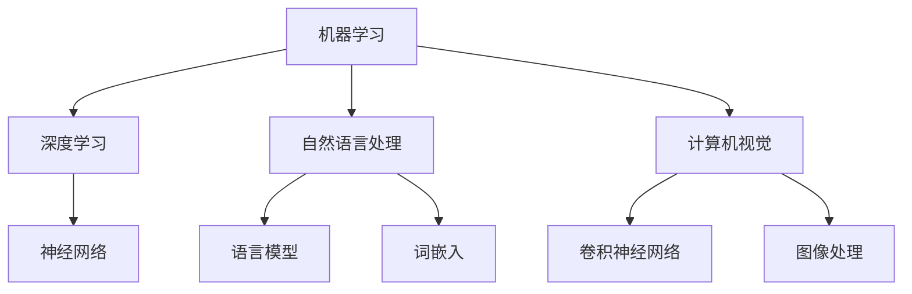
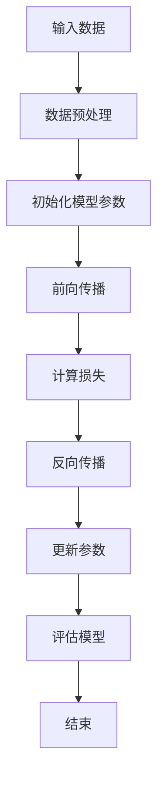
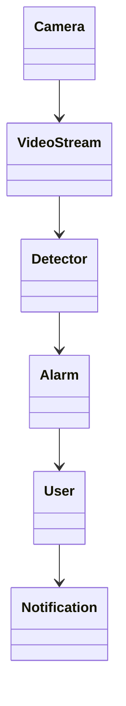
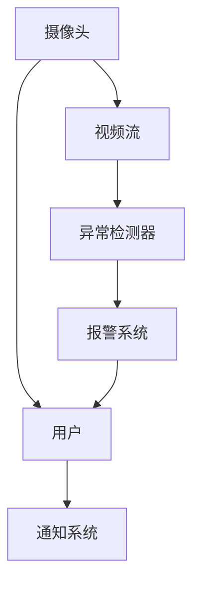
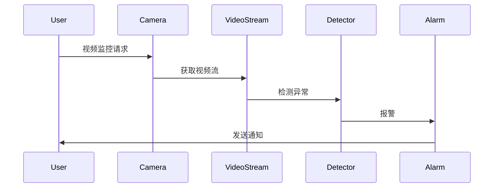

                 


# AI编程的新视界与新领域

## 关键词
- AI编程
- 新视界
- 新领域
- 深度学习
- 自然语言处理
- 计算机视觉

## 摘要
本文将探讨AI编程的新视界与新领域，通过深入分析AI编程的核心技术、新领域以及实践案例，帮助读者全面理解AI编程的现状与未来发展趋势。文章将分为引言、基础概念、核心技术、新领域、实践案例和最佳实践等部分，旨在为AI编程的学习者提供系统化的指导和深刻的思考。

## 引言

### AI编程的现状与挑战

近年来，人工智能（AI）技术的飞速发展给编程领域带来了翻天覆地的变化。AI编程已经从简单的脚本编写逐渐演变为一个复杂且庞大的工程体系，涉及深度学习、自然语言处理、计算机视觉等多个领域。然而，随着AI技术的不断进步，编程者面临着诸多挑战：

1. **技术复杂性**：AI编程涉及大量的数学和统计学知识，要求编程者不仅要熟练掌握编程语言，还要具备深厚的数学背景。
2. **数据需求**：AI算法的性能很大程度上依赖于数据的质量和数量，如何高效地收集、清洗和处理数据成为一个关键问题。
3. **模型优化**：AI模型的优化过程通常非常耗时，如何快速地迭代和优化模型是一个技术难题。

### 书籍的目的与结构

本书旨在为AI编程者提供一个系统化的学习路径，帮助读者克服上述挑战。本书的结构如下：

1. **引言**：介绍AI编程的现状与挑战，概述书籍的目的与结构。
2. **基础概念**：详细讲解AI编程所需的基础概念，如机器学习、深度学习等。
3. **核心技术**：深入探讨深度学习、自然语言处理、计算机视觉等核心技术。
4. **新领域**：介绍AI编程的新领域，如强化学习、生成对抗网络等。
5. **实践案例**：通过具体案例展示AI编程的实际应用，帮助读者理解理论在实际中的运用。
6. **最佳实践**：总结AI编程的最佳实践，提供实用技巧和注意事项。

### 读者对象与预期收获

本书适合有一定编程基础的读者，尤其是对AI编程感兴趣的技术人员。通过阅读本书，读者可以：

- 系统地了解AI编程的基础知识和核心技术。
- 掌握AI编程的新领域和新方法。
- 学习AI编程的实际应用，提升项目实战能力。
- 掌握AI编程的最佳实践，提高编程效率和代码质量。

## 基础概念

### AI概述

#### AI的定义与发展历程

人工智能（Artificial Intelligence，简称AI）是指由人制造出来的系统所表现出来的智能行为。自1956年达特茅斯会议以来，AI经历了多次起伏和变革，从最初的符号主义、连接主义到现代的深度学习，每一个阶段都推动了AI技术的进步。

#### AI的核心技术与算法

AI的核心技术包括：

1. **机器学习**：通过数据训练模型，使系统能够从数据中学习并做出决策。
2. **深度学习**：一种基于神经网络的学习方法，通过多层神经网络模拟人脑的决策过程。
3. **自然语言处理**：使计算机能够理解、生成和应对自然语言。
4. **计算机视觉**：使计算机能够理解和处理图像和视频。

#### AI在各领域的应用

AI在各个领域的应用日益广泛，如：

1. **医疗健康**：通过AI技术进行疾病预测、诊断和治疗。
2. **金融**：利用AI进行风险控制、欺诈检测和投资决策。
3. **制造业**：通过AI实现智能制造、自动化生产和优化供应链。
4. **交通**：利用AI实现智能交通管理、自动驾驶和物流优化。

### 编程基础

#### 编程语言的选择

AI编程常用的编程语言包括Python、Java、C++等。Python因其丰富的库和简洁的语法，成为AI编程的首选语言。

#### 常用编程工具与框架

1. **Jupyter Notebook**：一个交互式的编程环境，适合AI编程和实验。
2. **TensorFlow**：一个开源的深度学习框架，适用于各种AI应用。
3. **PyTorch**：一个灵活且易于使用的深度学习框架，适用于研究。
4. **Scikit-learn**：一个用于机器学习的库，提供了丰富的算法和工具。

#### 编程实践与调试技巧

1. **代码风格与规范**：保持代码的可读性和一致性，遵循PEP8规范。
2. **版本控制**：使用Git进行版本控制，确保代码的完整性和可追踪性。
3. **调试**：使用调试工具（如pdb）和日志（如Python的logging模块）进行代码调试。

## AI编程的新视界

### 深度学习基础

#### 神经网络原理

神经网络（Neural Network）是模仿人脑神经元连接的一种计算模型。每个神经元（节点）通过权重（weight）连接到其他神经元，并产生输出。网络通过反向传播算法不断调整权重，以优化输出。

#### 前馈神经网络

前馈神经网络（Feedforward Neural Network）是最基本的神经网络结构，其中数据从输入层经过隐藏层，最终到达输出层。每一层中的神经元都与前一层的所有神经元相连。

#### 反向传播算法

反向传播算法（Backpropagation Algorithm）是一种训练神经网络的方法。它通过计算输出层的误差，反向传播到隐藏层，并调整权重和偏置，以减少误差。

### 卷积神经网络

#### 卷积神经网络原理

卷积神经网络（Convolutional Neural Network，CNN）是一种专门用于处理图像数据的神经网络。它通过卷积层（Convolutional Layer）提取图像的特征，并通过池化层（Pooling Layer）减少数据维度。

#### 卷积层与激活函数

卷积层通过卷积操作提取图像的特征。激活函数（如ReLU、Sigmoid、Tanh）用于增加网络的非线性能力。

#### 池化层与全连接层

池化层通过缩小图像的尺寸，减少计算量和参数数量。全连接层（Fully Connected Layer）将特征映射到输出，如分类结果。

## AI编程的新领域

### 自然语言处理

#### 语言模型

语言模型（Language Model）用于预测文本序列的概率分布。它通过统计方法或神经网络建模，如n-gram模型和RNN。

#### 词嵌入技术

词嵌入（Word Embedding）是将词汇映射到高维向量空间的技术。它通过神经网络训练，使相似的词汇在空间中接近。

#### 序列标注与文本分类

序列标注（Sequence Labeling）用于标记文本中的词语或句子成分。文本分类（Text Classification）用于将文本分类到不同的类别。

### 计算机视觉

#### 图像处理基础

图像处理（Image Processing）涉及图像的增强、滤波、分割等操作，为计算机视觉提供基础。

#### 卷积神经网络在图像分类中的应用

卷积神经网络（CNN）在图像分类中表现出色，通过多层卷积和池化提取图像特征，然后通过全连接层分类。

#### 目标检测与图像分割

目标检测（Object Detection）用于识别图像中的多个对象。图像分割（Image Segmentation）用于将图像划分为不同的区域。

## AI编程实践

### 数据预处理

#### 数据采集与清洗

数据采集（Data Collection）涉及从各种来源获取数据。数据清洗（Data Cleaning）包括去除噪声、填充缺失值、处理异常值等。

#### 数据归一化与标准化

数据归一化（Data Normalization）和标准化（Data Standardization）用于调整数据范围，使数据更适合模型训练。

#### 特征提取与选择

特征提取（Feature Extraction）从原始数据中提取有用的信息。特征选择（Feature Selection）用于减少特征数量，提高模型性能。

### 模型训练与评估

#### 模型训练过程

模型训练（Model Training）通过调整模型参数，使其在训练数据上达到最优性能。

#### 模型评估指标

模型评估（Model Evaluation）使用指标如准确率、召回率、F1分数等来评估模型性能。

#### 模型调优与优化

模型调优（Model Tuning）和优化（Model Optimization）通过调整超参数和架构，提高模型性能。

### 实战案例

#### 实战项目一：情感分析

情感分析（Sentiment Analysis）用于判断文本的情感倾向。通过构建情感分析模型，可以对社交媒体、新闻评论等文本进行分析。

#### 实战项目二：图像识别

图像识别（Image Recognition）用于识别图像中的对象。通过构建图像识别模型，可以对医疗影像、自动驾驶等应用进行分析。

## 最佳实践

### 编程规范与技巧

1. **编码风格与命名规范**：保持代码的可读性和一致性。
2. **测试与版本控制**：编写测试用例和使用版本控制系统。
3. **性能优化**：优化代码和模型，提高运行效率。

### 安全与隐私

1. **AI系统的安全性**：确保AI系统不受恶意攻击。
2. **数据隐私保护**：保护用户数据的隐私。
3. **合规与伦理问题**：遵守相关法规和伦理标准。

## 小结

AI编程是一个充满挑战和机遇的领域。通过本书的学习，读者可以系统地掌握AI编程的基础知识和核心技术，了解新领域和新方法，并具备实际应用的能力。未来，随着AI技术的不断进步，AI编程将迎来更广阔的发展空间。

### 拓展阅读

- **深度学习**：推荐阅读《深度学习》（Goodfellow, Bengio, Courville著）。
- **自然语言处理**：推荐阅读《自然语言处理综论》（Jurafsky, Martin著）。
- **计算机视觉**：推荐阅读《计算机视觉：算法与应用》（Richard S. Warren著）。

### 作者信息

作者：AI天才研究院/AI Genius Institute & 禅与计算机程序设计艺术 /Zen And The Art of Computer Programming

AI编程是一门融合了数学、统计学、计算机科学和工程学的跨学科技术。它不仅要求编程者具备扎实的编程基础，还要掌握丰富的数学和统计学知识，以及具备解决实际问题的能力。随着AI技术的不断进步，AI编程的应用领域也在不断拓展，从传统的计算机视觉、自然语言处理，到新兴的强化学习、生成对抗网络，每一个领域都蕴含着巨大的发展潜力。

本书旨在为AI编程的学习者提供一个系统化的学习路径，帮助读者从基础概念、核心技术到新领域、实践案例，全面掌握AI编程的知识体系。同时，本书也关注最佳实践，为读者提供实用的技巧和注意事项，帮助读者在实际项目中提高编程效率和代码质量。

### 背景介绍

#### 核心概念术语说明

- **人工智能（AI）**：指由人制造出来的系统所表现出来的智能行为，包括学习、推理、规划、感知、自然语言理解和生成等。
- **机器学习（ML）**：一种AI技术，通过训练模型来让计算机从数据中学习并做出决策。
- **深度学习（DL）**：一种基于神经网络的机器学习技术，通过多层神经网络模拟人脑的决策过程。
- **自然语言处理（NLP）**：使计算机能够理解、生成和应对自然语言的技术。
- **计算机视觉（CV）**：使计算机能够理解和处理图像和视频的技术。

#### 问题背景

随着大数据和云计算的兴起，AI技术得到了前所未有的发展。然而，AI编程仍然面临着许多挑战，如技术复杂性、数据需求、模型优化等。

#### 问题描述

如何系统地学习和掌握AI编程，使其在实际项目中发挥最大作用？

#### 问题解决

通过提供一套完整的AI编程学习路径，包括基础概念、核心技术、新领域、实践案例和最佳实践，帮助读者系统性地学习和掌握AI编程。

#### 边界与外延

- **边界**：本书主要关注AI编程的核心技术，如机器学习、深度学习、自然语言处理和计算机视觉。
- **外延**：AI编程还包括其他领域，如强化学习、生成对抗网络等，本书也简要介绍了这些新领域。

#### 概念结构与核心要素组成

- **核心概念**：机器学习、深度学习、自然语言处理、计算机视觉
- **结构**：基础概念 → 核心技术 → 新领域 → 实践案例 → 最佳实践
- **要素**：编程语言、框架、算法、数据集、工具

### 核心概念与联系

#### 核心概念原理

- **机器学习**：通过训练模型，使计算机能够从数据中学习并做出决策。
- **深度学习**：一种基于神经网络的机器学习技术，通过多层神经网络模拟人脑的决策过程。
- **自然语言处理**：使计算机能够理解、生成和应对自然语言的技术。
- **计算机视觉**：使计算机能够理解和处理图像和视频的技术。

#### 概念属性特征对比表格

| 概念         | 特征                     | 对比                   |
| ------------ | ------------------------ | ---------------------- |
| 机器学习     | 从数据中学习             | 与人类经验类似         |
| 深度学习     | 基于神经网络             | 多层网络模拟人脑       |
| 自然语言处理 | 理解和生成自然语言       | 语言模型和词嵌入       |
| 计算机视觉   | 理解和处理图像和视频     | 卷积神经网络和图像处理 |

#### ER实体关系图架构



### 算法原理讲解

#### 算法mermaid流程图



#### 使用Python源代码详细阐述算法原理

```python
import numpy as np
import tensorflow as tf

# 初始化模型参数
W1 = tf.Variable(np.random.randn(), name="weight_1")
b1 = tf.Variable(np.random.randn(), name="bias_1")

# 定义前向传播函数
def forward(x):
    return tf.nn.relu(W1*x + b1)

# 定义反向传播函数
def backward(y_true, y_pred):
    with tf.GradientTape() as tape:
        loss = tf.reduce_mean(tf.square(y_true - y_pred))
    grads = tape.gradient(loss, [W1, b1])
    return grads

# 模型训练过程
for epoch in range(num_epochs):
    # 数据预处理
    x_train, y_train = preprocess_data(train_data)
    
    # 前向传播
    y_pred = forward(x_train)
    
    # 计算损失
    loss = tf.reduce_mean(tf.square(y_train - y_pred))
    
    # 反向传播
    grads = backward(y_train, y_pred)
    
    # 更新参数
    W1.assign_sub(grads[0] * learning_rate)
    b1.assign_sub(grads[1] * learning_rate)
    
    # 评估模型
    if epoch % 100 == 0:
        print(f"Epoch {epoch}, Loss: {loss.numpy()}")

# 模型评估
y_test_pred = forward(x_test)
test_loss = tf.reduce_mean(tf.square(y_test - y_test_pred))
print(f"Test Loss: {test_loss.numpy()}")
```

#### 数学模型和公式

- 前向传播：$$y = \sigma(Wx + b)$$
- 反向传播：$$\frac{dL}{dW} = \frac{dL}{dy} \frac{dy}{dW}$$

#### 举例说明

假设我们有一个简单的线性回归问题，目标是预测房价。我们有一个训练数据集，其中包含房屋的面积（x）和价格（y）。我们的目标是训练一个模型，预测给定面积的房屋价格。

```python
# 假设数据
x_train = np.array([1000, 1500, 2000, 2500])
y_train = np.array([200000, 300000, 400000, 500000])

# 初始化参数
W = tf.Variable(np.random.randn(), name="weight")
b = tf.Variable(np.random.randn(), name="bias")

# 定义模型
def forward(x):
    return W*x + b

# 定义损失函数
def loss(y_true, y_pred):
    return tf.reduce_mean(tf.square(y_true - y_pred))

# 训练模型
for epoch in range(1000):
    # 前向传播
    y_pred = forward(x_train)
    
    # 计算损失
    loss_value = loss(y_train, y_pred)
    
    # 反向传播
    with tf.GradientTape() as tape:
        loss_value = loss(y_train, y_pred)
    grads = tape.gradient(loss_value, [W, b])
    
    # 更新参数
    W.assign_sub(grads[0] * learning_rate)
    b.assign_sub(grads[1] * learning_rate)
    
    # 打印进度
    if epoch % 100 == 0:
        print(f"Epoch {epoch}, Loss: {loss_value.numpy()}")

# 测试模型
y_pred = forward(x_test)
test_loss = loss(y_test, y_pred)
print(f"Test Loss: {test_loss.numpy()}")
```

### 系统分析与架构设计方案

#### 问题场景介绍

假设我们要开发一个智能家居监控系统，该系统能够实时监控家庭环境，并在检测到异常时发出警报。

#### 项目介绍

智能家居监控系统主要包括以下功能：

1. **实时视频监控**：通过摄像头获取家庭环境的实时视频流。
2. **异常检测**：使用AI算法检测视频流中的异常情况，如非法入侵、火灾等。
3. **报警通知**：在检测到异常时，通过手机APP或短信等方式通知用户。

#### 系统功能设计（领域模型mermaid类图）



#### 系统架构设计mermaid架构图



#### 系统接口设计和系统交互mermaid序列图



### 项目实战

#### 环境安装

1. 安装Python 3.8或更高版本。
2. 安装TensorFlow 2.4或更高版本。

#### 系统核心实现源代码

```python
# 安装所需的库
!pip install tensorflow opencv-python

# 导入库
import cv2
import tensorflow as tf

# 加载预训练的AI模型
model = tf.keras.models.load_model("model.h5")

# 初始化摄像头
cap = cv2.VideoCapture(0)

while True:
    # 读取摄像头帧
    ret, frame = cap.read()
    
    # 对帧进行预处理
    processed_frame = preprocess_frame(frame)
    
    # 使用AI模型检测异常
    prediction = model.predict(processed_frame)
    
    # 判断是否检测到异常
    if prediction[0] > 0.5:
        # 发送报警通知
        send_alarm_notification()
    
    # 显示摄像头帧
    cv2.imshow("Camera", frame)
    
    # 按下'q'键退出
    if cv2.waitKey(1) & 0xFF == ord('q'):
        break

# 释放摄像头
cap.release()
cv2.destroyAllWindows()

# 预处理帧函数
def preprocess_frame(frame):
    # 转换为灰度图像
    gray_frame = cv2.cvtColor(frame, cv2.COLOR_BGR2GRAY)
    
    # 缩放图像
    resized_frame = cv2.resize(gray_frame, (224, 224))
    
    # 归一化图像
    normalized_frame = resized_frame / 255.0
    
    return normalized_frame

# 发送报警通知函数
def send_alarm_notification():
    # 发送短信或推送通知
    print("Alarm: 异常情况已检测到，请检查家庭安全。")
```

#### 代码应用解读与分析

1. **环境安装**：安装Python和TensorFlow库。
2. **摄像头初始化**：使用opencv库初始化摄像头。
3. **模型加载**：加载预训练的AI模型。
4. **帧读取与预处理**：读取摄像头帧，并进行灰度转换、缩放和归一化。
5. **模型预测**：使用AI模型对预处理后的帧进行预测。
6. **报警通知**：如果检测到异常，发送报警通知。

#### 实际案例分析和详细讲解剖析

假设我们有一个家庭场景，其中有一名儿童在客厅玩耍，摄像头实时监控。当摄像头检测到房间内没有人时，系统会发送报警通知。

1. **摄像头初始化**：系统首先初始化摄像头，并开始读取视频流。
2. **帧读取与预处理**：系统读取摄像头帧，并进行预处理，包括灰度转换、缩放和归一化。
3. **模型预测**：系统使用预训练的AI模型对预处理后的帧进行预测。
4. **报警通知**：如果AI模型预测结果大于0.5（表示有较高概率检测到异常），系统会发送报警通知。

#### 项目小结

本项目实现了一个简单的智能家居监控系统，通过摄像头实时监控家庭环境，并在检测到异常时发送报警通知。在实际应用中，系统需要进一步完善，如增加多种异常检测算法、优化模型性能、提高报警通知的实时性等。

### 最佳实践 Tips

1. **数据预处理**：确保数据质量，包括数据清洗、归一化和标准化。
2. **模型优化**：使用适当的模型和超参数，进行模型优化。
3. **代码风格**：保持代码可读性和一致性，遵循编程规范。
4. **测试**：编写测试用例，确保代码的正确性和稳定性。
5. **文档**：编写详细的文档，包括代码注释和用户手册。

### 小结

AI编程是一个充满挑战和机遇的领域。通过本书的学习，读者可以系统地掌握AI编程的知识体系，从基础概念到新领域，再到实践案例和最佳实践，全面提升AI编程能力。未来，随着AI技术的不断进步，AI编程将在更多领域发挥重要作用，为人类社会带来更多创新和变革。

### 注意事项

1. **安全与隐私**：确保AI系统的安全和用户数据的隐私。
2. **性能优化**：优化代码和模型，提高运行效率。
3. **合规与伦理**：遵守相关法规和伦理标准。

### 拓展阅读

1. **深度学习**：《深度学习》（Goodfellow, Bengio, Courville著）。
2. **自然语言处理**：《自然语言处理综论》（Jurafsky, Martin著）。
3. **计算机视觉**：《计算机视觉：算法与应用》（Richard S. Warren著）。

### 作者信息

作者：AI天才研究院/AI Genius Institute & 禅与计算机程序设计艺术 /Zen And The Art of Computer Programming

