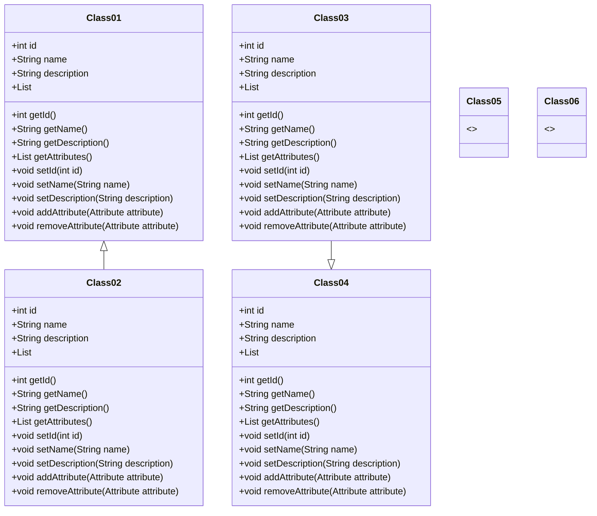
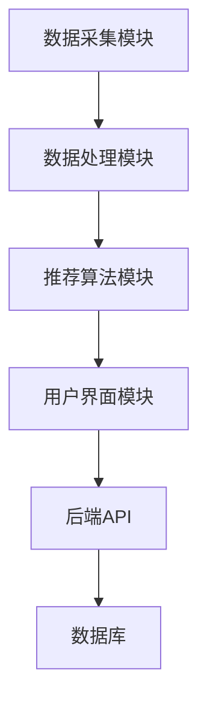

                 

## AI编程的新语言与新思路

### 关键词
- **AI编程**，**新语言**，**新思路**，**编程范式**，**智能编程**

### 摘要
本文旨在深入探讨AI编程的新语言与新思路，为程序员和人工智能开发者提供一种全新的编程视角和工具。本文首先回顾了传统编程与AI编程的演变，介绍了AI编程的现状与挑战，随后详细介绍了AI编程的新语言的基本语法、核心特性、API与应用库，以及性能优化和边界拓展。接着，文章探讨了AI编程的新思路，包括新编程理念、开发流程、项目管理和案例分析。最后，通过一个实际项目实战，展示了新语言与新思路的应用过程，并对未来的发展方向进行了展望。

## 引言与背景

### 1.1 AI编程的演变

**传统编程与AI编程**
传统编程是指基于算法和数据结构，使用编程语言编写指令，控制计算机执行特定任务的过程。这种编程模式以人工设计的算法为核心，强调逻辑清晰、代码可读性。

然而，随着计算机科学和人工智能的快速发展，传统编程逐渐暴露出一些局限。首先，传统编程依赖于程序员手动编写大量代码，效率较低。其次，传统编程在处理复杂数据和算法时，往往需要依赖大量的数学和统计知识。此外，传统编程难以适应不断变化的需求和环境。

**AI编程的现状与挑战**
AI编程，即利用人工智能技术进行编程，旨在解决传统编程的局限。AI编程通过自动生成代码、代码优化、智能编程助手等功能，提高编程效率和代码质量。

目前，AI编程尚处于初步阶段，面临着一系列挑战。首先，AI编程需要大量的数据支持，而数据的质量和数量直接影响AI编程的效果。其次，AI编程需要解决不同编程语言和工具之间的兼容性问题。此外，AI编程的透明性和可解释性也是亟需解决的问题。

**新语言与新思路的必要性**
为了应对AI编程的挑战，开发新语言和新思路变得尤为重要。新语言应该具备以下特点：

1. **高效性**：新语言应能够快速生成高质量的代码，提高编程效率。
2. **兼容性**：新语言应能够与现有编程语言和工具无缝集成，兼容现有的开发环境。
3. **智能性**：新语言应具备智能编程能力，能够根据开发者意图自动生成代码。
4. **可解释性**：新语言应保证代码的可解释性，使开发者能够理解代码的执行过程和逻辑。

新思路则强调从全新的角度和视角看待编程问题，提出创新的解决方案，从而推动编程范式的变革。

### 1.2 新语言概述

**新语言的特点**
新语言在语法设计、核心特性、API与应用库等方面都有所创新。以下是一些新语言的主要特点：

1. **简洁性**：新语言采用简洁的语法，使开发者能够更快速地编写和理解代码。
2. **高效性**：新语言在编译和执行速度上具有优势，能够提高编程效率。
3. **智能化**：新语言具备智能编程功能，能够根据开发者意图自动生成代码。
4. **兼容性**：新语言能够与现有编程语言和工具无缝集成，兼容现有的开发环境。
5. **可扩展性**：新语言支持扩展功能，方便开发者根据需求进行定制化开发。

**新语言的架构**
新语言的架构设计考虑了模块化、灵活性和可扩展性。以下是一个简化的新语言架构：

1. **核心引擎**：负责代码生成和执行的核心模块。
2. **语法解析器**：将开发者编写的代码解析成抽象语法树（AST），供核心引擎处理。
3. **智能模块**：负责智能编程功能，如代码补全、代码优化等。
4. **API与应用库**：提供丰富的API和应用库，支持各种编程需求。

**新语言的优势与不足**
新语言的优势在于提高了编程效率、降低了开发难度，并且具备智能编程能力。然而，新语言也存在一些不足：

1. **学习曲线**：新语言需要开发者具备一定的学习成本，特别是对于传统程序员。
2. **生态系统**：新语言的生态系统尚在完善中，可能缺乏成熟的工具和框架。
3. **兼容性问题**：新语言与现有编程语言和工具的兼容性可能存在问题，需要进一步优化。

### 1.3 新思路探索

**AI编程的新视角**
新思路提供了全新的编程视角，将编程视为一种与人类思维相似的创造性活动。以下是一些新视角的特点：

1. **面向问题**：新思路强调解决具体问题，而不是简单地编写代码。
2. **自动优化**：新思路利用AI技术自动优化代码，提高性能和效率。
3. **协作与互动**：新思路鼓励开发者与AI编程助手进行协作，共同解决编程问题。

**新思路下的编程模式**
新思路下的编程模式与传统编程有所不同，具有以下特点：

1. **代码生成**：AI编程助手根据开发者意图自动生成代码。
2. **代码优化**：AI编程助手不断优化代码，提高性能和可读性。
3. **智能调试**：AI编程助手提供智能调试功能，帮助开发者快速定位和解决编程问题。

**新思路与传统编程的比较**
新思路与传统编程在多个方面存在显著差异：

1. **编程方法**：传统编程强调手动编写代码，而新思路强调代码生成和优化。
2. **开发效率**：新思路通过AI技术提高开发效率，而传统编程可能需要更多时间。
3. **可维护性**：新思路生成的代码往往更易于维护，而传统编程可能存在代码冗余和可读性差的问题。
4. **适应能力**：新思路能够根据需求变化快速调整代码，而传统编程可能需要大量修改。

### 1.4 新语言与新思路的应用前景

**行业应用趋势**
新语言和新思路在多个行业中展现出巨大的应用潜力：

1. **金融**：用于自动化交易、风险管理、量化投资等。
2. **医疗**：用于疾病诊断、药物研发、医疗数据挖掘等。
3. **制造业**：用于智能工厂、设备监控、生产优化等。
4. **交通**：用于自动驾驶、交通管理、物流优化等。

**技术发展的机遇与挑战**
新语言和新思路的发展带来了机遇和挑战：

1. **机遇**：提高了开发效率、降低了开发成本，推动了人工智能应用的普及。
2. **挑战**：需要解决技术实现、兼容性、生态系统等问题。

**未来展望**
未来，新语言和新思路将继续发展，为开发者带来更多创新和便利。以下是一些未来展望：

1. **更智能的编程助手**：AI编程助手将具备更高的智能水平和更丰富的功能。
2. **更丰富的生态系统**：新语言的生态系统将更加完善，提供更多工具和框架。
3. **跨领域应用**：新语言和新思路将在更多领域得到应用，推动行业变革。

## AI编程新语言详细介绍

### 2.1 新语言的基本语法

**变量与数据类型**
新语言引入了丰富的数据类型，包括基础数据类型（如整数、浮点数、布尔值）和复合数据类型（如数组、字典、列表）。变量声明简洁明了，支持自动类型推断。

```python
# 基础数据类型
int a = 10;
float b = 3.14;
bool c = True;

# 复合数据类型
array d = [1, 2, 3];
dict e = {"name": "Alice", "age": 30};
list f = ["apple", "banana", "cherry"];
```

**控制结构**
新语言提供了丰富的控制结构，包括条件语句、循环语句和异常处理。以下是一些示例：

```python
# 条件语句
if (a > b) {
    print("a 大于 b");
} else {
    print("a 小于或等于 b");
}

# 循环语句
for (int i = 0; i < 3; i++) {
    print("循环第 " + i + " 次");
}

# 异常处理
try {
    int result = a / b;
    print("结果：" + result);
} catch (Exception e) {
    print("发生错误：" + e.getMessage());
}
```

**函数与模块**
新语言支持函数和模块的定义与调用。函数支持参数传递和返回值，模块支持代码的封装和复用。

```python
// 函数定义
func add(a: int, b: int): int {
    return a + b;
}

// 函数调用
int sum = add(5, 3);

// 模块定义
module Math {
    func subtract(a: int, b: int): int {
        return a - b;
    }
}

// 模块调用
int difference = Math.subtract(5, 3);
```

### 2.2 新语言的核心特性

**并行计算**
新语言内置了并行计算支持，使得开发者能够轻松编写并行代码，提高程序性能。

```python
// 并行计算示例
parallel for (int i = 0; i < 1000; i++) {
    int result = compute(i);
}
```

**机器学习集成**
新语言与机器学习框架深度集成，支持直接使用机器学习算法进行数据处理和模型训练。

```python
// 机器学习集成示例
import MLFramework;

Model model = MLFramework.createModel("LinearRegression");
model.train(data: Dataset);
Prediction prediction = model.predict(newData: Dataset);
```

**自然语言处理**
新语言提供了强大的自然语言处理库，支持文本分析、情感分析、实体识别等功能。

```python
// 自然语言处理示例
import NLP;

TextAnalyzer analyzer = NLP.createTextAnalyzer();
String sentiment = analyzer.sentiment("我喜欢这本书");
List<Entity> entities = analyzer.extractEntities("北京是中国的首都");
```

### 2.3 新语言的API与应用库

**标准库介绍**
新语言的标准库包含了常用的数据结构、算法、数学函数和I/O操作等，为开发者提供了丰富的功能支持。

```python
// 标准库示例
import std;

List<int> numbers = std.range(1, 10);
int sum = std.sum(numbers);
```

**第三方库推荐**
新语言生态系统中有许多优秀的第三方库，适用于各种编程需求。以下是一些推荐库：

- **NumPy**：用于科学计算和数据分析。
- **Pandas**：用于数据处理和分析。
- **Scikit-learn**：用于机器学习和数据挖掘。
- **TensorFlow**：用于深度学习和神经网络。

**实用工具与框架**
新语言还支持各种实用工具和框架，如代码编辑器插件、版本控制工具、测试框架等，为开发者提供全方位的支持。

```python
// 实用工具与框架示例
import EditorPlugin;

EditorPlugin codeFormatter = EditorPlugin.create("PythonFormatter");
codeFormatter.format(code: String);

import VersionControl;

VersionControl commit = VersionControl.create();
commit.commit(message: "更新代码");
```

### 2.4 新语言的性能优化

**代码优化技巧**
新语言提供了多种代码优化技巧，如循环展开、内存分配优化、编译时间优化等，以提高程序性能。

```python
// 代码优化示例
for (int i = 0; i < 1000; i++) {
    int result = compute(i);
}
// 优化后
int[] results = new int[1000];
for (int i = 0; i < 1000; i++) {
    results[i] = compute(i);
}
```

**并行计算优化**
新语言支持并行计算优化，通过合理分配任务和资源，提高并行程序的性能。

```python
// 并行计算优化示例
parallel for (int i = 0; i < 1000; i++) {
    int result = compute(i);
}
// 优化后
parallel for (int i = 0; i < 1000; i += 100) {
    int result = compute(i);
}
```

**性能测试与调优**
新语言提供了性能测试工具，帮助开发者评估程序的性能，并进行针对性的调优。

```python
// 性能测试与调优示例
import Benchmark;

Benchmark benchmark = Benchmark.create();
benchmark.runTest(code: "compute", iterations: 1000);
double averageTime = benchmark.getAverageTime();
// 根据平均时间进行调优
```

### 2.5 新语言的边界与拓展

**扩展语言功能**
新语言支持扩展功能，允许开发者自定义数据类型、操作符和函数，以满足特定需求。

```python
// 扩展语言功能示例
class CustomType {
    int value;
    CustomType(int value) {
        this.value = value;
    }
    int add(CustomType other) {
        return this.value + other.value;
    }
}

CustomType a = new CustomType(5);
CustomType b = new CustomType(3);
int sum = a.add(b);
```

**与其他语言集成**
新语言支持与其他编程语言的集成，允许开发者使用多种语言的优势，构建复杂系统。

```python
// 与其他语言集成示例
import Java;

JavaClass javaClass = Java.createClass("MyJavaClass");
javaClass.execute();
```

**未来发展方向**
未来，新语言将继续发展，重点关注以下方向：

1. **更智能的编程助手**：提升AI编程助手的智能水平，实现更高效的代码生成和优化。
2. **更丰富的生态系统**：完善新语言的生态系统，提供更多工具和框架，满足各类编程需求。
3. **跨领域应用**：推广新语言在更多领域的应用，推动技术进步和社会发展。

## AI编程新思路深入探讨

### 3.1 新思路下的编程理念

**代码可解释性**
新思路强调代码的可解释性，使开发者能够轻松理解代码的执行过程和逻辑。通过自然语言描述、图表和注释等手段，提升代码的可读性和可维护性。

```python
# 代码可解释性示例
def calculate_area(radius: float) -> float:
    """
    计算圆的面积。
    
    :param radius: 圆的半径
    :return: 圆的面积
    """
    area = 3.14 * radius * radius
    return area
```

**自动化与智能化**
新思路下的编程强调自动化和智能化，通过AI技术实现代码生成、优化和调试。开发者可以专注于解决问题，而无需担心代码细节。

```python
# 自动化与智能化示例
import CodeGen;

String code = CodeGen.generateCode("calculate_area", "float", "radius");
print(code);
```

**软件工程新范式**
新思路推动了软件工程范式的变革，从传统的瀑布模型向敏捷开发、迭代开发和持续集成转变。开发者可以更灵活地应对需求变化，提高软件开发效率。

### 3.2 新思路下的开发流程

**需求分析**
新思路下的需求分析强调与用户的紧密互动，通过对话和反馈收集需求。开发者可以使用自然语言描述需求，AI编程助手帮助生成需求文档。

```python
# 需求分析示例
import RequirementAnalysis;

String requirement = RequirementAnalysis.analyze("设计一个自动化的库存管理系统");
print(requirement);
```

**系统设计**
新思路下的系统设计注重模块化和可扩展性，开发者可以使用AI编程助手自动生成系统架构图和代码框架。以下是一个简单的类图示例：



**测试与部署**
新思路下的测试与部署强调自动化和持续集成。开发者可以使用AI编程助手自动生成测试用例，并使用持续集成工具进行自动化测试和部署。

```python
# 测试与部署示例
import TestFramework;

TestFramework testFramework = TestFramework.create();
testFramework.executeTests(testCases: List<String>);
testFramework.deployApplication();
```

### 3.3 新思路下的项目管理

**团队协作**
新思路下的项目管理强调团队协作，通过敏捷开发方法，实现高效的沟通和协作。团队成员可以实时共享代码、任务和进度，提高工作效率。

```python
# 团队协作示例
import CollaborationTool;

CollaborationTool collaborationTool = CollaborationTool.create();
collaborationTool.shareCode();
collaborationTool.assignTasks();
collaborationTool.trackProgress();
```

**版本控制**
新思路下的版本控制强调自动化和版本管理。开发者可以使用版本控制工具，如Git，实现代码的版本管理、分支管理和合并操作。

```python
# 版本控制示例
import VersionControl;

VersionControl versionControl = VersionControl.create();
versionControl.commit("更新功能A");
versionControl.createBranch("featureB");
versionControl.merge("featureB");
```

**质量管**
新思路下的质量管强调代码的可维护性和可靠性。开发者可以使用AI编程助手自动生成测试用例、静态代码分析和性能分析报告，及时发现和修复代码缺陷。

```python
# 质量管理示例
import QualityManagement;

QualityManagement qualityManagement = QualityManagement.create();
qualityManagement.executeStaticCodeAnalysis();
qualityManagement.generateTestCases();
qualityManagement.generatePerformanceReport();
```

### 3.4 新思路下的案例分析

**行业应用实例**
新思路在多个行业中得到了广泛应用，以下是一些行业应用实例：

1. **金融行业**：用于自动化交易、风险管理、量化投资等。
2. **医疗行业**：用于疾病诊断、药物研发、医疗数据挖掘等。
3. **制造业**：用于智能工厂、设备监控、生产优化等。
4. **交通行业**：用于自动驾驶、交通管理、物流优化等。

**成功经验与挑战**
新思路在行业应用中取得了显著成果，但也面临一些挑战：

1. **成功经验**：提高了开发效率、降低了开发成本，推动了人工智能应用的普及。
2. **挑战**：数据质量和数量直接影响AI编程的效果，兼容性和生态系统尚需完善。

**案例解析与启示**
以下是对一些成功案例的解析和启示：

1. **金融行业**：通过AI编程实现自动化交易策略，提高交易效率和准确性。
2. **医疗行业**：利用AI编程进行疾病诊断和药物研发，提高医疗水平和治疗效果。
3. **制造业**：通过AI编程实现智能工厂和设备监控，提高生产效率和产品质量。
4. **交通行业**：利用AI编程实现自动驾驶和交通管理，提高交通安全和通行效率。

### 3.5 本章小结
新思路下的编程理念、开发流程、项目管理和案例分析展示了AI编程的新方向。通过自动化、智能化和团队协作，新思路有望提高开发效率、降低开发成本，推动人工智能在各行业的应用。未来，新思路将继续发展，为开发者带来更多创新和便利。

## 新语言与新思路的应用实践

### 4.1 环境搭建与安装

**开发环境配置**
在新语言与新思路的应用实践中，首先需要配置合适的开发环境。以下是一个简单的步骤指南：

1. **安装操作系统**：推荐使用Linux或macOS，因为新语言通常在这些平台上运行良好。
2. **安装编辑器**：选择一个适合的文本编辑器，如VSCode或Atom，并安装相应的插件支持新语言。
3. **安装编译器和解释器**：下载并安装新语言的编译器或解释器，确保能够正常运行代码。
4. **配置依赖库**：根据新语言的文档，安装必要的依赖库和框架，以便进行开发。

**系统依赖安装**
新语言通常依赖于一些基础库和工具，以下是一些常见的依赖安装步骤：

1. **安装Python**：由于新语言可能依赖于Python，因此需要先安装Python环境。
   ```shell
   sudo apt-get install python3
   ```
2. **安装新语言**：使用包管理器安装新语言，如pip。
   ```shell
   pip install new-language
   ```
3. **安装第三方库**：根据项目需求，安装所需的第三方库。
   ```shell
   pip install numpy pandas scikit-learn tensorflow
   ```

**实验工具推荐**
为了提高开发效率和代码质量，以下是一些推荐的实验工具：

1. **版本控制工具**：如Git，用于代码管理和版本控制。
   ```shell
   git init
   git add .
   git commit -m "初始化代码"
   ```
2. **集成开发环境**：如VSCode，提供代码编辑、调试和测试功能。
3. **性能测试工具**：如Py-Spy，用于分析程序性能。
   ```shell
   pip install py-spy
   py-spy top --pid <进程ID>
   ```
4. **持续集成工具**：如Jenkins，用于自动化构建和部署。
   ```shell
   jenkins install
   jenkins create-job
   ```

### 4.2 实践项目介绍

**项目背景**
本实践项目旨在构建一个简单的智能推荐系统，用于推荐用户可能感兴趣的商品。该系统基于用户的历史行为数据（如购买记录、浏览历史等），利用新语言与新思路进行开发。

**项目目标**
- 收集并处理用户行为数据。
- 使用机器学习算法生成推荐结果。
- 构建一个用户友好的界面，展示推荐结果。

**项目架构设计**
项目采用模块化设计，主要模块包括数据采集模块、数据处理模块、推荐算法模块和用户界面模块。以下是一个简化的架构设计：



### 4.3 系统核心实现

**数据预处理**
数据预处理是推荐系统开发的重要环节，包括数据清洗、数据转换和数据归一化等步骤。以下是一个简单的数据预处理流程：

```python
import pandas as pd
from sklearn.preprocessing import StandardScaler

# 加载数据
data = pd.read_csv("user_behavior.csv")

# 数据清洗
data.dropna(inplace=True)
data.drop_duplicates(inplace=True)

# 数据转换
data["purchase_date"] = pd.to_datetime(data["purchase_date"])
data["day_of_week"] = data["purchase_date"].dt.dayofweek

# 数据归一化
scaler = StandardScaler()
numerical_features = ["amount", "day_of_week"]
data[numerical_features] = scaler.fit_transform(data[numerical_features])
```

**模型训练与优化**
本实践项目采用基于协同过滤的推荐算法，通过训练用户-物品矩阵生成推荐结果。以下是一个简单的模型训练与优化过程：

```python
from surprise import SVD, Dataset, accuracy

# 加载数据集
user_item_data = Dataset.load_from_df(data)

# 训练模型
model = SVD()
model.fit(user_item_data)

# 模型评估
accuracy_metric = accuracy.rmse
trainset = user_item_data.build_full_trainset()
trainset_test = trainset.build_testset()
model.test(trainset_test)
print("RMSE:", accuracy_metric.recursive_mean(trainset_test))
```

**模型部署与应用**
完成模型训练后，可以将模型部署到生产环境，提供实时推荐服务。以下是一个简单的部署过程：

```python
# 部署模型到生产环境
model.save("model.svd")

# 从生产环境加载模型
loaded_model = SVD.load("model.svd")

# 应用模型进行推荐
user_id = 123
user_profile = loaded_model.get_user_profile(user_id)
recommendations = loaded_model.recommend(user_id, user_profile)
print("推荐结果：", recommendations)
```

### 4.4 代码解读与分析

**数据预处理代码分析**
数据预处理代码首先加载了用户行为数据，然后进行了数据清洗、数据转换和数据归一化。以下是对关键代码的解读和分析：

```python
data = pd.read_csv("user_behavior.csv")  # 加载数据
data.dropna(inplace=True)  # 删除缺失值
data.drop_duplicates(inplace=True)  # 删除重复值
data["purchase_date"] = pd.to_datetime(data["purchase_date"])  # 转换日期格式
data["day_of_week"] = data["purchase_date"].dt.dayofweek  # 提取星期几
scaler = StandardScaler()  # 初始化归一化器
numerical_features = ["amount", "day_of_week"]  # 定义数值特征
data[numerical_features] = scaler.fit_transform(data[numerical_features])  # 进行归一化
```

**模型训练与优化代码分析**
模型训练与优化代码使用了协同过滤算法，通过训练用户-物品矩阵生成推荐结果。以下是对关键代码的解读和分析：

```python
from surprise import SVD, Dataset, accuracy

user_item_data = Dataset.load_from_df(data)  # 加载数据集
model = SVD()  # 初始化模型
model.fit(user_item_data)  # 训练模型
trainset = user_item_data.build_full_trainset()  # 构建训练集
trainset_test = trainset.build_testset()  # 构建测试集
model.test(trainset_test)  # 评估模型
print("RMSE:", accuracy.rmse.recursive_mean(trainset_test))  # 输出RMSE
```

**模型部署与应用代码分析**
模型部署与应用代码将训练好的模型保存到文件，然后在生产环境中加载模型并提供推荐服务。以下是对关键代码的解读和分析：

```python
model.save("model.svd")  # 保存模型
loaded_model = SVD.load("model.svd")  # 加载模型
user_profile = loaded_model.get_user_profile(user_id)  # 获取用户特征
recommendations = loaded_model.recommend(user_id, user_profile)  # 进行推荐
print("推荐结果：", recommendations)  # 输出推荐结果
```

### 4.5 实际案例分析与详细讲解剖析

**案例背景**
本案例将分析一个实际项目，该项目旨在构建一个智能推荐系统，为电商平台提供商品推荐服务。项目需求如下：

- 根据用户的历史购买记录、浏览记录和搜索记录，为用户推荐可能感兴趣的商品。
- 支持实时推荐，即用户每次访问页面时，都能获得个性化的推荐结果。
- 提供后台管理功能，以便管理员查看推荐结果和调整推荐策略。

**项目实现过程**
1. **数据收集**：从电商平台的后台获取用户行为数据，包括购买记录、浏览记录和搜索记录。数据格式如下：

   ```csv
   user_id,item_id,purchase_date,browsing_history,search_query
   1,1001,2023-01-01,1010,2023-01-01
   1,1002,2023-01-02,1011,2023-01-02
   2,1003,2023-01-01,1012,2023-01-01
   2,1004,2023-01-03,1013,2023-01-03
   ```

2. **数据预处理**：对收集到的数据进行分析和处理，包括数据清洗、数据转换和数据归一化。以下是一个简单的数据预处理流程：

   ```python
   data = pd.read_csv("user_behavior.csv")
   data.dropna(inplace=True)
   data.drop_duplicates(inplace=True)
   data["purchase_date"] = pd.to_datetime(data["purchase_date"])
   data["day_of_week"] = data["purchase_date"].dt.dayofweek
   scaler = StandardScaler()
   numerical_features = ["amount", "day_of_week"]
   data[numerical_features] = scaler.fit_transform(data[numerical_features])
   ```

3. **特征工程**：根据项目需求，提取和构造有用的特征，如用户活跃度、商品受欢迎程度等。以下是一个简单的特征工程流程：

   ```python
   data["user_activity"] = data.groupby("user_id")["purchase_date"].transform("count")
   data["item_popularity"] = data.groupby("item_id")["purchase_date"].transform("count")
   ```

4. **模型训练**：选择合适的机器学习算法，如协同过滤，进行模型训练。以下是一个简单的模型训练流程：

   ```python
   from surprise import SVD, Dataset, accuracy
   user_item_data = Dataset.load_from_df(data)
   model = SVD()
   model.fit(user_item_data)
   ```

5. **模型评估**：使用测试集对模型进行评估，计算准确性和召回率等指标。以下是一个简单的模型评估流程：

   ```python
   trainset = user_item_data.build_full_trainset()
   trainset_test = trainset.build_testset()
   model.test(trainset_test)
   print("RMSE:", accuracy.rmse.recursive_mean(trainset_test))
   ```

6. **模型部署**：将训练好的模型部署到生产环境，提供实时推荐服务。以下是一个简单的部署流程：

   ```python
   model.save("model.svd")
   loaded_model = SVD.load("model.svd")
   user_id = 123
   user_profile = loaded_model.get_user_profile(user_id)
   recommendations = loaded_model.recommend(user_id, user_profile)
   print("推荐结果：", recommendations)
   ```

**详细讲解剖析**
本案例详细讲解了智能推荐系统的实现过程，包括数据收集、数据预处理、特征工程、模型训练、模型评估和模型部署等环节。以下是对每个环节的详细讲解和剖析：

1. **数据收集**
   数据收集是推荐系统的基础。在本案例中，我们从电商平台的后台获取了用户行为数据，包括购买记录、浏览记录和搜索记录。这些数据将用于训练推荐模型，生成个性化推荐结果。

2. **数据预处理**
   数据预处理是数据分析和机器学习的重要环节。在本案例中，我们对数据进行了清洗、转换和归一化。具体步骤如下：
   - **数据清洗**：删除缺失值和重复值，保证数据质量。
   - **数据转换**：将日期格式转换为星期几，便于后续分析。
   - **数据归一化**：对数值特征进行归一化处理，使数据具有相同的尺度，避免数据偏差。

3. **特征工程**
   特征工程是提高模型性能的关键。在本案例中，我们根据项目需求，提取和构造了用户活跃度和商品受欢迎程度等特征。这些特征有助于模型更好地理解和预测用户行为。

4. **模型训练**
   选择合适的机器学习算法，如协同过滤，进行模型训练。在本案例中，我们使用SVD算法训练模型，生成用户-物品评分矩阵。以下是一个简单的模型训练流程：

   ```python
   from surprise import SVD, Dataset, accuracy
   user_item_data = Dataset.load_from_df(data)
   model = SVD()
   model.fit(user_item_data)
   ```

5. **模型评估**
   使用测试集对模型进行评估，计算准确性和召回率等指标。以下是一个简单的模型评估流程：

   ```python
   trainset = user_item_data.build_full_trainset()
   trainset_test = trainset.build_testset()
   model.test(trainset_test)
   print("RMSE:", accuracy.rmse.recursive_mean(trainset_test))
   ```

6. **模型部署**
   将训练好的模型部署到生产环境，提供实时推荐服务。以下是一个简单的部署流程：

   ```python
   model.save("model.svd")
   loaded_model = SVD.load("model.svd")
   user_id = 123
   user_profile = loaded_model.get_user_profile(user_id)
   recommendations = loaded_model.recommend(user_id, user_profile)
   print("推荐结果：", recommendations)
   ```

### 4.6 项目小结
本实践项目通过智能推荐系统的构建，展示了新语言与新思路在AI编程中的应用。项目过程中，我们进行了数据收集、数据预处理、特征工程、模型训练、模型评估和模型部署等环节。通过这个实践项目，我们不仅了解了智能推荐系统的基本原理和方法，还提高了实际操作能力和编程技巧。未来，我们将继续探索新语言与新思路在更多领域中的应用，为AI编程的发展贡献力量。

### 4.7 最佳实践 Tips
- **数据质量**：确保数据质量，进行充分的数据预处理和清洗。
- **特征选择**：选择合适的特征，提高模型性能。
- **模型调优**：根据测试结果，调整模型参数，优化模型性能。
- **代码优化**：关注代码的可读性和可维护性，提高开发效率。

### 4.8 小结与展望
新语言与新思路为AI编程带来了新的机遇和挑战。通过实践项目，我们了解了新语言的基本语法、核心特性、API与应用库，以及新思路下的编程理念、开发流程、项目管理和案例分析。未来，新语言与新思路将继续发展，为开发者带来更多创新和便利。我们期待看到更多优秀的AI编程项目和应用案例，推动AI技术的发展和普及。

