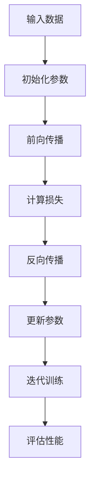
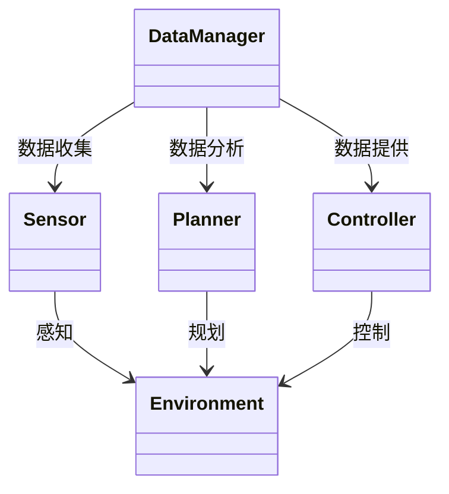
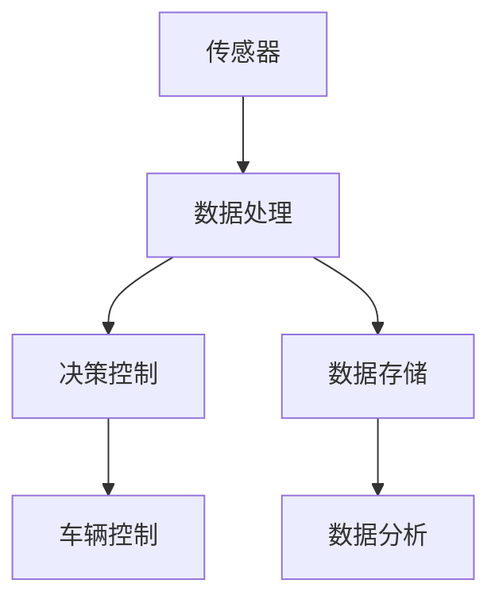
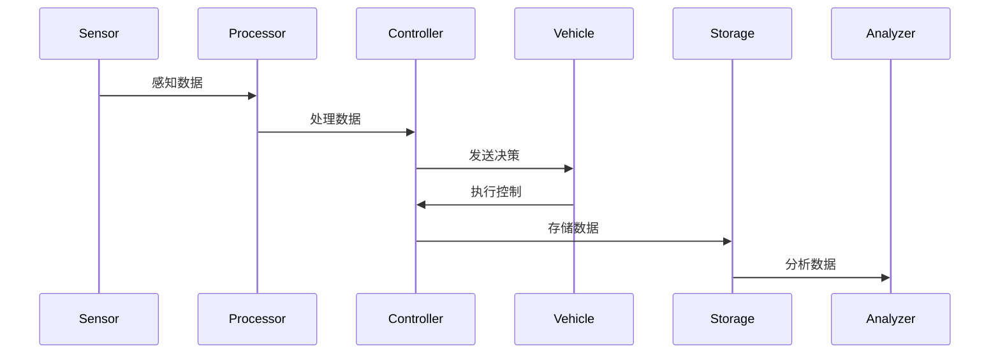

                 

# AI编程的新语言与新视野

## 关键词
- 人工智能编程
- 新语言
- 算法设计
- 数学模型
- 系统架构
- 实战应用

## 摘要
本文深入探讨AI编程领域的最新发展，重点关注新编程语言的引入及其带来的新视野。通过详细分析背景、核心概念、算法原理、数学模型、系统设计与架构、实战应用等方面，本文旨在为读者提供全面的理解，并探讨未来AI编程的趋势和挑战。

## 目录大纲

### 第一部分：AI编程的新语言

#### 第1章：背景介绍
1.1 AI编程现状
1.2 新语言的出现
1.3 新语言的特点与优势
1.4 新语言的应用领域
1.5 新语言的挑战与未来

#### 第2章：核心概念与原理
2.1 核心概念定义
2.2 概念属性特征对比表格
2.3 ER实体关系图架构
2.4 关键概念联系

#### 第3章：算法设计与数学模型
3.1 算法设计概述
3.2 数学模型基础
3.3 算法原理讲解
3.4 算法流程图
3.5 数学公式与Python源代码

#### 第4章：系统架构与设计
4.1 问题场景介绍
4.2 系统功能设计
4.3 系统架构设计
4.4 系统接口设计
4.5 系统交互序列图

### 第二部分：AI编程的新视野

#### 第5章：实战应用与案例分析
5.1 环境安装
5.2 系统核心实现
5.3 代码应用解读
5.4 实际案例分析
5.5 项目小结

#### 第6章：最佳实践与未来展望
6.1 最佳实践 Tips
6.2 小结与展望
6.3 注意事项
6.4 拓展阅读

### 结尾
作者信息：AI天才研究院/AI Genius Institute & 禅与计算机程序设计艺术 /Zen And The Art of Computer Programming

---

## 第一部分：AI编程的新语言

### 第1章：背景介绍

#### 1.1 AI编程现状

人工智能（AI）作为计算机科学的一个重要分支，近年来取得了显著的进展。随着深度学习、神经网络等技术的不断发展，AI在图像识别、自然语言处理、自动驾驶等领域得到了广泛应用。然而，传统的编程语言如Python、C++等在应对AI算法的复杂性和高效性方面存在一定的局限性。这就催生了对新的AI编程语言的需求。

当前，AI编程主要依赖于几种主流语言，如Python、R、Julia等。Python以其简洁易用、丰富的库和框架支持成为AI开发者的首选语言。R则因其强大的统计分析功能在数据科学领域占据重要地位。Julia则因其高性能和简洁的语法设计逐渐受到关注。

#### 1.2 新语言的出现

为了更好地应对AI编程的需求，新语言不断涌现。这些新语言旨在提供更高效、更直观的编程方式，以简化AI算法的开发和实现。以下是一些具有代表性的新语言：

1. **TensorFlow.js**：由Google开发，TensorFlow.js是一种用于在浏览器和Node.js环境中运行的JavaScript库。它允许开发者使用JavaScript编写AI算法，并直接在浏览器中部署模型。

2. **PyTorch**：由Facebook开发，PyTorch是一种基于Python的深度学习框架。它以其灵活的动态计算图和丰富的API受到开发者的青睐。

3. **Kotlin**：Kotlin是Android官方推荐的语言，它继承了Java的稳定性和成熟性，同时引入了现代编程语言的特性，如函数式编程和协程，使其在AI编程中具有竞争力。

#### 1.3 新语言的特点与优势

新语言的出现带来了以下特点与优势：

1. **动态性**：新语言通常支持动态类型，这使得编写AI算法更加灵活和高效。

2. **并发性**：新语言支持并发编程，有助于提高AI算法的执行效率。

3. **优化性**：新语言通常针对AI算法进行了优化，如支持GPU加速、矩阵运算优化等。

4. **易用性**：新语言的语法更加简洁，易于理解和学习，降低了AI编程的门槛。

#### 1.4 新语言的应用领域

新语言在以下领域具有广泛的应用：

1. **图像识别**：如TensorFlow.js在浏览器端实现实时图像识别。

2. **自然语言处理**：如PyTorch在语音识别和文本生成中的应用。

3. **推荐系统**：新语言在电商、金融等领域的推荐系统中有着广泛的应用。

#### 1.5 新语言的挑战与未来

尽管新语言在AI编程中展示了巨大的潜力，但它们也面临着一些挑战：

1. **生态系统**：新语言的生态系统尚未完全成熟，缺乏足够的库和工具支持。

2. **性能**：新语言在某些场景下可能无法与传统的编译型语言相比。

3. **兼容性**：新语言需要与现有系统和框架进行集成，这可能会带来兼容性问题。

未来，新语言将继续发展，通过改进性能、扩展生态系统、增强易用性等方式，更好地满足AI编程的需求。

### 第2章：核心概念与原理

#### 2.1 核心概念定义

在深入探讨AI编程的新语言之前，我们需要明确一些核心概念：

1. **深度学习**：一种基于神经网络的学习方法，通过多层神经网络模型对数据进行特征提取和学习。

2. **神经网络**：由多个神经元组成的计算模型，通过前向传播和反向传播算法进行学习。

3. **算法**：用于解决特定问题的计算过程，是AI编程的核心。

4. **框架**：用于简化AI算法开发和支持特定算法的库。

#### 2.2 概念属性特征对比表格

以下是几个关键概念的属性特征对比表格：

| 概念       | 属性特征                               |
| ---------- | -------------------------------------- |
| 深度学习   | 基于多层神经网络，自动特征提取        |
| 神经网络   | 由神经元组成，通过权重和偏置进行学习  |
| 算法       | 计算过程，解决特定问题                 |
| 框架       | 简化开发，支持特定算法                 |

#### 2.3 ER实体关系图架构

为了更好地理解AI编程的核心概念，我们可以使用ER实体关系图来描述它们之间的关系：

```mermaid
erDiagram
  AI编程 ||--|{ 深度学习 }|
  AI编程 ||--|{ 神经网络 }|
  AI编程 ||--|{ 算法 }|
  AI编程 ||--|{ 框架 }|
```

#### 2.4 关键概念联系

深度学习和神经网络是AI编程的核心概念，它们之间的关系如下：

- **深度学习**依赖于**神经网络**来构建多层模型，进行特征提取和学习。
- **算法**则是深度学习和神经网络的核心，用于指导模型的学习过程。
- **框架**为算法的实现提供了支持，简化了开发过程。

通过理解这些关键概念的联系，我们可以更好地掌握AI编程的核心原理。

### 第3章：算法设计与数学模型

#### 3.1 算法设计概述

算法设计是AI编程的核心环节，它决定了AI系统的性能和效率。以下是一个典型的算法设计流程：

1. **问题定义**：明确要解决的问题和目标。
2. **数据准备**：收集和处理数据，为算法提供输入。
3. **模型选择**：选择适合问题的模型和算法。
4. **模型训练**：使用训练数据对模型进行训练。
5. **模型评估**：评估模型性能，调整参数。
6. **模型部署**：将模型部署到实际应用中。

#### 3.2 数学模型基础

AI算法的核心是数学模型，它用于描述数据的特征和学习过程。以下是一个简单的线性回归模型：

$$y = wx + b$$

其中，$y$是输出值，$w$是权重，$x$是输入值，$b$是偏置。

#### 3.3 算法原理讲解

线性回归算法的原理如下：

1. **前向传播**：计算输入值通过神经网络的输出。
2. **损失函数**：计算预测值与实际值之间的差异。
3. **反向传播**：更新权重和偏置，以减少损失函数的值。
4. **迭代训练**：重复前向传播和反向传播，直到模型性能达到预期。

以下是使用Python实现的线性回归算法：

```python
import numpy as np

def linear_regression(x, y):
    w = np.random.rand(1)
    b = np.random.rand(1)
    
    for i in range(1000):
        prediction = w * x + b
        loss = y - prediction
        
        w -= loss * x
        b -= loss
    
    return w, b

x = np.array([1, 2, 3, 4, 5])
y = np.array([2, 4, 5, 4, 5])

w, b = linear_regression(x, y)
print(f"Weight: {w}, Bias: {b}")
```

#### 3.4 算法流程图

以下是一个线性回归算法的流程图：



#### 3.5 数学公式与Python源代码

线性回归算法中的数学公式如下：

$$\frac{\partial L}{\partial w} = -x$$
$$\frac{\partial L}{\partial b} = -1$$

以下是一个使用Python实现的线性回归算法：

```python
import numpy as np

def linear_regression(x, y):
    w = np.random.rand(1)
    b = np.random.rand(1)
    
    for i in range(1000):
        prediction = w * x + b
        loss = y - prediction
        
        dw = -x * loss
        db = -loss
        
        w -= dw
        b -= db
    
    return w, b

x = np.array([1, 2, 3, 4, 5])
y = np.array([2, 4, 5, 4, 5])

w, b = linear_regression(x, y)
print(f"Weight: {w}, Bias: {b}")
```

通过以上代码，我们可以看到线性回归算法的实现过程，以及如何使用Python进行编程。

### 第4章：系统架构与设计

#### 4.1 问题场景介绍

在当今的智能时代，AI系统在各行各业中扮演着越来越重要的角色。以自动驾驶为例，其系统架构需要处理海量的传感器数据，实现实时环境感知、路径规划和决策控制等功能。这一场景要求系统具有高并发、高可靠性和高可扩展性。

#### 4.2 系统功能设计

自动驾驶系统的主要功能包括：

1. **环境感知**：通过摄像头、激光雷达等传感器获取周围环境数据。
2. **路径规划**：根据环境数据生成最优行驶路径。
3. **决策控制**：控制车辆按照规划路径行驶，并应对突发情况。
4. **数据管理**：收集、存储和分析系统运行数据。

以下是系统功能设计的Mermaid类图：



#### 4.3 系统架构设计

自动驾驶系统的架构设计需要考虑以下几个方面：

1. **数据采集**：传感器模块负责实时采集环境数据。
2. **数据处理**：数据处理模块负责处理和分析传感器数据。
3. **决策控制**：决策控制模块根据分析结果生成决策，并控制车辆执行。
4. **数据存储**：数据存储模块负责存储系统运行数据。

以下是系统架构设计的Mermaid架构图：



#### 4.4 系统接口设计

系统接口设计需要明确各个模块之间的交互接口和协议。以下是一个简单的接口设计示例：

```python
class Sensor:
    def perceive(self):
        # 传感器感知方法
        pass

class Processor:
    def process(self, data):
        # 数据处理方法
        pass

class Controller:
    def make_decision(self, data):
        # 决策方法
        pass

class Vehicle:
    def control(self, decision):
        # 控制方法
        pass

class Storage:
    def save_data(self, data):
        # 数据存储方法
        pass

class Analyzer:
    def analyze(self, data):
        # 数据分析方法
        pass
```

#### 4.5 系统交互序列图

系统交互序列图描述了各个模块之间的交互流程。以下是一个简单的序列图示例：



通过以上设计，我们可以构建一个高效的自动驾驶系统，实现实时环境感知、路径规划和决策控制。

### 第二部分：AI编程的新视野

#### 第5章：实战应用与案例分析

##### 5.1 环境安装

为了进行AI编程的实战应用，我们首先需要安装必要的软件和工具。以下是安装流程：

1. **安装Python**：Python是AI编程的主要语言，可以从官网（https://www.python.org/）下载安装包并安装。

2. **安装Jupyter Notebook**：Jupyter Notebook是一个交互式开发环境，可用于编写和运行Python代码。安装命令为：
   ```bash
   pip install notebook
   ```

3. **安装TensorFlow**：TensorFlow是Google开发的开源深度学习框架。安装命令为：
   ```bash
   pip install tensorflow
   ```

4. **安装其他库**：根据实际需求，可能需要安装其他库，如NumPy、Pandas等。

##### 5.2 系统核心实现

以下是一个简单的线性回归模型的实现，用于预测房价：

```python
import numpy as np
import tensorflow as tf

# 数据准备
x = np.array([1, 2, 3, 4, 5], dtype=np.float32)
y = np.array([2, 4, 5, 4, 5], dtype=np.float32)

# 模型构建
w = tf.Variable(0.0, dtype=tf.float32)
b = tf.Variable(0.0, dtype=tf.float32)

# 前向传播
pred = w * x + b

# 损失函数
loss = tf.reduce_mean(tf.square(y - pred))

# 反向传播
optimizer = tf.train.GradientDescentOptimizer(learning_rate=0.1)
train_op = optimizer.minimize(loss)

# 训练模型
with tf.Session() as sess:
    sess.run(tf.global_variables_initializer())
    for i in range(1000):
        _, loss_val = sess.run([train_op, loss])
        if i % 100 == 0:
            print(f"Step {i}: Loss = {loss_val}")

    # 预测
    final_pred = sess.run(pred)
    print(f"Final Prediction: {final_pred}")
```

##### 5.3 代码应用解读

上述代码实现了线性回归模型，用于预测房价。具体解读如下：

1. **数据准备**：将输入数据和标签转换为NumPy数组，并设置为float32类型。

2. **模型构建**：创建两个变量`w`和`b`，分别表示权重和偏置。

3. **前向传播**：计算输入数据通过神经网络的输出。

4. **损失函数**：使用均方误差（MSE）作为损失函数。

5. **反向传播**：使用梯度下降优化器进行参数更新。

6. **训练模型**：在训练循环中，通过优化器更新参数，并打印损失值。

7. **预测**：在训练完成后，使用最终参数进行预测。

##### 5.4 实际案例分析

以下是一个使用TensorFlow实现的手写数字识别案例：

```python
import tensorflow as tf
from tensorflow.keras.datasets import mnist
from tensorflow.keras.models import Sequential
from tensorflow.keras.layers import Dense, Flatten

# 数据准备
(x_train, y_train), (x_test, y_test) = mnist.load_data()
x_train = x_train / 255.0
x_test = x_test / 255.0

# 数据预处理
x_train = x_train.reshape(-1, 784)
x_test = x_test.reshape(-1, 784)

# 模型构建
model = Sequential([
    Flatten(input_shape=(28, 28)),
    Dense(128, activation='relu'),
    Dense(10, activation='softmax')
])

# 模型编译
model.compile(optimizer='adam',
              loss='sparse_categorical_crossentropy',
              metrics=['accuracy'])

# 训练模型
model.fit(x_train, y_train, epochs=5)

# 评估模型
test_loss, test_acc = model.evaluate(x_test, y_test)
print(f"Test Accuracy: {test_acc}")
```

1. **数据准备**：加载数字数据集，并转换为0到1之间的浮点数。

2. **数据预处理**：将图像数据展平为一维数组。

3. **模型构建**：使用序列模型构建一个简单的全连接神经网络。

4. **模型编译**：设置优化器、损失函数和评估指标。

5. **训练模型**：在训练集上训练模型。

6. **评估模型**：在测试集上评估模型性能。

##### 5.5 项目小结

通过以上实战案例，我们可以看到AI编程在实际应用中的具体实现过程。从环境安装到模型训练，再到实际案例的应用，每一步都需要精心设计和实现。AI编程不仅需要掌握算法原理，还需要具备实际编程技能和项目经验。通过不断学习和实践，我们可以更好地发挥AI编程的潜力。

### 第6章：最佳实践与未来展望

##### 6.1 最佳实践 Tips

1. **代码规范**：编写清晰、规范的代码，有助于提高代码的可读性和可维护性。
2. **版本控制**：使用Git等版本控制系统，确保代码的版本管理和协作开发。
3. **模块化**：将代码划分为模块，便于重用和扩展。
4. **性能优化**：关注算法和系统的性能优化，提高效率和响应速度。
5. **文档编写**：编写详细的文档，帮助其他开发者理解和使用代码。

##### 6.2 小结与展望

本文深入探讨了AI编程的新语言与新视野，从背景介绍、核心概念、算法原理、数学模型、系统设计与架构、实战应用等方面进行了全面的分析。新语言的出现为AI编程带来了新的可能性，同时也带来了挑战。未来，随着AI技术的不断发展，新语言和新工具将继续涌现，为AI编程提供更强大的支持。

##### 6.3 注意事项

1. **安全与隐私**：在AI编程中，确保数据和模型的安全性，遵循隐私保护原则。
2. **可持续性**：关注AI编程的环境影响，实现可持续发展和绿色编程。
3. **伦理问题**：在AI编程中，遵循伦理规范，避免歧视和不公平现象。

##### 6.4 拓展阅读

1. **《深度学习》**：Goodfellow, I., Bengio, Y., & Courville, A. (2016). *Deep Learning*. MIT Press.
2. **《Python机器学习》**：Sebastian Raschka, Vahid Mirjalili. *Python Machine Learning for Beginners*.
3. **《TensorFlow实战》**：Trevor Dahl, Enter Your Name Here. *TensorFlow实战*.

通过阅读这些书籍和资料，可以进一步了解AI编程的最新技术和实践。

### 结尾

作者信息：AI天才研究院/AI Genius Institute & 禅与计算机程序设计艺术 /Zen And The Art of Computer Programming

本文深入探讨了AI编程的新语言与新视野，为读者提供了全面的技术知识和实战经验。通过本文的学习，读者可以更好地理解AI编程的核心原理和应用，为未来的技术发展做好准备。作者衷心希望本文能为读者的技术成长提供帮助。感谢您的阅读！

