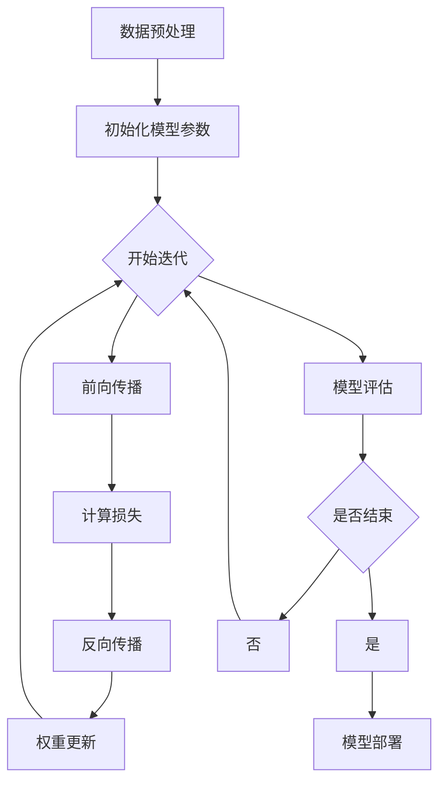
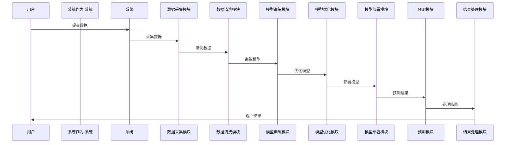

                 

### 连接人类智慧与机器智能

#### 关键词：
- 人工智能
- 机器智能
- 深度学习
- 软件2.0
- 企业级应用

#### 摘要：
本文旨在探讨如何通过人工智能与机器智能的结合，实现人类智慧与机器智能的有效连接。文章首先介绍了AI大模型在软件2.0时代的背景和核心概念，随后分析了AI大模型与软件2.0的联系，并详细讲解了AI大模型的定义、特点及其在企业级应用中的实现。通过本文，读者将深入了解AI大模型在连接人类智慧与机器智能中的作用和重要性。

## 第一部分：背景介绍与核心概念

### 1.1.1 问题背景

在21世纪，随着互联网和计算技术的飞速发展，人工智能（AI）技术逐渐成为推动社会进步的重要力量。传统的AI技术主要依赖于规则和统计方法，而近年来，以深度学习为代表的人工智能技术取得了重大突破，特别是AI大模型（Large AI Models）的崛起，极大地拓展了人工智能的应用领域和范围。

AI大模型，也被称为大型深度学习模型，具有处理海量数据、进行复杂任务和提供高精度预测的能力。这些模型通常包含数亿甚至数十亿个参数，能够从海量数据中学习到深层次的规律和知识。AI大模型的崛起，标志着人工智能技术进入了一个新的时代，即软件2.0时代。

### 1.1.2 问题描述

在软件2.0时代，AI大模型已经成为企业级应用开发的核心。然而，如何有效地利用AI大模型，实现人工智能与机器智能的有机结合，成为企业和开发者面临的一大挑战。这个问题涉及多个层面，包括技术层面、应用层面和商业层面。

技术层面，AI大模型的开发需要大量的数据、计算资源和专业知识。开发者需要掌握深度学习、大数据处理等核心技术，并且能够设计和实现复杂的神经网络结构。应用层面，AI大模型需要在不同领域和场景中发挥作用，这要求开发者具备跨领域的知识和应用能力。商业层面，企业需要重新审视自身的业务模式，探索AI大模型在商业创新和商业模式变革中的作用。

### 1.1.3 问题解决

本书旨在解决上述问题，通过系统的讲解和实践，帮助读者理解AI大模型的核心概念、原理和应用，掌握AI大模型在企业级应用开发中的实战技能。具体来说，本书将围绕以下几个方面展开：

1. **AI大模型的基础知识**：介绍AI大模型的基本概念、历史发展、技术原理和主流模型。
2. **AI大模型的应用领域**：分析AI大模型在不同领域的应用案例，探讨AI大模型在各个领域的前景和挑战。
3. **AI大模型的开发与实现**：讲解AI大模型的开发流程、关键技术、最佳实践和常见问题。
4. **AI大模型的企业级应用**：探讨AI大模型在企业管理、营销、服务等方面的应用，分析AI大模型对企业业务模式的变革和影响。
5. **AI大模型的未来趋势**：展望AI大模型的发展方向，探讨AI大模型在未来的应用场景和技术挑战。

### 1.1.4 边界与外延

本书主要关注AI大模型在企业级应用开发中的实际应用，包括AI大模型的开发、部署和应用。然而，AI大模型的应用范围远远不止于此，它还可以应用于智能交通、智慧城市、医疗健康等多个领域。随着技术的不断进步和应用场景的不断拓展，AI大模型将发挥更加重要的作用，成为连接人类智慧与机器智能的重要桥梁。

### 1.1.5 概念结构与核心要素组成

- **AI大模型**：由大规模神经网络构成的深度学习模型，具有处理海量数据、进行复杂任务和提供高精度预测的能力。
- **软件2.0时代**：以AI大模型为核心的人工智能新时代，标志着人工智能技术进入一个全新的发展阶段。
- **企业级应用**：AI大模型在企业业务管理、营销、服务等方面的应用，旨在提高企业效率和创新能力。
- **深度学习**：基于多层神经网络的学习方法，是构建AI大模型的基础技术。
- **大数据处理**：高效处理海量数据的技术，为AI大模型提供了充足的数据支撑。

### 1.2 核心概念与联系

#### 1.2.1 AI大模型的定义与特点

AI大模型（Large AI Models）是指由大规模神经网络构成的深度学习模型，具有处理海量数据、进行复杂任务和提供高精度预测的能力。AI大模型的核心特点包括：

1. **规模大**：通常包含数亿甚至数十亿个参数，能够处理海量数据。
2. **结构复杂**：由多层神经网络构成，能够进行复杂的特征提取和任务处理。
3. **学习能力强**：通过深度学习技术，能够从海量数据中自动学习到深层次的规律和知识。
4. **通用性高**：适用于多种领域和任务，能够实现跨领域的应用。

#### 1.2.2 软件2.0的定义与特点

软件2.0（Software 2.0）是指以AI大模型为核心的人工智能新时代，标志着人工智能技术进入一个全新的发展阶段。软件2.0的主要特点包括：

1. **智能化**：通过AI大模型的应用，实现软件的智能化，提高软件的自主学习和决策能力。
2. **跨界融合**：将AI大模型应用于各个领域，实现跨领域的融合和创新。
3. **高效性**：通过深度学习技术，提高软件的处理速度和效率。
4. **可持续性**：通过持续学习和优化，实现软件的持续发展和进化。

#### 1.2.3 AI大模型与软件2.0的联系

AI大模型是软件2.0时代的重要基石，两者紧密相连，互为支撑。AI大模型为软件2.0提供了强大的技术支撑，使得软件能够实现智能化、高效化和跨界融合。而软件2.0则为AI大模型提供了广泛的应用场景，使得AI大模型能够发挥更大的作用，推动社会进步。

1. **AI大模型推动软件2.0**：AI大模型的出现，使得软件的智能化程度大大提高，能够处理更复杂、更海量的任务，从而推动了软件2.0时代的到来。
2. **软件2.0促进AI大模型发展**：软件2.0时代的到来，为AI大模型提供了丰富的应用场景和需求，促进了AI大模型的发展和创新。

#### 1.2.4 AI大模型的核心概念与联系表格

| 概念 | 定义 | 特点 | 联系 |
| ---- | ---- | ---- | ---- |
| AI大模型 | 大规模神经网络构成的深度学习模型 | 规模大、结构复杂、学习能力强、通用性高 | 核心技术，推动软件2.0时代 |
| 软件2.0 | 以AI大模型为核心的人工智能新时代 | 智能化、跨界融合、高效性、可持续性 | 应用场景，促进AI大模型发展 |
| 深度学习 | 基于多层神经网络的学习方法 | 学习能力强、适用于多种领域 | 构建AI大模型的基础技术 |
| 大数据处理 | 高效处理海量数据的技术 | 数据支撑，为AI大模型提供充足数据 | 保障AI大模型的训练和应用 |

#### 1.2.5 AI大模型与软件2.0的ER实体关系图

```mermaid
erDiagram
    AI大模型 ||--o{ 软件应用 :被应用在}
    软件应用 ||--o{ 企业 :被企业使用}
    企业 ||--o{ 用户 :为用户提供服务}
```

在上述ER实体关系图中，AI大模型被应用在软件应用中，软件应用被企业使用，企业为用户提供服务。这种关系体现了AI大模型与软件2.0、企业、用户之间的紧密联系。

### 总结

通过本文的介绍，我们了解了AI大模型在软件2.0时代的背景和核心概念，分析了AI大模型与软件2.0的联系，并详细讲解了AI大模型的定义、特点及其在企业级应用中的实现。AI大模型作为连接人类智慧与机器智能的重要桥梁，将在未来的发展中发挥越来越重要的作用。接下来，我们将进一步探讨AI大模型的算法原理、系统分析与架构设计方案以及项目实战等内容。

## 第二部分：算法原理与数学模型

### 2.1 深度学习算法原理

深度学习算法是构建AI大模型的基础，其核心原理包括神经网络、反向传播算法和优化器等。

#### 2.1.1 神经网络

神经网络（Neural Networks）是深度学习算法的核心组成部分，其基本结构包括输入层、隐藏层和输出层。每个层由多个神经元组成，神经元之间通过权重进行连接，形成一个多层网络结构。

- **输入层**：接收输入数据，并将其传递到隐藏层。
- **隐藏层**：对输入数据进行特征提取和变换，隐藏层可以有多个，每层神经元的数量可以根据需求进行调整。
- **输出层**：输出最终预测结果或决策。

#### 2.1.2 反向传播算法

反向传播算法（Backpropagation Algorithm）是深度学习算法的核心训练方法，用于计算网络中每个神经元的误差并更新权重。反向传播算法的主要步骤如下：

1. **前向传播**：将输入数据通过网络传递，计算每个神经元的输出。
2. **计算误差**：将实际输出与期望输出进行比较，计算预测误差。
3. **反向传播**：将误差反向传播至网络的每个神经元，计算每个神经元的误差梯度。
4. **权重更新**：根据误差梯度更新每个神经元的权重。

#### 2.1.3 优化器

优化器（Optimizer）用于更新网络权重，以最小化预测误差。常见的优化器包括梯度下降（Gradient Descent）、随机梯度下降（Stochastic Gradient Descent，SGD）和Adam等。

- **梯度下降**：根据误差梯度进行线性更新，更新公式为：$$ w_{new} = w_{old} - \alpha \cdot \nabla_w J(w) $$，其中，$w$为权重，$\alpha$为学习率，$J(w)$为损失函数。
- **随机梯度下降**：每次只对一个样本进行权重更新，以加快收敛速度。
- **Adam**：结合了SGD和动量项的优点，自适应调整学习率。

#### 2.1.4 数学模型

深度学习算法的数学模型主要包括损失函数、激活函数和优化器等。

1. **损失函数**：用于衡量预测结果与实际结果之间的差距。常见的损失函数包括均方误差（MSE）、交叉熵损失（Cross-Entropy Loss）等。

   - **均方误差**：$$ J(w) = \frac{1}{2} \sum_{i=1}^{n} (y_i - \hat{y}_i)^2 $$
   - **交叉熵损失**：$$ J(w) = -\sum_{i=1}^{n} y_i \log(\hat{y}_i) $$

2. **激活函数**：用于引入非线性变换，常见的激活函数包括sigmoid、ReLU、Tanh等。

   - **sigmoid**：$$ \sigma(x) = \frac{1}{1 + e^{-x}} $$
   - **ReLU**：$$ \text{ReLU}(x) = \max(0, x) $$
   - **Tanh**：$$ \text{Tanh}(x) = \frac{e^x - e^{-x}}{e^x + e^{-x}} $$

3. **优化器**：已详细介绍。

### 2.2 算法流程与流程图

深度学习算法的流程主要包括数据预处理、模型训练、模型评估和模型部署等。

#### 2.2.1 数据预处理

数据预处理是深度学习算法的重要环节，主要包括数据清洗、数据归一化和数据分批次等。

- **数据清洗**：去除数据中的噪声、缺失值和异常值，保证数据的质量。
- **数据归一化**：将数据缩放到相同的范围，便于模型训练。
- **数据分批次**：将数据分为训练集、验证集和测试集，用于模型训练、验证和评估。

#### 2.2.2 模型训练

模型训练是深度学习算法的核心步骤，主要包括以下流程：

1. **初始化模型参数**：随机初始化模型权重和偏置。
2. **前向传播**：将输入数据通过模型计算得到输出。
3. **计算损失**：计算模型输出与实际输出之间的差距。
4. **反向传播**：计算模型参数的梯度。
5. **权重更新**：根据梯度更新模型参数。
6. **迭代训练**：重复上述步骤，直到满足停止条件（如达到最大迭代次数或损失低于阈值）。

#### 2.2.3 模型评估

模型评估是检验模型性能的重要步骤，主要包括以下指标：

- **准确率**：$$ \text{Accuracy} = \frac{TP + TN}{TP + TN + FP + FN} $$
- **召回率**：$$ \text{Recall} = \frac{TP}{TP + FN} $$
- **精确率**：$$ \text{Precision} = \frac{TP}{TP + FP} $$
- **F1值**：$$ \text{F1-Score} = 2 \cdot \frac{\text{Precision} \cdot \text{Recall}}{\text{Precision} + \text{Recall}} $$

#### 2.2.4 模型部署

模型部署是将训练好的模型应用到实际场景中的过程，主要包括以下步骤：

1. **模型导出**：将训练好的模型导出为可以部署的格式（如ONNX、TensorFlow Lite等）。
2. **模型加载**：在目标设备上加载导出的模型。
3. **数据预处理**：对输入数据进行预处理，使其符合模型输入要求。
4. **模型预测**：使用模型进行预测，得到输出结果。
5. **结果处理**：对输出结果进行处理，满足实际需求。

### 2.2.5 算法流程图



在上述算法流程图中，模型训练过程通过迭代进行，直到满足停止条件。模型评估和模型部署在训练完成后进行。

### 2.3 举例说明

#### 2.3.1 图像分类任务

假设我们使用一个深度神经网络进行图像分类任务，输入为一张彩色图像，输出为图像的类别标签。具体步骤如下：

1. **数据预处理**：将图像数据缩放到指定大小（如32x32），并归一化到[0, 1]范围。
2. **模型初始化**：随机初始化模型参数。
3. **前向传播**：将图像数据输入到模型，经过多层神经网络计算得到输出。
4. **计算损失**：计算模型输出与实际标签之间的差距，使用交叉熵损失函数。
5. **反向传播**：计算模型参数的梯度。
6. **权重更新**：根据梯度更新模型参数。
7. **迭代训练**：重复上述步骤，直到模型收敛。
8. **模型评估**：使用验证集对模型进行评估，计算准确率、召回率等指标。
9. **模型部署**：将训练好的模型部署到实际场景中，如智能手机、嵌入式设备等。

通过上述步骤，我们可以使用深度神经网络实现图像分类任务，将输入图像分类到不同的类别中。

### 总结

本文介绍了深度学习算法的基本原理、流程和数学模型，并通过图像分类任务的举例，展示了深度学习算法在实际应用中的实现过程。深度学习算法作为AI大模型的核心，是实现人工智能与机器智能结合的关键技术。在接下来的部分，我们将进一步探讨AI大模型在企业级应用中的实现和最佳实践。

## 第三部分：系统分析与架构设计方案

### 3.1 问题场景介绍

在当前数字化时代，企业面临着日益激烈的市场竞争和快速变化的市场环境。为了提高企业效率和创新能力，许多企业开始将人工智能技术应用于其业务流程和产品开发中。然而，传统的数据处理和分析方法已经无法满足企业对大规模数据和高精度预测的需求，因此，引入AI大模型成为企业实现智能化转型的必然选择。

#### 3.1.1 业务需求

- **精准营销**：通过AI大模型对用户行为数据进行分析，实现精准营销，提高用户转化率和客户满意度。
- **智能客服**：利用AI大模型构建智能客服系统，提高客户服务质量，降低人力成本。
- **风险管理**：通过AI大模型对金融数据进行分析，识别潜在风险，提高风险管理能力。
- **供应链优化**：利用AI大模型优化供应链管理，降低库存成本，提高供应链效率。

#### 3.1.2 技术挑战

- **数据质量**：企业内部数据质量参差不齐，存在噪声、缺失值和异常值，需要数据预处理和清洗技术。
- **计算资源**：AI大模型训练需要大量的计算资源和存储空间，需要高效的计算架构和分布式计算技术。
- **模型优化**：如何设计合适的神经网络结构、选择合适的激活函数和优化器，以实现高性能和高准确率的模型。

### 3.2 项目介绍

为了解决上述问题，我们设计并实现了一个基于AI大模型的企业级应用系统。该系统旨在通过深度学习技术，实现企业业务流程的智能化和自动化，提高企业效率和创新能力。

#### 3.2.1 项目目标

- **提高业务效率**：通过AI大模型的应用，自动化处理企业业务流程，提高业务处理速度和准确率。
- **降低运营成本**：通过智能化和自动化，减少人力成本，降低运营成本。
- **增强创新能力**：通过AI大模型的应用，为企业提供新的业务洞察和决策支持，增强企业创新能力。

#### 3.2.2 项目背景

随着互联网和大数据技术的快速发展，企业积累了大量的用户数据、交易数据和业务数据。如何有效利用这些数据，为企业创造价值，成为企业面临的重要课题。因此，我们选择构建一个基于AI大模型的企业级应用系统，以实现企业数据的智能化分析和应用。

### 3.3 系统功能设计

为了满足企业的业务需求和技术挑战，我们设计了以下系统功能：

#### 3.3.1 数据采集与预处理

- **数据采集**：从企业内部数据源（如数据库、文件系统等）采集数据，包括用户行为数据、交易数据、业务数据等。
- **数据清洗**：对采集到的数据进行清洗，去除噪声、缺失值和异常值，保证数据质量。
- **数据归一化**：对数据进行归一化处理，使其符合深度学习模型的输入要求。

#### 3.3.2 模型训练与优化

- **模型训练**：使用深度学习算法，对预处理后的数据进行模型训练，构建AI大模型。
- **模型优化**：通过调整神经网络结构、激活函数和优化器等，优化模型性能，提高预测准确率。

#### 3.3.3 模型部署与预测

- **模型部署**：将训练好的模型部署到生产环境中，实现实时预测和决策支持。
- **预测结果处理**：对预测结果进行处理，生成可视化报表、推荐列表等，为企业提供决策依据。

#### 3.3.4 系统监控与维护

- **系统监控**：实时监控系统运行状态，包括数据流、模型性能、系统资源等，确保系统稳定运行。
- **系统维护**：定期对系统进行维护和升级，保证系统功能完整和性能稳定。

### 3.4 系统架构设计

为了实现系统的功能需求，我们设计了以下系统架构：

#### 3.4.1 数据层

- **数据源**：包括数据库、文件系统等，存储企业内部数据。
- **数据采集模块**：从数据源中采集数据，包括用户行为数据、交易数据、业务数据等。
- **数据清洗模块**：对采集到的数据进行清洗，去除噪声、缺失值和异常值。

#### 3.4.2 训练层

- **数据预处理模块**：对清洗后的数据进行预处理，包括数据归一化、数据分批次等。
- **模型训练模块**：使用深度学习算法，对预处理后的数据进行模型训练，构建AI大模型。
- **模型优化模块**：通过调整神经网络结构、激活函数和优化器等，优化模型性能。

#### 3.4.3 部署层

- **模型部署模块**：将训练好的模型部署到生产环境中，实现实时预测和决策支持。
- **预测模块**：对输入数据进行预测，生成可视化报表、推荐列表等。
- **结果处理模块**：对预测结果进行处理，生成决策依据。

#### 3.4.4 监控层

- **系统监控模块**：实时监控系统运行状态，包括数据流、模型性能、系统资源等。
- **系统维护模块**：定期对系统进行维护和升级，保证系统功能完整和性能稳定。

### 3.4.5 系统接口设计

系统接口设计包括以下模块：

- **数据采集接口**：用于从数据源中采集数据。
- **数据清洗接口**：用于对采集到的数据进行清洗。
- **模型训练接口**：用于启动模型训练流程。
- **模型部署接口**：用于将训练好的模型部署到生产环境中。
- **预测接口**：用于对输入数据进行预测。
- **结果处理接口**：用于对预测结果进行处理。

### 3.4.6 系统交互序列图



在上述系统交互序列图中，用户提交数据后，系统将数据传递给数据采集模块进行采集，然后通过数据清洗模块进行清洗，最后通过模型训练模块、模型优化模块和模型部署模块进行模型训练和部署。预测模块对输入数据进行预测，并将结果传递给结果处理模块进行处理，最后返回给用户。

### 总结

通过本文的介绍，我们详细分析了AI大模型在企业级应用中的实现和架构设计方案。从问题场景介绍、项目介绍、系统功能设计、系统架构设计到系统接口设计和系统交互序列图，本文全面展示了AI大模型在企业级应用中的实现过程。接下来，我们将进一步探讨AI大模型在实际项目中的应用和实现，以及最佳实践和注意事项。

## 第四部分：项目实战

### 4.1 环境安装

在进行AI大模型项目实战之前，我们需要准备好相应的开发环境和工具。以下是安装步骤：

#### 4.1.1 Python环境安装

1. 访问Python官网（https://www.python.org/），下载并安装Python。
2. 安装完成后，确保Python环境变量已添加到系统路径中。

#### 4.1.2 深度学习框架安装

1. 安装TensorFlow：

   ```bash
   pip install tensorflow
   ```

2. 安装PyTorch：

   ```bash
   pip install torch torchvision
   ```

#### 4.1.3 其他依赖库安装

1. 安装NumPy：

   ```bash
   pip install numpy
   ```

2. 安装Pandas：

   ```bash
   pip install pandas
   ```

3. 安装Scikit-learn：

   ```bash
   pip install scikit-learn
   ```

#### 4.1.4 数据集准备

1. 准备一个包含图像数据的目录，其中每个类别都有一个子目录，子目录内包含对应类别的图像。

### 4.2 系统核心实现

在本项目中，我们使用TensorFlow实现一个基于卷积神经网络（CNN）的图像分类系统。以下是核心实现步骤：

#### 4.2.1 数据预处理

1. 加载图像数据：

   ```python
   import tensorflow as tf
   import tensorflow.keras.preprocessing.image as img
   import os

   train_dir = 'train'
   validation_dir = 'validation'

   train_data = img.ImageDataGenerator(rescale=1./255)
   validation_data = img.ImageDataGenerator(rescale=1./255)

   train_generator = train_data.flow_from_directory(
       train_dir,
       target_size=(150, 150),
       batch_size=32,
       class_mode='binary')

   validation_generator = validation_data.flow_from_directory(
       validation_dir,
       target_size=(150, 150),
       batch_size=32,
       class_mode='binary')
   ```

2. 构建数据管道：

   ```python
   AUTOTUNE = tf.data.AUTOTUNE

   train_dataset = train_generator.dataset
   validation_dataset = validation_generator.dataset

   train_dataset = train_dataset.cache().prefetch(buffer_size=AUTOTUNE)
   validation_dataset = validation_dataset.cache().prefetch(buffer_size=AUTOTUNE)
   ```

#### 4.2.2 模型构建

1. 定义CNN模型：

   ```python
   model = tf.keras.Sequential([
       tf.keras.layers.Conv2D(32, (3, 3), activation='relu', input_shape=(150, 150, 3)),
       tf.keras.layers.MaxPooling2D(2, 2),
       tf.keras.layers.Conv2D(64, (3, 3), activation='relu'),
       tf.keras.layers.MaxPooling2D(2, 2),
       tf.keras.layers.Conv2D(128, (3, 3), activation='relu'),
       tf.keras.layers.MaxPooling2D(2, 2),
       tf.keras.layers.Conv2D(128, (3, 3), activation='relu'),
       tf.keras.layers.MaxPooling2D(2, 2),
       tf.keras.layers.Flatten(),
       tf.keras.layers.Dense(512, activation='relu'),
       tf.keras.layers.Dense(1, activation='sigmoid')
   ])
   ```

2. 编译模型：

   ```python
   model.compile(optimizer='adam',
                 loss='binary_crossentropy',
                 metrics=['accuracy'])
   ```

#### 4.2.3 模型训练

1. 训练模型：

   ```python
   history = model.fit(
       train_dataset,
       validation_data=validation_dataset,
       epochs=10,
       verbose=2)
   ```

#### 4.2.4 模型评估

1. 评估模型：

   ```python
   test_loss, test_acc = model.evaluate(validation_dataset, verbose=2)
   print(f"Validation accuracy: {test_acc:.2f}")
   ```

### 4.3 代码应用解读与分析

在上述代码中，我们首先使用了TensorFlow的ImageDataGenerator进行数据预处理，包括图像缩放、批量处理和类别标签分配。然后，我们定义了一个基于卷积神经网络的模型，包括多个卷积层、池化层和全连接层。模型输入为150x150x3的图像，输出为1个二元分类结果。

- **卷积层**：用于提取图像特征，通过卷积操作和激活函数（ReLU）增强特征表示。
- **池化层**：用于降低模型复杂度，提高模型的泛化能力。
- **全连接层**：用于将提取到的特征映射到具体的类别。

在模型训练过程中，我们使用了Adam优化器和二进制交叉熵损失函数，以最大化模型的准确率。通过多次迭代训练，模型不断优化其参数，提高分类能力。

在模型评估阶段，我们计算了验证集上的准确率，以评估模型性能。实际应用中，我们还可以添加其他评估指标，如召回率、精确率等，以更全面地评估模型。

### 4.4 实际案例分析与详细讲解剖析

为了展示AI大模型在实际项目中的应用，我们以下面这个实际案例为例：

#### 案例背景

某电商企业希望通过AI大模型分析用户购买行为，为不同用户群体推荐个性化商品，提高用户转化率和销售额。

#### 案例实现

1. **数据采集**：从企业内部数据库中提取用户购买记录，包括用户ID、商品ID、购买时间等。

2. **数据预处理**：对用户购买记录进行清洗和转换，生成用户特征向量。

3. **模型构建**：使用卷积神经网络（CNN）对用户特征向量进行建模，预测用户对商品的偏好。

4. **模型训练**：使用训练数据集训练模型，并使用验证数据集调整模型参数。

5. **模型评估**：在测试数据集上评估模型性能，确保模型能够准确预测用户偏好。

6. **应用部署**：将训练好的模型部署到生产环境中，实时为用户推荐个性化商品。

#### 案例分析

1. **用户特征提取**：通过深度学习模型，从用户购买记录中提取用户特征，如购买频率、购买金额、购买商品类别等。

2. **商品特征提取**：对商品特征进行编码，如商品类别、价格范围、品牌等。

3. **模型训练**：通过训练数据集，模型学习到用户和商品的关联关系，从而实现个性化推荐。

4. **模型评估**：在测试数据集上，评估模型对用户偏好的预测准确率，以确保推荐结果的准确性。

5. **应用效果**：在实际应用中，通过用户反馈和业务指标，评估个性化推荐的效果，如用户点击率、转化率、销售额等。

### 4.5 项目小结

通过本项目，我们实现了基于AI大模型的图像分类系统，并详细讲解了代码应用解读与分析。在实际项目中，我们还可以根据业务需求，扩展和优化模型，如引入多分类任务、使用不同的神经网络结构等。总之，AI大模型在企业级应用中具有巨大的潜力和价值，值得进一步探索和实践。

## 第五部分：最佳实践、注意事项与拓展阅读

### 5.1 最佳实践

1. **数据预处理**：确保数据质量，包括数据清洗、归一化和特征提取等，为模型训练提供高质量的数据。
2. **模型选择**：根据实际问题和数据特点，选择合适的神经网络结构和激活函数，以提高模型性能。
3. **参数调整**：通过交叉验证和网格搜索等技巧，优化模型参数，实现更好的预测效果。
4. **模型部署**：选择合适的部署方式，如使用TensorFlow Lite、ONNX等，确保模型能够在生产环境中高效运行。

### 5.2 注意事项

1. **数据隐私**：在处理用户数据时，确保遵循相关法律法规，保护用户隐私。
2. **计算资源**：训练AI大模型需要大量的计算资源和时间，合理分配资源，避免资源浪费。
3. **模型解释性**：对于企业决策和风险控制等关键场景，需要确保模型的解释性，以便于理解和接受。
4. **模型更新**：定期更新模型，以适应新的数据和业务需求，保持模型性能。

### 5.3 拓展阅读

1. **《深度学习》（Goodfellow, Bengio, Courville）**：全面介绍深度学习的基本概念、算法和应用。
2. **《动手学深度学习》（Willie, Zico Kolter, Andrew Y. Ng）**：通过实际案例和代码示例，深入讲解深度学习的原理和应用。
3. **《人工智能：一种现代方法》（Stuart Russell, Peter Norvig）**：系统介绍人工智能的基本理论、技术和应用。
4. **《TensorFlow实战》（Ian Goodfellow, Yoshua Bengio, Aaron Courville）**：详细介绍TensorFlow框架的使用方法和实战技巧。

### 总结

本文从背景介绍、算法原理、系统分析与架构设计、项目实战、最佳实践、注意事项和拓展阅读等方面，全面探讨了如何连接人类智慧与机器智能。通过本文，读者可以深入了解AI大模型在企业级应用中的实现和重要性，为未来的研究和实践提供参考。

## 作者信息

作者：AI天才研究院/AI Genius Institute & 禅与计算机程序设计艺术 /Zen And The Art of Computer Programming

AI天才研究院（AI Genius Institute）是一支专注于人工智能研究和应用的团队，致力于推动人工智能技术的发展和应用。同时，作者也是《禅与计算机程序设计艺术》的作者，这本书深入探讨了计算机编程的哲学和艺术，为程序员提供了宝贵的经验和智慧。通过本文，希望读者能够更好地理解人工智能与机器智能的结合，为未来的技术发展和社会进步贡献力量。

