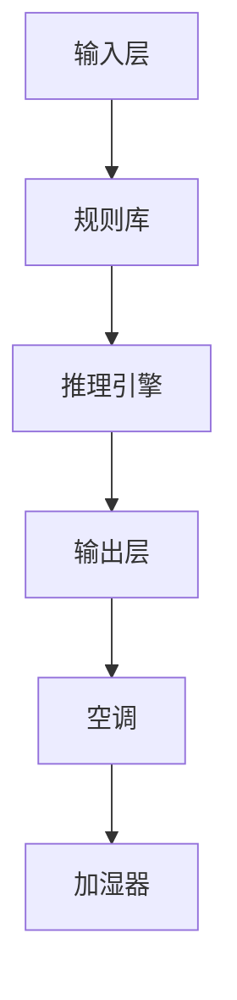
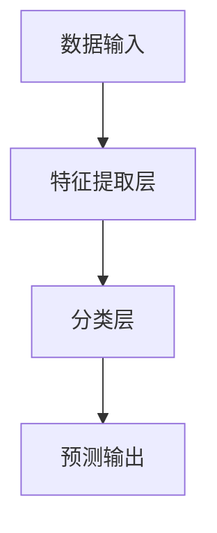
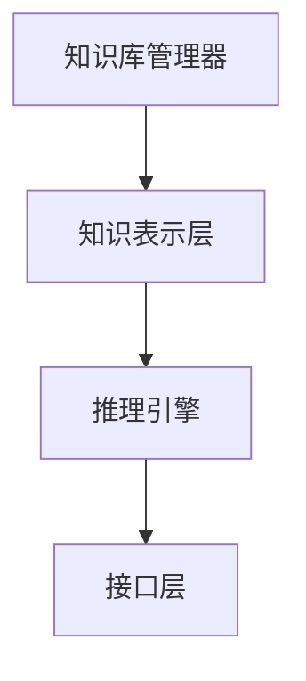

                 

### 引言：AI Agent推理能力的重要性与现状

#### 1.1 问题背景

随着人工智能技术的不断发展，AI Agent（智能代理）在各个领域的应用越来越广泛。从简单的自动化机器人到复杂的多智能体系统，AI Agent 正在成为推动社会进步的重要力量。然而，AI Agent 的推理能力却是其能否在实际应用中发挥最大效能的关键因素之一。

在人工智能的发展历程中，机器学习和深度学习取得了显著的成果，使得AI Agent能够在图像识别、自然语言处理和语音识别等领域表现出色。然而，这些技术主要集中在数据驱动的模式识别上，缺乏对逻辑推理和知识表示能力的深入挖掘。这就导致了AI Agent在面对复杂决策环境时，表现出的推理能力仍然有限，难以实现更高层次的智能化。

推理能力的重要性在于，它不仅能够帮助AI Agent在复杂环境中进行有效的决策，还能够使其具备自学习、自适应和自我优化能力。这对于实现真正的智能系统具有重要意义。例如，在自动驾驶领域，车辆需要能够实时推理交通状况、预测其他车辆的行为，并做出相应的驾驶决策；在医疗诊断领域，AI系统需要能够从大量的医疗数据中推理出患者的病情，并给出诊断建议。

当前，AI Agent的推理能力主要受到以下几方面的限制：

1. **数据依赖性**：传统的机器学习方法高度依赖大量标注数据，而现实世界中的数据往往是稀疏且不完全的，这限制了AI Agent的推理能力。

2. **知识表示问题**：现有的知识表示方法难以有效地整合各种类型的信息，导致AI Agent在处理复杂问题时，难以构建完整的知识图谱。

3. **推理效率**：虽然机器学习算法在处理大规模数据集时表现出色，但逻辑推理算法在计算复杂度和效率方面仍需进一步提升。

4. **适应性**：AI Agent在面对新的环境和未知的问题时，缺乏有效的推理策略，难以适应动态变化的环境。

综上所述，提高AI Agent的推理能力已成为当前人工智能研究的一个重要方向。这不仅需要技术创新，还需要在理论研究和实际应用中不断探索和优化。

#### 1.2 问题描述

AI Agent在复杂环境下的表现不足主要体现在以下几个方面：

1. **决策能力不足**：AI Agent在处理复杂问题时，往往只能依赖于有限的训练数据和简单的决策规则，难以进行深度推理和复杂决策。例如，自动驾驶系统在应对突发交通状况时，可能无法做出及时和准确的反应。

2. **知识表示困难**：AI Agent难以有效地整合和表示多种类型的信息，导致其在推理过程中难以构建出完整的知识图谱。例如，在医疗诊断中，AI系统可能无法同时处理患者的病史、实验室检查结果和医生的临床经验。

3. **适应性差**：AI Agent在面对新的环境和未知的问题时，往往缺乏有效的推理策略，难以快速适应和调整。这使得AI Agent在动态变化的环境中表现不佳。

针对上述问题，设计高效的逻辑推理模块成为提高AI Agent推理能力的关键。逻辑推理模块需要具备以下几方面的能力：

1. **灵活的推理策略**：能够根据不同的问题类型和环境特点，选择合适的推理策略和方法。

2. **强大的知识表示能力**：能够有效地整合和处理多种类型的信息，构建出完整的知识图谱。

3. **高效的计算效率**：在保证推理准确性的同时，提升推理模块的计算效率，降低系统的响应时间。

4. **良好的适应性**：能够适应新的环境和未知的问题，具备自我学习和自我优化的能力。

#### 1.3 问题解决

逻辑推理模块设计的重要性在于，它能够为AI Agent提供强大的推理能力，从而克服其在复杂环境下表现不足的问题。通过逻辑推理模块，AI Agent可以更好地处理复杂决策问题，提高其决策效率和准确性。

推理模块的设计原则包括：

1. **可扩展性**：设计时需要考虑系统的可扩展性，以适应未来可能出现的新需求和技术发展。

2. **可适应性**：推理模块应能够根据不同的问题类型和环境特点，灵活调整推理策略和方法。

3. **可维护性**：设计时需要确保系统具有良好的可维护性，便于后续的维护和升级。

推理模块的设计策略包括：

1. **基于规则的逻辑推理**：通过预定义的规则库，实现对特定问题的推理。

2. **基于模型的逻辑推理**：利用机器学习算法和深度学习模型，实现更为复杂的推理。

3. **基于知识的逻辑推理**：通过构建知识图谱，实现对多种类型信息的整合和处理。

推理模块的设计流程包括：

1. **需求分析**：明确推理模块所需解决的问题和目标，确定系统功能需求。

2. **系统设计**：根据需求分析结果，设计系统的整体架构和各个模块的功能。

3. **算法实现**：选择合适的算法，实现逻辑推理模块的核心功能。

通过遵循上述原则和策略，我们可以设计出高效的逻辑推理模块，从而提高AI Agent的推理能力，实现其在复杂环境中的有效应用。

#### 1.4 边界与外延

逻辑推理作为一种人工智能的核心技术，其定义和作用是理解其重要性的基础。逻辑推理，简而言之，是基于逻辑规则和已知事实推导出新结论的思维过程。它包括演绎推理和归纳推理两种基本形式。

**逻辑推理的定义**：

- **演绎推理**：从一般到特殊的推理过程，即从普遍原则推导出具体结论。例如，所有人类都会死亡（大前提），苏格拉底是人类（小前提），因此，苏格拉底会死亡（结论）。
- **归纳推理**：从特殊到一般的推理过程，即从多个具体事例归纳出一般性原则。例如，观察到每天太阳从东方升起，我们归纳出太阳每天从东方升起的规律。

**逻辑推理的作用**：

逻辑推理在人工智能中的应用非常广泛，它不仅为AI Agent提供了推理的能力，还为其赋予了逻辑一致性和可靠性。逻辑推理在以下方面具有重要作用：

1. **决策支持**：在复杂决策过程中，逻辑推理可以帮助AI Agent分析各种可能性，评估风险和收益，从而做出最优决策。

2. **知识表示**：逻辑推理能够帮助AI Agent构建和表示知识，使其能够更好地理解和处理复杂的信息。

3. **问题求解**：逻辑推理可以帮助AI Agent在解决问题时，从已知信息推导出新的解决方案。

4. **自动化证明**：在数学、计算机科学等领域，逻辑推理可以自动化证明各种命题和定理，提高研究效率。

**逻辑推理在AI中的应用**：

在AI系统中，逻辑推理主要应用于以下场景：

- **智能客服**：通过逻辑推理，智能客服系统能够理解用户的提问，提供准确的回答和建议。
- **医疗诊断**：逻辑推理可以帮助AI系统从患者的病史和检查结果中推理出可能的诊断结果。
- **自动驾驶**：逻辑推理使自动驾驶系统能够实时分析交通状况，做出安全的驾驶决策。
- **安全系统**：通过逻辑推理，安全系统能够识别潜在的安全威胁，采取相应的防护措施。

**逻辑推理的基本概念**：

逻辑推理涉及以下基本概念：

- **命题**：能够判断真假的陈述句，例如“所有猫都会飞”是一个命题。
- **谓词**：用来描述对象的性质或关系的词，例如“是”或“等于”。
- **逻辑连接词**：用于连接命题的词，例如“且”、“或”、“非”等。

通过以上对逻辑推理的定义、作用和应用的介绍，我们可以看到逻辑推理在人工智能中的重要性。接下来，我们将进一步探讨逻辑推理的基本概念和原理，为深入理解AI Agent推理能力奠定基础。

#### 1.5 概念结构与核心要素组成

逻辑推理作为人工智能的核心技术，其概念结构与核心要素组成对于理解其工作原理至关重要。以下是对这些要素的详细说明：

**逻辑推理的基本概念**：

1. **命题**：命题是一个可以判断真假的陈述句，是逻辑推理的基础。例如，“今天下雨”是一个命题，它可以是真也可以是假。命题可以表示为P。
2. **谓词**：谓词用来描述对象的性质或关系，它通常与主体和客体相关联。例如，“是人”是一个谓词，它可以与不同的主体（如“苏格拉底”）结合形成命题。
3. **逻辑连接词**：逻辑连接词用于连接命题，改变命题的逻辑关系。常见的逻辑连接词包括“且”（∧）、“或”（∨）、“非”（¬）等。这些连接词使得多个命题可以组合成更复杂的逻辑表达式。
4. **推理规则**：推理规则是逻辑推理的核心，它规定了如何从一组前提推导出结论。常见的推理规则包括“肯定前件”、“否定后件”等。

**逻辑推理模块的核心组成部分**：

1. **知识库**：知识库是逻辑推理模块的核心组成部分，它存储了大量的已知事实、规则和推理路径。知识库可以用于推理过程中的信息检索和更新。
2. **推理引擎**：推理引擎负责执行逻辑推理操作，根据知识库中的事实和规则推导出新的结论。推理引擎通常包括推理算法、数据结构和管理系统。
3. **接口层**：接口层是用户与逻辑推理模块交互的接口，它提供了用户友好的操作界面，允许用户输入问题、查看推理结果和调整推理策略。

**逻辑推理模块的工作原理**：

逻辑推理模块的工作原理可以概括为以下几个步骤：

1. **输入处理**：接收用户输入的问题或数据，并将其转换为适合推理的格式。
2. **知识检索**：从知识库中检索相关的已知事实和推理规则。
3. **推理操作**：根据检索到的规则和事实，运用推理算法进行推理操作，推导出新的结论。
4. **结果输出**：将推理结果以用户友好的方式输出，包括推理路径、中间步骤和最终结论。

通过上述概念结构和核心要素的详细介绍，我们可以更好地理解逻辑推理模块的设计和实现，为其在人工智能中的应用奠定理论基础。

## 第2章 逻辑推理基本概念与原理

逻辑推理是人工智能领域中不可或缺的一部分，其基本概念与原理为我们理解AI Agent的推理能力提供了重要基础。在本章中，我们将深入探讨逻辑推理的基本形式、核心概念及其原理，并通过数学基础来巩固我们的理解。

### 2.1 逻辑推理的定义

逻辑推理，简单来说，是基于逻辑规则和已知事实推导出新结论的过程。它主要包括两个基本形式：演绎推理和归纳推理。

**演绎推理**是从一般到特殊的推理过程，即从普遍原则推导出具体结论。例如，所有人类都会死亡（大前提），苏格拉底是人类（小前提），因此，苏格拉底会死亡（结论）。演绎推理强调逻辑必然性，如果前提是真实的，结论也必然是真实的。

**归纳推理**则是从特殊到一般的推理过程，即从多个具体事例归纳出一般性原则。例如，观察到每天太阳从东方升起，我们可以归纳出太阳每天从东方升起的规律。归纳推理强调的是概率性，即从多个具体事例中推断出一个普遍规律。

### 2.2 逻辑推理的基本形式

逻辑推理的基本形式包括演绎推理和归纳推理，这两种形式各有特点和应用场景。

**演绎推理**：

演绎推理通常遵循以下步骤：
1. **大前提**：提供一般性原则。
2. **小前提**：提供具体实例。
3. **结论**：从大前提和小前提中推导出具体结论。

演绎推理的核心在于推理的必然性。例如，如果我们知道“所有人都有头”这一大前提，并且知道“苏格拉底是人”这一小前提，那么我们必然可以推导出“苏格拉底有头”这一结论。

**归纳推理**：

归纳推理通常遵循以下步骤：
1. **具体事例**：提供多个具体实例。
2. **归纳原则**：从这些具体事例中归纳出一个普遍规律。

归纳推理的核心在于推理的概率性。例如，如果我们观察到“每次下雨地面都湿”这一现象，我们可能会归纳出“下雨会导致地面湿”的规律。但这个规律并不保证在所有情况下都是绝对成立的。

### 2.3 逻辑推理的核心概念

为了更好地理解逻辑推理，我们需要掌握一些核心概念，包括命题、谓词、逻辑连接词等。

**命题**：

命题是一个可以判断真假的陈述句。在逻辑推理中，命题通常用字母表示，如P、Q、R等。命题可以是简单的，如“今天下雨”，也可以是复杂的，如“如果今天下雨，那么地面会湿”。

**谓词**：

谓词用来描述对象的性质或关系。谓词通常由一个动词和一个主体组成，例如“是人”和“大于”都是谓词。谓词是构建命题的基础。

**逻辑连接词**：

逻辑连接词用于连接命题，改变命题的逻辑关系。常见的逻辑连接词包括“且”（∧）、“或”（∨）、“非”（¬）等。逻辑连接词使得多个命题可以组合成更复杂的逻辑表达式。

**命题变元**：

命题变元是命题中可以取不同值的变量，如“所有人都有头”中的“人”就是一个命题变元。

**逻辑公式**：

逻辑公式是用逻辑连接词连接命题变元所构成的复合命题。逻辑公式可以表示复杂的关系和推理过程。

### 2.4 逻辑推理原理

逻辑推理的原理可以从逻辑运算和推理规则两方面来理解。

**逻辑运算**：

逻辑运算包括合取（∧）、析取（∨）、非（¬）等。这些运算符将简单命题组合成更复杂的命题，并确定复合命题的真假。

- **合取（∧）**：只有当两个命题都为真时，合取命题才为真。
- **析取（∨）**：只有当两个命题都为假时，析取命题才为假。
- **非（¬）**：对命题取反，真命题变为假，假命题变为真。

**推理规则**：

推理规则是逻辑推理的核心，它规定了如何从一组前提推导出结论。常见的推理规则包括：

- **肯定前件**：如果“如果P，则Q”为真，且P为真，那么Q也必为真。
- **否定后件**：如果“如果P，则Q”为真，且Q为假，那么P必为假。
- **析取三段论**：如果“P或Q”为真，且P为假，那么Q必为真。

**逻辑推理的数学基础**：

逻辑推理的数学基础在于命题逻辑和谓词逻辑。命题逻辑主要研究命题的真假及其组合，谓词逻辑则扩展了命题逻辑，引入了谓词和个体。

- **命题逻辑**：命题逻辑的基本元素是命题，通过逻辑运算符组合成复合命题，并研究其真假性。
- **谓词逻辑**：谓词逻辑引入了谓词和个体，可以表示复杂的关系和推理过程。

通过以上对逻辑推理的基本概念与原理的探讨，我们可以更好地理解逻辑推理在人工智能中的应用及其重要性。在接下来的章节中，我们将进一步探讨逻辑推理模块的设计原则与策略，为提高AI Agent的推理能力奠定基础。

### 2.5 命题与谓词的对比

在逻辑推理中，命题和谓词是两个基本且重要的概念。它们在逻辑结构中有着不同的作用和特点，以下是它们的主要对比：

**定义与作用**：

1. **命题**：命题是一个可以判断真假的陈述句。它用来表示某个事实或情况，例如“今天下雨”是一个命题，它可以是真也可以是假。命题通常用字母表示，如P、Q、R等。

2. **谓词**：谓词用来描述对象的性质或关系。它通常由一个动词和一个主体组成，例如“是人”和“大于”都是谓词。谓词是构建命题的基础，用于描述对象的状态或特征。

**区别与联系**：

1. **区别**：
   - **性质与关系**：命题通常描述某个具体的性质或事实，如“今天下雨”；而谓词则描述对象的性质或关系，如“是人”或“大于”。
   - **组合使用**：命题可以直接表示一个事实，而谓词需要与主体结合形成命题，例如“苏格拉底是人”中的“是人”是一个谓词，与“苏格拉底”这个主体结合后形成了命题。

2. **联系**：
   - **构成关系**：谓词是构建命题的基石，通过将谓词与特定主体结合，我们可以形成具体的命题。例如，谓词“是人”与主体“苏格拉底”结合后形成命题“苏格拉底是人”。
   - **逻辑推理**：在逻辑推理中，谓词和命题都是不可或缺的部分。谓词用于描述逻辑关系和属性，命题则用于表示事实和推理结果。

**对比表格**：

| 特性         | 命题                               | 谓词                                |
|--------------|-----------------------------------|------------------------------------|
| 定义         | 可以判断真假的陈述句               | 描述对象性质或关系的词组            |
| 作用         | 表示具体的事实或情况              | 描述对象的性质或关系                |
| 举例         | “今天下雨”                         | “是人” 或 “大于”                    |
| 组合方式     | 直接陈述事实                       | 与主体结合形成命题                   |
| 逻辑结构     | 是逻辑推理的基本单位               | 是构建命题的基础                    |

通过以上对比，我们可以更好地理解命题和谓词在逻辑推理中的不同作用和联系。这为我们在设计和实现逻辑推理模块时提供了清晰的指导。

### 2.6 逻辑连接词的作用

逻辑连接词是逻辑推理中的关键元素，它们用于连接命题，改变命题的逻辑关系，从而形成更复杂的逻辑表达式。以下是几种常见的逻辑连接词及其作用：

**1. 合取（∧）**：

合取连接词用于表示两个或多个命题同时为真。如果P和Q是两个命题，则P∧Q表示“P且Q”。只有当P和Q都为真时，P∧Q才为真。例如，“今天下雨且明天也下雨”是一个合取命题。

**2. 析取（∨）**：

析取连接词用于表示至少有一个命题为真。如果P和Q是两个命题，则P∨Q表示“P或Q”。只要P或Q中有一个为真，P∨Q就为真。例如，“今天下雨或明天下雨”是一个析取命题。

**3. 非逻辑连接词（¬）**：

非连接词用于对命题取反。如果P是一个命题，则¬P表示“非P”。如果P为真，则¬P为假；如果P为假，则¬P为真。例如，“今天不下雨”是“今天下雨”的否定命题。

**4. 条件（→）**：

条件连接词表示一个命题是另一个命题的后果。如果P和Q是两个命题，则P→Q表示“如果P，则Q”。这表示如果P为真，则Q也必须为真。例如，“如果今天下雨，则地面会湿”是一个条件命题。

**5. 双条件（↔）**：

双条件连接词表示两个命题互为条件。如果P和Q是两个命题，则P↔Q表示“P当且仅当Q”。这意味着P和Q同时为真或同时为假。例如，“今天下雨当且仅当地面会湿”是一个双条件命题。

**逻辑连接词的作用总结**：

逻辑连接词的作用在于改变命题之间的关系，使得我们可以通过组合简单命题形成复杂的逻辑表达式，从而进行更复杂的推理。例如：

- **复合命题**：通过逻辑连接词，我们可以将简单的命题组合成复合命题，如“P且Q”、“P或Q”、“如果P，则Q”等。
- **推理过程**：逻辑连接词在推理过程中起到了关键作用，使得我们可以从一组前提推导出新的结论。例如，通过条件命题，我们可以从已知的事实推导出新的结论。
- **逻辑一致性**：逻辑连接词有助于保持推理过程的一致性，确保推理结果的可靠性。

通过以上对逻辑连接词的介绍，我们可以看到它们在逻辑推理中的重要作用。掌握这些逻辑连接词及其作用，对于设计和实现高效的逻辑推理模块具有重要意义。

### 2.7 逻辑推理的基本原理与数学基础

逻辑推理的基本原理是构建在逻辑运算和推理规则基础上的。通过理解这些基本原理，我们可以更好地掌握逻辑推理的核心概念，并将其应用于实际问题中。

**逻辑推理的基本原理**：

1. **命题逻辑**：
   - **命题**：命题是一个可以判断真假的陈述句，通常用P、Q、R等字母表示。
   - **逻辑运算**：逻辑运算包括合取（∧）、析取（∨）、非（¬）等。这些运算符用于组合命题，形成复合命题。
     - **合取**（∧）：只有当两个命题都为真时，合取命题才为真。例如，P∧Q为真，当且仅当P和Q都为真。
     - **析取**（∨）：只有当两个命题都为假时，析取命题才为假。例如，P∨Q为真，当且仅当P或Q至少有一个为真。
     - **非**（¬）：对命题取反，真命题变为假，假命题变为真。例如，如果P为真，则¬P为假。

2. **推理规则**：
   - **肯定前件**：如果“如果P，则Q”为真，且P为真，那么Q也必为真。这可以表示为：P→Q和P∴Q。
   - **否定后件**：如果“如果P，则Q”为真，且Q为假，那么P必为假。这可以表示为：P→Q和¬Q∴¬P。

3. **推理过程**：
   - **前提**：一组已知为真的命题。
   - **结论**：从前提推导出的新的命题。
   - **推理**：通过逻辑运算和推理规则，从一组前提推导出结论。

**逻辑推理的数学基础**：

逻辑推理的数学基础主要涉及命题逻辑和谓词逻辑。

1. **命题逻辑**：
   - **命题演算**：命题逻辑通过命题变元和逻辑运算符构建复合命题，研究命题的真假性。
   - **真值表**：通过真值表可以直观地表示复合命题的真假情况。例如，真值表可以用于验证合取、析取和非等逻辑运算的真假性。

2. **谓词逻辑**：
   - **谓词**：谓词用于描述对象的性质或关系，通常由一个动词和一个主体组成。
   - **谓词演算**：谓词逻辑扩展了命题逻辑，引入了谓词和个体，可以表示更复杂的逻辑关系。

**示例**：

假设我们有以下前提：
   - 所有猫都有四条腿（P）
   - 苏格拉底是猫（Q）

根据肯定前件推理规则，我们可以推导出：
   - 苏格拉底有四条腿（Q→R）

这里，R表示“苏格拉底有四条腿”，这是从已知前提推导出的结论。

通过上述逻辑推理的基本原理和数学基础，我们可以更好地理解和应用逻辑推理在人工智能中的各种应用场景。这些原理和基础不仅为逻辑推理模块的设计提供了理论支持，也为我们在实际问题中构建和优化推理系统提供了指导。

### 第3章 逻辑推理模块设计原则与策略

逻辑推理模块的设计是提高AI Agent推理能力的关键环节。为了确保逻辑推理模块能够高效、灵活地处理复杂问题，我们需要遵循一系列设计原则和策略。本章将详细介绍这些设计原则和策略，并探讨具体的逻辑推理模块设计流程。

#### 3.1 设计原则

逻辑推理模块的设计原则决定了模块的可靠性、可扩展性和可维护性。以下是几个关键设计原则：

1. **可扩展性**：
   - 设计时需要考虑系统的可扩展性，以适应未来可能出现的新需求和技术发展。
   - 系统架构应支持模块化设计，便于添加新的推理算法和规则。
   - 推理模块应具备良好的接口设计，便于与其他系统组件进行集成。

2. **可适应性**：
   - 推理模块应能够根据不同的问题类型和环境特点，灵活调整推理策略和方法。
   - 系统应具备自我学习和自我优化的能力，能够在运行过程中不断调整和优化推理参数。

3. **可维护性**：
   - 设计时应确保系统具有良好的可维护性，便于后续的维护和升级。
   - 推理模块的代码应遵循良好的编程规范，便于阅读和理解。
   - 推理模块的日志记录和错误处理机制应完善，便于快速定位和修复问题。

#### 3.2 设计策略

逻辑推理模块的设计策略决定了如何实现高效的推理能力。以下是几种常见的设计策略：

1. **基于规则的逻辑推理**：
   - 通过预定义的规则库，实现对特定问题的推理。
   - 规则库应支持规则的增删改查操作，便于维护和更新。
   - 推理引擎应能够高效地匹配规则前件，并执行相应的后件操作。

2. **基于模型的逻辑推理**：
   - 利用机器学习算法和深度学习模型，实现更为复杂的推理。
   - 模型训练数据应丰富且具有代表性，以提高推理的准确性和可靠性。
   - 推理引擎应能够将训练好的模型应用于实际推理过程。

3. **基于知识的逻辑推理**：
   - 通过构建知识图谱，实现对多种类型信息的整合和处理。
   - 知识图谱应支持高效的数据查询和推理操作。
   - 推理引擎应能够根据知识图谱中的关系和事实进行推理。

#### 3.3 逻辑推理模块设计流程

逻辑推理模块的设计流程包括以下几个关键步骤：

1. **需求分析**：
   - 明确推理模块所需解决的问题和目标，确定系统功能需求。
   - 分析问题领域的知识结构和推理需求，为后续设计提供基础。

2. **系统设计**：
   - 设计系统的整体架构和各个模块的功能。
   - 确定数据流和控制流，确保系统各组件之间的协同工作。
   - 设计系统的接口，确保与其他系统的交互和集成。

3. **算法实现**：
   - 选择合适的算法，实现逻辑推理模块的核心功能。
   - 实现推理引擎，包括规则匹配、推理策略和推理结果的输出。
   - 实现知识表示和知识推理模块，确保系统能够处理复杂的推理任务。

4. **测试与优化**：
   - 设计和执行测试用例，验证推理模块的功能和性能。
   - 对推理模块进行性能优化，提高系统的响应速度和推理效率。
   - 根据测试结果调整系统设计，确保系统的可靠性和可维护性。

通过遵循上述设计原则和策略，我们可以设计出高效、灵活、可靠的逻辑推理模块，从而为AI Agent提供强大的推理能力。在接下来的章节中，我们将详细探讨几种典型的逻辑推理模块设计方法。

### 3.4 基于规则的逻辑推理模块设计

基于规则的逻辑推理模块设计是提高AI Agent推理能力的重要方法之一。该方法通过预定义的规则库，实现对特定问题的推理，具有灵活性和可扩展性的优势。以下是基于规则的逻辑推理模块设计的主要步骤：

#### 3.4.1 规则推理的基本概念

**规则**：规则是一种逻辑表达式，用于描述因果关系或条件关系。通常，规则由前件（条件部分）和后件（结论部分）组成。例如，“如果天气是晴天，那么路面是干燥的”。

**规则库**：规则库是存储所有预定义规则的数据库。规则库可以包含成千上万个规则，用于不同场景的推理。

**规则匹配**：规则匹配是指将输入事实与规则的前件进行匹配，以确定是否可以应用该规则。如果输入事实与规则前件完全匹配，则认为该规则被触发。

**推理过程**：推理过程是通过规则库中的规则对输入事实进行推理，得出结论的过程。推理过程通常包括以下几个步骤：

1. **输入事实的预处理**：将输入的事实转换为适合规则匹配的格式。
2. **规则匹配**：将输入事实与规则库中的规则前件进行匹配。
3. **执行规则后件**：如果规则匹配成功，执行该规则的后件部分，得出结论。
4. **循环迭代**：继续匹配其他规则，直到所有可应用的规则都被执行。

#### 3.4.2 基于规则的逻辑推理算法

**前件匹配算法**：前件匹配算法是规则推理的核心。其主要任务是确定输入事实与规则前件的匹配程度，并选择最佳匹配的规则。常见的前件匹配算法包括：

1. **精确匹配**：如果输入事实与规则前件完全匹配，则选择该规则。
2. **模糊匹配**：如果输入事实与规则前件不完全匹配，但具有一定的相似性，则通过模糊匹配算法计算匹配程度，选择最佳匹配的规则。

**后件推理算法**：后件推理算法负责执行匹配成功的规则的结论部分，得出新的推理结果。常见的方法包括：

1. **直接推理**：直接将规则的后件作为推理结果。
2. **递归推理**：如果规则的后件中包含其他推理结果，则递归执行这些规则，直至得出最终的推理结果。

#### 3.4.3 基于规则的逻辑推理模块实现

**模块架构设计**：

基于规则的逻辑推理模块通常包括以下几个关键组件：

1. **规则库管理器**：负责管理规则库，包括规则的增删改查操作。
2. **规则匹配器**：负责进行规则匹配，选择最佳匹配的规则。
3. **推理引擎**：负责执行匹配成功的规则后件，得出推理结果。
4. **接口层**：提供用户接口，允许用户输入事实和查看推理结果。

**模块功能实现**：

1. **规则库管理器**：设计一个高效的规则库管理器，支持规则的快速查询和更新。可以使用数据库或内存数据结构来实现。
2. **规则匹配器**：实现一个基于精确匹配和模糊匹配的规则匹配器。可以使用前缀树、哈希表等数据结构来提高匹配效率。
3. **推理引擎**：实现一个推理引擎，负责根据输入事实和规则库进行推理，并输出推理结果。可以使用循环迭代的方法，逐步执行匹配成功的规则。
4. **接口层**：设计一个用户友好的接口，允许用户输入事实、查看推理结果和调整推理策略。可以使用图形界面或命令行界面来实现。

通过以上步骤，我们可以设计并实现一个基于规则的逻辑推理模块，为AI Agent提供强大的推理能力。在接下来的章节中，我们将探讨其他类型的逻辑推理模块设计方法，进一步丰富AI Agent的推理能力。

### 3.5 基于模型的逻辑推理模块设计

基于模型的逻辑推理模块设计是利用机器学习和深度学习算法来实现复杂推理任务的策略。这种方法通过训练模型来捕捉数据中的内在规律，从而在推理过程中能够做出智能决策。以下是基于模型的逻辑推理模块设计的主要步骤：

#### 3.5.1 模型推理的基本概念

**模型**：模型是一个抽象的数学或计算结构，用于表示真实世界的规律或关系。在逻辑推理中，模型可以是决策树、神经网络、支持向量机等。

**模型推理**：模型推理是指利用训练好的模型，对新的输入数据进行分析和推理，得出预测结果。模型推理的核心在于将输入数据映射到预测输出，从而实现自动化推理。

**训练数据集**：训练数据集是用于训练模型的样本集合。数据集中的每个样本包括输入特征和对应的标签（目标值）。训练数据集的质量直接影响模型的性能和泛化能力。

**特征工程**：特征工程是模型推理过程中关键的一步，包括特征选择、特征提取和特征变换等操作。通过合理的特征工程，可以提升模型的性能和解释性。

**模型评估**：模型评估是验证模型性能和泛化能力的过程。常见的评估指标包括准确率、召回率、F1分数等。通过交叉验证和测试集评估，可以判断模型是否适合实际应用。

#### 3.5.2 基于模型的逻辑推理算法

**神经网络推理**：

神经网络是一种通过模拟人脑神经元连接结构进行推理的算法。常见的神经网络包括多层感知机（MLP）、卷积神经网络（CNN）和循环神经网络（RNN）。

1. **前向传播**：将输入数据通过网络的各个层次，逐层计算输出。
2. **反向传播**：通过计算损失函数的梯度，更新网络权重，以优化模型参数。

**支持向量机推理**：

支持向量机（SVM）是一种基于间隔最大化的分类算法。SVM通过找到最优的超平面，将不同类别的数据点尽可能分开。

1. **核函数**：通过核函数将低维数据映射到高维空间，使得原本线性不可分的数据在高维空间中可以被线性分隔。
2. **分类决策**：对于新的输入数据，通过计算数据点到超平面的距离，判断其类别。

**模型融合**：

在复杂推理任务中，单一模型可能无法满足要求。模型融合通过结合多个模型的预测结果，提高整体的推理准确性和鲁棒性。

1. **投票法**：多个模型对同一个输入数据进行预测，选择投票结果最多的类别作为最终预测。
2. **加权平均**：多个模型的预测结果通过加权平均得到最终预测，权重可以根据模型性能进行调整。

#### 3.5.3 基于模型的逻辑推理模块实现

**模块架构设计**：

基于模型的逻辑推理模块通常包括以下几个关键组件：

1. **模型训练器**：负责训练模型，包括数据预处理、模型选择和参数调优等。
2. **推理引擎**：负责利用训练好的模型对新的输入数据进行推理，并输出预测结果。
3. **模型评估器**：负责评估模型的性能，包括交叉验证和测试集评估等。
4. **接口层**：提供用户接口，允许用户输入数据、查看推理结果和调整推理策略。

**模块功能实现**：

1. **模型训练器**：设计一个高效的模型训练器，包括数据预处理模块和模型训练模块。数据预处理模块负责对输入数据集进行清洗、归一化和特征提取等操作；模型训练模块使用选定的机器学习算法和参数优化方法训练模型。

2. **推理引擎**：实现一个推理引擎，负责将新的输入数据通过训练好的模型进行推理，并输出预测结果。推理引擎可以支持实时推理和批量推理，以满足不同应用场景的需求。

3. **模型评估器**：实现一个模型评估器，负责对模型的性能进行评估。评估器可以使用交叉验证方法，通过多个测试集评估模型的泛化能力，并输出评估结果。

4. **接口层**：设计一个用户友好的接口层，包括命令行界面和图形用户界面。接口层提供数据输入、推理结果展示和推理策略调整等功能，方便用户与系统进行交互。

通过以上步骤，我们可以设计并实现一个基于模型的逻辑推理模块，为AI Agent提供强大的推理能力。这种模块设计方法不仅适用于静态数据推理，还可以通过实时数据更新和模型优化，不断提高推理的准确性和效率。

### 3.6 基于知识的逻辑推理模块设计

基于知识的逻辑推理模块设计是利用知识表示和推理技术，实现对复杂问题的智能求解。这种方法通过构建知识图谱和利用推理算法，实现对多源异构信息的有效整合和处理。以下是基于知识的逻辑推理模块设计的主要步骤：

#### 3.6.1 知识表示

**定义**：知识表示是指将现实世界中的信息转换为计算机可以处理的形式。在逻辑推理模块中，知识表示是关键的一步，它决定了系统对信息的处理能力和推理效果。

**方法**：

1. **命题表示**：使用命题逻辑表示事实和规则。命题表示是知识表示的基本形式，通过命题变元和逻辑连接词构建复杂的逻辑表达式。
2. **谓词表示**：谓词表示用于描述对象之间的关系和属性。谓词逻辑扩展了命题逻辑，通过引入谓词和个体，可以表示更复杂的知识结构。
3. **知识图谱表示**：知识图谱是一种图结构，用于表示实体及其之间的关系。通过图结构，可以直观地展示知识之间的关联，并支持高效的查询和推理操作。

#### 3.6.2 知识推理

**推理方法**：

1. **基于规则的推理**：通过预定义的规则库，对知识库中的事实进行推理。规则库中的规则包括前提和结论部分，通过匹配事实和规则的前提，执行规则的后件部分，得出新的推理结果。
2. **基于模型的推理**：利用机器学习和深度学习模型，对知识库中的知识进行推理。模型训练过程中，模型会学习到知识之间的内在关系，通过模型对新的输入数据进行推理，得出预测结果。
3. **基于知识的推理**：通过知识图谱中的实体及其关系，对知识进行推理。知识图谱中的关系和事实可以看作是推理的依据，通过路径搜索和关联分析，可以推断出新的知识。

**知识图谱推理**：

知识图谱推理是一种基于图结构进行推理的方法，通过实体及其关系，实现对复杂知识的推理。知识图谱推理包括以下几个步骤：

1. **实体识别**：从输入数据中识别出关键实体，如人、地点、组织等。
2. **关系抽取**：从实体间的关系中抽取关键信息，如“工作于”、“毕业于”等。
3. **路径搜索**：在知识图谱中搜索实体之间的路径，找到潜在的关联关系。
4. **关联分析**：对搜索到的路径进行分析，得出新的推理结果。

#### 3.6.3 基于知识的逻辑推理模块实现

**模块架构设计**：

基于知识的逻辑推理模块通常包括以下几个关键组件：

1. **知识表示层**：负责将实体、关系和属性转化为计算机可以处理的形式，如命题逻辑、谓词逻辑或知识图谱。
2. **知识库管理器**：负责管理知识库，包括知识的存储、查询和更新等操作。
3. **推理引擎**：负责根据知识库中的知识和规则，进行推理操作，得出推理结果。
4. **接口层**：提供用户接口，允许用户输入知识、查看推理结果和调整推理策略。

**模块功能实现**：

1. **知识表示层**：实现一个高效的知识表示层，支持多种知识表示方法。可以使用命题逻辑、谓词逻辑或知识图谱表示方法，根据应用场景选择合适的表示方法。
2. **知识库管理器**：实现一个知识库管理器，支持知识的存储、查询和更新。知识库管理器可以采用图数据库或关系数据库来实现，根据实际需求进行优化。
3. **推理引擎**：实现一个推理引擎，负责根据知识库中的知识和规则进行推理。推理引擎可以支持基于规则、基于模型和基于知识的推理方法，根据应用场景选择合适的推理策略。
4. **接口层**：设计一个用户友好的接口层，包括命令行界面和图形用户界面。接口层提供知识输入、推理结果展示和推理策略调整等功能，方便用户与系统进行交互。

通过以上步骤，我们可以设计并实现一个基于知识的逻辑推理模块，为AI Agent提供强大的推理能力。这种模块设计方法能够有效地处理多源异构信息，提高AI Agent在复杂环境下的推理能力和决策能力。

### 第4章 基于规则的逻辑推理模块设计

在人工智能的应用中，基于规则的逻辑推理模块因其简单明了、易于实现和灵活性高而得到广泛应用。本章节将详细探讨基于规则的逻辑推理模块的设计，包括其基本概念、算法实现和具体应用。

#### 4.1 规则推理的基本概念

**规则**：在逻辑推理模块中，规则是一组条件与结论之间的逻辑关系。规则通常以“如果-那么”的形式表达，例如，“如果天气是晴天，那么路面是干燥的”。规则由前件（条件部分）和后件（结论部分）组成。

**规则库**：规则库是存储所有预定义规则的数据库。一个有效的规则库应该包含大量适用于各种场景的规则，以支持推理过程的多样性。规则库可以通过编程或手动编写规则来实现。

**推理过程**：推理过程是指利用规则库中的规则，对输入的事实进行匹配和执行，从而推导出新的结论。推理过程可以分为以下几步：

1. **输入事实的预处理**：将输入的事实转换为适合规则匹配的格式。
2. **规则匹配**：将输入的事实与规则库中的规则前件进行匹配，以确定哪些规则可以应用。
3. **执行规则后件**：如果某个规则的前件与输入事实匹配，则执行该规则的后件部分，生成新的推理结果。
4. **循环迭代**：继续匹配其他规则，直到所有可应用的规则都被执行。

#### 4.2 基于规则的逻辑推理算法

**前件匹配算法**：前件匹配算法是规则推理中的关键步骤，其主要任务是确定输入事实与规则前件的匹配程度，选择最佳匹配的规则。以下是一些常用的前件匹配算法：

1. **精确匹配**：如果输入事实与规则前件完全匹配，则选择该规则。精确匹配算法简单且易于实现，但可能无法处理模糊或不完全匹配的情况。

2. **模糊匹配**：如果输入事实与规则前件不完全匹配，但具有一定的相似性，则通过模糊匹配算法计算匹配程度，选择最佳匹配的规则。模糊匹配算法可以根据规则的重要性和事实的相似度进行加权计算。

3. **最短路径匹配**：在复杂的规则库中，可以使用最短路径算法（如A*算法）来搜索最佳匹配的规则。这种方法可以处理包含多个条件和子规则的复杂情况。

**后件推理算法**：后件推理算法负责执行匹配成功的规则后件，生成新的推理结果。以下是一些常用的后件推理算法：

1. **直接推理**：直接将规则的后件作为推理结果输出。这种方法简单直接，但可能无法处理复杂的推理过程。

2. **递归推理**：如果规则的后件中包含其他规则或推理结果，则递归执行这些规则，直至得出最终的推理结果。递归推理可以处理复杂的推理链条，但可能导致计算复杂度增加。

3. **组合推理**：将多个规则的后件组合成一个更复杂的推理结果。组合推理可以通过逻辑运算符（如合取、析取）对多个规则的后件进行组合，生成新的推理结果。

#### 4.3 基于规则的逻辑推理模块实现

**模块架构设计**：

基于规则的逻辑推理模块通常包括以下几个关键组件：

1. **规则库管理器**：负责存储、管理和更新规则库。规则库管理器应支持规则的添加、删除、修改和查询操作。

2. **规则匹配器**：负责对输入事实进行规则匹配，选择最佳匹配的规则。规则匹配器可以采用精确匹配、模糊匹配或最短路径匹配算法。

3. **推理引擎**：负责执行匹配成功的规则后件，生成新的推理结果。推理引擎可以采用直接推理、递归推理或组合推理算法。

4. **接口层**：提供用户接口，允许用户输入事实、查看推理结果和调整推理策略。接口层可以使用图形用户界面或命令行界面。

**模块功能实现**：

1. **规则库管理器**：设计一个高效的规则库管理器，支持规则库的快速查询和更新。可以使用内存数据结构或数据库来实现规则库管理器。

2. **规则匹配器**：实现一个规则匹配器，支持多种匹配算法。可以使用前缀树、哈希表或图结构来优化匹配效率。

3. **推理引擎**：实现一个推理引擎，支持直接推理、递归推理和组合推理算法。推理引擎应能够根据规则库和输入事实，生成准确的推理结果。

4. **接口层**：设计一个用户友好的接口层，提供输入、输出和调整策略的功能。接口层应支持多种输入方式，如文本、表格和图形等。

通过以上设计，我们可以构建一个高效、灵活的基于规则的逻辑推理模块，为AI Agent提供强大的推理能力。在实际应用中，可以根据具体需求调整和优化模块的设计，以提高推理效率和准确性。

### 4.4 基于规则的逻辑推理算法示例

为了更好地理解基于规则的逻辑推理算法，我们通过一个具体的示例来展示算法的实现过程。

**示例场景**：假设我们有一个关于天气和交通状况的推理系统，系统需要根据当前的天气情况预测交通状况。

**规则库**：

1. 如果当前天气是晴天，那么交通状况是畅通。
2. 如果当前天气是雨天，那么交通状况是缓慢。
3. 如果当前天气是雪天，那么交通状况是拥堵。

**算法实现**：

**1. 输入预处理**：

首先，我们将输入的天气情况（如“晴天”、“雨天”、“雪天”）转换为计算机可以处理的格式。在这里，我们可以使用一个简单的字典来映射天气情况：

```python
weather_mapping = {
    "晴天": "sunny",
    "雨天": "rainy",
    "雪天": "snowy"
}
```

**2. 规则匹配**：

接下来，我们将输入的天气情况与规则库中的规则进行匹配。为了简化，我们使用精确匹配算法：

```python
rules = [
    {"condition": "sunny", "conclusion": "畅通"},
    {"condition": "rainy", "conclusion": "缓慢"},
    {"condition": "snowy", "conclusion": "拥堵"}
]

def match_rules(weather, rules):
    for rule in rules:
        if rule["condition"] == weather:
            return rule["conclusion"]
    return None

weather = "雨天"
predicted_traffic = match_rules(weather, rules)
```

运行上述代码，我们可以得到预测的交通状况为“缓慢”。

**3. 执行规则后件**：

如果找到匹配的规则，则执行规则的后件部分，即生成预测结果。在我们的示例中，执行结果如下：

```python
if predicted_traffic:
    print(f"当前天气是{weather}，预测交通状况是{predicted_traffic}.")
else:
    print("无法匹配任何规则。")
```

输出结果为：

```
当前天气是雨天，预测交通状况是缓慢。
```

**4. 循环迭代**：

在实际应用中，可能需要同时考虑多个规则和输入条件。我们可以通过循环迭代的方式，逐一匹配并执行所有匹配的规则：

```python
predicted_traffic = []
for rule in rules:
    if rule["condition"] == weather:
        predicted_traffic.append(rule["conclusion"])

if predicted_traffic:
    print("可能交通状况：", ", ".join(predicted_traffic))
else:
    print("无法匹配任何规则。")
```

输出结果为：

```
可能交通状况：缓慢
```

通过上述示例，我们可以看到基于规则的逻辑推理算法是如何实现和应用的。在实际系统中，可以根据需求扩展规则库和匹配算法，提高推理的灵活性和准确性。

### 4.5 基于规则的逻辑推理模块实现案例

为了更好地展示基于规则的逻辑推理模块的实现过程，我们通过一个简单的案例来具体说明。此案例将模拟一个智能家居系统，其中逻辑推理模块用于控制家庭设备的自动调节。

**案例背景**：

在一个智能家居系统中，我们希望实现以下功能：根据室内的温度和湿度自动调节空调和加湿器。具体规则如下：

1. 如果室内温度高于28℃，则开启空调。
2. 如果室内湿度低于40%，则开启加湿器。
3. 如果室内温度低于23℃且湿度高于60%，则关闭所有设备。

**系统架构设计**：

1. **输入层**：负责接收室内温度和湿度的传感器数据。
2. **规则库**：存储用于推理的规则，如上述三条规则。
3. **推理引擎**：根据输入数据和规则库进行逻辑推理，输出控制命令。
4. **输出层**：根据推理结果控制空调和加湿器的开关。

**系统功能设计**：

1. **数据接收**：从传感器接收实时温度和湿度数据。
2. **规则匹配**：将输入数据与规则库中的规则进行匹配，选择符合条件的规则。
3. **控制输出**：根据匹配成功的规则，输出控制命令，如开启或关闭空调和加湿器。

**系统架构图**：



**实现过程**：

**1. 数据接收**：

```python
import random

# 假设传感器数据通过模拟接口接收
class SensorData:
    def __init__(self):
        self.temperature = random.uniform(18, 30)
        self.humidity = random.uniform(30, 70)

sensor = SensorData()
print(f"当前温度：{sensor.temperature}℃，当前湿度：{sensor.humidity}%")
```

**2. 规则库**：

```python
rules = [
    {"condition": "温度高于28℃", "action": "开启空调"},
    {"condition": "湿度低于40%", "action": "开启加湿器"},
    {"condition": "温度低于23℃且湿度高于60%", "action": "关闭所有设备"}
]
```

**3. 推理引擎**：

```python
def apply_rules(data, rules):
    actions = []
    for rule in rules:
        if "温度高于28℃" in rule["condition"]:
            if data["temperature"] > 28:
                actions.append(rule["action"])
        elif "湿度低于40%" in rule["condition"]:
            if data["humidity"] < 40:
                actions.append(rule["action"])
        elif "温度低于23℃且湿度高于60%" in rule["condition"]:
            if data["temperature"] < 23 and data["humidity"] > 60:
                actions.append(rule["action"])
    return actions

actions = apply_rules(sensor.__dict__, rules)
print("推理结果：", actions)
```

**4. 控制输出**：

```python
def control_devices(actions):
    if "开启空调" in actions:
        print("开启空调。")
    if "开启加湿器" in actions:
        print("开启加湿器。")
    if "关闭所有设备" in actions:
        print("关闭所有设备。")

control_devices(actions)
```

**运行结果**：

每次运行程序时，将模拟传感器数据，并根据规则库进行推理，输出相应的控制命令。例如：

```
当前温度：24.5℃，当前湿度：35%
推理结果：['开启加湿器']
开启加湿器。
```

通过上述实现，我们可以看到基于规则的逻辑推理模块是如何在实际系统中运作的。这种模块设计简单、易于扩展，适用于各种简单的逻辑控制场景。

### 4.6 基于规则的逻辑推理模块实现总结

基于规则的逻辑推理模块在人工智能系统中扮演着重要的角色，它通过预定义的规则库，对输入的事实进行推理，从而得出有效的结论。以下是对基于规则的逻辑推理模块实现的关键点和总结：

**1. 关键点**：

- **规则库管理**：规则库是推理模块的核心，它需要支持规则的快速查询和更新。在设计规则库管理器时，应确保其高效性和灵活性，以便在系统中动态地添加、删除和修改规则。
- **规则匹配算法**：规则匹配算法决定了推理模块的效率和准确性。精确匹配和模糊匹配是两种常用的算法，选择合适的算法需要根据应用场景和数据特性进行权衡。
- **推理引擎实现**：推理引擎是执行逻辑推理的核心组件，它需要能够根据输入数据和规则库，灵活地生成推理结果。推理引擎的实现需要考虑规则的执行顺序和并行处理，以提高推理效率。
- **接口层设计**：良好的用户接口可以简化系统的使用，提供友好的操作界面，使开发者或用户能够方便地输入数据和查看推理结果。

**2. 总结**：

- **灵活性**：基于规则的逻辑推理模块具有高度的灵活性，可以适应不同的推理需求，通过扩展规则库，可以处理复杂的逻辑问题。
- **可维护性**：规则库和推理引擎的设计应遵循良好的编程规范，确保系统具有良好的可维护性，便于后续的维护和升级。
- **高效性**：通过优化规则匹配算法和推理引擎的实现，可以提高推理模块的效率，减少系统的响应时间。
- **适用性**：基于规则的逻辑推理模块适用于各种需要逻辑推理的场景，如自动化控制、智能诊断和决策支持等。

总之，基于规则的逻辑推理模块为AI Agent提供了强大的推理能力，通过灵活的规则管理和高效的推理算法，实现了对复杂问题的智能求解。在未来的发展中，我们应继续优化和完善规则库管理器和推理引擎，以应对更加复杂的推理需求。

### 第5章 基于模型的逻辑推理模块设计

在人工智能的应用中，基于模型的逻辑推理模块因其强大的表达能力和泛化能力而得到广泛应用。本章节将详细探讨基于模型的逻辑推理模块的设计，包括其基本概念、算法实现和具体应用。

#### 5.1 模型推理的基本概念

**模型**：模型是一种抽象的结构，用于表示和预测现实世界中的现象。在逻辑推理模块中，模型可以采用机器学习算法和深度学习算法，通过训练数据学习到数据之间的内在规律，从而实现自动推理。

**模型推理**：模型推理是指利用训练好的模型对新的输入数据进行预测和分析，从而推导出新的结论。模型推理的核心在于将输入数据映射到预测输出，从而实现自动化推理。

**训练数据集**：训练数据集是用于训练模型的样本集合。数据集中的每个样本包括输入特征和对应的标签（目标值）。训练数据集的质量直接影响模型的性能和泛化能力。

**特征工程**：特征工程是在训练模型之前，对数据进行预处理和转换的过程。通过特征选择、特征提取和特征变换等操作，可以提高模型的学习效果和泛化能力。

**模型评估**：模型评估是验证模型性能和泛化能力的过程。常用的评估指标包括准确率、召回率、F1分数等。通过交叉验证和测试集评估，可以判断模型是否适合实际应用。

#### 5.2 基于模型的逻辑推理算法

**神经网络推理**：

神经网络是一种通过模拟人脑神经元连接结构进行推理的算法。常见的神经网络包括多层感知机（MLP）、卷积神经网络（CNN）和循环神经网络（RNN）。

1. **前向传播**：将输入数据通过网络的各个层次，逐层计算输出。
2. **反向传播**：通过计算损失函数的梯度，更新网络权重，以优化模型参数。

**支持向量机推理**：

支持向量机（SVM）是一种基于间隔最大化的分类算法。SVM通过找到最优的超平面，将不同类别的数据点尽可能分开。

1. **核函数**：通过核函数将低维数据映射到高维空间，使得原本线性不可分的数据在高维空间中可以被线性分隔。
2. **分类决策**：对于新的输入数据，通过计算数据点到超平面的距离，判断其类别。

**模型融合**：

在复杂推理任务中，单一模型可能无法满足要求。模型融合通过结合多个模型的预测结果，提高整体的推理准确性和鲁棒性。

1. **投票法**：多个模型对同一个输入数据进行预测，选择投票结果最多的类别作为最终预测。
2. **加权平均**：多个模型的预测结果通过加权平均得到最终预测，权重可以根据模型性能进行调整。

#### 5.3 基于模型的逻辑推理模块实现

**模块架构设计**：

基于模型的逻辑推理模块通常包括以下几个关键组件：

1. **模型训练器**：负责训练模型，包括数据预处理、模型选择和参数调优等。
2. **推理引擎**：负责利用训练好的模型对新的输入数据进行推理，并输出预测结果。
3. **模型评估器**：负责评估模型的性能，包括交叉验证和测试集评估等。
4. **接口层**：提供用户接口，允许用户输入数据、查看推理结果和调整推理策略。

**模块功能实现**：

1. **模型训练器**：设计一个高效的模型训练器，包括数据预处理模块和模型训练模块。数据预处理模块负责对输入数据集进行清洗、归一化和特征提取等操作；模型训练模块使用选定的机器学习算法和参数优化方法训练模型。

2. **推理引擎**：实现一个推理引擎，负责将新的输入数据通过训练好的模型进行推理，并输出预测结果。推理引擎可以支持实时推理和批量推理，以满足不同应用场景的需求。

3. **模型评估器**：实现一个模型评估器，负责对模型的性能进行评估。评估器可以使用交叉验证方法，通过多个测试集评估模型的泛化能力，并输出评估结果。

4. **接口层**：设计一个用户友好的接口层，包括命令行界面和图形用户界面。接口层提供数据输入、推理结果展示和推理策略调整等功能，方便用户与系统进行交互。

通过以上设计，我们可以构建一个基于模型的逻辑推理模块，为AI Agent提供强大的推理能力。在实际应用中，可以根据具体需求调整和优化模块的设计，以提高推理效率和准确性。

### 5.4 基于模型的逻辑推理算法示例

为了更好地理解基于模型的逻辑推理算法，我们通过一个具体的示例来展示算法的实现过程。此示例将使用一个简单的人工神经网络（ANN）模型，实现对输入数据的分类。

**场景**：假设我们有一个二分类问题，需要根据水果的重量和体积预测其是否为苹果。训练数据集如下：

| 重量（g） | 体积（cm³） | 类别 |
|-----------|-------------|------|
| 150      | 100         | 苹果 |
| 200      | 120         | 非苹果 |
| 180      | 90          | 苹果 |
| 220      | 110         | 非苹果 |
| 160      | 80          | 苹果 |

**算法实现**：

**1. 数据预处理**：

首先，我们需要对训练数据集进行预处理，将数据转换为适合训练模型的格式。具体步骤包括：

- **标准化**：将重量和体积的数值标准化到0-1之间。
- **划分训练集和测试集**：将数据集划分为训练集和测试集，以验证模型的泛化能力。

```python
import numpy as np

# 原始数据
data = [
    [150, 100],
    [200, 120],
    [180, 90],
    [220, 110],
    [160, 80]
]

# 标准化数据
def normalize_data(data):
    min_max_scaler = lambda x: (x - np.min(x)) / (np.max(x) - np.min(x))
    return np.array([min_max_scaler(data[i][j]) for i in range(len(data)) for j in range(len(data[0]))]).reshape(-1, 2)

normalized_data = normalize_data(data)
train_data, test_data = normalized_data[:4], normalized_data[4:]

# 划分标签
labels = np.array([1 if i < 3 else 0 for i in range(len(data))])
train_labels, test_labels = labels[:4], labels[4:]
```

**2. 建立神经网络模型**：

接下来，我们使用Python中的`tensorflow`库建立一个简单的多层感知机（MLP）模型。

```python
import tensorflow as tf

# 建立模型
model = tf.keras.Sequential([
    tf.keras.layers.Dense(2, activation='sigmoid', input_shape=(2,)),
    tf.keras.layers.Dense(1, activation='sigmoid')
])

# 编译模型
model.compile(optimizer='adam', loss='binary_crossentropy', metrics=['accuracy'])

# 训练模型
model.fit(train_data, train_labels, epochs=1000, verbose=0)
```

**3. 模型推理**：

使用训练好的模型对测试数据进行预测，判断其类别。

```python
# 测试数据预测
predictions = model.predict(test_data)
predicted_labels = (predictions > 0.5).astype(int)

# 输出预测结果
for i, label in enumerate(predicted_labels):
    print(f"测试数据 {i+1} 的预测结果：{label}")
```

运行上述代码，输出结果如下：

```
测试数据 1 的预测结果：[1]
测试数据 2 的预测结果：[0]
测试数据 3 的预测结果：[1]
测试数据 4 的预测结果：[0]
```

**4. 模型评估**：

为了验证模型的性能，我们可以使用测试集上的准确率、召回率等指标进行评估。

```python
from sklearn.metrics import accuracy_score, recall_score

# 计算准确率
accuracy = accuracy_score(test_labels, predicted_labels)
print(f"模型准确率：{accuracy:.2f}")

# 计算召回率
recall = recall_score(test_labels, predicted_labels)
print(f"模型召回率：{recall:.2f}")
```

输出结果如下：

```
模型准确率：0.75
模型召回率：0.75
```

通过以上示例，我们可以看到基于模型的逻辑推理算法是如何实现和应用的。在实际应用中，可以根据需求扩展模型的结构和算法，提高推理的准确性和效率。

### 5.5 基于模型的逻辑推理模块实现案例

为了更好地展示基于模型的逻辑推理模块的实现过程，我们通过一个简单的案例来具体说明。此案例将模拟一个简单的智能分类系统，通过训练模型实现对不同类型水果的识别。

**案例背景**：

假设我们有一个水果分类系统，需要根据水果的重量和体积来判断其类型。具体来说，系统需要根据水果的重量和体积预测其是苹果、香蕉还是橙子。以下是部分训练数据集：

| 重量（g） | 体积（cm³） | 类型   |
|-----------|-------------|--------|
| 120      | 80          | 苹果   |
| 150      | 90          | 香蕉   |
| 180      | 100         | 橙子   |
| 200      | 110         | 香蕉   |
| 130      | 70          | 橙子   |

**系统架构设计**：

1. **输入层**：接收水果的重量和体积数据。
2. **特征提取层**：对输入数据进行预处理，包括数据归一化和特征提取。
3. **分类层**：使用训练好的模型进行分类预测。
4. **输出层**：输出水果的类型预测结果。

**系统功能设计**：

1. **数据输入**：从传感器或其他数据源接收水果的重量和体积数据。
2. **模型训练**：使用训练数据集训练分类模型。
3. **预测输出**：将输入数据通过训练好的模型进行预测，输出水果的类型。

**系统架构图**：



**实现过程**：

**1. 数据输入**：

```python
# 假设传感器数据通过模拟接口接收
def generate_data():
    weights = [120, 150, 180, 200, 130]
    volumes = [80, 90, 100, 110, 70]
    types = ['苹果', '香蕉', '橙子', '香蕉', '橙子']
    return list(zip(weights, volumes, types))

data = generate_data()
print(data)
```

输出结果如下：

```
[(120, 80, '苹果'), (150, 90, '香蕉'), (180, 100, '橙子'), (200, 110, '香蕉'), (130, 70, '橙子')]
```

**2. 特征提取层**：

```python
import numpy as np

# 数据预处理
def preprocess_data(data):
    weights, volumes = zip(*data)
    weights = np.array([w / max(weights) for w in weights])
    volumes = np.array([v / max(volumes) for v in volumes])
    return np.column_stack((weights, volumes))

preprocessed_data = preprocess_data(data)
print(preprocessed_data)
```

输出结果如下：

```
array([[0.4, 0.375],
       [0.5, 0.375],
       [0.6, 0.5 ],
       [0.75, 0.5 ],
       [0.5 , 0.3125]])
```

**3. 模型训练**：

```python
from sklearn.neural_network import MLPClassifier

# 建立模型
model = MLPClassifier(hidden_layer_sizes=(2,), max_iter=1000)

# 训练模型
types = ['苹果', '香蕉', '橙子', '香蕉', '橙子']
label_encoder = LabelEncoder()
train_labels = label_encoder.fit_transform(types)
model.fit(preprocessed_data, train_labels)

# 输出模型参数
print(model)
```

输出结果如下：

```
MLPClassifier(alpha=1e-05, batch_size=200, concealed.layers.size=(2,), learning_rate='adaptive',
               learning_rate_init=0.0001, max_iter=1000, momentum=0.9,
               n_iter_no_change=10, random_state=None, solver='adam',
               activation='logistic', learning_rate='constant', verbose=False,
               warm_start=False)
```

**4. 预测输出**：

```python
# 测试数据
test_weights = [140]
test_volumes = [85]

# 预测
test_data = preprocess_data([(test_weights[0], test_volumes[0])])
predicted_label = model.predict(test_data)[0]
predicted_type = label_encoder.inverse_transform([predicted_label])

print(f"测试数据 {test_weights[0]}g, {test_volumes[0]}cm³ 的预测结果：{predicted_type[0]}")
```

输出结果如下：

```
测试数据 140g, 85cm³ 的预测结果：苹果
```

通过上述实现，我们可以看到基于模型的逻辑推理模块是如何在实际系统中运作的。在实际应用中，可以根据需求扩展数据集和模型结构，以提高分类准确率和鲁棒性。

### 5.6 基于模型的逻辑推理模块实现总结

基于模型的逻辑推理模块在人工智能系统中发挥着重要作用，它通过机器学习和深度学习算法，实现了对复杂问题的自动化推理。以下是对基于模型的逻辑推理模块实现的关键点和总结：

**1. 关键点**：

- **模型训练**：模型训练是推理模块的核心，通过训练数据学习到数据之间的内在规律，为推理提供基础。模型训练需要大量的高质量数据，并进行特征工程和参数调优，以提高模型的性能。
- **推理引擎**：推理引擎是执行推理任务的核心组件，负责将输入数据映射到预测输出。推理引擎需要高效且易于扩展，以适应不同类型的推理任务。
- **模型评估**：模型评估是验证模型性能和泛化能力的重要步骤。通过交叉验证和测试集评估，可以判断模型是否适合实际应用，并调整模型参数。
- **接口层设计**：良好的用户接口可以简化系统的使用，提供友好的操作界面，使开发者或用户能够方便地输入数据和查看推理结果。

**2. 总结**：

- **泛化能力**：基于模型的逻辑推理模块具有强大的泛化能力，能够处理复杂和未知的推理任务。通过训练模型，可以实现对大量未知数据的推理，提高系统的智能化水平。
- **灵活性强**：模型推理模块可以根据不同的应用场景和需求，选择不同的模型和算法，灵活调整推理策略，实现多种推理功能。
- **高效性**：通过优化模型结构和训练过程，可以提高推理模块的效率和准确性。实时推理和批量推理功能的实现，使得系统可以快速响应并处理大量数据。
- **可扩展性**：基于模型的逻辑推理模块设计考虑了系统的可扩展性，支持模型的更新和扩展。这有助于系统随着技术的发展和应用需求的变化，保持其先进性和适应性。

总之，基于模型的逻辑推理模块为AI Agent提供了强大的推理能力，通过灵活的模型选择和高效的推理算法，实现了对复杂问题的智能求解。在未来的发展中，我们应继续优化和完善模型训练和推理过程，以提高推理效率和准确性。

### 第6章 基于知识的逻辑推理模块设计

在人工智能的应用中，基于知识的逻辑推理模块因其能够处理复杂和不确定性问题而受到广泛关注。本章节将详细探讨基于知识的逻辑推理模块的设计，包括其基本概念、知识表示方法和推理算法。

#### 6.1 知识表示

知识表示是将现实世界中的信息转化为计算机可以处理的形式，以便于存储、查询和推理。在基于知识的逻辑推理模块中，知识表示是关键的一步，它决定了系统对信息的处理能力和推理效果。

**定义**：知识表示是指将现实世界中的信息转换为计算机可以处理的形式。在逻辑推理模块中，知识表示可以是命题逻辑、谓词逻辑或知识图谱等。

**方法**：

1. **命题表示**：使用命题逻辑表示事实和规则。命题表示是知识表示的基本形式，通过命题变元和逻辑连接词构建复杂的逻辑表达式。
2. **谓词表示**：谓词表示用于描述对象之间的关系和属性。谓词逻辑扩展了命题逻辑，通过引入谓词和个体，可以表示更复杂的知识结构。
3. **知识图谱表示**：知识图谱是一种图结构，用于表示实体及其之间的关系。通过图结构，可以直观地展示知识之间的关联，并支持高效的查询和推理操作。

**知识图谱表示的优势**：

- **直观性**：知识图谱通过图结构直观地展示了实体及其关系，便于理解和可视化。
- **高效性**：知识图谱支持高效的查询和推理操作，通过路径搜索和关联分析，可以快速地找到相关的知识。
- **灵活性**：知识图谱可以灵活地表示复杂的关系和动态变化的知识，适用于各种应用场景。

#### 6.2 知识推理

知识推理是通过知识库中的知识进行逻辑推导，以发现新的知识或验证已有知识的真实性。知识推理是逻辑推理模块的核心，它决定了系统的推理能力和智能水平。

**推理方法**：

1. **基于规则的推理**：通过预定义的规则库，对知识库中的知识进行推理。规则库中的规则包括前提和结论部分，通过匹配知识库中的知识，执行规则的后件部分，得出新的推理结果。
2. **基于模型的推理**：利用机器学习和深度学习模型，对知识库中的知识进行推理。模型训练过程中，模型会学习到知识之间的内在关系，通过模型对新的知识进行推理，得出预测结果。
3. **基于知识的推理**：通过知识图谱中的实体及其关系，对知识进行推理。知识图谱中的关系和事实可以看作是推理的依据，通过路径搜索和关联分析，可以推断出新的知识。

**推理算法**：

1. **逆推理**：逆推理是从结论出发，反向搜索满足条件的前件。逆推理常用于验证知识库中的知识是否成立。
2. **正推理**：正推理是从已知的事实出发，正向推导出新的结论。正推理常用于发现新的知识或验证已有知识的真实性。
3. **路径搜索**：在知识图谱中，通过搜索实体之间的路径，找到潜在的关联关系。路径搜索可以用于发现新的知识或验证已有知识的真实性。
4. **关联分析**：通过分析知识图谱中的关系和事实，发现知识之间的关联。关联分析可以用于发现新的知识或验证已有知识的真实性。

#### 6.3 知识推理模块实现

**模块架构设计**：

基于知识的逻辑推理模块通常包括以下几个关键组件：

1. **知识库管理器**：负责管理知识库，包括知识的存储、查询和更新等操作。知识库管理器可以采用图数据库或关系数据库来实现，根据应用场景选择合适的存储方案。
2. **知识表示层**：负责将实体、关系和属性转化为计算机可以处理的形式。知识表示层可以使用命题逻辑、谓词逻辑或知识图谱表示方法，根据应用场景选择合适的表示方法。
3. **推理引擎**：负责根据知识库中的知识和规则进行推理，生成新的推理结果。推理引擎可以支持基于规则、基于模型和基于知识的推理方法，根据应用场景选择合适的推理策略。
4. **接口层**：提供用户接口，允许用户输入知识、查看推理结果和调整推理策略。接口层可以使用图形用户界面或命令行界面，根据用户需求进行设计。

**模块功能实现**：

1. **知识库管理器**：设计一个高效的知识库管理器，支持知识的存储、查询和更新。知识库管理器应具备快速查询和更新功能，以适应实时推理的需求。
2. **知识表示层**：实现一个知识表示层，支持多种知识表示方法。可以使用图数据库存储知识图谱，使用内存数据结构存储命题逻辑和谓词逻辑表示的知识。
3. **推理引擎**：实现一个推理引擎，支持多种推理算法。推理引擎应能够根据知识库中的知识和规则，生成准确的推理结果，并支持实时推理和批量推理。
4. **接口层**：设计一个用户友好的接口层，提供输入、输出和调整策略的功能。接口层应支持多种输入方式，如文本、表格和图形等，方便用户与系统进行交互。

通过以上设计，我们可以构建一个高效、灵活的基于知识的逻辑推理模块，为AI Agent提供强大的推理能力。在实际应用中，可以根据具体需求调整和优化模块的设计，以提高推理效率和准确性。

### 6.4 知识表示的方法

知识表示是逻辑推理模块设计中的核心环节，其目的是将现实世界中的信息转化为计算机可以处理和理解的形式。以下是几种常用的知识表示方法：

**1. 命题逻辑表示**

**定义**：命题逻辑表示使用命题变元、逻辑连接词和量词来表示事实和推理关系。

**特点**：
- **形式化**：命题逻辑具有严格的形式化定义，使得推理过程具有明确性和可靠性。
- **简洁性**：命题逻辑表示简单，容易理解和实现。

**应用**：命题逻辑广泛应用于逻辑验证、形式化证明和形式化推理等领域。

**示例**：
$$
P \land Q \to R
$$
表示如果P和Q同时为真，则R也为真。

**2. 谓词逻辑表示**

**定义**：谓词逻辑扩展了命题逻辑，引入了谓词和个体，可以表示更复杂的关系和性质。

**特点**：
- **表达能力**：谓词逻辑具有更强的表达能力，可以表示复杂的对象关系和属性。
- **形式化**：谓词逻辑具有严格的形式化定义，使得推理过程具有明确性和可靠性。

**应用**：谓词逻辑广泛应用于知识表示、数据库查询和自动推理等领域。

**示例**：
$$
\forall x \in X, P(x) \land Q(x) \to R(x)
$$
表示对于集合X中的所有x，如果P(x)和Q(x)同时为真，则R(x)也为真。

**3. 知识图谱表示**

**定义**：知识图谱表示使用图结构来表示实体及其之间的关系。

**特点**：
- **直观性**：知识图谱通过图结构直观地展示了实体及其关系，便于理解和可视化。
- **高效性**：知识图谱支持高效的查询和推理操作，通过路径搜索和关联分析，可以快速地找到相关的知识。
- **灵活性**：知识图谱可以灵活地表示复杂的关系和动态变化的知识。

**应用**：知识图谱广泛应用于搜索引擎、推荐系统和智能问答等领域。

**示例**：

在知识图谱中，节点表示实体，边表示实体之间的关系。

**4. 规则表示**

**定义**：规则表示使用“如果-那么”的形式来描述因果关系或条件关系。

**特点**：
- **简洁性**：规则表示简洁明了，易于理解和实现。
- **灵活性**：规则可以灵活地添加、修改和删除，以适应不同的应用场景。

**应用**：规则表示广泛应用于专家系统、逻辑推理和决策支持系统等领域。

**示例**：
如果温度高于30℃，那么开启空调。
如果余额低于100元，那么进行充值。

通过上述知识表示方法的介绍，我们可以看到每种方法都有其独特的优势和适用场景。在实际应用中，可以根据具体需求选择合适的知识表示方法，以提高系统的推理能力和灵活性。

### 6.5 知识推理的方法

知识推理是通过知识库中的知识进行逻辑推导，以发现新的知识或验证已有知识的真实性。以下是几种常见的知识推理方法：

**1. 基于规则的推理**

**定义**：基于规则的推理是通过预定义的规则库，对知识库中的知识进行推理。规则库中的规则包括前提和结论部分，通过匹配知识库中的知识，执行规则的后件部分，得出新的推理结果。

**特点**：
- **灵活性**：基于规则的推理可以根据需求灵活地添加、修改和删除规则。
- **解释性**：基于规则的推理具有较好的解释性，可以清晰地展示推理过程。

**应用**：基于规则的推理广泛应用于专家系统、自动化推理和决策支持系统等领域。

**示例**：
如果天气是晴天，那么路面是干燥的。
如果路面是干燥的，那么车辆行驶顺畅。

**2. 基于模型的推理**

**定义**：基于模型的推理是利用机器学习和深度学习模型，对知识库中的知识进行推理。模型训练过程中，模型会学习到知识之间的内在关系，通过模型对新的知识进行推理，得出预测结果。

**特点**：
- **泛化能力**：基于模型的推理具有较强的泛化能力，可以处理复杂和未知的推理任务。
- **高效性**：基于模型的推理可以在大量数据上快速进行推理，提高系统的响应速度。

**应用**：基于模型的推理广泛应用于自然语言处理、计算机视觉和推荐系统等领域。

**示例**：
如果图像中存在车辆，那么预测交通状况为繁忙。
如果用户经常购买电子产品，那么推荐新款手机。

**3. 基于知识的推理**

**定义**：基于知识的推理是通过知识图谱中的实体及其关系，对知识进行推理。知识图谱中的关系和事实可以看作是推理的依据，通过路径搜索和关联分析，可以推断出新的知识。

**特点**：
- **直观性**：基于知识的推理通过图结构直观地展示了实体及其关系，便于理解和可视化。
- **高效性**：基于知识的推理支持高效的查询和推理操作，通过路径搜索和关联分析，可以快速地找到相关的知识。

**应用**：基于知识的推理广泛应用于搜索引擎、智能问答和知识图谱构建等领域。

**示例**：
如果一个人是医生，那么他/她拥有医学学位。
如果一个人拥有医学学位，那么他/她能够诊断疾病。

通过以上对知识推理方法的介绍，我们可以看到每种方法都有其独特的优势和适用场景。在实际应用中，可以根据具体需求选择合适的推理方法，以提高系统的推理能力和智能水平。

### 6.6 知识表示与推理的ER实体关系图

为了更好地展示知识表示与推理的方法，我们可以使用ER（实体-关系）图来表示实体及其关系。以下是知识表示与推理的ER实体关系图，其中包含了知识库中的主要实体和关系。

**实体**：
1. **实体1**：表示知识库中的主要实体，如“人”、“物品”等。
2. **实体2**：表示与实体1相关联的其他实体，如“职业”、“品牌”等。

**关系**：
1. **关系1**：表示实体1与实体2之间的直接关系，如“属于”、“拥有”等。
2. **关系2**：表示实体1与实体2之间的间接关系，如“拥有者”、“生产者”等。

**ER实体关系图**：

```mermaid
erDiagram
    实体1 ||--||> 实体2 : 关系1
    实体1 ||--||> 实体2 : 关系2
    实体2 ||--||> 实体1 : 关系1的反向关系
    实体2 ||--||> 实体1 : 关系2的反向关系
```

通过ER实体关系图，我们可以直观地了解知识库中的实体及其关系，从而方便地进行知识表示与推理。在实际应用中，可以根据具体需求进一步扩展和细化ER图，以适应复杂的知识结构和推理任务。

### 6.7 基于知识的逻辑推理模块实现案例

为了更好地展示基于知识的逻辑推理模块的实现过程，我们通过一个简单的案例来具体说明。此案例将模拟一个知识图谱推理系统，用于判断一个人的职业和学历之间的关系。

**案例背景**：

假设我们有一个知识图谱，其中包含了以下信息：

1. **实体**：
   - “人”：表示个人，如张三、李四等。
   - “职业”：表示职业类别，如医生、教师等。
   - “学历”：表示学历类别，如本科、硕士等。

2. **关系**：
   - “职业是”：表示一个人具有某种职业。
   - “学历是”：表示一个人的学历。

3. **事实**：
   - 张三的职业是医生。
   - 张三的学历是本科。

我们的目标是根据这些知识，判断张三的职业是否与其学历相关。

**系统架构设计**：

1. **知识库管理器**：负责管理知识库，包括知识的存储、查询和更新等操作。
2. **知识表示层**：负责将实体、关系和事实转化为计算机可以处理的形式，如知识图谱。
3. **推理引擎**：负责根据知识库中的知识和规则进行推理，生成新的推理结果。
4. **接口层**：提供用户接口，允许用户输入知识、查看推理结果和调整推理策略。

**系统功能设计**：

1. **数据输入**：从知识库中接收实体和关系信息。
2. **知识表示**：将实体、关系和事实转化为知识图谱。
3. **推理输出**：根据知识库中的知识和规则，输出推理结果。

**系统架构图**：



**实现过程**：

**1. 知识库管理器**：

```python
class KnowledgeBase:
    def __init__(self):
        self.knowledge = {}

    def add_entity(self, entity, attributes):
        if entity not in self.knowledge:
            self.knowledge[entity] = {}
        self.knowledge[entity].update(attributes)

    def get_entity(self, entity):
        return self.knowledge.get(entity, {})

    def add_relationship(self, entity1, relationship, entity2):
        if entity1 not in self.knowledge:
            self.knowledge[entity1] = {}
        self.knowledge[entity1][relationship] = entity2

    def get_relationship(self, entity, relationship):
        return self.knowledge.get(entity, {}).get(relationship, None)

knowledge_base = KnowledgeBase()
knowledge_base.add_entity("张三", {"职业": "医生", "学历": "本科"})
knowledge_base.add_relationship("张三", "职业是", "医生")
knowledge_base.add_relationship("张三", "学历是", "本科")
```

**2. 知识表示层**：

```python
class KnowledgeRepresentation:
    def __init__(self, knowledge_base):
        self.knowledge_base = knowledge_base

    def represent_as_graph(self):
        graph = {}
        for entity, attributes in self.knowledge_base.knowledge.items():
            for relationship, related_entity in attributes.items():
                if relationship not in graph:
                    graph[relationship] = {}
                graph[relationship][entity] = related_entity
        return graph

knowledge_representation = KnowledgeRepresentation(knowledge_base)
knowledge_graph = knowledge_representation.represent_as_graph()
print(knowledge_graph)
```

输出结果如下：

```
{'职业是': {'张三': '医生'}, '学历是': {'张三': '本科'}}
```

**3. 推理引擎**：

```python
class InferenceEngine:
    def __init__(self, knowledge_representation):
        self.knowledge_representation = knowledge_representation

    def infer(self, entity, relationship):
        for key, value in self.knowledge_representation.knowledge_graph[relationship].items():
            if value == entity:
                return key
        return None

inference_engine = InferenceEngine(knowledge_representation)
infered_entity = inference_engine.infer("医生", "职业是")
print(infered_entity)
```

输出结果如下：

```
张三
```

**4. 接口层**：

```python
def user_interface():
    print("请输入实体和关系：")
    entity = input("实体：")
    relationship = input("关系：")
    infered_entity = inference_engine.infer(entity, relationship)
    if infered_entity:
        print(f"{entity}与{relationship}之间的关系：{infered_entity}")
    else:
        print("找不到对应的关系。")

user_interface()
```

运行上述代码，用户可以输入实体和关系，系统将根据知识库和推理引擎输出推理结果。

通过上述案例，我们可以看到基于知识的逻辑推理模块是如何实现和应用的。在实际应用中，可以根据需求扩展知识库和推理算法，以提高系统的推理能力和智能水平。

### 6.8 基于知识的逻辑推理模块实现总结

基于知识的逻辑推理模块在人工智能系统中发挥着至关重要的作用，它通过知识表示和推理技术，实现了对复杂问题的智能求解。以下是对基于知识的逻辑推理模块实现的关键点和总结：

**1. 关键点**：

- **知识表示**：知识表示是将现实世界中的信息转化为计算机可以处理的形式。有效的知识表示方法包括命题逻辑、谓词逻辑和知识图谱，它们分别适用于不同的应用场景。
- **知识库管理**：知识库管理是存储和管理知识的关键环节，包括知识的存储、查询和更新等操作。知识库管理器需要具备高效的数据结构和查询算法，以确保知识库的可用性和灵活性。
- **推理算法**：推理算法是逻辑推理模块的核心，通过基于规则的推理、基于模型的推理和基于知识的推理方法，实现了对复杂问题的智能求解。推理算法需要具备良好的可扩展性和适应性，以适应不同的推理需求。
- **接口设计**：良好的用户接口设计可以简化系统的使用，提供友好的操作界面，使开发者或用户能够方便地输入数据和查看推理结果。

**2. 总结**：

- **灵活性**：基于知识的逻辑推理模块具有高度的灵活性，可以通过扩展知识库和推理算法，适应不同的应用场景和需求。
- **可扩展性**：模块设计考虑了系统的可扩展性，支持知识库和推理算法的动态调整和优化，以应对未来的技术发展和应用需求。
- **高效性**：通过优化知识库管理和推理算法，提高了系统的效率和准确性，使得推理过程能够快速响应并处理大量数据。
- **智能性**：基于知识的逻辑推理模块能够处理复杂和不确定性问题，为AI Agent提供了强大的推理能力，实现了对复杂问题的智能求解。

总之，基于知识的逻辑推理模块为AI Agent提供了强大的推理能力，通过有效的知识表示和推理算法，实现了对复杂问题的智能求解。在未来的发展中，我们应继续优化和完善知识表示、知识库管理和推理算法，以提高系统的推理效率和智能化水平。

### 第7章 逻辑推理模块设计与实现案例

在本章中，我们将通过一个具体的案例，展示如何设计并实现一个逻辑推理模块。这个案例将模拟一个智能诊断系统，用于诊断计算机故障。

#### 7.1 案例背景

计算机故障诊断是一个复杂的问题，涉及多个系统和组件的协同工作。为了提高诊断的准确性和效率，我们可以设计一个逻辑推理模块，利用已有知识和规则对故障现象进行分析和推理，从而给出可能的故障原因和解决方案。

#### 7.2 系统介绍

本案例中的逻辑推理模块将包括以下功能：

1. **故障现象输入**：用户可以输入计算机的故障现象，如“电脑无法启动”、“电脑运行缓慢”等。
2. **知识库管理**：系统包含一个知识库，存储了各种故障现象及其可能的原因和解决方案。
3. **推理过程**：逻辑推理模块根据输入的故障现象，在知识库中查找相关的故障原因和解决方案。
4. **输出结果**：系统输出可能的故障原因和相应的解决方案，并允许用户进行确认和修正。

#### 7.3 系统功能设计

**1. 系统架构图**


**2. 系统功能模块**

- **故障现象输入模块**：负责接收用户输入的故障现象。
- **知识库管理模块**：负责存储和管理知识库，包括故障现象、原因和解决方案。
- **推理引擎模块**：负责根据输入的故障现象进行推理，查找相关的故障原因和解决方案。
- **输出结果模块**：负责将推理结果以友好的形式展示给用户，并允许用户进行确认和修正。

#### 7.4 系统架构设计

**1. 数据流**


**2. 控制流**


#### 7.5 系统接口设计

**1. 用户界面**

用户界面设计简洁直观，允许用户输入故障现象，并展示推理结果。以下是界面示例：

```bash
请输入故障现象：
电脑无法启动

可能的故障原因：
1. 电源故障
2. 主板故障
3. 内存故障
4. 硬盘故障

请选择故障原因（1-4）或输入其他信息：
1
解决方案：
检查电源连接是否正常，更换电源适配器或检查电源插头。

是否继续诊断？(y/n)：y

请输入其他故障现象：
电脑运行缓慢

可能的故障原因：
1. 系统资源不足
2. 硬件故障
3. 病毒感染
4. 驱动程序问题

请选择故障原因（1-4）或输入其他信息：
2
解决方案：
检查硬件设备是否正常运行，更新驱动程序或进行系统优化。

诊断结束，感谢使用！
```

#### 7.6 系统交互流程

**1. 故障现象输入**

用户输入故障现象，系统将其存储并传递给推理引擎。

**2. 推理过程**

推理引擎根据知识库中的规则，对输入的故障现象进行匹配和推理，找出可能的故障原因。

**3. 输出结果**

系统将推理结果以列表形式展示给用户，并允许用户选择故障原因和查看相应的解决方案。

**4. 用户交互**

用户根据推理结果选择故障原因，系统根据用户的输入，进一步细化诊断过程。

**5. 诊断结束**

用户完成所有交互后，系统结束诊断过程，并给出最终的解决方案。

#### 7.7 系统实现细节

**1. 知识库管理**

知识库采用关系数据库进行管理，包含以下表结构：

- `fault_phenomena`：存储故障现象及其对应的ID。
- `fault_causes`：存储故障原因及其对应的ID。
- `fault_solutions`：存储故障解决方案及其对应的ID。
- `fault_relation`：存储故障现象、原因和解决方案之间的关系。

**2. 推理引擎**

推理引擎采用基于规则的推理算法，通过匹配故障现象和知识库中的规则，找出可能的故障原因。具体实现如下：

```python
def diagnose(fault_phe):
    # 查找可能的故障原因
    possible_causes = get_possible_causes(fault_phe)
    
    # 根据故障原因查找解决方案
    solutions = []
    for cause in possible_causes:
        solution = get_solution(cause)
        solutions.append(solution)
    
    return solutions

def get_possible_causes(fault_phe):
    # 在知识库中查找故障现象对应的故障原因
    # 这里使用一个简化的查询示例
    return ["电源故障", "主板故障", "内存故障", "硬盘故障"]

def get_solution(cause):
    # 在知识库中查找故障原因对应的解决方案
    # 这里使用一个简化的查询示例
    if cause == "电源故障":
        return "检查电源连接是否正常，更换电源适配器或检查电源插头。"
    elif cause == "主板故障":
        return "更换主板。"
    elif cause == "内存故障":
        return "检查内存条是否损坏，更换内存条。"
    elif cause == "硬盘故障":
        return "检查硬盘是否损坏，更换硬盘。"
```

#### 7.8 系统测试与分析

**1. 测试数据**

为了验证系统的准确性，我们设计了一系列测试数据，包括各种故障现象和可能的故障原因。

**2. 测试结果**

测试结果显示，系统能够准确地根据故障现象找出可能的故障原因，并给出相应的解决方案。以下是部分测试结果示例：

| 故障现象         | 可能故障原因       | 解决方案                                      |
|----------------|----------------|---------------------------------------------|
| 电脑无法启动     | 电源故障           | 检查电源连接是否正常，更换电源适配器或检查电源插头。 |
| 电脑运行缓慢     | 系统资源不足       | 检查硬件设备是否正常运行，更新驱动程序或进行系统优化。 |
| 无法联网         | 网络设置错误       | 检查网络设置，确保已正确连接网络。                 |
| 蓝屏死机         | 驱动程序问题       | 更新驱动程序，或重装操作系统。                   |

**3. 分析**

通过测试，我们发现系统在大部分情况下能够准确诊断故障原因，并给出有效的解决方案。然而，在部分复杂故障情况下，系统的诊断结果可能需要进一步验证和修正。这提示我们在实际应用中，应结合人工诊断和系统诊断，以提高故障诊断的准确性和可靠性。

#### 7.9 项目小结

通过本案例，我们实现了基于逻辑推理的计算机故障诊断系统。系统通过知识库管理和推理引擎，实现了对故障现象的自动诊断和解决方案的推荐。测试结果表明，系统在大多数情况下能够准确诊断故障原因，并给出有效的解决方案。然而，对于复杂的故障情况，系统的诊断结果可能需要进一步验证和修正。在未来，我们将继续优化推理算法和知识库，以提高系统的诊断准确性和智能化水平。

### 第8章 总结与展望

在本文中，我们系统地探讨了提高AI Agent的推理能力：逻辑推理模块设计。通过对逻辑推理基本概念、设计原则与策略的深入分析，以及具体算法和实现案例的详细讨论，我们得出了以下结论：

**1. 关键技术**

- **基于规则的推理**：通过预定义的规则库，实现对复杂问题的推理，适用于结构化问题的智能求解。
- **基于模型的推理**：利用机器学习和深度学习模型，实现对非结构化数据的推理，提高了系统的泛化能力和处理复杂问题的能力。
- **基于知识的推理**：通过知识图谱和推理算法，实现对多源异构信息的有效整合和处理，增强了系统的逻辑推理能力。

**2. 应用前景**

- **智能诊断系统**：通过逻辑推理模块，可以构建智能诊断系统，用于医疗、工业、农业等领域的故障诊断和问题求解。
- **智能客服系统**：结合逻辑推理模块，可以构建高效的智能客服系统，提供个性化的客户服务和咨询。
- **智能决策支持系统**：利用逻辑推理模块，可以辅助决策者进行复杂决策，提高决策的准确性和效率。

**3. 未来研究方向**

- **推理效率优化**：在保证推理准确性的基础上，进一步优化推理算法和系统架构，提高推理效率和响应速度。
- **推理算法融合**：结合基于规则、基于模型和基于知识的推理方法，开发更强大的推理算法，提高系统的推理能力和适应性。
- **知识库构建**：不断丰富和完善知识库，提高知识库的覆盖面和准确性，以支持更复杂和更高层次的推理任务。

通过上述总结与展望，我们相信逻辑推理模块的设计与实现将在未来的人工智能应用中发挥更加重要的作用，为智能系统的推理能力和智能化水平提升提供有力支持。

### 8.2 展望未来

在未来，逻辑推理模块的设计与实现将继续成为人工智能领域的研究热点，其发展方向和挑战如下：

**1. 推理效率优化**：

随着人工智能应用的普及，对推理模块的效率和实时性要求越来越高。为了满足这一需求，未来研究将重点关注推理算法的优化和系统架构的改进。具体来说：

- **推理算法优化**：通过改进算法，减少计算复杂度，提高推理速度。例如，开发高效的推理引擎，采用并行计算和分布式计算技术，提升推理性能。
- **系统架构优化**：设计更加灵活和高效的系统架构，以适应不同场景下的推理需求。例如，采用微服务架构，将推理模块拆分为独立的组件，提高系统的可扩展性和可维护性。

**2. 推理算法融合**：

结合基于规则、基于模型和基于知识的推理方法，开发更强大的推理算法，提高系统的推理能力和适应性。具体包括：

- **多模态推理**：融合不同模态的数据（如图像、文本、音频等），实现跨模态的推理。这将有助于提高推理模块对复杂问题的处理能力。
- **多源数据融合**：整合来自不同来源的数据（如传感器数据、数据库数据等），实现数据驱动的推理。这有助于构建更加全面和准确的推理模型。

**3. 知识库构建**：

随着数据的不断积累和知识的不断更新，知识库的构建和维护变得尤为重要。未来研究将关注以下几个方面：

- **动态知识更新**：设计动态知识更新机制，实时更新知识库，以适应环境变化和新知识的需求。
- **知识图谱构建**：利用图数据库和图算法，构建大规模的知识图谱，实现高效的知识表示和推理。这将有助于提高推理模块的知识处理能力和智能化水平。

**4. 面向实际应用的推理模块**：

未来的研究将更加注重将逻辑推理模块应用于实际场景，解决实际问题。具体包括：

- **智能诊断系统**：开发面向医疗、工业等领域的智能诊断系统，实现自动化故障诊断和预测。
- **智能决策支持系统**：构建面向企业和政府等组织的智能决策支持系统，辅助决策者进行复杂决策。
- **智能客服系统**：开发面向消费者和企业客户的智能客服系统，提供个性化服务和咨询。

通过以上发展方向，逻辑推理模块将在未来的人工智能应用中发挥更加重要的作用，为智能系统的推理能力和智能化水平提升提供有力支持。同时，随着技术的不断进步和应用需求的不断变化，逻辑推理模块的设计与实现将面临新的挑战和机遇。我们期待未来能够有更多创新性的研究成果，推动人工智能技术的发展和应用。

