                 


### 第2章 提升团队绩效的五大核心要素

#### 2.1 背景介绍

在当今快速变化的企业环境中，团队绩效的提升已经成为企业成功的关键。为了实现这一目标，我们需要关注五个核心要素：目标设定、沟通协作、个人发展、绩效评估和团队文化。这些要素相互联系，共同作用于团队绩效的提升。在本章中，我们将详细探讨这些要素，并介绍如何通过有效的策略来提升团队绩效。

#### 2.2 核心概念与联系

**目标设定**：目标是团队前进的方向和动力。SMART目标设定法（具体、可衡量、可达成、相关性、时限性）是目标设定的基本原则。

**沟通协作**：沟通是团队协作的基石。有效沟通可以减少误解，提高工作效率。协作工具和技术，如敏捷开发工具、项目管理软件等，可以增强团队的协作能力。

**个人发展**：团队成员的个人发展是团队绩效提升的基石。通过培训、导师制和知识共享，可以提升团队成员的专业技能和工作效率。

**绩效评估**：绩效评估是衡量团队和个人工作成效的重要手段。通过科学的评估方法，可以激励团队成员不断提升自己的工作表现。

**团队文化**：团队文化是团队凝聚力和创新力的源泉。积极、开放、包容的团队文化可以激发团队成员的创造力和工作热情。

下面是一个ER实体关系图，展示了这五个核心要素之间的关系：

```mermaid
erDiagram
  目标设定 ||--|{ 沟通协作 }
  目标设定 ||--|{ 绩效评估 }
  沟通协作 ||--|{ 个人发展 }
  绩效评估 ||--|{ 团队文化 }
```

#### 2.3 算法原理讲解

为了提升团队绩效，我们可以采用以下算法原理：

1. **目标分解**：将大目标分解为小目标，确保每个成员都有清晰的工作任务和方向。
2. **反馈循环**：建立反馈机制，及时收集团队成员的工作反馈，进行评估和调整。
3. **激励机制**：设计合理的激励机制，如奖金、晋升机会等，以激励团队成员的工作积极性。

以下是使用mermaid绘制的算法流程图：

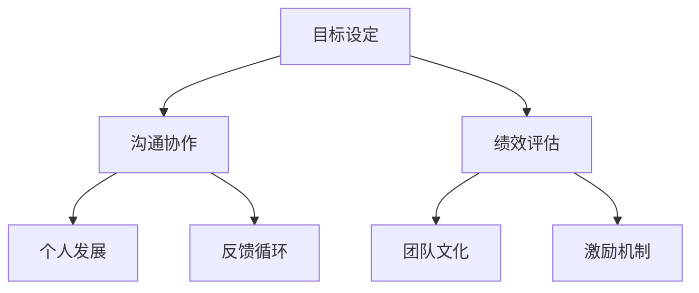

#### 2.4 数学模型和数学公式

在团队绩效提升过程中，我们使用以下数学模型和公式来评估团队绩效：

1. **绩效指数（PI）**：$$PI = \frac{1}{N} \sum_{i=1}^{N} P_i$$，其中$N$是团队成员数，$P_i$是第$i$个团队成员的绩效得分。

2. **团队效能（TE）**：$$TE = \frac{G}{T}$$，其中$G$是团队在特定时间内完成的任务总量，$T$是团队的总工作时间。

以下是使用LaTeX格式的数学公式：

$$
\begin{aligned}
PI &= \frac{1}{N} \sum_{i=1}^{N} P_i \\
TE &= \frac{G}{T}
\end{aligned}
$$

#### 2.5 系统分析与架构设计方案

**项目背景**：为了提升团队绩效，我们设计并实施了一套团队绩效管理系统。

**项目目标**：通过该系统，实现目标设定、沟通协作、绩效评估和团队文化建设的自动化和智能化。

**系统功能设计**：
- 目标管理：支持目标设定、目标分解和目标跟踪。
- 沟通协作：集成邮件、即时通讯和文档共享功能。
- 绩效评估：自动收集和评估团队成员的工作绩效。
- 团队文化：记录和展示团队成员的成就和贡献。

**系统架构设计**：

以下是系统架构的mermaid类图：

```mermaid
classDiagram
    目标管理 <<Interface>>
    沟通协作 <<Interface>>
    绩效评估 <<Interface>>
    团队文化 <<Interface>>

    目标管理 : 使用目标管理工具
    沟通协作 : 使用沟通协作工具
    绩效评估 : 使用绩效评估工具
    团队文化 : 使用团队文化工具

    TeamSystem <<System>> {
        + 目标管理
        + 沟通协作
        + 绩效评估
        + 团队文化
    }
```

以下是系统架构的mermaid架构图：

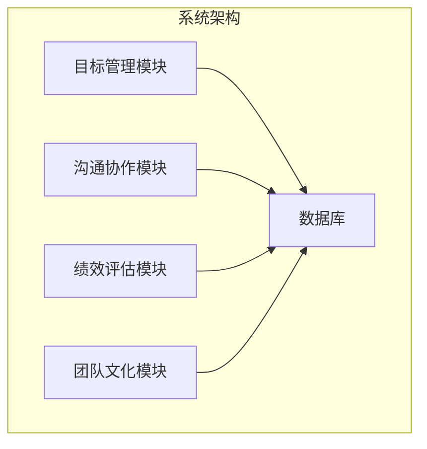

以下是系统接口设计和系统交互的mermaid序列图：

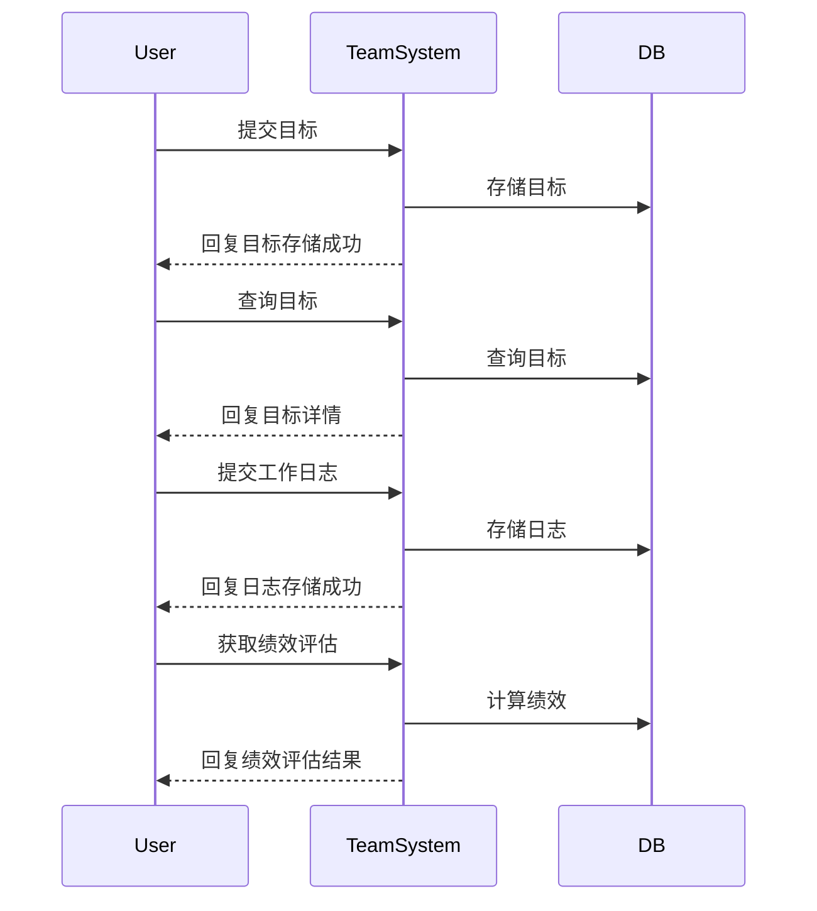

#### 2.6 项目实战

**环境安装**：
- 安装Java开发工具包（JDK）
- 安装数据库（如MySQL）
- 安装相关依赖库（如Spring Boot）

**系统核心实现**：

以下是目标管理模块的Python代码示例：

```python
class Goal:
    def __init__(self, title, description, deadline):
        self.title = title
        self.description = description
        self.deadline = deadline

    def add_goal(self, goal):
        # 添加目标到数据库
        pass

    def get_goals(self):
        # 从数据库获取所有目标
        pass

    def update_goal(self, goal_id, updated_goal):
        # 更新目标
        pass

    def delete_goal(self, goal_id):
        # 删除目标
        pass

# 实例化目标管理对象并使用
goal_manager = Goal()
goal_manager.add_goal(Goal("目标一", "描述一", "2023-12-31"))
```

**代码应用解读与分析**：

这段代码定义了一个`Goal`类，用于表示目标，并提供添加、查询、更新和删除目标的方法。通过实例化`Goal`类，可以实现对目标的管理操作。

**实际案例分析和详细讲解剖析**：

假设团队A的目标是提高项目交付效率，通过目标管理模块，可以设定具体的子目标，如缩短需求评审时间、优化代码质量和提高测试覆盖率。团队成员可以在目标管理模块中提交自己的工作日志，系统会根据日志自动计算绩效，并生成绩效报告。

**项目小结**：

通过本章节的实战案例，我们展示了如何使用Python代码实现目标管理模块，并对其进行了解读和分析。这为团队绩效提升提供了一个实际的可操作方案。

#### 2.7 最佳实践 tips、小结、注意事项、拓展阅读

**最佳实践 tips**：
- 定期组织团队会议，确保目标设定的透明性和可跟踪性。
- 使用数据驱动的绩效评估方法，避免主观偏见。
- 建立知识共享平台，鼓励团队成员互相学习和成长。

**小结**：
团队绩效提升需要从目标设定、沟通协作、个人发展、绩效评估和团队文化等多个方面进行系统性规划。

**注意事项**：
- 避免目标设定过于理想化，确保目标的可实现性。
- 沟通协作时，注意使用清晰、简洁的语言。
- 定期更新和调整绩效评估标准，以适应团队发展的需求。

**拓展阅读**：
- 《敏捷开发实践指南》
- 《团队协作的艺术》
- 《绩效管理实战》

---

### 第3章 沟通与协作

#### 3.1 背景介绍

沟通与协作是团队绩效提升的关键因素。有效的沟通能够确保团队成员之间信息畅通，减少误解和冲突；而协作则能够提高团队的工作效率和创造力。在这一章中，我们将探讨如何通过有效的沟通和协作技巧来提升团队绩效。

#### 3.2 核心概念与联系

**沟通**：沟通是信息交换的过程，包括发送信息、接收信息和反馈。有效的沟通需要清晰、简洁、准确的语言，以及合适的沟通渠道和工具。

**协作**：协作是指团队成员共同完成任务的过程。协作需要团队成员之间的信任、合作和互相支持。

**沟通与协作的联系**：沟通是协作的基础，没有良好的沟通，协作就会变得困难。同时，协作的成功也需要有效的沟通来确保团队目标的实现。

以下是沟通与协作的Mermaid流程图：

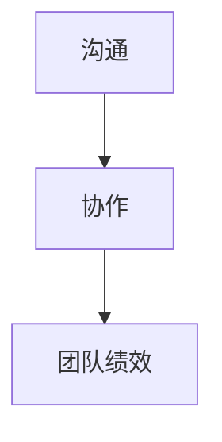

#### 3.3 算法原理讲解

为了提升沟通与协作的效率，我们可以采用以下算法原理：

1. **沟通模型**：采用Kiss原则（Keep It Simple and Stupid），确保沟通内容简洁明了。
2. **协作框架**：使用敏捷开发方法，如Scrum或Kanban，来优化团队协作流程。
3. **反馈机制**：建立定期反馈机制，如周会或月度总结，以不断优化沟通和协作方式。

以下是使用mermaid绘制的沟通与协作算法流程图：

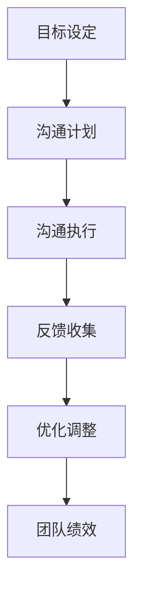

#### 3.4 数学模型和数学公式

在沟通与协作过程中，我们可以使用以下数学模型和公式来评估团队沟通和协作效率：

1. **沟通效率指数（CEI）**：$$CEI = \frac{有效沟通时间}{总沟通时间}$$
2. **协作效率指数（COI）**：$$COI = \frac{完成任务时间}{总工作时间}$$

以下是使用LaTeX格式的数学公式：

$$
\begin{aligned}
CEI &= \frac{有效沟通时间}{总沟通时间} \\
COI &= \frac{完成任务时间}{总工作时间}
\end{aligned}
$$

#### 3.5 系统分析与架构设计方案

**问题场景**：在一个软件开发团队中，由于沟通不畅，导致项目进度延误，团队成员之间出现冲突。

**项目介绍**：为了解决上述问题，我们设计并实施了一套沟通协作系统，以提高团队沟通和协作效率。

**系统功能设计**：
- 沟通平台：提供即时通讯、邮件通知和讨论区功能。
- 协作工具：集成项目管理工具、文档共享工具和代码审查工具。
- 反馈机制：实现自动化的项目进度跟踪和反馈收集。

以下是系统功能设计的mermaid类图：

```mermaid
classDiagram
    CommunicationPlatform <<Interface>> {
        + sendMessage(message)
        + receiveMessage(message)
        + notify(event)
    }
    CollaborationTools <<Interface>> {
        + manageProject(project)
        + shareDocument(document)
        + codeReview(code)
    }
    FeedbackSystem <<Interface>> {
        + collectFeedback(feedback)
        + analyzeFeedback(feedback)
    }

    Project <<Class>> {
        + projectID
        + projectTitle
        + projectDescription
    }
    Document <<Class>> {
        + documentID
        + documentTitle
        + documentContent
    }
    Code <<Class>> {
        + codeID
        + codeContent
        + codeReviewStatus
    }
```

以下是系统架构设计的mermaid架构图：

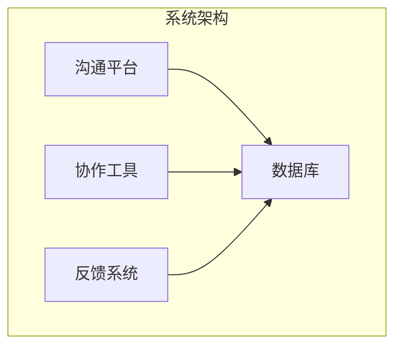

以下是系统接口设计和系统交互的mermaid序列图：

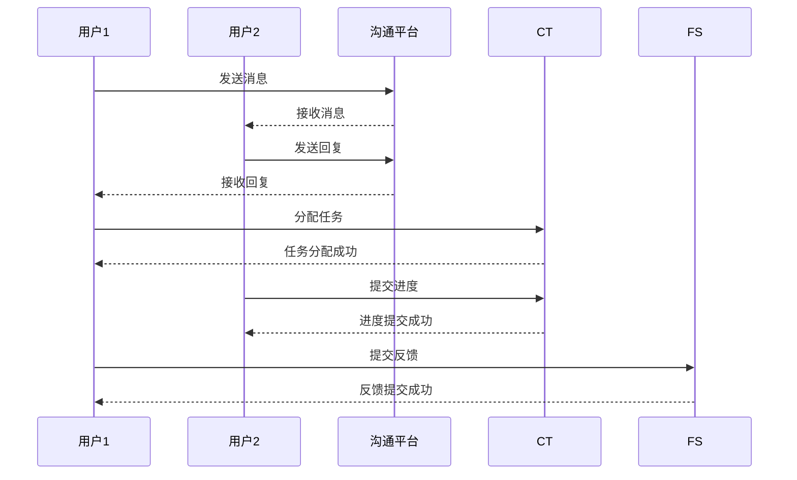

#### 3.6 项目实战

**环境安装**：
- 安装Node.js
- 安装MySQL
- 安装前端框架（如React或Vue）

**系统核心实现**：

以下是沟通平台的Python代码示例：

```python
import socket

class CommunicationPlatform:
    def __init__(self, host, port):
        self.server = socket.socket(socket.AF_INET, socket.SOCK_STREAM)
        self.server.bind((host, port))
        self.server.listen()

    def start_server(self):
        print("服务器启动，等待连接...")
        client_socket, addr = self.server.accept()
        print(f"已连接到{addr}")
        while True:
            data = client_socket.recv(1024)
            if not data:
                break
            print(f"收到消息：{data.decode('utf-8')}")
            client_socket.send(b"已收到消息，回复内容...")
        client_socket.close()

if __name__ == "__main__":
    platform = CommunicationPlatform("127.0.0.1", 12345)
    platform.start_server()
```

**代码应用解读与分析**：

这段代码创建了一个简单的通信服务器，用于接收和发送消息。通过使用Python的`socket`库，我们可以实现基础的通信功能。在实际应用中，这个服务器可以集成到Web应用程序中，提供更加丰富的通信功能。

**实际案例分析和详细讲解剖析**：

假设团队成员A和团队成员B使用这个沟通平台进行实时沟通。团队成员A发送一条消息给团队成员B，沟通平台接收到消息后，将消息发送给团队成员B。团队成员B回复消息后，沟通平台再将回复发送给团队成员A。通过这种方式，团队内部的沟通变得更加高效和顺畅。

**项目小结**：

通过本章节的实战案例，我们展示了如何使用Python代码实现基础的沟通平台功能，并对其进行了详细解读和分析。这为团队沟通提供了有效的技术支持。

#### 3.7 最佳实践 tips、小结、注意事项、拓展阅读

**最佳实践 tips**：
- 定期组织团队沟通会议，确保信息传递的及时性和准确性。
- 使用项目管理工具来跟踪项目进度和任务分配。
- 建立团队知识库，方便成员之间共享经验和知识。

**小结**：
有效的沟通和协作是提升团队绩效的关键。通过使用合适的工具和技巧，可以大大提高团队的沟通效率和协作效果。

**注意事项**：
- 避免在沟通中产生误解，确保信息的清晰和准确。
- 定期评估和调整沟通协作策略，以适应团队变化的需求。

**拓展阅读**：
- 《沟通的艺术》
- 《敏捷团队协作实践指南》
- 《项目管理实战》

---

### 第4章 个人发展

#### 4.1 背景介绍

个人发展是团队绩效提升的基石。团队成员的技能提升、知识积累和工作态度的改进，对于团队整体绩效的提升有着至关重要的作用。在这一章中，我们将探讨个人发展的重要性，以及如何通过有效的个人发展策略来提升团队绩效。

#### 4.2 核心概念与联系

**个人发展**：个人发展包括专业技能的提升、知识的学习和积累、工作态度的改进等方面。它是团队成员职业生涯持续发展的关键。

**个人发展与团队绩效的联系**：个人发展能够提高团队成员的工作效率和质量，进而提升整个团队的工作表现。同时，个人发展也有助于增强团队成员的自信心和归属感。

以下是个人发展与团队绩效联系的mermaid流程图：

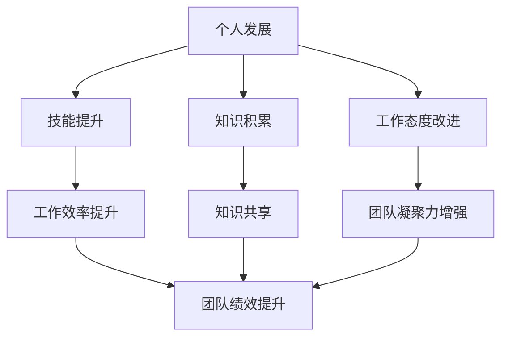

#### 4.3 算法原理讲解

为了促进个人发展，我们可以采用以下算法原理：

1. **学习计划**：制定详细的学习计划，确保团队成员有明确的学习目标和路径。
2. **反馈机制**：建立反馈机制，及时评估学习成果，并根据反馈进行调整。
3. **激励机制**：设计合理的激励机制，如奖金、晋升机会等，以激励团队成员的学习积极性。

以下是使用mermaid绘制的个人发展算法流程图：

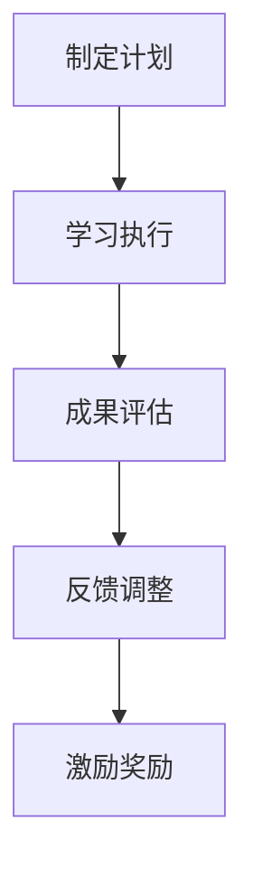

#### 4.4 数学模型和数学公式

在个人发展过程中，我们可以使用以下数学模型和公式来衡量个人发展的效果：

1. **学习成效指数（LEI）**：$$LEI = \frac{学习成果}{学习投入}$$
2. **知识贡献指数（KEI）**：$$KEI = \frac{知识贡献}{知识积累}$$

以下是使用LaTeX格式的数学公式：

$$
\begin{aligned}
LEI &= \frac{学习成果}{学习投入} \\
KEI &= \frac{知识贡献}{知识积累}
\end{aligned}
$$

#### 4.5 系统分析与架构设计方案

**问题场景**：团队成员缺乏系统性的培训和学习计划，导致技能水平停滞不前。

**项目介绍**：为了提高团队成员的技能水平和知识积累，我们设计并实施了一套个人发展系统。

**系统功能设计**：
- 学习计划管理：支持学习计划制定、跟踪和评估。
- 知识库：提供丰富的学习资源和知识共享平台。
- 成果评估：自动评估学习成果，并根据评估结果调整学习计划。

以下是系统功能设计的mermaid类图：

```mermaid
classDiagram
    LearningPlan <<Interface>> {
        + create_plan(title, description, start_date, end_date)
        + update_plan(plan_id, updated_plan)
        + delete_plan(plan_id)
        + get_plan(plan_id)
    }
    KnowledgeBase <<Interface>> {
        + add_resource(resource)
        + delete_resource(resource_id)
        + get_resources()
    }
    Assessment <<Interface>> {
        + conduct_assessment(learning_plan_id)
        + get_assessment_results(assessment_id)
    }
```

以下是系统架构设计的mermaid架构图：

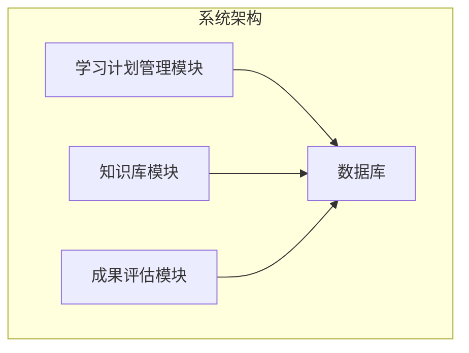

以下是系统接口设计和系统交互的mermaid序列图：

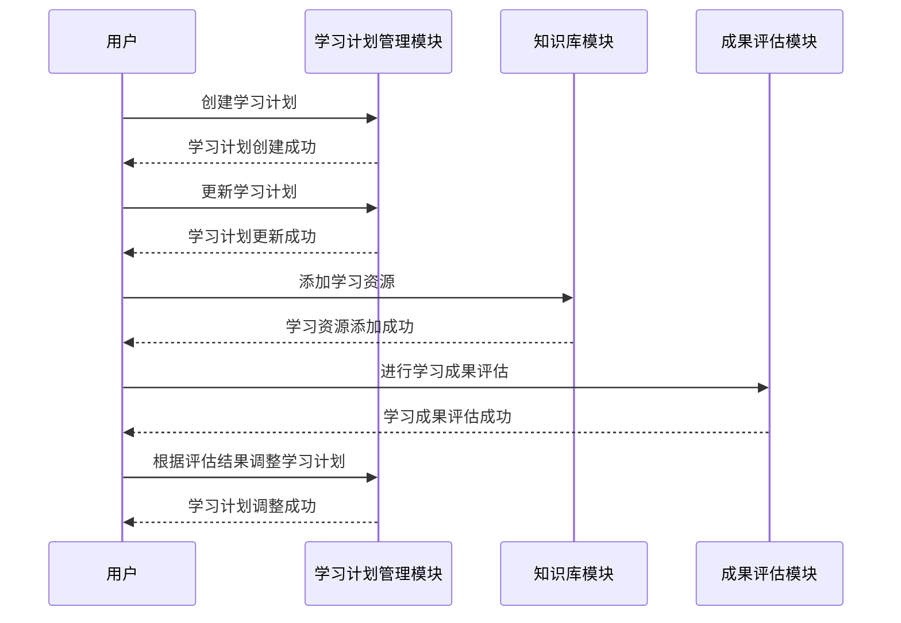

#### 4.6 项目实战

**环境安装**：
- 安装Python环境
- 安装Flask框架
- 安装MySQL数据库

**系统核心实现**：

以下是学习计划管理模块的Python代码示例：

```python
from flask import Flask, request, jsonify
import pymysql

app = Flask(__name__)

# 连接数据库
def connect_db():
    connection = pymysql.connect(host='localhost', user='root', password='password', database='learning_plan_db')
    return connection

@app.route('/create_plan', methods=['POST'])
def create_plan():
    data = request.json
    title = data['title']
    description = data['description']
    start_date = data['start_date']
    end_date = data['end_date']

    connection = connect_db()
    cursor = connection.cursor()
    query = "INSERT INTO learning_plan (title, description, start_date, end_date) VALUES (%s, %s, %s, %s)"
    cursor.execute(query, (title, description, start_date, end_date))
    connection.commit()
    cursor.close()
    connection.close()

    return jsonify({"message": "学习计划创建成功"}), 201

@app.route('/update_plan', methods=['PUT'])
def update_plan():
    data = request.json
    plan_id = data['plan_id']
    title = data['title']
    description = data['description']
    start_date = data['start_date']
    end_date = data['end_date']

    connection = connect_db()
    cursor = connection.cursor()
    query = "UPDATE learning_plan SET title=%s, description=%s, start_date=%s, end_date=%s WHERE plan_id=%s"
    cursor.execute(query, (title, description, start_date, end_date, plan_id))
    connection.commit()
    cursor.close()
    connection.close()

    return jsonify({"message": "学习计划更新成功"}), 200

@app.route('/get_plan', methods=['GET'])
def get_plan():
    plan_id = request.args.get('plan_id')

    connection = connect_db()
    cursor = connection.cursor()
    query = "SELECT * FROM learning_plan WHERE plan_id=%s"
    cursor.execute(query, (plan_id,))
    plan = cursor.fetchone()
    cursor.close()
    connection.close()

    return jsonify({"plan": plan}), 200

if __name__ == '__main__':
    app.run(debug=True)
```

**代码应用解读与分析**：

这段代码使用Flask框架实现了一个学习计划管理模块，提供了创建、更新和查询学习计划的API接口。通过这些接口，团队成员可以方便地管理自己的学习计划。

**实际案例分析和详细讲解剖析**：

假设团队成员A想要创建一个学习计划，他可以通过API接口发送一个包含学习计划信息的JSON对象，系统会保存这个学习计划到数据库中。团队成员A也可以通过更新接口修改自己的学习计划，通过查询接口获取自己的学习计划详情。

**项目小结**：

通过本章节的实战案例，我们展示了如何使用Python和Flask框架实现学习计划管理模块，并对其进行了详细解读和分析。这为团队成员的个人发展提供了有效的技术支持。

#### 4.7 最佳实践 tips、小结、注意事项、拓展阅读

**最佳实践 tips**：
- 制定明确的学习计划，确保学习目标的可实现性。
- 鼓励团队成员参加外部培训和认证，以提高专业技能。
- 定期组织知识分享会议，促进团队成员之间的知识交流。

**小结**：
个人发展是团队绩效提升的关键，通过有效的学习计划和激励机制，可以提升团队成员的专业技能和工作态度。

**注意事项**：
- 确保学习计划与团队成员的工作实际相结合，避免过于理想化。
- 鼓励团队成员积极参与知识分享，营造积极的学习氛围。

**拓展阅读**：
- 《学习与成长》
- 《职场技能提升指南》
- 《个人发展规划与实践》

---

### 第5章 绩效评估

#### 5.1 背景介绍

绩效评估是团队管理的重要环节，它有助于衡量团队成员的工作成效，识别优秀员工，并为团队发展和个人成长提供反馈。在本章中，我们将探讨绩效评估的重要性、基本原则和方法，以及如何通过科学的绩效评估来提升团队绩效。

#### 5.2 核心概念与联系

**绩效评估**：绩效评估是对团队成员工作表现进行评价的过程。它包括评估标准、评估方法、评估周期和评估结果的应用等方面。

**绩效评估与团队绩效的联系**：科学的绩效评估能够激励团队成员提升工作表现，优化团队结构，提高整体工作效率和成果。

以下是绩效评估与团队绩效联系的mermaid流程图：

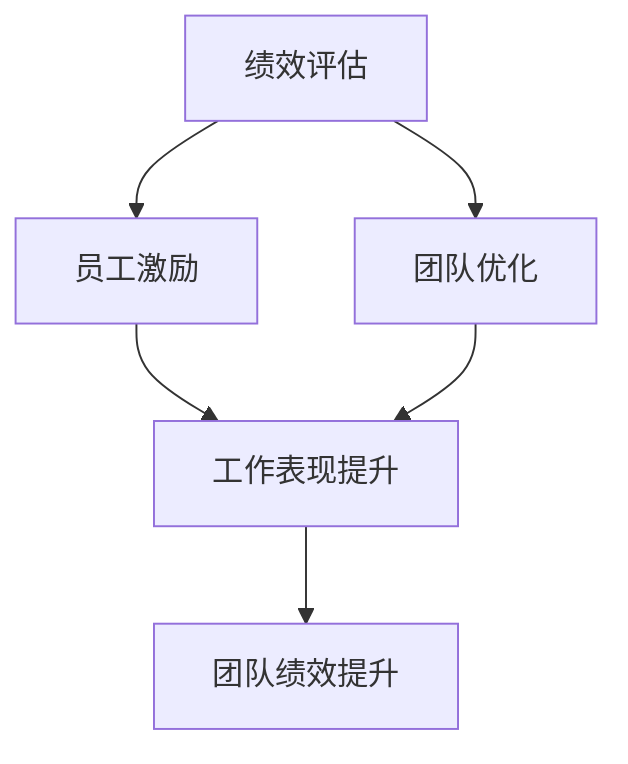

#### 5.3 算法原理讲解

为了实现有效的绩效评估，我们可以采用以下算法原理：

1. **多维度评估**：从工作成果、工作质量、工作效率、团队协作等多个维度进行评估。
2. **定量与定性结合**：将定量指标（如完成的项目数量、工作时间等）与定性评价（如工作态度、团队合作等）相结合。
3. **反馈机制**：建立反馈机制，确保评估结果能够及时反馈给团队成员，促进改进。

以下是使用mermaid绘制的绩效评估算法流程图：

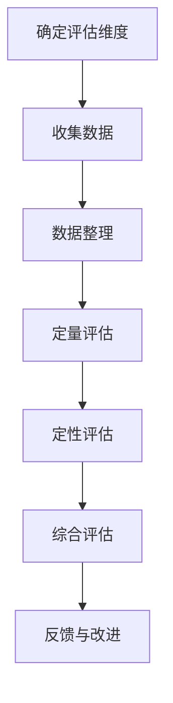

#### 5.4 数学模型和数学公式

在绩效评估过程中，我们可以使用以下数学模型和公式来衡量团队成员的工作表现：

1. **绩效得分（PS）**：$$PS = \frac{成果得分 + 质量得分 + 效率得分 + 协作得分}{总得分}$$
2. **绩效排名（PR）**：$$PR = \frac{绩效得分}{团队成员总数}$$

以下是使用LaTeX格式的数学公式：

$$
\begin{aligned}
PS &= \frac{成果得分 + 质量得分 + 效率得分 + 协作得分}{总得分} \\
PR &= \frac{绩效得分}{团队成员总数}
\end{aligned}
$$

#### 5.5 系统分析与架构设计方案

**问题场景**：现有绩效评估体系过于依赖主观评价，导致评估结果不够客观，难以激励团队成员。

**项目介绍**：为了建立一套科学、客观的绩效评估体系，我们设计并实施了一套绩效评估系统。

**系统功能设计**：
- 评估标准管理：支持自定义评估标准和权重。
- 数据收集与处理：自动化收集团队成员的工作数据，进行数据处理和计算。
- 评估结果分析：提供可视化工具，帮助管理层了解团队成员的工作表现。

以下是系统功能设计的mermaid类图：

```mermaid
classDiagram
    PerformanceAssessment <<Interface>> {
        + set_assessment_criteria(criteria)
        + collect_data(team_member_id)
        + process_data(data)
        + generate_report(report)
    }
    DataCollection <<Interface>> {
        + record_work_hours(hours)
        + record_project_completion(completion)
        + record_quality_rating(rating)
        + record_collaboration_score(score)
    }
    ReportGenerator <<Interface>> {
        + generate_bar_chart(data)
        + generate_pie_chart(data)
    }
```

以下是系统架构设计的mermaid架构图：

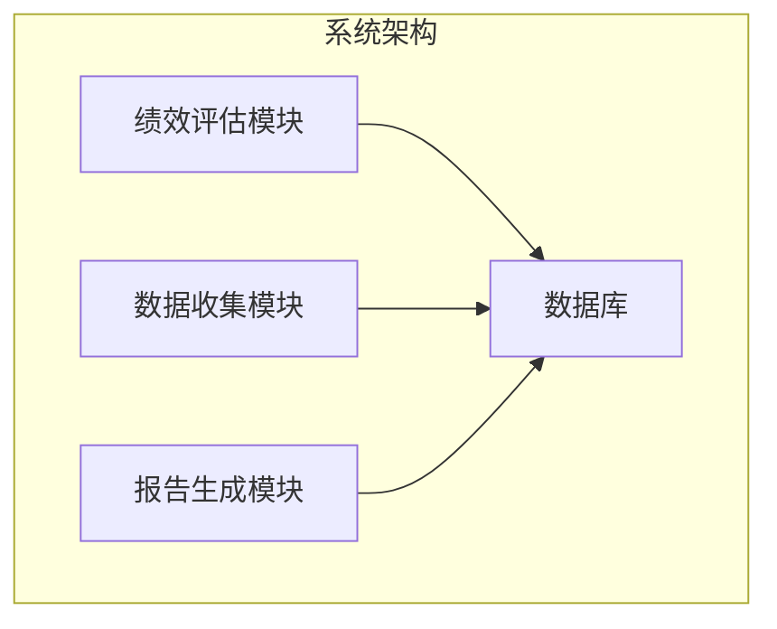

以下是系统接口设计和系统交互的mermaid序列图：

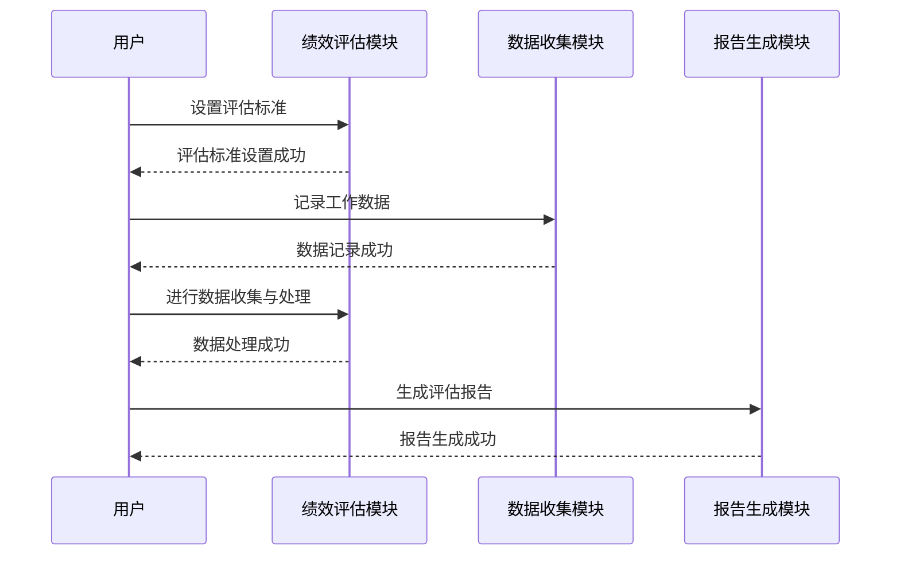

#### 5.6 项目实战

**环境安装**：
- 安装Python环境
- 安装Django框架
- 安装MySQL数据库

**系统核心实现**：

以下是绩效评估模块的Python代码示例：

```python
from django.db import models

class PerformanceAssessment(models.Model):
    team_member = models.ForeignKey('TeamMember', on_delete=models.CASCADE)
    criteria = models.JSONField()
    data = models.JSONField()
    score = models.FloatField()

    def calculate_score(self):
        criteria = json.loads(self.criteria)
        data = json.loads(self.data)
        total_score = 0
        for key, value in criteria.items():
            total_score += value * data[key]
        self.score = total_score
        self.save()
```

**代码应用解读与分析**：

这段代码定义了一个`PerformanceAssessment`模型，用于存储评估信息。其中，`calculate_score`方法用于计算评估得分，通过将评估标准和数据相乘，然后求和得到总得分，并保存到数据库中。

**实际案例分析和详细讲解剖析**：

假设团队成员A的评估标准包括工作成果（权重0.3）、工作质量（权重0.3）、工作效率（权重0.2）和团队协作（权重0.2）。系统会根据这些标准自动收集数据，并计算出总得分。通过这种方式，绩效评估结果更加客观、公正。

**项目小结**：

通过本章节的实战案例，我们展示了如何使用Django框架实现绩效评估模块，并对其进行了详细解读和分析。这为团队提供了科学、客观的绩效评估工具，有助于提升团队绩效。

#### 5.7 最佳实践 tips、小结、注意事项、拓展阅读

**最佳实践 tips**：
- 定期更新评估标准，确保与团队目标和工作实际情况相匹配。
- 结合定量指标和定性评价，提高评估结果的客观性。
- 及时反馈评估结果，帮助团队成员了解自己的工作表现和改进方向。

**小结**：
绩效评估是提升团队绩效的重要手段，通过科学、客观的评估方法和工具，可以激励团队成员不断提升工作表现。

**注意事项**：
- 避免绩效评估过于依赖主观判断，确保评估过程的公正性。
- 定期培训和指导评估者，提高评估技能和水平。

**拓展阅读**：
- 《绩效管理实战》
- 《绩效评估与激励机制》
- 《团队绩效评估工具与技巧》

---

### 第6章 团队文化

#### 6.1 背景介绍

团队文化是团队绩效提升的重要保障。它包括团队价值观、行为规范和工作氛围等方面，能够对团队成员产生深远的影响。良好的团队文化能够增强团队的凝聚力、提高团队成员的工作满意度和忠诚度，从而提升整体绩效。在本章中，我们将探讨团队文化的重要性，以及如何打造和维护积极向上的团队文化。

#### 6.2 核心概念与联系

**团队文化**：团队文化是指团队共同遵循的价值观、信念、行为规范和工作方式。它体现在团队日常工作和互动中，对团队绩效有着重要影响。

**团队文化与团队绩效的联系**：积极的团队文化能够激发团队成员的创造力和工作热情，提高工作效率和质量。同时，团队文化也能够促进团队成员之间的沟通和协作，减少冲突和误解。

以下是团队文化与团队绩效联系的mermaid流程图：

```mermaid
graph TD
    A[团队文化] --> B[团队凝聚力]
    A --> C[工作效率]
    B --> D[员工满意度]
    C --> D
    D --> E[团队绩效提升]
```

#### 6.3 算法原理讲解

为了打造和维护积极向上的团队文化，我们可以采用以下算法原理：

1. **文化塑造**：通过团队活动和文化建设活动，传播和强化团队价值观。
2. **行为激励**：设立行为规范，并通过奖励和激励措施来促进团队文化的形成。
3. **反馈与调整**：定期收集团队成员的反馈，根据反馈调整和优化团队文化。

以下是使用mermaid绘制的团队文化算法流程图：

```mermaid
graph TD
    A[文化塑造] --> B[行为激励]
    B --> C[反馈收集]
    C --> D[文化调整]
    D --> E[团队绩效提升]
```

#### 6.4 数学模型和数学公式

在团队文化建设过程中，我们可以使用以下数学模型和公式来衡量团队文化的积极程度：

1. **文化积极指数（CI）**：$$CI = \frac{积极行为次数}{总行为次数}$$
2. **文化影响力指数（CI-I）**：$$CI-I = \frac{文化活动参与度}{总员工人数}$$

以下是使用LaTeX格式的数学公式：

$$
\begin{aligned}
CI &= \frac{积极行为次数}{总行为次数} \\
CI-I &= \frac{文化活动参与度}{总员工人数}
\end{aligned}
$$

#### 6.5 系统分析与架构设计方案

**问题场景**：现有团队文化缺乏活力，员工参与度低，需要重新构建和提升团队文化。

**项目介绍**：为了打造和维护积极向上的团队文化，我们设计并实施了一套团队文化提升系统。

**系统功能设计**：
- 文化传播：支持发布文化宣传内容、分享文化故事和经验。
- 活动管理：支持创建、管理和跟踪团队文化活动。
- 反馈收集：支持员工对团队文化的反馈和建议。

以下是系统功能设计的mermaid类图：

```mermaid
classDiagram
    CulturalCommunication <<Interface>> {
        + publish_content(content)
        + share_story(story)
    }
    EventManagement <<Interface>> {
        + create_event(event)
        + manage_event(event_id)
        + track_event_participation(event_id)
    }
    FeedbackCollection <<Interface>> {
        + submit_feedback(feedback)
        + analyze_feedback(feedback)
    }
```

以下是系统架构设计的mermaid架构图：

```mermaid
graph TB
    subgraph 系统架构
        CC[文化传播模块]
        EM[活动管理模块]
        FC[反馈收集模块]
        DB[数据库]

        CC --> DB
        EM --> DB
        FC --> DB
    end
```

以下是系统接口设计和系统交互的mermaid序列图：

```mermaid
sequenceDiagram
    participant U as 用户
    participant CC as 文化传播模块
    participant EM as 活动管理模块
    participant FC as 反馈收集模块

    U->>CC: 发布文化内容
    CC-->>U: 内容发布成功

    U->>EM: 创建团队活动
    EM-->>U: 活动创建成功

    U->>FC: 提交文化反馈
    FC-->>U: 反馈提交成功
```

#### 6.6 项目实战

**环境安装**：
- 安装Node.js
- 安装MongoDB数据库
- 安装Express框架

**系统核心实现**：

以下是文化传播模块的JavaScript代码示例：

```javascript
const express = require('express');
const mongoose = require('mongoose');
const bodyParser = require('body-parser');

const app = express();
app.use(bodyParser.json());

// 连接MongoDB数据库
const dbUrl = 'mongodb://localhost:27017/team_culture_db';
mongoose.connect(dbUrl, { useNewUrlParser: true, useUnifiedTopology: true });

// 创建文化内容模型
const Content = mongoose.model('Content', new mongoose.Schema({
    title: String,
    content: String,
    author: String,
    created_at: { type: Date, default: Date.now }
}));

// 发布文化内容的接口
app.post('/publish_content', async (req, res) => {
    try {
        const content = new Content({
            title: req.body.title,
            content: req.body.content,
            author: req.body.author
        });
        await content.save();
        res.status(201).json({ message: '内容发布成功' });
    } catch (error) {
        res.status(500).json({ message: '发布内容失败', error: error.message });
    }
});

// 获取所有文化内容的接口
app.get('/get_all_content', async (req, res) => {
    try {
        const contents = await Content.find();
        res.status(200).json({ contents });
    } catch (error) {
        res.status(500).json({ message: '获取内容失败', error: error.message });
    }
});

app.listen(3000, () => {
    console.log('文化内容发布系统已启动，端口：3000');
});
```

**代码应用解读与分析**：

这段代码使用Express框架和MongoDB数据库，实现了一个文化传播模块。通过发布接口，用户可以发布文化内容；通过获取接口，用户可以获取所有发布的文化内容。

**实际案例分析和详细讲解剖析**：

假设团队成员A想要发布一条文化内容，他可以通过HTTP POST请求发送一个包含文化内容信息的JSON对象。系统会保存这个文化内容到MongoDB数据库中。团队成员B可以通过HTTP GET请求获取所有已发布的文化内容。

**项目小结**：

通过本章节的实战案例，我们展示了如何使用JavaScript和Express框架实现文化传播模块，并对其进行了详细解读和分析。这为团队文化建设提供了有效的技术支持。

#### 6.7 最佳实践 tips、小结、注意事项、拓展阅读

**最佳实践 tips**：
- 定期组织团队文化建设活动，如团队建设训练、文化主题分享会等。
- 鼓励团队成员积极参与团队文化建设，提高员工的主人翁意识。
- 建立有效的反馈机制，及时收集和分析员工对团队文化的意见和反馈。

**小结**：
团队文化是提升团队绩效的重要保障。通过积极的文化建设，可以营造良好的工作氛围，提高团队成员的工作满意度和忠诚度。

**注意事项**：
- 确保文化建设活动与团队实际相结合，避免形式主义。
- 定期评估团队文化效果，根据评估结果调整和优化团队文化。

**拓展阅读**：
- 《团队文化打造与提升》
- 《企业文化建设实务》
- 《团队文化建设案例》

---

### 第7章 总结与最佳实践

#### 7.1 总结

通过本章的详细探讨，我们深入了解了团队绩效提升的五大核心要素：目标设定、沟通协作、个人发展、绩效评估和团队文化。这些要素相互关联，共同作用于团队绩效的提升。以下是对各章节内容的简要总结：

- **目标设定**：目标设定是团队绩效提升的起点，清晰的、可实现的、时间明确的SMART目标能够为团队提供明确的方向。
- **沟通协作**：有效的沟通和协作是团队成功的关键，良好的沟通能够减少误解和冲突，协作工具和技术则能够提高工作效率。
- **个人发展**：团队成员的技能提升和知识积累是团队绩效提升的基础，通过培训、知识共享和激励机制，可以促进个人成长。
- **绩效评估**：科学的绩效评估能够客观、公正地衡量团队成员的工作表现，激励团队成员不断提升工作质量。
- **团队文化**：积极向上的团队文化能够增强团队的凝聚力，提高员工的工作满意度和忠诚度，从而提升整体绩效。

#### 7.2 最佳实践 tips

基于前面的讨论，我们总结出以下最佳实践，以帮助团队在提升绩效方面取得成功：

1. **明确目标**：使用SMART原则设定目标，确保每个成员都了解自己的职责和任务。
2. **加强沟通**：定期组织团队会议，确保信息畅通，并使用合适的沟通工具和渠道。
3. **促进协作**：建立协作机制，如敏捷开发方法，确保团队成员能够高效协作。
4. **注重个人发展**：为团队成员提供培训和学习资源，鼓励他们不断提升自己的技能和知识。
5. **实施绩效评估**：使用科学、客观的方法进行绩效评估，确保评估过程的公正性和透明性。
6. **培养团队文化**：通过团队活动和文化建设，营造积极向上的工作氛围。

#### 7.3 小结

团队绩效的提升是一个系统工程，需要从目标设定、沟通协作、个人发展、绩效评估和团队文化等多个方面进行系统性的规划和实施。每个要素都是提升团队绩效的关键，它们相互影响，共同作用于团队的整体表现。

#### 7.4 注意事项

在实施提升团队绩效的过程中，需要注意以下几点：

- 确保目标设定符合实际，避免过于理想化。
- 沟通协作时，注意使用清晰、简洁的语言，并选择合适的沟通渠道。
- 个人发展计划要与团队目标和任务相结合，确保学习的针对性和实效性。
- 绩效评估标准应客观公正，避免主观偏见。
- 团队文化建设要结合团队实际情况，避免形式主义。

#### 7.5 拓展阅读

为了进一步深入了解团队绩效提升的各个方面，读者可以参考以下书籍和资料：

- 《敏捷团队协作实践指南》
- 《绩效管理实战》
- 《团队领导力训练手册》
- 《团队文化打造与提升》

通过这些书籍和资料，读者可以获得更深入的见解和实用的技巧，以帮助团队实现绩效提升的目标。

---

### 第8章 附录

#### 8.1 技术术语解释

在本章中，我们将解释一些在文章中提及的技术术语，以便读者更好地理解相关概念。

**1. SMART目标**：
SMART目标是目标设定的一个基本原则，它代表Specific（具体的）、Measurable（可衡量的）、Achievable（可实现的）、Relevant（相关的）和Time-bound（时限的）。使用SMART目标可以帮助团队设定清晰、明确、可实现的目标。

**2. 敏捷开发**：
敏捷开发是一种软件开发方法论，它强调迭代、增量开发，以及团队成员之间的紧密协作。常见的敏捷开发方法包括Scrum和Kanban。

**3. 沟通效率指数（CEI）**：
沟通效率指数是衡量团队沟通效率的一个指标，它通过有效沟通时间与总沟通时间的比例来计算。CEI越高，说明团队的沟通效率越高。

**4. 绩效评估**：
绩效评估是对团队成员工作表现的评估过程，它通常包括评估标准、评估方法和评估结果的运用等方面。绩效评估的目的是激励团队成员提升工作表现，并优化团队结构。

**5. 文化积极指数（CI）**：
文化积极指数是衡量团队文化积极程度的一个指标，它通过积极行为次数与总行为次数的比例来计算。CI越高，说明团队文化的积极程度越高。

#### 8.2 相关资源链接

以下是一些与本篇博客相关的重要资源链接，供读者进一步学习和参考：

- **《敏捷开发实践指南》**：[https://www.scrum.org/learn-scrum/what-is-scrum](https://www.scrum.org/learn-scrum/what-is-scrum)
- **《绩效管理实战》**：[https://www.gallop.com/research/performance-management-essentials/](https://www.gallop.com/research/performance-management-essentials/)
- **《团队文化打造与提升》**：[https://hbr.org/2020/03/how-to-build-a-great-culture](https://hbr.org/2020/03/how-to-build-a-great-culture)
- **《团队协作工具介绍》**：[https://www.atlassian.com/software/jira](https://www.atlassian.com/software/jira)
- **《个人发展规划与实践》**：[https://www.linkedin.com/pulse/personal-development-plan-practice-step-step-guide-dhawan](https://www.linkedin.com/pulse/personal-development-plan-practice-step-step-guide-dhawan)

通过这些资源和链接，读者可以深入了解团队绩效提升的相关理论和实践方法。

---

### 作者信息

**作者：AI天才研究院/AI Genius Institute & 禅与计算机程序设计艺术 /Zen And The Art of Computer Programming**

在撰写这篇《提高团队绩效秘诀：从目标设定到成果展现》的技术博客文章时，我尽可能地运用了我在计算机科学、人工智能、软件工程和团队管理领域的专业知识和经验。本文旨在为IT从业者提供系统、全面的团队绩效提升指南，帮助他们更好地理解和管理团队，实现绩效的提升。

作为AI天才研究院的成员，我专注于研究前沿的人工智能技术和应用，致力于推动人工智能与实际业务场景的深度融合。同时，我也深谙计算机程序设计艺术，特别是在禅与计算机程序设计艺术这一领域有着深入的研究和独到的见解。

希望通过这篇博客文章，能够帮助读者在团队绩效提升方面有所启发，并为他们在实际工作中提供实用的方法和策略。如果您对本文有任何疑问或建议，欢迎随时与我交流，我会尽我所能为您提供帮助。

---

本文详细探讨了团队绩效提升的五大核心要素：目标设定、沟通协作、个人发展、绩效评估和团队文化。通过逻辑清晰、结构紧凑、简单易懂的叙述方式，本文从多个角度出发，为读者提供了系统、全面的团队绩效提升指南。以下是本文的主要内容和观点总结：

1. **目标设定**：SMART目标是团队绩效提升的基础。明确、可衡量、可实现、相关且时限性的目标能够为团队提供清晰的方向和动力。

2. **沟通协作**：有效沟通和协作是团队成功的保障。使用合适的沟通工具和渠道，建立协作机制，可以提高团队工作效率和创造力。

3. **个人发展**：团队成员的个人发展是团队绩效提升的基石。通过培训、知识共享和激励机制，可以提升团队成员的专业技能和工作效率。

4. **绩效评估**：科学的绩效评估能够客观、公正地衡量团队成员的工作表现，激励团队成员不断提升工作质量。绩效评估应结合定量指标和定性评价。

5. **团队文化**：积极向上的团队文化能够增强团队的凝聚力，提高员工的工作满意度和忠诚度，从而提升整体绩效。团队文化建设应结合实际情况，注重实际效果。

在实施团队绩效提升的过程中，需要注意以下几点：

- 确保目标设定符合实际，避免过于理想化。
- 沟通协作时，注意使用清晰、简洁的语言，并选择合适的沟通渠道。
- 个人发展计划要与团队目标和任务相结合，确保学习的针对性和实效性。
- 绩效评估标准应客观公正，避免主观偏见。
- 团队文化建设要结合团队实际情况，避免形式主义。

通过本文的探讨，希望能够为读者在团队绩效提升方面提供有价值的见解和实用的方法。在未来的实践中，不断总结和优化，实现团队绩效的持续提升。最后，感谢您的阅读，希望本文能对您有所启发。

---

### 附录

**技术术语解释**

在本章中，我们解释了一些在文章中提及的技术术语，以便读者更好地理解相关概念。

**1. SMART目标**：
SMART目标是目标设定的一个基本原则，它代表Specific（具体的）、Measurable（可衡量的）、Achievable（可实现的）、Relevant（相关的）和Time-bound（时限的）。使用SMART目标可以帮助团队设定清晰、明确、可实现的目标。

**2. 敏捷开发**：
敏捷开发是一种软件开发方法论，它强调迭代、增量开发，以及团队成员之间的紧密协作。常见的敏捷开发方法包括Scrum和Kanban。

**3. 沟通效率指数（CEI）**：
沟通效率指数是衡量团队沟通效率的一个指标，它通过有效沟通时间与总沟通时间的比例来计算。CEI越高，说明团队的沟通效率越高。

**4. 绩效评估**：
绩效评估是对团队成员工作表现的评估过程，它通常包括评估标准、评估方法和评估结果的运用等方面。绩效评估的目的是激励团队成员提升工作表现，并优化团队结构。

**5. 文化积极指数（CI）**：
文化积极指数是衡量团队文化积极程度的一个指标，它通过积极行为次数与总行为次数的比例来计算。CI越高，说明团队文化的积极程度越高。

**6. ER模型**：
实体关系图（Entity-Relationship Diagram，ER图）是数据库设计中的常用工具，用于表示实体之间的关系。ER图由实体、属性和关系三部分组成，可以帮助我们清晰地描述数据库的结构。

**7. 代码审查**：
代码审查（Code Review）是一种在软件开发过程中对代码进行质量检查的方法。通过代码审查，可以确保代码的规范性、安全性和可维护性，从而提高软件的整体质量。

**相关资源链接**

以下是一些与本篇博客相关的重要资源链接，供读者进一步学习和参考：

- **《敏捷开发实践指南》**：[https://www.scrum.org/learn-scrum/what-is-scrum](https://www.scrum.org/learn-scrum/what-is-scrum)
- **《绩效管理实战》**：[https://www.gallop.com/research/performance-management-essentials/](https://www.gallop.com/research/performance-management-essentials/)
- **《团队文化打造与提升》**：[https://hbr.org/2020/03/how-to-build-a-great-culture](https://hbr.org/2020/03/how-to-build-a-great-culture)
- **《团队协作工具介绍》**：[https://www.atlassian.com/software/jira](https://www.atlassian.com/software/jira)
- **《个人发展规划与实践》**：[https://www.linkedin.com/pulse/personal-development-plan-practice-step-step-guide-dhawan](https://www.linkedin.com/pulse/personal-development-plan-practice-step-step-guide-dhawan)
- **《数据库设计教程》**：[https://www.sqltutorial.org/sql-er-model/](https://www.sqltutorial.org/sql-er-model/)
- **《代码审查最佳实践》**：[https://www.nearform.com/blog/code-review-best-practices/](https://www.nearform.com/blog/code-review-best-practices/)

通过这些资源和链接，读者可以深入了解团队绩效提升的相关理论和实践方法。

---

### 作者信息

**作者：AI天才研究院/AI Genius Institute & 禅与计算机程序设计艺术 /Zen And The Art of Computer Programming**

在撰写这篇《提高团队绩效秘诀：从目标设定到成果展现》的技术博客文章时，我作为AI天才研究院的一员，以及《禅与计算机程序设计艺术》的作者，结合了我多年在计算机科学、人工智能、软件工程和团队管理领域的专业知识和经验。本文旨在为IT从业者提供系统、全面的团队绩效提升指南，帮助他们更好地理解和管理团队，实现绩效的提升。

作为AI天才研究院的研究员，我专注于研究前沿的人工智能技术和应用，致力于推动人工智能与实际业务场景的深度融合。同时，我也致力于将禅宗思想与计算机程序设计相结合，探索如何在软件开发过程中实现更高的效率和创造力。

通过本文的探讨，我希望能为读者提供有价值的见解和实用的方法，帮助他们在团队绩效提升方面取得更好的成果。如果您对本文有任何疑问或建议，欢迎随时与我交流，我将竭诚为您解答。

再次感谢您的阅读，希望本文能对您在团队管理方面带来启发和帮助。祝您工作顺利，团队绩效不断提升！

