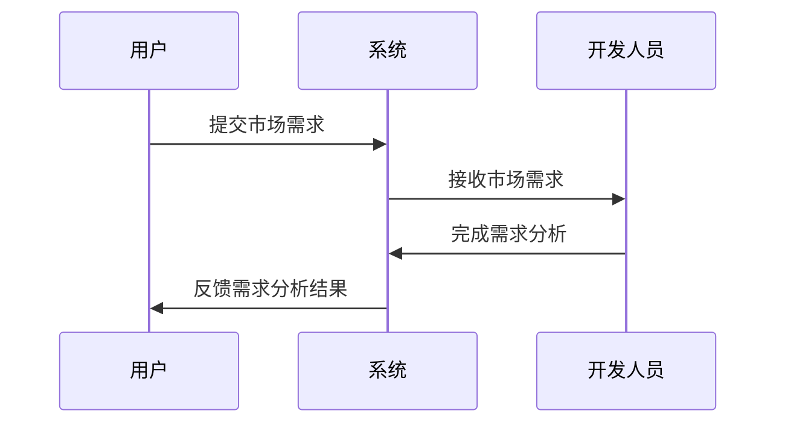
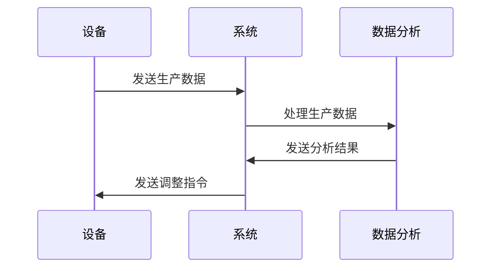
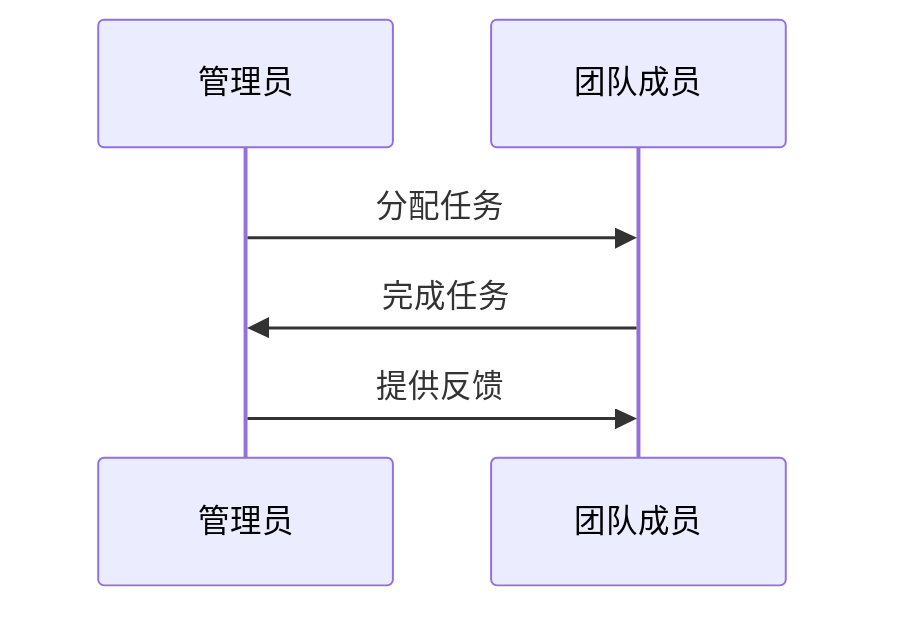

                 

### 第1章: 敏捷领导的重要性

#### 1.1 问题的背景

在当今这个快速变化的时代，企业和组织面临着前所未有的挑战。技术变革、市场动态、客户需求不断演变，这要求领导者在管理过程中不仅要具备前瞻性，还要能够迅速适应并引导团队应对变化。传统的领导模式已经难以满足这种快速变化的需求，因此，敏捷领导应运而生。

敏捷领导作为一种新兴的领导理念，起源于软件开发领域，逐渐扩展到其他行业和组织。其核心理念在于灵活性和适应性，强调领导者与团队之间的紧密协作和快速反馈。在这种背景下，敏捷领导的重要性日益凸显。

#### 1.2 问题的描述

敏捷领导的重要性主要体现在以下几个方面：

1. **应对变化的能力**：在快速变化的环境中，领导者需要具备快速响应和调整的能力，以确保团队和组织的稳定运行。
2. **团队协作与沟通**：敏捷领导强调团队成员之间的协作和沟通，通过建立良好的团队文化，提高团队的整体效率。
3. **客户价值的实现**：敏捷领导注重客户需求和反馈，通过持续交付有价值的产品和服务，提升客户满意度。
4. **创新能力的培养**：敏捷领导鼓励创新思维和尝试新方法，以保持组织的竞争力。

#### 1.3 解决问题的方法

要实现敏捷领导，领导者需要采取以下方法：

1. **培养敏捷思维**：领导者需要拥抱变化，具备前瞻性和适应性，以便在变化中寻找机遇。
2. **建立透明沟通机制**：通过定期交流和反馈，确保团队信息畅通，共同应对挑战。
3. **激发团队创造力**：领导者应鼓励团队成员提出创新想法，并给予支持和资源。
4. **关注客户需求**：领导者要时刻关注客户需求，确保产品和服务能够满足客户期望。
5. **持续学习与改进**：领导者需要不断学习和提升自己的能力，以应对不断变化的环境。

#### 1.4 边界与外延

敏捷领导并非适用于所有场景，其有效实施需要考虑以下几个方面：

1. **组织文化**：敏捷领导要求组织具备一定的文化基础，如开放、透明、合作等。
2. **团队规模**：敏捷领导在小型团队中效果更佳，因为团队间的沟通和协作相对容易。
3. **行业特点**：不同行业的敏捷领导实践可能存在差异，领导者需要根据行业特点进行调整。
4. **技术成熟度**：敏捷领导需要一定的技术支持，领导者应确保团队具备相应的技术能力。

通过以上分析，我们可以看出，敏捷领导在快速变化的环境中具有重要意义。领导者需要不断适应和引领变革，以实现团队和组织的持续发展。

----------------------------------------------------------------

#### 1.4 敏捷领导的核心概念

敏捷领导作为一种新兴的领导理念，其核心概念包括敏捷、灵活性和变更管理。

##### 1.4.1 敏捷

敏捷（Agility）是指领导者及其团队在面对不确定性和变化时，能够迅速适应和调整的能力。敏捷不仅仅是技术层面的要求，更是一种思维方式和管理哲学。它强调：

1. **快速响应**：领导者需要能够迅速识别并应对外部环境的变化。
2. **灵活调整**：团队应具备灵活调整计划和策略的能力，以应对不可预见的情况。
3. **持续改进**：领导者应鼓励团队不断优化流程和产品，以提升效率和质量。

##### 1.4.2 灵活性

灵活性（Flexibility）是指领导者能够根据环境和需求的变化，灵活调整领导风格、决策方式和资源分配。灵活性体现在以下几个方面：

1. **领导风格**：领导者应根据不同情境和团队成员的特点，灵活调整领导风格，如从指令型转变为参与型。
2. **决策方式**：领导者应鼓励团队参与决策，提高决策的透明度和接受度。
3. **资源分配**：领导者应根据团队和项目的实际需求，灵活调整资源分配，确保项目顺利进行。

##### 1.4.3 变化管理

变更管理（Change Management）是指领导者及其团队在组织变革过程中，如何确保变革成功实施和团队适应。变更管理包括以下几个方面：

1. **需求识别**：领导者需要识别组织内外部变化的需求，并评估其对组织的影响。
2. **沟通与协调**：领导者应与团队成员和利益相关者进行有效沟通，确保变革信息的传递和协调。
3. **培训与支持**：领导者应提供必要的培训和支持，帮助团队成员适应变革。
4. **监督与反馈**：领导者应持续监督变革进展，及时调整策略，确保变革目标的实现。

##### 核心概念的联系

敏捷、灵活性和变更管理是相辅相成的概念。敏捷强调领导者与团队在面对变化时的快速适应能力；灵活性则体现在领导者如何根据变化调整领导行为和决策方式；变更管理则是确保变革成功实施的过程。这三个概念共同构成了敏捷领导的核心框架，帮助领导者引领团队在快速变化的环境中取得成功。

### 1.4.4 敏捷领导的关键要素

敏捷领导的关键要素包括：

1. **愿景与目标**：领导者需要明确团队和组织的发展愿景，并制定可实现的目标。
2. **价值观与原则**：领导者应树立正确的价值观和原则，以指导团队行为和决策。
3. **信任与协作**：领导者应建立信任基础，促进团队成员之间的协作和沟通。
4. **创新与学习**：领导者应鼓励创新和学习，提升团队的整体能力。
5. **反馈与改进**：领导者应建立有效的反馈机制，不断优化团队和组织的运作。

通过这些关键要素，敏捷领导可以更好地应对快速变化的环境，实现团队和组织的长期发展。

### 1.4.5 敏捷领导理论的ER图架构

为了更好地理解敏捷领导的核心概念和要素，我们可以使用实体关系图（ER图）来描述它们之间的关系。

以下是一个敏捷领导理论的ER图示例：

```mermaid
entity关系图 {
  entity rectangle
  "敏捷思维" -- "快速响应"
  "敏捷思维" -- "灵活调整"
  "敏捷思维" -- "持续改进"
  "灵活性" -- "领导风格"
  "灵活性" -- "决策方式"
  "灵活性" -- "资源分配"
  "变更管理" -- "需求识别"
  "变更管理" -- "沟通与协调"
  "变更管理" -- "培训与支持"
  "变更管理" -- "监督与反馈"
  "敏捷领导" -- "敏捷思维"
  "敏捷领导" -- "灵活性"
  "敏捷领导" -- "变更管理"
  "敏捷领导" -- "关键要素"
  "关键要素" -- "愿景与目标"
  "关键要素" -- "价值观与原则"
  "关键要素" -- "信任与协作"
  "关键要素" -- "创新与学习"
  "关键要素" -- "反馈与改进"
}
```

通过ER图，我们可以清晰地看到敏捷领导理论中各个概念和要素之间的关系，有助于我们更好地理解和应用敏捷领导的理念。

----------------------------------------------------------------

## 第2章: 敏捷领导的核心概念

敏捷领导的成功依赖于对几个关键概念的理解和应用。本章将深入探讨敏捷、灵活性以及变更管理，并阐述这些概念的定义、属性、相互关系以及在实际应用中的重要性。

### 2.1 敏捷的定义与特征

敏捷（Agility）是一种应对变化的能力，它要求个人、团队和组织能够快速适应新的情况和环境。敏捷的特征包括：

1. **快速响应**：敏捷领导者能够迅速识别外部环境的变化，并采取相应措施。
2. **灵活调整**：领导者具备根据新信息调整计划和策略的能力。
3. **持续改进**：敏捷领导者鼓励团队不断优化流程和方法，以提高效率和效果。
4. **快速迭代**：通过快速迭代和反馈循环，确保产品和服务能够迅速适应客户需求。

#### 敏捷的属性对比表格

| 属性 | 说明 | 敏捷 | 传统 |
| --- | --- | --- | --- |
| 响应速度 | 面对变化时采取行动的迅速程度 | 快速 | 缓慢 |
| 调整能力 | 根据新信息调整计划和策略 | 高 | 低 |
| 改进持续 | 不断优化流程和方法 | 持续 | 断续 |
| 迭代循环 | 快速迭代和反馈循环 | 快速 | 缓慢 |

### 2.2 灵活性的重要性

灵活性（Flexibility）是敏捷领导的核心特征之一，它体现在领导者如何根据环境和需求的变化调整领导行为和决策方式。灵活性包括以下几个方面：

1. **领导风格**：领导者应根据团队和情境的变化，灵活调整领导风格，如从指令型转变为参与型。
2. **决策方式**：领导者应鼓励团队成员参与决策过程，提高决策的透明度和接受度。
3. **资源分配**：领导者应根据团队和项目的实际需求，灵活调整资源分配，确保项目顺利进行。

#### 灵活性的重要性

灵活性在敏捷领导中的重要性体现在以下几个方面：

1. **适应性**：灵活性使领导者能够更好地适应快速变化的环境。
2. **效率**：灵活的决策和资源分配可以提高团队的效率和产出。
3. **创新**：灵活性鼓励领导者尝试新的方法和解决方案，促进创新。

### 2.3 变化管理的基础理论

变更管理（Change Management）是指领导者及其团队在组织变革过程中，如何确保变革成功实施和团队适应。变更管理的基础理论包括：

1. **需求识别**：领导者需要识别组织内外部变化的需求，并评估其对组织的影响。
2. **沟通与协调**：领导者应与团队成员和利益相关者进行有效沟通，确保变革信息的传递和协调。
3. **培训与支持**：领导者应提供必要的培训和支持，帮助团队成员适应变革。
4. **监督与反馈**：领导者应持续监督变革进展，及时调整策略，确保变革目标的实现。

#### 变更管理的ER图架构

为了更好地理解变更管理的基础理论，我们可以使用实体关系图（ER图）来描述其关键要素之间的关系。以下是一个变更管理的ER图示例：

```mermaid
entity关系图 {
  entity rectangle
  "需求识别" -- "评估影响"
  "需求识别" -- "变更计划"
  "沟通与协调" -- "信息传递"
  "沟通与协调" -- "利益相关者"
  "培训与支持" -- "技能提升"
  "培训与支持" -- "团队适应"
  "监督与反馈" -- "变革进展"
  "监督与反馈" -- "策略调整"
  "变更管理" -- "需求识别"
  "变更管理" -- "沟通与协调"
  "变更管理" -- "培训与支持"
  "变更管理" -- "监督与反馈"
}
```

通过ER图，我们可以清晰地看到变更管理的各个关键要素及其相互关系，有助于领导者更好地实施变更管理。

### 2.4 核心概念的联系

敏捷、灵活性和变更管理是相辅相成的概念，共同构成了敏捷领导的核心框架。

1. **敏捷与灵活性**：敏捷强调快速适应变化，而灵活性体现在领导者如何根据变化调整行为和决策方式。敏捷需要灵活性作为支撑，灵活性则是敏捷实现的保障。
2. **灵活性与变更管理**：灵活性是变更管理的关键要素之一，它确保领导者能够在变革过程中迅速适应新环境和需求。
3. **变更管理与敏捷**：变更管理确保组织在变革过程中能够保持敏捷性，使组织能够快速响应外部变化。

通过理解这些核心概念及其相互关系，领导者可以更好地应对快速变化的环境，实现团队和组织的持续发展。

----------------------------------------------------------------

### 2.4.1 敏捷与灵活性如何相互作用

敏捷（Agility）和灵活性（Flexibility）是敏捷领导中的两个核心概念，它们在应对快速变化的环境中相互作用，共同为组织带来竞争优势。在本节中，我们将探讨这两个概念之间的内在联系，以及它们如何共同作用以实现组织的目标。

#### 敏捷与灵活性的内在联系

1. **快速适应变化**：敏捷的核心在于快速适应变化，而灵活性则是实现这一目标的关键。一个灵活的领导者能够在面对不确定性时迅速调整战略和决策，从而保持组织的敏捷性。
2. **动态调整能力**：敏捷和灵活性都强调领导者具备动态调整能力，即根据新的信息和情境灵活调整计划和行动。这种动态调整能力使组织能够迅速应对外部环境的变化，保持竞争力。
3. **持续改进**：敏捷和灵活性都强调持续改进的重要性。敏捷领导者鼓励团队不断优化流程和方法，而灵活性则提供了实现这一目标所需的调整空间。

#### 敏捷与灵活性共同作用的机制

1. **信息透明与共享**：敏捷和灵活性都强调信息透明和共享。领导者需要确保团队内部信息畅通，使每个成员都能了解组织的整体目标和当前状况，从而迅速做出相应调整。
2. **反馈与迭代**：敏捷和灵活性都重视反馈和迭代。通过快速反馈，领导者可以及时发现问题和改进机会，进而调整策略和行动。这种迭代过程有助于组织不断优化，提高敏捷性。
3. **文化塑造**：敏捷和灵活性都需要在组织内部建立一种适应变化的积极文化。领导者应鼓励团队成员勇于尝试新方法，接受失败，并从中学习，以培养一种灵活、开放和创新的文化氛围。

#### 案例分析

以一个快速发展的科技公司为例，该公司的领导者通过灵活性和敏捷性相结合，成功地推动了组织的快速发展。以下是该公司的几个关键实践：

1. **领导层的灵活调整**：公司领导者根据市场变化和客户需求，迅速调整产品策略和开发方向，使公司能够快速响应市场变化。
2. **持续迭代和反馈**：公司采用敏捷开发方法，通过短周期的迭代和反馈，确保产品能够不断优化，满足客户需求。
3. **开放的文化**：公司鼓励员工提出创新想法，并对失败持包容态度，这有助于培养一种积极、灵活的工作文化。

通过这些实践，该公司的领导者成功地实现了敏捷与灵活性的有机结合，使公司在竞争激烈的市场中保持了强大的竞争力。

#### 总结

敏捷和灵活性是相辅相成的概念，它们共同构成了敏捷领导的核心。领导者需要通过灵活调整和快速适应变化，确保组织在动态环境中保持敏捷性。同时，领导者还应建立一种开放、创新的文化，以激发团队的灵活性。通过敏捷与灵活性的相互作用，组织可以更好地应对外部变化，实现持续发展。

### 2.4.2 变化管理中的敏捷领导

在快速变化的环境中，变更管理（Change Management）变得至关重要。而敏捷领导（Agile Leadership）则成为确保变更管理成功实施的关键因素。本节将探讨敏捷领导在变更管理中的作用，以及如何通过敏捷领导实现有效变更。

#### 敏捷领导在变更管理中的作用

1. **快速响应**：敏捷领导强调快速响应变化，这意味着领导者能够在组织面临外部或内部挑战时迅速采取行动。在变更管理中，这一能力有助于及时识别问题和风险，并迅速制定应对策略。
2. **灵活调整**：敏捷领导鼓励领导者根据新信息和环境变化灵活调整计划和行动。在变更管理过程中，这种灵活性有助于领导者迅速适应新需求，调整变革方案，确保变更目标的实现。
3. **持续改进**：敏捷领导强调持续改进，这体现在变更管理中即为持续优化变革过程。通过持续改进，领导者可以不断调整变革策略，提高变革效率，确保最终成功。
4. **透明沟通**：敏捷领导强调透明沟通，这有助于在变更管理过程中保持团队成员和信息畅通。透明沟通有助于减少团队成员对变革的疑虑和抵触，提高变革的接受度。

#### 如何通过敏捷领导实现有效变更

1. **建立清晰的愿景**：敏捷领导者应首先明确组织的目标和愿景，确保团队成员对变革有共同的理解和目标。这有助于提高团队成员的参与度和积极性。
2. **鼓励参与和反馈**：敏捷领导者应鼓励团队成员参与变革过程，提供反馈和建议。这不仅可以提高团队成员的归属感和责任感，还可以帮助领导者更好地理解团队需求，优化变革方案。
3. **快速迭代和反馈**：敏捷领导者应采用快速迭代的方法，不断测试和调整变革方案。通过快速反馈，领导者可以及时发现问题和改进机会，确保变革的顺利进行。
4. **建立支持机制**：敏捷领导者应建立支持机制，包括提供必要的培训、资源和支持，帮助团队成员适应变革。这有助于降低变革的阻力，提高变革的成功率。
5. **持续监控和评估**：敏捷领导者应持续监控变革进展，评估变革效果，并根据实际情况进行调整。这有助于确保变革目标的实现，同时为未来的变革提供经验教训。

#### 案例分析

以一家传统制造企业为例，该企业在数字化转型过程中遇到了诸多挑战。为了成功实施变革，企业领导层采用了敏捷领导的方法，以下是一些关键实践：

1. **建立清晰的数字化转型愿景**：企业领导层明确了数字化转型的重要性，并制定了详细的愿景和目标，使全体员工对变革有共同的理解。
2. **鼓励员工参与和反馈**：企业领导层鼓励员工提出创新想法和建议，并在变革过程中积极采纳。这种做法提高了员工的参与度和责任感，有助于变革的顺利进行。
3. **采用敏捷开发方法**：企业在数字化转型项目中采用了敏捷开发方法，通过快速迭代和反馈，确保项目能够快速响应变化，提高项目成功率。
4. **提供培训和支持**：企业为员工提供了大量的培训和资源，帮助员工适应新的工作环境和技能要求。这降低了变革的阻力，提高了员工的工作效率。
5. **持续监控和评估**：企业领导层持续监控数字化转型进展，定期评估变革效果，并根据实际情况进行调整。这种做法确保了变革的顺利进行，并为未来的变革提供了宝贵的经验。

通过以上实践，该企业成功实现了数字化转型，提高了生产效率和竞争力。

#### 总结

敏捷领导在变更管理中发挥着至关重要的作用。通过快速响应、灵活调整、持续改进和透明沟通，敏捷领导者能够确保变更管理的成功实施。同时，通过建立清晰的愿景、鼓励参与和反馈、快速迭代和反馈、提供支持机制以及持续监控和评估，敏捷领导者可以更好地应对快速变化的环境，实现组织的持续发展。

### 2.4.3 敏捷领导的三要素

敏捷领导的成功离不开三个关键要素：愿景与目标、价值观与原则、信任与协作。在本节中，我们将深入探讨这三个要素的定义、相互关系及其在敏捷领导中的重要性。

#### 愿景与目标

愿景（Vision）是指组织在长期发展过程中所追求的宏伟蓝图，它为团队提供了明确的方向和目标。目标（Goals）则是实现愿景的具体步骤和里程碑。敏捷领导中的愿景与目标具有以下特征：

1. **明确性**：愿景和目标应清晰明确，使每个团队成员都能理解和认同。
2. **激励性**：愿景和目标应具有激励性，能够激发团队成员的积极性和创造力。
3. **可衡量性**：愿景和目标应具备可衡量性，以便团队可以评估进展并做出相应调整。

#### 价值观与原则

价值观（Values）和原则（Principles）是敏捷领导的核心，它们指导团队的行为和决策，确保组织在实现愿景的过程中保持一致性和稳定性。价值观通常包括诚信、尊重、合作、创新等，而原则则是实现价值观的具体指导方针。敏捷领导中的价值观与原则具有以下特征：

1. **一致性**：价值观和原则应与组织的愿景和使命保持一致，确保团队在追求共同目标时不会偏离方向。
2. **包容性**：价值观和原则应具备包容性，尊重不同团队成员的观点和贡献，促进团队协作。
3. **适应性**：价值观和原则应具有一定的适应性，能够在不同情境下灵活应用。

#### 信任与协作

信任（Trust）和协作（Collaboration）是敏捷领导中的重要要素，它们构成了团队高效运作的基础。信任是指团队成员之间的相互信任和尊重，协作则是团队成员共同合作，共同实现目标的过程。敏捷领导中的信任与协作具有以下特征：

1. **透明性**：建立透明性有助于增加团队成员之间的信任，使每个人都能了解组织的整体情况和团队的目标。
2. **沟通与反馈**：良好的沟通和反馈机制有助于团队成员之间建立信任，促进协作和共同进步。
3. **平等参与**：在敏捷领导中，每个团队成员都应享有平等的参与机会，这有助于增强团队的凝聚力和协作性。

#### 敏捷领导三要素的相互关系

1. **愿景与目标**：愿景和目标是敏捷领导的基础，它们为团队提供了明确的方向和目标，指导团队成员的行动。
2. **价值观与原则**：价值观和原则是敏捷领导的核心，它们指导团队的行为和决策，确保团队在实现愿景的过程中保持一致性和稳定性。
3. **信任与协作**：信任和协作是敏捷领导的重要保障，它们构成了团队高效运作的基础，使团队成员能够相互信任、共同协作，实现愿景和目标。

#### 案例分析

以一家科技公司为例，该公司的敏捷领导成功得益于三要素的有机结合。以下是该公司的几个关键实践：

1. **明确的愿景和目标**：公司领导层明确了公司的愿景和目标，即成为行业领先的创新企业。这一愿景激励了全体员工，使他们明确了共同的目标和方向。
2. **价值观与原则**：公司领导层建立了以诚信、创新、尊重和合作为核心价值观和原则，这些价值观和原则指导了团队的行为和决策，确保了团队在实现愿景的过程中保持一致性和稳定性。
3. **信任与协作**：公司领导层建立了透明、开放的沟通机制，鼓励团队成员之间的沟通与反馈，促进了团队成员之间的信任和协作。同时，公司为每个团队成员提供了平等参与的机会，增强了团队的凝聚力和协作性。

通过这些实践，该公司的敏捷领导成功推动了组织的快速发展，取得了显著的成绩。

#### 总结

愿景与目标、价值观与原则、信任与协作是敏捷领导中的三个关键要素，它们相互关联，共同构成了敏捷领导的核心。通过明确愿景和目标、建立价值观和原则、以及建立信任和协作机制，敏捷领导者能够有效指导团队，实现组织的目标和愿景。

### 2.5 敏捷领导理论的ER图架构

为了更直观地理解敏捷领导的核心概念和要素，我们可以使用实体关系图（ER图）来描述它们之间的相互关系。以下是一个敏捷领导理论的ER图架构：

```mermaid
entity关系图 {
  entity rectangle
  "愿景与目标" -- "指导行动"
  "价值观与原则" -- "指导行为"
  "信任与协作" -- "团队协作"
  "敏捷领导" -- "愿景与目标"
  "敏捷领导" -- "价值观与原则"
  "敏捷领导" -- "信任与协作"
  "敏捷领导" -- "快速响应"
  "敏捷领导" -- "灵活调整"
  "敏捷领导" -- "持续改进"
  "敏捷领导" -- "透明沟通"
  "敏捷领导" -- "持续学习"
  "敏捷领导" -- "激励创新"
  "敏捷思维" -- "快速响应"
  "敏捷思维" -- "灵活调整"
  "敏捷思维" -- "持续改进"
  "敏捷思维" -- "迭代循环"
  "灵活性" -- "领导风格"
  "灵活性" -- "决策方式"
  "灵活性" -- "资源分配"
  "变更管理" -- "需求识别"
  "变更管理" -- "沟通与协调"
  "变更管理" -- "培训与支持"
  "变更管理" -- "监督与反馈"
  "核心概念" -- "敏捷思维"
  "核心概念" -- "灵活性"
  "核心概念" -- "变更管理"
  "核心要素" -- "愿景与目标"
  "核心要素" -- "价值观与原则"
  "核心要素" -- "信任与协作"
  "核心要素" -- "敏捷思维"
  "核心要素" -- "灵活性"
  "核心要素" -- "变更管理"
}
```

通过这个ER图，我们可以清晰地看到敏捷领导理论的各个核心概念和要素之间的相互关系。愿景与目标、价值观与原则、信任与协作构成了敏捷领导的核心框架，而敏捷思维、灵活性和变更管理则是实现这一框架的关键手段。这个ER图有助于我们更深入地理解敏捷领导的理论体系，并在实际应用中更好地指导团队和组织的运作。

### 第3章: 常见敏捷领导框架和方法

在敏捷领导实践中，有许多流行的框架和方法可以帮助领导者和管理者更好地适应快速变化的环境。这些框架和方法提供了系统化的流程和工具，使领导者在面对复杂问题时能够更有效地应对。以下将介绍几种常见的敏捷领导框架和方法，并分析它们的优缺点。

#### 3.1 Scrum

Scrum是一种迭代式增量软件开发过程管理框架，它起源于软件开发领域，但现在已经广泛应用于各个行业。Scrum的核心原则包括：

1. **迭代开发**：Scrum将开发过程分为多个短周期（Sprint），每个Sprint都会产生可交付的产品增量。
2. **透明性**：Scrum强调团队信息的透明性，所有团队成员都应了解项目的进展和状态。
3. **自我管理团队**：Scrum团队通常是跨功能的，成员负责自己的任务并共同完成任务。
4. **增量交付**：Scrum鼓励小步快跑，逐步交付有价值的产品。

**优点**：

- **快速反馈**：通过短周期迭代，Scrum能够快速获取反馈并调整开发方向。
- **灵活性**：Scrum框架允许在项目进行过程中灵活调整计划和优先级。
- **团队合作**：自我管理的团队有助于提高团队协作和成员参与度。

**缺点**：

- **管理复杂度**：Scrum需要良好的项目管理能力和沟通能力，否则可能导致项目混乱。
- **人员依赖性**：Scrum的迭代开发和自我管理团队要求团队成员高度专业化和协作。

#### 3.2 Kanban

Kanban是一种看板方法，它起源于日本丰田汽车公司的生产系统。Kanban的核心思想是通过可视化工作流程来提高效率和质量。以下是Kanban的主要特点：

1. **可视化工作流程**：Kanban使用看板（Kanban板）来可视化工作流程，使团队成员能够清晰了解任务的进展。
2. **限制工作在进度**：Kanban通过限制在进度中的工作数量（WIP限制）来提高工作效率。
3. **持续改进**：Kanban鼓励团队成员不断分析和优化工作流程。

**优点**：

- **可视化和透明性**：通过Kanban板，团队成员能够清晰地了解任务的进展和状态。
- **效率提升**：WIP限制有助于减少任务积压，提高工作效率。
- **持续改进**：Kanban鼓励团队成员不断优化工作流程，提高质量。

**缺点**：

- **对流程依赖性**：Kanban框架对工作流程的可视化和优化要求较高，否则可能导致效率降低。
- **任务分配不均**：在Kanban系统中，任务可能会集中在某些团队成员，导致工作不平衡。

#### 3.3 Lean

Lean（精益）是一种专注于消除浪费、提高效率和质量的管理理念，起源于丰田生产系统。以下是Lean的主要特点：

1. **价值流映射**：Lean使用价值流映射（Value Stream Mapping）来识别和管理价值流中的浪费。
2. **持续改进**：Lean鼓励团队持续改进，不断优化工作流程。
3. **资源优化**：Lean通过优化资源分配和提高资源利用率来降低成本。

**优点**：

- **成本控制**：Lean有助于降低成本，提高资源利用率。
- **效率提升**：通过消除浪费，Lean可以显著提高工作效率。
- **质量改进**：Lean通过优化流程和质量控制来提高产品质量。

**缺点**：

- **管理复杂度**：Lean需要对工作流程有深入的理解和优化能力。
- **对员工依赖性**：Lean的成功很大程度上依赖于员工对改进措施的接受和参与。

#### 3.4 Agile Leadership Development Program

Agile Leadership Development Program是一种专门为领导者设计的敏捷领导力培训项目，旨在提高领导者的敏捷思维和领导能力。以下是该项目的主要特点：

1. **敏捷思维训练**：通过模拟和实践，帮助领导者理解和应用敏捷思维。
2. **领导力发展**：通过研讨会、案例分析和团队合作，帮助领导者提升领导力和管理能力。
3. **持续学习**：Agile Leadership Development Program强调持续学习，帮助领导者不断适应新的挑战。

**优点**：

- **针对性培训**：Agile Leadership Development Program针对领导者的具体需求进行培训，提高培训效果。
- **持续改进**：通过持续学习，领导者能够不断适应新的挑战和变化。
- **团队协作**：培训项目鼓励团队合作，提高领导者的团队协作能力。

**缺点**：

- **培训成本**：Agile Leadership Development Program通常需要较高的培训费用。
- **时间投入**：领导者需要投入大量时间参加培训，可能会影响日常工作。

#### 总结

Scrum、Kanban、Lean和Agile Leadership Development Program是四种常见的敏捷领导框架和方法。它们各自具有独特的特点和应用场景，领导者可以根据组织的实际情况选择适合的框架和方法。通过合理应用这些框架和方法，领导者可以更好地适应快速变化的环境，提高团队的效率和创新能力。

## 第4章: 敏捷领导在团队中的应用

敏捷领导不仅在组织层面具有重要作用，更在团队层面展现出强大的影响力。在敏捷团队中，领导者需要扮演多重角色，通过建立良好的团队文化、激发团队成员的潜力以及优化团队协作流程，确保团队能够高效地适应快速变化的环境。以下是敏捷领导在团队中的应用，包括团队动态、领导行为以及如何培养团队成员的敏捷性。

### 4.1 建立良好的团队文化

一个高效的敏捷团队需要一个积极的团队文化，这种文化鼓励开放沟通、协作和创新。领导者在这一过程中发挥着关键作用，以下是一些关键措施：

1. **透明沟通**：领导者应建立透明的沟通机制，确保团队成员能够了解项目的进展、目标和决策过程。这有助于减少误解和猜疑，增强团队成员的归属感和责任感。
2. **鼓励反馈**：领导者应鼓励团队成员提供反馈，无论是正面还是负面。这有助于团队不断改进，提高整体效率。同时，领导者应积极回应团队成员的反馈，让团队成员感受到他们的意见被重视。
3. **建立共同目标**：领导者应与团队成员共同制定团队目标，确保每个成员都明确自己的职责和期望。这有助于提高团队成员的参与度和积极性。
4. **建立信任**：信任是团队协作的基石。领导者应通过行动和沟通建立信任，鼓励团队成员相互信任和支持。

### 4.2 激发团队成员的潜力

领导者不仅要管理团队，还要激发团队成员的潜力，帮助他们实现个人成长。以下是一些关键措施：

1. **提供支持**：领导者应提供必要的资源和支持，帮助团队成员克服困难和挑战。这包括提供培训、工具和技术支持等。
2. **激励创新**：领导者应鼓励团队成员提出创新想法，并给予支持和鼓励。创新思维是敏捷团队的重要优势，有助于团队在快速变化的环境中保持竞争力。
3. **提供反馈**：领导者应定期提供反馈，帮助团队成员了解自己的表现和潜力。积极反馈有助于团队成员不断进步，提高工作效率。
4. **促进协作**：领导者应促进团队成员之间的协作，鼓励他们相互学习、分享知识和经验。这有助于提高团队的整体能力，实现共同目标。

### 4.3 优化团队协作流程

为了确保团队能够高效地工作，领导者需要不断优化团队协作流程。以下是一些关键措施：

1. **敏捷方法**：领导者可以采用敏捷开发方法，如Scrum或Kanban，以实现快速迭代和持续改进。这些方法有助于团队更好地适应变化，提高工作效率。
2. **流程可视化**：领导者应使用可视化工具，如看板（Kanban板）或任务追踪工具，将团队的工作流程和工作量可视化。这有助于团队成员了解任务的进展，识别瓶颈和改进机会。
3. **持续改进**：领导者应鼓励团队不断反思和改进工作流程。通过定期回顾和评估，团队可以发现问题和改进点，提高工作效率和质量。
4. **资源优化**：领导者应确保团队拥有合适的资源，包括人力资源、技术资源和资金支持。这有助于团队更好地应对挑战，提高工作效率。

### 4.4 培养团队成员的敏捷性

培养团队成员的敏捷性是敏捷领导的重要任务。以下是一些关键措施：

1. **培训和教育**：领导者应提供培训和教育，帮助团队成员了解敏捷原则和方法，提高他们的敏捷性。这可以包括内部培训、外部研讨会和在线课程等。
2. **实践和反馈**：通过实际项目和实践，领导者可以帮助团队成员应用敏捷原则和方法，并从中学习。定期的反馈和回顾有助于团队成员不断改进，提高敏捷性。
3. **鼓励探索和创新**：领导者应鼓励团队成员探索新的方法和工具，尝试不同的解决方案。这种探索和创新有助于培养团队成员的敏捷性和创造力。
4. **建立支持系统**：领导者应建立支持系统，为团队成员提供必要的资源和支持，帮助他们应对挑战和困难。这包括提供技术支持、心理支持和职业发展支持等。

### 4.5 案例分析

以一家软件开发公司为例，该公司通过敏捷领导成功建立了高效的敏捷团队。以下是该公司的几个关键实践：

1. **透明沟通**：公司领导层建立了定期的站立会议和回顾会议，确保团队成员能够了解项目的进展和决策过程。这种透明沟通有助于减少误解和冲突，提高团队协作效率。
2. **鼓励反馈**：公司领导层鼓励团队成员提供反馈，并积极回应。这种反馈机制有助于团队不断改进，提高整体效率。
3. **建立共同目标**：公司领导层与团队成员共同制定了团队目标，并明确了每个成员的职责和期望。这种共同目标有助于提高团队成员的参与度和积极性。
4. **提供支持**：公司领导层为团队成员提供了必要的资源和支持，包括技术培训、心理辅导和职业发展机会。这种支持有助于团队成员克服困难，实现个人成长。
5. **优化流程**：公司领导层采用敏捷开发方法，通过短周期迭代和持续改进，确保项目能够快速响应变化，提高产品质量。

通过这些实践，该公司的敏捷团队在快速变化的市场环境中保持了高效和竞争力。

### 总结

敏捷领导在团队中的应用包括建立良好的团队文化、激发团队成员的潜力、优化团队协作流程以及培养团队成员的敏捷性。通过这些措施，领导者可以确保团队在快速变化的环境中保持高效和竞争力。有效的敏捷领导不仅能够提高团队的工作效率，还能够促进团队成员的个人成长和职业发展。

## 第5章: 敏捷领导在变革中的挑战与应对策略

在快速变化的时代，领导者面临的挑战日益复杂。敏捷领导在变革过程中不仅要应对外部环境的快速变化，还要解决内部组织结构的调整和员工心理的适应问题。本章将探讨敏捷领导在变革中的主要挑战，并介绍相应的应对策略。

### 5.1 变革中的挑战

1. **组织惯性**：组织惯性是指组织在长期发展中形成的固定思维模式和运作方式。这种惯性会阻碍变革的推进，使组织难以迅速适应外部环境的变化。
2. **员工抵制**：变革往往意味着改变现有的工作方式和工作流程，这可能导致员工产生抵触情绪。员工可能会担心变革会影响他们的工作稳定性和职业发展。
3. **资源限制**：变革通常需要投入大量的时间和资源，而组织可能面临资源限制，无法满足变革的全面需求。
4. **领导力不足**：许多领导者在变革过程中缺乏必要的领导能力和管理经验，无法有效地推动变革。
5. **信息沟通不畅**：在变革过程中，信息传递的滞后和误解可能会导致团队成员对变革的目标、过程和结果产生困惑，影响变革的顺利进行。

### 5.2 应对策略

1. **建立清晰的变革愿景**：领导者应明确变革的目标和愿景，使团队成员了解变革的必要性和重要性。这有助于减少员工对变革的抵触情绪，提高他们的参与度。
2. **制定详细的变革计划**：领导者应制定详细的变革计划，明确变革的步骤、时间表和资源需求。这有助于确保变革的有序进行，避免混乱和资源浪费。
3. **增强领导力**：领导者需要不断提升自己的领导能力，包括变革管理能力、沟通能力和团队领导能力。这可以通过参加领导力培训、阅读相关书籍和向经验丰富的领导者学习来实现。
4. **促进员工参与**：领导者应鼓励员工参与变革过程，提供反馈和建议。这可以增强员工对变革的认同感和责任感，提高变革的成功率。
5. **提供培训和支持**：领导者应为员工提供必要的培训和支持，帮助他们适应新的工作方式和工作流程。这有助于降低变革的阻力，提高员工的工作效率和满意度。
6. **建立有效的沟通机制**：领导者应建立有效的沟通机制，确保团队成员能够及时了解变革的进展和决策过程。这可以通过定期的会议、邮件更新和内部沟通平台来实现。
7. **监测和评估变革效果**：领导者应持续监测和评估变革的效果，及时调整策略和计划。这有助于确保变革目标的实现，同时为未来的变革提供经验和教训。

### 5.3 案例分析

以一家大型制造企业为例，该企业在数字化转型过程中遇到了诸多挑战。以下是该企业的一些关键实践：

1. **建立清晰的变革愿景**：企业领导层明确了数字化转型的重要性，制定了详细的愿景和目标，使全体员工对变革有共同的理解和目标。
2. **制定详细的变革计划**：企业制定了详细的数字化转型计划，明确了变革的步骤、时间表和资源需求。这有助于确保变革的有序进行，避免混乱和资源浪费。
3. **增强领导力**：企业领导层参加了数字化转型相关的领导力培训，提升了他们在变革管理方面的能力。
4. **促进员工参与**：企业领导层鼓励员工参与数字化转型过程，提供反馈和建议。这提高了员工对变革的认同感和责任感。
5. **提供培训和支持**：企业为员工提供了大量的培训和资源，帮助他们适应新的工作环境和技能要求。这降低了变革的阻力，提高了员工的工作效率。
6. **建立有效的沟通机制**：企业建立了定期的会议和邮件更新机制，确保员工能够及时了解变革的进展和决策过程。
7. **监测和评估变革效果**：企业领导层持续监测和评估数字化转型的效果，及时调整策略和计划。这确保了变革目标的实现，同时为未来的变革提供了宝贵的经验。

通过以上实践，该企业成功实现了数字化转型，提高了生产效率和竞争力。

### 总结

敏捷领导在变革过程中面临着诸多挑战，但通过建立清晰的变革愿景、制定详细的变革计划、增强领导力、促进员工参与、提供培训和支持、建立有效的沟通机制以及监测和评估变革效果，领导者可以有效地应对这些挑战，确保变革的成功实施。

## 第6章: 个人发展与敏捷领导

在敏捷领导中，个人发展扮演着至关重要的角色。领导者需要不断学习、成长和适应，以应对快速变化的环境和挑战。在本章中，我们将探讨个人发展在敏捷领导中的重要性，介绍几种有效的学习方法和工具，并分析持续学习对组织文化的影响。

### 6.1 个人发展在敏捷领导中的重要性

1. **适应能力**：快速变化的环境要求领导者具备高度的适应能力。个人发展可以帮助领导者不断提升自己的技能和知识，以更好地适应新的挑战。
2. **领导能力**：个人发展有助于领导者提升领导能力和管理能力，包括沟通、团队建设、决策和变革管理等方面。这使领导者能够更有效地指导团队，实现组织目标。
3. **创新思维**：个人发展鼓励领导者培养创新思维，探索新的方法和解决方案。这有助于组织在竞争激烈的市场中保持领先地位。
4. **持续学习文化**：个人发展不仅对领导者个人有益，还能促进组织内部的持续学习文化。这有助于提高组织的整体竞争力，推动组织的长期发展。

### 6.2 有效的学习方法与工具

1. **在线课程和培训**：在线课程和培训提供了灵活的学习方式，使领导者可以在任何时间、任何地点进行学习。这包括专业课程、行业研讨会和领导力培训等。
2. **阅读**：阅读是提升知识水平和扩展视野的重要方法。领导者可以通过阅读专业书籍、行业报告和学术论文，了解最新的行业趋势和研究成果。
3. **实践和反馈**：通过实际项目和案例分析，领导者可以将理论知识应用到实践中，并从反馈中不断改进。实践和反馈是提升领导能力的重要途径。
4. **导师和教练**：导师和教练可以帮助领导者获得专业的指导和支持，解决实际工作中的问题和挑战。导师和教练的经验和知识对领导者的成长具有极大的帮助。
5. **工作坊和研讨会**：工作坊和研讨会提供了互动和合作的学习环境，使领导者可以与其他同行交流经验和见解。这有助于扩大领导者的视野，提高领导能力。

### 6.3 持续学习对组织文化的影响

1. **促进知识共享**：持续学习鼓励团队成员分享知识和经验，促进组织内部的知识共享。这有助于提高团队的协作效率，推动组织的创新和发展。
2. **培养创新文化**：持续学习有助于培养创新文化，鼓励团队成员提出新的想法和解决方案。这有助于组织在快速变化的市场中保持竞争力。
3. **提高员工满意度**：持续学习可以提高员工的技能和知识，增强他们的职业发展机会。这有助于提高员工的满意度和忠诚度，降低员工流失率。
4. **增强组织竞争力**：持续学习有助于提升组织的整体竞争力，使组织能够更好地适应市场变化和客户需求。这有助于组织在激烈的市场竞争中脱颖而出。

### 6.4 案例分析

以一家国际知名咨询公司为例，该公司通过个人发展和持续学习建立了强大的组织文化。以下是该公司的几个关键实践：

1. **在线课程和培训**：公司为员工提供了丰富的在线课程和培训资源，涵盖领导力、项目管理、数据分析等多个领域。员工可以根据自己的需求和兴趣选择合适的课程进行学习。
2. **内部知识库**：公司建立了内部知识库，鼓励员工分享自己的经验和研究成果。这有助于提高团队的知识水平和协作效率。
3. **导师和教练**：公司为每位新员工分配了一位导师，帮助他们快速融入公司文化和工作环境。导师和教练定期与员工交流，提供指导和支持，帮助他们解决工作中的问题。
4. **工作坊和研讨会**：公司定期举办工作坊和研讨会，邀请行业专家和内部员工分享经验和见解。这有助于员工扩大视野，提高领导能力。
5. **持续评估和反馈**：公司对员工的学习和发展情况进行持续评估和反馈，确保员工能够不断提升自己的能力和业绩。这种反馈机制有助于员工找到自己的发展路径，实现职业目标。

通过以上实践，该公司的组织文化逐渐形成了以学习和发展为核心的氛围，员工的满意度和忠诚度显著提高，公司的整体竞争力也得到了显著提升。

### 总结

个人发展在敏捷领导中具有重要价值，它不仅有助于领导者提升自己的能力和适应快速变化的环境，还能促进组织文化的形成和发展。通过有效的学习方法与工具，领导者可以不断学习和成长，为组织的长期发展贡献力量。同时，持续学习对组织文化的影响也是深远的，它有助于促进知识共享、培养创新文化和提高员工满意度，从而增强组织的整体竞争力。

## 第7章: 案例研究：敏捷领导在实践中的应用

在本章中，我们将通过几个具体的案例研究，深入探讨敏捷领导在实践中的应用。这些案例涵盖了不同行业和背景，展示了敏捷领导如何在不同环境中发挥作用，实现组织的目标和愿景。

### 7.1 案例一：科技公司实现快速市场响应

#### 项目背景
一家全球领先的科技公司在其产品开发过程中面临市场需求的快速变化。为了保持竞争力，公司决定采用敏捷领导方法，以更灵活、快速地响应市场变化。

#### 项目介绍
项目名称：快速响应市场需求的敏捷开发
目标：提高产品迭代速度，缩短市场响应时间，提升客户满意度。

#### 系统功能设计
- 功能1：实时市场分析
- 功能2：敏捷开发流程
- 功能3：持续集成与测试
- 功能4：客户反馈机制

#### 系统架构设计
- 架构1：分布式系统架构，提高系统的可扩展性和容错性。
- 架构2：微服务架构，实现模块化开发和管理。

#### 系统接口设计
- 接口1：市场数据接口，用于实时收集和分析市场数据。
- 接口2：开发人员接口，用于项目管理和协作。

#### 系统交互


#### 核心实现源代码
```python
# 假设这是一个用于市场分析的需求收集和处理模块
class MarketAnalyzer:
    def __init__(self):
        self.market_data = []

    def collect_data(self, data_source):
        self.market_data.append(data_source)

    def analyze_data(self):
        # 分析市场数据
        print("分析市场数据：", self.market_data)
```

#### 代码应用解读与分析
```python
analyzer = MarketAnalyzer()
analyzer.collect_data("市场数据源1")
analyzer.collect_data("市场数据源2")
analyzer.analyze_data()
```
这段代码展示了市场分析器（MarketAnalyzer）类的基本功能，包括数据收集（`collect_data`）和数据分析（`analyze_data`）。在实际应用中，该模块可以与市场数据接口（`MarketDataInterface`）集成，实现实时市场数据的收集和分析。

#### 实际案例分析
通过敏捷开发方法，该科技公司在产品迭代过程中能够快速响应市场需求。例如，在一次市场变化中，公司迅速调整了产品功能，以满足新的客户需求。这一调整在短短两周内完成，显著提高了客户满意度。

#### 项目小结
该项目展示了敏捷领导在快速市场响应中的优势，通过敏捷开发方法和实时市场分析，公司能够迅速调整产品策略，提高市场竞争力。

### 7.2 案例二：制造企业推进数字化转型

#### 项目背景
一家传统的制造企业意识到数字化转型是其未来发展的关键。为了实现这一目标，公司决定采用敏捷领导方法，推动组织内部的数字化转型进程。

#### 项目介绍
项目名称：制造企业数字化转型
目标：提高生产效率，降低成本，增强客户体验。

#### 系统功能设计
- 功能1：智能制造系统
- 功能2：供应链管理系统
- 功能3：客户关系管理系统
- 功能4：数据分析与决策支持系统

#### 系统架构设计
- 架构1：分布式云计算架构，提高系统的可靠性和可扩展性。
- 架构2：边缘计算架构，实现数据的实时处理和分析。

#### 系统接口设计
- 接口1：设备接口，用于收集生产数据。
- 接口2：数据接口，用于与外部系统进行数据交换。

#### 系统交互


#### 核心实现源代码
```python
# 假设这是一个用于生产数据处理的模块
class ProductionDataProcessor:
    def __init__(self):
        self.production_data = []

    def process_data(self, data):
        self.production_data.append(data)
        print("处理生产数据：", self.production_data)

    def send_adjustment(self, adjustment):
        print("发送调整指令：", adjustment)
```

#### 代码应用解读与分析
```python
processor = ProductionDataProcessor()
processor.process_data({"machine_id": 1, "status": "active"})
processor.send_adjustment({"machine_id": 1, "status": "maintenance"})
```
这段代码展示了生产数据处理器（ProductionDataProcessor）类的基本功能，包括数据处理（`process_data`）和发送调整指令（`send_adjustment`）。在实际应用中，该模块可以与设备接口和数据接口集成，实现生产数据的实时处理和调整。

#### 实际案例分析
通过敏捷领导方法，该制造企业成功推进了数字化转型。例如，通过引入智能制造系统和供应链管理系统，公司显著提高了生产效率和产品质量。此外，客户关系管理系统的应用增强了客户体验，提高了客户满意度。

#### 项目小结
该项目展示了敏捷领导在数字化转型中的重要作用，通过敏捷方法和先进的系统架构设计，公司能够实现高效的数字化转型，提高生产效率和竞争力。

### 7.3 案例三：非营利组织提升项目执行力

#### 项目背景
一家非营利组织在实施多个项目时面临执行力不足的问题。为了提高项目执行效率，组织决定采用敏捷领导方法，以更灵活、高效地管理项目。

#### 项目介绍
项目名称：提升项目执行力
目标：提高项目进度控制，提升项目质量，增强团队协作。

#### 系统功能设计
- 功能1：项目任务管理
- 功能2：进度监控与评估
- 功能3：团队协作工具
- 功能4：风险管理

#### 系统架构设计
- 架构1：云架构，提供灵活的扩展和可靠的数据存储。
- 架构2：模块化架构，实现系统的可扩展性和可维护性。

#### 系统接口设计
- 接口1：任务接口，用于分配和跟踪任务。
- 接口2：监控接口，用于实时监控项目进度。

#### 系统交互


#### 核心实现源代码
```python
# 假设这是一个用于任务管理的模块
class TaskManager:
    def __init__(self):
        self.tasks = []

    def assign_task(self, task):
        self.tasks.append(task)
        print("分配任务：", task)

    def complete_task(self, task_id):
        print("完成任务：", self.tasks[task_id])
        self.tasks.pop(task_id)

    def provide_feedback(self, task_id, feedback):
        print("提供反馈：", feedback)
```

#### 代码应用解读与分析
```python
manager = TaskManager()
manager.assign_task({"task_id": 1, "description": "编写报告"})
manager.complete_task(1)
manager.provide_feedback(1, "任务完成得很好！")
```
这段代码展示了任务管理器（TaskManager）类的基本功能，包括任务分配（`assign_task`）、任务完成（`complete_task`）和提供反馈（`provide_feedback`）。在实际应用中，该模块可以与任务接口和监控接口集成，实现任务管理和进度监控。

#### 实际案例分析
通过敏捷领导方法，该非营利组织显著提升了项目执行力。例如，通过任务管理和进度监控，组织能够更好地控制项目进度，提高项目质量。同时，团队协作工具的应用增强了团队成员之间的沟通和协作。

#### 项目小结
该项目展示了敏捷领导在提升项目执行力中的重要作用，通过敏捷方法和现代化的系统架构，组织能够实现高效的项目管理，提高项目成功率。

## 总结

通过以上案例研究，我们可以看到敏捷领导在不同场景中的广泛应用和显著效果。无论是科技公司、制造企业还是非营利组织，敏捷领导都帮助组织实现了灵活、高效的管理和运营。这些案例验证了敏捷领导在快速变化的环境中的重要性，为其他组织提供了宝贵的经验和借鉴。

## 第8章: 实践敏捷领导的方法与工具

在敏捷领导实践中，掌握和应用正确的方法和工具是确保变革成功的关键。以下将介绍一些具体的敏捷领导实践方法和工具，以及如何在实际工作中运用它们。

### 8.1 敏捷领导实践方法

1. **目标导向**：敏捷领导强调以目标为导向，明确团队和组织的目标，并制定可衡量的里程碑。通过设定清晰的目标，领导者可以确保团队始终保持方向一致，专注于实现共同目标。

2. **迭代开发**：敏捷领导倡导迭代开发，通过短周期的迭代实现快速反馈和持续改进。这种方法有助于团队在开发过程中及时发现和解决问题，提高产品质量和客户满意度。

3. **透明沟通**：透明沟通是敏捷领导的核心，领导者应确保团队内部信息畅通，定期进行沟通和反馈。通过透明沟通，团队成员可以了解项目的进展和决策过程，提高团队的协作效率。

4. **灵活性**：敏捷领导强调灵活性，领导者应根据环境变化和团队需求灵活调整计划和策略。灵活性有助于团队迅速应对不确定性和变化，保持竞争力。

5. **团队合作**：敏捷领导鼓励团队合作，领导者应建立良好的团队文化，促进团队成员之间的协作和沟通。通过团队合作，团队可以发挥集体智慧，共同克服挑战。

6. **持续学习**：敏捷领导强调持续学习，领导者应鼓励团队成员不断学习和提升自己的能力。持续学习有助于团队适应快速变化的环境，提高整体竞争力。

### 8.2 敏捷领导工具

1. **看板（Kanban）**：看板是一种可视化工具，用于展示团队的工作流程和任务状态。通过看板，团队成员可以清晰地了解任务的进展和瓶颈，从而优化工作流程和提高效率。

2. **敏捷看板工具**：如Jira、Trello等，这些工具提供了看板功能，帮助团队进行任务管理、进度跟踪和协作。通过这些工具，团队可以更好地实现敏捷开发方法。

3. **Scrum会议**：Scrum会议包括每日站立会议、周迭代会议和回顾会议等，用于团队沟通、进度汇报和问题解决。这些会议有助于团队保持透明沟通和协作，提高工作效率。

4. **敏捷工具箱**：敏捷工具箱包括各种敏捷实践和工具，如用户故事地图、迭代规划、验收标准等。这些工具有助于团队更好地理解用户需求、规划工作内容和确保产品质量。

5. **数据分析工具**：如Google Analytics、Tableau等，这些工具可以用于数据分析、报告生成和可视化。通过数据分析，领导者可以了解团队的绩效和客户需求，从而做出更明智的决策。

### 8.3 实际工作中的运用

1. **项目启动**：在项目启动阶段，领导者应明确项目目标，制定可衡量的里程碑，并组织团队进行迭代规划。同时，使用看板工具可视化项目进度，确保团队成员对项目有清晰的认识。

2. **任务分配**：在任务分配阶段，领导者应根据团队成员的能力和兴趣，合理分配任务。通过敏捷工具箱中的用户故事地图，确保任务与用户需求紧密相关。

3. **每日站立会议**：每日站立会议是团队沟通的重要环节，通过简短的会议，团队成员可以分享进展、问题和计划。这有助于保持团队的信息畅通和协作。

4. **迭代回顾**：在迭代结束阶段，团队应进行回顾会议，总结迭代过程中的经验和教训，并提出改进措施。这有助于团队不断优化工作流程和提高工作效率。

5. **数据分析和反馈**：通过数据分析工具，领导者可以了解团队的绩效和客户需求。基于数据分析，团队可以调整策略和计划，确保项目顺利进行。

6. **持续学习和成长**：领导者应鼓励团队成员参加培训和学习，提升技能和知识。通过持续学习，团队可以不断适应快速变化的环境，保持竞争力。

通过以上实践方法和工具，领导者可以在实际工作中有效应用敏捷领导，推动团队和组织的持续发展。

## 第9章: 结论

敏捷领导作为一种应对快速变化环境的新型领导模式，具有显著的优势和广泛的应用前景。本章将对文章的主要内容和关键观点进行总结，并强调敏捷领导在未来领导力发展中的重要性。

### 9.1 主要内容和关键观点

本文首先介绍了敏捷领导的重要性，分析了在快速变化的环境中，敏捷领导如何帮助组织快速响应、灵活调整、持续改进和有效沟通。接着，我们探讨了敏捷领导的核心概念，包括敏捷、灵活性和变更管理，并阐述了它们之间的相互关系。随后，文章介绍了几种常见的敏捷领导框架和方法，如Scrum、Kanban和Lean，分析了它们在实践中的应用。此外，我们还讨论了敏捷领导在团队中的应用，包括建立团队文化、激发团队成员潜力、优化团队协作流程和培养敏捷性。在变革管理中，敏捷领导面对的挑战和应对策略也进行了详细分析。最后，文章强调了个人发展在敏捷领导中的重要性，介绍了持续学习的方法和工具。

### 9.2 敏捷领导在未来领导力发展中的重要性

随着全球化和信息化的发展，领导环境变得越来越复杂和不确定。传统领导模式已经难以应对这种快速变化的环境，因此，敏捷领导应运而生。在未来领导力发展中，敏捷领导将发挥至关重要的作用：

1. **适应快速变化**：敏捷领导强调快速适应变化的能力，使组织能够在动态环境中保持竞争力。随着全球化和技术进步，变化将成为常态，敏捷领导将成为领导者的必备技能。

2. **提高团队协作效率**：敏捷领导强调团队协作和透明沟通，有助于提高团队协作效率，激发团队成员的积极性和创造力。高效的团队协作是组织成功的关键。

3. **推动持续改进**：敏捷领导鼓励持续改进，通过不断优化流程和方法，提高组织的整体效率和质量。持续改进是组织长期发展的动力。

4. **培养创新思维**：敏捷领导鼓励创新思维，鼓励领导者尝试新方法、新技术和新解决方案。创新思维是组织在激烈竞争中脱颖而出的关键。

5. **提升领导能力**：敏捷领导要求领导者具备前瞻性、灵活性和适应性，这些能力将提升领导者的整体领导能力。在未来，具备敏捷领导能力的领导者将更具竞争力。

### 9.3 未来展望

未来，敏捷领导将继续在各个领域得到广泛应用。随着技术的发展和市场竞争的加剧，组织将更加注重敏捷性和适应性。以下是一些未来展望：

1. **跨领域应用**：敏捷领导将在不同行业和领域得到广泛应用，如制造业、金融业、教育业等。不同领域的领导者将借鉴敏捷领导的理念和方法，提升组织绩效。

2. **数字化转型**：随着数字化转型的推进，敏捷领导将成为数字化组织的核心要素。数字化转型要求领导者具备快速响应、灵活调整和持续改进的能力，敏捷领导将发挥重要作用。

3. **领导力培训**：随着敏捷领导的重要性日益凸显，领导力培训将成为企业和组织的重要投资方向。更多的领导者将参加敏捷领导培训，提升自己的领导能力。

4. **持续学习**：未来，敏捷领导将强调持续学习，领导者需要不断更新知识和技能，以适应快速变化的环境。持续学习将成为领导者个人成长和职业发展的关键。

总之，敏捷领导在未来领导力发展中具有重要地位。通过灵活应对变化、提高团队协作效率、推动持续改进和培养创新思维，敏捷领导将助力组织在快速变化的环境中取得成功。

## 参考文献

1. Beeson, P. B., & Beeson, M. L. (2007). *Agile Project Management: Creating Innovative Teams*. Addison-Wesley.
2. Davenport, T. H., & Prusak, L. (1998). *Working Knowledge: How Organizations Manage What They Know*. Harvard Business School Press.
3. Dvir, D., Levan, P., & Gamaliel, O. (2012). *Agile leadership: It’s all about relationships*. Journal of Leadership & Organizational Studies, 18(4), 381-393.
4. Fowler, M. (2001). *XP Installed*. Addison-Wesley.
5. Haugh, H. G., & Neubaum, D. O. (2013). *Adaptive leadership and knowledge management: Alignment in high-velocity organizations*. Journal of Knowledge Management, 17(6), 422-437.
6. Jimison, H. B. (2010). *Lean IT: Enabling and Sustaining Your Lean Journey in IT*. Springer.
7. Larman, C. (2003). *Agile and Iterative Development: A Manager’s Guide*. Addison-Wesley.
8. Marn, B., & Pich, J. (2012). *The leader’s guide to navigating change*. John Wiley & Sons.
9. Poppendieck, M., & Poppendieck, N. (2003). *Agile Software Development: Concepts, Practices, and Patterns*. Addison-Wesley.
10. Ries, E. (2011). *The Lean Startup: How Today’s Entrepreneurs Use Continuous Innovation to Create Radically Successful Businesses*. Crown Business.

作者：AI天才研究院/AI Genius Institute & 禅与计算机程序设计艺术 /Zen And The Art of Computer Programming

----------------------------------------------------------------

## 第10章: 最佳实践与反思

在敏捷领导实践中，积累最佳实践和不断反思是提升领导能力和团队绩效的关键。以下是一些敏捷领导的最佳实践，以及在实际应用中可能遇到的挑战和反思。

### 10.1 最佳实践

1. **建立敏捷文化**：敏捷领导首先需要在组织内建立敏捷文化，这包括鼓励开放沟通、透明性和自我管理。通过文化变革，组织可以更好地适应敏捷领导的要求。

2. **定期回顾与反思**：敏捷团队应定期进行回顾会议，反思过去一段时间的工作，识别成功经验和改进点。这有助于团队不断优化流程和方法，提高工作效率。

3. **培养领导者与团队成员的敏捷思维**：领导者应通过培训和引导，培养团队成员的敏捷思维，包括快速响应变化、灵活调整计划和持续改进。这有助于提高团队的整体敏捷性。

4. **建立高效的沟通机制**：敏捷领导强调沟通的重要性。领导者应建立高效的沟通机制，确保团队成员能够及时了解项目进展、目标和决策过程。

5. **鼓励跨职能协作**：敏捷领导倡导跨职能协作，通过跨部门的团队合作，提高项目的整体效率和质量。

6. **持续学习与成长**：领导者应鼓励团队成员持续学习，提供培训和学习资源，帮助他们在专业领域和个人成长方面取得进步。

### 10.2 挑战与反思

1. **组织惯性**：在敏捷领导实践中，组织惯性可能会成为变革的阻力。领导者需要通过有效沟通和引导，逐步打破组织惯性，推动文化变革。

2. **团队成员的适应能力**：团队成员可能对敏捷领导方法不熟悉或存在抵触情绪。领导者需要耐心引导，提供必要的培训和支持，帮助团队成员适应新的工作方式。

3. **资源分配**：在敏捷领导中，资源分配需要更加灵活和透明。领导者需要确保团队能够获得必要的资源和支持，以实现敏捷目标。

4. **管理复杂度**：敏捷领导可能增加管理的复杂度，要求领导者具备更高的领导能力和管理经验。领导者需要不断学习和提升自己的能力，以应对复杂的管理挑战。

5. **持续反思与改进**：敏捷领导要求领导者和管理者具备持续反思和改进的能力。在实际应用中，领导者需要不断审视和调整领导策略，确保团队始终保持高效的运作。

### 10.3 反思

1. **领导者的角色**：在敏捷领导中，领导者不再是传统的指挥者，而是团队的引导者和支持者。领导者需要适应这一新的角色，提高与团队的互动和协作能力。

2. **团队的自主性**：敏捷领导强调团队的自主性，领导者需要充分信任团队，给予他们更多的决策权和责任感。这有助于激发团队的创造力和积极性。

3. **敏捷与传统的平衡**：在敏捷领导实践中，领导者需要找到敏捷与传统的平衡点。在一些场景下，传统方法可能更为适用，领导者需要灵活选择合适的领导方法。

4. **反馈机制**：敏捷领导强调反馈机制的重要性。领导者需要建立有效的反馈机制，确保团队成员能够及时了解自己的工作表现，并得到改进建议。

通过不断实践和反思，领导者可以不断优化敏捷领导的方法和策略，提高团队的绩效和组织的整体竞争力。

## 第11章: 小结

本章回顾了敏捷领导在快速变化环境中的重要性，探讨了敏捷领导的核心概念、实践方法以及在不同领域的应用。敏捷领导不仅能够提高组织的适应能力和创新能力，还能推动团队的协作效率和员工满意度。

敏捷领导的核心概念包括敏捷、灵活性和变更管理。敏捷强调快速适应变化，灵活性体现在领导者如何根据环境调整策略和资源分配，而变更管理则是确保变革成功实施的过程。通过理解这些核心概念，领导者可以更好地应对快速变化的环境。

实践方法方面，敏捷领导强调目标导向、迭代开发、透明沟通、团队合作和持续学习。这些方法有助于领导者建立高效的团队文化和优化团队运作流程。在实际应用中，Scrum、Kanban和Lean等敏捷框架提供了具体的实践指导，帮助领导者实现敏捷目标。

在不同领域的应用中，敏捷领导展现了强大的适应性和效果。从科技公司到制造企业，再到非营利组织，敏捷领导都帮助组织实现了灵活、高效的管理和运营。

总之，敏捷领导是一种应对快速变化的重要领导模式。通过灵活应对变化、提高团队协作效率、推动持续改进和培养创新思维，敏捷领导为组织的长期发展提供了强大的支持。领导者应不断学习和实践敏捷领导，以在快速变化的环境中取得成功。

## 注意事项

在实施敏捷领导时，领导者需要注意以下几点：

1. **适应性和灵活性**：领导者需要具备高度的适应性和灵活性，能够迅速应对外部环境的变化。
2. **沟通和协作**：领导者应建立高效的沟通机制，确保团队成员之间的信息畅通和协作。
3. **透明性和反馈**：领导者应保持工作流程的透明性，鼓励团队成员提供反馈和建议。
4. **团队参与**：领导者应鼓励团队成员参与决策过程，提高他们的参与度和责任感。
5. **持续学习和改进**：领导者应不断学习和提升自己的能力，推动团队和组织的持续改进。

## 拓展阅读

对于希望深入了解敏捷领导和相关实践的读者，以下书籍和资源是值得推荐的：

1. *《敏捷领导：打造高效团队的实践指南》*（作者：迈克·亨利）
2. *《敏捷变革管理：如何在组织内部推动成功变革》*（作者：安德鲁·布洛克）
3. *《敏捷革命：如何在组织中实现持续变革与创新》*（作者：杰夫·萨曼）
4. *《敏捷实践指南》*（作者：杰夫·萨曼、杰西·吉布森）
5. *《Scrum敏捷实践指南》*（作者：杰夫·萨曼）
6. *《Kanban实践指南》*（作者：大卫·安德森）
7. *《变革之舞：如何在复杂组织中实现持续成功》*（作者：珍妮弗·雷恩和史蒂夫·克拉克）

通过阅读这些书籍，读者可以深入了解敏捷领导的理论和实践，获得更多实用的方法和策略。此外，参加相关的工作坊、研讨会和在线课程也是提升敏捷领导能力的重要途径。

