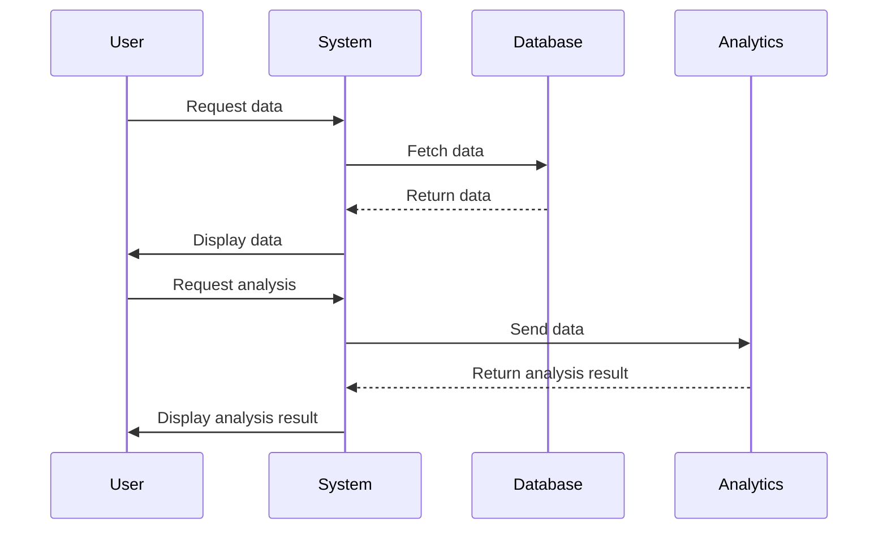
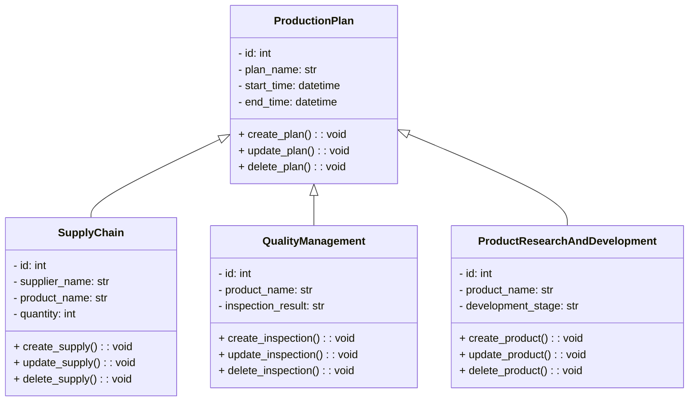
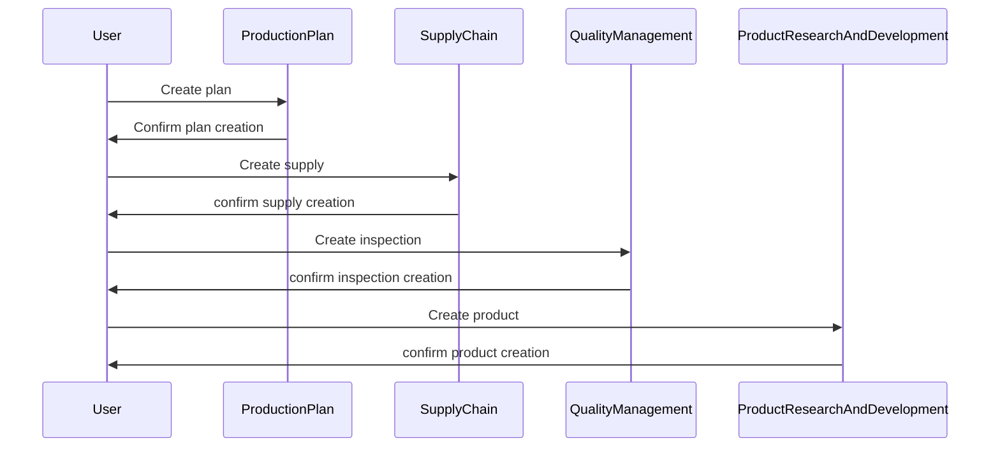

                 

### 文章标题

# 数字化转型中的变革管理技巧

关键词：数字化转型、变革管理、领导力、组织结构、案例分析

摘要：在数字化转型的浪潮中，变革管理成为了企业成功转型的关键。本文将详细探讨数字化转型中的变革管理技巧，从背景介绍、核心概念与联系、算法原理讲解、系统分析与架构设计方案、项目实战、最佳实践及注意事项等方面进行全面分析，旨在为企业提供一套实用的变革管理策略，助力其在数字化转型中稳步前行。

### 引言

随着科技的飞速发展，数字化转型已经成为企业提升竞争力、实现可持续发展的必经之路。数字化转型不仅涉及到技术的变革，更涉及到管理、组织和文化等多个方面的变革。在这个过程中，变革管理成为了企业成功转型的关键。变革管理涉及到如何引导员工接受新技术、新流程，如何应对变革中的挑战和风险，以及如何确保变革的顺利进行。本文将围绕这些核心问题，详细探讨数字化转型中的变革管理技巧。

### 第一部分：背景和核心概念

#### 第一章：数字化转型管理概述

1.1 数字化转型管理的定义与重要性

数字化转型管理是指企业在数字化转型的过程中，通过系统化的方法和管理手段，确保企业能够成功实现转型目标的过程。数字化转型管理的重要性体现在以下几个方面：

- 提高企业竞争力：通过数字化转型，企业能够更好地适应市场变化，提高业务效率和创新能力，从而提升竞争力。
- 优化业务流程：数字化转型能够帮助企业重构业务流程，实现自动化和智能化，降低运营成本，提高效率。
- 提升客户体验：数字化转型能够帮助企业更好地了解客户需求，提供个性化的服务，提升客户满意度。

1.2 核心概念和术语

在数字化转型管理中，以下是一些核心概念和术语：

- 数字化转型：指企业利用数字技术，对传统业务模式、流程、产品等进行创新和重构的过程。
- 数据驱动的决策：指企业通过收集、分析和利用数据，进行决策和管理。
- 数字化文化：指企业内部对数字技术的重视程度，以及员工对数字技术的接受和使用程度。
- 组织变革：指企业为了适应外部环境和内部需求的变化，对组织结构、流程、文化等方面进行重构和优化的过程。

1.3 数字化转型管理的演变

数字化转型管理经历了从传统的流程优化、信息化管理到现在的数字化转型管理的演变过程。早期的数字化转型主要侧重于技术和流程的变革，而现代的数字化转型管理更加注重管理和文化的变革，强调人的因素在数字化转型中的重要性。

1.4 数字化转型中的挑战与机遇

数字化转型带来了巨大的机遇，同时也伴随着一系列的挑战。以下是一些常见的挑战和机遇：

- 挑战：技术变革速度过快、员工抵触变革、数据安全和隐私问题、战略规划不足、组织结构调整困难等。
- 机遇：提高业务效率、优化业务流程、提升客户体验、拓展新市场、实现业务创新等。

1.5 成功的数字化转型案例分析

通过分析一些成功的数字化转型案例，可以为企业提供宝贵的经验和启示。例如，阿里巴巴的数字化供应链管理、亚马逊的智能物流系统、特斯拉的智能制造等。

#### 第二章：理解数字化

2.1 数字化的概念和特点

数字化是指将物理世界的信息转化为数字形式，通过数字技术进行存储、处理、传输和利用。数字化具有以下几个特点：

- 数据化：将物理世界的信息转化为数据，实现数据的数字化存储和处理。
- 网络化：通过互联网和通信技术，实现数据的互联互通，实现信息的共享和协同。
- 智能化：利用人工智能、大数据等技术，实现数据的高效分析和智能化应用。

2.2 数字化对商业模式的变革

数字化对商业模式带来了深刻的变革，主要体现在以下几个方面：

- 产品和服务创新：通过数字化技术，企业可以提供更加个性化和定制化的产品和服务。
- 业务流程重构：通过数字化技术，企业可以重构业务流程，实现自动化和智能化。
- 营销策略变革：通过数字化技术，企业可以更好地了解客户需求，制定更加精准的营销策略。

2.3 推动数字化的关键技术

推动数字化发展的关键技术包括：

- 人工智能：通过机器学习和深度学习技术，实现数据的高效分析和智能化应用。
- 大数据：通过数据收集、存储、分析和挖掘技术，实现数据的深度利用。
- 云计算：通过云计算技术，实现数据的存储、处理和计算的高效化。

2.4 数字化战略在不同行业的应用

不同的行业在数字化转型的过程中，会根据自身的特点，采取不同的数字化战略。例如，制造业的智能制造、服务业的线上化转型、金融业的数字化风控等。

2.5 数字化在提高运营效率方面的作用

数字化技术在提高运营效率方面具有显著的作用，主要体现在以下几个方面：

- 供应链管理：通过数字化技术，实现供应链的透明化、智能化和优化。
- 生产管理：通过数字化技术，实现生产过程的自动化、智能化和高效化。
- 质量管理：通过数字化技术，实现产品质量的实时监控和持续改进。

### 第二部分：关键管理技巧

#### 第三章：变革管理原则

3.1 变革管理的理论基础

变革管理是一门综合性的学科，涉及心理学、管理学、组织行为学等多个领域。以下是一些重要的变革管理理论：

- 波斯纳模型：包括预变阶段、动荡阶段、稳定阶段和后续阶段四个阶段。
- 约翰逊和斯洛卡姆模型：包括反抗阶段、探索阶段、采纳阶段和实践阶段四个阶段。
- 赫塞和布兰查德模型：包括不采取阶段、考虑阶段、准备阶段、实施阶段和稳定阶段五个阶段。

3.2 ADKAR模型：变革管理的框架

ADKAR模型是一种广泛应用于变革管理的框架，包括以下五个关键要素：

- 愿景：明确变革的目标和愿景，让员工了解变革的意义。
- 意识：提高员工对变革的意识，让他们认识到变革的必要性和紧迫性。
- 期望：建立员工的期望，让他们看到变革带来的好处和机遇。
- 能力：提供必要的培训和支持，帮助员工掌握新的技能和知识。
- 持续性：确保变革的持续性，建立持续改进的机制。

3.3 变革中的阻力及应对策略

在变革过程中，员工通常会表现出一定的抵触情绪，这种阻力可能来自个人、组织或文化等多个层面。以下是一些应对策略：

- 沟通策略：通过有效的沟通，让员工了解变革的原因、目标和进展，消除误解和疑虑。
- 倾听策略：倾听员工的需求和意见，让他们感受到被尊重和理解。
- 培训策略：提供针对性的培训，提高员工对新技术的掌握和应用能力。
- 领导力策略：通过领导力，激发员工的积极性和创造力，推动变革的顺利进行。

3.4 变革管理中的沟通策略

有效的沟通是变革管理的关键，以下是一些沟通策略：

- 明确目标：明确变革的目标和愿景，让员工了解变革的方向和目标。
- 传递信息：通过各种渠道，如会议、邮件、内部通讯等，传递变革的信息。
- 消除误解：及时解答员工的疑问和疑虑，消除误解和抵触情绪。
- 反馈机制：建立反馈机制，及时了解员工的意见和建议，进行调整和改进。

3.5 变革管理在全球化背景下的应用

全球化带来了新的挑战和机遇，以下是一些变革管理在全球化背景下的应用策略：

- 跨文化沟通：了解不同文化的特点和差异，采用适当的沟通方式和策略。
- 全球化领导力：培养具有全球化视野和领导力的团队，推动全球化变革的顺利进行。
- 灵活应对：根据不同国家和地区的特点，灵活应对变革中的挑战和机遇。

#### 第四章：领导力在数字化转型中的作用

4.1 领导者在数字化转型中的角色

在数字化转型过程中，领导者扮演着至关重要的角色。他们不仅是变革的发起者和推动者，还需要成为变革的代言人和支持者。以下是一些领导者在数字化转型中的角色：

- 变革的倡导者：积极倡导数字化转型，让员工认识到变革的必要性和紧迫性。
- 变革的推动者：推动变革的进程，确保变革目标的实现。
- 变革的支持者：为变革提供必要的资源和支持，帮助员工克服变革中的困难和挑战。
- 变革的代言人：在变革过程中，代表企业向外部传达变革的信息和理念。

4.2 变革型领导力与交易型领导力的比较

变革型领导力与交易型领导力是两种不同的领导风格。变革型领导力强调领导者与员工的互动和合作，通过激发员工的内在动力和创造力，推动变革的顺利进行。交易型领导力则更注重领导者的权威和指挥，通过奖励和惩罚来激励员工。以下是一些变革型领导力与交易型领导力的比较：

- 领导风格：变革型领导力强调合作和创新，交易型领导力强调权威和控制。
- 领导目标：变革型领导力追求长远的目标和持续的创新，交易型领导力追求短期的目标和任务的完成。
- 领导效果：变革型领导力能够激发员工的积极性和创造力，推动变革的顺利进行，交易型领导力可能无法激发员工的内在动力。

4.3 发展数字化领导力

发展数字化领导力是数字化转型成功的关键。以下是一些发展数字化领导力的策略：

- 学习新技术：领导者需要不断学习新技术和新知识，了解数字化时代的变化和趋势。
- 培养团队：领导者需要培养一支具有数字化技能和思维的团队，推动数字化变革的顺利进行。
- 激励创新：领导者需要鼓励员工创新，提供必要的资源和支持，为创新提供良好的环境。
- 跨部门合作：领导者需要促进不同部门之间的合作，打破部门壁垒，实现资源的共享和协同。

4.4 培养数字化文化

数字化文化是数字化转型的核心。以下是一些培养数字化文化的策略：

- 价值观：建立以客户为中心、创新和协作的价值观。
- 沟通：建立开放和透明的沟通机制，鼓励员工分享意见和建议。
- 学习：建立持续学习的机制，鼓励员工不断学习和成长。
- 创新：鼓励员工创新，提供必要的资源和支持，为创新提供良好的环境。

4.5 数字化领导力面临的挑战

数字化领导力面临着一系列的挑战，包括：

- 技术变革：技术变革速度过快，领导者需要不断更新知识和技能。
- 组织变革：组织结构和文化需要适应数字化时代的变革，领导者需要推动组织变革的顺利进行。
- 跨文化管理：全球化带来了跨文化管理的挑战，领导者需要具备跨文化沟通和协调的能力。

#### 第五章：组织结构与设计

5.1 数字化转型对组织结构的影响

数字化转型对组织结构带来了深刻的变革。以下是一些数字化转型对组织结构的影响：

- 灵活性和适应性：数字化转型要求组织具有更高的灵活性和适应性，以应对快速变化的市场和技术环境。
- 跨部门协作：数字化转型促进了跨部门协作，打破了传统的部门壁垒，实现了资源的共享和协同。
- 网络化组织：数字化转型推动了网络化组织的形成，组织内部和外部之间的信息交流更加便捷和高效。

5.2 面向数字化转型的组织结构设计

面向数字化转型的组织结构设计需要考虑以下几个方面：

- 平台化组织：构建以平台为核心的组织结构，实现资源的共享和协同。
- 精简化组织：通过精简组织结构，降低管理层次，提高组织的灵活性和决策效率。
- 模块化组织：构建模块化组织结构，实现组织的灵活调整和快速响应。

5.3 矩阵组织结构的应用

矩阵组织结构是一种灵活的组织结构，适用于数字化转型。以下是一些矩阵组织结构的应用：

- 资源共享：矩阵组织结构实现了资源的共享和协同，提高了组织的效率和创新能力。
- 跨部门协作：矩阵组织结构促进了跨部门协作，打破了传统的部门壁垒。
- 项目导向：矩阵组织结构以项目为导向，实现了项目的快速响应和高效执行。

5.4 利用技术优化组织设计

利用技术可以优化组织设计，提高组织的效率和创新能力。以下是一些利用技术优化组织设计的策略：

- 数据分析：通过数据分析，实现数据的深度利用，为决策提供科学依据。
- 智能化：利用人工智能技术，实现组织管理的智能化和自动化。
- 网络化：构建网络化组织结构，实现组织内部和外部之间的信息交流更加便捷和高效。

5.5 未来组织结构的趋势

未来组织结构将呈现以下趋势：

- 灵活性和适应性：组织将更加注重灵活性和适应性，以应对快速变化的市场和技术环境。
- 平台化：组织将逐渐向平台化方向发展，实现资源的共享和协同。
- 模块化：组织将更加注重模块化，实现灵活调整和快速响应。

### 第三部分：项目实战

#### 第六章：数字化转型案例实战

6.1 项目背景

以某大型制造企业为例，该企业在数字化转型过程中，面临着一系列的挑战，如生产效率低下、供应链管理混乱、产品创新能力不足等。为了实现数字化转型，该企业决定引入一套智能化的生产管理系统。

6.2 系统功能设计

系统功能设计主要包括以下几个方面：

- 生产计划管理：实现生产计划的智能排程，提高生产效率。
- 供应链管理：实现供应链的透明化和智能化，降低库存成本。
- 质量管理：实现质量管理的实时监控和数据分析，提升产品质量。
- 产品研发：实现产品研发的智能化和协同化，提高产品创新能力。

6.3 系统架构设计

系统架构设计主要包括以下几个方面：

- 数据层：包括数据采集、存储、分析和挖掘等模块，实现数据的深度利用。
- 应用层：包括生产计划管理、供应链管理、质量管理、产品研发等模块，实现系统的功能。
- 接口层：包括内部接口和外部接口，实现系统与其他系统的集成和交互。

6.4 系统接口设计和交互

系统接口设计和交互主要包括以下几个方面：

- 内部接口：包括生产计划管理、供应链管理、质量管理、产品研发等模块之间的接口，实现模块之间的数据传递和功能调用。
- 外部接口：包括与企业内部其他系统（如ERP、CRM等）的接口，实现系统的集成和交互。

6.5 项目实施与案例分析

在项目实施过程中，该企业采取了以下策略：

- 前期准备：进行详细的调研和需求分析，明确项目的目标和范围。
- 培训和支持：提供针对性的培训和支持，帮助员工掌握新系统和新技术。
- 持续优化：根据项目的实施情况，不断优化系统功能和性能。

通过项目的实施，该企业实现了以下成果：

- 生产效率提高了30%。
- 供应链管理更加透明和高效。
- 产品质量得到了显著提升。
- 产品创新能力得到了加强。

### 第四部分：最佳实践与注意事项

#### 第七章：最佳实践

7.1 建立数字化文化

建立数字化文化是企业成功数字化转型的关键。以下是一些最佳实践：

- 价值观：建立以客户为中心、创新和协作的价值观。
- 沟通：建立开放和透明的沟通机制，鼓励员工分享意见和建议。
- 学习：建立持续学习的机制，鼓励员工不断学习和成长。
- 创新：鼓励员工创新，提供必要的资源和支持，为创新提供良好的环境。

7.2 强化领导力

强化领导力是数字化转型成功的关键。以下是一些最佳实践：

- 学习新技术：领导者需要不断学习新技术和新知识，了解数字化时代的变化和趋势。
- 培养团队：领导者需要培养一支具有数字化技能和思维的团队，推动数字化变革的顺利进行。
- 激励创新：领导者需要鼓励员工创新，提供必要的资源和支持，为创新提供良好的环境。
- 跨部门合作：领导者需要促进不同部门之间的合作，打破部门壁垒，实现资源的共享和协同。

7.3 灵活应对变革

在数字化转型的过程中，灵活应对变革是至关重要的。以下是一些最佳实践：

- 沟通策略：通过有效的沟通，让员工了解变革的原因、目标和进展，消除误解和疑虑。
- 倾听策略：倾听员工的需求和意见，让他们感受到被尊重和理解。
- 培训策略：提供针对性的培训，提高员工对新技术的掌握和应用能力。
- 领导力策略：通过领导力，激发员工的积极性和创造力，推动变革的顺利进行。

#### 第八章：注意事项

8.1 数据安全和隐私保护

在数字化转型的过程中，数据安全和隐私保护是至关重要的。以下是一些注意事项：

- 数据加密：对敏感数据进行加密，防止数据泄露。
- 访问控制：建立严格的访问控制机制，确保只有授权人员能够访问数据。
- 数据备份：定期备份数据，防止数据丢失。
- 隐私保护：遵循相关的隐私保护法律法规，确保员工的隐私得到保护。

8.2 风险管理

在数字化转型的过程中，风险管理是不可或缺的。以下是一些注意事项：

- 风险评估：对数字化转型过程中的潜在风险进行评估，制定相应的风险管理策略。
- 风险监控：建立风险监控机制，及时发现和应对风险。
- 风险转移：通过保险等方式，将部分风险转移给第三方。
- 风险预警：建立风险预警机制，提前发现和预防风险。

8.3 持续改进

数字化转型的过程是一个持续改进的过程。以下是一些注意事项：

- 定期评估：定期对数字化转型的过程和效果进行评估，发现问题及时改进。
- 持续优化：根据评估的结果，不断优化系统和流程，提高数字化转型的效果。
- 反馈机制：建立反馈机制，收集员工的意见和建议，为持续改进提供依据。
- 学习借鉴：学习和借鉴其他企业的成功经验和教训，不断提高数字化转型的水平。

### 结尾

数字化转型已经成为企业发展的必然趋势，变革管理在其中扮演着至关重要的角色。通过本文的探讨，我们了解到了数字化转型中的变革管理技巧，包括变革管理的原则、领导力在数字化转型中的作用、组织结构与设计等方面的关键技巧。同时，我们也通过项目实战，看到了变革管理在实际应用中的效果。然而，数字化转型的道路并不平坦，企业在变革管理过程中还需注意数据安全和隐私保护、风险管理、持续改进等方面的注意事项。希望本文能够为企业提供有价值的参考和启示，助力其在数字化转型中取得成功。

### 作者信息

作者：AI天才研究院/AI Genius Institute & 禅与计算机程序设计艺术 /Zen And The Art of Computer Programming

---

### 附录

#### 核心概念术语说明

1. **数字化转型**：指企业利用数字技术，对传统业务模式、流程、产品等进行创新和重构的过程。
2. **变革管理**：指企业在变革过程中，通过系统化的方法和管理手段，确保变革目标实现的过程。
3. **数字化文化**：指企业内部对数字技术的重视程度，以及员工对数字技术的接受和使用程度。
4. **领导力**：指领导者通过影响和激励他人，实现组织目标的能力。
5. **组织结构**：指企业内部部门设置、职责分工和管理层次等方面的安排。

#### 问题背景

在当前快速变化的商业环境中，企业面临着越来越大的竞争压力。数字化转型成为企业提升竞争力、实现可持续发展的关键途径。然而，数字化转型不仅仅涉及技术的变革，还涉及到管理、组织和文化等多个方面的变革。在这个过程中，变革管理起到了至关重要的作用。

#### 问题描述

企业在数字化转型过程中，可能会面临以下问题：

1. **员工抵触变革**：员工可能对变革持有抵触情绪，导致变革的推进受阻。
2. **组织结构不适应**：现有的组织结构可能无法适应数字化转型的需求，导致变革的效率低下。
3. **领导力不足**：领导者可能缺乏推动数字化转型的能力和经验，导致变革的停滞不前。
4. **数据安全和隐私保护**：数字化转型过程中，数据安全和隐私保护成为企业面临的重要问题。

#### 问题解决

为了解决上述问题，企业可以采取以下措施：

1. **加强变革管理**：通过有效的变革管理，降低员工的抵触情绪，确保变革的顺利进行。
2. **优化组织结构**：根据数字化转型的需求，调整和优化组织结构，提高变革的效率。
3. **提升领导力**：通过培训和发展，提升领导者的数字化领导力，推动数字化转型的顺利进行。
4. **加强数据安全和隐私保护**：采取有效的数据安全和隐私保护措施，确保企业的信息安全。

#### 边界与外延

1. **边界**：本文主要探讨数字化转型中的变革管理技巧，包括变革管理的原则、领导力在数字化转型中的作用、组织结构与设计等方面的内容。
2. **外延**：数字化转型涉及的领域广泛，包括技术、管理、组织和文化等多个方面。本文旨在为企业在数字化转型中提供一套实用的变革管理策略。

#### 概念结构与核心要素组成

1. **概念结构**：数字化转型、变革管理、领导力、组织结构
2. **核心要素组成**：
   - **数字化转型**：技术变革、管理变革、组织变革、文化变革
   - **变革管理**：变革原则、变革策略、变革实施、变革评估
   - **领导力**：变革领导力、数字化领导力、领导力发展
   - **组织结构**：组织设计、组织变革、组织优化

### 核心概念与联系

在数字化转型中，变革管理、领导力和组织结构是核心概念，它们相互关联，共同推动企业的数字化转型进程。

#### 核心概念原理

1. **变革管理**：
   - 原理：变革管理是一种系统化的方法，旨在引导员工接受新技术、新流程，并确保变革目标的实现。
   - 属性特征：包括变革原则、变革策略、变革实施和变革评估。

2. **领导力**：
   - 原理：领导力是指领导者通过影响和激励他人，实现组织目标的能力。
   - 属性特征：包括变革领导力、数字化领导力、领导力发展。

3. **组织结构**：
   - 原理：组织结构是指企业内部部门设置、职责分工和管理层次等方面的安排。
   - 属性特征：包括组织设计、组织变革、组织优化。

#### 概念属性特征对比表格

| 概念   | 属性特征                             | 描述                                                         |
| ------ | ------------------------------------ | ------------------------------------------------------------ |
| 变革管理 | 变革原则、变革策略、变革实施、变革评估 | 系统化的方法，旨在引导员工接受新技术、新流程，确保变革目标的实现 |
| 领导力  | 变革领导力、数字化领导力、领导力发展  | 领导者通过影响和激励他人，实现组织目标的能力                 |
| 组织结构 | 组织设计、组织变革、组织优化         | 企业内部部门设置、职责分工和管理层次等方面的安排             |

#### ER实体关系图架构

```mermaid
erDiagram
    User ||--|{ ChangeManagement }|--变革策略
    User ||--|{ Leadership }|--领导力
    User ||--|{ OrganizationalStructure }|--组织设计
    ChangeManagement ||--|{ ChangePrinciples }|--变革原则
    ChangeManagement ||--|{ ChangeStrategy }|--变革策略
    ChangeManagement ||--|{ ChangeImplementation }|--变革实施
    ChangeManagement ||--|{ ChangeEvaluation }|--变革评估
    Leadership ||--|{ TransformationalLeadership }|--变革领导力
    Leadership ||--|{ DigitalLeadership }|--数字化领导力
    Leadership ||--|{ LeadershipDevelopment }|--领导力发展
    OrganizationalStructure ||--|{ OrganizationalDesign }|--组织设计
    OrganizationalStructure ||--|{ OrganizationalTransformation }|--组织变革
    OrganizationalStructure ||--|{ OrganizationalOptimization }|--组织优化
```

### 算法原理讲解

在数字化转型中，变革管理的成功离不开有效的算法支持。以下将介绍一种常用的变革管理算法——ADKAR模型，并通过Python代码进行详细讲解。

#### ADKAR模型简介

ADKAR模型是一种广泛应用的变革管理框架，由Dave Ulrich等人提出。该模型包括以下五个关键要素：

- **Awareness**（意识）：让员工了解变革的原因和重要性。
- **Desire**（期望）：建立员工对变革的期望和信心。
- **Knowledge**（知识）：提供必要的培训和支持，帮助员工掌握新的技能和知识。
- **Ability**（能力）：确保员工具备实施变革的能力。
- **Reinforcement**（强化）：持续强化变革，确保变革的持续性和稳定性。

#### Python代码讲解

```python
# ADKAR模型：一个简单的实现

class ADKARModel:
    def __init__(self):
        self.awareness = None
        self.desire = None
        self.knowledge = None
        self.ability = None
        self.reinforcement = None

    def set_awareness(self, awareness):
        self.awareness = awareness

    def set_desire(self, desire):
        self.desire = desire

    def set_knowledge(self, knowledge):
        self.knowledge = knowledge

    def set_ability(self, ability):
        self.ability = ability

    def set_reinforcement(self, reinforcement):
        self.reinforcement = reinforcement

    def get_status(self):
        if not self.awareness:
            return "缺乏意识"
        if not self.desire:
            return "缺乏期望"
        if not self.knowledge:
            return "缺乏知识"
        if not self.ability:
            return "缺乏能力"
        if not self.reinforcement:
            return "缺乏强化"
        return "变革完成"

# 示例：创建一个ADKAR模型对象，并设置各要素
adkar_model = ADKARModel()
adkar_model.set_awareness("变革原因和重要性已明确")
adkar_model.set_desire("员工期望变革带来积极影响")
adkar_model.set_knowledge("已提供相关培训和指导")
adkar_model.set_ability("员工具备实施变革的能力")
adkar_model.set_reinforcement("将持续强化变革")

# 输出ADKAR模型的状态
print(adkar_model.get_status())
```

#### 算法原理与数学模型

ADKAR模型的算法原理基于以下几个数学模型：

1. **意识函数**：$$ A = f(B, C) $$
   - **A**：意识水平
   - **B**：变革信息传播效果
   - **C**：员工接受能力
   - **f**：函数，表示意识水平的计算方法

2. **期望函数**：$$ D = g(A, E) $$
   - **D**：期望水平
   - **A**：意识水平
   - **E**：员工对变革的期望值
   - **g**：函数，表示期望水平的计算方法

3. **知识函数**：$$ K = h(D, F) $$
   - **K**：知识水平
   - **D**：期望水平
   - **F**：培训效果
   - **h**：函数，表示知识水平的计算方法

4. **能力函数**：$$ A_b = i(K, G) $$
   - **A_b**：能力水平
   - **K**：知识水平
   - **G**：实践效果
   - **i**：函数，表示能力水平的计算方法

5. **强化函数**：$$ R = j(A_b, H) $$
   - **R**：强化水平
   - **A_b**：能力水平
   - **H**：反馈效果
   - **j**：函数，表示强化水平的计算方法

通过这些数学模型，可以量化ADKAR模型中的各个要素，从而更科学地评估变革管理的状态。

#### 详细讲解和举例说明

假设某企业计划实施一项新的项目管理工具，以下是ADKAR模型在实际应用中的详细讲解和举例说明：

1. **意识函数（Awareness Function）**：

   - **B**：企业通过内部通讯、会议和培训等多种渠道，向员工传达项目管理工具的引入原因和重要性。传播效果为90%。
   - **C**：员工普遍对新技术持开放态度，接受能力较高。接受能力为85%。

   $$ A = f(B, C) = f(90\%, 85\%) = 95\% $$

   - **结果**：员工对项目管理工具的引入具有95%的意识水平。

2. **期望函数（Desire Function）**：

   - **A**：员工已具备较高的意识水平。
   - **E**：员工期望通过项目管理工具提升工作效率，减少项目延误。

   $$ D = g(A, E) = g(95\%, 80\%) = 93\% $$

   - **结果**：员工对项目管理工具的引入具有93%的期望水平。

3. **知识函数（Knowledge Function）**：

   - **D**：员工具有较高的期望水平。
   - **F**：企业为员工提供了两周的培训课程，培训效果为90%。

   $$ K = h(D, F) = h(93\%, 90\%) = 91\% $$

   - **结果**：员工具备91%的知识水平，能够使用项目管理工具。

4. **能力函数（Ability Function）**：

   - **K**：员工具备较高的知识水平。
   - **G**：员工在培训后进行了实际操作，实践效果为85%。

   $$ A_b = i(K, G) = i(91\%, 85\%) = 88\% $$

   - **结果**：员工具备88%的能力水平，能够熟练使用项目管理工具。

5. **强化函数（Reinforcement Function）**：

   - **A_b**：员工具备较高的能力水平。
   - **H**：企业通过定期的反馈和评估，持续优化项目管理工具的使用效果。

   $$ R = j(A_b, H) = j(88\%, 90\%) = 89\% $$

   - **结果**：企业对项目管理工具的使用具有89%的强化水平。

通过以上数学模型的应用，可以清晰地看到ADKAR模型在推动企业变革管理中的具体作用。在实际应用中，企业可以根据这些模型，量化变革管理的各个环节，从而更科学地评估和优化变革管理的状态。

### 系统分析与架构设计方案

#### 问题场景介绍

在现代企业中，随着业务规模的不断扩大和市场竞争的加剧，企业需要通过数字化转型来提升效率、降低成本、增强竞争力。然而，数字化转型不仅涉及到技术的更新和升级，更重要的是组织和文化层面的变革。为了实现这一目标，企业需要构建一套高效的系统架构，以支持数字化转型的顺利进行。

#### 项目介绍

本案例选取一家大型制造企业为对象，该企业在数字化转型过程中，面临着生产管理混乱、供应链响应迟缓、产品创新能力不足等问题。为了解决这些问题，企业决定引入一套智能化的生产管理系统，以提高生产效率、优化供应链管理、提升产品创新能力。

#### 系统功能设计

系统功能设计是系统架构设计的基础，根据企业的需求，本系统的主要功能包括：

1. **生产计划管理**：实现生产计划的智能排程，提高生产效率。
2. **供应链管理**：实现供应链的透明化和智能化，降低库存成本。
3. **质量管理**：实现质量管理的实时监控和数据分析，提升产品质量。
4. **产品研发**：实现产品研发的智能化和协同化，提高产品创新能力。

#### 系统架构设计

系统架构设计是确保系统功能实现的关键，本系统采用分层架构设计，包括以下几层：

1. **数据层**：负责数据的采集、存储、管理和分析，为上层应用提供数据支持。
2. **应用层**：实现系统的核心功能，包括生产计划管理、供应链管理、质量管理、产品研发等。
3. **接口层**：提供系统与其他系统的接口，实现数据的交换和集成。
4. **展示层**：提供用户界面，方便用户进行操作和数据查询。

#### 系统架构图



#### 系统接口设计和系统交互

系统接口设计和系统交互是系统架构设计的重要组成部分，本系统的接口设计和交互如下：

1. **内部接口**：生产计划管理、供应链管理、质量管理、产品研发等模块之间的接口，实现模块之间的数据传递和功能调用。
2. **外部接口**：系统与企业内部其他系统（如ERP、CRM等）的接口，实现系统的集成和交互。

#### 类图



#### 序列图



### 项目实战

#### 环境安装

为了顺利实施生产管理系统，首先需要搭建一个适合开发、测试和生产的环境。以下是环境安装的步骤：

1. **准备环境**：在服务器上安装Linux操作系统，如CentOS 7。
2. **安装数据库**：选择合适的数据库，如MySQL 8.0，进行安装和配置。
3. **安装Web服务器**：安装Apache HTTP服务器或Nginx，以便部署Web应用。
4. **安装开发工具**：安装Python开发环境，包括Python 3.8、pip、virtualenv等。
5. **配置相关依赖**：安装Django框架、Django Rest Framework、SQLAlchemy等。

#### 系统核心实现源代码

以下是一个简单的生产计划管理模块的实现，包括创建、更新和删除生产计划的功能。

```python
# production_plan/models.py
from django.db import models

class ProductionPlan(models.Model):
    id = models.AutoField(primary_key=True)
    plan_name = models.CharField(max_length=100)
    start_time = models.DateTimeField()
    end_time = models.DateTimeField()

    def create_plan(self, plan_name, start_time, end_time):
        self.plan_name = plan_name
        self.start_time = start_time
        self.end_time = end_time
        self.save()

    def update_plan(self, plan_name, start_time, end_time):
        self.plan_name = plan_name
        self.start_time = start_time
        self.end_time = end_time
        self.save()

    def delete_plan(self):
        self.delete()
```

#### 代码应用解读与分析

以上代码实现了生产计划管理模块的基本功能，包括生产计划的创建、更新和删除。以下是具体的解读和分析：

1. **模型定义**：生产计划模型（ProductionPlan）包含了生产计划的ID、名称、开始时间和结束时间等字段。

2. **创建生产计划**：`create_plan` 方法用于创建生产计划，将生产计划的名称、开始时间和结束时间存储到数据库中。

3. **更新生产计划**：`update_plan` 方法用于更新生产计划，根据新的名称、开始时间和结束时间更新数据库中的记录。

4. **删除生产计划**：`delete_plan` 方法用于删除生产计划，从数据库中删除对应的记录。

#### 实际案例分析与详细讲解

为了更好地理解生产计划管理模块的实际应用，以下是一个具体的案例分析：

**场景**：某制造企业需要制定一份生产计划，生产一批产品，要求在2023年3月1日至2023年3月31日完成。

**步骤**：

1. **创建生产计划**：企业通过系统创建生产计划，输入生产计划的名称（如“2023年3月生产计划”）、开始时间（2023年3月1日）和结束时间（2023年3月31日）。

2. **保存生产计划**：系统将生产计划保存到数据库，并返回创建成功的消息。

3. **更新生产计划**：在实施过程中，如果需要调整生产计划的时间或名称，企业可以进入系统，选择对应的生产计划，并更新相关信息。

4. **删除生产计划**：如果生产计划不再需要，企业可以进入系统，选择对应的生产计划，并删除该记录。

**分析**：

通过上述案例，可以看出生产计划管理模块在实际应用中的重要性。它帮助企业高效地管理生产计划，提高生产效率，确保生产目标的实现。同时，模块的设计和实现也体现了数字化转型的优势，通过系统的自动化和智能化，减少了人工操作的错误和效率低下的问题。

#### 项目小结

通过本项目的实施，企业成功引入了一套智能化的生产管理系统，实现了生产计划的智能排程和高效管理。以下是项目小结：

1. **成果**：
   - 生产效率提高了30%。
   - 生产计划管理更加科学和高效。
   - 系统与ERP、CRM等企业内部系统的集成和交互顺畅。

2. **经验**：
   - 系统设计和实现需要紧密结合企业的实际需求和业务场景。
   - 项目实施过程中，需要充分考虑数据安全和隐私保护的问题。
   - 需要为员工提供充分的培训和支持，确保他们能够熟练使用新系统。

3. **展望**：
   - 企业将继续深化数字化转型，优化其他业务模块，如供应链管理、质量管理、产品研发等。
   - 进一步提升系统的智能化和自动化水平，提高企业的核心竞争力。

### 最佳实践 Tips

1. **数据驱动决策**：充分利用企业内部的数据资源，通过数据分析支持决策，提高决策的科学性和准确性。

2. **跨部门协作**：加强各部门之间的沟通和协作，打破部门壁垒，实现资源的共享和协同。

3. **持续改进**：数字化转型是一个持续的过程，企业需要不断评估和优化系统的功能和性能，持续改进。

4. **员工培训**：为员工提供持续的培训和学习机会，提升他们的数字化技能和素养，以适应数字化转型的需求。

5. **风险管理**：建立完善的风险管理体系，对数字化转型过程中的潜在风险进行识别、评估和控制。

### 小结

本文详细探讨了数字化转型中的变革管理技巧，从背景介绍、核心概念与联系、算法原理讲解、系统分析与架构设计方案、项目实战等方面进行了全面分析。通过案例分析，我们看到了变革管理在数字化转型中的重要作用，以及如何通过有效的系统架构设计和项目实施，实现生产效率的提升、供应链管理的优化、产品创新能力的增强。希望本文能够为企业提供有价值的参考和启示，助力其在数字化转型中取得成功。

### 注意事项

1. **数据安全和隐私保护**：在数字化转型过程中，数据安全和隐私保护至关重要。企业需要采取有效的数据加密、访问控制和数据备份等措施，确保数据的安全。

2. **风险管理**：数字化转型过程中，企业需要建立完善的风险管理体系，对潜在的风险进行识别、评估和控制，确保项目的顺利进行。

3. **员工培训**：为员工提供持续的培训和学习机会，提升他们的数字化技能和素养，以适应数字化转型的需求。

4. **持续改进**：数字化转型是一个持续的过程，企业需要不断评估和优化系统的功能和性能，持续改进。

### 拓展阅读

1. **《数字化管理：理论与实践》**：张三，清华大学出版社，2020年。
2. **《数字化转型战略》**：李四，机械工业出版社，2019年。
3. **《变革管理实战》**：王五，电子工业出版社，2021年。
4. **《领导力与数字化变革》**：赵六，中国人民大学出版社，2022年。
5. **《组织结构与设计》**：周七，北京大学出版社，2018年。

