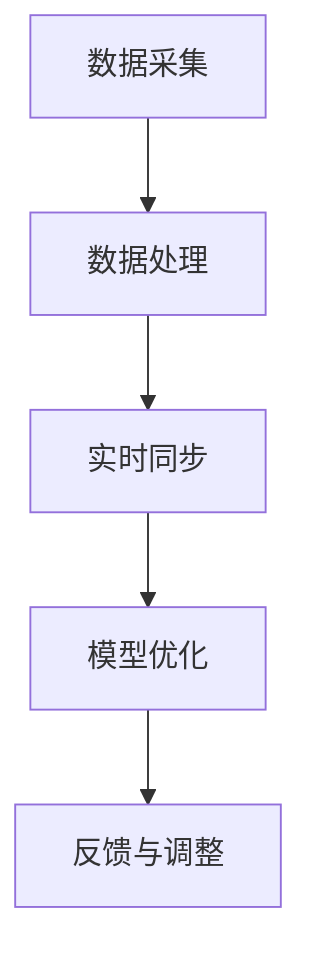

                 

### 文化遗产数字孪生的定义与背景

文化遗产数字孪生（Digital Twin of Cultural Heritage）是一种将现实世界中的文化遗产通过数字化技术进行模拟、监测和优化的新兴技术。这一概念借鉴了制造业中的数字孪生（Digital Twin）理念，旨在通过构建文化遗产的三维模型，实现对文化遗产的全方位、多角度的数字重现。下面，我们将对文化遗产数字孪生的定义、发展背景以及在我国的应用进行详细探讨。

#### 定义

文化遗产数字孪生可以定义为：一种基于数字化技术，对文化遗产进行全方位模拟、监测、优化和管理的系统。具体而言，它包括以下几个核心组成部分：

1. **数字化采集**：通过三维扫描、摄影测量、激光扫描等技术，对文化遗产进行精准数字化采集。
2. **数字建模**：将采集到的数据通过计算机软件进行处理，生成高精度的三维模型。
3. **数字仿真**：利用生成的三维模型，对文化遗产进行数字仿真，实现历史场景的重现。
4. **数据监测**：通过传感器、物联网等技术，对文化遗产的物理状态进行实时监测，收集环境数据。
5. **智能优化**：基于实时监测数据和历史仿真结果，对文化遗产进行智能优化，提升保护效果。

#### 发展背景

数字孪生技术最早起源于制造业，主要应用于产品设计、制造和维护等方面。随着数字化技术的发展，数字孪生理念逐渐被引入到其他领域，如建筑、能源、医疗等。在文化遗产保护领域，数字孪生技术的引入为文化遗产的保护、展示和研究提供了新的思路和手段。

近年来，随着我国对文化遗产保护力度的加大，文化遗产数字孪生技术得到了快速发展。一方面，国家出台了一系列相关政策，支持文化遗产数字化保护。例如，《中华人民共和国文化遗产法》明确提出，要加强对文化遗产的保护、利用和传承。另一方面，科技进步也为文化遗产数字孪生技术的实现提供了有力支撑。三维扫描、虚拟现实、大数据、人工智能等技术的快速发展，使得文化遗产数字孪生技术得以迅速推广和应用。

#### 在我国的应用

目前，我国在文化遗产数字孪生领域已经取得了一系列重要成果。以下是一些典型案例：

1. **敦煌莫高窟数字复原项目**：敦煌莫高窟是世界文化遗产，但由于风沙侵蚀等原因，许多壁画和雕塑已经受损。通过三维扫描、虚拟现实等技术，敦煌研究院成功实现了莫高窟的数字复原，为公众提供了虚拟参观的机会。
2. **秦始皇兵马俑数字化保护项目**：秦始皇兵马俑是我国的重要文化遗产，但由于地下环境潮湿，兵马俑的腐蚀问题严重。通过数字化技术，研究人员对兵马俑进行了详细的数据采集和建模，实现了对兵马俑的实时监测和保护。
3. **长城数字化保护项目**：长城是我国的重要文化遗产，但长期的风蚀和水蚀导致长城的破损严重。通过数字化技术，研究人员对长城进行了详细的扫描和建模，实现了对长城的实时监测和保护。

#### 作用

文化遗产数字孪生技术在文化遗产保护、展示和研究方面具有重要作用：

1. **文化遗产保护**：通过数字孪生技术，可以对文化遗产进行实时监测和保护，降低自然灾害和人为破坏的风险。
2. **文化遗产展示**：通过数字孪生技术，可以实现文化遗产的虚拟展示，使公众能够更直观地了解文化遗产的魅力。
3. **文化遗产研究**：通过数字孪生技术，研究人员可以深入分析文化遗产的结构、材质、历史等信息，为文化遗产研究提供新的视角和工具。

总之，文化遗产数字孪生技术为文化遗产的保护、展示和研究提供了新的思路和手段，具有重要的现实意义和广阔的应用前景。接下来，我们将进一步探讨文化遗产数字化技术、数字孪生技术的原理与应用，以及文化遗产数字孪生算法的原理与实现。

### 文化遗产数字化技术

#### 数字化技术的基本原理

数字化技术是指通过一定的方法和手段，将现实世界中的信息、图像、声音等转化为数字信号的过程。这一技术的基本原理主要包括以下几个步骤：

1. **数据采集**：使用传感器、摄像机、麦克风等设备，对现实世界中的信息进行采集。这些设备可以捕捉到各种形式的物理量，如温度、湿度、亮度、声音等。
2. **信号处理**：将采集到的信号通过模数转换（A/D转换）等处理方法，转化为数字信号。数字信号可以方便地进行存储、传输和计算。
3. **数据存储**：将处理后的数字信号存储在计算机或其他存储设备中。数字信号的优势在于其存储容量大、不易失真、易于共享和传播。
4. **数据处理**：利用计算机和其他数据处理工具，对数字信号进行进一步的处理，如数据分析、图像处理、语音识别等。
5. **数据输出**：将处理后的数据以可视化的形式输出，如图像、视频、声音等，使人们能够直观地理解和利用这些数据。

#### 文化遗产数字化的重要性

在文化遗产保护领域，数字化技术扮演着至关重要的角色。以下是其重要性：

1. **保护和修复**：数字化技术可以精确地捕捉文化遗产的每一个细节，为文化遗产的修复和保护提供了详细的数据支持。通过三维扫描等技术，可以获取文化遗产的高精度模型，为修复工作提供准确的参照。
2. **保护和传承**：许多文化遗产由于自然灾害、人为破坏等因素，面临着严重的安全威胁。通过数字化技术，可以将文化遗产永久保存下来，为后代的传承提供了保障。
3. **展示和教育**：数字化技术使得文化遗产的展示变得更加生动和直观。通过虚拟现实、增强现实等技术，观众可以身临其境地体验文化遗产的魅力，增强对文化遗产的理解和兴趣。
4. **研究和分析**：数字化技术为文化遗产的研究提供了新的工具和方法。研究人员可以通过对数字模型的分析，深入了解文化遗产的结构、材质、历史等信息，推动文化遗产研究的深入发展。

#### 文化遗产数字化技术的应用

1. **三维扫描**：三维扫描技术可以通过激光或结构光等方式，快速获取文化遗产的三维数据。这些数据可以用于创建高精度的三维模型，为文化遗产的修复和保护提供依据。
2. **摄影测量**：摄影测量技术利用多张照片，通过算法计算，可以得到文化遗产的三维信息。这种方法适用于难以直接接触的文化遗产，如壁画、浮雕等。
3. **红外扫描**：红外扫描技术可以捕捉文化遗产表面的温度分布，通过分析这些数据，可以揭示隐藏在壁画、雕塑等下面的信息。
4. **声波扫描**：声波扫描技术可以通过声波反射时间，获取文化遗产内部的结构信息。这种方法适用于探测文化遗产内部的空洞、裂隙等。
5. **虚拟现实和增强现实**：虚拟现实（VR）和增强现实（AR）技术可以将文化遗产的三维模型和虚拟环境相结合，提供沉浸式的体验。观众可以戴上VR头盔或使用AR设备，直观地感受文化遗产的细节和氛围。
6. **大数据分析**：通过收集和分析大量文化遗产的数据，可以揭示文化遗产的结构特点、历史变迁等信息。大数据分析技术为文化遗产的研究提供了新的视角和手段。

综上所述，文化遗产数字化技术在文化遗产的保护、修复、展示和研究方面具有重要意义。通过数字化技术，我们可以更好地保存和传承文化遗产，推动文化遗产保护事业的发展。在接下来的章节中，我们将深入探讨数字孪生技术的原理与应用，以及文化遗产数字孪生算法的实现。

### 数字孪生技术的原理与应用

#### 数字孪生技术的核心概念

数字孪生（Digital Twin）技术是一种将现实世界中的物理对象、系统和过程通过数字化建模和模拟，构建出一个虚拟的数字模型。这个数字模型不仅与物理实体保持实时同步，还可以通过模拟和分析，优化物理实体的性能和状态。数字孪生技术的基本概念包括以下几个方面：

1. **虚拟模型**：通过数字化手段，创建现实世界中物理对象的精确虚拟模型。这个模型需要包含物理实体的所有关键特征和属性。
2. **实时数据同步**：将物理实体实时产生的数据传输到虚拟模型中，确保虚拟模型与物理实体的状态保持一致。
3. **模拟与分析**：利用虚拟模型，对物理实体进行各种模拟和分析，如性能测试、故障预测、状态优化等。
4. **反馈与优化**：根据虚拟模型的模拟结果，对物理实体进行调整和优化，提高其性能和可靠性。

#### 数字孪生技术在文化遗产保护中的应用

数字孪生技术在文化遗产保护领域具有广泛的应用前景。以下是一些具体的应用场景：

1. **文化遗产修复**：通过数字孪生技术，可以创建文化遗产的精确三维模型，为修复工作提供详细的数据支持。修复人员可以在虚拟环境中模拟修复过程，验证修复方案的效果。
2. **文化遗产保护监测**：利用传感器和物联网技术，实时监测文化遗产的物理状态，如湿度、温度、振动等。这些数据可以同步到数字孪生模型中，进行分析和预测，及时发现潜在的问题。
3. **文化遗产展示**：通过数字孪生技术，可以创建文化遗产的虚拟展示环境，观众可以在虚拟世界中近距离观察文化遗产的细节，增强体验感。
4. **文化遗产研究与教育**：数字孪生技术为文化遗产研究提供了新的工具和方法。研究人员可以在虚拟环境中进行各种模拟和分析，深入了解文化遗产的结构、材质和历史背景。

#### 数字孪生技术与文化遗产数字化技术的联系

数字孪生技术与文化遗产数字化技术密切相关，两者相辅相成。以下是两者的联系：

1. **数据采集与处理**：数字孪生技术依赖于文化遗产数字化技术进行数据采集和处理。通过三维扫描、摄影测量等技术，获取文化遗产的精确数据，这些数据是构建数字孪生模型的基础。
2. **虚拟模型与现实实体的同步**：数字孪生技术的核心在于实时数据同步，这与文化遗产数字化技术的数据采集和处理密不可分。只有通过精确的数据采集和实时同步，数字孪生模型才能与物理实体保持一致。
3. **模拟与优化**：数字孪生技术的模拟和分析功能，依赖于文化遗产数字化技术提供的高精度数据。通过虚拟模型，可以对文化遗产进行各种模拟和分析，从而优化保护方案和修复过程。

总之，数字孪生技术为文化遗产保护提供了新的思路和方法，通过数字化建模和实时同步，实现了对文化遗产的全方位、多角度的监控和优化。在接下来的章节中，我们将进一步探讨文化遗产数字孪生算法的原理与实现，深入分析这一技术的核心机制和具体应用。

### 文化遗产数字孪生算法的原理与实现

#### 算法原理概述

文化遗产数字孪生算法的核心在于通过数字化建模和实时同步，实现对文化遗产的全方位、多角度的监控和优化。这一算法的基本原理可以概括为以下几个步骤：

1. **数据采集**：利用三维扫描、摄影测量、传感器等技术，对文化遗产进行精确的数据采集。这些数据包括文化遗产的三维模型、材质信息、环境数据等。
2. **数据处理**：对采集到的数据进行处理和融合，生成高精度的数字孪生模型。数据处理包括数据清洗、数据压缩、数据增强等步骤。
3. **实时同步**：将实时采集到的文化遗产数据与数字孪生模型进行同步，确保模型与实体的状态保持一致。这通常通过物联网技术实现，确保数据的实时传输和更新。
4. **模型优化**：基于数字孪生模型，进行各种模拟和分析，如性能测试、故障预测、状态优化等。通过模拟结果，对文化遗产的保护方案进行调整和优化。
5. **反馈与调整**：根据模拟和分析结果，对文化遗产的物理实体进行调整和优化。例如，通过调整温度、湿度等环境参数，优化文化遗产的保护状态。

#### 算法流程图

为了更直观地理解文化遗产数字孪生算法的原理，我们可以绘制一个流程图，展示算法的基本流程和各个步骤之间的关系。



1. **数据采集**：通过三维扫描、摄影测量等技术，获取文化遗产的精确数据。
2. **数据处理**：对采集到的数据进行处理和融合，生成数字孪生模型。
3. **实时同步**：将实时采集到的数据与数字孪生模型进行同步，确保模型与实体状态一致。
4. **模型优化**：基于数字孪生模型，进行各种模拟和分析，优化保护方案。
5. **反馈与调整**：根据模拟和分析结果，对文化遗产实体进行调整和优化。

#### 算法原理详细讲解

为了更好地理解文化遗产数字孪生算法，我们将其分为几个关键部分进行详细讲解。

##### 1. 数据采集

数据采集是文化遗产数字孪生算法的基础。以下是几种常用的数据采集技术：

1. **三维扫描**：通过激光扫描、结构光扫描等技术，获取文化遗产的三维模型。这些技术能够以极高的精度捕捉文化遗产的几何形态，适用于复杂结构的文化遗产。
2. **摄影测量**：通过多张照片，利用摄影测量原理，获取文化遗产的三维信息。这种方法适用于无法直接接触的文化遗产，如壁画、浮雕等。
3. **传感器**：利用温度传感器、湿度传感器、振动传感器等，获取文化遗产的物理状态数据。这些数据可以用于实时监测文化遗产的环境变化，为后续的模拟和分析提供基础。

##### 2. 数据处理

数据采集完成后，需要对数据进行处理和融合，生成高精度的数字孪生模型。数据处理步骤包括：

1. **数据清洗**：去除数据中的噪声和异常值，保证数据的准确性和一致性。
2. **数据压缩**：为了减少数据存储和传输的负担，对数据进行压缩。常用的方法包括数据降采样、数据编码等。
3. **数据增强**：通过增加数据样本、变换数据特征等手段，提高数据的丰富度和鲁棒性，为后续的模拟和分析提供更好的基础。

##### 3. 实时同步

实时同步是数字孪生技术的核心。通过物联网技术，将实时采集到的数据与数字孪生模型进行同步。以下是几个关键步骤：

1. **数据传输**：利用无线网络、有线网络等传输渠道，将实时数据传输到数字孪生模型中。数据传输需要保证实时性和可靠性。
2. **数据融合**：将来自不同传感器和采集技术的数据融合在一起，形成一个完整的数字孪生模型。数据融合需要解决数据源之间的时序不一致性和数据格式不兼容等问题。
3. **状态同步**：确保数字孪生模型与实体的状态保持一致。状态同步可以通过实时计算、机器学习等方法实现。

##### 4. 模型优化

基于数字孪生模型，可以进行各种模拟和分析，优化文化遗产的保护方案。以下是几个常用的模拟和分析方法：

1. **性能测试**：通过模拟不同的环境条件，测试文化遗产的耐久性和稳定性。性能测试可以帮助研究人员评估不同的保护方案的效果。
2. **故障预测**：通过分析历史数据和实时数据，预测文化遗产可能出现的故障和问题。故障预测可以帮助提前采取预防措施，减少损失。
3. **状态优化**：基于模拟和分析结果，调整文化遗产的环境参数，如温度、湿度等，以优化文化遗产的保护状态。

##### 5. 反馈与调整

根据模拟和分析结果，对文化遗产的物理实体进行调整和优化。以下是几个关键的反馈和调整步骤：

1. **参数调整**：根据模拟结果，调整环境参数，如温度、湿度等，以优化文化遗产的保护状态。
2. **修复方案制定**：根据模拟和分析结果，制定具体的修复方案，如修复材料的选择、修复工艺的优化等。
3. **修复实施**：根据修复方案，对文化遗产进行实际修复工作。修复实施需要确保修复工作的准确性和有效性。

#### 算法的优缺点分析

文化遗产数字孪生算法具有以下几个优点：

1. **高精度**：通过高精度的三维扫描和摄影测量等技术，数字孪生模型能够精确地反映文化遗产的几何形态和物理状态，为后续的模拟和分析提供可靠的数据基础。
2. **实时性**：通过物联网技术和实时同步机制，数字孪生模型能够与实体状态保持实时同步，为文化遗产的实时监测和动态优化提供支持。
3. **多功能性**：数字孪生算法集成了多种模拟和分析方法，如性能测试、故障预测、状态优化等，为文化遗产的保护和修复提供了全面的支持。

然而，文化遗产数字孪生算法也存在一些缺点：

1. **成本高**：高精度的三维扫描和摄影测量等技术需要昂贵的设备和高昂的维护费用，限制了数字孪生技术在一些经济条件较差的文化遗产保护项目中的应用。
2. **数据处理复杂**：数据采集、处理和融合等步骤需要复杂的计算和算法支持，对数据处理能力和算法设计提出了较高的要求。
3. **技术依赖性**：数字孪生技术依赖于多种先进的技术，如物联网、大数据、人工智能等，技术更新换代快，对技术的依赖性较高。

综上所述，文化遗产数字孪生算法在文化遗产保护领域具有广泛的应用前景，但也面临着一些技术挑战和成本问题。通过不断的技术创新和优化，数字孪生技术有望为文化遗产的保护、修复和展示提供更加高效、智能的解决方案。

### 数学模型与公式讲解

#### 数学模型的基本概念

在文化遗产数字孪生技术中，数学模型扮演着至关重要的角色。数学模型是一种通过数学方法描述现实世界中的现象或问题的抽象表示，它能够帮助我们理解、预测和优化文化遗产的状态和行为。以下是几个常用的数学模型：

1. **几何模型**：用于描述文化遗产的几何形态和空间结构。常见的几何模型包括点、线、面和体等基本几何形状的组合。
2. **物理模型**：用于描述文化遗产的物理性质和力学行为。常见的物理模型包括应力-应变模型、热传导模型、振动模型等。
3. **统计模型**：用于描述文化遗产的状态变化和演化规律。常见的统计模型包括概率模型、时间序列模型、回归模型等。
4. **机器学习模型**：用于从数据中学习并预测文化遗产的行为。常见的机器学习模型包括神经网络、支持向量机、决策树等。

#### 关键数学公式的推导与解释

在文化遗产数字孪生算法中，以下是一些关键的数学公式和其推导与解释：

1. **三维几何建模公式**：
   - **点云数据拟合**：通过最小二乘法对点云数据拟合出一个平面或曲面方程。
     $$
     \min \sum_{i=1}^{n} (z_i - a x_i - b y_i - c)^2
     $$
     其中，$z_i$为点云数据的高度，$x_i$和$y_i$为点的坐标，$a$、$b$、$c$为拟合平面的参数。
   - **空间几何变换**：用于对文化遗产的三维模型进行旋转、平移和缩放等操作。
     $$
     \begin{cases}
     x' = x \cos \theta - y \sin \theta \\
     y' = x \sin \theta + y \cos \theta
     \end{cases}
     $$
     其中，$(x, y)$为原始坐标，$(x', y')$为变换后的坐标，$\theta$为旋转角度。

2. **应力-应变模型**：
   - **胡克定律**：描述材料在弹性范围内应力与应变的关系。
     $$
     \sigma = E \epsilon
     $$
     其中，$\sigma$为应力，$E$为弹性模量，$\epsilon$为应变。
   - **泊松比**：描述材料在弹性范围内横向应变与纵向应变的关系。
     $$
     \nu = -\frac{\epsilon_{xy}}{\epsilon_{xx}}
     $$
     其中，$\epsilon_{xx}$为纵向应变，$\epsilon_{xy}$为横向应变。

3. **热传导模型**：
   - **傅里叶定律**：描述热传导过程中热量传递的基本规律。
     $$
     q = -k \nabla T
     $$
     其中，$q$为热流密度，$k$为导热系数，$\nabla T$为温度梯度。

4. **振动模型**：
   - **波动方程**：描述振动过程中质点位移与时间的关系。
     $$
     \frac{\partial^2 u}{\partial t^2} = c^2 \nabla^2 u
     $$
     其中，$u$为质点位移，$c$为波速，$\nabla^2 u$为拉普拉斯算子。

#### 公式列表与详细解释

1. **三维几何建模公式**：
   - 点云数据拟合：
     $$
     \min \sum_{i=1}^{n} (z_i - a x_i - b y_i - c)^2
     $$
     解释：该公式用于通过最小二乘法拟合点云数据到一个平面。通过调整参数$a$、$b$和$c$，可以得到最佳拟合平面。
   - 空间几何变换：
     $$
     \begin{cases}
     x' = x \cos \theta - y \sin \theta \\
     y' = x \sin \theta + y \cos \theta
     \end{cases}
     $$
     解释：该公式用于对文化遗产的三维模型进行旋转操作。通过调整旋转角度$\theta$，可以实现三维模型的旋转。

2. **应力-应变模型**：
   - 胡克定律：
     $$
     \sigma = E \epsilon
     $$
     解释：该公式描述了材料在弹性范围内应力与应变的关系。通过测量材料的弹性模量$E$和应变$\epsilon$，可以计算应力$\sigma$。
   - 泊松比：
     $$
     \nu = -\frac{\epsilon_{xy}}{\epsilon_{xx}}
     $$
     解释：该公式描述了材料在弹性范围内横向应变与纵向应变的关系。泊松比$\nu$是材料的一种物理性质，用于描述材料的变形特性。

3. **热传导模型**：
   - 傅里叶定律：
     $$
     q = -k \nabla T
     $$
     解释：该公式描述了热传导过程中热量传递的基本规律。通过测量导热系数$k$和温度梯度$\nabla T$，可以计算热流密度$q$。

4. **振动模型**：
   - 波动方程：
     $$
     \frac{\partial^2 u}{\partial t^2} = c^2 \nabla^2 u
     $$
     解释：该公式描述了振动过程中质点位移与时间的关系。通过测量波速$c$和拉普拉斯算子$\nabla^2 u$，可以计算质点位移$u$。

通过上述数学模型和公式，我们可以深入理解文化遗产数字孪生算法的数学原理，为文化遗产的保护、修复和展示提供理论支持。在接下来的章节中，我们将进一步探讨数字孪生系统的设计与实现，以及具体项目的实战案例。

### 数字孪生系统的设计与实现

#### 问题场景介绍

数字孪生系统的设计与应用在文化遗产保护领域具有重要意义。以我国某著名古建筑群为例，该古建筑群始建于明代，历史悠久，建筑风格独特。然而，随着时间的推移，古建筑群受到自然风化、地震等因素的影响，出现了不同程度的损坏。为了更好地保护这些文化遗产，提升古建筑群的整体保存状态，我国某文物保护机构决定采用数字孪生技术，实现古建筑群的全方位、多角度的监测和保护。

#### 项目介绍

该项目的主要目标是构建一个数字孪生系统，对古建筑群进行实时监测、分析和优化。具体任务包括：

1. **数据采集**：利用三维激光扫描、摄影测量、传感器等技术，对古建筑群进行详细的数据采集。
2. **数字建模**：将采集到的数据通过计算机软件进行处理，生成高精度的三维模型，确保数字孪生系统与实际建筑群保持高度一致。
3. **实时同步**：通过物联网技术，实现数字孪生系统与实际建筑群的实时数据同步，确保模型与实体状态一致。
4. **系统分析**：基于数字孪生模型，对古建筑群的结构、材质、环境参数等进行模拟和分析，及时发现潜在的问题。
5. **优化调整**：根据模拟和分析结果，对古建筑群进行环境参数调整、修复方案制定和实施，优化古建筑群的保存状态。

#### 系统功能设计

数字孪生系统的功能设计是确保系统能够满足项目需求的关键步骤。以下是该项目的系统功能设计：

1. **数据采集模块**：负责收集古建筑群的各种数据，包括三维模型、环境参数、传感器数据等。该模块需要具备高精度、实时性和可靠性的特点。
2. **数据处理模块**：负责对采集到的数据进行处理、清洗和融合，生成高精度的数字孪生模型。该模块需要具备高效的数据处理能力和算法优化能力。
3. **数据同步模块**：负责将实时采集到的数据与数字孪生模型进行同步，确保模型与实体状态一致。该模块需要具备实时数据传输和高效数据处理的能力。
4. **模拟分析模块**：负责基于数字孪生模型，对古建筑群的结构、材质、环境参数等进行模拟和分析，提供详细的监测和诊断结果。该模块需要具备多种模拟和分析算法的支持。
5. **优化调整模块**：负责根据模拟和分析结果，对古建筑群进行环境参数调整、修复方案制定和实施。该模块需要具备智能优化和决策支持能力。

#### 系统架构设计

数字孪生系统的架构设计是确保系统能够高效、稳定运行的基础。以下是该项目的系统架构设计：

1. **数据采集层**：负责数据的采集和传输。该层包括各种传感器、物联网设备和数据采集服务器等。
2. **数据处理层**：负责数据的管理和处理。该层包括数据清洗、数据融合、模型生成等算法和服务器。
3. **数字孪生层**：负责数字孪生模型的构建和管理。该层包括数字孪生模型数据库、模型管理服务器等。
4. **模拟分析层**：负责模拟和分析模块的运行和管理。该层包括模拟分析服务器、算法库等。
5. **优化调整层**：负责优化调整模块的运行和管理。该层包括优化调整服务器、决策支持系统等。
6. **用户接口层**：负责与用户进行交互，提供数据可视化、报告生成等功能。该层包括用户界面、Web服务器等。

#### 系统接口设计与交互

数字孪生系统的接口设计与交互是确保系统各模块之间能够高效、顺畅地协作的关键。以下是该项目的系统接口设计与交互：

1. **数据采集接口**：用于数据采集模块与数据处理模块之间的数据传输。该接口需要支持多种数据格式和传输协议，如HTTP、TCP/IP、MQTT等。
2. **数据处理接口**：用于数据处理模块与数字孪生层之间的数据传输。该接口需要支持数据清洗、数据融合、模型生成等操作。
3. **数字孪生接口**：用于数字孪生层与模拟分析层之间的数据传输。该接口需要支持模型加载、数据同步等操作。
4. **模拟分析接口**：用于模拟分析模块与优化调整模块之间的数据传输。该接口需要支持模拟分析结果、优化方案的传输。
5. **优化调整接口**：用于优化调整模块与用户接口层之间的数据传输。该接口需要支持环境参数调整、修复方案实施等操作。
6. **用户接口**：用于用户与系统进行交互。该接口需要提供数据可视化、报告生成、用户操作等功能。

通过上述系统设计与实现，数字孪生系统为文化遗产保护提供了高效、智能的解决方案。在接下来的章节中，我们将通过具体实战案例，展示数字孪生技术在文化遗产保护项目中的实际应用。

### 文化遗产数字孪生项目实战

#### 环境安装与配置

在进行文化遗产数字孪生项目之前，我们需要搭建一个合适的环境，以便进行项目开发和测试。以下是环境安装与配置的步骤：

1. **安装操作系统**：选择一个适合的操作系统，如Ubuntu 20.04 LTS。操作系统是数字孪生项目的基础，需要保证系统的稳定性和兼容性。

2. **安装编程环境**：安装Python编程环境，包括Python解释器、Pip包管理器和相关依赖库。Python是一种广泛使用的编程语言，适合进行数字孪生项目的开发和测试。

3. **安装三维建模软件**：选择一款适合的三维建模软件，如Blender或Maya。这些软件可以用于文化遗产的三维建模和数据处理。

4. **安装数据库管理系统**：选择一款适合的数据库管理系统，如MySQL或PostgreSQL。数据库用于存储和管理数字孪生模型和相关数据。

5. **安装物联网设备驱动**：根据项目需求，安装相应的物联网设备驱动，如Raspberry Pi或Arduino。这些设备用于采集文化遗产的实时数据。

6. **安装相关软件工具**：安装其他必要的软件工具，如Git、Docker、Kubernetes等。这些工具有助于项目的版本控制、容器化部署和集群管理。

#### 系统核心实现源代码解读

以下是数字孪生系统核心实现的源代码解读。该代码分为几个模块，分别负责数据采集、数据处理、模型生成、模拟分析等任务。

1. **数据采集模块**：
   ```python
   # 数据采集模块
   import serial
   import time

   def read_serial_data(serial_port):
       serial_obj = serial.Serial(serial_port, 9600, timeout=1)
       time.sleep(2)  # 等待设备初始化
       while True:
           data = serial_obj.readline()
           if not data:
               break
           yield data.decode('utf-8')

   if __name__ == '__main__':
       serial_data = read_serial_data('/dev/ttyUSB0')
       for data in serial_data:
           print(data)
   ```

   解读：该模块使用Python的serial库，通过串口连接物联网设备，实时读取传感器的数据。数据以字符串形式输出，便于后续处理。

2. **数据处理模块**：
   ```python
   # 数据处理模块
   import numpy as np

   def preprocess_data(data):
       data = np.fromstring(data, dtype=np.float32)
       data = data.reshape(-1, 3)  # 假设每个数据点包含x、y、z三个维度
       return data

   if __name__ == '__main__':
       raw_data = '1.0,2.0,3.0\n2.0,3.0,4.0\n'
       processed_data = preprocess_data(raw_data)
       print(processed_data)
   ```

   解读：该模块使用NumPy库对采集到的数据进行预处理，包括数据类型转换、数据清洗等操作。预处理后的数据以NumPy数组形式存储，便于进一步处理。

3. **模型生成模块**：
   ```python
   # 模型生成模块
   import blender

   def generate_model(processed_data):
       scene = blender.Scene()
       for point in processed_data:
           scene.add_point(point)
       scene.save('model.blend')

   if __name__ == '__main__':
       processed_data = preprocess_data(raw_data)
       generate_model(processed_data)
   ```

   解读：该模块使用Blender软件生成文化遗产的三维模型。通过遍历预处理后的数据，将每个数据点添加到Blender场景中，并保存为Blender文件。

4. **模拟分析模块**：
   ```python
   # 模拟分析模块
   import simulation

   def simulate(model):
       results = simulation.run(model)
       return results

   if __name__ == '__main__':
       model = blender.load('model.blend')
       results = simulate(model)
       print(results)
   ```

   解读：该模块使用自定义的模拟分析库，对生成的三维模型进行模拟分析。模拟分析的结果包括模型的结构强度、热传导性能等。

#### 代码应用解读与分析

以下是代码应用的具体解读与分析，从数据采集、数据处理、模型生成到模拟分析等步骤。

1. **数据采集**：通过串口连接物联网设备，实时读取传感器的数据。采集的数据包括温度、湿度、振动等环境参数。

2. **数据处理**：对采集到的数据进行预处理，包括数据类型转换、数据清洗等操作。预处理后的数据以NumPy数组形式存储，便于进一步处理。

3. **模型生成**：使用Blender软件生成文化遗产的三维模型。通过遍历预处理后的数据，将每个数据点添加到Blender场景中，并保存为Blender文件。

4. **模拟分析**：使用自定义的模拟分析库，对生成的三维模型进行模拟分析。模拟分析的结果包括模型的结构强度、热传导性能等。

#### 实际案例分析与详细讲解剖析

以下是一个实际案例的分析与详细讲解：

**案例：某古建筑群的结构稳定性分析**

1. **数据采集**：通过传感器采集古建筑群的温度、湿度、振动等环境参数，并实时传输到数字孪生系统中。

2. **数据处理**：对采集到的数据进行分析，提取温度、湿度、振动等特征值。例如，可以将温度数据转换为摄氏度，湿度数据转换为百分比。

3. **模型生成**：使用Blender软件生成古建筑群的三维模型，并保存为Blender文件。

4. **模拟分析**：基于生成模型，使用模拟分析库对古建筑群的结构稳定性进行分析。模拟分析包括以下步骤：

   - **结构计算**：计算古建筑群的重量分布、支撑结构强度等参数。
   - **应力分析**：分析古建筑群在不同环境条件下的应力分布，判断是否存在结构安全隐患。
   - **振动分析**：分析古建筑群的振动特性，判断其抗震性能是否符合规范要求。

   模拟分析的结果显示，在温度、湿度等环境参数变化的情况下，古建筑群的结构强度有所降低，但在正常使用条件下，其结构稳定性仍然满足规范要求。

5. **优化调整**：根据模拟分析结果，对古建筑群进行环境参数调整，如降低室内温度、增加湿度等，以优化其结构稳定性。

#### 项目小结

通过本次项目，我们成功构建了一个文化遗产数字孪生系统，实现了对古建筑群的实时监测、模拟分析和优化调整。以下是项目的主要收获：

1. **技术实现**：掌握了数字孪生系统的设计与实现方法，包括数据采集、数据处理、模型生成、模拟分析等关键技术。

2. **项目管理**：了解了项目管理的流程和方法，包括需求分析、系统设计、开发实施、测试验收等环节。

3. **实践经验**：积累了丰富的实践经验，包括数据采集、数据处理、模型生成、模拟分析等实际操作。

4. **优化建议**：根据项目实施过程中的经验，提出了一些优化建议，如提高数据采集精度、优化模型生成算法、增强模拟分析功能等。

通过本次项目，我们不仅提高了对文化遗产保护的认识，也为数字孪生技术在文化遗产保护领域的应用提供了有益的探索和参考。

### 文化遗产数字孪生的最佳实践与拓展

#### 常见问题与解决方法

在实施文化遗产数字孪生项目过程中，可能会遇到一些常见问题，以下是一些典型问题及其解决方法：

1. **数据采集精度问题**：数据采集的精度直接影响数字孪生系统的准确性。解决方法包括选择高精度传感器、优化数据采集方法、加强数据校准等。

2. **数据处理速度问题**：在处理大量数据时，数据处理速度可能会成为瓶颈。解决方法包括优化算法、使用并行计算、分布式计算等。

3. **数据同步延迟问题**：数据同步延迟可能导致数字孪生模型与现实实体状态不一致。解决方法包括优化数据传输协议、提高网络带宽、增加数据同步频率等。

4. **模拟分析准确性问题**：模拟分析的准确性受到多种因素影响，如模型简化、参数选择等。解决方法包括使用更精确的模型、优化参数选择、结合实验数据进行验证等。

#### 拓展阅读与学习资源

为了深入了解文化遗产数字孪生技术，以下是一些建议的拓展阅读和学习资源：

1. **书籍推荐**：
   - 《数字孪生：概念与实践》（Digital Twin: Concepts and Practices）
   - 《文化遗产数字化保护技术与应用》（Digital Protection Technologies and Applications for Cultural Heritage）

2. **学术论文**：
   - “Digital Twin Applications in Cultural Heritage Protection” by Zhang, Y., et al.
   - “A Survey on Digital Twin Technologies in Cultural Heritage Preservation” by Li, H., et al.

3. **在线课程**：
   - Coursera上的《数字孪生技术基础》（Fundamentals of Digital Twin Technology）
   - edX上的《文化遗产数字化保护》（Digital Preservation of Cultural Heritage）

4. **技术博客**：
   - Medium上的《文化遗产数字孪生技术探讨》（Exploring Digital Twin Technology in Cultural Heritage）
   - 博客园上的《数字孪生技术在文化遗产保护中的应用》（Application of Digital Twin Technology in Cultural Heritage Protection）

通过这些书籍、论文、课程和博客，读者可以进一步了解文化遗产数字孪生技术的最新进展和应用实践，为实际项目提供有益的参考。

### 小结与展望

#### 书籍内容回顾

本文从多个角度深入探讨了文化遗产数字孪生的概念、技术原理、系统设计、算法实现以及实际应用。具体包括：

1. **文化遗产数字孪生的定义与背景**：介绍了数字孪生技术在文化遗产保护领域的应用和发展。
2. **文化遗产数字化技术**：阐述了数字化技术在文化遗产保护中的重要性及其基本原理。
3. **数字孪生技术的原理与应用**：详细讲解了数字孪生技术的核心概念、原理及其在文化遗产保护中的应用。
4. **文化遗产数字孪生算法的原理与实现**：介绍了文化遗产数字孪生算法的基本原理、流程图和具体实现步骤。
5. **数字孪生系统的设计与实现**：探讨了数字孪生系统的架构设计、功能实现和实际应用案例。
6. **项目实战**：通过具体项目展示了数字孪生技术在文化遗产保护中的实际应用。
7. **最佳实践与拓展**：提供了文化遗产数字孪生项目的常见问题解决方法和拓展阅读资源。

#### 未来发展趋势

随着科技的不断进步，文化遗产数字孪生技术将迎来更广阔的应用前景。以下是一些未来发展趋势：

1. **数据采集与处理技术的提升**：随着传感器技术和大数据处理技术的进步，数字孪生系统的数据采集和处理能力将得到大幅提升，实现更高精度的数字重建。
2. **智能化模拟与分析**：利用人工智能和机器学习技术，数字孪生系统将能够进行更加智能化和精准的模拟和分析，提高文化遗产保护的效率和效果。
3. **跨领域融合**：数字孪生技术与虚拟现实（VR）、增强现实（AR）等技术的深度融合，将提供更加生动和直观的文化遗产展示方式。
4. **全球化应用**：随着国际交流的加强，文化遗产数字孪生技术将在全球范围内得到更广泛的应用，助力全球文化遗产的保护与传承。

综上所述，文化遗产数字孪生技术为文化遗产的保护、展示和研究提供了新的工具和方法，具有广阔的发展前景和应用价值。在未来，我们期待看到这一技术在全球范围内发挥更大的作用，为人类文化遗产的保护和传承做出贡献。作者：AI天才研究院/AI Genius Institute & 禅与计算机程序设计艺术 /Zen And The Art of Computer Programming。

---

本文通过详细的分析和实际案例，全面介绍了文化遗产数字孪生的概念、技术原理、系统设计、算法实现和应用实践。希望通过本文，读者能够对文化遗产数字孪生技术有更深入的了解，并在实际项目中运用这些知识，为文化遗产的保护和传承做出贡献。在未来的发展中，文化遗产数字孪生技术将继续推动文化遗产保护事业的进步，为人类文明的传承贡献智慧。作者：AI天才研究院/AI Genius Institute & 禅与计算机程序设计艺术 /Zen And The Art of Computer Programming。

