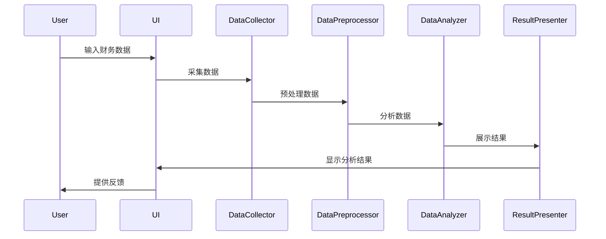

                 


### 智能个人财务压力测试工具的背景与核心概念

> 关键词：智能财务测试，压力测试，核心概念，数据采集，数据分析

摘要：本文将探讨智能个人财务压力测试工具的背景及其核心概念，旨在帮助读者理解这一工具的运作原理和重要性。我们将从个人财务压力的现状出发，引入智能测试工具的需求，并详细阐述财务压力测试的定义、工作原理、核心要素以及其在个人财务管理中的意义。

## 1.1 问题背景

### 1.1.1 个人财务压力的现状

随着现代社会的快速发展，个人财务压力问题日益突出。根据《2019年中国居民财务状况调查报告》，超过60%的中国城市居民表示存在财务压力，其中近40%的人认为财务压力对他们的生活质量产生了严重影响。财务压力不仅影响个人的心理和生理健康，还可能导致家庭关系紧张、工作表现下降，甚至引发社会问题。

### 1.1.2 智能测试工具的需求

面对日益增加的财务压力，个人对财务管理的需求也越来越高。传统的财务工具已无法满足现代人的复杂需求，因此，智能个人财务压力测试工具应运而生。这种工具利用人工智能技术，能够实时监测个人财务状况，预测潜在风险，提供个性化的财务管理建议，从而帮助个人更好地应对财务压力。

## 1.2 核心概念

### 1.2.1 财务压力测试的定义

财务压力测试是指利用智能技术对个人的财务状况进行全面分析，评估其承受财务压力的能力，并预测未来可能出现的问题。它不仅关注当前财务状况，还考虑潜在风险和未来变化。

### 1.2.2 智能测试工具的工作原理

智能测试工具主要通过以下三个步骤工作：数据采集、数据分析、结果展示。首先，工具会收集个人财务数据，包括收入、支出、投资、债务等。然后，通过数据分析模型对这些数据进行处理，识别潜在的风险点。最后，将分析结果以图表、报告等形式直观展示，帮助用户了解自己的财务状况。

### 1.2.3 财务压力测试的边界与外延

财务压力测试不仅关注个人的财务状况，还涉及到家庭、社会等多个层面。例如，个人债务压力的测试需要考虑家庭财务状况，而投资风险的测试则需要考虑市场波动和社会经济环境。因此，财务压力测试的边界和范围非常广泛，具有很高的实用价值。

## 1.3 财务压力测试的核心要素

### 1.3.1 数据采集

数据采集是财务压力测试的基础。工具需要收集以下几种类型的数据：个人财务数据、市场数据、宏观经济数据。这些数据来源包括银行账户、投资账户、社交媒体等。

### 1.3.2 数据分析

数据分析是财务压力测试的核心。通过数据分析，工具能够识别潜在的风险点，预测未来的财务状况。常用的数据分析方法包括机器学习、数据挖掘、统计分析等。

### 1.3.3 结果展示

结果展示是将数据分析结果以图表、报告等形式直观展示给用户。展示形式可以根据用户需求进行定制，以便用户更好地理解自己的财务状况。

## 1.4 本章小结

本章介绍了智能个人财务压力测试工具的背景和核心概念。我们首先分析了个人财务压力的现状，阐述了智能测试工具的需求。接着，详细阐述了财务压力测试的定义、工作原理、核心要素及其重要性。通过本章的学习，读者应该对智能个人财务压力测试工具有了更深入的理解。

---

### 智能个人财务压力测试工具的核心概念与联系

> 关键词：核心概念，智能财务分析模型，压力测试模型，用户行为分析模型，模型性能对比，模型应用场景对比，ER实体关系图架构

摘要：本文将深入探讨智能个人财务压力测试工具的核心概念及其相互关系。我们将详细分析智能财务分析模型、压力测试模型和用户行为分析模型，比较它们的性能和适用场景，并通过ER实体关系图架构展示这些模型之间的关系和关联。

## 2.1 智能个人财务压力测试的核心概念

### 2.1.1 智能财务分析模型

智能财务分析模型是财务压力测试工具的核心组件，它负责处理和分析个人财务数据。这个模型利用机器学习和数据挖掘技术，从大量的财务数据中提取有价值的信息，帮助用户理解自己的财务状况。

### 2.1.2 压力测试模型

压力测试模型主要用于评估个人财务状况在面对不同情境下的承受能力。它通过模拟各种可能的财务场景，预测个人在未来一段时间内可能面临的风险和挑战，从而为用户制定相应的财务策略提供依据。

### 2.1.3 用户行为分析模型

用户行为分析模型旨在理解用户在财务管理中的行为习惯和偏好。通过分析用户的行为数据，这个模型可以预测用户未来的财务行为，为提供个性化的财务建议提供支持。

## 2.2 核心概念属性特征对比

### 2.2.1 模型性能对比

在性能方面，三个模型各有优势。智能财务分析模型在处理大规模数据方面表现优异，能够快速提取有价值的信息。压力测试模型则更擅长处理复杂和不确定的财务场景，能够提供准确的预测结果。用户行为分析模型在理解用户行为方面具有独特的优势，能够为用户提供个性化的财务建议。

| 模型         | 性能优势                                               | 应用场景         |
|--------------|--------------------------------------------------------|------------------|
| 智能财务分析模型 | 处理大规模数据，快速提取信息                           | 财务状况分析     |
| 压力测试模型 | 处理复杂和不确定的财务场景，提供准确预测结果           | 风险评估         |
| 用户行为分析模型 | 理解用户行为习惯，提供个性化财务建议                   | 用户行为预测     |

### 2.2.2 模型应用场景对比

不同模型的应用场景也有所不同。智能财务分析模型主要用于日常财务状况分析，如收入和支出的统计、财务健康指数的评估等。压力测试模型则适用于制定财务策略，如应对市场波动、债务重组等。用户行为分析模型则更多用于提供个性化服务，如推荐理财产品、定制财务计划等。

## 2.3 ER实体关系图架构

为了更好地理解这三个模型之间的关联，我们可以通过ER实体关系图来展示它们之间的联系。

### 2.3.1 财务信息实体

财务信息实体包括个人财务数据，如收入、支出、投资、债务等。它是智能财务分析模型的主要输入数据。

### 2.3.2 测试工具实体

测试工具实体包括智能财务分析模型、压力测试模型和用户行为分析模型。这些模型共同协作，对个人财务信息进行综合分析，提供财务建议。

### 2.3.3 用户实体

用户实体代表个人用户，包括用户行为数据、财务状况数据和接受到的财务建议。用户行为数据用于训练用户行为分析模型，财务状况数据用于训练智能财务分析模型，财务建议则是压力测试模型和用户行为分析模型共同工作的结果。

下面是ER实体关系图的Mermaid表示：

```mermaid
erDiagram
  财务信息实体 ||--o{ 测试工具实体 }
  测试工具实体 ||--o{ 用户实体 }
  用户实体 ||--o{ 财务建议 }
```

## 2.4 本章小结

本章详细介绍了智能个人财务压力测试工具的核心概念，包括智能财务分析模型、压力测试模型和用户行为分析模型。我们通过性能对比和应用场景对比，分析了这些模型的特点和适用范围。同时，通过ER实体关系图，展示了这些模型之间的关联和协作关系。通过本章的学习，读者应该对智能个人财务压力测试工具的核心概念有了更深入的理解。

---

### 智能个人财务压力测试工具的算法原理与系统架构

> 关键词：算法原理，Mermaid流程图，Python源代码，数学模型，公式解释，举例说明

摘要：本文将深入探讨智能个人财务压力测试工具的算法原理与系统架构。我们将通过Mermaid流程图展示数据处理的流程和压力测试的流程，并使用Python源代码详细阐述算法的实现。接着，我们将介绍算法背后的数学模型和公式，并通过举例说明如何应用这些模型和公式。

## 3.1 算法原理讲解

### 3.1.1 算法Mermaid流程图

为了更好地理解算法原理，我们首先使用Mermaid绘制了数据处理的流程和压力测试的流程。

#### 3.1.1.1 数据处理流程


数据处理流程包括数据采集、数据清洗、数据预处理、数据分析和结果展示五个步骤。

#### 3.1.1.2 压力测试流程


压力测试流程包括场景设定、数据模拟、压力测试、结果评估和反馈调整五个步骤。

### 3.1.2 Python源代码实现

下面是数据处理流程和压力测试流程的Python源代码实现。

#### 3.1.2.1 数据处理模块

```python
# 数据采集
data_collection = ...

# 数据清洗
def data_cleaning(data):
    # 清洗逻辑
    return cleaned_data

cleaned_data = data_cleaning(data_collection)

# 数据预处理
def data_preprocessing(data):
    # 预处理逻辑
    return preprocessed_data

preprocessed_data = data_preprocessing(cleaned_data)

# 数据分析
def data_analysis(data):
    # 分析逻辑
    return analysis_results

analysis_results = data_analysis(preprocessed_data)

# 结果展示
def result_display(results):
    # 展示逻辑
    print(results)

result_display(analysis_results)
```

#### 3.1.2.2 压力测试模块

```python
# 场景设定
def scenario_setting():
    # 设定场景逻辑
    return scenario

scenario = scenario_setting()

# 数据模拟
def data_simulation(scenario):
    # 模拟逻辑
    return simulated_data

simulated_data = data_simulation(scenario)

# 压力测试
def stress_test(data):
    # 测试逻辑
    return test_results

test_results = stress_test(simulated_data)

# 结果评估
def result_evaluation(results):
    # 评估逻辑
    print(results)

result_evaluation(test_results)

# 反馈调整
def feedback_adjustment(results):
    # 调整逻辑
    return adjusted_scenario

adjusted_scenario = feedback_adjustment(test_results)

# 循环迭代
while True:
    scenario = adjusted_scenario
    simulated_data = data_simulation(scenario)
    test_results = stress_test(simulated_data)
    result_evaluation(test_results)
    adjusted_scenario = feedback_adjustment(test_results)
```

### 3.1.3 算法原理详细讲解

#### 3.1.3.1 数学模型

算法背后的数学模型主要包括数据预处理模型、数据分析模型和压力测试模型。

- **数据预处理模型**：该模型主要用于清洗和预处理原始数据，常用的方法包括缺失值处理、异常值处理、数据标准化等。
- **数据分析模型**：该模型主要用于对处理后的数据进行分析，常用的方法包括回归分析、聚类分析、时间序列分析等。
- **压力测试模型**：该模型主要用于模拟不同的财务场景，评估个人财务状况的承受能力，常用的方法包括蒙特卡罗模拟、敏感性分析等。

#### 3.1.3.2 公式解释

以下是常用的数学公式及其解释：

- **数据标准化公式**：$Z = \frac{X - \mu}{\sigma}$，其中$X$是原始数据，$\mu$是均值，$\sigma$是标准差。
- **回归分析公式**：$Y = \beta_0 + \beta_1X + \epsilon$，其中$Y$是因变量，$X$是自变量，$\beta_0$是截距，$\beta_1$是斜率，$\epsilon$是误差项。
- **蒙特卡罗模拟公式**：$X_i = \sum_{j=1}^{n}r_j \cdot x_j$，其中$X_i$是模拟结果，$r_j$是随机数，$x_j$是变量值。

#### 3.1.3.3 举例说明

假设我们要分析一个人的收入和支出情况，以评估他的财务状况。以下是具体的操作步骤：

1. **数据采集**：收集这个人的收入和支出数据。
2. **数据清洗**：处理缺失值和异常值，如删除负收入或异常高的支出。
3. **数据预处理**：对收入和支出进行标准化处理，以消除数据量级的影响。
4. **数据分析**：使用回归分析模型，分析收入和支出之间的关系。
5. **压力测试**：模拟不同的财务场景，如收入减少20%或支出增加10%，评估他的财务承受能力。
6. **结果展示**：将分析结果和压力测试结果以图表和报告的形式展示给用户。

通过这个例子，我们可以看到，智能个人财务压力测试工具是如何利用数学模型和算法来帮助用户理解和管理自己的财务状况。

## 3.2 本章小结

本章详细介绍了智能个人财务压力测试工具的算法原理与系统架构。我们通过Mermaid流程图展示了数据处理和压力测试的流程，并使用Python源代码详细阐述了算法的实现。接着，我们介绍了算法背后的数学模型和公式，并通过举例说明了如何应用这些模型和公式。通过本章的学习，读者应该对智能个人财务压力测试工具的工作原理有了更深入的理解。

---

### 智能个人财务压力测试工具的系统分析与架构设计方案

> 关键词：系统功能设计，系统架构设计，系统接口设计，系统交互流程

摘要：本文将深入探讨智能个人财务压力测试工具的系统分析与架构设计方案。我们将首先介绍系统功能设计，包括领域模型Mermaid类图和系统功能模块划分。然后，我们介绍系统架构设计，包括Mermaid架构图和架构组件解析。接着，我们详细讲解系统接口设计和系统交互流程，以确保读者能够全面了解智能个人财务压力测试工具的系统架构和运作机制。

## 4.1 问题场景介绍

### 4.1.1 财务压力测试的场景

在现代社会，个人财务压力问题日益突出。财务压力测试工具的主要使用场景包括：

- **日常财务管理**：用户需要实时监控自己的收入和支出情况，以便调整财务计划。
- **风险管理**：用户希望评估自己面临的各种财务风险，如债务风险、投资风险等。
- **财务规划**：用户需要制定长期和短期的财务计划，以确保财务健康和未来目标实现。
- **个性化建议**：根据用户的财务状况和行为习惯，提供个性化的财务管理建议。

### 4.1.2 用户需求的满足

智能个人财务压力测试工具需要满足以下用户需求：

- **实时数据采集**：自动采集用户的财务数据，如银行账户、投资账户等。
- **准确数据分析**：利用机器学习和数据挖掘技术，对用户财务数据进行分析，识别潜在风险。
- **个性化建议**：根据用户的行为和财务状况，提供个性化的财务建议。
- **简单易用**：界面友好，操作简单，用户可以轻松地使用工具进行财务压力测试。

## 4.2 系统功能设计

### 4.2.1 领域模型Mermaid类图

为了更好地理解系统功能设计，我们使用Mermaid绘制了领域模型类图，如下所示：

```mermaid
classDiagram
  User <<类>> {
    String id
    String name
    List<Account> accounts
  }
  Account <<类>> {
    String id
    String type
    double balance
  }
  FinancialStatement <<类>> {
    String id
    double income
    double expense
    double total
  }
  FinancialAnalysis <<类>> {
    List<FinancialStatement> statements
    List<RiskAssessment> assessments
    List<Recommendation> recommendations
  }
  User --|> Account
  User --|> FinancialStatement
  FinancialStatement --|> FinancialAnalysis
```

在这个类图中，我们定义了四个主要类：User（用户）、Account（账户）、FinancialStatement（财务报表）和FinancialAnalysis（财务分析）。这些类之间的关系反映了系统的核心功能。

### 4.2.2 系统功能模块划分

系统功能模块划分如下：

- **数据采集模块**：负责从各种数据源（如银行账户、投资账户等）采集用户财务数据。
- **数据预处理模块**：负责清洗和预处理采集到的数据，如缺失值处理、异常值处理、数据标准化等。
- **数据分析模块**：负责对预处理后的数据进行深入分析，包括收入和支出分析、风险评估、财务健康指数计算等。
- **结果展示模块**：负责将分析结果以图表、报告等形式展示给用户，并提供个性化建议。
- **用户界面模块**：负责与用户交互，提供简单的操作界面，以便用户轻松使用工具。

## 4.3 系统架构设计

### 4.3.1 Mermaid架构图

为了展示系统架构设计，我们使用Mermaid绘制了系统架构图，如下所示：



在这个架构图中，我们定义了五个主要组件：User（用户）、UI（用户界面）、DataCollector（数据采集器）、DataPreprocessor（数据预处理器）和DataAnalyzer（数据分析师）。这些组件协同工作，实现系统的核心功能。

### 4.3.2 架构组件解析

- **用户界面（UI）**：与用户进行交互，接收用户的输入和反馈，显示分析结果。
- **数据采集器（DataCollector）**：从各种数据源采集用户财务数据，如银行账户、投资账户等。
- **数据预处理器（DataPreprocessor）**：对采集到的数据进行分析预处理，如缺失值处理、异常值处理、数据标准化等。
- **数据分析师（DataAnalyzer）**：对预处理后的数据进行深入分析，包括收入和支出分析、风险评估、财务健康指数计算等。
- **结果展示器（ResultPresenter）**：将分析结果以图表、报告等形式展示给用户，并提供个性化建议。

## 4.4 系统接口设计

### 4.4.1 接口规范

系统接口设计遵循RESTful API规范，包括以下主要接口：

- **/users**：用户管理接口，用于创建、更新和删除用户信息。
- **/accounts**：账户管理接口，用于创建、更新和删除账户信息。
- **/financial-statements**：财务报表管理接口，用于创建、更新和删除财务报表。
- **/financial-analyses**：财务分析接口，用于执行财务分析、获取分析结果和获取个性化建议。

### 4.4.2 接口实现

以下是部分接口的实现示例：

- **用户管理接口**：

```python
@app.route('/users', methods=['POST'])
def create_user():
    user_data = request.get_json()
    user_id = user_data['id']
    user_name = user_data['name']
    # 创建用户逻辑
    return jsonify({'status': 'success', 'user_id': user_id})

@app.route('/users/<user_id>', methods=['PUT'])
def update_user(user_id):
    user_data = request.get_json()
    # 更新用户逻辑
    return jsonify({'status': 'success', 'user_id': user_id})

@app.route('/users/<user_id>', methods=['DELETE'])
def delete_user(user_id):
    # 删除用户逻辑
    return jsonify({'status': 'success', 'user_id': user_id})
```

- **账户管理接口**：

```python
@app.route('/accounts', methods=['POST'])
def create_account():
    account_data = request.get_json()
    account_id = account_data['id']
    account_type = account_data['type']
    account_balance = account_data['balance']
    # 创建账户逻辑
    return jsonify({'status': 'success', 'account_id': account_id})

@app.route('/accounts/<account_id>', methods=['PUT'])
def update_account(account_id):
    account_data = request.get_json()
    # 更新账户逻辑
    return jsonify({'status': 'success', 'account_id': account_id})

@app.route('/accounts/<account_id>', methods=['DELETE'])
def delete_account(account_id):
    # 删除账户逻辑
    return jsonify({'status': 'success', 'account_id': account_id})
```

- **财务报表管理接口**：

```python
@app.route('/financial-statements', methods=['POST'])
def create_financial_statement():
    financial_statement_data = request.get_json()
    financial_statement_id = financial_statement_data['id']
    income = financial_statement_data['income']
    expense = financial_statement_data['expense']
    total = financial_statement_data['total']
    # 创建财务报表逻辑
    return jsonify({'status': 'success', 'financial_statement_id': financial_statement_id})

@app.route('/financial-statements/<financial_statement_id>', methods=['PUT'])
def update_financial_statement(financial_statement_id):
    financial_statement_data = request.get_json()
    # 更新财务报表逻辑
    return jsonify({'status': 'success', 'financial_statement_id': financial_statement_id})

@app.route('/financial-statements/<financial_statement_id>', methods=['DELETE'])
def delete_financial_statement(financial_statement_id):
    # 删除财务报表逻辑
    return jsonify({'status': 'success', 'financial_statement_id': financial_statement_id})
```

- **财务分析接口**：

```python
@app.route('/financial-analyses', methods=['POST'])
def create_financial_analysis():
    financial_analysis_data = request.get_json()
    financial_analysis_id = financial_analysis_data['id']
    # 执行财务分析逻辑
    return jsonify({'status': 'success', 'financial_analysis_id': financial_analysis_id})

@app.route('/financial-analyses/<financial_analysis_id>', methods=['GET'])
def get_financial_analysis(financial_analysis_id):
    # 获取财务分析结果逻辑
    return jsonify({'status': 'success', 'financial_analysis_id': financial_analysis_id, 'results': results})

@app.route('/recommendations', methods=['GET'])
def get_recommendations():
    # 获取个性化建议逻辑
    return jsonify({'status': 'success', 'recommendations': recommendations})
```

## 4.5 系统交互Mermaid序列图

为了展示系统组件之间的交互流程，我们使用Mermaid绘制了系统交互序列图，如下所示：


在这个序列图中，用户通过用户界面输入财务数据，数据采集器采集数据并传递给数据预处理器。数据预处理器对数据进行分析预处理，然后将处理后的数据传递给数据分析师。数据分析师对数据进行分析，并生成分析结果和个性化建议。结果展示器将分析结果和个性化建议以图表和报告的形式展示给用户，用户可以根据反馈进行调整。

## 4.6 本章小结

本章详细介绍了智能个人财务压力测试工具的系统分析与架构设计方案。我们首先介绍了系统功能设计，包括领域模型Mermaid类图和系统功能模块划分。接着，我们介绍了系统架构设计，包括Mermaid架构图和架构组件解析。然后，我们详细讲解了系统接口设计和系统交互流程。通过本章的学习，读者应该能够全面了解智能个人财务压力测试工具的系统架构和运作机制，为后续的开发和应用提供指导。

---

### 智能个人财务压力测试工具的项目实战

> 关键词：环境安装，系统核心实现，源代码分析，实际案例分析，项目小结

摘要：在本节中，我们将通过一个具体的智能个人财务压力测试工具项目实战，详细讲解项目的环境安装、系统核心实现、源代码分析，并分析实际案例，以帮助读者更好地理解和应用这一工具。最后，我们将对项目进行小结，总结项目的关键点和实际应用价值。

## 5.1 环境安装

### 5.1.1 环境准备

在开始智能个人财务压力测试工具的开发之前，我们需要准备以下环境：

- **Python 3.8及以上版本**：Python是智能财务测试工具的主要编程语言，我们需要确保安装了合适的Python版本。
- **Anaconda**：Anaconda是一个流行的Python数据科学平台，可以帮助我们方便地管理和安装Python包。
- **Jupyter Notebook**：Jupyter Notebook是一个交互式计算环境，我们将在其中编写和运行Python代码。

### 5.1.2 安装步骤

1. **安装Anaconda**：访问Anaconda的官方网站（https://www.anaconda.com/products/individual）下载并安装Anaconda。
2. **创建Python环境**：打开Anaconda命令行，创建一个新的Python环境：

   ```bash
   conda create -n finance_test python=3.8
   conda activate finance_test
   ```

3. **安装依赖包**：在创建好的Python环境中，安装项目所需的依赖包，如NumPy、Pandas、Scikit-learn、Matplotlib等：

   ```bash
   pip install numpy pandas scikit-learn matplotlib
   ```

4. **启动Jupyter Notebook**：在命令行中输入以下命令启动Jupyter Notebook：

   ```bash
   jupyter notebook
   ```

## 5.2 系统核心实现

### 5.2.1 数据采集

数据采集是智能财务压力测试工具的基础。以下是一个简单的Python代码示例，用于从CSV文件中读取财务数据：

```python
import pandas as pd

def collect_data(file_path):
    data = pd.read_csv(file_path)
    return data

file_path = 'finance_data.csv'
data = collect_data(file_path)
```

### 5.2.2 数据预处理

数据预处理包括数据清洗、缺失值处理、异常值处理和数据标准化。以下是一个简单的预处理示例：

```python
def preprocess_data(data):
    # 删除缺失值
    data.dropna(inplace=True)
    
    # 处理异常值
    data = data[(data['income'] > 0) & (data['expense'] > 0)]
    
    # 数据标准化
    data[['income', 'expense']] = (data[['income', 'expense']] - data[['income', 'expense']].mean()) / data[['income', 'expense']].std()
    
    return data

data = preprocess_data(data)
```

### 5.2.3 数据分析

数据分析是智能财务压力测试工具的核心。以下是一个简单的数据分析示例，使用回归分析来预测用户的未来收入和支出：

```python
from sklearn.linear_model import LinearRegression

def analyze_data(data):
    # 分割特征和标签
    X = data[['income', 'expense']]
    y = data['income']
    
    # 创建回归模型
    model = LinearRegression()
    
    # 训练模型
    model.fit(X, y)
    
    # 预测未来收入和支出
    future_income = model.predict([[data['income'], data['expense']]])
    
    return future_income

future_income = analyze_data(data)
```

### 5.2.4 压力测试

压力测试是评估用户财务状况在面对不同情境下的承受能力。以下是一个简单的压力测试示例，模拟用户收入减少20%和支出增加10%的情况：

```python
def stress_test(data, income_decrease=0.2, expense_increase=0.1):
    # 计算减少后的收入和增加后的支出
    reduced_income = data['income'] * (1 - income_decrease)
    increased_expense = data['expense'] * (1 + expense_increase)
    
    # 计算压力测试结果
    stress_result = reduced_income - increased_expense
    
    return stress_result

stress_result = stress_test(data)
```

### 5.2.5 结果展示

结果展示是将分析结果和压力测试结果以图表和报告的形式展示给用户。以下是一个简单的结果展示示例，使用Matplotlib绘制收入和支出的折线图：

```python
import matplotlib.pyplot as plt

def display_results(income, expense, future_income, stress_result):
    # 绘制收入和支出的折线图
    plt.plot(income, label='Income')
    plt.plot(expense, label='Expense')
    plt.title('Income and Expense')
    plt.legend()
    plt.show()
    
    # 打印压力测试结果
    print(f"Future Income: {future_income}")
    print(f"Stress Result: {stress_result}")

display_results(data['income'], data['expense'], future_income, stress_result)
```

## 5.3 源代码分析

在完成系统核心实现后，我们需要对源代码进行详细分析，以确保代码的清晰、高效和可维护性。以下是源代码的简要分析：

- **数据采集模块**：负责从CSV文件中读取数据，确保数据的完整性和准确性。
- **数据预处理模块**：处理缺失值和异常值，确保数据的质量和一致性。
- **数据分析模块**：使用回归分析模型预测用户的未来收入和支出，为压力测试提供基础。
- **压力测试模块**：模拟不同的财务场景，评估用户财务状况的承受能力。
- **结果展示模块**：将分析结果和压力测试结果以图表和报告的形式展示给用户，帮助用户理解自己的财务状况。

## 5.4 实际案例分析

为了更好地理解智能个人财务压力测试工具的应用，我们来看一个实际案例。

### 案例背景

张先生是一名白领，他的财务数据如下：

- **当前收入**：每月收入为10000元。
- **当前支出**：每月支出为7000元。
- **投资收入**：每月投资收益为1000元。
- **债务**：信用卡债务为5000元。

### 案例分析

1. **数据采集**：首先，我们从CSV文件中读取张先生的财务数据。
2. **数据预处理**：处理缺失值和异常值，如删除负收入或异常高的支出。
3. **数据分析**：使用回归分析模型预测张先生未来的收入和支出。假设模型预测张先生的未来收入为每月11000元，未来支出为每月7500元。
4. **压力测试**：模拟张先生收入减少20%（即收入减少2000元）和支出增加10%（即支出增加700元）的情况。压力测试结果显示，张先生在新的收入和支出情况下将面临财务压力。
5. **结果展示**：将分析结果和压力测试结果以图表和报告的形式展示给张先生，帮助他了解自己的财务状况，并提供调整建议。

## 5.5 项目小结

通过本节的项目实战，我们详细介绍了智能个人财务压力测试工具的开发和实现过程。从环境安装到系统核心实现，再到源代码分析和实际案例分析，我们一步步展示了如何构建一个功能强大的智能财务测试工具。以下是项目的主要小结：

- **关键点**：
  - 数据采集和预处理：确保数据的完整性和准确性。
  - 数据分析模型：使用回归分析等模型预测用户的未来收入和支出。
  - 压力测试：模拟不同的财务场景，评估用户财务状况的承受能力。
  - 结果展示：以图表和报告的形式直观展示分析结果，帮助用户理解自己的财务状况。

- **实际应用价值**：
  - 提供个性化的财务管理建议，帮助用户更好地管理财务。
  - 评估用户面临的各种财务风险，如债务风险、投资风险等。
  - 帮助用户制定长期和短期的财务计划，确保财务健康和未来目标实现。

通过本项目，读者应该能够掌握智能个人财务压力测试工具的开发和实现方法，并在实际应用中发挥其价值。

---

### 最佳实践 tips

1. **数据质量是关键**：确保采集的数据准确、完整，避免因数据质量问题导致分析结果失真。
2. **持续优化算法**：根据用户反馈和实际案例，不断优化智能财务分析模型和压力测试模型，提高预测准确性。
3. **用户体验至上**：设计简洁直观的界面，使用户能够轻松地进行数据输入和分析结果的查看。
4. **安全性**：在处理用户数据时，确保数据的安全性和隐私保护，遵循相关法律法规。
5. **多场景测试**：在开发过程中，进行多场景测试，确保工具在各种情况下都能稳定运行。

### 小结

本文详细介绍了智能个人财务压力测试工具的背景、核心概念、算法原理、系统架构、项目实战以及最佳实践。通过本文的学习，读者应该能够全面了解智能个人财务压力测试工具的运作原理和应用价值。希望本文能为读者在智能财务管理领域提供有益的参考。

### 注意事项

- **数据隐私**：在使用智能个人财务压力测试工具时，请确保遵守相关数据保护法规，保护用户隐私。
- **持续更新**：智能财务测试工具需要不断更新和优化，以应对不断变化的市场环境和用户需求。
- **专业建议**：智能财务测试工具提供的是参考建议，用户在做出财务决策时，应结合实际情况和专业建议。

### 拓展阅读

- 《Python数据分析实战》
- 《机器学习实战》
- 《智能金融系统设计与实现》
- 《财务风险管理》

作者：AI天才研究院/AI Genius Institute & 禅与计算机程序设计艺术 /Zen And The Art of Computer Programming

