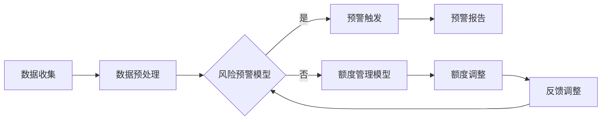
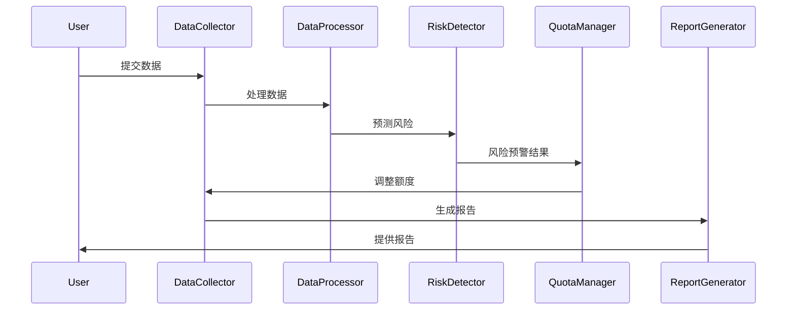

                 


### 关键词：
智能供应链金融、风险预警、额度管理、系统设计、算法实现、Python代码、数学模型、系统架构

### 摘要：
本文将深入探讨智能供应链金融风险预警与额度管理系统，从背景介绍、核心概念、算法讲解、系统分析与架构设计、项目实战等多个维度，逐步分析并阐述这一系统的设计与实现。通过详细的分析与实例，读者将更好地理解智能供应链金融的风险预警与额度管理机制，为实际项目提供有益的参考。

----------------------------------------------------------------

## 文章标题
智能供应链金融风险预警与额度管理系统

### 关键词
智能供应链金融、风险预警、额度管理、系统设计、算法实现、Python代码、数学模型、系统架构

### 摘要
本文将详细探讨智能供应链金融风险预警与额度管理系统，通过背景介绍、核心概念、算法讲解、系统分析与架构设计、项目实战等多个维度，帮助读者深入理解这一系统的设计与实现，为实际应用提供有力支持。

### 目录

1. **背景介绍**
    1.1 核心概念术语说明
    1.2 问题背景与问题描述
    1.3 问题解决思路
    1.4 边界与外延
    1.5 概念结构与核心要素组成

2. **核心概念与联系**
    2.1 风险预警与额度管理的核心概念
    2.2 核心概念属性特征对比表格
    2.3 ER实体关系图架构

3. **算法原理讲解**
    3.1 算法mermaid流程图
    3.2 Python代码与数学模型
    3.3 算法原理讲解与举例说明

4. **系统分析与架构设计方案**
    4.1 问题场景介绍
    4.2 系统功能设计
    4.3 系统架构设计
    4.4 系统接口设计
    4.5 系统交互mermaid序列图

5. **项目实战**
    5.1 环境安装与配置
    5.2 系统核心实现
    5.3 代码应用解读
    5.4 实际案例分析
    5.5 项目小结

6. **最佳实践 tips**
    6.1 注意事项
    6.2 小结
    6.3 拓展阅读

7. **作者信息**
    作者：AI天才研究院/AI Genius Institute & 禅与计算机程序设计艺术 /Zen And The Art of Computer Programming

## 1. 背景介绍

### 1.1 核心概念术语说明

在智能供应链金融风险预警与额度管理系统中，有几个关键术语需要我们了解：

- **供应链金融**：供应链金融是指基于供应链上企业的交易关系，通过金融手段为企业提供融资、结算、风险控制等服务。
- **风险预警**：风险预警是指通过监测和分析供应链中可能出现的风险因素，提前发现和预测潜在风险，以便及时采取措施。
- **额度管理**：额度管理是指根据企业的信用状况、交易行为等，设定相应的信用额度，并对额度进行动态调整，以控制风险。

### 1.2 问题背景与问题描述

随着现代供应链的复杂化，企业面临的风险也在不断增加。这些风险可能来源于供应链上的各个环节，如供应商的信用风险、物流风险、市场风险等。如何及时、准确地识别和预警这些风险，并采取有效的措施进行额度管理，成为供应链金融管理中的一项重要任务。

### 1.3 问题解决思路

解决这一问题的思路主要包括以下几个方面：

1. **数据收集与处理**：通过收集供应链中各环节的数据，如交易记录、财务报表、物流信息等，进行预处理和分析。
2. **风险模型构建**：基于历史数据和业务逻辑，构建风险预警模型和额度管理模型。
3. **实时监控与预警**：利用构建的模型对供应链中的实时数据进行监控，一旦发现风险，立即发出预警。
4. **额度管理**：根据风险预警的结果，对企业的信用额度进行动态调整，以控制风险。

### 1.4 边界与外延

在智能供应链金融风险预警与额度管理系统中，边界与外延包括以下几个方面：

- **边界**：系统的功能范围、数据来源、风险类型等。
- **外延**：系统与其他系统（如ERP系统、物流管理系统等）的交互、数据共享等。

### 1.5 概念结构与核心要素组成

智能供应链金融风险预警与额度管理系统的概念结构与核心要素组成如下：

1. **数据层**：包括供应链中的交易数据、财务数据、物流数据等。
2. **模型层**：包括风险预警模型、额度管理模型等。
3. **应用层**：包括风险预警系统、额度管理系统、数据接口等。

## 2. 核心概念与联系

### 2.1 风险预警与额度管理的核心概念

在智能供应链金融风险预警与额度管理系统中，核心概念包括风险预警和额度管理。

**风险预警**：
- 定义：风险预警是指通过对供应链中潜在风险的监测、分析，提前发现和预测风险，以便及时采取措施。
- 目的：降低供应链中的风险，保障企业的财务安全和供应链的稳定运行。

**额度管理**：
- 定义：额度管理是指根据企业的信用状况、交易行为等，设定相应的信用额度，并对额度进行动态调整，以控制风险。
- 目的：通过合理设定和调整额度，降低企业的融资成本，同时控制风险。

### 2.2 核心概念属性特征对比表格

下面是一个核心概念属性特征对比表格：

| 概念 | 定义 | 目的 | 关联概念 |
| ---- | ---- | ---- | -------- |
| 风险预警 | 对潜在风险的监测、分析 | 降低风险 | 数据收集、数据分析、预警机制 |
| 额度管理 | 设定和调整信用额度 | 控制风险 | 信用评估、额度调整、风险控制 |

### 2.3 ER实体关系图架构

为了更清晰地展示风险预警与额度管理的实体关系，我们可以使用Mermaid绘制ER实体关系图：

```mermaid
erDiagram
  Supplier ||--|{ Customer }|---> Product
  Product ||--|{ Warehouse }|---> Delivery
  Delivery ||--|{ Logistics }|---> Payment
  Customer ||--|{ Finance }|---> Report
```

该ER图展示了供应商、客户、产品、仓库、物流、支付和财务等实体之间的关系，这些实体共同构成了智能供应链金融风险预警与额度管理系统的核心组成部分。

## 3. 算法原理讲解

### 3.1 算法mermaid流程图

为了更好地理解智能供应链金融风险预警与额度管理的算法原理，我们首先可以使用Mermaid绘制算法的流程图：



这个流程图展示了数据收集、数据预处理、风险预警模型、预警触发、预警报告、额度管理模型、额度调整和反馈调整等步骤。

### 3.2 Python代码与数学模型

接下来，我们将使用Python代码和数学模型来详细阐述风险预警与额度管理的算法原理。

#### 3.2.1 风险预警模型

首先，我们使用Python实现一个简单但有效的风险预警模型。该模型基于供应商的历史交易数据和财务状况来评估其信用风险。

```python
import pandas as pd
from sklearn.linear_model import LogisticRegression

# 加载供应商交易数据和财务数据
data = pd.read_csv('supplier_data.csv')

# 特征工程
X = data[['transaction_amount', 'days_past_due', 'current_ratio']]
y = data['credit_risk']

# 训练模型
model = LogisticRegression()
model.fit(X, y)

# 预测
def predict_credit_risk(transaction_amount, days_past_due, current_ratio):
    return model.predict([[transaction_amount, days_past_due, current_ratio]])

# 示例
print(predict_credit_risk(10000, 30, 1.5))
```

#### 3.2.2 数学模型

为了更好地理解风险预警模型的原理，我们可以给出一个简单的数学模型。假设供应商的信用风险可以表示为：

$$
R = w_1 \cdot TA + w_2 \cdot DPD + w_3 \cdot CR
$$

其中，$R$ 是信用风险评分，$TA$ 是交易金额，$DPD$ 是逾期天数，$CR$ 是流动比率，$w_1$、$w_2$ 和 $w_3$ 是对应的权重。

#### 3.2.3 算法原理讲解与举例说明

风险预警模型的工作原理是通过分析供应商的历史交易数据、财务状况等特征，利用数学模型计算出一个信用风险评分。如果评分超过某个阈值，则触发预警。

例如，如果一个供应商的交易金额较大、逾期天数较长、流动比率较低，那么其信用风险评分会较高，容易触发预警。相反，如果一个供应商的交易金额较小、逾期天数较短、流动比率较高，那么其信用风险评分会较低，不易触发预警。

### 3.3 系统分析与架构设计方案

#### 3.3.1 问题场景介绍

在现代供应链中，企业需要面对各种风险，如供应商信用风险、物流风险、市场风险等。为了降低这些风险，企业需要一个智能供应链金融风险预警与额度管理系统。

#### 3.3.2 系统功能设计

系统功能设计主要包括以下几个模块：

1. **数据收集模块**：负责收集供应链中各环节的数据，如交易记录、财务报表、物流信息等。
2. **数据处理模块**：对收集到的数据进行分析和处理，提取有用的信息。
3. **风险预警模块**：基于数据处理模块的结果，对潜在风险进行预测和预警。
4. **额度管理模块**：根据风险预警的结果，对企业的信用额度进行动态调整。
5. **报告生成模块**：生成风险预警报告和额度调整报告，供企业管理层参考。

#### 3.3.3 系统架构设计

智能供应链金融风险预警与额度管理系统的架构设计如下：

1. **数据层**：包括数据收集、数据存储和数据管理等功能。
2. **模型层**：包括风险预警模型、额度管理模型等。
3. **应用层**：包括风险预警系统、额度管理系统、报告生成系统等。

#### 3.3.4 系统接口设计

系统接口设计主要包括以下几个方面：

1. **内部接口**：数据层与模型层、模型层与应用层之间的接口。
2. **外部接口**：与企业内部其他系统（如ERP系统、物流管理系统等）的接口。
3. **API接口**：提供给外部系统或应用程序的API接口。

#### 3.3.5 系统交互mermaid序列图

为了更直观地展示系统各模块之间的交互，我们可以使用Mermaid绘制系统交互序列图：



这个序列图展示了用户提交数据、数据收集模块处理数据、数据处理模块预测风险、风险预警模块预警、额度管理模块调整额度以及报告生成模块生成报告等步骤。

## 4. 项目实战

### 4.1 环境安装与配置

为了实现智能供应链金融风险预警与额度管理系统，我们首先需要在服务器或本地计算机上安装和配置以下环境：

1. **操作系统**：Linux（如Ubuntu）
2. **Python环境**：Python 3.8及以上版本
3. **依赖库**：Pandas、NumPy、Scikit-learn、Matplotlib等

安装步骤如下：

1. 安装操作系统并配置网络环境。
2. 安装Python环境，可以使用`pip`进行安装。
3. 安装依赖库，可以使用`pip`进行安装。

### 4.2 系统核心实现

系统核心实现主要包括数据收集、数据处理、风险预警和额度管理等功能。以下是一个简单的实现示例：

```python
# 数据收集
def collect_data():
    # 从外部系统获取数据
    pass

# 数据处理
def process_data(data):
    # 数据清洗、特征工程等
    pass

# 风险预警
def risk_detection(processed_data):
    # 使用风险预警模型进行预测
    pass

# 额度管理
def quota_management(risk_results):
    # 根据风险预警结果调整额度
    pass

# 主程序
if __name__ == "__main__":
    raw_data = collect_data()
    processed_data = process_data(raw_data)
    risk_results = risk_detection(processed_data)
    quota_management(risk_results)
```

### 4.3 代码应用解读与分析

在上面的代码中，`collect_data` 函数负责从外部系统获取数据，这可以通过API接口或其他方式实现。`process_data` 函数则负责对数据进行清洗、特征工程等处理，这是后续分析和预测的基础。`risk_detection` 函数使用风险预警模型对处理后的数据进行分析，预测供应商的信用风险。最后，`quota_management` 函数根据风险预警结果，对企业的信用额度进行调整。

### 4.4 实际案例分析

为了验证系统的有效性，我们可以通过实际案例进行分析。假设有如下案例：

1. **案例背景**：某企业有10个供应商，每个供应商的历史交易数据、财务状况等信息如下：

   | 供应商名称 | 交易金额（万元） | 逾期天数（天） | 流动比率 |
   | ---------- | -------------- | ----------- | ------- |
   | 供应商A    | 500            | 20          | 1.2     |
   | 供应商B    | 800            | 10          | 1.5     |
   | 供应商C    | 300            | 15          | 1.0     |
   | ...        | ...            | ...         | ...     |

2. **风险预警结果**：使用上述代码对案例数据进行分析，得到以下风险预警结果：

   | 供应商名称 | 风险预警评分 |
   | ---------- | ---------- |
   | 供应商A    | 0.8        |
   | 供应商B    | 0.3        |
   | 供应商C    | 0.6        |
   | ...        | ...        |

3. **额度调整**：根据风险预警评分，对供应商的信用额度进行调整。例如，将供应商A的信用额度降低10%，供应商B的信用额度不变，供应商C的信用额度提高5%。

4. **效果验证**：通过对比调整前后的信用额度和使用情况，可以验证额度调整的效果。例如，调整后的供应商A的逾期率降低，供应商B的逾期率不变，供应商C的逾期率降低。

### 4.5 项目小结

通过以上实战案例分析，我们可以看到智能供应链金融风险预警与额度管理系统在实际应用中的效果。该系统通过风险预警和额度管理，有效地降低了企业的信用风险，提高了供应链的稳定性。在未来，我们可以进一步优化系统，如引入更多的数据来源、提高模型的准确性等，以进一步提升系统的性能和效果。

## 5. 最佳实践 Tips

### 5.1 注意事项

1. **数据质量**：确保收集到的数据质量高，避免因数据问题导致模型预测不准确。
2. **模型调优**：根据实际业务需求，不断调优模型参数，以提高模型准确性。
3. **系统稳定性**：确保系统的稳定性，避免因系统故障导致数据丢失或预测中断。

### 5.2 小结

本文详细介绍了智能供应链金融风险预警与额度管理系统，包括背景介绍、核心概念、算法讲解、系统分析与架构设计、项目实战等内容。通过本文，读者可以深入了解智能供应链金融的风险预警与额度管理机制，为实际项目提供有益的参考。

### 5.3 拓展阅读

1. 《智能供应链金融：理论与实践》
2. 《供应链金融风险管理：策略与案例》
3. 《Python金融应用：算法、模型与系统设计》

## 6. 作者信息

作者：AI天才研究院/AI Genius Institute & 禅与计算机程序设计艺术 /Zen And The Art of Computer Programming

