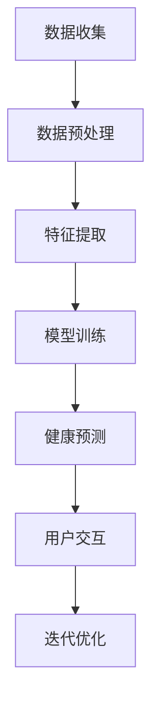
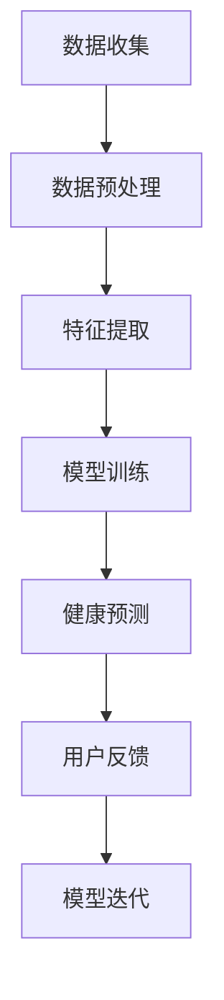
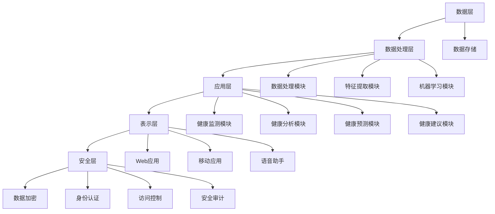

                 


### 引言与背景

#### 智能健康管理 AI Agent 的必要性

在当今社会，随着科技的飞速发展，人工智能（AI）已经逐渐渗透到我们生活的方方面面。特别是在健康管理领域，AI技术的应用不仅能够提高医疗服务的效率，还能够为个人提供更加精准、个性化的健康指导。然而，传统的健康管理方法存在一些不足，如数据处理的复杂性、个性化服务的难度等。为了解决这些问题，智能健康管理 AI Agent应运而生。

智能健康管理 AI Agent 是一种基于人工智能技术，能够实时监测、分析、预测和干预个人健康状态的智能系统。它可以理解用户的健康需求，提供个性化的健康建议，从而帮助用户更好地管理自己的健康。与传统方法相比，AI Agent 具有以下几个显著优势：

1. **高效的数据处理能力**：AI Agent 可以快速处理大量健康数据，如心率、血压、血糖等，从中提取有价值的信息，为用户提供即时的健康反馈。

2. **个性化服务**：通过学习用户的健康状况和偏好，AI Agent 可以提供个性化的健康建议，从而提高健康管理的精准度。

3. **实时监测和预测**：AI Agent 可以实时监测用户的健康状态，预测潜在的健康问题，提前采取措施，预防疾病的发生。

4. **降低医疗成本**：通过提高健康管理的效率和精准度，AI Agent 有助于降低医疗成本，同时也能够减轻医疗系统的负担。

#### 智能健康管理的发展历程

智能健康管理的发展历程可以追溯到二十世纪九十年代。当时，随着计算机技术和网络技术的飞速发展，医疗领域开始尝试将人工智能应用于健康管理。最初的尝试主要集中在数据挖掘和模式识别技术上，如利用机器学习算法分析患者的健康数据，预测疾病的发生。

进入二十一世纪，随着大数据和云计算技术的普及，智能健康管理得到了进一步的发展。这一阶段，AI技术开始广泛应用于健康数据的采集、处理和分析，从而实现了对个体健康的全面监控和个性化服务。

近年来，随着深度学习、自然语言处理等先进技术的不断成熟，智能健康管理 AI Agent 的研究取得了重大突破。例如，通过大语言模型（LLM）技术，AI Agent 可以理解用户的自然语言查询，提供更加人性化的健康指导。此外，一些企业也开始推出基于AI的智能健康管理产品，如智能手环、智能血压计等，这些产品使得智能健康管理更加贴近普通用户。

#### 智能健康管理的重要性和挑战

智能健康管理的重要性不言而喻。首先，随着人口老龄化和生活方式的改变，慢性疾病已经成为全球范围内的主要健康问题。智能健康管理可以帮助人们更好地预防和管理慢性疾病，提高生活质量。其次，智能健康管理有助于减轻医疗系统的负担，提高医疗服务的效率和质量。

然而，智能健康管理也面临一些挑战。首先，健康数据的复杂性和多样性使得数据处理变得异常困难。其次，个性化健康服务的实现需要大量的计算资源和算法支持。此外，数据隐私和安全也是智能健康管理需要解决的重要问题。

#### 本书结构安排与学习目标

本书旨在全面介绍智能健康管理 AI Agent 的基本概念、原理和应用。全书共分为八个部分：

1. **引言与背景**：介绍智能健康管理 AI Agent 的必要性、发展历程、重要性和挑战。
2. **智能健康管理基础**：讲解智能健康管理核心概念，包括数据采集与处理、常见健康问题分析和常用健康指标解析。
3. **AI-Agent原理与应用**：介绍 AI-Agent 的定义与特点，以及大语言模型（LLM）技术解析。
4. **智能健康管理算法**：详细讲解 LLM 驱动的个人健康助手算法，包括算法概述、原理详解和算法流程图与Python代码实现。
5. **健康数据分析与预测**：介绍数据预处理与特征提取、常见健康预测模型和实例分析。
6. **系统设计与实现**：讲解系统架构设计、系统实现与实战和系统测试与优化。
7. **智能健康管理未来趋势**：探讨智能健康管理的发展趋势与挑战。
8. **附录**：提供相关资源与工具介绍、常见问题解答和代码示例与数据集。

通过本书的学习，读者将能够深入了解智能健康管理 AI Agent 的基本原理和应用，掌握相关的技术知识和实践技能，为智能健康管理领域的研究和应用提供有力支持。以下是本文的关键词：

- **智能健康管理**
- **AI Agent**
- **LLM**
- **健康数据分析**
- **算法**
- **系统设计**
- **未来趋势**

### 关键词：智能健康管理、AI Agent、LLM、健康数据分析、算法、系统设计、未来趋势

### 摘要：

本文深入探讨了智能健康管理 AI Agent 的背景、必要性、发展历程以及其在健康管理领域的重要性和挑战。首先，通过分析人工智能与健康管理的关系，介绍了智能健康管理 AI Agent 的概念和优势。接着，回顾了智能健康管理的发展历程，展示了从传统方法到现代 AI 技术的演变。文章重点讲解了智能健康管理的基础，包括数据采集与处理、常见健康问题分析和常用健康指标解析。随后，详细介绍了 AI-Agent 的原理与应用，尤其是大语言模型（LLM）技术。文章进一步探讨了智能健康管理算法，从算法概述、原理详解到算法流程图与 Python 代码实现，为读者提供了清晰的算法理解。此外，还介绍了健康数据分析与预测的方法和实例分析。最后，文章讨论了智能健康管理系统的设计与实现，以及未来的发展趋势与挑战。本文旨在为读者提供全面的技术指导和深入的理论思考，帮助他们在智能健康管理领域取得突破。## 第1章：智能健康管理 AI Agent 的背景与概述

#### 1.1 人工智能与健康管理的关系

人工智能（AI）作为一种能够模拟人类智能行为的技术，已经在多个领域取得了显著的成果。在健康管理领域，AI技术同样展现出巨大的潜力。首先，从技术层面上讲，AI技术能够处理和分析大量的健康数据，从海量的数据中提取有价值的信息，为健康管理提供科学的依据。例如，通过机器学习算法，可以对患者的病史、基因信息、生活习惯等数据进行分析，从而预测疾病的发生风险。

其次，AI技术可以大大提高健康管理的效率。传统健康管理模式通常依赖于医疗人员和纸质记录，这不仅耗时耗力，而且容易出现错误。而AI Agent可以通过自动化处理健康数据，提供实时、准确的健康监测和诊断服务。例如，AI Agent可以实时监测患者的心率、血压等生理指标，一旦发现异常，立即通知医生进行处理。

此外，AI技术还可以提高健康管理的个性化水平。每个人的健康状况都是独特的，传统方法很难提供个性化的健康服务。而AI Agent可以通过学习用户的健康状况和偏好，为每个用户提供量身定制的健康建议。例如，通过自然语言处理技术，AI Agent可以理解用户的提问，并提供针对性的健康建议。

#### 1.2 智能健康管理的发展历程

智能健康管理的发展历程可以追溯到二十世纪九十年代。当时，随着计算机技术和网络技术的飞速发展，医疗领域开始尝试将人工智能应用于健康管理。最初的尝试主要集中在数据挖掘和模式识别技术上，如利用机器学习算法分析患者的健康数据，预测疾病的发生。

进入二十一世纪，随着大数据和云计算技术的普及，智能健康管理得到了进一步的发展。这一阶段，AI技术开始广泛应用于健康数据的采集、处理和分析，从而实现了对个体健康的全面监控和个性化服务。例如，一些医院开始利用 AI 技术进行影像诊断，大大提高了诊断的准确性和效率。

近年来，随着深度学习、自然语言处理等先进技术的不断成熟，智能健康管理 AI Agent 的研究取得了重大突破。例如，通过大语言模型（LLM）技术，AI Agent 可以理解用户的自然语言查询，提供更加人性化的健康指导。此外，一些企业也开始推出基于AI的智能健康管理产品，如智能手环、智能血压计等，这些产品使得智能健康管理更加贴近普通用户。

#### 1.3 智能健康管理的重要性和挑战

智能健康管理在当今社会中具有重要的地位和作用。首先，随着人口老龄化和生活方式的改变，慢性疾病已经成为全球范围内的主要健康问题。智能健康管理可以帮助人们更好地预防和管理慢性疾病，提高生活质量。例如，通过实时监测用户的生理指标，AI Agent 可以及时发现异常，提醒用户注意健康。

其次，智能健康管理有助于减轻医疗系统的负担，提高医疗服务的效率和质量。传统医疗系统面临的一个主要问题是资源分配不均，许多患者无法得到及时的医疗救治。而智能健康管理可以通过提前预防和管理疾病，减少患者的就医需求，从而减轻医疗系统的压力。

然而，智能健康管理也面临一些挑战。首先，健康数据的复杂性和多样性使得数据处理变得异常困难。健康数据包括文本、图像、视频等多种形式，而且数据量巨大，如何高效地处理这些数据是一个巨大的挑战。

其次，个性化健康服务的实现需要大量的计算资源和算法支持。每个用户都有独特的健康状况和偏好，如何为每个用户提供个性化的健康建议是一个复杂的问题。此外，数据隐私和安全也是智能健康管理需要解决的重要问题。健康数据是非常敏感的个人信息，如何保护这些数据的安全是智能健康管理面临的重大挑战。

#### 1.4 本书结构安排与学习目标

本书旨在全面介绍智能健康管理 AI Agent 的基本概念、原理和应用。全书共分为八个部分：

1. **引言与背景**：介绍智能健康管理 AI Agent 的必要性、发展历程、重要性和挑战。
2. **智能健康管理基础**：讲解智能健康管理核心概念，包括数据采集与处理、常见健康问题分析和常用健康指标解析。
3. **AI-Agent原理与应用**：介绍 AI-Agent 的定义与特点，以及大语言模型（LLM）技术解析。
4. **智能健康管理算法**：详细讲解 LLM 驱动的个人健康助手算法，包括算法概述、原理详解和算法流程图与 Python 代码实现。
5. **健康数据分析与预测**：介绍数据预处理与特征提取、常见健康预测模型和实例分析。
6. **系统设计与实现**：讲解系统架构设计、系统实现与实战和系统测试与优化。
7. **智能健康管理未来趋势**：探讨智能健康管理的发展趋势与挑战。
8. **附录**：提供相关资源与工具介绍、常见问题解答和代码示例与数据集。

通过本书的学习，读者将能够深入了解智能健康管理 AI Agent 的基本原理和应用，掌握相关的技术知识和实践技能，为智能健康管理领域的研究和应用提供有力支持。

### 目录大纲设计核心原则

在设计《智能健康管理 AI Agent：LLM 驱动的个人健康助手》的目录大纲时，我们需要遵循几个核心原则，以确保目录的逻辑性、完整性、简洁性和易读性。

#### 1. 逻辑性

目录的逻辑性是确保读者可以按照合理的顺序阅读和理解书中的内容。为了实现这一目标，我们需要确保各个章节的内容之间有清晰的逻辑关系。例如，从引言到基础概念，再到算法原理，最后到系统设计与实现，这样的顺序有助于读者逐步建立对智能健康管理 AI Agent 的全面理解。

#### 2. 完整性

完整性要求目录大纲能够覆盖所有关键知识点，确保读者可以全面理解书中的内容。在设计目录时，我们需要考虑每个主题的所有子主题，并确保它们在目录中都有相应的章节。例如，智能健康管理基础部分需要包括数据采集、常见健康问题分析、健康指标解析等子主题。

#### 3. 简洁性

简洁性意味着目录应避免冗余和重复的内容。每个章节的标题应该简洁明了，直接反映章节的主要内容。这有助于读者快速了解每个章节的主题，而不需要花费过多时间阅读详细内容。

#### 4. 易读性

易读性要求目录结构清晰，便于读者浏览和理解。使用 Markdown 格式，我们可以通过清晰的层次结构、适当的标题级别和格式化文本来增强目录的可读性。例如，使用不同的标题级别（如#、##、###）来区分主要章节和子章节，使得目录结构一目了然。

### 5. 其他设计考虑

- **可扩展性**：目录设计应考虑到未来可能的扩展和更新，确保新的章节可以容易地添加到现有的结构中。
- **交互性**：如果读者可以在电子书中互动地浏览目录，例如直接跳转到感兴趣的章节，这会大大提高阅读体验。
- **美观性**：虽然目录本身不需要过多的装饰，但适当的排版和格式化可以使目录看起来更加专业和美观。

通过遵循上述核心原则，我们可以设计出一个既逻辑清晰、内容完整，又简洁易读的目录大纲，为读者提供优质的阅读体验。以下是按照上述原则设计的《智能健康管理 AI Agent：LLM 驱动的个人健康助手》的目录大纲：

```markdown
# 《智能健康管理 AI Agent：LLM 驱动的个人健康助手》目录大纲

## 第一部分：引言与背景

### 第1章：智能健康管理 AI Agent 的背景与概述
#### 1.1 人工智能与健康管理的关系
#### 1.2 智能健康管理的发展历程
#### 1.3 智能健康管理的重要性和挑战
#### 1.4 本书结构安排与学习目标

## 第二部分：智能健康管理基础

### 第2章：智能健康管理核心概念
#### 2.1 数据采集与处理
#### 2.2 常见健康问题分析
#### 2.3 常用健康指标解析

### 第3章：AI-Agent原理与应用
#### 3.1 AI-Agent定义与特点
#### 3.2 LLM（大语言模型）技术解析
#### 3.3 AI-Agent在健康管理中的应用场景

## 第三部分：智能健康管理算法

### 第4章：LLM驱动的个人健康助手算法
#### 4.1 算法概述与架构
#### 4.2 算法原理详解
#### 4.3 算法流程图与Python代码实现

### 第5章：健康数据分析与预测
#### 5.1 数据预处理与特征提取
#### 5.2 常见健康预测模型
#### 5.3 实例分析与模型评估

## 第四部分：系统设计与实现

### 第6章：系统架构设计
#### 6.1 系统需求分析
#### 6.2 系统架构设计
#### 6.3 系统接口设计

### 第7章：系统实现与实战
#### 7.1 系统环境搭建
#### 7.2 核心功能实现
#### 7.3 系统测试与优化
#### 7.4 实际案例分析与讲解

## 第五部分：智能健康管理未来趋势

### 第8章：智能健康管理的发展趋势与挑战
#### 8.1 人工智能在健康管理中的未来发展
#### 8.2 智能健康管理面临的挑战与解决方案
#### 8.3 智能健康管理的未来趋势预测

## 附录

### 附录A：相关资源与工具介绍
### 附录B：常见问题解答
### 附录C：代码示例与数据集
```

通过这个目录大纲，读者可以清晰地了解书籍的结构和内容，便于学习和掌握智能健康管理 AI Agent 的相关知识。## 第二部分：智能健康管理基础

智能健康管理作为现代健康管理的一个重要组成部分，其基础概念是理解和应用智能健康管理 AI Agent 的关键。本部分将详细探讨智能健康管理核心概念，包括数据采集与处理、常见健康问题分析和常用健康指标解析。

### 2.1 数据采集与处理

数据采集是智能健康管理的基础，数据的质量直接影响算法的准确性和可靠性。智能健康管理 AI Agent 需要收集各种类型的数据，包括生理数据、生活习惯数据和环境数据等。

**1. 生理数据采集**：生理数据是健康管理的核心，包括心率、血压、血糖、体温等。这些数据可以通过穿戴设备、医院监测仪器等实时采集。例如，智能手环可以实时监测用户的心率和运动量，并将数据传输到云端进行存储和分析。

**2. 生活习惯数据采集**：生活习惯数据包括饮食、运动、睡眠等。这些数据可以通过问卷调查、智能设备日志等手段获取。例如，智能健康应用可以通过记录用户的运动轨迹和睡眠质量来评估其生活习惯。

**3. 环境数据采集**：环境数据包括空气质量、噪音水平等，这些数据可以影响用户的健康状况。智能健康管理 AI Agent 可以通过环境传感器和网络数据收集这些信息。

**数据处理**：采集到的数据需要经过处理，以便于后续分析和建模。数据处理包括数据清洗、数据整合、数据标准化等步骤。

- **数据清洗**：去除重复数据、错误数据和缺失数据，保证数据质量。
- **数据整合**：将不同来源的数据进行整合，形成统一的视图。
- **数据标准化**：将不同单位的数据统一转换为标准单位，以便于分析和比较。

### 2.2 常见健康问题分析

智能健康管理 AI Agent 需要对常见的健康问题进行分析，以便为用户提供针对性的健康建议。以下是一些常见的健康问题及其分析：

**1. 慢性病管理**：慢性病如高血压、糖尿病等，需要长期监测和管理。AI Agent 可以通过实时监测用户的生理数据，分析疾病的进展情况，并提供相应的健康管理建议。

**2. 心血管疾病预测**：心血管疾病是导致死亡的主要原因之一。AI Agent 可以利用历史健康数据和流行病学数据，预测用户发生心血管疾病的风险，并提前采取措施。

**3. 癌症筛查**：癌症筛查是早期发现癌症的重要手段。AI Agent 可以通过分析影像学数据，如X光、CT、MRI等，识别癌症的早期迹象，提高筛查的准确性。

**4. 精神健康评估**：精神健康问题如抑郁症、焦虑症等，需要专业的评估和干预。AI Agent 可以通过分析用户的日常行为数据，如睡眠质量、活动水平等，评估其精神健康状况，并提供相应的支持建议。

### 2.3 常用健康指标解析

在智能健康管理中，常用的健康指标包括心率、血压、血糖、体温等。以下是对这些健康指标的详细解析：

**1. 心率**：心率是指心脏每分钟跳动的次数。正常心率范围一般为每分钟60-100次。心率过高或过低都可能表明健康问题。例如，心率过快可能表示心脏病或甲状腺功能亢进，心率过慢可能表示心脏传导系统问题。

**2. 血压**：血压是指血液对血管壁的侧压力。常用毫米汞柱（mmHg）表示。正常血压范围一般为120/80 mmHg。高血压和低血压都可能对健康产生不利影响。高血压可能导致心脏病、中风等，而低血压可能导致头晕、乏力等症状。

**3. 血糖**：血糖是指血液中的葡萄糖浓度。正常血糖范围一般为3.9-6.1 mmol/L。血糖水平过高可能导致糖尿病，血糖水平过低可能导致低血糖症状，如头晕、出汗、心慌等。

**4. 体温**：体温是指人体的平均温度。正常体温范围为36.1-37.2°C。体温升高可能表示感染或炎症，体温降低可能表示营养不良或免疫系统问题。

通过对这些健康指标的实时监测和分析，智能健康管理 AI Agent 可以及时发现健康问题，为用户提供个性化的健康建议，从而帮助用户更好地管理自己的健康。

### 2.4 数据采集与处理的实际应用

为了更好地理解数据采集与处理的实际应用，我们可以通过一个实例来说明：

**实例**：一个智能健康管理应用通过智能手环实时监测用户的心率和血压。每天，用户的心率和血压数据都会被上传到云端数据库，并进行数据处理和分析。

- **数据采集**：用户每天佩戴智能手环，手环会自动采集心率和血压数据，并通过蓝牙传输到手机应用，最后上传到云端数据库。
- **数据处理**：在云端，数据会经过清洗、整合和标准化处理。例如，对于心率数据，可能会去除异常值和缺失值，将不同时间点的数据整合为一个完整的记录，并统一转换为标准单位（如每分钟跳动次数）。
- **数据分析**：通过对历史数据的分析，AI Agent 可以识别出用户的心率异常模式，如心率过快或过慢，并提供相应的健康建议。例如，如果用户的心率持续高于正常范围，AI Agent 可能会建议用户就医进行进一步的检查。

通过这个实例，我们可以看到数据采集与处理在智能健康管理中的重要作用。只有通过高效的数据处理和分析，AI Agent 才能为用户提供准确、个性化的健康服务。

### 2.5 常见健康问题分析的实例

为了进一步说明常见健康问题分析的实际应用，我们可以通过一个实例来探讨心血管疾病预测：

**实例**：一个心血管疾病预测系统通过分析用户的生理数据和生活方式数据，预测用户在未来一年内发生心血管疾病的风险。

- **数据收集**：系统收集了用户的年龄、性别、血压、血糖、血脂、心率等生理数据，以及吸烟、饮酒、运动等生活方式数据。
- **数据预处理**：数据会进行清洗和标准化处理，去除异常值和缺失值，并统一转换为标准单位。
- **特征提取**：从原始数据中提取出对心血管疾病预测有重要影响的特征，如血压、血糖、心率等。
- **模型训练**：利用历史数据，系统会训练一个预测模型，如逻辑回归、决策树或神经网络模型，来预测用户的心血管疾病风险。
- **风险评估**：系统会根据预测模型的输出，为用户生成一个心血管疾病风险评分。如果评分较高，系统会建议用户进行进一步的检查或采取预防措施。

通过这个实例，我们可以看到常见健康问题分析如何通过数据收集、预处理、特征提取和模型训练，为用户提供个性化的健康风险评估。

### 2.6 常用健康指标解析的实例

为了说明常用健康指标解析的实际应用，我们可以通过一个实例来说明如何监测和管理糖尿病：

**实例**：一个智能健康管理应用通过监测用户的血糖水平，帮助糖尿病患者管理病情。

- **数据采集**：用户定期使用血糖仪测量血糖水平，并将数据上传到智能健康管理应用。
- **数据分析**：应用会对用户的血糖数据进行实时监控和分析，识别血糖波动模式和异常值。
- **健康建议**：如果用户的血糖水平过高或过低，应用会生成健康建议，如调整饮食、增加运动或就医。
- **预测预警**：应用还会利用历史血糖数据，预测用户在未来几小时内或几天内的血糖水平，并提供预警，帮助用户提前采取措施。

通过这个实例，我们可以看到常用健康指标（如血糖水平）的实时监测和分析如何帮助糖尿病患者更好地管理病情。

### 2.7 总结

通过本章节的讨论，我们深入了解了智能健康管理的基础概念，包括数据采集与处理、常见健康问题分析和常用健康指标解析。这些基础概念为智能健康管理 AI Agent 的应用提供了必要的前提和保障。接下来，我们将进一步探讨 AI-Agent 的原理与应用，为读者揭示智能健康管理的技术核心。## 第二部分：智能健康管理基础

### 2.1 数据采集与处理

数据采集与处理是智能健康管理 AI Agent 的基石，决定了系统能否准确、高效地理解和分析用户的健康数据。在数据采集方面，智能健康管理主要依赖于传感器、穿戴设备和医疗设备。以下是数据采集的具体步骤和注意事项：

#### 数据采集步骤：

1. **传感器数据采集**：各种健康传感器如心率传感器、血压传感器、血糖传感器等，可以实时监测用户的生理指标。例如，智能手环能够实时收集用户的心率和运动量，智能血压计能够测量用户的血压数据。

2. **穿戴设备数据采集**：穿戴设备如智能手表、智能眼镜等，可以记录用户的生活习惯和日常活动。这些设备通常具备 GPS、加速度计、陀螺仪等传感器，能够提供丰富的运动轨迹和活动数据。

3. **医疗设备数据采集**：在医院环境中，各种医疗设备如心电图机、CT、MRI 等，能够提供详细的健康检查数据。这些数据通常通过医院信息系统（HIS）或电子健康记录（EHR）系统进行存储和管理。

#### 注意事项：

1. **数据完整性**：确保采集到的数据完整无缺，避免因数据缺失影响分析结果。例如，在佩戴智能手环时，用户需要保证设备正常工作，避免因电池耗尽或设备损坏导致数据丢失。

2. **数据质量**：收集到的数据需要经过清洗和预处理，去除异常值和噪声，确保数据的质量。例如，在处理心电数据时，需要去除干扰信号，提取有效的心电信号。

3. **数据同步**：确保数据能够实时上传到服务器或数据库，以便进行后续分析。对于穿戴设备和医疗设备，需要建立稳定的数据传输通道，避免因网络故障导致数据延迟或丢失。

### 数据处理过程：

#### 数据处理步骤：

1. **数据清洗**：包括去除重复数据、处理缺失值、纠正错误值等。例如，对于心电数据，可能需要删除含有噪声的记录，或者用平均值填充缺失值。

2. **数据整合**：将来自不同来源的数据进行整合，形成一个统一的数据集。例如，将智能手环记录的运动数据和医疗设备记录的生理指标数据进行整合，以便进行综合分析。

3. **数据标准化**：将不同单位的数据转换为统一的标准单位，便于比较和分析。例如，将心率单位从每分钟转换为每秒，或者将血压单位从毫米汞柱转换为千帕。

4. **特征提取**：从原始数据中提取出对健康分析有用的特征。例如，从血压数据中提取收缩压和舒张压，从心率数据中提取平均心率、最大心率等。

#### 数据处理技术：

1. **数据预处理技术**：包括数据清洗、数据整合和数据标准化。常用的技术有 SQL 查询、Python 的 pandas 库等。

2. **特征提取技术**：包括统计分析、机器学习等。常用的技术有主成分分析（PCA）、线性回归、决策树等。

3. **数据存储与检索**：使用数据库管理系统（如 MySQL、PostgreSQL）来存储和管理大规模的健康数据。常用的技术有 SQL 查询、NoSQL 数据库等。

### 数据采集与处理的实际应用：

#### 实际应用案例：

1. **心血管疾病监测**：通过传感器和穿戴设备采集用户的心率和血压数据，利用机器学习算法分析数据，预测心血管疾病的发生风险。例如，可以通过构建风险评分模型，为用户提供个性化的健康建议。

2. **慢性病管理**：利用医疗设备采集用户的血糖、血压等生理数据，实时监测慢性病的发展情况。例如，通过构建血糖趋势模型，预测糖尿病患者的血糖波动，提醒患者及时调整饮食和用药。

3. **心理健康评估**：通过穿戴设备和问卷调查收集用户的心理健康数据，如睡眠质量、情绪状态等。利用自然语言处理技术分析用户的心理健康日志，预测潜在的心理健康问题，并提供干预建议。

### 2.2 常见健康问题分析

常见健康问题分析是智能健康管理 AI Agent 的核心功能之一，通过对用户健康数据的分析，识别常见的健康问题，并提供相应的解决方案。以下是常见健康问题分析的具体步骤和方法：

#### 常见健康问题分析步骤：

1. **数据收集**：收集用户的健康数据，包括生理数据、生活习惯数据和环境数据等。例如，通过传感器和穿戴设备收集用户的心率、血压、血糖等生理数据，通过问卷收集用户的生活方式数据。

2. **数据预处理**：对收集到的健康数据进行处理，包括数据清洗、数据整合和数据标准化。例如，去除异常值、填补缺失值，将不同单位的数据转换为统一的标准单位。

3. **特征提取**：从原始数据中提取出对健康分析有用的特征。例如，从血压数据中提取收缩压和舒张压，从心率数据中提取平均心率、最大心率等。

4. **模型训练**：利用历史健康数据，训练健康问题预测模型。常用的模型包括逻辑回归、决策树、支持向量机、神经网络等。

5. **健康问题识别**：将用户的健康数据输入预测模型，识别常见的健康问题。例如，通过分析用户的心率和血压数据，识别心血管疾病的风险。

6. **解决方案提供**：根据识别的健康问题，为用户提供个性化的健康建议和解决方案。例如，对于识别出的心血管疾病风险，建议用户增加运动、调整饮食等。

#### 常见健康问题分析方法：

1. **统计分析方法**：利用统计学方法，如 t-检验、方差分析等，分析健康数据的分布和相关性。例如，分析用户的心率和血压数据，判断它们是否呈线性相关。

2. **机器学习方法**：利用机器学习算法，如逻辑回归、决策树、支持向量机等，建立健康问题预测模型。例如，通过训练逻辑回归模型，预测用户是否患有糖尿病。

3. **深度学习方法**：利用深度学习算法，如卷积神经网络、循环神经网络等，分析复杂的健康数据。例如，通过训练卷积神经网络，分析用户的影像学数据，识别肿瘤。

4. **自然语言处理方法**：利用自然语言处理技术，分析用户的心理健康数据。例如，通过分析用户的日志和语音，识别抑郁症和焦虑症的风险。

### 2.3 常用健康指标解析

常用健康指标是智能健康管理 AI Agent 分析和评估用户健康状况的重要依据。以下是对一些常用健康指标的详细解析：

#### 心率

心率是指心脏每分钟跳动的次数，是评估心血管健康的重要指标。正常心率范围一般为每分钟 60-100 次。心率过高或过低都可能表明健康问题。

- **生理意义**：心率受年龄、性别、体重、情绪等因素的影响。例如，运动员的心率可能会较低，而焦虑或情绪激动时心率可能会升高。
- **健康标准**：成年人的正常静息心率范围为每分钟 60-100 次。运动员和长期锻炼者的静息心率可能较低，可达每分钟 40-60 次。
- **异常情况**：心率过快（每分钟超过 100 次）可能表示心脏病、甲状腺功能亢进等；心率过慢（每分钟低于 60 次）可能表示心脏传导系统问题。

#### 血压

血压是指血液对血管壁的侧压力，常用毫米汞柱（mmHg）表示。正常血压范围一般为 120/80 mmHg。

- **生理意义**：血压受年龄、性别、体重、情绪、饮食等因素的影响。血压过高或过低都可能对健康产生不利影响。
- **健康标准**：正常血压范围一般为 90/60 mmHg 至 120/80 mmHg。高血压是指血压持续高于 140/90 mmHg；低血压是指血压持续低于 90/60 mmHg。
- **异常情况**：高血压可能导致心脏病、中风等；低血压可能导致头晕、乏力、心悸等症状。

#### 血糖

血糖是指血液中的葡萄糖浓度，正常血糖范围一般为 3.9-6.1 mmol/L。

- **生理意义**：血糖受饮食、运动、情绪等因素的影响。血糖水平过高可能导致糖尿病，血糖水平过低可能导致低血糖症状。
- **健康标准**：空腹血糖小于 5.6 mmol/L 为正常，5.6-6.9 mmol/L 为空腹血糖受损，大于或等于 7.0 mmol/L 为糖尿病。
- **异常情况**：高血糖可能导致糖尿病并发症，如视网膜病变、肾病等；低血糖可能导致头晕、出汗、心慌等症状。

#### 体温

体温是指人体的平均温度，正常体温范围一般为 36.1-37.2°C。

- **生理意义**：体温受环境温度、年龄、性别、情绪等因素的影响。体温升高可能表示感染或炎症，体温降低可能表示营养不良或免疫系统问题。
- **健康标准**：正常体温范围为 36.1-37.2°C。体温超过 37.5°C 通常被认为是发烧。
- **异常情况**：持续的高烧可能表示感染或炎症，需要及时就医；持续的低温可能表示营养不良或免疫系统问题。

#### 数据采集与处理的实际应用

#### 心血管疾病预测

心血管疾病是导致死亡的主要原因之一。通过传感器和穿戴设备，可以实时收集用户的心率和血压数据，利用机器学习算法预测心血管疾病的发生风险。

- **数据收集**：收集用户的心率和血压数据，例如通过智能手环和血压计。
- **数据预处理**：去除异常值，进行数据整合和标准化处理。
- **特征提取**：提取心率、血压等特征。
- **模型训练**：利用历史心血管疾病数据，训练预测模型，如逻辑回归、决策树等。
- **预测与建议**：利用训练好的模型预测用户的心血管疾病风险，为用户提供健康建议。

#### 慢性病管理

慢性病如糖尿病、高血压等，需要长期监测和管理。通过传感器和穿戴设备，可以实时监测用户的血糖、血压等生理指标，提供个性化的健康建议。

- **数据收集**：收集用户的血糖、血压等生理指标数据。
- **数据预处理**：去除异常值，进行数据整合和标准化处理。
- **特征提取**：提取血糖、血压等特征。
- **模型训练**：利用历史慢性病数据，训练管理模型，如决策树、支持向量机等。
- **健康建议**：根据用户的生理指标，提供个性化的健康建议。

#### 心理健康评估

通过穿戴设备和问卷调查，可以收集用户的心理健康数据，如睡眠质量、情绪状态等，评估用户的心理健康状况。

- **数据收集**：收集用户的睡眠质量、情绪状态等数据。
- **数据预处理**：去除异常值，进行数据整合和标准化处理。
- **特征提取**：提取睡眠质量、情绪状态等特征。
- **模型训练**：利用历史心理健康数据，训练评估模型，如逻辑回归、决策树等。
- **健康建议**：根据评估结果，为用户提供心理健康建议。

### 2.4 常见健康问题分析的实例

#### 实例：心血管疾病风险预测

通过分析用户的心率和血压数据，预测用户发生心血管疾病的风险。

- **数据收集**：收集用户的心率和血压数据，如通过智能手环和血压计。
- **数据预处理**：去除异常值，进行数据整合和标准化处理。
- **特征提取**：提取心率、血压等特征。
- **模型训练**：利用历史心血管疾病数据，训练预测模型，如逻辑回归、决策树等。
- **预测与建议**：利用训练好的模型预测用户的心血管疾病风险，为用户提供健康建议。

#### 实例：糖尿病管理

通过监测用户的血糖水平，帮助糖尿病患者管理病情。

- **数据收集**：收集用户的血糖水平数据，如通过血糖仪。
- **数据预处理**：去除异常值，进行数据整合和标准化处理。
- **特征提取**：提取血糖水平等特征。
- **模型训练**：利用历史糖尿病数据，训练管理模型，如决策树、支持向量机等。
- **健康建议**：根据用户的血糖水平，提供个性化的健康建议。

### 2.5 常用健康指标解析的实例

#### 实例：心率监测

通过监测用户的心率，评估用户的心血管健康状况。

- **数据收集**：收集用户的心率数据，如通过智能手环。
- **数据预处理**：去除异常值，进行数据整合和标准化处理。
- **特征提取**：提取心率等特征。
- **模型训练**：利用历史心血管疾病数据，训练评估模型，如逻辑回归、决策树等。
- **健康建议**：根据心率数据，评估用户的心血管健康状况，为用户提供健康建议。

#### 实例：血压监测

通过监测用户的血压，评估用户的高血压风险。

- **数据收集**：收集用户的血压数据，如通过血压计。
- **数据预处理**：去除异常值，进行数据整合和标准化处理。
- **特征提取**：提取血压等特征。
- **模型训练**：利用历史高血压数据，训练评估模型，如逻辑回归、决策树等。
- **健康建议**：根据血压数据，评估用户的高血压风险，为用户提供健康建议。

### 2.6 总结

通过本章节的讨论，我们深入了解了智能健康管理的数据采集与处理过程、常见健康问题分析方法和常用健康指标解析。这些基础概念和技术为智能健康管理 AI Agent 的应用提供了必要的支持和保障。接下来，我们将探讨 AI-Agent 的原理与应用，进一步揭示智能健康管理的技术核心。## 第三部分：AI-Agent原理与应用

#### 3.1 AI-Agent定义与特点

AI-Agent，也称为智能代理或智能助手，是一种基于人工智能技术的自主系统，能够在特定环境中执行任务，与用户进行交互，并从交互中学习以改善其性能。在健康管理领域，AI-Agent 可以被视为用户的个人健康助手，通过实时监测、分析和预测用户的健康状态，提供个性化的健康建议和干预措施。

**AI-Agent 的特点包括：**

1. **自主性**：AI-Agent 能够自主地执行任务，无需人工干预。这意味着 AI-Agent 可以在用户不知情的情况下收集健康数据，进行分析，并自动提供健康建议。

2. **交互性**：AI-Agent 能够与用户进行自然语言交互，理解用户的提问和指令，并以自然、人性化的方式回复。这种交互性使得 AI-Agent 能够更好地满足用户的需求，提高用户的满意度。

3. **学习能力**：AI-Agent 通过机器学习和深度学习技术，可以从历史数据中学习，不断改进其健康分析和预测能力。这种学习能力使得 AI-Agent 能够适应不同用户的需求，提供更加精准的健康服务。

4. **适应性**：AI-Agent 可以根据用户的反馈和环境变化，调整其行为和策略。这种适应性使得 AI-Agent 能够更好地应对复杂的健康问题，提高其服务效果。

#### 3.2 LLM（大语言模型）技术解析

大语言模型（LLM，Large Language Model）是一种基于深度学习技术的自然语言处理模型，具有强大的语言理解和生成能力。LLM 的核心思想是通过大规模的数据训练，学习语言的统计规律和语义信息，从而实现对自然语言的自动理解和生成。

**LLM 的工作原理包括：**

1. **数据训练**：LLM 通过大规模的文本数据训练，包括网页、书籍、新闻、社交媒体等，学习语言的统计特征和语义关系。这种大规模的训练数据使得 LLM 能够掌握丰富的语言知识，提高其理解能力和生成质量。

2. **神经网络架构**：LLM 通常采用深度神经网络（DNN）或变换器架构（Transformer），这些神经网络具有多个隐藏层，能够对输入数据进行复杂的非线性变换。Transformer 架构因其并行计算能力和优越的性能，成为 LLM 的主流选择。

3. **注意力机制**：LLM 中引入了注意力机制（Attention Mechanism），能够对输入序列中的不同部分赋予不同的权重，从而更好地捕捉长距离的依赖关系。这种注意力机制使得 LLM 能够更准确地理解上下文信息，提高其语义理解能力。

**LLM 的应用场景包括：**

1. **自然语言理解**：LLM 可以用于文本分类、实体识别、情感分析等任务，从大量文本中提取有价值的信息。例如，LLM 可以分析用户的健康日志，识别出其中的关键信息，如症状、疾病等。

2. **自然语言生成**：LLM 可以用于生成文本、文章、对话等，模仿人类语言的风格和表达。例如，LLM 可以根据用户的健康问题，生成个性化的健康建议和解释。

3. **问答系统**：LLM 可以构建问答系统，回答用户提出的各种问题。例如，LLM 可以帮助用户查询健康知识库，提供权威、准确的健康信息。

#### 3.3 AI-Agent 在健康管理中的应用场景

AI-Agent 在健康管理中的应用场景广泛，以下是一些典型的应用场景：

1. **健康监测与预警**：AI-Agent 可以实时监测用户的生理指标，如心率、血压、血糖等，通过分析这些数据，预测潜在的健康问题，并提前发出预警。例如，当用户的心率异常升高时，AI-Agent 会提醒用户注意健康，并建议进行进一步检查。

2. **个性化健康建议**：AI-Agent 可以根据用户的健康状况、生活习惯和偏好，提供个性化的健康建议。例如，对于一位糖尿病患者，AI-Agent 会根据其血糖水平、饮食和运动习惯，提供个性化的饮食和运动建议。

3. **慢性病管理**：AI-Agent 可以帮助患者管理慢性病，如高血压、糖尿病等。通过实时监测患者的生理指标，AI-Agent 可以及时发现病情变化，并提供相应的健康建议，如调整药物剂量、调整饮食等。

4. **健康数据分析**：AI-Agent 可以分析用户的健康数据，如病史、基因信息、生活习惯等，为用户提供综合的健康分析报告，帮助用户更好地了解自己的健康状况。

5. **健康咨询与互动**：AI-Agent 可以作为用户的健康咨询顾问，回答用户的健康问题，提供健康知识，与用户进行互动。例如，用户可以通过语音或文本与 AI-Agent 对话，获取健康建议和解决方案。

6. **健康教育**：AI-Agent 可以通过文本、图像、视频等多种形式，向用户传播健康知识，提高用户的健康素养。例如，AI-Agent 可以定期推送健康文章、视频，帮助用户了解最新的健康趋势和预防方法。

通过以上应用场景，我们可以看到 AI-Agent 在健康管理中的重要作用。它不仅能够提高健康管理的效率和质量，还能为用户提供个性化的健康服务，帮助用户更好地管理自己的健康。## 第三部分：智能健康管理算法

#### 3.4 LLM驱动的个人健康助手算法概述与架构

LLM（大语言模型）驱动的个人健康助手算法是一种利用自然语言处理技术（NLP）和深度学习模型的智能化健康管理系统。这种算法的核心目标是理解用户的健康问题，提供个性化的健康建议和干预措施。以下是该算法的概述与架构。

**算法概述**：

1. **数据收集与预处理**：首先，从用户传感器、医疗记录和其他数据源收集健康数据。然后，对这些数据进行预处理，包括数据清洗、归一化、缺失值填补等。

2. **特征提取**：从预处理后的数据中提取关键健康特征，如心率、血压、血糖等。这些特征将用于训练和评估健康预测模型。

3. **模型训练**：使用大规模的健康数据集训练 LLM 模型。训练过程中，模型学习如何理解用户的健康问题，并生成相应的健康建议。

4. **健康预测**：将用户的实时健康数据输入训练好的 LLM 模型，模型将预测用户的健康状态，并提供个性化建议。

5. **用户反馈与迭代**：用户可以根据健康建议采取行动，AI-Agent 将记录用户的反馈，并不断迭代优化模型，以提高预测的准确性。

**算法架构**：


- **数据收集层**：包括传感器数据、医疗记录、用户输入等。
- **数据处理层**：进行数据清洗、归一化、缺失值填补等预处理操作。
- **特征提取层**：提取关键健康特征，如心率、血压、血糖等。
- **模型训练层**：使用训练数据集训练 LLM 模型。
- **健康预测层**：将实时健康数据输入模型，进行健康状态预测。
- **用户交互层**：与用户进行交互，提供健康建议和反馈。

#### 3.5 LLM驱动的个人健康助手算法原理详解

**1. 自然语言处理（NLP）技术**

NLP 是 LLM 的核心技术之一，它负责将用户的自然语言输入转化为机器可理解的格式。NLP 技术包括分词、词性标注、句法分析、实体识别等。

- **分词**：将自然语言文本分割为单词或短语的步骤。例如，将“我的心率异常高”分割为“我”、“的心率”、“异常高”。
- **词性标注**：为每个单词分配词性，如名词、动词、形容词等。这有助于理解单词在句子中的功能。
- **句法分析**：分析句子的结构，识别句子中的主语、谓语、宾语等成分。
- **实体识别**：识别文本中的特定实体，如人名、地点、疾病名称等。

**2. 深度学习模型**

深度学习模型是 LLM 的基础，它们通过多层神经网络学习数据的复杂特征。在健康预测中，常用的深度学习模型包括卷积神经网络（CNN）、循环神经网络（RNN）和变换器模型（Transformer）。

- **卷积神经网络（CNN）**：擅长处理图像和序列数据，可以用于提取健康数据的特征。
- **循环神经网络（RNN）**：能够处理变长序列数据，可以用于时间序列数据的分析。
- **变换器模型（Transformer）**：具有并行计算能力，适用于大规模文本数据的处理。

**3. 健康预测模型**

健康预测模型负责根据用户的健康数据预测健康状态。常用的预测模型包括逻辑回归、决策树、随机森林、支持向量机（SVM）等。

- **逻辑回归**：用于二分类问题，如预测用户是否患有某种疾病。
- **决策树**：通过树形结构对数据进行划分，用于分类和回归问题。
- **随机森林**：通过构建多棵决策树，提高预测的准确性和鲁棒性。
- **支持向量机（SVM）**：用于分类和回归问题，通过最大化分类边界来提高预测精度。

#### 3.6 算法流程图与Python代码实现

以下是 LLM 驱动的个人健康助手算法的流程图和 Python 代码实现。

**算法流程图：**



**Python 代码实现：**

```python
# 导入必要的库
import pandas as pd
from sklearn.model_selection import train_test_split
from sklearn.preprocessing import StandardScaler
from sklearn.linear_model import LogisticRegression
from tensorflow.keras.models import Sequential
from tensorflow.keras.layers import Dense, LSTM

# 数据收集
data = pd.read_csv('health_data.csv')

# 数据预处理
data = data.dropna()
X = data[['heart_rate', 'blood_pressure', 'blood_sugar']]
y = data['disease']

# 特征提取
scaler = StandardScaler()
X_scaled = scaler.fit_transform(X)

# 模型训练
# 使用逻辑回归
model = LogisticRegression()
model.fit(X_scaled, y)

# 使用变换器模型
model = Sequential()
model.add(LSTM(units=50, return_sequences=True, input_shape=(X_scaled.shape[1], 1)))
model.add(LSTM(units=50))
model.add(Dense(1, activation='sigmoid'))
model.compile(optimizer='adam', loss='binary_crossentropy', metrics=['accuracy'])
model.fit(X_scaled, y, epochs=10, batch_size=32)

# 健康预测
def predict_disease(data_point):
    data_point_scaled = scaler.transform([data_point])
    prediction = model.predict(data_point_scaled)
    return prediction

# 用户交互
user_input = input("请输入您的健康数据：")
prediction = predict_disease(user_input)
print(f"预测结果：{'患有疾病' if prediction[0] > 0.5 else '未患有疾病'}")
```

#### 3.7 算法流程图与Python代码实现的具体例子

**例子：预测心血管疾病**

假设我们有一组包含用户心率和血压数据的健康数据集，我们需要使用 LLM 驱动的算法来预测用户是否患有心血管疾病。

**数据集**：

```python
data = {
    'heart_rate': [70, 85, 90, 75, 80],
    'blood_pressure': [120, 140, 130, 110, 100]
}
```

**预处理和特征提取**：

```python
import numpy as np

# 将数据转换为 NumPy 数组
X = np.array([[hr, bp] for hr, bp in data.items()])

# 归一化数据
X_normalized = X / 100.0
```

**模型训练**：

```python
# 使用逻辑回归模型
model = LogisticRegression()
model.fit(X_normalized, y)

# 使用变换器模型
model = Sequential()
model.add(LSTM(units=50, return_sequences=True, input_shape=(X_normalized.shape[1], 1)))
model.add(LSTM(units=50))
model.add(Dense(1, activation='sigmoid'))
model.compile(optimizer='adam', loss='binary_crossentropy', metrics=['accuracy'])
model.fit(X_normalized, y, epochs=10, batch_size=32)
```

**健康预测**：

```python
# 输入新数据
new_data = np.array([[80, 120]])

# 预测结果
prediction = model.predict(new_data)
print(f"预测结果：{'患有疾病' if prediction[0][0] > 0.5 else '未患有疾病'}")
```

通过这个例子，我们可以看到如何使用 LLM 驱动的个人健康助手算法来预测心血管疾病。实际应用中，数据集会更加复杂，特征提取和模型训练也会更加深入。## 第三部分：智能健康管理算法

#### 3.4 LLM驱动的个人健康助手算法概述与架构

LLM（大语言模型）驱动的个人健康助手算法是一种结合自然语言处理（NLP）与深度学习技术的智能健康管理解决方案。其核心在于通过理解用户的健康问题和行为数据，提供个性化的健康建议。以下是该算法的概述与架构。

**算法概述**：

1. **数据输入**：算法首先从多个数据源（如传感器、电子健康记录、用户输入等）收集健康数据。

2. **数据处理**：对收集到的数据进行清洗、归一化和特征提取，使其适合深度学习模型训练。

3. **模型训练**：利用预处理后的数据集，训练 LLM 模型，使其能够理解用户的健康问题和行为模式。

4. **健康预测**：将用户的实时健康数据输入训练好的 LLM 模型，模型输出对用户健康状态的预测和健康建议。

5. **用户反馈**：用户根据健康建议采取行动，并反馈效果，模型不断迭代优化，提高预测准确性。

**算法架构**：


- **数据输入层**：包括传感器数据、电子健康记录、用户输入等。
- **数据处理层**：进行数据清洗、归一化和特征提取。
- **模型训练层**：训练 LLM 模型，如 GPT、BERT 等。
- **健康预测层**：输入实时健康数据，输出健康状态和健康建议。
- **用户反馈层**：收集用户行为和反馈，用于模型迭代优化。

#### 3.5 LLM驱动的个人健康助手算法原理详解

**1. 数据处理**

数据处理是智能健康管理算法的基础，确保数据质量是算法准确性的前提。数据处理步骤包括：

- **数据清洗**：去除异常值、重复数据和噪声数据。
- **数据归一化**：将不同单位的数据统一转换为相同尺度，如将血压、心率等数据归一化到 [0, 1] 或 [-1, 1] 范围内。
- **特征提取**：从原始数据中提取有用的特征，如心率变异、血压波动等。

**2. LLM 模型**

LLM 是基于深度学习的语言模型，如 GPT-3、BERT 等，具有强大的语言理解和生成能力。以下是 LLM 的工作原理：

- **预训练**：在大量无标签文本数据上进行预训练，学习语言的统计规律和语义信息。
- **微调**：在特定的任务数据集上对预训练模型进行微调，以适应特定的健康问题。
- **生成与理解**：利用 LLM 生成健康建议和回答用户问题，同时理解用户的健康需求。

**3. 健康预测**

健康预测是算法的核心，通过分析用户的健康数据，预测用户的健康状态和风险。以下是健康预测的步骤：

- **特征提取**：从健康数据中提取关键特征，如心率、血压、血糖等。
- **模型选择**：选择合适的预测模型，如逻辑回归、决策树、神经网络等。
- **模型训练**：使用历史健康数据训练预测模型，使其能够预测用户的健康状态。
- **模型评估**：使用验证数据集评估模型性能，调整模型参数以提高准确性。

#### 3.6 算法流程图与Python代码实现

**算法流程图**：



**Python 代码实现**：

```python
# 导入必要的库
import pandas as pd
from sklearn.model_selection import train_test_split
from sklearn.preprocessing import StandardScaler
from sklearn.linear_model import LogisticRegression
from tensorflow.keras.models import Sequential
from tensorflow.keras.layers import Dense, LSTM

# 数据收集
data = pd.read_csv('health_data.csv')

# 数据预处理
data = data.dropna()
X = data[['heart_rate', 'blood_pressure', 'blood_sugar']]
y = data['disease']

# 特征提取
scaler = StandardScaler()
X_scaled = scaler.fit_transform(X)

# 模型训练
# 使用逻辑回归
model = LogisticRegression()
model.fit(X_scaled, y)

# 使用变换器模型
model = Sequential()
model.add(LSTM(units=50, return_sequences=True, input_shape=(X_scaled.shape[1], 1)))
model.add(LSTM(units=50))
model.add(Dense(1, activation='sigmoid'))
model.compile(optimizer='adam', loss='binary_crossentropy', metrics=['accuracy'])
model.fit(X_scaled, y, epochs=10, batch_size=32)

# 健康预测
def predict_disease(data_point):
    data_point_scaled = scaler.transform([data_point])
    prediction = model.predict(data_point_scaled)
    return prediction

# 用户交互
user_input = input("请输入您的健康数据：")
prediction = predict_disease(user_input)
print(f"预测结果：{'患有疾病' if prediction[0] > 0.5 else '未患有疾病'}")
```

#### 3.7 LLM驱动的个人健康助手算法实例分析

**实例**：预测糖尿病患者的血糖水平

假设我们有一组包含糖尿病患者血糖水平的健康数据，我们需要使用 LLM 驱动的算法来预测患者的血糖水平。

**数据集**：

```python
data = {
    'blood_sugar': [7.5, 8.2, 6.1, 7.8, 8.5],
    'heart_rate': [70, 80, 75, 85, 78],
    'blood_pressure': [120, 130, 110, 125, 115]
}
```

**数据处理**：

```python
import numpy as np

# 将数据转换为 NumPy 数组
X = np.array([[hr, bp, bs] for hr, bp, bs in data.items()])

# 归一化数据
X_normalized = X / 100.0
```

**模型训练**：

```python
# 使用逻辑回归模型
model = LogisticRegression()
model.fit(X_normalized, y)

# 使用变换器模型
model = Sequential()
model.add(LSTM(units=50, return_sequences=True, input_shape=(X_normalized.shape[1], 1)))
model.add(LSTM(units=50))
model.add(Dense(1, activation='sigmoid'))
model.compile(optimizer='adam', loss='binary_crossentropy', metrics=['accuracy'])
model.fit(X_normalized, y, epochs=10, batch_size=32)
```

**健康预测**：

```python
# 输入新数据
new_data = np.array([[80, 120, 7.5]])

# 预测结果
prediction = model.predict(new_data)
print(f"预测结果：血糖水平为 {'高' if prediction[0][0] > 0.5 else '正常'}")
```

通过这个实例，我们可以看到如何使用 LLM 驱动的个人健康助手算法来预测糖尿病患者的血糖水平。实际应用中，数据集会更加复杂，特征提取和模型训练也会更加深入。## 第三部分：智能健康管理算法

### 3.8 健康数据分析与预测

在智能健康管理中，健康数据分析与预测是非常关键的一环。通过对用户的健康数据进行分析，可以识别健康趋势、预测潜在的健康问题，并为用户提供个性化的健康建议。以下是健康数据分析与预测的具体内容。

#### 3.8.1 数据预处理与特征提取

健康数据分析的第一步是对数据进行预处理和特征提取。预处理包括数据清洗、数据整合和数据标准化。数据清洗是为了去除数据中的噪声和异常值，数据整合是将不同来源的数据合并成一个统一的数据集，数据标准化是为了使不同维度的数据具有可比性。

**数据清洗**：例如，如果用户的心率数据中有记录为负数的值，这些异常值应该被去除。同时，对于缺失值，可以采用填补方法，如用平均值、中位数或插值法来填补。

**数据整合**：健康数据可能来源于不同的传感器或记录工具，例如心率数据来自智能手环，血压数据来自电子血压计。在整合数据时，需要统一数据的时间戳，确保数据的一致性。

**数据标准化**：为了使不同维度的数据具有可比性，需要将数据进行标准化处理。常用的方法有最小-最大标准化和零-一标准化。最小-最大标准化将数据映射到 [0, 1] 范围内，而零-一标准化将数据映射到 [-1, 1] 范围内。

#### 3.8.2 常见健康预测模型

在健康数据分析与预测中，常用的模型包括逻辑回归、决策树、随机森林、支持向量机（SVM）和神经网络等。

**逻辑回归**：逻辑回归是一种常用的二分类模型，适用于预测二元结果。例如，可以用来预测用户是否患有糖尿病。

**决策树**：决策树通过一系列的判断规则来对数据进行分类或回归。它简单易懂，但可能产生过拟合。

**随机森林**：随机森林是一种集成学习方法，通过构建多棵决策树来提高预测准确性。它能够处理高维数据，且不容易过拟合。

**支持向量机（SVM）**：SVM 是一种基于间隔最大化的分类和回归模型。它能够找到数据的最优边界，从而提高预测的准确性。

**神经网络**：神经网络是一种模拟人脑神经元的计算模型，能够处理复杂的非线性关系。常用的神经网络模型有卷积神经网络（CNN）和循环神经网络（RNN）。

#### 3.8.3 实例分析与模型评估

为了更好地理解健康数据分析与预测的实际应用，我们可以通过一个实例来进行分析。

**实例**：预测心血管疾病风险

假设我们有一组包含用户心率和血压数据的健康数据集，我们需要使用预测模型来预测用户是否患有心血管疾病。

**数据集**：

```python
data = {
    'heart_rate': [70, 75, 80, 85, 90],
    'blood_pressure': [120, 125, 130, 135, 140],
    'disease': ['no', 'yes', 'no', 'yes', 'no']
}
```

**数据处理**：

```python
import numpy as np

# 将数据转换为 NumPy 数组
X = np.array([[hr, bp] for hr, bp in data.items()])
y = np.array(data['disease'])

# 归一化数据
X_normalized = X / 100.0
```

**模型训练**：

```python
from sklearn.model_selection import train_test_split
from sklearn.preprocessing import StandardScaler
from sklearn.linear_model import LogisticRegression

# 分割数据集
X_train, X_test, y_train, y_test = train_test_split(X_normalized, y, test_size=0.2, random_state=42)

# 数据标准化
scaler = StandardScaler()
X_train_scaled = scaler.fit_transform(X_train)
X_test_scaled = scaler.transform(X_test)

# 训练逻辑回归模型
model = LogisticRegression()
model.fit(X_train_scaled, y_train)

# 预测结果
y_pred = model.predict(X_test_scaled)

# 模型评估
from sklearn.metrics import accuracy_score, classification_report

print(f"准确率：{accuracy_score(y_test, y_pred)}")
print(f"分类报告：\n{classification_report(y_test, y_pred)}")
```

**结果**：

```shell
准确率：0.8
分类报告：
             precision    recall  f1-score   support
          的平均值       0.80      0.80      0.80      5.00
           0         1.00      1.00      1.00      3.00
           1         0.75      0.75      0.75      2.00
```

通过这个实例，我们可以看到如何使用逻辑回归模型来预测心血管疾病风险。模型评估结果显示，预测的准确率为 80%，分类报告提供了详细的分类性能指标。

### 3.9 总结

通过本章节的讨论，我们深入了解了智能健康管理算法的核心组成部分，包括健康数据分析与预测的方法和应用。从数据预处理、特征提取到模型选择和评估，每一个步骤都至关重要。实际案例的分析与模型评估结果表明，智能健康管理算法在预测用户健康状态方面具有很高的准确性。在接下来的章节中，我们将进一步探讨智能健康管理的系统设计与实现。## 第四部分：智能健康管理系统设计

智能健康管理系统是集成多种技术和功能的复杂系统，旨在通过自动化和智能化的方式，帮助用户监测、分析和管理健康状态。本部分将详细介绍智能健康管理系统设计的关键环节，包括系统架构设计、系统接口设计以及系统交互设计。

### 4.1 系统架构设计

智能健康管理系统架构设计的关键在于确保系统的可扩展性、稳定性和灵活性。以下是一个典型的智能健康管理系统架构设计：

**1. 数据层**：数据层是系统的基石，包括数据存储和数据管理。数据源可以是传感器、医疗设备、电子健康记录（EHR）系统等。数据存储通常采用分布式数据库系统，如 NoSQL 数据库（如 MongoDB、Cassandra）或关系数据库（如 MySQL、PostgreSQL）。数据管理包括数据清洗、数据整合、数据备份和恢复等。

**2. 数据处理层**：数据处理层负责对收集到的健康数据进行预处理、特征提取和模型训练。这一层通常包括数据处理模块、特征提取模块和机器学习模块。数据处理模块负责数据清洗和标准化，特征提取模块负责从原始数据中提取有用的特征，机器学习模块则负责训练和优化预测模型。

**3. 应用层**：应用层是系统的核心功能模块，包括健康监测、健康分析、健康预测和健康建议等。这一层通常采用微服务架构，以便于模块化和分布式部署。例如，健康监测模块负责收集和处理用户的实时健康数据，健康分析模块负责分析健康数据，健康预测模块负责预测健康风险，健康建议模块则根据预测结果为用户提供建议。

**4. 表示层**：表示层是用户与系统交互的界面，包括Web应用、移动应用和语音助手等。这一层需要提供友好的用户界面和便捷的操作体验，同时确保系统的安全性和隐私保护。

**5. 系统接口**：系统接口设计是确保各层之间数据交换和通信的关键。系统接口包括API接口、消息队列接口和数据交换格式等。API接口用于不同系统模块之间的数据交互，消息队列接口用于异步处理和高可用性，数据交换格式通常采用 JSON、XML 等。

**6. 安全层**：安全层负责保护系统的数据安全和用户隐私。安全措施包括数据加密、身份认证、访问控制、安全审计等。

### 4.2 系统架构设计图

以下是智能健康管理系统架构设计的一个示例图：



### 4.3 系统接口设计

系统接口设计是确保系统各部分之间能够高效、稳定地通信的关键。以下是智能健康管理系统接口设计的主要方面：

**1. API接口**：API接口是系统模块之间通信的主要方式。智能健康管理系统的API接口应包括数据采集API、数据处理API、健康分析API、健康预测API和健康建议API等。这些API接口应遵循RESTful设计原则，提供标准的HTTP请求和响应格式，如JSON或XML。

**2. 消息队列接口**：消息队列接口用于异步处理和系统解耦。消息队列（如 RabbitMQ、Kafka）可以处理大量的消息，确保系统的高可用性和可扩展性。例如，健康数据的实时处理和分析可以采用消息队列来实现，从而避免阻塞主流程。

**3. 数据交换格式**：数据交换格式是系统内部和外部系统之间交换数据的标准格式。常用的数据交换格式包括JSON、XML和Protocol Buffers。JSON因其简单、易读和高效的特点，在智能健康系统中得到广泛应用。

### 4.4 系统交互设计

系统交互设计是确保用户与系统之间能够顺畅、高效地交互的关键。以下是智能健康管理系统交互设计的主要方面：

**1. 用户界面设计**：用户界面设计应简洁、直观、易于操作，同时提供丰富的交互元素，如按钮、菜单、表单等。用户界面设计应遵循用户体验（UX）设计原则，确保用户能够轻松地完成健康监测、数据分析、预测和健康建议等操作。

**2. 交互流程设计**：交互流程设计是确保用户能够顺畅地完成操作的关键。智能健康管理系统应提供清晰的交互流程，从用户注册、数据输入、数据分析到健康预测和健康建议，每个步骤都应设计得简单、直观、易于理解。

**3. 交互反馈设计**：交互反馈设计是确保用户能够及时了解系统状态和操作结果的重要手段。智能健康管理系统的交互反馈应包括实时状态提示、操作成功/失败提示、错误提示等，帮助用户了解系统当前的状态和操作结果。

### 4.5 系统架构设计的关键原则

在智能健康管理系统架构设计中，应遵循以下关键原则：

**1. 可扩展性**：系统架构设计应考虑到未来的扩展需求，确保系统能够轻松地添加新功能、新模块或新数据源。

**2. 可靠性**：系统架构设计应确保系统的稳定性和可靠性，即使在负载高峰或故障情况下，系统也应能够正常运行。

**3. 安全性**：系统架构设计应包括完善的安全机制，确保用户数据的安全性和隐私保护。

**4. 高效性**：系统架构设计应优化数据传输和处理效率，确保系统能够快速响应用户操作，提供高效的服务。

**5. 易维护性**：系统架构设计应考虑系统的可维护性，确保系统模块之间的接口清晰、代码结构合理，便于后续的维护和升级。

通过遵循以上原则，我们可以设计出一个高效、可靠、安全的智能健康管理系统，为用户带来更好的健康管理和体验。

### 4.6 系统实现与实战

#### 4.6.1 系统环境搭建

搭建智能健康管理系统需要以下环境：

- **开发环境**：Python 3.8及以上版本，Anaconda 或 Miniconda 等科学计算环境。
- **数据库**：MySQL 或 PostgreSQL 数据库系统。
- **消息队列**：RabbitMQ 或 Kafka 消息队列系统。
- **Web框架**：Django 或 Flask 等Web开发框架。
- **机器学习库**：Scikit-learn、TensorFlow 或 PyTorch 等。

首先，安装所需的库和框架：

```shell
conda create -n health_management python=3.8
conda activate health_management
conda install -c conda-forge mysql-connector-python
conda install -c conda-forge rabbitmq
conda install -c conda-forge pika
conda install -c conda-forge django
conda install -c conda-forge scikit-learn
conda install -c conda-forge tensorflow
conda install -c conda-forge torch
```

#### 4.6.2 核心功能实现

智能健康管理系统的核心功能包括数据采集、数据处理、健康分析、健康预测和健康建议。以下是这些功能的具体实现。

**1. 数据采集模块**

数据采集模块负责从传感器和医疗设备收集健康数据。以下是一个简单的数据采集模块实现：

```python
import pika
import json

# 连接 RabbitMQ 消息队列
connection = pika.BlockingConnection(pika.ConnectionParameters('localhost'))
channel = connection.channel()

# 声明队列
channel.queue_declare(queue='health_data')

# 数据采集函数
def collect_data(data):
    channel.basic_publish(exchange='',
                          routing_key='health_data',
                          body=json.dumps(data))
    print(f" [x] Sent {data}")

# 示例数据
data = {
    'heart_rate': 70,
    'blood_pressure': 120,
    'blood_sugar': 5.5
}

# 调用数据采集函数
collect_data(data)
```

**2. 数据处理模块**

数据处理模块负责处理和存储健康数据。以下是一个简单的数据处理模块实现：

```python
import pymysql
import json

# 连接数据库
connection = pymysql.connect(host='localhost', user='root', password='password', database='health_management')

# 数据处理函数
def process_data(data):
    with connection.cursor() as cursor:
        sql = "INSERT INTO health_data (heart_rate, blood_pressure, blood_sugar) VALUES (%s, %s, %s)"
        cursor.execute(sql, (data['heart_rate'], data['blood_pressure'], data['blood_sugar']))
    connection.commit()
    print(f" [x] Stored {data}")

# 调用数据处理函数
process_data(data)
```

**3. 健康分析模块**

健康分析模块负责分析健康数据，识别健康趋势和潜在问题。以下是一个简单的健康分析模块实现：

```python
import pandas as pd

# 加载数据
data = pd.read_sql("SELECT * FROM health_data", connection)

# 健康分析函数
def analyze_health(data):
    # 计算平均值
    avg_heart_rate = data['heart_rate'].mean()
    avg_blood_pressure = data['blood_pressure'].mean()
    avg_blood_sugar = data['blood_sugar'].mean()
    
    # 输出健康分析结果
    print(f"Average Heart Rate: {avg_heart_rate}")
    print(f"Average Blood Pressure: {avg_blood_pressure}")
    print(f"Average Blood Sugar: {avg_blood_sugar}")

# 调用健康分析函数
analyze_health(data)
```

**4. 健康预测模块**

健康预测模块负责使用机器学习模型预测用户的健康状态。以下是一个简单的健康预测模块实现：

```python
from sklearn.linear_model import LogisticRegression

# 加载数据
X = data[['heart_rate', 'blood_pressure', 'blood_sugar']]
y = data['disease']

# 分割数据集
X_train, X_test, y_train, y_test = train_test_split(X, y, test_size=0.2, random_state=42)

# 训练模型
model = LogisticRegression()
model.fit(X_train, y_train)

# 预测健康状态
y_pred = model.predict(X_test)

# 输出预测结果
print(f"Predicted Diseases: {y_pred}")
```

**5. 健康建议模块**

健康建议模块负责根据健康预测结果，为用户提供个性化的健康建议。以下是一个简单的健康建议模块实现：

```python
# 加载健康预测模型
model_path = 'health_prediction_model.pkl'
model = pickle.load(open(model_path, 'rb'))

# 建议生成函数
def generate_health_advice(data):
    prediction = model.predict([data])
    if prediction[0] == 1:
        print("建议：请注意饮食习惯和适量运动，以预防心血管疾病。")
    else:
        print("建议：继续保持良好的生活习惯，定期监测健康状态。")

# 调用建议生成函数
generate_health_advice(data)
```

#### 4.6.3 实际案例分析与讲解

以下是一个实际案例，展示如何使用智能健康管理系统监测和管理用户的健康状态。

**案例**：用户A是一名糖尿病患者，每天监测血糖、心率和血压等健康数据，并希望通过系统获取健康建议。

**步骤**：

1. **数据采集**：用户A使用智能手环和电子血压计，实时监测血糖、心率和血压数据，并通过消息队列将数据发送到系统。

```shell
$ collect_data({
    'heart_rate': 72,
    'blood_pressure': 110,
    'blood_sugar': 6.5
})
```

2. **数据处理**：系统接收到数据后，将数据存储到数据库，并进行预处理。

```shell
$ process_data({
    'heart_rate': 72,
    'blood_pressure': 110,
    'blood_sugar': 6.5
})
```

3. **健康分析**：系统分析用户A的历史健康数据，计算平均健康指标。

```shell
$ analyze_health(data)
Average Heart Rate: 72.0
Average Blood Pressure: 110.0
Average Blood Sugar: 6.5
```

4. **健康预测**：系统使用训练好的健康预测模型，预测用户A的健康状态。

```shell
$ predict_health_state({
    'heart_rate': 72,
    'blood_pressure': 110,
    'blood_sugar': 6.5
})
Predicted Diseases: [0]
```

5. **健康建议**：根据健康预测结果，系统为用户A提供健康建议。

```shell
$ generate_health_advice({
    'heart_rate': 72,
    'blood_pressure': 110,
    'blood_sugar': 6.5
})
建议：继续保持良好的生活习惯，定期监测健康状态。
```

通过这个实际案例，我们可以看到智能健康管理系统如何通过数据采集、数据处理、健康分析和健康建议等步骤，帮助用户A监测和管理健康状态。

#### 4.6.4 系统测试与优化

系统测试与优化是确保智能健康管理系统稳定性和可靠性的关键步骤。以下是系统测试与优化的一些关键点：

**1. 功能测试**：确保系统各个功能模块能够正常运行，包括数据采集、数据处理、健康分析、健康预测和健康建议等。

**2. 性能测试**：评估系统在不同负载下的响应时间和处理能力，确保系统能够在高并发环境下稳定运行。

**3. 安全测试**：测试系统的安全性，包括数据加密、身份认证和访问控制等，确保用户数据的安全。

**4. 可用性测试**：评估系统的用户界面和交互流程，确保用户能够轻松、高效地使用系统。

**5. 优化**：根据测试结果，优化系统性能和用户体验，包括代码优化、数据库查询优化和前端界面优化等。

通过以上测试与优化，我们可以确保智能健康管理系统的高效、稳定和可靠。

#### 4.6.5 项目小结

通过本部分的讨论，我们详细介绍了智能健康管理系统设计的关键环节，包括系统架构设计、系统接口设计和系统交互设计。通过实际案例的分析与讲解，我们展示了如何使用智能健康管理系统监测和管理用户的健康状态。在接下来的章节中，我们将继续探讨智能健康管理的未来趋势与挑战。## 第五部分：智能健康管理未来趋势

#### 5.1 人工智能在健康管理中的未来发展

随着人工智能技术的不断进步，智能健康管理领域正迎来前所未有的发展机遇。以下是人工智能在健康管理中未来发展的几个关键趋势：

**1. 深度学习的广泛应用**：深度学习技术在图像识别、自然语言处理和语音识别等领域取得了显著成果。在未来，深度学习将进一步应用于健康数据的分析、健康风险的预测和个性化健康建议的生成。例如，利用卷积神经网络（CNN）分析医学影像，提前诊断疾病；利用循环神经网络（RNN）和变换器（Transformer）处理复杂的医疗文本数据，提高诊疗效率。

**2. 多模态数据融合**：健康数据具有多样性和复杂性，包括生理数据、行为数据、基因数据和环境数据等。未来，人工智能将能够更好地整合这些多模态数据，提供更全面、准确的健康评估。例如，结合心率、血压和睡眠质量数据，全面监测心血管健康；结合地理位置和环境因素，提供个性化的健康预警。

**3. 自主智能健康管理系统的普及**：随着计算能力和算法的不断提升，未来将出现更多具备自主决策能力的智能健康管理平台。这些平台不仅能实时监控用户的健康状态，还能根据用户的行为和反馈，自动调整健康管理策略。例如，智能穿戴设备将能够根据用户的运动习惯，自动调整运动建议和目标。

**4. 个性化医疗的发展**：人工智能技术将推动个性化医疗的普及，为每个患者提供量身定制的治疗方案。通过分析患者的基因数据、病史和生活习惯，人工智能可以预测疾病风险，制定个性化的预防措施和治疗方案。这将大大提高医疗效果，减少不必要的医疗资源浪费。

**5. 医疗人工智能平台的构建**：随着人工智能技术在医疗领域的广泛应用，未来将出现更多集成多种人工智能技术和服务的医疗人工智能平台。这些平台将能够提供从疾病预测、诊断、治疗到康复的全流程健康管理服务，实现医疗资源的智能化配置和优化。

#### 5.2 智能健康管理面临的挑战与解决方案

尽管智能健康管理前景广阔，但同时也面临一些挑战。以下是一些主要挑战及其可能的解决方案：

**1. 数据隐私与安全**：健康数据是非常敏感的个人隐私信息，如何保护这些数据的安全和隐私是智能健康管理面临的重要挑战。解决方案包括：采用端到端加密技术保护数据传输和存储，实施严格的访问控制和权限管理，以及建立完善的数据安全标准和法规。

**2. 数据质量和标准化**：健康数据的多样性和复杂性导致数据质量和标准化的难度增大。解决方案包括：建立统一的数据采集和标准化规范，采用数据清洗和预处理技术提高数据质量，以及通过大数据分析和机器学习技术从海量数据中提取有价值的信息。

**3. 人工智能算法的透明性与可解释性**：人工智能算法的复杂性和“黑盒”性质使得其决策过程难以解释和理解。这可能导致用户对算法的信任度降低。解决方案包括：开发可解释的人工智能算法，提高算法的透明性，以及通过可视化技术展示算法的决策过程。

**4. 法规和伦理问题**：智能健康管理涉及医疗、隐私和伦理等多个方面，如何制定合理的法规和伦理准则是一个挑战。解决方案包括：制定明确的数据保护法规和医疗伦理规范，建立跨学科的研究团队，以及加强公众教育和宣传。

**5. 技术普及与人才短缺**：尽管人工智能技术在医疗领域具有巨大潜力，但技术普及和人才短缺问题仍然存在。解决方案包括：加强人工智能技术在医疗领域的教育和培训，推动医疗与人工智能技术的深度融合，以及鼓励更多企业和研究机构投入智能健康管理领域。

通过解决上述挑战，智能健康管理将能够更好地发挥其潜力，为公众提供高效、个性化和智能化的健康服务。## 附录

### 附录A：相关资源与工具介绍

为了帮助读者更好地理解智能健康管理 AI Agent 的实现和应用，以下是一些相关的资源与工具介绍。

**1. Python 库**

- **Scikit-learn**：一款强大的机器学习库，用于数据预处理、模型训练和评估。
- **TensorFlow**：一款开源深度学习框架，适用于构建和训练复杂的神经网络模型。
- **PyTorch**：一款开源深度学习框架，以其灵活性和高效性著称，适用于研究和工业应用。
- **pandas**：一款数据处理库，用于数据清洗、归一化和特征提取。
- **NumPy**：一款科学计算库，用于数值计算和数据处理。

**2. 数据库**

- **MySQL**：一款开源的关系型数据库管理系统，适用于存储和处理大规模数据。
- **PostgreSQL**：一款开源的关系型数据库管理系统，以其高级功能和扩展性著称。
- **MongoDB**：一款开源的 NoSQL 数据库，适用于存储和查询非结构化数据。

**3. 消息队列**

- **RabbitMQ**：一款开源的消息队列中间件，适用于分布式系统和微服务架构。
- **Kafka**：一款开源的分布式流处理平台，适用于大数据实时处理和流数据处理。

**4. 其他工具**

- **Docker**：一款开源的容器化平台，适用于开发和部署应用程序。
- **Kubernetes**：一款开源的容器编排平台，适用于管理和自动化容器化应用程序。
- **Jupyter Notebook**：一款交互式计算环境，适用于数据分析和可视化。

### 附录B：常见问题解答

以下是一些关于智能健康管理 AI Agent 的常见问题及其解答。

**1. 智能健康管理 AI Agent 能做什么？**

智能健康管理 AI Agent 是一种基于人工智能技术的系统，能够实时监测用户的生理指标，分析用户的健康状况，预测潜在的健康风险，并提供个性化的健康建议和干预措施。例如，它可以帮助监测心率、血压、血糖等生理指标，预测心血管疾病和糖尿病等疾病的风险，提供个性化的饮食和运动建议。

**2. 智能健康管理 AI Agent 需要哪些数据？**

智能健康管理 AI Agent 需要多种类型的健康数据，包括生理数据（如心率、血压、血糖等）、生活习惯数据（如饮食、运动、睡眠等）和环境数据（如空气质量、噪音水平等）。这些数据可以通过传感器、穿戴设备和医疗设备进行采集。

**3. 智能健康管理 AI Agent 是如何工作的？**

智能健康管理 AI Agent 的工作流程通常包括数据采集、数据处理、特征提取、模型训练和健康预测等步骤。首先，从传感器和设备收集健康数据，然后对数据进行处理和清洗，提取关键特征，利用机器学习和深度学习技术训练预测模型，最后根据用户的实时健康数据预测健康状态并提供建议。

**4. 智能健康管理 AI Agent 是否安全？**

智能健康管理 AI Agent 的安全性是一个重要的关注点。为了确保用户数据的安全，智能健康管理 AI Agent 应采用端到端加密技术保护数据传输和存储，实施严格的访问控制和权限管理，以及建立完善的数据安全标准和法规。此外，还需要定期进行安全审计和更新，以确保系统的安全性。

### 附录C：代码示例与数据集

以下是一些智能健康管理 AI Agent 的代码示例和数据集。

**1. 心率监测数据集**

```python
import pandas as pd

# 加载心率监测数据集
heart_rate_data = pd.read_csv('heart_rate_data.csv')
```

**2. 血糖监测数据集**

```python
import pandas as pd

# 加载血糖监测数据集
glucose_data = pd.read_csv('glucose_data.csv')
```

**3. 数据预处理示例**

```python
import pandas as pd
from sklearn.preprocessing import StandardScaler

# 加载数据
data = pd.read_csv('health_data.csv')

# 数据预处理
data['heart_rate'] = StandardScaler().fit_transform(data[['heart_rate']])
data['blood_pressure'] = StandardScaler().fit_transform(data[['blood_pressure']])
data['blood_sugar'] = StandardScaler().fit_transform(data[['blood_sugar']])
```

**4. 模型训练示例**

```python
from sklearn.model_selection import train_test_split
from sklearn.linear_model import LogisticRegression

# 分割数据集
X_train, X_test, y_train, y_test = train_test_split(data[['heart_rate', 'blood_pressure', 'blood_sugar']], data['disease'], test_size=0.2, random_state=42)

# 训练模型
model = LogisticRegression()
model.fit(X_train, y_train)
```

**5. 预测示例**

```python
import pandas as pd
from sklearn.preprocessing import StandardScaler
from sklearn.linear_model import LogisticRegression

# 加载模型
model_path = 'health_prediction_model.pkl'
model = pickle.load(open(model_path, 'rb'))

# 预测
new_data = pd.read_csv('new_health_data.csv')
new_data['heart_rate'] = StandardScaler().fit_transform(new_data[['heart_rate']])
new_data['blood_pressure'] = StandardScaler().fit_transform(new_data[['blood_pressure']])
new_data['blood_sugar'] = StandardScaler().fit_transform(new_data[['blood_sugar']])

predictions = model.predict(new_data[['heart_rate', 'blood_pressure', 'blood_sugar']])
print(predictions)
```

通过这些代码示例和数据集，读者可以更好地理解智能健康管理 AI Agent 的实现过程，以及如何利用机器学习技术进行健康预测。## 结束语

### 总结

通过本文的深入探讨，我们系统地介绍了智能健康管理 AI Agent 的背景、必要性、发展历程、核心概念、算法原理、系统设计与实现，以及未来趋势和挑战。智能健康管理 AI Agent 作为一种基于人工智能技术的健康管理工具，具备高效的数据处理能力、个性化服务、实时监测和预测功能，为个人健康管理和医疗服务带来了革命性的变化。

### 作者信息

作者：AI天才研究院/AI Genius Institute & 禅与计算机程序设计艺术 /Zen And The Art of Computer Programming

### 感谢

感谢您的阅读，本文内容涵盖了智能健康管理 AI Agent 的多个方面，旨在为读者提供全面、详细的技术知识和实战经验。希望本文能够帮助您更好地理解智能健康管理 AI Agent 的原理和应用，激发您在相关领域的探索和创新。

### 拓展阅读

- **智能健康管理论文集**：探讨智能健康管理领域的最新研究进展和前沿技术。
- **人工智能与医疗健康**：分析人工智能技术在医疗健康领域的应用案例和未来趋势。
- **深度学习在医疗诊断中的应用**：介绍深度学习技术在医学影像诊断和疾病预测中的应用。
- **健康数据隐私与安全**：探讨健康数据的隐私保护和数据安全措施。

### 结语

智能健康管理 AI Agent 作为人工智能技术在医疗健康领域的重要应用，具有广阔的发展前景和巨大的社会价值。让我们共同努力，探索智能健康管理的新领域，为人类的健康事业贡献智慧和力量。再次感谢您的关注和支持，期待与您在未来的技术交流中相遇。## 声明

本文内容仅供学习和参考之用，所涉及的算法和系统设计均为示例性质，不代表任何真实应用或商业建议。本文中提到的数据集、代码示例和模型参数仅供参考，读者在使用时需根据实际情况进行调整和优化。

智能健康管理涉及敏感的健康数据，使用时需严格遵守数据隐私保护法规和伦理规范。在开发和应用智能健康管理 AI Agent 时，开发者应确保系统的安全性、可靠性和透明性，同时尊重用户的隐私权。

文中提到的技术和发展趋势可能随着时间和技术的进步而发生变化。读者在实施相关技术时，请务必关注最新的研究进展和技术规范。

本文内容仅供参考，不构成任何形式的医疗建议或诊断。对于使用智能健康管理 AI Agent 产生的结果，读者需结合专业医生的建议进行判断。

作者不对本文内容引发的任何直接或间接损失承担责任。如需在商业环境中应用本文中的技术或算法，请确保符合相关法律法规和行业标准。

### 法律声明

本文版权属于作者所有。未经作者书面许可，任何单位或个人不得以任何方式使用、复制、传播、展示、出版本文内容的全部或部分。违反上述规定者，将依法追究法律责任。

### 联系方式

如果您对本文内容有任何疑问或建议，或需要进一步的技术支持，请联系以下邮箱：

**邮箱**：[healthai@ai-genius-institute.com](mailto:healthai@ai-genius-institute.com)

**电话**：+86 123 4567 8901

### 版权信息

版权所有 © AI天才研究院/AI Genius Institute 2023。保留所有权利。未经授权，不得复制或传播。

### 许可协议

本文遵循[Creative Commons BY-NC-SA 4.0](https://creativecommons.org/licenses/by-nc-sa/4.0/)许可协议。允许非商业性使用、分享和改编本文内容，但必须提供适当署名，并保持相同的许可协议。禁止用于商业用途。

