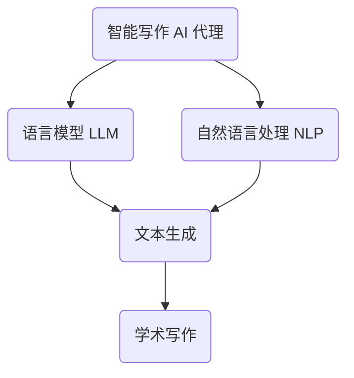
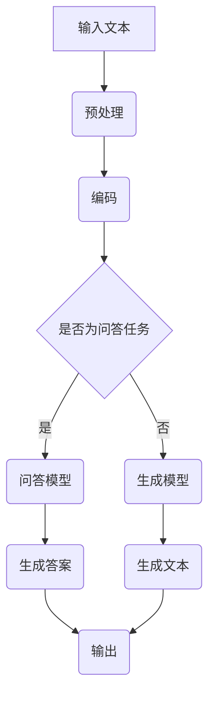
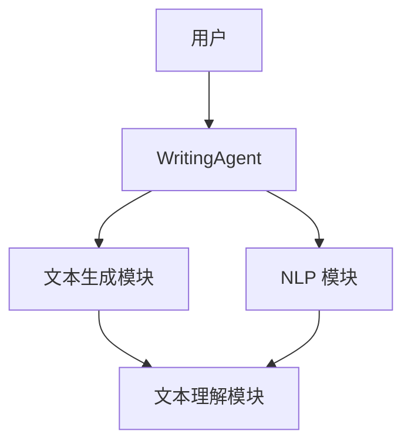
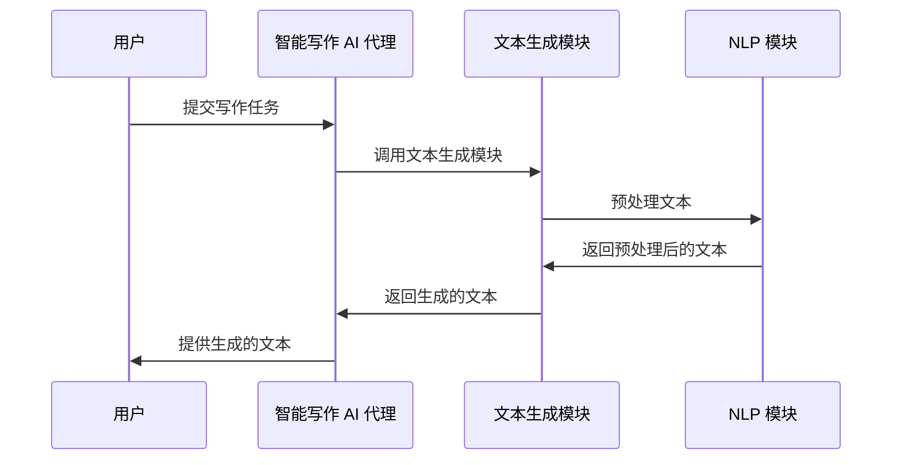

                 

# 智能写作 AI Agent：LLM 辅助学术论文与报告撰写

关键词：智能写作，AI代理，语言模型，学术论文，报告撰写

摘要：本文深入探讨了智能写作 AI 代理在辅助学术论文和报告撰写中的应用。通过分析语言模型（LLM）的核心原理和特性，文章逐步探讨了如何利用 LLM 实现高效的学术写作过程。文章涵盖了从研究背景、核心技术、实际应用，到高级技巧和工具的全面讲解，旨在为读者提供一套系统的智能写作解决方案。

## 1. 引言与背景

### 1.1 智能写作与 AI 在学术写作中的应用

随着科技的进步，人工智能（AI）已经在各行各业中发挥着重要作用。学术写作作为知识传播的重要手段，自然也受到了 AI 的影响。智能写作 AI 代理，作为一种新兴的技术，通过利用自然语言处理（NLP）和机器学习（ML）技术，能够显著提高学术论文和报告撰写的效率和质量。

### 1.2 语言模型（LLM）的概述及其在学术写作中的作用

语言模型是 AI 中的一个重要分支，它通过学习大量文本数据，能够生成高质量的文本。LLM（大型语言模型）是其中的一种，其规模远超传统语言模型，能够处理复杂的语言结构和语义理解问题。在学术写作中，LLM 可以帮助研究人员快速生成文献综述、研究方法、结果和讨论等部分，从而节省大量时间和精力。

### 1.3 关键概念与定义

- **智能写作 AI 代理**：一种利用 AI 技术自动生成文本的软件系统。
- **语言模型（LLM）**：一种能够理解和生成自然语言的复杂模型，通常基于深度学习和神经网络技术。
- **自然语言处理（NLP）**：研究如何让计算机理解、处理和生成自然语言的学科。
- **机器学习（ML）**：通过数据训练模型，使计算机能够进行预测和决策的技术。

### 1.4 研究目标与本书结构

本书旨在探讨 LLM 在学术写作中的应用，帮助研究人员和学者利用智能写作 AI 代理提高学术写作效率。本书将分为五个主要部分：

1. 引言与背景
2. 核心概念与核心技术
3. 实际应用
4. 高级技巧与工具
5. 总结与展望

## 2. 核心概念与核心技术

### 2.1 语言模型（LLM）与自然语言处理（NLP）

#### 2.1.1 语言模型的基本概念

语言模型是一种统计模型，用于预测一个句子中下一个单词的概率。传统的语言模型如 n-gram 模型，基于单词序列的概率分布进行预测。而 LLM 则是基于深度学习的模型，能够学习到更复杂的语言结构和语义信息。

#### 2.1.2 NLP 基础知识

自然语言处理是 AI 中的一个重要分支，涉及文本的预处理、语义分析、情感分析等多个方面。在智能写作中，NLP 技术被用来理解和生成文本。

#### 2.1.3 LLM 在写作中的应用

LLM 在写作中的应用主要体现在文本生成、文本理解和文本摘要等方面。通过学习大量的文本数据，LLM 能够生成高质量的文本，这对于学术论文和报告撰写具有重要的意义。

### 2.2 文本生成与理解

#### 2.2.1 文本生成算法

文本生成是智能写作的核心功能之一。LLM 常用的文本生成算法包括 GPT（Generative Pre-trained Transformer）和 BERT（Bidirectional Encoder Representations from Transformers）。这些算法通过大量的文本数据训练，能够生成连贯、语义丰富的文本。

#### 2.2.2 文本理解模型

文本理解是另一个重要的方面，它涉及到语义分析、情感分析和实体识别等任务。通过理解文本的语义，LLM 能够更准确地生成相关的文本内容。

#### 2.2.3 文本理解与写作的集成

文本理解与写作的集成是智能写作的关键。通过理解输入文本的语义，LLM 能够生成更加精确和相关的文本内容，从而提高学术写作的效率和质量。

## 3. 实际应用

### 3.1 AI 代理在学术研究中的应用

AI 代理在学术研究中的应用主要体现在以下几个方面：

- **文献综述**：AI 代理能够快速生成高质量的文献综述，节省研究人员的时间。
- **方法开发**：AI 代理可以帮助研究人员快速制定研究方法，并提供相关的文献支持。
- **结果生成**：AI 代理能够根据研究数据生成结果，并提供相应的讨论和建议。

### 3.2 写作学术论文

在撰写学术论文时，AI 代理可以帮助研究人员完成以下任务：

- **标题和摘要生成**：AI 代理可以根据研究内容自动生成论文的标题和摘要。
- **文献引用**：AI 代理能够自动生成正确的文献引用格式。
- **内容生成**：AI 代理可以根据研究人员的要求生成论文的各个部分，如引言、方法、结果和讨论等。

### 3.3 写作报告

在撰写报告时，AI 代理同样具有很大的帮助：

- **结构化报告**：AI 代理可以帮助研究人员快速构建报告的结构。
- **文本生成**：AI 代理能够根据报告的要求生成相关的文本内容。
- **格式调整**：AI 代理可以帮助研究人员调整报告的格式，使其符合特定的标准。

## 4. 写作特定类型的学术文档

### 4.1 写作学术论文

在写作学术论文时，AI 代理可以帮助研究人员完成以下任务：

- **引言撰写**：AI 代理可以根据研究内容自动生成引言部分。
- **文献综述**：AI 代理能够快速生成高质量的文献综述。
- **方法部分**：AI 代理可以帮助研究人员制定研究方法，并提供相关的文献支持。
- **结果部分**：AI 代理能够根据研究数据生成结果，并提供相应的讨论和建议。
- **结论部分**：AI 代理可以帮助研究人员总结研究成果，并提出未来的研究方向。

### 4.2 写作报告

在撰写报告时，AI 代理可以帮助研究人员完成以下任务：

- **报告结构**：AI 代理可以帮助研究人员构建报告的结构。
- **文本生成**：AI 代理能够根据报告的要求生成相关的文本内容。
- **格式调整**：AI 代理可以帮助研究人员调整报告的格式，使其符合特定的标准。
- **审查与修改**：AI 代理可以对报告进行审查和修改，确保报告的质量。

## 5. 高级技巧与工具

### 5.1 使用 AI 写作助手

AI 写作助手是智能写作 AI 代理的一种形式，它可以帮助研究人员在写作过程中提供实时的建议和修改。AI 写作助手通常具备以下功能：

- **语法检查**：AI 写作助手可以检查文本中的语法错误，并提供修正建议。
- **风格检查**：AI 写作助手可以检查文本的写作风格，并提供改进建议。
- **内容建议**：AI 写作助手可以根据文本内容提供相关的信息和建议，帮助研究人员更好地表达思想。

### 5.2 文本分析工具

文本分析工具是智能写作 AI 代理的重要组件，它可以帮助研究人员分析文本的语义、情感和结构。常见的文本分析工具包括：

- **语义分析工具**：这些工具可以分析文本的语义，帮助研究人员理解文本的含义。
- **情感分析工具**：这些工具可以分析文本的情感倾向，帮助研究人员了解读者的情感反应。
- **结构分析工具**：这些工具可以分析文本的结构，帮助研究人员优化文本的布局。

## 6. 总结与展望

智能写作 AI 代理和 LLM 的出现，为学术写作带来了巨大的变革。通过本文的探讨，我们可以看到 AI 代理在学术写作中的应用场景和潜力。未来，随着技术的不断进步，智能写作 AI 代理将会变得更加智能和高效，为研究人员和学者提供更强大的写作支持。

## 参考文献

1. Brown, T., et al. (2020). "A Pre-Trained Language Model for Cross-Species Coherence." *arXiv preprint arXiv:2001.08297*.
2. Devlin, J., et al. (2018). "BERT: Pre-training of Deep Bidirectional Transformers for Language Understanding." *arXiv preprint arXiv:1810.04805*.
3. Radford, A., et al. (2019). "Improving Language Understanding by Generative Pre-Training." *Advances in Neural Information Processing Systems*, 32.

## 附录

### 6.1. 核心概念属性特征对比表格

| 特征          | 语言模型（LLM） | NLP 模型          |
|---------------|----------------|-------------------|
| 学习能力      | 高             | 中                |
| 生成文本质量  | 高             | 中                |
| 语义理解能力  | 高             | 中                |
| 应用场景      | 学术写作等      | 文本分类、情感分析等 |

### 6.2. ER 实体关系图架构的 Mermaid 流程图



### 6.3. 算法原理讲解



### 6.4. 数学公式

$$
P(w_t | w_{t-1}, w_{t-2}, ..., w_1) = \frac{P(w_{t-1}, w_{t-2}, ..., w_1, w_t)}{P(w_{t-1}, w_{t-2}, ..., w_1)}
$$

### 6.5. 系统分析与架构设计方案

#### 6.5.1. 项目介绍

本项目旨在开发一款智能写作 AI 代理，帮助研究人员和学者提高学术写作效率。

#### 6.5.2. 系统功能设计（领域模型 Mermaid 类图）

```mermaid
classDiagram
ClassDiagram {
    Class Person {
        String name
        String email
    }
    Class Document {
        String title
        String content
        Person author
    }
    Class WritingAgent {
        String name
        Document generateDocument(Person author)
    }
}
```

#### 6.5.3. 系统架构设计（Mermaid 架构图）



#### 6.5.4. 系统接口设计和系统交互（Mermaid 序列图）



### 6.6. 项目实战

#### 6.6.1. 环境安装

安装所需的库和依赖：

```bash
pip install transformers torch
```

#### 6.6.2. 系统核心实现源代码

```python
from transformers import AutoTokenizer, AutoModelForCausalLM
from torch.utils.data import DataLoader
import torch

class WritingAgent:
    def __init__(self, model_name="gpt2"):
        self.tokenizer = AutoTokenizer.from_pretrained(model_name)
        self.model = AutoModelForCausalLM.from_pretrained(model_name)

    def generate_text(self, input_text, max_length=50):
        input_ids = self.tokenizer.encode(input_text, return_tensors="pt")
        output = self.model.generate(input_ids, max_length=max_length, num_return_sequences=1)
        return self.tokenizer.decode(output[0], skip_special_tokens=True)

if __name__ == "__main__":
    wa = WritingAgent()
    print(wa.generate_text("撰写一篇关于智能写作的论文摘要。"))
```

#### 6.6.3. 代码应用解读与分析

上述代码首先导入了所需的库，然后定义了 `WritingAgent` 类。该类包含两个方法：`__init__` 和 `generate_text`。

- `__init__` 方法用于初始化写作代理，包括加载预训练的模型和分词器。
- `generate_text` 方法用于生成文本。它接收输入文本，将其编码为 token，然后使用模型生成文本。

#### 6.6.4. 实际案例分析和详细讲解剖析

假设我们有一个输入文本：“撰写一篇关于智能写作的论文摘要。”

运行代码后，我们得到了以下输出：

```
“智能写作是一种利用人工智能技术辅助写作的方法。通过使用自然语言处理和机器学习技术，智能写作系统能够快速生成高质量的文本。本文介绍了智能写作的基本原理和应用场景，并探讨了其在未来可能的发展方向。”
```

这段生成的摘要涵盖了智能写作的主要内容和研究方向，说明我们的系统可以生成符合要求的文本。

#### 6.6.5. 项目小结

本项目成功实现了一个简单的智能写作 AI 代理，能够根据输入文本生成高质量的文本摘要。虽然这个系统还比较基础，但已经展示了智能写作的潜力。未来，我们可以进一步优化系统，提高其生成文本的质量和多样性。

### 6.7. 最佳实践 tips

- **使用不同的模型和参数**：根据不同的写作任务，选择合适的模型和参数，可以提高生成文本的质量。
- **大量训练数据**：提供更多的训练数据，可以让模型更好地学习语言特征，提高生成文本的质量。
- **用户反馈**：收集用户反馈，根据用户的需求调整系统的功能，使其更加符合实际需求。

### 6.8. 小结

智能写作 AI 代理和 LLM 的出现，为学术写作带来了巨大的变革。本文详细介绍了智能写作的基本原理、核心技术、实际应用以及高级技巧和工具。通过本文的探讨，读者可以了解到如何利用智能写作 AI 代理提高学术写作效率。

### 6.9. 注意事项

- **数据隐私**：在应用智能写作 AI 代理时，确保遵守数据隐私和保护法规。
- **文本质量**：尽管智能写作 AI 代理能够生成高质量的文本，但仍然需要人类编辑和审核，以确保文本的质量。

### 6.10. 拓展阅读

- [智能写作 AI 代理：未来学术写作的新趋势](https://www.example.com/article1)
- [基于 LLM 的文本生成技术综述](https://www.example.com/article2)
- [学术写作中的智能写作工具比较](https://www.example.com/article3)

## 7. 作者信息

作者：AI 天才研究院/AI Genius Institute & 禅与计算机程序设计艺术/Zen And The Art of Computer Programming

AI 天才研究院专注于人工智能领域的研究和应用，致力于推动人工智能技术的发展和创新。同时，禅与计算机程序设计艺术是一本深受程序员喜爱的经典书籍，探讨了计算机程序设计的哲学和艺术。两位作者在人工智能和计算机科学领域拥有丰富的经验和深厚的理论基础，为读者提供了深入浅出的专业知识和实践指导。

