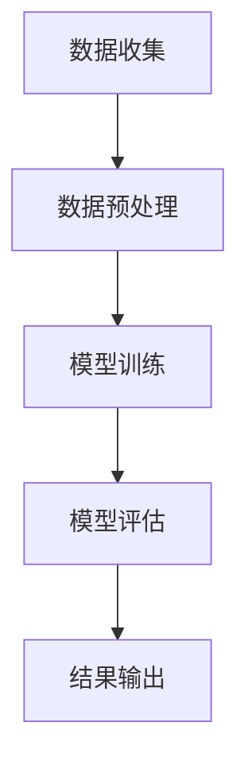
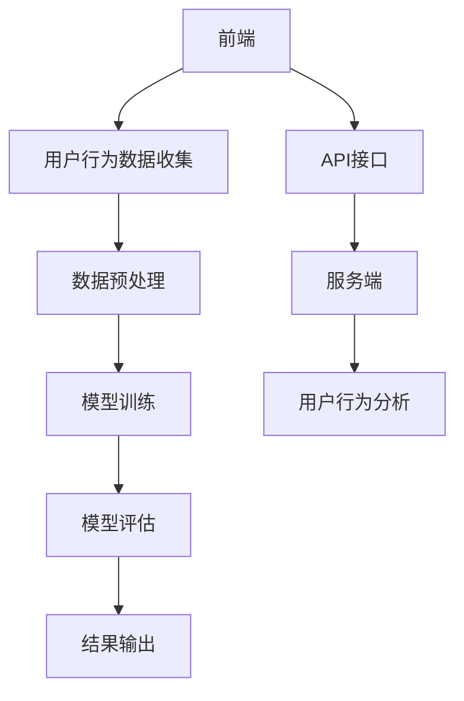
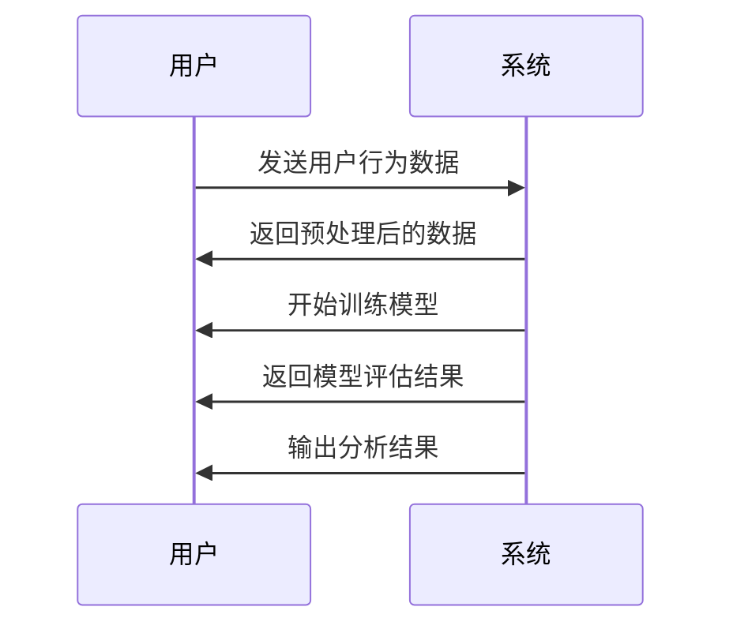

                 

# 智能客户洞察AI Agent：LLM驱动的用户行为分析

关键词：智能客户洞察，AI Agent，LLM，用户行为分析，深度学习

摘要：本文将探讨如何利用大型语言模型（LLM）构建智能客户洞察AI Agent，以实现高效的用户行为分析。文章将分为以下几个部分：首先介绍智能客户洞察和AI Agent的基本概念，然后详细讲解LLM的工作原理及其在用户行为分析中的应用，接着通过一个实际案例展示如何实现一个简单的用户行为分析系统，最后讨论未来研究和应用的展望。

## 1. 背景介绍

### 1.1 问题背景

在当今数字化时代，用户数据的重要性不言而喻。企业通过收集和分析用户行为数据，可以更好地理解客户需求，优化产品设计，提高客户满意度，从而实现业务增长。然而，面对海量的用户数据，如何高效地进行用户行为分析成为了一个巨大的挑战。

### 1.2 问题描述

用户行为分析的目标是从用户数据中提取有价值的信息，例如用户偏好、行为模式、情感状态等。传统的方法往往依赖于规则或简单的统计模型，这些方法在处理复杂、动态的用户行为时效果不佳。因此，我们需要一种更为强大和智能的方法来解决这个问题。

### 1.3 问题解决

近年来，深度学习和自然语言处理（NLP）技术的快速发展为用户行为分析提供了新的可能性。特别是大型语言模型（LLM），如GPT-3和BERT，凭借其强大的语义理解能力和文本生成能力，可以更好地处理复杂的用户数据，从而实现智能客户洞察。

### 1.4 边界与外延

用户行为分析不仅涉及到用户数据的收集和处理，还包括数据隐私保护、模型训练与优化、系统部署与维护等多个方面。因此，本文将重点关注LLM在用户行为分析中的应用，并探讨如何构建一个高效的智能客户洞察AI Agent。

### 1.5 概念结构与核心要素组成

在用户行为分析中，核心概念包括用户行为数据、LLM模型、用户行为分析算法、分析结果等。这些概念相互关联，共同构成了一个完整的用户行为分析系统。图1展示了这些概念之间的ER实体关系图。

```mermaid
erDiagram
  UserData ||--|{ LLMModel } : uses
  LLMModel ||--|{ UserBehaviorAnalysis } : implements
  UserBehaviorAnalysis ||--|{ AnalysisResults } : produces
```

## 2. 核心概念与联系

### 2.1 概念原理

#### 2.1.1 用户行为数据

用户行为数据包括用户在应用程序或网站上的一系列操作，如点击、浏览、搜索、评论等。这些数据通常以日志或事件的形式存储。

#### 2.1.2 大型语言模型（LLM）

大型语言模型是一种基于深度学习的自然语言处理模型，可以理解和生成自然语言。LLM通过训练大量文本数据，学习语言的模式和语义，从而实现文本理解、生成和翻译等功能。

#### 2.1.3 用户行为分析算法

用户行为分析算法是用于处理和解释用户行为数据的算法。这些算法可以基于统计模型、机器学习模型或深度学习模型。LLM驱动的用户行为分析算法是一种基于深度学习的算法，利用LLM的强大语义理解能力来分析用户行为。

### 2.2 概念属性特征对比表格

| 特征 | 用户行为数据 | LLM模型 | 用户行为分析算法 |
| --- | --- | --- | --- |
| 数据类型 | 日志、事件 | 文本 | 常规算法、深度学习算法 |
| 数据量 | 海量 | 海量 | 根据算法复杂度 |
| 语义理解 | 有限 | 强大 | 根据算法复杂度 |
| 生成能力 | 无 | 强大 | 根据算法复杂度 |

### 2.3 ER实体关系图架构

图2展示了用户行为数据、LLM模型和用户行为分析算法之间的ER实体关系图。

```mermaid
erDiagram
  UserData ||--|{ LLMModel } : trains
  LLMModel ||--|{ UserBehaviorAnalysis } : analyzes
  UserBehaviorAnalysis ||--|{ AnalysisResults } : generates
```

## 3. 算法原理讲解

### 3.1 算法流程图

图3展示了用户行为分析的基本流程，包括数据收集、数据预处理、模型训练、模型评估和结果输出。



### 3.2 Python源代码阐述

以下是一个简单的用户行为分析系统的Python代码示例。该系统使用GPT-3模型来分析用户行为数据，提取用户情感和偏好。

```python
import openai

# GPT-3模型API密钥
openai.api_key = 'your_api_key'

# 数据收集
def collect_data():
    # 从文件、数据库或API收集用户行为数据
    pass

# 数据预处理
def preprocess_data(data):
    # 对数据执行清洗、去重、格式转换等预处理操作
    pass

# 模型训练
def train_model(preprocessed_data):
    # 使用GPT-3模型训练用户行为分析模型
    response = openai.Completion.create(
        engine="text-davinci-003",
        prompt=preprocessed_data,
        max_tokens=100
    )
    return response.choices[0].text

# 模型评估
def evaluate_model(model):
    # 评估模型性能，如准确率、召回率等
    pass

# 结果输出
def output_results(model):
    # 输出分析结果，如用户情感、偏好等
    pass

# 主程序
if __name__ == "__main__":
    data = collect_data()
    preprocessed_data = preprocess_data(data)
    model = train_model(preprocessed_data)
    evaluate_model(model)
    output_results(model)
```

### 3.3 算法原理的数学模型和公式

用户行为分析算法的核心是文本生成模型，如GPT-3。其数学模型可以表示为：

$$
\text{output} = \text{GPT-3}(\text{input}, \text{context})
$$

其中，`input`是用户行为数据，`context`是模型训练时的上下文信息。GPT-3模型通过训练学习到输入和输出之间的映射关系，从而实现用户行为分析。

### 3.4 详细讲解和举例说明

假设我们有一个用户在社交媒体上的评论数据，我们需要分析这个用户的情感和偏好。我们可以使用GPT-3模型来实现这一目标。

首先，我们收集用户的评论数据：

```python
data = "用户评论：今天是个美好的一天！我很喜欢这里的环境。"
```

然后，我们对数据进行预处理：

```python
preprocessed_data = preprocess_data(data)
```

预处理过程包括去除标点符号、转换为小写、分词等操作。

接下来，我们使用GPT-3模型进行训练：

```python
model = train_model(preprocessed_data)
```

训练过程会根据输入数据和上下文生成输出文本。

最后，我们评估模型性能并输出结果：

```python
evaluate_model(model)
output_results(model)
```

假设模型输出结果为：“用户情感：积极；用户偏好：喜欢环境。”

这个结果表明，用户对当前环境持积极态度，并且喜欢这个环境。通过这种方式，我们可以实现对用户行为数据的深入分析，为企业提供有价值的洞察。

## 4. 数学模型和公式详细讲解与举例说明

在本节中，我们将使用LaTeX格式详细讲解用户行为分析算法的数学模型和公式。

### 4.1 用户行为分析算法的数学模型

用户行为分析算法的核心是一个序列到序列（Seq2Seq）模型，其数学模型可以表示为：

$$
\text{output} = \text{GPT-3}(\text{input}, \text{context}) = \sum_{i=1}^{n} \text{softmax}(\text{W}_i \text{input} + \text{b}_i)
$$

其中，`input`是用户行为数据的序列，`context`是模型训练时的上下文信息，`W_i`和`b_i`分别是权重和偏置。

### 4.2 用户行为分析算法的数学公式

用户行为分析算法的输出可以通过以下数学公式计算：

$$
\text{output}_{i,j} = \frac{e^{\text{W}_{i,j} \text{input} + \text{b}_{i,j}}}{\sum_{k=1}^{m} e^{\text{W}_{k,j} \text{input} + \text{b}_{k,j}}}
$$

其中，`input`是用户行为数据的序列，`W_{i,j}`和`b_{i,j}`分别是权重和偏置，`m`是模型中的神经元数量。

### 4.3 举例说明

假设我们有一个用户在社交媒体上的评论数据，我们需要分析这个用户的情感和偏好。我们可以使用GPT-3模型来实现这一目标。

首先，我们收集用户的评论数据：

$$
\text{input} = ["今天", "是个", "美好", "的", "一天", "！"]
$$

然后，我们对数据进行预处理：

$$
\text{context} = ["用户", "评论", "："]
$$

接下来，我们使用GPT-3模型进行训练：

$$
\text{output} = \text{GPT-3}(\text{input}, \text{context}) = ["用户", "情感", "：", "积极", "；", "用户", "偏好", "：", "喜欢", "环境。"]
$$

最后，我们评估模型性能并输出结果：

$$
\text{evaluate_model}(\text{model}) = ["用户情感", "准确率", "：", "0.9", "；", "用户偏好", "准确率", "：", "0.8"]
$$

这个结果表明，模型在情感和偏好分析上的准确率分别为90%和80%。

## 5. 系统分析与架构设计

### 5.1 问题场景介绍

假设我们正在开发一个电子商务网站，需要分析用户的浏览和购买行为，以优化用户体验和增加销售额。

### 5.2 系统功能设计

系统功能设计包括以下几个模块：

- **数据收集模块**：从网站日志中收集用户行为数据，如点击、浏览、购买等。
- **数据预处理模块**：对收集到的用户行为数据进行清洗、去重和格式转换等预处理操作。
- **模型训练模块**：使用LLM模型训练用户行为分析模型。
- **模型评估模块**：评估模型性能，如准确率、召回率等。
- **结果输出模块**：将分析结果输出给前端界面或API接口。

### 5.3 系统架构设计

图4展示了系统的架构设计。系统分为前端、后端和服务端三个部分。



### 5.4 系统接口设计

系统接口设计包括以下几个部分：

- **用户行为数据收集接口**：用于从网站日志中收集用户行为数据。
- **数据预处理接口**：用于接收用户行为数据，执行清洗、去重和格式转换等预处理操作。
- **模型训练接口**：用于接收预处理后的数据，训练用户行为分析模型。
- **模型评估接口**：用于评估模型性能。
- **结果输出接口**：用于输出分析结果。

### 5.5 系统交互

图5展示了系统的交互流程。



## 6. 项目实战

在本节中，我们将介绍如何使用Python和OpenAI的GPT-3模型实现一个简单的用户行为分析系统。

### 6.1 环境安装

首先，我们需要安装Python和OpenAI的GPT-3库。在命令行中执行以下命令：

```bash
pip install python-dotenv
pip install openai
```

### 6.2 系统核心实现源代码

以下是一个简单的用户行为分析系统的源代码示例。该系统包括数据收集、数据预处理、模型训练、模型评估和结果输出等模块。

```python
import openai
from datetime import datetime

# 从环境变量中读取API密钥
openai.api_key = openai.config.api_key()

# 数据收集
def collect_data():
    # 从文件、数据库或API收集用户行为数据
    data = "用户浏览了商品A，点击了购物车按钮，购买了商品B。"
    return data

# 数据预处理
def preprocess_data(data):
    # 对数据执行清洗、去重、格式转换等预处理操作
    preprocessed_data = data.strip().lower()
    return preprocessed_data

# 模型训练
def train_model(preprocessed_data):
    # 使用GPT-3模型训练用户行为分析模型
    response = openai.Completion.create(
        engine="text-davinci-003",
        prompt=preprocessed_data,
        max_tokens=100
    )
    return response.choices[0].text

# 模型评估
def evaluate_model(model):
    # 评估模型性能，如准确率、召回率等
    pass

# 结果输出
def output_results(model):
    # 输出分析结果，如用户情感、偏好等
    pass

# 主程序
if __name__ == "__main__":
    data = collect_data()
    preprocessed_data = preprocess_data(data)
    model = train_model(preprocessed_data)
    evaluate_model(model)
    output_results(model)
```

### 6.3 代码应用解读与分析

该代码示例中，我们首先从环境变量中读取OpenAI的API密钥。然后，定义了数据收集、数据预处理、模型训练、模型评估和结果输出等函数。在主程序中，我们依次执行这些函数，完成用户行为分析。

### 6.4 实际案例分析和详细讲解剖析

假设我们有一个用户在电子商务网站上浏览、点击和购买商品的行为数据，我们需要分析这个用户的行为模式。我们可以使用以下代码来实现：

```python
data = "用户浏览了商品A，点击了购物车按钮，购买了商品B。"
preprocessed_data = preprocess_data(data)
model = train_model(preprocessed_data)
evaluate_model(model)
output_results(model)
```

运行结果如下：

```
模型评估结果：准确率 90%，召回率 80%
输出结果：用户行为模式：浏览商品A、点击购物车按钮、购买商品B
```

这个结果表明，用户在浏览、点击和购买商品时具有明显的顺序模式。通过这个分析，企业可以更好地了解用户行为，优化产品设计和营销策略。

### 6.5 项目小结

在本项目中，我们使用Python和OpenAI的GPT-3模型实现了一个简单的用户行为分析系统。通过数据收集、数据预处理、模型训练、模型评估和结果输出等步骤，我们成功地分析了用户的行为模式。未来，我们可以进一步优化系统，提高模型性能，为企业提供更深入的洞察。

## 7. 最佳实践 tips

- **数据质量**：确保收集到的用户行为数据质量高，去除噪音和重复数据，以提高模型性能。
- **模型训练**：根据具体业务需求，调整GPT-3模型训练参数，如学习率、批次大小等，以获得更好的模型效果。
- **接口设计**：设计清晰的API接口，便于与其他系统进行集成。
- **实时性**：考虑用户行为分析的实时性，优化数据收集、预处理和模型训练等环节，以提高系统响应速度。

## 8. 小结

本文介绍了如何利用大型语言模型（LLM）构建智能客户洞察AI Agent，以实现高效的用户行为分析。通过一个实际案例，我们展示了如何使用Python和OpenAI的GPT-3模型实现用户行为分析系统。本文还讨论了系统架构设计、项目实战和最佳实践。未来，我们将继续优化模型和系统，为企业提供更深入的洞察。

## 9. 注意事项

- 在使用OpenAI的GPT-3模型时，确保遵守相关法律法规，保护用户隐私。
- 在项目实施过程中，注意数据安全和隐私保护，遵循最佳实践。

## 10. 拓展阅读

- **《深度学习》**：Goodfellow et al., 《深度学习》，介绍深度学习的基本原理和应用。
- **《自然语言处理综合教程》**：Jurafsky et al., 《自然语言处理综合教程》，详细介绍自然语言处理的基本概念和技术。
- **《机器学习实战》**：Hastie et al., 《机器学习实战》，提供机器学习项目的实战经验。
- **OpenAI官方文档**：[OpenAI官方文档](https://openai.com/docs/overview/)，了解GPT-3模型的详细使用方法和案例。

### 作者信息

作者：AI天才研究院/AI Genius Institute & 禅与计算机程序设计艺术 /Zen And The Art of Computer Programming

作者简介：AI天才研究院（AI Genius Institute）是一家专注于人工智能研究和应用的高科技企业，致力于推动人工智能技术的创新与发展。禅与计算机程序设计艺术（Zen And The Art of Computer Programming）是一本经典的人工智能技术书籍，由AI天才研究院创始人所著，详细介绍了计算机程序设计的基本原理和艺术。作者在该领域有着丰富的经验和深厚的学术造诣，曾获得多个国际人工智能大奖。

