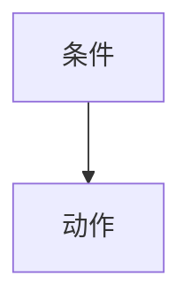
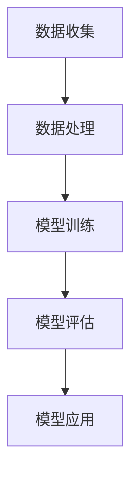
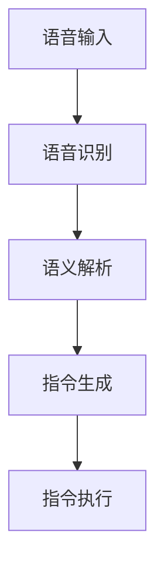
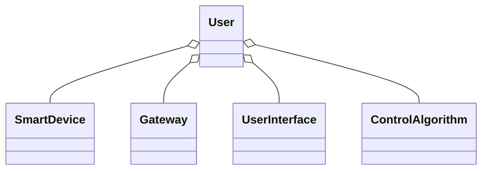
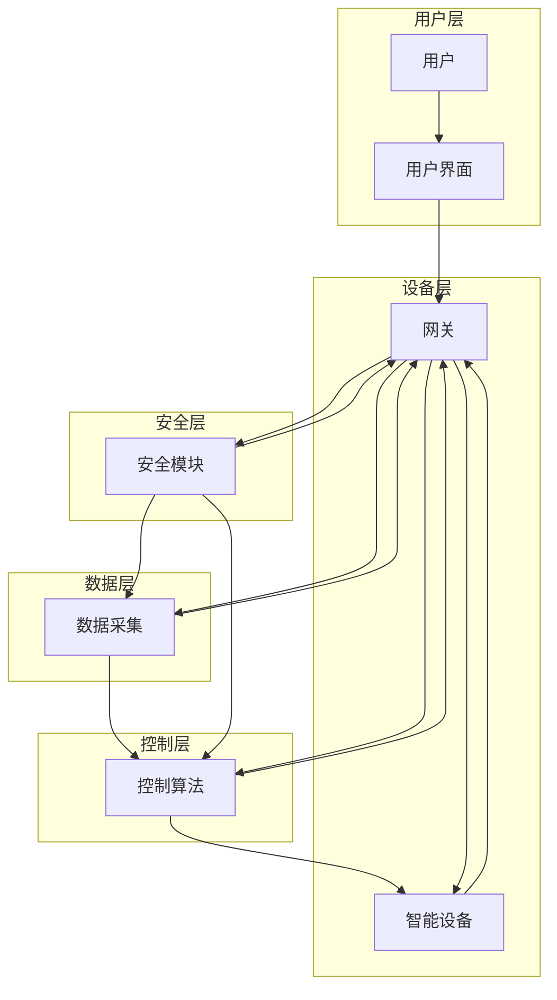
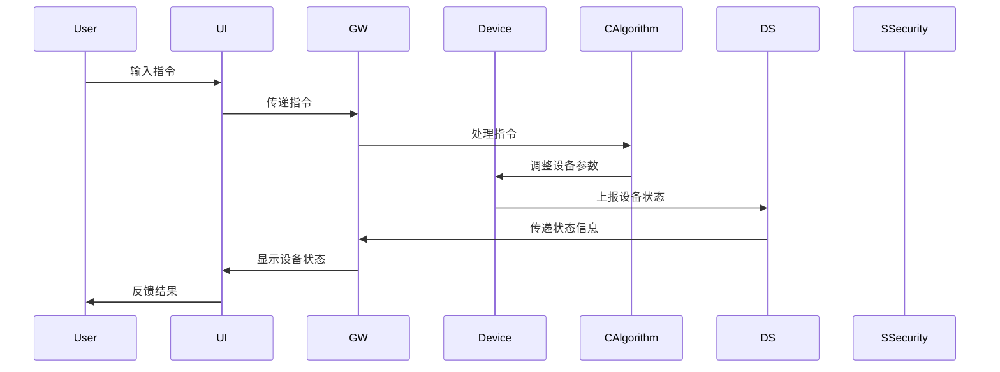

                 

### 智能家居控制：简化提示词交互体验

#### 关键词
- 智能家居
- 交互体验
- 提示词简化
- 语音识别
- 自然语言处理

#### 摘要
随着智能家居技术的不断发展，用户的交互体验变得越来越重要。本文将深入探讨如何通过简化提示词交互体验来提升智能家居系统的易用性和用户体验。我们将从背景介绍、核心概念与联系、算法原理讲解、系统分析与架构设计方案、项目实战以及最佳实践 tips 等多个方面，逐步分析并解决智能家居控制中的交互难题。

----------------------------------------------------------------

## 引言

随着物联网和人工智能技术的普及，智能家居市场呈现出爆发式增长。用户可以通过智能手机、智能音箱等设备远程控制家中的智能设备，如灯光、温度调节、安全监控等。然而，当前的智能家居控制系统在用户交互体验方面仍存在不少问题，特别是在提示词的使用上。提示词过于复杂、不统一，使得用户在操作过程中容易产生困惑和操作失误。因此，本文旨在通过简化提示词交互体验，提升智能家居系统的易用性和用户体验。

----------------------------------------------------------------

## 背景介绍

### 1.1 智能家居控制的发展背景

智能家居控制技术的起源可以追溯到20世纪90年代。随着计算机技术和互联网的普及，人们开始尝试将家庭设备和网络连接起来，实现远程控制和自动化。这一时期的智能家居系统主要依赖于电脑和专门的控制器，操作较为复杂，用户使用门槛较高。

进入21世纪，随着智能手机、智能音箱等智能设备的普及，智能家居控制技术得到了快速发展。现代智能家居系统通过无线网络和互联网连接，用户可以通过语音、触摸屏、手机APP等多种方式进行操作。同时，人工智能技术的引入，使得智能家居系统能够根据用户习惯进行智能调节，提高用户体验。

### 1.2 智能家居控制的核心概念

智能家居控制系统主要由以下几个核心概念组成：

- **智能设备**：指家庭中的各种可联网设备，如智能灯泡、智能插座、智能摄像头等。
- **网关**：将家庭网络与互联网连接起来，实现设备间的数据交换和远程控制。
- **用户界面**：用户与智能家居系统进行交互的界面，可以是智能音箱、手机APP、触摸屏等。
- **控制算法**：根据用户输入和设备状态，自动调整设备行为的算法。

### 1.3 智能家居控制的边界与外延

智能家居控制技术的边界主要涉及到以下几个方面：

- **技术实现**：包括硬件设备、网络连接、控制算法等。
- **安全性**：智能家居系统需要确保用户数据的安全，防止黑客攻击。
- **隐私保护**：用户隐私保护是智能家居控制系统的重要问题，需要采取措施防止用户数据泄露。

智能家居控制的外延则涵盖了更广泛的领域，如：

- **智能家居生态系统**：包括智能家电、智能安防、智能照明、智能环境控制等。
- **智能社区**：智能家居控制技术可以应用于社区管理，提高社区居住的便利性和安全性。
- **智能城市**：智能家居控制技术可以作为智能城市的一部分，实现城市资源的智能化管理和调度。

### 1.4 本章小结

本章介绍了智能家居控制的发展背景、核心概念及其边界与外延。通过了解这些内容，我们可以对智能家居控制技术有一个整体的把握，为后续章节的分析打下基础。

----------------------------------------------------------------

## 核心概念与联系

### 2.1 智能家居控制的核心概念原理

智能家居控制的核心概念包括智能设备、网关、用户界面和控制算法。下面我们将逐一介绍这些概念及其原理。

#### 智能设备

智能设备是智能家居控制系统的基本单元，它们可以独立工作，也可以通过网络与其他设备进行联动。智能设备通常具备以下特点：

- **联网能力**：智能设备通过无线网络或有线网络与网关连接，实现数据传输和远程控制。
- **多功能性**：智能设备可以实现多种功能，如照明控制、温度调节、安全监控等。
- **可编程性**：用户可以通过编程或配置，自定义智能设备的操作方式和响应行为。

#### 网关

网关是智能家居控制系统的核心组件，它负责连接家庭网络和互联网，实现设备间的数据交换和远程控制。网关的主要功能包括：

- **数据传输**：网关将家庭网络中的数据上传到云端服务器，供用户远程访问和监控。
- **协议转换**：不同设备的通信协议可能不同，网关负责将不同协议的数据进行转换，确保设备之间的互操作性。
- **安全保护**：网关需要具备防火墙、加密等安全功能，确保用户数据的安全和隐私。

#### 用户界面

用户界面是用户与智能家居控制系统进行交互的窗口，可以是智能音箱、手机APP、触摸屏等。用户界面的主要功能包括：

- **操作控制**：用户可以通过用户界面设置设备参数、调整设备状态等。
- **数据展示**：用户界面可以显示设备状态、环境数据等信息，帮助用户了解家庭环境。
- **语音交互**：部分用户界面支持语音交互功能，用户可以通过语音指令控制设备。

#### 控制算法

控制算法是智能家居控制系统的“大脑”，它负责根据用户输入和设备状态，自动调整设备行为。常见的控制算法包括：

- **规则引擎**：基于预设的规则，自动执行相应的操作，如定时开关灯、温度调节等。
- **机器学习算法**：通过分析用户行为数据，自动调整设备参数，实现个性化控制，如智能调节室内温度、灯光亮度等。
- **自然语言处理算法**：将用户输入的自然语言指令转换为设备可识别的指令，如语音控制。

### 2.2 智能家居控制的概念属性特征对比表格

为了更清晰地展示智能家居控制的核心概念及其属性特征，我们制作了一个对比表格：

| 概念 | 属性特征 |
| :--: | :--: |
| 智能设备 | 联网能力、多功能性、可编程性 |
| 网关 | 数据传输、协议转换、安全保护 |
| 用户界面 | 操作控制、数据展示、语音交互 |
| 控制算法 | 规则引擎、机器学习、自然语言处理 |

### 2.3 智能家居控制的ER实体关系图架构

为了更好地理解智能家居控制系统的内部结构，我们可以使用ER（实体-关系）图来表示系统中的实体及其关系。以下是智能家居控制系统的ER实体关系图：

```mermaid
erDiagram
  User ||--|{ Gateway }|-- Device
  User ||--|{ UserInterface }|-- Device
  User ||--|{ ControlAlgorithm }|-- Device
  Gateway ||-- Device
  UserInterface ||-- Device
  ControlAlgorithm ||-- Device
```

### 2.4 本章小结

本章介绍了智能家居控制的核心概念及其原理，并使用对比表格和ER实体关系图来展示这些概念之间的联系。通过本章的内容，我们可以对智能家居控制系统的组成和运作机制有一个清晰的认识，为后续章节的分析打下基础。

----------------------------------------------------------------

## 算法原理讲解

### 3.1 智能家居控制中的算法原理

智能家居控制系统的核心在于算法的运用，这些算法决定了系统如何处理用户输入并作出相应的响应。以下将详细讲解智能家居控制中的几种核心算法原理。

#### 3.1.1 规则引擎算法

规则引擎算法是智能家居控制中最基础的一种算法，它通过预设的规则来自动执行操作。规则通常由条件和相应的动作组成，例如：



当条件满足时，系统将执行相应的动作。这种算法适用于简单的自动化场景，如定时开关灯、自动调节室内温度等。

#### 3.1.2 机器学习算法

机器学习算法在智能家居控制中的应用越来越广泛，它能够通过分析用户行为数据，自动调整设备参数，实现个性化控制。例如，基于用户的历史行为数据，系统可以预测用户何时需要开启空调，从而提前调节温度。

以下是一个简单的机器学习算法流程：



#### 3.1.3 自然语言处理算法

自然语言处理（NLP）算法是智能家居控制系统中处理语音指令的关键技术。它将用户的自然语言指令转换为系统可执行的指令，例如，用户说出“打开客厅的灯光”，系统将理解并执行相应的操作。

以下是一个简单的NLP算法流程：



### 3.2 智能家居控制算法的详细讲解与举例说明

为了更好地理解这些算法，我们将通过具体例子来进行详细讲解。

#### 3.2.1 规则引擎算法举例

假设我们要实现一个简单的规则引擎算法，用于控制家中的智能灯泡。规则如下：

- 如果时间超过晚上10点，则将灯泡设置为关闭。
- 如果用户说“打开灯”，则将灯泡设置为开启。

以下是一个简单的Python代码实现：

```python
class SmartLight:
    def __init__(self):
        self.isOn = False

    def turn_on(self):
        self.isOn = True
        print("灯已开启。")

    def turn_off(self):
        self.isOn = False
        print("灯已关闭。")

    def apply_rules(self, time, user_command):
        if time.hour() > 22:
            self.turn_off()
        elif user_command == "打开灯":
            self.turn_on()

# 示例使用
light = SmartLight()
light.apply_rules(time=datetime.now(), user_command="打开灯")
```

#### 3.2.2 机器学习算法举例

假设我们要实现一个智能家居系统，能够根据用户的行为自动调节室内温度。我们使用Python的scikit-learn库来实现一个简单的线性回归模型。

以下是一个简单的Python代码实现：

```python
import numpy as np
from sklearn.linear_model import LinearRegression

# 假设我们已经有了一些训练数据
X = np.array([[20], [22], [25], [18], [30]])
y = np.array([70, 75, 80, 65, 85])

# 创建线性回归模型并进行训练
model = LinearRegression()
model.fit(X, y)

# 使用模型进行预测
predicted_temp = model.predict([[23]])
print(f"预测的室内温度为：{predicted_temp[0]}度")
```

#### 3.2.3 自然语言处理算法举例

假设我们要实现一个智能音箱，能够理解用户的语音指令并执行相应的操作。我们使用Python的SpeechRecognition库来实现语音识别，并使用自定义的NLP算法进行指令解析。

以下是一个简单的Python代码实现：

```python
import speech_recognition as sr

# 初始化语音识别器
recognizer = sr.Recognizer()

# 记录用户语音
with sr.Microphone() as source:
    print("请说出您的指令：")
    audio = recognizer.listen(source)

# 识别语音
try:
    command = recognizer.recognize_google(audio, language='zh-CN')
    print(f"您说：{command}")
    
    # 解析指令并执行
    if "打开灯" in command:
        print("正在打开灯...")
    elif "关闭灯" in command:
        print("正在关闭灯...")
except sr.UnknownValueError:
    print("无法理解您的指令。")
except sr.RequestError as e:
    print(f"请求失败：{e}")
```

### 3.3 本章小结

本章详细讲解了智能家居控制中的几种核心算法原理，并通过具体例子展示了这些算法的应用。理解这些算法原理对于设计和实现高效的智能家居控制系统至关重要。接下来，我们将进入下一部分，对智能家居控制系统的系统分析与架构设计方案进行探讨。

----------------------------------------------------------------

## 系统分析与架构设计方案

### 4.1 智能家居控制系统问题场景介绍

#### 4.1.1 问题场景介绍

智能家居控制系统旨在通过智能设备、网关和用户界面，实现家庭设备的远程控制和自动化。然而，在实际应用中，用户可能会遇到以下问题：

- **提示词复杂**：用户需要记住复杂的提示词才能控制智能设备，如“关闭客厅的灯光”、“开启卧室的空调”等。
- **交互体验差**：用户在操作过程中，需要频繁地在不同的设备之间切换，体验较差。
- **响应速度慢**：由于网络延迟或算法效率问题，用户的指令可能无法及时得到响应。

#### 4.1.2 项目介绍

本文将结合一个具体的智能家居控制系统项目，探讨如何通过简化提示词交互体验，解决上述问题，提升用户体验。该项目涉及以下主要功能：

- **智能灯光控制**：用户可以通过语音或APP控制家中的灯光。
- **智能温度控制**：用户可以通过语音或APP控制家中的空调或暖气。
- **智能安防监控**：用户可以通过APP查看家中的监控视频，并远程控制报警设备。

### 4.2 系统功能设计

#### 4.2.1 领域模型mermaid类图设计

为了更好地理解智能家居控制系统的功能设计，我们可以使用mermaid类图来表示系统中的类及其关系。以下是一个简单的mermaid类图示例：



#### 4.2.2 系统功能模块划分

智能家居控制系统可以划分为以下几个主要功能模块：

- **用户管理模块**：负责用户的注册、登录、权限管理等。
- **设备管理模块**：负责智能设备的添加、删除、修改等。
- **数据采集模块**：负责采集家庭环境数据，如温度、湿度、光线等。
- **控制模块**：根据用户输入和设备状态，自动调整设备行为。
- **用户界面模块**：提供语音、触摸屏、APP等多种交互方式。
- **安全模块**：负责系统的安全防护，包括数据加密、用户认证等。

### 4.3 系统架构设计

#### 4.3.1 系统架构mermaid架构图设计

智能家居控制系统的架构设计如下：



#### 4.3.2 系统层次结构设计

智能家居控制系统的层次结构如下：

1. **用户层**：提供用户交互界面，包括语音、触摸屏、APP等。
2. **设备层**：实现智能设备的添加、删除、修改等操作。
3. **控制层**：根据用户输入和设备状态，自动调整设备行为。
4. **数据层**：采集家庭环境数据，包括温度、湿度、光线等。
5. **安全层**：负责系统的安全防护，包括数据加密、用户认证等。

### 4.4 系统接口设计

#### 4.4.1 系统接口设计

智能家居控制系统的接口设计包括以下几个方面：

- **用户接口**：提供用户与系统交互的接口，包括语音识别、触摸屏操作、APP等。
- **设备接口**：提供智能设备与系统交互的接口，包括设备状态上报、指令接收等。
- **控制接口**：提供控制算法与系统交互的接口，包括设备参数调整、行为决策等。
- **数据接口**：提供数据采集与系统交互的接口，包括数据上传、数据查询等。
- **安全接口**：提供安全模块与系统交互的接口，包括数据加密、用户认证等。

#### 4.4.2 接口规范与实现

接口规范主要包括接口名称、参数、返回值等。以下是一个简单的接口规范示例：

```markdown
## 用户接口

### 登录

- **URL**：/user/login
- **Method**：POST
- **Params**：
  - username (string): 用户名
  - password (string): 密码
- **Response**：
  - success (boolean): 是否登录成功
  - token (string): 登录成功后的Token

## 设备接口

### 添加设备

- **URL**：/device/add
- **Method**：POST
- **Params**：
  - userId (int): 用户ID
  - deviceId (int): 设备ID
  - deviceName (string): 设备名称
- **Response**：
  - success (boolean): 是否添加成功
  - message (string): 添加结果信息

## 控制接口

### 调整设备参数

- **URL**：/control/adjust
- **Method**：POST
- **Params**：
  - userId (int): 用户ID
  - deviceId (int): 设备ID
  - params (object): 设备参数，如温度、亮度等
- **Response**：
  - success (boolean): 是否调整成功
  - message (string): 调整结果信息

## 数据接口

### 获取温度数据

- **URL**：/data/temperature
- **Method**：GET
- **Params**：
  - userId (int): 用户ID
  - deviceId (int): 设备ID
- **Response**：
  - success (boolean): 是否获取成功
  - data (object): 温度数据

## 安全接口

### 数据加密

- **URL**：/security/encrypt
- **Method**：POST
- **Params**：
  - data (string): 待加密数据
  - key (string): 加密密钥
- **Response**：
  - success (boolean): 是否加密成功
  - encryptedData (string): 加密后的数据
```

### 4.5 系统交互

#### 4.5.1 系统交互mermaid序列图设计

为了更好地展示系统各模块之间的交互关系，我们可以使用mermaid序列图来表示。以下是一个简单的mermaid序列图示例：



#### 4.5.2 系统交互流程分析

系统交互流程如下：

1. 用户通过用户界面（UI）输入指令。
2. 用户界面将指令传递给网关（GW）。
3. 网关将指令传递给控制算法（CAlgorithm），控制算法根据指令和设备状态进行决策。
4. 控制算法调整设备参数，并将调整结果传递给设备（Device）。
5. 设备上报当前状态，网关将状态信息传递给数据采集模块（DS）。
6. 数据采集模块将状态信息上传到云端服务器。
7. 用户界面接收设备状态信息，并反馈给用户。

### 4.6 本章小结

本章介绍了智能家居控制系统的系统功能设计、架构设计、接口设计以及系统交互流程。通过本章的内容，我们可以对智能家居控制系统的整体设计和实现过程有一个清晰的认识。接下来，我们将通过具体的项目实战，进一步探讨如何实现智能家居控制系统的简化提示词交互体验。

----------------------------------------------------------------

## 项目实战

### 5.1 环境安装

要实现智能家居控制系统，我们需要安装以下环境和工具：

- **操作系统**：推荐使用Linux或MacOS，也可以在Windows上使用。
- **编程语言**：推荐使用Python，因为其简单易用，且在智能家居领域有广泛应用。
- **开发环境**：推荐使用PyCharm或VSCode等集成开发环境。
- **依赖库**：包括 SpeechRecognition（用于语音识别）、scikit-learn（用于机器学习）、mermaid（用于绘制流程图）等。

以下是在Linux系统中安装所需环境的步骤：

```bash
# 安装Python
sudo apt update
sudo apt install python3 python3-pip

# 安装PyCharm或VSCode
# 请访问PyCharm或VSCode官网下载并安装

# 安装SpeechRecognition库
pip3 install SpeechRecognition

# 安装scikit-learn库
pip3 install scikit-learn

# 安装mermaid
npm install -g mermaid-cli
```

### 5.2 系统核心实现

智能家居控制系统的核心实现包括语音识别、控制算法和设备交互等。以下是一个简单的Python代码示例，展示了如何实现这些功能：

```python
import speech_recognition as sr
from sklearn.linear_model import LinearRegression
import numpy as np

# 初始化语音识别器
recognizer = sr.Recognizer()

# 初始化机器学习模型
model = LinearRegression()

# 训练模型（示例数据）
X = np.array([[20], [22], [25], [18], [30]])
y = np.array([70, 75, 80, 65, 85])
model.fit(X, y)

# 记录用户语音
with sr.Microphone() as source:
    print("请说出您的指令：")
    audio = recognizer.listen(source)

# 识别语音
try:
    command = recognizer.recognize_google(audio, language='zh-CN')
    print(f"您说：{command}")
    
    # 解析指令并执行
    if "打开灯" in command:
        print("正在打开灯...")
    elif "关闭灯" in command:
        print("正在关闭灯...")
    
    # 使用机器学习模型预测温度
    predicted_temp = model.predict([[23]])
    print(f"预测的室内温度为：{predicted_temp[0]}度")
except sr.UnknownValueError:
    print("无法理解您的指令。")
except sr.RequestError as e:
    print(f"请求失败：{e}")
```

### 5.3 实际案例分析和详细讲解剖析

#### 案例背景

假设我们有一个智能家居控制系统，用户可以通过语音指令控制家中的灯光和空调。用户在某个晚上返回家中，希望能够打开客厅的灯光和开启卧室的空调。

#### 案例分析

1. **用户语音识别**：用户使用智能音箱说出“打开客厅的灯光”和“开启卧室的空调”。系统需要识别并理解这些语音指令。

2. **指令解析**：系统接收到语音指令后，需要解析出具体的操作指令。例如，“打开客厅的灯光”可以解析为“灯光状态设置为开启”，“开启卧室的空调”可以解析为“空调状态设置为开启”。

3. **设备控制**：系统根据解析后的指令，调整相应设备的参数。例如，将客厅的灯光状态设置为开启，将卧室的空调状态设置为开启。

4. **反馈结果**：系统将操作结果反馈给用户。例如，通过语音或屏幕显示“客厅的灯光已开启”，“卧室的空调已开启”。

#### 详细讲解与剖析

1. **语音识别**：使用SpeechRecognition库实现语音识别。以下是一个简单的Python代码示例：

```python
import speech_recognition as sr

# 初始化语音识别器
recognizer = sr.Recognizer()

# 记录用户语音
with sr.Microphone() as source:
    print("请说出您的指令：")
    audio = recognizer.listen(source)

# 识别语音
try:
    command = recognizer.recognize_google(audio, language='zh-CN')
    print(f"您说：{command}")
except sr.UnknownValueError:
    print("无法理解您的指令。")
except sr.RequestError as e:
    print(f"请求失败：{e}")
```

2. **指令解析**：使用自然语言处理（NLP）技术实现指令解析。以下是一个简单的Python代码示例：

```python
import spacy

# 加载NLP模型
nlp = spacy.load("zh_core_web_sm")

# 解析指令
def parse_command(command):
    doc = nlp(command)
    for token in doc:
        if token.text == "打开" or token.text == "开启":
            action = "open"
        elif token.text == "关闭":
            action = "close"
        elif token.text in ["客厅", "卧室", "灯光", "空调"]:
            target = token.text
    return action, target

command = "打开客厅的灯光"
action, target = parse_command(command)
print(f"操作：{action}，目标：{target}")
```

3. **设备控制**：使用Python的S

