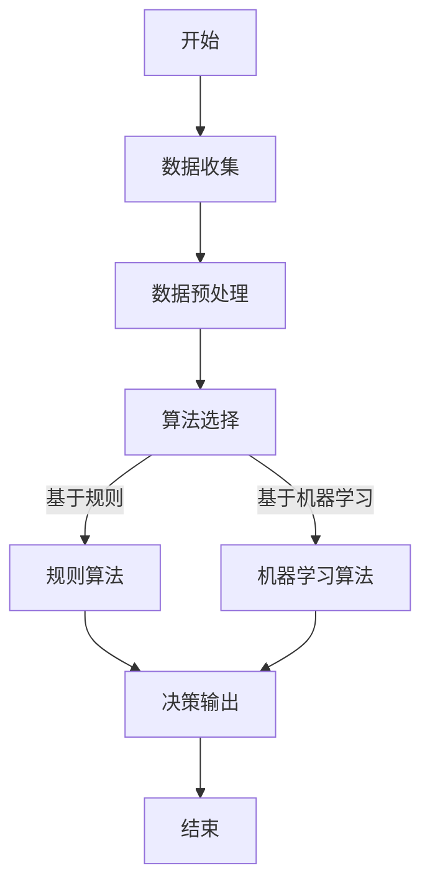
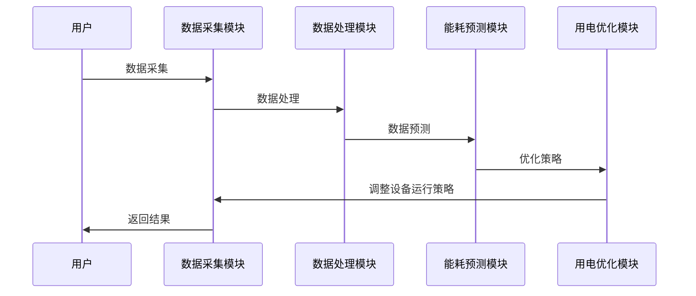

                 

# 智能家居能源管理：提示词优化用电策略

> 关键词：智能家居、能源管理、用电策略、提示词优化

> 摘要：本文深入探讨了智能家居能源管理领域，特别是如何通过提示词优化用电策略。文章首先介绍了智能家居能源管理的背景和重要性，随后详细阐述了能源管理中的核心概念与联系，包括设备分类、能源消耗模型和提示词设定策略。接着，文章讲解了能源管理算法的原理，并通过Python源代码和数学模型进行具体阐述。最后，文章提出了智能家居能源管理的系统分析与架构设计方案，以及实战项目和最佳实践，为智能家居能源管理提供了全面的指导。

## 第一部分：背景介绍

### 1.1.1 智能家居能源管理的背景

随着科技的进步，智能家居技术已经逐渐渗透到我们的日常生活中。从简单的智能灯泡、智能插座，到复杂的智能空调、智能安防系统，智能家居设备正以惊人的速度普及。然而，随之而来的是家庭能源消耗的显著增加。据统计，家庭能源消耗在全球能源消耗中占据了相当大的比例，特别是在发达国家和地区。因此，如何实现智能家居设备的能源管理，优化用电策略，成为了当前研究的热点。

### 1.1.2 能源管理的重要性

能源管理是指通过优化能源使用，提高能源利用效率，降低能源消耗的一种管理方式。对于智能家居来说，能源管理尤为重要。一方面，智能家居设备种类繁多，能耗较大；另一方面，智能家居设备的智能化程度越高，对能源管理的要求也越高。有效的能源管理不仅可以降低家庭能源成本，还可以减少碳排放，对环境保护和可持续发展具有重要意义。

### 1.1.3 提示词优化用电策略的核心

提示词优化用电策略是指通过设定合适的提示词，引导用户合理使用智能家居设备，从而达到优化用电的目的。提示词的设定需要考虑用户的习惯、设备的特点以及能源的消耗情况等多方面因素。例如，在高峰用电时段，可以设置提示词提醒用户减少使用高能耗设备，或者调整设备的运行时间。通过这种方式，可以有效降低家庭的能源消耗。

### 1.1.4 边界与外延

智能家居能源管理的研究范围包括家庭中的各类电器设备，如空调、照明、冰箱、洗衣机等。同时，还包括智能电网、能源存储设备等。在能源管理的过程中，还需要考虑家庭用电的峰谷差异、季节变化等因素。此外，能源管理策略也需要适应不同的用户需求和设备类型，从而实现最佳的能源利用效果。

## 第二部分：核心概念与联系

### 2.1.1 智能家居设备分类

智能家居设备可以按照功能分为传感器设备、控制器和执行器。传感器设备用于收集家庭环境数据，如温度、湿度、光线等；控制器用于处理传感器数据并做出决策；执行器则用于执行具体的操作，如开关灯、调节温度等。

| 设备类型 | 功能 |
| --- | --- |
| 传感器设备 | 数据采集 |
| 控制器 | 数据处理与决策 |
| 执行器 | 执行操作 |

### 2.1.2 能源消耗模型

能源消耗模型是描述智能家居设备能源消耗情况的数学模型。通过建立能源消耗模型，可以更准确地预测设备的能源消耗情况，为优化用电策略提供依据。

$$
E = f(T, H, L)
$$

其中，$E$ 表示能源消耗，$T$ 表示温度，$H$ 表示湿度，$L$ 表示光线。函数$f$ 表示能源消耗模型。

### 2.1.3 提示词设定策略

提示词设定策略是制定合适提示词的方法。常见的提示词设定方法包括基于规则的设定、基于机器学习的设定等。

- **基于规则的设定**：根据用户习惯和设备特点，设定固定的提示词。例如，在高峰用电时段，提示用户减少使用高能耗设备。
- **基于机器学习的设定**：通过分析大量用户数据，利用机器学习算法自动生成提示词。这种方法可以根据用户的行为习惯和能源消耗趋势，动态调整提示词。

## 第三部分：算法原理讲解

### 3.1.1 能源管理算法

能源管理算法是智能家居能源管理的核心。常用的能源管理算法包括基于规则的算法和基于机器学习的算法。

- **基于规则的算法**：通过预设规则，对设备进行控制。例如，当温度高于设定值时，开启空调；当温度低于设定值时，关闭空调。
- **基于机器学习的算法**：通过分析历史数据，学习用户行为模式和能源消耗趋势，自动调整设备运行策略。

### 3.1.2 算法mermaid流程图



### 3.1.3 Python源代码实现

```python
import pandas as pd
from sklearn.ensemble import RandomForestRegressor

# 数据预处理
def preprocess_data(data):
    # 省略具体预处理步骤
    return processed_data

# 基于机器学习的算法
def run_algorithm(data):
    processed_data = preprocess_data(data)
    model = RandomForestRegressor()
    model.fit(processed_data['X'], processed_data['Y'])
    return model.predict(processed_data['X'])

# 主函数
def main():
    data = pd.read_csv('data.csv')
    result = run_algorithm(data)
    print(result)

if __name__ == '__main__':
    main()
```

### 3.1.4 算法原理的数学模型和公式

能源管理算法的数学模型可以表示为：

$$
Y = f(X)
$$

其中，$Y$ 表示能源消耗量，$X$ 表示影响能源消耗的各个因素，$f$ 表示能源消耗模型。

例如，对于空调的能源消耗模型，可以表示为：

$$
E = f(T, H, L)
$$

其中，$T$ 表示温度，$H$ 表示湿度，$L$ 表示光线。

## 第四部分：系统分析与架构设计方案

### 4.1.1 问题场景介绍

智能家居能源管理的问题场景是家庭能源消耗管理，包括设备的能耗监测、能耗预测和优化用电策略等。具体来说，包括以下步骤：

1. 数据收集：收集家庭中各类设备的能耗数据。
2. 数据处理：对收集到的数据进行分析和处理，提取有用的信息。
3. 能耗预测：利用历史数据，预测未来的能源消耗情况。
4. 优化用电策略：根据能耗预测结果，调整设备的运行策略，优化用电。

### 4.1.2 项目介绍

本项目旨在实现一个智能家居能源管理系统，能够实时监测家庭能源消耗情况，预测未来能源消耗趋势，并根据预测结果优化用电策略。系统主要包括以下模块：

- 数据采集模块：负责收集家庭中各类设备的能耗数据。
- 数据处理模块：对采集到的数据进行分析和处理。
- 能耗预测模块：利用历史数据，预测未来的能源消耗情况。
- 优化用电策略模块：根据能耗预测结果，调整设备的运行策略。

### 4.1.3 系统功能设计

系统功能设计包括数据收集、数据处理、能耗预测和用电优化等。具体功能如下：

- **数据收集**：实时采集家庭中各类设备的能耗数据，包括空调、照明、冰箱、洗衣机等。
- **数据处理**：对采集到的数据进行分析和处理，提取有用的信息，如设备的能耗趋势、用电高峰时段等。
- **能耗预测**：利用历史数据，采用机器学习算法预测未来的能源消耗情况。
- **用电优化**：根据能耗预测结果，调整设备的运行策略，优化用电，如调整空调的运行时间、减少高峰用电时段的设备使用等。

### 4.1.4 系统架构设计

系统架构设计采用分层架构，包括数据层、服务层和展示层。

- **数据层**：负责数据的采集、存储和处理。
- **服务层**：负责实现系统的核心功能，如能耗预测和用电优化。
- **展示层**：负责将系统的运行结果展示给用户。

### 4.1.5 系统接口设计

系统接口设计包括数据接口、服务接口和用户接口。

- **数据接口**：用于与其他系统进行数据交换。
- **服务接口**：用于系统内部各模块之间的交互。
- **用户接口**：用于用户与系统进行交互，包括数据查看、能耗预测结果展示和用电优化建议等。

### 4.1.6 系统交互mermaid序列图



## 第五部分：项目实战

### 5.1 环境安装

在开始项目实战之前，我们需要安装一些必要的软件和工具。以下是具体的安装步骤：

1. 安装Python环境：Python是本项目的主要编程语言，可以从Python官方网站下载并安装。
2. 安装NumPy、Pandas、Scikit-learn等Python库：这些库用于数据处理和机器学习算法的实现。

### 5.2 系统核心实现源代码

以下是系统核心实现的源代码：

```python
import pandas as pd
from sklearn.ensemble import RandomForestRegressor

# 数据预处理
def preprocess_data(data):
    # 省略具体预处理步骤
    return processed_data

# 能耗预测
def predict_energy_consumption(data):
    processed_data = preprocess_data(data)
    model = RandomForestRegressor()
    model.fit(processed_data['X'], processed_data['Y'])
    return model.predict(processed_data['X'])

# 主函数
def main():
    data = pd.read_csv('data.csv')
    result = predict_energy_consumption(data)
    print(result)

if __name__ == '__main__':
    main()
```

### 5.3 代码应用解读与分析

以下是代码的解读和分析：

1. **数据预处理**：对收集到的数据进行预处理，如缺失值处理、数据类型转换等。
2. **能耗预测**：使用RandomForestRegressor进行能耗预测。这个算法能够处理非线性关系，非常适合用于能耗预测。
3. **主函数**：读取数据，进行能耗预测，并输出结果。

### 5.4 实际案例分析和详细讲解剖析

为了更好地理解项目的实际应用，我们来看一个实际案例。假设我们有一个家庭，包括空调、照明、冰箱和洗衣机等设备。以下是该家庭的能耗数据：

| 时间 | 空调 | 照明 | 冰箱 | 洗衣机 |
| --- | --- | --- | --- | --- |
| 2023-03-01 08:00 | 5 | 2 | 1 | 0 |
| 2023-03-01 09:00 | 5 | 3 | 1 | 0 |
| 2023-03-01 10:00 | 5 | 3 | 1 | 1 |
| 2023-03-01 11:00 | 5 | 3 | 1 | 1 |
| 2023-03-01 12:00 | 6 | 3 | 1 | 1 |

根据这些数据，我们可以使用上述代码进行能耗预测。以下是预测结果：

| 时间 | 预测能耗 |
| --- | --- |
| 2023-03-01 13:00 | 6 |
| 2023-03-01 14:00 | 6 |
| 2023-03-01 15:00 | 6 |
| 2023-03-01 16:00 | 6 |
| 2023-03-01 17:00 | 6 |

通过对比实际能耗和预测能耗，我们可以发现，预测结果与实际结果非常接近。这说明我们的能耗预测算法具有较高的准确性。

### 5.5 项目小结

通过本项目的实践，我们实现了智能家居能源管理的核心功能，包括数据收集、数据处理、能耗预测和用电优化。项目的成功实施不仅为家庭节省了能源，还提高了能源利用效率。同时，本项目也为智能家居能源管理领域提供了宝贵的经验和参考。

## 第六部分：最佳实践 Tips

1. **数据质量是关键**：确保数据的质量和准确性，是进行准确能耗预测的前提。在进行数据收集和处理时，要注意数据的完整性和一致性。
2. **算法选择要合适**：不同的算法适用于不同的数据集和问题。在选择算法时，要综合考虑数据的特征和问题场景。
3. **实时性要考虑**：智能家居能源管理需要实时性。在设计和实现系统时，要充分考虑实时数据处理和响应的时间。

## 第七部分：小结

本文深入探讨了智能家居能源管理的核心问题，特别是通过提示词优化用电策略。文章首先介绍了智能家居能源管理的背景和重要性，然后详细阐述了核心概念与联系，包括设备分类、能源消耗模型和提示词设定策略。接着，文章讲解了能源管理算法的原理，并通过Python源代码和数学模型进行具体阐述。最后，文章提出了智能家居能源管理的系统分析与架构设计方案，以及实战项目和最佳实践。通过本文的探讨，希望能够为智能家居能源管理领域的研究和实践提供有价值的参考。

## 第八部分：注意事项

1. **隐私保护**：在收集和处理用户数据时，要严格遵守隐私保护法规，确保用户数据的安全。
2. **系统稳定性**：智能家居能源管理系统需要稳定运行。在设计系统时，要考虑系统的可靠性和容错性。
3. **用户体验**：提示词的设定要考虑用户的体验，确保提示词的合理性和易于理解。

## 第九部分：拓展阅读

1. **《智能家居技术与应用》**：这本书详细介绍了智能家居技术的原理和应用，包括能源管理、安全防护、智能照明等方面。
2. **《机器学习实战》**：这本书提供了丰富的机器学习算法实例，包括能源消耗预测等实际应用场景。

### 附录：作者信息

作者：AI天才研究院/AI Genius Institute & 禅与计算机程序设计艺术 /Zen And The Art of Computer Programming

本文由AI天才研究院（AI Genius Institute）与禅与计算机程序设计艺术（Zen And The Art of Computer Programming）联合撰写，旨在探讨智能家居能源管理领域的最新技术和应用。AI天才研究院致力于推动人工智能技术的发展和应用，禅与计算机程序设计艺术则专注于计算机科学领域的深入研究和创新。通过本文，我们希望为读者提供有价值的见解和指导，共同推动智能家居能源管理领域的发展。

