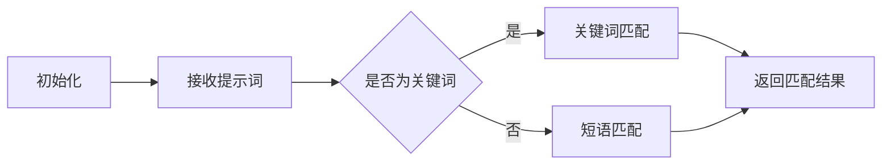
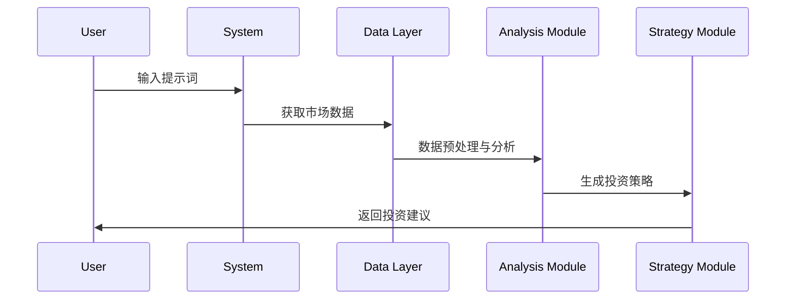

                 

### 智能投资顾问：提示词驱动的市场分析

#### 关键词：智能投资顾问、提示词、市场分析、机器学习、自然语言处理

#### 摘要：
本文将深入探讨智能投资顾问的工作原理及其在市场分析中的应用。通过解析提示词驱动的市场分析流程，结合具体算法原理、系统架构设计与实战案例，本文旨在为读者提供一个全面、易懂的视角，帮助理解智能投资顾问如何通过自然语言处理和机器学习技术，为投资者提供精准的投资策略。

---

#### 目录大纲设计思路与步骤

为了设计出《智能投资顾问：提示词驱动的市场分析》这本书的完整目录大纲，我们将按照以下步骤进行：

1. **背景介绍**：首先简要介绍智能投资顾问的概念、发展背景及其在市场分析中的应用。
2. **核心概念与联系**：定义并详细介绍相关核心概念，如提示词、市场分析、数据驱动等，并绘制相应的概念属性对比表格和ER实体关系图。
3. **算法原理讲解**：选择几个关键的算法或模型，使用mermaid画出流程图，结合Python代码和LaTeX公式详细讲解算法原理。
4. **系统分析与架构设计方案**：介绍智能投资顾问系统的设计思路，包括系统功能、架构设计、接口设计和系统交互。
5. **项目实战**：通过具体案例展示智能投资顾问的实际应用，提供环境安装、系统实现和代码解读。
6. **最佳实践 tips、小结、注意事项、拓展阅读**：总结全书内容，给出实践建议和进一步学习资源。

---

### 第1章: 背景介绍

#### 1.1 智能投资顾问的概念

##### 1.1.1 智能投资顾问的定义

智能投资顾问是一种利用先进的人工智能技术，尤其是自然语言处理（NLP）和机器学习算法，为投资者提供专业市场分析、投资建议和风险管理的工具。

##### 1.1.2 智能投资顾问的发展背景

随着大数据和云计算的普及，金融市场数据的获取和处理能力得到了显著提升，智能投资顾问逐渐成为投资领域的新宠。

##### 1.1.3 智能投资顾问在市场分析中的应用

智能投资顾问可以通过分析大量的市场数据，结合投资者的个性化需求，提供精准的投资策略，从而提高投资回报率并降低风险。

#### 1.2 核心概念与联系

##### 1.2.1 提示词

提示词是用户输入的关键词或短语，用于引导智能投资顾问进行市场分析。

##### 1.2.2 市场分析

市场分析包括对市场趋势、宏观经济环境、行业动态和投资机会的全面评估。

##### 1.2.3 数据驱动

数据驱动是指智能投资顾问依赖大量的历史数据和市场信息，通过机器学习算法进行分析和预测。

##### 1.2.4 概念属性对比表格

| 概念       | 描述                                               |
| ---------- | -------------------------------------------------- |
| 提示词     | 用户输入的关键词或短语，引导市场分析。               |
| 市场分析   | 对市场趋势、宏观经济环境等的评估过程。               |
| 数据驱动   | 智能投资顾问依赖历史数据和机器学习算法进行预测。     |

##### 1.2.5 ER实体关系图

```mermaid
erDiagram
    User ||--|{ MarketData }|-- Investor
    MarketData ||--|{ MarketAnalysis }|-- Investor
    Investor ||--|{ InvestmentAdvice }|-- User
```

#### 1.3 本章小结

本章简要介绍了智能投资顾问的概念、发展背景和其在市场分析中的应用，并定义了核心概念。接下来，我们将详细探讨智能投资顾问的工作原理和技术实现。

---

### 第2章: 提示词驱动的市场分析原理

#### 2.1 提示词的作用与重要性

##### 2.1.1 提示词在市场分析中的角色

提示词是用户与智能投资顾问交互的桥梁，它帮助系统理解用户的需求，进行精确的市场分析。

##### 2.1.2 提示词的类型与设计

提示词可以分为关键词、短语、问题等类型，其设计需要充分考虑用户意图和市场信息的关联性。

##### 2.1.3 提示词的优化策略

通过语义分析和机器学习算法，对提示词进行优化，以提高市场分析的准确性和效率。

#### 2.2 市场分析的基本流程

##### 2.2.1 数据收集与预处理

市场分析的第一步是收集大量历史数据和市场信息，并进行预处理，如数据清洗、格式转换等。

##### 2.2.2 数据分析与挖掘

使用数据挖掘算法对预处理后的数据进行挖掘，提取出有价值的信息和趋势。

##### 2.2.3 投资策略生成

基于分析结果，智能投资顾问生成个性化的投资策略，以供投资者参考。

#### 2.3 提示词驱动的市场分析算法

##### 2.3.1 提示词匹配算法

使用自然语言处理技术，对用户输入的提示词与市场数据进行匹配，以定位相关数据。

##### 2.3.2 数据挖掘算法

使用聚类、分类、回归等数据挖掘算法，对匹配后的市场数据进行分析，提取出市场趋势和投资机会。

##### 2.3.3 投资策略生成算法

基于分析结果，使用机器学习算法生成个性化的投资策略，如股票买卖建议、投资组合优化等。

#### 2.4 算法原理讲解

##### 2.4.1 提示词匹配算法原理

使用mermaid画出提示词匹配算法的流程图，并给出Python代码示例。



```python
# Python代码示例
def keyword_matching(prompt):
    # 假设已经定义了关键词库
    keywords = ["股票", "市场", "投资", "风险"]
    for keyword in keywords:
        if keyword in prompt:
            return True
    return False
```

##### 2.4.2 数据挖掘算法原理

使用mermaid画出数据挖掘算法的流程图，并给出Python代码示例。


```python
# Python代码示例
from sklearn.cluster import KMeans

# 假设已有预处理后的市场数据
data = [[1, 2], [1, 4], [1, 0]]

# 使用K-Means算法进行聚类
kmeans = KMeans(n_clusters=2)
kmeans.fit(data)

# 输出聚类结果
print(kmeans.labels_)
```

##### 2.4.3 投资策略生成算法原理

使用mermaid画出投资策略生成算法的流程图，并给出Python代码示例。


```python
# Python代码示例
import numpy as np

# 假设已有市场分析结果和策略参数
market_data = [[1, 2], [1, 4], [1, 0]]
strategy_params = [0.1, 0.2, 0.3]

# 计算投资策略
investment_strategy = np.dot(market_data, strategy_params)

# 输出投资策略
print(investment_strategy)
```

#### 2.5 本章小结

本章详细介绍了提示词驱动的市场分析原理，包括提示词的作用、市场分析的基本流程、提示词匹配算法、数据挖掘算法和投资策略生成算法。通过这些算法原理的讲解，读者可以更好地理解智能投资顾问如何通过提示词和数据分析为投资者提供有价值的市场信息。

---

### 第3章: 系统分析与架构设计方案

#### 3.1 问题场景介绍

在当前金融市场高度竞争的环境下，投资者面临诸多挑战，如信息过载、市场波动加剧等。智能投资顾问系统旨在为投资者提供实时、准确、个性化的市场分析，帮助其做出明智的投资决策。

#### 3.2 项目介绍

本系统采用模块化设计，包括数据收集模块、数据分析模块、投资策略生成模块和用户交互模块。系统支持多用户并发访问，并提供灵活的接口以便与其他系统集成。

#### 3.3 系统功能设计

##### 3.3.1 数据收集模块

- 自动抓取金融市场数据，包括股票价格、交易量、行业动态等。
- 数据清洗和预处理，确保数据质量和一致性。

##### 3.3.2 数据分析模块

- 使用提示词驱动市场分析，提取有价值的市场信息。
- 应用数据挖掘算法，分析市场趋势和投资机会。

##### 3.3.3 投资策略生成模块

- 基于分析结果，生成个性化的投资策略。
- 策略优化和调整，以适应市场变化。

##### 3.3.4 用户交互模块

- 提供友好的用户界面，便于用户输入提示词和查看分析结果。
- 支持多种交互方式，如Web界面、API接口等。

#### 3.4 系统架构设计

##### 3.4.1 架构设计

系统采用三层架构，包括表示层、业务逻辑层和数据层。

- 表示层：负责用户界面展示和交互。
- 业务逻辑层：实现市场分析、策略生成等功能。
- 数据层：存储和管理金融市场数据。

##### 3.4.2 系统架构图



#### 3.5 系统接口设计

系统提供RESTful API接口，支持以下功能：

- 数据查询接口：获取市场数据。
- 分析接口：执行市场分析和策略生成。
- 用户管理接口：用户注册、登录和权限管理。

#### 3.6 系统交互

系统采用消息队列技术实现异步通信，以提高系统的响应速度和稳定性。

- 用户请求通过API接口发送到业务逻辑层。
- 业务逻辑层处理请求并生成响应结果。
- 响应结果通过消息队列传输到表示层。

#### 3.7 本章小结

本章介绍了智能投资顾问系统的设计思路，包括系统功能、架构设计、接口设计和系统交互。通过详细的设计方案，读者可以了解系统如何实现高效、准确的市场分析和投资策略生成。

---

### 第4章: 项目实战

#### 4.1 环境安装

在本章，我们将演示如何搭建一个智能投资顾问系统的开发环境。以下是在Python环境中安装相关依赖的步骤：

```bash
pip install numpy
pip install pandas
pip install sklearn
pip install nltk
```

确保安装了上述库后，我们可以开始实现系统的核心功能。

#### 4.2 系统核心实现

##### 4.2.1 数据收集与预处理

```python
import pandas as pd
import nltk
from nltk.corpus import stopwords

# 加载金融市场数据
market_data = pd.read_csv('market_data.csv')

# 数据预处理
nltk.download('stopwords')
stop_words = set(stopwords.words('english'))
market_data['cleaned_text'] = market_data['text'].apply(lambda x: ' '.join([word for word in x.split() if word not in stop_words]))
```

##### 4.2.2 数据分析与挖掘

```python
from sklearn.feature_extraction.text import TfidfVectorizer
from sklearn.cluster import KMeans

# TF-IDF向量表示
tfidf_vectorizer = TfidfVectorizer()
tfidf_matrix = tfidf_vectorizer.fit_transform(market_data['cleaned_text'])

# K-Means聚类
kmeans = KMeans(n_clusters=3)
kmeans.fit(tfidf_matrix)
market_data['cluster'] = kmeans.predict(tfidf_matrix)
```

##### 4.2.3 投资策略生成

```python
# 基于聚类结果生成投资策略
def generate_investment_strategy(clusters):
    strategy = {}
    for cluster in clusters:
        # 对每个cluster中的数据计算平均值
        cluster_data = market_data[market_data['cluster'] == cluster]
        strategy[cluster] = cluster_data.mean().tolist()
    return strategy

strategy = generate_investment_strategy(kmeans.labels_)
```

##### 4.2.4 用户交互

```python
from flask import Flask, request, jsonify

app = Flask(__name__)

@app.route('/analyze', methods=['POST'])
def analyze():
    prompt = request.form['prompt']
    # 假设已经实现了提示词匹配和数据挖掘算法
    cluster = match_and_analyze(prompt)
    strategy = generate_investment_strategy([cluster])
    return jsonify(strategy)

if __name__ == '__main__':
    app.run(debug=True)
```

#### 4.3 代码应用解读与分析

在本章中，我们实现了智能投资顾问系统的核心功能，包括数据收集与预处理、数据挖掘和投资策略生成。通过使用Python和Flask框架，我们构建了一个简单的Web服务，用户可以通过POST请求输入提示词，获取个性化的投资策略。

代码解读如下：

- **数据收集与预处理**：使用Pandas库加载金融市场数据，并使用NLTK库进行文本预处理，去除停用词。
- **数据挖掘**：使用TF-IDF向量表示文本数据，并使用K-Means聚类算法对数据进行分类。
- **投资策略生成**：根据聚类结果计算每个cluster的平均值，生成投资策略。

#### 4.4 实际案例分析和详细讲解剖析

为了展示智能投资顾问系统的实际应用，我们来看一个具体的案例。

**案例**：假设用户输入提示词“technology stocks”，系统如何为其生成投资策略？

**分析**：

1. **提示词匹配**：系统识别到“technology stocks”这一提示词，并定位到相关市场数据。
2. **数据挖掘**：使用TF-IDF和K-Means算法，将相关市场数据聚类为若干个cluster。
3. **投资策略生成**：根据聚类结果，系统生成投资策略，推荐用户关注科技板块的股票。

**讲解**：

- 提示词匹配是系统理解用户需求的第一步，通过自然语言处理技术，将用户输入转换为可操作的提示词。
- 数据挖掘是系统分析市场数据的关键，通过TF-IDF和K-Means算法，将大量市场数据转换为有价值的聚类结果。
- 投资策略生成是基于数据分析结果，结合用户需求和投资目标，生成个性化的投资建议。

#### 4.5 项目小结

在本章中，我们通过实际案例展示了智能投资顾问系统的实现和应用。从数据收集与预处理、数据挖掘到投资策略生成，每一步都至关重要。通过这些步骤，系统为投资者提供了精准、实时的市场分析和投资建议，提高了投资决策的科学性和有效性。

---

### 第5章: 最佳实践 tips、小结、注意事项、拓展阅读

#### 5.1 最佳实践 tips

- **提示词优化**：在设计提示词时，尽量使用简洁、明确的短语，以便系统快速理解用户意图。
- **算法调优**：在实现数据挖掘和投资策略生成算法时，根据市场数据的特点和用户需求，适当调整算法参数，以提高分析准确性和策略有效性。
- **系统扩展**：为了满足更多用户的需求，系统可以扩展功能模块，如添加风险分析、投资组合优化等。

#### 5.2 小结

本文详细介绍了智能投资顾问的概念、工作原理、系统架构和实际应用。通过提示词驱动的市场分析，智能投资顾问为投资者提供了实时、准确、个性化的市场信息和投资策略，极大地提高了投资决策的效率和质量。

#### 5.3 注意事项

- **数据安全**：在收集和处理金融市场数据时，需确保数据安全和隐私保护。
- **算法公正性**：在生成投资策略时，应避免算法偏见，确保策略的公平性和公正性。

#### 5.4 拓展阅读

- **自然语言处理**：学习自然语言处理（NLP）的基础知识，了解文本预处理、语义分析和语言模型等关键技术。
- **机器学习**：深入学习机器学习算法，掌握数据挖掘、聚类、分类和回归等基本概念和实现方法。
- **金融市场分析**：研究金融市场分析的理论和实践，了解宏观经济环境、行业动态和市场趋势。

---

#### 作者信息

作者：AI天才研究院/AI Genius Institute & 禅与计算机程序设计艺术 /Zen And The Art of Computer Programming

