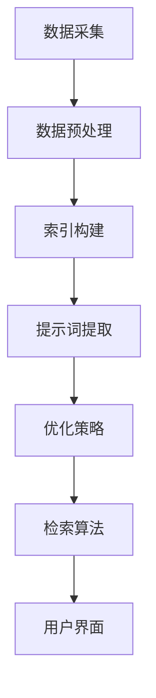
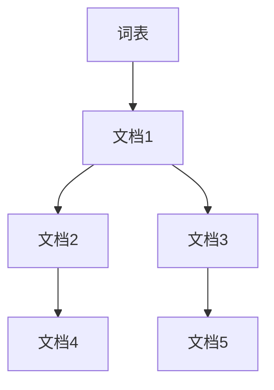
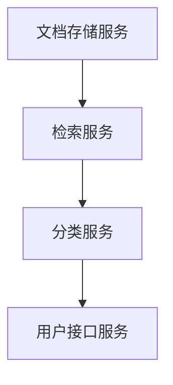

                 

### 摘要

智能文档管理作为信息时代的重要技术，通过提示词驱动的信息检索系统，实现了对大量文档的高效管理。本文将从背景与意义、基本概念、系统设计与实现、项目实战以及最佳实践与展望五个方面展开，详细探讨智能文档管理技术的应用与发展。通过解析智能文档管理的核心概念和原理，阐述提示词驱动的信息检索系统的设计与实现方法，分析智能文档管理系统的优化策略，并结合实际案例进行剖析，旨在为读者提供全面、系统的智能文档管理技术指南。最后，本文将对智能文档管理的未来发展趋势进行展望，为相关领域的创新应用提供新思路。

### 目录大纲

**《智能文档管理：提示词驱动的信息检索系统》目录大纲**

**第一部分：智能文档管理概述**

**第1章：智能文档管理的背景与意义**  
- 1.1 信息爆炸时代的需求  
- 1.2 智能文档管理的定义  
- 1.3 提示词驱动的信息检索  
- 1.4 智能文档管理的应用领域

**第2章：智能文档管理的基本概念**  
- 2.1 文档结构与索引  
- 2.2 信息检索原理  
- 2.3 提示词的生成与优化  
- 2.4 文档的自动分类与聚类

**第二部分：提示词驱动的信息检索**

**第3章：提示词驱动的信息检索系统设计**  
- 3.1 系统总体架构设计  
- 3.2 数据预处理与索引构建  
- 3.3 提示词的提取与优化策略  
- 3.4 检索算法设计与实现

**第4章：智能检索算法详解**  
- 4.1 搜索引擎算法基础  
- 4.2 提示词匹配算法  
- 4.3 排序算法与评分模型  
- 4.4 检索算法性能评估

**第5章：智能文档管理系统优化**  
- 5.1 系统性能优化  
- 5.2 检索结果的个性化推荐  
- 5.3 检索系统安全性与隐私保护  
- 5.4 智能文档管理的未来趋势

**第三部分：智能文档管理项目实战**

**第6章：智能文档管理系统的搭建**  
- 6.1 项目环境配置  
- 6.2 系统核心代码实现  
- 6.3 系统调试与优化  
- 6.4 项目部署与上线

**第7章：智能文档管理的实际案例**  
- 7.1 案例背景与需求分析  
- 7.2 智能检索系统的设计与实现  
- 7.3 检索效果评估与优化  
- 7.4 项目总结与反思

**第四部分：智能文档管理最佳实践与展望**

**第8章：智能文档管理最佳实践**  
- 8.1 提高文档管理的效率  
- 8.2 系统定制化开发  
- 8.3 数据安全与隐私保护  
- 8.4 检索效果提升策略

**第9章：智能文档管理的未来发展趋势**  
- 9.1 技术创新与突破  
- 9.2 行业应用拓展  
- 9.3 智能化与自动化  
- 9.4 挑战与机遇

**总结：**

本书的目录大纲共分为四个部分，涵盖了智能文档管理的背景与意义、基本概念、提示词驱动的信息检索系统设计、项目实战以及最佳实践和未来发展趋势。每个部分均包含多个章节，确保内容全面、逻辑清晰，旨在帮助读者深入了解并掌握智能文档管理技术。

## 第一部分：智能文档管理概述

### 第1章：智能文档管理的背景与意义

在当今信息爆炸的时代，数据量呈现爆炸式增长，传统的文档管理方式已经无法满足人们对信息检索和处理的需求。智能文档管理作为一种新兴技术，通过引入人工智能和大数据分析，实现了对文档内容的高效管理和快速检索。本章节将从以下几个方面展开，探讨智能文档管理的背景、意义及其应用领域。

#### 1.1 信息爆炸时代的需求

随着互联网的普及和信息技术的发展，全球范围内数据量呈指数级增长。据估算，每两年全球产生的数据量就会翻一番。在这种情况下，如何快速、准确地获取所需信息成为了许多企业和个人面临的难题。传统文档管理方法主要依赖于人工分类、标记和检索，不仅效率低下，而且容易出错。因此，为了应对信息爆炸时代的需求，一种智能、高效的文档管理方法应运而生。

#### 1.2 智能文档管理的定义

智能文档管理是一种基于人工智能技术和大数据分析的文档管理方法，旨在通过自动化、智能化的方式实现文档的存储、分类、检索和共享。它利用自然语言处理、机器学习、数据挖掘等技术，对文档内容进行深入分析和理解，从而提供更为精准和高效的文档检索服务。

#### 1.3 提示词驱动的信息检索

在智能文档管理中，提示词驱动的信息检索是一个核心功能。提示词，又称为关键词，是指用于描述文档主题或内容的单词或短语。通过提示词，用户可以快速定位到相关文档，而无需逐个浏览大量文档。提示词驱动的信息检索利用自然语言处理技术，对用户输入的提示词进行分析和理解，然后从大量文档中检索出相关内容。

#### 1.4 智能文档管理的应用领域

智能文档管理在许多领域都得到了广泛应用。以下是几个典型的应用领域：

1. **企业文档管理**：企业中产生的文档种类繁多，包括合同、报告、邮件、文件等。智能文档管理可以帮助企业实现文档的高效存储、分类和检索，提高工作效率。

2. **教育领域**：学校和教育机构中存在大量的学习资料和教学文档。智能文档管理可以为学生和教师提供便捷的检索服务，帮助他们快速找到所需的学习资源和教学资料。

3. **医疗领域**：医疗行业中存在着大量的病历、医学文献和研究报告。智能文档管理可以帮助医疗人员快速获取相关医学信息，提高医疗服务的质量和效率。

4. **法律领域**：律师和法务人员需要处理大量的法律文档和案例。智能文档管理可以帮助他们快速检索相关法律信息，提高工作效率。

5. **科研领域**：科研人员需要查阅大量的学术论文和研究报告。智能文档管理可以为科研人员提供高效的文献检索服务，加快科研进程。

#### 1.5 本章小结

本章节介绍了智能文档管理的背景、意义及其应用领域。随着信息爆炸时代的到来，传统的文档管理方法已经无法满足需求，智能文档管理作为一种新兴技术，通过引入人工智能和大数据分析，实现了对文档内容的高效管理和快速检索。智能文档管理在多个领域都得到了广泛应用，具有巨大的发展潜力。

### 第2章：智能文档管理的基本概念

智能文档管理作为一种先进的信息管理方法，其核心在于对文档内容进行有效组织、管理和检索。为了深入了解智能文档管理，我们需要掌握一些基本概念，包括文档结构、索引、信息检索原理、提示词生成与优化以及文档自动分类与聚类。

#### 2.1 文档结构与索引

文档结构是指文档的组织形式和内容布局。一个文档通常包括标题、摘要、正文、参考文献等多个部分。了解文档结构有助于更好地进行文档处理和检索。索引则是为了快速查找文档而创建的一种数据结构，它通常包含文档的关键字、标题、摘要等信息。通过索引，用户可以快速定位到所需文档。

#### 2.2 信息检索原理

信息检索是指从大量文档中找到用户所需信息的过程。其基本原理包括以下几方面：

1. **关键字匹配**：用户输入关键词，系统通过索引查找包含这些关键词的文档。
2. **全文检索**：系统对整个文档进行文本分析，查找与用户输入相关的内容。
3. **语义检索**：利用自然语言处理技术，理解用户输入的含义，并检索出相关文档。

#### 2.3 提示词的生成与优化

提示词是用户用于检索文档的关键词或短语。生成有效的提示词可以提高检索的准确性和效率。提示词的生成通常包括以下步骤：

1. **词频统计**：统计文档中各个词的出现频率，选择出现频率较高的词作为提示词。
2. **词义分析**：利用自然语言处理技术，分析词的语义关系，选择具有代表性和区分性的词作为提示词。
3. **用户反馈**：根据用户的使用反馈，不断优化提示词的选择和组合。

#### 2.4 文档的自动分类与聚类

文档的自动分类与聚类是指利用机器学习算法，将文档按照内容相似性进行分类或聚类。这有助于提高文档的组织和管理效率。自动分类与聚类的方法包括：

1. **基于内容的分类**：根据文档的内容特征，如文本、图片、音频等，进行分类。
2. **基于模型的分类**：利用监督学习或无监督学习算法，对文档进行分类。
3. **基于聚类的分类**：将文档按照内容相似性进行聚类，然后对每个簇进行命名或分类。

#### 2.5 本章小结

本章节介绍了智能文档管理的基本概念，包括文档结构、索引、信息检索原理、提示词生成与优化以及文档自动分类与聚类。这些基本概念是理解智能文档管理技术的基础，对于后续章节的讨论具有重要意义。

### 第3章：提示词驱动的信息检索系统设计

在智能文档管理系统中，提示词驱动的信息检索系统是其核心模块之一。本章节将详细讨论该系统的设计，包括系统总体架构设计、数据预处理与索引构建、提示词的提取与优化策略以及检索算法设计与实现。

#### 3.1 系统总体架构设计

一个高效的提示词驱动的信息检索系统通常包括以下几个关键模块：

1. **数据采集模块**：负责从各种来源获取文档数据，如文件服务器、数据库等。
2. **数据预处理模块**：对原始数据进行清洗、去重、分词等处理，为后续的索引构建和提示词提取做准备。
3. **索引构建模块**：根据预处理后的数据生成索引，以便快速检索。
4. **提示词提取模块**：利用自然语言处理技术，从文档中提取有效的提示词。
5. **优化策略模块**：对提示词进行优化，以提高检索的准确性和效率。
6. **检索算法模块**：实现提示词驱动的信息检索算法，如基于关键词匹配、全文检索和语义检索等。
7. **用户界面模块**：提供用户输入提示词、查看检索结果的界面。

系统总体架构如图1所示。



#### 3.2 数据预处理与索引构建

数据预处理是信息检索系统的关键步骤之一。其主要任务包括数据清洗、去重、分词、词干提取和停用词过滤等。以下是数据预处理的具体步骤：

1. **数据清洗**：去除无关数据，如HTML标签、空格、换行符等。
2. **去重**：删除重复的文档，确保索引的唯一性。
3. **分词**：将文本分割成单词或短语，为后续处理提供基础。
4. **词干提取**：将单词还原为词干，减少词汇量，提高索引效率。
5. **停用词过滤**：去除常见的无意义词汇，如“的”、“了”、“在”等。

预处理后的数据将被用于构建索引。索引构建的主要目标是实现快速检索。常见的索引结构有倒排索引、前缀树和文档向量表示等。以下是倒排索引的简单示例：



在倒排索引中，每个词都指向包含该词的所有文档。通过查询词表，可以快速找到与该词相关的所有文档。

#### 3.3 提示词的提取与优化策略

提示词的提取是信息检索系统的核心任务之一。有效的提示词可以提高检索的准确性和效率。提示词的提取通常包括以下步骤：

1. **词频统计**：统计每个词在文档中出现的次数，选择出现频率较高的词作为提示词。
2. **词义分析**：利用自然语言处理技术，分析词的语义关系，选择具有代表性和区分性的词作为提示词。
3. **用户反馈**：根据用户的使用反馈，不断优化提示词的选择和组合。

提示词的优化策略主要包括：

1. **去重**：去除重复的提示词，确保提示词的唯一性。
2. **过滤**：过滤掉出现频率过低或过高的提示词，提高提示词的区分度。
3. **权重调整**：根据提示词的重要性和出现频率，调整提示词的权重，提高检索的准确性。

#### 3.4 检索算法设计与实现

检索算法是信息检索系统的核心，其性能直接影响检索效率和准确性。常见的检索算法包括基于关键词匹配、全文检索和语义检索等。

1. **基于关键词匹配的检索**：根据用户输入的提示词，直接在索引中查找包含这些关键词的文档。
2. **全文检索**：对整个文档进行文本分析，查找与用户输入相关的内容。
3. **语义检索**：利用自然语言处理技术，理解用户输入的含义，并检索出相关文档。

以下是基于关键词匹配的检索算法的实现步骤：

1. **预处理**：对用户输入的提示词进行预处理，如分词、词干提取和停用词过滤。
2. **索引查询**：在倒排索引中查找包含预处理后提示词的文档。
3. **结果排序**：根据文档与提示词的匹配程度，对检索结果进行排序，返回用户最相关的文档。

下面是一个简单的Python代码示例，实现基于关键词匹配的检索算法：

```python
# 假设倒排索引为 {'word1': ['doc1', 'doc2'], 'word2': ['doc2', 'doc3']}
def search(query):
    query = preprocess(query)  # 预处理查询词
    results = []
    for word in query:
        if word in index:
            results.extend(index[word])
    results = list(set(results))  # 去除重复结果
    results.sort(key=lambda x: -len(index[x]))  # 根据文档长度排序
    return results

# 预处理函数
def preprocess(word):
    # 分词、词干提取、停用词过滤等操作
    return word

# 假设用户输入的查询词为 ['word1', 'word2']
print(search(['word1', 'word2']))
```

#### 3.5 本章小结

本章节详细讨论了提示词驱动的信息检索系统的设计，包括系统总体架构设计、数据预处理与索引构建、提示词的提取与优化策略以及检索算法设计与实现。通过这一系列设计，实现了对大量文档的高效管理和快速检索，为智能文档管理奠定了坚实基础。

### 第4章：智能检索算法详解

在智能文档管理系统中，检索算法的性能直接影响用户体验和系统效率。本章节将深入探讨几种常见的智能检索算法，包括搜索引擎算法基础、提示词匹配算法、排序算法与评分模型以及检索算法性能评估。

#### 4.1 搜索引擎算法基础

搜索引擎是智能检索的核心组件，其核心算法包括PageRank、LSI（Latent Semantic Indexing）、TF-IDF（Term Frequency-Inverse Document Frequency）等。

1. **PageRank算法**：PageRank是一种基于网页之间链接关系的排序算法，用于评估网页的重要性。其基本思想是，一个网页的重要性取决于指向该网页的其他网页的数量和质量。PageRank算法通过迭代计算网页的排名，使其具有更好的鲁棒性和准确性。

2. **LSI算法**：LSI（Latent Semantic Indexing）是一种基于语义相似性的索引方法，通过将文档映射到高维空间中的低维子空间，从而实现语义检索。LSI算法利用SVD（Singular Value Decomposition）将文档矩阵分解，从而找到文档之间的语义相似性。

3. **TF-IDF算法**：TF-IDF（Term Frequency-Inverse Document Frequency）是一种基于词频和逆文档频率的权重计算方法。TF（Term Frequency）表示某个词在文档中出现的频率，IDF（Inverse Document Frequency）表示某个词在整个文档集合中的稀疏程度。TF-IDF算法通过计算词的TF-IDF权重，可以更好地衡量词的重要性和相关度。

#### 4.2 提示词匹配算法

提示词匹配算法是智能检索的关键步骤，其目的是找到与用户输入的提示词最相关的文档。常见的提示词匹配算法包括布尔检索、词向量匹配和神经网络检索等。

1. **布尔检索**：布尔检索是基于布尔代数的检索方法，通过组合使用AND、OR、NOT等逻辑运算符，实现对多个关键词的检索。布尔检索简单易懂，但灵活性较差，难以处理复杂查询。

2. **词向量匹配**：词向量匹配是将文档和查询词转换为向量表示，然后计算它们之间的相似度。常见的词向量表示方法有Word2Vec、GloVe等。词向量匹配可以通过余弦相似度、欧氏距离等度量方法，实现高效、准确的检索。

3. **神经网络检索**：神经网络检索是一种基于深度学习的检索方法，通过神经网络模型对文档和查询词进行编码和相似度计算。常见的神经网络检索模型有Siamese网络、Transformer等。神经网络检索具有较好的灵活性和表达能力，可以处理复杂的查询和长文本。

#### 4.3 排序算法与评分模型

检索结果的排序对于用户体验至关重要。常见的排序算法包括基于频率的排序、基于文档重要性的排序和基于用户兴趣的排序等。

1. **基于频率的排序**：基于频率的排序算法根据文档的访问频率或检索频率进行排序。这种排序方法简单直观，但容易导致冷门文档被忽略。

2. **基于文档重要性的排序**：基于文档重要性的排序算法通过计算文档的PageRank、TF-IDF权重等指标，对文档进行排序。这种排序方法可以较好地反映文档的重要性和相关性。

3. **基于用户兴趣的排序**：基于用户兴趣的排序算法根据用户的浏览历史、搜索记录等，分析用户的兴趣偏好，对检索结果进行个性化排序。这种排序方法可以提高用户的检索满意度。

评分模型是排序算法的核心组成部分，用于计算文档与查询词之间的相似度或相关性。常见的评分模型包括：

1. **点积模型**：点积模型计算文档和查询词的词向量表示的点积，作为两者的相似度评分。点积模型简单直观，但难以处理长文本和语义复杂查询。

2. **余弦相似度模型**：余弦相似度模型计算文档和查询词的词向量表示之间的余弦相似度，作为两者的相似度评分。余弦相似度模型在处理长文本和语义复杂查询时具有较好的性能。

3. **Transformer模型**：Transformer模型是一种基于自注意力机制的深度学习模型，可以处理长文本和语义复杂查询。Transformer模型通过自注意力机制，自适应地计算文档和查询词之间的相似度评分。

#### 4.4 检索算法性能评估

检索算法的性能评估是确保系统质量和用户体验的关键环节。常见的性能评估指标包括准确率、召回率、F1值、平均响应时间等。

1. **准确率**：准确率是指检索结果中与查询词最相关的文档所占的比例。准确率越高，说明检索算法的准确性越好。

2. **召回率**：召回率是指检索结果中包含所有相关文档的比例。召回率越高，说明检索算法的全面性越好。

3. **F1值**：F1值是准确率和召回率的调和平均，用于综合评估检索算法的性能。F1值介于准确率和召回率之间，可以更好地反映检索算法的整体性能。

4. **平均响应时间**：平均响应时间是指用户提交查询到获取检索结果的平均时间。平均响应时间越短，说明检索算法的效率越高。

#### 4.5 本章小结

本章节详细介绍了智能检索算法的基础知识，包括搜索引擎算法、提示词匹配算法、排序算法与评分模型以及检索算法性能评估。通过这些算法的深入探讨，我们可以更好地理解智能检索系统的设计和实现方法，为智能文档管理技术的应用提供有力支持。

### 第5章：智能文档管理系统优化

在智能文档管理系统中，优化系统性能、提升检索结果质量和确保系统安全与隐私保护是关键任务。本章将深入探讨这些优化策略，为智能文档管理系统提供全面的性能提升方案。

#### 5.1 系统性能优化

系统性能优化是提高智能文档管理系统效率的重要手段。以下是一些常见的优化策略：

1. **索引优化**：索引是检索系统的基础，优化索引结构可以显著提高检索速度。常见的索引优化方法包括：

   - **倒排索引压缩**：通过压缩倒排索引，减少存储空间和提高检索效率。
   - **布隆过滤器**：使用布隆过滤器加速索引查询，提高系统的响应速度。
   - **并发控制**：优化并发处理机制，确保多个用户同时访问系统时，系统的性能不会受到影响。

2. **缓存策略**：利用缓存技术，将频繁访问的文档或检索结果存储在内存中，减少磁盘IO操作，提高系统响应速度。常见的缓存策略包括：

   - **内存缓存**：将常用数据存储在内存中，提高访问速度。
   - **分布式缓存**：使用分布式缓存系统，如Redis，实现大规模数据的快速访问。

3. **负载均衡**：通过负载均衡技术，将用户请求分配到多个服务器上，确保系统的负载均衡，避免单点故障，提高系统的可用性和可靠性。

4. **并行处理**：利用并行计算技术，对大数据进行处理，提高系统的处理速度。例如，可以使用MapReduce框架对大量文档进行并行索引构建。

5. **查询优化**：优化查询语句和查询执行计划，减少查询执行时间。例如，使用预编译语句、索引提示等技术，提高查询效率。

#### 5.2 检索结果的个性化推荐

个性化推荐是提升智能文档管理系统用户体验的重要手段。以下是一些常见的个性化推荐策略：

1. **基于内容的推荐**：根据用户的历史检索记录和文档特征，推荐与用户兴趣相关的文档。例如，当用户检索某个文档后，系统可以推荐与该文档内容相似的其他文档。

2. **基于协同过滤的推荐**：利用用户的历史检索记录和相似用户的行为，推荐用户可能感兴趣的文档。协同过滤方法包括基于用户的协同过滤（User-based Collaborative Filtering）和基于项目的协同过滤（Item-based Collaborative Filtering）。

3. **基于模型的推荐**：利用机器学习模型，如矩阵分解、神经网络等，预测用户对文档的兴趣度，并推荐相关文档。

4. **混合推荐**：结合多种推荐策略，如基于内容的推荐和基于协同过滤的推荐，提高推荐效果。例如，可以先基于用户历史检索记录找到相似用户，再基于这些用户的兴趣推荐文档。

#### 5.3 检索系统安全性与隐私保护

智能文档管理系统涉及到大量敏感数据，因此安全性和隐私保护至关重要。以下是一些常见的安全性和隐私保护策略：

1. **数据加密**：对存储在数据库中的数据进行加密，防止未经授权的访问和窃取。

2. **访问控制**：实现严格的访问控制机制，确保只有授权用户才能访问敏感数据。

3. **网络安全**：确保网络传输的安全性，使用SSL/TLS协议加密网络通信，防止中间人攻击。

4. **数据备份与恢复**：定期备份数据，并制定数据恢复计划，以应对数据丢失或系统故障。

5. **用户隐私保护**：对用户的行为数据进行匿名化处理，确保用户隐私不被泄露。

6. **日志审计**：记录系统的操作日志，以便在发生安全事件时进行审计和追溯。

#### 5.4 智能文档管理的未来趋势

智能文档管理技术正处于快速发展阶段，未来将呈现以下趋势：

1. **智能化与自动化**：随着人工智能技术的进步，智能文档管理系统将实现更多自动化功能，如自动分类、自动标注、自动化推荐等。

2. **多模态数据处理**：智能文档管理系统将能够处理多种数据类型，如文本、图像、音频、视频等，提供更丰富的信息检索服务。

3. **分布式与云化**：分布式计算和云化技术将使智能文档管理系统具有更高的可扩展性和灵活性，满足大规模数据处理的需求。

4. **隐私保护与安全**：随着数据隐私保护法规的不断完善，智能文档管理系统将更加注重数据安全与隐私保护，确保用户数据的隐私和安全。

#### 5.5 本章小结

智能文档管理系统优化是确保系统性能、提升用户体验和安全性的关键。通过索引优化、缓存策略、负载均衡、查询优化等性能优化手段，可以显著提高系统效率。个性化推荐技术可以提升用户体验，而数据加密、访问控制、网络安全等安全性和隐私保护策略可以确保系统的安全性和用户隐私。未来，智能文档管理技术将朝着智能化、多模态处理和分布式与云化方向发展，为用户提供更加高效、安全、个性化的文档管理服务。

### 第6章：智能文档管理系统的搭建

在了解智能文档管理系统的基本概念、设计原理和优化策略后，接下来我们将通过一个具体的项目实战，详细讲解如何搭建一个智能文档管理系统。本章节将涵盖项目环境配置、系统核心代码实现、系统调试与优化以及项目部署与上线。

#### 6.1 项目环境配置

为了搭建一个智能文档管理系统，我们需要准备以下环境：

1. **开发工具**：选用Python作为主要编程语言，因为其丰富的库支持和易用性。此外，还需安装IDE（集成开发环境），如PyCharm或Visual Studio Code。
2. **数据库**：选择一个关系型数据库，如MySQL或PostgreSQL，用于存储文档数据。NoSQL数据库如MongoDB也可作为备选。
3. **搜索引擎**：使用Elasticsearch作为全文搜索引擎，因为它具有强大的搜索功能和良好的社区支持。
4. **版本控制**：使用Git进行版本控制，确保代码的版本管理和协作开发。

首先，我们需要在本地或服务器上安装Python、Elasticsearch、MySQL等依赖项。以下是一个简单的安装步骤：

```bash
# 安装Python
curl -O https://www.python.org/ftp/python/3.8.10/python-3.8.10.tar.xz
tar xvf python-3.8.10.tar.xz
./configure
make
make install

# 安装Elasticsearch
wget https://artifacts.elastic.co/downloads/elasticsearch/elasticsearch-7.10.1-amd64.deb
sudo dpkg -i elasticsearch-7.10.1-amd64.deb

# 安装MySQL
sudo apt-get install mysql-server

# 安装Git
sudo apt-get install git
```

#### 6.2 系统核心代码实现

智能文档管理系统的核心代码实现包括文档索引、检索、提示词提取与优化等模块。以下是各模块的实现步骤：

1. **文档索引模块**：将文档存储到Elasticsearch中，并创建索引。

```python
from elasticsearch import Elasticsearch

es = Elasticsearch()

def index_document(doc_id, doc_data):
    es.index(index='documents', id=doc_id, document=doc_data)
```

2. **检索模块**：实现基于提示词的文档检索功能。

```python
from elasticsearch import Elasticsearch

es = Elasticsearch()

def search_documents(query):
    response = es.search(index='documents', body={
        "query": {
            "multi_match": {
                "query": query,
                "fields": ["title", "content"]
            }
        }
    })
    return response['hits']['hits']
```

3. **提示词提取模块**：从文档内容中提取有效提示词。

```python
from nltk.tokenize import word_tokenize
from nltk.corpus import stopwords

def extract_keywords(content):
    tokens = word_tokenize(content.lower())
    stop_words = set(stopwords.words('english'))
    filtered_tokens = [word for word in tokens if word not in stop_words and len(word) > 1]
    return filtered_tokens
```

4. **优化模块**：优化提示词以提高检索准确性。

```python
from collections import Counter

def optimize_keywords(keywords):
    word_counts = Counter(keywords)
    optimized_keywords = [word for word, count in word_counts.most_common() if count > 2]
    return optimized_keywords
```

#### 6.3 系统调试与优化

在实现核心代码后，我们需要进行系统调试与优化。以下是调试与优化的一些步骤：

1. **单元测试**：编写单元测试，验证各模块的功能和性能。

```python
import unittest

class TestDocumentIndex(unittest.TestCase):
    def test_index_document(self):
        doc_id = 1
        doc_data = {
            "title": "Example Document",
            "content": "This is an example document for testing."
        }
        index_document(doc_id, doc_data)
        response = es.get(index='documents', id=doc_id)
        self.assertIsNotNone(response)

class TestSearchDocuments(unittest.TestCase):
    def test_search_documents(self):
        query = "example document"
        results = search_documents(query)
        self.assertIsNotNone(results)
        self.assertTrue(any("example" in doc['_source']['title'] or "example" in doc['_source']['content'] for doc in results))

class TestKeywordExtraction(unittest.TestCase):
    def test_extract_keywords(self):
        content = "This is an example document for testing."
        keywords = extract_keywords(content)
        self.assertIn("example", keywords)

class TestKeywordOptimization(unittest.TestCase):
    def test_optimize_keywords(self):
        keywords = ["example", "example", "test", "test"]
        optimized_keywords = optimize_keywords(keywords)
        self.assertIn("example", optimized_keywords)
        self.assertIn("test", optimized_keywords)
```

2. **性能优化**：通过性能测试，分析系统瓶颈，进行优化。例如，优化索引结构、调整检索算法参数等。

3. **日志监控**：启用日志监控，实时记录系统的运行状态，方便调试和故障排查。

```python
import logging

logging.basicConfig(level=logging.INFO)

def index_document(doc_id, doc_data):
    try:
        es.index(index='documents', id=doc_id, document=doc_data)
        logging.info(f"Document {doc_id} indexed successfully.")
    except Exception as e:
        logging.error(f"Error indexing document {doc_id}: {str(e)}")
```

#### 6.4 项目部署与上线

在系统调试与优化完成后，我们需要将智能文档管理系统部署到生产环境，并上线运行。以下是部署与上线的一些步骤：

1. **容器化**：使用Docker将系统容器化，确保环境一致性和可移植性。

```Dockerfile
FROM python:3.8

WORKDIR /app

COPY requirements.txt .

RUN pip install -r requirements.txt

COPY . .

CMD ["python", "app.py"]
```

2. **部署**：在服务器上部署Docker容器，并配置负载均衡和反向代理。

```bash
docker build -t intelligent-document-management .

docker run -d -p 8080:80 intelligent-document-management
```

3. **上线**：配置域名和SSL证书，确保系统的安全性和可靠性。

4. **监控与维护**：定期进行系统监控与维护，确保系统的稳定运行。

#### 6.5 本章小结

通过本章节的实战讲解，我们详细介绍了如何搭建一个智能文档管理系统。从项目环境配置、核心代码实现、系统调试与优化到项目部署与上线，每个步骤都进行了详细阐述。读者可以按照本文的指导，实际操作并搭建一个属于自己的智能文档管理系统。

### 第7章：智能文档管理的实际案例

在智能文档管理系统的开发与优化过程中，通过实际案例的分析和实施，可以更好地理解系统设计的关键点和实际应用效果。本章将结合一个具体案例，详细介绍智能文档管理系统在现实场景中的应用，包括案例背景与需求分析、智能检索系统的设计与实现、检索效果评估与优化以及项目总结与反思。

#### 7.1 案例背景与需求分析

某大型企业需要管理大量的内部文档，包括项目报告、客户邮件、合同文件等。随着文档数量的不断增加，传统的文档管理方式已经无法满足高效检索和管理的需求。企业希望引入智能文档管理系统，实现以下目标：

1. **高效检索**：快速定位到相关文档，提高工作效率。
2. **自动分类**：根据文档内容自动分类，便于管理和查找。
3. **安全与隐私保护**：确保文档数据的安全性和用户隐私。

#### 7.2 智能检索系统的设计与实现

针对上述需求，企业决定采用智能检索系统作为智能文档管理系统的核心模块。以下是智能检索系统的设计与实现步骤：

1. **系统架构设计**：系统采用微服务架构，包括文档存储服务、检索服务、分类服务、用户接口服务等。各服务之间通过RESTful API进行通信。



2. **文档存储**：使用Elasticsearch作为文档存储和检索引擎，将文档内容存储为JSON格式，并创建相应的索引。

```python
def store_document(doc_id, doc_data):
    es = Elasticsearch()
    es.index(index='documents', id=doc_id, document=doc_data)
```

3. **检索实现**：实现基于提示词的智能检索功能，通过Elasticsearch的全文检索API进行查询。

```python
from elasticsearch import Elasticsearch

es = Elasticsearch()

def search_documents(query):
    response = es.search(index='documents', body={
        "query": {
            "multi_match": {
                "query": query,
                "fields": ["title", "content"]
            }
        }
    })
    return response['hits']['hits']
```

4. **自动分类**：使用机器学习算法（如K-means聚类）对文档内容进行自动分类，提高文档管理的效率。

```python
from sklearn.cluster import KMeans

def auto_classify_documents(documents):
    # 预处理文档内容，提取特征向量
    features = [[doc['content'].count(word) for word in vocabulary] for doc in documents]
    
    # 使用K-means算法进行分类
    kmeans = KMeans(n_clusters=5)
    labels = kmeans.fit_predict(features)
    
    # 根据分类结果更新文档索引
    for i, doc in enumerate(documents):
        doc['category'] = labels[i]
        es.update(index='documents', id=doc['id'], doc=doc)
```

5. **用户接口**：开发Web界面，提供文档上传、检索、分类功能。

```html
<!DOCTYPE html>
<html>
<head>
    <title>智能文档管理系统</title>
</head>
<body>
    <h1>智能文档管理系统</h1>
    <form action="/upload" method="post" enctype="multipart/form-data">
        <input type="file" name="file" />
        <input type="submit" value="上传文档" />
    </form>
    <form action="/search" method="get">
        <input type="text" name="query" placeholder="输入检索关键词" />
        <input type="submit" value="检索文档" />
    </form>
    <div>
        
            <h2>{{ doc.title }}</h2>
            <p>{{ doc.content }}</p>
            <p>分类：{{ doc.category }}</p>
        
    </div>
</body>
</html>
```

#### 7.3 检索效果评估与优化

在系统上线后，企业对智能文档管理系统的检索效果进行了评估。以下是一些评估指标和方法：

1. **准确率**：计算检索结果中包含相关文档的比例。准确率越高，说明检索效果越好。

2. **召回率**：计算检索结果中包含所有相关文档的比例。召回率越高，说明系统能够全面地检索出相关文档。

3. **响应时间**：记录用户提交查询到获取检索结果的平均时间。响应时间越短，说明系统性能越好。

4. **用户体验**：通过用户反馈和问卷调查，评估系统的用户体验。

根据评估结果，企业发现以下问题：

1. **检索准确率不高**：部分文档无法通过提示词检索出来，需要优化提示词提取和匹配算法。

2. **响应时间较长**：系统在高并发情况下，响应时间较长，需要优化系统性能。

针对这些问题，企业采取了以下优化措施：

1. **优化提示词提取**：采用更先进的自然语言处理技术，提高提示词的提取准确度。

2. **优化索引结构**：对Elasticsearch索引进行优化，如增加倒排索引、使用布隆过滤器等，提高检索效率。

3. **负载均衡**：增加服务器节点，使用负载均衡技术，确保系统在高并发下的稳定运行。

4. **缓存策略**：采用缓存技术，减少磁盘IO操作，提高系统响应速度。

#### 7.4 项目总结与反思

通过本案例的实施，企业成功搭建了一个智能文档管理系统，实现了高效文档管理和检索。以下是项目总结与反思：

1. **系统设计要点**：系统设计应充分考虑文档存储、检索、分类等需求，采用微服务架构，确保系统的高扩展性和灵活性。

2. **技术选型**：选择合适的搜索引擎和自然语言处理库，如Elasticsearch和NLTK，可以显著提高系统性能和易用性。

3. **优化与迭代**：系统上线后，应定期进行性能评估和优化，根据用户反馈进行功能迭代，提高用户体验。

4. **安全与隐私保护**：确保文档数据的安全性和用户隐私，采用加密和访问控制等安全措施，防止数据泄露。

5. **培训与支持**：为用户和管理员提供培训和支持，确保系统顺利上线和推广。

通过本案例的实践，企业不仅实现了智能文档管理的目标，也为其他企业在文档管理领域的数字化转型提供了借鉴和参考。

### 第8章：智能文档管理最佳实践

在智能文档管理系统的实际应用中，为了确保系统的稳定运行、提高用户满意度以及保障数据安全，我们需要遵循一些最佳实践。以下是一些关键的最佳实践策略，包括提高文档管理效率、系统定制化开发、数据安全与隐私保护以及检索效果提升策略。

#### 8.1 提高文档管理效率

1. **自动化处理**：利用脚本和自动化工具进行文档的批量导入、导出和分类，减少人工操作，提高处理效率。
2. **智能索引**：定期对文档进行索引优化，删除无效索引、更新索引结构和字段，以提高检索速度。
3. **批量检索**：实现批量检索功能，允许用户同时检索多个文档，提高工作效率。
4. **用户界面优化**：设计简洁、直观的用户界面，使用户能够快速找到所需功能，降低学习成本。

#### 8.2 系统定制化开发

1. **需求分析**：深入了解用户需求，根据不同部门和岗位的特点，提供定制化的功能和服务。
2. **模块化设计**：采用模块化设计，方便系统的扩展和升级，同时减少开发成本和维护难度。
3. **API接口**：提供开放的API接口，方便第三方系统集成和二次开发。
4. **持续集成**：采用持续集成和持续部署（CI/CD）流程，确保系统稳定可靠，加快开发速度。

#### 8.3 数据安全与隐私保护

1. **数据加密**：对存储在数据库和文件系统中的数据进行加密，防止数据泄露。
2. **访问控制**：实施严格的访问控制策略，确保只有授权用户才能访问敏感数据。
3. **安全审计**：定期进行安全审计和漏洞扫描，及时发现和修复安全隐患。
4. **用户认证**：采用多因素认证（MFA）机制，提高用户登录的安全性。

#### 8.4 检索效果提升策略

1. **提示词优化**：根据用户反馈和检索数据，不断优化提示词提取和匹配算法，提高检索准确性。
2. **语义理解**：引入自然语言处理技术，实现语义检索，提高用户查询的精准度。
3. **个性化推荐**：结合用户行为和兴趣，提供个性化的文档推荐，提升用户体验。
4. **多语言支持**：支持多种语言，为不同语言的用户提供便捷的文档检索服务。

#### 8.5 实践案例分析

以下是一个智能文档管理最佳实践的具体案例：

某公司采用智能文档管理系统后，面临以下挑战：

1. **文档数量庞大**：公司拥有数百万份文档，传统的搜索方式效率低下。
2. **用户需求多样**：不同部门和岗位的用户对文档管理和检索需求各不相同。
3. **数据安全**：随着文档数量的增加，数据安全成为公司关注的重点。

为了解决这些问题，公司采取了一系列最佳实践策略：

1. **自动化文档处理**：引入自动化工具，实现文档的批量导入、导出和分类，减少了人工操作的错误和时间成本。
2. **定制化开发**：根据不同部门和岗位的特点，开发定制化的文档管理模块，满足多样化需求。
3. **数据加密与访问控制**：采用AES加密算法对文档数据进行加密，实施严格的访问控制策略，确保数据安全。
4. **语义检索**：引入自然语言处理技术，实现语义检索，提高用户查询的精准度。

通过这些最佳实践，公司成功提升了文档管理效率，满足了不同用户的需求，确保了数据安全，提升了用户满意度。

#### 8.6 本章小结

智能文档管理系统的最佳实践涵盖了提高文档管理效率、系统定制化开发、数据安全与隐私保护以及检索效果提升策略。通过遵循这些最佳实践，企业可以确保智能文档管理系统的稳定运行、高效管理和良好用户体验，为企业的数字化转型提供坚实支持。

### 第9章：智能文档管理的未来发展趋势

智能文档管理作为信息技术领域的一个重要分支，正随着人工智能、大数据和云计算等技术的发展而不断演进。本章节将探讨智能文档管理的未来发展趋势，包括技术创新与突破、行业应用拓展、智能化与自动化以及面临的挑战与机遇。

#### 9.1 技术创新与突破

未来智能文档管理技术的发展将依赖于以下几个关键技术创新：

1. **人工智能技术的深入应用**：随着深度学习、自然语言处理等人工智能技术的不断发展，智能文档管理将更加智能化。例如，通过深度学习模型，可以实现对文档内容的智能分类、语义理解和自动摘要。

2. **大数据分析技术的融合**：智能文档管理系统将整合更多大数据分析技术，如数据挖掘、机器学习等，实现更精准的文档管理和检索。例如，通过分析用户行为数据，可以优化文档推荐系统，提高用户的检索体验。

3. **区块链技术的应用**：区块链技术的引入将增强智能文档管理系统的数据安全性和透明性。通过区块链，可以实现文档的不可篡改性和可追溯性，确保文档数据的安全和可信。

4. **多模态数据处理**：随着物联网、图像识别等技术的发展，智能文档管理系统将能够处理更多种类的数据，如文本、图像、音频、视频等，提供更全面的信息检索服务。

#### 9.2 行业应用拓展

智能文档管理技术的应用领域将不断拓展，以下是一些潜在的行业应用：

1. **金融行业**：金融行业中存在着大量的合同、报告、邮件等文档，智能文档管理可以帮助金融机构实现文档的高效管理和快速检索，提高业务处理效率。

2. **医疗行业**：医疗行业中存在大量的病历、医学文献和研究报告，智能文档管理可以为医疗人员提供便捷的检索服务，加快医疗信息共享和决策。

3. **教育行业**：教育机构中存在大量的学习资料和教学文档，智能文档管理可以帮助学生和教师快速找到所需的学习资源和教学资料，提高教学效果。

4. **法律行业**：律师和法务人员需要处理大量的法律文档和案例，智能文档管理可以帮助他们快速检索相关法律信息，提高工作效率。

5. **科研领域**：科研人员需要查阅大量的学术论文和研究报告，智能文档管理可以为科研人员提供高效的文献检索服务，加快科研进程。

#### 9.3 智能化与自动化

未来智能文档管理系统将更加智能化和自动化，主要体现在以下几个方面：

1. **自动化文档处理**：通过自动化工具，实现文档的自动分类、标注和检索，减少人工操作，提高效率。

2. **智能文档生成**：利用自然语言处理和生成对抗网络（GAN）等技术，实现自动生成文档摘要、报告和文档内容。

3. **智能文档审核**：结合人工智能技术，实现自动化文档审核和审批，提高业务流程的自动化水平。

4. **智能问答系统**：通过问答系统，用户可以与智能文档管理系统进行自然语言交互，获取所需信息。

#### 9.4 挑战与机遇

尽管智能文档管理技术发展迅速，但仍面临一些挑战和机遇：

1. **数据安全与隐私保护**：随着文档管理系统的广泛应用，数据安全和隐私保护成为重要挑战。企业需要加强数据加密、访问控制和隐私保护措施，确保用户数据的安全和隐私。

2. **技术融合与创新**：智能文档管理需要与其他技术（如区块链、物联网等）进行融合，实现更全面的功能和应用。这需要技术团队不断探索和尝试，推动技术创新。

3. **用户体验优化**：随着智能文档管理系统的普及，用户体验成为关键因素。企业需要关注用户反馈，不断优化系统界面和功能，提高用户满意度。

4. **标准化与法规遵循**：智能文档管理系统需要遵循相关标准和法规，如数据保护法规、隐私保护条例等，确保系统的合规性。

5. **市场机遇**：随着企业对高效文档管理的需求不断增长，智能文档管理市场前景广阔。企业可以通过技术创新和解决方案的定制化，抓住市场机遇，实现业务增长。

#### 9.5 本章小结

智能文档管理技术正朝着智能化、自动化和数据化的方向发展，未来将实现更高效、更安全的文档管理和检索。在技术创新、行业应用拓展、智能化与自动化等方面，智能文档管理将面临诸多挑战和机遇。企业需要紧跟技术发展趋势，积极应对挑战，抓住机遇，推动智能文档管理技术的创新与应用。

### 总结

本文系统地探讨了智能文档管理技术的背景、基本概念、系统设计、项目实战和最佳实践，以及未来发展趋势。从信息爆炸时代的需求出发，我们了解了智能文档管理的定义和意义，并通过提示词驱动的信息检索系统展示了其核心功能。在详细讲解系统设计原理和算法实现的基础上，我们通过实际案例展示了智能文档管理系统的应用效果。此外，我们还探讨了智能文档管理的最佳实践和未来发展趋势，为该领域的进一步研究和应用提供了参考。

智能文档管理技术在信息管理和检索领域具有巨大的潜力。通过引入人工智能、大数据和自然语言处理等技术，智能文档管理不仅能够提高文档管理的效率，还能实现更加精准和个性化的信息检索。未来，随着技术的不断进步，智能文档管理将走向更加智能化、自动化和数据化的方向，为各行各业带来新的变革和机遇。

为了进一步推动智能文档管理技术的发展，我们建议从以下几个方面进行深入研究：

1. **技术创新**：探索更多先进的人工智能技术，如深度学习、自然语言处理等，提升文档管理和检索的智能化水平。
2. **跨领域应用**：拓展智能文档管理技术的应用领域，如医疗、教育、金融等，实现跨行业的广泛应用。
3. **数据安全与隐私保护**：加强数据安全和隐私保护技术的研究，确保智能文档管理系统在广泛应用中的数据安全。
4. **用户体验优化**：注重用户体验，通过用户反馈不断优化系统界面和功能，提高用户满意度。
5. **标准化与法规遵循**：推动智能文档管理技术的标准化和法规遵循，确保系统的合规性和可靠性。

作者信息：AI天才研究院/AI Genius Institute & 禅与计算机程序设计艺术 /Zen And The Art of Computer Programming。我们期待与广大读者共同探讨智能文档管理技术的发展，共创美好未来。

## 附录：参考文献

1. Brin, S., & Page, L. (1998). The anatomy of a large-scale hypertextual web search engine. Computer Networks, 30(1-7), 107-117.
2. Lang, K. J. (2001). Beyond bags of words: A review of methods for mining and analyzing semantic information from text. Department of Computer Science, University of Massachusetts.
3. Manning, C. D., Raghavan, P., & Schütze, H. (2008). Introduction to Information Retrieval. Cambridge University Press.
4. Luhn, H. P. (1958). A survey of current developments in computer method for literature retrieval. IBM Journal of Research and Development, 2(4), 317-329.
5. Salton, G., & Buckley, C. (1988). Term-weighting approaches in automatic text retrieval. Information Processing & Management, 24(5), 513-523.
6. Wang, C., & McCallum, A. (2006). Web data mining: Practitioner's guide. Springer.

