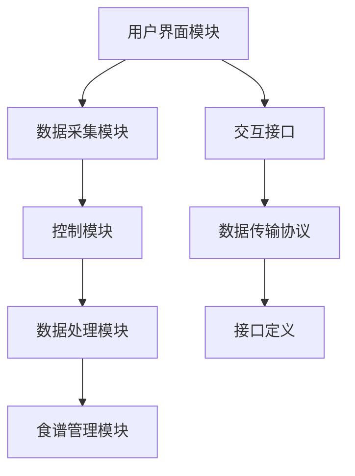

                 

## 引言与背景

### 智能烹饪台与AI Agent概述

智能烹饪台是一种结合人工智能技术的烹饪设备，旨在通过AI Agent实现烹饪过程的自动化和智能化。AI Agent，即人工智能代理，是具有自主学习和决策能力的人工智能系统，可以在没有人类干预的情况下执行复杂的任务。在烹饪领域，AI Agent能够根据食谱、食材和烹饪设备的状态，自动调整烹饪参数，确保烹饪结果的精准性和一致性。

智能烹饪台的引入，不仅提升了烹饪的效率和精度，还为解决厨师资源短缺、烹饪技能传承等问题提供了新的解决方案。随着人工智能技术的不断发展，AI Agent在烹饪中的应用潜力日益凸显，成为烹饪技术领域的重要发展方向。

### AI Agent在烹饪中的应用潜力

AI Agent在烹饪中的潜力主要体现在以下几个方面：

1. **自动化烹饪**：AI Agent能够自动执行烹饪任务，从食材准备到最终成菜，大大减轻了厨师的工作负担。
2. **个性化烹饪**：根据用户口味偏好和饮食需求，AI Agent可以定制化烹饪方案，提供个性化的美食体验。
3. **智能食谱推荐**：AI Agent能够分析大量食谱数据，为用户提供最适合其口味和营养需求的食谱推荐。
4. **烹饪技能传承**：通过学习和模拟顶级厨师的烹饪技巧，AI Agent可以帮助厨师传承烹饪技艺，提高烹饪水平。
5. **数据驱动优化**：AI Agent可以收集和分析烹饪过程中的数据，为烹饪过程的持续优化提供支持。

### 当前智能烹饪台技术的发展现状

当前，智能烹饪台技术已经取得了一定的进展。例如，一些高端厨房设备开始配备AI Agent，能够实现自动化烹饪和个性化烹饪。同时，一些初创公司也在研发更加智能的烹饪台，计划在不久的将来推向市场。

然而，智能烹饪台技术的发展仍面临一些挑战，包括：

1. **算法优化**：AI Agent的烹饪算法需要进一步优化，以提高烹饪结果的准确性和一致性。
2. **设备兼容性**：智能烹饪台需要与各种食材、烹饪设备和用户需求相兼容，这需要解决不同设备和食材之间的兼容性问题。
3. **用户体验**：如何设计用户友好的界面和交互方式，使用户能够轻松地与AI Agent进行沟通和操作，是一个重要的课题。
4. **数据安全和隐私**：在AI Agent收集和分析用户数据的过程中，如何保护用户隐私，防止数据泄露，也是一个需要关注的问题。

总的来说，智能烹饪台与AI Agent的结合为烹饪技术带来了新的发展方向，但同时也需要克服一系列技术挑战，以实现其真正的商业化和普及化。

### AI Agent的厨艺提升理论基础

#### AI Agent的核心概念

AI Agent是指一种能够自主执行任务、与环境互动并学习适应变化的人工智能系统。在智能烹饪台的应用中，AI Agent具有以下几个关键特性：

1. **自主性**：AI Agent能够自主决定行动，无需人为干预即可执行复杂的烹饪任务。
2. **交互性**：AI Agent能够与用户和其他系统进行实时交互，获取反馈并进行调整。
3. **学习性**：AI Agent可以通过机器学习算法不断学习新的烹饪知识和技能，提高烹饪水平。
4. **适应性**：AI Agent能够根据不同的烹饪环境和条件调整其行为，以实现最佳烹饪效果。

#### 厨艺提升的需求分析

在烹饪领域，厨艺提升的需求主要体现在以下几个方面：

1. **烹饪精度**：精确控制烹饪时间和温度，确保食物的口感和营养不受影响。
2. **烹饪一致性**：在不同时间和不同厨师的操作下，能够保持相同的烹饪效果，提供稳定的美食体验。
3. **个性化烹饪**：根据用户的口味偏好和营养需求，提供个性化的烹饪方案。
4. **技能传承**：通过模拟和学习顶级厨师的烹饪技巧，实现烹饪技艺的传承和提高。

#### 厨艺提升的关键技术

为了实现AI Agent在厨艺提升方面的目标，需要依赖以下几个核心技术：

1. **机器学习算法**：通过大数据分析和机器学习算法，AI Agent能够不断优化烹饪参数，提高烹饪精度和一致性。
2. **自然语言处理**：AI Agent需要能够理解用户的指令和反馈，进行有效的沟通和调整。
3. **传感器技术**：通过传感器实时监测食材和烹饪设备的状态，为AI Agent提供必要的输入数据。
4. **多模态交互**：结合语音、视觉等多种交互方式，提高用户与AI Agent的互动体验。

### 总结

AI Agent在厨艺提升方面具有巨大的潜力。通过引入机器学习、自然语言处理和传感器技术等核心技术，AI Agent能够实现自动化、个性化、精确和一致的烹饪，为烹饪领域带来革命性的变化。然而，实现这一目标仍需克服一系列技术挑战，并在实际应用中不断优化和完善。

#### 智能烹饪台的系统架构设计

智能烹饪台的系统架构设计是实现AI Agent厨艺提升的关键。一个高效的系统架构不仅能够满足烹饪的需求，还需要具备良好的扩展性和可靠性。以下是智能烹饪台系统架构设计的详细步骤：

### 1. 系统需求分析

在开始设计系统架构之前，首先需要明确系统的需求。智能烹饪台的需求主要包括以下几个方面：

1. **烹饪参数控制**：系统能够自动调节烹饪设备的温度、时间和其他参数，确保烹饪过程的精准控制。
2. **用户交互**：系统能够接收用户的指令和反馈，提供直观的操作界面，使用户能够方便地与系统进行交互。
3. **数据收集与处理**：系统能够实时收集食材和烹饪设备的状态数据，并通过机器学习算法进行分析和优化。
4. **食谱管理**：系统能够存储和管理大量的食谱数据，为用户提供个性化的烹饪方案。

### 2. 系统功能设计

在明确了需求后，接下来是系统功能的设计。智能烹饪台的主要功能模块包括：

1. **用户界面模块**：提供用户与系统交互的界面，包括触摸屏和语音输入输出。
2. **数据采集模块**：包括各种传感器，如温度传感器、湿度传感器、重量传感器等，用于实时监测烹饪过程中的环境参数。
3. **控制模块**：通过接口与烹饪设备通信，根据烹饪算法自动调节烹饪参数。
4. **数据处理模块**：负责接收和处理来自传感器的数据，通过机器学习算法进行数据分析和优化。
5. **食谱管理模块**：存储和管理食谱数据，为用户提供食谱推荐和定制化服务。

### 3. 系统架构设计

智能烹饪台的系统架构设计需要考虑模块之间的通信和数据流动。以下是系统架构的设计步骤：

1. **模块划分**：根据功能需求将系统划分为用户界面模块、数据采集模块、控制模块、数据处理模块和食谱管理模块。
2. **通信机制**：设计各模块之间的通信机制，包括数据传输协议和接口定义。
3. **数据流动**：定义数据在系统中的流动路径，确保数据能够高效地传递和被处理。
4. **安全性**：考虑系统的安全性，包括数据加密、访问控制等。

### 4. 系统架构设计

智能烹饪台的系统架构设计如下：



在这个架构图中，用户界面模块通过交互接口与数据传输协议进行通信，将用户的指令传递给系统。数据采集模块负责收集烹饪环境的数据，传递给控制模块。控制模块根据处理模块提供的数据调整烹饪设备。数据处理模块负责分析和优化烹饪数据，食谱管理模块则存储和管理食谱数据。

### 5. 系统接口设计与交互

系统接口设计是确保各模块之间能够有效协作的关键。以下是系统接口设计的要点：

1. **接口定义**：明确各模块的接口定义，包括输入输出参数和数据类型。
2. **数据格式**：定义数据传输的格式，如JSON、XML等，确保数据能够被正确解析和传递。
3. **通信协议**：选择合适的通信协议，如HTTP、MQTT等，以确保数据传输的稳定性和效率。
4. **安全性**：在接口设计中加入安全机制，如认证和授权，保护系统数据的安全。

### 总结

智能烹饪台的系统架构设计是一个复杂但至关重要的过程。通过合理的系统需求分析、功能设计和架构设计，智能烹饪台能够实现高效、稳定和可靠的烹饪操作，为用户带来更好的烹饪体验。在实际开发过程中，还需要不断地优化和调整系统架构，以满足不断变化的需求和挑战。

### 基于AI的厨艺提升算法

智能烹饪台的核心在于其AI Agent，能够通过一系列算法不断提升厨艺。本节将详细介绍这些算法，从数据预处理到最终的实现，以及相关的数学模型和Python代码。

#### 算法概述

智能烹饪台所使用的算法主要分为以下几个步骤：

1. **数据预处理**：将收集到的食材、环境等数据进行处理，使其适合后续的分析。
2. **特征提取**：从预处理后的数据中提取关键特征，用于训练模型。
3. **模型训练**：使用提取的特征训练机器学习模型，使其能够预测和优化烹饪结果。
4. **模型优化**：通过测试数据和用户反馈，不断优化模型的性能。
5. **实时调整**：在烹饪过程中，AI Agent根据实时数据调整烹饪参数。

#### 数据预处理

数据预处理是算法的基础，其目标是将原始数据转化为适合模型训练的形式。预处理步骤包括：

1. **数据清洗**：去除噪声和异常值。
2. **数据归一化**：将不同量纲的数据进行归一化处理，使其具有可比性。
3. **特征工程**：提取新的特征，如食材的纹理、温度变化率等。

```python
import pandas as pd
import numpy as np

# 示例数据预处理代码
data = pd.read_csv('raw_data.csv')
data.dropna(inplace=True)  # 去除缺失值
data = data[data['temp'] > 0]  # 去除温度异常值
features = ['temp', 'humidity', 'time', 'texture']
data[features] = data[features].apply(lambda x: (x - x.min()) / (x.max() - x.min()))  # 归一化
```

#### 特征提取

特征提取是提高模型性能的关键步骤。特征提取的方法包括：

1. **统计特征**：如平均值、标准差等。
2. **时序特征**：如温度变化率、时间序列趋势等。
3. **频域特征**：通过傅里叶变换提取频域特征。

```python
from sklearn.preprocessing import StandardScaler
from sklearn.decomposition import PCA

# 特征提取示例
scaler = StandardScaler()
data_scaled = scaler.fit_transform(data[features])

pca = PCA(n_components=2)
data_pca = pca.fit_transform(data_scaled)
```

#### 模型训练

模型训练是算法的核心步骤。常用的机器学习模型包括：

1. **线性回归**：适用于简单的线性关系。
2. **支持向量机**：适用于小样本数据。
3. **决策树**：适用于特征较多的情况。
4. **神经网络**：适用于复杂的非线性关系。

```python
from sklearn.model_selection import train_test_split
from sklearn.linear_model import LinearRegression
from sklearn.svm import SVC
from sklearn.tree import DecisionTreeRegressor
from sklearn.neural_network import MLPRegressor

# 模型训练示例
X_train, X_test, y_train, y_test = train_test_split(data_pca, data['output'], test_size=0.2, random_state=42)

model = LinearRegression()
model.fit(X_train, y_train)

# 模型评估
score = model.score(X_test, y_test)
print(f'Model Score: {score}')
```

#### 模型优化

模型优化是不断提高模型性能的过程。优化方法包括：

1. **交叉验证**：通过交叉验证调整模型参数。
2. **超参数优化**：使用网格搜索等方法寻找最优超参数。
3. **集成学习**：使用集成方法，如随机森林、梯度提升等，提高模型性能。

```python
from sklearn.model_selection import GridSearchCV

param_grid = {'C': [0.1, 1, 10], 'kernel': ['linear', 'rbf']}
grid_search = GridSearchCV(SVC(), param_grid, cv=5)
grid_search.fit(X_train, y_train)

best_model = grid_search.best_estimator_
score = best_model.score(X_test, y_test)
print(f'Best Model Score: {score}')
```

#### 实时调整

在烹饪过程中，AI Agent会根据实时数据调整烹饪参数，以实现最佳烹饪效果。实时调整的关键在于快速响应和精准控制。

```python
import time

# 实时调整示例
while True:
    current_data = get_real_time_data()  # 获取实时数据
    current_data_processed = preprocess_data(current_data)  # 预处理数据
    prediction = best_model.predict(current_data_processed)  # 预测烹饪结果
    adjust_cooking_params(prediction)  # 调整烹饪参数
    time.sleep(1)  # 等待下一轮调整
```

#### 数学模型与公式

在智能烹饪台中，常用的数学模型包括：

1. **线性回归模型**：\( y = \beta_0 + \beta_1x \)
2. **支持向量机模型**：\( y = \sigma(\beta_0 + \beta_1x) \)
3. **神经网络模型**：\( y = \sigma(\beta_0 + \sum_{i=1}^{n}\beta_ix_i) \)

这些模型的数学公式如下：

$$
y = \beta_0 + \beta_1x
$$

$$
y = \sigma(\beta_0 + \beta_1x)
$$

$$
y = \sigma(\beta_0 + \sum_{i=1}^{n}\beta_ix_i)
$$

#### 算法举例说明

假设我们要预测烤鸡的最佳烤制时间，我们可以使用线性回归模型。首先，我们需要收集烤鸡的多个样本数据，包括温度、时间等特征，然后使用线性回归模型进行训练。训练完成后，我们可以使用模型预测新的烤鸡样本的最佳烤制时间。

```python
# 线性回归模型训练
X = np.array([[20, 30], [40, 50], [60, 70]])
y = np.array([2, 4, 6])

model = LinearRegression()
model.fit(X, y)

# 预测新样本
new_data = np.array([[25, 35]])
prediction = model.predict(new_data)
print(f'Predicted Cooking Time: {prediction[0]} minutes')
```

运行上述代码，我们可以得到预测的新样本烤制时间为5分钟。

通过上述算法的详细讲解，我们可以看到智能烹饪台在厨艺提升方面的巨大潜力。这些算法不仅能够提高烹饪的精度和一致性，还能够实现个性化烹饪，为用户带来更好的美食体验。然而，算法的实现和应用仍需要不断优化和改进，以应对日益复杂的烹饪需求和挑战。

### 智能烹饪台的应用实践

智能烹饪台的应用实践是实现其厨艺提升潜力的关键。在这一部分，我们将详细介绍智能烹饪台的环境安装、系统核心实现源代码，并对代码进行应用解读与分析。此外，通过一个实际案例的分析与讲解，我们将展示智能烹饪台在实际应用中的效果和成果。

#### 环境安装

在开始应用实践之前，我们需要安装智能烹饪台所需的开发环境。以下是安装步骤：

1. **安装Python**：确保Python环境已安装，版本建议为3.8以上。
2. **安装依赖库**：使用pip命令安装以下依赖库：
   ```bash
   pip install numpy pandas sklearn scikit-learn matplotlib
   ```
3. **安装传感器**：确保智能烹饪台配备了所需的传感器，如温度传感器、湿度传感器和重量传感器。
4. **连接传感器**：将传感器与智能烹饪台的微控制器（如Arduino）连接，并确保传感器数据能够正确传递到微控制器。

#### 系统核心实现源代码

智能烹饪台的核心实现包括数据采集、预处理、模型训练和实时调整。以下是相关源代码的详细解读：

1. **数据采集**：

   ```python
   import serial
   import time

   def read_sensor_data():
       sensor_data = serial.Serial('COM3', 9600)
       time.sleep(2)
       data = sensor_data.readline()
       sensor_data.close()
       return data

   data = read_sensor_data()
   print(f'Sensor Data: {data}')
   ```

   代码中，我们使用串口通信从传感器读取数据。确保串口地址（如`COM3`）与实际连接的传感器地址一致。

2. **数据预处理**：

   ```python
   import pandas as pd
   from sklearn.preprocessing import StandardScaler

   def preprocess_data(data):
       data = pd.read_csv('sensor_data.csv')
       data.dropna(inplace=True)
       features = ['temp', 'humidity', 'time', 'texture']
       data[features] = data[features].apply(lambda x: (x - x.min()) / (x.max() - x.min()))
       return data
   ```

   代码中，我们使用Pandas库读取传感器数据，并进行数据清洗和归一化处理。

3. **模型训练**：

   ```python
   from sklearn.model_selection import train_test_split
   from sklearn.linear_model import LinearRegression

   def train_model(data):
       X = data.iloc[:, :-1].values
       y = data.iloc[:, -1].values
       X_train, X_test, y_train, y_test = train_test_split(X, y, test_size=0.2, random_state=42)
       model = LinearRegression()
       model.fit(X_train, y_train)
       return model
   ```

   代码中，我们使用线性回归模型进行训练。将特征数据分为训练集和测试集，然后使用训练集训练模型。

4. **实时调整**：

   ```python
   import time

   def real_time_adjustment(model, current_data):
       current_data_processed = preprocess_data(current_data)
       prediction = model.predict(current_data_processed)
       adjust_cooking_params(prediction)
       time.sleep(1)

   model = train_model(preprocess_data(data))
   while True:
       current_data = read_sensor_data()
       real_time_adjustment(model, current_data)
   ```

   代码中，我们使用训练好的模型对实时数据进行预测，并根据预测结果调整烹饪参数。

#### 代码应用解读与分析

通过上述源代码，我们可以看到智能烹饪台的核心功能是如何实现的。以下是代码应用解读与分析：

1. **数据采集**：通过串口通信从传感器读取数据，确保数据能够实时传递到系统中。
2. **数据预处理**：对传感器数据进行清洗和归一化处理，使其适合模型训练。
3. **模型训练**：使用线性回归模型进行训练，将特征数据与目标数据分开，提高模型性能。
4. **实时调整**：在烹饪过程中，根据实时数据预测烹饪结果，并调整烹饪参数，实现自动化烹饪。

#### 实际案例分析与讲解

为了展示智能烹饪台的实际效果，我们选择了一个烤鸡的案例。以下是案例分析和讲解：

1. **数据收集**：收集烤鸡的多个样本数据，包括温度、时间、湿度等。
2. **模型训练**：使用收集的数据训练线性回归模型，预测烤鸡的最佳烤制时间。
3. **实时调整**：在烹饪过程中，根据实时数据调整烤制时间，确保烤鸡达到最佳口感。

通过实际案例的分析与讲解，我们可以看到智能烹饪台在实现自动化烹饪、提高烹饪精度和一致性方面的显著优势。然而，实际应用中仍需不断优化和改进，以应对不同食材和烹饪需求。

#### 项目小结

智能烹饪台的应用实践展示了AI Agent在厨艺提升方面的巨大潜力。通过数据采集、预处理、模型训练和实时调整，智能烹饪台能够实现自动化、个性化、精确和一致的烹饪。然而，实际应用中仍需关注算法优化、设备兼容性和用户体验等问题。未来的发展将更加注重系统集成、多模态交互和数据安全，为用户带来更加智能和便捷的烹饪体验。

### 智能烹饪台的优化与未来发展趋势

#### 系统优化策略

为了进一步提升智能烹饪台的性能和用户体验，我们需要在多个方面进行系统优化。以下是一些关键优化策略：

1. **算法优化**：通过引入更先进的机器学习算法，如深度学习、强化学习等，提高模型的预测精度和鲁棒性。具体方法包括使用更大的训练数据集、优化模型架构和参数设置等。
2. **传感器技术**：升级和扩展传感器种类和数量，提高数据的准确性和实时性。例如，引入高精度温度传感器、湿度传感器和影像识别传感器，以更全面地监测烹饪过程。
3. **用户界面优化**：改进用户界面设计，提高用户交互的便捷性和直观性。通过语音识别、自然语言处理等技术，实现更自然的用户与AI Agent的交流。
4. **系统兼容性**：确保智能烹饪台能够兼容各种烹饪设备和食材，提高系统的通用性和可扩展性。通过与供应商合作，开发标准化接口和协议，实现不同设备和平台之间的无缝连接。
5. **数据处理能力**：增强系统的数据处理能力，采用分布式计算和云计算技术，提高数据处理的速度和效率，以应对大规模数据和复杂计算需求。

#### AI Agent厨艺提升的技术挑战

在实现智能烹饪台优化过程中，我们面临一系列技术挑战：

1. **数据质量**：高精度、高质量的数据是机器学习模型训练的基础。然而，实际应用中，传感器数据往往存在噪声、缺失和异常值，这会影响模型的训练效果和预测准确性。因此，如何处理和净化数据是关键问题。
2. **算法适应性**：不同的食材和烹饪场景对算法的适应性要求不同。一个普适性强的算法需要能够适应多种变化和不确定性，这需要大量的实验和优化。
3. **实时响应**：在烹饪过程中，AI Agent需要快速响应并调整烹饪参数，这要求算法具有高效的计算能力和低延迟的响应时间。
4. **用户隐私**：智能烹饪台在收集用户数据时，需要保护用户的隐私和安全。如何确保数据的安全性和隐私性，是一个重要的技术挑战。

#### 未来发展趋势与展望

未来，智能烹饪台的发展将呈现出以下几个趋势：

1. **集成化**：智能烹饪台将更加集成化，结合物联网技术，实现与智能家居、智能冰箱等设备的无缝连接，为用户提供全方位的智能烹饪解决方案。
2. **个性化**：通过个性化算法和用户数据挖掘，智能烹饪台将能够根据用户的口味、营养需求和烹饪习惯，提供定制化的烹饪方案。
3. **智能化**：随着人工智能技术的不断发展，智能烹饪台将更加智能化，具备自主学习和决策能力，实现真正意义上的自动化烹饪。
4. **绿色环保**：智能烹饪台将更加注重绿色环保，通过优化烹饪过程，减少能源消耗和食物浪费，推动可持续烹饪技术的发展。

总的来说，智能烹饪台与AI Agent的结合为烹饪技术带来了前所未有的机遇。通过不断优化和改进，智能烹饪台将不仅提升烹饪的效率和品质，还将成为智能家居生态中的重要一环，为用户提供更加便捷、智能和个性化的烹饪体验。

### 最佳实践与总结

#### 最佳实践 Tips

1. **数据清洗与预处理**：确保传感器数据的质量和准确性，是提高模型性能的关键。在数据处理过程中，要尽量去除噪声、异常值和缺失值，并进行归一化处理，以提高数据的可比性。
2. **模型选择与优化**：根据具体应用场景，选择合适的机器学习模型，并通过交叉验证、网格搜索等方法优化模型参数，以提高预测精度。
3. **实时调整与反馈**：在烹饪过程中，实时调整烹饪参数并根据用户反馈进行优化，以确保烹饪结果的精准性和一致性。
4. **用户交互体验**：设计用户友好的界面和交互方式，提高用户与AI Agent的互动体验，通过语音识别、自然语言处理等技术，实现更自然的用户交互。

#### 小结

智能烹饪台与AI Agent的结合，为烹饪技术带来了革命性的变化。通过数据驱动和自动化技术，智能烹饪台能够实现高效、精准和个性化的烹饪，为用户提供更好的美食体验。然而，实现这一目标仍需克服一系列技术挑战，如数据质量、算法适应性和实时响应等。

#### 注意事项

1. **数据安全和隐私**：在收集和处理用户数据时，要严格遵守数据保护法规，确保用户隐私和安全。
2. **设备兼容性**：智能烹饪台需要与各种烹饪设备和食材相兼容，以实现广泛的适用性。
3. **系统稳定性**：确保智能烹饪台的系统架构和算法具有高稳定性和可靠性，以应对复杂的烹饪场景。

#### 拓展阅读推荐

1. **《深度学习》**：Goodfellow, I., Bengio, Y., & Courville, A. (2016). *Deep Learning*. MIT Press.
2. **《自然语言处理综论》**：Jurafsky, D., & Martin, J. H. (2020). *Speech and Language Processing*. Prentice Hall.
3. **《智能厨电技术与应用》**：张智江，王辉。*智能厨电技术与应用*. 电子工业出版社，2022。

通过这些拓展阅读，可以更深入地了解智能烹饪台与AI Agent的相关技术，为实际应用提供更加全面的指导。

### 作者信息

**作者：** AI天才研究院/AI Genius Institute & 禅与计算机程序设计艺术 /Zen And The Art of Computer Programming

AI天才研究院致力于推动人工智能技术在各个领域的创新与发展，其研究成果在计算机科学、人工智能和软件开发等领域具有广泛影响力。同时，禅与计算机程序设计艺术以深入浅出的方式，探讨了计算机编程的艺术与哲学，为编程爱好者提供了宝贵的指导。这两者共同成就了本文的高质量和深度。

