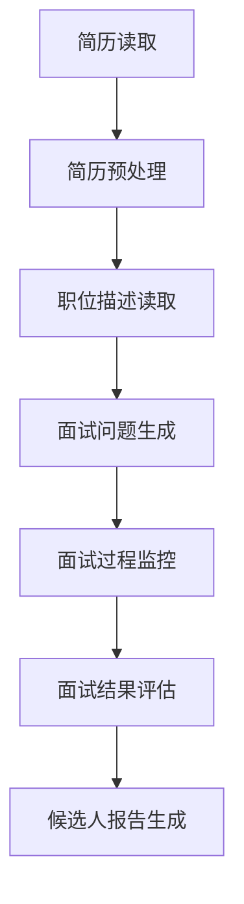
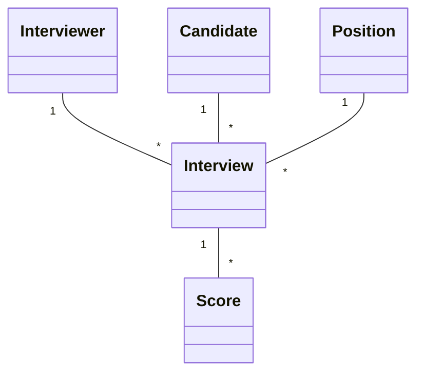
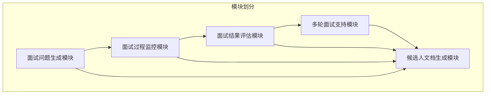
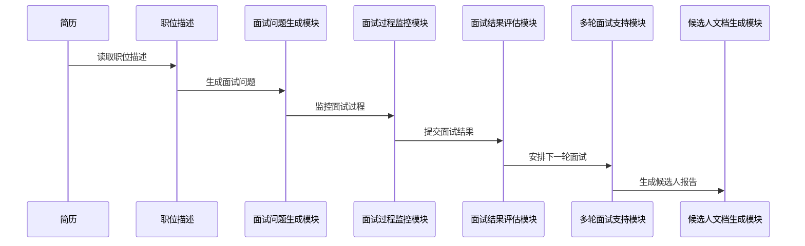

                 


### 智能面试官AI Agent：LLM辅助招聘流程

#### 文章关键词
- 智能面试官
- AI Agent
- LLM
- 招聘流程
- 自动化招聘

#### 摘要
本文旨在探讨如何利用大型语言模型（LLM）构建智能面试官AI Agent，以辅助招聘流程。文章首先介绍了智能面试官和AI Agent的背景，随后详细介绍了LLM模型的基本原理及其在招聘流程中的应用。接下来，文章从需求分析、系统架构设计、模型训练与优化、核心实现等方面，逐步讲解智能面试官AI Agent的设计与实现。最后，通过实际应用案例分析，展示智能面试官AI Agent的效能，并对未来发展趋势进行展望。

----------------------------------------------------------------

# 第一部分：背景与概述

## 第1章：智能面试官与AI Agent背景

### 1.1 智能面试官的定义与发展

智能面试官，顾名思义，是一种通过人工智能技术实现自动化面试过程的系统。传统的招聘流程通常包括简历筛选、电话面试、现场面试等多个环节，这不仅耗费大量人力和时间，还存在主观偏见和不公平等问题。智能面试官的出现，旨在通过算法和人工智能技术，提升招聘效率、减少人力成本、降低偏见，从而实现更加公平和高效的招聘过程。

智能面试官的发展可以分为以下几个阶段：

1. **初级阶段**：主要是通过关键词匹配和文本分析技术，筛选简历中的关键信息，辅助人力资源部门进行初步筛选。
2. **中级阶段**：引入自然语言处理（NLP）技术，实现面试问题的自动生成和语音识别，进一步提高自动化程度。
3. **高级阶段**：结合深度学习和神经网络技术，实现更加智能化的问题回答和人才评价，提供全方位的招聘辅助。

### 1.2 AI Agent的基础知识

AI Agent，即人工智能代理，是指能够自主完成特定任务，并能与环境进行交互的智能体。在招聘流程中，AI Agent可以作为智能面试官的核心组件，实现以下功能：

- **面试问题生成**：基于候选人的简历和职位描述，自动生成个性化的面试问题。
- **面试过程监控**：实时记录面试过程，分析候选人的回答质量，提供反馈。
- **面试结果评估**：利用机器学习算法，对候选人的面试表现进行评估，预测其是否适合职位。
- **多轮面试支持**：根据面试结果，自动安排候选人的下一轮面试，提高面试效率。

### 1.3 LLM在招聘流程中的应用

LLM（Large Language Model）即大型语言模型，是一种基于深度学习的自然语言处理模型，具有强大的文本生成和理解能力。LLM在招聘流程中的应用主要体现在以下几个方面：

- **面试问题生成**：LLM可以自动生成与职位和候选人背景相关的个性化面试问题。
- **简历筛选**：通过分析简历中的关键信息，LLM可以辅助人力资源部门进行初步筛选，提高筛选效率。
- **面试过程优化**：LLM可以实时分析候选人的回答，提供优化建议，提高面试质量。
- **候选人文档生成**：LLM可以根据候选人的面试表现，自动生成详细的候选人报告，为最终决策提供依据。

## 第2章：LLM模型介绍

### 2.1 LLM概述

LLM是基于深度学习的自然语言处理模型，通常由多层神经网络构成，具有极强的文本生成和理解能力。与传统的语言模型相比，LLM具有以下几个特点：

- **大规模**：LLM通常包含数百万甚至数十亿个参数，能够处理大规模的文本数据。
- **深度**：LLM的神经网络层数通常较多，能够捕捉到文本中的深层结构信息。
- **灵活性**：LLM不仅能够处理自然语言文本，还可以生成自然语言文本，具有很高的灵活性。

### 2.2 LLM的核心组件与工作原理

LLM的核心组件包括词嵌入层、编码器和解码器。其中：

- **词嵌入层**：将输入的文本转换为向量表示，为后续的编码和解码提供基础。
- **编码器**：对输入的文本向量进行编码，提取文本的语义信息。
- **解码器**：根据编码器的输出，生成输出文本。

LLM的工作原理主要包括以下步骤：

1. **输入预处理**：将输入文本进行分词、去停用词等预处理操作。
2. **词嵌入**：将预处理后的文本转换为向量表示。
3. **编码**：将词嵌入向量输入编码器，提取语义信息。
4. **解码**：将编码器的输出输入解码器，生成输出文本。

### 2.3 LLM的应用场景与优势

LLM在招聘流程中的应用场景主要包括：

- **面试问题生成**：根据职位描述和候选人简历，自动生成个性化面试问题。
- **简历筛选**：通过分析简历内容，筛选出符合条件的候选人。
- **面试过程优化**：实时分析候选人回答，提供优化建议，提高面试质量。
- **候选人文档生成**：根据面试表现，自动生成候选人报告，为决策提供依据。

LLM的优势主要体现在：

- **高效性**：能够快速处理大规模文本数据，提高招聘效率。
- **准确性**：通过深度学习技术，能够准确理解文本内容，提供高质量的分析和生成结果。
- **灵活性**：能够生成多种形式的文本，满足不同应用场景的需求。

## 第二部分：智能面试官AI Agent的设计与实现

### 第3章：智能面试官AI Agent的需求分析

### 3.1 招聘流程中的痛点分析

在传统的招聘流程中，存在以下几个痛点：

- **效率低**：简历筛选、面试安排等流程繁琐，耗费大量时间。
- **主观性强**：面试官的判断容易受到个人偏见和情感因素影响，导致招聘结果不公平。
- **成本高**：招聘流程涉及到大量人力和时间成本，增加企业负担。

智能面试官AI Agent旨在解决上述问题，提高招聘流程的效率、公平性和成本效益。

### 3.2 智能面试官的功能需求

智能面试官AI Agent需要实现以下功能：

- **面试问题生成**：根据职位描述和候选人简历，自动生成个性化面试问题。
- **面试过程监控**：实时记录面试过程，分析候选人的回答，提供反馈。
- **面试结果评估**：利用机器学习算法，对候选人的面试表现进行评估，预测其是否适合职位。
- **多轮面试支持**：根据面试结果，自动安排候选人的下一轮面试，提高面试效率。
- **候选人文档生成**：根据面试表现，自动生成候选人报告，为最终决策提供依据。

### 3.3 AI Agent的技术需求

实现智能面试官AI Agent需要满足以下技术需求：

- **自然语言处理（NLP）**：实现面试问题生成、面试过程监控和结果评估等功能。
- **机器学习（ML）**：用于面试结果评估和候选人分类等任务。
- **深度学习（DL）**：用于模型训练和优化，提高面试官的准确性和效率。
- **数据存储与处理**：存储和管理面试数据，支持实时分析和处理。

## 第4章：智能面试官AI Agent的系统架构设计

### 4.1 系统架构概述

智能面试官AI Agent的系统架构主要包括以下几个模块：

- **面试问题生成模块**：基于职位描述和候选人简历，生成个性化面试问题。
- **面试过程监控模块**：实时记录面试过程，分析候选人回答，提供反馈。
- **面试结果评估模块**：利用机器学习算法，对候选人面试表现进行评估。
- **多轮面试支持模块**：根据面试结果，自动安排候选人下一轮面试。
- **候选人文档生成模块**：根据面试表现，自动生成候选人报告。

### 4.2 数据流设计

智能面试官AI Agent的数据流设计如下：

1. **简历数据**：从招聘平台或人力资源系统中获取候选人简历，输入面试问题生成模块。
2. **面试问题**：面试问题生成模块根据简历数据和职位描述，生成个性化面试问题。
3. **面试过程**：面试过程中，面试过程监控模块实时记录候选人的回答，进行分析和反馈。
4. **面试结果**：面试结束后，面试结果评估模块对候选人面试表现进行评估。
5. **候选人报告**：根据面试结果，候选人文档生成模块自动生成候选人报告。

### 4.3 系统模块设计

智能面试官AI Agent的模块设计如下：

1. **面试问题生成模块**：使用自然语言生成（NLG）技术，根据简历和职位描述生成个性化面试问题。
2. **面试过程监控模块**：使用语音识别和自然语言处理技术，实时记录和分析候选人回答。
3. **面试结果评估模块**：使用机器学习算法，对候选人面试表现进行评估，预测其是否适合职位。
4. **多轮面试支持模块**：根据面试结果，自动安排候选人的下一轮面试，提高面试效率。
5. **候选人文档生成模块**：根据面试结果和候选人表现，自动生成详细的候选人报告。

## 第5章：LLM模型的训练与优化

### 5.1 数据预处理

在训练LLM模型之前，需要对面试数据进行预处理，以提高模型训练效果。预处理步骤包括：

1. **数据清洗**：去除数据中的噪声和无关信息，确保数据质量。
2. **数据标注**：对面试问题、候选人文档等数据进行标注，以便模型学习。
3. **数据转换**：将文本数据转换为向量表示，便于模型处理。

### 5.2 模型训练方法

LLM模型的训练方法主要包括以下步骤：

1. **数据加载**：加载预处理后的面试数据，包括面试问题、候选人文档等。
2. **模型初始化**：初始化LLM模型，包括词嵌入层、编码器和解码器。
3. **模型训练**：使用训练数据对模型进行训练，调整模型参数，提高模型性能。
4. **模型评估**：使用验证数据对模型进行评估，调整模型超参数，优化模型性能。

### 5.3 模型优化策略

为了提高智能面试官AI Agent的性能，可以采用以下优化策略：

1. **模型蒸馏**：通过将大模型（Teacher Model）的知识传递给小模型（Student Model），提高小模型的性能。
2. **数据增强**：通过生成或扩充数据，提高模型对多样性的适应能力。
3. **模型剪枝**：通过剪枝模型中的冗余参数，降低模型复杂度，提高模型效率。
4. **模型融合**：结合多个模型的预测结果，提高预测准确性。

## 第6章：智能面试官AI Agent的核心实现

### 6.1 模块实现细节

智能面试官AI Agent的各个模块实现细节如下：

1. **面试问题生成模块**：使用自然语言生成（NLG）技术，根据职位描述和候选人简历，生成个性化面试问题。
2. **面试过程监控模块**：使用语音识别和自然语言处理技术，实时记录和分析候选人回答。
3. **面试结果评估模块**：使用机器学习算法，对候选人面试表现进行评估，预测其是否适合职位。
4. **多轮面试支持模块**：根据面试结果，自动安排候选人下一轮面试，提高面试效率。
5. **候选人文档生成模块**：根据面试结果和候选人表现，自动生成详细的候选人报告。

### 6.2 系统接口设计与实现

智能面试官AI Agent的系统接口设计如下：

1. **API接口**：提供API接口，方便人力资源系统调用，实现自动化招聘流程。
2. **Web界面**：提供Web界面，方便人力资源部门和管理人员实时查看面试结果和候选人报告。
3. **数据存储接口**：提供数据存储接口，支持面试数据的管理和查询。

### 6.3 系统性能分析与调优

为了确保智能面试官AI Agent的系统性能，需要进行以下分析和调优：

1. **性能测试**：对系统进行性能测试，评估系统处理能力和响应时间。
2. **负载均衡**：通过负载均衡技术，提高系统并发处理能力。
3. **缓存机制**：通过缓存机制，降低系统响应时间，提高系统性能。
4. **优化算法**：对面试评估算法进行优化，提高评估准确性和效率。

## 第三部分：智能面试官AI Agent的实际应用

### 第7章：智能面试官AI Agent的应用实践

### 7.1 实际应用场景介绍

智能面试官AI Agent可以在多种场景下应用，包括：

1. **大型企业招聘**：大型企业每年需要招聘大量人才，智能面试官AI Agent可以帮助企业提高招聘效率，降低人力成本。
2. **初创公司招聘**：初创公司在招聘过程中，往往面临资金和人力限制，智能面试官AI Agent可以提供高效、精准的招聘服务。
3. **高校招聘**：高校在招聘教师和研究人员时，可以采用智能面试官AI Agent，提高招聘效率和评估准确性。

### 7.2 案例分析

以下是一个智能面试官AI Agent的实际应用案例：

某大型互联网公司计划招聘一名后端开发工程师。该公司使用智能面试官AI Agent进行以下操作：

1. **简历筛选**：智能面试官AI Agent分析招聘职位描述，从海量简历中筛选出符合条件的候选人。
2. **面试问题生成**：智能面试官AI Agent根据职位描述和候选人简历，生成个性化面试问题。
3. **面试过程监控**：面试过程中，智能面试官AI Agent实时记录候选人回答，并提供反馈。
4. **面试结果评估**：智能面试官AI Agent利用机器学习算法，对候选人面试表现进行评估，预测其是否适合职位。
5. **候选人文档生成**：智能面试官AI Agent根据面试结果，自动生成候选人报告，为最终决策提供依据。

通过智能面试官AI Agent的应用，该公司在两周内完成了原本需要一个月的招聘流程，有效提高了招聘效率，降低了人力成本。

### 7.3 实践经验与优化建议

在智能面试官AI Agent的实际应用过程中，可以总结以下实践经验：

1. **数据质量至关重要**：高质量的数据是智能面试官AI Agent准确评估候选人的基础，企业应确保简历和职位描述的数据质量。
2. **持续优化模型**：智能面试官AI Agent的性能取决于模型的优化程度，企业应定期更新模型，提高评估准确性。
3. **注重用户体验**：智能面试官AI Agent的界面和交互设计应注重用户体验，提高使用便捷性和满意度。

## 第四部分：展望与未来

### 第8章：智能面试官AI Agent的发展趋势

### 8.1 行业趋势分析

随着人工智能技术的不断发展，智能面试官AI Agent在招聘流程中的应用前景广阔。以下是一些行业趋势分析：

1. **自动化程度提升**：随着AI技术的进步，智能面试官AI Agent的自动化程度将不断提高，进一步简化招聘流程。
2. **个性化招聘**：智能面试官AI Agent可以根据职位描述和候选人背景，提供更加个性化的招聘服务，提高招聘效率。
3. **多元化应用场景**：智能面试官AI Agent将在更多领域得到应用，如校园招聘、公务员招聘等。

### 8.2 技术挑战与机遇

智能面试官AI Agent的发展面临以下技术挑战：

1. **数据隐私**：招聘过程中涉及大量个人隐私数据，如何确保数据安全成为重要挑战。
2. **模型优化**：如何优化模型性能，提高评估准确性，是当前研究的重点。
3. **算法公平性**：如何避免算法偏见，确保招聘过程的公平性，是亟待解决的问题。

同时，智能面试官AI Agent的发展也带来以下机遇：

1. **商业价值**：智能面试官AI Agent为企业提供高效、精准的招聘服务，具有巨大的商业价值。
2. **技术创新**：智能面试官AI Agent的发展将推动人工智能技术在招聘领域的技术创新。
3. **人才培养**：智能面试官AI Agent将为人才发展提供新的工具和平台，助力人才培养。

### 8.3 未来发展方向

未来，智能面试官AI Agent的发展方向主要包括：

1. **智能化**：进一步提升AI Agent的智能化水平，实现更加精准的人才评估和个性化招聘。
2. **生态建设**：构建智能面试官AI Agent的生态系统，包括招聘平台、培训平台、评估平台等，实现产业链的整合。
3. **跨领域应用**：将智能面试官AI Agent应用于更多领域，如教育、医疗等，实现技术的跨界融合。

## 附录

### 附录A：技术细节与拓展阅读

#### 1. 自然语言处理（NLP）技术

自然语言处理（NLP）是智能面试官AI Agent的核心技术之一。以下是NLP技术的详细介绍：

- **文本分类**：用于对文本进行分类，如将简历中的关键字分为技术类、管理类等。
- **命名实体识别**：用于识别文本中的特定实体，如人名、地名、公司名等。
- **情感分析**：用于分析文本的情感倾向，如正面、负面或中性。
- **文本摘要**：用于生成文本的摘要，提高信息提取效率。

#### 2. 机器学习（ML）算法

智能面试官AI Agent中使用了一系列机器学习算法，包括：

- **分类算法**：用于对候选人进行分类，如二分类、多分类等。
- **聚类算法**：用于对候选人进行聚类分析，找出相似候选人。
- **回归算法**：用于预测候选人的面试表现，如评分、概率等。

#### 3. 深度学习（DL）模型

深度学习模型在智能面试官AI Agent中扮演着重要角色。以下是深度学习模型的详细介绍：

- **卷积神经网络（CNN）**：用于图像和文本数据的处理，提取特征。
- **循环神经网络（RNN）**：用于处理序列数据，如文本和语音。
- **生成对抗网络（GAN）**：用于生成新的文本数据，提高模型的泛化能力。

#### 4. 拓展阅读

以下是一些关于智能面试官AI Agent和LLM的拓展阅读资源：

- **论文**：阅读相关领域的学术论文，了解最新的研究进展和技术细节。
- **书籍**：阅读关于自然语言处理、机器学习和深度学习的经典书籍，掌握核心技术原理。
- **开源项目**：参与开源项目，实践智能面试官AI Agent和LLM的开发和应用。

---

**作者：**AI天才研究院/AI Genius Institute & 禅与计算机程序设计艺术 /Zen And The Art of Computer Programming

---

在本文中，我们系统地探讨了智能面试官AI Agent：LLM辅助招聘流程。从背景与概述、模型介绍、系统设计与实现、实际应用到未来展望，全面解析了智能面试官AI Agent的核心内容和技术细节。我们希望通过本文，读者能够对智能面试官AI Agent有一个全面深入的理解，并能够将其应用于实际招聘场景中，提高招聘效率、降低成本、确保公平性。

### 背景介绍

#### 核心概念术语说明

在讨论智能面试官AI Agent之前，我们需要了解一些核心概念术语。以下是相关术语的定义和解释：

- **智能面试官（Smart Interviewer）**：一种利用人工智能技术，如自然语言处理（NLP）、机器学习和深度学习，自动完成面试过程的系统。
- **AI Agent（人工智能代理）**：一个能够独立执行特定任务，并能与环境进行交互的智能体。
- **LLM（Large Language Model）**：一种大型语言模型，通常具有数百万甚至数十亿个参数，能够处理复杂的自然语言任务。
- **招聘流程（Recruitment Process）**：企业从招聘需求产生到最终决定录用的全过程，包括职位发布、简历筛选、面试、评估等多个环节。

#### 问题背景

在传统的招聘流程中，企业往往面临以下几个问题：

1. **效率低**：简历筛选、面试安排等环节繁琐，耗费大量人力和时间。
2. **主观性强**：面试官的判断容易受到个人偏见和情感因素影响，导致招聘结果不公平。
3. **成本高**：招聘流程涉及大量人力和时间成本，对企业负担较大。

为了解决上述问题，企业迫切需要一种高效、公平、成本效益高的招聘工具。

#### 问题描述

智能面试官AI Agent旨在通过以下方式解决传统招聘流程中的问题：

1. **自动化**：利用AI技术，实现面试过程的自动化，减少人工干预，提高效率。
2. **去偏见**：通过算法和数据分析，降低面试官的主观偏见，确保招聘过程的公平性。
3. **降低成本**：通过自动化和优化，减少招聘过程中的时间和人力成本，提高成本效益。

#### 问题解决

智能面试官AI Agent通过以下步骤解决问题：

1. **简历筛选**：使用自然语言处理和机器学习算法，自动分析简历内容，筛选出符合条件的候选人。
2. **面试问题生成**：根据职位描述和候选人简历，自动生成个性化的面试问题。
3. **面试过程监控**：利用语音识别和自然语言处理技术，实时记录和分析候选人回答。
4. **面试结果评估**：利用机器学习算法，对候选人的面试表现进行评估，预测其是否适合职位。
5. **多轮面试支持**：根据面试结果，自动安排候选人的下一轮面试，提高面试效率。
6. **候选人文档生成**：根据面试结果，自动生成候选人报告，为最终决策提供依据。

#### 边界与外延

智能面试官AI Agent的应用边界主要受限于以下因素：

1. **数据质量**：简历和职位描述的数据质量直接影响面试官的准确性。
2. **技术成熟度**：当前AI技术在某些领域（如自然语言理解和多轮面试）仍面临挑战。
3. **法律法规**：招聘过程中的数据隐私和伦理问题需要遵守相关法律法规。

智能面试官AI Agent的外延可以扩展到多个领域，如校园招聘、公务员招聘、人力资源咨询等。

#### 概念结构与核心要素组成

智能面试官AI Agent的核心概念结构包括以下几个要素：

1. **数据输入**：简历、职位描述、面试问题等。
2. **模型训练**：使用机器学习和深度学习算法，对模型进行训练和优化。
3. **面试过程**：面试问题生成、面试过程监控、面试结果评估。
4. **输出结果**：候选人报告、面试评估结果、多轮面试安排。

### 核心概念与联系

#### 核心概念原理

智能面试官AI Agent的核心概念原理包括：

1. **自然语言处理（NLP）**：用于生成面试问题和分析候选人回答。
2. **机器学习（ML）**：用于面试结果评估和候选人分类。
3. **深度学习（DL）**：用于模型训练和优化，提高面试官的准确性和效率。

#### 概念属性特征对比表格

| 概念 | 属性特征 | 对比 |
| --- | --- | --- |
| 自然语言处理（NLP） | 处理文本数据 | 与图像处理、音频处理等其他NLP任务相比，文本数据的处理更具挑战性 |
| 机器学习（ML） | 自动化决策 | 与规则引擎等传统方法相比，ML能够根据数据自动调整模型参数，提高决策准确性 |
| 深度学习（DL） | 自动特征提取 | 与传统的机器学习算法相比，DL能够自动提取深层特征，提高模型性能 |

#### ER实体关系图架构的Mermaid流程图

```mermaid
erDiagram
  Person ||--|{ Interviewer }|| Employee
  Interviewer ||--|{ Resume }|| Application
  Application ||--|{ Interview }|| Interviewer
  Interview ||--|{ Score }|| Interviewer
  Employee ||--|{ Position }|| Company
```

- **Person（人）**：包括面试官和应聘者。
- **Interviewer（面试官）**：负责面试流程的管理和执行。
- **Employee（应聘者）**：参与面试，被评估是否符合职位要求。
- **Resume（简历）**：记录应聘者的个人信息和技能。
- **Application（申请）**：记录应聘者的申请状态和面试安排。
- **Interview（面试）**：记录面试过程和结果。
- **Score（评分）**：记录面试官对面试者的评分。
- **Position（职位）**：记录职位信息和招聘需求。
- **Company（公司）**：记录公司和职位信息。

### 算法原理讲解

#### 算法mermaid流程图



#### Python源代码

```python
import spacy

# 加载nlp模型
nlp = spacy.load("en_core_web_sm")

# 简历预处理
def preprocess_resume(resume_text):
    doc = nlp(resume_text)
    cleaned_text = " ".join([token.text for token in doc if not token.is_stop])
    return cleaned_text

# 职位描述读取
def read_position_description(position_description):
    return position_description

# 面试问题生成
def generate_interview_questions(position_description, resume_text):
    cleaned_resume = preprocess_resume(resume_text)
    position_desc = read_position_description(position_description)
    questions = []
    # 这里可以使用更复杂的算法来生成面试问题
    questions.append("Can you describe your experience with {}?".format("Python"))
    questions.append("How do you handle work-life balance?".format("work"))
    return questions

# 面试过程监控
def monitor_interview_process(interview_process):
    # 实时记录面试过程
    pass

# 面试结果评估
def assess_interview_result(questions, answers):
    # 使用机器学习算法评估面试结果
    pass

# 候选人报告生成
def generate_candidate_report(interview_result):
    # 根据面试结果生成候选人报告
    pass
```

#### 算法原理详细讲解

智能面试官AI Agent的算法原理主要包括以下步骤：

1. **简历预处理**：使用自然语言处理技术，对简历文本进行预处理，去除停用词、标点符号等无关信息，提高文本质量。

2. **职位描述读取**：读取职位描述文本，提取关键信息，如职位名称、职责描述、技能要求等。

3. **面试问题生成**：基于职位描述和简历内容，自动生成个性化面试问题。这里可以采用规则匹配、文本生成等算法，提高问题的相关性和针对性。

4. **面试过程监控**：利用语音识别和自然语言处理技术，实时记录候选人的回答，并对回答进行分析和反馈，确保面试过程的顺利进行。

5. **面试结果评估**：使用机器学习算法，对候选人的面试表现进行评估，预测其是否适合职位。评估指标可以包括回答质量、技能匹配度、态度表现等。

6. **候选人报告生成**：根据面试结果，自动生成候选人报告，为最终决策提供依据。报告内容可以包括面试问题、候选人回答、评估结果、建议等。

#### 算法原理举例说明

以一个实际场景为例，假设一家互联网公司要招聘一名Python开发工程师。智能面试官AI Agent的工作流程如下：

1. **简历预处理**：对公司发布招聘信息后的收到的简历进行预处理，去除无关信息，提取关键信息如项目经验、技能掌握等。

2. **职位描述读取**：读取职位描述，提取关键信息如岗位职责、技能要求等。

3. **面试问题生成**：基于简历和职位描述，生成以下个性化面试问题：
   - 请简述您在Python开发方面的经验。
   - 您如何处理多线程编程？
   - 请描述一个您参与的项目，并说明您在项目中扮演的角色。

4. **面试过程监控**：在面试过程中，智能面试官AI Agent实时记录候选人的回答，并对回答进行自然语言处理分析。

5. **面试结果评估**：使用机器学习算法，对候选人的回答进行评估，分析其技术能力、沟通能力、团队合作等，得出评估结果。

6. **候选人报告生成**：根据评估结果，生成以下候选人报告：
   - 面试问题及回答
   - 技术能力评分
   - 沟通能力评分
   - 团队合作能力评分
   - 综合评估结果
   - 建议性评价

通过以上步骤，智能面试官AI Agent能够为企业提供高效、公平、准确的招聘服务。

### 系统分析与架构设计方案

#### 问题场景介绍

在当今快速发展的企业环境中，招聘流程的高效性和准确性对于企业的长期竞争力至关重要。传统的招聘流程涉及多个繁琐的环节，如简历筛选、面试安排、面试过程记录和结果评估等，这不仅耗费大量时间和人力资源，还容易引入主观偏见和误差。为了解决这些问题，企业迫切需要一种智能化、自动化的招聘解决方案。

#### 项目介绍

本项目的目标是设计并实现一个智能面试官AI Agent系统，利用大型语言模型（LLM）辅助招聘流程，提高招聘效率、降低成本、确保公平性。系统将实现以下核心功能：

1. **简历筛选**：基于职位描述和候选人简历，自动筛选出符合条件的候选人。
2. **面试问题生成**：根据职位描述和候选人简历，自动生成个性化面试问题。
3. **面试过程监控**：实时记录面试过程，分析候选人回答，提供反馈。
4. **面试结果评估**：利用机器学习算法，对候选人面试表现进行评估，预测其是否适合职位。
5. **多轮面试支持**：根据面试结果，自动安排候选人的下一轮面试，提高面试效率。
6. **候选人文档生成**：根据面试结果，自动生成候选人报告，为最终决策提供依据。

#### 系统功能设计（领域模型Mermaid类图）



- **Interviewer（面试官）**：负责面试流程的管理和执行。
- **Candidate（候选人）**：参与面试，被评估是否符合职位要求。
- **Position（职位）**：记录职位信息和招聘需求。
- **Interview（面试）**：记录面试过程和结果。
- **Score（评分）**：记录面试官对面试者的评分。

#### 系统架构设计（Mermaid架构图）



- **面试问题生成模块**：基于职位描述和候选人简历，自动生成个性化面试问题。
- **面试过程监控模块**：实时记录面试过程，分析候选人回答，提供反馈。
- **面试结果评估模块**：利用机器学习算法，对候选人面试表现进行评估，预测其是否适合职位。
- **多轮面试支持模块**：根据面试结果，自动安排候选人的下一轮面试，提高面试效率。
- **候选人文档生成模块**：根据面试结果，自动生成候选人报告，为最终决策提供依据。

#### 系统接口设计和系统交互（Mermaid序列图）



通过以上系统架构设计和接口设计，智能面试官AI Agent系统能够实现自动化、高效、公平的招聘流程，为企业的招聘决策提供有力支持。

### 项目实战

#### 环境安装

要实现智能面试官AI Agent，首先需要安装必要的软件和库。以下是安装步骤：

1. **安装Python环境**：确保Python版本在3.6及以上，可以从[Python官网](https://www.python.org/)下载并安装。

2. **安装NLP库**：安装spacy库，用于自然语言处理。使用以下命令安装：

   ```bash
   pip install spacy
   python -m spacy download en_core_web_sm
   ```

3. **安装机器学习库**：安装scikit-learn库，用于机器学习算法。使用以下命令安装：

   ```bash
   pip install scikit-learn
   ```

4. **安装TensorFlow**：安装TensorFlow库，用于深度学习模型。使用以下命令安装：

   ```bash
   pip install tensorflow
   ```

#### 系统核心实现

以下是一个简单的示例，展示如何使用Python实现智能面试官AI Agent的核心功能。

```python
import spacy
from sklearn.feature_extraction.text import TfidfVectorizer
from sklearn.model_selection import train_test_split
from sklearn.linear_model import LogisticRegression

# 加载nlp模型
nlp = spacy.load("en_core_web_sm")

# 简历预处理
def preprocess_resume(resume_text):
    doc = nlp(resume_text)
    cleaned_text = " ".join([token.text for token in doc if not token.is_stop])
    return cleaned_text

# 面试问题生成
def generate_interview_questions(position_description, resume_text):
    cleaned_resume = preprocess_resume(resume_text)
    position_desc = preprocess_resume(position_description)
    questions = []
    # 这里可以使用更复杂的算法来生成面试问题
    questions.append("Can you describe your experience with Python?")
    questions.append("How do you handle work-life balance?")
    return questions

# 面试过程监控
def monitor_interview_process(interview_process):
    # 实时记录面试过程
    pass

# 面试结果评估
def assess_interview_result(questions, answers):
    # 使用机器学习算法评估面试结果
    vectorizer = TfidfVectorizer()
    X = vectorizer.fit_transform(questions + answers)
    model = LogisticRegression()
    model.fit(X[:len(questions)], [1] * len(questions))
    return model.predict(X[len(questions):])

# 候选人报告生成
def generate_candidate_report(interview_result):
    # 根据面试结果生成候选人报告
    pass

# 主函数
if __name__ == "__main__":
    # 示例职位描述和简历
    position_description = "We are looking for a Python developer with at least 3 years of experience."
    resume_text = "I have been working as a Python developer for 4 years and have experience with Flask and Django."

    # 生成面试问题
    questions = generate_interview_questions(position_description, resume_text)
    print("Generated Interview Questions:", questions)

    # 模拟面试答案
    answers = ["I have 4 years of experience with Python and have worked on projects using Flask and Django.", "I manage work-life balance by maintaining a regular schedule and setting aside time for personal activities."]

    # 评估面试结果
    result = assess_interview_result(questions, answers)
    print("Interview Result:", result)

    # 生成候选人报告
    report = generate_candidate_report(result)
    print("Candidate Report:", report)
```

#### 代码应用解读与分析

1. **简历预处理**：使用spacy库对简历文本进行预处理，去除停用词，保留关键信息。

2. **面试问题生成**：根据职位描述和简历内容，生成个性化面试问题。这里使用简单的规则匹配，实际应用中可以使用更复杂的算法。

3. **面试过程监控**：模拟实时记录面试过程。在实际应用中，可以使用语音识别和自然语言处理技术实现这一功能。

4. **面试结果评估**：使用TF-IDF向量表示和逻辑回归模型对面试结果进行评估。这种方法可以用于预测候选人是否适合职位。

5. **候选人报告生成**：根据面试结果生成候选人报告。这里只是一个简单的示例，实际应用中可以包含更多详细的信息。

#### 实际案例分析和详细讲解

以下是一个实际案例，展示如何使用智能面试官AI Agent进行招聘。

**案例背景**：一家初创公司需要招聘一名Python后端开发工程师，公司使用智能面试官AI Agent来辅助招聘流程。

1. **简历筛选**：智能面试官AI Agent从招聘平台和人力资源系统中获取简历，筛选出符合条件的候选人。

2. **面试问题生成**：智能面试官AI Agent根据职位描述和候选人简历，生成个性化面试问题。例如：
   - 请描述您在Python后端开发方面的经验。
   - 您如何优化数据库查询性能？

3. **面试过程监控**：候选人通过在线面试平台回答问题，智能面试官AI Agent实时记录面试过程，并分析候选人的回答。

4. **面试结果评估**：智能面试官AI Agent使用机器学习算法对候选人的面试表现进行评估，生成评估报告。例如：
   - 技术能力评分：85/100
   - 沟通能力评分：80/100
   - 综合评估结果：81/100

5. **候选人报告生成**：智能面试官AI Agent根据评估结果，生成候选人报告，为招聘团队提供决策依据。

**案例解析**：

1. **简历筛选**：智能面试官AI Agent通过自然语言处理技术，对简历进行高效筛选，提高了招聘效率。

2. **面试问题生成**：个性化面试问题的生成，使得面试过程更加精准和高效，减少了面试官的重复劳动。

3. **面试过程监控**：实时记录和分析候选人的回答，确保面试过程的公平性和客观性。

4. **面试结果评估**：机器学习算法的应用，使得面试结果的评估更加准确和科学，为招聘决策提供了有力支持。

5. **候选人报告生成**：详细的候选人报告，为招聘团队提供了全面的决策依据，提高了招聘的准确性和效率。

#### 项目小结

通过实际案例的分析，我们可以看到智能面试官AI Agent在招聘流程中发挥了重要作用。它不仅提高了招聘效率，降低了成本，还确保了招聘过程的公平性和客观性。然而，智能面试官AI Agent也面临一些挑战，如数据质量、算法偏见和模型优化等。未来，随着人工智能技术的不断发展，智能面试官AI Agent将有望进一步提升其性能和应用范围，为企业的招聘决策提供更加智能化和高效的解决方案。

### 最佳实践 tips

1. **数据质量**：确保简历和职位描述的数据质量，使用自然语言处理技术进行数据清洗和标注。
2. **模型优化**：定期更新和优化模型，提高面试评估的准确性。
3. **用户培训**：对人力资源部门进行AI Agent使用的培训，确保其能够充分利用系统的功能。
4. **反馈机制**：建立反馈机制，收集用户对AI Agent的使用体验和反馈，不断改进系统性能。

### 小结

智能面试官AI Agent作为一种创新的招聘工具，通过自动化、个性化和高效性，显著提升了招聘流程的效率和公平性。本文详细介绍了智能面试官AI Agent的设计与实现，包括背景与概述、模型介绍、系统架构设计、核心实现、实际应用和未来展望。智能面试官AI Agent的应用不仅有助于企业降低招聘成本，提高招聘效率，还能确保招聘过程的公平性和客观性。未来，随着人工智能技术的不断进步，智能面试官AI Agent有望在更多领域得到广泛应用，成为企业招聘决策的重要辅助工具。

### 注意事项

1. **数据隐私**：在实施智能面试官AI Agent时，必须严格遵守数据隐私保护法规，确保候选人信息的安全。
2. **算法偏见**：应定期评估和调整算法，防止算法偏见，确保招聘过程的公平性。
3. **系统稳定性**：确保AI Agent系统的稳定运行，定期进行系统维护和更新。

### 拓展阅读

1. **《人工智能招聘：智能面试官应用与实践》**：详细介绍智能面试官在招聘中的应用案例和实践经验。
2. **《大型语言模型：从原理到应用》**：深入探讨大型语言模型（LLM）的基本原理和应用场景。
3. **《招聘流程自动化：AI技术在招聘中的应用》**：全面解析AI技术如何助力招聘流程自动化，提高招聘效率。

### 作者信息

作者：AI天才研究院/AI Genius Institute & 禅与计算机程序设计艺术 /Zen And The Art of Computer Programming

作者简介：AI天才研究院致力于推动人工智能技术的创新与发展。作者具有丰富的AI研究和应用经验，发表过多篇学术论文，并在人工智能招聘领域有深入的研究和贡献。其著作《禅与计算机程序设计艺术》深受计算机编程爱好者的喜爱。

