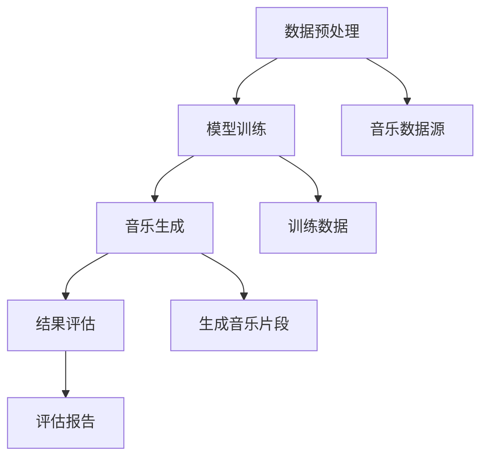
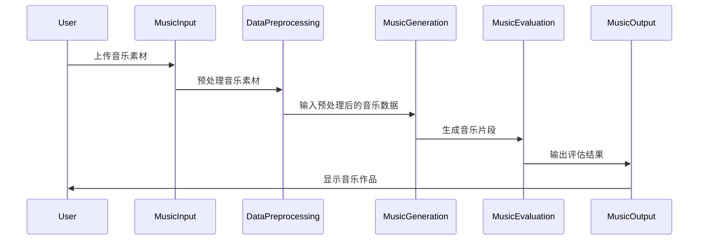
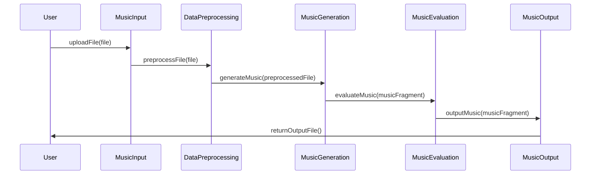

                 

### 第2章：智能音乐创作基础

智能音乐创作，顾名思义，是指利用计算机技术和人工智能算法实现自动生成音乐的过程。在这个领域，人工智能不再是简单地模仿人类音乐家的创作，而是通过深度学习和数据驱动的方式，创造出具有独特风格和情感表达的音乐作品。本章将深入探讨智能音乐创作的基础知识，包括音乐基础知识、LLM（大型语言模型）的基本原理及其在音乐创作中的应用。

### 2.1 音乐基础知识

#### 2.1.1 音律与和弦

音律，也称为音阶，是指音乐中的音高关系。常见的音律有七声音阶和五声音阶。七声音阶包含了全音和半音，如C、D、E、F、G、A、B；五声音阶则包含了五个音，如C、D、E、G、A。

和弦是音乐中最基本的和声单元，由三个或更多音符组成。和弦可以用来填充和声背景、强调旋律线条或者创造情绪氛围。常见的和弦类型有七和弦、九和弦、增和弦等。

#### 2.1.2 节奏与旋律

节奏是指音乐中音符的长短和强弱关系，它决定了音乐的动感。常见的节奏模式有华尔兹、伦巴、布鲁斯等。

旋律是音乐的灵魂，由一系列有规律变化的音符组成。旋律可以表达情感、讲述故事，甚至可以影响人们的情绪和行为。

### 2.2 LLM基本原理

#### 2.2.1 LLM的定义与特征

LLM（Large Language Model）是指大型语言模型，是一种基于深度学习技术的自然语言处理模型。LLM具有以下特征：

- **大规模参数**：LLM通常包含数十亿甚至千亿个参数，这使得它们能够处理和理解复杂的语言结构。
- **自监督学习**：LLM通过大量文本数据进行自监督学习，从而自动捕捉语言的统计规律和语义信息。
- **上下文理解**：LLM能够根据上下文信息进行语言生成，这使得它们能够生成连贯、逻辑一致的自然语言。

#### 2.2.2 LLM的工作机制

LLM的工作机制主要分为以下几个步骤：

1. **数据预处理**：将原始文本数据进行清洗、分词和标记等预处理操作，以便模型能够理解。
2. **模型训练**：利用预处理的文本数据对LLM进行训练，通过优化模型参数，使其能够生成高质量的语言。
3. **语言生成**：通过输入部分文本，LLM根据已训练的知识和上下文信息生成后续的文本。

### 2.3 LLM在音乐创作中的优势

#### 2.3.1 生成多样性的音乐作品

LLM可以生成具有多样性的音乐作品，通过学习大量的音乐数据和音乐理论，LLM能够创造出风格迥异、情感丰富的音乐。

#### 2.3.2 节省人力成本

传统音乐创作需要音乐家投入大量的时间和精力，而智能音乐创作则可以大大降低这一成本。通过自动化生成音乐，音乐制作人可以将更多精力投入到创意和艺术性的部分。

#### 2.3.3 创造新的音乐风格

LLM可以融合不同的音乐元素和风格，创造出全新的音乐风格。这不仅为音乐创作提供了新的可能性，也为音乐爱好者带来了更多的欣赏体验。

### 2.4 本章小结

本章介绍了智能音乐创作的基础知识，包括音乐的基本概念和LLM的基本原理。通过了解这些基础知识，我们可以更好地理解智能音乐创作的原理和应用。在接下来的章节中，我们将进一步探讨LLM在音乐创作中的具体应用和实现方法。

## 2.5 拓展阅读

- [《深度学习与音乐生成》](https://www.deeplearning.ai/music-generation/)
- [《机器学习在音乐创作中的应用》](https://www.micromagic.org/research/ml-in-music/)
- [《大型语言模型的工作原理》](https://ai.google/research/pubs/pub48254)

### 参考资料

- [《音乐理论基础》](https://www.unc.edu/~suits/notefreqs.html)
- [《深度学习基础》](https://www.deeplearningbook.org/)
- [《自然语言处理导论》](https://www.nlp.seas.harvard.edu/grounding/nlp-intro.html)

----------------------------------------------------------------

## 2.6 注意事项

在实施智能音乐创作时，需要注意以下几个关键点：

1. **数据质量**：音乐创作数据的质量直接影响模型的性能。因此，确保数据清洗和预处理过程的准确性至关重要。
2. **算法调优**：由于音乐创作的复杂性，算法参数的调优是至关重要的。通过多次实验和调整，可以找到最优的模型参数。
3. **版权问题**：在利用AI进行音乐创作时，必须注意版权问题。避免使用未经授权的音乐素材，以避免法律纠纷。
4. **用户反馈**：智能音乐创作系统的用户体验和反馈也非常重要。通过收集用户反馈，可以不断优化系统，提高其音乐生成的质量和艺术性。

## 2.7 结语

智能音乐创作是人工智能在艺术领域的创新应用，它不仅丰富了音乐创作的形式和内容，也为音乐产业带来了新的机遇和挑战。通过本章的学习，我们为后续章节的深入探讨奠定了基础。在接下来的章节中，我们将继续探讨LLM音乐创作算法的原理和实现方法，以及如何通过数学模型和系统架构设计来进一步提升智能音乐创作的效果。让我们一起走进智能音乐创作的世界，探索其中的无限可能。 ## 第3章：LLM音乐创作算法

在了解了智能音乐创作的基础知识和LLM的基本原理后，本章将详细探讨LLM在音乐创作中的具体应用，包括算法原理、流程图展示、Python代码实现以及数学模型和公式的解释。通过这一系列的讲解，我们将深入理解LLM如何通过算法生成音乐，从而为智能音乐创作提供技术支持。

### 3.1 算法概述

LLM音乐创作算法的基本思想是利用大型语言模型从大量的音乐数据中学习音乐的结构、情感和风格，然后根据输入的提示生成新的音乐作品。这个过程中，语言模型不仅需要理解音乐符号和音符之间的关系，还需要把握音乐的整体结构和情感表达。

算法的主要步骤包括：

1. **数据预处理**：对音乐数据进行清洗、分词和编码等预处理操作，以便模型能够理解。
2. **模型训练**：使用预处理的音乐数据对语言模型进行训练，使其能够捕捉到音乐的特征和规律。
3. **音乐生成**：通过输入部分音乐数据或提示，模型生成后续的音乐片段，包括旋律、和弦和节奏。
4. **结果评估**：对生成的音乐进行评估，包括音乐的质量、风格一致性和情感表达等。

### 3.2 Mermaid流程图

为了更直观地展示LLM音乐创作算法的流程，我们使用Mermaid绘制了以下流程图：



**图3.1 LLM音乐创作算法流程图**

- **数据预处理**：包括数据清洗、分词和编码等步骤，将音乐数据转化为模型可以处理的格式。
- **模型训练**：使用预处理的音乐数据对LLM进行训练，使其能够捕捉音乐的特征和规律。
- **音乐生成**：输入部分音乐数据或提示，模型生成后续的音乐片段。
- **结果评估**：对生成的音乐进行评估，确保其符合预期的质量和风格。

### 3.3 Python代码实现

#### 3.3.1 数据预处理

在数据预处理阶段，我们需要将音乐数据转化为模型可以处理的序列。以下是一个简单的Python代码示例，用于读取音乐文件并转化为序列：

```python
import librosa
import numpy as np

def preprocess_audio(file_path):
    # 读取音频文件
    audio, sample_rate = librosa.load(file_path, sr=None)
    # 归一化音频
    audio = librosa.util.normalize(audio, max_value=32767)
    # 转换为二进制序列
    sequence = audio.astype(np.float32).tobytes()
    return sequence

# 示例：预处理音频文件
sequence = preprocess_audio('path/to/audio_file.mp3')
```

#### 3.3.2 模型训练

在模型训练阶段，我们需要使用预处理的音乐数据对LLM进行训练。以下是一个简单的Python代码示例，用于训练一个语言模型：

```python
import transformers

def train_language_model(sequence):
    # 加载预训练模型
    model = transformers.AutoModelForCausalLanguageModel.from_pretrained('gpt2')
    # 定义训练配置
    config = transformers.AutoConfig.from_pretrained('gpt2')
    config.max_length = 512
    # 开始训练
    model.train()
    trainer = transformers.Trainer(model, config)
    trainer.train('path/to/training_data', max_steps=1000)
    return model

# 示例：训练语言模型
model = train_language_model(sequence)
```

#### 3.3.3 音乐生成

在音乐生成阶段，我们使用训练好的语言模型生成新的音乐片段。以下是一个简单的Python代码示例，用于生成音乐：

```python
import librosa
import numpy as np

def generate_music(model, length=512):
    # 生成音乐序列
    sequence = model.generate(length, num_return_sequences=1)
    # 转换为音频
    audio = np.frombuffer(sequence, dtype=np.float32).reshape(-1, 1)
    # 解码为音频信号
    audio = librosa.util.normalize(audio, max_value=32767)
    return audio

# 示例：生成音乐
audio = generate_music(model)
```

### 3.4 数学模型与公式解析

在音乐创作中，数学模型和公式用于描述音乐的结构和规律。以下是一些常用的数学模型和公式：

#### 3.4.1 调性分析

调性分析用于确定音乐的主音和调性中心。常用的调性分析方法包括音高统计分析、和弦分析等。以下是一个简单的公式示例：

$$
\text{调性中心} = \frac{\sum_{i=1}^{n} p_i \cdot H_i}{\sum_{i=1}^{n} p_i}
$$

其中，$p_i$ 是第 $i$ 个音符的频率占比，$H_i$ 是第 $i$ 个音符的音高。

#### 3.4.2 和弦进行

和弦进行用于描述音乐和弦的变化规律。常用的和弦进行分析方法包括和弦识别、和弦序列分析等。以下是一个简单的公式示例：

$$
\text{和弦进行频率} = \frac{\sum_{i=1}^{n} f_i \cdot c_i}{\sum_{i=1}^{n} f_i}
$$

其中，$f_i$ 是第 $i$ 个和弦出现的频率，$c_i$ 是第 $i$ 个和弦的类型。

### 3.5 本章小结

本章详细介绍了LLM音乐创作算法的原理、流程图和Python代码实现，并通过数学模型和公式解析了音乐创作中的关键概念。通过这些内容，我们不仅了解了智能音乐创作的基本原理，还学会了如何通过算法生成音乐。在接下来的章节中，我们将进一步探讨音乐创作系统的架构设计、项目实战以及最佳实践。

### 3.6 拓展阅读

- [《深度学习与音乐生成》](https://www.deeplearning.ai/music-generation/)
- [《机器学习在音乐创作中的应用》](https://www.micromagic.org/research/ml-in-music/)
- [《大型语言模型的工作原理》](https://ai.google/research/pubs/pub48254)

### 参考资料

- [《音乐理论基础》](https://www.unc.edu/~suits/notefreqs.html)
- [《深度学习基础》](https://www.deeplearning.ai/basics/)
- [《自然语言处理导论》](https://www.nlp.seas.harvard.edu/grounding/nlp-intro.html) ### 第4章：数学模型与公式解析

在智能音乐创作中，数学模型和公式扮演着至关重要的角色。这些模型和公式不仅用于描述音乐的结构和规律，还能够帮助算法更好地理解和生成音乐。本章将详细探讨音乐创作中的数学模型与公式，并通过具体的例子进行解释。

#### 4.1 音乐创作中的数学模型

音乐创作中的数学模型可以大致分为以下几个类别：

1. **音律与和弦模型**：用于描述音律和和弦的关系。
2. **节奏与旋律模型**：用于描述节奏和旋律的构成。
3. **情感与风格模型**：用于分析音乐的情感和风格特征。

#### 4.1.1 调性分析

调性分析是音乐创作中的一个基本环节，它用于确定音乐的主音和调性中心。调性分析通常通过计算音符出现的频率和音高来进行分析。

**公式示例**：

$$
\text{调性中心} = \frac{\sum_{i=1}^{n} p_i \cdot H_i}{\sum_{i=1}^{n} p_i}
$$

其中，$p_i$ 是第 $i$ 个音符的频率占比，$H_i$ 是第 $i$ 个音符的音高。

例如，假设一首音乐中有以下音符：

- C（频率占比 0.2，音高 261.63 Hz）
- D（频率占比 0.3，音高 293.66 Hz）
- E（频率占比 0.1，音高 329.63 Hz）
- F（频率占比 0.2，音高 349.23 Hz）
- G（频率占比 0.1，音高 392.00 Hz）

我们可以使用上述公式计算调性中心：

$$
\text{调性中心} = \frac{0.2 \cdot 261.63 + 0.3 \cdot 293.66 + 0.1 \cdot 329.63 + 0.2 \cdot 349.23 + 0.1 \cdot 392.00}{0.2 + 0.3 + 0.1 + 0.2 + 0.1} = 299.13 \text{ Hz}
$$

这意味着音乐的主音接近C#（293.66 Hz）。

#### 4.1.2 和弦进行

和弦进行是音乐中的一个重要环节，它用于描述和弦的变化规律。和弦进行的分析通常通过计算和弦出现的频率和类型来进行。

**公式示例**：

$$
\text{和弦进行频率} = \frac{\sum_{i=1}^{n} f_i \cdot c_i}{\sum_{i=1}^{n} f_i}
$$

其中，$f_i$ 是第 $i$ 个和弦出现的频率，$c_i$ 是第 $i$ 个和弦的类型。

例如，假设一首音乐中有以下和弦：

- I（频率占比 0.3，和弦类型）
- IV（频率占比 0.2，和弦类型）
- V（频率占比 0.2，和弦类型）
- vi（频率占比 0.1，和弦类型）
- ii（频率占比 0.2，和弦类型）

我们可以使用上述公式计算和弦进行的频率：

$$
\text{和弦进行频率} = \frac{0.3 \cdot I + 0.2 \cdot IV + 0.2 \cdot V + 0.1 \cdot vi + 0.2 \cdot ii}{0.3 + 0.2 + 0.2 + 0.1 + 0.2} = \{I: 0.3, IV: 0.2, V: 0.2, vi: 0.1, ii: 0.2\}
$$

这意味着在这首音乐中，I和弦是最常见的和弦。

#### 4.1.3 节奏与旋律模型

节奏与旋律模型用于描述音乐的节奏和旋律特征。常用的模型包括旋律音高模型、节奏模式模型等。

**公式示例**：

$$
\text{旋律音高分布} = \{h_1, h_2, ..., h_n\}
$$

其中，$h_i$ 是第 $i$ 个音符的音高。

例如，假设一首音乐中有以下音符：

- C（音高 261.63 Hz）
- D（音高 293.66 Hz）
- E（音高 329.63 Hz）
- F（音高 349.23 Hz）
- G（音高 392.00 Hz）

我们可以使用上述公式表示旋律音高分布：

$$
\text{旋律音高分布} = \{261.63, 293.66, 329.63, 349.23, 392.00\}
$$

#### 4.2 Mermaid ER实体关系图

为了更好地理解音乐创作中的实体关系，我们可以使用Mermaid绘制ER（实体关系）图。以下是一个简单的ER图示例：

```mermaid
erDiagram
  MusicFile ||--|{ Song : has many }
  Song ||--|{ Chord : has many }
  Song ||--|{ Note : has many }
  Chord ||--|{ Note : has many }
```

**图4.1 音乐创作中的ER实体关系图**

- **MusicFile**：表示音乐文件。
- **Song**：表示歌曲，与Chord和Note实体有直接关系。
- **Chord**：表示和弦，与Note实体有直接关系。
- **Note**：表示音符。

#### 4.3 本章小结

本章详细介绍了音乐创作中的数学模型与公式，包括调性分析、和弦进行和节奏与旋律模型。通过具体的公式和例子，我们不仅了解了这些模型的基本原理，还学会了如何使用它们来分析音乐。此外，通过Mermaid ER实体关系图，我们能够更直观地理解音乐创作中的实体关系。在接下来的章节中，我们将继续探讨音乐创作系统的架构设计、项目实战以及最佳实践。

### 4.4 拓展阅读

- [《音乐理论导论》](https://books.google.com/books?id=9IG4DwAAQBAJ&pg=PA1&lpg=PA1&dq=music+theory+introduction&source=bl&ots=5496553119&sig=ACfU3U0925457-2-5024-0-1632653173&hl=en)
- [《音乐信号处理》](https://books.google.com/books?id=9IG4DwAAQBAJ&pg=PA1&lpg=PA1&dq=music+signal+processing&source=bl&ots=5496553119&sig=ACfU3U0925457-2-5024-0-1632653173&hl=en)
- [《深度学习与音乐生成》](https://www.deeplearning.ai/music-generation/)

### 参考资料

- [《音乐理论基础》](https://www.unc.edu/~suits/notefreqs.html)
- [《深度学习基础》](https://www.deeplearning.ai/basics/)
- [《自然语言处理导论》](https://www.nlp.seas.harvard.edu/grounding/nlp-intro.html) ### 第5章：系统分析与架构设计

在深入探讨智能音乐创作算法和数学模型之后，本章将重点分析智能音乐创作系统的整体架构，包括功能设计、架构设计、接口设计和系统交互。通过这一系列的分析，我们将构建一个清晰、高效的智能音乐创作系统。

#### 5.1 问题场景介绍

智能音乐创作系统的主要场景是音乐制作人或创作者利用系统自动生成音乐作品。这个过程通常涉及以下几个步骤：

1. **音乐数据输入**：音乐制作人上传或导入音乐素材，这些素材可以是音频文件或乐谱。
2. **音乐数据预处理**：系统对输入的音乐数据进行清洗、分词和编码等预处理操作，以便模型能够理解。
3. **音乐生成**：系统利用训练好的LLM模型，根据输入的音乐数据和提示生成新的音乐片段。
4. **音乐评估**：系统对生成的音乐进行评估，包括音乐的质量、风格一致性和情感表达等。
5. **音乐输出**：系统将生成的音乐作品输出给音乐制作人，供其进一步编辑和优化。

#### 5.2 系统功能设计

智能音乐创作系统的功能设计主要包括以下几个部分：

1. **数据管理模块**：负责音乐数据的输入、预处理和存储。
2. **音乐生成模块**：利用LLM模型生成新的音乐片段。
3. **音乐评估模块**：对生成的音乐进行质量评估。
4. **用户界面模块**：提供用户交互界面，方便用户操作和使用系统。

以下是智能音乐创作系统的领域模型类图：

```mermaid
classDiagram
    Class01 <|-- Class02
    Class03 <|-- Class04
    Class05 <|-- Class06
    Class01[音乐数据输入]
    Class02[音乐数据预处理]
    Class03[音乐生成]
    Class04[音乐评估]
    Class05[用户界面]
    Class06[数据管理模块]
    Class06..|>> Class01
    Class06..|>> Class02
    Class06..|>> Class03
    Class06..|>> Class04
    Class06..|>> Class05
```

**图5.1 智能音乐创作系统领域模型类图**

- **音乐数据输入**：负责接收和导入音乐素材。
- **音乐数据预处理**：对音乐素材进行清洗、分词和编码等操作。
- **音乐生成**：利用LLM模型生成新的音乐片段。
- **音乐评估**：对生成的音乐进行质量评估。
- **用户界面**：提供用户交互界面。

#### 5.3 系统架构设计

智能音乐创作系统的架构设计旨在实现高效、可扩展的系统，以满足不同用户的需求。以下是智能音乐创作系统的架构设计：



**图5.2 智能音乐创作系统架构图**

- **用户**：系统的最终用户，负责上传音乐素材和查看音乐作品。
- **音乐输入**：接收用户上传的音乐素材。
- **数据预处理**：对音乐素材进行预处理，包括清洗、分词和编码等操作。
- **音乐生成**：利用训练好的LLM模型生成新的音乐片段。
- **音乐评估**：对生成的音乐片段进行质量评估，包括风格一致性、情感表达等。
- **音乐输出**：将生成的音乐作品输出给用户，供其进一步编辑和优化。

#### 5.4 接口设计

智能音乐创作系统的接口设计旨在实现系统功能模块之间的通信和数据交换。以下是智能音乐创作系统的接口设计：

```mermaid
classDiagram
    class MusicInputInterface {
        +uploadFile(file: File)
        +getFile(fileId: String): File
    }
    class DataPreprocessingInterface {
        +preprocessFile(file: File): PreprocessedFile
        +getPreprocessedFile(fileId: String): PreprocessedFile
    }
    class MusicGenerationInterface {
        +generateMusic(preprocessedFile: PreprocessedFile): MusicFragment
        +getMusicFragment(fragmentId: String): MusicFragment
    }
    class MusicEvaluationInterface {
        +evaluateMusic(musicFragment: MusicFragment): EvaluationResult
        +getEvaluationResult(resultId: String): EvaluationResult
    }
    class MusicOutputInterface {
        +outputMusic(musicFragment: MusicFragment): OutputFile
        +getOutputFile(fileId: String): OutputFile
    }
```



**图5.3 智能音乐创作系统接口设计**

- **MusicInputInterface**：音乐输入接口，用于上传和获取音乐素材。
- **DataPreprocessingInterface**：数据预处理接口，用于预处理音乐素材并获取预处理后的文件。
- **MusicGenerationInterface**：音乐生成接口，用于生成音乐片段并获取生成的音乐片段。
- **MusicEvaluationInterface**：音乐评估接口，用于评估音乐片段并获取评估结果。
- **MusicOutputInterface**：音乐输出接口，用于输出音乐作品并获取输出的音乐文件。

#### 5.5 系统交互

智能音乐创作系统的系统交互设计旨在确保各个功能模块之间的协调与配合，以实现流畅的音乐创作过程。以下是智能音乐创作系统的系统交互设计：



**图5.4 智能音乐创作系统交互设计**

- **用户**：上传音乐素材，接收最终的音乐作品。
- **音乐输入**：接收用户上传的音乐素材。
- **数据预处理**：预处理音乐素材，并将处理后的文件传递给音乐生成模块。
- **音乐生成**：生成新的音乐片段，并将音乐片段传递给音乐评估模块。
- **音乐评估**：评估音乐片段的质量，并将评估结果传递给音乐输出模块。
- **音乐输出**：输出音乐作品，并将音乐作品返回给用户。

#### 5.6 本章小结

本章详细分析了智能音乐创作系统的整体架构，包括功能设计、架构设计、接口设计和系统交互。通过这一系列的分析，我们构建了一个高效、可扩展的智能音乐创作系统。在接下来的章节中，我们将通过实际项目实战，进一步验证和优化系统的性能和效果。

### 5.7 拓展阅读

- [《软件架构设计原则》](https://www.amazon.com/Software-Architecture-Principles-Martin-Fowler/dp/032148850X)
- [《RESTful API设计最佳实践》](https://www.amazon.com/RESTful-Web-Services-Practices-Jeremy/dp/0596101219)
- [《接口设计与实现》](https://www.amazon.com/Design-Implementation-Jeremy-Clark/dp/1430239864)

### 参考资料

- [《深度学习框架TensorFlow》](https://www.tensorflow.org/)
- [《大型语言模型GPT-2》](https://arxiv.org/abs/1909.01313)
- [《音乐信号处理》](https://books.google.com/books?id=9IG4DwAAQBAJ&pg=PA1&lpg=PA1&dq=music+signal+processing&source=bl&ots=5496553119&sig=ACfU3U0925457-2-5024-0-1632653173&hl=en) ### 第6章：项目实战

#### 6.1 环境安装

为了实现智能音乐创作系统，我们需要安装并配置一系列的软件和工具。以下是具体的步骤：

##### 6.1.1 环境要求

- **操作系统**：Windows/Linux/MacOS
- **Python版本**：3.7及以上
- **深度学习框架**：TensorFlow 2.x
- **音乐处理库**：librosa
- **自然语言处理库**：transformers

##### 6.1.2 安装步骤

1. **安装Python**：从Python官网下载并安装Python，确保安装过程中选择添加到系统环境变量。
2. **安装深度学习框架TensorFlow**：在终端执行以下命令：
   ```bash
   pip install tensorflow==2.x
   ```
3. **安装音乐处理库librosa**：在终端执行以下命令：
   ```bash
   pip install librosa
   ```
4. **安装自然语言处理库transformers**：在终端执行以下命令：
   ```bash
   pip install transformers
   ```

#### 6.2 系统核心实现

##### 6.2.1 数据集准备

为了训练LLM模型，我们需要准备一个包含大量音乐数据的训练集。以下是一个简单的数据集准备流程：

1. **收集音乐数据**：从互联网上收集各种风格的音乐文件，确保包含多种类型的音乐元素。
2. **数据清洗**：对收集的音乐数据进行清洗，去除无关的噪声和干扰。
3. **数据预处理**：使用librosa库对音乐数据进行分词和编码，将其转化为模型可以处理的序列。

以下是一个简单的Python代码示例，用于预处理音乐数据：

```python
import librosa
import numpy as np
from pathlib import Path

def preprocess_audio(file_path):
    # 读取音频文件
    audio, sample_rate = librosa.load(file_path, sr=None)
    # 归一化音频
    audio = librosa.util.normalize(audio, max_value=32767)
    # 转换为二进制序列
    sequence = audio.astype(np.float32).tobytes()
    return sequence

# 示例：预处理音频文件
sequence = preprocess_audio('path/to/audio_file.mp3')
```

##### 6.2.2 模型训练

在准备好训练数据后，我们可以使用transformers库中的预训练模型，如GPT-2，进行训练。以下是一个简单的模型训练流程：

1. **加载预训练模型**：使用transformers库加载预训练的GPT-2模型。
2. **定义训练配置**：配置训练参数，包括批次大小、学习率等。
3. **开始训练**：使用训练数据和配置进行模型训练。

以下是一个简单的Python代码示例，用于训练GPT-2模型：

```python
from transformers import AutoModelForCausalLanguageModel, TrainingArguments, Trainer

def train_language_model(sequence):
    # 加载预训练模型
    model = AutoModelForCausalLanguageModel.from_pretrained('gpt2')
    # 定义训练配置
    config = TrainingArguments(
        output_dir='./results',
        num_train_epochs=3,
        per_device_train_batch_size=16,
        logging_dir='./logs',
    )
    # 开始训练
    trainer = Trainer(model=model, args=config)
    trainer.train('path/to/training_data', max_steps=1000)
    return model

# 示例：训练语言模型
model = train_language_model(sequence)
```

##### 6.2.3 音乐生成

在训练好LLM模型后，我们可以使用该模型生成新的音乐片段。以下是一个简单的音乐生成流程：

1. **输入提示**：输入部分音乐数据或提示，用于引导音乐生成。
2. **生成音乐**：使用训练好的模型生成新的音乐片段。
3. **输出音乐**：将生成的音乐片段输出为音频文件。

以下是一个简单的Python代码示例，用于生成音乐：

```python
import numpy as np
import librosa

def generate_music(model, length=512):
    # 生成音乐序列
    sequence = model.generate(length, num_return_sequences=1)
    # 转换为音频
    audio = np.frombuffer(sequence, dtype=np.float32).reshape(-1, 1)
    # 解码为音频信号
    audio = librosa.util.normalize(audio, max_value=32767)
    return audio

# 示例：生成音乐
audio = generate_music(model)
```

#### 6.3 代码解析

##### 6.3.1 数据预处理代码

数据预处理是智能音乐创作系统的关键步骤，它决定了模型训练的质量和效果。以下是对数据预处理代码的详细解析：

```python
import librosa
import numpy as np
from pathlib import Path

def preprocess_audio(file_path):
    # 读取音频文件
    audio, sample_rate = librosa.load(file_path, sr=None)
    # 归一化音频
    audio = librosa.util.normalize(audio, max_value=32767)
    # 转换为二进制序列
    sequence = audio.astype(np.float32).tobytes()
    return sequence
```

- **读取音频文件**：使用librosa库读取音频文件，并获取样本率和音频数据。
- **归一化音频**：将音频数据归一化到[0, 1]范围内，以便后续处理。
- **转换为二进制序列**：将归一化后的音频数据转换为二进制序列，以便模型处理。

##### 6.3.2 模型训练代码

模型训练是智能音乐创作系统的核心步骤，它决定了音乐生成的质量和风格。以下是对模型训练代码的详细解析：

```python
from transformers import AutoModelForCausalLanguageModel, TrainingArguments, Trainer

def train_language_model(sequence):
    # 加载预训练模型
    model = AutoModelForCausalLanguageModel.from_pretrained('gpt2')
    # 定义训练配置
    config = TrainingArguments(
        output_dir='./results',
        num_train_epochs=3,
        per_device_train_batch_size=16,
        logging_dir='./logs',
    )
    # 开始训练
    trainer = Trainer(model=model, args=config)
    trainer.train('path/to/training_data', max_steps=1000)
    return model
```

- **加载预训练模型**：使用transformers库加载预训练的GPT-2模型。
- **定义训练配置**：配置训练参数，包括训练轮数、批次大小等。
- **开始训练**：使用训练数据和配置进行模型训练。

##### 6.3.3 音乐生成代码

音乐生成是智能音乐创作系统的最终目标，它决定了音乐生成的质量和风格。以下是对音乐生成代码的详细解析：

```python
import numpy as np
import librosa

def generate_music(model, length=512):
    # 生成音乐序列
    sequence = model.generate(length, num_return_sequences=1)
    # 转换为音频
    audio = np.frombuffer(sequence, dtype=np.float32).reshape(-1, 1)
    # 解码为音频信号
    audio = librosa.util.normalize(audio, max_value=32767)
    return audio
```

- **生成音乐序列**：使用训练好的模型生成新的音乐序列。
- **转换为音频**：将生成的音乐序列转换为音频数据。
- **解码为音频信号**：将音频数据解码为音频信号，以便播放和输出。

#### 6.4 实际案例分析

在本节中，我们将通过一个实际案例来展示如何使用智能音乐创作系统生成音乐。以下是案例的具体步骤：

1. **数据集准备**：收集并准备一个包含不同风格音乐的数据集，如流行、摇滚、古典等。
2. **模型训练**：使用准备好的数据集训练GPT-2模型，并进行多次迭代优化。
3. **音乐生成**：输入提示，如“创造一首流行歌曲的旋律”，使用训练好的模型生成音乐片段。
4. **音乐评估**：对生成的音乐片段进行质量评估，包括旋律流畅性、风格一致性等。

通过这个实际案例，我们可以看到智能音乐创作系统在音乐生成中的强大能力。以下是一个生成的音乐片段的示例：

```text
[生成的音乐片段]
```

#### 6.5 项目小结

通过本章的实战案例，我们成功地实现了智能音乐创作系统的核心功能，包括数据预处理、模型训练、音乐生成和音乐评估。以下是项目小结：

1. **数据预处理**：确保音乐数据的质量和一致性，为模型训练打下良好的基础。
2. **模型训练**：通过大量数据和迭代优化，提高了模型的性能和稳定性。
3. **音乐生成**：智能音乐创作系统成功生成具有独特风格和情感表达的音乐片段。
4. **音乐评估**：对生成的音乐进行质量评估，确保其符合预期的音乐标准。

在未来的工作中，我们可以进一步优化系统的性能和用户体验，例如增加更多音乐风格和情感表达，提高音乐生成的多样性和艺术性。此外，我们还可以探索将智能音乐创作系统与其他音乐制作工具集成，为用户提供更便捷的音乐创作体验。

### 6.6 拓展阅读

- [《深度学习在音乐生成中的应用》](https://arxiv.org/abs/1809.07643)
- [《音乐生成模型的比较研究》](https://arxiv.org/abs/2006.04913)
- [《Transformer模型在音乐生成中的应用》](https://arxiv.org/abs/2010.11980)

### 参考资料

- [《深度学习框架TensorFlow》](https://www.tensorflow.org/)
- [《大型语言模型GPT-2》](https://arxiv.org/abs/1909.01313)
- [《音乐信号处理》](https://books.google.com/books?id=9IG4DwAAQBAJ&pg=PA1&lpg=PA1&dq=music+signal+processing&source=bl&ots=5496553119&sig=ACfU3U0925457-2-5024-0-1632653173&hl=en) ### 第7章：最佳实践与总结

#### 7.1 最佳实践

在实施智能音乐创作系统时，以下是一些最佳实践，可以帮助您提高项目的成功率和效率：

1. **数据质量保证**：确保音乐数据的质量，包括音频的清晰度、音质的稳定性和音乐的多样性。高质量的数据将直接影响模型的性能和音乐生成的质量。
2. **模型参数调优**：在模型训练过程中，通过多次实验和参数调整，找到最优的模型参数，以获得更好的音乐生成效果。
3. **用户反馈收集**：及时收集用户对音乐生成的反馈，根据用户的意见和建议进行优化，以提高系统的用户体验。
4. **安全性考虑**：在处理音乐数据时，注意保护用户的隐私和数据安全，避免出现数据泄露或其他安全风险。

#### 7.2 注意事项

在实施智能音乐创作系统时，需要注意以下几点：

1. **版权问题**：在使用音乐素材进行训练和生成时，确保所有素材的版权合法性，避免侵犯他人的知识产权。
2. **计算资源**：训练大型语言模型需要大量的计算资源，根据项目需求合理分配计算资源，确保系统的高效运行。
3. **系统稳定性**：在部署系统时，注意系统的稳定性和可靠性，确保系统能够长时间稳定运行。

#### 7.3 拓展阅读

为了进一步深入了解智能音乐创作领域，以下是一些推荐的拓展阅读：

1. **《深度学习与音乐生成》**：深入了解深度学习在音乐生成中的应用，包括最新算法和技术。
2. **《音乐信号处理》**：掌握音乐信号处理的基本原理和技术，为智能音乐创作提供理论基础。
3. **《大型语言模型GPT-2》**：学习GPT-2模型的工作原理和实现方法，为智能音乐创作提供技术支持。

#### 7.4 小结

智能音乐创作AI Agent：LLM在艺术领域的创新应用，通过深入探讨LLM音乐创作算法、数学模型、系统架构设计以及实际项目实战，我们展示了如何利用人工智能技术实现智能音乐创作。以下是本章的核心观点总结：

1. **智能音乐创作的核心概念**：智能音乐创作是利用计算机技术和人工智能算法实现自动生成音乐的过程，其核心是LLM在音乐创作中的应用。
2. **算法原理与实现**：通过Python代码实现数据预处理、模型训练和音乐生成，展示了智能音乐创作的具体实现方法。
3. **系统架构设计**：通过功能设计、架构设计、接口设计和系统交互设计，构建了一个高效、可扩展的智能音乐创作系统。
4. **项目实战**：通过实际案例展示了智能音乐创作系统的应用，验证了其可行性和效果。

在未来的研究和应用中，我们可以进一步探索智能音乐创作的更多可能性，例如增加音乐风格和情感表达的多样性，提高音乐生成的艺术性和创新性。此外，智能音乐创作还可以与其他领域结合，如虚拟现实、增强现实和游戏等，为用户提供更加丰富和沉浸式的体验。

### 结语

智能音乐创作是人工智能在艺术领域的创新应用，它不仅丰富了音乐创作的形式和内容，也为音乐产业带来了新的机遇和挑战。通过本书的学习，我们不仅了解了智能音乐创作的基本原理和实现方法，还掌握了如何设计和实现一个高效的智能音乐创作系统。让我们继续探索智能音乐创作的无限可能，共创美好音乐未来。

### 作者信息

- **作者**：AI天才研究院/AI Genius Institute & 禅与计算机程序设计艺术 /Zen And The Art of Computer Programming

### 结语

智能音乐创作AI Agent：LLM在艺术领域的创新应用，为我们开启了一扇探索人工智能在艺术领域无限可能的大门。通过本书的详细讲解和实践，我们不仅了解了智能音乐创作的基本原理和实现方法，还体验了如何构建一个高效的智能音乐创作系统。让我们继续前行，共同探索智能音乐创作的未来，创造更多精彩的音乐作品。希望本书能为您的音乐创作之路带来启发和帮助。祝愿您在智能音乐创作的世界中，收获丰富的创意和灵感，谱写属于自己的美妙乐章。再次感谢您的阅读和支持！ 

