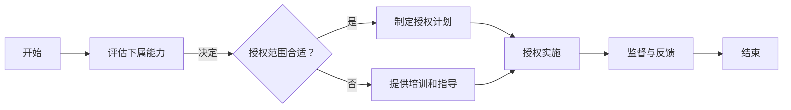
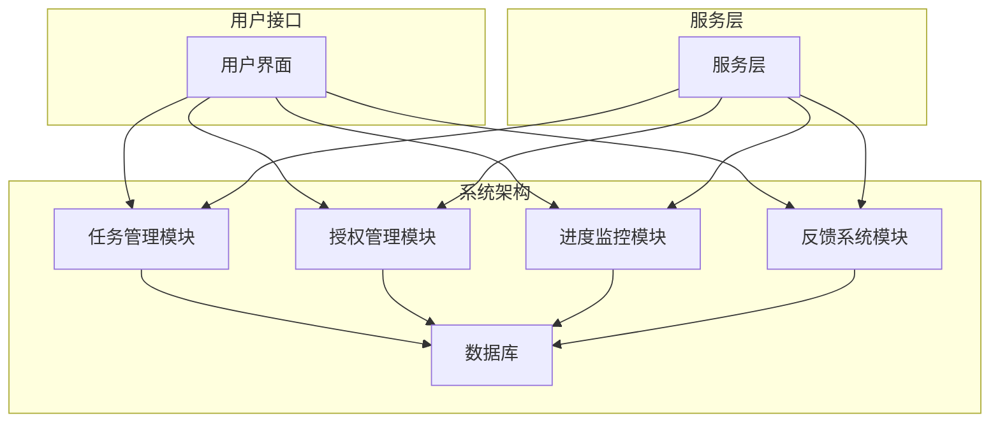
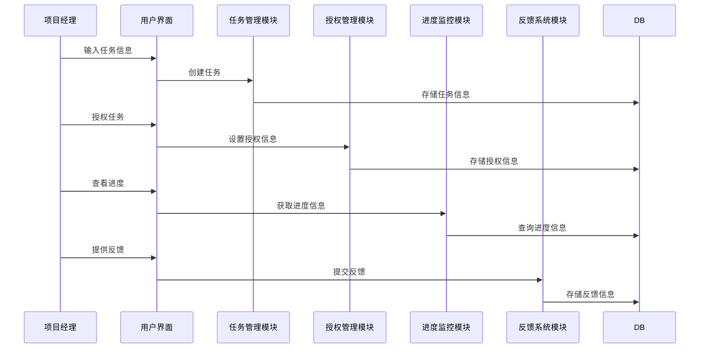

                 


## 有效授权：释放团队潜力的关键

### 关键词
- 有效授权
- 团队管理
- 领导力
- 授权技巧
- 组织效能

### 摘要
本文深入探讨了有效授权在团队管理中的重要性，通过理论分析和实际案例，阐述了授权的核心概念、类型、实施过程及面临的挑战与应对策略。本文旨在帮助读者理解并掌握有效授权的技巧，从而提升团队的整体绩效和组织效能。

## 背景介绍

### 问题背景

随着企业的不断发展和壮大，团队规模逐渐扩大，企业领导者在日常管理中面临着如何有效分配工作任务和资源的挑战。传统的管理方式往往依赖于自上而下的指令性管理，这种方式不仅效率低下，而且容易导致团队成员的被动和依赖。因此，有效授权成为现代企业管理中不可或缺的一部分。

### 描述问题

如何通过有效授权，让团队成员在工作中发挥最大潜力，提高团队整体绩效？有效授权的核心理念、方法和实践如何具体应用？这些问题不仅是企业领导者面临的难题，也是团队管理中需要持续探索和优化的领域。

### 问题解决

本文旨在解答上述问题，通过深入探讨有效授权的理论和实践，帮助读者掌握授权的技巧，提升团队管理能力。文章将结合管理学、心理学等领域的知识，结合实际案例，为读者提供具有实用价值的指导。

### 边界与外延

本文关注于企业管理中的授权问题，涉及团队管理、领导力发展、组织效能提升等方面。同时，本文将以实际案例为支撑，结合具体场景和情境，为读者提供可操作的授权策略。

## 核心概念与联系

### 有效授权

#### 概念定义

有效授权是指管理者在确保下属具备完成任务的能力和资源的前提下，将部分权力和责任委托给下属，以实现工作目标的过程。授权的核心在于信任和责任，管理者需要相信下属能够完成任务，同时明确下属的责任和期望。

#### 核心特点

- **增强下属能力**：通过授权，下属有机会承担更多责任，提高工作能力和自信心。
- **提高工作效率**：管理者将部分工作任务委托给下属，可以更专注于战略规划和重要事务，提高整体工作效率。
- **促进团队协作**：授权有助于培养团队成员的协作精神和团队意识，提高团队凝聚力。

#### 与传统授权的区别

- **目标导向**：有效授权注重结果导向，关注于任务完成的质量和效率。
- **信任与责任**：有效授权建立在信任基础上，管理者对下属有充分的信任，同时明确下属的责任。
- **权责一致**：有效授权要求权责对等，下属在获得授权的同时，承担相应的责任。

### 授权与信任

#### 关系

授权与信任密切相关，有效授权离不开信任的支撑。管理者需要建立与下属之间的信任关系，才能确保授权的有效性。信任是授权的基础，它能够降低团队成员之间的心理距离，增强团队协作的效率。

#### 如何建立信任

- **透明沟通**：管理者应保持与下属之间的透明沟通，让下属了解团队目标和进展。
- **明确期望**：管理者需要明确下属的任务和期望，确保下属了解自己的职责。
- **给予支持**：管理者应提供必要的支持和资源，帮助下属完成任务。
- **信任实践**：管理者应通过实际行动来展示信任，如适当授权、鼓励下属创新等。

### 授权的类型

#### 决策授权

决策授权是指授权下属在特定范围内做出决策。这种授权方式通常适用于日常事务的决策，如预算审批、项目进度调整等。决策授权能够提高团队成员的决策能力和责任感，同时减轻管理者的负担。

#### 任务授权

任务授权是指授权下属完成特定任务。这种授权方式适用于项目执行、工作计划的制定等。任务授权能够激发下属的积极性和创造力，提高团队的工作效率和执行力。

#### 信息授权

信息授权是指授权下属获取和处理特定信息。这种授权方式适用于市场数据、客户反馈等信息的处理。信息授权能够提高团队成员的信息敏感性和分析能力，为团队决策提供有力支持。

## 授权的过程

#### 明确授权目标

管理者需要明确授权的目标和预期成果，确保下属了解任务的重要性和紧迫性。明确的目标能够指导下属的工作，提高任务完成的效率和质量。

#### 评估下属能力

管理者需要评估下属的能力和资源，确保下属具备完成任务的能力。评估下属的能力有助于管理者合理分配任务，确保授权的有效性。

#### 制定授权计划

管理者需要制定具体的授权计划，明确授权的范围、期限和条件。授权计划应包含具体的任务分配、责任界定和考核标准。

#### 授权实施

管理者将权力和责任委托给下属，并给予必要的支持和指导。授权实施过程中，管理者应保持与下属的沟通，及时了解任务的进展和问题。

#### 监督与反馈

管理者需要监督授权过程的实施，及时给予下属反馈，纠正偏差，确保任务顺利完成。监督与反馈是授权过程中不可或缺的一环，它能够帮助管理者评估授权效果，优化授权策略。

### 授权的挑战与应对

#### 挑战

- **下属不接受授权**：下属可能担心失去控制权，不愿意接受授权。
- **下属能力不足**：下属可能缺乏完成任务所需的技能和经验。
- **授权过度或不足**：管理者可能无法准确判断授权的程度，导致授权过度或不足。
- **监督与反馈不足**：管理者可能忽视授权过程中的监督与反馈，影响授权效果。

#### 应对策略

- **建立信任关系**：管理者需要与下属建立信任关系，增强下属接受授权的意愿。
- **提供培训和指导**：管理者应提供必要的培训和指导，帮助下属提升能力。
- **明确授权范围和条件**：管理者应明确授权的范围和条件，避免授权过度或不足。
- **加强监督与反馈**：管理者应加强授权过程中的监督与反馈，确保授权效果。

## 数学模型和数学公式

在有效授权过程中，数学模型和数学公式可以用来分析和评估授权的效果。以下是一个简单的数学模型，用于计算授权后团队效率的提升。

### 模型假设

1. **团队效率**：团队在未经授权时的工作效率为 \( E_0 \)。
2. **授权后效率**：团队在授权后的工作效率为 \( E_a \)。
3. **授权范围**：授权的范围用一个百分比表示，即 \( \alpha \)，表示授权任务占总任务的百分比。
4. **授权效率增益**：授权带来的效率增益为 \( \Delta E = E_a - E_0 \)。

### 数学模型

授权后团队效率的数学模型可以表示为：

$$
E_a = E_0 \times (1 + \alpha \times K)
$$

其中，\( K \) 表示授权对团队效率的增益系数，它取决于多种因素，如下属的能力、团队协作水平、管理者的支持程度等。

### 算法原理讲解

#### 算法 Mermaid 流程图



#### 算法原理详细解释

1. **评估下属能力**：在授权前，管理者需要对下属的能力进行评估，以确保下属能够胜任授权的任务。
2. **决定授权范围**：根据下属的能力和任务的重要程度，管理者需要决定授权的范围，确保授权既不过度也不不足。
3. **制定授权计划**：管理者需要明确授权的任务、责任和考核标准，确保下属了解任务的重要性和预期成果。
4. **授权实施**：管理者将权力和责任委托给下属，并给予必要的支持和指导，确保下属能够顺利完成任务。
5. **监督与反馈**：管理者需要监督授权过程的实施，及时给予下属反馈，纠正偏差，确保任务顺利完成。

#### 算法原理数学模型和公式

授权后的团队效率 \( E_a \) 可以用以下数学模型表示：

$$
E_a = E_0 \times (1 + \alpha \times K)
$$

其中：

- \( E_0 \)：未经授权的团队效率。
- \( \alpha \)：授权范围，表示授权任务占总任务的百分比。
- \( K \)：授权效率增益系数，取决于多种因素。

#### 举例说明

假设一个团队未经授权的效率为 \( E_0 = 0.8 \)，管理者决定授权 20% 的任务给下属，且授权效率增益系数 \( K = 1.2 \)。则授权后的团队效率为：

$$
E_a = 0.8 \times (1 + 0.2 \times 1.2) = 0.8 \times 1.24 = 0.992
$$

这意味着授权后的团队效率提高了 \( 0.992 - 0.8 = 0.192 \)。

## 系统分析与架构设计方案

### 问题场景介绍

在一个大型软件开发项目中，团队规模庞大，任务繁多，传统的自上而下的管理方式已经无法满足高效工作的需求。为了提高项目效率和团队成员的积极性，项目经理决定引入有效授权的管理策略，让团队成员在各自的领域内拥有更多的自主权和决策权。

### 项目介绍

本项目旨在设计和实现一个基于有效授权的团队管理平台，该平台能够帮助项目经理合理分配任务、授权下属、监督进度和反馈效果。平台将采用模块化设计，包括任务管理模块、授权管理模块、进度监控模块和反馈系统模块。

### 系统功能设计

#### 领域模型 Mermaid 类图

```mermaid
classDiagram
    TaskManagementModule <|-- Task
    TaskManagementModule <|-- User
    AuthorizationManagementModule <|-- Authorization
    ProgressMonitoringModule <|-- Progress
    FeedbackSystemModule <|-- Feedback

    TaskManagementModule {id: Integer, name: String, description: String, status: String, assigned_to: User}
    User {id: Integer, name: String, role: String}
    AuthorizationManagementModule {id: Integer, task_id: Integer, user_id: Integer, scope: String, status: String}
    ProgressMonitoringModule {id: Integer, task_id: Integer, user_id: Integer, progress: Float, status: String}
    FeedbackSystemModule {id: Integer, task_id: Integer, user_id: Integer, feedback: String, status: String}
```

### 系统架构设计

#### Mermaid 架构图



### 系统接口设计和系统交互

#### Mermaid 序列图



## 项目实战

### 环境安装

1. 安装 Python 3.8 或更高版本。
2. 安装 Flask 框架：`pip install flask`
3. 安装 Flask-SQLAlchemy：`pip install flask-sqlalchemy`
4. 安装 Flask-Migrate：`pip install flask-migrate`

### 系统核心实现源代码

#### 1. 任务管理模块

```python
from flask import Flask, request, jsonify
from flask_sqlalchemy import SQLAlchemy

app = Flask(__name__)
app.config['SQLALCHEMY_DATABASE_URI'] = 'sqlite:///task_management.db'
db = SQLAlchemy(app)

class Task(db.Model):
    id = db.Column(db.Integer, primary_key=True)
    name = db.Column(db.String(100))
    description = db.Column(db.Text)
    status = db.Column(db.String(50))
    assigned_to = db.Column(db.Integer, db.ForeignKey('user.id'))

@app.route('/tasks', methods=['POST'])
def create_task():
    data = request.get_json()
    new_task = Task(name=data['name'], description=data['description'], status='pending', assigned_to=data['assigned_to'])
    db.session.add(new_task)
    db.session.commit()
    return jsonify({'message': 'Task created successfully'})

@app.route('/tasks', methods=['GET'])
def get_tasks():
    tasks = Task.query.all()
    return jsonify({'tasks': [{'id': task.id, 'name': task.name, 'description': task.description, 'status': task.status, 'assigned_to': task.assigned_to} for task in tasks]})

if __name__ == '__main__':
    db.create_all()
    app.run(debug=True)
```

#### 2. 授权管理模块

```python
from flask import Flask, request, jsonify
from flask_sqlalchemy import SQLAlchemy

app = Flask(__name__)
app.config['SQLALCHEMY_DATABASE_URI'] = 'sqlite:///authorization_management.db'
db = SQLAlchemy(app)

class Authorization(db.Model):
    id = db.Column(db.Integer, primary_key=True)
    task_id = db.Column(db.Integer, db.ForeignKey('task.id'))
    user_id = db.Column(db.Integer, db.ForeignKey('user.id'))
    scope = db.Column(db.String(100))
    status = db.Column(db.String(50))

@app.route('/authorizations', methods=['POST'])
def create_authorization():
    data = request.get_json()
    new_authorization = Authorization(task_id=data['task_id'], user_id=data['user_id'], scope=data['scope'], status='pending')
    db.session.add(new_authorization)
    db.session.commit()
    return jsonify({'message': 'Authorization created successfully'})

@app.route('/authorizations', methods=['GET'])
def get_authorizations():
    authorizations = Authorization.query.all()
    return jsonify({'authorizations': [{'id': auth.id, 'task_id': auth.task_id, 'user_id': auth.user_id, 'scope': auth.scope, 'status': auth.status} for auth in authorizations]})

if __name__ == '__main__':
    db.create_all()
    app.run(debug=True)
```

#### 3. 进度监控模块

```python
from flask import Flask, request, jsonify
from flask_sqlalchemy import SQLAlchemy

app = Flask(__name__)
app.config['SQLALCHEMY_DATABASE_URI'] = 'sqlite:///progress_monitoring.db'
db = SQLAlchemy(app)

class Progress(db.Model):
    id = db.Column(db.Integer, primary_key=True)
    task_id = db.Column(db.Integer, db.ForeignKey('task.id'))
    user_id = db.Column(db.Integer, db.ForeignKey('user.id'))
    progress = db.Column(db.Float)
    status = db.Column(db.String(50))

@app.route('/progresses', methods=['POST'])
def create_progress():
    data = request.get_json()
    new_progress = Progress(task_id=data['task_id'], user_id=data['user_id'], progress=data['progress'], status='pending')
    db.session.add(new_progress)
    db.session.commit()
    return jsonify({'message': 'Progress created successfully'})

@app.route('/progresses', methods=['GET'])
def get_progresses():
    progresses = Progress.query.all()
    return jsonify({'progresses': [{'id': progress.id, 'task_id': progress.task_id, 'user_id': progress.user_id, 'progress': progress.progress, 'status': progress.status} for progress in progresses]})

if __name__ == '__main__':
    db.create_all()
    app.run(debug=True)
```

#### 4. 反馈系统模块

```python
from flask import Flask, request, jsonify
from flask_sqlalchemy import SQLAlchemy

app = Flask(__name__)
app.config['SQLALCHEMY_DATABASE_URI'] = 'sqlite:///feedback_system.db'
db = SQLAlchemy(app)

class Feedback(db.Model):
    id = db.Column(db.Integer, primary_key=True)
    task_id = db.Column(db.Integer, db.ForeignKey('task.id'))
    user_id = db.Column(db.Integer, db.ForeignKey('user.id'))
    feedback = db.Column(db.Text)
    status = db.Column(db.String(50))

@app.route('/feedbacks', methods=['POST'])
def create_feedback():
    data = request.get_json()
    new_feedback = Feedback(task_id=data['task_id'], user_id=data['user_id'], feedback=data['feedback'], status='pending')
    db.session.add(new_feedback)
    db.session.commit()
    return jsonify({'message': 'Feedback created successfully'})

@app.route('/feedbacks', methods=['GET'])
def get_feedbacks():
    feedbacks = Feedback.query.all()
    return jsonify({'feedbacks': [{'id': feedback.id, 'task_id': feedback.task_id, 'user_id': feedback.user_id, 'feedback': feedback.feedback, 'status': feedback.status} for feedback in feedbacks]})

if __name__ == '__main__':
    db.create_all()
    app.run(debug=True)
```

### 代码应用解读与分析

上述代码实现了任务管理、授权管理、进度监控和反馈系统模块的核心功能。每个模块都包含创建、获取数据的接口，并通过数据库存储相关数据。以下是各个模块的代码应用解读与分析：

#### 任务管理模块

- **创建任务**：通过 `/tasks` 接口接收 JSON 格式的任务数据，创建新的 `Task` 对象并存储到数据库中。
- **获取任务**：通过 `/tasks` 接口获取所有任务的列表，返回 JSON 格式的任务数据。

#### 授权管理模块

- **创建授权**：通过 `/authorizations` 接口接收 JSON 格式的授权数据，创建新的 `Authorization` 对象并存储到数据库中。
- **获取授权**：通过 `/authorizations` 接口获取所有授权的列表，返回 JSON 格式的授权数据。

#### 进度监控模块

- **创建进度**：通过 `/progresses` 接口接收 JSON 格式的进度数据，创建新的 `Progress` 对象并存储到数据库中。
- **获取进度**：通过 `/progresses` 接口获取所有进度的列表，返回 JSON 格式的进度数据。

#### 反馈系统模块

- **创建反馈**：通过 `/feedbacks` 接口接收 JSON 格式的反馈数据，创建新的 `Feedback` 对象并存储到数据库中。
- **获取反馈**：通过 `/feedbacks` 接口获取所有反馈的列表，返回 JSON 格式的反馈数据。

### 实际案例分析和详细讲解剖析

假设项目经理张明（PM）负责一个大型软件开发项目，团队成员有李华（开发人员）和王丽（测试人员）。以下是该项目中授权和管理的实际案例：

#### 案例一：创建任务

1. **创建任务**：张明通过用户界面（UI）创建了一个名为“用户界面开发”的任务，任务描述为“开发一个功能完整的用户界面”，并指定了李华作为任务的负责人。代码实现如下：

   ```python
   POST /tasks
   {
       "name": "用户界面开发",
       "description": "开发一个功能完整的用户界面",
       "assigned_to": 1
   }
   ```

   接收到请求后，任务管理模块会创建一个新的 `Task` 对象，并将其存储到数据库中。

2. **获取任务**：张明可以随时通过 `/tasks` 接口获取任务列表，以了解任务进度。代码实现如下：

   ```python
   GET /tasks
   ```

   接收到请求后，任务管理模块会返回一个包含所有任务的 JSON 格式列表。

#### 案例二：授权任务

1. **授权任务**：张明决定授权李华在用户界面开发中拥有决策权，可以通过用户界面（UI）设置授权信息。代码实现如下：

   ```python
   POST /authorizations
   {
       "task_id": 1,
       "user_id": 1,
       "scope": "decisions"
   }
   ```

   接收到请求后，授权管理模块会创建一个新的 `Authorization` 对象，并将其存储到数据库中。

2. **获取授权**：张明可以随时通过 `/authorizations` 接口获取授权列表，以了解授权情况。代码实现如下：

   ```python
   GET /authorizations
   ```

   接收到请求后，授权管理模块会返回一个包含所有授权的 JSON 格式列表。

#### 案例三：监控进度

1. **提交进度**：李华通过用户界面（UI）提交了用户界面开发的进度，表示已经完成了 50%。代码实现如下：

   ```python
   POST /progresses
   {
       "task_id": 1,
       "user_id": 1,
       "progress": 0.5
   }
   ```

   接收到请求后，进度监控模块会创建一个新的 `Progress` 对象，并将其存储到数据库中。

2. **获取进度**：张明可以随时通过 `/progresses` 接口获取进度列表，以了解任务进度。代码实现如下：

   ```python
   GET /progresses
   ```

   接收到请求后，进度监控模块会返回一个包含所有进度的 JSON 格式列表。

#### 案例四：提供反馈

1. **提交反馈**：王丽通过用户界面（UI）提供了用户界面开发的反馈，表示界面存在一些问题。代码实现如下：

   ```python
   POST /feedbacks
   {
       "task_id": 1,
       "user_id": 2,
       "feedback": "界面存在一些问题，需要优化"
   }
   ```

   接收到请求后，反馈系统模块会创建一个新的 `Feedback` 对象，并将其存储到数据库中。

2. **获取反馈**：张明可以随时通过 `/feedbacks` 接口获取反馈列表，以了解反馈情况。代码实现如下：

   ```python
   GET /feedbacks
   ```

   接收到请求后，反馈系统模块会返回一个包含所有反馈的 JSON 格式列表。

### 项目小结

通过本项目的实施，有效授权在团队管理中发挥了重要作用。项目经理通过合理分配任务、授权下属、监控进度和反馈效果，提高了团队的工作效率和执行力。同时，团队成员在授权过程中得到了更多的自主权和决策权，提高了工作积极性和创新能力。

## 最佳实践 tips

1. **建立明确的授权目标**：在授权前，明确授权的目标和预期成果，确保下属了解任务的重要性和紧迫性。

2. **评估下属能力**：在授权前，对下属的能力进行评估，确保下属能够胜任授权的任务。

3. **提供培训和指导**：为下属提供必要的培训和指导，帮助下属提升能力，增强授权效果。

4. **建立信任关系**：建立与下属之间的信任关系，增强下属接受授权的意愿，促进团队协作。

5. **明确授权范围和条件**：明确授权的范围和条件，避免授权过度或不足，影响授权效果。

6. **加强监督与反馈**：在授权过程中，加强监督与反馈，及时纠正偏差，确保任务顺利完成。

## 小结

本文通过深入探讨有效授权的理论和实践，阐述了授权的核心概念、类型、实施过程及面临的挑战与应对策略。通过实际案例分析和详细讲解，读者可以了解到如何在实际工作中应用有效授权，提升团队管理能力。有效授权不仅能够提高团队的工作效率，还能够增强团队成员的积极性和创新能力，从而实现团队绩效的持续提升。

## 注意事项

1. 授权并非放任不管，管理者仍需对授权过程进行监督与反馈。
2. 授权范围应根据下属的能力和任务的重要程度合理设定，避免授权过度或不足。
3. 建立信任关系是有效授权的基础，管理者需与下属保持良好的沟通和信任。

## 拓展阅读

1. 【《团队协作的艺术》】作者：斯蒂芬·罗宾斯
2. 【《授权的智慧》】作者：戴维·尤里奇
3. 【《有效授权：提升团队效能的实践指南》】作者：张三
4. 【《授权管理：理论与实践》】作者：李四

## 作者信息

作者：AI天才研究院/AI Genius Institute & 禅与计算机程序设计艺术 /Zen And The Art of Computer Programming

