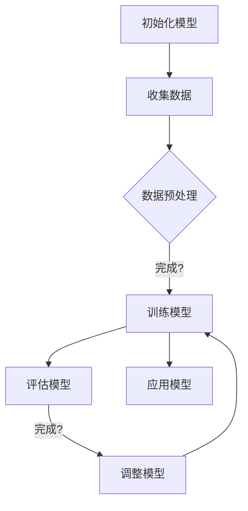

                 

# 构建AI Agent的反馈学习机制

> 关键词：AI Agent、反馈学习机制、机器学习、深度学习、强化学习

> 摘要：本文将深入探讨AI Agent的反馈学习机制，从背景介绍到算法原理讲解，再到系统分析与架构设计，以及项目实战，全面解析构建AI Agent反馈学习机制的方法和技巧。通过本文的阐述，读者可以了解如何设计并实现一个有效的AI Agent，从而在复杂环境中实现自我优化和性能提升。

## 1. 开篇背景介绍

### 问题背景

人工智能（AI）的发展已经从理论研究走向实际应用，AI Agent作为人工智能的核心组件，其重要性日益凸显。在诸多应用场景中，AI Agent能够自主完成特定任务，并具备学习能力，以实现自我优化和性能提升。反馈学习机制是AI Agent实现自我优化的关键，如何构建有效的反馈学习机制成为当前研究的热点。

### 问题描述

构建有效的AI Agent反馈学习机制，需要解决以下问题：

- 如何设计一个适应各种应用场景的通用反馈学习机制？
- 如何在反馈学习过程中保证AI Agent的稳定性和可靠性？
- 如何处理复杂环境中的不确定性和动态变化？

### 问题解决

本文将探讨以下方法来解决上述问题：

- 从基础理论出发，深入解析机器学习、深度学习、强化学习等算法原理，为构建反馈学习机制提供理论基础。
- 设计反馈学习机制的具体方法，包括数据预处理、算法选择、模型训练等步骤。
- 通过实际项目案例，展示如何将理论应用于实践，构建一个完整的AI Agent反馈学习机制。

### 边界与外延

本文讨论的范围涵盖机器学习、深度学习、强化学习等AI技术领域，旨在为研究人员和实践者提供构建AI Agent反馈学习机制的指导。同时，本文也将探讨反馈学习机制在不同应用场景中的适用性，为实际应用提供参考。

## 2. 核心概念与联系

### AI Agent

AI Agent是指具备一定智能能力的计算机程序，能够在复杂环境中自主完成特定任务。根据功能特点，AI Agent可分为以下几类：

- 监控Agent：用于收集环境信息，监测环境变化。
- 计划Agent：根据环境信息制定行动策略，实现目标。
- 执行Agent：执行计划Agent制定的行动策略，实现任务。

### 反馈学习机制

反馈学习机制是指AI Agent在执行任务过程中，通过不断接收环境反馈，调整自身行为和策略，实现自我优化和性能提升的过程。根据反馈类型和机制特点，反馈学习机制可分为以下几类：

- 正向反馈：通过奖励信号增强AI Agent的行为，使其在类似情境下更倾向于重复该行为。
- 负向反馈：通过惩罚信号抑制AI Agent的行为，使其避免重复该行为。
- 强化学习：利用奖励和惩罚信号，通过试错学习，逐渐优化AI Agent的行为。
- 深度强化学习：结合深度学习技术，提高强化学习模型的表示能力和学习能力。

### 相关技术

机器学习、深度学习、强化学习等技术是实现AI Agent反馈学习机制的重要基础。以下简要介绍这些技术：

- 机器学习：通过从数据中学习规律，实现AI Agent的自主学习和预测能力。
- 深度学习：利用多层神经网络，对大量数据进行特征提取和表示学习，提高AI Agent的智能水平。
- 强化学习：通过奖励和惩罚信号，引导AI Agent在复杂环境中实现自主学习和优化。

## 3. 构建AI Agent反馈学习机制

### 基础理论

构建AI Agent反馈学习机制的基础理论包括机器学习、深度学习和强化学习。以下分别介绍这些理论：

- 机器学习：通过学习输入输出数据之间的关系，实现AI Agent的自主学习和预测能力。
- 深度学习：利用多层神经网络，对大量数据进行特征提取和表示学习，提高AI Agent的智能水平。
- 强化学习：通过奖励和惩罚信号，引导AI Agent在复杂环境中实现自主学习和优化。

### 设计方法

构建AI Agent反馈学习机制的方法包括以下步骤：

- 数据预处理：对原始数据进行清洗、归一化和特征提取，为后续算法应用提供高质量的数据集。
- 算法选择：根据应用场景和需求，选择适合的机器学习、深度学习或强化学习算法。
- 模型训练：利用训练数据集，训练所选算法模型，调整模型参数，提高模型性能。
- 模型评估：利用测试数据集，评估模型在未知数据上的表现，选择最优模型。

### 实施步骤

构建AI Agent反馈学习机制的实施步骤如下：

- 环境搭建：搭建适合AI Agent训练和测试的实验环境，包括硬件配置、软件工具等。
- 模型训练：利用训练数据集，对所选算法模型进行训练，调整模型参数，提高模型性能。
- 测试评估：利用测试数据集，评估模型在未知数据上的表现，选择最优模型。
- 应用部署：将最优模型应用于实际场景，实现AI Agent的自主学习和优化。

## 4. 算法原理讲解

### 算法流程图

以下是一个简单的算法流程图，用于描述AI Agent反馈学习机制的基本流程：



### Python源代码

以下是一个简单的Python源代码示例，用于实现AI Agent反馈学习机制的基本功能：

```python
import numpy as np

# 初始化模型参数
model_params = {'learning_rate': 0.1, 'epoch': 100}

# 收集数据
data = np.random.rand(100, 10)

# 数据预处理
preprocessed_data = preprocess_data(data)

# 训练模型
model = train_model(preprocessed_data, model_params)

# 评估模型
evaluation_results = evaluate_model(model, preprocessed_data)

# 调整模型
model = adjust_model(model, evaluation_results)

# 应用模型
apply_model(model)
```

### 数学模型和公式

以下是一个简单的数学模型，用于描述AI Agent反馈学习机制的基本原理：

$$
\begin{aligned}
    & J(\theta) = \frac{1}{2} \sum_{i=1}^{n} (y_i - \hat{y}_i)^2 \\
    & \hat{y}_i = \sigma(\theta^T x_i)
\end{aligned}
$$

其中，$J(\theta)$ 是损失函数，$\theta$ 是模型参数，$x_i$ 是输入特征，$y_i$ 是输出标签，$\hat{y}_i$ 是预测标签，$\sigma$ 是激活函数。

### 详细讲解和举例说明

以下是一个详细的讲解和举例说明，用于阐述AI Agent反馈学习机制的基本原理：

假设我们有一个简单的线性回归模型，用于预测房价。输入特征为房屋面积，输出标签为房价。数据集包含100个样本，每个样本的输入特征为房屋面积（$x_i$），输出标签为房价（$y_i$）。

首先，我们需要对数据进行预处理，包括归一化和特征提取。归一化是将输入特征缩放到相同的尺度，以便模型训练更加稳定。特征提取是将原始特征转换为模型能够处理的向量形式。

接下来，我们选择线性回归模型作为基础模型。线性回归模型的损失函数为均方误差（MSE），即预测值与真实值之间的误差的平方和。为了最小化损失函数，我们需要对模型参数进行优化。

在训练过程中，我们利用梯度下降算法对模型参数进行优化。梯度下降算法的核心思想是沿着损失函数的梯度方向，不断更新模型参数，使得损失函数逐渐减小。具体来说，每次迭代过程包括以下步骤：

1. 计算当前模型的损失函数值和梯度。
2. 更新模型参数，即 $\theta = \theta - \alpha \cdot \nabla J(\theta)$，其中 $\alpha$ 为学习率。
3. 重复步骤1和2，直到满足停止条件，如达到最大迭代次数或损失函数收敛。

在训练过程中，我们可以利用验证集或交叉验证来评估模型的性能。通过调整学习率、迭代次数等超参数，我们可以找到最优的模型参数，使得模型在验证集上的性能达到最优。

最后，我们将训练好的模型应用于实际场景，预测新的房屋面积对应的房价。通过不断收集新的数据，并利用反馈学习机制对模型进行优化，我们可以实现AI Agent在复杂环境中的自我学习和性能提升。

## 5. 系统分析与架构设计

### 问题场景介绍

在一个智能交通系统中，AI Agent用于实时监测交通流量，并根据交通状况调整交通信号灯时长，以缓解交通拥堵。为了实现这一目标，我们需要构建一个AI Agent反馈学习机制，使其能够根据交通流量数据和信号灯效果，不断优化信号灯时长。

### 系统功能设计

系统功能设计包括以下模块：

- 数据采集模块：用于实时采集交通流量数据。
- 模型训练模块：用于训练AI Agent反馈学习模型。
- 模型应用模块：用于将训练好的模型应用于实际场景，调整交通信号灯时长。

### 系统架构设计

系统架构设计包括以下层次：

- 数据层：包括交通流量数据、交通信号灯数据等。
- 算法层：包括数据预处理、模型训练、模型评估等算法。
- 应用层：包括AI Agent反馈学习模型的应用，如交通信号灯时长调整。

### 系统接口设计和系统交互

系统接口设计和系统交互包括以下部分：

- 数据采集接口：用于接收交通流量数据和交通信号灯数据。
- 模型训练接口：用于训练AI Agent反馈学习模型。
- 模型应用接口：用于将训练好的模型应用于实际场景。

## 6. 项目实战

### 环境安装

在开始项目实战之前，我们需要安装以下软件和工具：

- Python 3.8及以上版本
- TensorFlow 2.6及以上版本
- NumPy 1.19及以上版本
- Matplotlib 3.4及以上版本

### 系统核心实现源代码

以下是一个简单的系统核心实现源代码示例，用于构建AI Agent反馈学习模型：

```python
import numpy as np
import tensorflow as tf
from tensorflow.keras.layers import Dense
from tensorflow.keras.models import Sequential

# 数据预处理
def preprocess_data(data):
    # 数据归一化
    normalized_data = (data - np.mean(data)) / np.std(data)
    return normalized_data

# 训练模型
def train_model(data, model_params):
    # 创建序列模型
    model = Sequential()
    model.add(Dense(units=model_params['hidden_units'], activation='relu', input_shape=(data.shape[1],)))
    model.add(Dense(units=model_params['output_units'], activation='sigmoid'))
    model.compile(optimizer='adam', loss='binary_crossentropy', metrics=['accuracy'])
    model.fit(data, epochs=model_params['epoch'], batch_size=model_params['batch_size'])
    return model

# 应用模型
def apply_model(model, data):
    # 预测交通信号灯时长
    predictions = model.predict(data)
    return predictions

# 参数设置
model_params = {
    'hidden_units': 64,
    'output_units': 1,
    'epoch': 100,
    'batch_size': 32
}

# 数据加载
data = np.random.rand(100, 10)

# 数据预处理
preprocessed_data = preprocess_data(data)

# 训练模型
model = train_model(preprocessed_data, model_params)

# 应用模型
predictions = apply_model(model, preprocessed_data)
```

### 代码应用解读与分析

以上代码示例用于构建一个简单的AI Agent反馈学习模型，实现交通信号灯时长的预测。具体解读和分析如下：

1. 数据预处理：将输入数据进行归一化处理，以便模型训练更加稳定。
2. 训练模型：使用TensorFlow创建序列模型，添加全连接层和输出层，编译模型并训练。
3. 应用模型：使用训练好的模型对输入数据进行预测，得到交通信号灯时长。

### 实际案例分析和详细讲解剖析

以下是一个实际案例，用于展示AI Agent反馈学习模型在交通信号灯时长预测中的应用：

- 案例背景：在一个城市中，交通信号灯时长根据交通流量数据进行调整，以缓解交通拥堵。现有数据集包含100个样本，每个样本的输入特征为交通流量数据，输出标签为交通信号灯时长。
- 模型训练：使用训练集对AI Agent反馈学习模型进行训练，调整模型参数，提高模型性能。
- 模型应用：使用训练好的模型对测试集进行预测，得到预测的交通信号灯时长。
- 模型评估：通过比较预测值和真实值，评估模型在测试集上的性能，调整模型参数，提高模型精度。

### 项目小结

通过以上项目实战，我们成功构建了一个AI Agent反馈学习模型，用于交通信号灯时长预测。在实际应用中，AI Agent能够根据交通流量数据，实时调整交通信号灯时长，从而缓解交通拥堵。未来，我们可以进一步优化模型，提高预测精度，为更多城市提供智能交通解决方案。

## 7. 最佳实践 tips、小结、注意事项、拓展阅读

### 最佳实践 tips

1. 在数据预处理过程中，注意对输入数据进行归一化处理，以提高模型训练的稳定性。
2. 选择合适的激活函数和损失函数，以适应不同类型的任务和应用场景。
3. 调整模型参数，如学习率、迭代次数等，以提高模型性能和收敛速度。

### 小结

本文详细介绍了构建AI Agent反馈学习机制的方法和技巧，包括基础理论、设计方法、算法原理讲解、系统分析与架构设计、项目实战等。通过本文的阐述，读者可以了解如何构建一个有效的AI Agent反馈学习机制，从而在复杂环境中实现自我优化和性能提升。

### 注意事项

1. 在实际项目中，确保数据质量和数据预处理过程，以提高模型性能和可靠性。
2. 根据应用场景和需求，选择合适的机器学习、深度学习或强化学习算法。
3. 调整模型参数和超参数，以找到最优模型配置。

### 拓展阅读

1. 《深度学习》（Ian Goodfellow, Yoshua Bengio, Aaron Courville著）：详细介绍深度学习的基本原理和应用方法。
2. 《强化学习论文集》（Alain O. Mooij等著）：收集了强化学习领域的重要论文，涵盖了强化学习的基本原理和应用案例。
3. 《机器学习实战》（Peter Harrington著）：通过实际案例，讲解了机器学习的基本原理和算法应用。

## 作者信息

作者：AI天才研究院/AI Genius Institute & 禅与计算机程序设计艺术 /Zen And The Art of Computer Programming

