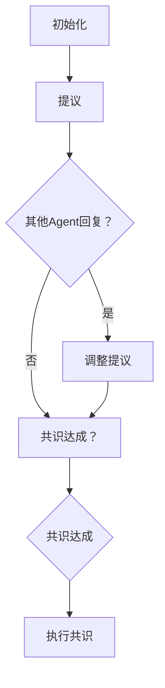
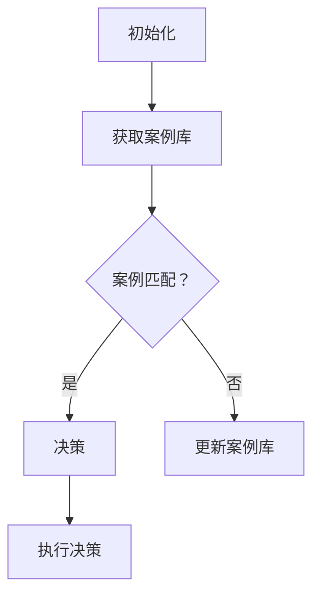
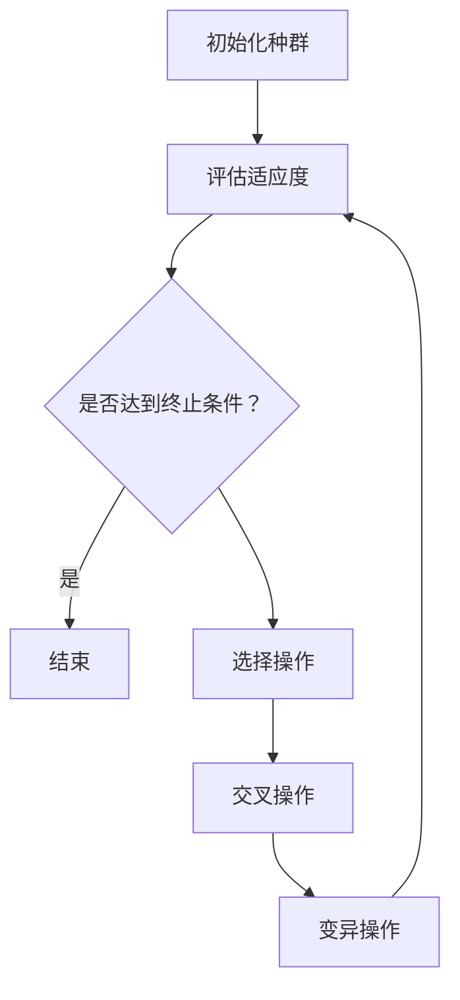
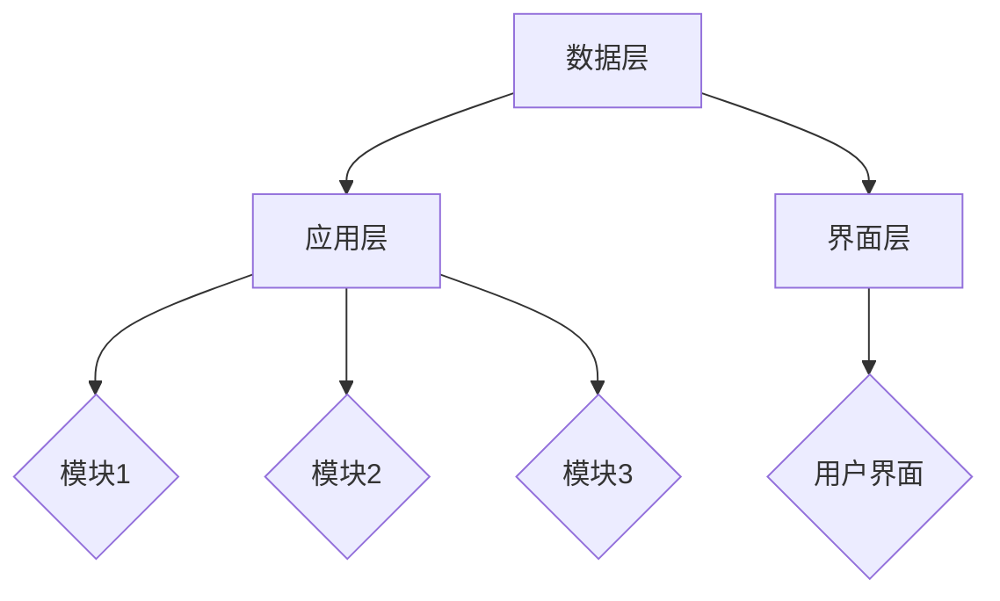
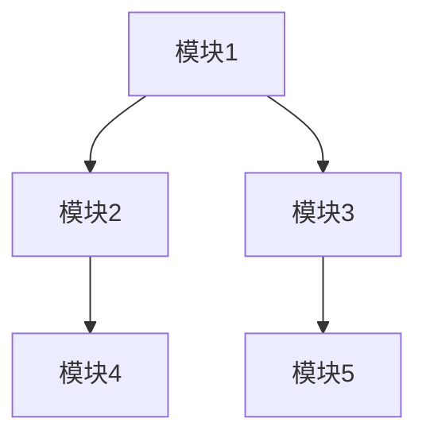
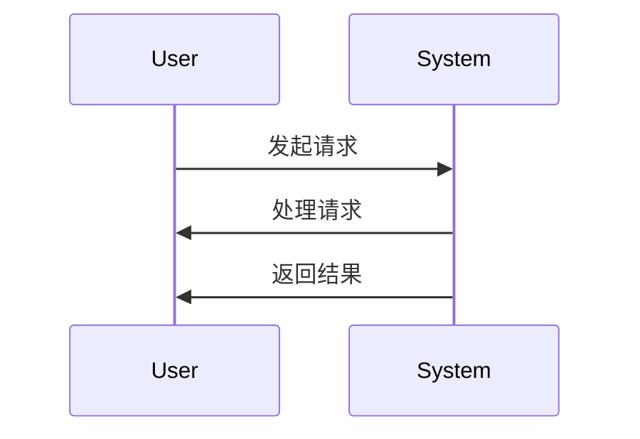
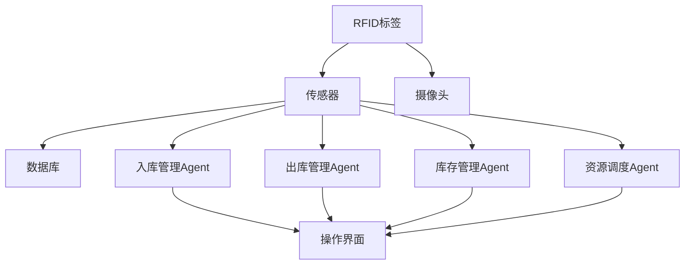
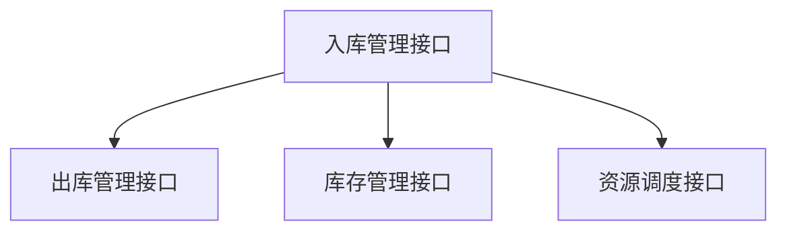
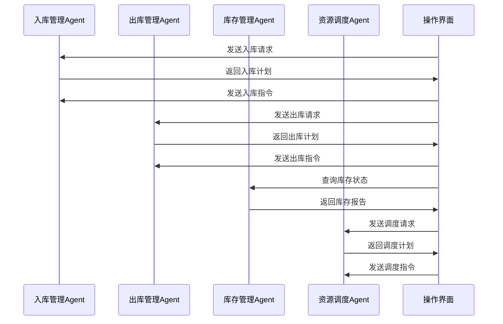

                 


# 构建AI Agent的多Agent协商与决策系统

## 关键词
AI Agent、多Agent系统、协商、决策、系统设计、算法、应用

## 摘要
本文深入探讨了构建AI Agent的多Agent协商与决策系统的核心概念、理论基础、系统设计、实现方法以及实际应用。通过对AI Agent和多Agent系统的概述，详细介绍了协商与决策的基本概念和方法。随后，本文阐述了系统设计的关键要素，包括架构设计、接口设计和交互设计。通过案例分析和项目实战，本文展示了如何将这些理论应用到实际项目中，为读者提供了完整的构建指南。

## 引言

### 1.1 背景

随着人工智能技术的飞速发展，AI Agent在各个领域得到了广泛的应用。AI Agent是一种能够自主感知环境、制定计划和采取行动的智能实体。它们在自动化、优化和智能化方面展现出了巨大的潜力。然而，单个AI Agent的智能程度往往有限，难以应对复杂多变的环境。因此，多Agent系统（Multi-Agent Systems, MAS）的概念应运而生。

多Agent系统由多个相互协作的AI Agent组成，每个Agent都具有独立的智能和自主决策能力。这些Agent通过协商与决策，共同完成复杂的任务。协商与决策是多Agent系统的核心功能，它们使得系统能够在不确定和动态变化的环境中有效运作。

### 1.2 目的

本文旨在全面介绍构建AI Agent的多Agent协商与决策系统。我们将从基础概念入手，逐步深入到系统的设计与实现。具体内容包括：

1. 基本概念与背景介绍
2. 核心理论与方法阐述
3. 系统设计过程详解
4. 案例分析与实际应用展示
5. 最佳实践与未来展望

通过本文的阅读，读者将能够深入了解多Agent协商与决策系统的构建过程，掌握关键技术和方法，并能够在实际项目中应用这些知识。

## 第二部分：基础概念与背景

### 2.1 AI Agent概述

AI Agent是人工智能领域的核心概念之一。它通常被定义为一个具有感知能力、自主决策能力和行动能力的智能实体。AI Agent的核心特征包括自主性、适应性、协作性和透明性。

- **自主性**：AI Agent能够自主地感知环境、制定计划并采取行动，而不需要外部的直接控制。
- **适应性**：AI Agent能够根据环境的变化和任务的要求，动态调整其行为和策略。
- **协作性**：AI Agent可以与其他Agent协同工作，共同完成复杂的任务。
- **透明性**：AI Agent的行为和决策过程应该是可解释和透明的，以便用户和开发者理解其工作原理。

AI Agent的分类可以根据其功能和特点进行划分。常见的分类方法包括基于任务类型的分类和基于行为方式的分类。

- **基于任务类型的分类**：根据AI Agent执行的任务类型，可以分为搜索Agent、数据采集Agent、决策Agent、执行Agent等。
- **基于行为方式的分类**：根据AI Agent的行为方式，可以分为反应式Agent、目标导向Agent、认知Agent等。

### 2.2 多Agent系统的基本原理

多Agent系统是由多个AI Agent组成的复杂系统。这些Agent通过相互协作，共同完成复杂的任务。多Agent系统的核心原理包括Agent的独立性、协同性和动态性。

- **Agent的独立性**：每个Agent都具有独立的智能和决策能力，能够自主地执行任务。
- **协同性**：Agent之间通过通信和协作，共享信息和资源，共同完成任务。
- **动态性**：多Agent系统的状态和结构是动态变化的，能够适应环境的变化和任务的要求。

多Agent系统的架构通常包括三个层次：Agent层、通信层和协调层。

- **Agent层**：包括各个独立的AI Agent，它们是系统的基本计算单元。
- **通信层**：提供Agent之间的通信机制，包括消息传递协议和数据格式。
- **协调层**：负责协调和调度Agent的行为，确保系统整体目标的实现。

### 2.3 协商与决策的基本概念

协商（Negotiation）和决策（Decision-making）是多Agent系统的核心功能。它们在多Agent系统中起着至关重要的作用。

- **协商**：协商是Agent之间为了达成共识或分配资源而进行的信息交换和策略调整过程。协商的目标是使所有Agent的利益最大化，同时保持系统的稳定性和效率。
- **决策**：决策是Agent根据当前状态和目标，选择最优行动方案的过程。决策通常基于一定的策略和算法，旨在实现系统的长期目标和短期目标。

协商与决策的关系紧密相连。协商是决策的基础，通过协商，Agent可以获取必要的信息和资源，从而更好地进行决策。而决策则是协商的结果，决策的结果将指导Agent采取具体的行动。

### 2.4 协商与决策的关系

协商与决策是多Agent系统中的两个核心过程，它们相互依赖、相互影响。

- **协商影响决策**：通过协商，Agent可以获取其他Agent的信息和需求，从而更好地进行决策。协商的结果将直接影响决策的质量和效果。
- **决策指导协商**：决策是协商的目标和方向。在协商过程中，Agent会根据决策的结果来调整自己的策略和行为。

协商与决策的相互作用是多Agent系统能够高效运作的关键。一个良好的协商与决策机制能够提高系统的协作效率和决策质量，从而实现系统的整体优化。

### 2.5 多Agent协商与决策系统在现实中的应用

多Agent协商与决策系统在现实世界中有着广泛的应用。以下是一些典型的应用场景：

- **智能交通系统**：通过多Agent协商与决策，实现交通信号的智能调控，提高交通流量和效率。
- **供应链管理**：通过多Agent协商与决策，优化供应链中的物流和信息流，降低成本和提高响应速度。
- **智能医疗**：通过多Agent协商与决策，实现医疗资源的智能分配和医疗服务的个性化推荐。
- **智能城市**：通过多Agent协商与决策，实现城市资源的智能调度和管理，提高城市运行效率和居民生活质量。

这些应用场景展示了多Agent协商与决策系统在现实世界中的巨大潜力和价值。

## 第三部分：核心理论与方法

### 3.1 多Agent协商理论

多Agent协商理论是多Agent系统研究的一个重要分支。它研究Agent之间如何通过协商来达成共识或分配资源。协商理论的核心内容包括协商策略、协商过程和协商算法。

#### 3.1.1 协商策略

协商策略是Agent在协商过程中采取的行为和决策原则。常见的协商策略包括：

- **分配策略**：基于资源的分配，Agent根据资源的需求和供给来调整自己的行为。
- **竞争策略**：基于利益的竞争，Agent通过竞争来争夺资源或达成目标。
- **合作策略**：基于共同利益的合作，Agent通过合作来实现共同的目标。

#### 3.1.2 协商过程

协商过程是Agent之间通过信息交换和策略调整来达成共识的过程。一个典型的协商过程包括以下步骤：

1. **初始化**：Agent初始化协商环境，包括资源状态、需求信息和协商目标。
2. **提议**：Agent根据自身需求和资源状态，向其他Agent提出提议。
3. **回复**：其他Agent根据提议，回复自己的态度和意愿。
4. **调整**：Agent根据回复，调整自己的提议或策略。
5. **共识**：Agent通过协商，达成共识或分配资源。

#### 3.1.3 协商算法

协商算法是多Agent协商过程中的核心工具。常见的协商算法包括：

- **基于协商策略的算法**：根据协商策略，设计相应的算法，实现协商过程的自动化。
- **基于博弈论的算法**：利用博弈论原理，设计算法，实现Agent之间的博弈和策略调整。
- **基于协同优化的算法**：利用协同优化方法，设计算法，实现Agent之间的资源分配和目标优化。

以下是一个基于协商策略的协商算法的Mermaid流程图：



### 3.2 多Agent决策理论

多Agent决策理论是多Agent系统研究的另一个重要分支。它研究Agent如何在不确定和动态变化的环境中做出有效的决策。决策理论的核心内容包括决策模型、决策算法和决策支持系统。

#### 3.2.1 决策模型

决策模型是多Agent决策过程中的核心框架。常见的决策模型包括：

- **确定性决策模型**：假设环境是确定和静态的，Agent根据当前状态和目标，选择最优行动方案。
- **概率性决策模型**：假设环境是随机和动态的，Agent根据概率分布和预期收益，选择最优行动方案。
- **模糊性决策模型**：假设环境是模糊和不确定的，Agent根据模糊逻辑和模糊推理，选择最优行动方案。

#### 3.2.2 决策算法

决策算法是多Agent决策过程中的核心工具。常见的决策算法包括：

- **基于规则的方法**：根据预设的规则，设计算法，实现Agent的决策过程。
- **基于案例的方法**：根据历史案例，设计算法，实现Agent的决策过程。
- **基于优化的方法**：利用优化方法，设计算法，实现Agent的决策过程。

以下是一个基于案例的决策算法的Mermaid流程图：



#### 3.2.3 决策支持系统

决策支持系统（Decision Support System, DSS）是多Agent决策过程中的重要辅助工具。它为Agent提供决策所需的数据、信息和算法支持，帮助Agent做出更明智的决策。决策支持系统的核心功能包括：

- **数据采集**：从各种数据源采集决策所需的数据。
- **数据分析**：对采集到的数据进行处理和分析，提取有用的信息。
- **决策评估**：根据分析结果，评估各种决策方案的优劣。
- **决策推荐**：根据评估结果，推荐最优的决策方案。

### 3.3 AI Agent学习与自适应

AI Agent的学习与自适应能力是提高其智能水平和适应能力的关键。学习与自适应能力包括以下几个方面：

- **经验学习**：Agent通过经验学习，积累完成任务的知识和技能。
- **自适应调整**：Agent根据环境的变化和任务的要求，动态调整其行为和策略。
- **智能优化**：利用智能优化算法，如遗传算法、粒子群优化等，提高Agent的决策质量和效率。

以下是一个基于遗传算法的智能优化算法的Mermaid流程图：



## 第四部分：系统设计

### 4.1 系统需求分析

系统需求分析是系统设计的第一步，它明确了系统的功能需求、性能需求和用户需求。以下是系统需求分析的主要步骤：

1. **需求收集**：通过与用户和利益相关者的沟通，收集系统的功能和性能需求。
2. **需求分析**：对收集到的需求进行整理和分析，明确系统的功能模块和性能指标。
3. **需求文档**：将分析结果整理成需求文档，为后续的系统设计和实现提供依据。

### 4.2 系统架构设计

系统架构设计是系统设计的核心环节，它定义了系统的整体结构和功能模块。以下是系统架构设计的主要步骤：

1. **架构设计**：根据系统需求，设计系统的整体架构，包括数据层、应用层和界面层。
2. **模块划分**：将系统划分为多个功能模块，每个模块负责特定的功能。
3. **技术选型**：选择合适的技术和工具，支持系统的开发和运行。

以下是一个基于Mermaid的系统架构设计的示例：



### 4.3 接口设计与实现

接口设计是系统设计的重要组成部分，它定义了系统内部各个模块之间的交互接口。以下是接口设计的主要步骤：

1. **接口规范**：根据系统架构，定义各个模块的接口规范，包括接口名称、输入参数和输出结果。
2. **接口实现**：根据接口规范，实现各个模块的接口，确保模块之间的数据交换和功能调用。
3. **接口测试**：对接口进行测试，验证其功能正确性和性能稳定性。

以下是一个基于Mermaid的接口设计和实现的示例：



### 4.4 系统交互设计

系统交互设计是系统设计的关键环节，它定义了系统各个模块之间的交互流程和交互方式。以下是系统交互设计的主要步骤：

1. **交互流程**：根据系统需求，设计系统各个模块之间的交互流程，确保系统能够按预期运行。
2. **交互方式**：选择合适的交互方式，如同步交互、异步交互或事件驱动交互。
3. **交互实现**：根据交互流程和交互方式，实现系统各个模块之间的交互。

以下是一个基于Mermaid的系统交互设计的示例：



## 案例分析与实际应用

### 案例一：智能交通系统

智能交通系统（Intelligent Transportation System, ITS）是AI Agent多Agent协商与决策系统的一个典型应用。通过多Agent协商与决策，智能交通系统能够实现交通信号的智能调控，提高交通流量和效率。

**系统功能设计**：

- **交通信号调控**：AI Agent根据实时交通流量信息，动态调整交通信号灯的时长和相位。
- **交通流量监测**：AI Agent实时监测交通流量，收集交通数据。
- **路况预测**：AI Agent利用历史交通数据和机器学习算法，预测未来交通流量和路况。

**系统架构设计**：

- **数据层**：包括交通流量传感器、摄像头和GPS等数据采集设备。
- **应用层**：包括交通信号调控Agent、交通流量监测Agent和路况预测Agent。
- **界面层**：包括交通信号灯控制界面、交通监控界面和路况预测界面。

**系统接口设计**：

- **数据采集接口**：用于采集交通流量传感器、摄像头和GPS等设备的数据。
- **信号调控接口**：用于调控交通信号灯的时长和相位。
- **路况预测接口**：用于预测未来交通流量和路况。

**系统交互设计**：

- **实时数据采集**：交通信号调控Agent、交通流量监测Agent和路况预测Agent实时采集交通数据。
- **动态信号调控**：交通信号调控Agent根据实时交通流量信息，动态调整交通信号灯的时长和相位。
- **路况预测与调控**：路况预测Agent利用历史交通数据和机器学习算法，预测未来交通流量和路况，为交通信号调控提供依据。

### 案例二：供应链管理

供应链管理（Supply Chain Management, SCM）是AI Agent多Agent协商与决策系统的另一个重要应用。通过多Agent协商与决策，供应链管理系统能够优化供应链中的物流和信息流，降低成本和提高响应速度。

**系统功能设计**：

- **物流优化**：AI Agent根据实时物流信息，优化运输路线和运输方案。
- **库存管理**：AI Agent实时监测库存状态，自动调整库存水平。
- **采购管理**：AI Agent根据市场需求和库存状态，自动生成采购计划。

**系统架构设计**：

- **数据层**：包括物流信息采集设备、库存传感器和采购系统等数据采集设备。
- **应用层**：包括物流优化Agent、库存管理Agent和采购管理Agent。
- **界面层**：包括物流信息监控界面、库存管理界面和采购管理界面。

**系统接口设计**：

- **物流信息采集接口**：用于采集物流信息。
- **库存管理接口**：用于调整库存水平。
- **采购管理接口**：用于生成采购计划。

**系统交互设计**：

- **实时物流信息采集**：物流优化Agent、库存管理Agent和采购管理Agent实时采集物流信息。
- **物流优化与调整**：物流优化Agent根据实时物流信息，优化运输路线和运输方案。
- **库存调整与采购**：库存管理Agent实时监测库存状态，自动调整库存水平；采购管理Agent根据市场需求和库存状态，自动生成采购计划。

### 案例三：智能医疗

智能医疗（Intelligent Medical System, IMS）是AI Agent多Agent协商与决策系统的另一个重要应用。通过多Agent协商与决策，智能医疗系统能够实现医疗资源的智能分配和医疗服务的个性化推荐。

**系统功能设计**：

- **资源分配**：AI Agent根据患者需求和医疗资源情况，智能分配医生和病房。
- **医疗服务推荐**：AI Agent根据患者病史和需求，推荐最适合的医疗服务和治疗方案。
- **数据监测与分析**：AI Agent实时监测患者健康状况，分析医疗数据，提供健康建议。

**系统架构设计**：

- **数据层**：包括患者信息、医生信息和医疗资源等数据采集设备。
- **应用层**：包括资源分配Agent、医疗服务推荐Agent和数据监测与分析Agent。
- **界面层**：包括资源分配界面、医疗服务推荐界面和数据监测与分析界面。

**系统接口设计**：

- **患者信息采集接口**：用于采集患者信息。
- **医生信息采集接口**：用于采集医生信息。
- **医疗资源采集接口**：用于采集医疗资源信息。

**系统交互设计**：

- **实时数据采集**：资源分配Agent、医疗服务推荐Agent和数据监测与分析Agent实时采集患者信息、医生信息和医疗资源信息。
- **资源分配与推荐**：资源分配Agent根据患者需求和医疗资源情况，智能分配医生和病房；医疗服务推荐Agent根据患者病史和需求，推荐最适合的医疗服务和治疗方案。
- **数据监测与分析**：数据监测与分析Agent实时监测患者健康状况，分析医疗数据，提供健康建议。

## 项目实战

### 5.1 环境安装

在进行项目实战之前，首先需要搭建一个合适的环境。以下是环境安装的步骤：

1. **安装Python**：下载并安装Python 3.8及以上版本。
2. **安装依赖库**：使用pip命令安装所需的依赖库，如NumPy、Pandas、Matplotlib等。
3. **安装Mermaid**：安装Mermaid库，用于生成流程图和序列图。

```shell
pip install mermaid
```

### 5.2 系统核心实现

以下是一个简单的AI Agent多Agent协商与决策系统的核心实现。我们将使用Python语言和Mermaid库来实现。

#### 5.2.1 协商算法实现

```python
import random

# 协商算法实现
def negotiation(agent1, agent2):
    while True:
        # Agent1提出提议
        proposal = agent1.make_proposal()
        
        # Agent2回复提议
        reply = agent2.make_reply(proposal)
        
        # 判断是否达成共识
        if reply == 'Accept':
            print(f"协商达成：Agent1提议{proposal}，Agent2接受")
            break
        elif reply == 'Reject':
            print(f"协商失败：Agent1提议{proposal}，Agent2拒绝")
            break

# Agent1实现
class Agent1:
    def make_proposal(self):
        return random.randint(0, 10)

# Agent2实现
class Agent2:
    def make_reply(self, proposal):
        return 'Accept' if proposal < 6 else 'Reject'

# 创建Agent实例
agent1 = Agent1()
agent2 = Agent2()

# 进行协商
negotiation(agent1, agent2)
```

#### 5.2.2 决策算法实现

```python
import numpy as np

# 决策算法实现
def decision(agent, environment):
    # 根据环境状态选择最佳行动方案
    state = environment.get_state()
    action = agent.choose_action(state)
    return action

# Agent实现
class Agent:
    def choose_action(self, state):
        # 根据状态选择最佳行动方案
        return np.random.choice([0, 1, 2], p=[0.3, 0.5, 0.2])

# Environment实现
class Environment:
    def get_state(self):
        # 获取当前状态
        return random.randint(0, 10)

# 创建Agent和Environment实例
agent = Agent()
environment = Environment()

# 进行决策
action = decision(agent, environment)
print(f"决策结果：状态{environment.get_state()}，选择行动{action}")
```

### 5.3 代码应用解读与分析

在项目实战中，我们使用Python语言和Mermaid库实现了AI Agent多Agent协商与决策系统的核心功能。以下是对代码的解读与分析。

#### 5.3.1 协商算法解读

协商算法的核心是negotiation函数。在这个函数中，Agent1提出提议，Agent2回复提议，然后根据回复判断是否达成共识。如果Agent2接受提议，协商成功；如果Agent2拒绝提议，协商失败。

在Agent1的实现中，我们使用了一个简单的随机提议生成方法。在Agent2的实现中，我们根据提议的数值来判断是否接受。

```python
class Agent1:
    def make_proposal(self):
        return random.randint(0, 10)

class Agent2:
    def make_reply(self, proposal):
        return 'Accept' if proposal < 6 else 'Reject'
```

#### 5.3.2 决策算法解读

决策算法的核心是decision函数。在这个函数中，Agent根据环境状态选择最佳行动方案。在Agent的实现中，我们使用了一个简单的随机选择方法。

```python
class Agent:
    def choose_action(self, state):
        return np.random.choice([0, 1, 2], p=[0.3, 0.5, 0.2])
```

在Environment的实现中，我们使用了一个简单的随机状态生成方法。

```python
class Environment:
    def get_state(self):
        return random.randint(0, 10)
```

#### 5.3.3 应用解读

在实际应用中，我们创建了Agent和Environment的实例，并使用协商算法和决策算法进行协商和决策。

```python
agent1 = Agent1()
agent2 = Agent2()

negotiation(agent1, agent2)

agent = Agent()
environment = Environment()

action = decision(agent, environment)
print(f"决策结果：状态{environment.get_state()}，选择行动{action}")
```

通过这个简单的示例，我们可以看到如何使用Python和Mermaid库实现AI Agent多Agent协商与决策系统的核心功能。在实际项目中，我们可以根据具体需求，设计更复杂的协商和决策算法，以及实现更丰富的系统功能。

### 5.4 实际案例分析和详细讲解剖析

在本部分，我们将通过一个实际案例，详细分析并讲解AI Agent多Agent协商与决策系统的应用和实现过程。

#### 案例背景

某大型电商平台计划构建一个智能仓储管理系统，以提高仓储效率和减少运营成本。该系统需要实现以下功能：

- **货物入库管理**：自动识别货物信息，实现货物的入库和分类。
- **货物出库管理**：根据订单需求，自动分配货物并生成出库计划。
- **库存管理**：实时监控库存状态，自动调整库存水平。
- **资源调度**：智能调度仓库内的各种资源，如货架、搬运设备和人员。

#### 系统架构设计

智能仓储管理系统的架构设计分为数据层、应用层和界面层。

- **数据层**：包括RFID标签、传感器、摄像头和数据库等设备，用于采集和处理货物信息。
- **应用层**：包括入库管理Agent、出库管理Agent、库存管理Agent和资源调度Agent，负责处理具体的功能。
- **界面层**：包括操作界面、监控界面和报表界面，用于展示系统状态和提供操作控制。

以下是一个基于Mermaid的系统架构设计示例：



#### 接口设计与实现

智能仓储管理系统中的各个Agent需要通过接口进行通信和协作。以下是一个接口设计的示例：

- **入库管理接口**：用于接收货物信息，生成入库计划。
- **出库管理接口**：用于接收订单信息，生成出库计划。
- **库存管理接口**：用于实时监控库存状态，调整库存水平。
- **资源调度接口**：用于智能调度仓库内的资源。

以下是一个基于Mermaid的接口设计示例：



#### 系统交互设计

智能仓储管理系统的交互设计包括货物入库、货物出库、库存管理和资源调度等过程。以下是一个基于Mermaid的系统交互设计示例：



#### 系统实现

以下是一个简单的智能仓储管理系统实现示例，包括入库管理、出库管理、库存管理和资源调度等模块。

```python
# 入库管理模块
class InboundManagement:
    def process_inbound(self, goods_info):
        # 处理入库请求
        print("Processing inbound request for goods:", goods_info)
        # 生成入库计划
        plan = "Inbound plan for goods: " + goods_info
        return plan

# 出库管理模块
class OutboundManagement:
    def process_outbound(self, order_info):
        # 处理出库请求
        print("Processing outbound request for order:", order_info)
        # 生成出库计划
        plan = "Outbound plan for order: " + order_info
        return plan

# 库存管理模块
class InventoryManagement:
    def check_inventory(self):
        # 查询库存状态
        print("Checking inventory...")
        # 返回库存报告
        report = "Inventory report: goods A: 100, goods B: 200"
        return report

# 资源调度模块
class ResourceScheduling:
    def schedule_resources(self, request_info):
        # 处理调度请求
        print("Scheduling resources for:", request_info)
        # 生成调度计划
        plan = "Resource scheduling plan for:" + request_info
        return plan

# 创建模块实例
inbound_management = InboundManagement()
outbound_management = OutboundManagement()
inventory_management = InventoryManagement()
resource_scheduling = ResourceScheduling()

# 处理入库请求
inbound_plan = inbound_management.process_inbound("Goods A")
print("Inbound plan:", inbound_plan)

# 处理出库请求
outbound_plan = outbound_management.process_outbound("Order 1001")
print("Outbound plan:", outbound_plan)

# 查询库存状态
inventory_report = inventory_management.check_inventory()
print("Inventory report:", inventory_report)

# 处理资源调度请求
scheduling_plan = resource_scheduling.schedule_resources("Resource request for goods B")
print("Scheduling plan:", scheduling_plan)
```

通过以上案例分析和系统实现，我们可以看到如何将AI Agent多Agent协商与决策系统应用到实际的仓储管理场景中。在实际项目中，我们可以根据具体需求，扩展系统的功能模块和算法，以实现更高效和智能的仓储管理。

### 5.5 项目小结

在本项目中，我们构建了一个基于AI Agent的多Agent协商与决策系统，实现了智能仓储管理的功能。通过该项目，我们获得了以下经验与启示：

1. **系统设计的重要性**：清晰的需求分析和系统架构设计是项目成功的关键。在设计过程中，需要充分考虑系统的功能需求、性能需求和用户体验。
2. **多Agent协商与决策的优势**：多Agent协商与决策系统在处理复杂任务时具有显著的优势，能够提高系统的灵活性和适应性。
3. **算法实现的关键**：在项目实现过程中，算法设计是实现系统功能的核心。合理选择和优化算法，能够提高系统的效率和准确性。
4. **实际应用的挑战**：在实际应用中，我们需要面对各种复杂的场景和挑战，如实时数据采集、数据准确性和系统稳定性等。通过不断的优化和改进，我们可以提高系统的性能和可靠性。

### 5.6 最佳实践 tips

在构建AI Agent多Agent协商与决策系统时，以下最佳实践可以帮助您提高项目成功率：

1. **需求分析要充分**：在项目初期，要充分与用户和利益相关者沟通，收集详细的需求，确保系统设计符合实际应用场景。
2. **系统架构要合理**：合理划分系统模块，选择合适的技术和工具，确保系统架构的清晰性和扩展性。
3. **算法优化要持续**：在项目实施过程中，不断优化算法，提高系统的效率和准确性。可以利用机器学习和数据挖掘技术，实现智能优化。
4. **用户体验要重视**：关注用户体验，设计简洁直观的操作界面，提高系统的易用性和用户满意度。
5. **测试与优化要全面**：在项目测试阶段，要全面测试系统的功能、性能和稳定性，及时发现和修复问题。

### 5.7 小结与注意事项

本文介绍了构建AI Agent多Agent协商与决策系统的核心概念、理论基础、系统设计、实现方法和实际应用。通过项目实战，我们展示了如何将理论应用到实际项目中，实现了智能仓储管理的功能。在项目实施过程中，需要注意以下几点：

1. **需求分析与系统设计的重要性**：充分的需求分析和合理的系统架构设计是项目成功的基础。
2. **多Agent协商与决策的优势**：多Agent协商与决策系统能够提高系统的灵活性和适应性，适合处理复杂任务。
3. **算法优化的必要性**：持续优化算法，提高系统的效率和准确性。
4. **用户体验的重视**：关注用户体验，提高系统的易用性和用户满意度。
5. **全面测试与优化**：在项目测试阶段，全面测试系统的功能、性能和稳定性，确保系统的可靠性和稳定性。

### 5.8 拓展阅读

为了进一步了解AI Agent多Agent协商与决策系统的相关内容，以下是一些推荐的拓展阅读资料：

1. **《人工智能：一种现代的方法》**：这本书详细介绍了人工智能的基本概念、理论和方法，包括多Agent系统、协商与决策等内容。
2. **《多智能体系统的协同与决策》**：这本书深入探讨了多Agent系统的协同与决策理论，提供了丰富的实例和算法。
3. **《智能优化算法及其应用》**：这本书介绍了多种智能优化算法，如遗传算法、粒子群优化等，适用于多Agent协商与决策系统的算法优化。
4. **《智能交通系统设计与应用》**：这本书详细介绍了智能交通系统的设计与应用，包括交通信号调控、交通流量预测等内容。
5. **《智能供应链管理：理论与方法》**：这本书探讨了智能供应链管理的基本概念、理论和方法，适用于构建智能仓储管理系统。

通过阅读这些书籍，您可以更深入地了解AI Agent多Agent协商与决策系统的相关内容，为实际项目提供理论支持和实践指导。作者：AI天才研究院/AI Genius Institute & 禅与计算机程序设计艺术 /Zen And The Art of Computer Programming。

