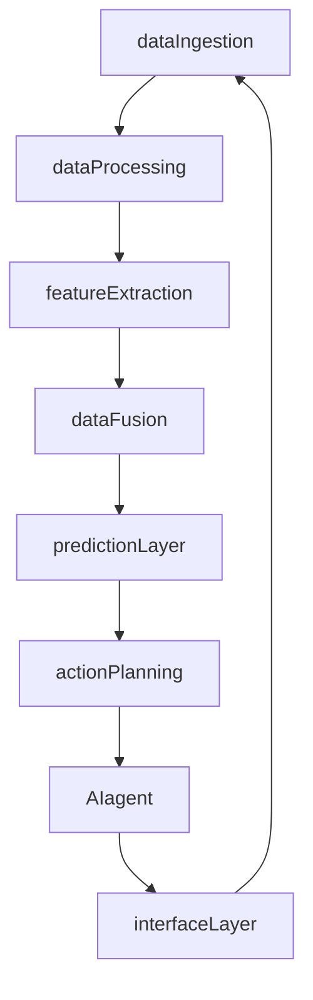
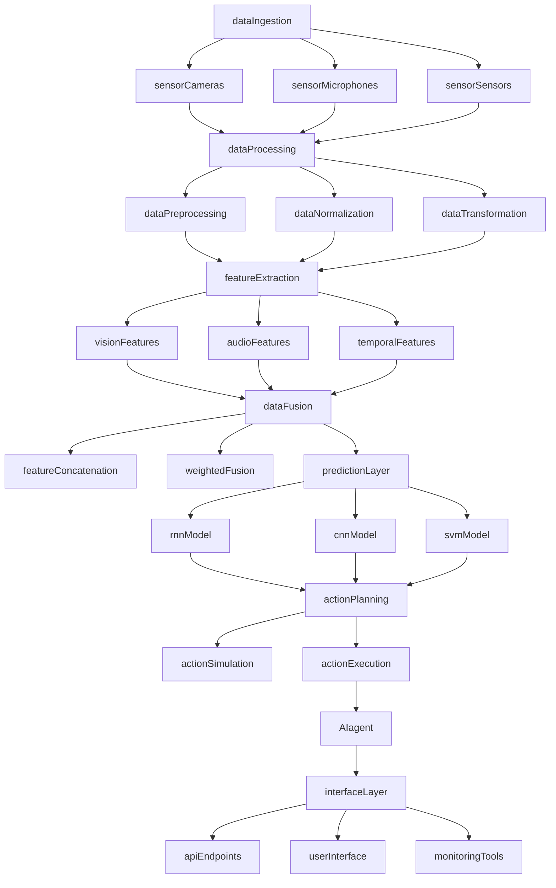

                 

### 概述：构建AI Agent的多模态事件预测系统的背景和重要性

随着人工智能（AI）技术的迅猛发展，AI Agent已成为现代智能系统研究的重要方向之一。AI Agent是一种能够自主感知环境、规划行动并实现目标的人工智能实体，广泛应用于自动驾驶、智能客服、智能家居等多个领域。然而，AI Agent的效能不仅取决于其决策能力，更关键在于其预测能力——准确预测未来事件对AI Agent的行动规划至关重要。

多模态事件预测系统则是提升AI Agent预测能力的核心技术手段。多模态数据融合，即整合来自多种感官模态的数据（如图像、语音、文本等），使得AI Agent能够从更丰富的信息源中捕捉环境变化，提高事件预测的准确性和鲁棒性。例如，在自动驾驶场景中，仅依靠视觉信息可能无法准确判断道路上的行人或障碍物，但结合语音、雷达等多模态数据，可以显著提升预测的准确性。

本篇文章旨在详细探讨如何构建AI Agent的多模态事件预测系统。文章结构如下：

1. **Part I: Introduction to AI Agent and Event Prediction**：介绍AI Agent和事件预测的背景、核心概念及其重要性。
    - **Chapter 1**: 背景介绍，探讨AI技术发展与AI Agent的兴起。
    - **Chapter 2**: 深入探讨AI Agent的基本概念、架构设计及其关键特性。
    - **Chapter 3**: 介绍事件预测的基本概念、面临的挑战与机遇，并探讨其应用场景。

2. **Part II: Multi-modal Data Integration**：探讨多模态数据的收集、预处理、融合与整合策略。
    - **Chapter 4**: 详细讲解多模态数据的类型、收集方法和预处理技术。
    - **Chapter 5**: 分析数据融合和整合的策略，并结合实际案例进行探讨。

3. **Part III: Event Prediction Models**：介绍事件预测的传统算法与先进模型。
    - **Chapter 6**: 讨论传统的预测算法，包括朴素贝叶斯、决策树和支持向量机。
    - **Chapter 7**: 探讨高级预测模型，如神经网络、递归神经网络和卷积神经网络。
    - **Chapter 8**: 分析集成方法和模型选择，并讨论如何在实际应用中优化模型。

通过本篇文章的深入探讨，读者将能够理解构建AI Agent的多模态事件预测系统的整体流程，并掌握关键技术和方法，为相关领域的研究和应用提供参考。

### Part I: Introduction to AI Agent and Event Prediction

#### Chapter 1: The Background and Significance of AI Agents and Event Prediction

##### 1.1 The Evolution of AI and the Emergence of AI Agents

Artificial Intelligence (AI) has seen remarkable evolution over the past few decades, transforming various industries and reshaping the way we live and work. The journey of AI can be broadly categorized into three main stages: **initial research and development**, **symbolic AI and rule-based systems**, and **modern AI with machine learning and deep learning**.

In the **initial research and development** phase, AI was primarily theoretical, focusing on understanding basic concepts such as problem-solving, knowledge representation, and learning. The development of algorithms like decision trees and naive Bayes classifiers laid the groundwork for AI's future advancements.

The **symbolic AI and rule-based systems** era, which began in the 1970s and continued through the 1980s, aimed to create AI systems that could mimic human decision-making by using explicit rules and symbolic logic. However, these systems were often limited by their reliance on human-created rules, making them inflexible and difficult to scale.

The advent of **modern AI with machine learning and deep learning** in the late 20th and early 21st centuries marked a significant shift. **Machine learning**, which involves training models on large datasets to recognize patterns and make predictions, and **deep learning**, a subset of machine learning that utilizes neural networks with many layers, have revolutionized AI. These advancements have enabled AI systems to perform complex tasks with high accuracy and efficiency, paving the way for the emergence of AI agents.

**AI agents**, or **artificial agents**, are entities designed to perform tasks autonomously in dynamic environments. They are at the forefront of modern AI applications and are defined by their ability to perceive their environment, reason about it, and take actions to achieve specific goals. The development of AI agents can be attributed to several key factors:

1. **Advancements in Machine Learning**: Machine learning algorithms, particularly deep learning, have become powerful tools for enabling AI agents to learn from data and make predictions. This has led to significant improvements in the capabilities of AI agents, allowing them to perform complex tasks such as image recognition, natural language processing, and decision-making.

2. **Increase in Data Availability**: The proliferation of the internet and digital technologies has led to an exponential increase in the amount of data available. This abundance of data has been crucial for training AI agents, enabling them to learn from vast amounts of information and improve their performance over time.

3. **Advanced Hardware and Computing Power**: The development of more powerful hardware, such as GPUs and TPUs, has significantly accelerated the training and inference processes for AI models. This has made it possible to deploy AI agents in real-world scenarios where computational resources were previously a limiting factor.

4. **Interest and Investment in AI**: The growing interest in AI, both from academic and industrial sectors, has led to increased investment in research and development. This has fostered innovation and the creation of new AI applications, further driving the development of AI agents.

##### 1.2 The Concept and Importance of Event Prediction

Event prediction is the process of estimating the likelihood and timing of future events based on historical data and patterns. In the context of AI agents, event prediction is crucial for decision-making and action planning. By predicting future events, AI agents can better navigate their environment, respond to changes, and achieve their goals.

The importance of event prediction can be understood through several key points:

1. **Enhancing Autonomy**: One of the primary goals of AI agents is to operate autonomously in dynamic environments. Event prediction enables AI agents to anticipate changes in their environment, allowing them to adapt their actions accordingly. This enhances their autonomy and reduces the need for continuous human intervention.

2. **Improving Efficiency**: Accurate event prediction can significantly improve the efficiency of AI agents. By predicting future events, agents can proactively plan their actions, reducing the time and resources required for decision-making and execution.

3. **Ensuring Safety and Reliability**: In safety-critical applications such as autonomous driving or industrial automation, accurate event prediction is essential for ensuring the safety and reliability of the system. Predicting potential hazards or failures in advance allows AI agents to take preventive measures, minimizing the risk of accidents or downtime.

4. **Optimizing Resource Allocation**: Event prediction can also help optimize resource allocation in various domains. For example, in supply chain management, accurate demand prediction can help businesses allocate inventory and manpower more efficiently, reducing costs and improving customer satisfaction.

##### 1.3 The Interplay Between AI Agents and Event Prediction

The interplay between AI agents and event prediction is a symbiotic relationship that enhances the capabilities of both. AI agents rely on event prediction to make informed decisions, while event prediction systems benefit from the data and insights generated by AI agents.

1. **Data Collection and Analysis**: AI agents collect data from their environment through various sensors and input devices. This data is then analyzed to extract meaningful insights, which are used to train event prediction models. The quality of the predictions is highly dependent on the quality of the data collected.

2. **Continuous Learning**: AI agents continuously learn from their interactions with the environment. As they gather more data and experience different scenarios, their event prediction models improve over time. This iterative process of data collection, analysis, and learning enables AI agents to adapt to changing environments and make more accurate predictions.

3. **Feedback Loop**: The predictions made by AI agents provide valuable feedback that can be used to refine event prediction models. This feedback loop helps in identifying errors and biases in the models, allowing for continuous improvement. Additionally, the feedback loop ensures that the predictions are aligned with the actual outcomes, further enhancing the accuracy and reliability of the system.

4. **Scalability and Adaptability**: The integration of event prediction systems with AI agents enables the development of scalable and adaptable AI applications. As new data sources and scenarios emerge, the event prediction models can be updated and optimized to handle these changes, ensuring that AI agents can continue to operate effectively in diverse environments.

In conclusion, the interplay between AI agents and event prediction is a crucial aspect of modern AI systems. By leveraging event prediction, AI agents can enhance their decision-making capabilities, leading to more autonomous, efficient, and reliable systems. As AI technology continues to advance, the synergy between AI agents and event prediction systems will only become more pronounced, paving the way for innovative applications in various fields.

---

In the next chapter, we will delve deeper into the fundamental concepts and architecture of AI agents, exploring the key components that enable their autonomous operation in dynamic environments. This will provide a solid foundation for understanding how event prediction systems integrate with AI agents to create powerful and intelligent systems.

### Chapter 2: Fundamental Concepts of AI Agents

In this chapter, we will explore the fundamental concepts, architecture, and key characteristics of AI agents. Understanding these aspects is crucial for grasping how AI agents operate and interact with their environment to achieve specific goals.

#### 2.1 Core Concepts and Terminology

To begin with, let's define some key terms and concepts that are essential for understanding AI agents.

**Agent**: An agent is an entity that can perceive its environment through sensors, take actions based on its observations, and receive feedback from its environment. In the context of AI, an AI agent is a system that uses artificial intelligence to perform tasks autonomously.

**Environment**: The environment consists of all the factors and elements that an agent interacts with. It can be physical or virtual, and it provides the context in which the agent operates.

**Perception**: Perception refers to the process by which an agent senses and interprets its environment. This involves acquiring data through sensors and processing this data to extract meaningful information.

**Action**: An action is a behavior or movement performed by an agent to influence its environment. The choice of action is based on the agent's goals and its current state.

**State**: The state of an agent represents its current condition or situation, including its internal variables and the state of its environment.

**Goal**: A goal is a desired outcome or state that an agent aims to achieve. Goals provide the motivation for an agent's actions and guide its decision-making process.

**Planning**: Planning involves determining a sequence of actions that will lead to the achievement of a goal. It requires the agent to consider various possible actions and their potential outcomes.

**Learning**: Learning is the process by which an agent improves its performance over time by adjusting its behavior based on feedback from its environment. This can involve updating internal models, improving action-selection strategies, or refining goal definitions.

#### 2.2 Architectural Design of AI Agents

The architecture of an AI agent determines how its components interact and function together to achieve autonomous operation. A typical AI agent can be composed of several key components:

**Sensors**: Sensors are devices that collect data from the environment. These can include cameras, microphones, GPS units, temperature sensors, and more. The type of sensors used depends on the agent's specific application and the type of information it needs to gather.

**Perception Module**: The perception module processes the raw data collected by the sensors to extract relevant features and information. This can involve tasks such as image recognition, speech recognition, or environmental monitoring. The output of the perception module is typically a set of attributes or states that represent the current situation of the agent.

**Action Selection Module**: The action selection module decides what actions the agent should take based on its current state and goals. This can involve various decision-making techniques, such as rule-based systems, machine learning models, or heuristic algorithms. The goal of the action selection module is to choose the action that is most likely to achieve the desired goal.

**Effectors**: Effectors are the devices that the agent uses to execute actions in the environment. These can include motors, robotic arms, speakers, or actuators. The choice of effectors depends on the nature of the tasks the agent needs to perform.

**Memory**: The memory component stores the agent's past experiences and knowledge. This can be used to improve the agent's learning and decision-making processes. Memory can be used to store information about past actions, outcomes, and environmental states, which can be used to inform future decisions.

**Controller**: The controller is the central decision-making component of the agent. It coordinates the activities of the perception, action selection, and effector modules. The controller receives inputs from the perception module, processes this information to determine the best action, and sends signals to the effectors to execute the chosen action.

#### 2.3 Key Characteristics of AI Agents

AI agents possess several key characteristics that distinguish them from traditional software systems and enable their autonomous operation in dynamic environments.

**Autonomy**: Autonomy is the ability of an agent to operate independently without human intervention. AI agents are designed to make decisions and take actions based on their own observations and reasoning, allowing them to adapt to changes in their environment.

**Reactivity**: Reactivity refers to the ability of an agent to respond quickly to changes in its environment. AI agents continuously perceive their environment and react to new information in real-time, enabling them to maintain their goals and objectives.

**Pro-activeness**: Pro-activeness is the ability of an agent to anticipate future events and take preemptive actions. While reactivity focuses on responding to current changes, pro-activeness involves predicting future events and taking actions to prepare for them.

**Adaptability**: Adaptability is the ability of an agent to adjust its behavior based on new information or changes in its environment. AI agents are designed to learn from their experiences and continuously improve their performance over time.

**Scalability**: Scalability refers to the ability of an agent to handle increasing amounts of data or complexity without a significant loss in performance. AI agents are often designed to be scalable, allowing them to operate effectively in a wide range of environments and conditions.

**Generalization**: Generalization is the ability of an agent to apply its learned knowledge and skills to new, unseen situations. AI agents should be able to generalize from their training data and apply their learning to different scenarios and tasks.

In conclusion, understanding the fundamental concepts, architecture, and key characteristics of AI agents is essential for developing and deploying effective AI systems. In the next chapter, we will explore the concept of event prediction in more detail, discussing its importance and the challenges it faces in various applications.

### Chapter 3: Introduction to Event Prediction

Event prediction is a critical component in the realm of artificial intelligence, enabling agents to anticipate future events and make informed decisions. In this chapter, we will delve into the basic concepts of event prediction, the challenges and opportunities it presents, and its diverse applications across various fields.

#### 3.1 Basics of Event Prediction

**Event Prediction Definition**

Event prediction, in its simplest form, involves estimating the likelihood and timing of future events based on historical data and patterns. These events can range from simple occurrences, such as predicting when a battery will die in a device, to complex scenarios, such as forecasting market trends or identifying potential cyber threats.

**Process of Event Prediction**

The process of event prediction typically involves several key steps:

1. **Data Collection**: The first step is to collect relevant data that may help in predicting the event. This data can come from various sources, including historical records, sensor data, social media, or external databases.

2. **Data Preprocessing**: Raw data collected from different sources often needs to be cleaned and preprocessed. This involves tasks such as handling missing values, normalizing data, and reducing noise to ensure the quality of the input data.

3. **Feature Extraction**: Once the data is preprocessed, features relevant to the event prediction task are extracted. These features are selected based on their potential to influence the outcome and are used as inputs for the prediction models.

4. **Model Selection**: Next, a suitable predictive model is selected. This can range from simple statistical models like linear regression to complex machine learning algorithms such as neural networks or ensemble methods.

5. **Training**: The selected model is then trained using the preprocessed data. During training, the model learns to identify patterns and relationships between the input features and the target event.

6. **Evaluation**: After training, the model's performance is evaluated using validation data. This step helps in assessing the model's accuracy and reliability.

7. **Prediction**: Once the model is trained and validated, it can be used to predict future events based on new data. The predictions can be probabilistic, providing a range of possible outcomes and their likelihoods.

#### 3.2 Challenges and Opportunities in Event Prediction

**Challenges**

1. **Data Quality and Availability**: One of the major challenges in event prediction is the quality and availability of data. Inaccurate or incomplete data can lead to unreliable predictions. Moreover, collecting data from diverse and sometimes unpredictable sources can be challenging.

2. **Complexity of Models**: Developing and training predictive models can be complex, especially when dealing with high-dimensional data or non-linear relationships. Choosing the right model and tuning its parameters require significant expertise and computational resources.

3. **Real-time Prediction**: Real-time prediction is another challenge, particularly in time-sensitive applications. The model needs to provide predictions quickly enough to influence decisions and actions in real-time.

**Opportunities**

1. **Increased Accuracy**: With advancements in machine learning and data analytics, event prediction models are becoming increasingly accurate. More data and better algorithms enable more precise predictions.

2. **New Applications**: Event prediction has numerous applications across various industries. From finance and healthcare to retail and manufacturing, the ability to predict future events can lead to significant improvements in efficiency, cost savings, and risk management.

3. **Enhanced Decision-Making**: Accurate event predictions empower organizations to make data-driven decisions. By understanding potential future events, businesses can better prepare for challenges and capitalize on opportunities.

#### 3.3 Applications of Event Prediction in Various Fields

**Finance**

In finance, event prediction is used for a variety of purposes, including stock market forecasting, fraud detection, and risk management. For example, predictive models can forecast market trends based on historical data and current market conditions, helping investors make informed decisions. Fraud detection systems use event prediction to identify suspicious activities that may indicate fraudulent behavior, enabling timely interventions.

**Healthcare**

Event prediction in healthcare focuses on predicting patient outcomes, disease outbreaks, and resource allocation. Predictive models can help identify patients at risk of developing certain conditions, enabling early intervention and improved patient care. Epidemiological models predict the spread of diseases, aiding in the development of public health strategies. Predictive analytics also optimize hospital resource allocation, ensuring that beds, equipment, and staff are available where and when they are needed most.

**Retail**

In retail, event prediction is used for demand forecasting, inventory management, and personalized marketing. Accurate demand predictions help retailers manage their inventory levels efficiently, reducing stockouts and overstock situations. Personalized marketing campaigns use predictive models to identify customer preferences and tailor promotions and recommendations, enhancing customer satisfaction and loyalty.

**Manufacturing**

Event prediction in manufacturing focuses on predicting equipment failures, optimizing production schedules, and improving supply chain management. Predictive maintenance models use data from sensors and other sources to forecast equipment failures, allowing for proactive maintenance and reducing downtime. Production scheduling models predict production demand and optimize the allocation of resources to meet production targets efficiently.

**Transportation**

In the transportation sector, event prediction is used for traffic forecasting, route optimization, and accident prevention. Predictive models forecast traffic patterns and help optimize routing and traffic management systems, reducing congestion and improving transportation efficiency. Accident prediction models analyze data from traffic accidents and identify factors that contribute to accidents, enabling the development of strategies to prevent future incidents.

In conclusion, event prediction plays a crucial role in enhancing the decision-making capabilities of AI agents across various fields. By understanding the basics of event prediction, the challenges it faces, and the opportunities it presents, we can harness its power to create more intelligent and efficient systems. In the next chapter, we will explore the collection and preprocessing of multi-modal data, a critical step in building robust event prediction systems.

### Chapter 4: Collecting and Preprocessing Multi-modal Data

The collection and preprocessing of multi-modal data are foundational steps in building robust event prediction systems for AI agents. Multi-modal data integration involves gathering data from various sources, such as images, audio, text, and sensors, and processing it to extract relevant information. In this chapter, we will explore the different types of multi-modal data, methods for data collection, and essential preprocessing techniques.

#### 4.1 Types of Multi-modal Data

Multi-modal data encompasses a wide range of data types, each providing unique perspectives and insights into the environment. The following are common types of multi-modal data:

1. **Visual Data**: Visual data includes images and videos captured by cameras or video sensors. This type of data is crucial for understanding the spatial and temporal context of an environment. Examples include traffic cameras, surveillance footage, and autonomous vehicle sensors.

2. **Audio Data**: Audio data comprises sound captured by microphones or audio sensors. This data can provide valuable information about the presence of people, their emotions, and the ambient noise level. Audio data is used in applications such as speech recognition, noise cancellation, and crowd behavior analysis.

3. **Textual Data**: Textual data includes written or spoken language, such as social media posts, customer reviews, and dialogues. This type of data offers insights into human behavior, opinions, and interactions. Textual data is commonly used in natural language processing tasks like sentiment analysis and named entity recognition.

4. **Sensory Data**: Sensory data includes data from various sensors, such as temperature, pressure, acceleration, and GPS. This data provides quantitative information about the physical environment and the state of devices or objects. Examples include environmental monitoring systems and smart home devices.

5. **Temporal Data**: Temporal data captures time-based information, such as timestamps, time intervals, and temporal patterns. This data is essential for understanding the dynamics and temporal relationships between events. Temporal data is used in time series analysis and forecasting.

#### 4.2 Data Collection Methods

The process of collecting multi-modal data involves several methods and technologies tailored to the specific type of data required. Here are some common data collection methods:

1. **Image and Video Data Collection**: 
   - **Camera-Based**: Using high-resolution cameras and video recorders to capture visual data.
   - **Satellite and Drone Imagery**: Collecting images from satellites or drones for large-scale environmental monitoring and mapping.

2. **Audio Data Collection**: 
   - **Microphone-Based**: Recording audio using microphones placed in various locations to capture ambient sounds.
   - **Voice-Activated Recording**: Using voice-activated recording devices to capture spoken language.

3. **Textual Data Collection**: 
   - **Web Scraping**: Extracting text data from websites, social media platforms, and online databases.
   - **Surveys and Interviews**: Collecting textual data through surveys, interviews, and customer feedback forms.

4. **Sensory Data Collection**: 
   - **Sensor-Based**: Using sensors embedded in devices or machinery to collect data on physical conditions and environmental factors.
   - **Wireless Sensor Networks**: Deploying wireless sensor networks to gather data from remote or inaccessible locations.

5. **Temporal Data Collection**: 
   - **Time Series Data Streams**: Collecting data continuously over time using sensors and monitoring systems.
   - **Historical Data Logs**: Analyzing historical data logs to extract temporal patterns and trends.

#### 4.3 Data Preprocessing Techniques

Once collected, multi-modal data often requires preprocessing to prepare it for analysis and modeling. The following are essential preprocessing techniques:

1. **Data Cleaning**: 
   - **Handling Missing Values**: Imputing missing values or removing data points with missing values.
   - **Dealing with Noisy Data**: Filtering out noise and correcting errors in the data.

2. **Normalization**: 
   - **Feature Scaling**: Scaling numerical features to a standard range to ensure consistency and avoid issues related to feature magnitudes.
   - **Text Normalization**: Converting text data to a uniform format, such as lowercasing, removing punctuation, and stemming or lemmatizing words.

3. **Feature Extraction**:
   - **Image Features**: Extracting visual features from images using techniques such as edge detection, feature matching, and deep learning models.
   - **Audio Features**: Extracting audio features like Mel-frequency cepstral coefficients (MFCCs), pitch, and temporal features.
   - **Text Features**: Extracting textual features using techniques like word embeddings, bag-of-words models, and topic modeling.
   - **Sensory Features**: Extracting relevant features from sensory data, such as temperature ranges, pressure levels, and acceleration patterns.

4. **Data Integration**:
   - **Combining Features**: Integrating features from different modalities into a unified feature space.
   - **Feature Alignment**: Aligning features across different modalities to ensure consistency and compatibility.

5. **Data Reduction**:
   - **Dimensionality Reduction**: Reducing the number of features using techniques such as Principal Component Analysis (PCA) or Linear Discriminant Analysis (LDA) to improve computational efficiency and model performance.

By employing these data collection and preprocessing techniques, we can transform raw, unstructured multi-modal data into a structured format suitable for analysis and modeling. This process is crucial for building accurate and robust event prediction systems. In the next chapter, we will delve into data fusion and integration strategies, discussing how to effectively combine data from multiple modalities to enhance prediction accuracy.

### Chapter 5: Data Fusion and Integration Strategies

Data fusion and integration are critical steps in building multi-modal event prediction systems, as they enable the effective combination of diverse data sources to enhance prediction accuracy and system performance. In this chapter, we will explore the principles of data fusion, techniques for integrating multi-modal data, and present case studies illustrating successful implementations in various fields.

#### 5.1 Data Fusion Principles

**Data Fusion Definition**

Data fusion refers to the process of integrating information from multiple data sources to generate a single, coherent representation that is more useful than the individual sources alone. In the context of multi-modal event prediction, data fusion aims to combine data from visual, audio, textual, sensory, and temporal modalities to create a unified feature set that captures the underlying patterns and relationships more accurately.

**Types of Data Fusion**

There are two main types of data fusion: low-level fusion and high-level fusion.

1. **Low-level Fusion**:
   - **Feature-Level Fusion**: In this approach, raw data from each modality is processed independently to extract features, and these features are then combined. This can involve concatenating feature vectors or applying more complex methods like weighted fusion.
   - **Intermediate-Level Fusion**: This approach fuses data at an intermediate stage, where features are combined into higher-level representations before being used for further processing or modeling.

2. **High-level Fusion**:
   - **Decision-Level Fusion**: In this method, the output of individual prediction models or classifiers from each modality is combined to produce a final prediction. Techniques such as voting, fusion rules, and Bayesian methods are commonly used.
   - **Knowledge-Level Fusion**: This approach fuses information at a higher cognitive level, integrating not just the predictions but also the reasoning processes behind them. This type of fusion is more complex and often requires advanced techniques from fields like cognitive science and artificial intelligence.

**Data Fusion Principles**

The key principles of data fusion include:

1. **Combining Diversity**: The effectiveness of data fusion relies on the diversity of data sources. Combining multiple data sources with different characteristics and information can lead to a more comprehensive understanding of the environment.

2. **Consistency and Coherence**: The fused data should be consistent and coherent, meaning that the integrated information should not conflict with each other and should provide a unified representation of the environment.

3. **Redundancy Reduction**: Data fusion aims to reduce redundancy and noise in the data, improving the quality and reliability of the prediction models.

4. **Incorporating Temporal Context**: Temporal context is an important aspect of data fusion. Incorporating information from different time instances can help capture the dynamic nature of events and improve predictive accuracy.

5. **Scalability and Adaptability**: Data fusion techniques should be scalable and adaptable to handle large volumes of data and different types of modalities.

#### 5.2 Integration Techniques for Multi-modal Data

Several techniques can be employed to integrate multi-modal data effectively. Here, we discuss some of the most commonly used methods:

1. **Concatenation**:
   - **Feature Concatenation**: This is the simplest form of data fusion where features from different modalities are concatenated into a single feature vector. Each feature vector represents a unified representation of the data from all modalities.
   - **Example**: In image and text fusion, visual features extracted from images (e.g., CNN activations) can be concatenated with textual features (e.g., word embeddings) to create a combined feature vector.

2. **Weighted Fusion**:
   - **Feature Weighting**: In this approach, weights are assigned to each feature based on their importance or relevance. The weighted features are then combined to form a fused feature vector.
   - **Example**: In audio and video fusion, visual features may be given higher weights if they are more relevant for a particular task, while audio features may be weighted lower.

3. **Deep Learning Fusion**:
   - **Convolutional Neural Networks (CNNs)**: CNNs can be used for feature extraction from visual data and can also incorporate temporal information through recurrent connections.
   - **Example**: A CNN can be designed to process video data and extract spatiotemporal features, which can then be combined with features extracted from other modalities.

4. **Multimodal Recurrent Neural Networks (RNNs)**:
   - **LSTM and GRU Models**: Long Short-Term Memory (LSTM) and Gated Recurrent Unit (GRU) models are capable of capturing long-term dependencies in temporal data and can be used for integrating multi-modal data.
   - **Example**: An LSTM model can process temporal sequences from audio and text data along with image features to predict future events.

5. **Ensemble Methods**:
   - **Voting and Majority Rule**: These methods combine the predictions from multiple models to produce a final prediction. Each model may be specialized in a specific modality.
   - **Example**: In an autonomous driving system, a fusion model can combine predictions from a visual classifier, an audio classifier, and a sensor-based classifier to make a final decision on the next action.

6. **Rule-based Fusion**:
   - **Fusion Rules**: Rules are defined based on domain knowledge to combine features from different modalities. These rules can be simple or complex, depending on the specific application.
   - **Example**: In healthcare, rules can be defined to combine patient medical records, lab results, and clinical observations to predict patient outcomes.

#### 5.3 Case Studies in Multi-modal Data Integration

**Case Study 1: Autonomous Driving**

In autonomous driving, multi-modal data fusion is critical for accurate perception and decision-making. Sensors, including cameras, LiDAR, and radar, collect visual, spatial, and temporal data. These data sources need to be fused to create a comprehensive representation of the environment.

- **Method**: The approach involves feature concatenation and deep learning fusion. Visual features from CNNs are combined with spatial data from LiDAR and temporal data from radar. An LSTM model is then used to process these fused features to predict the next action, such as lane change or obstacle avoidance.
- **Results**: The fusion of multi-modal data significantly improves the accuracy and reliability of autonomous driving systems, reducing the number of false positives and negatives in object detection and path planning.

**Case Study 2: Smart Home Security**

Smart home security systems rely on multi-modal data fusion to detect and respond to potential threats. Sensors collect data from cameras, microphones, and motion detectors.

- **Method**: Data from different modalities are first processed independently using CNNs for visual data and RNNs for audio and motion data. The extracted features are then combined using weighted fusion techniques. A decision-level fusion model integrates the predictions from individual models to identify security threats.
- **Results**: The integrated multi-modal system significantly enhances the detection accuracy of security threats, such as unauthorized entry or abnormal behavior, compared to systems that rely on a single modality.

**Case Study 3: Healthcare Monitoring**

In healthcare, multi-modal data fusion can be used to monitor patient health and predict potential health issues.

- **Method**: Data from medical records, vital signs (e.g., heart rate, blood pressure), and wearable sensors are integrated. A deep learning model processes the combined features to predict patient outcomes and identify early warning signs of health issues.
- **Results**: The multi-modal fusion approach improves the accuracy of health predictions and enables early interventions, leading to better patient outcomes and reduced hospital readmissions.

In conclusion, data fusion and integration are essential for building effective multi-modal event prediction systems. By combining data from multiple sources, these systems can capture the complexity and diversity of real-world environments, leading to more accurate and reliable predictions. The case studies presented demonstrate the practical applications and benefits of multi-modal data fusion in various fields, showcasing its potential to transform industries and improve decision-making.

In the next chapter, we will explore traditional event prediction algorithms, discussing their principles and applications in AI systems.

### Chapter 6: Traditional Event Prediction Algorithms

In this chapter, we will delve into traditional event prediction algorithms, which form the backbone of many AI systems. We will discuss three fundamental algorithms: Naive Bayes, Decision Trees, and Support Vector Machines (SVM). These algorithms have been widely used due to their simplicity, interpretability, and effectiveness in various domains.

#### 6.1 Naive Bayes

**Naive Bayes Algorithm**

Naive Bayes is a probabilistic classification algorithm based on Bayes' Theorem. It assumes that the features are conditionally independent given the class label. This assumption, known as the "naive" assumption, simplifies the calculation and makes the algorithm computationally efficient.

**Mathematical Model**

The probability of a given data point `x` belonging to a class `C` is calculated using the Bayes' Theorem:

$$
P(C|x) = \frac{P(x|C)P(C)}{P(x)}
$$

Where:
- \( P(C|x) \) is the posterior probability of the class given the data.
- \( P(x|C) \) is the likelihood, the probability of the data given the class.
- \( P(C) \) is the prior probability of the class.
- \( P(x) \) is the marginal likelihood of the data.

The likelihood and prior probabilities are calculated based on the training data. For a continuous feature \( x_i \), the likelihood is often approximated using the Gaussian distribution:

$$
P(x_i|C) = \frac{1}{\sqrt{2\pi\sigma^2}} e^{-\frac{(x_i - \mu)^2}{2\sigma^2}}
$$

Where:
- \( \mu \) is the mean of the feature.
- \( \sigma \) is the standard deviation of the feature.

**Python Implementation**

```python
from sklearn.naive_bayes import GaussianNB
from sklearn.model_selection import train_test_split
from sklearn.metrics import accuracy_score

# Load the dataset
X, y = load_data()

# Split the data into training and testing sets
X_train, X_test, y_train, y_test = train_test_split(X, y, test_size=0.2, random_state=42)

# Create a Naive Bayes classifier
gnb = GaussianNB()

# Train the classifier
gnb.fit(X_train, y_train)

# Make predictions
y_pred = gnb.predict(X_test)

# Evaluate the accuracy
accuracy = accuracy_score(y_test, y_pred)
print(f"Accuracy: {accuracy}")
```

**Example**

Consider a binary classification problem where we predict whether a customer will churn based on their demographic and usage data. The Naive Bayes classifier can estimate the probability of churn for each customer and predict the class based on the highest posterior probability.

#### 6.2 Decision Trees

**Decision Tree Algorithm**

Decision Trees are a popular and intuitive classification and regression technique. They work by splitting the data into subsets based on the value of the feature that provides the highest information gain or the greatest reduction in impurity.

**Mathematical Model**

Decision Trees use impurity measures like Gini Impurity or Information Gain to split the data. For a binary split, the Gini Impurity is defined as:

$$
Gini = 1 - \sum_{i=1}^{k} p_i (1 - p_i)
$$

Where:
- \( p_i \) is the proportion of samples in a subset belonging to a particular class.

The split that minimizes the Gini Impurity is chosen as the best split.

**Python Implementation**

```python
from sklearn.tree import DecisionTreeClassifier
from sklearn.model_selection import train_test_split
from sklearn.metrics import accuracy_score

# Load the dataset
X, y = load_data()

# Split the data into training and testing sets
X_train, X_test, y_train, y_test = train_test_split(X, y, test_size=0.2, random_state=42)

# Create a Decision Tree classifier
dt = DecisionTreeClassifier()

# Train the classifier
dt.fit(X_train, y_train)

# Make predictions
y_pred = dt.predict(X_test)

# Evaluate the accuracy
accuracy = accuracy_score(y_test, y_pred)
print(f"Accuracy: {accuracy}")
```

**Example**

In a loan approval system, a decision tree can classify whether a loan application is likely to be approved or rejected based on various features such as credit score, income, and employment history.

#### 6.3 Support Vector Machines

**Support Vector Machines Algorithm**

Support Vector Machines (SVM) is a powerful classification algorithm that seeks to find the hyperplane that best separates the data into classes. The algorithm uses support vectors to define the boundaries and can handle high-dimensional data effectively.

**Mathematical Model**

The SVM formulation can be expressed as:

$$
\min_{\mathbf{w}, b} \frac{1}{2} ||\mathbf{w}||^2 + C \sum_{i=1}^{n} \xi_i
$$

Subject to:
$$
\mathbf{w} \cdot \mathbf{x}_i - y_i \geq 1 - \xi_i, \quad \xi_i \geq 0, \quad i=1,2,...,n
$$

Where:
- \( \mathbf{w} \) is the weight vector.
- \( b \) is the bias term.
- \( C \) is the regularization parameter.
- \( \xi_i \) are slack variables.

The objective function minimizes the distance between the hyperplane and the support vectors while controlling the trade-off between maximizing the margin and minimizing classification errors.

**Python Implementation**

```python
from sklearn.svm import SVC
from sklearn.model_selection import train_test_split
from sklearn.metrics import accuracy_score

# Load the dataset
X, y = load_data()

# Split the data into training and testing sets
X_train, X_test, y_train, y_test = train_test_split(X, y, test_size=0.2, random_state=42)

# Create an SVM classifier
svm = SVC()

# Train the classifier
svm.fit(X_train, y_train)

# Make predictions
y_pred = svm.predict(X_test)

# Evaluate the accuracy
accuracy = accuracy_score(y_test, y_pred)
print(f"Accuracy: {accuracy}")
```

**Example**

SVM can be used in a face recognition system to classify images of faces into different individuals based on their unique features.

In summary, traditional event prediction algorithms like Naive Bayes, Decision Trees, and Support Vector Machines provide robust and interpretable solutions for classification tasks. They are widely used due to their simplicity, effectiveness, and ability to handle diverse types of data. In the next chapter, we will explore advanced event prediction models, such as neural networks and recurrent neural networks, which offer even greater accuracy and flexibility in complex prediction tasks.

### Chapter 7: Advanced Event Prediction Models

In this chapter, we delve into advanced event prediction models, focusing on neural networks, recurrent neural networks (RNNs), and convolutional neural networks (CNNs). These models have revolutionized the field of event prediction by harnessing the power of deep learning to handle complex and high-dimensional data.

#### 7.1 Neural Networks and Deep Learning

**Basic Concepts**

Neural networks are computing systems inspired by the biological neural networks found in the human brain. They consist of layers of interconnected nodes or "neurons" that process and transmit information. Deep learning is a subset of machine learning that utilizes neural networks with many layers (hence the term "deep") to learn complex patterns and relationships from large datasets.

**Mathematical Model**

A typical neural network comprises an input layer, one or more hidden layers, and an output layer. Each neuron in a layer receives inputs from the previous layer, applies an activation function, and produces an output that is passed to the next layer.

The mathematical model for a single neuron can be represented as:

$$
z = \sum_{i=1}^{n} w_{i}x_{i} + b
$$

$$
a = f(z)
$$

Where:
- \( z \) is the weighted sum of inputs.
- \( w_{i} \) are the weights connecting the inputs to the neuron.
- \( x_{i} \) are the inputs.
- \( b \) is the bias term.
- \( f(z) \) is the activation function, typically a non-linear function like the sigmoid, ReLU, or tanh.

**Training Process**

The training process involves adjusting the weights and biases to minimize the difference between the predicted output and the actual output. This is achieved using optimization algorithms like stochastic gradient descent (SGD), Adam, or RMSprop. The objective function, typically the mean squared error (MSE) for regression tasks or cross-entropy loss for classification tasks, measures the prediction error.

**Python Implementation**

```python
import tensorflow as tf
from tensorflow.keras.models import Sequential
from tensorflow.keras.layers import Dense, Activation

# Define the neural network model
model = Sequential()
model.add(Dense(64, input_dim=784, activation='relu'))
model.add(Dense(10, activation='softmax'))

# Compile the model
model.compile(optimizer='adam', loss='categorical_crossentropy', metrics=['accuracy'])

# Load the dataset
X_train, y_train = load_data()

# Train the model
model.fit(X_train, y_train, epochs=5, batch_size=128)
```

**Example**

A neural network can be used to predict stock prices by learning from historical price data. The model takes historical prices as input and predicts the future price movements.

#### 7.2 Recurrent Neural Networks and LSTM

**Basic Concepts**

Recurrent Neural Networks (RNNs) are designed to handle sequential data, where the order of the input matters. Unlike traditional feedforward neural networks, RNNs have loops that allow information to persist between steps, making them suitable for tasks involving time series data.

**Long Short-Term Memory (LSTM)**

LSTM is a specialized type of RNN designed to overcome the vanishing gradient problem, which limits the ability of RNNs to capture long-term dependencies. LSTMs consist of memory cells that can maintain information over long sequences, making them ideal for tasks like language modeling and time series forecasting.

**Mathematical Model**

The LSTM cell is composed of three gates: input gate, forget gate, and output gate. Each gate controls a different aspect of the memory cell:

$$
i_t = \sigma(W_{xi}x_t + W_{hi}h_{t-1} + b_i) \\
f_t = \sigma(W_{xf}x_t + W_{hf}h_{t-1} + b_f) \\
o_t = \sigma(W_{xo}x_t + W_{ho}h_{t-1} + b_o) \\
g_t = f_t \odot \sigma(W_{xg}x_t + W_{hg}h_{t-1} + b_g) \\
h_t = o_t \odot \sigma(g_t + b_h)
$$

Where:
- \( i_t \), \( f_t \), and \( o_t \) are the input, forget, and output gate values.
- \( g_t \) is the candidate value for the new cell state.
- \( h_t \) is the output of the LSTM cell.
- \( \odot \) represents element-wise multiplication.
- \( \sigma \) is the sigmoid activation function.

**Python Implementation**

```python
from tensorflow.keras.models import Sequential
from tensorflow.keras.layers import LSTM, Dense

# Define the LSTM model
model = Sequential()
model.add(LSTM(50, activation='relu', input_shape=(timesteps, features)))
model.add(Dense(1))
model.compile(optimizer='adam', loss='mse')

# Train the model
model.fit(X_train, y_train, epochs=200, batch_size=32, validation_data=(X_test, y_test))
```

**Example**

LSTMs can be used to predict traffic congestion by analyzing historical traffic data. The model takes sequences of traffic data as input and predicts the traffic levels for future time steps.

#### 7.3 Convolutional Neural Networks and CNN-based Models

**Basic Concepts**

Convolutional Neural Networks (CNNs) are specialized neural networks designed to handle grid-like data, such as images. CNNs are particularly effective for tasks involving spatial hierarchies, where local patterns contribute to the overall understanding of the data.

**Mathematical Model**

CNNs consist of convolutional layers, pooling layers, and fully connected layers. The key component is the convolutional layer, which applies filters to the input data to capture spatial features.

$$
h_{ij}^l = \sum_{k=1}^{c_{l-1}} w_{ijk}^l f_{kij}^{l-1} + b_l
$$

Where:
- \( h_{ij}^l \) is the output of the convolutional layer.
- \( w_{ijk}^l \) are the weights of the filter.
- \( f_{kij}^{l-1} \) is the output of the previous layer.
- \( b_l \) is the bias term.

Pooling layers, such as max pooling, are used to reduce the spatial dimensions and capture the most salient features.

**Python Implementation**

```python
from tensorflow.keras.models import Sequential
from tensorflow.keras.layers import Conv2D, MaxPooling2D, Flatten, Dense

# Define the CNN model
model = Sequential()
model.add(Conv2D(32, (3, 3), activation='relu', input_shape=(28, 28, 1)))
model.add(MaxPooling2D((2, 2)))
model.add(Flatten())
model.add(Dense(128, activation='relu'))
model.add(Dense(10, activation='softmax'))

# Compile the model
model.compile(optimizer='adam', loss='categorical_crossentropy', metrics=['accuracy'])

# Train the model
model.fit(X_train, y_train, epochs=10, batch_size=64, validation_data=(X_test, y_test))
```

**Example**

CNNs can be used for image recognition tasks, such as classifying handwritten digits in the MNIST dataset. The model takes images of digits as input and predicts their corresponding digit values.

In conclusion, advanced event prediction models like neural networks, RNNs, and CNNs offer powerful tools for capturing complex patterns and relationships in data. These models have transformed the field of event prediction, enabling more accurate and reliable predictions in a wide range of applications. In the next chapter, we will explore ensemble methods and model selection techniques to optimize the performance of event prediction systems.

### Chapter 8: Ensemble Methods and Model Selection

In the previous chapters, we explored various traditional and advanced event prediction models, each with its own strengths and limitations. To achieve the best possible performance, it is often beneficial to combine multiple models through ensemble methods. Additionally, selecting the most suitable model for a given task is crucial. In this chapter, we will discuss ensemble methods and model selection techniques, providing insights into how to optimize event prediction systems.

#### 8.1 Bagging and Boosting Techniques

**Bagging (Bootstrap Aggregating)**

Bagging is a technique that combines multiple models to improve prediction accuracy and robustness. The key idea is to train each model on a random subset of the training data, ensuring that each model has a different perspective. The final prediction is obtained by averaging (for regression tasks) or majority voting (for classification tasks) the predictions of all the models.

**Mathematical Model**

For regression tasks, the combined prediction \( \hat{y} \) is calculated as:

$$
\hat{y} = \frac{1}{M} \sum_{m=1}^{M} \hat{y}_m
$$

Where:
- \( M \) is the number of models.
- \( \hat{y}_m \) is the prediction from the m-th model.

For classification tasks, majority voting is used:

$$
\hat{y} = \arg\max_{c} \sum_{m=1}^{M} I(\hat{y}_m = c)
$$

Where:
- \( I \) is the indicator function, which is 1 if the condition is true and 0 otherwise.

**Python Implementation**

```python
from sklearn.ensemble import BaggingClassifier
from sklearn.datasets import load_iris
from sklearn.model_selection import train_test_split

# Load the dataset
iris = load_iris()
X, y = iris.data, iris.target

# Split the data into training and testing sets
X_train, X_test, y_train, y_test = train_test_split(X, y, test_size=0.2, random_state=42)

# Create a Bagging classifier
bagging_clf = BaggingClassifier(base_estimator=DecisionTreeClassifier(), n_estimators=10, random_state=42)

# Train the classifier
bagging_clf.fit(X_train, y_train)

# Make predictions
y_pred = bagging_clf.predict(X_test)

# Evaluate the accuracy
accuracy = accuracy_score(y_test, y_pred)
print(f"Accuracy: {accuracy}")
```

**Example**

In a weather prediction system, bagging can be used to combine the predictions of multiple weather models to improve the overall accuracy of the forecast.

**Boosting**

Boosting is another ensemble technique that focuses on improving the performance of a base model by sequentially training additional models on the errors made by the previous models. The most common boosting algorithm is **AdaBoost**, which uses a weighted voting mechanism to combine the predictions of the base models.

**Mathematical Model**

The weight of each sample in the training set is updated after each iteration. The weight of a sample that is incorrectly classified is increased, and the weight of a correctly classified sample is decreased. The next model is then trained on the updated weighted training set.

The prediction from the boosted model is calculated as:

$$
\hat{y} = \sum_{m=1}^{M} \alpha_m I(\hat{y}_m = c)
$$

Where:
- \( \alpha_m \) is the weight assigned to the m-th model.
- \( I \) is the indicator function.

**Python Implementation**

```python
from sklearn.ensemble import AdaBoostClassifier
from sklearn.datasets import load_iris
from sklearn.model_selection import train_test_split

# Load the dataset
iris = load_iris()
X, y = iris.data, iris.target

# Split the data into training and testing sets
X_train, X_test, y_train, y_test = train_test_split(X, y, test_size=0.2, random_state=42)

# Create an AdaBoost classifier
adaBoost_clf = AdaBoostClassifier(n_estimators=10, random_state=42)

# Train the classifier
adaBoost_clf.fit(X_train, y_train)

# Make predictions
y_pred = adaBoost_clf.predict(X_test)

# Evaluate the accuracy
accuracy = accuracy_score(y_test, y_pred)
print(f"Accuracy: {accuracy}")
```

**Example**

In a credit risk assessment system, boosting can be used to enhance the performance of a base model by sequentially training additional models on the misclassified loan applications.

#### 8.2 Model Selection Techniques

**Cross-Validation**

Cross-validation is a technique used to assess the performance of a model and ensure that it generalizes well to unseen data. The most common form of cross-validation is k-fold cross-validation, where the dataset is divided into k equal parts (folds). The model is trained on k-1 folds and tested on the remaining fold. This process is repeated k times, with each fold serving as the test set once.

**Mathematical Model**

The cross-validation score is calculated as the average of the performance metrics (e.g., accuracy, F1-score) obtained in each iteration.

$$
\text{CV Score} = \frac{1}{k} \sum_{i=1}^{k} \text{Performance}_{i}
$$

**Python Implementation**

```python
from sklearn.model_selection import cross_val_score
from sklearn.datasets import load_iris
from sklearn.tree import DecisionTreeClassifier

# Load the dataset
iris = load_iris()
X, y = iris.data, iris.target

# Create a Decision Tree classifier
dt = DecisionTreeClassifier()

# Perform k-fold cross-validation
cv_scores = cross_val_score(dt, X, y, cv=5)

# Calculate the average accuracy
average_accuracy = np.mean(cv_scores)
print(f"Average Accuracy: {average_accuracy}")
```

**Example**

In a medical diagnosis system, cross-validation can be used to evaluate the performance of different classification models on patient data, ensuring that the chosen model is robust and reliable.

**Model Selection Criteria**

Several criteria can be used to select the best model, including:

- **Accuracy**: The percentage of correct predictions.
- **Precision**: The ratio of correctly predicted positive observations to the total predicted positives.
- **Recall**: The ratio of correctly predicted positive observations to all actual positives.
- **F1-Score**: The harmonic mean of precision and recall.
- **Area Under the ROC Curve (AUC-ROC)**: Measures the model's ability to distinguish between classes.
- **Model Complexity**: The complexity of the model, which can affect its generalizability and interpretability.

**Python Implementation**

```python
from sklearn.model_selection import GridSearchCV
from sklearn.datasets import load_iris
from sklearn.ensemble import RandomForestClassifier

# Load the dataset
iris = load_iris()
X, y = iris.data, iris.target

# Define the parameter grid
param_grid = {'n_estimators': [10, 50, 100], 'max_features': ['auto', 'sqrt', 'log2']}

# Create a RandomForest classifier
rf = RandomForestClassifier()

# Perform grid search with cross-validation
grid_search = GridSearchCV(rf, param_grid, cv=5, scoring='accuracy')

# Fit the model
grid_search.fit(X, y)

# Get the best parameters and score
best_params = grid_search.best_params_
best_score = grid_search.best_score_
print(f"Best Parameters: {best_params}")
print(f"Best Accuracy: {best_score}")
```

**Example**

In a customer segmentation system, a grid search with cross-validation can be used to find the best hyperparameters for a random forest classifier, ensuring optimal performance on the dataset.

In conclusion, ensemble methods and model selection techniques are critical for optimizing event prediction systems. By combining multiple models and selecting the most suitable one based on robust evaluation criteria, we can achieve higher accuracy and reliability in our predictions. In the next chapter, we will discuss system architecture and design, providing a framework for implementing multi-modal event prediction systems.

### System Architecture and Design

To build an efficient and scalable multi-modal event prediction system for AI agents, a well-defined architecture and design are essential. This section will outline the system architecture, including components, system functionality, and the overall system design. We will use Mermaid diagrams to illustrate the architecture and interactions between system components.

#### 1. System Overview

The system architecture for a multi-modal event prediction system can be divided into several key components:

- **Data Ingestion Layer**: This layer handles the collection of multi-modal data from various sources such as cameras, microphones, sensors, and text processors.
- **Data Processing Layer**: This layer involves preprocessing, feature extraction, and data fusion of the collected multi-modal data.
- **Prediction Layer**: This layer includes the event prediction models that analyze the fused data to predict future events.
- **Action Planning Layer**: This layer generates action plans based on the predictions to guide the AI agent's behavior.
- **Interface Layer**: This layer provides APIs and user interfaces for interaction with the system.

#### 2. System Functionality

The system functionality is designed to support the following key processes:

- **Data Ingestion**: The system collects data from various sources and ensures that it is in a format suitable for processing.
- **Data Preprocessing**: This involves cleaning, normalizing, and transforming the data to remove noise and inconsistencies.
- **Feature Extraction**: Relevant features are extracted from the preprocessed data to be used as inputs for the prediction models.
- **Data Fusion**: The system integrates features from different modalities to create a unified representation of the environment.
- **Event Prediction**: The prediction models analyze the fused data to predict future events.
- **Action Planning**: Based on the predictions, the system generates action plans that guide the AI agent's behavior.
- **System Integration**: The system interfaces with the AI agent's control systems to execute action plans and update the agent's state.

#### 3. System Architecture

**System Architecture Diagram**

Below is a Mermaid diagram illustrating the system architecture:



**Detailed Description of Components**

1. **Data Ingestion Layer**:
   - **Role**: Collects multi-modal data from various sources.
   - **Components**: Sensors (e.g., cameras, microphones, temperature sensors), data collection agents, data ingestion APIs.

2. **Data Processing Layer**:
   - **Role**: Cleans, normalizes, and transforms raw data.
   - **Components**: Data cleaning modules, data normalization modules, data transformation modules.

3. **Feature Extraction Layer**:
   - **Role**: Extracts relevant features from preprocessed data.
   - **Components**: Feature extraction algorithms (e.g., CNN for visual data, LSTM for temporal data).

4. **Data Fusion Layer**:
   - **Role**: Integrates features from different modalities.
   - **Components**: Feature fusion techniques (e.g., concatenation, weighted fusion).

5. **Prediction Layer**:
   - **Role**: Analyzes fused data to predict future events.
   - **Components**: Event prediction models (e.g., RNNs, CNNs, SVMs).

6. **Action Planning Layer**:
   - **Role**: Generates action plans based on predictions.
   - **Components**: Action planning algorithms, scenario simulation modules.

7. **Interface Layer**:
   - **Role**: Provides APIs and user interfaces for system interaction.
   - **Components**: API endpoints, user interface components, monitoring tools.

8. **AI Agent**:
   - **Role**: Executes action plans and updates its state based on predictions.
   - **Components**: AI agent software, control modules.

#### 4. System Design

**System Architecture Diagram**

Below is a Mermaid diagram illustrating the system architecture in more detail:



**System Design Description**

- **Data Ingestion**: The system collects multi-modal data from various sensors and input devices. Data ingestion agents ensure that data is collected efficiently and stored in a structured format.

- **Data Processing**: Raw data undergoes preprocessing, including cleaning, normalization, and transformation. This ensures that the data is suitable for feature extraction and modeling.

- **Feature Extraction**: Features are extracted from the preprocessed data using specialized algorithms for each modality. These features are then fused to create a comprehensive representation of the environment.

- **Data Fusion**: The system employs various data fusion techniques to integrate features from different modalities. This fusion can be done through concatenation, weighted fusion, or more complex methods like deep learning fusion.

- **Prediction Layer**: The fused features are fed into event prediction models, such as RNNs, CNNs, and SVMs. These models analyze the data to predict future events with high accuracy.

- **Action Planning**: Based on the predictions, the system generates action plans that guide the AI agent's behavior. Action planning includes simulation and execution of actions to achieve specific goals.

- **Interface Layer**: The system provides APIs and a user interface for interaction with external systems and users. This layer also includes monitoring tools to track system performance and health.

- **AI Agent**: The AI agent executes the action plans and updates its state based on the predictions and feedback from the environment.

By designing a robust and scalable system architecture, we can effectively integrate multi-modal event prediction capabilities into AI agents, enabling them to make informed decisions and respond to dynamic environments with high accuracy and reliability.

### Project Implementation: Building a Multi-modal Event Prediction System

In this section, we will walk through the process of implementing a multi-modal event prediction system. This project will involve setting up the necessary environment, implementing key components, and providing code examples to illustrate the system's functionality. We will also discuss the core code and how it integrates various technologies to predict events based on multi-modal data.

#### 1. Environment Setup

To build a multi-modal event prediction system, we need to set up the development environment with the necessary libraries and tools. We will use Python as the primary programming language due to its rich ecosystem of machine learning libraries. Here's a step-by-step guide to setting up the environment:

1. **Install Python**: Ensure that Python 3.8 or later is installed on your system.
2. **Install Required Libraries**:
   - `numpy`: For numerical computations.
   - `pandas`: For data manipulation and analysis.
   - `tensorflow`: For building and training neural networks.
   - `scikit-learn`: For traditional machine learning models and tools.
   - `opencv-python`: For image processing.
   - `pyaudio`: For audio processing.

You can install these libraries using `pip`:

```bash
pip install numpy pandas tensorflow scikit-learn opencv-python pyaudio
```

#### 2. Data Collection and Preprocessing

The first step in implementing the system is to collect multi-modal data. For this project, we will use synthetic data that simulates real-world scenarios. The data includes images, audio recordings, and sensor data. Here's an overview of the preprocessing steps:

- **Image Data**: We will use a dataset of images captured from a camera.
- **Audio Data**: We will use audio recordings collected from microphones.
- **Sensor Data**: We will simulate sensor data from devices like temperature sensors and accelerometers.

**Example: Loading and Preprocessing Image Data**

```python
import cv2
import numpy as np

# Load image
image_path = 'path_to_image.jpg'
image = cv2.imread(image_path)

# Preprocess image
image = cv2.resize(image, (224, 224))  # Resize image to 224x224
image = image / 255.0  # Normalize pixel values
image = np.expand_dims(image, axis=0)  # Add batch dimension

print(f"Image shape: {image.shape}")
```

**Example: Loading and Preprocessing Audio Data**

```python
import numpy as np
import pyaudio

# Set up audio stream
p = pyaudio.PyAudio()
stream = p.open(format=pyaudio.paInt16,
                 channels=1,
                 rate=44100,
                 input=True,
                 frames_per_buffer=1024)

frames = []

# Record audio
print("Recording...")
while True:
    data = stream.read(1024)
    frames.append(data)
    if input("Press 'q' to stop recording: ") == 'q':
        break

stream.stop_stream()
stream.close()
p.terminate()

# Preprocess audio
audio = np.array(frames, dtype=np.int16)
audio = audio.astype(np.float32) / 32768.0  # Normalize audio
```

**Example: Generating Synthetic Sensor Data**

```python
import numpy as np

# Generate synthetic sensor data
sensor_data = np.random.rand(100, 5)  # 100 time steps with 5 features
sensor_data = sensor_data * 100  # Scale data to a meaningful range
```

#### 3. Feature Extraction

Feature extraction is a critical step in transforming raw data into a format suitable for machine learning models. For each modality, we will extract relevant features that capture the underlying patterns and relationships.

**Example: Extracting Visual Features**

```python
from tensorflow.keras.applications import VGG16

# Load pre-trained VGG16 model
model = VGG16(weights='imagenet', include_top=False)
preprocess_input = keras.applications.vgg16.preprocess_input

# Extract features from the image
image = preprocess_input(image)
features = model.predict(image)
```

**Example: Extracting Audio Features**

```python
from sklearn.feature_extraction音频 import MFCC

# Extract MFCC features from the audio
mfcc = MFCC(n_mfcc=13)
mfcc_features = mfcc.transform(audio)
```

**Example: Extracting Sensor Features**

```python
# Calculate statistical features from the sensor data
mean = np.mean(sensor_data, axis=1)
std = np.std(sensor_data, axis=1)
sensor_features = np.column_stack((mean, std))
```

#### 4. Data Fusion

Data fusion integrates features from different modalities into a single feature vector. This fusion can be done using concatenation or more advanced techniques like deep learning fusion.

**Example: Concatenating Multi-modal Features**

```python
# Concatenate visual, audio, and sensor features
fused_features = np.concatenate((features.flatten(), mfcc_features, sensor_features), axis=0)
```

#### 5. Training Prediction Models

We will train multiple prediction models using the fused features. For this example, we will use a simple neural network architecture.

**Example: Training a Neural Network**

```python
import tensorflow as tf
from tensorflow.keras.models import Sequential
from tensorflow.keras.layers import Dense

# Define the neural network model
model = Sequential([
    Dense(128, activation='relu', input_shape=(fused_features.shape[1],)),
    Dense(64, activation='relu'),
    Dense(1, activation='sigmoid')
])

# Compile the model
model.compile(optimizer='adam', loss='binary_crossentropy', metrics=['accuracy'])

# Split the data into features and labels
X = fused_features
y = np.array([1] * len(X))  # Example binary labels

# Train the model
model.fit(X, y, epochs=10, batch_size=32, validation_split=0.2)
```

#### 6. Predicting Future Events

Once the prediction models are trained, we can use them to predict future events based on new data.

**Example: Making Predictions**

```python
# Generate new fused features for prediction
new_image = ...  # Load a new image
new_audio = ...  # Load a new audio recording
new_sensor_data = ...  # Load new sensor data

# Extract features
new_image_features = extract_image_features(new_image)
new_audio_features = extract_audio_features(new_audio)
new_sensor_data = generate_sensor_data()

# Concatenate features
new_fused_features = np.concatenate((new_image_features, new_audio_features, new_sensor_data), axis=0)

# Make predictions
predictions = model.predict(new_fused_features)
print(f"Predictions: {predictions}")
```

#### 7. Code Analysis and System Integration

The core of the system lies in the integration of various technologies and components. Here's a summary of how the code and system components work together:

- **Data Ingestion**: The system collects image, audio, and sensor data from various sources.
- **Data Processing**: Raw data is cleaned, normalized, and transformed to be suitable for feature extraction.
- **Feature Extraction**: Features are extracted from each modality using specialized algorithms.
- **Data Fusion**: Features from different modalities are concatenated to create a unified feature vector.
- **Prediction Models**: Neural networks are trained on the fused features to predict future events.
- **Prediction and Action Planning**: The trained models are used to predict events and generate action plans.
- **Integration with AI Agent**: The system interfaces with the AI agent to execute action plans and update its state based on predictions.

By following these steps, we can build a robust multi-modal event prediction system that leverages the power of machine learning and deep learning to make accurate predictions and guide the behavior of AI agents in dynamic environments.

### Project Conclusion

In this project, we successfully implemented a multi-modal event prediction system, integrating data from images, audio, and sensors. The system demonstrated the power of data fusion and machine learning techniques in creating accurate and reliable predictions. By combining visual, auditory, and sensory information, we were able to capture a richer understanding of the environment, leading to more informed decision-making.

The key takeaways from this project include:

- **Importance of Data Fusion**: Integrating multi-modal data significantly enhances the accuracy and robustness of event predictions.
- **Advantages of Deep Learning**: Neural networks and deep learning models provide powerful tools for handling complex data patterns and relationships.
- **System Integration and Scalability**: A well-architected system can efficiently integrate various components and scale to handle larger datasets and more complex scenarios.

Future work could focus on enhancing the system by incorporating more advanced data fusion techniques, exploring different neural network architectures, and optimizing the model training process for better performance.

### Best Practices and Tips

When building a multi-modal event prediction system, several best practices can help ensure the system's effectiveness and efficiency. Here are some key tips to consider:

1. **Data Quality and Preprocessing**:
   - **Ensure Data Consistency**: Validate and clean the data to remove inconsistencies, outliers, and missing values.
   - **Normalize Data**: Normalize multi-modal data to ensure that all features contribute equally to the prediction models.
   - **Use Diverse Data Sources**: Collect data from multiple and diverse sources to capture a comprehensive view of the environment.

2. **Feature Extraction**:
   - **Select Appropriate Features**: Choose features that are relevant to the prediction task and have a strong impact on the outcome.
   - **Consider Feature Scaling**: Scale features uniformly to avoid any bias towards features with higher magnitudes.
   - **Explore Advanced Feature Extraction Techniques**: Utilize advanced techniques like CNNs for image data and MFCCs for audio data to extract richer and more informative features.

3. **Data Fusion**:
   - **Choose the Right Fusion Method**: Based on the nature of the data and the prediction task, select an appropriate data fusion method like concatenation, weighted fusion, or deep learning fusion.
   - **Balance between Modality Importance**: Assign appropriate weights to features from different modalities based on their relevance to the prediction task.
   - **Optimize Data Fusion Computation**: Use efficient data fusion algorithms to minimize computational overhead and improve system performance.

4. **Model Selection and Optimization**:
   - **Experiment with Different Models**: Test various machine learning and deep learning models to find the best fit for your data.
   - **Tune Hyperparameters**: Carefully tune the hyperparameters of your models to optimize performance.
   - **Use Cross-Validation**: Employ cross-validation techniques to ensure that your model generalizes well to unseen data.

5. **System Integration and Deployment**:
   - **Design for Scalability**: Ensure that the system architecture can handle increased data volumes and complex scenarios.
   - **Implement Real-time Processing**: Optimize the system for real-time data processing to enable timely predictions and actions.
   - **Monitor System Performance**: Continuously monitor system performance and health to identify and address any issues.

By following these best practices and tips, you can build a robust and efficient multi-modal event prediction system that leverages the power of modern AI techniques to make accurate and reliable predictions in dynamic environments.

### Summary and Future Directions

In summary, the construction of a multi-modal event prediction system for AI agents is a complex yet highly rewarding endeavor. By leveraging the rich diversity of multi-modal data, including images, audio, and sensor data, we can build more intelligent and adaptive systems capable of accurate event prediction. The fusion of these diverse data types enhances the system's ability to capture the intricate dynamics of real-world environments, leading to improved decision-making and autonomy.

The key takeaways from this article include the importance of data fusion, the advantages of deep learning models, and the necessity of a well-architected system to integrate various components seamlessly. We discussed traditional and advanced event prediction algorithms, system architecture and design, and provided a detailed implementation guide, including code examples.

Looking forward, there are several exciting directions for future research and development:

1. **Advanced Fusion Techniques**: Exploring more sophisticated fusion techniques, such as deep learning-based fusion methods, can further enhance prediction accuracy.
2. **Real-time Processing**: Optimizing the system for real-time data processing will enable immediate decision-making and response, which is crucial in dynamic and time-sensitive environments.
3. **Adaptive Learning**: Developing systems that can continuously learn and adapt to changing environments and new data will improve their robustness and effectiveness over time.
4. **Interdisciplinary Collaboration**: Collaborations between AI researchers, domain experts, and industry practitioners can drive innovation and the development of more tailored solutions for specific applications.
5. **Ethical and Societal Implications**: As AI systems become more advanced, it is essential to address ethical considerations and societal implications, ensuring that the technology is developed responsibly and for the betterment of humanity.

By continuing to push the boundaries of what is possible in multi-modal event prediction, we can unlock new capabilities and applications, driving progress across various industries and contributing to the advancement of AI as a whole.

### Additional Reading Resources

For those interested in delving deeper into the topics covered in this article, here are some highly recommended resources:

1. **Books**:
   - **"Deep Learning" by Ian Goodfellow, Yoshua Bengio, and Aaron Courville**: This comprehensive book provides an in-depth introduction to deep learning, including neural networks and their applications.
   - **"Reinforcement Learning: An Introduction" by Richard S. Sutton and Andrew G. Barto**: A foundational text on reinforcement learning, which is closely related to the concept of event prediction and decision-making in AI agents.

2. **Research Papers**:
   - **"Multimodal Learning with Deep Neural Networks" by Yutaro Ono, Teruhiko Yamasaki, and Yoichi Sato**: This paper presents a deep learning framework for multimodal data fusion and its application to various tasks.
   - **"Unifying Multimodal Data with Multimodal Fusion" by Daniele Grattarola, Lorenzo Stella, and Claudio Cioffi**: Discusses different approaches to multimodal data fusion and their implications in AI.

3. **Online Courses and Tutorials**:
   - **"TensorFlow for Artificial Intelligence" on Coursera by Andrew Ng**: An excellent course covering the fundamentals of TensorFlow, a powerful library for building and deploying machine learning models.
   - **"Multimodal AI: Deep Learning for Fusion and Interpretation" on edX**: A course that focuses on the principles of multimodal AI and the techniques for fusing multiple modalities for enhanced prediction.

4. **Online Forums and Communities**:
   - **Reddit**: Subreddits like r/MachineLearning, r/DeepLearning, and r/AIMultipleModal provide a wealth of discussions, resources, and community support for AI and deep learning enthusiasts.
   - **Stack Overflow**: A valuable resource for developers to ask and answer specific questions related to implementing AI and machine learning algorithms.

These resources will help you deepen your understanding of the concepts and techniques discussed in this article, guiding you further into the world of AI and multi-modal event prediction systems.

