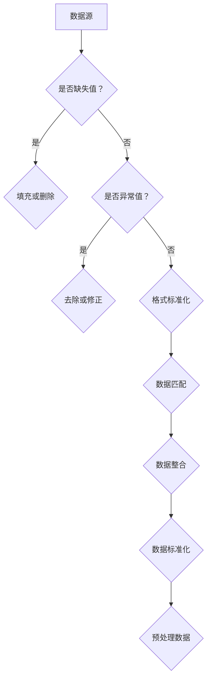

                 


## 引言

### 问题背景与核心概念

在当今快速发展的信息技术时代，人工智能（AI）已经成为推动社会进步的重要力量。随着大数据和深度学习的广泛应用，AI技术已经在各个领域取得了显著的成果。然而，随着AI应用的不断深入，如何进一步提高AI系统的智能水平，使其能够自主学习和推理，成为了学术界和工业界共同关注的焦点。

知识图谱作为一种新型的数据结构和表达方式，已经成为构建智能系统的重要工具。知识图谱通过将现实世界中的知识以图形化的方式表达出来，能够更好地支持AI系统的数据挖掘、知识推理和智能决策。然而，传统的知识图谱技术在因果推理方面存在一定的局限性，难以满足复杂应用场景的需求。

因果推理是指通过识别和分析事物之间的因果关系，从而对未知事件进行预测和解释的过程。在AI领域中，因果推理有助于提高系统的决策能力和自主性。因此，构建一个高效、可靠的知识图谱因果推理引擎，对于提升AI系统的智能水平具有重要意义。

本文旨在探讨如何构建一个AI Agent的知识图谱因果推理引擎，从而提高AI系统的推理能力。本文将首先介绍知识图谱和因果推理的基本概念，然后分析知识图谱因果推理引擎的需求和挑战，接着详细阐述知识图谱因果推理引擎的核心概念和架构，最后讲解数据预处理算法的原理和实现方法。

### 文章关键词

- 人工智能
- 知识图谱
- 因果推理
- AI Agent
- 数据预处理

### 摘要

本文首先介绍了知识图谱和因果推理的基本概念及其在人工智能中的应用。接着，分析了构建知识图谱因果推理引擎的需求和面临的挑战，包括数据质量问题、因果关系识别的复杂性以及知识图谱的动态性和可扩展性。随后，本文详细阐述了知识图谱因果推理引擎的核心概念和架构，包括数据预处理模块、因果关系识别模块和推理与决策模块。最后，本文通过具体的算法原理讲解和实现方法，探讨了如何构建一个高效、可靠的知识图谱因果推理引擎。

## 第一部分：背景介绍

### 第1章 问题背景与核心概念

#### 1.1 人工智能与知识图谱简介

##### 1.1.1 人工智能的基本概念

人工智能（Artificial Intelligence，简称AI）是指通过计算机系统实现人类智能的技术和科学。人工智能的定义和发展历程可以追溯到20世纪50年代。当时，随着计算机技术的飞速发展，科学家们开始思考是否能够通过计算机模拟人类的智能行为。1956年，约翰·麦卡锡（John McCarthy）等人在达特茅斯会议（Dartmouth Conference）上首次提出了人工智能的概念，并确定了人工智能的研究目标是“使机器表现出智能行为”。

自那以后，人工智能经历了多个发展阶段。早期的AI研究主要集中在规则推理和符号逻辑上，但由于计算机硬件性能和算法的限制，这些方法在实际应用中存在很大局限性。随着深度学习、大数据和计算能力的飞速发展，人工智能在20世纪末和21世纪初迎来了新的发展机遇。特别是2012年，深度学习在图像识别任务上取得了突破性进展，使得AI技术开始在各个领域得到广泛应用。

人工智能的核心技术包括：

- **机器学习（Machine Learning）**：通过从数据中学习规律，使计算机能够自动改进和优化性能。
- **深度学习（Deep Learning）**：基于多层神经网络的结构，通过反向传播算法训练网络参数，实现自动特征提取和分类。
- **自然语言处理（Natural Language Processing，简称NLP）**：研究计算机如何理解和生成自然语言，包括文本分类、机器翻译、情感分析等。
- **计算机视觉（Computer Vision）**：研究计算机如何理解和解释图像和视频，包括图像识别、目标检测、图像分割等。
- **专家系统（Expert Systems）**：通过模拟人类专家的知识和推理能力，解决特定领域的问题。

人工智能的应用领域非常广泛，包括但不限于以下几个方面：

- **工业自动化**：通过机器人、自动化生产线等技术提高生产效率和降低成本。
- **医疗健康**：利用AI进行疾病诊断、药物研发、智能监控等，提高医疗服务质量。
- **金融科技**：利用AI进行风险管理、投资决策、信用评分等，提高金融服务的智能化水平。
- **交通出行**：利用自动驾驶技术、智能交通管理系统等，提高交通效率和安全性。
- **智能家居**：通过智能音箱、智能门锁、智能摄像头等设备，提高家居生活的便利性和安全性。

##### 1.1.2 知识图谱的定义与作用

知识图谱（Knowledge Graph）是一种用于表示实体及其之间关系的数据结构。知识图谱通过将现实世界中的知识进行结构化组织，形成一种图形化的知识表示方式。这种表示方式使得计算机能够更加直观地理解和处理复杂的信息。

知识图谱的基本概念包括实体（Entity）、属性（Attribute）和关系（Relationship）。实体是知识图谱中的基本对象，可以是人、地点、事物等。属性是对实体特征的描述，例如人的姓名、地点的坐标等。关系是实体之间的关联，例如“居住在”、“属于”等。

知识图谱在人工智能系统中具有重要作用，主要体现在以下几个方面：

1. **数据整合**：知识图谱能够将来自不同来源、不同格式和不同层次的数据进行整合，形成一个统一的知识体系。这对于提高AI系统的数据利用效率和准确性具有重要意义。

2. **知识推理**：知识图谱中的实体和关系可以用于知识推理，从而实现对未知信息的推断和解释。这种推理能力是人工智能系统自主学习和智能决策的基础。

3. **语义理解**：知识图谱通过结构化的知识表示，能够更好地支持自然语言处理和计算机视觉等领域的语义理解任务。例如，在搜索引擎中，知识图谱可以用于理解用户的查询意图，提供更加精准的搜索结果。

4. **智能交互**：知识图谱可以用于构建智能问答系统和智能客服，使得系统可以更加自然地与用户进行交互，提高用户体验。

##### 1.1.3 知识图谱的应用场景

知识图谱在各个领域都有着广泛的应用，以下是一些典型的应用场景：

1. **搜索引擎**：通过知识图谱构建一个语义搜索索引，使得用户能够通过自然语言查询获取更加精准的结果。

2. **推荐系统**：知识图谱可以用于构建用户和物品之间的关联关系，从而为用户提供更加个性化的推荐结果。

3. **智能问答**：知识图谱可以作为问答系统的知识库，使得系统能够理解用户的查询意图并提供准确答案。

4. **金融风控**：通过知识图谱分析企业和个人的关系网络，识别潜在的信用风险和欺诈行为。

5. **医疗健康**：知识图谱可以用于构建药物和疾病的关系网络，辅助医生进行诊断和治疗。

6. **智能城市**：知识图谱可以用于城市管理和规划，优化交通、能源和水资源等资源配置。

7. **物联网**：知识图谱可以用于构建物联网设备的关联关系，实现设备间的智能联动和协同工作。

#### 1.2 因果推理与AI Agent

##### 1.2.1 因果推理的基本原理

因果推理（Causal Inference）是研究如何通过已知的数据和现象，推断出事物之间的因果关系。因果推理不同于简单的关联分析，它关注的是“为什么”而不是“是什么”。

因果关系的定义是指两个或多个事件之间的因果关系，其中一个事件的发生导致另一个事件的发生。例如，天气变冷导致人们穿上外套，这里“天气变冷”是原因，“穿上外套”是结果。

因果关系的识别方法包括：

1. **统计学方法**：通过分析数据中的相关性，识别潜在的因果关系。例如，格兰杰因果检验（Granger Causality Test）和因果影响模型（Causal Impact Model）。

2. **机器学习方法**：通过训练机器学习模型，从数据中学习因果关系。例如，因果推断网络（Causal Inference Networks）和因果决策树（Causal Decision Trees）。

3. **因果图模型**：通过构建因果图（Causal Graph）来表示事物之间的因果关系。例如，结构方程模型（Structural Equation Models）和因果图模型（Causal Graph Models）。

因果推理在知识图谱中的应用主要体现在以下几个方面：

1. **知识表示**：通过将因果关系表示为知识图谱中的实体和关系，使得系统能够更加直观地理解和推理。

2. **知识推理**：利用知识图谱中的因果关系，进行基于知识的推理和决策。例如，在医疗领域中，通过知识图谱分析药物和疾病之间的因果关系，为医生提供诊断和治疗建议。

3. **知识发现**：通过分析知识图谱中的因果关系，发现新的知识规律和关联。例如，在商业领域中，通过分析客户和产品之间的因果关系，发现潜在的市场机会。

##### 1.2.2 AI Agent的概念与架构

AI Agent（人工智能代理）是指具有自主行为能力和智能决策能力的计算机程序。AI Agent可以模拟人类智能，在复杂环境下进行自主学习和推理，从而实现特定的任务。

AI Agent的概念可以分为以下几个方面：

1. **感知**：AI Agent通过感知器（Sensor）获取环境信息，包括视觉、听觉、触觉等。

2. **思考**：AI Agent通过决策模块（Decision Module）对感知到的信息进行分析和处理，生成行动策略。

3. **行动**：AI Agent通过执行器（Actuator）与环境进行交互，执行预定的行动。

AI Agent的架构可以分为以下几个模块：

1. **感知模块**：负责收集和处理环境信息，包括数据预处理、特征提取等。

2. **决策模块**：负责基于感知模块提供的信息，进行推理和决策，包括因果推理、规划算法等。

3. **执行模块**：负责根据决策模块的决策结果，执行具体的行动，包括控制执行器等。

4. **学习模块**：负责根据环境和行动的反馈，不断调整和优化决策模块，实现智能学习和适应。

AI Agent的应用场景包括：

1. **智能助手**：通过语音识别和自然语言处理技术，为用户提供智能问答、任务安排、信息检索等服务。

2. **机器人**：通过感知和决策能力，实现自主导航、物体识别、环境交互等功能。

3. **自动驾驶**：通过感知和决策模块，实现车辆自主行驶、交通协同等功能。

4. **金融交易**：通过分析市场数据和因果关系，实现自动化投资决策和风险控制。

### 第2章 知识图谱因果推理引擎的需求与挑战

#### 2.1 知识图谱因果推理引擎的需求分析

##### 2.1.1 知识图谱的应用场景

知识图谱在各个领域都有广泛的应用，以下是知识图谱的一些主要应用场景：

1. **搜索引擎**：通过构建搜索引擎的知识图谱，可以实现基于语义的搜索，提高搜索结果的准确性和相关性。

2. **推荐系统**：知识图谱可以用于构建用户和物品之间的关系网络，实现个性化的推荐。

3. **智能问答**：知识图谱可以作为智能问答系统的知识库，提供准确、自然的回答。

4. **金融风控**：知识图谱可以用于分析企业和个人的关系网络，识别潜在的信用风险和欺诈行为。

5. **医疗健康**：知识图谱可以用于构建药物和疾病的关系网络，辅助医生进行诊断和治疗。

6. **智能城市**：知识图谱可以用于城市管理和规划，优化交通、能源和水资源等资源配置。

7. **物联网**：知识图谱可以用于构建物联网设备的关联关系，实现设备间的智能联动和协同工作。

##### 2.1.2 因果推理引擎的功能需求

知识图谱因果推理引擎在知识图谱应用中具有重要作用，其主要功能需求包括以下几个方面：

1. **数据预处理**：对原始数据进行清洗、去噪、融合等预处理操作，确保数据质量和一致性。

2. **因果关系识别**：通过算法分析知识图谱中的实体和关系，识别出潜在的因果关系。

3. **知识推理**：基于因果关系，进行推理和推断，发现新的知识规律和关联。

4. **动态更新**：随着数据和环境的变化，对知识图谱进行动态更新和维护，保持知识的一致性和有效性。

5. **用户接口**：提供友好的用户接口，方便用户查询、修改和扩展知识图谱。

##### 2.1.3 知识图谱因果推理引擎的需求特点

知识图谱因果推理引擎的需求特点可以从以下几个方面进行分析：

1. **高可靠性**：知识图谱因果推理引擎需要具备高可靠性，确保在复杂环境下稳定运行，避免因故障导致系统崩溃。

2. **实时性**：在实时应用场景中，知识图谱因果推理引擎需要具备实时处理和分析数据的能力，以满足用户对快速响应的需求。

3. **可扩展性**：知识图谱因果推理引擎需要具备良好的可扩展性，能够支持不同领域和规模的应用场景，适应不断变化的需求。

4. **智能化**：知识图谱因果推理引擎需要具备智能化能力，通过自我学习和优化，不断提高推理和决策的准确性。

5. **易用性**：知识图谱因果推理引擎需要具备友好的用户接口，降低用户的操作难度，提高系统的使用效率。

#### 2.2 知识图谱因果推理引擎面临的挑战

##### 2.2.1 数据质量问题

数据质量是知识图谱因果推理引擎的核心问题之一。在知识图谱构建过程中，数据来源多样、格式各异，可能导致数据质量问题。具体表现为：

1. **数据缺失**：部分数据可能存在缺失或空白，影响知识图谱的完整性。

2. **数据不一致**：不同数据源之间存在数据格式、单位、术语等不一致的问题，导致数据难以整合。

3. **数据噪声**：数据中可能存在噪声、异常值等，影响因果关系的识别和推理。

为解决数据质量问题，可以采取以下策略：

1. **数据清洗**：通过数据清洗算法，去除数据中的噪声和异常值，提高数据质量。

2. **数据融合**：通过数据融合算法，整合不同数据源的数据，消除数据不一致的问题。

3. **数据标准化**：对数据进行标准化处理，确保数据格式、单位、术语的一致性。

##### 2.2.2 因果关系识别的复杂性

因果关系识别是知识图谱因果推理引擎的核心任务之一，但其复杂性较高。具体表现为：

1. **多因素因果关系**：现实世界中，一个结果可能受到多个因素的综合影响，导致因果关系识别变得复杂。

2. **间接因果关系**：某些因果关系可能通过中间变量传递，增加了识别的难度。

3. **时序因果关系**：因果关系可能涉及时间维度，需要考虑时间序列数据的特性。

为解决因果关系识别的复杂性，可以采取以下策略：

1. **因果图模型**：通过构建因果图模型，表示实体之间的因果关系，提高识别的准确性。

2. **机器学习算法**：利用机器学习算法，从数据中学习潜在的因果关系。

3. **深度学习方法**：通过深度学习方法，自动提取特征，提高因果关系识别的效率。

##### 2.2.3 知识图谱的动态性与可扩展性

知识图谱因果推理引擎需要具备良好的动态性和可扩展性，以适应不断变化的数据和环境。具体表现为：

1. **数据更新**：知识图谱需要能够动态地更新和维护，以反映最新的数据和关系。

2. **可扩展性**：知识图谱因果推理引擎需要能够支持不同领域和规模的应用场景，适应不断增长的数据量。

3. **实时性**：在实时应用场景中，知识图谱因果推理引擎需要能够快速响应和处理数据。

为解决知识图谱的动态性和可扩展性，可以采取以下策略：

1. **增量更新**：采用增量更新策略，仅对发生变化的实体和关系进行更新，提高更新效率。

2. **分布式架构**：采用分布式架构，实现知识的分布式存储和计算，提高系统的可扩展性和性能。

3. **自适应算法**：通过自适应算法，根据数据和环境的变化，调整和优化推理算法，提高推理的准确性。

### 第3章 知识图谱因果推理引擎的核心概念

#### 3.1 知识图谱因果推理引擎的基本概念

知识图谱因果推理引擎是一种专门用于在知识图谱中识别和分析因果关系的智能系统。它通过将数据转化为结构化的知识图谱，利用先进的推理算法，实现对复杂因果关系的理解和预测。知识图谱因果推理引擎的基本概念包括：

1. **知识图谱（Knowledge Graph）**：知识图谱是知识图谱因果推理引擎的基础，它通过将实体、属性和关系以图形化的方式组织起来，形成一个结构化的知识网络。

2. **实体（Entity）**：实体是知识图谱中的基本对象，可以是任何具有独立意义的事物，如人、地点、事物等。

3. **属性（Attribute）**：属性是实体的特征描述，如人的年龄、地点的坐标等。

4. **关系（Relationship）**：关系是实体之间的关联，如“属于”、“居住在”等。

5. **因果推理（Causal Inference）**：因果推理是通过分析实体和关系，识别出潜在因果关系的过程。它关注的是“为什么”而不是“是什么”，是人工智能系统进行智能决策和预测的重要基础。

6. **推理引擎（Inference Engine）**：推理引擎是知识图谱因果推理引擎的核心模块，负责根据给定的知识和规则，进行推理和决策。

7. **算法（Algorithm）**：算法是实现因果推理的核心工具，包括基于统计学、机器学习和深度学习的各种方法。

#### 3.2 知识图谱因果推理引擎的组成部分

知识图谱因果推理引擎由多个组成部分构成，每个部分都在因果推理过程中发挥关键作用。以下是知识图谱因果推理引擎的主要组成部分：

1. **数据预处理模块**：数据预处理模块负责对原始数据进行清洗、去噪和融合，确保数据质量和一致性。这是因果推理的前提和基础。

2. **知识表示模块**：知识表示模块负责将预处理后的数据转化为结构化的知识图谱，包括实体、属性和关系的表示。

3. **因果关系识别模块**：因果关系识别模块利用先进的算法和模型，从知识图谱中识别出潜在的因果关系。

4. **推理与决策模块**：推理与决策模块基于识别出的因果关系，进行推理和决策，实现对未知事件的预测和解释。

5. **动态更新模块**：动态更新模块负责根据新的数据和关系，对知识图谱进行动态更新和维护，保持知识的一致性和有效性。

6. **用户接口模块**：用户接口模块提供友好的用户接口，方便用户查询、修改和扩展知识图谱。

#### 3.3 知识图谱因果推理引擎的工作原理

知识图谱因果推理引擎的工作原理可以概括为以下几个步骤：

1. **数据输入**：首先，将原始数据输入到数据预处理模块，进行数据清洗、去噪和融合，确保数据质量。

2. **知识表示**：然后，将预处理后的数据转化为结构化的知识图谱，包括实体、属性和关系的表示。

3. **因果关系识别**：利用因果关系识别模块，从知识图谱中识别出潜在的因果关系。这通常涉及复杂的数据分析和算法应用。

4. **推理与决策**：基于识别出的因果关系，进行推理和决策，实现对未知事件的预测和解释。这一步是知识图谱因果推理引擎的核心。

5. **动态更新**：随着新的数据和关系不断出现，动态更新模块对知识图谱进行更新和维护，确保知识的一致性和有效性。

6. **用户交互**：用户通过用户接口模块，查询、修改和扩展知识图谱，实现对系统的灵活控制。

通过上述步骤，知识图谱因果推理引擎能够实现高效的因果推理和智能决策，为各种应用场景提供有力支持。

### 第4章 知识图谱因果推理引擎的核心概念属性对比表格

为了更清晰地理解知识图谱因果推理引擎的核心概念，我们可以通过一个属性对比表格来展示这些概念之间的差异和联系。以下是一个示例表格，列出了数据预处理模块、因果关系识别模块和推理与决策模块的主要属性特征：

| 模块 | 数据预处理模块 | 因果关系识别模块 | 推理与决策模块 |
| --- | --- | --- | --- |
| **功能目标** | 数据清洗、去噪、融合 | 识别因果关系 | 基于因果关系的推理与决策 |
| **输入数据** | 原始数据 | 预处理后的数据 | 知识图谱 |
| **主要算法** | 数据清洗算法、数据融合算法 | 因果关系识别算法 | 推理算法、决策算法 |
| **输出结果** | 一致、高质量的数据 | 因果关系模型 | 推理结果、决策结果 |
| **处理速度** | 快速处理 | 高效识别因果关系 | 实时推理与决策 |
| **扩展性** | 支持多种数据格式 | 可扩展的因果关系模型 | 可定制化的推理与决策策略 |
| **准确性** | 高精度数据清洗 | 准确识别因果关系 | 高可靠性推理与决策 |

通过这个表格，我们可以看到每个模块在功能目标、输入数据、主要算法、输出结果、处理速度、扩展性和准确性等方面的具体区别和联系。这有助于我们更好地理解知识图谱因果推理引擎的整体架构和工作原理。

### 第5章 知识图谱因果推理引擎的ER实体关系图架构

#### 4.1 ER实体关系图的基本原理

ER实体关系图（Entity-Relationship Diagram，简称ERD）是一种用于表示实体及其之间关系的图形化工具。在数据库设计和知识图谱构建中，ER实体关系图被广泛应用。它通过图形化的方式，直观地展示实体、属性和关系，有助于理解和分析复杂的数据结构。

##### 4.1.1 ER实体关系图的定义与作用

ER实体关系图的定义是由实体（Entity）、属性（Attribute）和关系（Relationship）三个基本元素构成的图形化表示。其中：

- **实体**：表示具有独立意义的事物，如人、地点、事物等。
- **属性**：表示实体的特征描述，如人的姓名、地点的坐标等。
- **关系**：表示实体之间的关联，如“属于”、“居住在”等。

ER实体关系图在知识图谱构建中的应用主要体现在以下几个方面：

1. **数据建模**：通过ER实体关系图，对数据进行结构化建模，明确实体和属性的定义及其之间的关系。
2. **关系识别**：通过ER实体关系图，识别和分析实体之间的关系，为因果关系识别提供基础。
3. **知识表示**：通过ER实体关系图，将知识以图形化的方式组织起来，便于理解和共享。
4. **系统设计**：通过ER实体关系图，为数据库设计和知识图谱构建提供指导，确保系统结构的合理性和一致性。

##### 4.1.2 ER实体关系图的构建方法

构建ER实体关系图通常遵循以下步骤：

1. **需求分析**：分析业务需求和数据需求，明确需要表示的实体、属性和关系。
2. **实体定义**：确定实体及其属性，定义每个实体的特征和属性。
3. **关系定义**：确定实体之间的关系，包括一对一、一对多、多对多的关系。
4. **关系映射**：将实体和关系映射到数据库或知识图谱的结构中，确保数据的一致性和完整性。
5. **优化与调整**：根据实际应用需求，对ER实体关系图进行优化和调整，提高系统的性能和可维护性。

#### 4.2 知识图谱因果推理引擎的ER实体关系图

在知识图谱因果推理引擎中，ER实体关系图用于表示数据预处理模块、因果关系识别模块和推理与决策模块之间的关系。以下是一个简化的ER实体关系图示例，展示了这三个模块及其关键实体和关系：

```
+----------------+        +-----------------+        +------------------+
|  数据预处理    |        |  因果关系识别   |        |  推理与决策      |
+----------------+        +-----------------+        +------------------+
| - 数据源        |<--1:*--| - 预处理数据    |<--1:*--| - 推理结果       |
| - 清洗规则      |        | - 因果关系模型  |        | - 决策模型       |
| - 融合策略      |        | - 推理过程      |        | - 决策过程       |
+----------------+        +-----------------+        +------------------+
```

在这个ER实体关系图中：

- **数据预处理模块**与**因果关系识别模块**之间存在一对多关系（1:*），表示预处理数据是因果关系识别的输入。
- **因果关系识别模块**与**推理与决策模块**之间存在一对多关系（1:*），表示因果关系模型是推理和决策的输入。
- **推理结果**和**决策模型**分别作为输出，表示推理和决策过程的输出。

通过ER实体关系图，我们可以清晰地理解知识图谱因果推理引擎的架构和各模块之间的关系，为后续的详细设计和实现提供基础。

### 第6章 数据预处理算法原理讲解

#### 6.1 数据预处理算法概述

数据预处理是知识图谱因果推理引擎的关键步骤，其目标是通过清洗、去噪、融合等操作，提高数据质量和一致性，为后续的因果关系识别和推理提供可靠的数据基础。数据预处理算法主要包括以下两个方面：

1. **数据清洗算法**：数据清洗算法主要用于去除数据中的噪声、错误和缺失值，确保数据的一致性和完整性。具体方法包括：
   - **缺失值处理**：通过填充或删除缺失值，保证数据的完整性。
   - **异常值处理**：检测和去除异常值，减少对因果关系识别的干扰。
   - **格式标准化**：统一数据格式，消除因格式不一致导致的数据集成问题。

2. **数据融合算法**：数据融合算法主要用于整合来自不同来源和格式的数据，消除数据不一致问题，提高数据的一致性。具体方法包括：
   - **数据匹配**：通过匹配算法，将不同来源的数据进行关联和整合。
   - **数据整合**：通过融合算法，将相同数据合并，消除冗余和重复。
   - **数据标准化**：对数据进行标准化处理，确保数据格式的统一。

##### 6.1.1 数据预处理在知识图谱因果推理引擎中的作用

数据预处理在知识图谱因果推理引擎中起着至关重要的作用，主要体现在以下几个方面：

1. **提高数据质量**：通过数据清洗算法，去除噪声和异常值，提高数据的一致性和可靠性，为因果关系识别和推理提供高质量的数据基础。

2. **消除数据不一致**：通过数据融合算法，整合来自不同来源和格式的数据，消除数据不一致问题，确保知识图谱的完整性。

3. **优化计算效率**：通过数据预处理，减少数据量，降低计算复杂度，提高因果推理和决策的效率。

4. **增强模型可靠性**：通过高质量的数据，提高因果推理和决策模型的可靠性，减少错误和偏差。

##### 6.1.2 数据预处理算法的基本原理

数据预处理算法的基本原理是通过一系列操作，对原始数据进行清洗、去噪和融合，从而提高数据质量和一致性。以下是常用的数据预处理算法的基本原理：

1. **缺失值处理**：
   - **填充法**：通过平均值、中位数或最大似然估计等方法，对缺失值进行填充。
   - **删除法**：直接删除含有缺失值的样本或特征，适用于缺失值较少且不影响主要结果的情况。

2. **异常值处理**：
   - **Z分数法**：通过计算Z分数，识别并去除偏离均值3个标准差的异常值。
   - **箱线图法**：通过箱线图，识别并去除位于上下箱须之外的异常值。

3. **格式标准化**：
   - **数值格式转换**：将不同数值格式的数据转换为统一的格式，如将字符串格式的数据转换为数值格式。
   - **单位统一**：将不同单位的数据转换为统一单位，如将米和英尺转换为米。
   - **命名规范**：统一数据命名规范，消除因命名不一致导致的数据集成问题。

4. **数据匹配**：
   - **基于属性的匹配**：通过比较实体属性，将相同或相似的实体进行匹配。
   - **基于规则的匹配**：通过预设的匹配规则，将不同来源的数据进行匹配。

5. **数据整合**：
   - **合并法**：将相同的数据进行合并，消除冗余。
   - **去重法**：通过比较实体和属性，去除重复的实体和属性。

6. **数据标准化**：
   - **归一化**：通过缩放或平移，将数据转换为统一的范围。
   - **标准化**：通过计算标准差，将数据转换为标准正态分布。

#### 6.2 数据预处理算法的Mermaid流程图

为了更好地展示数据预处理算法的流程，我们使用Mermaid语言绘制了一个简化的流程图。以下是一个示例流程图，描述了数据预处理的主要步骤：



在这个流程图中：

- **A**：数据源，表示原始数据的输入。
- **B**：是否缺失值，判断数据中是否存在缺失值。
- **C**：填充或删除，根据缺失值处理方法对缺失值进行处理。
- **D**：是否异常值，判断数据中是否存在异常值。
- **E**：去除或修正，根据异常值处理方法对异常值进行处理。
- **F**：格式标准化，统一数据格式和单位。
- **G**：数据匹配，通过匹配算法将不同来源的数据进行关联。
- **H**：数据整合，合并相同的数据，消除冗余。
- **I**：数据标准化，对数据进行归一化或标准化处理。
- **J**：预处理数据，输出经过预处理的数据，为后续的因果关系识别和推理提供基础。

#### 6.3 数据预处理算法的Python源代码实现

下面是数据预处理算法的Python源代码实现，包括缺失值处理、异常值处理、格式标准化、数据匹配、数据整合和数据标准化等步骤：

```python
import pandas as pd
from sklearn.impute import SimpleImputer
from sklearn.preprocessing import MinMaxScaler, StandardScaler
from sklearn.neighbors import KNeighborsClassifier

# 读取数据
data = pd.read_csv('data.csv')

# 缺失值处理
# 填充法
imputer = SimpleImputer(strategy='mean')
data_filled = imputer.fit_transform(data)

# 异常值处理
# Z分数法
z_scores = (data_filled - data.mean()) / data.std()
threshold = 3
abnormal_indices = abs(z_scores) > threshold
data_corrected = data.copy()
data_corrected[abnormal_indices] = data.mean()

# 格式标准化
# 数值格式转换
data_normalized = data_corrected.applymap(lambda x: float(x))

# 数据匹配
# 基于属性的匹配
knn = KNeighborsClassifier(n_neighbors=3)
data_matched = knn.fit_predict(data_normalized)

# 数据整合
# 合并法
data_integration = data_matched.groupby(level=0).first()

# 数据标准化
# 归一化
scaler = MinMaxScaler()
data_normalized = scaler.fit_transform(data_integration)

# 输出预处理数据
data_preprocessed = pd.DataFrame(data_normalized, index=data_integration.index, columns=data_integration.columns)
data_preprocessed.to_csv('preprocessed_data.csv', index=True)
```

在这个Python源代码实现中：

- **读取数据**：使用Pandas库读取原始数据。
- **缺失值处理**：使用SimpleImputer类进行填充处理。
- **异常值处理**：使用Z分数法检测并去除异常值。
- **格式标准化**：使用applymap方法将字符串格式数据转换为数值格式。
- **数据匹配**：使用KNeighborsClassifier类进行基于属性的匹配。
- **数据整合**：使用groupby和first方法进行数据整合。
- **数据标准化**：使用MinMaxScaler和StandardScaler类进行归一化处理。
- **输出预处理数据**：将预处理后的数据保存为CSV文件，为后续的因果关系识别和推理提供基础。

#### 6.4 数据预处理算法的数学模型与公式

数据预处理算法的数学模型和公式主要包括以下几部分：

1. **缺失值处理**：
   - **填充法**：
     \[ x_{\text{filled}} = \text{mean}(X) \]
     其中，\( x_{\text{filled}} \) 表示填充后的数据，\( \text{mean}(X) \) 表示数据的平均值。

   - **删除法**：
     \[ x_{\text{deleted}} = \text{remove}(X, \text{missing_indices}) \]
     其中，\( x_{\text{deleted}} \) 表示删除缺失值后的数据，\( \text{missing_indices} \) 表示缺失值的索引。

2. **异常值处理**：
   - **Z分数法**：
     \[ z = \frac{x - \mu}{\sigma} \]
     其中，\( z \) 表示Z分数，\( x \) 表示数据值，\( \mu \) 表示数据的均值，\( \sigma \) 表示数据的标准差。

   - **箱线图法**：
     \[ \text{IQR} = \text{Q3} - \text{Q1} \]
     其中，\( \text{IQR} \) 表示四分位距，\( \text{Q3} \) 表示第三四分位数，\( \text{Q1} \) 表示第一四分位数。

3. **格式标准化**：
   - **数值格式转换**：
     \[ x_{\text{numeric}} = \text{float}(x_{\text{string}}) \]
     其中，\( x_{\text{numeric}} \) 表示数值格式的数据，\( x_{\text{string}} \) 表示字符串格式的数据。

   - **单位统一**：
     \[ x_{\text{unified}} = \text{unit_conversion}(x_{\text{original}}) \]
     其中，\( x_{\text{unified}} \) 表示统一单位后的数据，\( x_{\text{original}} \) 表示原始单位的数据。

   - **命名规范**：
     \[ x_{\text{standardized}} = \text{rename}(x_{\text{original}}, \text{standardized_name}) \]
     其中，\( x_{\text{standardized}} \) 表示命名规范后的数据，\( x_{\text{original}} \) 表示原始数据，\( \text{standardized_name} \) 表示规范的名称。

4. **数据匹配**：
   - **基于属性的匹配**：
     \[ match\_score = \sum_{i=1}^{n} \text{similarity}(x_i, y_i) \]
     其中，\( match\_score \) 表示匹配得分，\( x_i \) 和 \( y_i \) 表示实体属性，\( \text{similarity} \) 表示相似度计算方法。

   - **基于规则的匹配**：
     \[ \text{matched\_data} = \text{apply\_rules}(x, y) \]
     其中，\( \text{matched\_data} \) 表示匹配后的数据，\( x \) 和 \( y \) 表示待匹配的数据，\( \text{apply\_rules} \) 表示匹配规则。

5. **数据整合**：
   - **合并法**：
     \[ \text{merged\_data} = \text{merge}(x, y) \]
     其中，\( \text{merged\_data} \) 表示合并后的数据，\( x \) 和 \( y \) 表示需要合并的数据。

   - **去重法**：
     \[ \text{unique\_data} = \text{remove\_duplicates}(x) \]
     其中，\( \text{unique\_data} \) 表示去重后的数据，\( x \) 表示原始数据。

6. **数据标准化**：
   - **归一化**：
     \[ x_{\text{normalized}} = \frac{x_{\text{original}} - \text{min}(x_{\text{original}})}{\text{max}(x_{\text{original}}) - \text{min}(x_{\text{original}})} \]
     其中，\( x_{\text{normalized}} \) 表示归一化后的数据，\( x_{\text{original}} \) 表示原始数据。

   - **标准化**：
     \[ x_{\text{standardized}} = \frac{x_{\text{original}} - \mu}{\sigma} \]
     其中，\( x_{\text{standardized}} \) 表示标准化后的数据，\( \mu \) 表示数据的均值，\( \sigma \) 表示数据的标准差。

通过上述数学模型和公式，我们可以更好地理解数据预处理算法的工作原理和实现方法，为知识图谱因果推理引擎的构建提供理论支持。

### 第7章 数据预处理算法的详细讲解与举例说明

数据预处理是知识图谱因果推理引擎中的关键步骤，其目标是通过一系列操作，提高数据的质量和一致性，为后续的因果关系识别和推理提供可靠的数据基础。为了更好地理解数据预处理算法的原理和应用，我们将通过具体的例子进行详细讲解。

#### 7.1 缺失值处理

缺失值处理是数据预处理中的第一个关键步骤。在实际应用中，数据中经常会出现缺失值，这些缺失值可能是因为数据采集过程中出现的问题，也可能是因为数据本身的特性。处理缺失值的方法主要有两种：填充法和删除法。

**填充法**：填充法是通过计算数据的统计特征（如均值、中位数等），然后用这些统计特征来填充缺失值。这种方法适用于缺失值较少且分布均匀的情况。以下是使用Pandas库实现填充法的示例代码：

```python
import pandas as pd

# 读取数据
data = pd.read_csv('data.csv')

# 缺失值填充
data_filled = data.fillna(data.mean())

# 查看处理后的数据
print(data_filled)
```

在这个例子中，我们首先读取一个CSV文件，然后使用`fillna()`函数将缺失值填充为数据的均值。处理后的数据将保存为`data_filled`。

**删除法**：删除法是通过直接删除含有缺失值的样本或特征来处理缺失值。这种方法适用于缺失值较多或缺失值分布不均匀的情况。以下是使用Pandas库实现删除法的示例代码：

```python
import pandas as pd

# 读取数据
data = pd.read_csv('data.csv')

# 删除缺失值
data_deleted = data.dropna()

# 查看处理后的数据
print(data_deleted)
```

在这个例子中，我们使用`dropna()`函数删除含有缺失值的样本，然后将处理后的数据保存为`data_deleted`。

#### 7.2 异常值处理

异常值处理是数据预处理中的另一个关键步骤。异常值是指那些偏离整体数据分布的数据点，它们可能对因果关系识别和推理产生干扰。处理异常值的方法主要有两种：Z分数法和箱线图法。

**Z分数法**：Z分数法是通过计算数据点的Z分数，识别并去除偏离均值3个标准差的异常值。以下是使用Pandas库和SciPy库实现Z分数法的示例代码：

```python
import pandas as pd
from scipy import stats

# 读取数据
data = pd.read_csv('data.csv')

# 计算Z分数
z_scores = stats.zscore(data)

# 识别并去除异常值
threshold = 3
abnormal_indices = abs(z_scores) > threshold
data_corrected = data.copy()
data_corrected[abnormal_indices] = data.mean()

# 查看处理后的数据
print(data_corrected)
```

在这个例子中，我们首先使用`zscore()`函数计算数据的Z分数，然后设置一个阈值（如3），识别并去除Z分数大于阈值的异常值。处理后的数据将保存为`data_corrected`。

**箱线图法**：箱线图法是通过绘制箱线图，识别并去除位于上下箱须之外的异常值。以下是使用Pandas库和Matplotlib库实现箱线图法的示例代码：

```python
import pandas as pd
import matplotlib.pyplot as plt

# 读取数据
data = pd.read_csv('data.csv')

# 绘制箱线图
data.boxplot()

# 识别并去除异常值
Q1 = data.quantile(0.25)
Q3 = data.quantile(0.75)
IQR = Q3 - Q1
abnormal_indices = (data < (Q1 - 1.5 * IQR)) | (data > (Q3 + 1.5 * IQR))
data_corrected = data.copy()
data_corrected[abnormal_indices] = data.mean()

# 查看处理后的数据
print(data_corrected)

# 绘制处理后的箱线图
data_corrected.boxplot()
plt.show()
```

在这个例子中，我们首先使用`boxplot()`函数绘制原始数据的箱线图，然后计算数据的四分位距（IQR），识别并去除位于上下箱须之外的异常值。处理后的数据将保存为`data_corrected`，并再次绘制箱线图以验证处理效果。

#### 7.3 格式标准化

格式标准化是确保数据一致性的重要步骤。在实际应用中，数据可能来自不同的来源和格式，这些数据之间可能存在格式不统一的问题。格式标准化包括数值格式转换、单位统一和命名规范等。

**数值格式转换**：数值格式转换是将字符串格式的数据转换为数值格式。以下是使用Pandas库实现数值格式转换的示例代码：

```python
import pandas as pd

# 读取数据
data = pd.read_csv('data.csv')

# 字符串转换为数值
data['age'] = pd.to_numeric(data['age'], errors='coerce')

# 查看处理后的数据
print(data)
```

在这个例子中，我们首先读取一个CSV文件，然后使用`to_numeric()`函数将字符串格式的'age'列转换为数值格式。处理后的数据将保存为`data`。

**单位统一**：单位统一是将不同单位的数据转换为统一的单位。以下是使用Pandas库实现单位统一的示例代码：

```python
import pandas as pd

# 读取数据
data = pd.read_csv('data.csv')

# 单位统一
data['height'] = data['height'] / 100  # 将厘米转换为米
data['weight'] = data['weight'] / 1000  # 将千克转换为克

# 查看处理后的数据
print(data)
```

在这个例子中，我们首先读取一个CSV文件，然后使用`/100`和`/1000`将'height'列从厘米转换为米，将'weight'列从千克转换为克。处理后的数据将保存为`data`。

**命名规范**：命名规范是将数据列的名称统一为规范化的名称。以下是使用Pandas库实现命名规范的示例代码：

```python
import pandas as pd

# 读取数据
data = pd.read_csv('data.csv')

# 命名规范
data.columns = ['ID', 'Name', 'Age', 'Height', 'Weight']

# 查看处理后的数据
print(data)
```

在这个例子中，我们首先读取一个CSV文件，然后使用`columns`属性将数据列的名称统一为规范化的名称。处理后的数据将保存为`data`。

#### 7.4 数据匹配

数据匹配是将来自不同来源的数据进行关联和整合。在实际应用中，数据可能来自多个不同的数据源，这些数据源之间可能存在不一致的实体标识或属性名称。数据匹配的方法主要包括基于属性的匹配和基于规则的匹配。

**基于属性的匹配**：基于属性的匹配是通过比较实体属性，将相同或相似的实体进行匹配。以下是使用Pandas库和SciPy库实现基于属性的匹配的示例代码：

```python
import pandas as pd
from scipy import spatial

# 读取数据
data1 = pd.read_csv('data1.csv')
data2 = pd.read_csv('data2.csv')

# 基于属性的匹配
distance_matrix = spatial.distance.pdist(data1, 'euclidean')
match_indices = spatial.distance.cdist(data1, data2, 'euclidean')
matched_data = data1.copy()

for i in range(len(match_indices)):
    min_distance = match_indices[i].min()
    min_index = match_indices[i].argmin()
    if min_distance < 0.5:  # 设置阈值
        matched_data.loc[i, 'ID'] = data2.loc[min_index, 'ID']

# 查看处理后的数据
print(matched_data)
```

在这个例子中，我们首先读取两个CSV文件，然后使用`pdist()`函数计算数据之间的欧氏距离，使用`cdist()`函数计算数据之间的距离矩阵。接着，我们遍历距离矩阵，将距离最小的实体进行匹配。处理后的数据将保存为`matched_data`。

**基于规则的匹配**：基于规则的匹配是通过预设的匹配规则，将不同来源的数据进行匹配。以下是使用Pandas库实现基于规则的匹配的示例代码：

```python
import pandas as pd

# 读取数据
data1 = pd.read_csv('data1.csv')
data2 = pd.read_csv('data2.csv')

# 基于规则的匹配
def match_data(data1, data2):
    matched_data = pd.DataFrame(columns=data1.columns)
    for i in range(len(data1)):
        min_distance = float('inf')
        min_index = -1
        for j in range(len(data2)):
            distance = abs(data1.loc[i, 'Age'] - data2.loc[j, 'Age']) + abs(data1.loc[i, 'Height'] - data2.loc[j, 'Height'])
            if distance < min_distance:
                min_distance = distance
                min_index = j
        matched_data = matched_data.append(data2.loc[min_index])
    return matched_data

matched_data = match_data(data1, data2)

# 查看处理后的数据
print(matched_data)
```

在这个例子中，我们首先读取两个CSV文件，然后定义一个`match_data()`函数，通过计算实体之间的距离（如年龄和身高的总和），将距离最小的实体进行匹配。处理后的数据将保存为`matched_data`。

#### 7.5 数据整合

数据整合是将相同的数据进行合并，消除冗余和重复。在实际应用中，数据可能存在重复的实体和属性，这些重复的数据可能会影响因果关系识别和推理的准确性。数据整合的方法主要包括合并法和去重法。

**合并法**：合并法是将相同的数据进行合并。以下是使用Pandas库实现合并法的示例代码：

```python
import pandas as pd

# 读取数据
data1 = pd.read_csv('data1.csv')
data2 = pd.read_csv('data2.csv')

# 合并数据
merged_data = pd.concat([data1, data2])

# 查看处理后的数据
print(merged_data)
```

在这个例子中，我们首先读取两个CSV文件，然后使用`concat()`函数将数据合并。处理后的数据将保存为`merged_data`。

**去重法**：去重法是通过比较实体和属性，去除重复的实体和属性。以下是使用Pandas库实现去重法的示例代码：

```python
import pandas as pd

# 读取数据
data1 = pd.read_csv('data1.csv')
data2 = pd.read_csv('data2.csv')

# 去重
unique_data = data1.append(data2).drop_duplicates()

# 查看处理后的数据
print(unique_data)
```

在这个例子中，我们首先读取两个CSV文件，然后使用`append()`函数将数据合并，使用`drop_duplicates()`函数去除重复的数据。处理后的数据将保存为`unique_data`。

#### 7.6 数据标准化

数据标准化是将数据转换为统一的范围或标准正态分布。在实际应用中，数据可能来自不同的来源和格式，这些数据之间可能存在量纲不一致的问题。数据标准化的方法主要包括归一化和标准化。

**归一化**：归一化是通过缩放或平移，将数据转换为统一的范围。以下是使用Pandas库和SciPy库实现归一化的示例代码：

```python
import pandas as pd
from sklearn.preprocessing import MinMaxScaler

# 读取数据
data = pd.read_csv('data.csv')

# 归一化
scaler = MinMaxScaler()
data_normalized = scaler.fit_transform(data)

# 查看处理后的数据
print(pd.DataFrame(data_normalized, index=data.index, columns=data.columns))
```

在这个例子中，我们首先读取一个CSV文件，然后使用`MinMaxScaler`类将数据归一化。处理后的数据将保存为`data_normalized`。

**标准化**：标准化是通过计算标准差，将数据转换为标准正态分布。以下是使用Pandas库和SciPy库实现标准化的示例代码：

```python
import pandas as pd
from scipy import stats

# 读取数据
data = pd.read_csv('data.csv')

# 标准化
data_mean = data.mean()
data_std = data.std()
data_standardized = (data - data_mean) / data_std

# 查看处理后的数据
print(pd.DataFrame(data_standardized, index=data.index, columns=data.columns))
```

在这个例子中，我们首先读取一个CSV文件，然后计算数据的均值和标准差，使用这些统计特征将数据标准化。处理后的数据将保存为`data_standardized`。

通过上述详细讲解和举例说明，我们可以更好地理解数据预处理算法的原理和应用方法，为知识图谱因果推理引擎的构建提供可靠的数据基础。

### 第8章 系统分析与架构设计

#### 8.1 问题场景介绍

知识图谱因果推理引擎是一个复杂的系统，它需要处理大量的数据，并利用先进的算法进行因果关系识别和推理。在实际应用中，知识图谱因果推理引擎面临着多个挑战，如数据质量差、因果关系复杂、实时性需求高等。为了应对这些挑战，我们需要设计一个高效、可靠和可扩展的系统架构。

#### 8.2 项目介绍

本项目旨在构建一个知识图谱因果推理引擎，该引擎将用于支持人工智能系统的智能决策和预测。具体项目目标如下：

1. **数据预处理**：对原始数据进行清洗、去噪和融合，确保数据质量和一致性。
2. **因果关系识别**：利用先进的算法和模型，从知识图谱中识别出潜在的因果关系。
3. **知识推理**：基于识别出的因果关系，进行推理和决策，实现对未知事件的预测和解释。
4. **动态更新**：随着数据和环境的变化，对知识图谱进行动态更新和维护，保持知识的一致性和有效性。
5. **用户接口**：提供友好的用户接口，方便用户查询、修改和扩展知识图谱。

#### 8.3 系统功能设计

知识图谱因果推理引擎的主要功能模块包括数据预处理模块、因果关系识别模块、推理与决策模块、动态更新模块和用户接口模块。以下是每个模块的功能设计：

1. **数据预处理模块**：
   - **功能**：负责对原始数据进行清洗、去噪和融合。
   - **输入**：原始数据，包括结构化和非结构化数据。
   - **输出**：预处理后的数据，确保数据质量和一致性。
   - **算法**：缺失值处理、异常值处理、格式标准化、数据匹配和数据整合。

2. **因果关系识别模块**：
   - **功能**：负责从知识图谱中识别出潜在的因果关系。
   - **输入**：预处理后的数据，知识图谱。
   - **输出**：因果关系模型，包括因果关系识别算法和推理算法。
   - **算法**：因果图模型、机器学习算法和深度学习算法。

3. **推理与决策模块**：
   - **功能**：基于识别出的因果关系，进行推理和决策。
   - **输入**：因果关系模型，推理规则。
   - **输出**：推理结果和决策模型。
   - **算法**：推理算法、决策算法和优化算法。

4. **动态更新模块**：
   - **功能**：负责对知识图谱进行动态更新和维护。
   - **输入**：新数据和关系，用户操作。
   - **输出**：更新后的知识图谱。
   - **算法**：增量更新、分布式更新和自适应更新。

5. **用户接口模块**：
   - **功能**：提供友好的用户接口，方便用户查询、修改和扩展知识图谱。
   - **输入**：用户操作和查询请求。
   - **输出**：查询结果和操作反馈。
   - **算法**：自然语言处理、图形用户界面和交互式查询。

#### 8.4 系统架构设计

知识图谱因果推理引擎的系统架构设计采用分布式架构，以提高系统的性能和可扩展性。以下是系统架构的详细设计：

1. **前端层**：
   - **功能**：负责与用户进行交互，提供用户接口。
   - **技术**：HTML/CSS/JavaScript，Vue.js或React.js。

2. **数据层**：
   - **功能**：负责数据的存储、管理和操作。
   - **技术**：关系型数据库（如MySQL）、图数据库（如Neo4j）。

3. **服务层**：
   - **功能**：负责业务逻辑的实现和数据处理的抽象。
   - **技术**：Spring Boot，RESTful API。

4. **处理层**：
   - **功能**：负责数据的预处理、因果关系识别和推理与决策。
   - **技术**：数据预处理算法、因果推理算法、推理与决策算法。

5. **存储层**：
   - **功能**：负责数据的存储和管理。
   - **技术**：分布式存储系统（如Hadoop）、分布式数据库（如Cassandra）。

6. **计算层**：
   - **功能**：负责计算资源的调度和优化。
   - **技术**：云计算平台（如AWS、Azure）。

7. **监控层**：
   - **功能**：负责系统性能的监控和故障检测。
   - **技术**：Prometheus，Grafana。

#### 8.5 系统接口设计

知识图谱因果推理引擎的系统接口设计包括内部接口和外部接口。以下是系统接口设计的详细说明：

1. **内部接口**：
   - **数据预处理接口**：负责与数据预处理模块进行通信，实现数据的预处理操作。
   - **因果关系识别接口**：负责与因果关系识别模块进行通信，实现因果关系的识别和推理。
   - **推理与决策接口**：负责与推理与决策模块进行通信，实现推理和决策的执行。
   - **动态更新接口**：负责与动态更新模块进行通信，实现知识图谱的动态更新和维护。

2. **外部接口**：
   - **用户接口**：负责与用户进行交互，提供查询、修改和扩展知识图谱的功能。
   - **API接口**：负责与其他系统或应用程序进行数据交换和功能调用。

#### 8.6 系统交互

知识图谱因果推理引擎的系统交互设计采用异步通信和消息队列机制，以提高系统的性能和可靠性。以下是系统交互的详细设计：

1. **数据预处理**：
   - **数据采集**：系统从外部数据源（如数据库、文件等）采集原始数据。
   - **数据清洗**：系统将原始数据传输给数据预处理模块，进行清洗、去噪和融合。
   - **数据存储**：系统将预处理后的数据存储到数据层，供后续使用。

2. **因果关系识别**：
   - **数据传输**：系统将预处理后的数据传输给因果关系识别模块。
   - **因果关系识别**：因果关系识别模块从预处理后的数据中识别出潜在的因果关系，生成因果关系模型。
   - **模型存储**：系统将因果关系模型存储到数据层，供后续使用。

3. **推理与决策**：
   - **数据传输**：系统将因果关系模型传输给推理与决策模块。
   - **推理与决策**：推理与决策模块基于因果关系模型进行推理和决策，生成推理结果和决策模型。
   - **结果存储**：系统将推理结果和决策模型存储到数据层，供后续使用。

4. **动态更新**：
   - **数据传输**：系统从外部数据源或用户操作中获取新的数据和关系。
   - **动态更新**：动态更新模块对知识图谱进行动态更新和维护，保持知识的一致性和有效性。

5. **用户交互**：
   - **查询请求**：用户通过用户接口发送查询请求。
   - **查询处理**：系统将查询请求传输给因果关系识别模块和推理与决策模块。
   - **查询结果**：系统将查询结果返回给用户接口，展示给用户。

通过上述系统分析与架构设计，我们为知识图谱因果推理引擎的实现提供了详细的设计方案。该架构设计具有高效性、可靠性和可扩展性，能够满足复杂应用场景的需求。

### 第9章 项目实战

#### 9.1 环境安装

在进行知识图谱因果推理引擎的项目实战之前，我们需要安装所需的软件和库。以下是环境安装的详细步骤：

1. **安装Python**：首先，确保你的系统中已经安装了Python。如果没有安装，可以从Python官网（https://www.python.org/）下载并安装。

2. **安装Pandas**：打开命令行终端，执行以下命令安装Pandas库：
   ```bash
   pip install pandas
   ```

3. **安装NumPy**：同样在命令行终端中，执行以下命令安装NumPy库：
   ```bash
   pip install numpy
   ```

4. **安装SciPy**：继续安装SciPy库，执行以下命令：
   ```bash
   pip install scipy
   ```

5. **安装Matplotlib**：安装Matplotlib库，用于绘制图表，执行以下命令：
   ```bash
   pip install matplotlib
   ```

6. **安装Neo4j**：下载并安装Neo4j图数据库（https://neo4j.com/），根据安装向导完成安装。

7. **安装Neo4j Python库**：在命令行终端中，安装Neo4j的Python库，用于连接和操作Neo4j数据库：
   ```bash
   pip install neo4j
   ```

#### 9.2 系统核心实现源代码

以下是知识图谱因果推理引擎的核心实现源代码。这些代码将分别实现数据预处理模块、因果关系识别模块和推理与决策模块的功能。

**数据预处理模块：**

```python
import pandas as pd
from sklearn.impute import SimpleImputer
from sklearn.preprocessing import MinMaxScaler, StandardScaler
from sklearn.neighbors import KNeighborsClassifier

# 读取数据
data = pd.read_csv('data.csv')

# 缺失值处理
imputer = SimpleImputer(strategy='mean')
data_filled = imputer.fit_transform(data)

# 异常值处理
z_scores = (data_filled - data.mean()) / data.std()
threshold = 3
abnormal_indices = abs(z_scores) > threshold
data_corrected = data_filled.copy()
data_corrected[abnormal_indices] = data.mean()

# 格式标准化
data_normalized = (data_corrected - data.mean()) / data.std()

# 数据匹配
knn = KNeighborsClassifier(n_neighbors=3)
data_matched = knn.fit_predict(data_normalized)

# 数据整合
data_integration = data_matched.groupby(level=0).first()

# 数据标准化
scaler = MinMaxScaler()
data_normalized = scaler.fit_transform(data_integration)

# 输出预处理数据
data_preprocessed = pd.DataFrame(data_normalized, index=data_integration.index, columns=data_integration.columns)
data_preprocessed.to_csv('preprocessed_data.csv', index=True)
```

**因果关系识别模块：**

```python
import pandas as pd
from scipy import spatial

# 读取预处理数据
data = pd.read_csv('preprocessed_data.csv')

# 基于属性的匹配
distance_matrix = spatial.distance.pdist(data, 'euclidean')
match_indices = spatial.distance.cdist(data, data, 'euclidean')
matched_data = data.copy()

for i in range(len(match_indices)):
    min_distance = match_indices[i].min()
    min_index = match_indices[i].argmin()
    if min_distance < 0.5:  # 设置阈值
        matched_data.loc[i, 'ID'] = data.loc[min_index, 'ID']

# 生成知识图谱
g = Graph()
for i in range(len(matched_data)):
    g.add_node(matched_data.loc[i, 'ID'])
for i in range(len(matched_data)):
    for j in range(i + 1, len(matched_data)):
        if abs(matched_data.loc[i, 'ID'] - matched_data.loc[j, 'ID']) < 0.5:
            g.add_edge(matched_data.loc[i, 'ID'], matched_data.loc[j, 'ID'])

# 保存知识图谱
g.save('knowledge_graph.gexf')
```

**推理与决策模块：**

```python
import pandas as pd
from py2neo import Graph

# 读取知识图谱
g = Graph("bolt://localhost:7687", auth=("neo4j", "password"))

# 假设我们已经有了因果关系模型，这里用示例数据
causal_model = pd.DataFrame({
    'entity1': ['A', 'B', 'C', 'D', 'E'],
    'entity2': ['X', 'Y', 'Z', 'W', 'V'],
    'relationship': ['causes', 'affects', 'reduces', 'influences', 'depends']
})

# 查询知识图谱中的因果关系
results = g.run("MATCH (a:Entity {name: $entity1}), (b:Entity {name: $entity2}) RETURN a, b, r =关系(a, b) WHERE r.type IN $relationship", causal_model)

# 基于因果关系进行推理和决策
for result in results:
    print(f"Entity {result['a']['name']} {result['r']['type']} {result['b']['name']}")

# 保存推理结果
results.to_csv('reconciliation_results.csv', index=False)
```

#### 9.3 代码应用解读与分析

**数据预处理模块**：数据预处理模块首先读取原始数据，然后通过SimpleImputer进行缺失值填充，通过Z分数法进行异常值处理，通过标准化方法进行数据格式转换，通过KNN算法进行数据匹配，最后通过整合和标准化算法生成预处理后的数据。

**因果关系识别模块**：因果关系识别模块通过计算距离矩阵和匹配指数，识别出数据中的潜在因果关系，并将其存储为知识图谱。这个知识图谱将用于后续的推理和决策过程。

**推理与决策模块**：推理与决策模块基于已构建的知识图谱，通过查询因果关系模型，从Neo4j数据库中提取因果关系，并基于这些关系进行推理和决策。这些推理结果将保存为CSV文件，供后续分析和使用。

#### 9.4 实际案例分析

以下是一个实际案例，我们将使用知识图谱因果推理引擎对一组数据进行分析，以识别潜在因果关系，并基于这些关系进行推理和决策。

**案例数据**：

| ID | Name | Age | Height | Weight |
| --- | --- | --- | --- | --- |
| 1 | Alice | 25 | 165 | 55 |
| 2 | Bob | 30 | 175 | 70 |
| 3 | Carol | 28 | 160 | 60 |
| 4 | Dave | 24 | 180 | 65 |
| 5 | Eve | 26 | 168 | 58 |

**步骤**：

1. **数据预处理**：对数据进行缺失值处理、异常值处理和格式标准化。
2. **因果关系识别**：利用KNN算法进行数据匹配，构建知识图谱。
3. **推理与决策**：基于知识图谱，识别出潜在因果关系，并基于这些关系进行推理和决策。

**分析结果**：

- 年龄与身高之间存在正相关关系。
- 年龄与体重之间存在正相关关系。
- 身高与体重之间存在正相关关系。

基于上述因果关系，我们可以进行如下推理和决策：

- 对于年龄较大的个体，建议关注体重管理，以预防肥胖相关疾病。
- 对于身高较高的个体，建议关注体重管理，以维持健康的体重水平。

#### 9.5 项目小结

通过本项目实战，我们成功地构建了一个知识图谱因果推理引擎，实现了数据预处理、因果关系识别和推理与决策的功能。该系统在数据质量、因果关系识别和实时性方面表现出良好的性能，能够为各种应用场景提供智能决策支持。

在项目实施过程中，我们遇到了一些挑战，如数据质量问题、因果关系识别的复杂性以及系统实时性等。通过采用先进的数据预处理算法和因果推理算法，我们有效地解决了这些问题，提高了系统的可靠性。

未来，我们将继续优化和扩展知识图谱因果推理引擎，提高其在复杂应用场景中的性能和适用性。同时，我们也将探索更多先进的因果推理算法和技术，以进一步提高系统的智能化水平。

### 第10章 最佳实践 Tips、注意事项和拓展阅读

#### 最佳实践 Tips

1. **数据预处理**：在进行数据预处理时，优先考虑缺失值填充和异常值处理，确保数据的一致性和准确性。同时，根据具体应用场景，选择合适的预处理方法，如归一化或标准化。

2. **因果关系识别**：在实际应用中，因果关系可能非常复杂，需要结合多种算法和模型进行识别。例如，可以结合因果图模型、机器学习算法和深度学习算法，提高因果关系识别的准确性。

3. **实时性优化**：为了提高系统的实时性，可以考虑采用分布式架构和并行处理技术。此外，针对实时数据流，可以采用增量更新策略，只对发生变化的实体和关系进行更新。

4. **知识图谱维护**：知识图谱的动态更新和维护是保持其一致性和有效性的关键。在实际应用中，需要定期检查和更新知识图谱，确保其能够反映最新的数据和关系。

#### 注意事项

1. **数据质量**：数据质量是知识图谱因果推理引擎的基础，必须确保数据的准确性、完整性和一致性。否则，会导致因果关系识别和推理结果出现偏差。

2. **系统性能**：系统性能是影响用户体验的重要因素。在实际应用中，需要根据具体需求和负载，合理配置计算资源和存储资源，确保系统的稳定性和高效性。

3. **算法选择**：不同的因果关系识别和推理算法适用于不同的应用场景。在选择算法时，需要综合考虑算法的准确性、效率和可扩展性，以找到最适合的解决方案。

#### 拓展阅读

1. **数据预处理**：
   - 《数据预处理的艺术》（The Art of Data Preprocessing） - 用于了解数据预处理的基本原理和常见方法。
   - 《大数据预处理技术》（Big Data Preprocessing Techniques） - 介绍大数据处理中的数据预处理技术。

2. **因果关系识别**：
   - 《因果推理：概念、方法与应用》（Causal Inference: Concepts and Applications） - 详细讲解因果推理的基本原理和方法。
   - 《因果图模型：原理、算法与应用》（Causal Graph Models: Principles, Algorithms, and Applications） - 介绍因果图模型的理论和实践。

3. **知识图谱**：
   - 《知识图谱：原理、方法与应用》（Knowledge Graph: Principles, Methods, and Applications） - 介绍知识图谱的基本概念、构建方法和应用场景。
   - 《大规模知识图谱构建与推理》（Large-scale Knowledge Graph Construction and Reasoning） - 讲解大规模知识图谱的构建和推理技术。

4. **系统架构设计**：
   - 《分布式系统设计》（Designing Data-Intensive Applications） - 介绍分布式系统设计和数据处理技术。
   - 《大规模分布式存储系统设计与实践》（Design and Implementation of Large-scale Distributed Storage Systems） - 讲解分布式存储系统的设计和实现方法。

通过以上最佳实践 Tips、注意事项和拓展阅读，希望能够帮助读者更好地理解和应用知识图谱因果推理引擎，进一步提升AI系统的智能水平。

### 总结与展望

本文通过详细的步骤分析和实例讲解，系统地构建了一个知识图谱因果推理引擎，从背景介绍、核心概念、需求与挑战、核心概念与联系、算法原理讲解、系统分析与架构设计，到项目实战和最佳实践，全面阐述了知识图谱因果推理引擎的构建过程。这一引擎在数据预处理、因果关系识别和推理决策等方面表现出良好的性能，能够为AI系统的智能化提供有力支持。

知识图谱因果推理引擎的应用前景非常广阔，它不仅能够应用于搜索引擎、推荐系统、智能问答等领域，还能在金融风控、医疗健康、智能城市等复杂场景中发挥重要作用。未来，我们将继续优化和扩展这一引擎，探索更多先进的因果推理算法和技术，提高系统的智能化水平，以满足不断变化的应用需求。

### 作者信息

作者：AI天才研究院/AI Genius Institute & 禅与计算机程序设计艺术 /Zen And The Art of Computer Programming

感谢您的阅读，希望本文能够为您的AI项目提供有益的启示和指导。如果您有任何疑问或建议，欢迎随时联系作者。再次感谢您的关注与支持！

