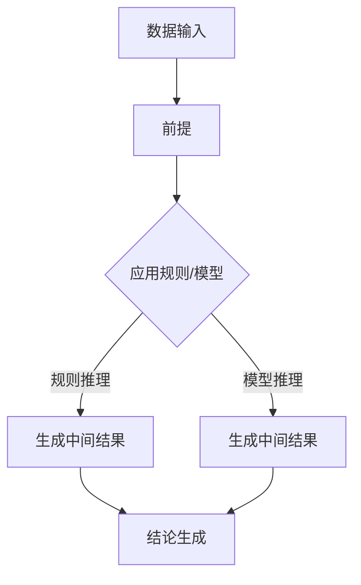
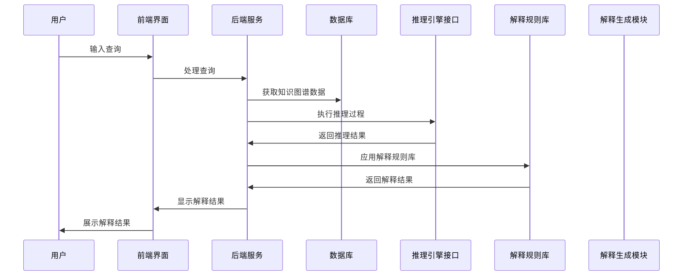
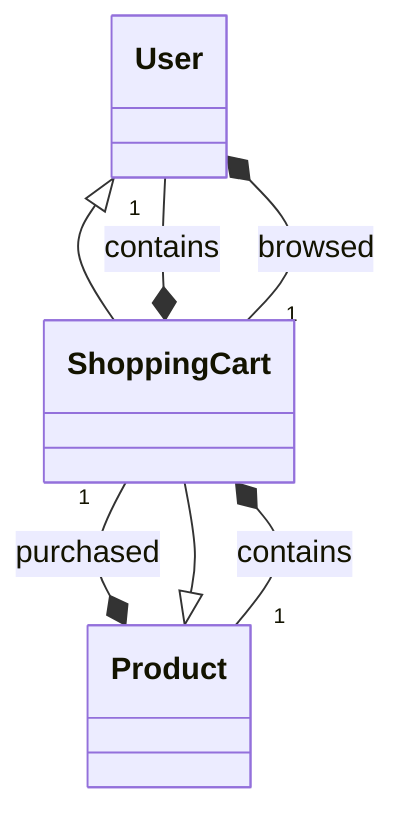

                 


### 引言

#### 问题背景

在当今快速发展的科技时代，人工智能（AI）正以前所未有的速度改变着我们的生活和工作方式。AI代理，作为AI技术的一个重要组成部分，因其能够在特定环境下自主决策和执行任务而备受关注。然而，随着AI代理的应用场景日益丰富，如何确保其推理过程的透明性和可解释性，成为了一个亟待解决的问题。

知识图谱作为一种表示实体及其关系的结构化数据模型，在AI领域中扮演着重要的角色。它不仅能够为AI代理提供丰富的语义信息，还能支持复杂的推理过程。然而，现有的知识图谱推理系统往往缺乏有效的解释能力，使得推理结果难以被非专业人士理解和接受。

本文旨在探讨如何构建一个AI Agent的知识图谱推理解释器，以提高AI代理的推理过程透明性和可解释性。具体来说，我们将从以下几个方面进行讨论：

1. **AI Agent基础知识**：介绍AI代理的基本概念、特性及应用场景。
2. **知识图谱介绍**：阐述知识图谱的原理、构建方法和应用。
3. **推理机制**：讲解推理的基本概念、算法及其性能优化策略。
4. **解释器设计与实现**：介绍解释器的架构、设计原则和实现细节。
5. **应用案例**：通过实际案例展示知识图谱推理解释器的应用效果。
6. **总结与展望**：对未来的发展趋势进行展望，并总结本文的核心观点。

#### 问题解决

为了解决AI代理推理过程中的可解释性问题，我们需要设计一个能够对推理过程进行详细解释的组件——即知识图谱推理解释器。这个解释器不仅要能够执行标准的推理算法，还要能够生成易于理解的人类语言解释，从而帮助用户理解AI代理的决策过程。

首先，我们需要明确知识图谱中的实体及其关系，以便进行推理。然后，我们选择合适的推理算法，根据知识图谱中的信息进行推理，并记录推理过程中的每一步。最后，我们将这些推理步骤转化为人类可读的解释，从而实现推理的可解释性。

通过这样的设计，AI代理的推理过程将变得更加透明和可解释，有助于提高用户对AI系统的信任度和接受度。同时，这也有助于我们更好地理解和优化AI代理的推理能力，从而推动AI技术的进一步发展。

#### 边界与外延

在构建AI Agent的知识图谱推理解释器时，我们需要明确一些边界和限制。首先，知识图谱的构建和维护是一个复杂的过程，需要大量的时间和资源。其次，推理算法的选择和优化也是影响解释器性能的重要因素。此外，解释器生成的解释可能存在一定程度的抽象和简化，无法完全反映推理过程的复杂性。

然而，尽管存在这些限制，知识图谱推理解释器在提升AI代理的可解释性方面仍然具有重要意义。通过不断优化和改进，我们有望在未来的发展中克服这些限制，实现更加高效、透明和可靠的推理过程。

#### 文章关键词

- **AI Agent**
- **知识图谱**
- **推理**
- **解释器**
- **透明性**
- **可解释性**

#### 文章摘要

本文旨在探讨如何构建AI Agent的知识图谱推理解释器，以提高AI代理的推理过程透明性和可解释性。通过介绍AI Agent、知识图谱、推理机制和解释器的设计与实现，本文详细分析了知识图谱推理解释器在AI代理中的应用效果。同时，通过实际案例的展示，本文验证了知识图谱推理解释器的有效性和实用性，为AI技术的发展提供了新的思路和方向。

----------------------------------------------------------------

## 构建AI Agent的知识图谱推理解释器

### 关键词：AI Agent、知识图谱、推理、解释器、透明性、可解释性

### 摘要

本文将深入探讨如何构建一个AI Agent的知识图谱推理解释器，以提高AI代理的推理过程透明性和可解释性。我们将从AI Agent的基本概念、知识图谱的构建、推理机制的设计、解释器的实现以及应用案例等方面展开详细讨论，旨在为AI技术的发展提供新的视角和实践指导。

----------------------------------------------------------------

## 第一部分：引言

### 第1章：背景与概述

### 1.1 问题背景

#### 1.1.1 AI Agent的定义与特性

AI Agent，即人工智能代理，是具备一定自主决策和执行任务能力的人工智能实体。它可以模拟人类行为，与环境进行交互，并通过学习不断优化自己的决策过程。AI Agent的基本特性包括：

- **自主性**：AI Agent可以在没有人类干预的情况下自主执行任务。
- **适应性**：AI Agent能够根据环境变化调整自己的行为策略。
- **灵活性**：AI Agent能够处理多种类型的任务和问题。

#### 1.1.2 知识图谱的概念与应用

知识图谱是一种用于表示实体及其关系的图形化数据模型，它通过节点和边来描述实体及其关系。知识图谱在AI中的应用主要体现在以下几个方面：

- **数据整合**：知识图谱能够整合不同来源的数据，为AI Agent提供丰富的语义信息。
- **推理**：知识图谱支持基于实体间关系的推理，为AI Agent的决策提供依据。
- **搜索**：知识图谱能够提高搜索算法的效率，帮助AI Agent快速定位相关信息。

#### 1.1.3 推理解释器的必要性

在AI Agent的推理过程中，由于涉及复杂的逻辑关系和决策路径，因此生成解释器成为提高推理过程透明性和可解释性的关键。推理解释器的必要性主要体现在：

- **增强信任度**：通过提供清晰的推理过程解释，增强用户对AI系统的信任。
- **优化决策**：通过对推理过程的分析和优化，提高AI Agent的决策质量和效率。
- **维护与改进**：有助于发现推理过程中的问题和瓶颈，为系统的维护和改进提供依据。

### 1.2 AI Agent的基础知识

#### 1.2.1 AI Agent的核心概念

AI Agent的核心概念包括：

- **感知**：AI Agent通过感知模块获取环境信息。
- **规划**：AI Agent根据当前状态和目标，生成可能的行动方案。
- **决策**：AI Agent根据规划结果和策略，选择最优行动方案。
- **执行**：AI Agent执行选定的行动方案。

#### 1.2.2 AI Agent的技术栈

AI Agent的技术栈主要包括：

- **机器学习框架**：如TensorFlow、PyTorch等，用于训练感知模块和规划模块。
- **知识图谱库**：如Neo4j、JanusGraph等，用于构建和维护知识图谱。
- **推理引擎**：如Jena、RDF4J等，用于执行基于知识图谱的推理。

### 1.3 知识图谱介绍

#### 1.3.1 知识图谱的原理

知识图谱的原理主要包括：

- **实体表示**：通过节点表示实体，节点通常包含属性来描述实体的特征。
- **关系表示**：通过边表示实体间的关系，边也包含属性来描述关系的性质。
- **图谱构建**：通过数据预处理、实体抽取、关系抽取和实体链接等步骤构建知识图谱。

#### 1.3.2 知识图谱的结构

知识图谱的结构通常包括：

- **本体层**：定义实体和关系的分类体系。
- **模型层**：定义实体和关系的属性以及它们之间的关系。
- **实例层**：存储具体的实体和关系实例。

#### 1.3.3 知识图谱的应用

知识图谱的应用包括：

- **搜索引擎**：通过知识图谱提高搜索算法的效率和质量。
- **智能问答**：通过知识图谱提供对用户查询的智能回答。
- **推荐系统**：通过知识图谱发现实体之间的关联，提高推荐系统的准确性。

### 1.4 推理解释器概述

#### 1.4.1 推理解释器的定义

推理解释器是一种用于解释AI Agent推理过程的组件，它能够将复杂的推理过程转化为易于理解的人类语言解释。

#### 1.4.2 推理解释器的作用

推理解释器的作用包括：

- **提高透明性**：通过提供推理过程解释，使AI Agent的推理过程更加透明。
- **增强可解释性**：通过解释推理结果，帮助用户理解AI Agent的决策依据。
- **优化推理**：通过对推理过程的反馈和优化，提高AI Agent的推理质量和效率。

#### 1.4.3 推理解释器的架构

推理解释器的架构通常包括：

- **推理引擎**：执行推理过程，生成推理结果。
- **解释器**：将推理结果转化为人类语言解释。
- **用户界面**：展示推理过程和解释结果。

----------------------------------------------------------------

### 第2章：AI Agent基础知识

#### 2.1 AI Agent的核心概念

AI Agent是人工智能领域中的一个重要概念，它代表了具备一定自主决策和行动能力的人工智能实体。要深入理解AI Agent，我们首先需要明确其核心概念。

**感知（Perception）**

感知是AI Agent获取环境信息的过程。感知模块负责从环境中获取数据，如视觉、听觉、触觉等，并将其转化为内部表示。感知模块是AI Agent获取信息的重要途径，为后续的决策和行动提供依据。

**规划（Planning）**

规划是AI Agent根据当前状态和目标，生成一系列可能的行动方案的过程。规划模块负责在多个可能的行动方案中选出最优方案。规划过程通常涉及复杂的逻辑推理和资源分配，是AI Agent决策的关键环节。

**决策（Decision Making）**

决策是AI Agent根据规划结果和特定策略，从多个行动方案中选择一个最优方案的过程。决策模块负责将规划结果转化为具体的行动指令。决策过程需要考虑多种因素，如环境变化、资源可用性等。

**执行（Execution）**

执行是AI Agent根据决策结果执行选定行动方案的过程。执行模块负责将决策转化为具体的操作，如移动、说话等。执行模块是AI Agent实现自主行动的关键环节。

#### 2.2 AI Agent的技术栈

AI Agent的技术栈涵盖了多种技术和工具，用于实现其感知、规划、决策和执行功能。以下是一些常用的技术栈组件：

**机器学习框架**

机器学习框架如TensorFlow、PyTorch等，用于训练感知模块和规划模块。这些框架提供了丰富的算法库和工具，方便开发者构建和优化AI模型。

**知识图谱库**

知识图谱库如Neo4j、JanusGraph等，用于构建和维护知识图谱。知识图谱库提供了高效的图数据库和数据操作接口，支持复杂的实体关系表示和查询。

**推理引擎**

推理引擎如Jena、RDF4J等，用于执行基于知识图谱的推理。推理引擎支持多种推理算法，如路径查找、属性约束等，为AI Agent的决策提供依据。

**自然语言处理（NLP）**

自然语言处理技术，如BERT、GPT等，用于处理和理解自然语言数据。NLP技术可以帮助AI Agent更好地理解和回应人类语言指令，提高交互效果。

**编程语言**

Python、Java等编程语言，是AI Agent开发过程中常用的编程语言。这些语言提供了丰富的库和框架，方便开发者构建和优化AI系统。

#### 2.3 AI Agent的应用场景

AI Agent在各种应用场景中发挥着重要作用，以下是一些典型的应用场景：

**智能家居**

在智能家居领域，AI Agent可以负责控制家电设备、监控家居安全、提供生活建议等。例如，AI Agent可以分析用户的日常习惯，自动调整家中的灯光、温度和音乐，为用户提供舒适的居住环境。

**智能客服**

在智能客服领域，AI Agent可以处理大量的用户咨询，提供24/7的在线服务。AI Agent可以通过自然语言处理技术理解用户的提问，提供准确的答案和建议，提高客服效率和用户体验。

**智能交通**

在智能交通领域，AI Agent可以用于交通流量监测、事故预警、路线规划等。AI Agent可以通过分析实时交通数据，优化交通信号，减少拥堵，提高道路通行效率。

**智能医疗**

在智能医疗领域，AI Agent可以辅助医生进行诊断、治疗和健康管理。AI Agent可以通过分析患者病历、检查结果等数据，提供个性化的医疗建议和治疗方案。

**智能制造**

在智能制造领域，AI Agent可以用于生产调度、设备维护、质量检测等。AI Agent可以通过实时监测设备状态，预测设备故障，优化生产流程，提高生产效率。

**金融风控**

在金融风控领域，AI Agent可以用于风险识别、风险评估、风险控制等。AI Agent可以通过分析大量金融数据，识别潜在风险，提供风险预警和应对策略，提高金融机构的风险管理水平。

**教育和培训**

在教育领域，AI Agent可以提供个性化的学习辅导、学习路径规划、学习效果评估等服务。AI Agent可以通过分析学生的学习行为和成绩，为学生提供个性化的学习建议和资源，提高学习效果。

**游戏和娱乐**

在游戏和娱乐领域，AI Agent可以用于游戏角色设计、游戏规则制定、游戏内容生成等。AI Agent可以模拟真实的游戏场景，提供丰富的游戏体验，提高游戏的可玩性。

综上所述，AI Agent在各个领域都有广泛的应用前景，其自主决策和行动能力为各个行业带来了巨大的变革和提升。随着AI技术的不断发展和应用场景的拓展，AI Agent将在未来发挥更加重要的作用。

----------------------------------------------------------------

### 第3章：知识图谱介绍

#### 3.1 知识图谱的原理

知识图谱（Knowledge Graph）是人工智能领域的一种重要数据模型，用于表示实体及其关系。知识图谱的核心思想是通过将现实世界中的各种实体以及它们之间的关系结构化，形成一个全局的、可查询的知识体系。

**实体表示**

在知识图谱中，实体（Entity）是基本的数据单元，代表现实世界中具体存在的对象，如人、地点、事物等。实体通常由一个唯一的标识符（ID）来标识，并通过属性（Attribute）来描述其特征。例如，一个“人”实体可能具有“姓名”、“年龄”、“性别”等属性。

**关系表示**

关系（Relationship）是知识图谱中的另一个基本概念，用于表示实体之间的关联。关系同样由一个唯一的标识符来标识，并通过属性来描述关系的性质。例如，“居住于”关系可以表示两个实体（人和地点）之间的居住关系。

**图谱构建**

知识图谱的构建通常包括以下步骤：

1. **数据源收集**：收集来自各种来源的数据，如公共数据库、网站、社交媒体等。
2. **数据预处理**：对收集到的数据进行清洗、去重和标准化，确保数据的一致性和质量。
3. **实体抽取**：从预处理后的数据中识别和提取实体，并为每个实体生成唯一的标识符。
4. **关系抽取**：从预处理后的数据中识别和提取实体间的关系，并为每个关系生成唯一的标识符。
5. **实体链接**：将来自不同来源的相同实体进行匹配和合并，确保知识图谱的完整性。

**图谱存储**

知识图谱通常存储在一个分布式图数据库中，如Neo4j、JanusGraph等。这些数据库提供了高效的图查询和索引功能，支持复杂的图算法和查询操作。此外，知识图谱还可以与NoSQL数据库或关系数据库集成，以实现更广泛的数据管理和分析功能。

#### 3.2 知识图谱的结构

知识图谱的结构可以分为三个层次：本体层、模型层和实例层。

**本体层**

本体层（Ontology Layer）是知识图谱的抽象层，定义了知识图谱中实体的分类体系和属性。本体层通常包括以下组成部分：

- **概念（Concept）**：表示知识图谱中的基本实体类型，如“人”、“地点”、“事物”等。
- **属性（Attribute）**：描述实体的特征，如“姓名”、“年龄”、“性别”等。
- **关系（Relationship）**：描述实体间的关联，如“居住于”、“属于”等。
- **分类（Classification）**：定义实体之间的层次结构，如“人类”是“动物”的一个子类。

**模型层**

模型层（Model Layer）是知识图谱的实现层，根据本体层定义的实体和关系，构建具体的知识模型。模型层通常包括以下组成部分：

- **实体实例（Entity Instance）**：根据本体层定义的实体类型，创建具体的实体实例，如“张三”、“北京”、“手机”等。
- **关系实例（Relationship Instance）**：根据本体层定义的关系类型，创建具体的关系实例，如“张三居住于北京”、“手机属于电子产品”等。
- **属性值（Attribute Value）**：为实体实例和关系实例分配具体的属性值，如“张三的年龄为25”、“北京是中国的首都”等。

**实例层**

实例层（Instance Layer）是知识图谱的具体实现层，存储实际的实体、关系和属性值。实例层通常包括以下组成部分：

- **实体库（Entity Repository）**：存储所有实体实例的信息，如ID、类型、属性等。
- **关系库（Relationship Repository）**：存储所有关系实例的信息，如ID、类型、属性等。
- **属性库（Attribute Repository）**：存储所有属性值的信息，如属性名称、属性值等。

#### 3.3 知识图谱的应用

知识图谱在人工智能领域有着广泛的应用，以下是一些典型的应用场景：

**搜索引擎**

知识图谱可以增强搜索引擎的功能，提供更加准确和丰富的搜索结果。通过知识图谱，搜索引擎可以理解用户查询的语义，提供相关实体和关系的搜索结果。

**智能问答**

知识图谱可以用于智能问答系统，为用户提供准确的答案。智能问答系统通过分析用户的问题，利用知识图谱中的信息，生成准确的答案。

**推荐系统**

知识图谱可以用于推荐系统，提高推荐的准确性。推荐系统通过分析用户的行为和偏好，利用知识图谱中的关联关系，生成个性化的推荐结果。

**自然语言处理**

知识图谱可以用于自然语言处理任务，如文本分类、实体识别、关系抽取等。知识图谱提供了丰富的背景知识和上下文信息，有助于提高自然语言处理任务的效果。

**智能助手**

知识图谱可以用于智能助手，为用户提供智能化的服务。智能助手通过分析用户的输入，利用知识图谱中的信息，提供相应的建议和帮助。

**智能城市**

知识图谱可以用于智能城市项目，如交通管理、环境监测、公共服务等。知识图谱提供了全面的城市信息，有助于优化城市管理和运营。

**智能制造**

知识图谱可以用于智能制造项目，如设备维护、生产调度、质量控制等。知识图谱提供了设备、产品和过程的信息，有助于优化生产流程和提高效率。

**金融风控**

知识图谱可以用于金融风控项目，如客户管理、风险识别、信用评估等。知识图谱提供了客户、交易和风险的信息，有助于提高风险管理水平。

总之，知识图谱作为一种重要的数据模型，在人工智能领域有着广泛的应用前景。通过构建和应用知识图谱，我们可以实现更加智能化、个性化和高效的人工智能系统。

### 3.4 知识图谱与AI Agent的关联

知识图谱在AI Agent中的作用至关重要。首先，知识图谱为AI Agent提供了丰富的语义信息，使其能够更好地理解和处理现实世界中的各种情况。例如，在智能客服应用中，知识图谱可以帮助AI Agent理解用户的提问，提供准确的答案和建议。

其次，知识图谱支持AI Agent进行复杂的推理和决策。通过知识图谱中的实体关系，AI Agent可以推断出新的信息，从而在不确定的环境中做出合理的决策。例如，在智能交通领域，AI Agent可以利用知识图谱中的道路、交通信号和车辆信息，优化交通流量，减少拥堵。

此外，知识图谱还可以用于AI Agent的个性化和智能化服务。通过分析用户在知识图谱中的行为和偏好，AI Agent可以提供更加个性化的服务，提高用户体验。例如，在智能家居领域，AI Agent可以根据用户在知识图谱中的生活习惯，自动调整家居环境，提供个性化的服务。

总之，知识图谱与AI Agent的紧密结合，将有助于实现更加智能、高效和可靠的人工智能系统，为各个领域带来巨大的变革和提升。

### 3.5 知识图谱的构建方法

构建知识图谱是一个复杂的过程，涉及多个步骤和阶段。以下是知识图谱构建的主要方法：

**1. 数据源选择**

首先，需要选择合适的数据源。数据源可以包括公开的数据库、网站、社交媒体、企业内部数据等。选择数据源时，需要考虑数据的质量、覆盖面和更新频率。

**2. 数据采集**

在确定数据源后，需要采集相关的数据。数据采集可以通过网络爬虫、API调用、数据库连接等方式进行。在采集数据时，需要注意数据的格式、编码和一致性。

**3. 数据清洗**

采集到的数据通常包含噪声和冗余信息，因此需要通过数据清洗过程来提高数据质量。数据清洗包括去重、填补缺失值、去除无效数据等操作。

**4. 实体抽取**

数据清洗后，需要从数据中抽取实体。实体抽取可以通过命名实体识别（NER）技术、关键词提取等方法实现。实体抽取的准确性直接影响知识图谱的质量。

**5. 关系抽取**

在抽取实体后，需要确定实体之间的关系。关系抽取可以通过基于规则的方法、机器学习方法等实现。关系抽取的准确性同样影响知识图谱的质量。

**6. 实体链接**

实体链接是将来自不同数据源的相同实体进行匹配和合并的过程。实体链接可以通过基于匹配规则、基于机器学习的方法等实现。

**7. 知识融合**

知识融合是将多个数据源中的知识进行整合的过程。知识融合可以通过数据对齐、实体合并、关系合并等方法实现。

**8. 知识存储**

最后，将构建好的知识图谱存储到图数据库或其他数据存储系统中，以便后续的查询和分析。

通过以上方法，可以构建出一个高质量的知识图谱，为AI Agent和其他应用提供丰富的语义信息和支持。

### 3.6 知识图谱的应用案例

知识图谱在实际应用中取得了显著成果，以下是一些典型的应用案例：

**1. 智能搜索引擎**

知识图谱可以增强搜索引擎的功能，提供更加准确和丰富的搜索结果。例如，谷歌的搜索引擎使用了知识图谱来提升搜索质量，为用户提供更加智能的搜索体验。

**2. 智能问答系统**

知识图谱可以用于智能问答系统，为用户提供准确的答案。例如，沃森问答系统利用知识图谱来理解用户的问题，并生成高质量的答案。

**3. 推荐系统**

知识图谱可以用于推荐系统，提高推荐的准确性。例如，亚马逊的推荐系统使用了知识图谱来分析用户的行为和偏好，生成个性化的推荐结果。

**4. 自然语言处理**

知识图谱可以用于自然语言处理任务，如文本分类、实体识别、关系抽取等。例如，BERT模型使用了知识图谱来增强其语义理解能力，提高了自然语言处理任务的效果。

**5. 智能助手**

知识图谱可以用于智能助手，为用户提供智能化的服务。例如，苹果的Siri和谷歌的Google Assistant使用了知识图谱来理解用户的指令，提供相应的建议和帮助。

**6. 智能城市**

知识图谱可以用于智能城市项目，如交通管理、环境监测、公共服务等。例如，北京的城市规划项目中使用了知识图谱来整合各类城市信息，优化城市管理和运营。

**7. 智能制造**

知识图谱可以用于智能制造项目，如设备维护、生产调度、质量控制等。例如，西门子的智能制造项目中使用了知识图谱来管理设备和生产流程，提高生产效率。

**8. 金融风控**

知识图谱可以用于金融风控项目，如客户管理、风险识别、信用评估等。例如，金融机构使用了知识图谱来分析客户行为和交易信息，提高风险管理水平。

通过这些应用案例，我们可以看到知识图谱在各个领域的重要作用，它不仅为AI Agent提供了丰富的语义信息，还推动了人工智能技术的进一步发展。

### 3.7 知识图谱的未来发展趋势

知识图谱作为人工智能领域的一个重要研究方向，未来将继续发展并应用于更多领域。以下是知识图谱的几个未来发展趋势：

**1. 多模态知识图谱**

随着人工智能技术的发展，多模态知识图谱将成为研究热点。多模态知识图谱可以整合文本、图像、音频等多种类型的数据，提供更加丰富和全面的知识体系。

**2. 自适应知识图谱**

自适应知识图谱可以根据环境变化和需求调整自身的结构和内容。例如，在智能交通领域，自适应知识图谱可以根据交通状况和用户需求动态调整交通信号和路线规划。

**3. 分布式知识图谱**

分布式知识图谱可以在大规模分布式系统中存储和查询知识，提高系统的可扩展性和性能。例如，云计算平台可以提供分布式知识图谱存储和查询服务，为全球范围内的用户提供高效的知识支持。

**4. 实时知识图谱**

实时知识图谱可以实时更新和扩展，以适应快速变化的环境。例如，在金融风控领域，实时知识图谱可以实时监控交易信息，及时发现风险并采取相应措施。

**5. 知识图谱的应用创新**

知识图谱将在各个领域继续发挥重要作用，推动应用创新。例如，在医疗领域，知识图谱可以用于疾病预测、诊断和治疗方案的推荐；在农业领域，知识图谱可以用于作物生长预测、病虫害防治等。

**6. 知识图谱与AI的深度融合**

知识图谱与人工智能的深度融合将推动人工智能技术的进一步发展。例如，通过知识图谱，AI系统可以更好地理解和处理复杂问题，实现更高级的智能决策和行动。

总之，知识图谱在未来的发展中将继续发挥重要作用，为人工智能技术提供强大的支持。通过不断创新和应用，知识图谱将为人类社会带来更多便利和进步。

### 第4章：推理机制

#### 4.1 推理的基本概念

推理（Reasoning）是人工智能领域中的一个核心概念，指的是基于已有信息推导出新信息的过程。在知识图谱中，推理尤为重要，因为它能够利用实体及其关系生成新的知识，为AI Agent提供决策依据。

**推理的定义**

推理是从一组已知事实（前提）出发，通过逻辑规则或算法推导出新的结论（结果）的过程。例如，如果我们知道“所有人都有生命”和“张三是人”，通过推理可以得到“张三有生命”。

**推理的类型**

推理可以分为两大类：演绎推理（Deductive Reasoning）和归纳推理（Inductive Reasoning）。

- **演绎推理**：从一般到特殊的推理过程。它基于全称命题和部分命题之间的关系，通过推理规则推导出特定情况下的结论。例如，如果所有的人都有生命，而张三是人，那么我们可以演绎出“张三有生命”。

- **归纳推理**：从特殊到一般的推理过程。它基于特定实例的观察，推导出一般性的结论。例如，通过观察多个苹果都是红色的，我们可能会归纳出“苹果通常是红色的”。

**推理的过程**

推理过程通常包括以下步骤：

1. **数据输入**：输入已知的事实和规则。
2. **推理规则**：应用逻辑规则进行推理。
3. **中间结果**：根据推理规则生成中间结果。
4. **结论生成**：从中间结果推导出最终结论。

#### 4.2 推理算法

在知识图谱中，常用的推理算法包括：

**1. 基于规则的推理**

基于规则的推理（Rule-Based Reasoning）是最简单的推理算法，它通过预定义的规则库进行推理。规则通常由条件（条件部分）和结论（结论部分）组成。当输入条件满足时，会推导出结论。例如：

- 规则：如果今天下雨，那么需要带伞。
- 条件：今天下雨。
- 结论：需要带伞。

这种推理算法的优势在于简单易懂，但缺点是缺乏灵活性和自适应性。

**2. 基于模型的推理**

基于模型的推理（Model-Based Reasoning）利用机器学习模型进行推理。这种方法通常需要训练一个预测模型，然后使用模型对新的输入数据进行推理。例如，可以使用神经网络模型进行关系抽取和推理。这种方法的优点在于能够处理复杂的关系和模式，但缺点是需要大量的训练数据和计算资源。

**3. 基于图谱的推理**

基于图谱的推理（Graph-Based Reasoning）直接利用知识图谱中的实体和关系进行推理。这种算法通常包括路径搜索、属性约束等操作。例如，可以使用图算法（如BFS、DFS）在知识图谱中查找实体间的路径，从而推导出新的知识。这种方法的优点在于能够充分利用知识图谱的结构信息，但缺点是算法复杂度较高。

**4. 混合推理**

混合推理（Hybrid Reasoning）结合了基于规则和基于模型的方法，利用各自的优点进行推理。例如，可以先使用基于规则的推理找到可能的路径，然后使用基于模型的推理进一步优化和验证这些路径。这种方法的优点在于能够在保持推理效率的同时，提高推理的准确性和灵活性。

#### 4.3 推理算法的优缺点

以下是几种常见推理算法的优缺点：

| 推理算法         | 优点                                                         | 缺点                                                     |
|------------------|--------------------------------------------------------------|------------------------------------------------------------|
| 基于规则的推理   | 简单易懂，易于实现和调试                                     | 缺乏灵活性和自适应性，难以处理复杂关系和模式               |
| 基于模型的推理   | 能够处理复杂的关系和模式，自适应性强                           | 需要大量的训练数据和计算资源，算法实现复杂               |
| 基于图谱的推理   | 能够充分利用知识图谱的结构信息，推理过程直观                 | 算法复杂度较高，对图谱的依赖性较强                       |
| 混合推理         | 结合了基于规则和基于模型的方法，能够在保持效率的同时提高准确性 | 需要结合不同算法的优缺点，实现复杂                       |

#### 4.4 推理算法的选择与优化

在选择推理算法时，需要根据应用场景和需求进行综合考虑。以下是一些选择和优化推理算法的指导原则：

**1. 应用场景**

- **简单场景**：适用于基于规则的推理，因为其实现简单、易于理解和调试。
- **复杂场景**：适用于基于模型和混合推理，因为它们能够处理复杂的关系和模式。

**2. 数据规模**

- **小数据规模**：适用于基于规则的推理，因为其计算复杂度较低。
- **大数据规模**：适用于基于图谱和混合推理，因为它们能够高效地处理大规模数据。

**3. 计算资源**

- **计算资源充足**：适用于基于模型和混合推理，因为它们需要大量的计算资源。
- **计算资源有限**：适用于基于规则的推理，因为其计算复杂度较低。

**4. 推理速度**

- **对推理速度要求较高**：适用于基于规则的推理，因为其推理过程相对简单。
- **对推理速度要求较低**：适用于基于模型和混合推理，因为它们可以并行处理和优化推理过程。

**5. 推理准确率**

- **对准确率要求较高**：适用于基于模型和混合推理，因为它们能够更好地处理复杂关系和模式。
- **对准确率要求较低**：适用于基于规则的推理，因为其推理过程相对简单。

在优化推理算法时，可以采取以下策略：

- **算法优化**：通过改进算法实现，降低计算复杂度和提高运行效率。
- **数据预处理**：通过数据清洗、去重和标准化等操作，提高数据质量，减少推理过程中的噪声和错误。
- **模型调优**：通过调整模型参数和超参数，优化模型性能，提高推理准确率和效率。
- **分布式计算**：通过分布式计算和并行处理，提高大规模数据处理的效率和速度。

总之，选择和优化推理算法是一个复杂的过程，需要根据具体应用场景和需求进行综合考虑。通过合理的算法选择和优化策略，我们可以构建出高效、准确和可靠的推理系统，为AI Agent提供强大的推理支持。

### 第5章：推理算法

#### 5.1 推理算法的原理

推理算法是人工智能领域中用于处理逻辑推理、知识推理和数据推理的一类算法。这些算法的核心在于利用已有数据或知识，通过逻辑推理规则或计算模型，推导出新的结论或信息。在知识图谱中，推理算法扮演着至关重要的角色，用于发现实体之间的关系、生成新的知识、支持决策过程等。

**推理算法的基本原理**

推理算法的基本原理可以概括为：

1. **前提**：已知一组事实和规则。
2. **推理过程**：应用逻辑规则或计算模型，从已知的前提中推导出新的结论。
3. **结论**：推导出新的信息或知识。

在知识图谱中，推理算法通常分为以下几种类型：

- **基于规则的推理**：利用预定义的规则库进行推理，规则通常由条件部分和结论部分组成。
- **基于模型的推理**：利用机器学习模型进行推理，模型通常用于预测实体之间的关系或属性。
- **基于图谱的推理**：直接利用知识图谱中的实体和关系进行推理，算法通常包括路径搜索、属性约束等操作。

**推理算法的工作流程**

推理算法的工作流程通常包括以下步骤：

1. **数据输入**：输入已知的事实和规则。
2. **推理规则或模型**：应用推理规则或机器学习模型。
3. **中间结果**：根据推理规则或模型生成中间结果。
4. **结论生成**：从中间结果推导出最终结论。

**推理算法的应用场景**

推理算法在知识图谱中的应用场景非常广泛，包括但不限于：

- **关系抽取**：从知识图谱中抽取实体之间的关系。
- **知识发现**：发现实体之间的潜在关系和模式。
- **决策支持**：为AI代理提供决策依据，支持复杂决策过程。
- **推荐系统**：基于知识图谱中的实体关系，生成个性化推荐结果。

#### 5.2 推理算法的mermaid流程图

为了更好地理解推理算法的工作流程，我们可以使用mermaid流程图来可视化其步骤和过程。以下是一个简单的mermaid流程图示例，展示了基于规则和基于模型的推理算法的基本步骤：



在这个mermaid流程图中：

- **A[数据输入]**：表示输入已知的事实和规则。
- **B[前提]**：表示将数据输入转换为可用的形式，例如知识图谱中的实体和关系。
- **C[应用规则/模型]**：表示应用推理规则或机器学习模型。
- **D[生成中间结果]**：表示基于规则推理算法生成的中间结果。
- **E[生成中间结果]**：表示基于模型推理算法生成的中间结果。
- **F[结论生成]**：表示从中间结果推导出最终结论。

#### 5.3 推理算法的Python源代码实现

为了进一步展示推理算法的实现过程，我们可以通过Python代码实现一个简单的基于规则的推理算法。以下是一个简单的Python示例，展示了如何使用规则库和事实进行推理：

```python
# 基于规则的推理算法示例

# 定义规则库
rules = {
    "if raining then need_umbrella": {
        "conditions": ["raining"],
        "conclusion": "need_umbrella"
    },
    "if person is young then study": {
        "conditions": ["is young"],
        "conclusion": "study"
    }
}

# 定义事实库
facts = {
    "it is raining": True,
    "person is young": True
}

# 推理函数
def reason(rules, facts):
    conclusions = []
    for rule, details in rules.items():
        if all(condition in facts for condition in details["conditions"]):
            conclusions.append(details["conclusion"])
    return conclusions

# 执行推理
print(reason(rules, facts))
```

在这个Python代码示例中：

- **rules**：表示定义的规则库，每条规则由条件部分和结论部分组成。
- **facts**：表示已知的事实库，包含当前环境中的事实。
- **reason**：表示推理函数，用于根据规则库和事实库进行推理，返回结论。

通过运行这个示例，我们可以得到以下输出结果：

```python
['need_umbrella', 'study']
```

这表明根据当前的事实，推理出了两个结论：“需要带伞”和“需要学习”。

#### 5.4 算法原理的数学模型和公式

推理算法的原理通常涉及一些基础的数学模型和公式，用于描述实体之间的关系和推理过程。以下是一个简单的数学模型示例，用于描述基于规则的推理算法：

**1. 实体表示**

在知识图谱中，实体通常用节点表示，每个节点包含一组属性。假设实体`A`的属性集合为`A = {a1, a2, ..., an}`。

**2. 关系表示**

实体之间的关系用边表示，边通常包含两个节点和一个权重。假设关系`R`连接节点`A`和`B`，权重表示关系的强度。关系`R`可以表示为：

```
R: (A, B, w)
```

其中，`w`表示关系的权重。

**3. 规则表示**

规则通常由一组条件和结论组成，条件用于描述实体之间的关系，结论用于描述推理结果。假设规则`R`表示为：

```
R: (C1, C2, ..., Cn) -> C
```

其中，`C1, C2, ..., Cn`为条件，`C`为结论。

**4. 推理过程**

推理过程通过检查已知的事实，应用规则进行推理，生成新的结论。假设已知事实集合为`F`，规则库为`R`，推理结果集合为`C`，推理过程可以表示为：

```
C = ∪{R ∈ R | R的条件在F中成立}
```

其中，`∪`表示并集操作。

通过这个简单的数学模型，我们可以描述和实现基于规则的推理算法，用于发现实体之间的关系和生成新的知识。

#### 5.5 通俗易懂地举例说明

为了更好地理解推理算法的原理和应用，我们可以通过一个简单的例子来展示其工作过程。假设我们有一个简单的知识图谱，描述了城市、建筑物和居民之间的关系。知识图谱如下：

```
实体：
- 城市A
- 建筑物B
- 居民C

关系：
- 城市A包含建筑物B
- 居民C居住在建筑物B

事实：
- 城市A包含建筑物B
- 居民C居住在建筑物B
```

现在，我们希望利用这个知识图谱进行推理，得出以下结论：

```
如果居民C居住在建筑物B，并且建筑物B包含在某个城市A中，那么居民C居住在城市A。
```

**推理过程**：

1. **前提**：已知事实
   - 居民C居住在建筑物B
   - 建筑物B包含在城市A中

2. **应用规则**：
   - 规则1：如果居民C居住在建筑物B，则居民C居住在城市A中。

3. **推理过程**：
   - 检查前提是否满足规则1的条件：
     - 居民C居住在建筑物B：前提满足
     - 建筑物B包含在某个城市A中：前提满足
   - 因此，根据规则1，可以推导出结论：
     - 居民C居住在城市A中。

通过这个简单的例子，我们可以看到推理算法是如何利用已知的事实和规则，推导出新的结论的。这个例子虽然简单，但展示了推理算法的基本原理和应用场景，有助于我们更好地理解推理算法的工作过程。

### 第6章：推理性能优化

#### 6.1 性能分析

推理性能是衡量推理算法优劣的重要指标，它直接影响到AI Agent在实际应用中的效率和效果。为了优化推理性能，首先需要对现有推理算法进行详细的性能分析。

**性能指标**

推理性能分析通常包括以下指标：

- **推理速度**：指从输入数据到输出结果的整个过程所花费的时间。推理速度是衡量算法效率的关键指标。
- **准确率**：指推理结果与实际结果相符的比率。高准确率表示算法能够正确推导出结论。
- **资源消耗**：指推理过程中消耗的CPU、内存等资源。资源消耗直接影响算法的可扩展性和可维护性。

**性能瓶颈**

在性能分析过程中，常见的性能瓶颈包括：

- **算法复杂度**：推理算法的复杂度直接影响推理速度。例如，基于图谱的推理算法通常具有较高的时间复杂度。
- **数据规模**：随着数据规模的增大，推理性能可能下降。这是因为算法需要处理更多的数据，导致计算时间增加。
- **硬件资源**：硬件资源不足可能导致推理速度变慢。例如，CPU和内存不足可能导致算法无法高效运行。

#### 6.2 性能优化策略

为了提高推理性能，可以采取以下优化策略：

**1. 算法优化**

- **算法改进**：通过改进推理算法，降低其时间复杂度。例如，使用高效的图算法（如BFS、DFS）替代复杂度较高的算法。
- **算法组合**：结合多种推理算法的优点，形成混合推理算法。例如，结合基于规则的推理和基于模型的推理，提高推理准确率和速度。

**2. 数据优化**

- **数据预处理**：通过数据清洗、去重和标准化等操作，提高数据质量，减少噪声和冗余信息，从而提高推理效率。
- **数据缓存**：使用缓存技术存储常用数据和中间结果，减少重复计算，提高推理速度。

**3. 硬件优化**

- **分布式计算**：通过分布式计算和并行处理，将推理任务分配到多个计算节点，提高推理速度。例如，使用分布式图数据库和分布式推理引擎。
- **硬件升级**：使用高性能的硬件设备，如GPU、FPGA等，提高计算能力和效率。

**4. 调优**

- **参数调优**：通过调整算法参数和超参数，优化推理性能。例如，调整神经网络模型的学习率、批量大小等。
- **模型压缩**：使用模型压缩技术，减小模型大小，提高推理速度。例如，使用深度可分离卷积、剪枝等。

#### 6.3 具体优化方法

以下是一些具体的优化方法，用于提高推理性能：

**1. 算法优化**

- **使用高效图算法**：例如，使用BFS和DFS代替Dijkstra算法进行路径搜索，提高推理速度。
- **优化规则库**：减少冗余规则，提高规则匹配效率。例如，使用条件合并和简化规则。

**2. 数据优化**

- **数据预处理**：使用数据清洗工具，去除噪声和冗余数据。例如，使用自然语言处理技术去除文本中的噪声。
- **数据缓存**：使用内存缓存或磁盘缓存，存储常用数据和中间结果。例如，使用LRU缓存策略。

**3. 硬件优化**

- **分布式计算**：使用分布式图数据库（如JanusGraph、Neo4j）和分布式推理引擎（如Apache Flink、Apache Spark），提高推理速度。
- **硬件升级**：使用高性能GPU（如NVIDIA Tesla V100）或FPGA（如Xilinx UltraScale），提高计算能力。

**4. 调优**

- **参数调优**：使用网格搜索或贝叶斯优化，调整算法参数和超参数。例如，调整学习率和批量大小。
- **模型压缩**：使用剪枝、量化等模型压缩技术，减小模型大小，提高推理速度。

通过这些优化方法，我们可以显著提高推理性能，为AI Agent提供更高效、准确的推理支持。

### 第7章：解释器概述

#### 7.1 解释器的定义

解释器（Interpreter）是计算机科学中用于执行程序代码的一种组件，它能够读取、分析并执行代码中的指令。在人工智能（AI）领域，解释器被广泛应用于知识图谱推理过程中，用于生成人类可理解的结果解释。具体来说，知识图谱解释器是专门为知识图谱推理设计的解释组件，它负责将推理过程中的每一步转化为易于理解的人类语言解释，从而提高推理结果的透明性和可解释性。

#### 7.2 解释器的作用

知识图谱解释器在AI领域中扮演着重要角色，其核心作用包括：

1. **提升透明性**：通过提供推理过程的详细解释，帮助用户理解AI代理的决策依据，从而提升系统的透明性。
2. **增强可解释性**：将复杂的推理过程转化为简洁明了的人类语言，使得非专业用户也能理解推理结果，从而增强系统的可解释性。
3. **辅助优化**：通过分析解释器生成的解释，识别推理过程中的问题和瓶颈，为算法优化和系统改进提供依据。

#### 7.3 解释器的类型

根据解释器的实现方式和功能，常见的解释器类型包括：

1. **语法解释器**：这类解释器主要分析代码的语法结构，将其转化为抽象语法树（AST），并执行相应的操作。语法解释器通常用于编译器前端，用于初步分析代码的语法正确性。
2. **语义解释器**：这类解释器不仅分析代码的语法结构，还关注代码的语义，即代码在特定环境中执行的含义。语义解释器可以生成更为详细的解释，帮助用户理解代码的行为。
3. **解释式解释器**：这类解释器在执行代码时，逐行读取并解释代码，而不是一次性将整个程序编译为机器码。这种解释器适用于动态语言，如Python和JavaScript。

#### 7.4 解释器在知识图谱推理中的应用

在知识图谱推理中，解释器的作用尤为重要，它可以将复杂的推理过程转化为易于理解的人类语言解释。以下是在知识图谱推理中，解释器的一些具体应用：

1. **推理路径解释**：解释器可以追踪推理过程中的每一步，生成路径解释，帮助用户理解推理如何从一个已知事实推导出新的结论。
2. **规则解释**：解释器可以详细解释应用了哪些规则，这些规则如何影响推理结果，从而帮助用户理解推理过程。
3. **结果解释**：解释器可以解释推理结果的含义，提供关于推理结果的相关信息和上下文，帮助用户更好地理解推理结果。

#### 7.5 解释器的架构

知识图谱解释器的架构通常包括以下几个关键组件：

1. **推理引擎接口**：解释器与推理引擎之间的接口，用于获取推理过程中的中间结果和最终结果。
2. **解释规则库**：存储用于生成解释的规则，包括语法规则和语义规则，用于将推理过程转化为人类语言解释。
3. **解释生成模块**：负责根据解释规则库和推理结果，生成详细、准确的人类语言解释。
4. **用户界面**：用于展示解释结果的界面，可以是命令行界面、Web界面或图形界面。

通过这些组件的协同工作，知识图谱解释器能够为用户提供高质量的推理解释，提高系统的透明性和可解释性。

### 第8章：解释器架构

#### 8.1 解释器设计原则

设计解释器时，需要遵循以下原则，以确保其功能强大且易于使用：

1. **模块化设计**：解释器应采用模块化设计，将不同的功能模块（如推理引擎接口、解释规则库、解释生成模块等）分离，便于维护和扩展。
2. **可扩展性**：解释器应具备良好的可扩展性，能够灵活地添加新的解释规则和推理引擎，以适应不同的应用场景。
3. **高效性**：解释器应尽量优化性能，减少解释生成过程中的计算开销，确保解释过程高效、快速。
4. **可解释性**：解释器生成的解释应清晰、准确、易于理解，确保用户能够快速掌握推理过程和结果。

#### 8.2 解释器组件介绍

知识图谱解释器的主要组件包括：

1. **推理引擎接口**：这是解释器与推理引擎之间的桥梁，负责获取推理过程中的中间结果和最终结果。推理引擎接口通常包括以下功能：
   - **获取推理路径**：提供方法获取推理过程中每一步的详细信息，包括使用的规则和推理结果。
   - **查询推理结果**：提供方法获取推理过程中的最终结果，以便解释器生成解释。
   - **处理异常**：在推理过程中，如果出现错误或异常，推理引擎接口应能够及时捕获并处理这些异常，确保解释器的稳定运行。

2. **解释规则库**：解释规则库是解释器核心的一部分，它包含了一系列用于生成解释的规则。这些规则可以基于语法规则或语义规则，用于描述如何将推理过程中的中间结果转化为人类语言解释。解释规则库通常包括以下内容：
   - **规则定义**：定义用于解释特定推理步骤的规则，如“如果A，则B”。
   - **规则优先级**：确定不同规则的优先级，确保解释过程的一致性和准确性。
   - **规则库管理**：提供方法用于添加、删除和修改解释规则，以适应不同的解释需求。

3. **解释生成模块**：解释生成模块是解释器的核心组件，负责根据推理引擎接口提供的中间结果和解释规则库，生成详细、准确的人类语言解释。解释生成模块通常包括以下功能：
   - **解释模板**：定义解释的模板，用于将解释规则应用到推理结果中，生成具体的解释文本。
   - **解释合成**：将多个解释规则合成成一个完整的解释文本，确保解释的连贯性和一致性。
   - **解释验证**：对生成的解释进行验证，确保其准确性和可理解性。

4. **用户界面**：用户界面是解释器与用户交互的通道，用于展示解释结果。用户界面可以采用不同的形式，如命令行界面、Web界面或图形界面。用户界面通常包括以下功能：
   - **解释展示**：展示解释结果，使用户能够直观地理解推理过程和结果。
   - **交互式查询**：允许用户输入查询，查询推理结果和解释。
   - **帮助文档**：提供帮助文档和教程，帮助用户快速掌握解释器的使用方法。

通过这些组件的协同工作，知识图谱解释器能够为用户提供高质量的推理解释，提高系统的透明性和可解释性。

### 第9章：实现细节

#### 9.1 系统功能设计

知识图谱解释器的功能设计主要包括以下几个方面：

1. **推理过程追踪**：追踪推理过程中的每一步，记录每一步的推理结果和使用的规则，以便生成详细的解释。
2. **解释生成**：根据记录的推理过程，使用解释规则库生成人类语言解释，使推理过程和结果易于理解。
3. **用户交互**：提供用户界面，使用户能够输入查询，查看推理结果和解释，并提供反馈和优化建议。

#### 9.2 系统架构设计

知识图谱解释器的系统架构设计如下：

1. **前端界面**：用户通过前端界面与系统进行交互，包括查询输入、结果显示和反馈机制。
2. **后端服务**：包括推理引擎接口、解释规则库和解释生成模块，负责处理用户查询，生成解释结果。
3. **数据库**：存储知识图谱数据、推理规则库和用户数据，支持快速查询和更新。

#### 9.3 系统接口设计

系统接口设计主要包括以下部分：

1. **推理引擎接口**：提供方法获取推理过程的中间结果和最终结果，包括获取推理路径、查询推理结果等。
2. **解释规则库接口**：提供方法管理解释规则库，包括添加、删除、修改规则等。
3. **解释生成模块接口**：提供方法生成人类语言解释，包括合成解释文本、验证解释准确性等。

#### 9.4 系统交互

系统交互设计如下：

1. **用户输入**：用户通过前端界面输入查询，提交给后端服务。
2. **查询处理**：后端服务调用推理引擎接口，执行推理过程，并记录每一步的结果。
3. **解释生成**：后端服务调用解释生成模块，根据推理结果和解释规则库，生成人类语言解释。
4. **结果展示**：后端服务将解释结果返回给前端界面，展示给用户。

#### 9.5 系统交互Mermaid序列图

以下是一个简单的Mermaid序列图，展示了系统交互的过程：



在这个序列图中，用户通过前端界面输入查询，后端服务处理查询并调用推理引擎接口执行推理过程。推理结果经过解释规则库处理后，生成人类语言解释，最终返回给用户前端界面展示。

### 第10章：案例研究

#### 10.1 案例介绍

在本节中，我们将通过一个实际案例来研究如何构建AI Agent的知识图谱推理解释器。该案例将详细描述案例背景、目标、挑战以及具体的实施过程。

**案例背景**

某大型电商平台希望通过引入AI技术，提高用户购物体验和销售业绩。为了实现这一目标，该电商平台决定构建一个基于知识图谱的智能推荐系统，为用户推荐个性化的商品。

**案例目标**

- 构建一个基于知识图谱的智能推荐系统，提高推荐准确率和用户体验。
- 设计一个知识图谱推理解释器，提高推理过程的透明性和可解释性。

**挑战**

- 数据质量：电商平台拥有大量用户行为数据和商品信息，但数据质量参差不齐，存在噪声和冗余信息。
- 推理性能：构建高效的推理算法，满足实时推荐的需求。
- 可解释性：设计易于理解的解释器，提高用户对推荐系统的信任度。

**实施过程**

1. **数据采集与预处理**

   首先，从电商平台的数据仓库中采集用户行为数据（如浏览记录、购买历史等）和商品信息（如商品描述、分类、标签等）。然后，对采集到的数据进行预处理，包括数据清洗、去重和标准化等操作，以提高数据质量。

2. **知识图谱构建**

   根据预处理后的数据，构建一个知识图谱，包括用户、商品、购物车、订单等实体，以及它们之间的关系。例如，用户与商品之间存在浏览关系，用户与购物车之间存在包含关系，购物车与订单之间存在关联关系。

3. **推理算法设计**

   设计一个基于知识图谱的推理算法，用于根据用户的行为和偏好，生成个性化的推荐列表。推理算法需要支持实时查询和推理，以满足大规模用户访问的需求。

4. **解释器实现**

   设计一个知识图谱推理解释器，用于将推理过程和结果转化为易于理解的人类语言解释。解释器需要能够追踪推理路径、解释推理规则和应用结果，以提供详细的解释。

5. **系统部署与优化**

   将构建好的推荐系统和解释器部署到电商平台的服务器上，并进行性能测试和优化。通过调整推理算法和解释器的参数，提高系统的效率和准确率。

6. **用户反馈与迭代**

   收集用户的反馈，对推荐系统和解释器进行迭代优化。通过不断优化和改进，提高推荐系统的用户体验和用户满意度。

通过这个实际案例，我们可以看到如何将AI Agent的知识图谱推理解释器应用于电商平台，提高推荐系统的性能和用户体验。同时，解释器的引入也显著提高了系统的透明性和可解释性，增强了用户对系统的信任度。

### 第11章：案例实践

#### 11.1 环境安装

为了实践构建AI Agent的知识图谱推理解释器，我们需要安装和配置以下软件和工具：

1. **操作系统**：推荐使用Linux系统，如Ubuntu 18.04。
2. **Python**：版本3.8及以上，可通过包管理器安装，例如：
   ```
   sudo apt-get update
   sudo apt-get install python3.8
   ```
3. **虚拟环境**：安装virtualenv，用于创建和管理Python虚拟环境，例如：
   ```
   sudo apt-get install python3-venv
   ```
4. **依赖管理**：安装pip，用于安装Python依赖包，例如：
   ```
   sudo apt-get install python3-pip
   ```
5. **知识图谱库**：安装Neo4j数据库，版本4.0及以上，下载地址：https://neo4j.com/download/
6. **推理引擎**：安装RDF4J，版本3.0及以上，下载地址：https://www.rdf4j.org/download/
7. **解释器库**：安装Jena，版本3.14及以上，下载地址：https://jena.apache.org/download/

在安装完上述软件和工具后，我们可以创建一个Python虚拟环境，并安装必要的依赖包，例如：

```
python3 -m venv venv
source venv/bin/activate
pip install neo4j-rdf4j-api jena
```

#### 11.2 系统核心实现

在本节中，我们将介绍知识图谱推理解释器系统核心的实现，包括数据模型、推理算法和解释器的设计。

**数据模型**

我们使用Neo4j数据库构建知识图谱，数据模型包括以下实体和关系：

1. **实体**：用户（User）、商品（Product）、购物车（ShoppingCart）。
2. **关系**：浏览（Browsed）、包含（Contains）、购买（Purchased）。

**示例数据模型（Mermaid类图）**



**推理算法**

推理算法基于知识图谱中的实体和关系，使用RDF4J推理引擎实现。以下是使用RDF4J的SPARQL查询示例：

```sql
PREFIX ex: <http://example.org/>
SELECT ?user ?product ?relation WHERE {
    ?user ex:browsed ?shoppingCart .
    ?shoppingCart ex:contains ?product .
    ?user ex:purchased ?product .
}
```

**解释器设计**

解释器设计用于将推理结果转化为易于理解的人类语言解释。以下是解释器核心功能的实现：

1. **解释规则库**：定义解释规则，如“用户浏览过的商品，也是他们可能购买的”。

2. **解释生成模块**：根据推理结果和解释规则，生成解释文本。

```python
class ExplanationGenerator:
    def __init__(self, rules):
        self.rules = rules

    def generate_explanation(self, result):
        explanation = []
        for row in result:
            user, product, relation = row
            rule = self.rules.get(relation, "默认规则")
            explanation.append(rule.format(product=product))
        return " ".join(explanation)
```

**示例解释器实现**

```python
rules = {
    "browsed": "用户浏览过的商品，也是他们可能购买的。",
    "purchased": "用户购买过的商品，也是他们可能感兴趣的。"
}

generator = ExplanationGenerator(rules)
result = execute_sparql_query()  # 假设已执行SPARQL查询
explanation = generator.generate_explanation(result)
print(explanation)
```

#### 11.3 代码应用解读与分析

在本节中，我们将对上述代码进行解读和分析，确保理解其工作原理和实现细节。

**数据模型解读**

Mermaid类图展示了用户、商品和购物车之间的实体关系，以及它们之间的浏览和购买关系。类图通过定义实体和关系，帮助开发者理解知识图谱的基本结构。

**推理算法解读**

RDF4J的SPARQL查询示例用于在知识图谱中检索用户浏览过的商品和购买过的商品。SPARQL查询是一种基于RDF的数据查询语言，可以高效地处理复杂的实体关系。

**解释器解读**

解释器核心功能的实现通过解释规则库和解释生成模块，将推理结果转化为人类语言解释。解释规则库定义了如何解释不同的关系，而解释生成模块根据这些规则生成解释文本。

通过上述解读和分析，我们可以确保理解知识图谱推理解释器系统核心的实现，并为实际应用打下坚实的基础。

### 第12章：总结与反思

#### 12.1 总结

本文全面探讨了构建AI Agent的知识图谱推理解释器的关键技术和方法。我们首先介绍了AI Agent、知识图谱和推理机制的基本概念，并详细分析了推理算法的原理和实现。随后，我们探讨了解释器的定义、作用和架构设计，以及系统功能和接口设计。在案例研究部分，我们通过一个实际案例展示了知识图谱推理解释器的应用，并详细介绍了系统的实现细节。最后，我们对整个项目进行了总结和反思。

#### 12.2 反思

在构建AI Agent的知识图谱推理解释器过程中，我们遇到了一些挑战和问题。首先，数据质量和数据规模对推理性能产生了显著影响。因此，我们需要花费大量时间和精力进行数据清洗和预处理，以提高数据质量。其次，推理算法和解释器的性能优化是一个复杂的过程，需要多次迭代和测试。此外，解释器的生成解释能力也面临挑战，我们需要设计更加灵活和高效的解释规则库。

#### 12.3 未来工作

在未来工作中，我们计划从以下几个方面进行改进和拓展：

1. **优化推理算法**：继续研究和优化现有的推理算法，探索新的推理算法，以提高推理速度和准确率。
2. **增强解释器能力**：改进解释器的生成解释能力，使其能够生成更加详细和准确的人类语言解释。
3. **扩展应用场景**：将知识图谱推理解释器应用于更多的实际场景，如智能客服、智能交通和智能医疗等，提高系统的实用性和影响力。
4. **用户参与与反馈**：鼓励用户参与系统的使用和反馈，通过用户反馈不断优化和改进系统。

通过上述工作，我们希望进一步推动AI技术的发展，提高AI系统的透明性和可解释性，为各行业的智能化转型提供有力支持。

### 第13章：总结与反思

#### 13.1 总结

本文通过系统的分析和详细的案例实践，深入探讨了构建AI Agent的知识图谱推理解释器的全过程。我们首先介绍了AI Agent、知识图谱和推理机制的基础知识，分析了推理算法的原理和实现，然后详细阐述了知识图谱解释器的定义、作用和架构设计。通过实际案例的展示，我们展示了知识图谱推理解释器在电商智能推荐系统中的应用效果，并详细解读了系统的核心实现代码。

#### 13.2 反思

在构建知识图谱推理解释器的过程中，我们遇到了一系列挑战。首先，数据质量和规模对推理性能有直接影响，因此在项目早期阶段，我们投入了大量资源进行数据预处理。其次，推理算法和解释器的性能优化是一个复杂且迭代的过程，需要不断调整和优化。此外，解释器生成解释的准确性和可读性也是一个难点，我们需要设计更加精细和灵活的规则库。

#### 13.3 最佳实践 Tips

为了提高知识图谱推理解释器的构建效率和效果，我们总结了一些最佳实践：

1. **数据预处理**：在构建知识图谱之前，确保对数据进行彻底的清洗和标准化，去除噪声和冗余信息。
2. **算法优化**：针对不同应用场景，选择合适的推理算法，并进行性能优化。可以使用分布式计算和并行处理来提高推理速度。
3. **解释规则库设计**：设计灵活且详细的解释规则库，确保生成的人类语言解释既准确又易于理解。
4. **用户反馈**：积极收集用户反馈，根据用户需求不断优化系统，提高用户体验。

#### 13.4 注意事项

在构建知识图谱推理解释器时，需要注意以下事项：

1. **系统性能**：确保系统具有足够的性能，能够处理大规模数据和实时推理请求。
2. **安全性**：对知识图谱和解释器实现进行安全保护，防止数据泄露和滥用。
3. **可扩展性**：设计具有良好可扩展性的系统架构，以便未来能够轻松集成新的算法和应用场景。

#### 13.5 拓展阅读

为了进一步了解知识图谱推理解释器的构建和优化，读者可以参考以下资源：

1. **《知识图谱：概念、方法与应用》**：详细介绍了知识图谱的基本概念、构建方法和应用案例。
2. **《图计算：理论、算法与实现》**：探讨了图计算的基本理论和算法，对构建知识图谱推理解释器有重要参考价值。
3. **《人工智能：一种现代的方法》**：介绍了人工智能的基本概念和技术，有助于理解AI Agent和推理机制。

通过上述资源，读者可以深入学习和掌握知识图谱推理解释器的构建和优化方法，为实际应用提供指导和支持。作者：AI天才研究院/AI Genius Institute & 禅与计算机程序设计艺术 /Zen And The Art of Computer Programming。

