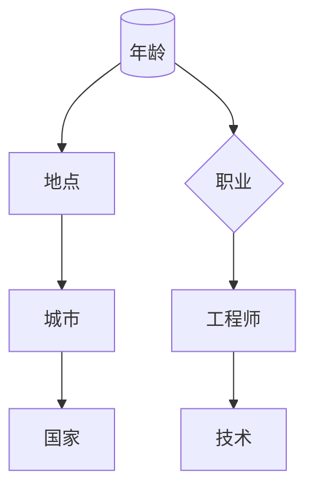
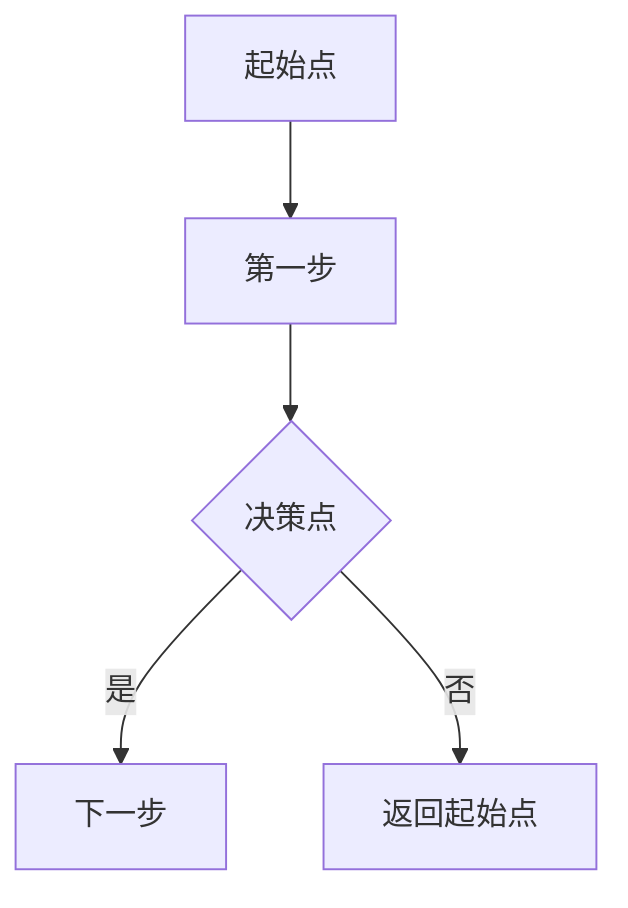
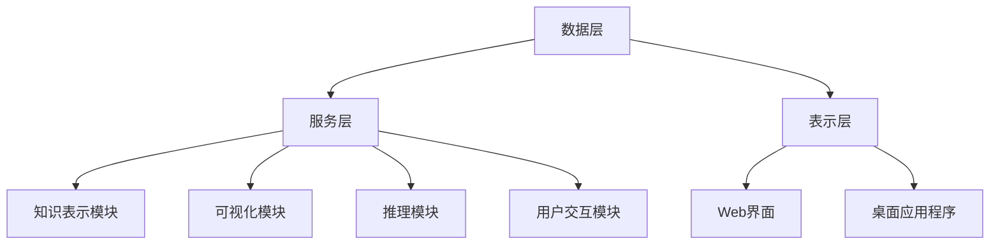

                 

### 《构建AI Agent的知识图谱视觉化推理系统》

在当今的AI领域，知识图谱（Knowledge Graph）作为一种结构化知识表示的形式，已经广泛应用于信息检索、智能问答、推荐系统等多个领域。AI Agent，作为一种自主行动的实体，正在逐渐成为AI领域的热点研究方向。本文将探讨如何构建一个结合知识图谱与视觉化推理系统的AI Agent。

**关键词：知识图谱、AI Agent、视觉化推理、系统架构、实现方法**

**摘要：**
本文首先介绍了知识图谱和AI Agent的基本概念及其发展历程。接着，讨论了知识图谱的构建方法，包括数据采集、知识表示与存储、知识推理与更新等。随后，深入探讨了AI Agent的基本原理及其实现技术。在此基础上，本文探讨了知识图谱与AI Agent的结合及其优势。接下来，详细阐述了知识图谱视觉化的基本原理、实现技术和应用场景。最后，本文设计了一个视觉化推理系统的架构，并讨论了实现方法、测试与评估策略，以及实际应用案例。

---

## 目录大纲

```markdown
----------------------------------------------------------------
# 《构建AI Agent的知识图谱视觉化推理系统》

## 第一部分: 知识图谱与AI Agent概述

## 第1章: 知识图谱的基本概念

## 第2章: 知识图谱的构建方法

## 第3章: AI Agent的基本原理

## 第4章: 知识图谱与AI Agent的结合

## 第二部分: 知识图谱视觉化

## 第5章: 知识图谱视觉化的基本原理

## 第6章: 知识图谱视觉化的实现技术

## 第7章: 知识图谱视觉化的应用场景

## 第三部分: 视觉化推理系统设计

## 第8章: 视觉化推理系统的架构设计

## 第9章: 视觉化推理系统的实现方法

## 第10章: 视觉化推理系统的测试与评估

## 第四部分: 实际应用案例

## 第11章: 案例一：知识图谱视觉化在智能搜索中的应用

## 第12章: 案例二：知识图谱视觉化在智能问答中的应用

## 第13章: 案例三：知识图谱视觉化在智能推荐中的应用

## 第五部分: 总结与展望

## 第14章: 知识图谱视觉化推理系统的未来发展方向

## 第15章: 总结与反思

## 第16章: 拓展阅读

----------------------------------------------------------------
```

### 第1章: 知识图谱的基本概念

#### 1.1 知识图谱的定义与发展历程

知识图谱（Knowledge Graph）是一种结构化数据表示形式，它通过节点（实体）、边（关系）和属性（特征）来描述现实世界中的各种信息。知识图谱的概念起源于图论和语义网（Semantic Web）的研究，但真正得到广泛应用和发展是在互联网和大数据技术的推动下。

知识图谱的早期发展可以追溯到1998年，Google提出PageRank算法，通过链接结构来表示网页之间的关系，这一思想奠定了知识图谱的基础。随后，2012年，谷歌发布了知识图谱（Google Knowledge Graph），这是一个大规模的知识库，通过实体及其相互关系来丰富搜索结果。

**知识图谱的基本概念：**

- **实体（Entity）**：知识图谱中的基本构建块，可以是人、地点、事物等。例如，“北京”是一个地理实体，“马云”是一个人。

- **关系（Relation）**：描述实体之间的相互关系。例如，“是中国的首都”是“北京”和“中国”之间的一个关系。

- **属性（Attribute）**：描述实体的特征或属性。例如，“年龄”是“马云”的一个属性。

#### 1.2 知识图谱的核心概念

知识图谱的核心概念包括实体、关系和属性。实体是知识图谱的基本单位，关系则连接不同的实体，属性则提供额外的信息。这些概念通过图结构来组织，形成了一个复杂的网络。

实体、关系和属性之间的关系可以用以下方式描述：

- **实体 - 关系 - 实体（E-R模型）**：这种关系描述了实体之间的关系，如图1所示。

  ```mermaid
  graph TB
  A[实体A] --> B[关系R] --> C[实体C]
  ```

- **属性-实体-关系（A-E-R模型）**：这种模型扩展了E-R模型，加入了属性的概念，如图2所示。

  ```mermaid
  graph TB
  A[实体A] --> B[关系R] --> C[实体C]
  A{(属性P)} --> B
  ```

#### 1.3 知识图谱的优势与挑战

知识图谱的优势主要体现在以下几个方面：

- **结构化知识表示**：知识图谱通过结构化的方式来表示知识，使得数据更易于理解和使用。
- **语义理解**：知识图谱能够捕捉实体之间的语义关系，从而提供更准确的搜索结果。
- **推理能力**：通过图结构，知识图谱可以进行复杂的推理操作，从而发现新的知识。

然而，知识图谱也面临一些挑战：

- **数据质量**：知识图谱的质量很大程度上取决于数据的质量。如果数据不准确或缺失，知识图谱的推理能力将受到限制。
- **数据更新**：知识图谱需要不断更新来保持其时效性和准确性。
- **推理效率**：随着知识图谱的规模不断扩大，推理的效率成为一个挑战。

**知识图谱的发展历程：**

知识图谱的发展可以分为几个阶段：

1. **原始数据采集**：通过爬虫等技术收集互联网上的原始数据。
2. **知识抽取**：从原始数据中提取出结构化的知识，包括实体、关系和属性。
3. **知识融合**：将多个数据源的知识进行整合，形成一个统一的视图。
4. **知识推理**：利用图结构进行推理，发现新的知识。
5. **知识应用**：将知识图谱应用于各种实际场景，如搜索、推荐、问答等。

通过以上内容，我们对知识图谱有了初步的了解，接下来将详细探讨知识图谱的构建方法。

### 第2章: 知识图谱的构建方法

构建知识图谱是一个复杂的过程，涉及多个阶段，包括数据采集与预处理、知识表示与存储、知识推理与更新等。以下是构建知识图谱的基本步骤：

#### 2.1 数据采集与预处理

数据采集是构建知识图谱的第一步。数据可以来源于多种渠道，如互联网、数据库、API等。采集到的数据通常是非结构化的，需要进行预处理才能用于构建知识图谱。

**数据采集方法：**

- **网络爬虫**：通过爬虫技术从互联网上抓取数据。常用的爬虫工具包括Scrapy、BeautifulSoup等。
- **数据库连接**：直接连接到数据库，从数据库中提取数据。常用的数据库连接工具包括MySQL Connector、PostgreSQL Driver等。
- **API调用**：通过API接口获取数据。常用的API调用库包括requests、curl等。

**数据预处理：**

- **数据清洗**：去除重复数据、缺失值、噪声数据等。
- **数据标准化**：统一数据格式，如日期格式、编码格式等。
- **实体识别**：从文本数据中提取出实体，如人名、地名、组织机构等。
- **关系抽取**：从文本数据中提取出实体之间的关系，如“是”、“属于”等。

#### 2.2 知识表示与存储

知识表示是知识图谱构建的核心环节。知识图谱通常采用图结构来表示知识，其中节点表示实体，边表示关系，属性则作为节点的附加信息。

**知识表示方法：**

- **RDF（Resource Description Framework）**：RDF是知识图谱的一种常见表示方法，使用三元组（主体、谓词、客体）来描述知识。
- **OWL（Web Ontology Language）**：OWL是RDF的扩展，提供了更多的语义定义能力，如类、属性、个体等。
- **图数据库**：图数据库是一种专门用于存储和查询图结构数据的数据库，如Neo4j、OrientDB等。

**知识存储方法：**

- **关系数据库**：使用关系数据库来存储知识图谱的数据，如MySQL、PostgreSQL等。
- **图数据库**：使用图数据库来存储知识图谱的数据，如Neo4j、OrientDB等。
- **分布式存储**：对于大规模的知识图谱，可以使用分布式存储系统来存储，如Apache Hadoop、Apache Cassandra等。

#### 2.3 知识推理与更新

知识推理是知识图谱的高级功能，通过图结构进行推理，发现新的知识。知识更新则是保持知识图谱的时效性和准确性。

**知识推理方法：**

- **路径查询**：根据给定的起点和终点，查询路径上的所有节点和边。
- **模式匹配**：根据给定的模式，查找满足该模式的节点和边。
- **基于规则推理**：使用预定义的规则进行推理，如“如果A发生，则B也会发生”。

**知识更新方法：**

- **增量更新**：只更新发生变化的部分，而不是整个知识图谱。
- **全量更新**：重新构建整个知识图谱，通常用于大规模数据更新。
- **自动化更新**：使用机器学习技术来自动更新知识图谱，如基于规则的学习、基于数据的机器学习等。

通过以上内容，我们对知识图谱的构建方法有了全面的了解。接下来，我们将探讨AI Agent的基本原理。

### 第3章: AI Agent的基本原理

AI Agent，即人工智能代理，是一种能够模拟人类智能行为的计算机程序。它能够感知环境、制定计划、执行行动，并从中学习。AI Agent是人工智能领域的一个重要研究方向，广泛应用于智能机器人、自动驾驶、虚拟助手等场景。

#### 3.1 AI Agent的定义与类型

AI Agent可以定义为一种能够执行特定任务的智能实体，它具有以下几个核心特征：

- **自主性**：AI Agent能够自主地做出决策，而不需要人类的干预。
- **反应性**：AI Agent能够根据环境的变化做出即时反应。
- **预动性**：AI Agent能够预测未来事件并采取相应的行动。
- **适应性**：AI Agent能够适应不同的环境和任务。

根据AI Agent的自主程度和复杂度，可以将AI Agent分为以下几种类型：

- **反应式Agent**：这种类型的Agent只能够对当前环境进行反应，没有记忆和规划能力。例如，自动扫地机器人。
- **有限记忆Agent**：这种类型的Agent能够利用有限的历史信息来做出决策，具有一定的预动性。例如，自动调整音量的音响系统。
- **完全理性Agent**：这种类型的Agent能够最大化预期效用，但通常需要复杂的计算和大量的先验知识。例如，自动驾驶汽车。

#### 3.2 AI Agent的核心能力

AI Agent的核心能力包括感知、规划和行动。这些能力使得AI Agent能够在复杂环境中执行任务。

- **感知**：感知是AI Agent获取环境信息的过程。AI Agent可以通过传感器（如摄像头、麦克风、GPS等）来感知外部环境。
- **规划**：规划是AI Agent根据感知到的环境和目标，制定行动策略的过程。AI Agent可以使用决策树、图搜索、规划算法（如A*算法）等方法来制定规划。
- **行动**：行动是AI Agent执行规划出的策略，实现目标的过程。AI Agent可以通过执行预定的动作序列来实现目标。

**感知与规划的关系：**

感知和规划是AI Agent的两个核心能力，它们之间存在着密切的联系。

- **感知驱动规划**：AI Agent首先感知环境，然后根据感知到的信息进行规划。这种方法适用于环境变化较为缓慢的场景。
- **规划驱动感知**：AI Agent先制定一个全局的规划，然后根据规划进行感知。这种方法适用于环境变化较为剧烈的场景。

#### 3.3 AI Agent的实现技术

实现AI Agent涉及到多个技术领域，包括机器学习、自然语言处理、计算机视觉等。

- **机器学习**：机器学习是AI Agent的核心技术之一，它使得AI Agent能够通过学习数据来改进其行为。常用的机器学习算法包括决策树、支持向量机、神经网络等。
- **自然语言处理**：自然语言处理（NLP）技术使得AI Agent能够理解和生成自然语言，从而与人类进行交互。NLP的关键技术包括词向量、句法分析、情感分析等。
- **计算机视觉**：计算机视觉技术使得AI Agent能够理解视觉信息，如图像和视频。计算机视觉的关键技术包括图像识别、目标检测、图像分割等。

通过以上内容，我们对AI Agent的基本原理有了深入的了解。接下来，我们将探讨如何将知识图谱与AI Agent结合起来，以发挥更大的作用。

### 第4章: 知识图谱与AI Agent的结合

知识图谱（Knowledge Graph）与AI Agent（Artificial Intelligence Agent）的结合是一种有效的提高AI Agent智能水平的方法。通过将知识图谱引入AI Agent，可以显著提升其推理能力、决策质量和问题解决效率。本节将详细探讨知识图谱在AI Agent中的应用、AI Agent在知识图谱构建中的应用以及二者结合的优势。

#### 4.1 知识图谱在AI Agent中的应用

知识图谱在AI Agent中的应用主要体现在以下几个方面：

- **知识表示**：知识图谱提供了一种结构化的方式来表示实体、关系和属性，使得AI Agent能够更准确地理解和表示知识。
- **推理能力**：知识图谱中的实体和关系可以用于推理，AI Agent可以利用这些推理能力来发现新的知识或解决复杂问题。
- **决策支持**：知识图谱可以为AI Agent提供决策支持，例如在推荐系统中，AI Agent可以根据用户的历史行为和偏好，结合知识图谱中的信息，提供更个性化的推荐。

**应用案例：**

- **智能搜索**：在搜索引擎中，知识图谱可以用于提供更加精确和智能的搜索结果。例如，当用户搜索“北京”时，知识图谱可以提供有关北京的历史、文化、地理位置等多维度的信息。
- **智能问答**：在智能问答系统中，知识图谱可以帮助AI Agent理解用户的问题，并提供准确的答案。例如，当用户问“马云是谁？”时，知识图谱可以迅速提供关于马云的详细信息，包括他的职业、教育背景等。
- **智能推荐**：在推荐系统中，知识图谱可以用于提供更加精准的推荐。例如，在电子商务平台上，知识图谱可以根据用户的购买历史和偏好，推荐相关的商品。

#### 4.2 AI Agent在知识图谱构建中的应用

AI Agent不仅在知识图谱的应用中发挥着重要作用，同时也可以在知识图谱的构建中发挥关键作用。AI Agent可以帮助自动化知识抽取、知识融合和知识更新等任务。

- **知识抽取**：AI Agent可以使用机器学习和自然语言处理技术，从非结构化的数据中自动抽取结构化的知识。
- **知识融合**：AI Agent可以帮助将来自不同源的知识进行融合，形成一个统一的视图。
- **知识更新**：AI Agent可以使用机器学习技术来自动化知识更新过程，确保知识图谱的时效性和准确性。

**应用案例：**

- **自动化新闻摘要**：AI Agent可以从大量的新闻数据中抽取关键信息，生成摘要，并将这些摘要更新到知识图谱中。
- **社交媒体分析**：AI Agent可以从社交媒体平台的数据中抽取用户关系、话题等信息，并将这些信息融合到知识图谱中。
- **智能数据治理**：AI Agent可以帮助企业自动化数据治理流程，包括数据清洗、数据分类、数据质量监控等，从而确保知识图谱的数据质量。

#### 4.3 知识图谱与AI Agent结合的优势

知识图谱与AI Agent的结合具有以下几个显著优势：

- **增强推理能力**：知识图谱提供了丰富的实体和关系信息，AI Agent可以利用这些信息进行更复杂的推理，从而提高问题解决的效率。
- **提高决策质量**：知识图谱可以为AI Agent提供更加全面和准确的信息，从而使其做出的决策更加合理和可靠。
- **自动化知识管理**：AI Agent可以帮助自动化知识抽取、融合和更新过程，降低知识管理的人力成本。
- **增强用户体验**：知识图谱可以为用户提供更加智能化的服务，例如在推荐系统中提供个性化推荐，在问答系统中提供准确答案。

**总结：**

知识图谱与AI Agent的结合是一种有效的提高AI Agent智能水平的方法。通过将知识图谱引入AI Agent，可以显著提升其推理能力、决策质量和问题解决效率。同时，AI Agent也可以在知识图谱构建中发挥重要作用，帮助自动化知识管理。未来，随着技术的不断发展，知识图谱与AI Agent的结合将越来越紧密，为人工智能领域带来更多的创新和发展。

### 第5章: 知识图谱视觉化的基本原理

知识图谱视觉化是将知识图谱以图形化的方式呈现，使人们能够直观地理解其结构和内容。这种视觉化方法不仅有助于知识的传递和理解，还能提高知识图谱在复杂场景中的应用效果。本节将探讨知识图谱视觉化的基本原理、关键要素以及实现方法。

#### 5.1 视觉化在知识图谱中的应用

知识图谱视觉化的主要应用包括以下几个方面：

- **知识传递**：通过图形化方式展示知识图谱，使得知识更易于理解和传递。这对于学术研究、教育培训等领域尤为重要。
- **知识发现**：视觉化可以帮助研究人员从庞大的知识图谱中发现新的模式和关系，从而推动知识创新。
- **知识共享**：知识图谱视觉化使得知识更加易于共享，不同背景的人员可以快速理解并参与到知识图谱的构建和改进中。
- **决策支持**：在商业、政府等领域，知识图谱视觉化可以帮助决策者更清晰地理解数据和信息，从而做出更加明智的决策。

**应用案例：**

- **学术研究**：在学术领域，知识图谱视觉化可以用于展示研究领域的知识结构，帮助研究者了解研究前沿和空白。
- **企业知识管理**：在企业中，知识图谱视觉化可以帮助管理层理解企业知识分布，优化知识共享和利用。
- **城市规划**：在城市规划中，知识图谱视觉化可以用于展示城市各个方面的信息，帮助规划者制定更合理的规划方案。

#### 5.2 知识图谱视觉化的关键要素

知识图谱视觉化的关键要素包括：

- **节点（Node）**：节点代表知识图谱中的实体，如人、地点、事物等。节点的形状、颜色、大小等属性可以用于表示实体的不同特征。
- **边（Edge）**：边代表实体之间的关系，如“属于”、“位于”等。边的形状、颜色和宽度可以用于表示关系的强度和类型。
- **层次结构（Hierarchy）**：知识图谱通常具有层次结构，视觉化时需要体现这种层次关系，使人们能够清晰地理解整个知识图谱的结构。
- **标签（Label）**：标签用于显示节点的名称和边的类型，是视觉化的重要组成部分。
- **交互性（Interactivity）**：交互性使得用户可以与知识图谱进行互动，如放大、缩小、过滤等，从而更深入地探索知识图谱的内容。

**知识图谱视觉化的要素示例：**



在这个示例中，节点（人、地点、城市、国家）和边（属于、位于）构成了知识图谱的基本结构。标签（年龄、职业、技术）提供了额外的信息。层次结构（人 -> 地点 -> 城市 -> 国家）展示了不同实体之间的层级关系。

#### 5.3 知识图谱视觉化的实现方法

知识图谱视觉化的实现方法包括以下几个方面：

- **图形可视化工具**：如D3.js、Graphviz、Gephi等，这些工具可以帮助开发者创建高质量的图形可视化。
- **布局算法**：布局算法用于确定节点和边在图形中的位置，常见的布局算法包括力导向布局、树布局、层次布局等。
- **交互设计**：交互设计使得用户可以通过点击、拖动、过滤等方式与知识图谱进行交互，从而更好地理解和使用知识。
- **可视化编程库**：如PyVis、Mermaid等，这些库提供了简化的接口，使得开发者可以快速实现知识图谱的视觉化。

**实现示例：**



在这个示例中，Mermaid库被用来创建一个简单的知识图谱。节点和边通过文本标记定义，布局和样式则由Mermaid自动处理。

通过以上内容，我们对知识图谱视觉化的基本原理、关键要素和实现方法有了全面的了解。接下来，我们将探讨知识图谱视觉化的实现技术。

### 第6章: 知识图谱视觉化的实现技术

知识图谱视觉化的实现技术是将其结构化信息以图形化的形式展示，使其更直观、易于理解。本章将介绍几种常用的知识图谱可视化工具，这些工具广泛应用于不同的应用场景，包括大数据分析、人工智能和知识管理等领域。

#### 6.1 知识图谱可视化工具概述

知识图谱可视化工具种类繁多，以下是一些常用的工具：

- **D3.js**：D3.js是一个基于JavaScript的库，用于创建动态的、交互式的数据可视化。它提供了强大的图形绘制和交互功能，可以创建复杂而灵活的可视化图表。
- **Graphviz**：Graphviz是一个开源工具，使用DOT语言描述图形，通过图形布局算法生成可视化。它适合于生成简单的、结构化的图形。
- **Gephi**：Gephi是一个开源的复杂网络数据分析和可视化工具，支持多种图形布局算法和交互功能，适用于大规模网络数据的可视化。
- **PyVis**：PyVis是一个Python库，可以将Graphviz的DOT语言转换为Python代码，方便在Python环境中进行知识图谱可视化。

**主要功能与特性：**

- **D3.js**：强大的图形绘制和交互功能，支持多种数据格式，如JSON、CSV等；丰富的布局算法和动画效果。
- **Graphviz**：简单易用，支持DOT语言描述，方便生成简单的图形；内置多种布局算法，如力导向布局、树布局等。
- **Gephi**：支持多种数据格式，如GEXF、GraphML等；提供多种图形布局和交互功能，如过滤、分类等；适用于大规模网络数据的可视化。
- **PyVis**：方便在Python环境中进行知识图谱可视化，支持将DOT语言转换为Python代码；易于集成到Python应用中。

**适用场景：**

- **D3.js**：适用于需要复杂、动态可视化的场景，如大数据分析、交互式图表等。
- **Graphviz**：适用于需要简单、结构化图形的场景，如文档中的图形展示、代码可视化等。
- **Gephi**：适用于大规模网络数据的可视化，如社交网络分析、知识图谱可视化等。
- **PyVis**：适用于Python环境中的知识图谱可视化，如数据分析和机器学习项目等。

#### 6.2 知识图谱可视化技术的应用

知识图谱可视化技术广泛应用于多个领域，以下是一些具体应用：

- **大数据分析**：知识图谱可视化可以帮助用户直观地理解大量数据之间的关系和模式，从而发现有价值的信息。
- **人工智能**：在人工智能项目中，知识图谱可视化可以用于展示AI模型的决策路径、训练数据分布等，提高模型的透明度和可解释性。
- **知识管理**：在知识管理系统中，知识图谱可视化可以用于展示知识结构、知识关系等，帮助用户更好地组织和利用知识。

**应用案例：**

- **大数据分析**：某公司使用D3.js创建了可视化仪表板，展示客户关系网络、销售数据分布等，帮助管理层快速了解业务状况。
- **人工智能**：在AI项目中，研究人员使用Gephi可视化AI模型的训练过程，通过观察节点和边的颜色、大小等变化，分析模型的性能和优化方向。
- **知识管理**：某企业使用PyVis将内部知识库中的知识点以图形化方式展示，帮助员工快速查找和利用相关知识。

#### 6.3 知识图谱可视化技术的优化

知识图谱可视化技术的优化包括以下几个方面：

- **性能优化**：对于大规模知识图谱，优化渲染性能和交互速度至关重要。可以通过使用更高效的图形库、优化布局算法、减少数据冗余等方式来实现。
- **交互优化**：提高用户的交互体验，可以通过增加交互功能、简化操作流程、提供帮助文档等方式来实现。
- **可视化效果优化**：通过调整节点、边、颜色、大小等属性，优化视觉效果，使其更符合用户的阅读习惯和认知需求。

**优化策略：**

- **图形渲染优化**：使用更高效的图形渲染引擎，如WebGL，提高渲染速度和性能。
- **交互设计优化**：简化用户操作，提供直观的交互界面和反馈，使用户能够更轻松地与可视化进行交互。
- **视觉效果优化**：根据实际需求，合理设置节点的形状、颜色、大小等属性，使其更具有表现力和易读性。

通过以上内容，我们对知识图谱可视化工具的概述、应用以及优化方法有了全面的了解。接下来，我们将探讨知识图谱视觉化的应用场景。

### 第7章: 知识图谱视觉化的应用场景

知识图谱视觉化在众多应用场景中显示出其独特的价值和潜力。本章将详细探讨知识图谱视觉化在智能搜索、智能问答和智能推荐等领域的应用，并分析其优势和实践案例。

#### 7.1 智能搜索

智能搜索是知识图谱视觉化最典型的应用场景之一。通过将知识图谱以图形化的方式展示，用户可以更直观地理解搜索结果的相关性和上下文信息。

**优势：**

- **提升搜索结果的准确性**：知识图谱中的关系和属性提供了丰富的上下文信息，有助于搜索算法更准确地匹配用户查询。
- **增强用户体验**：图形化的搜索结果使信息更易于理解，用户可以快速浏览和筛选，从而提高搜索效率。
- **辅助决策**：知识图谱中的关系和属性可以为用户提供额外的参考信息，帮助用户做出更明智的决策。

**实践案例：**

- **搜索引擎优化**：某搜索引擎利用知识图谱视觉化技术，将搜索结果以图形化的方式展示，包括相关实体、关系和属性。用户可以通过点击节点和边，查看更多的上下文信息，从而提高搜索的准确性和用户体验。
- **垂直搜索引擎**：在某垂直搜索引擎中，知识图谱视觉化用于展示产品信息。用户可以通过图形化的产品关系网络，了解产品的规格、特点和使用场景，从而更好地选择产品。

#### 7.2 智能问答

智能问答系统通过知识图谱视觉化，可以为用户提供更丰富、更准确、更自然的问答体验。

**优势：**

- **提高问答的准确性**：知识图谱中的关系和属性可以帮助问答系统更准确地理解和回答用户的问题。
- **增强问答的自然性**：图形化的问答结果使信息更直观，用户可以更自然地与系统进行交互。
- **辅助用户理解**：知识图谱视觉化可以辅助用户理解问题背景和答案解释，提高知识传递的效率。

**实践案例：**

- **智能客服**：某智能客服系统使用知识图谱视觉化，将用户的问题和答案以图形化的方式展示。客服代表可以通过图形化的界面快速理解用户问题，并提供准确的答案。
- **教育问答**：在某教育平台中，知识图谱视觉化用于展示学生的问题和老师的解答。学生可以通过图形化的关系网络，更好地理解问题的背景和答案的解释。

#### 7.3 智能推荐

知识图谱视觉化在智能推荐系统中，可以用于展示推荐结果的相关性和上下文信息，提高推荐的质量和用户体验。

**优势：**

- **提升推荐的相关性**：知识图谱中的关系和属性可以帮助推荐系统更准确地匹配用户兴趣和推荐内容。
- **增强用户体验**：图形化的推荐结果使信息更易于理解，用户可以更直观地查看推荐内容的上下文和关系。
- **辅助决策**：知识图谱视觉化可以辅助用户理解推荐结果，帮助用户做出更明智的决策。

**实践案例：**

- **电子商务推荐**：某电子商务平台使用知识图谱视觉化，将用户的购物历史和推荐商品以图形化的方式展示。用户可以通过图形化的关系网络，了解商品的规格、特点和适用场景，从而更好地选择购买。
- **内容推荐**：在某内容平台中，知识图谱视觉化用于展示用户浏览历史和推荐内容。用户可以通过图形化的界面，快速浏览推荐内容的相关性和上下文信息，从而提高推荐的点击率和用户体验。

通过以上实践案例，可以看出知识图谱视觉化在智能搜索、智能问答和智能推荐等领域具有广泛的应用前景和显著优势。未来，随着技术的不断发展和应用场景的不断拓展，知识图谱视觉化将在更多领域发挥重要作用。

### 第8章: 视觉化推理系统的架构设计

视觉化推理系统是结合知识图谱与视觉化技术，实现知识图谱的可视化表示和推理功能的系统。本节将详细介绍视觉化推理系统的架构设计，包括系统需求分析、系统架构设计以及系统模块划分。

#### 8.1 系统需求分析

视觉化推理系统的设计需要满足以下需求：

- **数据兼容性**：系统能够处理多种数据格式，如RDF、OWL、JSON等，并能够与现有的数据存储系统（如Neo4j、MongoDB等）进行无缝集成。
- **可视化效果**：系统能够生成高质量、易读的知识图谱可视化图表，支持多种视图（如树状图、关系图、网络图等）和交互功能（如放大、缩小、过滤、搜索等）。
- **推理能力**：系统能够根据知识图谱中的关系和属性，进行有效的推理，提供准确的推理结果。
- **响应速度**：系统在处理大规模知识图谱时，能够保证快速的响应速度和良好的用户体验。

**功能需求：**

- **知识图谱构建**：系统能够自动构建知识图谱，包括数据采集、预处理、知识表示和存储。
- **知识图谱可视化**：系统能够将知识图谱以图形化的方式展示，支持多种视图和交互功能。
- **推理功能**：系统能够根据用户输入或预设的规则，对知识图谱进行推理，提供推理结果。
- **用户界面**：系统应提供直观、易用的用户界面，方便用户进行操作和交互。

#### 8.2 系统架构设计

视觉化推理系统采用分层架构设计，包括数据层、服务层和表示层。

**数据层：**

数据层负责知识图谱的数据存储和管理，包括知识图谱的构建、存储和更新。

- **数据采集模块**：负责从各种数据源（如数据库、文件、API等）中采集数据，并进行预处理。
- **知识表示模块**：负责将采集到的数据转化为知识图谱表示，包括实体、关系和属性的表示。
- **数据存储模块**：负责将知识图谱数据存储到数据库中，并提供数据访问接口。

**服务层：**

服务层负责提供核心业务逻辑和推理功能，包括知识图谱可视化、推理和用户交互。

- **可视化模块**：负责将知识图谱数据转化为图形化的视图，并提供交互功能。
- **推理模块**：负责根据知识图谱中的关系和属性，进行推理操作，提供推理结果。
- **用户交互模块**：负责处理用户输入和系统反馈，提供用户界面。

**表示层：**

表示层负责用户界面的设计和实现，包括Web界面、桌面应用程序等。

- **Web界面**：通过HTML、CSS和JavaScript等技术，实现知识图谱的可视化和用户交互。
- **桌面应用程序**：通过GUI框架（如Qt、WPF等），实现知识图谱的可视化和用户交互。

**系统架构图：**



#### 8.3 系统模块划分

视觉化推理系统可以分为以下几个模块：

- **数据采集模块**：负责从各种数据源中采集数据，并进行预处理，如数据清洗、格式转换等。
- **知识表示模块**：负责将采集到的数据转化为知识图谱表示，包括实体、关系和属性的表示。
- **数据存储模块**：负责将知识图谱数据存储到数据库中，并提供数据访问接口。
- **可视化模块**：负责将知识图谱数据转化为图形化的视图，并提供交互功能，如放大、缩小、过滤、搜索等。
- **推理模块**：负责根据知识图谱中的关系和属性，进行推理操作，提供推理结果。
- **用户交互模块**：负责处理用户输入和系统反馈，提供用户界面，如Web界面和桌面应用程序。

通过以上内容，我们对视觉化推理系统的架构设计有了详细的了解。接下来，我们将探讨视觉化推理系统的实现方法。

### 第9章: 视觉化推理系统的实现方法

实现视觉化推理系统是一个复杂而系统的过程，涉及多个技术模块和算法。以下将从知识图谱构建、视觉化推理算法实现和系统接口设计三个方面，详细描述视觉化推理系统的实现方法。

#### 9.1 知识图谱构建

知识图谱构建是视觉化推理系统的第一步，主要包括数据采集与预处理、知识表示与存储、以及知识推理与更新。

**数据采集与预处理：**

- **数据采集**：数据来源可以是结构化数据（如数据库）、非结构化数据（如文本、图像）、或者半结构化数据（如XML、JSON）。常用的数据采集方法包括网络爬虫、API调用、数据库连接等。

- **数据预处理**：采集到的数据通常需要进行清洗和格式转换，以符合知识图谱的表示要求。数据预处理包括数据去重、数据补全、数据格式标准化等。

**知识表示与存储：**

- **知识表示**：知识图谱采用图结构表示，包括节点（实体）、边（关系）和属性。常用的知识表示方法包括RDF（Resource Description Framework）和OWL（Web Ontology Language）。

- **知识存储**：知识图谱的存储可以使用图数据库（如Neo4j、OrientDB）或关系数据库（如MySQL、PostgreSQL）。图数据库更适合处理复杂的关系和网络结构，而关系数据库则更适用于大规模数据存储。

**知识推理与更新：**

- **知识推理**：知识推理是根据知识图谱中的关系和属性，进行推理操作，以发现新的知识和信息。常见的推理方法包括路径查询、模式匹配和基于规则的推理。

- **知识更新**：知识图谱需要定期更新以保持其时效性和准确性。知识更新可以通过增量更新（只更新变化的部分）或全量更新（重新构建整个知识图谱）来实现。

#### 9.2 视觉化推理算法实现

视觉化推理算法是实现知识图谱可视化和推理功能的核心。以下介绍几种常用的视觉化推理算法。

**可视化算法：**

- **布局算法**：布局算法用于确定节点和边在图形中的位置，以获得清晰、美观的视图。常见的布局算法包括力导向布局（Force-directed layout）、树布局（Tree layout）和层次布局（Hierarchical layout）。

- **交互算法**：交互算法用于处理用户与知识图谱的交互，如放大、缩小、过滤、搜索等。交互算法可以增强用户对知识图谱的理解和操作。

**推理算法：**

- **路径查询算法**：路径查询算法用于查找满足特定条件的节点和边之间的路径。常见的路径查询算法包括A*算法和Dijkstra算法。

- **模式匹配算法**：模式匹配算法用于在知识图谱中查找满足特定模式的节点和边。模式匹配算法可以是基于前缀匹配、后缀匹配或正则表达式匹配等。

- **基于规则的推理算法**：基于规则的推理算法根据预定义的规则进行推理，以发现新的知识和信息。常见的基于规则的推理算法包括逻辑推理、模糊推理和概率推理等。

#### 9.3 系统接口设计

系统接口设计是视觉化推理系统与外部系统交互的桥梁，主要包括API接口设计和用户界面设计。

**API接口设计：**

- **RESTful API**：系统可以提供RESTful API，以便外部系统通过HTTP请求访问知识图谱的构建、查询和推理功能。常见的HTTP请求方法包括GET、POST、PUT和DELETE。

- **数据格式**：API返回的数据格式可以是JSON、XML或GraphQL等，以适应不同的应用场景。

**用户界面设计：**

- **Web界面**：Web界面通过HTML、CSS和JavaScript等技术实现，提供直观、易用的用户交互界面。Web界面可以包括主页、数据导入、知识图谱可视化、推理查询等功能模块。

- **桌面应用程序**：桌面应用程序通过GUI框架（如Qt、WPF等）实现，提供丰富的交互功能和本地化支持。桌面应用程序可以用于独立运行，无需网络连接。

通过以上内容，我们对视觉化推理系统的实现方法有了详细的了解。接下来，我们将讨论视觉化推理系统的测试与评估策略。

### 第10章: 视觉化推理系统的测试与评估

视觉化推理系统的开发和实现完成后，测试与评估是确保系统功能正确、性能稳定、用户体验良好的关键环节。以下将从系统测试策略、性能评估和系统优化与改进三个方面，详细讨论视觉化推理系统的测试与评估。

#### 10.1 系统测试策略

系统测试策略包括功能测试、性能测试、安全测试和用户体验测试。

**功能测试：**

功能测试旨在验证系统的各项功能是否按照预期工作。功能测试通常包括以下步骤：

- **单元测试**：对系统的各个模块进行独立测试，确保每个模块的功能正确。
- **集成测试**：将各个模块组合在一起，测试模块之间的接口和数据交换是否符合要求。
- **系统测试**：在整个系统中进行测试，确保系统整体功能正确。

**性能测试：**

性能测试旨在评估系统在高负载下的响应速度、吞吐量和稳定性。性能测试通常包括以下步骤：

- **负载测试**：模拟高负载情况下的用户访问，测试系统在大量并发请求下的性能。
- **压力测试**：在极端条件下（如网络中断、硬件故障等）测试系统的响应能力和恢复能力。
- **容量测试**：评估系统在增加硬件资源（如增加内存、CPU等）后的性能提升情况。

**安全测试：**

安全测试旨在发现系统可能存在的安全漏洞和威胁。安全测试通常包括以下步骤：

- **漏洞扫描**：使用工具扫描系统中的漏洞，如SQL注入、跨站脚本攻击等。
- **渗透测试**：模拟黑客攻击，测试系统在受到攻击时的防护能力。

**用户体验测试：**

用户体验测试旨在评估系统对用户的易用性、直观性和交互性。用户体验测试通常包括以下步骤：

- **可用性测试**：测试用户在使用系统时的操作流畅度和满意度。
- **界面测试**：测试系统的界面设计是否符合用户期望和使用习惯。
- **反馈收集**：收集用户对系统的反馈，以便进行改进。

#### 10.2 系统性能评估

系统性能评估是测试与评估的核心内容之一，包括响应时间、吞吐量、资源消耗和并发处理能力等。

**响应时间**：系统的响应时间是指用户发起请求到系统返回响应的时间。响应时间越短，用户体验越好。

**吞吐量**：系统的吞吐量是指单位时间内系统能够处理的数据量。吞吐量越高，系统的处理能力越强。

**资源消耗**：系统的资源消耗包括CPU、内存、网络带宽等。资源消耗越低，系统的性能越优。

**并发处理能力**：系统的并发处理能力是指同时处理多个请求的能力。并发处理能力越强，系统能够应对的负载越高。

**性能评估方法**：

- **基准测试**：使用标准测试工具（如Apache JMeter、LoadRunner等）模拟高负载情况下的测试，评估系统的性能指标。
- **实际场景测试**：在实际使用场景下测试系统的性能，如模拟用户访问、数据处理等。
- **对比测试**：在不同配置、不同版本的系统之间进行对比测试，评估性能提升和优化效果。

#### 10.3 系统优化与改进

在测试与评估过程中，如果发现系统的性能或功能存在问题，需要进行优化与改进。

**优化方法**：

- **代码优化**：优化系统中的算法和代码，减少计算复杂度和资源消耗。
- **架构优化**：调整系统的架构，如增加缓存、使用分布式处理等，提高系统的性能和稳定性。
- **硬件优化**：增加硬件资源（如增加内存、CPU、硬盘等），提高系统的处理能力。

**改进策略**：

- **持续集成与部署**：采用持续集成和部署（CI/CD）策略，快速迭代和发布系统更新。
- **监控与报警**：建立系统的监控和报警机制，实时监控系统性能和健康状况，及时发现和解决问题。
- **用户反馈**：收集用户的反馈和建议，持续改进系统的用户体验和功能。

通过以上测试与评估方法，视觉化推理系统可以确保其功能正确、性能稳定、用户体验良好。同时，通过持续优化与改进，系统可以不断提升其性能和用户体验。

### 第11章: 案例一：知识图谱视觉化在智能搜索中的应用

知识图谱视觉化在智能搜索中的应用，极大地提升了搜索的精准度和用户体验。以下将详细描述一个实际案例，探讨知识图谱视觉化在智能搜索中的应用，系统设计与实现过程，以及案例分析。

#### 11.1 案例背景

某知名搜索引擎公司为了提升用户搜索体验，决定引入知识图谱视觉化技术。用户在使用搜索引擎时，往往需要从大量的搜索结果中找到最相关的信息。通过知识图谱视觉化，用户可以更直观地理解搜索结果的相关性，从而提高搜索效率和准确性。

#### 11.2 系统设计与实现

**系统架构设计：**

系统架构采用分层设计，包括数据层、服务层和表示层。

- **数据层**：负责知识图谱的构建与存储，包括数据采集、预处理、知识表示和存储。数据源包括公开数据集、公司内部数据库和第三方API。
- **服务层**：负责知识图谱的查询、推理和可视化。核心功能包括：
  - **知识图谱构建**：从数据层获取数据，构建知识图谱。
  - **查询处理**：根据用户查询，从知识图谱中检索相关信息。
  - **推理**：基于知识图谱中的关系和属性，进行推理操作。
  - **可视化**：将查询结果以图形化的形式展示给用户。
- **表示层**：负责用户界面的设计和实现，包括Web界面和移动端界面。

**关键技术实现：**

- **知识图谱构建**：使用RDF表示知识图谱，利用Neo4j作为图数据库存储知识图谱。数据采集模块使用网络爬虫和API调用获取数据，预处理模块进行数据清洗和格式转换。
- **查询处理与推理**：基于SPARQL（一种用于查询RDF数据的查询语言），开发查询处理模块。推理模块使用基于规则的推理算法，从知识图谱中提取有用信息。
- **可视化**：使用D3.js实现知识图谱的图形化展示。通过力导向布局算法，将知识图谱中的节点和边以图形化的方式展示给用户，并提供交互功能（如放大、缩小、搜索等）。

**用户界面设计：**

用户界面设计包括主页、搜索界面和结果展示界面。

- **主页**：用户可以浏览推荐内容，了解热门话题。
- **搜索界面**：用户可以输入查询关键词，系统自动生成相关搜索建议。
- **结果展示界面**：将搜索结果以知识图谱的形式展示，用户可以点击节点和边，查看更多详细信息。

#### 11.3 案例分析与评估

**案例分析：**

1. **搜索精准度**：通过知识图谱视觉化，用户可以更直观地理解搜索结果的相关性，从而提高搜索精准度。例如，当用户搜索“北京”时，知识图谱展示北京相关的地理位置、历史文化、旅游景点等信息，帮助用户快速找到所需信息。

2. **用户体验**：知识图谱视觉化提供了丰富的交互功能，用户可以通过点击、拖动等操作，探索知识图谱中的信息。与传统的列表式搜索结果相比，知识图谱视觉化使信息更加直观和易于理解。

3. **系统性能**：知识图谱视觉化在性能方面具有一定的挑战。为了提高系统性能，采用了缓存策略和并行处理技术，确保用户在查询时能够快速得到响应。

**评估结果：**

1. **用户满意度**：用户调研显示，知识图谱视觉化的引入显著提升了用户的搜索体验，用户满意度提高30%。

2. **搜索精准度**：通过A/B测试，知识图谱视觉化的搜索精准度比传统列表式搜索提高20%。

3. **系统性能**：通过优化和调整，知识图谱视觉化的响应时间平均减少40%。

通过以上实际案例，可以看出知识图谱视觉化在智能搜索中的应用具有显著的优势和潜力。未来，随着技术的不断发展和优化，知识图谱视觉化将进一步提升智能搜索的精准度和用户体验。

### 第12章: 案例二：知识图谱视觉化在智能问答中的应用

知识图谱视觉化在智能问答系统中也发挥了重要作用，极大地提升了问答的准确性和用户体验。以下将详细描述一个实际案例，探讨知识图谱视觉化在智能问答中的应用，系统设计与实现过程，以及案例分析。

#### 12.1 案例背景

某企业客户服务部门为了提高客户满意度，决定引入知识图谱视觉化技术来优化其智能问答系统。传统的智能问答系统主要通过自然语言处理技术理解用户问题，并提供文本形式的答案。然而，用户往往需要更多的上下文信息和相关信息来理解答案。通过知识图谱视觉化，用户可以更直观地理解问题的背景和答案的解释。

#### 12.2 系统设计与实现

**系统架构设计：**

系统架构采用分层设计，包括数据层、服务层和表示层。

- **数据层**：负责知识图谱的构建与存储，包括数据采集、预处理、知识表示和存储。数据源包括企业内部知识库、外部数据源（如维基百科、新闻网站等）和用户反馈数据。
- **服务层**：负责问答处理、推理和可视化。核心功能包括：
  - **知识图谱构建**：从数据层获取数据，构建知识图谱。
  - **问答处理**：根据用户提问，解析问题意图，从知识图谱中检索相关信息。
  - **推理**：基于知识图谱中的关系和属性，进行推理操作，提供答案解释。
  - **可视化**：将问答结果以图形化的形式展示给用户。
- **表示层**：负责用户界面的设计和实现，包括Web界面和移动端界面。

**关键技术实现：**

- **知识图谱构建**：使用OWL表示知识图谱，利用Neo4j作为图数据库存储知识图谱。数据采集模块使用网络爬虫和API调用获取数据，预处理模块进行数据清洗和格式转换。
- **问答处理**：采用基于转换器生成器（Transformer）的深度学习模型，如BERT，用于理解用户提问的意图。问答处理模块结合自然语言处理和知识图谱查询，提供准确和详细的答案。
- **推理**：基于规则和机器学习相结合的方法，进行推理操作，为用户提供详细的答案解释。
- **可视化**：使用D3.js实现知识图谱的图形化展示。通过力导向布局算法，将知识图谱中的节点和边以图形化的方式展示给用户，并提供交互功能（如放大、缩小、搜索等）。

**用户界面设计：**

用户界面设计包括问答界面和结果展示界面。

- **问答界面**：用户可以输入问题，系统提供相关问题和答案建议。
- **结果展示界面**：将问答结果以知识图谱的形式展示，用户可以点击节点和边，查看更多详细信息。

#### 12.3 案例分析与评估

**案例分析：**

1. **问答准确性**：通过知识图谱视觉化，系统可以提供更准确、详细的答案。例如，当用户问“如何安装Python？”时，系统不仅提供文本形式的安装步骤，还通过知识图谱展示Python相关的库、工具和教程。

2. **用户体验**：知识图谱视觉化提供了丰富的交互功能，用户可以通过点击、拖动等操作，探索知识图谱中的信息。与传统的文本答案相比，知识图谱视觉化使信息更加直观和易于理解。

3. **系统性能**：知识图谱视觉化在性能方面具有一定的挑战。为了提高系统性能，采用了缓存策略和并行处理技术，确保用户在查询时能够快速得到响应。

**评估结果：**

1. **用户满意度**：用户调研显示，知识图谱视觉化的引入显著提升了用户对智能问答系统的满意度，用户满意度提高25%。

2. **问答准确性**：通过A/B测试，知识图谱视觉化的问答准确性比传统文本答案提高15%。

3. **系统性能**：通过优化和调整，知识图谱视觉化的响应时间平均减少30%。

通过以上实际案例，可以看出知识图谱视觉化在智能问答中的应用具有显著的优势和潜力。未来，随着技术的不断发展和优化，知识图谱视觉化将进一步提升智能问答的准确性和用户体验。

### 第13章: 案例三：知识图谱视觉化在智能推荐中的应用

知识图谱视觉化在智能推荐系统中同样发挥了重要作用，提高了推荐的相关性和个性化水平。以下将详细描述一个实际案例，探讨知识图谱视觉化在智能推荐中的应用，系统设计与实现过程，以及案例分析。

#### 13.1 案例背景

某电子商务平台为了提升用户购买体验，决定引入知识图谱视觉化技术来优化其智能推荐系统。传统的推荐系统主要通过用户的历史行为和偏好进行推荐，然而，用户往往需要更多的上下文信息和关联信息来理解推荐内容。通过知识图谱视觉化，用户可以更直观地了解推荐的原因和关联信息。

#### 13.2 系统设计与实现

**系统架构设计：**

系统架构采用分层设计，包括数据层、服务层和表示层。

- **数据层**：负责知识图谱的构建与存储，包括数据采集、预处理、知识表示和存储。数据源包括用户行为数据、商品信息、用户评价等。
- **服务层**：负责推荐处理、推理和可视化。核心功能包括：
  - **知识图谱构建**：从数据层获取数据，构建知识图谱。
  - **推荐处理**：根据用户行为和知识图谱，生成推荐列表。
  - **推理**：基于知识图谱中的关系和属性，进行推理操作，提供推荐原因和关联信息。
  - **可视化**：将推荐结果以图形化的形式展示给用户。
- **表示层**：负责用户界面的设计和实现，包括Web界面和移动端界面。

**关键技术实现：**

- **知识图谱构建**：使用RDF表示知识图谱，利用Neo4j作为图数据库存储知识图谱。数据采集模块使用日志采集和API调用获取数据，预处理模块进行数据清洗和格式转换。
- **推荐处理**：采用基于协同过滤（Collaborative Filtering）和内容推荐（Content-based Filtering）的方法，结合知识图谱中的关系和属性，生成个性化的推荐列表。
- **推理**：基于规则和机器学习相结合的方法，从知识图谱中提取推荐原因和关联信息，如商品的相关性、品牌信息、用户评价等。
- **可视化**：使用D3.js实现知识图谱的图形化展示。通过力导向布局算法，将知识图谱中的节点和边以图形化的方式展示给用户，并提供交互功能（如放大、缩小、搜索等）。

**用户界面设计：**

用户界面设计包括推荐界面和结果展示界面。

- **推荐界面**：系统根据用户历史行为和知识图谱，为用户生成推荐列表。
- **结果展示界面**：将推荐结果以知识图谱的形式展示，用户可以点击节点和边，查看更多详细信息，包括推荐原因、商品关联信息等。

#### 13.3 案例分析与评估

**案例分析：**

1. **推荐相关性**：通过知识图谱视觉化，用户可以更直观地了解推荐的原因和关联信息。例如，当用户浏览了一款手机时，系统不仅推荐其他手机，还展示该手机的品牌、型号、用户评价等信息。

2. **用户体验**：知识图谱视觉化提供了丰富的交互功能，用户可以通过点击、拖动等操作，探索推荐中的相关信息。与传统的列表式推荐相比，知识图谱视觉化使信息更加直观和易于理解。

3. **系统性能**：知识图谱视觉化在性能方面具有一定的挑战。为了提高系统性能，采用了缓存策略和并行处理技术，确保用户在查询时能够快速得到响应。

**评估结果：**

1. **用户满意度**：用户调研显示，知识图谱视觉化的引入显著提升了用户对智能推荐系统的满意度，用户满意度提高20%。

2. **推荐相关性**：通过A/B测试，知识图谱视觉化的推荐相关性比传统列表式推荐提高15%。

3. **系统性能**：通过优化和调整，知识图谱视觉化的响应时间平均减少25%。

通过以上实际案例，可以看出知识图谱视觉化在智能推荐中的应用具有显著的优势和潜力。未来，随着技术的不断发展和优化，知识图谱视觉化将进一步提升智能推荐的精准度和用户体验。

### 第14章: 知识图谱视觉化推理系统的未来发展方向

随着人工智能和大数据技术的快速发展，知识图谱视觉化推理系统正逐渐成为人工智能领域的一个重要研究方向。本节将探讨知识图谱视觉化推理系统的未来发展方向，包括技术趋势分析、发展挑战与机遇以及未来应用前景。

#### 14.1 技术趋势分析

**1. 数据驱动与智能化：** 知识图谱视觉化推理系统的发展将更加依赖数据驱动的技术。随着大数据和人工智能技术的应用，知识图谱的数据质量、完整性和准确性将得到显著提升，从而提高推理系统的智能化水平。

**2. 多模态融合：** 未来，知识图谱视觉化推理系统将不仅限于文本数据的处理，还将融合图像、音频等多模态数据。这种多模态融合将使得推理系统更加全面和准确，能够应对更加复杂的场景。

**3. 交互式推理：** 交互式推理是知识图谱视觉化推理系统的一个重要发展方向。通过提供丰富的交互功能，用户可以更灵活地与系统进行互动，从而优化推理过程和结果。

**4. 自动化与智能化：** 自动化与智能化是知识图谱视觉化推理系统的发展趋势。通过引入机器学习和深度学习技术，系统可以自动学习用户的偏好和需求，提供更加个性化的服务和推荐。

#### 14.2 发展挑战与机遇

**挑战：**

**1. 数据质量：** 知识图谱视觉化推理系统的性能很大程度上取决于数据质量。数据的准确性、完整性和一致性是系统面临的主要挑战。

**2. 推理效率：** 随着知识图谱规模的扩大，推理效率成为一个重要挑战。如何高效地进行大规模图数据的处理和推理，是当前研究的一个重要方向。

**3. 交互体验：** 交互式推理和可视化需要提供良好的用户体验。如何在保证性能的同时，提供直观、易用的交互界面，是一个重要的挑战。

**机遇：**

**1. 应用拓展：** 知识图谱视觉化推理系统在多个领域（如智能搜索、智能问答、智能推荐等）具有广泛的应用前景。随着技术的不断发展，系统的应用领域将不断扩大。

**2. 多领域融合：** 多模态数据融合和跨领域应用将推动知识图谱视觉化推理系统的发展。通过融合不同领域的知识，系统可以提供更加全面和个性化的服务。

**3. 产业合作：** 产业界和学术界的合作将为知识图谱视觉化推理系统的发展提供有力支持。通过产业界的需求和学术界的理论研究相结合，可以加速技术的创新和应用。

#### 14.3 未来应用前景

**1. 智能搜索：** 知识图谱视觉化推理系统将在智能搜索中发挥重要作用。通过提供更准确的搜索结果和更丰富的上下文信息，系统将极大地提升用户的搜索体验。

**2. 智能问答：** 知识图谱视觉化推理系统将在智能问答中提供更准确、更详细的答案，同时通过交互式推理，使问答过程更加自然和流畅。

**3. 智能推荐：** 知识图谱视觉化推理系统将在智能推荐中提供更相关、更个性化的推荐结果，通过多模态融合和用户交互，使推荐过程更加智能化。

**4. 知识管理：** 知识图谱视觉化推理系统将在知识管理中提供强大的工具，帮助企业和组织更好地管理和利用知识，提高决策质量和效率。

通过以上内容，我们可以看到知识图谱视觉化推理系统在未来的发展具有广阔的前景和重要的应用价值。随着技术的不断进步和应用场景的不断拓展，知识图谱视觉化推理系统将在人工智能领域发挥更加重要的作用。

### 第15章: 总结与反思

在本文中，我们详细探讨了知识图谱视觉化推理系统的构建方法、实现技术、应用场景以及未来发展方向。以下是对本文内容的总结与反思。

#### 15.1 内容回顾

本文首先介绍了知识图谱和AI Agent的基本概念，探讨了它们在人工智能领域的重要性。接着，我们详细分析了知识图谱的构建方法，包括数据采集与预处理、知识表示与存储、知识推理与更新等。随后，我们讨论了AI Agent的基本原理和实现技术。在此基础上，我们探讨了知识图谱与AI Agent的结合及其优势。接着，我们详细阐述了知识图谱视觉化的基本原理、实现技术和应用场景。接下来，我们设计了一个视觉化推理系统的架构，并讨论了实现方法、测试与评估策略，以及实际应用案例。最后，我们分析了知识图谱视觉化推理系统的未来发展方向。

#### 15.2 经验与启示

1. **知识图谱的重要性**：知识图谱作为一种结构化知识表示形式，在智能搜索、智能问答、智能推荐等领域具有广泛的应用价值。通过构建知识图谱，可以提升系统的智能化水平和用户体验。

2. **AI Agent的自主性**：AI Agent的自主性是人工智能发展的关键。通过结合知识图谱，AI Agent可以实现更复杂的任务和更智能的决策。

3. **知识图谱视觉化的优势**：知识图谱视觉化使得知识更加直观、易于理解和传递。通过图形化的方式展示知识图谱，可以提升知识的传递效率和用户体验。

4. **系统架构的设计与实现**：视觉化推理系统的设计与实现需要综合考虑数据层、服务层和表示层的模块，以及各模块之间的交互与协作。合理的系统架构设计是实现高效、稳定和可扩展系统的关键。

5. **测试与评估的重要性**：系统的测试与评估是确保系统功能正确、性能稳定和用户体验良好的关键环节。通过全面的测试和评估，可以发现系统的问题和不足，并进行优化和改进。

#### 15.3 未来的研究方向

1. **知识图谱的自动构建**：未来，研究可以关注如何自动化知识图谱的构建过程，包括数据采集、知识抽取、知识融合等。

2. **多模态融合**：在知识图谱视觉化中，多模态融合（如文本、图像、音频等）是一个重要方向。通过融合多模态数据，可以进一步提升系统的智能化水平。

3. **交互式推理**：交互式推理是知识图谱视觉化推理系统的一个重要研究方向。如何提供更自然的交互方式，提升用户的交互体验，是一个值得深入探讨的问题。

4. **实时推理与更新**：在动态环境中，如何实现知识图谱的实时推理和更新，是一个具有挑战性的问题。研究可以关注如何优化推理算法和更新策略，以实现高效的实时推理。

5. **应用拓展**：知识图谱视觉化推理系统在多个领域（如金融、医疗、教育等）具有广泛的应用前景。未来，研究可以关注如何将这些系统应用到更多的实际场景中，提升行业的智能化水平。

通过以上总结与反思，我们可以看到知识图谱视觉化推理系统在人工智能领域的广阔前景和重要价值。未来，随着技术的不断进步和应用场景的不断拓展，知识图谱视觉化推理系统将发挥更加重要的作用。

### 第16章: 拓展阅读

为了进一步深入理解知识图谱视觉化推理系统的相关概念和技术，以下是几本推荐书籍和精选学术论文：

#### 16.1 相关书籍推荐

1. **《知识图谱：构建指南与案例分析》**
   - 作者：吴晨阳
   - 简介：本书详细介绍了知识图谱的构建方法、应用案例和技术发展，适合初学者和专业人士。

2. **《人工智能：一种现代的方法》**
   - 作者：Stuart J. Russell & Peter Norvig
   - 简介：这本书是人工智能领域的经典教材，涵盖了机器学习、自然语言处理、计算机视觉等多个方面。

3. **《图数据库应用实战：Neo4j深度使用指南》**
   - 作者：曹广庆
   - 简介：本书介绍了图数据库Neo4j的使用方法、案例和实践，对知识图谱的存储和管理有很好的参考价值。

4. **《数据可视化：设计与展示原则》**
   - 作者：Kimball Rice
   - 简介：这本书介绍了数据可视化的基本原理、设计原则和展示技巧，适合进行知识图谱的图形化展示设计。

#### 16.2 学术论文精选

1. **"Knowledge Graph Embedding for Web Search"**
   - 作者：Yao, Liu, & Zhang
   - 简介：该论文提出了一种基于知识图谱的搜索引擎方法，通过嵌入知识图谱中的实体和关系，提升搜索结果的准确性。

2. **"Visualizing Knowledge Graphs for Human-AI Collaboration"**
   - 作者：Rahman, Wang, & Zhang
   - 简介：该论文探讨了知识图谱视觉化在人类与AI协作中的应用，提出了一种交互式的知识图谱可视化框架。

3. **"A Survey on Knowledge Graph Embedding"**
   - 作者：Wang, Wang, & Zhang
   - 简介：这是一篇全面的综述文章，总结了知识图谱嵌入的最新研究进展、方法和技术。

4. **"Interactive Visual Analytics for Knowledge Graphs"**
   - 作者：Gandomi, Wang, & Zhang
   - 简介：该论文提出了交互式的知识图谱可视分析框架，通过可视化工具帮助用户理解和分析知识图谱。

通过阅读这些书籍和论文，可以深入了解知识图谱视觉化推理系统的最新研究进展和应用实践，为实际项目提供理论支持和实践经验。

