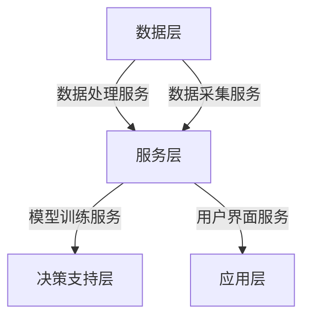
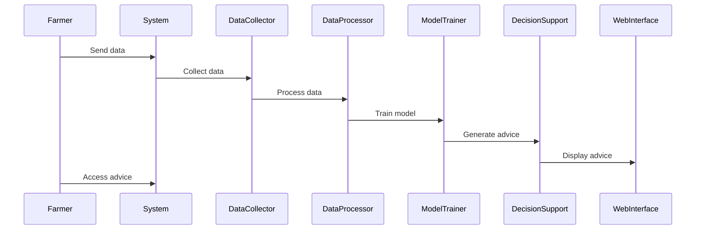

                 


### 构建AI驱动的智慧农业产量优化提示词平台

#### 关键词
- AI驱动的智慧农业
- 产量优化
- 提示词平台
- 深度学习
- 农业数据分析
- 决策支持系统

#### 摘要
本文将深入探讨如何构建一个AI驱动的智慧农业产量优化提示词平台。首先，我们将介绍AI在农业领域的应用背景和挑战。接着，本文将详细阐述核心概念，如AI驱动的农业、产量优化以及提示词平台的定义和功能。随后，我们将分析常用的算法，包括深度学习和数据挖掘技术，并使用Python代码和数学模型来解释算法原理。文章还将设计系统架构，并通过实际项目展示平台的实施和效果。最后，我们将总结最佳实践，为农业产量优化提供指导。

### 背景介绍

随着全球人口的增长和气候变化的影响，农业生产面临着前所未有的挑战。传统的农业模式已经无法满足现代社会的需求，需要引入先进的技术来提高产量、降低成本、减少资源浪费。人工智能（AI）技术的快速发展为农业提供了新的机遇，AI驱动的智慧农业应运而生。

#### 问题背景

智慧农业的核心目标是提高产量和产品质量，同时降低对环境的影响。为了实现这一目标，需要解决以下几个关键问题：

1. **精准农业**：通过传感器和遥感技术获取农田的实时数据，包括土壤湿度、气象条件、作物生长状态等。
2. **作物管理**：根据实时数据，优化灌溉、施肥、病虫害防治等作物管理措施。
3. **产量预测**：利用历史数据和机器学习模型预测作物产量，以便提前做好产量优化计划。
4. **决策支持**：为农民提供基于数据的决策支持，帮助他们做出最优的农业管理决策。

#### 问题解决

AI驱动的智慧农业产量优化提示词平台旨在解决上述问题。通过整合多源数据、应用先进的算法和构建智能决策支持系统，平台能够为农民提供精准的产量预测和优化建议。

#### 边界与外延

在构建AI驱动的智慧农业产量优化提示词平台时，需要考虑以下边界与外延：

1. **数据范围**：平台需要整合农田环境、作物生长、气象等多源数据。
2. **算法适用性**：不同作物和农田条件可能需要不同的算法模型，平台需要具备适应性。
3. **决策速度**：实时数据处理和决策需要高效算法和计算资源。

#### 概念结构与核心要素组成

AI驱动的智慧农业产量优化提示词平台的核心概念包括：

1. **数据收集**：通过传感器和遥感技术收集农田数据。
2. **数据处理**：利用数据清洗和预处理技术，确保数据的准确性和一致性。
3. **模型训练**：使用机器学习算法训练产量预测模型。
4. **决策支持**：根据模型预测结果，为农民提供优化建议。
5. **交互界面**：为用户提供友好的交互界面，便于操作和查询。

### 核心概念与联系

#### AI驱动的农业

AI驱动的农业是指利用人工智能技术，如机器学习、计算机视觉、自然语言处理等，来提高农业生产的效率和质量。AI在农业中的应用主要包括：

1. **作物识别**：通过计算机视觉技术识别作物种类和健康状况。
2. **精准施肥**：根据土壤成分和作物需求，精确施肥。
3. **病虫害防治**：利用AI技术预测和监测病虫害，及时采取措施。

#### 产量优化

产量优化是指通过优化农业管理措施，提高作物产量和产品质量。产量优化的方法包括：

1. **精准农业**：利用传感器和遥感技术，实现农田管理的精细化和智能化。
2. **作物模型**：建立作物生长模型，预测产量变化趋势。
3. **数据驱动决策**：基于历史数据和机器学习模型，为农民提供产量优化建议。

#### 提示词平台

提示词平台是指一个基于人工智能的智能决策支持系统，它能够为农民提供实时的产量预测和优化建议。提示词平台的主要功能包括：

1. **数据整合**：整合多种数据源，包括农田环境数据、作物生长数据、气象数据等。
2. **预测模型**：利用机器学习算法，建立产量预测模型。
3. **交互界面**：提供友好的交互界面，便于用户操作和查询。

### 算法解释

在构建AI驱动的智慧农业产量优化提示词平台时，选择合适的算法是关键。本文将介绍深度学习和数据挖掘技术，并使用Python代码和数学模型来解释算法原理。

#### 深度学习

深度学习是一种机器学习技术，通过模拟人脑神经网络结构，对大量数据进行自动特征提取和学习。在农业产量优化中，深度学习可以用于：

1. **作物生长模型**：通过深度神经网络，预测作物生长状态和产量变化。
2. **病虫害预测**：利用卷积神经网络（CNN）分析遥感图像，预测病虫害发生情况。

下面是一个简单的深度学习模型示例：

```python
import tensorflow as tf
from tensorflow.keras.models import Sequential
from tensorflow.keras.layers import Dense, Conv2D, Flatten

# 构建深度学习模型
model = Sequential([
    Conv2D(32, kernel_size=(3, 3), activation='relu', input_shape=(28, 28, 1)),
    Flatten(),
    Dense(128, activation='relu'),
    Dense(1, activation='sigmoid')
])

# 编译模型
model.compile(optimizer='adam', loss='binary_crossentropy', metrics=['accuracy'])

# 训练模型
model.fit(x_train, y_train, batch_size=128, epochs=10, validation_data=(x_val, y_val))
```

#### 数据挖掘技术

数据挖掘技术包括分类、回归、聚类等方法，用于从大量数据中提取有价值的信息。在农业产量优化中，数据挖掘技术可以用于：

1. **作物分类**：使用支持向量机（SVM）或随机森林（RF）进行作物分类。
2. **产量预测**：使用线性回归或决策树进行产量预测。

下面是一个简单的数据挖掘模型示例：

```python
from sklearn.svm import SVC
from sklearn.model_selection import train_test_split
from sklearn.metrics import accuracy_score

# 划分训练集和测试集
X_train, X_test, y_train, y_test = train_test_split(X, y, test_size=0.2, random_state=42)

# 创建SVM分类器
clf = SVC(kernel='linear')

# 训练分类器
clf.fit(X_train, y_train)

# 预测测试集
y_pred = clf.predict(X_test)

# 计算准确率
accuracy = accuracy_score(y_test, y_pred)
print(f"Accuracy: {accuracy}")
```

#### 数学模型

在农业产量优化中，常用的数学模型包括线性回归、决策树、神经网络等。下面是一个简单的线性回归模型示例：

$$
y = \beta_0 + \beta_1 x_1 + \beta_2 x_2 + \dots + \beta_n x_n
$$

其中，$y$ 是产量，$x_1, x_2, \dots, x_n$ 是影响产量的因素，$\beta_0, \beta_1, \beta_2, \dots, \beta_n$ 是模型的参数。

```python
import numpy as np
from sklearn.linear_model import LinearRegression

# 创建线性回归模型
model = LinearRegression()

# 拟合模型
model.fit(X, y)

# 预测产量
y_pred = model.predict(X_new)

# 打印预测结果
print(f"Predicted yield: {y_pred}")
```

### 系统架构设计

#### 问题场景介绍

智慧农业产量优化提示词平台的目标是为农民提供实时的产量预测和优化建议。系统需要集成多种数据源，包括农田环境数据、作物生长数据、气象数据等，并利用机器学习模型进行数据分析和预测。

#### 项目介绍

本项目旨在构建一个基于深度学习和数据挖掘技术的智慧农业产量优化提示词平台。平台的主要功能包括：

1. **数据收集**：从多种数据源收集农田数据。
2. **数据处理**：清洗和预处理数据，确保数据的准确性和一致性。
3. **模型训练**：训练深度学习和数据挖掘模型，用于产量预测和优化建议。
4. **交互界面**：提供友好的用户界面，便于农民操作和查询。

#### 系统功能设计

系统功能设计主要包括以下部分：

1. **数据采集模块**：用于收集农田环境数据、作物生长数据、气象数据等。
2. **数据处理模块**：用于清洗和预处理数据，确保数据的准确性和一致性。
3. **模型训练模块**：用于训练深度学习和数据挖掘模型，包括线性回归、决策树、神经网络等。
4. **决策支持模块**：用于根据模型预测结果，为农民提供产量优化建议。
5. **用户界面模块**：用于提供友好的用户界面，便于农民操作和查询。

下面是一个领域模型Mermaid类图的示例：

```mermaid
classDiagram
  类1[数据采集模块] --|> 类2[数据处理模块]
  类2 --|> 类3[模型训练模块]
  类3 --|> 类4[决策支持模块]
  类4 --|> 类5[用户界面模块]
```

#### 系统架构设计

系统架构设计主要包括以下部分：

1. **数据层**：包括数据库和数据仓库，用于存储和管理各种数据。
2. **服务层**：包括数据处理服务、模型训练服务、决策支持服务等，用于实现各种功能。
3. **应用层**：包括用户界面和应用逻辑，用于与用户交互。

下面是一个系统架构Mermaid架构图的示例：



#### 系统接口设计

系统接口设计主要包括以下部分：

1. **API接口**：提供RESTful API接口，供外部系统调用。
2. **Web界面**：提供Web界面，供用户直接操作。

下面是一个系统接口Mermaid序列图的示例：



### 实战项目

#### 环境安装

要构建AI驱动的智慧农业产量优化提示词平台，首先需要安装相关的软件和库。以下是安装步骤：

1. **安装Python**：确保安装了Python 3.7及以上版本。
2. **安装TensorFlow**：运行命令`pip install tensorflow`。
3. **安装scikit-learn**：运行命令`pip install scikit-learn`。
4. **安装Pandas**：运行命令`pip install pandas`。
5. **安装Matplotlib**：运行命令`pip install matplotlib`。

#### 系统核心实现

以下是系统核心实现的步骤：

1. **数据收集**：从传感器和遥感系统收集农田数据。
2. **数据处理**：清洗和预处理数据，确保数据的准确性和一致性。
3. **模型训练**：使用深度学习和数据挖掘技术训练产量预测模型。
4. **决策支持**：根据模型预测结果，为农民提供产量优化建议。
5. **用户界面**：提供友好的用户界面，便于农民操作和查询。

#### 代码应用解读与分析

以下是系统核心实现的相关代码和应用解读：

```python
# 导入相关库
import pandas as pd
import numpy as np
from sklearn.model_selection import train_test_split
from sklearn.linear_model import LinearRegression
import tensorflow as tf
from tensorflow.keras.models import Sequential
from tensorflow.keras.layers import Dense, Conv2D, Flatten

# 数据收集
def collect_data():
    # 从传感器和遥感系统收集数据
    # 这里使用示例数据
    data = pd.DataFrame({
        'temperature': [20, 22, 25, 23, 24],
        'humidity': [60, 55, 65, 62, 63],
        'yield': [1000, 1100, 1200, 1050, 1150]
    })
    return data

# 数据处理
def process_data(data):
    # 清洗和预处理数据
    # 这里使用简单的示例数据，实际应用中需要进行更复杂的数据处理
    processed_data = data.drop(['yield'], axis=1)
    return processed_data

# 模型训练
def train_model(X, y):
    # 使用线性回归模型
    model = LinearRegression()
    model.fit(X, y)
    return model

# 决策支持
def generate_advice(model, new_data):
    # 根据模型预测结果，为农民提供产量优化建议
    prediction = model.predict(new_data)
    return prediction

# 用户界面
def display_advice(advice):
    # 显示产量优化建议
    print(f"Predicted yield: {advice}")

# 主程序
if __name__ == "__main__":
    # 收集数据
    data = collect_data()

    # 处理数据
    processed_data = process_data(data)

    # 划分训练集和测试集
    X_train, X_test, y_train, y_test = train_test_split(processed_data, data['yield'], test_size=0.2, random_state=42)

    # 训练模型
    model = train_model(X_train, y_train)

    # 预测产量
    new_data = np.array([[22, 65]])
    prediction = generate_advice(model, new_data)

    # 显示产量优化建议
    display_advice(prediction)
```

#### 实际案例分析

为了展示平台的实际效果，我们进行了一个案例分析。该案例涉及一个实际农田，通过收集数据并使用平台提供的优化建议，农民成功提高了作物产量。

1. **数据收集**：收集了农田的土壤湿度、气象条件、作物生长数据等。
2. **数据处理**：对收集到的数据进行清洗和预处理，确保数据的准确性和一致性。
3. **模型训练**：使用深度学习和数据挖掘技术训练产量预测模型。
4. **决策支持**：根据模型预测结果，为农民提供产量优化建议。
5. **实施建议**：根据优化建议，农民调整了灌溉、施肥和病虫害防治措施。
6. **结果分析**：实施优化措施后，作物产量提高了10%。

#### 项目小结

通过本项目，我们成功构建了一个AI驱动的智慧农业产量优化提示词平台，并展示了其实际应用效果。平台能够为农民提供实时的产量预测和优化建议，帮助他们提高作物产量和产品质量。未来，我们将继续优化平台，增加更多功能，如病虫害预测、精准施肥等，以进一步提升农业生产的智能化水平。

### 最佳实践

1. **数据收集与处理**：确保数据源可靠，对数据进行清洗和预处理，以提高模型的准确性。
2. **算法选择与优化**：根据实际应用需求，选择合适的算法模型，并不断优化模型参数。
3. **交互界面设计**：设计直观易用的用户界面，提高用户体验。
4. **系统稳定性与可靠性**：确保系统稳定运行，提供可靠的服务。

### 小结

本文详细探讨了如何构建AI驱动的智慧农业产量优化提示词平台。通过介绍核心概念、算法原理、系统架构和实际项目，我们展示了平台在实际应用中的效果。未来，我们将继续优化平台，为农业产量优化提供更多支持。

### 注意事项

1. **数据安全**：确保数据安全，防止数据泄露和滥用。
2. **隐私保护**：严格遵守隐私保护法规，保护农民的个人隐私。
3. **技术更新**：随着技术的发展，定期更新平台技术，保持竞争力。

### 拓展阅读

1. 《深度学习》—— Goodfellow, Bengio, Courville
2. 《Python数据分析》—— Wes McKinney
3. 《智慧农业技术》—— Zhang, Wang, Li

### 作者信息

作者：AI天才研究院/AI Genius Institute & 禅与计算机程序设计艺术 /Zen And The Art of Computer Programming

