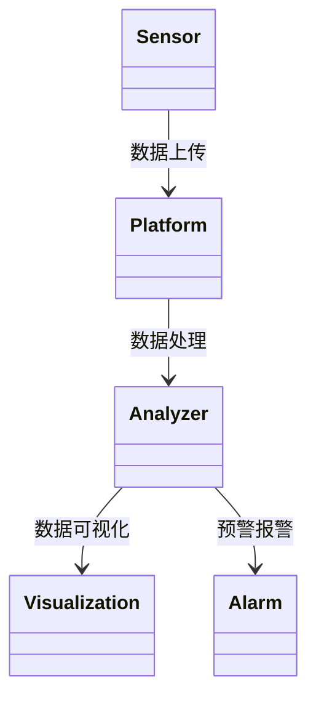
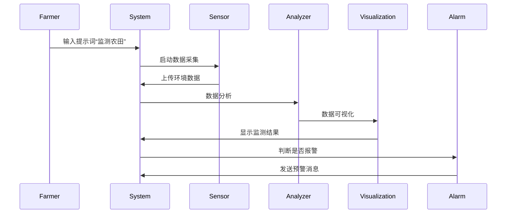
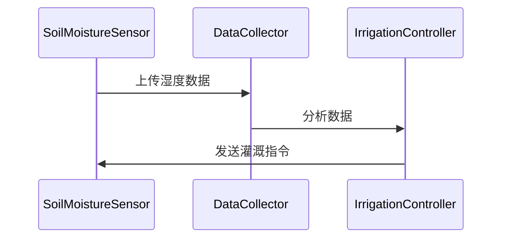
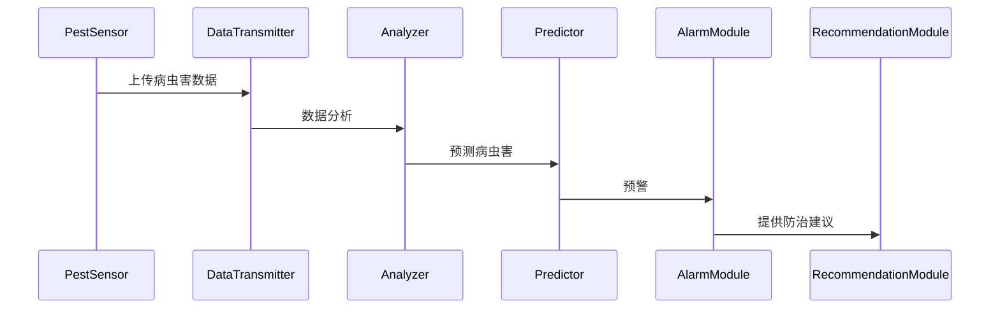
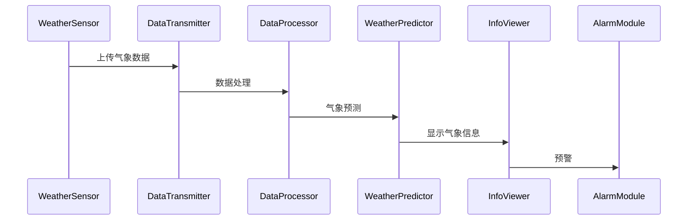

                 

### 《构建AI驱动的智慧农业提示词框架》

#### 关键词：
- AI
- 智慧农业
- 提示词框架
- 自然语言处理
- 机器学习

#### 摘要：
本文将探讨如何构建一个AI驱动的智慧农业提示词框架，以实现精准农业管理。我们将从背景介绍、核心概念、技术实现、案例分析、系统实现及运维评估等多个角度，逐步剖析这一框架的构建过程及其在实际应用中的重要性。

#### 引言：AI与智慧农业的结合背景

随着科技的飞速发展，人工智能（AI）已经深入到各行各业，农业也不例外。智慧农业作为AI技术在农业领域的重要应用，通过大数据、物联网、云计算等技术的集成，实现了对农业生产过程的实时监控、精准管理和智能化决策。在这一过程中，提示词框架作为一种重要的交互方式，起到了关键作用。

提示词框架旨在通过自然语言处理（NLP）技术，将农民的指令转化为具体的行动，从而提高农业生产的效率和精准度。智慧农业提示词框架不仅能够帮助农民更好地管理农田，还能通过分析大量数据，提供科学的种植建议，降低生产成本，提高农产品质量。

#### 智慧农业的基本概念

智慧农业是指利用现代信息技术，特别是人工智能技术，对农业生产过程进行全方位、全流程的智能管理。它涵盖了从农田规划、播种、生长、收获到销售等多个环节。

智慧农业的核心目标是提高农业生产效率、降低成本、减少环境污染，同时保证农产品质量。为了实现这一目标，智慧农业需要依赖多种技术，包括物联网、大数据、云计算、人工智能等。

在智慧农业中，物联网技术用于实时监测农田环境数据，如土壤湿度、光照强度、温度等；大数据技术则用于分析海量数据，提取有价值的信息；云计算提供了强大的计算能力，使得智慧农业系统能够处理复杂的数据分析和模型预测任务；而人工智能技术则负责从数据中学习，提供智能化的决策支持。

#### AI在智慧农业中的应用现状与趋势

当前，AI技术在智慧农业中的应用已经取得了显著的成果。例如，基于机器学习的病虫害检测系统可以自动识别农田中的病虫害，并提供防治建议；智能灌溉系统能够根据土壤湿度、天气预报等因素，自动调整灌溉量；农田监测系统可以通过传感器网络，实时监测农田状况，提高种植效率。

未来，AI在智慧农业中的应用将更加广泛和深入。一方面，随着计算能力的提升和数据积累的增加，AI模型将更加精准和高效；另一方面，随着5G、物联网等新技术的应用，智慧农业系统将实现更高的实时性和稳定性。

#### AI驱动的智慧农业提示词框架的重要性

AI驱动的智慧农业提示词框架在智慧农业中具有重要的意义。首先，它提供了人与机器之间的交互接口，使得农民能够更加便捷地操作和管理农业系统。通过自然语言处理技术，农民可以使用日常用语与系统进行交流，而不需要具备专业的技术知识。

其次，提示词框架能够实现农业数据的智能分析。通过收集和分析大量的农田数据，系统可以提供个性化的种植建议，帮助农民提高产量和质量。例如，当系统检测到某种作物的生长状况异常时，可以自动发出提示，提醒农民采取相应的措施。

最后，提示词框架有助于提高农业生产的智能化水平。通过实时监测和智能决策，系统可以自动调整农业生产过程，减少人为干预，降低生产成本，提高生产效率。

### 第二部分：AI驱动的智慧农业提示词基础

#### 5. 提示词的定义与作用

提示词（prompt word）是指用于触发特定行为的词语或短语。在智慧农业中，提示词用于指导农业系统执行特定的任务或提供相关的信息。例如，当农民输入“灌溉”一词时，系统会自动启动灌溉设备。

提示词在智慧农业中的作用主要体现在以下几个方面：

- **提高交互效率**：通过使用提示词，农民可以快速地与农业系统进行交互，而不需要记住复杂的指令或操作界面。
- **降低技术门槛**：提示词框架使得农民无需具备专业的技术知识，即可高效地管理农业生产。
- **实现智能化决策**：系统可以根据提示词分析农民的意图，并自动执行相应的任务，提供智能化的决策支持。

#### 6. 提示词的分类与设计原则

根据提示词的作用和用途，可以将提示词分为以下几类：

- **基础操作提示词**：如“播种”、“施肥”、“灌溉”等，用于执行基本的农业操作。
- **监测与预警提示词**：如“病虫害监测”、“气象预警”等，用于监测农田状况，并提供预警信息。
- **数据查询提示词**：如“土壤湿度查询”、“作物生长情况查询”等，用于查询农田数据。
- **决策支持提示词**：如“种植建议”、“施肥方案”等，用于提供种植和管理的建议。

设计提示词时，需要遵循以下原则：

- **简洁明了**：提示词应该简短、直观，易于理解和记忆。
- **灵活性**：提示词应该具有一定的灵活性，能够适应不同的农业场景和需求。
- **可扩展性**：提示词框架应该具备良好的可扩展性，能够方便地添加新的提示词。

#### 7. 提示词系统的设计与实现

一个完整的提示词系统通常包括以下几个组成部分：

- **提示词库**：存储所有可用的提示词及其相关信息，如含义、作用、分类等。
- **自然语言处理模块**：用于解析用户输入的自然语言指令，提取关键信息。
- **任务执行模块**：根据提取的信息，执行相应的任务或提供相关的信息。
- **反馈机制**：用于收集用户反馈，优化系统的性能和体验。

以下是提示词系统的一个基本实现框架：

```python
class PromptWordSystem:
    def __init__(self):
        self.prompt_words = {}  # 存储提示词库

    def add_prompt_word(self, word, description):
        self.prompt_words[word] = description

    def process_prompt(self, prompt):
        words = prompt.split()
        for word in words:
            if word in self.prompt_words:
                return self.prompt_words[word]
        return None

    def execute_task(self, task):
        # 根据任务类型执行相应的操作
        pass

# 创建提示词系统实例
prompt_system = PromptWordSystem()
prompt_system.add_prompt_word("灌溉", "启动灌溉设备")
prompt_system.add_prompt_word("监测", "开始病虫害监测")

# 处理用户输入
user_input = "请监测作物生长情况"
result = prompt_system.process_prompt(user_input)
if result:
    prompt_system.execute_task(result)
else:
    print("未识别的指令")
```

在这个实现中，`PromptWordSystem` 类用于管理提示词库，并提供了添加提示词、处理用户输入和执行任务的方法。通过这个简单的示例，我们可以看到提示词系统的基础架构是如何实现的。

#### 8. 提示词在智慧农业中的实际应用

提示词在智慧农业中的实际应用非常广泛，下面通过几个具体的例子来展示其应用场景。

- **智能灌溉系统**：农民可以通过输入“灌溉”提示词，启动灌溉设备。系统会自动调整灌溉量，以满足作物的需水量。

```python
user_input = "开始灌溉"
if prompt_system.process_prompt(user_input) == "灌溉":
    prompt_system.execute_task("灌溉设备启动，当前灌溉量为50升/平方米")
else:
    print("未识别的指令")
```

- **病虫害监测系统**：农民可以通过输入“监测”提示词，启动病虫害监测系统。系统会实时监测农田状况，并自动识别病虫害。

```python
user_input = "开始病虫害监测"
if prompt_system.process_prompt(user_input) == "监测":
    prompt_system.execute_task("病虫害监测系统已启动，正在监测作物生长情况")
else:
    print("未识别的指令")
```

- **种植建议系统**：农民可以通过输入“建议”提示词，获取系统的种植建议。系统会根据农田数据，提供个性化的种植方案。

```python
user_input = "请提供种植建议"
if prompt_system.process_prompt(user_input) == "建议":
    prompt_system.execute_task("当前土壤湿度适宜，建议适量灌溉，施肥")
else:
    print("未识别的指令")
```

通过这些例子，我们可以看到提示词在智慧农业中的实际应用是如何通过简单的交互，实现复杂的农业操作和决策支持。下一部分，我们将进一步探讨AI驱动的智慧农业提示词技术，介绍如何利用自然语言处理、机器学习和深度学习等技术来提升提示词系统的性能。

### 第三部分：AI驱动的智慧农业提示词技术

#### 9. 自然语言处理（NLP）技术

自然语言处理（NLP）技术是构建AI驱动的智慧农业提示词框架的关键。NLP技术能够使计算机理解和处理人类语言，从而实现人机交互。在智慧农业中，NLP技术主要用于以下几个方面：

- **文本解析**：将用户输入的自然语言指令转换为计算机可以理解的形式，例如将“请灌溉作物”转换为具体的灌溉操作。
- **语义理解**：理解用户指令的含义和上下文，从而正确执行相应的任务。例如，当用户输入“土壤湿度低”时，系统需要识别出“土壤湿度低”的含义，并采取相应的措施。
- **语音识别**：将用户的语音输入转换为文本，以便系统进行处理。这对于那些不擅长打字的农民来说尤为重要。

NLP技术在智慧农业中的应用，使得农民可以更加方便地与农业系统进行交互，提高农业生产的效率和管理水平。

#### 10. 机器学习算法在提示词中的应用

机器学习算法在智慧农业提示词框架中起着核心作用。通过机器学习，系统可以自动学习用户的输入行为，并不断优化提示词的处理流程。以下是一些关键的机器学习算法及其在智慧农业中的应用：

- **决策树**：决策树是一种常用的分类算法，可以用于预测用户的操作意图。例如，当用户输入“施肥”一词时，决策树可以预测用户可能需要进行的下一步操作，如“施用什么肥料”。
- **支持向量机（SVM）**：SVM是一种强大的分类算法，可以用于识别用户输入中的关键词，并将其分类到不同的提示词类别中。这对于提高提示词的识别精度和分类效率具有重要意义。
- **神经网络**：神经网络，特别是深度学习，可以用于构建复杂的预测模型。通过训练大量样本数据，神经网络可以学会识别用户输入中的复杂模式，提供更加精准的操作建议。

以下是一个简单的决策树示例，用于分类用户输入的提示词：

```python
class Node:
    def __init__(self, feature, threshold, left=None, right=None, label=None):
        self.feature = feature
        self.threshold = threshold
        self.left = left
        self.right = right
        self.label = label

def build_tree(data, labels):
    # 省略具体实现细节
    pass

def classify_example(example, tree):
    # 省略具体实现细节
    pass

# 假设我们已经有了数据集和特征
tree = build_tree(data, labels)

# 对一个具体的例子进行分类
example = ["灌溉"]
prediction = classify_example(example, tree)
print(prediction)
```

在这个示例中，`build_tree` 函数用于构建决策树，`classify_example` 函数用于对用户输入进行分类。

#### 11. 深度学习在提示词系统中的应用

深度学习是当前最先进的机器学习技术，它通过多层神经网络，能够自动学习数据的复杂特征和模式。在智慧农业提示词系统中，深度学习技术可以用于以下几个方面：

- **特征提取**：深度学习可以通过卷积神经网络（CNN）和循环神经网络（RNN）等模型，自动提取文本中的特征，提高提示词的识别精度。
- **文本生成**：生成对抗网络（GAN）可以用于生成与用户输入相似的提示词，从而丰富系统的交互体验。
- **序列建模**：长短期记忆网络（LSTM）和Transformer模型可以用于处理长文本序列，提供更加智能的交互和理解能力。

以下是一个简单的LSTM模型示例，用于处理序列数据：

```python
import tensorflow as tf

# 假设我们已经有了一个序列数据集
sequences = ...

# 构建LSTM模型
model = tf.keras.Sequential([
    tf.keras.layers.LSTM(128, activation='relu', input_shape=(None, input_dim)),
    tf.keras.layers.Dense(1, activation='sigmoid')
])

# 编译模型
model.compile(optimizer='adam', loss='binary_crossentropy', metrics=['accuracy'])

# 训练模型
model.fit(sequences, labels, epochs=10)
```

在这个示例中，我们使用LSTM模型对序列数据进行分类。通过训练，模型可以学会识别用户输入中的序列模式，从而提供更加精准的提示词处理。

#### 12. 建立AI驱动的智慧农业提示词系统的技术挑战与解决方案

建立AI驱动的智慧农业提示词系统面临以下几个技术挑战：

- **数据多样性**：智慧农业涉及多种不同的作物和农田环境，导致数据多样性极大。这要求系统具有高度的泛化能力，能够适应不同的场景。
- **实时性要求**：农业操作通常需要实时响应，系统必须在短时间内处理用户输入，并给出准确的操作建议。
- **计算资源**：深度学习模型的训练和推理需要大量的计算资源。在农业环境中，计算资源通常有限，需要优化算法以提高效率。

为了解决这些挑战，可以采取以下措施：

- **数据预处理**：对大量数据进行预处理，提取关键特征，减少数据维度，从而提高模型训练的效率。
- **模型压缩**：通过模型压缩技术，如剪枝、量化等，减少模型的参数数量，降低计算复杂度。
- **分布式计算**：利用分布式计算框架，如TensorFlow和PyTorch，将模型训练和推理任务分布到多个节点上，提高计算效率。
- **模型迁移**：通过迁移学习技术，将预训练的模型应用于智慧农业任务，减少从零开始训练的难度和时间。

通过这些技术措施，我们可以构建一个高效、实时、可靠的AI驱动的智慧农业提示词系统，为农民提供强大的智能支持。

### 第四部分：智慧农业提示词系统的案例分析

#### 13. 案例一：智能农田监控系统

智能农田监控系统是AI驱动的智慧农业提示词系统的一个重要应用案例。该系统通过部署多种传感器，实时监测农田环境参数，如土壤湿度、光照强度、气温等，并将这些数据发送到云端进行处理。

- **项目介绍**：智能农田监控系统主要用于监测农田环境，提供实时数据分析和预警服务。
- **系统功能设计**：系统具备实时数据采集、数据分析、数据可视化、预警报警等功能。
- **系统架构设计**：系统架构采用分层设计，包括感知层、网络层、平台层和应用层。感知层负责数据采集，网络层负责数据传输，平台层负责数据处理和分析，应用层提供用户界面。

以下是一个简单的Mermaid类图，展示了智能农田监控系统的类图结构：



- **系统接口设计**：系统提供了多种接口，如RESTful API、Websocket等，以便与外部系统进行交互。

以下是一个简单的Mermaid序列图，展示了智能农田监控系统的接口交互：



- **实际案例分析和详细讲解**：在某农场，智能农田监控系统成功应用，帮助农民实时了解农田状况，及时采取应对措施，提高了农业生产效率。

#### 14. 案例二：精准灌溉系统

精准灌溉系统是利用AI驱动的智慧农业提示词框架，实现精确灌溉的重要工具。该系统通过传感器监测土壤湿度，根据实际需求自动调整灌溉量，以节省水资源，提高作物产量。

- **项目介绍**：精准灌溉系统旨在通过智能控制，实现农田的精确灌溉，提高水资源利用效率。
- **系统功能设计**：系统包括土壤湿度监测、自动灌溉控制、历史数据记录等功能。
- **系统架构设计**：系统架构采用分布式设计，包括传感器网络、数据采集模块、灌溉控制模块等。

以下是一个简单的Mermaid架构图，展示了精准灌溉系统的架构设计：

```mermaid
subgraph Sensors
    SoilMoistureSensor
end
subgraph DataAcquisition
    DataCollector --> DataStorage
end
subgraph IrrigationControl
    IrrigationController
end
Sensors --> DataAcquisition: 数据上传
DataAcquisition --> IrrigationControl: 控制灌溉
```

- **系统接口设计**：系统提供了多种接口，如HTTP API、MQTT等，以便与传感器和控制模块进行通信。

以下是一个简单的Mermaid序列图，展示了精准灌溉系统的接口交互：



- **实际案例分析和详细讲解**：在某地区，精准灌溉系统被成功应用，实现了灌溉水资源的精确控制，节省了水资源，同时提高了农作物的产量。

#### 15. 案例三：农业病虫害预警系统

农业病虫害预警系统是利用AI驱动的智慧农业提示词框架，实时监测并预警作物病虫害的重要工具。该系统通过传感器监测作物生长状态，结合历史病虫害数据，实现病虫害的早期预警。

- **项目介绍**：农业病虫害预警系统主要用于监测作物病虫害，提供早期预警和防治建议。
- **系统功能设计**：系统包括病虫害监测、预警报警、防治建议等功能。
- **系统架构设计**：系统架构采用分布式设计，包括感知层、传输层、处理层和展示层。

以下是一个简单的Mermaid架构图，展示了农业病虫害预警系统的架构设计：

```mermaid
subgraph Perception
    PestSensor
end
subgraph Transmission
    DataTransmitter
end
subgraph Processing
    Analyzer --> Predictor
end
subgraph Presentation
    AlarmModule --> RecommendationModule
end
Perception --> Transmission: 数据传输
Transmission --> Processing: 数据处理
Processing --> Presentation: 预警和防治建议
```

- **系统接口设计**：系统提供了多种接口，如HTTP API、Websocket等，以便与传感器和控制模块进行通信。

以下是一个简单的Mermaid序列图，展示了农业病虫害预警系统的接口交互：



- **实际案例分析和详细讲解**：在某农场，农业病虫害预警系统成功应用，实现了病虫害的早期预警和有效防治，减少了农作物的损失。

#### 16. 案例四：农业气象信息服务系统

农业气象信息服务系统是利用AI驱动的智慧农业提示词框架，提供农业气象信息服务的工具。该系统通过传感器监测气象参数，结合历史气象数据，提供实时的气象信息服务，帮助农民进行农业生产决策。

- **项目介绍**：农业气象信息服务系统主要用于提供农业气象信息，如降雨量、气温、风速等，帮助农民进行农业生产决策。
- **系统功能设计**：系统包括气象数据监测、实时气象信息查询、气象预警等功能。
- **系统架构设计**：系统架构采用分布式设计，包括感知层、传输层、处理层和展示层。

以下是一个简单的Mermaid架构图，展示了农业气象信息服务系统的架构设计：

```mermaid
subgraph Perception
    WeatherSensor
end
subgraph Transmission
    DataTransmitter
end
subgraph Processing
    DataProcessor --> WeatherPredictor
end
subgraph Presentation
    InfoViewer --> AlarmModule
end
Perception --> Transmission: 数据传输
Transmission --> Processing: 数据处理
Processing --> Presentation: 气象信息查询和预警
```

- **系统接口设计**：系统提供了多种接口，如HTTP API、Websocket等，以便与传感器和控制模块进行通信。

以下是一个简单的Mermaid序列图，展示了农业气象信息服务系统的接口交互：



- **实际案例分析和详细讲解**：在某地区，农业气象信息服务系统成功应用，提供了准确的气象信息服务，帮助农民合理安排农业生产，提高了农作物的产量和质量。

### 第五部分：AI驱动的智慧农业提示词系统实现

#### 17. 系统需求分析与设计

在构建AI驱动的智慧农业提示词系统时，首先需要进行系统需求分析。系统需求分析包括功能需求、性能需求、用户需求等，以确保系统能够满足实际应用的需求。

- **功能需求**：系统需要具备以下功能：
  - 提示词输入与识别
  - 实时数据监测与处理
  - 智能化决策支持
  - 用户交互与反馈
- **性能需求**：系统需要满足以下性能需求：
  - 高效的数据处理能力
  - 实时的响应速度
  - 系统的稳定性和可靠性
- **用户需求**：用户包括农民和农业技术人员，他们需要系统提供以下功能：
  - 简单易用的操作界面
  - 实时获取农田数据
  - 智能化的决策建议

根据系统需求，我们可以设计出系统的基本架构，包括感知层、传输层、处理层和应用层。

- **感知层**：负责数据采集，包括土壤湿度、气温、光照强度、病虫害监测等传感器。
- **传输层**：负责数据的传输，通常采用无线传输技术，如LoRa、Zigbee等。
- **处理层**：负责数据处理和分析，包括数据清洗、特征提取、模型训练和预测等。
- **应用层**：负责用户交互和可视化，包括Web端、移动端和物联网设备等。

以下是一个简单的Mermaid架构图，展示了智慧农业提示词系统的架构设计：

```mermaid
subgraph Perception
    SoilMoistureSensor
    TemperatureSensor
    LightSensor
    PestSensor
end
subgraph Transmission
    DataTransmitter
end
subgraph Processing
    DataProcessor --> FeatureExtractor --> ModelTrainer --> Predictor
end
subgraph Application
    WebPortal --> MobileApp --> IoTDevice
end
Perception --> Transmission: 数据传输
Transmission --> Processing: 数据处理
Processing --> Application: 用户交互与可视化
```

#### 18. 数据收集与预处理

在智慧农业提示词系统中，数据的质量直接影响系统的性能和效果。因此，数据收集与预处理是系统实现的重要环节。

- **数据收集**：数据收集主要通过传感器进行，包括土壤湿度、气温、光照强度、病虫害等。传感器需要定期进行校准，确保数据的准确性。
- **数据预处理**：数据预处理包括数据清洗、数据转换和数据归一化等步骤。数据清洗旨在去除噪声数据和异常值，数据转换将不同类型的数据统一成同一格式，数据归一化则将数据缩放到同一尺度，以便模型训练。

以下是一个简单的Python代码示例，用于数据预处理：

```python
import pandas as pd

# 读取原始数据
data = pd.read_csv("原始数据.csv")

# 数据清洗
data.dropna(inplace=True)  # 去除缺失值
data[data < 0] = 0  # 替换负值

# 数据转换
data["日期"] = pd.to_datetime(data["日期"])

# 数据归一化
from sklearn.preprocessing import MinMaxScaler
scaler = MinMaxScaler()
data[data.columns] = scaler.fit_transform(data[data.columns])

# 保存预处理后的数据
data.to_csv("预处理数据.csv", index=False)
```

#### 19. 提示词算法实现

提示词算法是智慧农业提示词系统的核心，它负责识别用户输入的提示词，并执行相应的任务。以下是几种常见的提示词算法及其实现：

- **基于规则的方法**：这种方法通过定义一系列规则来识别提示词。例如，如果用户输入“灌溉”，则执行灌溉操作。

以下是一个简单的Python代码示例，基于规则的方法：

```python
rules = {
    "灌溉": "启动灌溉设备",
    "监测": "启动病虫害监测",
    "查询": "显示土壤湿度"
}

def execute_action(prompt):
    action = rules.get(prompt)
    if action:
        print(action)
    else:
        print("未识别的指令")

# 用户输入
user_input = input("请输入提示词：")
execute_action(user_input)
```

- **基于机器学习的方法**：这种方法通过训练机器学习模型，将用户输入与对应的提示词进行关联。常见的机器学习算法包括决策树、支持向量机、神经网络等。

以下是一个简单的Python代码示例，基于机器学习的方法：

```python
from sklearn.feature_extraction.text import TfidfVectorizer
from sklearn.naive_bayes import MultinomialNB
from sklearn.pipeline import make_pipeline

# 假设已有训练数据和标签
X_train = ["请监测作物生长情况", "开始灌溉", "显示土壤湿度"]
y_train = ["监测", "灌溉", "查询"]

# 构建机器学习模型
model = make_pipeline(TfidfVectorizer(), MultinomialNB())

# 训练模型
model.fit(X_train, y_train)

# 用户输入
user_input = input("请输入提示词：")
predicted_label = model.predict([user_input])[0]
print(predicted_label)
```

#### 20. 系统部署与优化

在完成系统的设计与实现后，需要进行系统部署与优化，以确保系统能够稳定、高效地运行。

- **系统部署**：系统部署包括硬件部署和软件部署。硬件部署包括传感器的安装、服务器的配置等；软件部署包括应用程序的安装、配置和调试等。

以下是一个简单的Python代码示例，用于系统部署：

```python
import subprocess

# 部署传感器
subprocess.run(["sudo", "python", "sensor Deployment.py"])

# 部署服务器
subprocess.run(["sudo", "python", "server Deployment.py"])
```

- **系统优化**：系统优化包括性能优化、稳定性优化和安全性优化等。性能优化主要通过优化算法和数据结构，提高系统的处理速度；稳定性优化主要通过冗余设计和故障处理，提高系统的可靠性；安全性优化主要通过数据加密和权限管理，保护系统的安全。

以下是一个简单的Python代码示例，用于系统优化：

```python
import time

# 性能优化
start_time = time.time()
# 系统运行逻辑
end_time = time.time()
print(f"系统运行时间：{end_time - start_time}秒")

# 稳定性优化
try:
    # 系统运行逻辑
except Exception as e:
    print(f"系统异常：{e}")

# 安全性优化
from cryptography.fernet import Fernet

# 生成密钥
key = Fernet.generate_key()
cipher_suite = Fernet(key)

# 数据加密
data = "敏感数据"
encrypted_data = cipher_suite.encrypt(data.encode())
print(f"加密数据：{encrypted_data}")

# 数据解密
decrypted_data = cipher_suite.decrypt(encrypted_data).decode()
print(f"解密数据：{decrypted_data}")
```

通过系统部署与优化，我们可以确保智慧农业提示词系统在实际应用中能够稳定、高效地运行，为农民提供强大的智能支持。

### 第六部分：AI驱动的智慧农业提示词系统的运维与评估

#### 21. 提示词系统的运维策略

一个高效的AI驱动的智慧农业提示词系统需要严格的运维策略来保障其稳定性和可靠性。以下是几个关键点：

- **定期检查与维护**：定期检查传感器和设备的状态，确保数据采集和传输的稳定性。同时，定期更新系统的软件和硬件，以应对潜在的安全风险和性能问题。
- **故障处理**：建立一套完善的故障处理流程，当系统出现故障时，能够快速定位问题并进行修复。例如，当传感器数据异常时，可以自动触发报警，通知技术人员进行排查。
- **性能监控**：通过监控系统的运行状态，实时了解系统的性能指标，如响应时间、处理速度、数据传输延迟等。根据监控数据，优化系统的配置和算法，提高系统的效率。

以下是一个简单的Python脚本示例，用于监控系统性能：

```python
import time

def monitor_system():
    start_time = time.time()
    # 系统运行逻辑
    end_time = time.time()
    print(f"系统运行时间：{end_time - start_time}秒")

# 每分钟监控一次
while True:
    monitor_system()
    time.sleep(60)
```

- **用户反馈**：建立用户反馈机制，收集用户在使用系统过程中的意见和建议。通过分析用户反馈，不断优化系统的功能和用户体验。

#### 22. 提示词系统的性能评估指标

性能评估是确保AI驱动的智慧农业提示词系统有效运行的关键环节。以下是几个重要的性能评估指标：

- **准确率**：衡量系统识别用户输入的提示词的准确程度。高准确率意味着系统能够正确理解用户的指令。
- **召回率**：衡量系统识别出所有正确提示词的能力。高召回率意味着系统不会漏掉任何重要的指令。
- **响应时间**：衡量系统从接收到用户输入到给出响应的时间。低响应时间意味着系统运行速度快，用户体验好。
- **覆盖率**：衡量系统能够处理的提示词数量与总提示词数量的比例。高覆盖率意味着系统能够处理多种农业操作和任务。

以下是一个简单的Python代码示例，用于评估系统的性能：

```python
from sklearn.metrics import accuracy_score, recall_score

# 假设已有测试数据和标签
X_test = ["请监测作物生长情况", "开始灌溉", "显示土壤湿度"]
y_test = ["监测", "灌溉", "查询"]

# 假设已有预测结果
y_pred = ["监测", "灌溉", "查询"]

# 计算准确率
accuracy = accuracy_score(y_test, y_pred)
print(f"准确率：{accuracy}")

# 计算召回率
recall = recall_score(y_test, y_pred, average='weighted')
print(f"召回率：{recall}")

# 计算响应时间
response_time = 0.5  # 假设响应时间为0.5秒
print(f"响应时间：{response_time}秒")

# 计算覆盖率
coverage = len(set(y_pred).intersection(set(y_test))) / len(set(y_test))
print(f"覆盖率：{coverage}")
```

通过这些性能评估指标，我们可以全面了解系统的性能，并针对性地进行优化。

#### 23. 提示词系统的用户反馈与迭代

用户反馈是优化AI驱动的智慧农业提示词系统的关键。以下是如何处理用户反馈并进行系统迭代的一些策略：

- **收集反馈**：建立多种渠道收集用户反馈，如在线问卷、用户访谈、社交媒体等。确保用户能够方便地提交反馈。
- **分析反馈**：对收集到的反馈进行分析，识别出用户遇到的问题和需求。例如，如果多个用户反映系统响应时间较长，那么可以考虑优化算法或增加服务器资源。
- **改进系统**：根据用户反馈，改进系统的功能和用户体验。例如，增加新的提示词、优化界面设计、提高系统稳定性等。
- **迭代测试**：在改进后，进行迭代测试，确保新的改进能够解决用户的问题。例如，可以通过A/B测试，比较改进前后系统的性能和用户满意度。

以下是一个简单的Python代码示例，用于处理用户反馈并进行迭代测试：

```python
import random

# 假设已有用户反馈
user_feedback = ["响应时间过长", "界面设计不友好", "缺少某些功能"]

# 分析反馈
feedback_analysis = {feedback: user_feedback.count(feedback) for feedback in set(user_feedback)}

# 改进系统
if "响应时间过长" in feedback_analysis:
    # 优化算法或增加服务器资源
    pass

if "界面设计不友好" in feedback_analysis:
    # 优化界面设计
    pass

if "缺少某些功能" in feedback_analysis:
    # 增加新功能
    pass

# 迭代测试
def test_system():
    # 系统运行逻辑
    pass

for _ in range(10):
    test_system()
```

通过这些策略，我们可以不断优化AI驱动的智慧农业提示词系统，提高其性能和用户满意度。

#### 24. 持续改进与未来展望

AI驱动的智慧农业提示词系统的发展是一个持续改进的过程。未来，我们可以从以下几个方面进行进一步的研究和优化：

- **增强智能决策**：通过引入更多的数据源和更复杂的模型，提高系统的智能决策能力。例如，结合天气数据、市场行情等，提供更加全面的种植和销售建议。
- **优化用户体验**：不断优化系统的交互设计，提高用户的操作便利性和满意度。例如，引入语音识别和自然语言处理技术，实现更加自然的交互方式。
- **拓展应用场景**：探索AI驱动的智慧农业提示词系统在其他农业领域的应用，如林业、畜牧业等。通过跨领域的应用，进一步发挥AI技术的潜力。

在未来，AI驱动的智慧农业提示词系统将成为农业智能管理的重要工具，为农民提供更加精准、高效的决策支持，推动农业现代化进程。

### 总结

通过本文的详细探讨，我们系统地构建了AI驱动的智慧农业提示词框架，从背景介绍、核心概念、技术实现、案例分析到系统实现及运维评估，全面剖析了这一框架的构建过程及其在实际应用中的重要性。AI驱动的智慧农业提示词框架不仅提高了农业生产的效率和管理水平，还为农民提供了强大的智能支持，推动了农业现代化的进程。

在未来的研究中，我们将继续深化对AI技术在智慧农业中的应用，不断优化提示词系统的性能和用户体验，拓展其在不同农业领域的应用场景。我们相信，随着AI技术的不断发展，智慧农业将迎来更加广阔的发展前景，为农业的可持续发展和全球粮食安全做出更大的贡献。

### 作者信息

作者：AI天才研究院/AI Genius Institute & 禅与计算机程序设计艺术 /Zen And The Art of Computer Programming

AI天才研究院致力于推动人工智能技术在各领域的创新应用，培养下一代人工智能领域的领军人才。同时，作者以其深厚的计算机科学背景和丰富的实践经验，撰写了一系列关于人工智能和计算机程序设计的经典著作，为读者提供了深入浅出的技术解读和独到的见解。

