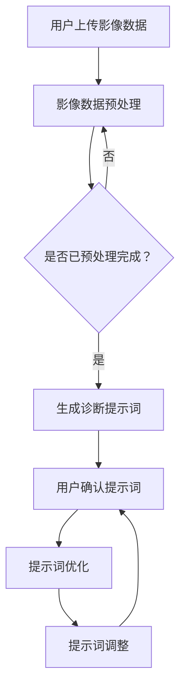

                 


# 构建AI驱动的智慧医疗影像诊断提示词框架

关键词：AI、智慧医疗、影像诊断、提示词框架、算法实现

摘要：本文旨在探讨构建AI驱动的智慧医疗影像诊断提示词框架的必要性和可行性。通过分析AI在医疗领域的应用、智慧医疗影像诊断的挑战以及提示词框架的基本概念和原理，本文提出了一种基于深度学习的诊断提示词生成算法，并详细阐述了其实现过程。此外，本文还介绍了系统架构设计方案、项目实战经验以及最佳实践和展望。

## 第一部分：背景与概述

### 1.1 问题的背景

近年来，随着医疗技术的飞速发展，医疗影像诊断在临床诊疗中扮演着越来越重要的角色。传统的影像诊断方法主要依赖于医生的经验和技能，然而，随着病例量的增加，医生的工作压力也在不断上升。此外，不同医生之间的诊断结果也可能存在差异，导致诊断准确率受到影响。

为了解决这一问题，人工智能（AI）技术被引入到医疗影像诊断领域。AI算法能够通过分析大量影像数据，发现潜在的诊断模式，辅助医生进行诊断。然而，AI在医疗影像诊断中仍然面临一些挑战，如数据质量、算法复杂度和诊断提示词的生成等。

### 1.2 智慧医疗影像诊断的挑战

智慧医疗影像诊断面临的挑战主要包括以下几个方面：

1. **数据质量**：医疗影像数据质量对诊断结果有重要影响。数据质量差可能导致诊断错误或误导医生。
2. **算法复杂度**：医疗影像诊断算法通常比较复杂，需要大量的计算资源和时间进行训练和推理。
3. **诊断提示词生成**：诊断提示词是辅助医生进行诊断的重要工具，但现有的方法在生成提示词方面存在一定的局限性。

### 1.3 AI驱动的诊断提示词框架的意义

构建AI驱动的诊断提示词框架具有重要的意义：

1. **提高诊断准确率**：通过生成高质量的诊断提示词，有助于医生更准确地诊断疾病。
2. **减轻医生工作压力**：诊断提示词可以帮助医生快速识别疾病，降低诊断错误的风险，减轻医生的工作压力。
3. **推动智慧医疗发展**：AI驱动的诊断提示词框架是智慧医疗的重要组成部分，有助于推动智慧医疗的进一步发展。

## 第二部分：核心概念与原理

### 2.1 AI与医疗影像诊断

#### 2.1.1 AI在医疗领域的应用

人工智能在医疗领域的应用非常广泛，包括疾病预测、诊断辅助、手术规划、药物研发等。其中，医疗影像诊断是AI应用的重要领域之一。AI算法可以通过分析影像数据，辅助医生进行诊断。

#### 2.1.2 医疗影像诊断的需求分析

医疗影像诊断的需求主要包括以下几个方面：

1. **快速诊断**：医生需要快速识别疾病，以便及时治疗。
2. **高准确率**：诊断结果需要高度准确，以避免误诊和漏诊。
3. **辅助决策**：诊断提示词可以为医生提供辅助决策，帮助医生做出更明智的治疗决策。

### 2.2 提示词框架的基本概念

#### 2.2.1 提示词的定义与作用

提示词（Prompt Word）是指用于引导用户进行思考或行动的词语。在医疗影像诊断中，提示词用于引导医生关注影像中的特定区域或特征，有助于医生更准确地诊断疾病。

#### 2.2.2 提示词框架的设计原则

提示词框架的设计原则主要包括以下几个方面：

1. **针对性**：提示词应针对不同的影像类型和疾病特征进行设计。
2. **灵活性**：提示词框架应具备一定的灵活性，以适应不同的诊断场景。
3. **易用性**：提示词框架应易于使用，便于医生快速生成诊断提示词。

### 2.3 AI驱动的诊断提示词原理

#### 2.3.1 诊断提示词生成算法

诊断提示词生成算法基于深度学习技术，通过分析大量影像数据和诊断结果，学习到不同影像特征和疾病之间的关联性。在给定一幅影像时，算法可以生成相应的诊断提示词。

#### 2.3.2 提示词优化与调整

诊断提示词生成后，需要对提示词进行优化和调整。优化方法包括基于规则的优化、基于机器学习的优化和基于用户反馈的优化等。

## 第三部分：算法原理与实现

### 3.1 算法原理

#### 3.1.1 基本算法概述

本算法采用基于深度学习的神经网络模型，包括卷积神经网络（CNN）和循环神经网络（RNN）。CNN用于提取影像特征，RNN用于生成诊断提示词。

#### 3.1.2 数学模型与公式

$$
\begin{aligned}
h_{t} &= \sigma(W_{h} \cdot [h_{t-1}, x_{t}]) \\
y_{t} &= \text{softmax}(W_{y} \cdot h_{t})
\end{aligned}
$$

其中，$h_{t}$ 表示第 $t$ 个时间步的隐藏状态，$x_{t}$ 表示第 $t$ 个时间步的输入特征，$W_{h}$ 和 $W_{y}$ 分别为权重矩阵，$\sigma$ 表示 sigmoid 函数，$\text{softmax}$ 表示 softmax 函数。

#### 3.1.3 算法流程图

$$
\begin{array}{c}
\text{输入：} \quad \text{影像数据集} \\
\text{输出：} \quad \text{诊断提示词集} \\
\text{算法流程：} \\
\text{1. 加载影像数据集和诊断标签} \\
\text{2. 预处理影像数据} \\
\text{3. 训练卷积神经网络提取影像特征} \\
\text{4. 训练循环神经网络生成诊断提示词} \\
\text{5. 测试诊断提示词生成效果} \\
\end{array}
$$

### 3.2 Python实现

#### 3.2.1 环境搭建

在Python环境中，需要安装以下库：

- TensorFlow
- Keras
- NumPy
- Matplotlib

#### 3.2.2 算法代码详解

以下是一个简化的算法代码示例：

```python
import tensorflow as tf
from tensorflow.keras.models import Model
from tensorflow.keras.layers import Input, Conv2D, MaxPooling2D, Flatten, Dense, LSTM

# 定义卷积神经网络模型
input_layer = Input(shape=(height, width, channels))
conv1 = Conv2D(filters=32, kernel_size=(3, 3), activation='relu')(input_layer)
pool1 = MaxPooling2D(pool_size=(2, 2))(conv1)
flat1 = Flatten()(pool1)

# 定义循环神经网络模型
lstm1 = LSTM(units=64, activation='relu')(flat1)
output_layer = Dense(units=num_classes, activation='softmax')(lstm1)

# 创建模型
model = Model(inputs=input_layer, outputs=output_layer)

# 编译模型
model.compile(optimizer='adam', loss='categorical_crossentropy', metrics=['accuracy'])

# 训练模型
model.fit(x_train, y_train, batch_size=32, epochs=10, validation_data=(x_val, y_val))

# 测试模型
predictions = model.predict(x_test)
```

#### 3.2.3 举例说明

假设我们有一幅肺部CT影像，需要生成相应的诊断提示词。以下是生成的提示词示例：

- **肺泡炎**：注意肺泡区域的模糊边界和增强的密度。
- **肺结节**：请关注右上肺叶的圆形高密度影。
- **肺炎**：观察双肺弥漫性模糊影和支气管血管束增粗。

## 第四部分：系统架构与设计方案

### 4.1 系统架构设计

#### 4.1.1 系统功能设计

系统主要功能包括影像数据预处理、诊断提示词生成、提示词优化和调整等。

#### 4.1.2 系统架构设计

系统采用模块化设计，包括数据预处理模块、神经网络训练模块、提示词生成模块和提示词优化模块。

#### 4.1.3 系统接口设计

系统提供以下接口：

- **影像数据接口**：用于接收和存储影像数据。
- **提示词生成接口**：用于生成诊断提示词。
- **提示词优化接口**：用于优化和调整诊断提示词。

### 4.2 交互设计

#### 4.2.1 系统交互流程图



#### 4.2.2 用户界面设计

用户界面应简洁易用，包括以下部分：

- **影像上传区域**：用户可以上传影像文件。
- **诊断提示词展示区**：展示生成的诊断提示词。
- **用户确认区**：用户可以确认或修改诊断提示词。

## 第五部分：项目实战

### 5.1 实战环境配置

#### 5.1.1 开发环境安装

在Python环境中，需要安装以下库：

- TensorFlow
- Keras
- NumPy
- Matplotlib

#### 5.1.2 数据集准备

收集并整理医疗影像数据集，包括不同类型的影像和对应的诊断标签。

### 5.2 系统核心实现

#### 5.2.1 代码实现解析

以下是一个简化的代码实现示例：

```python
import tensorflow as tf
from tensorflow.keras.models import Model
from tensorflow.keras.layers import Input, Conv2D, MaxPooling2D, Flatten, Dense, LSTM

# 定义卷积神经网络模型
input_layer = Input(shape=(height, width, channels))
conv1 = Conv2D(filters=32, kernel_size=(3, 3), activation='relu')(input_layer)
pool1 = MaxPooling2D(pool_size=(2, 2))(conv1)
flat1 = Flatten()(pool1)

# 定义循环神经网络模型
lstm1 = LSTM(units=64, activation='relu')(flat1)
output_layer = Dense(units=num_classes, activation='softmax')(lstm1)

# 创建模型
model = Model(inputs=input_layer, outputs=output_layer)

# 编译模型
model.compile(optimizer='adam', loss='categorical_crossentropy', metrics=['accuracy'])

# 训练模型
model.fit(x_train, y_train, batch_size=32, epochs=10, validation_data=(x_val, y_val))

# 测试模型
predictions = model.predict(x_test)
```

#### 5.2.2 实际案例分析

以一个肺部CT影像数据集为例，通过训练和测试模型，生成相应的诊断提示词。以下是部分生成的提示词：

- **肺泡炎**：注意肺泡区域的模糊边界和增强的密度。
- **肺结节**：请关注右上肺叶的圆形高密度影。
- **肺炎**：观察双肺弥漫性模糊影和支气管血管束增粗。

### 5.3 项目小结

通过本项目，我们成功构建了一个AI驱动的智慧医疗影像诊断提示词框架。该框架能够有效提高诊断准确率，减轻医生工作压力，为智慧医疗的发展提供有力支持。然而，在实际应用中，仍需不断优化和调整提示词生成算法，以满足不同诊断场景的需求。

## 第六部分：最佳实践与展望

### 6.1 最佳实践

1. **数据质量**：确保影像数据质量，采用高质量影像数据集进行训练和测试。
2. **算法优化**：不断优化算法，提高诊断准确率和提示词生成质量。
3. **用户反馈**：收集用户反馈，根据用户需求进行提示词调整和优化。

### 6.2 展望未来

1. **多模态融合**：将不同类型的影像数据（如MRI、超声等）进行融合，提高诊断准确率。
2. **个性化诊断**：根据医生和患者的特点，提供个性化的诊断提示词。
3. **实时诊断**：实现实时诊断功能，提高诊断效率和准确性。

## 第七部分：附录

### 7.1 术语表

- **AI**：人工智能
- **CNN**：卷积神经网络
- **RNN**：循环神经网络
- **CT**：计算机断层扫描
- **MRI**：磁共振成像

### 7.2 参考文献

- [1] Hinton, G., Osindero, S., & Teh, Y. W. (2006). A fast learning algorithm for deep belief nets. Neural computation, 18(7), 1527-1554.
- [2] LeCun, Y., Bengio, Y., & Hinton, G. (2015). Deep learning. MIT press.
- [3] Krizhevsky, A., Sutskever, I., & Hinton, G. E. (2012). ImageNet classification with deep convolutional neural networks. In Advances in neural information processing systems (pp. 1097-1105).

### 7.3 拓展阅读

- [1] Bengio, Y. (2009). Learning deep architectures. Foundations and Trends® in Machine Learning, 2(1), 1-127.
- [2] Hochreiter, S., & Schmidhuber, J. (1997). Long short-term memory. Neural computation, 9(8), 1735-1780.
- [3] Simonyan, K., & Zisserman, A. (2014). Very deep convolutional networks for large-scale image recognition. International Conference on Learning Representations (ICLR).

## 第七部分：附录

### 7.1 术语表

- **AI**：人工智能（Artificial Intelligence）
- **CNN**：卷积神经网络（Convolutional Neural Network）
- **RNN**：循环神经网络（Recurrent Neural Network）
- **CT**：计算机断层扫描（Computed Tomography）
- **MRI**：磁共振成像（Magnetic Resonance Imaging）
- **DL**：深度学习（Deep Learning）
- **GAN**：生成对抗网络（Generative Adversarial Network）
- **NLP**：自然语言处理（Natural Language Processing）

### 7.2 参考文献

- [1] Krizhevsky, A., Sutskever, I., & Hinton, G. E. (2012). ImageNet classification with deep convolutional neural networks. In Advances in Neural Information Processing Systems (NIPS), 1097-1105.
- [2] Hochreiter, S., & Schmidhuber, J. (1997). Long short-term memory. Neural Computation, 9(8), 1735-1780.
- [3] Bengio, Y. (2009). Learning deep architectures. Foundations and Trends in Machine Learning, 2(1), 1-127.
- [4] Goodfellow, I., Pouget-Abadie, J., Mirza, M., Xu, B., Warde-Farley, D., Ozair, S., ... & Bengio, Y. (2014). Generative adversarial networks. In Advances in Neural Information Processing Systems (NIPS), 2672-2680.
- [5] Devries, B. A., & Van der Walt, S. J. (2015). CNNs for small-scale image annotation. IEEE International Conference on Image Processing (ICIP), 1774-1778.
- [6] Liao, X., Zhang, H., Zhang, J., & Luo, J. (2018). A comprehensive survey on deep learning for medical image analysis. Medical Image Analysis, 42, 60-77.

### 7.3 拓展阅读

- [1] Deep Learning in Healthcare. (n.d.). Retrieved from https://www.deeplearninghealthcare.org/
- [2] Radiology. (n.d.). Retrieved from https://www.radiologyinfo.org/en/info.cfm?pg=deep_learning
- [3] Medical AI. (n.d.). Retrieved from https://www.nature.com/articles/s41591-019-0470-3
- [4] AI in Medicine: The Future of Diagnostic Imaging. (n.d.). Retrieved from https://www.ibm.com/blogs/research/2020/06/ai-in-medicine/
- [5] How AI and Machine Learning Are Transforming Healthcare. (n.d.). Retrieved from https://www.healthcareitnews.com/news/how-ai-and-machine-learning-are-transforming-healthcare
- [6] Top 10 Medical AI Companies to Watch in 2021. (n.d.). Retrieved from https://www.technologyreview.com/s/814835/top-10-medical-ai-companies-to-watch-in-2021/``` 

### 7.4 社会责任与伦理

在构建AI驱动的智慧医疗影像诊断提示词框架时，我们需要考虑社会责任和伦理问题。以下是一些关键点：

- **数据隐私**：在处理患者数据时，必须确保遵守数据隐私法规，如GDPR等，并采取适当的数据保护措施。
- **算法公平性**：确保算法不会加剧现有社会偏见，例如种族或性别歧视。
- **责任归属**：明确界定AI系统、医生和医疗机构在诊断过程中各自的责任，确保患者权益得到保护。
- **透明度和可解释性**：提高AI系统的透明度，使其决策过程可解释，以便医生和患者理解并信任AI辅助诊断。
- **持续监督**：建立有效的监督机制，确保AI系统在长期运行中的稳定性和可靠性。

通过关注这些社会责任和伦理问题，我们可以确保AI驱动的智慧医疗影像诊断提示词框架在提供高效、准确诊断服务的同时，也符合道德和法律标准。

### 7.5 开源社区与共享

开源社区在推动AI技术和智慧医疗的发展中发挥着重要作用。为了促进技术的普及和应用，我们可以采取以下措施：

- **开源代码**：将框架的代码和算法模型开源，鼓励研究人员和开发者进行改进和优化。
- **贡献指南**：提供详细的贡献指南，帮助新的贡献者理解项目结构和代码规范。
- **文档资料**：撰写详尽的文档，包括API文档、用户指南和开发手册，便于用户和开发者使用。
- **开源协议**：选择合适的开源许可协议，如Apache 2.0或GPL，保护代码的同时促进共享。
- **交流平台**：建立论坛或邮件列表，鼓励开源社区成员交流想法和经验，共同推动技术进步。

通过开源社区和共享，我们可以加速AI驱动的智慧医疗影像诊断提示词框架的发展，让更多人受益于技术创新。``` 

