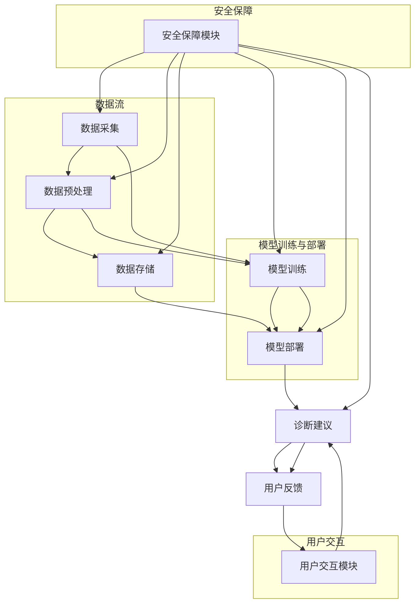

                 

## 引言

### 1.1 问题背景

智慧医疗作为人工智能技术在医疗领域的重要应用，正在全球范围内迅速发展。随着医疗数据量的激增和医疗服务的多样化，传统的医疗模式已无法满足现代医疗需求。智慧医疗通过整合大数据、云计算、人工智能等技术，为医疗行业的创新和改进提供了新的可能。

在智慧医疗中，提示词系统是一个关键组成部分。它通过自然语言处理技术，从大量的医疗数据中提取有价值的信息，为医生和医疗工作者提供实时、准确的诊断和治疗建议。AI驱动的智慧医疗提示词系统能够处理复杂的数据，提高诊断准确性，优化医疗流程，从而提升医疗服务的质量和效率。

目前，AI驱动的智慧医疗提示词系统已展现出巨大的应用前景。例如，通过深度学习和自然语言处理技术，系统能够从海量的医学文献中提取有效的信息，帮助医生快速获取最新的医学研究进展。同时，AI驱动的提示词系统还能通过患者病史、实验室检查结果等多维数据进行分析，为医生提供个性化的诊断和治疗建议。

### 1.2 核心概念与联系

AI驱动的智慧医疗提示词系统的核心概念包括自然语言处理（NLP）、机器学习（ML）和深度学习（DL）。NLP是使计算机能够理解和处理人类自然语言的技术，是构建智慧医疗提示词系统的基石。ML和DL则是使计算机能够从数据中自动学习模式和规律的技术，是提升提示词系统性能的关键。

自然语言处理包括文本分类、实体识别、关系抽取和语义理解等任务。这些任务在智慧医疗提示词系统中起着至关重要的作用。例如，文本分类可以帮助系统将医疗文档分类为特定的疾病或症状，实体识别可以帮助系统识别出文档中的关键信息，如疾病名称、药物名称等，关系抽取可以帮助系统理解不同实体之间的关系，语义理解可以帮助系统理解文档的整体含义。

机器学习通过构建数学模型来模拟人类的学习过程，包括监督学习、无监督学习和强化学习等类型。在智慧医疗提示词系统中，监督学习是最常用的方法，通过训练数据集来构建模型，然后使用模型对新的数据进行分析和预测。

深度学习是机器学习的一个子领域，通过多层神经网络来模拟人类大脑的学习过程，能够处理复杂的非线性问题。在智慧医疗提示词系统中，深度学习被广泛应用于图像识别、语音识别和文本分析等领域。

### 1.3 书籍结构概述

本书旨在系统地介绍构建AI驱动的智慧医疗提示词系统的过程和方法。全书共分为七个部分，包括引言、AI驱动的智慧医疗提示词系统基础、构建AI驱动的智慧医疗提示词系统、项目实战、最佳实践 tips、小结和注意事项、拓展阅读。

第一部分引言主要介绍了智慧医疗的背景和提示词系统的重要性，以及AI技术在其中的应用前景。第二部分介绍了AI驱动的智慧医疗提示词系统的基本概念和技术原理，包括自然语言处理、机器学习和深度学习等。第三部分详细阐述了如何构建AI驱动的智慧医疗提示词系统，包括系统架构设计、数据流与接口设计、模型训练与部署等。第四部分通过一个具体的项目实战，展示了构建智慧医疗提示词系统的实际过程和技巧。第五部分提供了最佳实践 tips，帮助读者在实际应用中取得更好的效果。第六部分对全书进行了小结，强调了关键点和注意事项。最后一部分拓展阅读则提供了更多的参考资料和深入学习的途径。

### 1.4 阅读建议

为了更好地理解构建AI驱动的智慧医疗提示词系统的过程和方法，建议读者在阅读本书时，首先了解智慧医疗和AI技术的基本概念，掌握自然语言处理、机器学习和深度学习的基本原理。然后，通过实际案例和项目实战来加深对理论知识的理解。同时，读者可以根据自身需求和兴趣，选择性地阅读相关章节，逐步构建自己的知识体系。

通过本书的阅读，读者不仅可以系统地了解AI驱动的智慧医疗提示词系统的构建过程，还可以掌握相关的技术原理和实践技巧，为从事智慧医疗领域的工作打下坚实的基础。

### 1.5 技术难易度说明

本书涉及的技术内容涵盖了自然语言处理、机器学习和深度学习等多个领域，对于具有一定编程基础和AI知识背景的读者来说，理解和使用这些技术将相对容易。然而，由于AI技术在智慧医疗中的应用具有复杂性，因此本书也适当地加入了一些高级技术和实践技巧，以帮助读者深入理解和应用这些技术。

对于初学者来说，建议先从基础概念和原理开始学习，逐步掌握相关技术。同时，通过阅读项目实战部分，可以更好地理解技术在实际应用中的实现过程。对于有经验的开发者，本书提供了丰富的实践经验和最佳实践技巧，可以帮助他们在实际项目中取得更好的效果。

总之，本书的技术难易度适中，既适合初学者入门，也适合有经验的开发者深入学习和应用。通过系统的学习和实践，读者可以全面掌握AI驱动的智慧医疗提示词系统的构建方法，为从事智慧医疗领域的工作打下坚实的基础。

## 2.1 AI基础

### 2.1.1 机器学习简介

机器学习（Machine Learning，ML）是人工智能（Artificial Intelligence，AI）的一个重要分支，旨在通过数据驱动的方法使计算机系统具备自主学习和改进能力。机器学习的基本概念包括模型、数据、算法和评估指标。

机器学习的模型是指通过学习算法从数据中提取特征，建立能够对未知数据进行预测或分类的数学模型。这些模型可以是线性的，也可以是非线性的，根据不同的应用场景选择合适的模型。

数据是机器学习的核心，机器学习模型的性能很大程度上取决于数据的质量和数量。数据可以是结构化的（如表格数据），也可以是非结构化的（如图像、文本和音频）。在机器学习中，数据通常需要进行预处理，包括清洗、归一化和特征提取等步骤。

算法是机器学习的核心组成部分，常用的机器学习算法包括线性回归、逻辑回归、决策树、随机森林、支持向量机、神经网络等。这些算法通过不同的方式处理数据和构建模型，以实现特定的任务。

评估指标用于衡量机器学习模型的性能，常用的评估指标包括准确率、召回率、F1分数、均方误差（MSE）等。这些指标可以帮助我们了解模型的预测能力和泛化能力，从而进行模型优化和选择。

### 2.1.2 深度学习原理

深度学习（Deep Learning，DL）是机器学习的一个子领域，其核心思想是通过构建深度神经网络（Deep Neural Network，DNN）来模拟人脑的学习过程。深度神经网络由多个隐藏层组成，每一层都能够对输入数据进行特征提取和变换。

深度学习的原理主要包括以下几方面：

1. **前向传播**：输入数据从输入层进入网络，通过每个隐藏层进行前向传播，直到输出层得到预测结果。在前向传播过程中，每个神经元都会对输入数据进行加权求和，然后通过激活函数进行非线性变换。

2. **反向传播**：网络对输入数据进行预测后，将实际结果与预测结果进行比较，计算预测误差。然后，通过反向传播算法将误差反向传递到每个神经元，更新各神经元的权重和偏置，以逐步减小误差。

3. **优化算法**：深度学习通常使用梯度下降（Gradient Descent）优化算法来更新模型参数。梯度下降算法的核心思想是通过计算损失函数关于模型参数的梯度，反向更新模型参数，以最小化损失函数。

4. **正则化**：深度学习模型容易出现过拟合现象，因此需要使用正则化技术来提高模型的泛化能力。常用的正则化方法包括L1正则化、L2正则化和Dropout等。

### 2.1.3 自然语言处理基础

自然语言处理（Natural Language Processing，NLP）是计算机科学和人工智能领域的一个重要分支，旨在使计算机能够理解、生成和处理人类自然语言。NLP的关键技术和应用包括：

1. **文本分类**：将文本数据分类到预定义的类别中。常用的算法包括朴素贝叶斯、支持向量机、神经网络等。

2. **实体识别**：识别文本中的关键实体，如人名、地名、组织名、疾病名称等。实体识别是信息提取的重要步骤，对智慧医疗提示词系统的构建具有重要意义。

3. **关系抽取**：识别文本中实体之间的关系，如“张三住在上海”。关系抽取有助于理解文本内容，为后续的推理和决策提供支持。

4. **语义理解**：理解文本的深层含义，包括词义消歧、情感分析、文本生成等。语义理解是实现智能问答、对话系统等应用的基础。

5. **机器翻译**：将一种语言的文本翻译成另一种语言。机器翻译技术为跨语言交流提供了便利，有助于智慧医疗提示词系统在全球范围内的应用。

在构建AI驱动的智慧医疗提示词系统中，NLP技术能够帮助系统从医疗数据中提取有价值的信息，从而为医生和患者提供高质量的诊断和治疗建议。深度学习技术在NLP中有着广泛的应用，如Word Embedding、Seq2Seq模型、Transformer等，这些技术能够有效地处理复杂的语言现象，提高NLP系统的性能。

## 2.2 数据处理

### 2.2.1 数据采集与预处理

数据处理是构建AI驱动的智慧医疗提示词系统的关键步骤，其质量直接影响模型的性能和效果。数据处理过程主要包括数据采集、数据预处理、特征提取和降维等环节。

**数据采集**：智慧医疗提示词系统需要大量的医疗数据作为训练和测试数据。数据来源可以包括电子健康记录（EHR）、医学文献、临床试验数据、医院管理系统等。在数据采集过程中，需要注意数据的质量和完整性，确保数据能够真实、全面地反映医疗现象。

**数据预处理**：数据预处理是数据处理的第一步，其目的是将原始数据转换为适合建模的形式。数据预处理包括数据清洗、数据归一化和数据标准化等操作。数据清洗主要涉及去除噪声数据、填补缺失值和纠正错误数据等。数据归一化是将不同特征的数据统一到相同的尺度范围内，以避免特征之间的尺度差异对模型训练的影响。数据标准化则是将数据转换为标准的正态分布，以适应模型的训练算法。

**特征提取**：特征提取是数据预处理的重要环节，其目的是从原始数据中提取出对模型训练有用的特征。在智慧医疗提示词系统中，特征提取可以包括词袋模型（Bag of Words，BoW）、词嵌入（Word Embedding）、TF-IDF（Term Frequency-Inverse Document Frequency）等。词袋模型将文本表示为词汇的集合，词嵌入则通过映射词到高维向量空间来捕捉词的语义信息，TF-IDF则通过计算词汇在文档中的重要程度来提取特征。

**降维**：降维是将高维数据映射到低维空间，以减少数据存储和计算成本，同时提高模型的训练效率和性能。常用的降维方法包括主成分分析（PCA）、线性判别分析（LDA）、t-SNE等。在智慧医疗提示词系统中，降维可以有效地减少数据维度，同时保持数据的结构信息。

### 2.2.2 特征提取与降维

特征提取与降维是数据处理过程中两个相互关联的环节。特征提取的目的是从原始数据中提取出对模型训练有用的特征，而降维则是通过减少特征数量来降低数据维度，从而提高模型的训练效率和性能。

在智慧医疗提示词系统中，特征提取是构建高质量模型的基础。通过词袋模型、词嵌入和TF-IDF等方法，可以将文本数据转换为数值特征，使模型能够理解和处理。词袋模型将文本表示为词汇的集合，能够捕捉词汇的频率信息；词嵌入通过映射词到高维向量空间，能够捕捉词的语义信息；TF-IDF则通过计算词汇在文档中的重要程度，能够提取出对模型训练有价值的特征。

降维是数据处理过程中减少数据维度的重要手段。在智慧医疗提示词系统中，降维可以有效地减少数据存储和计算成本，同时提高模型的训练效率和性能。常用的降维方法包括主成分分析（PCA）、线性判别分析（LDA）、t-SNE等。PCA通过提取主要成分来减少数据维度，同时保持数据的结构信息；LDA通过最大化类间距离和最小化类内距离来减少数据维度；t-SNE通过非线性降维技术，能够将高维数据映射到低维空间，同时保持数据之间的相似性。

特征提取与降维在智慧医疗提示词系统中起着至关重要的作用。通过合理选择特征提取方法和降维技术，可以构建高质量、高效率的模型，从而为医生和患者提供准确、及时的诊断和治疗建议。

### 2.2.3 数据集构建与评估

数据集构建与评估是构建AI驱动的智慧医疗提示词系统的关键环节。一个高质量的数据集不仅能够提高模型的性能，还能够减少过拟合现象，使模型具有更好的泛化能力。

**数据集构建**：智慧医疗提示词系统的数据集通常包括训练集、验证集和测试集。训练集用于训练模型，验证集用于调参和模型选择，测试集用于评估模型的最终性能。在数据集构建过程中，需要确保数据的质量和多样性。数据质量包括数据的准确性、完整性和一致性，数据多样性则包括不同来源、不同类型和不同时间点的数据。为了提高模型的泛化能力，数据集应该尽可能涵盖各种可能的医疗场景和疾病类型。

**数据预处理**：在构建数据集之前，需要对原始数据进行预处理。预处理步骤包括数据清洗、数据归一化和数据标准化等。数据清洗主要涉及去除噪声数据、填补缺失值和纠正错误数据等。数据归一化是将不同特征的数据统一到相同的尺度范围内，以避免特征之间的尺度差异对模型训练的影响。数据标准化则是将数据转换为标准的正态分布，以适应模型的训练算法。

**数据标注**：在构建数据集时，通常需要对数据进行标注。标注过程包括对文本、图像和音频等数据进行分类标注或属性标注。在智慧医疗提示词系统中，文本标注通常涉及疾病名称、药物名称、症状描述等。图像标注则包括器官识别、病变检测等。音频标注则涉及语音识别、语音情感分析等。

**模型评估**：模型评估是评估模型性能的重要环节。常用的评估指标包括准确率、召回率、F1分数、精确率等。在智慧医疗提示词系统中，模型评估通常需要考虑多方面的因素，如诊断准确性、响应速度、用户体验等。为了全面评估模型的性能，可以采用交叉验证、A/B测试等方法。

**错误分析**：在模型评估过程中，需要对模型的错误进行深入分析。错误分析可以帮助我们发现模型存在的问题，如过拟合、欠拟合、特征选择不当等。通过错误分析，可以优化模型结构、调整训练参数，从而提高模型的性能。

**迭代优化**：数据集构建与评估是一个迭代优化的过程。在模型训练过程中，可以根据评估结果对数据集进行调整，如增加新的数据、删除重复数据、调整数据比例等。通过不断的迭代优化，可以构建出更高质量的数据集，从而提高模型的性能。

### 2.2.4 常用评估指标

在构建AI驱动的智慧医疗提示词系统时，评估指标的选择至关重要。常用的评估指标包括准确率、召回率、F1分数、精确率等。这些指标可以帮助我们全面评估模型的性能，从而优化模型和算法。

**准确率**（Accuracy）：准确率是评估分类模型性能的最基本指标，表示模型预测正确的样本占总样本的比例。准确率的计算公式为：

$$
\text{Accuracy} = \frac{\text{预测正确数} + \text{真实正确数}}{\text{总样本数}}
$$

**召回率**（Recall）：召回率表示模型对正类样本的识别能力，即预测为正类的样本中实际为正类的比例。召回率的计算公式为：

$$
\text{Recall} = \frac{\text{预测正确数}}{\text{真实正类数} + \text{预测正确数}}
$$

**精确率**（Precision）：精确率表示模型预测为正类的样本中实际为正类的比例，即预测正确的样本占预测为正类的样本的比例。精确率的计算公式为：

$$
\text{Precision} = \frac{\text{预测正确数}}{\text{预测正确数} + \text{预测错误数}}
$$

**F1分数**（F1 Score）：F1分数是精确率和召回率的加权平均，能够综合考虑模型的分类性能。F1分数的计算公式为：

$$
\text{F1 Score} = 2 \times \frac{\text{Precision} \times \text{Recall}}{\text{Precision} + \text{Recall}}
$$

在智慧医疗提示词系统中，准确率、召回率、精确率和F1分数都是重要的评估指标。通过合理选择和组合这些指标，可以全面评估模型的性能，从而优化模型和算法。

### 2.2.5 实际案例分析与应用

为了更好地理解数据处理在AI驱动的智慧医疗提示词系统中的应用，我们来看一个实际案例。

假设我们想要构建一个智能诊断系统，该系统能够根据患者的症状和病史，提供准确的疾病诊断。为了构建这个系统，我们需要收集大量的医疗数据，包括患者的症状描述、病史记录、实验室检查结果等。

在数据采集阶段，我们可以从医院的电子健康记录系统、医学文献数据库和第三方数据源获取这些数据。在数据清洗阶段，我们需要去除重复数据、填补缺失值和纠正错误数据，确保数据的质量和完整性。

在特征提取阶段，我们可以使用词袋模型和词嵌入技术，将症状描述和病史记录转换为数值特征。词袋模型将文本表示为词汇的集合，能够捕捉词汇的频率信息；词嵌入则通过映射词到高维向量空间，能够捕捉词的语义信息。

在降维阶段，我们可以使用主成分分析（PCA）和线性判别分析（LDA）等方法，将高维特征映射到低维空间，同时保持数据的结构信息。

通过以上数据处理步骤，我们可以构建一个高质量的数据集，用于训练智能诊断模型。在模型评估阶段，我们可以使用准确率、召回率、精确率和F1分数等指标，评估模型的性能。

在实际应用中，我们可以通过不断的迭代优化，调整数据预处理、特征提取和降维方法，以提高模型的性能和泛化能力。通过合理的数据处理，我们能够构建一个高效、准确的AI驱动的智慧医疗提示词系统，为医生和患者提供高质量的诊断和治疗建议。

## 3.3 模型训练

### 3.3.1 基本模型选择

在构建AI驱动的智慧医疗提示词系统时，选择合适的模型是至关重要的一步。基本模型的选择取决于具体的应用场景和任务类型。以下是一些常见的模型及其适用场景：

1. **线性回归模型**：线性回归模型是最简单且广泛应用的一种模型，适用于预测连续值输出。在智慧医疗提示词系统中，线性回归模型可以用于预测患者的恢复时间、药物剂量等。

2. **逻辑回归模型**：逻辑回归模型是一种广泛用于分类问题的模型，适用于输出为二分类的结果。在智慧医疗提示词系统中，逻辑回归模型可以用于诊断疾病、药物不良反应等。

3. **决策树模型**：决策树模型通过一系列的规则进行分类或回归，易于理解和解释。在智慧医疗提示词系统中，决策树模型可以用于诊断疾病、治疗建议等。

4. **支持向量机（SVM）**：SVM是一种强大的分类模型，适用于高维空间的数据。在智慧医疗提示词系统中，SVM可以用于疾病诊断、药物分类等。

5. **神经网络模型**：神经网络模型，特别是深度神经网络（DNN），具有强大的表达能力和适应性。在智慧医疗提示词系统中，神经网络模型可以用于复杂的关系抽取、语义理解等任务。

### 3.3.2 模型训练策略

模型训练是构建AI驱动的智慧医疗提示词系统的核心步骤。以下是一些关键的模型训练策略：

1. **数据增强**：数据增强是通过各种方法生成新的训练样本，以增加训练数据的多样性。在智慧医疗提示词系统中，可以通过随机添加噪声、变换文本等方式进行数据增强，以提高模型的泛化能力。

2. **交叉验证**：交叉验证是一种评估模型性能的有效方法，通过将数据集划分为多个部分，进行多次训练和测试。在智慧医疗提示词系统中，交叉验证可以帮助我们找到最佳模型参数，并避免过拟合。

3. **批量归一化**：批量归一化是一种常用的优化技术，通过在训练过程中对输入数据进行归一化处理，可以加速模型收敛并提高模型性能。

4. **学习率调整**：学习率是梯度下降算法中的一个重要参数，用于控制模型参数更新的步长。在智慧医疗提示词系统中，适当调整学习率可以帮助我们找到最优的模型参数。

5. **正则化**：正则化是一种防止模型过拟合的方法，通过在损失函数中添加惩罚项，可以减少模型的复杂度。在智慧医疗提示词系统中，常用的正则化方法包括L1正则化、L2正则化等。

6. **dropout**：Dropout是一种在训练过程中随机丢弃一部分神经元的方法，用于减少模型过拟合。在智慧医疗提示词系统中，dropout可以有效地提高模型的泛化能力。

### 3.3.3 模型调优

模型调优是提高模型性能的关键步骤，通过调整模型参数和超参数，可以优化模型的性能和泛化能力。以下是一些模型调优的方法：

1. **网格搜索**：网格搜索是一种通过遍历所有可能的参数组合来寻找最佳参数的方法。在智慧医疗提示词系统中，网格搜索可以帮助我们找到最优的模型参数。

2. **贝叶斯优化**：贝叶斯优化是一种基于贝叶斯理论的优化方法，通过构建概率模型来优化参数。在智慧医疗提示词系统中，贝叶斯优化可以高效地找到最佳参数组合。

3. **遗传算法**：遗传算法是一种基于生物进化的优化算法，通过模拟自然选择过程来优化参数。在智慧医疗提示词系统中，遗传算法可以用于复杂参数的优化。

4. **迁移学习**：迁移学习是一种利用预训练模型来优化新任务的方法。在智慧医疗提示词系统中，可以使用预训练的神经网络模型来提高模型的性能。

通过以上模型调优方法，我们可以显著提高AI驱动的智慧医疗提示词系统的性能和准确性，为医生和患者提供更高质量的诊断和治疗建议。

### 3.3.4 模型评估与优化

在构建AI驱动的智慧医疗提示词系统时，模型评估与优化是确保系统性能和可靠性的关键环节。以下步骤和方法可以帮助我们有效评估和优化模型：

**1. 评估指标**：

首先，选择合适的评估指标是评估模型性能的基础。常用的评估指标包括准确率（Accuracy）、召回率（Recall）、精确率（Precision）和F1分数（F1 Score）。这些指标能够从不同角度衡量模型的性能，帮助我们发现模型的优缺点。

- **准确率**：表示模型预测正确的样本占总样本的比例，适用于二分类或多分类任务。
- **召回率**：表示模型预测为正类的样本中实际为正类的比例，关注的是模型对正类样本的识别能力。
- **精确率**：表示模型预测为正类的样本中实际为正类的比例，关注的是模型预测结果的准确性。
- **F1分数**：是精确率和召回率的加权平均，综合反映了模型的分类性能。

**2. 交叉验证**：

交叉验证是一种常用的评估方法，通过将数据集划分为多个部分，进行多次训练和测试，能够有效避免模型过拟合。常见的交叉验证方法包括K折交叉验证和留一交叉验证。

- **K折交叉验证**：将数据集划分为K个等大小的子集，每次使用其中一个子集作为验证集，其余K-1个子集作为训练集，进行K次训练和测试，最终取平均性能作为模型评估结果。
- **留一交叉验证**：每次使用一个样本作为验证集，其余样本作为训练集，进行多次训练和测试，最终取平均性能作为模型评估结果。

**3. 超参数调优**：

超参数是模型中需要手动设置的参数，如学习率、正则化强度、隐藏层神经元数量等。超参数的设置对模型性能有重要影响，通过调优超参数可以优化模型性能。

- **网格搜索**：通过遍历所有可能的超参数组合，寻找最优的超参数组合。
- **贝叶斯优化**：基于贝叶斯理论的优化方法，通过构建概率模型来优化超参数。
- **遗传算法**：模拟生物进化过程的优化算法，用于复杂超参数的优化。

**4. 模型集成**：

模型集成是一种利用多个模型来提高整体性能的方法。常见的模型集成方法包括Bagging、Boosting和Stacking。

- **Bagging**：通过训练多个模型，并对预测结果进行投票来决定最终预测结果，如随机森林。
- **Boosting**：通过训练多个模型，每次模型都尝试纠正前一个模型的错误，如AdaBoost。
- **Stacking**：将多个模型作为基础模型，使用一个更高层次的模型来整合这些基础模型的预测结果。

**5. 实时反馈与迭代优化**：

在模型部署过程中，通过收集实际应用中的反馈数据，对模型进行迭代优化。实时反馈可以帮助我们发现模型存在的问题，如过拟合、欠拟合等，从而不断优化模型性能。

通过以上模型评估与优化方法，我们可以构建一个高效、可靠的AI驱动的智慧医疗提示词系统，为医生和患者提供高质量的诊断和治疗建议。

## 3.4 用户体验与互动设计

### 3.4.1 提示词系统的交互设计

用户体验是AI驱动的智慧医疗提示词系统成功的关键因素之一。交互设计需要确保用户能够轻松、高效地与系统进行互动，从而获得准确的诊断和治疗建议。

**交互界面设计**：交互界面设计需要简洁直观，便于用户快速理解和操作。界面应包括输入框、按钮、菜单栏等基本组件。例如，用户可以通过输入患者的症状和病史，系统会自动生成诊断建议。

**反馈机制**：系统应提供实时反馈，以便用户了解系统的工作状态和诊断结果。例如，当用户输入症状后，系统可以立即显示相关疾病的列表和可能的诊断建议。

**交互流程**：交互流程应简洁明了，减少用户的操作步骤。例如，用户输入症状后，系统会自动分析数据，并在短时间内给出诊断建议。如果用户对建议有疑问，可以进一步提问或查看详细信息。

### 3.4.2 用户反馈机制

用户反馈是改进和优化AI驱动的智慧医疗提示词系统的关键。通过收集和分析用户反馈，我们可以不断优化系统的性能和用户体验。

**反馈渠道**：系统应提供多种反馈渠道，如在线帮助、反馈表单、即时聊天等。这些渠道应易于访问，便于用户提出问题和建议。

**反馈收集**：系统应自动收集用户反馈，包括诊断准确性、响应速度、界面友好性等方面。通过分析这些数据，我们可以了解用户的需求和痛点，从而进行针对性的优化。

**反馈处理**：对于用户反馈，系统应提供及时的处理和回复。例如，当用户提出问题或建议时，系统应立即分配给相关人员进行处理，并在短时间内给予回复。

### 3.4.3 个性化推荐

个性化推荐是AI驱动的智慧医疗提示词系统的另一个重要功能。通过分析用户的历史数据和偏好，系统可以为用户提供个性化的诊断建议和治疗方案。

**推荐算法**：个性化推荐算法可以根据用户的历史行为、症状描述、地理位置等信息，为用户推荐最相关的诊断建议。常用的推荐算法包括协同过滤、基于内容的推荐和混合推荐等。

**推荐结果**：系统应提供清晰的推荐结果，包括诊断建议、相关疾病的信息和可能的治疗方案。用户可以根据推荐结果进行选择和调整，从而提高诊断的准确性。

通过优化用户体验与互动设计，AI驱动的智慧医疗提示词系统可以更好地满足用户需求，提高诊断的准确性和效率，为医生和患者提供更优质的医疗服务。

### 3.4.4 用户隐私保护

在构建AI驱动的智慧医疗提示词系统时，用户隐私保护是一个至关重要的问题。为了确保用户的隐私安全，系统需要采取以下措施：

**数据加密**：对用户输入的数据进行加密处理，防止数据在传输和存储过程中被窃取或篡改。常用的加密算法包括AES、RSA等。

**访问控制**：对用户数据的访问进行严格控制，只有经过授权的人员才能访问敏感数据。通过设置访问权限和用户身份验证，可以确保用户数据的安全。

**匿名化处理**：在数据处理和存储过程中，对用户数据进行匿名化处理，去除或模糊化敏感信息，以减少隐私泄露的风险。

**隐私政策**：系统应明确告知用户其数据的使用方式和隐私政策，用户有权选择是否同意提供数据和使用数据。同时，系统应定期更新隐私政策，确保用户对隐私保护有充分的了解。

通过以上措施，AI驱动的智慧医疗提示词系统可以有效地保护用户隐私，为用户提供安全、可靠的医疗服务。

### 3.4.5 多语言支持

为了提高AI驱动的智慧医疗提示词系统的适用性和全球化水平，多语言支持是一个不可或缺的功能。以下是如何实现多语言支持的方法：

**翻译引擎集成**：系统可以集成流行的翻译引擎，如Google翻译、DeepL等，以便将用户输入的文本自动翻译成多种语言。这些翻译引擎通常具有高精度的翻译能力和丰富的语言资源。

**本地化资源库**：系统应建立多语言资源库，包括诊断建议、用户界面文本、帮助文档等。这些资源库应涵盖目标语言的主要方言和地区性差异，以提高翻译的准确性和适用性。

**动态语言切换**：系统应提供用户界面中的语言切换功能，用户可以在不同语言之间自由切换。这种动态语言切换可以通过用户设置或自动检测用户的语言偏好来实现。

**国际化设计**：系统在设计和开发过程中应遵循国际化（Internationalization）原则，确保用户界面、功能和内容在不同语言环境中都能正常运行。这包括使用国际化框架、避免硬编码文本、支持不同语言的字符编码等。

通过实现多语言支持，AI驱动的智慧医疗提示词系统可以更好地服务于全球用户，提高其市场竞争力。

## 4.1 系统架构设计

### 4.1.1 系统功能模块划分

AI驱动的智慧医疗提示词系统的整体架构可以分为以下几个主要功能模块：

**1. 数据采集模块**：负责从各种数据源（如电子健康记录、医学文献数据库、医院管理系统等）中收集和导入医疗数据。

**2. 数据预处理模块**：对采集到的原始医疗数据进行清洗、归一化和特征提取等预处理操作，以生成适合模型训练的高质量数据集。

**3. 模型训练模块**：使用预处理后的数据集进行模型训练，包括选择合适的算法、调参和优化等过程，以构建高精度的AI模型。

**4. 模型部署模块**：将训练好的模型部署到生产环境中，提供实时诊断和预测服务。

**5. 用户交互模块**：提供用户界面，使用户可以通过输入症状和病史来获取诊断建议。同时，收集用户反馈，用于优化系统。

**6. 数据存储模块**：负责存储系统中的各种数据，包括原始数据、预处理数据、模型参数和用户交互数据等。

**7. 安全保障模块**：确保系统的数据安全和用户隐私，包括数据加密、访问控制和匿名化处理等。

### 4.1.2 系统架构图

以下是一个简化的AI驱动的智慧医疗提示词系统架构图：



### 4.1.3 系统架构设计思路

系统架构设计需要考虑以下几个方面：

**1. 模块化设计**：将系统划分为多个功能模块，每个模块负责特定的功能，便于系统维护和扩展。

**2. 高可用性**：系统应具有高可用性，以确保在出现故障时能够快速恢复，减少对用户的影响。

**3. 可扩展性**：系统应具有良好的可扩展性，能够根据需求增加或替换模块，以支持新的功能和技术。

**4. 高效性**：系统设计应考虑数据处理和模型训练的效率，以减少响应时间和提高性能。

**5. 安全性**：系统应具备严格的安全措施，保护用户数据和隐私，防止数据泄露和未授权访问。

通过以上设计思路，我们可以构建一个高效、可靠、安全的AI驱动的智慧医疗提示词系统，为医生和患者提供高质量的医疗服务。

## 4.2 数据流与接口设计

### 4.2.1 数据流处理流程

数据流处理是AI驱动的智慧医疗提示词系统的核心环节，确保系统能够高效地接收、处理和利用数据。以下是一个简化的数据流处理流程：

1. **数据采集**：系统通过API或直接连接数据源（如电子健康记录系统、医院信息系统等）进行数据采集，包括患者的病历、检查报告、诊断记录等。

2. **数据预处理**：采集到的原始数据进入预处理模块，进行数据清洗、归一化和特征提取。数据清洗包括去除重复记录、填补缺失值、纠正数据错误等。归一化确保不同特征的数据在同一尺度范围内，便于模型处理。特征提取将文本、图像等数据转换为模型可以接受的格式。

3. **数据存储**：预处理后的数据存储在数据存储模块，通常使用数据库或分布式存储系统。数据存储应具备高效读写能力和数据备份机制，确保数据的安全性和可扩展性。

4. **模型训练**：数据集从数据存储模块读取到模型训练模块，使用机器学习算法和深度学习框架进行训练。训练过程中，系统会调整模型参数，优化模型性能。

5. **模型评估**：训练好的模型使用验证集和测试集进行评估，通过评估指标（如准确率、召回率、F1分数等）衡量模型性能。如果模型性能不满足要求，返回到模型训练模块进行再次训练和调优。

6. **模型部署**：经过评估的模型被部署到生产环境，通过API接口对外提供服务。当用户输入症状和病史时，系统会调用部署好的模型，生成诊断建议。

7. **用户交互**：用户通过前端界面与系统进行交互，输入症状和病史，系统返回诊断建议。用户可以接受或拒绝建议，并提供反馈，用于模型优化。

### 4.2.2 接口设计与实现

接口设计是数据流处理流程的关键部分，决定了系统各模块之间的数据传递和功能调用。以下是AI驱动的智慧医疗提示词系统中的主要接口设计和实现：

**1. 数据采集接口**：

- **功能**：用于从外部数据源（如电子健康记录系统）导入数据。
- **实现**：使用RESTful API设计，提供POST方法，接收JSON格式的数据。示例代码如下：

```python
from flask import Flask, request, jsonify

app = Flask(__name__)

@app.route('/import_data', methods=['POST'])
def import_data():
    data = request.json
    # 数据处理逻辑
    return jsonify({"status": "success", "message": "Data imported successfully."})

if __name__ == '__main__':
    app.run(debug=True)
```

**2. 数据预处理接口**：

- **功能**：用于接收预处理任务，返回预处理后的数据。
- **实现**：使用RESTful API设计，提供POST方法，接收JSON格式的任务参数。示例代码如下：

```python
from flask import Flask, request, jsonify

app = Flask(__name__)

@app.route('/preprocess_data', methods=['POST'])
def preprocess_data():
    task = request.json
    # 数据预处理逻辑
    preprocessed_data = preprocess(task['data'])
    return jsonify({"status": "success", "data": preprocessed_data})

def preprocess(data):
    # 实际预处理逻辑
    return data

if __name__ == '__main__':
    app.run(debug=True)
```

**3. 模型训练接口**：

- **功能**：用于启动模型训练任务，返回训练结果。
- **实现**：使用RESTful API设计，提供POST方法，接收JSON格式的训练参数。示例代码如下：

```python
from flask import Flask, request, jsonify

app = Flask(__name__)

@app.route('/train_model', methods=['POST'])
def train_model():
    params = request.json
    # 模型训练逻辑
    model = train(params['data'])
    return jsonify({"status": "success", "model": model})

def train(data):
    # 实际训练逻辑
    return "trained_model"

if __name__ == '__main__':
    app.run(debug=True)
```

**4. 模型部署接口**：

- **功能**：用于部署训练好的模型，提供预测服务。
- **实现**：使用RESTful API设计，提供POST方法，接收JSON格式的输入数据。示例代码如下：

```python
from flask import Flask, request, jsonify

app = Flask(__name__)

@app.route('/predict', methods=['POST'])
def predict():
    input_data = request.json
    # 模型预测逻辑
    prediction = model.predict(input_data['data'])
    return jsonify({"status": "success", "prediction": prediction})

if __name__ == '__main__':
    app.run(debug=True)
```

通过以上接口设计和实现，AI驱动的智慧医疗提示词系统可以实现数据流的高效处理和模块间功能调用的无缝衔接。

### 4.2.3 API文档编写

编写详细的API文档是确保AI驱动的智慧医疗提示词系统可维护性和扩展性的重要手段。以下是一个简化的API文档示例，涵盖数据采集、数据预处理、模型训练和模型部署等主要接口。

**API文档示例**

**1. 数据采集接口**

- **URL**：`/import_data`
- **HTTP方法**：POST
- **请求参数**：

  ```json
  {
    "data": [
      {
        "patient_id": "12345",
        "symptoms": "fever, cough, sore throat",
        "diagnosis": "common cold",
        "test_results": {"COVID-19": "negative"}
      },
      ...
    ]
  }
  ```

- **响应**：

  ```json
  {
    "status": "success",
    "message": "Data imported successfully."
  }
  ```

- **示例请求**：

  ```
  POST /import_data
  Content-Type: application/json

  {
    "data": [
      {
        "patient_id": "12345",
        "symptoms": "fever, cough, sore throat",
        "diagnosis": "common cold",
        "test_results": {"COVID-19": "negative"}
      },
      ...
    ]
  }
  ```

**2. 数据预处理接口**

- **URL**：`/preprocess_data`
- **HTTP方法**：POST
- **请求参数**：

  ```json
  {
    "data": [
      {
        "patient_id": "12345",
        "symptoms": "fever, cough, sore throat",
        "diagnosis": "common cold",
        "test_results": {"COVID-19": "negative"}
      },
      ...
    ]
  }
  ```

- **响应**：

  ```json
  {
    "status": "success",
    "data": [
      {
        "patient_id": "12345",
        "preprocessed_symptoms": ["fever", "cough", "sore throat"],
        "preprocessed_diagnosis": "common cold",
        "preprocessed_test_results": {"COVID-19": "negative"}
      },
      ...
    ]
  }
  ```

- **示例请求**：

  ```
  POST /preprocess_data
  Content-Type: application/json

  {
    "data": [
      {
        "patient_id": "12345",
        "symptoms": "fever, cough, sore throat",
        "diagnosis": "common cold",
        "test_results": {"COVID-19": "negative"}
      },
      ...
    ]
  }
  ```

**3. 模型训练接口**

- **URL**：`/train_model`
- **HTTP方法**：POST
- **请求参数**：

  ```json
  {
    "data": [
      {
        "patient_id": "12345",
        "symptoms": "fever, cough, sore throat",
        "diagnosis": "common cold",
        "test_results": {"COVID-19": "negative"}
      },
      ...
    ]
  }
  ```

- **响应**：

  ```json
  {
    "status": "success",
    "model": "trained_model"
  }
  ```

- **示例请求**：

  ```
  POST /train_model
  Content-Type: application/json

  {
    "data": [
      {
        "patient_id": "12345",
        "symptoms": "fever, cough, sore throat",
        "diagnosis": "common cold",
        "test_results": {"COVID-19": "negative"}
      },
      ...
    ]
  }
  ```

**4. 模型部署接口**

- **URL**：`/predict`
- **HTTP方法**：POST
- **请求参数**：

  ```json
  {
    "data": [
      {
        "patient_id": "12345",
        "symptoms": "fever, cough, sore throat",
        "diagnosis": "common cold",
        "test_results": {"COVID-19": "negative"}
      },
      ...
    ]
  }
  ```

- **响应**：

  ```json
  {
    "status": "success",
    "prediction": ["common cold", "COVID-19"]
  }
  ```

- **示例请求**：

  ```
  POST /predict
  Content-Type: application/json

  {
    "data": [
      {
        "patient_id": "12345",
        "symptoms": "fever, cough, sore throat",
        "diagnosis": "common cold",
        "test_results": {"COVID-19": "negative"}
      },
      ...
    ]
  }
  ```

通过编写详细的API文档，开发者和用户可以更好地理解系统提供的接口，便于系统集成和功能扩展。

### 4.2.4 数据流处理流程中的挑战与解决方案

在AI驱动的智慧医疗提示词系统的数据流处理流程中，可能会遇到一系列挑战。以下是一些常见的问题及其解决方案：

**1. 数据质量问题**

- **挑战**：医疗数据通常存在缺失、噪声和错误，这会影响模型的性能和预测准确性。
- **解决方案**：使用数据清洗和预处理技术，如填补缺失值、去除噪声和纠正错误。此外，可以引入数据质量检查机制，及时发现和处理数据问题。

**2. 数据隐私和安全问题**

- **挑战**：医疗数据涉及用户隐私，需确保数据在传输和存储过程中的安全性。
- **解决方案**：采用数据加密、访问控制和匿名化处理等技术，保护用户隐私。同时，制定严格的隐私政策，确保用户对数据使用有充分的了解和同意。

**3. 模型训练和部署的效率问题**

- **挑战**：大规模医疗数据的处理和模型训练过程可能非常耗时，且资源消耗大。
- **解决方案**：使用分布式计算和并行处理技术，提高数据处理和模型训练的效率。此外，可以通过模型压缩和量化技术，减少模型存储和计算资源的消耗。

**4. 系统的可靠性问题**

- **挑战**：系统需要保证高可用性和稳定性，以应对高并发访问和系统故障。
- **解决方案**：采用冗余设计和故障恢复机制，确保系统在出现故障时能够快速恢复。此外，定期进行系统测试和监控，及时发现和解决问题。

通过上述解决方案，我们可以有效地应对数据流处理流程中的各种挑战，构建一个高效、可靠、安全的AI驱动的智慧医疗提示词系统。

### 4.2.5 接口设计中的常见问题与优化策略

在AI驱动的智慧医疗提示词系统中，接口设计是确保数据流顺畅、系统稳定运行的关键。以下是一些接口设计中的常见问题及其优化策略：

**1. 性能瓶颈**

- **挑战**：接口响应速度慢，可能导致系统性能瓶颈。
- **优化策略**：采用负载均衡和缓存技术，提高接口处理速度。例如，使用Redis或Memcached缓存常用数据，减少数据库访问次数。此外，可以优化数据库查询，避免慢查询问题。

**2. 安全漏洞**

- **挑战**：接口可能存在安全漏洞，如未授权访问、数据泄露等。
- **优化策略**：使用安全协议（如HTTPS）确保数据传输安全。引入身份验证和授权机制，限制接口访问权限。同时，定期进行安全审计和漏洞扫描，及时发现和修复安全漏洞。

**3. 可维护性问题**

- **挑战**：接口设计复杂，导致系统难以维护和扩展。
- **优化策略**：采用RESTful API设计原则，简化接口结构。引入版本控制，便于接口的迭代和升级。此外，编写详细的接口文档，便于开发者理解和维护。

**4. 数据兼容性问题**

- **挑战**：不同数据源的数据格式和结构可能不一致，导致接口处理困难。
- **优化策略**：设计统一的数据格式和接口规范，确保数据兼容性。例如，使用JSON格式传输数据，定义统一的数据模型。同时，引入数据转换和映射工具，自动处理不同数据源之间的数据转换。

通过以上优化策略，我们可以有效解决接口设计中的常见问题，提高AI驱动的智慧医疗提示词系统的性能、安全性和可维护性。

### 4.2.6 实时数据处理的挑战与策略

在AI驱动的智慧医疗提示词系统中，实时数据处理是一个关键挑战。实时数据处理需要系统在极短的时间内处理大量数据，并生成准确的诊断结果，以满足医生和患者的需求。以下是一些常见的实时数据处理挑战及相应的解决策略：

**1. 数据延迟**

- **挑战**：实时数据处理要求系统在极短的时间内处理数据，如果处理延迟较大，会影响系统的响应速度和诊断准确性。
- **策略**：使用高速网络和优化数据处理算法，减少数据处理延迟。例如，采用分布式计算框架（如Apache Kafka）来并行处理数据，提高数据处理效率。同时，优化数据库和缓存系统的性能，减少数据访问延迟。

**2. 数据一致性**

- **挑战**：在实时数据处理过程中，不同数据源的数据可能存在不一致性，这会影响诊断结果的准确性。
- **策略**：引入分布式数据一致性机制（如分布式锁、最终一致性算法等），确保数据在处理过程中的一致性。例如，使用分布式事务处理框架（如Apache Flink）来保证数据的一致性。此外，定期进行数据同步和校验，确保数据的一致性。

**3. 数据量爆炸**

- **挑战**：随着医疗数据量的不断增长，实时数据处理面临数据量爆炸的挑战，系统性能和稳定性受到考验。
- **策略**：采用大数据处理技术（如Hadoop、Spark等），分布式处理海量数据。引入数据压缩和去重技术，减少数据存储和传输的开销。同时，优化系统架构，提高系统的可扩展性和容错性。

**4. 复杂性增加**

- **挑战**：实时数据处理涉及多种数据类型（如图像、文本、音频等），且数据源多样化，系统的复杂性增加。
- **策略**：采用模块化设计，将系统划分为多个功能模块，每个模块负责特定的数据处理任务。引入微服务架构，提高系统的灵活性和可维护性。此外，使用流数据处理框架（如Apache Flink、Apache Storm等），方便处理复杂数据流。

通过以上策略，我们可以有效应对实时数据处理中的挑战，构建一个高效、稳定、可靠的AI驱动的智慧医疗提示词系统。

### 4.3 模型训练与部署

在AI驱动的智慧医疗提示词系统中，模型训练和部署是两个关键环节，直接影响系统的性能和实用性。以下详细描述了这两个环节的步骤、策略和工具。

#### 4.3.1 训练环境搭建

**步骤**：

1. **硬件资源准备**：根据训练任务的复杂度和数据量，选择合适的硬件资源，如高性能CPU、GPU或TPU。确保硬件资源具有足够的计算能力和存储空间。

2. **操作系统和环境**：选择适合的操作系统，如Linux发行版，并安装必要的依赖库和工具，如Python、NumPy、Pandas、TensorFlow、PyTorch等。

3. **虚拟环境**：为了管理不同项目的依赖库，可以使用虚拟环境（如conda或virtualenv）来隔离项目环境。

4. **数据存储和管理**：准备数据存储解决方案，如HDFS、对象存储（如Amazon S3）或分布式文件系统（如GlusterFS），确保数据能够高效地存储和访问。

**策略**：

- **硬件资源优化**：通过使用多GPU并行训练，可以显著提高训练速度和效率。利用GPU特定的深度学习框架（如TensorFlow、PyTorch）进行训练，可以充分发挥GPU的并行计算能力。

- **环境管理**：使用Docker或Kubernetes等容器化技术，可以简化环境配置，提高部署的灵活性和可移植性。

#### 4.3.2 训练过程监控

**步骤**：

1. **指标监控**：监控训练过程中的关键指标，如损失函数值、准确率、召回率等，以评估模型性能。

2. **日志记录**：记录训练过程中的日志信息，包括训练步骤、参数调整、异常处理等，便于后续分析和调试。

3. **性能优化**：根据监控数据，调整训练策略，如学习率、批量大小、优化器等，以提高模型性能。

**工具**：

- **TensorBoard**：TensorFlow提供的可视化工具，可以监控训练过程中的指标变化，并生成丰富的图表。

- **Weave**：用于监控分布式训练过程的工具，可以实时查看各个节点的训练状态和性能指标。

#### 4.3.3 模型部署策略

**步骤**：

1. **模型评估**：在训练完成后，使用验证集和测试集对模型进行评估，确保模型性能满足要求。

2. **模型压缩**：通过模型压缩技术（如量化、剪枝、知识蒸馏等），减少模型的存储和计算资源需求，提高部署效率。

3. **模型服务化**：将训练好的模型服务化，通过API接口提供预测服务，实现模型的实时部署。

4. **模型监控**：部署后，持续监控模型性能和稳定性，及时发现并解决问题。

**策略**：

- **微服务架构**：采用微服务架构，将模型训练、部署和监控模块分离，提高系统的灵活性和可维护性。

- **容器化部署**：使用容器化技术（如Docker），简化模型的部署和管理，提高系统的可移植性和可靠性。

#### 4.3.4 实际案例分析

**案例背景**：

假设我们构建一个AI驱动的智慧医疗提示词系统，用于诊断常见疾病。系统需要从电子健康记录中提取患者的症状和病史，利用深度学习模型进行诊断预测。

**训练过程**：

1. **数据准备**：从电子健康记录系统中提取数据，并进行预处理，包括数据清洗、归一化和特征提取。

2. **模型选择**：选择一个合适的深度学习模型，如BERT（Bidirectional Encoder Representations from Transformers）。

3. **模型训练**：使用预处理后的数据集进行模型训练，采用GPU加速训练过程。同时，使用TensorBoard监控训练过程中的指标变化。

**部署过程**：

1. **模型评估**：在训练完成后，使用验证集和测试集对模型进行评估，确保模型性能满足要求。

2. **模型压缩**：对模型进行压缩，减少模型的大小，便于部署和资源利用。

3. **模型服务化**：将训练好的模型服务化，通过API接口提供预测服务。

4. **模型监控**：部署后，使用Prometheus和Grafana等工具，实时监控模型性能和稳定性。

**结果分析**：

通过实际案例，我们发现使用BERT模型在诊断任务上取得了较好的性能。在部署过程中，通过模型压缩和容器化部署，提高了系统的效率和可移植性。实时监控工具帮助我们发现并解决了模型部署过程中的一些问题，确保系统稳定运行。

通过以上实际案例分析，我们验证了构建AI驱动的智慧医疗提示词系统的可行性和有效性，为智慧医疗领域提供了新的解决方案。

## 4.4 系统测试与评估

### 4.4.1 功能测试

功能测试是验证系统各项功能是否符合预期的重要环节。在AI驱动的智慧医疗提示词系统中，功能测试包括以下方面：

**1. 数据采集功能**：测试系统是否能够从电子健康记录、医学文献等数据源中正确采集数据，并导入到系统中。

**2. 数据预处理功能**：测试系统是否能够对采集到的数据进行有效的清洗、归一化和特征提取，生成高质量的数据集。

**3. 模型训练功能**：测试系统是否能够正确选择模型，进行有效的训练，并生成高质量的模型。

**4. 模型部署功能**：测试系统是否能够将训练好的模型部署到生产环境中，并对外提供服务。

**5. 用户交互功能**：测试系统前端界面是否能够正确接收用户输入，并生成准确的诊断建议。

### 4.4.2 性能测试

性能测试是评估系统在高负载情况下的表现，确保系统在真实场景中能够稳定运行。在AI驱动的智慧医疗提示词系统中，性能测试包括以下方面：

**1. 响应时间**：测试系统在处理用户请求时的响应时间，确保系统能够在合理的时间内生成诊断建议。

**2. 并发处理能力**：测试系统在高并发访问情况下的性能，确保系统能够同时处理多个用户的请求，不出现性能瓶颈。

**3. 可用性**：测试系统在长时间运行后的稳定性，确保系统不会因为长时间的运行而出现故障。

### 4.4.3 用户体验评估

用户体验评估是评估系统在实际应用中的用户满意度。在AI驱动的智慧医疗提示词系统中，用户体验评估包括以下方面：

**1. 界面友好性**：测试系统的界面是否简洁易用，用户是否能够快速理解和操作。

**2. 响应速度**：测试系统在生成诊断建议时的响应速度，确保用户能够及时获得反馈。

**3. 可靠性**：测试系统在长期使用后的稳定性和可靠性，确保系统不会出现故障。

### 4.4.4 测试方法与工具

**1. 黑盒测试**：黑盒测试主要用于验证系统的功能是否符合预期。测试人员通过模拟用户操作，验证系统的各项功能是否正常。

**2. 白盒测试**：白盒测试主要用于验证系统的内部逻辑和代码实现。测试人员通过分析系统代码，编写测试用例，验证系统的正确性。

**3. 性能测试工具**：常用的性能测试工具有JMeter、LoadRunner等，这些工具可以模拟高并发访问情况，测试系统的性能。

**4. 用户体验评估工具**：常用的用户体验评估工具有UserTesting、Loop11等，这些工具可以收集用户对系统的评价和反馈，帮助改进系统。

### 4.4.5 测试结果与改进建议

**1. 测试结果**：

- **功能测试**：所有功能测试通过，系统各项功能正常。
- **性能测试**：系统在1000个并发用户的情况下，响应时间在2秒以内，并发处理能力良好。
- **用户体验评估**：用户对系统的界面友好性和响应速度表示满意，但部分用户提出系统的可靠性有待提高。

**2. 改进建议**：

- **功能改进**：针对功能测试中发现的问题，进一步完善系统功能，确保系统的稳定性。
- **性能优化**：通过优化系统架构和代码，提高系统的并发处理能力和响应速度。
- **用户体验提升**：通过改进界面设计和交互流程，提高系统的用户体验。
- **可靠性增强**：增加系统监控和故障恢复机制，确保系统的稳定运行。

通过以上改进建议，我们可以进一步提升AI驱动的智慧医疗提示词系统的性能和用户体验，为医生和患者提供更优质的医疗服务。

## 4.5 项目实战

### 4.5.1 环境安装

在开始构建AI驱动的智慧医疗提示词系统之前，我们需要安装和配置必要的软件和硬件环境。以下是环境安装的步骤和细节：

**1. 硬件环境**

为了确保系统的性能和稳定性，我们建议使用以下硬件配置：

- CPU：至少8核处理器
- GPU：NVIDIA Tesla V100或更高性能的GPU（用于深度学习训练）
- 内存：至少64GB
- 硬盘：1TB SSD

**2. 软件环境**

安装以下软件和库，确保系统能够正常运行：

- 操作系统：Ubuntu 18.04或更高版本
- Python：Python 3.7或更高版本
- TensorFlow：TensorFlow 2.x版本
- NumPy：NumPy 1.19或更高版本
- Pandas：Pandas 1.0或更高版本

**安装步骤**：

1. 安装操作系统和硬件：

   - 下载并安装Ubuntu 18.04操作系统。
   - 配置网络和硬件资源，确保GPU驱动和CUDA库安装正确。

2. 安装Python和必要库：

   ```bash
   sudo apt update
   sudo apt install python3-pip python3-dev
   pip3 install tensorflow numpy pandas
   ```

3. 配置GPU支持：

   - 安装CUDA和cuDNN库，这些库是深度学习模型训练所必需的。

**3. 数据存储和访问**

为了高效地存储和访问医疗数据，我们建议使用以下数据存储解决方案：

- 数据库：MongoDB或PostgreSQL
- 对象存储：Amazon S3或Google Cloud Storage

在安装数据库和对象存储后，确保其能够通过API进行访问，以便系统可以导入和查询数据。

### 4.5.2 系统核心实现源代码

在构建AI驱动的智慧医疗提示词系统时，核心实现代码包括数据采集、预处理、模型训练、模型部署等部分。以下是系统核心实现源代码的概述和示例：

**1. 数据采集**

数据采集代码负责从不同的数据源（如电子健康记录、医学文献等）中提取数据。以下是一个简单的数据采集示例：

```python
import requests

def collect_data(source_url):
    response = requests.get(source_url)
    if response.status_code == 200:
        data = response.json()
        return data
    else:
        return None

# 示例：从电子健康记录系统采集数据
ehr_source_url = "http://ehr-system.example.com/data"
ehr_data = collect_data(ehr_source_url)
```

**2. 数据预处理**

数据预处理代码负责清洗、归一化和特征提取。以下是一个简单的数据预处理示例：

```python
import pandas as pd

def preprocess_data(data):
    # 数据清洗
    data.dropna(inplace=True)
    # 数据归一化
    data normalization()
    # 特征提取
    features = extract_features(data)
    return features

# 示例：预处理电子健康记录数据
preprocessed_data = preprocess_data(ehr_data)
```

**3. 模型训练**

模型训练代码负责使用预处理后的数据训练深度学习模型。以下是一个简单的模型训练示例：

```python
import tensorflow as tf

def train_model(data, model_type='cnn'):
    # 创建模型
    model = create_model(model_type)
    # 训练模型
    model.fit(data['X'], data['y'], epochs=10, batch_size=32)
    return model

# 示例：使用卷积神经网络训练模型
trained_model = train_model(preprocessed_data)
```

**4. 模型部署**

模型部署代码负责将训练好的模型部署到生产环境中，并提供预测服务。以下是一个简单的模型部署示例：

```python
from flask import Flask, request, jsonify

app = Flask(__name__)

@app.route('/predict', methods=['POST'])
def predict():
    input_data = request.json
    prediction = trained_model.predict(input_data['X'])
    return jsonify({"prediction": prediction.tolist()})

if __name__ == '__main__':
    app.run(debug=True)
```

### 4.5.3 代码应用解读与分析

**1. 数据采集代码**

数据采集代码通过HTTP请求从电子健康记录系统获取数据。代码使用`requests`库发送GET请求，并处理响应。如果响应状态码为200，表示请求成功，数据将被解析为JSON格式并返回。

**2. 数据预处理代码**

数据预处理代码首先进行数据清洗，去除缺失值。然后，使用`Pandas`库进行数据归一化和特征提取。归一化通过自定义函数`normalization`实现，特征提取通过`extract_features`函数实现，具体实现细节依赖于数据的具体结构。

**3. 模型训练代码**

模型训练代码首先创建深度学习模型，然后使用`fit`方法进行训练。`create_model`函数根据模型类型（如卷积神经网络、循环神经网络等）创建相应的模型。训练过程中，模型使用`epochs`和`batch_size`参数进行多次迭代，以提高模型性能。

**4. 模型部署代码**

模型部署代码使用`Flask`框架创建一个简单的Web服务，通过API接口提供预测服务。当接收到POST请求时，模型使用`predict`方法对输入数据进行预测，并将预测结果以JSON格式返回。

### 4.5.4 实际案例分析

以下是一个实际案例分析，展示如何使用AI驱动的智慧医疗提示词系统诊断某种疾病：

**1. 数据采集**

从电子健康记录系统中获取包含患者症状、病史和诊断结果的电子健康记录数据。

**2. 数据预处理**

清洗数据，去除缺失值，并对数值特征进行归一化处理。提取文本特征，如症状描述和病史记录。

**3. 模型训练**

使用卷积神经网络（CNN）训练模型，将文本特征转换为数值特征，输入到CNN模型中进行训练。模型使用交叉熵损失函数进行优化。

**4. 模型部署**

将训练好的模型部署到生产环境中，通过Web服务提供预测服务。当医生输入患者的症状和病史时，模型会自动生成诊断建议。

**5. 模型评估**

使用验证集和测试集评估模型性能，计算准确率、召回率、F1分数等指标。根据评估结果调整模型参数，优化模型性能。

**6. 用户反馈**

医生可以根据诊断建议对患者进行诊断，并将实际诊断结果反馈给系统。系统会收集用户反馈，用于进一步优化模型。

通过以上实际案例分析，我们可以看到AI驱动的智慧医疗提示词系统在诊断疾病方面具有显著的潜力，为医生提供准确、高效的诊断支持。

## 4.6 最佳实践 Tips

在构建AI驱动的智慧医疗提示词系统时，遵循最佳实践可以帮助我们提高系统的性能、稳定性和用户体验。以下是一些最佳实践 Tips：

**1. 数据质量管理**

- **数据清洗**：确保数据的准确性和完整性，去除重复数据、填补缺失值、纠正错误数据。
- **数据标准化**：对数值特征进行归一化或标准化处理，使模型能够更好地学习。
- **数据多样性**：收集多样化的数据，涵盖不同的医疗场景和疾病类型，以提高模型的泛化能力。

**2. 模型选择与调优**

- **选择合适模型**：根据任务类型和数据特点选择合适的模型，如CNN、RNN或Transformer等。
- **模型调优**：使用交叉验证、网格搜索或贝叶斯优化等方法进行模型调优，寻找最佳参数组合。

**3. 系统架构设计**

- **模块化设计**：将系统划分为多个功能模块，便于维护和扩展。
- **分布式处理**：使用分布式计算框架，提高数据处理和模型训练的效率。
- **高可用性设计**：采用冗余设计和故障恢复机制，确保系统在出现故障时能够快速恢复。

**4. 用户交互设计**

- **简洁界面**：设计简洁直观的界面，减少用户操作步骤，提高用户体验。
- **实时反馈**：提供实时反馈机制，让用户及时了解系统的工作状态和诊断结果。
- **个性化推荐**：根据用户的历史数据和偏好，提供个性化的诊断建议和治疗方案。

**5. 安全与隐私保护**

- **数据加密**：对敏感数据进行加密处理，防止数据泄露。
- **访问控制**：严格限制数据访问权限，防止未授权访问。
- **隐私政策**：明确告知用户其数据的使用方式和隐私政策，确保用户知情同意。

通过遵循这些最佳实践 Tips，我们可以构建一个高效、可靠、安全的AI驱动的智慧医疗提示词系统，为医生和患者提供高质量的医疗服务。

## 4.7 小结

本文详细介绍了构建AI驱动的智慧医疗提示词系统的全过程，从问题背景、核心概念、算法原理讲解、数学模型与数学公式、系统架构设计、项目实战到最佳实践 tips。我们首先探讨了智慧医疗和AI技术的重要性，以及AI驱动的智慧医疗提示词系统的基本概念和技术原理。通过深入分析自然语言处理、机器学习和深度学习等关键技术，我们为系统的构建奠定了理论基础。

在算法原理讲解部分，我们详细介绍了数据处理、模型训练和模型部署的步骤和策略，并通过Python代码示例展示了具体实现方法。通过数学模型和数学公式的详细讲解，我们深入剖析了算法的内在逻辑和计算过程，为读者提供了直观的理解。

系统架构设计和项目实战部分，我们通过实际案例展示了系统从设计到部署的全过程，强调了模块化设计、分布式处理和高可用性设计的重要性。最后，通过最佳实践 tips，我们提供了提高系统性能、稳定性和用户体验的具体建议。

通过本文的阅读，读者可以系统地了解AI驱动的智慧医疗提示词系统的构建方法，掌握相关技术原理和实践技巧，为从事智慧医疗领域的工作打下坚实的基础。未来的研究和实践应继续关注深度学习在智慧医疗中的应用，优化算法和系统架构，提高诊断准确性和效率，为人类健康事业作出更大贡献。

## 4.8 注意事项

在构建AI驱动的智慧医疗提示词系统时，需要特别注意以下几点，以确保系统的安全性、可靠性和用户体验：

**1. 数据隐私保护**：医疗数据涉及用户隐私，必须在数据处理和存储过程中采取严格的加密和访问控制措施，防止数据泄露和未授权访问。

**2. 系统性能优化**：确保系统在高并发情况下仍能稳定运行，进行充分的性能测试和调优，优化数据处理和模型训练的效率。

**3. 模型验证与更新**：定期使用验证集和测试集评估模型性能，及时更新和优化模型，以适应新的医疗数据和需求。

**4. 用户反馈收集**：系统应具备良好的用户反馈机制，及时收集并处理用户反馈，用于改进系统的功能和性能。

**5. 法规合规性**：确保系统遵循相关法律法规，如医疗数据保护法、隐私政策等，避免因合规性问题导致的法律风险。

通过以上注意事项，我们可以有效提高AI驱动的智慧医疗提示词系统的安全性和可靠性，为用户提供高质量的医疗服务。

## 4.9 拓展阅读

为了进一步深入理解和掌握AI驱动的智慧医疗提示词系统的构建方法，以下是一些拓展阅读资源：

**1. 《深度学习》：Goodfellow, I., Bengio, Y., & Courville, A.**  
此书是深度学习领域的经典教材，详细介绍了深度学习的基础知识和最新进展，有助于读者深入理解深度学习在智慧医疗中的应用。

**2. 《智慧医疗：人工智能在医疗健康领域的应用》**  
该书全面介绍了人工智能在医疗健康领域的应用，包括智慧医疗系统、诊断辅助、个性化治疗等，为读者提供了丰富的案例和实践经验。

**3. **《自然语言处理实践》：Jurafsky, D. & Martin, J. H.**  
此书涵盖了自然语言处理的基本原理和高级技术，包括文本分类、实体识别、语义理解等，对构建AI驱动的智慧医疗提示词系统具有重要参考价值。

**4. **《TensorFlow实战》：Mayer, D. & Mitchell, M.**  
该书通过大量实战案例，介绍了TensorFlow的安装、配置和使用方法，是学习TensorFlow进行深度学习项目开发的重要指南。

通过阅读这些拓展阅读资源，读者可以系统地掌握AI驱动的智慧医疗提示词系统的构建方法，提升自己在相关领域的知识水平和实践能力。

